> **한 줄 요약**: 확장성·가용성·일관성은 서로 트레이드오프 관계이며, CAP/PACELC 정리가 분산 시스템 설계의 나침반이다.

## 왜 시스템 디자인 기초가 중요한가?

식당을 상상해 보세요. 주방장 한 명, 홀 직원 한 명일 때는 5명 손님을 완벽하게 처리합니다. 손님이 500명이 되면? 주방장 혼자서는 절대 감당 불가입니다. 해결책은 세 가지입니다. **더 빠른 주방장으로 교체(수직 확장)**, **주방장을 여러 명 고용(수평 확장)**, 또는 **여러 지점을 내고 손님을 분산(분산 시스템)**.

대규모 소프트웨어 시스템도 정확히 같은 문제를 겪습니다. 카카오, 네이버, 쿠팡이 수천만 명의 사용자를 어떻게 감당하는지, 그 설계 원칙을 이해하는 것이 **시스템 디자인**입니다.

면접에서도, 실무에서도 이 기초 개념들의 트레이드오프를 명확히 이해해야 올바른 아키텍처 결정을 내릴 수 있습니다. "캐시를 쓰면 빠르겠지"가 아니라 "어떤 캐시 전략을 왜 써야 하고, 어떤 장애가 날 수 있는지"를 말할 수 있어야 합니다.

---

## 1. 확장성 (Scalability)

### 확장성이란? — "어떻게 트래픽 증가에 대응하는가"

확장성은 단순히 "많은 트래픽을 처리할 수 있는가"를 넘어, 트래픽이 10배 늘었을 때 시스템이 어떻게 반응하는가를 의미합니다. 이상적인 확장성은 트래픽이 10배 늘면 비용도 10배만 늘고 성능은 유지되는 것입니다.

#### 수직 확장 (Vertical Scaling) — Scale Up

더 강력한 단일 서버로 교체하는 방식입니다. 회사 컴퓨터 RAM이 부족하면 8GB에서 64GB로 업그레이드하는 것과 같습니다.

```
[서버 A: CPU 4코어, RAM 16GB]
          ↓ 업그레이드
[서버 A: CPU 128코어, RAM 1TB]
```

**왜 쉬운가**: 애플리케이션 코드를 한 줄도 바꾸지 않아도 됩니다. 서버 간 데이터 동기화 문제가 없습니다. 빠른 성장에 즉각 대응 가능합니다.

**왜 결국 한계에 부딪히는가**: 하드웨어에는 물리적 상한이 있습니다. 더 치명적인 문제는 단일 장애점(SPOF)입니다. 서버 한 대가 죽으면 전체 서비스가 중단됩니다. 고사양 서버일수록 비용이 기하급수적으로 증가합니다. 8코어 서버를 32코어로 업그레이드하면 4배가 아니라 10배 이상 비쌀 수 있습니다.

#### 수평 확장 (Horizontal Scaling) — Scale Out

동일한 서버 여러 대를 로드밸런서 뒤에 두는 방식입니다. 주방장 한 명을 더 빠르게 만드는 게 아니라, 주방장을 여러 명 고용하는 것입니다.

```
[서버 A: CPU 4코어, RAM 16GB]
[서버 B: CPU 4코어, RAM 16GB]
[서버 C: CPU 4코어, RAM 16GB]
          ↕ 로드밸런서
        [사용자 트래픽]
```

**왜 대규모 서비스가 이 방식을 선택하는가**: 이론상 무한 확장 가능합니다. 서버 1대가 죽어도 나머지가 처리를 이어받습니다. 범용 저가 서버를 조합해 비용을 크게 절약할 수 있습니다.

**왜 복잡한가**: 서버가 여러 대가 되는 순간 "상태(State) 공유" 문제가 생깁니다. 로컬 메모리에 세션을 저장하던 애플리케이션은 서버가 2대가 되는 순간, 로그인한 서버가 아닌 서버로 요청이 가면 세션을 잃어버립니다. **Redis 같은 분산 세션 저장소로 전환이 필수**입니다. 이걸 간과하고 수평 확장을 하면 사용자가 갑자기 로그아웃되는 장애가 납니다.

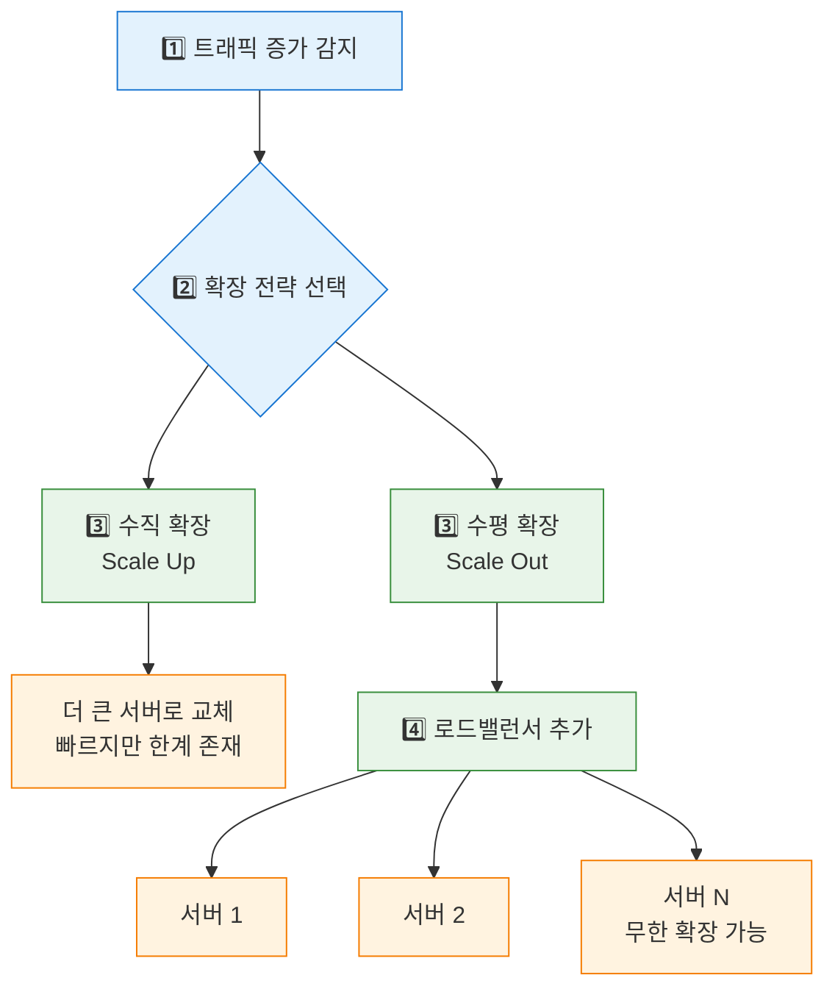

### 확장성 측정 지표

| 지표 | 설명 | 실무 예시 |
|------|------|----------|
| TPS (Transactions Per Second) | 초당 처리 건수 | 결제 시스템: 1만 TPS |
| QPS (Queries Per Second) | 초당 쿼리 수 | 검색 서비스: 100만 QPS |
| P99 응답 시간 | 99번째 백분위 응답시간 | 쿠팡: P99 < 200ms |
| 처리량 (Throughput) | 단위 시간당 데이터 처리량 | Kafka: 1GB/s |

P99를 왜 평균(P50)이 아닌 기준으로 쓸까요? 1000명 중 999명이 10ms 안에 응답받는데 1명이 10초를 기다린다면, 평균은 좋아 보이지만 실제로 그 1명은 서비스를 떠납니다. 대규모 서비스에서 1%는 수십만 명입니다.

---

## 2. 가용성 (Availability)

### 가용성이란? — "얼마나 자주 살아있는가"

**시스템이 정상적으로 작동하는 시간의 비율**입니다. 편의점이 24시간 365일 운영된다면 가용성 100%입니다. 하루 1시간 닫으면 가용성 95.8%입니다.

```
가용성(%) = (정상 운영 시간) / (전체 시간) × 100
```

### "나인(Nine)" 표기법 — 숫자가 직관적이지 않은 이유

| 표기 | 가용성 | 월 다운타임 | 연간 다운타임 |
|------|--------|------------|--------------|
| 2 Nines | 99% | 7.2시간 | 3.65일 |
| 3 Nines | 99.9% | 43.8분 | 8.76시간 |
| 4 Nines | 99.99% | 4.38분 | 52.6분 |
| 5 Nines | 99.999% | 26.3초 | 5.26분 |
| 6 Nines | 99.9999% | 2.63초 | 31.5초 |

99%와 99.99%의 차이는 작아 보이지만, 연간 다운타임은 3.65일 vs 52분입니다. 금융·의료 시스템에서 4 Nines를 달성하려면 연간 모든 장애와 배포 다운타임을 합쳐 52분 이내여야 합니다. 배포 한 번에 5분이 걸리면 1년에 10번밖에 배포 못합니다. 이 제약 때문에 **무중단 배포(블루/그린, 카나리)**가 필수입니다.

### MTBF와 MTTR — 가용성을 높이는 두 가지 축

```
MTBF (Mean Time Between Failures): 평균 장애 간격
MTTR (Mean Time To Recovery): 평균 복구 시간

가용성 = MTBF / (MTBF + MTTR)
```

MTBF = 100시간, MTTR = 1시간이면 가용성 99.01%입니다. MTTR을 0.1시간으로 줄이면 가용성 99.9%가 됩니다. **가용성을 높이는 방법은 두 가지입니다. 장애 자체를 덜 나게(MTBF 증가), 장애가 나도 빨리 복구되게(MTTR 감소).** 자동화된 롤백, 헬스체크, Auto Scaling이 모두 MTTR 감소를 위한 것입니다.

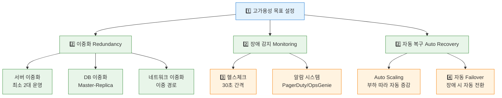

### 면접 포인트

> "99.99% 가용성을 어떻게 달성하나요?" — 단순히 "이중화"라고 답하면 안 됩니다. **배포 전략(블루/그린), DB 페일오버 시간(보통 30~60초), 그 동안의 요청 처리 방법(큐잉/재시도)**까지 구체적으로 답해야 합니다.

---

## 3. 일관성 (Consistency)

### 일관성이란? — "모든 노드가 같은 데이터를 보는가"

은행 계좌에서 A가 100만원을 이체했을 때, 전 세계 어느 ATM에서 조회해도 즉시 잔액이 업데이트되어야 한다면 **강한 일관성**입니다. 반면 몇 초 후에 반영되어도 괜찮다면 **최종 일관성**입니다.

왜 항상 강한 일관성을 쓰지 않을까요? 서울 서버에서 데이터를 썼을 때 뉴욕 서버에도 즉시 반영되려면, 서울이 뉴욕에게 "확인했어?"를 기다려야 합니다. 서울-뉴욕 왕복 지연은 150ms입니다. 모든 쓰기가 150ms씩 느려집니다. SNS 좋아요처럼 초당 수백만 건이 발생하는 연산에 강한 일관성을 적용하면 성능이 수십 배 저하됩니다.

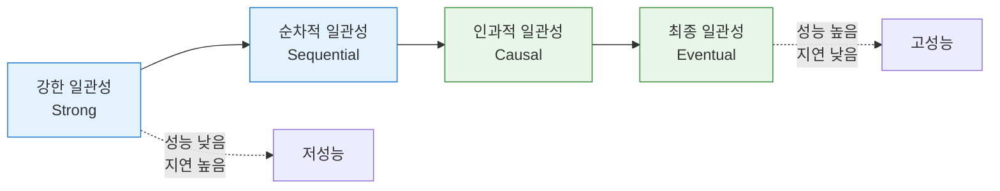

| 일관성 수준 | 설명 | 실무 사용 예 |
|------------|------|------------|
| 강한 일관성 | 모든 읽기에서 최신 쓰기 반환 | 금융 거래, 재고 관리 |
| 순차적 일관성 | 모든 노드가 같은 순서로 작업 관찰 | 분산 락, Zookeeper |
| 인과적 일관성 | 원인-결과 관계 보장 | SNS 댓글, 게시물 좋아요 |
| 최종 일관성 | 결국에는 동일한 값으로 수렴 | DNS, 쇼핑몰 조회수 |

일관성 수준을 잘못 선택하면 어떤 장애가 날까요? 쇼핑몰 재고를 최종 일관성으로 관리하면 "마지막 1개 남은 상품"을 여러 명이 동시에 구매하는 오버셀링이 발생합니다. 반대로 SNS 좋아요를 강한 일관성으로 처리하면 매 좋아요마다 분산 락을 잡아야 해 성능이 수십 배 저하됩니다.

---

## 4. CAP 정리

### CAP 정리란?

분산 시스템에서 **세 가지 속성 중 동시에 두 가지만 보장 가능**하다는 이론입니다 (Eric Brewer, 2000년).

- **C (Consistency)**: 모든 노드가 같은 데이터를 봄
- **A (Availability)**: 모든 요청이 응답을 받음 (에러 포함)
- **P (Partition Tolerance)**: 네트워크 분리가 발생해도 동작

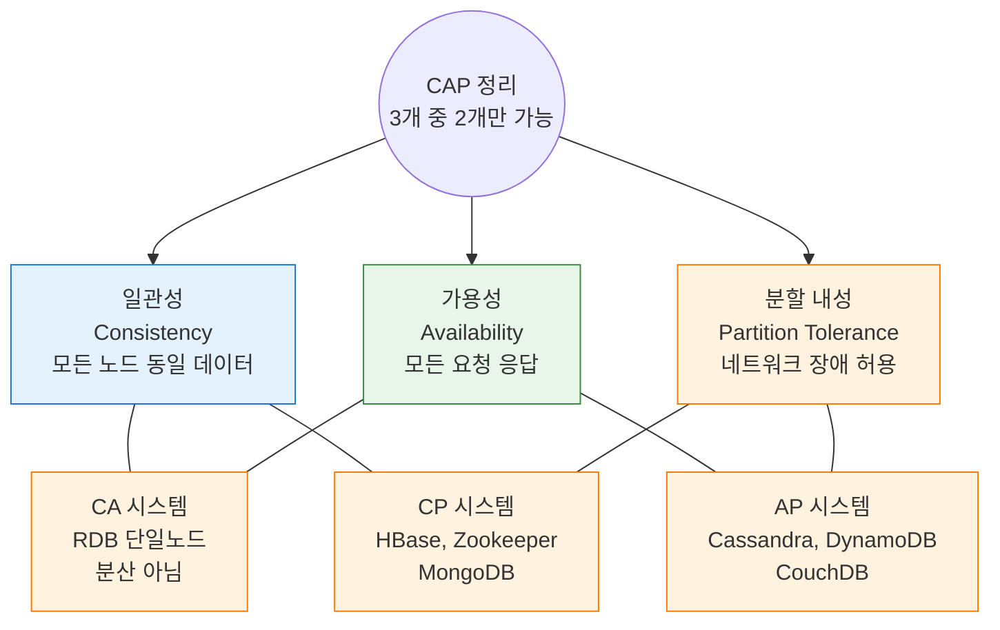

### 왜 P를 항상 선택해야 하는가

분산 시스템에서 네트워크 장애는 선택사항이 아닙니다. AWS 서울 리전과 도쿄 리전 사이 네트워크가 잠깐 끊기는 일은 연간 수십 번 발생합니다. P를 포기하면 "네트워크가 절대 끊기지 않는다"를 가정해야 하는데, 이는 물리 법칙을 거스르는 것입니다. 따라서 실제 선택은 항상 **C vs A**입니다.

```
[데이터센터 A] ----X---- [데이터센터 B]
    서버 1,2              서버 3,4

네트워크 장애 발생!

CP 선택 (예: Zookeeper):
  → 서버 3,4에 대한 요청 거부 (에러 반환)
  → 가용성 포기, 일관성 유지
  → 금융, 결제 시스템에 적합

AP 선택 (예: Cassandra):
  → 서버 3,4가 오래된 데이터로 응답
  → 일관성 포기, 가용성 유지
  → SNS, 쇼핑몰 상품 목록에 적합
```

이 선택이 잘못되면 어떤 일이 생길까요? 재고 관리 시스템에서 AP를 선택했습니다. 네트워크 분할 중 두 데이터센터가 독립적으로 "재고 1개 남음"을 각각 차감합니다. 네트워크 복구 후 재고가 -1이 됩니다. 없는 물건을 판 것입니다.

### 시스템별 CAP 위치

| 시스템 | CAP 분류 | 왜 이 분류인가 |
|--------|---------|-------------|
| MySQL (단일 노드) | CA | 분산 아님, 네트워크 분할 없음 |
| MySQL Cluster | CP | 파티션 시 쓰기 거부 |
| Cassandra | AP | 파티션 시 오래된 데이터로 응답 |
| HBase | CP | HDFS 의존, 일관성 우선 |
| DynamoDB | AP (기본) | 최종 일관성이 기본값 |
| Redis Cluster | AP | 마스터 장애 시 가용성 우선 |
| Zookeeper | CP | 리더 선출로 일관성 보장 |
| etcd | CP | Raft 합의 알고리즘 |

### 면접 포인트

> "CAP에서 항상 P를 선택해야 하는 이유는?" — 분산 시스템에서 네트워크 장애는 피할 수 없습니다. AWS에서도 연간 수십 번의 네트워크 이슈가 발생합니다. P를 포기하면 분산 시스템을 만드는 의미가 없습니다. 따라서 실제 선택은 C와 A 사이입니다.

---

## 5. PACELC 정리 (CAP의 현실적 확장)

CAP은 장애 상황(Partition)만 다루지만, **평상시(Else)에도 일관성(Consistency)과 지연 시간(Latency) 사이의 트레이드오프**가 존재합니다. Daniel Abadi가 2012년에 제안한 모델입니다.

```
P → A 또는 C 선택 (장애 시)
E → L 또는 C 선택 (평상시)
```

CAP만 알면 장애 시 선택만 이해하지만, 실무에서는 **정상 운영 중 일관성과 속도 사이의 선택**이 훨씬 더 자주 발생합니다. DynamoDB에서 강한 일관성 읽기를 사용하면 지연이 2배 증가합니다. 왜냐하면 강한 일관성은 다수의 복제본에서 확인해야 하기 때문입니다. PACELC는 이 현실적 트레이드오프를 포착합니다.

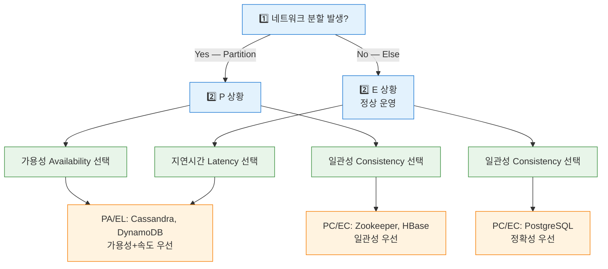

| 시스템 | PACELC | 특징 |
|--------|--------|------|
| DynamoDB | PA/EL | 가용성+낮은 지연 기본값, 강한 일관성 옵션 추가 가능 |
| Cassandra | PA/EL | 조정 가능한 일관성(QUORUM 등) |
| MySQL | PC/EC | ACID 트랜잭션, 강한 일관성 |
| MongoDB | PC/EC | 기본값 강한 일관성 (writeConcern majority) |

---

## 6. 로드밸런싱 기초

### 로드밸런서란?

대형 마트의 계산대 안내원을 생각해 보세요. 손님들이 스스로 줄을 서는 대신, 안내원이 각 계산대의 대기 상황을 보고 "3번 계산대가 비었어요"라고 안내합니다. 서버가 1대일 때는 필요 없지만, 서버가 10대가 되는 순간 "어디로 보낼지"를 결정하는 로드밸런서가 필요합니다.

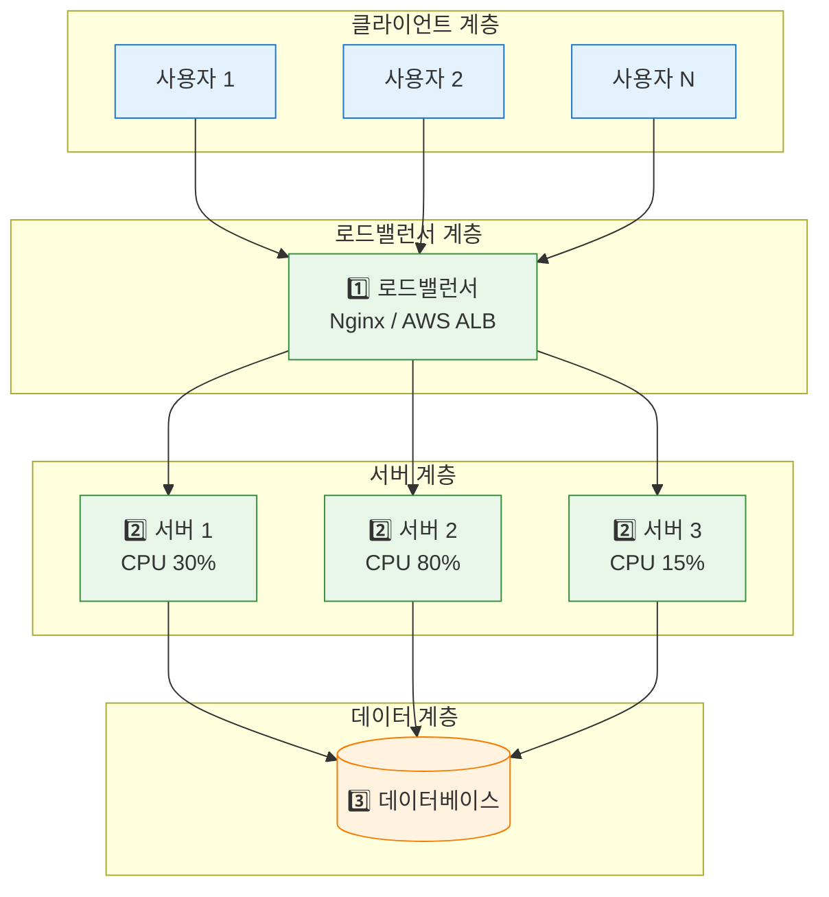

### 로드밸런싱 알고리즘 상세 비교

#### 1) 라운드 로빈 (Round Robin)
```
요청 순서: 1→서버A, 2→서버B, 3→서버C, 4→서버A, ...

단순하고 균등하게 분배합니다. 하지만 처리 시간이 다른 요청이 섞이면 불균형해집니다.
서버A에 10초짜리 요청이 쌓이는 동안 서버B에는 1ms짜리 요청이 연속으로 가면
서버A는 지속적으로 과부하, 서버B는 놉니다.
적합: 동일 스펙 서버, 동일 처리 시간 요청
```

#### 2) 가중치 라운드 로빈 (Weighted Round Robin)
```
서버A (가중치 5, CPU 32코어): 5번 요청
서버B (가중치 3, CPU 16코어): 3번 요청
서버C (가중치 2, CPU 8코어): 2번 요청

성능이 다른 서버들을 혼합 사용할 때, 강한 서버에 더 많은 요청을 보냅니다.
레거시 서버와 신규 서버가 혼재하는 마이그레이션 기간에 특히 유용합니다.
적합: 서버 스펙이 다른 이기종 환경
```

#### 3) 최소 연결 (Least Connections)
```
현재 상태:
서버A: 연결 100개
서버B: 연결 30개  ← 새 요청 배정
서버C: 연결 70개

WebSocket 같은 장기 연결에서 라운드 로빈은 비효율적입니다.
서버A에 오래된 연결 100개가 물려있어도 새 요청이 계속 옵니다.
최소 연결은 실제 부하가 가장 적은 서버를 선택합니다.
적합: WebSocket, 처리 시간이 다양한 작업
```

#### 4) IP 해시 (IP Hash)
```
클라이언트 IP → 해시 → 특정 서버 고정
192.168.1.1 → hash → 항상 서버A
192.168.1.2 → hash → 항상 서버B

같은 사용자가 항상 같은 서버로 가는 게 필요할 때 사용합니다.
단점: 특정 IP 대역(회사 전체가 같은 공인 IP를 쓰는 경우)에서 특정 서버에 쏠림이 생길 수 있습니다.
적합: 세션 친화성(Sticky Session) 필요 시
```

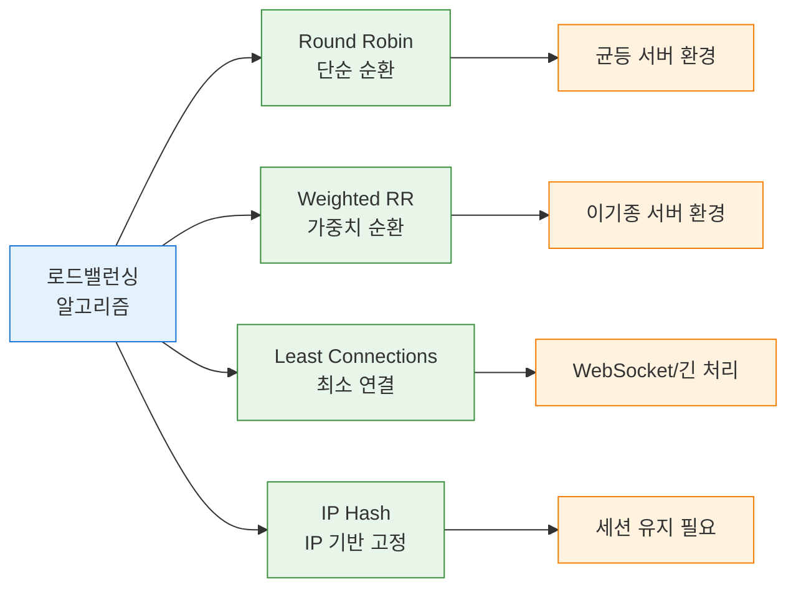

---

## 7. 데이터베이스 확장

### 읽기 복제 (Read Replica) — 읽기 부하를 분산하는 가장 쉬운 방법

대부분의 웹 서비스는 읽기:쓰기 비율이 **80:20 또는 90:10**입니다. 쓰기는 마스터에, 읽기는 레플리카에 분산하면 DB 부하를 크게 줄입니다.

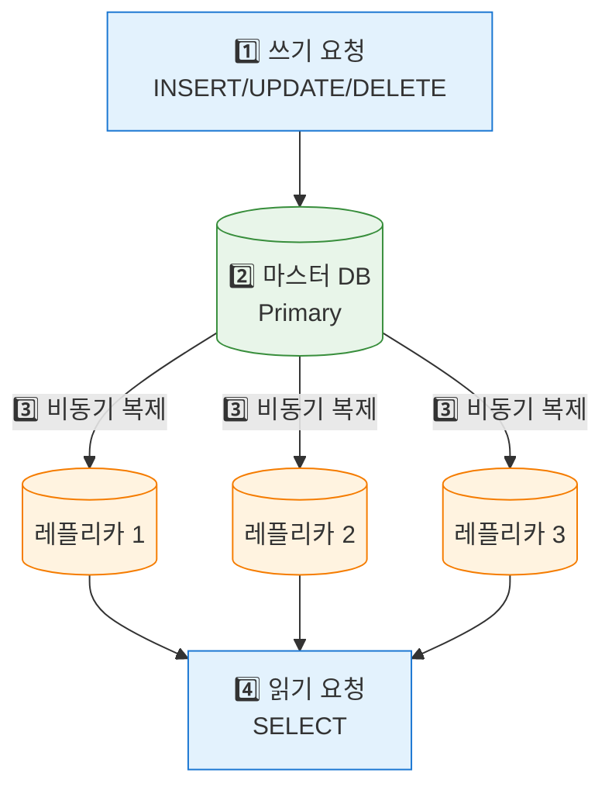

**복제 지연(Replication Lag)을 반드시 고려해야 합니다.** 비동기 복제 시 마스터에 쓴 데이터가 레플리카에 반영되는 데 수백 ms ~ 수 초가 걸릴 수 있습니다. 회원가입 직후 프로필을 조회하면 레플리카에 아직 없을 수 있습니다. 이 경우 마스터에서 읽어야 합니다. 이 패턴을 "Write-after-Read Consistency"라고 합니다. 코드에서 이를 명시적으로 처리하지 않으면, 회원가입 직후 "존재하지 않는 사용자"라는 에러가 납니다.

### 샤딩 (Sharding) — DB를 수평으로 나누기

도서관 책을 이름순으로 A-G는 1층, H-N은 2층, O-Z는 3층에 배치하는 것과 같습니다. 특정 책을 찾을 때 해당 층만 가면 됩니다.

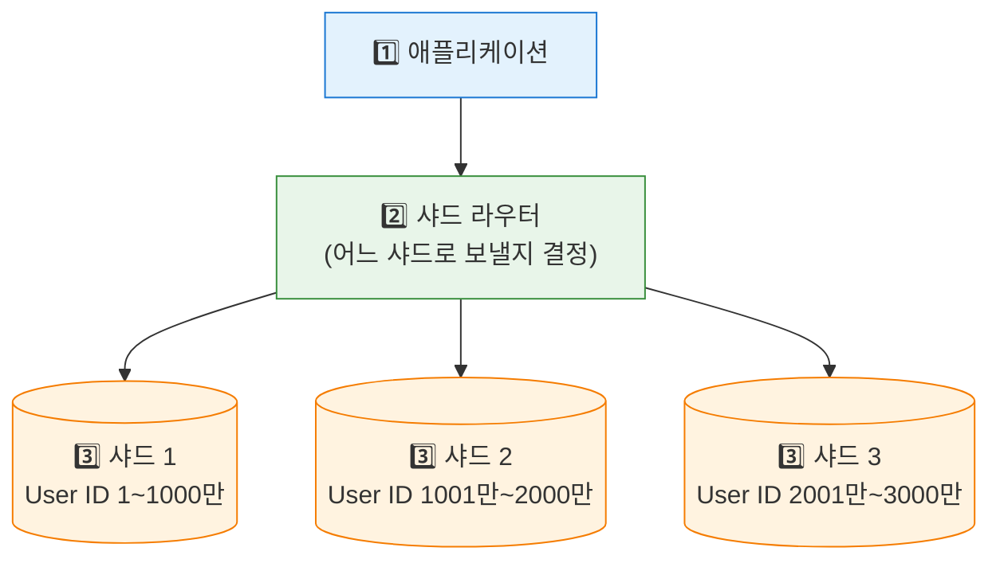

**샤딩 전략 비교:**

| 전략 | 방법 | 장점 | 단점 |
|------|------|------|------|
| 범위 기반 | ID 1-1000만 → 샤드1 | 범위 쿼리 효율적 | 핫스팟(최신 데이터 집중) |
| 해시 기반 | hash(ID) % N | 균등 분배 | 범위 쿼리 비효율, 리샤딩 어려움 |
| 디렉토리 기반 | 별도 매핑 테이블 | 유연한 재분배 | 매핑 테이블 병목, SPOF |
| 지리 기반 | 한국 사용자 → 한국 샤드 | 지연 최소화 | 데이터 불균형 가능 |

**샤딩의 진짜 고통**: 여러 샤드에 걸친 JOIN은 애플리케이션 레벨에서 수동으로 해야 합니다. 트랜잭션은 단일 샤드 내에서만 보장됩니다. 사용자가 늘면 샤드를 재분배해야 하는 리샤딩 작업이 수일이 걸릴 수 있습니다. **샤딩 전에 읽기 복제, 캐싱, 쿼리 최적화를 모두 시도한 후 마지막 수단으로 선택해야 합니다.**

---

## 8. 캐싱 (Caching)

### 캐시란? — 자주 쓰는 것을 가까이 두기

자주 가는 편의점을 생각해보세요. 매번 창고에서 물건을 꺼내오는 것보다 진열대(캐시)에 미리 꺼내두면 훨씬 빠릅니다. DB 조회는 수십 ms, Redis 캐시 조회는 수십 µs로 **100~1000배 빠릅니다**.

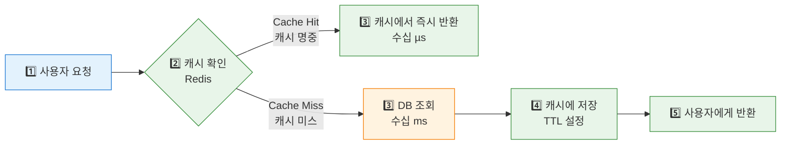

### 캐시 계층 구조

```
L1 캐시: CPU 레지스터/L1-L3 캐시 (나노초, 수십 MB)
L2 캐시: JVM Heap / 로컬 메모리 캐시 (마이크로초, 수 GB)
L3 캐시: 분산 캐시 Redis/Memcached (밀리초, 수십 TB)
L4 캐시: CDN 엣지 서버 (100ms~, 무한 확장)
```

### 캐시 전략 4가지

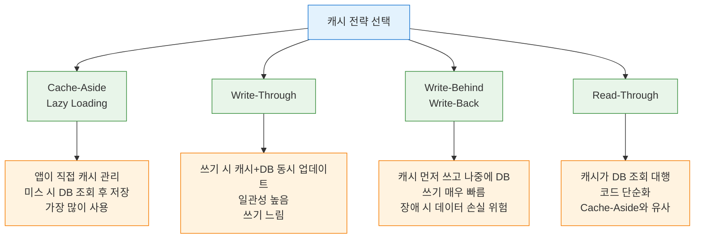

Write-Behind가 왜 위험할까요? 캐시에 먼저 쓰고 DB는 나중에 씁니다. 캐시 서버(Redis)가 죽으면, DB에 아직 반영 안 된 데이터가 사라집니다. 결제 금액이 캐시에만 있다가 사라지는 것입니다. 쓰기 속도가 중요하고 약간의 데이터 손실을 허용할 수 있는 경우에만 사용합니다.

### 캐시 무효화 (Cache Invalidation)

> "컴퓨터 과학에서 어려운 문제는 두 가지: 캐시 무효화와 이름 짓기" — Phil Karlton

**TTL (Time To Live) 기반**:
```java
// Redis에서 1시간 TTL 설정
redisTemplate.opsForValue().set("user:" + userId, userData, Duration.ofHours(1));
```

**이벤트 기반 무효화**:
```java
// DB 업데이트 시 캐시 즉시 삭제
@Transactional
public void updateUser(Long userId, UserRequest req) {
    userRepository.save(req.toEntity(userId));
    redisTemplate.delete("user:" + userId);  // 캐시 즉시 무효화
}
```

**캐시 스탬피드(Cache Stampede)**: 인기 캐시 키가 만료되는 순간 수백 개의 요청이 동시에 DB를 조회하는 문제입니다. 블랙프라이데이에 상품 가격 캐시가 만료되면, 수백 개의 요청이 동시에 DB로 쏠립니다. DB가 과부하로 죽을 수 있습니다. **Mutex Lock 또는 Probabilistic Early Expiration** 기법으로 해결합니다.

**캐시 오염(Cache Pollution)**: 거의 쓰이지 않는 데이터가 캐시를 차지하는 문제입니다. **LRU(Least Recently Used) 정책**으로 해결합니다.

---

## 9. CDN (Content Delivery Network)

### CDN이란? — 지리적 거리를 줄이기

원본 서버(서울)에서 모든 요청을 처리하면 미국 사용자는 150ms, 유럽 사용자는 200ms의 지연이 발생합니다. 빛의 속도 때문에 소프트웨어로 해결할 수 없는 한계입니다. CDN은 전 세계에 엣지 서버를 두고 콘텐츠를 캐싱해 **지리적 지연을 10~30ms로 줄입니다**.

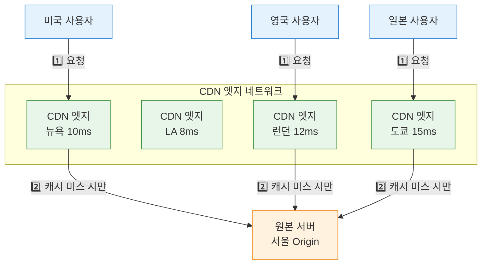

**CDN에 적합한 콘텐츠**: 정적 파일(이미지, CSS, JS, 폰트), 동영상 스트리밍, 다운로드 파일. 이런 파일들은 사용자마다 다르지 않습니다. 10만 명이 같은 이미지를 요청해도 파일은 하나입니다.

**CDN에 부적합한 콘텐츠**: 사용자별 맞춤 데이터, 실시간 재고/가격 정보, API 응답. 이런 데이터를 CDN에 캐시하면 다른 사용자가 내 장바구니를 볼 수도 있습니다.

---

## 10. 메시지 큐 (Message Queue)

### 메시지 큐란? — 생산자와 소비자를 분리

식당에서 홀 직원이 주문을 받아 주방 주문통에 넣는 방식입니다. 주방이 아무리 바빠도 홀 직원은 주문을 계속 받을 수 있습니다. **생산자(Producer)와 소비자(Consumer)를 비동기로 분리**하는 것이 핵심입니다.

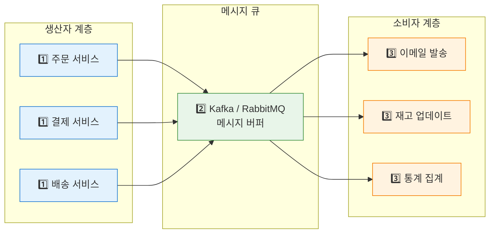

**메시지 큐를 쓰지 않으면 어떤 장애가 날까요?**

1. **비동기 처리**: 주문 완료 후 이메일 발송을 동기로 처리하면 이메일 서버 장애가 주문 실패로 이어집니다. 이메일 하나 못 보냈다고 주문이 취소되는 것입니다. 큐를 사용하면 주문은 즉시 완료되고 이메일은 나중에 처리됩니다.

2. **부하 완충(Load Leveling)**: 블랙프라이데이에 초당 10만 건 주문이 몰릴 때 이메일 서버가 10만 TPS를 처리할 수 없습니다. 큐가 버퍼 역할을 해서 이메일 서버가 처리 가능한 속도(예: 1000 TPS)로 소화합니다. 이메일이 조금 늦게 가지만 주문은 모두 받습니다.

3. **내결함성**: 이메일 서버가 잠깐 죽어도 메시지는 큐에 보존됩니다. 복구 후 처리를 재개합니다.

---

## 11. 마이크로서비스 아키텍처 기초

### 모놀리스 vs 마이크로서비스

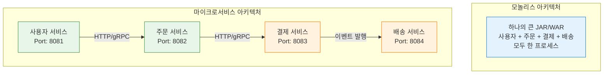

| 특성 | 모놀리스 | 마이크로서비스 |
|------|---------|--------------|
| 배포 | 전체 재배포 (위험도 높음) | 개별 독립 배포 |
| 확장 | 전체 스케일 아웃 | 필요한 서비스만 확장 |
| 장애 범위 | 전체 서비스 영향 | 서비스 격리 (Circuit Breaker) |
| 복잡도 | 코드는 단순 | 분산 트랜잭션, 네트워크 장애 대응 |
| 초기 개발 속도 | 빠름 | 느림 (인프라 셋업) |
| 팀 규모 | 소규모 (5~15명) | 대규모 (서비스당 2 Pizza 팀) |

마이크로서비스가 모놀리스보다 "더 좋다"고 단순히 말하는 건 틀렸습니다. 팀 5명의 스타트업이 MSA를 도입하면, 코드보다 인프라 관리에 더 많은 시간을 씁니다. 비즈니스 기능 개발 속도가 반으로 줄어듭니다.

---

## 12. 통합 아키텍처 — 실제 대규모 시스템

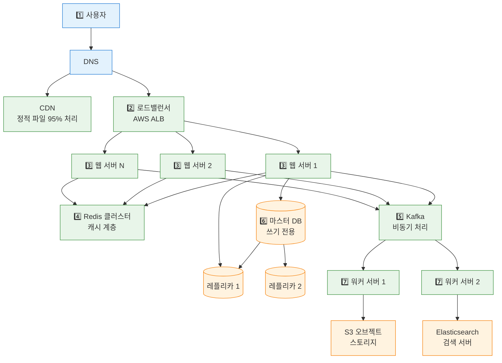

---

## 13. 시스템 설계 면접 4단계 프레임워크

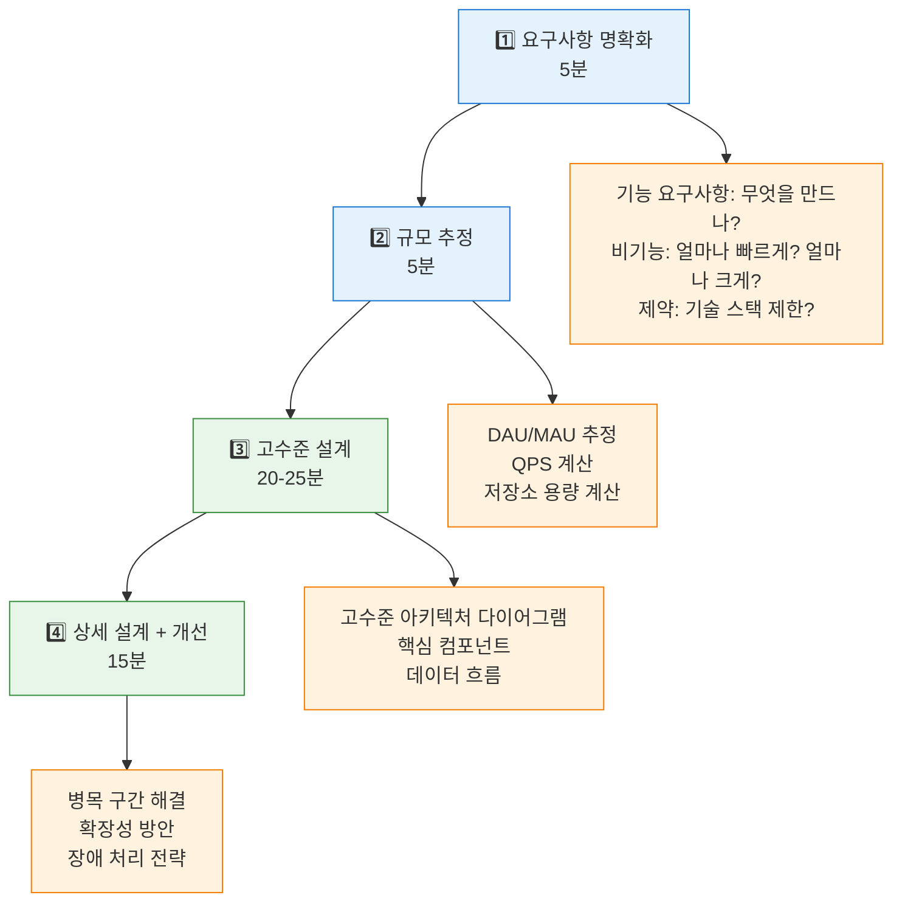

면접에서 가장 많이 하는 실수는 요구사항 확인 없이 바로 설계로 뛰어드는 것입니다. "채팅 시스템 설계해보세요"라는 말에 바로 WebSocket을 그리기 시작하면 안 됩니다. 먼저 "사용자 수는요? 1:1만인가요 그룹도인가요? 메시지 보관은 필요한가요?"를 물어보세요.

### 규모 추정 공식

```
QPS = DAU × 일일 평균 요청 / 86,400초
피크 QPS = QPS × 3  (피크는 평균의 2~3배)

저장소 = DAU × 데이터 크기 × 365일 × 보관 연수
```

**실전 예시: 트위터 유사 시스템**
```
DAU: 1억명
트윗 비율: 10% (1000만명이 하루 1개)
읽기:쓰기 = 100:1

쓰기 QPS = 10,000,000 / 86,400 ≈ 115 QPS
읽기 QPS = 115 × 100 = 11,500 QPS
피크 QPS = 11,500 × 3 = 34,500 QPS

트윗 크기 = 300B (텍스트) + 이미지 링크
텍스트 일일 저장 = 10,000,000 × 300B ≈ 3GB/일
5년 저장 = 3GB × 365 × 5 ≈ 5.5TB (텍스트만)
미디어 포함 시: × 100배 = 550TB
```

---

<details class="extreme-scenario-details" ontoggle="if(this.open){var ad=this.querySelector('.extreme-scenario-ad');if(ad&&!ad.dataset.loaded){ad.dataset.loaded='1';(adsbygoogle=window.adsbygoogle||[]).push({});}}">
<summary class="extreme-scenario-summary">
<span class="extreme-scenario-icon">🔥</span>
<span class="extreme-scenario-label">극한 시나리오 — 클릭하여 펼치기</span>
<span class="extreme-scenario-toggle"></span>
</summary>
<div class="extreme-scenario-body">
<div class="extreme-scenario-ad" style="text-align:center; margin-bottom:1.5em;">
<ins class="adsbygoogle"
     style="display:block"
     data-ad-client="ca-pub-7225106491387870"
     data-ad-slot="0000000000"
     data-ad-format="auto"
     data-full-width-responsive="true"></ins>
</div>
<div class="extreme-scenario-content" markdown="1">

넷플릭스는 피크 시간에 인터넷 전체 트래픽의 15%를 차지합니다. 초당 수 TB의 데이터를 전 세계에 전달합니다. 일반 CDN으로는 비용이 천문학적이고 성능도 부족합니다.

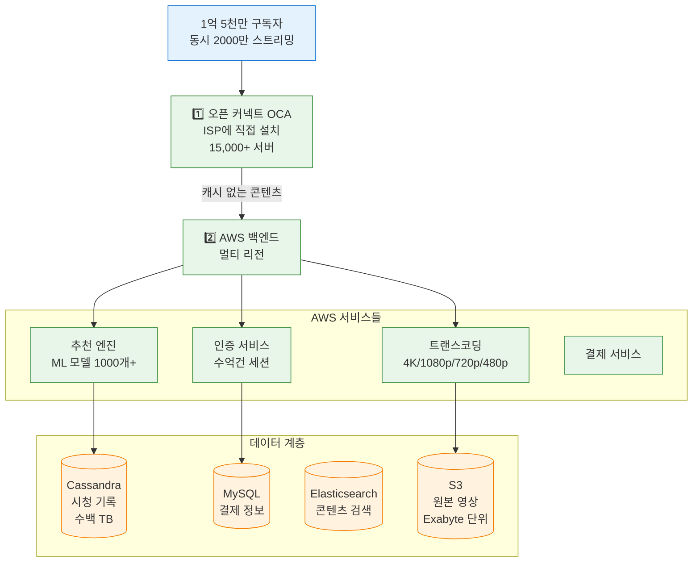

### 넷플릭스의 5가지 핵심 설계 결정 — 왜 이 선택을 했나

1. **오픈 커넥트(OCA) — CDN을 직접 만들다**: CloudFront나 Akamai 같은 상업 CDN을 쓰면 넷플릭스 규모에서 비용이 수천억 원입니다. 넷플릭스는 ISP(통신사)에 직접 서버를 설치해 트래픽의 95%를 OCA에서 처리합니다. ISP 입장에서도 넷플릭스 트래픽이 자사 인프라를 거쳐 나가는 것보다 내부에서 처리되면 비용이 절감됩니다. 윈-윈입니다.

2. **마이크로서비스 700개+**: 각 팀이 독립적으로 배포합니다. 카탈로그 업데이트가 결제 시스템에 영향을 주지 않습니다. 추천 알고리즘을 매주 개선해도 인증 서비스는 모릅니다.

3. **Chaos Engineering**: Chaos Monkey로 무작위 서버를 의도적으로 죽여 장애 내성을 검증합니다. "장애가 절대 안 나는 시스템"이 아니라 "장애가 나도 사용자가 느끼지 못하는 시스템"을 목표로 합니다.

4. **멀티 AZ/리전**: AWS 3개 이상 가용 영역 동시 운영합니다. 한 리전 전체 장애 시 자동으로 다른 리전으로 페일오버합니다. 2022년 AWS us-east-1 장애 때도 넷플릭스가 정상이었던 이유입니다.

5. **Circuit Breaker**: 추천 서비스가 느려져도 재생은 계속됩니다. 추천 대신 인기 콘텐츠를 보여주는 폴백(Fallback)이 동작합니다. "추천이 안 되면 재생도 안 된다"는 강한 결합을 없앤 것입니다.

---
</div>
</div>
</details>

## 핵심 포인트 정리

| 개념 | 핵심 트레이드오프 | 언제 선택 | 주의사항 |
|------|-----------------|---------|---------|
| 수직 확장 | 단순 vs 한계 존재 | 초기, 빠른 성장 대응 | SPOF 위험 |
| 수평 확장 | 무한 확장 vs 복잡도 | 대규모 트래픽 | 세션 공유 문제 |
| 읽기 복제 | 읽기 성능 vs 복제 지연 | 읽기 80%+ | 마스터 읽기 케이스 명시 |
| 샤딩 | 수평 DB 확장 vs 조인 불가 | 수십 TB+ | 마지막 수단 |
| 캐시 | 속도 vs 일관성 | 읽기 많은 시스템 | 캐시 스탬피드, TTL 설정 |
| CDN | 지연 감소 vs 무효화 어려움 | 글로벌 서비스 | 동적 콘텐츠 부적합 |
| 메시지 큐 | 비동기 처리 vs 복잡도 | 느린 작업, 트래픽 급증 | 중복 처리 대비 |
| CAP | C vs A (장애 시) | 시스템 특성에 따라 | 실제론 CP vs AP |

> **시스템 디자인의 황금률**: 완벽한 시스템은 없습니다. 어떤 것을 얻으면 다른 것을 잃습니다. **현재 요구사항에 맞는 적절한 트레이드오프를 선택하고, 그 이유를 명확히 설명하는 것**이 최선입니다.
