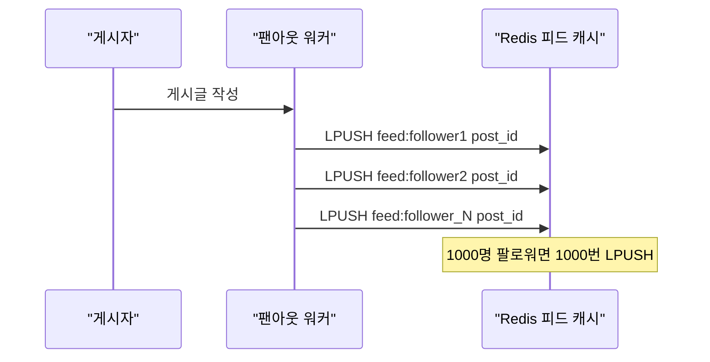
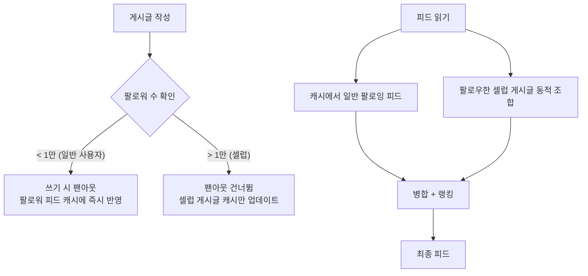
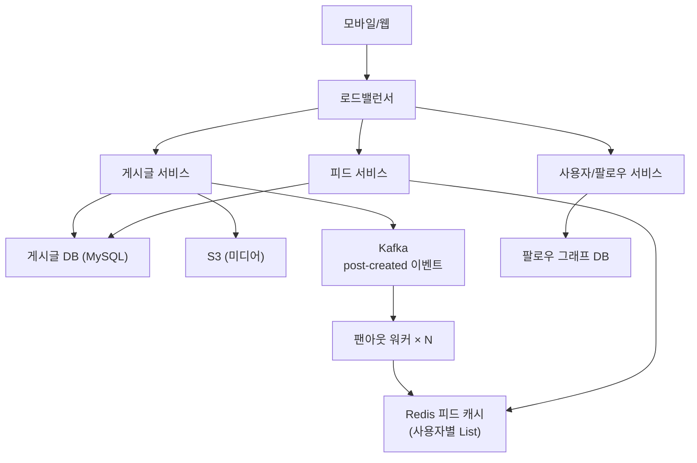
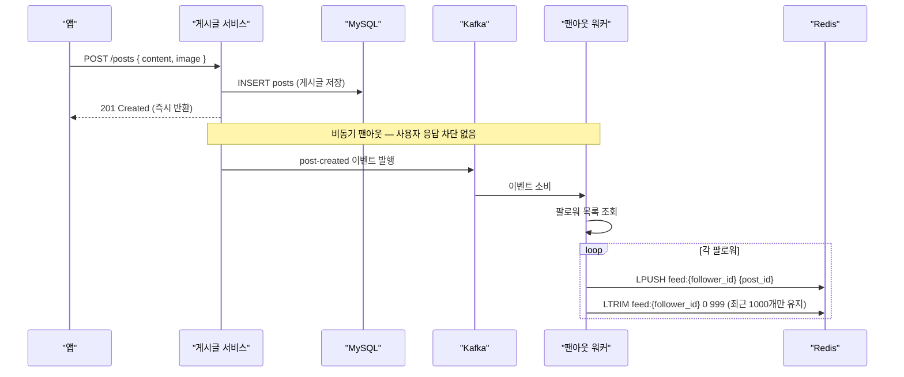
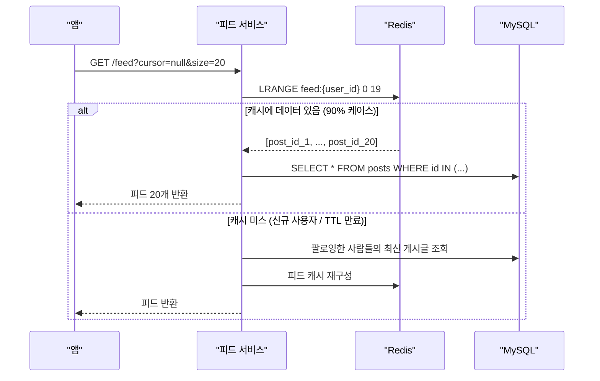

BTS가 인스타그램에 사진을 올리는 순간, 7000만 팔로워의 피드가 업데이트되어야 한다. 7000만 건의 캐시 업데이트를 동기로 처리하면? 게시글 저장에 수십 분이 걸린다. 반대로 아무것도 하지 않으면? 팔로워가 피드를 열 때마다 7000만 개 팔로잉의 게시글을 DB에서 읽어야 한다. **어떻게 쓰기 비용과 읽기 비용의 균형을 맞출 것인가** — 이것이 뉴스피드 설계의 핵심이다.

## 요구사항 분석

### 기능 요구사항

1. 게시글 작성 (텍스트, 이미지, 동영상)
2. 뉴스피드 조회 (팔로잉한 사람들의 게시글)
3. 팔로우/언팔로우
4. 좋아요, 댓글
5. 무한 스크롤 (커서 기반 페이지네이션)

### 비기능 요구사항

```
DAU 1억명, 평균 팔로잉 200명
피드 로딩 200ms 이내   → 캐시 전략이 핵심
게시글 작성은 수초 허용 → 팬아웃은 비동기로
최종 일관성 허용       → 몇 초 지연 OK (SNS이므로)
```

### 규모 추정

```
쓰기 QPS:
  1억명 × 10% = 1000만명/일 게시글 작성
  1000만 / 86400 ≈ 116 QPS

읽기 QPS:
  1억명 × 10회 조회/일 = 10억 요청/일
  10억 / 86400 ≈ 11,600 QPS (피크 35,000 QPS)

저장소:
  게시글 1KB × 1000만/일 = 10GB/일
  5년: 18TB
```

---

## 핵심 설계: 팬아웃(Fan-out) 전략

> **비유**: 우체국 분류 센터와 같다. 편지(게시글) 하나가 들어오면 수신인 목록(팔로워)을 보고 각 우편함(피드 캐시)에 복사본을 넣어두는 것이 Fan-out이다. 우편함을 미리 채워두면 열어볼 때 즉시 꺼낼 수 있다.

팬아웃 없이 읽기 시 직접 조회하면 무슨 일이 생기는가? 200명을 팔로잉한 사용자가 피드를 열면 200개의 쿼리가 필요하다. DAU 1억명이면 이것만으로 수십만 QPS다.

### 방법 1: 쓰기 시 팬아웃 (Fan-out on Write / Push Model)

게시글을 올리는 순간 모든 팔로워의 피드 캐시에 즉시 복사한다.



- **장점**: 피드 읽기가 Redis에서 O(1)으로 즉시 반환
- **단점**: 팔로워 1000만 명인 셀럽이 게시글 올리면 1000만 번 캐시 업데이트 → 쓰기 비용 폭발

### 방법 2: 읽기 시 팬아웃 (Fan-out on Read / Pull Model)

피드를 열 때마다 팔로잉 목록을 조회하고 각각의 최신 게시글을 수집한다.


- **장점**: 쓰기 비용 없음. 셀럽 계정에 유리
- **단점**: 읽기가 느림. 200명 팔로잉이면 매번 200개 쿼리

### 방법 3: 하이브리드 (실제 인스타그램/트위터 방식)



대부분의 읽기는 캐시에서 빠르게, 셀럽 게시글만 읽기 시 동적으로 가져온다.

---

## 전체 아키텍처



---

## 게시글 작성 흐름



왜 비동기로 처리하는가? 팔로워가 1000명이면 1000번의 Redis LPUSH다. 동기로 처리하면 게시글 저장 API가 수초가 걸린다. Kafka에 발행하고 즉시 반환한다.

---

## 피드 조회 흐름



캐시에는 **post_id만** 저장한다. 게시글 내용이 수정되어도 post_id는 변하지 않으므로 항상 최신 내용을 DB에서 조회할 수 있다.

---

## Redis 피드 캐시 설계

```python
class FeedCache:
    def __init__(self, redis, max_feed_size=1000):
        self.redis = redis
        self.max_size = max_feed_size  # 사용자당 최대 1000개 피드 유지

    def add_post_to_followers(self, post_id: int, follower_ids: list):
        pipe = self.redis.pipeline()
        for follower_id in follower_ids:
            key = f"feed:{follower_id}"
            pipe.lpush(key, post_id)           # 맨 앞에 추가 (최신순)
            pipe.ltrim(key, 0, self.max_size - 1)  # 오래된 것 자동 정리
            pipe.expire(key, 604800)           # 7일 TTL — 비활성 사용자 메모리 회수
        pipe.execute()

    def get_feed(self, user_id: int, start: int, count: int) -> list:
        return self.redis.lrange(f"feed:{user_id}", start, start + count - 1)
```

왜 LTRIM으로 1000개를 제한하는가? 1억 명 × 1000개 × (post_id 8바이트) = 800GB. 제한 없으면 Redis 메모리가 폭발한다.

---

## 피드 랭킹 — 단순 시간순이 아닌 이유

단순 시간순이면 활발한 친구가 100개 올려도 오래된 친한 친구 게시글이 묻힌다. 관련성 기반 랭킹:

```python
def calculate_score(post: dict, user_interactions: dict) -> float:
    # 1. 시간 감소 — 오래될수록 낮은 점수
    age_hours = (datetime.now() - post['created_at']).total_seconds() / 3600
    time_decay = 1 / (1 + age_hours) ** 1.5

    # 2. 참여도 — 댓글이 좋아요보다 더 강한 관심의 표시
    engagement = (
        post['likes']    * 1.0 +
        post['comments'] * 2.0 +
        post['shares']   * 3.0
    )

    # 3. 관계 친밀도 — 최근 30일 상호작용 많을수록 높음
    affinity = math.log(1 + user_interactions.get(post['author_id'], 0))

    return time_decay * (1 + engagement) * (1 + affinity)
```

---

## 셀럽 문제 해결 — 하이브리드 팬아웃

```python
CELEBRITY_THRESHOLD = 10_000  # 팔로워 1만 이상 = 셀럽

async def fanout_post(post_id: int, author_id: int):
    follower_count = await get_follower_count(author_id)

    if follower_count > CELEBRITY_THRESHOLD:
        # 셀럽: 팬아웃 생략, 셀럽 게시글 캐시만 업데이트
        # 읽기 시 동적으로 조합
        await cache.set(f"celeb_latest:{author_id}", post_id, ex=86400)
        return

    # 일반 사용자: 전체 팬아웃
    followers = await get_followers_in_batches(author_id, batch_size=5000)
    for batch in followers:
        await feed_cache.add_post_to_followers(post_id, batch)
        await asyncio.sleep(0.01)  # Redis 과부하 방지
```

```python
async def get_feed(user_id: int, page: int = 0, size: int = 20) -> list:
    # 1. 일반 팔로잉 피드 (캐시에서 즉시)
    normal_feed = await cache.get_feed(user_id, page * size, size * 2)

    # 2. 팔로우한 셀럽의 최신 게시글 (별도 조회)
    celeb_posts = []
    for celeb_id in await get_followed_celebs(user_id):
        posts = await cache.get(f"celeb_latest:{celeb_id}")
        if posts:
            celeb_posts.extend(posts)

    # 3. 병합 + 랭킹
    return rank_feed(normal_feed + celeb_posts, user_id)[page*size:(page+1)*size]
```

---

## 무한 스크롤 — 오프셋 기반이 왜 느린가

```python
# 오프셋 기반 (비효율) — 1000번째 페이지 요청 시
# DB가 1000 × 20 = 20,000개를 읽고 20개만 반환
# SELECT * FROM posts ORDER BY created_at DESC LIMIT 20 OFFSET 20000

# 커서 기반 (효율적) — 항상 인덱스를 타고 직접 이동
def get_feed_cursor(user_id: int, cursor_post_id: int = None, size: int = 20):
    if cursor_post_id:
        # cursor 이후의 게시글만 조회 — OFFSET 없음
        posts = db.query("""
            SELECT p.* FROM posts p
            JOIN follows f ON f.followee_id = p.author_id
            WHERE f.follower_id = ? AND p.id < ?
            ORDER BY p.id DESC LIMIT ?
        """, user_id, cursor_post_id, size + 1)
    else:
        posts = db.query("""
            SELECT p.* FROM posts p
            JOIN follows f ON f.followee_id = p.author_id
            WHERE f.follower_id = ?
            ORDER BY p.id DESC LIMIT ?
        """, user_id, size + 1)

    has_more = len(posts) > size
    next_cursor = posts[size - 1]['id'] if has_more else None
    return {'posts': posts[:size], 'next_cursor': next_cursor}
```

---

<details class="extreme-scenario-details">
<summary class="extreme-scenario-summary">
<span class="extreme-scenario-icon">🔥</span>
<span class="extreme-scenario-label">극한 시나리오 — 클릭하여 펼치기</span>
<span class="extreme-scenario-toggle"></span>
</summary>
<div class="extreme-scenario-body">

<div class="extreme-scenario-content" markdown="1">

BTS가 게시글을 올릴 때 7000만 팔로워 피드를 즉시 업데이트하려면 70초가 걸린다(초당 100만 건 처리 시). 하이브리드 전략으로:
- 팬아웃 생략 → 게시글 저장이 즉시 완료
- 팔로워가 피드를 열 때 셀럽 게시글을 동적으로 합산

실제로 인스타그램/트위터도 이 방식이다.

---
</div>
</div>
</details>

## 핵심 설계 결정 요약

| 결정 | 선택 | 이유 |
|------|------|------|
| 팬아웃 전략 | 하이브리드 | 일반 사용자는 빠른 읽기, 셀럽은 쓰기 비용 절감 |
| 피드 저장 | Redis List (post_id만) | O(1) 추가, 범위 조회, 내용 수정에 강함 |
| 팬아웃 처리 | Kafka 비동기 | 게시글 API 응답 시간에 영향 없음 |
| 랭킹 | 시간 × 참여도 × 친밀도 | 단순 시간순보다 관련성 높은 피드 |
| 페이지네이션 | 커서 기반 | OFFSET 없이 대용량 처리 |
| 피드 크기 제한 | 사용자당 1000개 | Redis 메모리 폭발 방지 |
