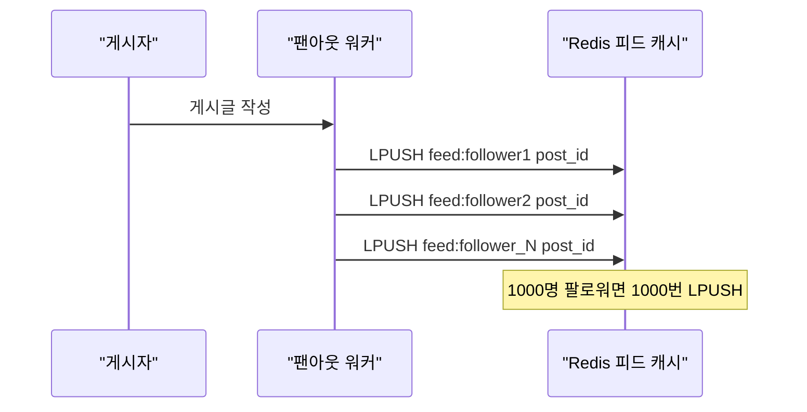
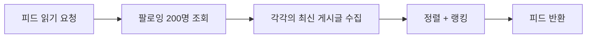
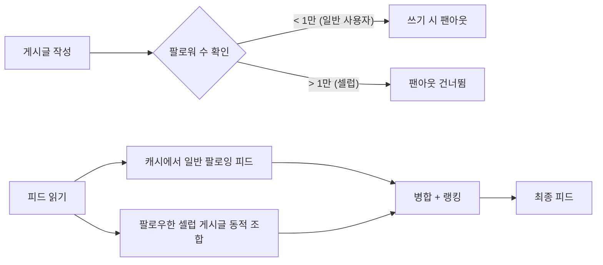
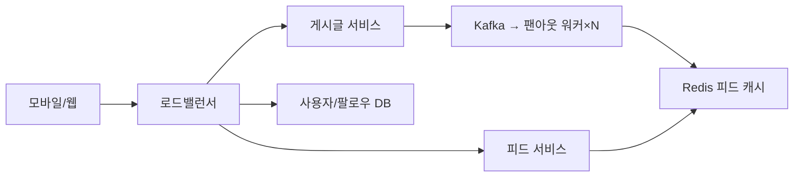
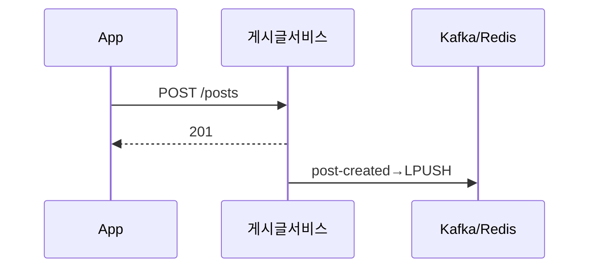
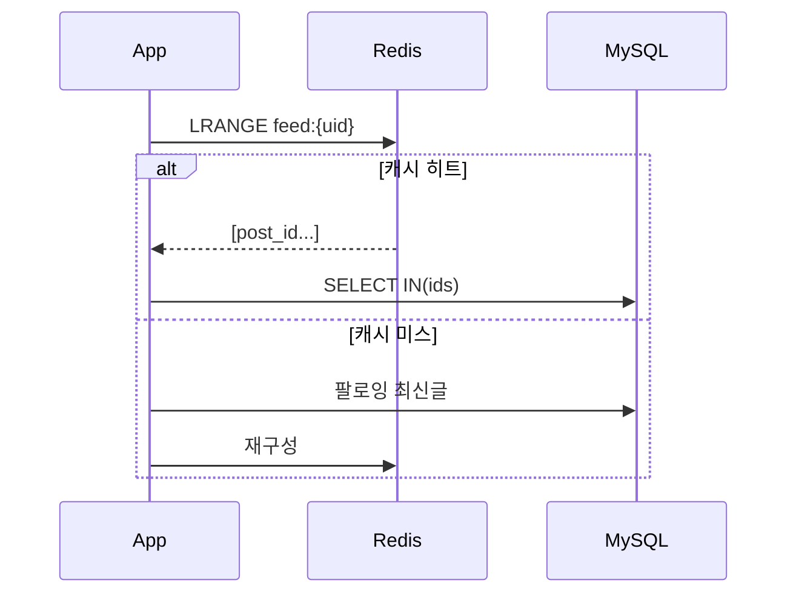

BTS가 인스타그램에 사진을 올리는 순간, 7000만 팔로워의 피드가 업데이트되어야 한다. 7000만 건의 캐시 업데이트를 동기로 처리하면? 게시글 저장에 수십 분이 걸린다. 반대로 아무것도 하지 않으면? 팔로워가 피드를 열 때마다 7000만 개 팔로잉의 게시글을 DB에서 읽어야 한다. **어떻게 쓰기 비용과 읽기 비용의 균형을 맞출 것인가** — 이것이 뉴스피드 설계의 핵심이다.

## 요구사항 분석

### 기능 요구사항

1. 게시글 작성 (텍스트, 이미지, 동영상)
2. 뉴스피드 조회 (팔로잉한 사람들의 게시글)
3. 팔로우/언팔로우
4. 좋아요, 댓글
5. 무한 스크롤 (커서 기반 페이지네이션)

### 비기능 요구사항

```
DAU 1억명, 평균 팔로잉 200명
피드 로딩 200ms 이내   → 캐시 전략이 핵심
게시글 작성은 수초 허용 → 팬아웃은 비동기로
최종 일관성 허용       → 몇 초 지연 OK (SNS이므로)
```

### 규모 추정

```
쓰기 QPS:
  1억명 × 10% = 1000만명/일 게시글 작성
  1000만 / 86400 ≈ 116 QPS

읽기 QPS:
  1억명 × 10회 조회/일 = 10억 요청/일
  10억 / 86400 ≈ 11,600 QPS (피크 35,000 QPS)

저장소:
  게시글 1KB × 1000만/일 = 10GB/일
  5년: 18TB
```

---

## 설계 의사결정 로드맵

이 시스템을 설계할 때 내려야 하는 핵심 결정 4가지를 순서대로 짚는다. 각 결정에서 "왜 이 선택인가"를 명확히 하지 않으면 면접에서 "그냥 DB에서 읽으면 되지 않나요?"라는 후속 질문에 답할 수 없다.

### 결정 1: 피드 생성 — Pull(읽기 시 조합) vs Push(쓰기 시 팬아웃) vs 하이브리드

**문제**: 피드를 언제 만드는가? 게시글을 쓸 때 모든 팔로워 피드에 미리 복사해 두면 읽기는 빠르지만 쓰기 비용이 폭발한다. 읽을 때마다 조합하면 쓰기는 가볍지만 읽기 지연이 치명적이다.

| 후보 | 장점 | 단점 | 언제 적합 |
|------|------|------|----------|
| Pull (읽기 시 조합) | 쓰기 비용 없음, 셀럽 계정에 유리 | 팔로잉 200명이면 매번 200 쿼리, 읽기 지연 수초 | 팔로워 수 적거나 일관성 중요 시 |
| Push (쓰기 시 팬아웃) | 읽기 O(1), Redis에서 즉시 반환 | 셀럽 7000만 팔로워이면 쓰기 7000만 번 | 팔로워 수가 일정 이하인 경우 |
| 하이브리드 | 일반 사용자는 Push, 셀럽은 Pull | 구현 복잡도 증가 | 팔로워 분포가 극단적인 SNS |

**우리의 선택: 하이브리드**
- 이유: 팔로워 1만 미만 일반 사용자는 쓰기 시 팬아웃으로 Redis 피드 캐시에 미리 복사한다. BTS처럼 팔로워 7000만인 셀럽은 팬아웃을 생략하고 읽기 시 동적으로 합산한다. 읽기 QPS가 쓰기 QPS의 100배이므로 읽기 비용을 절감하는 것이 최우선이고, 셀럽 쓰기 비용 폭발을 Pull로 방어하는 것이 균형점이다.
- 안 하면: BTS가 게시글을 올릴 때 7000만 팔로워 피드를 Push로 업데이트하면 초당 100만 건 처리 기준 70초가 걸린다. 그 70초 동안 Kafka 팬아웃 워커가 7000만 번의 Redis LPUSH를 수행하느라 다른 사용자의 팬아웃이 전부 밀린다.

### 결정 2: 피드 저장소 — DB vs Redis List

**문제**: 피드 데이터를 어디에 저장하는가? DB에 저장하면 내구성은 좋지만 읽기 QPS(피크 35,000 QPS)를 감당할 수 없다.

| 후보 | 장점 | 단점 | 언제 적합 |
|------|------|------|----------|
| MySQL | ACID, 영구 저장 | 피크 35,000 QPS에 DB 포화 | 소규모 서비스 |
| Redis List | 인메모리 고속, LPUSH/LRANGE O(1) | 메모리 비용, TTL 필요 | 피드 캐시 |

**우리의 선택: Redis List (post_id만 저장)**
- 이유: 피드에는 post_id만 저장하고 내용은 조회 시 DB에서 가져온다. Redis List의 LPUSH/LTRIM으로 최신 1000개를 O(1)로 관리하고 LRANGE로 페이지를 즉시 반환한다. post_id는 8바이트이므로 1억 사용자 × 1000개 = 800GB로 Redis 메모리 내에서 관리 가능하다.
- 안 하면: 피드를 DB에서 조회하면 팔로잉 200명의 최신 게시글을 모아 정렬하는 쿼리가 매번 발생한다. 11,600 QPS의 읽기 부하에서 DB는 수초 내에 포화된다.

### 결정 3: 랭킹 — 시간순 vs 점수 기반 vs ML

**문제**: 피드를 어떤 순서로 보여줄 것인가? 단순 시간순이면 활발한 친구가 100개 올려도 오래된 친한 친구 게시글이 묻힌다.

| 후보 | 장점 | 단점 | 언제 적합 |
|------|------|------|----------|
| 시간순 | 구현 단순, 예측 가능 | 스팸 계정이 타임라인 점령, 중요 게시글 유실 | 트위터 초기, 소규모 |
| 점수 기반 (시간 × 참여도 × 친밀도) | 관련성 높은 피드, 규칙 명확 | 튜닝 어려움, 조작 가능 | 중간 규모 |
| ML (Wide & Deep 등) | 개인화 극대화 | 구현/운영 복잡, 설명 불가능 | 대규모 플랫폼 |

**우리의 선택: 하이브리드 (점수 기반 + ML)**
- 이유: 시간 감소(age_hours) × 참여도(좋아요+댓글+공유) × 친밀도(최근 30일 상호작용)로 기초 점수를 계산하고, 대규모에서는 이 점수를 피처로 사용하는 Wide & Deep 모델이 최종 랭킹을 결정한다. 규칙 기반만으로는 콘텐츠 다양성이 부족하고, ML만으로는 cold-start 문제와 해석 불가능성이 있다.
- 안 하면: 순수 시간순이면 평균 200개를 팔로잉하는 사용자가 활발한 계정 20개에 의해 나머지 180개 게시글을 전혀 보지 못하게 된다. 참여율이 떨어지고 결국 서비스 이탈로 이어진다.

### 결정 4: 페이지네이션 — 오프셋 vs 커서

**문제**: 무한 스크롤에서 다음 페이지를 어떻게 가져오는가? 오프셋 방식은 페이지가 깊어질수록 DB가 점점 더 많은 행을 읽고 버린다.

| 후보 | 장점 | 단점 | 언제 적합 |
|------|------|------|----------|
| 오프셋 (LIMIT N OFFSET M) | 구현 단순, 임의 페이지 이동 가능 | 깊은 페이지에서 수만 행 스캔, 실시간 피드에서 중복/누락 | 정적 데이터, 관리자 페이지 |
| 커서 (WHERE id < cursor) | 항상 인덱스 직접 접근, 실시간 삽입에도 안정 | 임의 페이지 이동 불가 | 무한 스크롤, 피드 |

**우리의 선택: 커서 기반**
- 이유: 피드는 실시간으로 새 게시글이 삽입된다. 오프셋 방식에서 사용자가 스크롤하는 동안 새 게시글이 삽입되면 페이지가 밀려 같은 게시글이 두 번 나오거나 게시글이 건너뛰어진다. 커서는 `WHERE id < last_seen_id` 조건으로 항상 인덱스를 직접 타므로 OFFSET처럼 수만 행을 읽고 버리는 낭비가 없다.
- 안 하면: 오프셋 OFFSET 20000에서는 DB가 20,020개를 읽고 20개만 반환한다. 피크 35,000 QPS에서 깊은 스크롤이 많으면 DB가 수억 행의 낭비 스캔을 실행한다.

---

## 핵심 설계: 팬아웃(Fan-out) 전략

> **비유**: 우체국 분류 센터와 같다. 편지(게시글) 하나가 들어오면 수신인 목록(팔로워)을 보고 각 우편함(피드 캐시)에 복사본을 넣어두는 것이 Fan-out이다. 우편함을 미리 채워두면 열어볼 때 즉시 꺼낼 수 있다.

팬아웃 없이 읽기 시 직접 조회하면 무슨 일이 생기는가? 200명을 팔로잉한 사용자가 피드를 열면 200개의 쿼리가 필요하다. DAU 1억명이면 이것만으로 수십만 QPS다.

### 방법 1: 쓰기 시 팬아웃 (Fan-out on Write / Push Model)

게시글을 올리는 순간 모든 팔로워의 피드 캐시에 즉시 복사한다.



- **장점**: 피드 읽기가 Redis에서 O(1)으로 즉시 반환
- **단점**: 팔로워 1000만 명인 셀럽이 게시글 올리면 1000만 번 캐시 업데이트 → 쓰기 비용 폭발

### 방법 2: 읽기 시 팬아웃 (Fan-out on Read / Pull Model)

피드를 열 때마다 팔로잉 목록을 조회하고 각각의 최신 게시글을 수집한다.



- **장점**: 쓰기 비용 없음. 셀럽 계정에 유리
- **단점**: 읽기가 느림. 200명 팔로잉이면 매번 200개 쿼리

### 방법 3: 하이브리드 (실제 인스타그램/트위터 방식)



대부분의 읽기는 캐시에서 빠르게, 셀럽 게시글만 읽기 시 동적으로 가져온다.

---

## 전체 아키텍처



---

## 게시글 작성 흐름



왜 비동기로 처리하는가? 팔로워가 1000명이면 1000번의 Redis LPUSH다. 동기로 처리하면 게시글 저장 API가 수초가 걸린다. Kafka에 발행하고 즉시 반환한다.

---

## 피드 조회 흐름



캐시에는 **post_id만** 저장한다. 게시글 내용이 수정되어도 post_id는 변하지 않으므로 항상 최신 내용을 DB에서 조회할 수 있다.

---

## Redis 피드 캐시 설계

```python
class FeedCache:
    def __init__(self, redis, max_feed_size=1000):
        self.redis = redis
        self.max_size = max_feed_size  # 사용자당 최대 1000개 피드 유지

    def add_post_to_followers(self, post_id: int, follower_ids: list):
        pipe = self.redis.pipeline()
        for follower_id in follower_ids:
            key = f"feed:{follower_id}"
            pipe.lpush(key, post_id)           # 맨 앞에 추가 (최신순)
            pipe.ltrim(key, 0, self.max_size - 1)  # 오래된 것 자동 정리
            pipe.expire(key, 604800)           # 7일 TTL — 비활성 사용자 메모리 회수
        pipe.execute()

    def get_feed(self, user_id: int, start: int, count: int) -> list:
        return self.redis.lrange(f"feed:{user_id}", start, start + count - 1)
```

왜 LTRIM으로 1000개를 제한하는가? 1억 명 × 1000개 × (post_id 8바이트) = 800GB. 제한 없으면 Redis 메모리가 폭발한다.

---

## 피드 랭킹 — 단순 시간순이 아닌 이유

단순 시간순이면 활발한 친구가 100개 올려도 오래된 친한 친구 게시글이 묻힌다. 관련성 기반 랭킹:

```python
def calculate_score(post: dict, user_interactions: dict) -> float:
    # 1. 시간 감소 — 오래될수록 낮은 점수
    age_hours = (datetime.now() - post['created_at']).total_seconds() / 3600
    time_decay = 1 / (1 + age_hours) ** 1.5

    # 2. 참여도 — 댓글이 좋아요보다 더 강한 관심의 표시
    engagement = (
        post['likes']    * 1.0 +
        post['comments'] * 2.0 +
        post['shares']   * 3.0
    )

    # 3. 관계 친밀도 — 최근 30일 상호작용 많을수록 높음
    affinity = math.log(1 + user_interactions.get(post['author_id'], 0))

    return time_decay * (1 + engagement) * (1 + affinity)
```

실제 대규모 서비스에서는 이 규칙 기반 점수를 피처로 사용하고, 사용자 참여 예측 ML 모델(Wide & Deep, DCN)이 최종 랭킹을 결정합니다. Wide 컴포넌트는 기억(memorization, 인기 콘텐츠 편향)을, Deep 컴포넌트는 일반화(generalization, 새로운 조합 발견)를 담당해 두 가지를 균형 있게 반영합니다.

### 게시글 삭제 — 팬아웃 롤백 패턴

게시글이 삭제되면 이미 수천 명의 피드 캐시에 해당 post_id가 들어가 있다. 동기로 일일이 지우면 삭제 API가 수초가 걸린다. Kafka를 통한 비동기 롤백:

```
1. 게시글 삭제 이벤트를 Kafka post-deleted 토픽에 발행
2. 팬아웃 워커가 이벤트를 소비
3. 해당 팔로워 목록을 조회
4. 각 팔로워 피드에서 LREM feed:{follower_id} 0 {post_id} 실행
   (LREM: 리스트에서 일치하는 값 전부 제거)
5. DB의 posts 테이블에서도 soft-delete 처리
```

피드 조회 시 DB에서 게시글 내용을 가져올 때 `deleted_at IS NULL` 조건을 추가해, 캐시 롤백이 완료되기 전에도 삭제된 게시글이 노출되지 않도록 이중 방어한다.

---

## 셀럽 문제 해결 — 하이브리드 팬아웃

```python
CELEBRITY_THRESHOLD = 10_000  # 팔로워 1만 이상 = 셀럽

async def fanout_post(post_id: int, author_id: int):
    follower_count = await get_follower_count(author_id)

    if follower_count > CELEBRITY_THRESHOLD:
        # 셀럽: 팬아웃 생략, 셀럽 게시글 캐시만 업데이트
        # 읽기 시 동적으로 조합
        await cache.set(f"celeb_latest:{author_id}", post_id, ex=86400)
        return

    # 일반 사용자: 전체 팬아웃
    followers = await get_followers_in_batches(author_id, batch_size=5000)
    for batch in followers:
        await feed_cache.add_post_to_followers(post_id, batch)
        await asyncio.sleep(0.01)  # Redis 과부하 방지
```

```python
async def get_feed(user_id: int, page: int = 0, size: int = 20) -> list:
    # 1. 일반 팔로잉 피드 (캐시에서 즉시)
    normal_feed = await cache.get_feed(user_id, page * size, size * 2)

    # 2. 팔로우한 셀럽의 최신 게시글 (별도 조회)
    celeb_posts = []
    for celeb_id in await get_followed_celebs(user_id):
        posts = await cache.get(f"celeb_latest:{celeb_id}")
        if posts:
            celeb_posts.extend(posts)

    # 3. 병합 + 랭킹
    return rank_feed(normal_feed + celeb_posts, user_id)[page*size:(page+1)*size]
```

---

## 무한 스크롤 — 오프셋 기반이 왜 느린가

```python
# 오프셋 기반 (비효율) — 1000번째 페이지 요청 시
# DB가 1000 × 20 = 20,000개를 읽고 20개만 반환
# SELECT * FROM posts ORDER BY created_at DESC LIMIT 20 OFFSET 20000

# 커서 기반 (효율적) — 항상 인덱스를 타고 직접 이동
def get_feed_cursor(user_id: int, cursor_post_id: int = None, size: int = 20):
    if cursor_post_id:
        # cursor 이후의 게시글만 조회 — OFFSET 없음
        posts = db.query("""
            SELECT p.* FROM posts p
            JOIN follows f ON f.followee_id = p.author_id
            WHERE f.follower_id = ? AND p.id < ?
            ORDER BY p.id DESC LIMIT ?
        """, user_id, cursor_post_id, size + 1)
    else:
        posts = db.query("""
            SELECT p.* FROM posts p
            JOIN follows f ON f.followee_id = p.author_id
            WHERE f.follower_id = ?
            ORDER BY p.id DESC LIMIT ?
        """, user_id, size + 1)

    has_more = len(posts) > size
    next_cursor = posts[size - 1]['id'] if has_more else None
    return {'posts': posts[:size], 'next_cursor': next_cursor}
```

---


## 극한 시나리오

### 시나리오 1: BTS 7000만 팔로워 동시 팬아웃 — 쓰기 폭주

BTS가 게시글을 올릴 때 7000만 팔로워 피드를 즉시 업데이트하려면 초당 100만 건 처리 기준으로 **70초**가 걸린다. 동기 팬아웃은 불가능하다.

```
대응 전략:
- 하이브리드 팬아웃: 팔로워 1만 이상 셀럽은 팬아웃 생략
- 팔로워가 피드를 열 때 셀럽 게시글을 동적으로 합산
- Kafka 파티션을 팔로워 ID 범위별로 분할해 워커가 병렬 처리
- 결과: 게시글 저장 < 100ms, 팬아웃은 백그라운드에서 수십 초에 걸쳐 완료
```

### 시나리오 2: 대선 개표 방송 — 전 국민 동시 피드 읽기 폭주

개표 방송 중 전 국민이 1억 명 동시에 피드 새로고침. 읽기 QPS가 평상시 35,000에서 순간 **350,000+** 으로 10배 급증한다.

```
대응 전략:
- Redis 피드 캐시 히트율 99% 유지 (대부분 캐시에서 즉시 반환)
- HPA(Horizontal Pod Autoscaler): CPU 70% 초과 시 피드 서비스 Pod 자동 증설
- DB 읽기 레플리카 확장: 평상시 2대 → 피크 대비 10대 사전 준비
- 핫 게시글(개표 관련) 캐시 TTL을 30초→5분으로 연장해 캐시 스탬피드 방지
- 수치: Redis 처리량 초당 100만 ops, 응답시간 P99 < 50ms 유지
```

### 시나리오 3: 인플루언서 100명 동시 게시 — 쓰기 폭주 + 팬아웃 큐 폭발

팔로워 10만 명짜리 인플루언서 100명이 동시에 게시글을 올리면:
`100명 × 10만 팔로워 × LPUSH = 1,000만 건의 Redis 쓰기 작업`이 수 초 안에 발생한다.

```
대응 전략:
- Kafka 팬아웃 워커 Auto Scaling: 큐 적체(lag) 감지 시 워커 수 자동 증가
- 팬아웃 배치 처리: 같은 사용자 피드에 대한 LPUSH를 pipeline()으로 묶어 Redis 왕복 횟수 최소화
- 백프레셔(Backpressure): Kafka lag > 100만 건 시 신규 팬아웃 요청 속도 제한
  → 게시글 저장은 즉시 완료, 피드 반영은 최대 5분 지연 허용 (최종 일관성)
- Redis 클러스터 샤딩: feed:{user_id} 키를 user_id 해시로 분산해 특정 노드 집중 방지
- 수치: 워커 50대 → 200대로 자동 확장, 팬아웃 완료 < 3분
```

---

## 보안 고려사항

> **비유**: SNS는 광장이다. 누구나 말할 수 있지만, 혐오 발언과 스팸을 방치하면 광장이 황폐해진다. 콘텐츠 모더레이션은 서비스 생존의 문제다.

**콘텐츠 모더레이션 — ML + 인적 심사 2단계**

- **1단계 (자동)**: 게시글 업로드 시 ML 분류 모델이 혐오 표현·폭력·성인 콘텐츠·스팸을 실시간 판별한다. 신뢰도 높은 위반은 자동 숨김 처리
- **2단계 (인적 심사)**: ML이 "애매함"으로 분류한 콘텐츠와 사용자 신고 건을 전담 팀이 검토한다. 자동화만으로는 맥락과 풍자를 구분할 수 없다

**스팸 방지**

동일 콘텐츠 반복 게시, 대량 팔로우·언팔로우, 단시간 다수 계정 생성 패턴을 감지해 계정을 임시 제한한다. 신규 계정에는 첫 24시간 팬아웃 규모를 제한해 스팸 계정의 피해 확산을 차단한다.

**개인정보 — GDPR 삭제권**

사용자가 계정 삭제를 요청하면 게시글·댓글·좋아요뿐 아니라 팔로워 피드 캐시에서도 해당 post_id를 제거해야 한다. 위의 팬아웃 롤백 패턴을 그대로 활용하고, 30일 이내 완전 삭제를 보장한다.

---

### 꼭 직접 만들어야 하는가? — Build vs Buy

| 선택지 | 장점 | 단점 | 적합한 시점 |
|--------|------|------|-----------|
| Stream (getstream.io) | 피드 API, 팬아웃/랭킹 내장, SDK 제공 | 커스텀 ML 랭킹 불가, 피드 로직 외부 의존 | Phase 1~2 |
| 직접 구축 (Redis + Kafka + 팬아웃 워커) | 커스텀 랭킹 알고리즘 자유, MAU 100만 이상 비용 효율 | 팬아웃 워커·캐시 무효화 복잡도 높음 | Phase 3~4 |

**실무 판단 기준**: 커스텀 랭킹 알고리즘(ML)이 필요하거나, 피드 로직이 비즈니스 핵심일 때 전환한다.

> 핵심: Phase 1에서 직접 구축하면 오버 엔지니어링이고, Phase 3에서 SaaS에 의존하면 비용 폭발이다. 현재 MAU에 맞는 선택을 하고, 병목이 실제로 발생할 때 전환한다.

---

## Day 1에서 Scale까지 — 아키텍처는 어떻게 진화하는가

**Phase 1: MAU 1만 (Day 1)**
- 단일 DB에 팔로우 테이블과 게시글 테이블을 두고, 피드 조회 시 매번 JOIN으로 생성한다. 느리지만 구현이 단순하다.
- 월 비용: ~$80 (EC2 + RDS 단일)

**Phase 2: MAU 100만**
- Redis에 사용자별 피드 목록(post_id 리스트)을 캐시한다. 게시글 작성 시 팔로워의 Redis 리스트에 동기적으로 push한다. 팔로워 수 1만 미만 사용자에게 적용한다.
- 월 비용: ~$2,000 (EC2 + RDS + ElastiCache 클러스터)

**Phase 3: MAU 1000만**
- 팬아웃을 Kafka 비동기로 전환한다. 셀럽(팔로워 1만+)은 팬아웃 대신 읽기 시점 조합(Pull) 방식으로 분리한다. DB는 user_id 기준으로 샤딩한다.
- 월 비용: ~$20,000 (Kafka 클러스터 + 샤드 DB + Redis 클러스터)

**Phase 4: MAU 1억**
- 멀티 리전 배포. 각 리전에 독립 피드 캐시를 두고, 글로벌 인기 게시글은 별도 CDN 레이어에서 서빙한다. ML 랭킹 모델로 단순 시간순 피드를 관련성 기반 피드로 전환한다.
- 월 비용: ~$200,000+ (멀티 리전 + ML 인프라 + 글로벌 CDN)

---

## 이것만 모니터링하면 된다 — 핵심 메트릭 5개

| 메트릭 | 정상 범위 | 경고 임계값 | 장애 의미 |
|--------|----------|------------|---------|
| 팬아웃 처리 지연 (P99) | < 1초 | > 5초 | Kafka 컨슈머 처리 지연 → 피드 갱신 지연 |
| 피드 캐시 히트율 | > 95% | < 80% | Redis 메모리 부족 또는 TTL 만료 |
| 피드 조회 P99 | < 100ms | > 300ms | 캐시 미스 후 DB 직접 조회 폭발 |
| Kafka 컨슈머 랙 | < 5,000 | > 100,000 | 팬아웃 워커 처리 용량 한계 |
| Redis 메모리 사용률 | < 70% | > 85% | 피드 캐시 eviction 시작 → 캐시 미스 급증 |

---

## 실제로 이런 일이 일어났다 — 실전 장애 사례

**사례 1: 카카오 데이터센터 화재 (2022년 10월)**
- **상황**: 카카오 스토리, 카카오톡 피드 기능이 127시간 전면 중단
- **원인**: 피드 캐시(Redis)와 팬아웃 워커가 단일 DC에 집중 배포. DC 전원 장애로 전체 다운
- **해결**: 수동으로 백업 DC에 Redis 클러스터 재구성. 피드 캐시 웜업에만 수 시간 소요
- **교훈**: 피드 캐시는 재구성 비용이 크다. 멀티 DC 구성 시 Redis 데이터도 MirrorMaker 수준으로 실시간 복제해야 한다. 캐시 웜업 시간을 DR 복구 시간 계산에 반드시 포함해야 한다

**사례 2: 트위터 셀럽 팬아웃 장애 (2012년)**
- **상황**: 오바마 대통령 선거 승리 트윗 직후 트위터 피드 서비스 수십 분 응답 불가
- **원인**: 오바마 계정의 팔로워 3,000만 명에게 동시에 팬아웃 시도. 팬아웃 큐가 순식간에 포화
- **해결**: 팔로워 수 기준으로 셀럽 계정을 분류하고, 읽기 시점 조합(Pull) 방식으로 별도 처리
- **교훈**: 팬아웃 전략은 사용자 유형에 따라 달라야 한다. 셀럽 계정에 Write Fanout을 적용하면 단일 게시글이 시스템 전체를 마비시킬 수 있다. 팔로워 임계값(예: 1만)을 기준으로 하이브리드 전략을 적용해야 한다

---

## 실무에서 놓치기 쉬운 케이스

### 1. 비활성 사용자에게도 팬아웃 — Redis 메모리 낭비

팬아웃 워커는 팔로워 목록을 순회하며 모든 사람의 피드 큐에 post_id를 LPUSH한다. 문제는 6개월째 로그인하지 않은 사용자에게도 똑같이 쓴다는 것이다.

인플루언서 팔로워가 500만 명인데 그 중 40%가 비활성 사용자라면, 게시글 하나에 200만 건의 의미 없는 Redis 쓰기가 발생한다. 피드 큐는 `EXPIRE` 없이 쌓이므로 메모리는 계속 늘어난다.

```python
# 팬아웃 워커 개선: 비활성 사용자 건너뛰기
def fanout(post_id, follower_ids):
    active_ids = [uid for uid in follower_ids
                  if last_login[uid] > now() - 30 * DAY]  # 30일 기준
    pipeline = redis.pipeline()
    for uid in active_ids:
        pipeline.lpush(f"feed:{uid}", post_id)
        pipeline.ltrim(f"feed:{uid}", 0, 999)  # 최대 1000개 유지
    pipeline.execute()
```

비활성 기준은 서비스 특성에 따라 다르지만 30~90일이 일반적이다. 비활성 사용자가 재접속하면 Read-time fan-out(Pull)으로 최신 피드를 그때 조립해 보여준다. 이 하이브리드 전환은 Redis 메모리를 30~50% 절감하는 효과가 있다.

---

### 2. 인플루언서 도배 — 팔로워 피드가 광고로 가득

한 인플루언서가 1시간 안에 광고 게시글을 10개 올린다. Write-time fan-out 방식에서는 팔로워 피드 큐 상위 10개가 그 사람 글로 채워진다. 팔로워 입장에서는 다른 친구 소식이 밀려나는 **피드 오염** 현상이다.

두 가지 방어가 필요하다.

**① 게시자별 피드 내 노출 상한선 설정**

```python
# 피드 조립 시 동일 작성자 게시글 개수 제한
def build_feed(uid, limit=20):
    raw = redis.lrange(f"feed:{uid}", 0, 99)
    seen_authors = Counter()
    result = []
    for post_id in raw:
        author = post_meta[post_id]["author_id"]
        if seen_authors[author] >= 3:  # 한 작성자 최대 3개
            continue
        seen_authors[author] += 1
        result.append(post_id)
        if len(result) >= limit:
            break
    return result
```

**② 팬아웃 단계에서 발행 속도 제한 (Rate Limit)**

```
POST /publish → Kafka fanout-topic
팬아웃 워커: 동일 author_id, 1시간 내 10건 초과 시 낮은 우선순위 큐로 이동
```

---

### 3. 시간대 차이 — 한국 새벽 3시 글이 미국 피드 상단 점령

단순 시간순 정렬에서는 한국 새벽 3시(미국 오전 11시)에 올라온 게시글이 미국 사용자의 피드 상단에 올라온다. 미국 사용자가 하루 동안 본 게시글은 없는데 한국발 콘텐츠가 "최신"으로 쌓여 있는 상황이다.

해결책은 두 가지다.

**① 사용자 로컬 타임 기준 피드 스코어 재계산**

```
score = engagement_score - time_decay(post_created_at, user_timezone)
```

게시글 생성 시각을 절대 UTC로 저장하고, 피드 조립 시 사용자의 timezone offset을 적용해 체감 신선도를 계산한다.

**② 피드 랭킹에 "팔로워 활동 시간대" 가중치 추가**

팔로워의 평균 활성 시간대와 게시 시간의 겹침 정도를 스코어에 반영한다. 미국 사용자가 주로 활동하는 오전 9시~오후 11시(EST)에 작성된 글에 더 높은 가중치를 부여하면 시간대 불일치 문제가 자연스럽게 완화된다.

---

## 핵심 설계 결정 요약

| 결정 | 선택 | 이유 |
|------|------|------|
| 팬아웃 전략 | 하이브리드 | 일반 사용자는 빠른 읽기, 셀럽은 쓰기 비용 절감 |
| 피드 저장 | Redis List (post_id만) | O(1) 추가, 범위 조회, 내용 수정에 강함 |
| 팬아웃 처리 | Kafka 비동기 | 게시글 API 응답 시간에 영향 없음 |
| 랭킹 | 시간 × 참여도 × 친밀도 | 단순 시간순보다 관련성 높은 피드 |
| 페이지네이션 | 커서 기반 | OFFSET 없이 대용량 처리 |
| 피드 크기 제한 | 사용자당 1000개 | Redis 메모리 폭발 방지 |
