## 실생활 비유: 신문 편집장

신문 편집장은 수천 명의 기자(팔로잉한 사람들)가 보내온 기사 중에서 독자에게 가장 관련 있는 것을 골라 1면에 배치합니다. 뉴스피드 시스템도 마찬가지입니다. 내가 팔로우하는 수백 명의 게시글 중 가장 적절한 것을 골라 내 피드에 보여줍니다. 초당 수백만 명이 동시에 피드를 요청하는 상황에서 어떻게 빠르게 응답할 수 있을까요?

---

## 1. 요구사항 분석

### 기능 요구사항

1. 게시글 작성 (텍스트, 이미지, 동영상)
2. 뉴스피드 조회 (팔로잉한 사람들의 게시글)
3. 팔로우/언팔로우
4. 좋아요, 댓글
5. 페이지네이션 (무한 스크롤)

### 비기능 요구사항

- **규모**: DAU 1억명, 평균 팔로잉 200명
- **피드 로딩**: 200ms 미만
- **게시글 작성**: 수초 허용 (비동기)
- **일관성**: 최종 일관성 허용 (몇 초 지연 OK)

### 규모 추정

```
DAU: 1억명
게시글 작성:
  - 1억 × 10% = 1000만명/일 게시글 작성
  - 쓰기 QPS = 1000만 / 86400 ≈ 116 QPS

피드 조회:
  - 1억명 × 하루 10번 조회 = 10억 요청/일
  - 읽기 QPS = 10억 / 86400 ≈ 11,600 QPS
  - 피크 QPS ≈ 35,000 QPS

저장소:
  - 게시글 크기: 1KB (텍스트만)
  - 이미지: S3 별도
  - 일일 저장: 1000만 × 1KB = 10GB/일
  - 5년: 10GB × 365 × 5 ≈ 18TB
```

---

## 2. 핵심 설계 결정: 팬아웃 전략

### 팬아웃이란?

A가 게시글을 올리면, A를 팔로우하는 1000명의 피드에 배달하는 것을 **팬아웃(Fan-out)**이라 합니다.

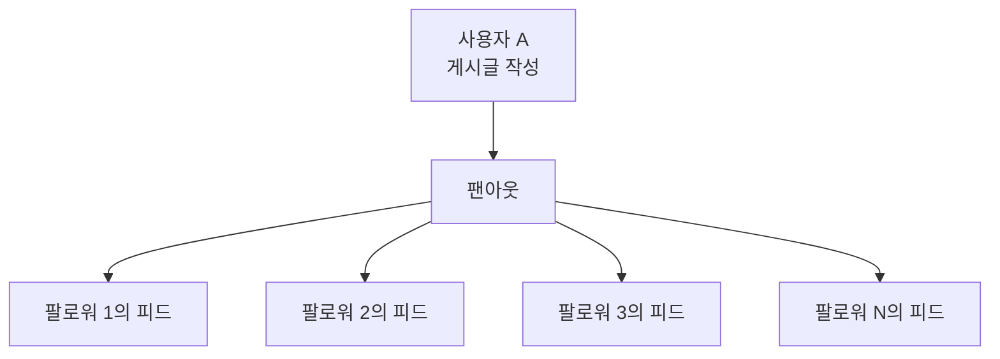

### 방법 1: 쓰기 시 팬아웃 (Fan-out on Write / Push Model)

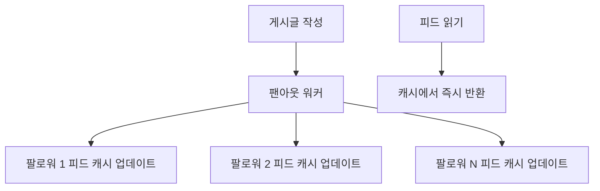

**장점**: 읽기 매우 빠름 (미리 준비된 피드)
**단점**: 팔로워 많은 사용자(셀럽) → 쓰기 비용 폭발 (1000만 팔로워 = 1000만 건 업데이트)

### 방법 2: 읽기 시 팬아웃 (Fan-out on Read / Pull Model)

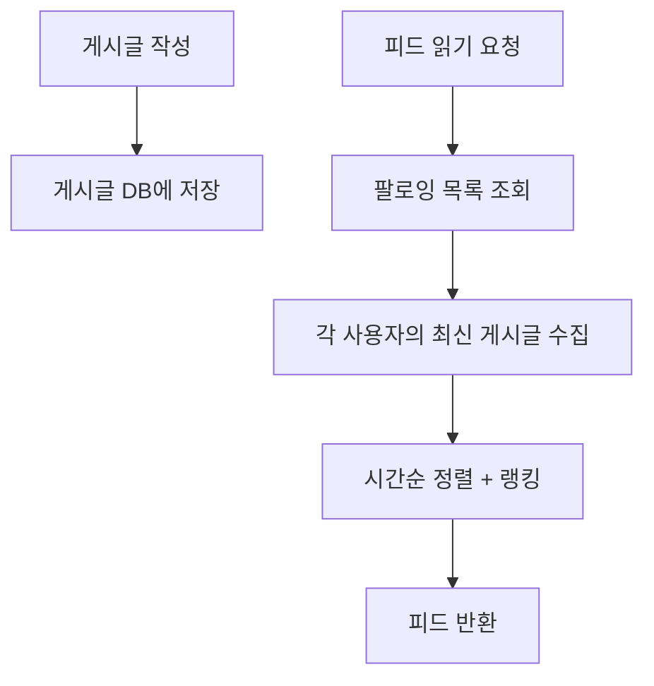

**장점**: 쓰기 비용 없음, 셀럽 계정에 유리
**단점**: 읽기 느림 (200명 팔로잉이면 200개 쿼리)

### 방법 3: 하이브리드 (실제 인스타그램/페이스북 방식) ⭐

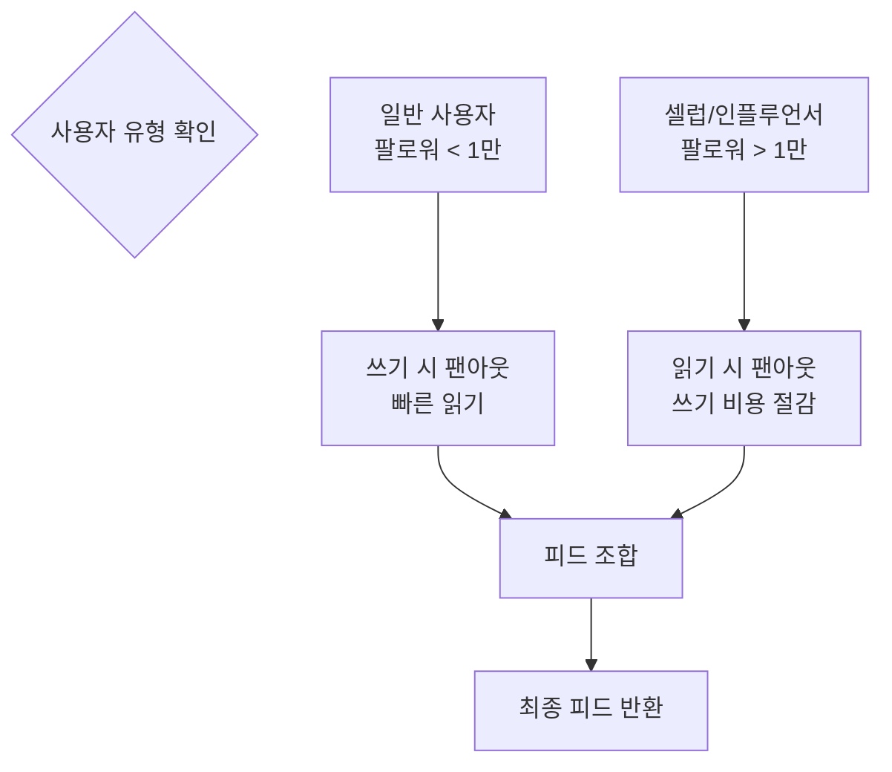

---

## 3. 전체 아키텍처

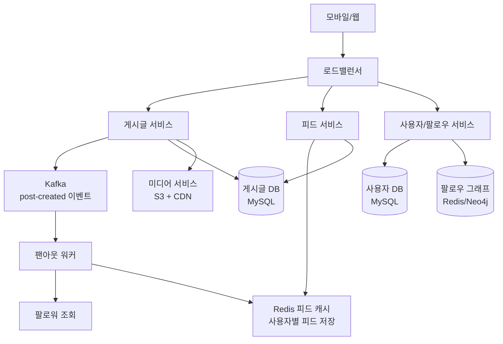

---

## 4. 게시글 작성 흐름

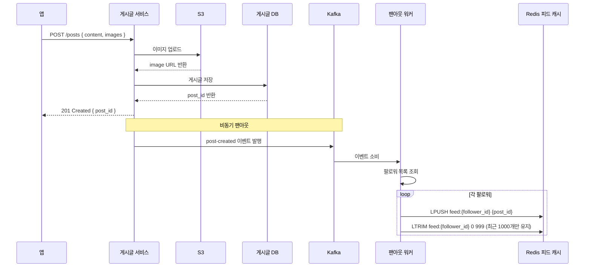

---

## 5. 피드 조회 흐름

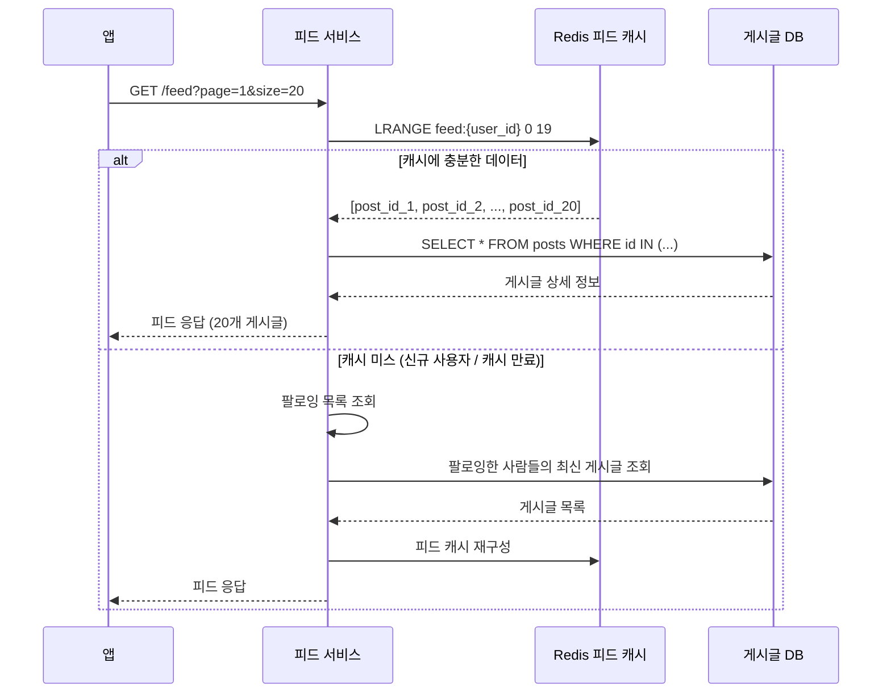

---

## 6. Redis 피드 캐시 설계

```python
class FeedCache:
    def __init__(self, redis, max_feed_size=1000):
        self.redis = redis
        self.max_size = max_feed_size

    def add_post_to_followers(self, post_id: int, follower_ids: list[int]):
        """게시글을 팔로워들의 피드에 추가"""
        pipe = self.redis.pipeline()

        for follower_id in follower_ids:
            key = f"feed:{follower_id}"
            # 맨 앞에 추가 (최신순)
            pipe.lpush(key, post_id)
            # 최근 1000개만 유지
            pipe.ltrim(key, 0, self.max_size - 1)
            # TTL 설정 (7일)
            pipe.expire(key, 604800)

        pipe.execute()

    def get_feed(self, user_id: int, start: int = 0, count: int = 20) -> list:
        """피드 조회 (페이지네이션)"""
        key = f"feed:{user_id}"
        return self.redis.lrange(key, start, start + count - 1)

    def remove_post_from_feed(self, post_id: int, follower_ids: list[int]):
        """게시글 삭제 시 피드에서 제거"""
        pipe = self.redis.pipeline()
        for follower_id in follower_ids:
            pipe.lrem(f"feed:{follower_id}", 0, post_id)
        pipe.execute()
```

---

## 7. 피드 랭킹 알고리즘

단순 시간 순서 외에 어떤 게시글을 상단에 보여줄지 결정합니다.

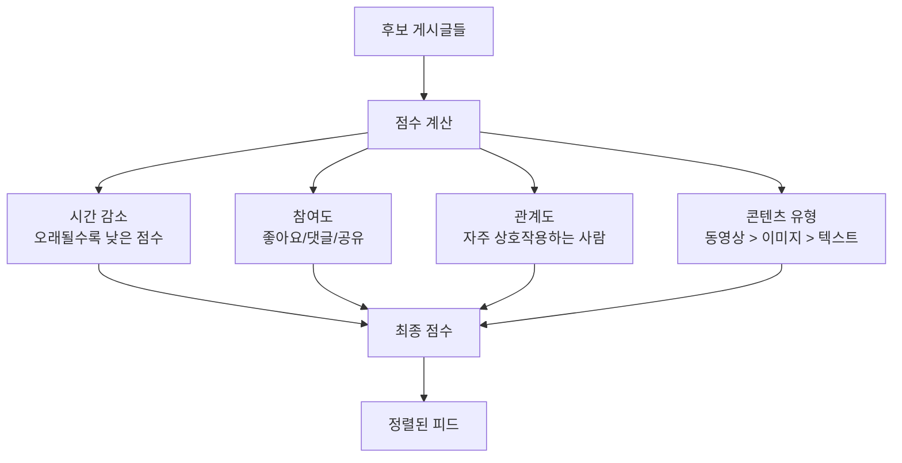

**간단한 랭킹 점수 공식:**
```python
import math
from datetime import datetime

def calculate_score(post: dict, user_interactions: dict) -> float:
    """
    페이스북 에지 랭크(EdgeRank) 유사 알고리즘
    score = affinity × weight × time_decay
    """
    # 1. 시간 감소 (1시간마다 감소)
    age_hours = (datetime.now() - post['created_at']).total_seconds() / 3600
    time_decay = 1 / (1 + age_hours) ** 1.5

    # 2. 참여도 가중치
    engagement = (
        post['likes'] * 1.0 +
        post['comments'] * 2.0 +
        post['shares'] * 3.0 +
        post['saves'] * 2.5
    )

    # 3. 관계 친밀도 (최근 30일 상호작용 기반)
    author_id = post['author_id']
    affinity = user_interactions.get(author_id, 0)
    affinity_score = math.log(1 + affinity)

    # 4. 콘텐츠 유형 가중치
    content_weights = {'video': 1.5, 'image': 1.2, 'text': 1.0}
    content_weight = content_weights.get(post['type'], 1.0)

    return time_decay * (1 + engagement) * (1 + affinity_score) * content_weight

def rank_feed(posts: list, user_id: int) -> list:
    user_interactions = get_user_interactions(user_id, days=30)
    scored = [(post, calculate_score(post, user_interactions)) for post in posts]
    return [post for post, _ in sorted(scored, key=lambda x: x[1], reverse=True)]
```

---

## 8. 유명인(셀럽) 문제 해결

팔로워 1000만 명인 BTS가 게시글을 올리면 1000만 건의 캐시 업데이트가 필요합니다.

```mermaid
graph TD
    CelebPost[셀럽 게시글 작성] --> CelebDB[게시글 DB 저장]
    CelebPost --> CelebCache[셀럽 피드 캐시<br/>celeb:{user_id}]

    UserFeedReq[사용자 피드 요청] --> NormalFeed[일반 팔로잉 피드<br/>Redis에서]
    UserFeedReq --> CelebCheck{팔로우한 셀럽?}
    CelebCheck -->|Yes| CelebFetch[셀럽 게시글 가져오기]
    CelebFetch --> Merge[피드 병합 + 랭킹]
    NormalFeed --> Merge
    Merge --> Final[최종 피드]
```

```python
CELEBRITY_THRESHOLD = 10000  # 팔로워 10만 이상 = 셀럽

async def get_feed(user_id: int, page: int = 0, size: int = 20) -> list:
    """하이브리드 피드 조회"""

    # 1. 일반 팔로잉 피드 (캐시에서)
    normal_feed = await cache.get_feed(user_id, page * size, size * 2)

    # 2. 팔로우한 셀럽의 최신 게시글 (별도 조회)
    followed_celebs = await get_followed_celebs(user_id)
    celeb_posts = []
    for celeb_id in followed_celebs:
        celeb_cache_key = f"celeb_posts:{celeb_id}"
        posts = await cache.get(celeb_cache_key) or \
                await db.get_recent_posts(celeb_id, limit=10)
        celeb_posts.extend(posts)

    # 3. 병합 및 랭킹
    all_posts = normal_feed + celeb_posts
    ranked = rank_feed(all_posts, user_id)

    return ranked[page * size:(page + 1) * size]
```

---

## 9. 데이터베이스 스키마

```sql
-- 게시글 테이블
CREATE TABLE posts (
    id              BIGINT PRIMARY KEY,
    author_id       BIGINT NOT NULL,
    content         TEXT,
    type            ENUM('text', 'image', 'video'),
    media_urls      JSON,           -- 이미지/동영상 URL 목록
    like_count      INT DEFAULT 0,
    comment_count   INT DEFAULT 0,
    share_count     INT DEFAULT 0,
    created_at      DATETIME NOT NULL,
    is_deleted      BOOLEAN DEFAULT FALSE,
    INDEX idx_author_created (author_id, created_at DESC)
);

-- 팔로우 테이블
CREATE TABLE follows (
    follower_id     BIGINT NOT NULL,  -- 팔로우 하는 사람
    followee_id     BIGINT NOT NULL,  -- 팔로우 받는 사람
    created_at      DATETIME NOT NULL,
    PRIMARY KEY (follower_id, followee_id),
    INDEX idx_followee (followee_id)  -- "A를 팔로우하는 사람" 조회용
);

-- 좋아요 테이블
CREATE TABLE likes (
    user_id         BIGINT NOT NULL,
    post_id         BIGINT NOT NULL,
    created_at      DATETIME NOT NULL,
    PRIMARY KEY (user_id, post_id),
    INDEX idx_post_id (post_id)
);
```

---

## 10. 무한 스크롤 구현

커서 기반 페이지네이션이 오프셋 기반보다 효율적입니다.

```mermaid
graph TD
    First[첫 요청<br/>GET /feed] --> Return20[20개 반환<br/>+ cursor: "last_post_id"]
    Return20 --> Scroll[사용자 스크롤]
    Scroll --> Next[GET /feed?cursor=last_post_id]
    Next --> Return20More[다음 20개 반환<br/>+ 새 cursor]
```

```python
# 오프셋 기반 (비효율)
# SELECT * FROM posts ORDER BY created_at DESC LIMIT 20 OFFSET 1000
# → 1000개를 읽고 버린 후 20개 반환

# 커서 기반 (효율적)
def get_feed_cursor(user_id: int, cursor: int = None, size: int = 20):
    if cursor:
        # cursor(post_id)보다 오래된 게시글 조회
        posts = db.query("""
            SELECT p.* FROM posts p
            JOIN follows f ON f.followee_id = p.author_id
            WHERE f.follower_id = ?
            AND p.id < ?
            ORDER BY p.id DESC
            LIMIT ?
        """, user_id, cursor, size + 1)
    else:
        posts = db.query("""
            SELECT p.* FROM posts p
            JOIN follows f ON f.followee_id = p.author_id
            WHERE f.follower_id = ?
            ORDER BY p.id DESC
            LIMIT ?
        """, user_id, size + 1)

    has_more = len(posts) > size
    posts = posts[:size]

    next_cursor = posts[-1]['id'] if has_more and posts else None

    return {
        'posts': posts,
        'next_cursor': next_cursor,
        'has_more': has_more
    }
```

---

## 11. 게시글 삭제 처리

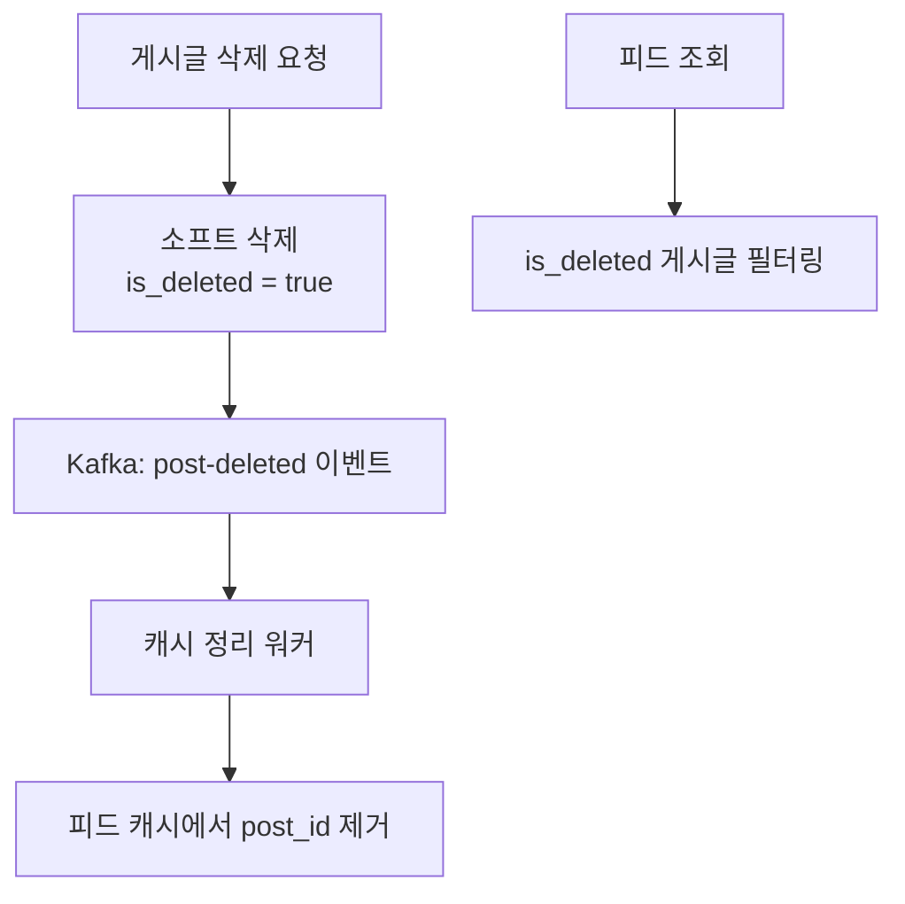

---

## 12. 극한 시나리오: BTS 컴백 공지 순간

BTS 팔로워 7000만 명에게 동시에 피드 업데이트가 필요한 경우:

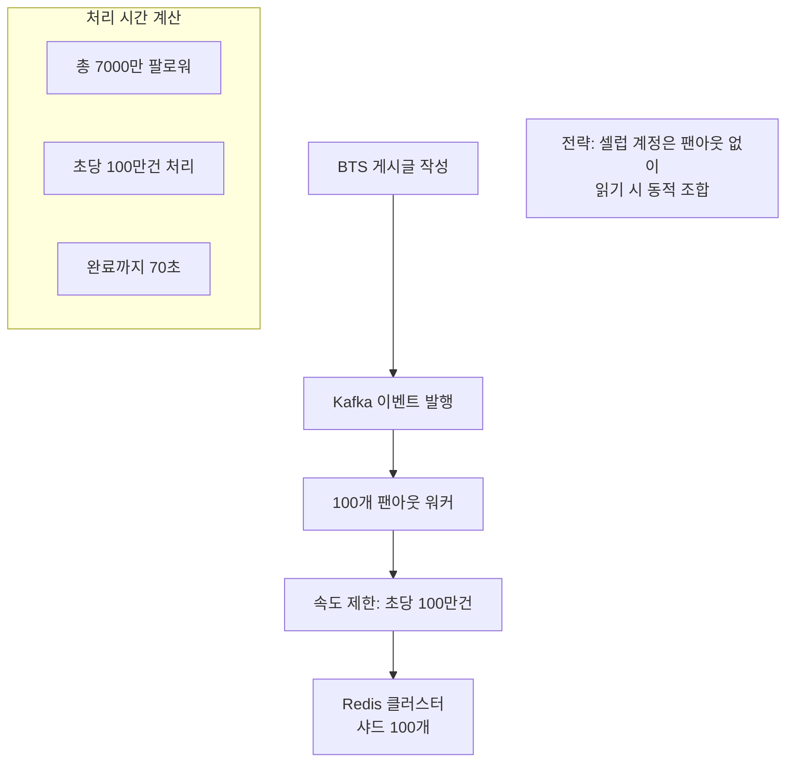

**셀럽 계정 특별 처리:**
```python
async def fanout_post(post_id: int, author_id: int):
    follower_count = await get_follower_count(author_id)

    if follower_count > CELEBRITY_THRESHOLD:
        # 셀럽: 팬아웃 생략, 셀럽 게시글 캐시만 업데이트
        await cache.set(
            f"celeb_latest:{author_id}",
            post_id,
            ex=86400
        )
        # 피드 조회 시 셀럽 게시글을 동적으로 합침
        return

    # 일반 사용자: 전체 팬아웃
    followers = await get_followers_in_batches(author_id, batch_size=5000)
    for batch in followers:
        await feed_cache.add_post_to_followers(post_id, batch)
        await asyncio.sleep(0.01)  # 속도 조절
```

---

## 완성된 뉴스피드 아키텍처

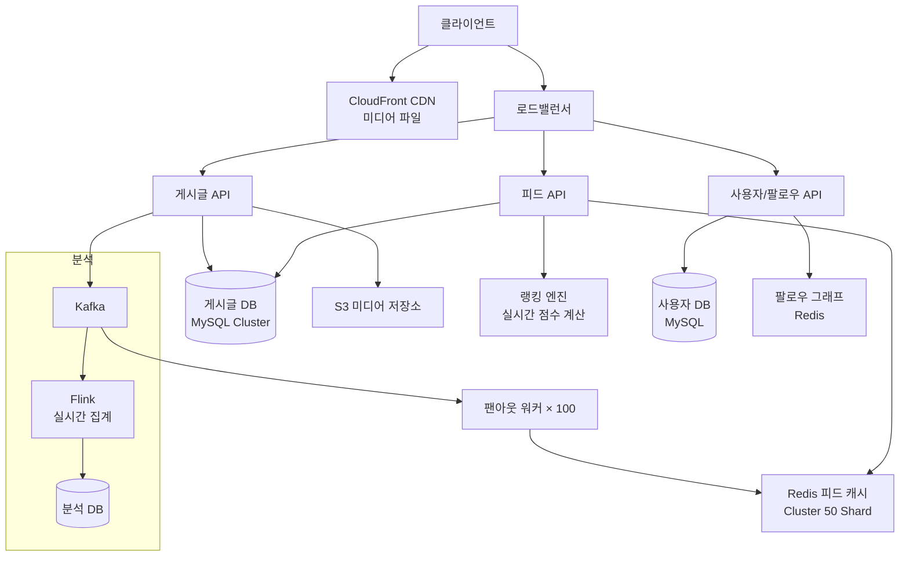

---

## 핵심 설계 결정 요약

| 결정 사항 | 선택 | 이유 |
|----------|------|------|
| 팬아웃 전략 | 하이브리드 | 일반/셀럽 계정 차별화 |
| 피드 저장 | Redis List | O(1) 추가, 범위 조회 |
| 랭킹 | 시간+참여도+관계도 | 관련성 높은 피드 |
| 페이지네이션 | 커서 기반 | 효율적 대용량 처리 |
| 셀럽 처리 | 읽기 시 동적 합산 | 쓰기 비용 방지 |
| 미디어 | S3 + CDN | 비용 효율 + 글로벌 배포 |
