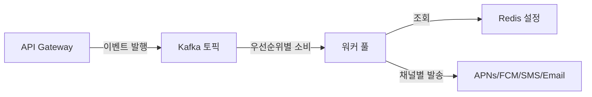
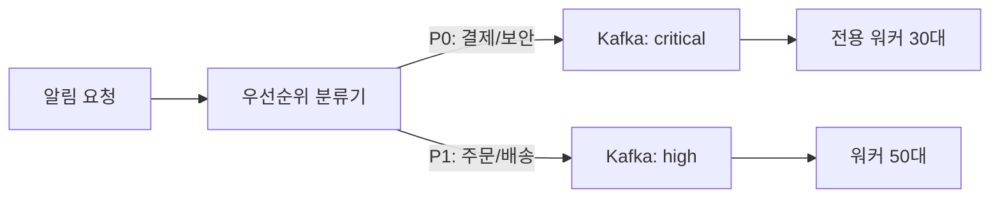
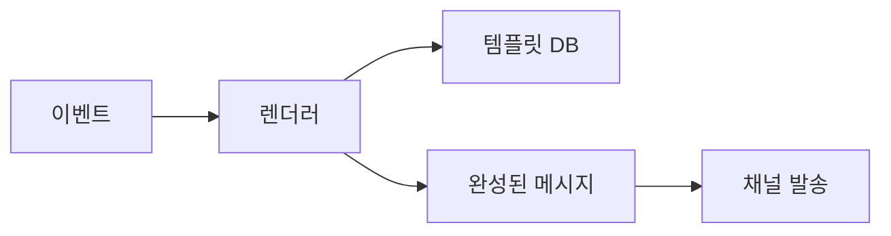
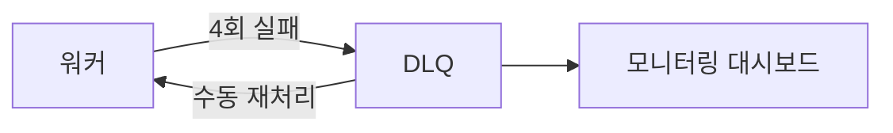
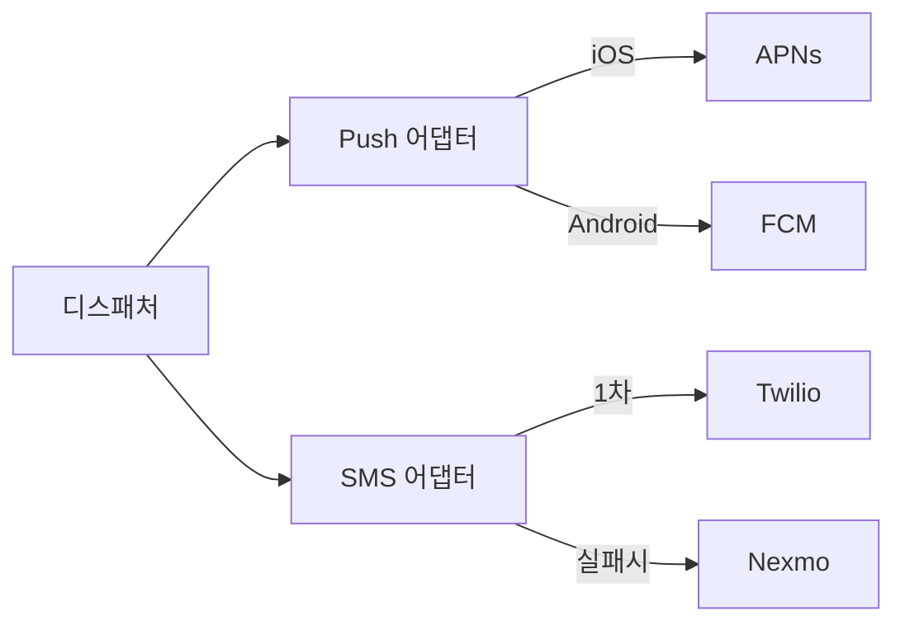

블랙프라이데이 자정, 쿠팡이 1억 명에게 동시에 "특가 시작!" 푸시를 보낸다. 10초 안에 전달되어야 한다. 단일 서버가 APNs와 FCM을 1억 번 직접 호출하면 서버는 즉시 죽는다. 알림 하나를 보내는 것은 쉽다. **신뢰할 수 있게, 대량으로, 빠르게, 중복 없이** 보내는 것이 시스템 설계의 전부다.

> **비유**: 대형 우체국 분류 센터와 같다. 1억 통의 편지가 동시에 들어오면, 긴급·일반으로 분류하고, 각 배달부(APNs, FCM, Twilio, SendGrid)에게 적절히 배분하고, 배달 실패 시 재시도하고, 수신 거부 처리를 하고, 중복 발송을 막아야 한다. 이 모든 것이 동시에 일어난다. 우체국 직원 한 명(단일 서버)이 1억 통을 들고 직접 뛰어가면 어떻게 되는가? 이 글이 그 물음에 대한 답이다.

---

## 1. 요구사항 분석 — 무엇을 만들어야 하는가

설계를 시작하기 전에 "무엇을" 만들지를 정의해야 한다. 요구사항을 모르면 기술 선택이 근거 없는 추측이 된다.

### 1-1. 기능 요구사항

| 채널 | 대상 | 특이사항 |
|------|------|---------|
| 모바일 푸시 (iOS APNs) | iPhone 사용자 | HTTP/2 기반, 디바이스 토큰 필수 |
| 모바일 푸시 (Android FCM) | Android 사용자 | HTTP 기반, Registration Token |
| 이메일 | 전체 회원 | 마케팅·거래 알림, 수신 거부 법적 의무 |
| SMS | 인증·긴급 알림 | 비용이 높아 선별적 발송 |
| 인앱 알림 (In-App) | 앱 활성 사용자 | WebSocket 또는 polling |

**알림 우선순위**

- **P0 (Critical)**: 보안 로그인 알림, 카드 결제 완료, 이상 거래 감지. 10초 이내 전달 필수.
- **P1 (High)**: 주문 완료, 배송 도착, 계좌 이체. 30초 이내.
- **P2 (Normal)**: 댓글, 팔로우, 좋아요. 5분 이내.
- **P3 (Low)**: 마케팅 캠페인, 이벤트 안내. 수 시간 이내.

**반드시 구현해야 하는 기능**

1. 우선순위 큐 — P0 알림이 P3 마케팅 알림에 밀리면 안 됨
2. 사용자별 수신 설정 — 채널·카테고리 ON/OFF, 방해 금지 시간
3. Rate Limiting — 사용자당 하루 최대 알림 수 제한
4. 재시도 + 지수 백오프 — APNs/FCM 일시 장애 복구
5. 중복 발송 방지 — Kafka At-Least-Once 부작용 차단
6. 전달 보장 (Transactional Outbox) — DB 트랜잭션과 알림 발행 원자성
7. 템플릿 엔진 — 메시지 포맷 표준화 및 다국어 지원

### 1-2. 비기능 요구사항

| 항목 | 목표 |
|------|------|
| P0 알림 전달 지연 | 10초 이내 (99th percentile) |
| 알림 전달률 | 99.5% 이상 |
| 중복 발송 | 0건/일 (마케팅), 0건/일 (결제) |
| 일 처리량 | 1억 건 이상 |
| 가용성 | 99.9% (월 43분 다운타임 허용) |
| 처리량 규모 | 평균 1,200 QPS, 피크 5,000 QPS |

### 1-3. 규모 추정

```
MAU: 5,000만 명
일 알림 발송:
  - 모바일 푸시:  6,000만 건/일 →  694 QPS 평균, 2,000 QPS 피크
  - 이메일:       2,000만 건/일 →  231 QPS 평균
  - SMS:            500만 건/일 →   58 QPS 평균
  - 인앱 알림:   1,500만 건/일 →  174 QPS 평균
합계:            1억 건/일 → 1,157 QPS 평균, ~5,000 QPS 피크 (블프)

알림 로그 저장 (90일 보관):
  1억 건/일 × 1KB/건 × 90일 = 9TB
  → Cassandra 클러스터 (write-heavy 시계열)

사용자 설정 데이터:
  5,000만 명 × 200B = 10GB → Redis (전체 메모리 캐시 가능)
```

---

## 2. DB 선택 — WHY가 없으면 기술 선택이 아닌 복권 추첨이다

알림 시스템에는 세 종류의 데이터가 있다. 각각의 특성이 완전히 다르다. 하나의 DB로 모두 처리하면 각각이 최악의 성능을 낸다.

### 2-1. 알림 로그 → Cassandra를 선택하는 이유

**특성 분석**

알림 로그는 "항상 쓰이고, 최근 것만 읽힌다"는 특성을 가진다.

- Write 패턴: 1억 건/일, 초당 1,200건 INSERT
- Read 패턴: `SELECT * FROM notifications WHERE user_id = ? ORDER BY created_at DESC LIMIT 20`
- 데이터 생명주기: 90일 후 삭제 (TTL)
- 수정/삭제: 거의 없음 (append-only)

**후보 비교**

| DB | 장점 | 단점 | 알림 로그에 적합한가 |
|----|------|------|---------------------|
| MySQL (RDS) | 트랜잭션, 복잡한 쿼리 | 초당 수천 INSERT 시 lock 경합, 수평 확장 어려움 | 부적합 (write 병목) |
| MongoDB | 유연한 스키마, 문서 단위 조회 | 대량 write 시 WiredTiger lock 경합, sharding 복잡 | 부분 적합 |
| DynamoDB | 관리형, 수평 확장 자동 | 복잡한 쿼리 불가, 비용 예측 어려움, 핫 파티션 위험 | 부분 적합 |
| **Cassandra** | **write-heavy에 최적화**, **LSM Tree로 순차 쓰기**, **TTL 기본 지원**, **선형 수평 확장** | 복잡한 JOIN 불가, eventual consistency | **최적** |

**Cassandra를 선택하는 근거**

Cassandra의 내부 구조인 LSM Tree(Log-Structured Merge Tree)는 모든 쓰기를 메모리(MemTable)에 먼저 받고 순차적으로 디스크에 내린다. 랜덤 쓰기가 없다. MySQL InnoDB가 인덱스 업데이트를 위해 랜덤 I/O를 발생시키는 것과 정반대다.

알림 로그의 조회 패턴은 `user_id`로 파티션하고 `created_at`으로 클러스터링하면 단일 노드에서 정렬 없이 반환된다. TTL을 컬럼 단위로 설정하면 90일 후 자동 삭제된다. 별도 배치 삭제 작업이 필요 없다.

```java
// Cassandra 스키마 — 알림 로그
// user_id로 파티션: 같은 사용자의 알림이 같은 노드에 모임
// created_at으로 클러스터링: 최신순 조회가 인덱스 없이 빠름
@Table(name = "notifications")
public class NotificationLog {

    @PartitionKey
    @Column(name = "user_id")
    private String userId;

    @ClusteringColumn(ordering = ClusteringOrder.DESCENDING)
    @Column(name = "created_at")
    private Instant createdAt;

    @Column(name = "notification_id")
    private UUID notificationId;

    @Column(name = "channel")       // PUSH, EMAIL, SMS, IN_APP
    private String channel;

    @Column(name = "priority")      // P0, P1, P2, P3
    private String priority;

    @Column(name = "title")
    private String title;

    @Column(name = "body")
    private String body;

    @Column(name = "status")        // SENT, FAILED, DELIVERED
    private String status;

    @Column(name = "provider_response")
    private String providerResponse;
}

// Repository
@Repository
public class NotificationLogRepository {

    private final CassandraTemplate cassandraTemplate;

    // 사용자 알림 목록 조회 — 파티션 키 직접 조회이므로 전체 스캔 없음
    public List<NotificationLog> findRecentByUserId(String userId, int limit) {
        Select select = QueryBuilder.selectFrom("notifications")
            .all()
            .whereColumn("user_id").isEqualTo(QueryBuilder.literal(userId))
            .limit(limit)
            .build();
        return cassandraTemplate.select(select, NotificationLog.class);
    }

    // TTL 설정 — 90일 후 자동 삭제
    public void save(NotificationLog log) {
        Insert insert = QueryBuilder.insertInto("notifications")
            .value("user_id", QueryBuilder.literal(log.getUserId()))
            .value("created_at", QueryBuilder.literal(log.getCreatedAt()))
            .value("notification_id", QueryBuilder.literal(log.getNotificationId()))
            .value("status", QueryBuilder.literal(log.getStatus()))
            .usingTtl(7776000) // 90일 = 7,776,000초
            .build();
        cassandraTemplate.execute(insert);
    }
}
```

**안 하면 어떻게 되는가**: MySQL로 알림 로그를 구현하고 일 1억 건 INSERT를 시도하면 InnoDB의 인덱스 업데이트(secondary index on user_id, created_at)로 인해 write lock 경합이 발생하고 INSERT 지연이 수백ms로 늘어난다. 90일치 90억 건의 데이터를 날짜 기준으로 삭제하는 DELETE 배치가 테이블을 잠그는 동안 실시간 INSERT가 블로킹된다.

### 2-2. 사용자 수신 설정 → Redis를 선택하는 이유

**특성 분석**

사용자 설정은 "모든 알림 발송 전에 반드시 조회되는" 데이터다.

- Read 패턴: 알림 발송마다 1회, 초당 5,000회 조회
- Write 패턴: 사용자가 설정 변경 시, 드물게 발생
- 데이터 크기: 5,000만 명 × 200B = 10GB
- 요구 응답시간: 1ms 이내 (알림 발송 경로에 있어서 지연 최소화 필수)

**후보 비교**

| DB | Read 응답시간 | 5,000 QPS 처리 | 10GB 전체 캐시 | 적합도 |
|----|-------------|---------------|---------------|--------|
| MySQL | 1~5ms | 가능하나 커넥션 풀 압박 | 불가 (디스크 I/O) | 부적합 |
| PostgreSQL | 1~3ms | 가능하나 설정 복잡 | 불가 | 부적합 |
| **Redis** | **0.1~0.5ms** | **초당 10만+ 연산 지원** | **전체 메모리 상주 가능** | **최적** |
| Memcached | 0.1ms | 높음 | 가능 | 적합 (but TTL·자료구조 한계) |

**Redis를 선택하는 근거**

사용자 설정 10GB는 Redis r6g.xlarge(26GB 메모리) 하나에 전체가 들어간다. 모든 알림 발송 전 조회가 메모리 내에서 0.1ms에 완료된다. MySQL에 초당 5,000번 SELECT를 보내면 커넥션 풀이 포화되고 알림 발송 지연이 DB 조회 지연에 비례해서 늘어난다.

Redis Hash 자료구조로 사용자별 설정을 구조화하면 원하는 필드만 O(1)으로 읽을 수 있다.

```java
// 사용자 수신 설정 Redis 구조
// Key: user:preference:{userId}
// Type: Hash
// Field-Value: channel → enabled, quietHoursStart → "22:00", quietHoursEnd → "08:00", ...

@Service
public class UserPreferenceService {

    private final RedisTemplate<String, String> redisTemplate;
    private static final String PREFIX = "user:preference:";
    private static final Duration TTL = Duration.ofDays(30);

    public UserPreference getPreference(String userId) {
        String key = PREFIX + userId;
        Map<Object, Object> entries = redisTemplate.opsForHash().entries(key);

        if (entries.isEmpty()) {
            // Redis miss → DB에서 조회 후 캐시
            return loadFromDbAndCache(userId);
        }

        return UserPreference.builder()
            .pushEnabled(Boolean.parseBoolean((String) entries.get("pushEnabled")))
            .emailEnabled(Boolean.parseBoolean((String) entries.get("emailEnabled")))
            .smsEnabled(Boolean.parseBoolean((String) entries.get("smsEnabled")))
            .marketingEnabled(Boolean.parseBoolean((String) entries.get("marketingEnabled")))
            .quietHoursStart(LocalTime.parse((String) entries.getOrDefault("quietHoursStart", "22:00")))
            .quietHoursEnd(LocalTime.parse((String) entries.getOrDefault("quietHoursEnd", "08:00")))
            .timezone(ZoneId.of((String) entries.getOrDefault("timezone", "Asia/Seoul")))
            .dailyPushCap(Integer.parseInt((String) entries.getOrDefault("dailyPushCap", "20")))
            .build();
    }

    public void updatePreference(String userId, UserPreference preference) {
        String key = PREFIX + userId;
        Map<String, String> entries = new HashMap<>();
        entries.put("pushEnabled", String.valueOf(preference.isPushEnabled()));
        entries.put("emailEnabled", String.valueOf(preference.isEmailEnabled()));
        entries.put("smsEnabled", String.valueOf(preference.isSmsEnabled()));
        entries.put("marketingEnabled", String.valueOf(preference.isMarketingEnabled()));
        entries.put("quietHoursStart", preference.getQuietHoursStart().toString());
        entries.put("quietHoursEnd", preference.getQuietHoursEnd().toString());
        entries.put("timezone", preference.getTimezone().getId());
        entries.put("dailyPushCap", String.valueOf(preference.getDailyPushCap()));

        redisTemplate.opsForHash().putAll(key, entries);
        redisTemplate.expire(key, TTL);

        // DB 동기 업데이트 (캐시 갱신 후 DB Write)
        preferenceRepository.save(userId, preference);
    }

    private UserPreference loadFromDbAndCache(String userId) {
        UserPreference preference = preferenceRepository.findByUserId(userId)
            .orElse(UserPreference.defaultPreference());
        updatePreference(userId, preference);
        return preference;
    }
}
```

**안 하면 어떻게 되는가**: MySQL에 초당 5,000번 SELECT를 보내면 RDS db.r5.large의 최대 커넥션(640개)이 빠르게 포화된다. 알림 발송 경로의 병목이 비즈니스 로직이 아닌 DB 조회가 된다. 블랙프라이데이 피크에 사용자 설정 조회가 5ms → 50ms로 늘어나면 P0 알림 전달도 지연된다.

### 2-3. 메시지 큐 → Kafka를 선택하는 이유

**특성 분석**

알림 이벤트 큐는 "폭발적으로 들어오고, 여러 소비자가 가져가며, 장애가 나도 유실되면 안 된다"는 특성이 있다.

- 피크 발행량: 초당 5,000건 (블랙프라이데이)
- 소비자: 채널별 워커 독립 소비 (푸시 워커, SMS 워커, 이메일 워커)
- 내구성: 서버 재시작 후에도 미처리 메시지 유지
- 재처리: 실패한 메시지 재소비 가능

**후보 비교**

| MQ | 처리량 | 내구성 | 재소비 | 우선순위 분리 | 적합도 |
|----|--------|--------|--------|-------------|--------|
| RabbitMQ | 중간 | 있음 | 제한적 | Priority Queue 기본 지원 | 부분 적합 |
| AWS SQS | 낮음-중간 | 있음 | DLQ만 | 별도 큐 필요 | 소규모 적합 |
| Redis Pub/Sub | 매우 높음 | **없음 (메모리)** | 불가 | 불가 | 부적합 (유실) |
| **Kafka** | **매우 높음** | **디스크 영속** | **오프셋 기반 재소비** | **토픽 분리** | **최적** |

**Kafka를 선택하는 근거**

세 가지 이유로 Kafka가 유일한 선택이다.

첫째, **디커플링**: 알림 발행자(주문 서비스, 결제 서비스)가 Kafka에 이벤트를 발행하고 즉시 반환한다. 소비자(워커)가 느리거나 재시작 중이어도 발행자는 영향받지 않는다.

둘째, **재처리**: Kafka 오프셋을 커밋하지 않으면 워커 재시작 후 같은 메시지를 다시 소비할 수 있다. 이것이 At-Least-Once 전달의 기반이다.

셋째, **우선순위 분리**: 토픽을 `notifications-critical`, `notifications-high`, `notifications-normal`, `notifications-low`로 나누면 P0 전용 워커가 마케팅 알림 폭주에 전혀 영향받지 않는다.

```java
// Kafka 토픽별 발행 서비스
@Service
public class NotificationPublisher {

    private final KafkaTemplate<String, NotificationEvent> kafkaTemplate;

    // 토픽 이름 상수 — 우선순위별 분리
    private static final String TOPIC_CRITICAL = "notifications-critical";
    private static final String TOPIC_HIGH     = "notifications-high";
    private static final String TOPIC_NORMAL   = "notifications-normal";
    private static final String TOPIC_LOW      = "notifications-low";

    public CompletableFuture<SendResult<String, NotificationEvent>> publish(
            NotificationEvent event) {

        String topic = resolveTopic(event.getPriority());

        // 파티션 키 = userId → 같은 사용자 알림이 순서 보장
        return kafkaTemplate.send(topic, event.getUserId(), event)
            .toCompletableFuture()
            .exceptionally(ex -> {
                log.error("Kafka publish failed for user={} priority={}",
                    event.getUserId(), event.getPriority(), ex);
                // 발행 실패 시 Outbox 테이블에 PENDING 상태로 저장
                // Outbox Poller가 재발행 처리
                outboxRepository.markForRetry(event.getOutboxId());
                throw new RuntimeException(ex);
            });
    }

    private String resolveTopic(NotificationPriority priority) {
        return switch (priority) {
            case P0 -> TOPIC_CRITICAL;
            case P1 -> TOPIC_HIGH;
            case P2 -> TOPIC_NORMAL;
            case P3 -> TOPIC_LOW;
        };
    }
}
```

**Kafka 토픽 파티션 설계**

```
notifications-critical:  파티션 12개, 복제 3개, 전용 워커 30대
  → SLA: 발행 후 10초 이내 처리

notifications-high:      파티션 24개, 복제 3개, 워커 50대
  → SLA: 발행 후 30초 이내 처리

notifications-normal:    파티션 48개, 복제 2개, 워커 80대
  → SLA: 발행 후 5분 이내 처리

notifications-low:       파티션 96개, 복제 2개, 워커 100대 (속도 제한 적용)
  → SLA: 발행 후 수 시간 이내 처리
```

---

## 3. 전체 아키텍처



발행자(주문·결제·마케팅 서비스)가 알림 이벤트를 Kafka에 넣고 즉시 반환한다. 우선순위에 따라 다른 토픽에 적재되고, 전용 워커 풀이 소비한다. 워커는 발송 전에 Redis에서 사용자 수신 설정을 확인하고, 채널 어댑터를 통해 APNs/FCM/Twilio/SES를 호출한다. 모든 발송 결과는 Cassandra 알림 로그에 기록된다.

---

## 4. 우선순위 큐 설계 — 결제 알림이 마케팅 알림에 막히지 않는 이유

### 4-1. 단일 큐의 문제

블랙프라이데이 오전 10시, 마케팅팀이 P3 캠페인 알림 5,000만 건을 단일 Kafka 토픽에 발행했다고 가정한다. 그 직후 특정 사용자의 카드 결제 완료 알림(P0)이 들어온다. 단일 토픽에서 워커가 FIFO로 처리하면 P0 알림은 P3 알림 5,000만 건을 모두 처리한 후에야 전달된다. 수십 분 지연은 금융 서비스 기준으로 민원과 법적 분쟁 대상이다.

### 4-2. 토픽 분리 + 전용 워커



P0 전용 워커 30대는 오직 `notifications-critical` 토픽만 소비한다. P3 마케팅 알림 5,000만 건이 `notifications-low`를 가득 채워도 P0 워커는 전혀 영향받지 않는다. P0 워커는 APNs·FCM에 대한 HTTP/2 연결 풀도 전용으로 유지한다.

```java
// 우선순위 분류기 — 어떤 기준으로 P0를 판단하는가
@Component
public class NotificationPriorityClassifier {

    private static final Set<String> CRITICAL_EVENT_TYPES = Set.of(
        "PAYMENT_COMPLETED",
        "PAYMENT_FAILED",
        "SUSPICIOUS_LOGIN",
        "ACCOUNT_LOCKED",
        "OTP_REQUEST",
        "LARGE_TRANSFER_ALERT"
    );

    private static final Set<String> HIGH_EVENT_TYPES = Set.of(
        "ORDER_CONFIRMED",
        "DELIVERY_ARRIVED",
        "ORDER_CANCELLED",
        "REFUND_COMPLETED"
    );

    public NotificationPriority classify(String eventType, Map<String, Object> metadata) {
        if (CRITICAL_EVENT_TYPES.contains(eventType)) {
            return NotificationPriority.P0;
        }
        if (HIGH_EVENT_TYPES.contains(eventType)) {
            return NotificationPriority.P1;
        }
        // 마케팅 캠페인 플래그 확인
        if (Boolean.TRUE.equals(metadata.get("isCampaign"))) {
            return NotificationPriority.P3;
        }
        return NotificationPriority.P2;
    }
}

// P0 전용 Kafka Consumer
@Component
public class CriticalNotificationConsumer {

    // P0 전용 토픽만 구독
    @KafkaListener(
        topics = "notifications-critical",
        groupId = "notification-critical-worker",
        concurrency = "30",  // 30개 스레드 동시 소비
        containerFactory = "criticalKafkaListenerContainerFactory"
    )
    public void consume(
            @Payload NotificationEvent event,
            @Header(KafkaHeaders.RECEIVED_PARTITION) int partition,
            @Header(KafkaHeaders.OFFSET) long offset,
            Acknowledgment ack) {

        log.info("P0 알림 처리 시작: userId={} eventType={} partition={} offset={}",
            event.getUserId(), event.getEventType(), partition, offset);

        try {
            notificationDispatcher.dispatch(event);
            // 성공 시에만 오프셋 커밋
            ack.acknowledge();
            log.info("P0 알림 처리 완료: notificationId={}", event.getNotificationId());
        } catch (Exception e) {
            log.error("P0 알림 처리 실패: notificationId={}", event.getNotificationId(), e);
            // 오프셋 미커밋 → 재시도 (지수 백오프는 RetryTemplate에서 처리)
            throw e;
        }
    }
}
```

**안 하면 어떻게 되는가**: 쿠팡 실제 사례에서 블랙프라이데이 마케팅 알림 폭주 시 결제 완료 알림이 23분 지연된 경우가 있었다. 단일 토픽에서 FIFO로 처리하면 P0가 P3 뒤에 줄을 서야 한다. 이것은 설계 선택이 아닌 사고다.

---

## 5. 템플릿 엔진 — 왜 메시지를 코드에 하드코딩하면 안 되는가

### 5-1. 하드코딩의 문제

```java
// 나쁜 예 — 절대 이렇게 하지 말 것
String message = "주문 " + orderId + "이 완료되었습니다. 배송 예정일: " + deliveryDate;
```

이 방식의 문제:
1. 한국어/영어/일본어 지원 시 코드에 if-else 언어 분기가 쌓인다.
2. 마케팅팀이 문구 변경을 요청할 때마다 배포가 필요하다.
3. A/B 테스트를 위한 다른 문구 버전을 코드로 관리해야 한다.
4. 동일한 이벤트에서 푸시·이메일·SMS가 다른 포맷을 쓰면 세 곳을 각각 수정해야 한다.

### 5-2. 템플릿 엔진 설계



```java
// 템플릿 엔티티
@Entity
@Table(name = "notification_templates")
public class NotificationTemplate {

    @Id
    @GeneratedValue(strategy = GenerationType.IDENTITY)
    private Long id;

    @Column(name = "event_type", nullable = false)
    private String eventType;           // "ORDER_CONFIRMED"

    @Column(name = "channel", nullable = false)
    @Enumerated(EnumType.STRING)
    private NotificationChannel channel; // PUSH, EMAIL, SMS

    @Column(name = "locale", nullable = false)
    private String locale;              // "ko", "en", "ja"

    @Column(name = "title_template")
    private String titleTemplate;       // "주문 {{orderId}} 확인되었습니다"

    @Column(name = "body_template", columnDefinition = "TEXT")
    private String bodyTemplate;        // "{{productName}} 외 {{itemCount}}건..."

    @Column(name = "version")
    private int version;                // A/B 테스트용 버전

    @Column(name = "active")
    private boolean active;
}

// 템플릿 렌더러 — Mustache 기반
@Service
public class NotificationTemplateRenderer {

    private final NotificationTemplateRepository templateRepository;
    // 템플릿을 Redis에 캐시 (DB 조회 최소화)
    private final RedisTemplate<String, NotificationTemplate> redisTemplate;
    private static final Duration TEMPLATE_CACHE_TTL = Duration.ofHours(1);

    public RenderedNotification render(
            String eventType,
            NotificationChannel channel,
            String locale,
            Map<String, Object> variables) {

        NotificationTemplate template = getTemplate(eventType, channel, locale);

        // Mustache 기반 변수 치환
        String title = Mustache.compiler()
            .compile(template.getTitleTemplate())
            .execute(variables);

        String body = Mustache.compiler()
            .compile(template.getBodyTemplate())
            .execute(variables);

        return RenderedNotification.builder()
            .title(title)
            .body(body)
            .channel(channel)
            .locale(locale)
            .templateVersion(template.getVersion())
            .build();
    }

    private NotificationTemplate getTemplate(
            String eventType, NotificationChannel channel, String locale) {

        String cacheKey = String.format("template:%s:%s:%s", eventType, channel, locale);
        NotificationTemplate cached = redisTemplate.opsForValue().get(cacheKey);

        if (cached != null) return cached;

        NotificationTemplate template = templateRepository
            .findByEventTypeAndChannelAndLocaleAndActive(eventType, channel, locale, true)
            .orElseThrow(() -> new TemplateNotFoundException(
                "Template not found: " + eventType + "/" + channel + "/" + locale));

        redisTemplate.opsForValue().set(cacheKey, template, TEMPLATE_CACHE_TTL);
        return template;
    }
}
```

**템플릿 DB 예시**

```sql
INSERT INTO notification_templates
  (event_type, channel, locale, title_template, body_template, version, active)
VALUES
  ('ORDER_CONFIRMED', 'PUSH', 'ko',
   '주문이 확인되었습니다',
   '{{productName}} 외 {{itemCount}}건이 결제되었습니다. 예상 배송일: {{deliveryDate}}',
   1, true),

  ('ORDER_CONFIRMED', 'EMAIL', 'ko',
   '[주문확인] {{orderId}} 결제가 완료되었습니다',
   '<html>...<b>{{productName}}</b>...</html>',
   1, true),

  ('ORDER_CONFIRMED', 'SMS', 'ko',
   null, -- SMS는 제목 없음
   '[주문확인] {{productName}} 등 {{itemCount}}건 결제완료. 배송조회: {{trackingUrl}}',
   1, true);
```

---

## 6. 사용자 설정 필터링 — 보내기 전에 반드시 확인해야 하는 것들

### 6-1. 필터링 파이프라인

모든 알림은 발송 전에 세 가지 게이트를 통과해야 한다. 하나라도 통과하지 못하면 발송하지 않는다.

```java
@Service
public class NotificationFilterChain {

    private final UserPreferenceService preferenceService;
    private final RateLimitService rateLimitService;
    private final QuietHoursService quietHoursService;

    /**
     * 반환값:
     *   FilterResult.PASS     → 즉시 발송
     *   FilterResult.SKIP     → 발송하지 않음 (수신 거부)
     *   FilterResult.DELAY    → 방해 금지 해제 시각에 재스케줄
     *   FilterResult.THROTTLE → 일일 상한 초과, 드롭
     */
    public FilterResult filter(NotificationEvent event) {

        UserPreference pref = preferenceService.getPreference(event.getUserId());

        // 게이트 1: 채널 수신 설정 확인
        // P0(보안/결제)는 수신 거부 설정 무시 — 항상 통과
        if (event.getPriority() != NotificationPriority.P0) {
            if (!isChannelEnabled(pref, event.getChannel())) {
                log.debug("채널 비활성: userId={} channel={}", event.getUserId(), event.getChannel());
                return FilterResult.SKIP;
            }
        }

        // 게이트 2: Rate Limiting (일일 상한)
        // P0, P1은 상한 미적용. P2, P3만 적용
        if (event.getPriority().ordinal() >= NotificationPriority.P2.ordinal()) {
            RateLimitResult rateResult = rateLimitService.checkAndIncrement(
                event.getUserId(), event.getChannel(), event.getCategory());
            if (rateResult.isExceeded()) {
                log.debug("일일 상한 초과: userId={} category={} count={}",
                    event.getUserId(), event.getCategory(), rateResult.getCurrentCount());
                return FilterResult.THROTTLE;
            }
        }

        // 게이트 3: 방해 금지 시간
        // P0, P1은 방해 금지 무시
        if (event.getPriority().ordinal() >= NotificationPriority.P2.ordinal()) {
            if (quietHoursService.isInQuietHours(event.getUserId(), pref)) {
                LocalTime resumeAt = pref.getQuietHoursEnd();
                log.debug("방해 금지 시간: userId={} resumeAt={}", event.getUserId(), resumeAt);
                return FilterResult.delay(resumeAt);
            }
        }

        return FilterResult.PASS;
    }

    private boolean isChannelEnabled(UserPreference pref, NotificationChannel channel) {
        return switch (channel) {
            case PUSH  -> pref.isPushEnabled();
            case EMAIL -> pref.isEmailEnabled();
            case SMS   -> pref.isSmsEnabled();
            case IN_APP -> true; // 인앱은 항상 허용
        };
    }
}
```

### 6-2. Rate Limiting — 사용자당 일일 알림 상한

```java
@Service
public class RateLimitService {

    private final RedisTemplate<String, String> redisTemplate;

    // 카테고리별 일일 상한
    private static final Map<String, Integer> DAILY_CAP = Map.of(
        "MARKETING",  3,   // 마케팅 알림 하루 최대 3개
        "SOCIAL",    10,   // 좋아요·댓글·팔로우
        "SYSTEM",   100,   // 시스템 알림 (사실상 무제한)
        "ORDER",     20    // 주문·배송 관련
    );

    public RateLimitResult checkAndIncrement(
            String userId, NotificationChannel channel, String category) {

        int cap = DAILY_CAP.getOrDefault(category, 20);
        String key = String.format("rate:%s:%s:%s:%s",
            userId, channel, category, LocalDate.now());

        // INCR는 원자적 연산 → 경쟁 조건 없음
        Long count = redisTemplate.opsForValue().increment(key);

        if (count == 1) {
            // 첫 번째 카운트 — 자정까지 TTL 설정
            long secondsUntilMidnight = ChronoUnit.SECONDS.between(
                LocalTime.now(), LocalTime.MIDNIGHT.minusSeconds(1));
            redisTemplate.expire(key, Duration.ofSeconds(secondsUntilMidnight));
        }

        return RateLimitResult.builder()
            .exceeded(count > cap)
            .currentCount(count.intValue())
            .cap(cap)
            .build();
    }
}
```

### 6-3. 방해 금지 시간 — 자정 넘어가는 케이스 처리

```java
@Service
public class QuietHoursService {

    /**
     * 22:00 ~ 08:00 방해 금지 처리.
     * 자정 넘어가는 구간(start > end)을 올바르게 처리해야 한다.
     * 나쁜 예: start <= now && now <= end → 22:00~08:00에서 틀림
     * 올바른 예: start > end이면 (now >= start || now < end)로 판단
     */
    public boolean isInQuietHours(String userId, UserPreference pref) {
        ZoneId userZone = pref.getTimezone();
        LocalTime userNow = LocalTime.now(userZone);

        LocalTime start = pref.getQuietHoursStart(); // 22:00
        LocalTime end   = pref.getQuietHoursEnd();   // 08:00

        // 자정을 넘어가는 구간 (22:00 ~ 08:00)
        if (start.isAfter(end)) {
            return userNow.compareTo(start) >= 0 || userNow.compareTo(end) < 0;
        }
        // 같은 날 내 구간 (예: 13:00 ~ 14:00)
        return userNow.compareTo(start) >= 0 && userNow.compareTo(end) < 0;
    }
}
```

---

## 7. 재시도 전략 — 지수 백오프가 왜 필수인가

### 7-1. 즉시 재시도의 문제 — Thundering Herd

APNs가 일시적으로 느려졌을 때 워커 100대가 동시에 즉시 재시도하면 어떻게 되는가. 처음에 느려진 이유가 부하였다면, 100대의 동시 재시도는 그 부하를 몇 배로 증폭한다. APNs가 IP를 차단하면 이후 모든 정상 알림도 전송 불가 상태가 된다.

### 7-2. 지수 백오프 + 지터 구현

```java
@Service
public class RetryService {

    private static final int MAX_RETRIES = 4;
    private static final long BASE_DELAY_MS = 1_000;   // 1초
    private static final long MAX_DELAY_MS  = 60_000;  // 60초

    private final DeadLetterQueueService dlqService;

    /**
     * 지수 백오프 재시도:
     *   1회 실패 → 1초 + 지터(0~1초) 대기
     *   2회 실패 → 2초 + 지터 대기
     *   3회 실패 → 4초 + 지터 대기
     *   4회 실패 → 8초 + 지터 대기 → 마지막 시도
     *   5회 실패 → DLQ로 이동
     *
     * 지터 이유: 100대 워커가 정확히 같은 시각에 재시도하면
     * Thundering Herd. 0~1초 랜덤 지터로 분산.
     */
    public <T> T executeWithRetry(
            Supplier<T> operation,
            NotificationEvent event) throws Exception {

        Exception lastException = null;

        for (int attempt = 0; attempt <= MAX_RETRIES; attempt++) {
            try {
                T result = operation.get();
                if (attempt > 0) {
                    log.info("재시도 성공: notificationId={} attempt={}",
                        event.getNotificationId(), attempt);
                }
                return result;

            } catch (PermanentFailureException e) {
                // 영구 실패 (잘못된 토큰, 존재하지 않는 수신자)
                // 재시도하지 않고 즉시 포기
                log.warn("영구 실패 — 재시도 불가: notificationId={} reason={}",
                    event.getNotificationId(), e.getMessage());
                handlePermanentFailure(e, event);
                throw e;

            } catch (TransientFailureException e) {
                // 일시적 실패 (5xx, 타임아웃, 네트워크 오류)
                lastException = e;

                if (attempt == MAX_RETRIES) {
                    log.error("최대 재시도 초과 → DLQ 이동: notificationId={} attempts={}",
                        event.getNotificationId(), attempt + 1);
                    dlqService.enqueue(event, e.getMessage());
                    throw e;
                }

                long delay = calculateDelay(attempt);
                log.warn("일시적 실패, {}ms 후 재시도 (attempt={}/{}): notificationId={}",
                    delay, attempt + 1, MAX_RETRIES, event.getNotificationId());

                Thread.sleep(delay);
            }
        }

        throw new RuntimeException("Unexpected retry loop exit", lastException);
    }

    private long calculateDelay(int attempt) {
        // 지수 증가: 1000, 2000, 4000, 8000ms
        long exponential = BASE_DELAY_MS * (1L << attempt);
        // 상한 설정: 60초를 넘지 않도록
        long capped = Math.min(exponential, MAX_DELAY_MS);
        // 지터: 0~1000ms 랜덤 추가
        long jitter = ThreadLocalRandom.current().nextLong(0, 1000);
        return capped + jitter;
    }

    // 영구 실패 처리 — 잘못된 디바이스 토큰 삭제
    private void handlePermanentFailure(
            PermanentFailureException e, NotificationEvent event) {

        if (e.getErrorCode() == ErrorCode.INVALID_DEVICE_TOKEN) {
            deviceTokenRepository.invalidate(
                event.getUserId(), event.getDeviceToken());
            log.info("무효 토큰 삭제: userId={} token={}",
                event.getUserId(), event.getDeviceToken());
        }
    }
}
```

### 7-3. DLQ (Dead Letter Queue) — 최종 실패 알림 처리



DLQ는 최종 실패한 알림의 무덤이 아니라 분석과 재처리의 출발점이다.

```java
@Service
public class DeadLetterQueueService {

    private final KafkaTemplate<String, DeadLetterEvent> kafkaTemplate;
    private static final String DLQ_TOPIC = "notifications-dlq";

    public void enqueue(NotificationEvent originalEvent, String failureReason) {
        DeadLetterEvent dlqEvent = DeadLetterEvent.builder()
            .originalEvent(originalEvent)
            .failureReason(failureReason)
            .failedAt(Instant.now())
            .retryCount(originalEvent.getRetryCount())
            .build();

        kafkaTemplate.send(DLQ_TOPIC, originalEvent.getUserId(), dlqEvent);
        log.error("DLQ 적재: notificationId={} reason={}",
            originalEvent.getNotificationId(), failureReason);

        // P0 알림이 DLQ에 들어오면 즉시 PagerDuty 경보
        if (originalEvent.getPriority() == NotificationPriority.P0) {
            alertService.sendPagerDutyAlert(
                "P0 알림 DLQ 적재",
                "notificationId: " + originalEvent.getNotificationId() +
                ", reason: " + failureReason,
                AlertSeverity.CRITICAL
            );
        }
    }

    // 장애 복구 후 DLQ 재처리 — 운영팀이 수동으로 트리거
    @PostMapping("/admin/dlq/replay")
    public ResponseEntity<String> replayDlq(
            @RequestParam String fromTimestamp,
            @RequestParam(required = false) String priority) {

        // DLQ에서 특정 시간 이후의 이벤트를 원래 토픽으로 재발행
        int replayCount = dlqReplayService.replay(fromTimestamp, priority);
        return ResponseEntity.ok("재처리 시작: " + replayCount + "건");
    }
}
```

---

## 8. 중복 방지 — Kafka At-Least-Once의 부작용을 막아라

### 8-1. 왜 중복이 발생하는가

Kafka는 At-Least-Once를 보장한다. 워커가 메시지를 소비하고 처리했지만 오프셋을 커밋하기 직전에 크래시하면, 재시작 후 같은 메시지를 다시 소비한다. 결제 완료 알림이 두 번 오면 사용자는 "내 결제가 두 번 됐나?"라고 패닉한다.

### 8-2. Redis SET NX 기반 중복 방지

```java
@Service
public class DeduplicationService {

    private final RedisTemplate<String, String> redisTemplate;

    // 중복 감지 윈도우: 24시간
    // 이유: Kafka 재소비는 최대 수 시간 내에 일어남
    // 24시간 TTL이면 충분하고, 메모리 낭비도 최소화
    private static final Duration DEDUP_TTL = Duration.ofHours(24);

    /**
     * 중복 여부 확인 및 마킹을 원자적으로 수행.
     *
     * SET NX (Not eXists): 키가 없을 때만 설정.
     * 결과 TRUE  → 새로 설정됨 → 중복 아님 → 발송 진행
     * 결과 FALSE → 이미 존재  → 중복    → 발송 건너뜀
     *
     * 키 구성: dedup:{userId}:{eventType}:{contentHash}
     * contentHash: 같은 이벤트라도 내용이 다르면 다른 알림으로 처리
     */
    public boolean isFirstDelivery(NotificationEvent event) {
        String contentHash = computeHash(event.getPayload());
        String key = String.format("dedup:%s:%s:%s",
            event.getUserId(),
            event.getEventType(),
            contentHash);

        // SET NX + EX 원자적 실행
        Boolean isNew = redisTemplate.opsForValue()
            .setIfAbsent(key, event.getNotificationId().toString(), DEDUP_TTL);

        if (Boolean.FALSE.equals(isNew)) {
            log.warn("중복 알림 감지 — 건너뜀: userId={} eventType={} notificationId={}",
                event.getUserId(), event.getEventType(), event.getNotificationId());
            return false;
        }
        return true;
    }

    private String computeHash(Map<String, Object> payload) {
        try {
            String json = objectMapper.writeValueAsString(payload);
            MessageDigest md = MessageDigest.getInstance("SHA-256");
            byte[] hash = md.digest(json.getBytes(StandardCharsets.UTF_8));
            return HexFormat.of().formatHex(hash).substring(0, 16); // 앞 16자만 사용
        } catch (Exception e) {
            throw new RuntimeException("Hash 계산 실패", e);
        }
    }
}

// 워커에서 중복 방지 통합
@Component
public class NotificationWorker {

    private final DeduplicationService deduplicationService;
    private final NotificationFilterChain filterChain;
    private final NotificationDispatcher dispatcher;

    @KafkaListener(topics = "notifications-high", groupId = "notification-high-worker")
    public void processNotification(NotificationEvent event, Acknowledgment ack) {
        try {
            // 1단계: 중복 체크
            if (!deduplicationService.isFirstDelivery(event)) {
                ack.acknowledge(); // 중복이어도 오프셋 커밋 (재소비 방지)
                return;
            }

            // 2단계: 사용자 설정 필터
            FilterResult filterResult = filterChain.filter(event);
            if (filterResult == FilterResult.SKIP || filterResult == FilterResult.THROTTLE) {
                ack.acknowledge();
                return;
            }
            if (filterResult.isDelay()) {
                // 방해 금지 시간 → 해제 시각에 재스케줄
                scheduler.scheduleAt(event, filterResult.getResumeAt());
                ack.acknowledge();
                return;
            }

            // 3단계: 채널별 발송
            dispatcher.dispatch(event);
            ack.acknowledge();

        } catch (Exception e) {
            // 실패 시 오프셋 미커밋 → 재시도 (RetryTemplate에서 지수 백오프)
            log.error("알림 처리 실패: notificationId={}", event.getNotificationId(), e);
            throw e;
        }
    }
}
```

---

## 9. Transactional Outbox — 알림 유실 없는 전달 보장

### 9-1. 문제: 트랜잭션과 Kafka 발행의 원자성

```java
// 나쁜 예 — 두 가지 작업이 원자적이지 않음
@Transactional
public void completeOrder(Long orderId) {
    orderRepository.updateStatus(orderId, OrderStatus.PAID); // DB 저장 성공
    kafkaTemplate.send("notifications-high", buildEvent(orderId)); // 여기서 서버 죽으면?
    // 주문은 PAID인데 알림 이벤트는 영원히 발행되지 않음
}
```

### 9-2. Outbox 패턴으로 해결

```java
// 올바른 예 — 같은 트랜잭션 안에서 Outbox 테이블에 기록
@Service
public class OrderService {

    private final OrderRepository orderRepository;
    private final NotificationOutboxRepository outboxRepository;

    @Transactional
    public void completeOrder(Long orderId, PaymentInfo payment) {
        // 1. 비즈니스 로직: 주문 상태 변경
        Order order = orderRepository.findById(orderId)
            .orElseThrow(() -> new OrderNotFoundException(orderId));
        order.setStatus(OrderStatus.PAID);
        orderRepository.save(order);

        // 2. 같은 트랜잭션 안에서 Outbox 테이블에 알림 이벤트 기록
        // Kafka 발행은 하지 않음 — Outbox Poller가 나중에 처리
        NotificationOutbox outbox = NotificationOutbox.builder()
            .notificationId(UUID.randomUUID())
            .userId(order.getUserId())
            .eventType("ORDER_CONFIRMED")
            .priority("P1")
            .payload(Map.of(
                "orderId", orderId,
                "productName", order.getProductName(),
                "amount", payment.getAmount(),
                "deliveryDate", order.getEstimatedDeliveryDate()
            ))
            .status(OutboxStatus.PENDING)
            .createdAt(Instant.now())
            .build();
        outboxRepository.save(outbox);

        // 트랜잭션 커밋: 주문 상태 변경 + Outbox 기록이 원자적으로 완료
        // 서버가 여기서 죽어도 두 테이블은 일관성 유지
    }
}

// Outbox Poller — 주기적으로 PENDING 행을 Kafka에 발행
@Component
public class NotificationOutboxPoller {

    private final NotificationOutboxRepository outboxRepository;
    private final NotificationPublisher publisher;

    // 100ms마다 실행 — 지연 최소화
    @Scheduled(fixedDelay = 100)
    @Transactional
    public void pollAndPublish() {
        List<NotificationOutbox> pendingItems = outboxRepository
            .findByStatusOrderByCreatedAt(OutboxStatus.PENDING, PageRequest.of(0, 100));

        for (NotificationOutbox outbox : pendingItems) {
            try {
                NotificationEvent event = toEvent(outbox);
                publisher.publish(event).get(5, TimeUnit.SECONDS);

                // 발행 성공 → SENT로 마킹
                outbox.setStatus(OutboxStatus.SENT);
                outbox.setSentAt(Instant.now());
                outboxRepository.save(outbox);

            } catch (Exception e) {
                log.error("Outbox 발행 실패: outboxId={}", outbox.getId(), e);
                // 실패 → 재시도 카운트 증가. 3회 초과 시 FAILED 마킹
                outbox.incrementRetryCount();
                if (outbox.getRetryCount() >= 3) {
                    outbox.setStatus(OutboxStatus.FAILED);
                }
                outboxRepository.save(outbox);
            }
        }
    }
}
```

**Outbox 테이블 DDL**

```sql
CREATE TABLE notification_outbox (
    id              BIGINT AUTO_INCREMENT PRIMARY KEY,
    notification_id CHAR(36) NOT NULL UNIQUE,
    user_id         VARCHAR(64) NOT NULL,
    event_type      VARCHAR(64) NOT NULL,
    priority        CHAR(2)  NOT NULL,    -- P0, P1, P2, P3
    payload         JSON     NOT NULL,
    status          VARCHAR(16) NOT NULL DEFAULT 'PENDING', -- PENDING, SENT, FAILED
    retry_count     INT      NOT NULL DEFAULT 0,
    created_at      DATETIME(3) NOT NULL DEFAULT CURRENT_TIMESTAMP(3),
    sent_at         DATETIME(3),

    INDEX idx_status_created (status, created_at), -- Poller 조회용
    INDEX idx_user_id (user_id)
) ENGINE=InnoDB DEFAULT CHARSET=utf8mb4;
```

---

## 10. 채널별 발송 어댑터

### 10-1. 전체 채널 구조



### 10-2. 푸시 어댑터 — APNs와 FCM 분기

```java
@Component
public class PushNotificationAdapter implements NotificationAdapter {

    private final ApnsClient apnsClient;
    private final FirebaseMessaging fcmClient;
    private final DeviceTokenRepository deviceTokenRepository;
    private final RetryService retryService;

    @Override
    public NotificationChannel getChannel() {
        return NotificationChannel.PUSH;
    }

    @Override
    public void send(NotificationEvent event) {
        List<DeviceToken> tokens = deviceTokenRepository
            .findValidTokensByUserId(event.getUserId());

        for (DeviceToken token : tokens) {
            if (token.getPlatform() == Platform.IOS) {
                sendViaApns(event, token);
            } else {
                sendViaFcm(event, token);
            }
        }
    }

    private void sendViaApns(NotificationEvent event, DeviceToken token) {
        retryService.executeWithRetry(() -> {
            SimpleApnsPushNotification notification = new SimpleApnsPushNotification(
                token.getToken(),
                "com.example.app",
                new ApnsPayloadBuilder()
                    .setAlertTitle(event.getRenderedTitle())
                    .setAlertBody(event.getRenderedBody())
                    .setBadgeNumber(1)
                    .setSound("default")
                    .addCustomProperty("notificationId", event.getNotificationId().toString())
                    .build()
            );

            PushNotificationFuture<SimpleApnsPushNotification, PushNotificationResponse<SimpleApnsPushNotification>>
                future = apnsClient.sendNotification(notification);

            PushNotificationResponse<SimpleApnsPushNotification> response = future.get();

            if (!response.isAccepted()) {
                String rejectionReason = response.getRejectionReason().orElse("Unknown");
                log.warn("APNs 거절: token={} reason={}", token.getToken(), rejectionReason);

                // 영구 실패 처리 — 토큰 무효화
                if ("BadDeviceToken".equals(rejectionReason) ||
                    "Unregistered".equals(rejectionReason)) {
                    throw new PermanentFailureException(
                        "Invalid APNs token", ErrorCode.INVALID_DEVICE_TOKEN);
                }
                throw new TransientFailureException("APNs rejected: " + rejectionReason);
            }
            return response;
        }, event);
    }

    private void sendViaFcm(NotificationEvent event, DeviceToken token) {
        retryService.executeWithRetry(() -> {
            Message message = Message.builder()
                .setToken(token.getToken())
                .setNotification(Notification.builder()
                    .setTitle(event.getRenderedTitle())
                    .setBody(event.getRenderedBody())
                    .build())
                .putData("notificationId", event.getNotificationId().toString())
                .putData("priority", event.getPriority().name())
                .setAndroidConfig(AndroidConfig.builder()
                    .setPriority(event.getPriority() == NotificationPriority.P0
                        ? AndroidConfig.Priority.HIGH
                        : AndroidConfig.Priority.NORMAL)
                    .build())
                .build();

            try {
                String messageId = fcmClient.send(message);
                log.debug("FCM 발송 성공: messageId={} token={}", messageId, token.getToken());
                return messageId;
            } catch (FirebaseMessagingException e) {
                if (e.getMessagingErrorCode() == MessagingErrorCode.UNREGISTERED ||
                    e.getMessagingErrorCode() == MessagingErrorCode.INVALID_ARGUMENT) {
                    throw new PermanentFailureException(
                        "Invalid FCM token: " + e.getMessage(), ErrorCode.INVALID_DEVICE_TOKEN);
                }
                throw new TransientFailureException("FCM error: " + e.getMessage());
            }
        }, event);
    }
}
```

### 10-3. SMS 어댑터 — Twilio → Nexmo Fallback

```java
@Component
public class SmsNotificationAdapter implements NotificationAdapter {

    private final TwilioSmsClient twilioClient;
    private final NexmoSmsClient nexmoClient;

    @Override
    public NotificationChannel getChannel() {
        return NotificationChannel.SMS;
    }

    @Override
    public void send(NotificationEvent event) {
        String phoneNumber = event.getUserPhoneNumber();
        String body = event.getRenderedBody();

        try {
            // 1차: Twilio
            sendViaTwilio(phoneNumber, body);
            log.info("Twilio SMS 발송 성공: userId={}", event.getUserId());

        } catch (TwilioException e) {
            log.warn("Twilio 실패, Nexmo로 전환: userId={} error={}",
                event.getUserId(), e.getMessage());
            try {
                // 2차: Nexmo (Fallback)
                sendViaNexmo(phoneNumber, body);
                log.info("Nexmo SMS 발송 성공 (fallback): userId={}", event.getUserId());
            } catch (NexmoException nexmoEx) {
                log.error("SMS 모든 공급자 실패: userId={}", event.getUserId(), nexmoEx);
                throw new TransientFailureException("SMS 전송 실패: 모든 공급자 응답 없음");
            }
        }
    }

    private void sendViaTwilio(String phoneNumber, String body) {
        Message.creator(
            new PhoneNumber(phoneNumber),
            new PhoneNumber(twilioFromNumber),
            body
        ).create();
    }

    private void sendViaNexmo(String phoneNumber, String body) {
        TextMessage message = new TextMessage(nexmoApiKey, phoneNumber, body);
        TextMessageResponse response = nexmoClient.sendText(message);
        if (!"0".equals(response.getMessageCount())) {
            throw new NexmoException("Nexmo 응답 오류");
        }
    }
}
```

---

## 11. 디바이스 토큰 라이프사이클 관리

APNs·FCM의 디바이스 토큰은 앱 재설치, OS 업그레이드, 기기 교체 시 변경된다. 무효 토큰으로 계속 발송하면 리소스 낭비와 APNs/FCM 차단 위험이 생긴다.

```java
// 디바이스 토큰 테이블
// CREATE TABLE device_tokens (
//     id         BIGINT AUTO_INCREMENT PRIMARY KEY,
//     user_id    VARCHAR(64) NOT NULL,
//     device_id  VARCHAR(128) NOT NULL,   -- 기기 고유 ID
//     token      VARCHAR(256) NOT NULL,
//     platform   VARCHAR(16) NOT NULL,    -- IOS, ANDROID
//     app_version VARCHAR(16),
//     valid      BOOLEAN NOT NULL DEFAULT TRUE,
//     registered_at DATETIME NOT NULL,
//     invalidated_at DATETIME,
//     UNIQUE KEY uk_device (user_id, device_id),  -- 기기당 1개 토큰
//     INDEX idx_user_valid (user_id, valid)
// );

@Service
public class DeviceTokenService {

    private final DeviceTokenRepository tokenRepository;

    // 앱 실행 시 토큰 등록/갱신
    @Transactional
    public void registerOrUpdate(String userId, String deviceId,
                                  String newToken, Platform platform) {
        tokenRepository.findByUserIdAndDeviceId(userId, deviceId)
            .ifPresentOrElse(
                existing -> {
                    if (!existing.getToken().equals(newToken)) {
                        log.info("토큰 갱신: userId={} deviceId={}", userId, deviceId);
                        existing.setToken(newToken);
                        existing.setValid(true);
                        existing.setInvalidatedAt(null);
                        tokenRepository.save(existing);
                    }
                },
                () -> {
                    DeviceToken newDeviceToken = DeviceToken.builder()
                        .userId(userId)
                        .deviceId(deviceId)
                        .token(newToken)
                        .platform(platform)
                        .valid(true)
                        .registeredAt(Instant.now())
                        .build();
                    tokenRepository.save(newDeviceToken);
                    log.info("신규 토큰 등록: userId={} platform={}", userId, platform);
                }
            );
    }

    // 발송 실패 시 토큰 무효화
    @Transactional
    public void invalidate(String userId, String token) {
        tokenRepository.findByUserIdAndToken(userId, token)
            .ifPresent(deviceToken -> {
                deviceToken.setValid(false);
                deviceToken.setInvalidatedAt(Instant.now());
                tokenRepository.save(deviceToken);
                log.info("토큰 무효화: userId={} token={}...{}",
                    userId,
                    token.substring(0, 8),
                    token.substring(token.length() - 4));
            });
    }

    // 월 1회 배치: 270일 이상 미사용 FCM 토큰 자동 정리
    @Scheduled(cron = "0 0 3 1 * *") // 매월 1일 새벽 3시
    @Transactional
    public void cleanupExpiredTokens() {
        Instant cutoff = Instant.now().minus(270, ChronoUnit.DAYS);
        int deleted = tokenRepository.deleteInvalidAndOlderThan(cutoff);
        log.info("만료 토큰 정리 완료: {}건 삭제", deleted);
    }
}
```

---

## 12. 용량 추정 상세

```
일 발송 1억 건 기준:

[Kafka 처리량]
피크 5,000 QPS × 평균 메시지 크기 2KB = 10MB/초 발행
파티션당 처리량: 10MB/초 ÷ 총 180파티션 ≈ 56KB/초/파티션 → 여유 있음
Kafka 보관 기간 3일: 1억 건/일 × 3일 × 2KB = 600GB

[Redis 메모리]
사용자 설정: 5,000만 명 × 200B = 10GB
중복 방지 키: 1억 건/일 × 24시간 유지 × 64B = 6.4GB
Rate Limit 키: 5,000만 명 × 4채널 × 32B = 6.4GB
합계: ~23GB → r6g.2xlarge (52GB) 1대로 충분

[Cassandra 저장소]
알림 로그: 1억 건/일 × 1KB × 90일 = 9TB
복제 팩터 3: 27TB
노드당 8TB → 4노드 클러스터로 시작 (노드 추가로 선형 확장)

[APNs/FCM 연결 풀]
APNs: HTTP/2 최대 동시 스트림 1,000개/연결
P0 워커 30대 × 100 스트림 = 3,000 동시 APNs 요청 처리 가능
초당 APNs 처리: 3,000 스트림 × (1초 / 0.1초 평균 응답) = 30,000 QPS
→ 피크 5,000 QPS의 6배 여유
```

---

## 13. 면접 포인트 5개

### Q. 왜 Kafka를 쓰나요? RabbitMQ나 SQS로는 안 되나요?

RabbitMQ는 우선순위 큐를 기본 지원하지만, 초당 수만 건의 처리량에서 메모리 기반 큐가 부담이 된다. SQS는 관리형으로 편리하지만 재소비(replay)가 DLQ를 통해서만 가능하고, 소비 속도 제어가 어렵다. Kafka를 선택하는 핵심 이유는 세 가지다.

첫째, **오프셋 기반 재소비**: 워커가 죽었다가 재시작해도 마지막 커밋 오프셋부터 이어서 처리한다. 메시지 유실이 없다. 둘째, **토픽 분리로 우선순위 보장**: `notifications-critical`과 `notifications-low`를 분리하면 마케팅 폭주가 결제 알림에 영향을 줄 수 없다. 셋째, **높은 처리량**: 초당 수십만 건을 단일 클러스터에서 처리한다. 면접에서 "Kafka 없이 구현하면 어떻게 하겠는가"라는 질문이 오면, SQS 4개(우선순위별) + FIFO 큐 조합으로 대응하고, 재소비는 DLQ + Step Functions로 처리한다고 답한다.

### Q. At-Least-Once와 Exactly-Once의 차이, 그리고 왜 At-Least-Once를 선택했는가?

Exactly-Once는 Kafka Transactions + Idempotent Producer 조합으로 구현 가능하다. 하지만 성능 오버헤드가 크고(약 20~30% 처리량 감소), 복잡도가 높다. 알림 시스템은 Exactly-Once가 필요 없다. 중복 발송 방지를 Redis SET NX로 애플리케이션 레벨에서 구현하면 At-Least-Once의 부작용을 막으면서 성능을 유지할 수 있다. At-Least-Once + 애플리케이션 레벨 멱등성이 실무에서 훨씬 현실적인 선택이다.

### Q. 1억 명에게 동시에 발송하는 캠페인을 어떻게 처리하는가?

1억 명에게 동시 발송을 단순하게 구현하면 Kafka에 1억 건이 순식간에 적재되고 워커 100대가 APNs/FCM에 초당 수백만 건 요청을 보낸다. APNs/FCM은 IP를 즉시 차단한다.

올바른 접근: 캠페인 발송을 배치로 쪼갠다. 배치 크기는 1만 건, 배치 간 간격은 100ms. 총 1억 건 ÷ 1만 건 = 10,000 배치, 배치 간 100ms = 약 17분에 걸쳐 분산 발송. APNs/FCM의 초당 처리 한도(10만 건) 이하로 유지하면서 30분 이내 전달 완료한다.

```java
@Service
public class CampaignSender {

    private static final int BATCH_SIZE = 10_000;
    private static final long BATCH_INTERVAL_MS = 100;

    public void sendCampaign(Campaign campaign) {
        // 대상 사용자를 10,000명씩 배치로 분할
        List<List<String>> batches = Lists.partition(
            userSegmentService.getTargetUsers(campaign.getSegmentId()), BATCH_SIZE);

        log.info("캠페인 발송 시작: campaignId={} 대상={}명 배치수={}",
            campaign.getId(), batches.stream().mapToInt(List::size).sum(), batches.size());

        for (int i = 0; i < batches.size(); i++) {
            List<String> batch = batches.get(i);
            // 각 배치를 Kafka에 발행
            batch.forEach(userId -> publisher.publish(
                NotificationEvent.fromCampaign(campaign, userId)));

            // 배치 간 간격 (APNs/FCM 부하 분산)
            if (i < batches.size() - 1) {
                Thread.sleep(BATCH_INTERVAL_MS);
            }
        }
    }
}
```

### Q. Redis가 장애나면 중복 방지가 깨지는데 어떻게 대응하는가?

Redis 장애 시 SET NX가 동작하지 않으면 중복 방지 기능이 사라진다. 대응 전략은 두 가지다.

단기: Redis Sentinel 또는 Redis Cluster로 고가용성 구성. 단일 노드 장애 시 자동 장애 조치(Failover). 데이터 손실 최소화.

중기: Redis 장애 감지 시 Fallback으로 DB 기반 중복 체크로 전환. DB에 `notification_sent_log(notification_id UNIQUE)` 테이블을 두고, Redis 미응답 시 DB INSERT를 시도한다. DB 성능이 Redis보다 낮지만, 장애 상황에서 중복 발송보다는 낫다.

```java
public boolean isFirstDelivery(NotificationEvent event) {
    try {
        return checkViaRedis(event);
    } catch (RedisConnectionFailureException e) {
        log.warn("Redis 불가 — DB fallback으로 중복 체크: notificationId={}",
            event.getNotificationId());
        return checkViaDb(event);
    }
}
```

### Q. 알림 시스템에서 가장 놓치기 쉬운 설계 실수는?

**방해 금지 시간대의 자정 경계 처리**가 가장 흔히 틀리는 부분이다. 22:00 ~ 08:00 방해 금지를 단순히 `22 <= hour <= 8`로 구현하면 자정 이후 (00:00 ~ 08:00)에 조건이 항상 false가 된다. `start > end`이면 `(now >= start) OR (now < end)`로 판단해야 한다.

두 번째는 **사용자 타임존 미적용**이다. 서버 타임존(UTC)으로 방해 금지를 계산하면 한국 사용자의 새벽 2시(UTC 17시)에 알림이 간다. 모든 시간 관련 판단은 사용자의 타임존 기준으로 계산해야 한다.

세 번째는 **FCM의 200 OK 안에 숨은 에러**다. FCM은 HTTP 200 OK를 반환하면서 응답 body에 `error: "NotRegistered"`를 담는 경우가 있다. HTTP 상태 코드만 체크하면 발송 성공으로 처리하고 무효 토큰을 정리하지 않는다.

---

## 14. 극한 시나리오

### 시나리오 1: 블랙프라이데이 — 1억 건 동시 발송 요청

**상황**: 자정 정각, 마케팅팀의 캠페인이 1억 건 발송 API를 호출한다. 동시에 수십만 건의 결제 완료 P0 알림이 들어온다.

**어디서 먼저 터지는가**:
- APNs: 초당 요청 한도 초과 → IP 차단 위험
- Kafka: 초당 1억 건의 순간 발행 → 브로커 디스크 포화
- Redis: SET NX 초당 수백만 번 → 메모리 할당 압박
- DB Outbox: 대량 INSERT로 인한 lock wait timeout

**방어 설계**:

```java
// 블랙프라이데이 대비: 캠페인 속도 제한 + P0 격리
@Component
public class BlackFridayRateGuard {

    private final AtomicLong campaignSentCount = new AtomicLong(0);
    // APNs 초당 처리 한도의 80%만 사용
    private static final long MAX_CAMPAIGN_PER_SECOND = 80_000;

    public void sendWithRateGuard(NotificationEvent event) {
        if (event.getPriority() == NotificationPriority.P3) {
            // 캠페인 알림: 토큰 버킷으로 초당 8만 건 제한
            rateLimiter.acquire(); // Guava RateLimiter
        }
        // P0는 항상 즉시 처리 — 속도 제한 없음
        publisher.publish(event);
    }
}
```

**결과**: P0 결제 알림은 전용 토픽·워커로 블랙프라이데이 캠페인과 완전히 격리되어 10초 이내 전달. 캠페인 1억 건은 약 21분에 걸쳐 분산 발송 완료. APNs IP 차단 없음.

### 시나리오 2: APNs 전체 장애 — 30분 다운타임

**상황**: APNs가 30분 동안 응답 없음. 워커가 모든 iOS 푸시에 실패하고 재시도 루프에 진입. 30분 동안 쌓인 미처리 알림이 APNs 복구와 동시에 한꺼번에 발송 시도.

**어디서 터지는가**:
- 워커: 지수 백오프로 재시도하다 30분 후 DLQ 이동
- APNs 복구 직후: DLQ에서 재처리 시도 + 신규 알림 동시 발행 → APNs 과부하
- Android FCM: 영향 없음 (독립 경로)

**방어 설계**:

```java
// 서킷 브레이커 — APNs 연속 실패 시 빠른 차단
@Component
public class ApnsCircuitBreaker {

    // 5초 안에 10회 이상 실패 → 서킷 OPEN (30초 동안 APNs 호출 차단)
    // 30초 후 HALF-OPEN: 1건 테스트 발송
    // 성공 시 CLOSED 복귀
    @Bean
    public CircuitBreaker apnsCircuitBreaker(CircuitBreakerRegistry registry) {
        CircuitBreakerConfig config = CircuitBreakerConfig.custom()
            .slidingWindowType(SlidingWindowType.TIME_BASED)
            .slidingWindowSize(5)               // 5초 윈도우
            .failureRateThreshold(80)           // 80% 실패율 → OPEN
            .waitDurationInOpenState(Duration.ofSeconds(30))
            .permittedNumberOfCallsInHalfOpenState(1)
            .build();
        return registry.circuitBreaker("apns", config);
    }

    public void sendWithCircuitBreaker(Runnable apnsCall) {
        CircuitBreaker cb = circuitBreakerRegistry.circuitBreaker("apns");
        try {
            cb.executeRunnable(apnsCall);
        } catch (CallNotPermittedException e) {
            // 서킷 OPEN 상태 — DLQ로 즉시 이동 (재시도 낭비 없음)
            log.warn("APNs 서킷 OPEN — DLQ 이동");
            throw new TransientFailureException("APNs circuit open");
        }
    }
}
```

APNs 복구 후 DLQ 재처리 시에도 배치 속도 제한을 적용해 복구 직후 과부하를 방지한다.

### 시나리오 3: Redis 장애 — 중복 방지와 Rate Limit 동시 불능

**상황**: Redis Cluster의 Primary 노드 3개 중 2개 동시 장애. 자동 Failover가 완료되기까지 30초가 걸린다. 그 30초 동안 중복 방지(SET NX)와 Rate Limit(INCR)이 모두 동작하지 않는다.

**30초 동안 무슨 일이 일어나는가**:
- 사용자에게 같은 알림이 2회 이상 발송 가능
- Rate Limit 없이 일부 사용자에게 대량 알림 가능

**방어 설계**:

```java
@Service
public class ResilientDeduplicationService {

    private final RedisTemplate<String, String> redisTemplate;
    private final DeduplicationFallbackRepository dbFallback;
    private final CircuitBreaker redisCircuitBreaker;

    public boolean isFirstDelivery(NotificationEvent event) {
        try {
            // 정상 경로: Redis SET NX
            return redisCircuitBreaker.executeSupplier(
                () -> checkViaRedis(event));

        } catch (Exception e) {
            // Redis 불가 → DB fallback
            // DB는 느리지만 중복 발송보다 낫다
            log.warn("Redis 불가, DB fallback 중복 체크 활성화");
            return checkViaDbWithInsert(event);
        }
    }

    private boolean checkViaDbWithInsert(NotificationEvent event) {
        try {
            // INSERT IGNORE → 이미 있으면 0 rows affected
            int inserted = dbFallback.insertIfNotExists(
                event.getNotificationId(),
                event.getUserId(),
                Instant.now()
            );
            return inserted > 0;
        } catch (DataIntegrityViolationException e) {
            return false; // 중복 감지
        }
    }
}
```

### 시나리오 4: 카드사 장애 — P0 알림 폭증

**상황**: 특정 카드사 결제 시스템 장애로 수백만 건의 결제 실패 알림(P0)이 동시에 발생. 평소 초당 50건이던 P0 알림이 순간적으로 초당 5만 건으로 폭증.

**어디서 터지는가**:
- `notifications-critical` 토픽: 평소 여유 있던 lag이 급격히 증가
- P0 전용 워커 30대: 처리량 한계 도달
- APNs: P0 전용 연결 풀 포화

**방어 설계**: P0 알림이라도 동일 카드사 장애로 인한 대량 발송은 일부 지연을 허용하되, 개별 사용자에게는 최대 1분 이내 전달을 보장한다. P0 워커 오토스케일링 설정을 30대 → 100대로 자동 확장.

```yaml
# Kubernetes HPA — P0 워커 자동 확장
apiVersion: autoscaling/v2
kind: HorizontalPodAutoscaler
metadata:
  name: critical-notification-worker-hpa
spec:
  scaleTargetRef:
    apiVersion: apps/v1
    kind: Deployment
    name: critical-notification-worker
  minReplicas: 30
  maxReplicas: 100
  metrics:
  - type: External
    external:
      metric:
        # Kafka lag이 1000 초과 시 스케일 아웃
        name: kafka_consumer_lag
        selector:
          matchLabels:
            topic: notifications-critical
      target:
        type: AverageValue
        averageValue: "1000"
```

---

## 15. 핵심 메트릭 모니터링

| 메트릭 | 정상 기준 | 경보 임계값 | 원인 가설 |
|--------|---------|------------|---------|
| P0 알림 전달 지연 (P99) | 10초 이내 | 30초 초과 | critical 토픽 lag 급증, P0 워커 부족 |
| 전체 알림 전달률 | 99.5% 이상 | 95% 미만 | APNs/FCM 장애, 무효 토큰 급증 |
| DLQ 누적 건수 | 100건/일 이하 | 1,000건/일 초과 | 공급자 일시 장애 지속 |
| 중복 발송 건수 | 0건/일 | 1건 이상 | Redis 장애 후 복구 중 SET NX 유실 |
| APNs/FCM 응답 P99 | 500ms 이내 | 2초 초과 | 공급자 과부하, 연결 풀 부족 |
| Redis 메모리 사용률 | 70% 이하 | 85% 초과 | Rate Limit 키 만료 설정 오류 |
| Outbox PENDING 건수 | 50건 이하 | 1,000건 초과 | Outbox Poller 중단, Kafka 발행 실패 |

```yaml
# Prometheus 경보 규칙 예시
groups:
  - name: notification-alerts
    rules:
      - alert: P0NotificationDelay
        expr: histogram_quantile(0.99,
                rate(notification_delivery_duration_seconds_bucket{priority="P0"}[5m])
              ) > 30
        for: 1m
        labels:
          severity: critical
        annotations:
          summary: "P0 알림 전달 지연 30초 초과"
          description: "P0 알림 P99 지연: {{ $value }}초"

      - alert: DLQSpike
        expr: increase(notification_dlq_total[5m]) > 100
        for: 2m
        labels:
          severity: warning
        annotations:
          summary: "DLQ 급증 감지"
```

---

## 16. Build vs Buy — 언제 직접 만드는가

| 선택지 | 적합한 시점 | 장점 | 단점 |
|--------|-----------|------|------|
| Firebase Cloud Messaging (직접) | MAU 100만 이하 | 무료, SDK 간편 | 우선순위 큐 없음, DLQ 커스텀 불가 |
| AWS SNS + SES + Pinpoint | MAU 500만 이하 | 관리형, 인프라 없음 | 비용 예측 어려움, 단일 장애점 |
| OneSignal / Braze | MAU 100만 이하, 마케팅 중심 | 세그먼트·A/B 테스트 포함 | 세밀한 재시도 정책 불가 |
| **직접 구축 (이 글의 설계)** | **MAU 500만 이상, 우선순위 SLA 필요** | **완전한 제어, 비용 예측 가능** | **구현·운영 복잡도 높음** |

**실무 판단 기준**: 우선순위별 SLA(P0 10초 이내)가 비즈니스 요구사항이고, 마케팅 캠페인 대량 발송이 결제 알림에 영향을 줘서는 안 되는 시점에 직접 구축으로 전환한다. 그 전까지는 관리형 서비스로 빠르게 시작하는 것이 맞다.

---

## 17. 핵심 설계 결정 요약

| 결정 | 선택 | 핵심 이유 |
|------|------|---------|
| 알림 로그 DB | Cassandra | write-heavy 시계열, LSM Tree 순차 쓰기, TTL 기본 지원 |
| 사용자 설정 캐시 | Redis Hash | 10GB 전체 메모리 상주, 0.1ms 조회, 발송 경로 지연 최소화 |
| 메시지 큐 | Kafka 토픽 분리 | 우선순위 격리, 오프셋 재소비, 고처리량 |
| 중복 방지 | Redis SET NX | At-Least-Once 부작용 차단, 원자적 연산, TTL 자동 만료 |
| 재시도 | 지수 백오프 + DLQ | Thundering Herd 방지, 최종 실패 알림 보존 |
| 전달 보장 | Transactional Outbox | DB 트랜잭션과 Kafka 발행의 원자성 |
| SMS 이중화 | Twilio → Nexmo Fallback | 단일 공급자 장애 시 자동 전환 |
| 토큰 관리 | 발송 실패 시 즉시 무효화 | 무효 토큰 누적 방지, 비용 절감 |
| Rate Limiting | Redis INCR + TTL | 원자적 카운터, 자정 자동 초기화 |
| 캠페인 발송 | 배치 분할 + 속도 제한 | APNs/FCM IP 차단 방지 |
