## 실생활 비유: 우체국 분류 센터

알림 시스템은 대형 우체국 분류 센터와 같습니다. 수천만 통의 편지(알림)가 들어오면, 종류별로 분류하고(SMS/이메일/푸시), 우선순위를 정하고(긴급/일반), 각 배달부(채널 서비스)에게 전달합니다. 배달 실패 시 재시도도 합니다. 이 모든 과정이 알림 시스템의 역할입니다.

---

## 1. 요구사항 분석

### 기능 요구사항

1. 푸시 알림 (iOS APNs, Android FCM)
2. SMS 문자 메시지
3. 이메일
4. 알림 우선순위 (긴급/일반)
5. 알림 중복 방지 (중복 발송 차단)
6. 전송 보장 (최소 1회 전달)
7. 사용자 수신 설정 (특정 채널 거부 가능)

### 비기능 요구사항

- **규모**: 일일 1000만건 모바일 푸시, 100만건 SMS, 500만건 이메일
- **지연**: 긴급 알림 10초 이내 전달
- **안정성**: 알림 유실 없음 (최소 1회 전달 보장)
- **확장성**: 트래픽 급증 처리

### 규모 추정

```
모바일 푸시: 10,000,000건/일 → 116 QPS (평균), 350 QPS (피크)
SMS:          1,000,000건/일 → 11.6 QPS
이메일:       5,000,000건/일 → 58 QPS

총 알림:    16,000,000건/일 → 약 185 QPS
피크 처리량: ~600 QPS
```

---

## 2. 전체 아키텍처

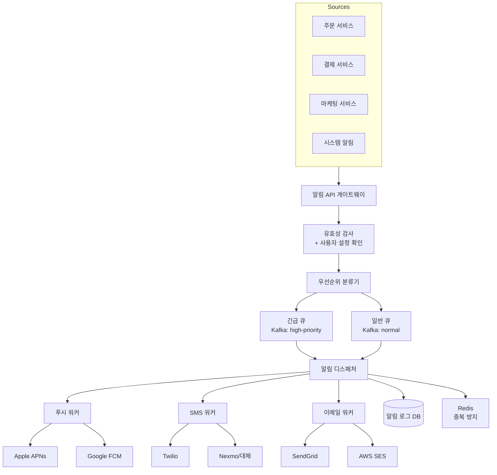

---

## 3. 알림 채널별 상세 흐름

### 모바일 푸시 알림

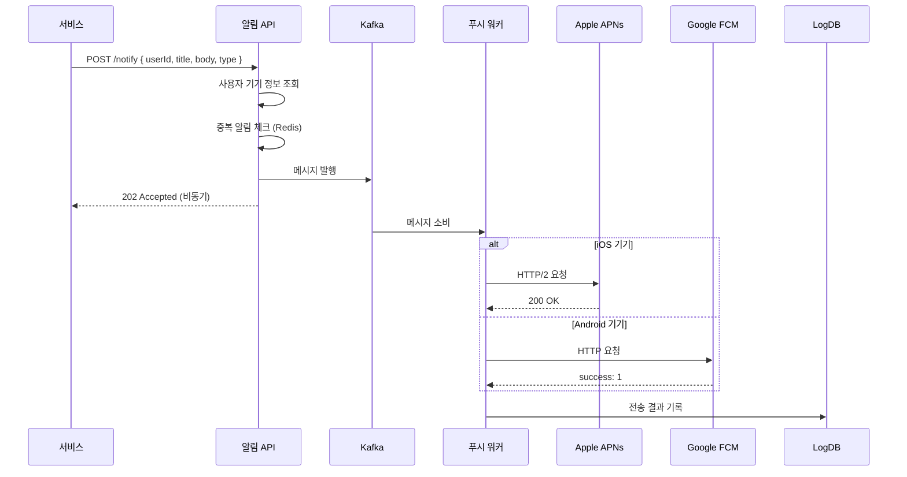

### SMS 발송

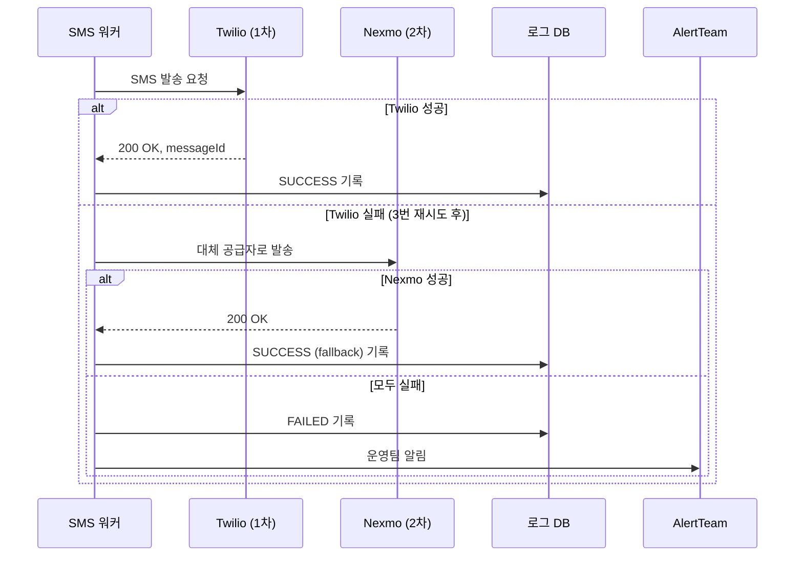

---

## 4. 중복 알림 방지

### 왜 중복이 발생하는가?

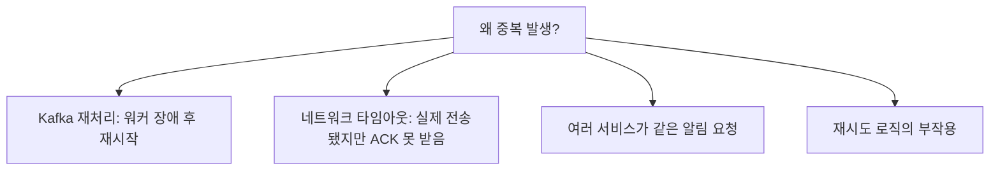

### 멱등성 기반 중복 방지

```python
import hashlib
import time

class DeduplicationService:
    def __init__(self, redis, window_seconds=3600):
        self.redis = redis
        self.window = window_seconds

    def generate_key(self, user_id: str, event_type: str,
                     content_hash: str) -> str:
        """알림 고유 키 생성"""
        raw = f"{user_id}:{event_type}:{content_hash}"
        return f"dedup:{hashlib.md5(raw.encode()).hexdigest()}"

    def is_duplicate(self, user_id: str, event_type: str,
                     content: str) -> bool:
        """중복 여부 확인"""
        content_hash = hashlib.md5(content.encode()).hexdigest()
        key = self.generate_key(user_id, event_type, content_hash)

        # SET NX (Not eXists): 키가 없을 때만 설정
        result = self.redis.set(key, "1", ex=self.window, nx=True)
        return result is None  # None이면 이미 존재 → 중복

    def mark_sent(self, notification_id: str):
        """전송 완료 표시 (DB에도 기록)"""
        self.redis.setex(f"sent:{notification_id}", self.window, "1")
```

**실전 예시:**
```python
def send_notification(user_id, event_type, title, body):
    dedup = DeduplicationService(redis)

    # 중복 체크
    if dedup.is_duplicate(user_id, event_type, f"{title}{body}"):
        logger.info(f"중복 알림 차단: user={user_id}, type={event_type}")
        return {"status": "skipped", "reason": "duplicate"}

    # 알림 전송
    notification_id = send_push(user_id, title, body)
    return {"status": "sent", "id": notification_id}
```

---

## 5. 사용자 알림 설정 (User Preferences)

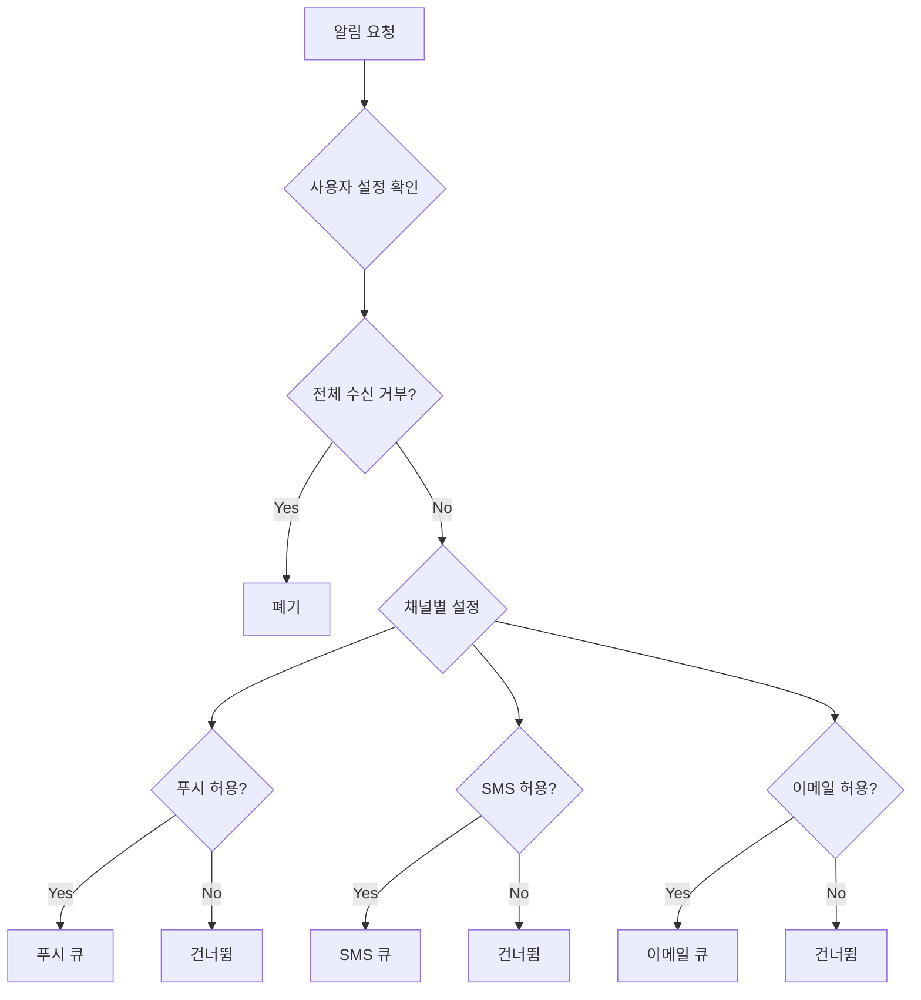

**사용자 설정 스키마:**
```sql
CREATE TABLE user_notification_settings (
    user_id         BIGINT NOT NULL,
    push_enabled    BOOLEAN DEFAULT TRUE,
    sms_enabled     BOOLEAN DEFAULT TRUE,
    email_enabled   BOOLEAN DEFAULT TRUE,

    -- 알림 유형별 설정
    marketing_push  BOOLEAN DEFAULT TRUE,
    marketing_sms   BOOLEAN DEFAULT FALSE,  -- SMS 마케팅은 기본 거부
    marketing_email BOOLEAN DEFAULT TRUE,

    -- 방해 금지 시간
    quiet_hours_start TIME,    -- 예: 22:00
    quiet_hours_end   TIME,    -- 예: 08:00
    timezone          VARCHAR(50) DEFAULT 'Asia/Seoul',

    PRIMARY KEY (user_id)
);
```

---

## 6. 우선순위 큐 설계

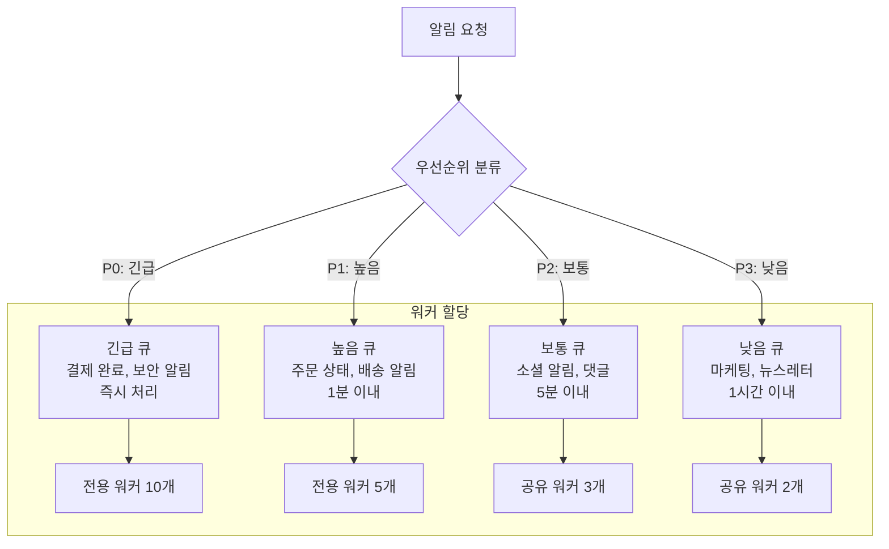

**Kafka 토픽 설계:**
```python
KAFKA_TOPICS = {
    'P0': 'notifications-critical',   # 파티션 20개
    'P1': 'notifications-high',        # 파티션 10개
    'P2': 'notifications-normal',      # 파티션 5개
    'P3': 'notifications-low',         # 파티션 3개
}

def publish_notification(notification: dict):
    priority = determine_priority(notification['type'])
    topic = KAFKA_TOPICS[priority]

    producer.send(
        topic,
        key=notification['user_id'].encode(),
        value=json.dumps(notification).encode()
    )
```

---

## 7. 재시도 전략 (Retry Strategy)

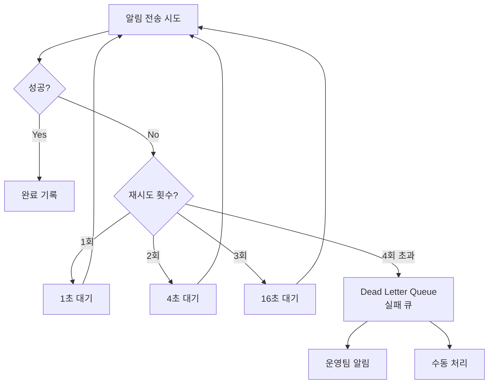

**지수 백오프(Exponential Backoff) 구현:**
```python
import asyncio
import random

class RetryHandler:
    def __init__(self, max_retries=3, base_delay=1.0, max_delay=60.0):
        self.max_retries = max_retries
        self.base_delay = base_delay
        self.max_delay = max_delay

    async def execute_with_retry(self, func, *args):
        last_exception = None

        for attempt in range(self.max_retries + 1):
            try:
                return await func(*args)
            except (NetworkError, TimeoutError) as e:
                last_exception = e

                if attempt == self.max_retries:
                    break

                # 지수 백오프 + 지터(jitter)로 thundering herd 방지
                delay = min(
                    self.base_delay * (2 ** attempt) + random.uniform(0, 1),
                    self.max_delay
                )
                await asyncio.sleep(delay)

        # 모든 재시도 실패 → Dead Letter Queue
        await self.send_to_dlq(func, args, last_exception)
        raise last_exception
```

---

## 8. 전송 보장 패턴

### At-Least-Once (최소 1회 전달) 구현

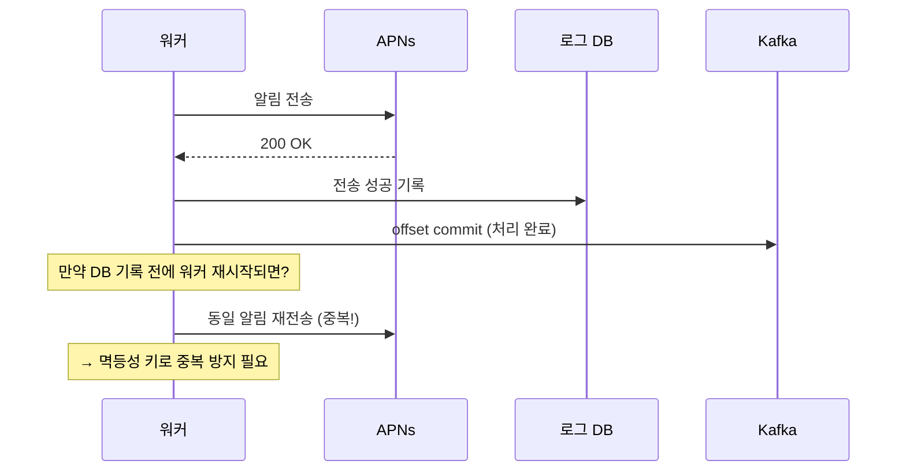

**트랜잭셔널 아웃박스 패턴:**
```sql
-- 알림 발송 요청과 비즈니스 로직을 같은 트랜잭션으로
BEGIN TRANSACTION;

-- 1. 주문 상태 업데이트
UPDATE orders SET status = 'PAID' WHERE id = 12345;

-- 2. 알림 발송 예약 (같은 트랜잭션!)
INSERT INTO notification_outbox (
    user_id, type, payload, status, created_at
) VALUES (
    1001, 'ORDER_PAID',
    '{"orderId": 12345, "amount": 50000}',
    'PENDING', NOW()
);

COMMIT;

-- 별도 스케줄러가 PENDING 알림을 폴링하여 발송
-- 발송 성공 시 status = 'SENT'로 업데이트
```

---

## 9. 알림 로그 및 분석

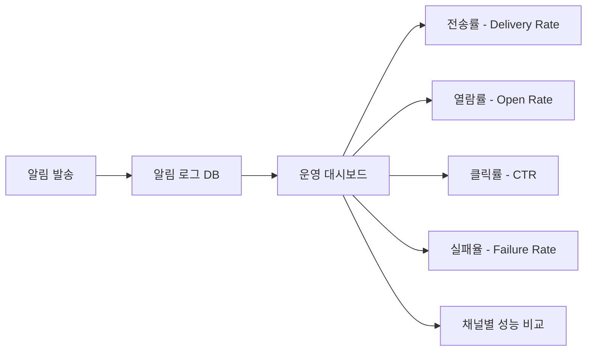

**알림 로그 스키마:**
```sql
CREATE TABLE notification_logs (
    id              BIGINT AUTO_INCREMENT PRIMARY KEY,
    notification_id VARCHAR(64) NOT NULL,  -- 멱등성 키
    user_id         BIGINT NOT NULL,
    channel         ENUM('PUSH', 'SMS', 'EMAIL'),
    type            VARCHAR(50),           -- ORDER_PAID, DELIVERY_STARTED 등
    title           VARCHAR(255),
    status          ENUM('PENDING', 'SENT', 'DELIVERED', 'FAILED', 'SKIPPED'),
    provider        VARCHAR(50),           -- APNs, FCM, Twilio, SendGrid
    sent_at         DATETIME,
    delivered_at    DATETIME,
    error_message   TEXT,
    retry_count     INT DEFAULT 0,

    INDEX idx_user_id (user_id),
    INDEX idx_sent_at (sent_at),
    INDEX idx_status (status)
);
```

---

## 10. 이메일 발송 최적화

### SPF, DKIM, DMARC 설정 (스팸 방지)

```
SPF (Sender Policy Framework):
  → 우리 서버 IP만 이메일 발송 허용
  DNS TXT: "v=spf1 include:sendgrid.net ~all"

DKIM (DomainKeys Identified Mail):
  → 이메일에 디지털 서명
  수신 서버가 서명 검증 → 위조 방지

DMARC (Domain-based Message Authentication):
  → SPF/DKIM 실패 시 처리 방법 지시
  DNS TXT: "v=DMARC1; p=quarantine; rua=mailto:dmarc@example.com"
```

### 이메일 발송 속도 제한 (Throttling)

```python
class EmailThrottler:
    """이메일 발송 속도 제한 - ISP 차단 방지"""

    LIMITS = {
        'gmail.com': 50,    # 초당 50건
        'naver.com': 30,
        'daum.net': 20,
        'default': 100
    }

    async def send_batch(self, emails: list[dict]):
        # 도메인별로 그룹화
        by_domain = {}
        for email in emails:
            domain = email['to'].split('@')[1]
            by_domain.setdefault(domain, []).append(email)

        for domain, domain_emails in by_domain.items():
            limit = self.LIMITS.get(domain, self.LIMITS['default'])
            # 속도 제한 준수하며 발송
            for chunk in chunks(domain_emails, limit):
                await asyncio.gather(*[send_email(e) for e in chunk])
                await asyncio.sleep(1)  # 1초 대기
```

---

## 11. 방해 금지 시간 (Quiet Hours)

```python
from datetime import datetime, time
import pytz

def should_send_now(user_id: str, priority: str) -> bool:
    """방해 금지 시간 체크"""

    # 긴급 알림은 무조건 발송
    if priority == 'P0':
        return True

    settings = get_user_settings(user_id)
    if not settings.quiet_hours_start:
        return True

    user_tz = pytz.timezone(settings.timezone)
    user_now = datetime.now(user_tz).time()

    start = settings.quiet_hours_start  # 예: 22:00
    end = settings.quiet_hours_end      # 예: 08:00

    # 자정 넘어가는 경우 처리
    if start > end:
        # 22:00 ~ 다음날 08:00
        in_quiet = user_now >= start or user_now < end
    else:
        in_quiet = start <= user_now < end

    if in_quiet:
        # 방해 금지 해제 시간으로 스케줄링
        schedule_for_later(user_id, settings.quiet_hours_end)
        return False

    return True
```

---

## 12. 극한 시나리오: 1억명에게 동시 마케팅 알림

쿠팡이 블랙프라이데이 행사를 1억 명에게 동시에 알림 발송하는 경우를 설계합니다.

```
문제:
- 1억건 푸시 알림을 얼마나 빨리 보낼 수 있나?
- APNs/FCM의 처리 한계는?
- 서버가 버틸 수 있나?
```

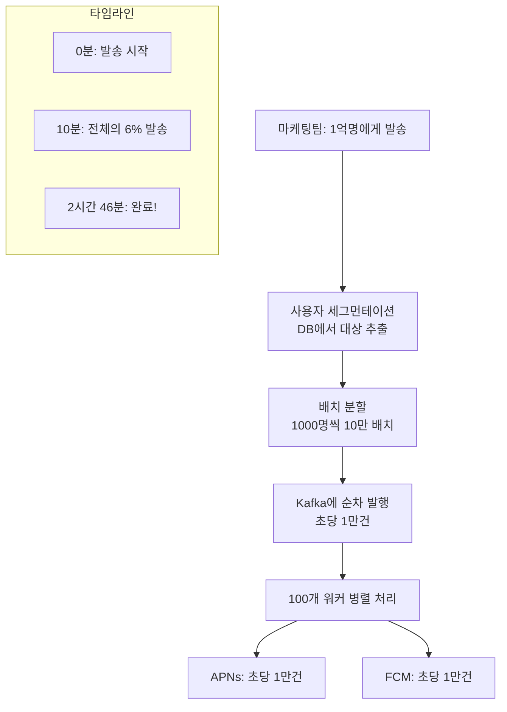

**대량 발송 스케줄러:**
```python
class BulkNotificationScheduler:
    def __init__(self, kafka_producer, workers=100):
        self.kafka = kafka_producer
        self.workers = workers
        self.rate_limit = 10000  # 초당 최대 1만건

    async def send_bulk_campaign(
        self,
        campaign_id: str,
        user_ids: list[str],
        notification: dict
    ):
        total = len(user_ids)
        batch_size = 1000

        for i, batch in enumerate(chunks(user_ids, batch_size)):
            for user_id in batch:
                await self.kafka.send(
                    'notifications-low',
                    {
                        'campaign_id': campaign_id,
                        'user_id': user_id,
                        **notification
                    }
                )

            # 속도 제한: 초당 1만건
            sent = (i + 1) * batch_size
            elapsed = time.time() - start_time
            expected = sent / self.rate_limit
            if elapsed < expected:
                await asyncio.sleep(expected - elapsed)

            # 진행률 보고
            if i % 100 == 0:
                logger.info(f"캠페인 {campaign_id}: {sent}/{total} 발행 완료")
```

---

## 완성된 알림 시스템 아키텍처

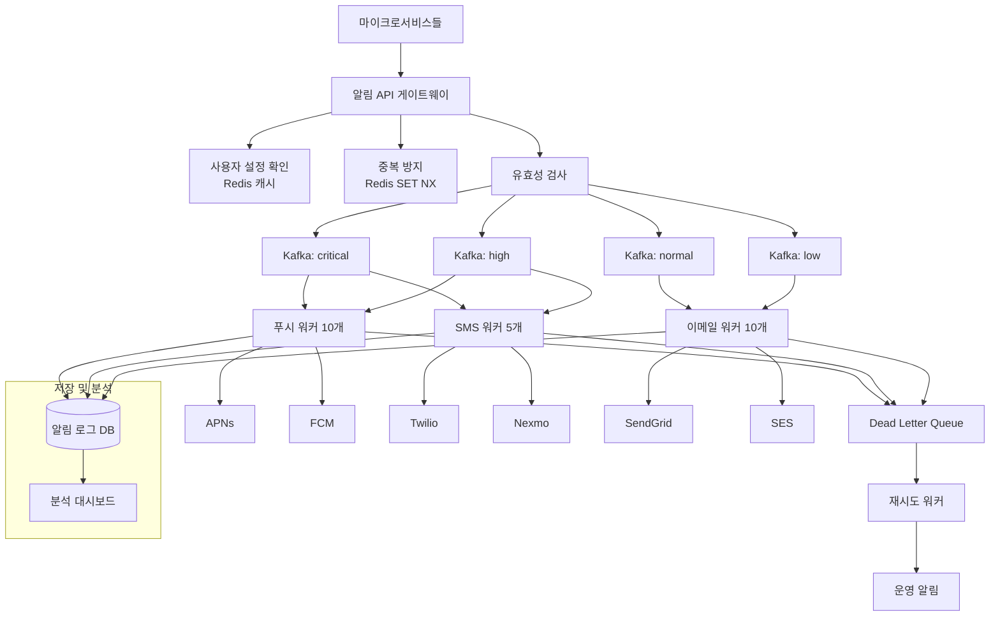

---

## 핵심 설계 결정 요약

| 결정 사항 | 선택 | 이유 |
|----------|------|------|
| 메시지 큐 | Kafka | 내구성 + 우선순위 토픽 분리 |
| 중복 방지 | Redis SET NX | 원자적 중복 체크 |
| 재시도 | 지수 백오프 + DLQ | 안정적 재처리 |
| 전송 보장 | Outbox 패턴 | 비즈니스 로직과 원자적 처리 |
| 우선순위 | 별도 Kafka 토픽 | 긴급 알림 병목 없음 |
| 대량 발송 | 배치 + 속도제한 | APNs/FCM 차단 방지 |
