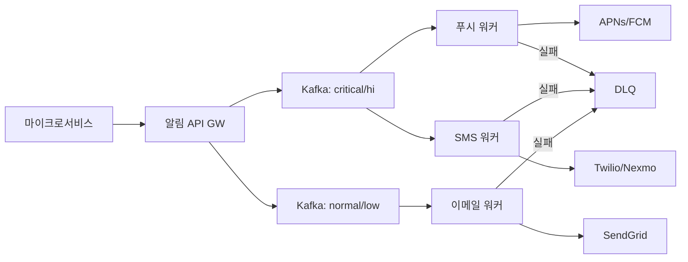
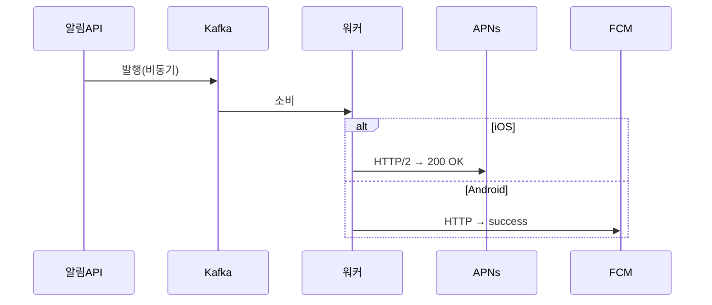
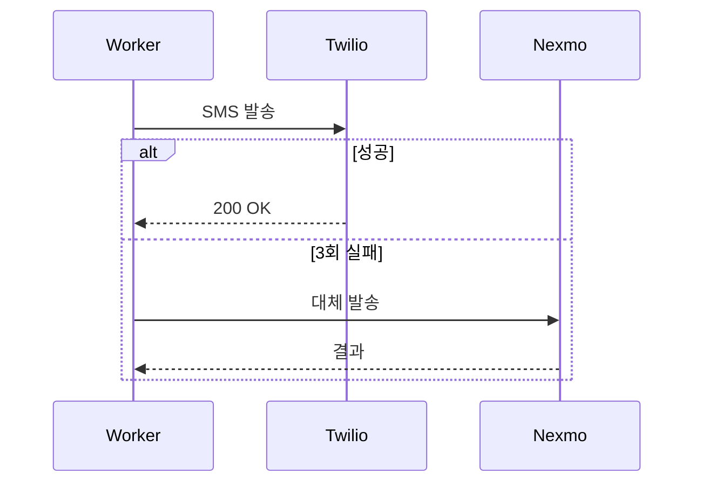
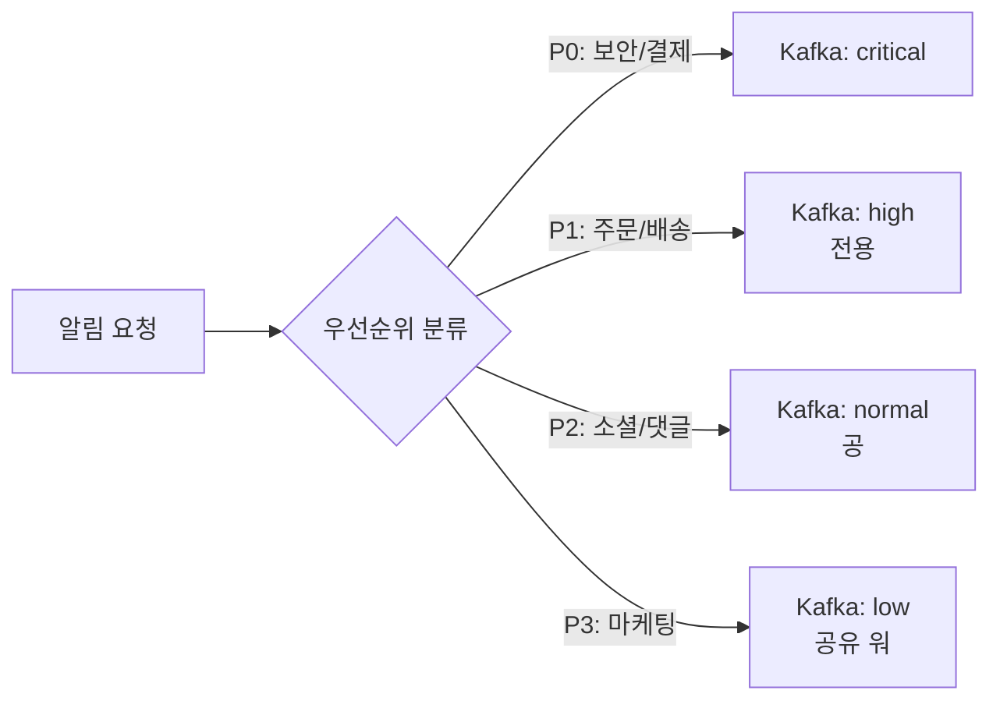
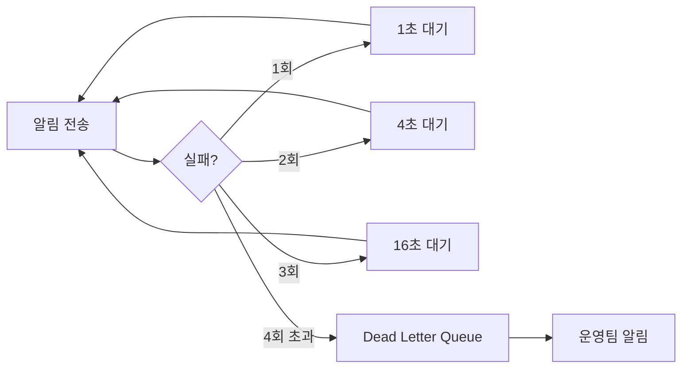
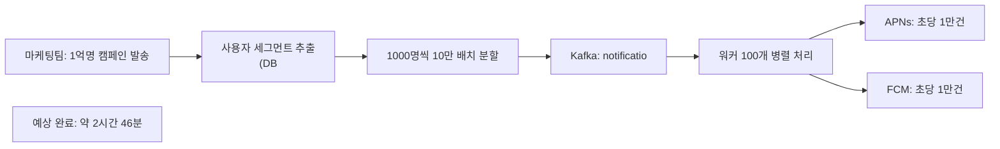

블랙프라이데이 자정, 쿠팡이 1억 명에게 동시에 "특가 시작!" 푸시를 보낸다. 10초 안에 전달되어야 한다. 하나의 서버가 직접 APNs와 FCM을 1억 번 호출하면? 서버는 즉시 죽는다. 알림 하나를 보내는 것은 쉽다. **신뢰할 수 있게, 대량으로, 빠르게** 보내는 것이 시스템 설계의 전부다.

## 왜 알림 시스템이 어려운가

> **비유**: 대형 우체국 분류 센터와 같다. 1억 통의 편지가 동시에 들어오면, 긴급/일반으로 분류하고, 각 배달부(APNs, FCM, Twilio, SendGrid)에게 적절히 배분하고, 배달 실패 시 재시도하고, 수신 거부 처리를 하고, 중복 발송을 막아야 한다. 이 모든 것이 동시에 일어난다.

단순 API 호출로 구현하면 어떤 문제가 생기는가:

| 문제 | 설명 |
|------|------|
| 동기 처리 | 알림 1건 전송에 200ms → 1억 건이면 231일 |
| 중복 발송 | 워커 재시작 시 같은 알림이 두 번 전송 |
| APNs/FCM 차단 | 초당 요청 한도 초과 시 IP 차단 |
| 단일 장애점 | APNs가 느려지면 전체 시스템이 막힘 |
| 데이터 유실 | 서버 재시작 시 메모리에 있던 알림이 사라짐 |

---

## 설계 의사결정 로드맵

이 시스템을 설계할 때 내려야 하는 핵심 결정 4가지를 순서대로 짚는다. 각 결정에서 "왜 이 선택인가"를 명확히 하지 않으면 면접에서 "그냥 APNs API 직접 호출하면 되지 않나요?"라는 후속 질문에 답할 수 없다.

### 결정 1: 전달 보장 — 동기 전송 vs Kafka 큐

**문제**: 알림 1건을 전송하는 데 APNs/FCM 응답 대기에 200ms가 걸린다. 1억 명에게 동기 전송하면 231일이 소요된다. 서버는 어떻게 이 문제를 해결하는가?

| 후보 | 장점 | 단점 | 언제 적합 |
|------|------|------|----------|
| 동기 전송 (직접 API 호출) | 구현 단순 | 스레드 블로킹, 10억 건이면 서버 즉시 다운 | 수십 건 이하 테스트 |
| Kafka 큐 + 비동기 워커 | 발행 즉시 반환, 워커 수평 확장, 장애 내성 | 운영 복잡도 증가 | 대량 발송 필수 |

**우리의 선택: Kafka 큐**
- 이유: 알림 API는 Kafka에 발행하고 202 즉시 반환한다. 워커 풀이 Kafka에서 소비하며 APNs/FCM을 호출한다. 워커 수를 늘리면 처리량이 선형으로 증가하고, 워커가 죽어도 Kafka 오프셋이 유지되므로 재시작 후 이어서 처리한다. 1억 건 발송도 워커 수에 따라 수십 분 내 완료 가능하다.
- 안 하면: 블랙프라이데이에 1억 건을 동기 전송하면 API 서버의 모든 스레드가 APNs 응답 대기에 블로킹된다. 신규 결제 완료 알림도 수십 분 지연되거나 타임아웃된다.

### 결정 2: 중복 방지 — DB unique vs Redis SET NX

**문제**: Kafka At-Least-Once 보장 때문에 워커가 재시작되면 같은 메시지를 두 번 처리한다. 사용자가 동일 알림을 2번 받으면 신뢰도가 급락한다.

| 후보 | 장점 | 단점 | 언제 적합 |
|------|------|------|----------|
| DB UNIQUE 제약 | 영구 저장, 정확한 중복 차단 | 매 알림마다 DB INSERT, 고부하 시 병목 | 중복 발송이 절대 안 되는 금융 알림 |
| Redis SET NX (TTL 24시간) | 인메모리 고속, 자동 만료 | Redis 장애 시 중복 가능 | 마케팅·일반 알림 |

**우리의 선택: Redis SET NX**
- 이유: `SET dedup:{user_id}:{event_type}:{content_hash} 1 EX 3600 NX` — 키가 없을 때만 SET하고 1시간 TTL로 자동 만료된다. 워커 재시작 후 같은 메시지를 처리하면 키가 이미 존재하므로 즉시 건너뛴다. 초당 수만 건의 중복 체크를 DB 없이 Redis에서 처리한다.
- 안 하면: Kafka 워커 50대 중 1대가 재시작되면 마지막 커밋 이후의 메시지를 재처리한다. 중복 체크가 없으면 결제 완료 알림이 두 번, 마케팅 알림이 다섯 번 오는 사태가 발생한다.

### 결정 3: 우선순위 — 단일 토픽 vs 분리 토픽

**문제**: P0(보안/결제) 알림과 P3(마케팅) 알림이 같은 Kafka 토픽에 있으면 어떻게 되는가? 블랙프라이데이에 P3 알림 5000만 건이 쌓이면 그 뒤에 들어온 P0 알림이 수십 분 후에야 전달된다.

| 후보 | 장점 | 단점 | 언제 적합 |
|------|------|------|----------|
| 단일 토픽 | 운영 단순 | 마케팅 폭주 시 결제 알림 지연 불가피 | 알림 종류가 단순한 소규모 |
| 우선순위별 토픽 분리 | P0 전용 워커가 항상 처리, SLA 보장 가능 | 토픽/워커 수 증가 | 알림 유형별 SLA가 다른 경우 |

**우리의 선택: 토픽 분리 (critical / high / normal / low)**
- 이유: P0(보안·결제) 토픽에는 전용 워커를 배치하여 다른 토픽의 부하와 완전히 격리한다. P3(마케팅) 토픽이 10억 건으로 폭주해도 P0 워커는 영향받지 않는다. APNs도 P0 토픽 워커에 전용 HTTP/2 연결 풀을 유지하여 연결 경쟁이 없다.
- 안 하면: 단일 토픽에서 블랙프라이데이 마케팅 알림 1억 건이 Kafka 파티션을 가득 채우면 그 뒤에 들어온 "카드 결제 완료" P0 알림이 수시간 지연된다. 금융 서비스에서 이는 민원과 법적 분쟁으로 이어진다.

### 결정 4: 재시도 — 즉시 재시도 vs 지수 백오프 + DLQ

**문제**: APNs가 일시적으로 느려졌을 때 50대 워커가 동시에 즉시 재시도하면 어떻게 되는가? 수천 건의 요청이 동시에 몰려 APNs를 더 힘들게 만드는 Thundering Herd가 발생한다.

| 후보 | 장점 | 단점 | 언제 적합 |
|------|------|------|----------|
| 즉시 재시도 | 구현 단순 | Thundering Herd, APNs IP 차단 위험 | 재시도가 드문 경우 |
| 지수 백오프 (1초→4초→16초) + 지터 | 부하 분산, 일시 장애 회복 후 자연 재개 | 지연 시간 증가 | 외부 API 의존 시 |
| DLQ (Dead Letter Queue) | 최종 실패 알림 유실 방지, 수동 처리 가능 | 추가 파이프라인 | 전달 보장 필수 |

**우리의 선택: 지수 백오프 + DLQ 조합**
- 이유: 1회 실패 → 1초 대기, 2회 → 4초, 3회 → 16초, 4회 이상 → DLQ로 이동. 지터(random 0~1초)를 추가하여 워커 50대가 정확히 같은 시각에 재시도하지 않도록 분산한다. DLQ에 적재된 알림은 운영팀이 장애 원인 분석 후 수동 재처리한다.
- 안 하면: APNs 장애 시 즉시 재시도하면 수천 건/초의 요청이 동시에 몰린다. APNs가 IP를 차단하면 이후 모든 정상 알림도 전송 불가 상태가 된다. 장애가 장애를 키우는 cascading failure가 발생한다.

---

## 요구사항 분석

### 기능 요구사항

1. 모바일 푸시 (iOS APNs, Android FCM)
2. SMS 문자 메시지
3. 이메일
4. 알림 우선순위 (긴급/일반)
5. 중복 발송 방지
6. 전송 보장 (최소 1회)
7. 사용자별 수신 거부 설정

### 규모 추정

```
모바일 푸시: 1,000만 건/일 → 116 QPS (평균), 350 QPS (피크)
SMS:          100만 건/일 →  11 QPS
이메일:       500만 건/일 →  58 QPS

총 알림: 1,600만 건/일 → 약 185 QPS (평균), ~600 QPS (피크)
```

---

## 전체 아키텍처



---

## 알림 채널별 동작 방식

### 모바일 푸시 — APNs와 FCM이 다른 이유

APNs(Apple)와 FCM(Google)은 각각 다른 프로토콜과 토큰 형식을 사용한다. 푸시 워커는 기기 타입을 보고 분기한다:



왜 API가 즉시 202를 반환하는가? 실제 전송은 수백ms~수초가 걸린다. 동기로 기다리면 API 서버의 스레드가 모두 블로킹된다. Kafka에 발행하고 즉시 반환한다.

### SMS — 공급자 Fallback이 왜 필요한가

Twilio가 장애나면 SMS가 전혀 안 간다. 주문 완료 SMS가 안 오면 고객 불안이 폭증한다. **공급자 이중화**:



---

## 중복 알림 방지 — 왜 반드시 필요한가

Kafka에서 메시지를 소비하다 워커가 크래시하면, 재시작 후 같은 메시지를 다시 처리한다. 이것이 **At-Least-Once** 전달의 부작용이다. 사용자 입장에서는 같은 주문 완료 알림이 두 번 온다.

```python
class DeduplicationService:
    def __init__(self, redis, window_seconds=3600):
        self.redis = redis
        self.window = window_seconds

    def is_duplicate(self, user_id: str, event_type: str, content: str) -> bool:
        # user_id + event_type + content_hash를 키로 사용
        content_hash = hashlib.md5(content.encode()).hexdigest()
        key = f"dedup:{user_id}:{event_type}:{content_hash}"

        # SET NX: 키가 없을 때만 설정
        # result = True → 새로 설정됨 → 중복 아님
        # result = None → 이미 존재 → 중복
        result = self.redis.set(key, "1", ex=self.window, nx=True)
        return result is None
```

만약 중복 방지가 없으면? 마케팅 캠페인 알림이 5번 오는 상황이 발생한다. 사용자 이탈과 앱 삭제로 이어진다.

---

## 우선순위 큐 — 긴급 알림이 마케팅 알림에 막히지 않게



왜 같은 큐를 쓰면 안 되는가? 블랙프라이데이에 P3(마케팅) 알림 수천만 건이 쌓이면, 그 뒤에 들어온 P0(결제 완료) 알림이 수십 분 후에야 전달된다. **토픽 분리 + 전용 워커**로 P0는 항상 10초 이내를 보장한다.

---

## 재시도 전략 — 지수 백오프가 왜 중요한가

APNs가 일시적으로 느려졌을 때 모든 워커가 즉시 재시도하면? 수천 개의 요청이 동시에 몰려 APNs를 더 힘들게 만든다(Thundering Herd). **지수 백오프 + 지터(Jitter)**:



```python
async def execute_with_retry(self, func, *args):
    for attempt in range(self.max_retries + 1):
        try:
            return await func(*args)
        except (NetworkError, TimeoutError) as e:
            if attempt == self.max_retries:
                await self.send_to_dlq(func, args, e)
                raise

            # 지수 백오프 + 랜덤 지터 (thundering herd 방지)
            delay = min(
                self.base_delay * (2 ** attempt) + random.uniform(0, 1),
                self.max_delay
            )
            await asyncio.sleep(delay)
```

---

## 전송 보장 — Transactional Outbox 패턴

주문이 DB에 저장되는 것과 알림 발송이 **원자적**으로 처리되어야 한다. 주문은 DB에 저장됐는데 알림 발행 직전에 서버가 죽으면? 주문 완료 알림이 영원히 안 간다.

```sql
-- 같은 트랜잭션 안에서 처리
BEGIN TRANSACTION;

-- 1. 비즈니스 로직
UPDATE orders SET status = 'PAID' WHERE id = 12345;

-- 2. 알림을 같은 트랜잭션에 기록 (발행은 나중에)
INSERT INTO notification_outbox (user_id, type, payload, status)
VALUES (1001, 'ORDER_PAID', '{"orderId": 12345}', 'PENDING');

COMMIT;
-- 별도 스케줄러가 PENDING 행을 폴링해서 Kafka에 발행
-- 발행 완료 시 status = 'SENT'
```

이 패턴 없이 직접 Kafka에 발행하면? 트랜잭션이 롤백됐는데 Kafka에는 메시지가 이미 발행된 상황이 생긴다.

---

## 사용자 수신 설정 — 방해 금지 시간

```python
def should_send_now(user_id: str, priority: str) -> bool:
    # P0(보안/결제)는 방해 금지 무시 — 항상 전송
    if priority == 'P0':
        return True

    settings = get_user_settings(user_id)
    user_tz  = pytz.timezone(settings.timezone)
    user_now = datetime.now(user_tz).time()

    # 22:00 ~ 08:00 방해 금지 시간 (자정 넘어가는 케이스 처리)
    start, end = settings.quiet_hours_start, settings.quiet_hours_end
    in_quiet = (user_now >= start or user_now < end) if start > end \
               else (start <= user_now < end)

    if in_quiet:
        schedule_for_later(user_id, end)  # 방해 금지 해제 시간에 재스케줄
        return False
    return True
```

---


## 극한 시나리오



**왜 속도 제한이 필요한가?** APNs/FCM은 초당 처리 한도가 있다. 한도 초과 시 IP 차단 → 모든 푸시 불가. 초당 1만 건 이하로 제어해서 차단을 피한다.

---

## 보안 고려사항

> **비유**: 택배 기사가 집 주소를 알아도, 그 주소가 진짜 수신인의 것인지 확인하지 않으면 엉뚱한 사람에게 배달된다. 디바이스 토큰 관리가 바로 그 주소 검증이다.

**디바이스 토큰 라이프사이클**

APNs·FCM의 디바이스 토큰은 앱 재설치, OS 업그레이드, 기기 교체 시 변경된다. 무효 토큰으로 계속 발송하면 리소스 낭비와 APNs 차단 위험이 생긴다.

```
등록: 앱 실행 시 토큰을 서버에 등록 (user_id + device_id + token)
갱신: APNs/FCM이 "토큰 변경됨" 응답 시 DB 즉시 업데이트
무효화: "등록 해제됨(InvalidRegistration)" 응답 시 해당 토큰 삭제
재등록: 앱 재설치 후 새 토큰으로 자동 재등록
```

**알림 스푸핑 방지**

외부 서비스가 알림 API를 직접 호출하지 못하도록 내부 전용 엔드포인트로 격리하고, 서비스 간 mTLS 인증을 적용한다. 알림 페이로드에 민감 정보(잔액, 개인정보)를 직접 담지 않고, 앱이 열리면 서버에서 조회하도록 설계한다.

---
## Day 1 → Scale 진화

알림 시스템을 처음부터 Kafka 멀티 토픽 + 우선순위 워커로 만들면 소규모에서 과잉 설계다. 트래픽에 맞게 단계적으로 쌓아야 한다.

### Phase 1 — MAU 1만, 일 알림 10만 건 (스타트업 초기)

**아키텍처**: 동기 직접 호출 + 단일 DB 큐

- APNs/FCM: 앱 서버에서 직접 SDK 호출 (동기)
- 이메일: SendGrid API 직접 호출
- 중복 방지: DB UNIQUE 제약 (idempotency_key 컬럼)
- 재시도: 단순 for loop 최대 3회

**월 비용**
- EC2 t3.medium × 2: ~$70
- RDS MySQL db.t3.medium (알림 로그): ~$60
- SendGrid + Twilio 사용량 기반: ~$100
- 합계: **~$230/월**

### Phase 2 — MAU 10만, 일 알림 100만 건 (서비스 성장)

**아키텍처**: 단일 Kafka 토픽 + 비동기 워커 분리

- 알림 API가 Kafka에 발행하고 202 즉시 반환
- 워커 풀(10대)이 Kafka 소비 → APNs/FCM/SMS 호출
- Redis NX 중복 방지 추가 (TTL 1시간)
- DLQ 도입: 3회 실패 알림을 Dead Letter Queue에 적재
- Transactional Outbox: 주문 완료 알림 유실 방지

**월 비용**
- EC2 c5.large × 6 (API + 워커): ~$600
- Kafka MSK (2브로커): ~$400
- ElastiCache Redis r6g.medium: ~$100
- 합계: **~$1,100/월**

### Phase 3 — MAU 100만, 일 알림 1000만 건 (고성장)

**아키텍처**: 우선순위별 토픽 분리 + 전용 워커 + 방해 금지 스케줄러

- Kafka 토픽: critical / high / normal / low 4개로 분리
- P0 전용 워커 20대: APNs/FCM 전용 HTTP/2 연결 풀 유지
- P3 워커: 속도 제한 적용 (APNs 초당 1만 건 이하)
- 방해 금지: 사용자별 타임존 기반 스케줄러, 해제 시각에 자동 재발송
- 토큰 라이프사이클: 무효 토큰 자동 감지 + DB 삭제 파이프라인

**월 비용**
- EC2 c5.2xlarge × 20 (워커): ~$5,000
- Kafka MSK (3브로커): ~$800
- ElastiCache Redis Cluster: ~$600
- 합계: **~$6,400/월**

### Phase 4 — MAU 1억, 일 알림 1억 건 (글로벌 플랫폼)

**아키텍처**: 멀티리전 워커 + ML 기반 발송 최적화 + 실시간 피드백 루프

- 멀티리전: 한국·미국·유럽 워커 클러스터 독립 운영, 사용자 거주 리전으로 라우팅
- ML 최적 발송 시각: 사용자별 알림 오픈율 패턴 학습, 오픈율 최고 시각에 발송
- 실시간 피드백: APNs/FCM 응답(오픈·클릭·삭제)을 Kafka로 수집, 알림 효과 실시간 대시보드
- 글로벌 속도 제한: APNs 국가별 할당량 관리, 지역별 피크 분산

**월 비용**
- 멀티리전 워커 클러스터: ~$30,000
- 글로벌 Kafka + Redis: ~$15,000
- ML 서빙 인프라: ~$5,000
- 합계: **~$50,000/월**

---

## 핵심 메트릭 5개

알림 시스템에서 이 다섯 숫자가 정상이면 사용자가 알림을 제때 받고 있다. 하나라도 이상하면 어느 레이어에 문제가 있는지 즉시 추적해야 한다.

| 메트릭 | 정상 기준 | 이상 신호 | 원인 가설 |
|--------|---------|---------|---------|
| **알림 전달률** | 98% 이상 | 90% 미만 | APNs/FCM 장애, 무효 토큰 급증, 워커 과부하 |
| **P0 알림 전달 지연** | 10초 이내 | 60초 초과 | Kafka critical 토픽 lag 증가, P0 워커 부족 |
| **중복 발송 건수** | 0건/일 | 1건 이상 | Redis 장애 후 복구 중 NX 키 유실, 워커 재시작 타이밍 |
| **DLQ 적재 건수** | 100건/일 이하 | 1,000건 초과 | APNs/FCM 일시 장애, 특정 사용자 토큰 일괄 만료 |
| **APNs/FCM 응답 P99** | 500ms 이내 | 2초 초과 | APNs/FCM 서버 과부하 (블프 등 피크), 워커 연결 풀 부족 |

**핵심 알람 설정 예시**

```
P0 알림 지연 > 30초 → PagerDuty P0 (즉시 대응)
전달률 < 95% → PagerDuty P1 (15분 내 대응)
중복 발송 감지 → PagerDuty P1 + 해당 사용자 자동 사과 알림 트리거
DLQ > 1,000건 → Slack 알림 (APNs/FCM 상태 확인)
APNs P99 > 1초 → Slack 알림 (서킷 브레이커 상태 확인)
```

---

## 실제 장애 사례

### 사례 1: AWS SNS 장애 — 단일 공급자 의존

**상황**: 2021년 12월 AWS us-east-1 장애로 AWS SNS(Simple Notification Service)가 수 시간 동안 부분적으로 다운됐다. SNS를 통해 FCM/APNs에 푸시를 보내던 수많은 서비스가 알림 전달 불가 상태가 됐다. 주문 완료, 배달 도착 알림이 수 시간 지연되면서 고객센터에 문의가 폭주했다. SNS에 단일 의존하고 있던 서비스들은 장애 대응 수단이 없었다.

**근본 원인**: AWS SNS를 알림 파이프라인의 유일한 경로로 사용했다. SNS가 APNs/FCM에 대한 연결을 추상화해주는 편리함이 있지만, SNS 자체가 단일 장애점이 된다. us-east-1 내부 네트워크 장애로 SNS의 APNs/FCM 연결 풀이 고갈됐고, 대기 중인 알림이 계속 쌓이면서 지연이 수 시간으로 늘어났다.

**해결책**:
- SNS 직접 의존 제거: 자체 워커가 APNs/FCM SDK를 직접 호출하는 구조로 전환
- 멀티리전 Kafka: 알림 이벤트를 us-east-1뿐 아니라 us-west-2에도 복제, 리전 장애 시 서부 워커가 자동 처리
- APNs/FCM 직접 HTTP/2 연결 풀: 중간 계층 제거로 AWS 리전 장애와 독립
- 알림 DLQ 영구 보관: 장애 복구 후 밀린 알림을 우선순위 순으로 재처리

**교훈**: 알림 파이프라인에서 AWS SNS 같은 관리형 서비스의 편리함은 단일 장애점 위험을 내포한다. 중요한 알림 경로는 반드시 다중화해야 하며, 관리형 서비스 장애를 가정한 폴백 경로가 있어야 한다.

### 사례 2: 카카오 푸시 장애 — 데이터센터 화재와 알림 마비

**상황**: 2022년 10월 SK C&C 판교 데이터센터 화재로 카카오의 서버 대부분이 다운됐다. 카카오톡 메시지, 카카오페이 결제 알림, 카카오맵 알림 등 카카오 생태계 전체의 푸시 알림이 최대 127시간(5일 이상) 동안 완전 또는 부분 중단됐다. 카카오 알림에 의존하던 수천 개 기업과 서비스도 동반 마비됐다.

**근본 원인**: 카카오는 판교 IDC에 주요 서버의 상당 비중을 집중 운영하고 있었다. 이중화가 되어 있었지만 화재로 인한 전원 공급 차단은 이중화 시스템까지 동시에 영향을 줬다. 멀티 데이터센터 전략이 같은 물리적 구역에 있었던 것이 근본 문제였다.

**해결책 (카카오 이후 업계 대응)**:
- 지리적으로 분산된 멀티 데이터센터: 같은 도시 내 이중화가 아닌 수백 km 이상 거리의 리전 분산
- 알림 서비스 우선순위 지정: 재난 상황에서 결제·보안 알림은 최우선으로 다른 데이터센터에서 먼저 복구
- 외부 알림 의존 기업들의 멀티 채널 전략: 카카오 외 FCM/APNs 직접 발송 백업 경로 구축
- 재해 복구(DR) 정기 훈련: 주요 IDC 장애를 가정한 연 2회 Chaos Engineering 훈련

**교훈**: 데이터센터 물리적 재해는 소프트웨어 이중화로 막을 수 없다. 지리적으로 분산된 멀티 리전 + 자연재해·화재를 가정한 DR 훈련이 필수다. 특히 수천 개 서비스가 의존하는 플랫폼 알림 서비스는 단일 장애가 산업 전체에 파급된다.

---

## 핵심 설계 결정 요약

| 결정 | 선택 | 이유 |
|------|------|------|
| 메시지 큐 | Kafka 우선순위별 토픽 분리 | 긴급 알림이 마케팅 알림에 막히지 않도록 |
| 중복 방지 | Redis SET NX (멱등성 키) | Kafka At-Least-Once의 부작용 제거 |
| 재시도 | 지수 백오프 + DLQ | Thundering Herd 방지, 영구 실패 알림 |
| 전송 보장 | Transactional Outbox 패턴 | DB 트랜잭션과 알림 발행의 원자성 |
| 공급자 이중화 | Twilio → Nexmo fallback | 단일 공급자 장애 시 서비스 지속 |
| 대량 발송 | 배치 분할 + 속도 제한 | APNs/FCM IP 차단 방지 |
