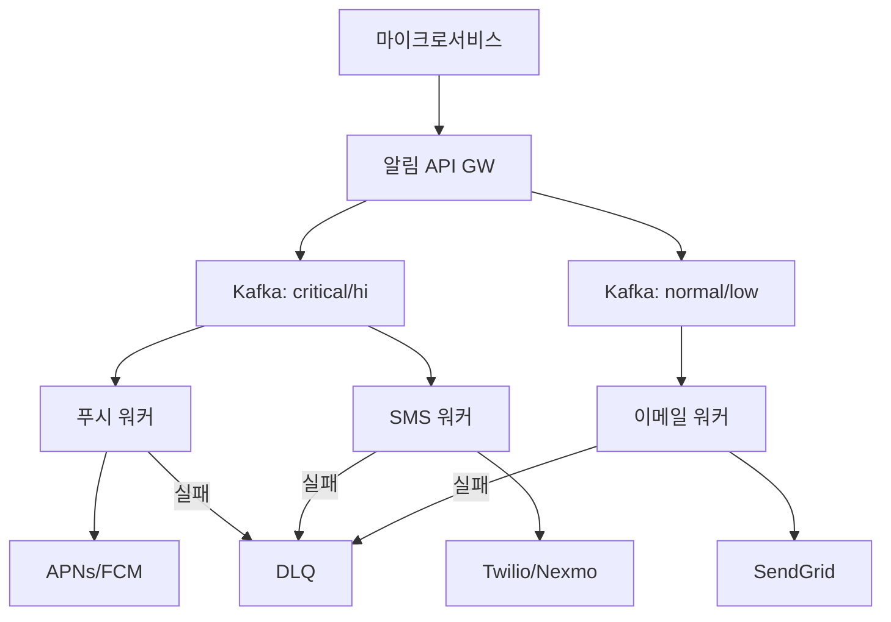
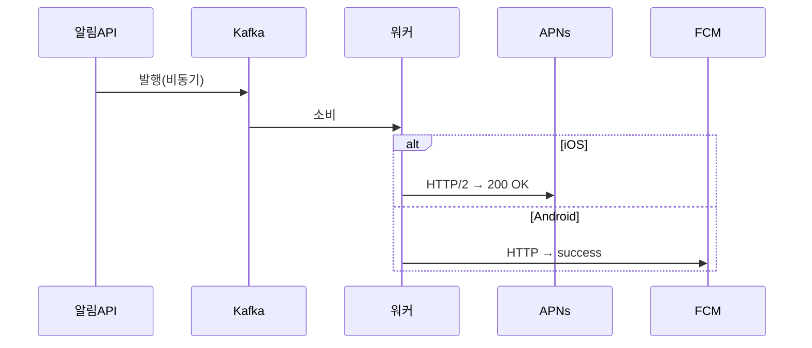
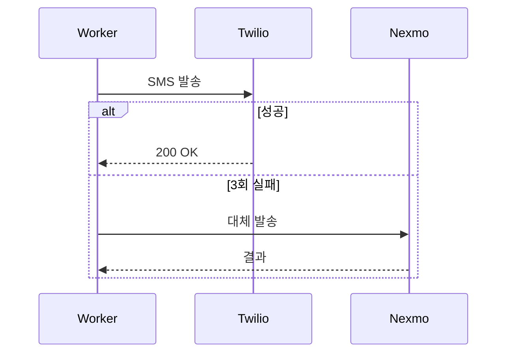
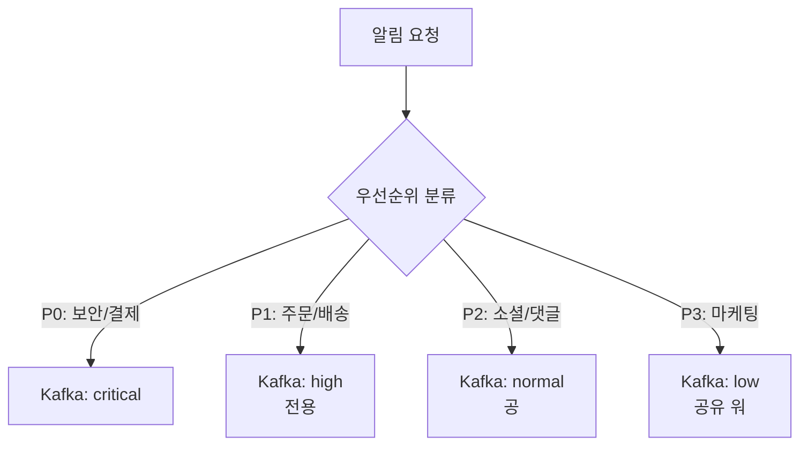
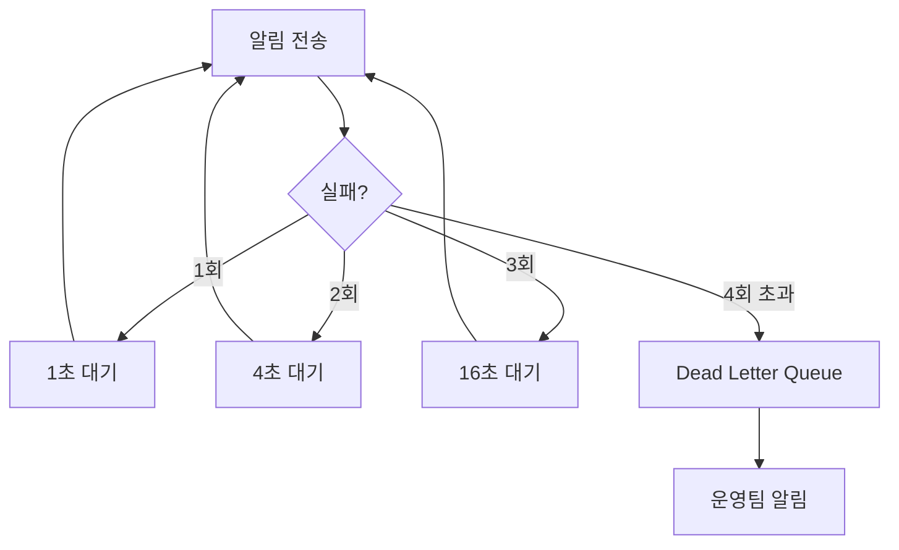
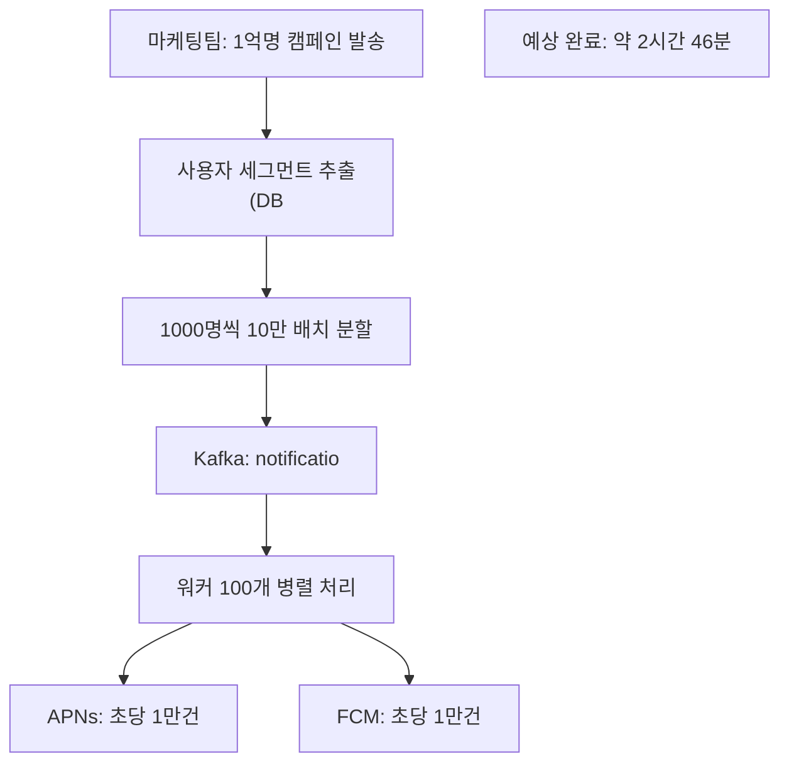

블랙프라이데이 자정, 쿠팡이 1억 명에게 동시에 "특가 시작!" 푸시를 보낸다. 10초 안에 전달되어야 한다. 하나의 서버가 직접 APNs와 FCM을 1억 번 호출하면? 서버는 즉시 죽는다. 알림 하나를 보내는 것은 쉽다. **신뢰할 수 있게, 대량으로, 빠르게** 보내는 것이 시스템 설계의 전부다.

## 왜 알림 시스템이 어려운가

> **비유**: 대형 우체국 분류 센터와 같다. 1억 통의 편지가 동시에 들어오면, 긴급/일반으로 분류하고, 각 배달부(APNs, FCM, Twilio, SendGrid)에게 적절히 배분하고, 배달 실패 시 재시도하고, 수신 거부 처리를 하고, 중복 발송을 막아야 한다. 이 모든 것이 동시에 일어난다.

단순 API 호출로 구현하면 어떤 문제가 생기는가:

| 문제 | 설명 |
|------|------|
| 동기 처리 | 알림 1건 전송에 200ms → 1억 건이면 231일 |
| 중복 발송 | 워커 재시작 시 같은 알림이 두 번 전송 |
| APNs/FCM 차단 | 초당 요청 한도 초과 시 IP 차단 |
| 단일 장애점 | APNs가 느려지면 전체 시스템이 막힘 |
| 데이터 유실 | 서버 재시작 시 메모리에 있던 알림이 사라짐 |

---

## 요구사항 분석

### 기능 요구사항

1. 모바일 푸시 (iOS APNs, Android FCM)
2. SMS 문자 메시지
3. 이메일
4. 알림 우선순위 (긴급/일반)
5. 중복 발송 방지
6. 전송 보장 (최소 1회)
7. 사용자별 수신 거부 설정

### 규모 추정

```
모바일 푸시: 1,000만 건/일 → 116 QPS (평균), 350 QPS (피크)
SMS:          100만 건/일 →  11 QPS
이메일:       500만 건/일 →  58 QPS

총 알림: 1,600만 건/일 → 약 185 QPS (평균), ~600 QPS (피크)
```

---

## 전체 아키텍처



---

## 알림 채널별 동작 방식

### 모바일 푸시 — APNs와 FCM이 다른 이유

APNs(Apple)와 FCM(Google)은 각각 다른 프로토콜과 토큰 형식을 사용한다. 푸시 워커는 기기 타입을 보고 분기한다:



왜 API가 즉시 202를 반환하는가? 실제 전송은 수백ms~수초가 걸린다. 동기로 기다리면 API 서버의 스레드가 모두 블로킹된다. Kafka에 발행하고 즉시 반환한다.

### SMS — 공급자 Fallback이 왜 필요한가

Twilio가 장애나면 SMS가 전혀 안 간다. 주문 완료 SMS가 안 오면 고객 불안이 폭증한다. **공급자 이중화**:



---

## 중복 알림 방지 — 왜 반드시 필요한가

Kafka에서 메시지를 소비하다 워커가 크래시하면, 재시작 후 같은 메시지를 다시 처리한다. 이것이 **At-Least-Once** 전달의 부작용이다. 사용자 입장에서는 같은 주문 완료 알림이 두 번 온다.

```python
class DeduplicationService:
    def __init__(self, redis, window_seconds=3600):
        self.redis = redis
        self.window = window_seconds

    def is_duplicate(self, user_id: str, event_type: str, content: str) -> bool:
        # user_id + event_type + content_hash를 키로 사용
        content_hash = hashlib.md5(content.encode()).hexdigest()
        key = f"dedup:{user_id}:{event_type}:{content_hash}"

        # SET NX: 키가 없을 때만 설정
        # result = True → 새로 설정됨 → 중복 아님
        # result = None → 이미 존재 → 중복
        result = self.redis.set(key, "1", ex=self.window, nx=True)
        return result is None
```

만약 중복 방지가 없으면? 마케팅 캠페인 알림이 5번 오는 상황이 발생한다. 사용자 이탈과 앱 삭제로 이어진다.

---

## 우선순위 큐 — 긴급 알림이 마케팅 알림에 막히지 않게



왜 같은 큐를 쓰면 안 되는가? 블랙프라이데이에 P3(마케팅) 알림 수천만 건이 쌓이면, 그 뒤에 들어온 P0(결제 완료) 알림이 수십 분 후에야 전달된다. **토픽 분리 + 전용 워커**로 P0는 항상 10초 이내를 보장한다.

---

## 재시도 전략 — 지수 백오프가 왜 중요한가

APNs가 일시적으로 느려졌을 때 모든 워커가 즉시 재시도하면? 수천 개의 요청이 동시에 몰려 APNs를 더 힘들게 만든다(Thundering Herd). **지수 백오프 + 지터(Jitter)**:



```python
async def execute_with_retry(self, func, *args):
    for attempt in range(self.max_retries + 1):
        try:
            return await func(*args)
        except (NetworkError, TimeoutError) as e:
            if attempt == self.max_retries:
                await self.send_to_dlq(func, args, e)
                raise

            # 지수 백오프 + 랜덤 지터 (thundering herd 방지)
            delay = min(
                self.base_delay * (2 ** attempt) + random.uniform(0, 1),
                self.max_delay
            )
            await asyncio.sleep(delay)
```

---

## 전송 보장 — Transactional Outbox 패턴

주문이 DB에 저장되는 것과 알림 발송이 **원자적**으로 처리되어야 한다. 주문은 DB에 저장됐는데 알림 발행 직전에 서버가 죽으면? 주문 완료 알림이 영원히 안 간다.

```sql
-- 같은 트랜잭션 안에서 처리
BEGIN TRANSACTION;

-- 1. 비즈니스 로직
UPDATE orders SET status = 'PAID' WHERE id = 12345;

-- 2. 알림을 같은 트랜잭션에 기록 (발행은 나중에)
INSERT INTO notification_outbox (user_id, type, payload, status)
VALUES (1001, 'ORDER_PAID', '{"orderId": 12345}', 'PENDING');

COMMIT;
-- 별도 스케줄러가 PENDING 행을 폴링해서 Kafka에 발행
-- 발행 완료 시 status = 'SENT'
```

이 패턴 없이 직접 Kafka에 발행하면? 트랜잭션이 롤백됐는데 Kafka에는 메시지가 이미 발행된 상황이 생긴다.

---

## 사용자 수신 설정 — 방해 금지 시간

```python
def should_send_now(user_id: str, priority: str) -> bool:
    # P0(보안/결제)는 방해 금지 무시 — 항상 전송
    if priority == 'P0':
        return True

    settings = get_user_settings(user_id)
    user_tz  = pytz.timezone(settings.timezone)
    user_now = datetime.now(user_tz).time()

    # 22:00 ~ 08:00 방해 금지 시간 (자정 넘어가는 케이스 처리)
    start, end = settings.quiet_hours_start, settings.quiet_hours_end
    in_quiet = (user_now >= start or user_now < end) if start > end \
               else (start <= user_now < end)

    if in_quiet:
        schedule_for_later(user_id, end)  # 방해 금지 해제 시간에 재스케줄
        return False
    return True
```

---


## 극한 시나리오



**왜 속도 제한이 필요한가?** APNs/FCM은 초당 처리 한도가 있다. 한도 초과 시 IP 차단 → 모든 푸시 불가. 초당 1만 건 이하로 제어해서 차단을 피한다.

---

## 보안 고려사항

> **비유**: 택배 기사가 집 주소를 알아도, 그 주소가 진짜 수신인의 것인지 확인하지 않으면 엉뚱한 사람에게 배달된다. 디바이스 토큰 관리가 바로 그 주소 검증이다.

**디바이스 토큰 라이프사이클**

APNs·FCM의 디바이스 토큰은 앱 재설치, OS 업그레이드, 기기 교체 시 변경된다. 무효 토큰으로 계속 발송하면 리소스 낭비와 APNs 차단 위험이 생긴다.

```
등록: 앱 실행 시 토큰을 서버에 등록 (user_id + device_id + token)
갱신: APNs/FCM이 "토큰 변경됨" 응답 시 DB 즉시 업데이트
무효화: "등록 해제됨(InvalidRegistration)" 응답 시 해당 토큰 삭제
재등록: 앱 재설치 후 새 토큰으로 자동 재등록
```

**알림 스푸핑 방지**

외부 서비스가 알림 API를 직접 호출하지 못하도록 내부 전용 엔드포인트로 격리하고, 서비스 간 mTLS 인증을 적용한다. 알림 페이로드에 민감 정보(잔액, 개인정보)를 직접 담지 않고, 앱이 열리면 서버에서 조회하도록 설계한다.

---
## 핵심 설계 결정 요약

| 결정 | 선택 | 이유 |
|------|------|------|
| 메시지 큐 | Kafka 우선순위별 토픽 분리 | 긴급 알림이 마케팅 알림에 막히지 않도록 |
| 중복 방지 | Redis SET NX (멱등성 키) | Kafka At-Least-Once의 부작용 제거 |
| 재시도 | 지수 백오프 + DLQ | Thundering Herd 방지, 영구 실패 알림 |
| 전송 보장 | Transactional Outbox 패턴 | DB 트랜잭션과 알림 발행의 원자성 |
| 공급자 이중화 | Twilio → Nexmo fallback | 단일 공급자 장애 시 서비스 지속 |
| 대량 발송 | 배치 분할 + 속도 제한 | APNs/FCM IP 차단 방지 |
