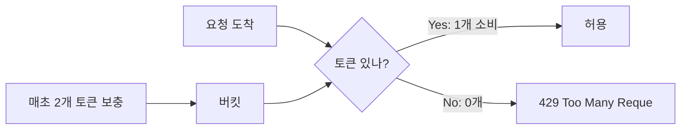
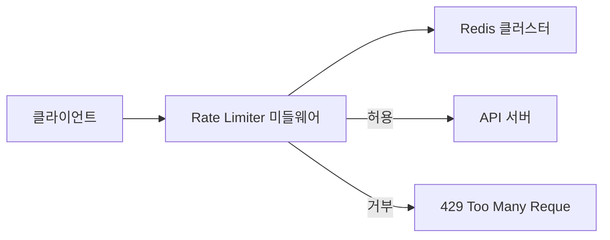
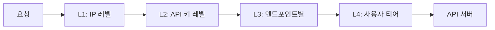
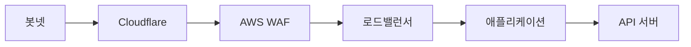

2023년, 한 스타트업의 API가 새벽 3시에 다운됐다. 원인은 경쟁사 봇이 초당 5만 건의 요청을 보낸 것이었다. DB 커넥션 풀이 고갈되고 서비스 전체가 멈췄다. Rate Limiter가 있었다면? IP당 초당 100건 제한으로 이 봇의 요청 99.998%가 차단됐을 것이다. **Rate Limiter는 "공정성"의 문제이기 전에 "생존"의 문제다.**

## 왜 Rate Limiter가 필요한가

> **비유**: 놀이공원 인기 어트랙션 앞의 "1회 탑승 후 재줄 서기" 규칙과 같다. 한 사람이 무한 반복 탑승하는 것을 막아 모든 사람이 공정하게 이용한다. 줄을 서지 않고 뒷문으로 수백 번 들어오려는 사람(봇)을 아예 입장 거부시킨다.

Rate Limiter 없으면 어떤 일이 생기는가:

| 상황 | 결과 |
|------|------|
| 악의적 봇: 초당 10만 요청 | 서버 다운 |
| 클라이언트 버그: 무한 루프 API 호출 | DB 커넥션 고갈 |
| 마케팅 이벤트: 트래픽 폭발 | 서비스 전체 느려짐 |
| 스크래퍼: 데이터 무단 수집 | 비용 폭발, 데이터 유출 |

---

## 설계 의사결정 로드맵

### 결정 1: 알고리즘 — 어떤 알고리즘으로 제한할 것인가

**문제**: 잘못 고르면 버스트 트래픽을 막거나, 경계 구간에서 한도의 2배가 통과하거나, 메모리가 폭발한다.

| 후보 | 장점 | 단점 | 선택 이유 |
|------|------|------|-----------|
| Token Bucket | 버스트 허용, 메모리 효율 | 경계 구간 허용량 약간 초과 | API 서버 기본 — 정상 버스트 허용 |
| Sliding Window Log | 가장 정확 | 요청마다 타임스탬프 저장, 메모리 폭발 | 고정밀 금융 규정 준수 한정 |
| Sliding Window Counter | 정확도 + 메모리 균형 | 이전 윈도우 가중 근사치 | **일반 API 기본 선택** |
| Fixed Window Counter | 구현 최단 | 경계에서 2배 허용 버그 | 내부 관리 API 한정 |
| Leaky Bucket | 균일 처리 보장 | 정상 버스트도 차단 | 결제 등 고정 처리율 시스템 |

**우리의 선택: Sliding Window Counter** — 이유: 메모리 O(1), 경계 문제 없음, Redis 2개 키로 구현 가능.

---

### 결정 2: 저장소 — 로컬 메모리 vs Redis

**문제**: 로컬 메모리를 쓰면 서버 3대가 각자 한도를 유지해 실제 허용량이 서버 수만큼 늘어난다.

| 후보 | 장점 | 단점 | 선택 이유 |
|------|------|------|-----------|
| 서버 로컬 메모리 | 지연 0ms, 구현 가장 단순 | 서버 수 × 한도가 실제 한도 | Redis 장애 폴백 용도로만 |
| MySQL/PostgreSQL | 데이터 영속성 | 락 경합으로 수십 ms, 자체가 병목 | Rate Limiter에 부적합 |
| Redis (단일) | 원자적 INCR, 1ms 미만 | 단일 장애점 | 소규모 서비스 |
| **Redis Cluster** | 수평 확장, 고가용성 | 클러스터 관리 복잡도 | **프로덕션 표준** |

**우리의 선택: Redis Cluster** — 이유: INCR 명령 원자성, 초당 100만 ops, TTL 기반 자동 키 만료.

---

### 결정 3: 적용 위치 — API Gateway vs 애플리케이션

**문제**: 위치가 잘못되면 내부 서비스 호출까지 제한하거나, 인프라 전체를 바꿔야 한다.

| 후보 | 장점 | 단점 | 선택 이유 |
|------|------|------|-----------|
| CDN/에지 (Cloudflare) | 서버 도달 전 차단 | 정밀한 사용자별 제한 어려움 | DDoS 1차 방어 |
| API Gateway (Kong/Nginx) | 중앙 집중 관리, 앱 코드 불변 | 게이트웨이 장애가 전체 장애 | **일반 API 표준** |
| 애플리케이션 미들웨어 | 비즈니스 로직 접근 가능 | 서비스마다 별도 구현 | 엔드포인트별 세밀 제어 필요 시 |
| 네트워크 계층 (iptables) | 성능 최고 | IP 기반만 가능, 관리 난이도 높음 | DDoS 필터링 보조 |

**우리의 선택: API Gateway + 애플리케이션 계층 병용** — 이유: Gateway에서 IP 레벨, 앱에서 사용자/엔드포인트 레벨 이중 적용.

### 꼭 API 서버에서 만들어야 하는가? — 계층별 방어 전략

Rate Limiter를 API 코드로 직접 구현하는 것은 **마지막 방어선**이다. 앞단에서 이미 대부분의 악성 트래픽을 걸러낼 수 있고, 그래야 한다. 각 계층이 담당하는 역할이 다르다.

| 계층 | 도구 | 막을 수 있는 것 | 못 막는 것 | 비용 |
|------|------|---------------|-----------|------|
| **1. CDN/DNS** | Cloudflare, AWS Shield | DDoS (L3/L4), 국가 차단, 봇 스코어링 | 로그인한 사용자 구분 불가 | $20~200/월 |
| **2. WAF** | AWS WAF, Cloudflare WAF | SQL Injection, XSS, IP 블랙리스트, 요청 패턴 | 비즈니스 로직 기반 제한 불가 | $5~100/월 |
| **3. API Gateway** | Kong, Nginx, AWS API GW | IP당/API키당 rate limit, 인증 전 차단 | 사용자별 세분화 제한 어려움 | 인프라 포함 |
| **4. 앱 서버** | Redis + Lua, 자체 구현 | 사용자별/엔드포인트별/티어별 세밀한 제한 | 이미 앱까지 도달한 트래픽만 | 개발 비용 |
| **5. DB** | Connection Pool, 쿼리 타임아웃 | slow query 폭주, 커넥션 고갈 | 앞단 트래픽 제어 불가 | 설정만 |

**핵심**: 트래픽이 뒤로 갈수록 처리 비용이 비싸다. CDN에서 1건 차단하는 비용은 거의 0이지만, DB까지 도달한 요청을 차단하면 이미 CPU/메모리/커넥션을 소모한 뒤다.

**실무 추천 조합**:

```
Phase 1 (MAU 1만): Nginx limit_req만으로 충분
Phase 2 (MAU 100만): Cloudflare 무료 + API Gateway rate limit
Phase 3 (MAU 1000만): Cloudflare Pro + AWS WAF + Redis Lua (앱 레벨)
Phase 4 (MAU 1억): Cloudflare Enterprise + 다층 WAF + ML 이상탐지
```

> **면접 포인트**: "Rate Limiter를 어디에 배치하겠습니까?"라는 질문에 "API 서버에서 Redis로"만 답하면 미드 레벨이다. "CDN→WAF→Gateway→App 다층 방어를 구성하고, 각 계층이 담당하는 트래픽 유형이 다르다"고 답해야 시니어다. 앞단에서 90%를 걸러야 뒷단이 살아남는다.

### 차단 기준 설계 + 봇 방어 — 뭘 기준으로, 누구를 막을 것인가

알고리즘보다 **"무엇을 키로 카운팅하고, 누구를 막을 것인가"**가 실무에서 더 중요한 결정이다.

**Rate Limit 키 설계** — 기준을 잘못 잡으면 정상 사용자가 차단되거나 공격자가 우회한다:

| 차단 기준 | 장점 | 단점 | 적합한 상황 |
|-----------|------|------|-----------|
| IP 주소 | 구현 단순, 인증 불필요 | NAT 연좌제, VPN 우회 | DDoS 1차 방어 |
| API 키 | 서비스 단위 제한 | 키 탈취 시 무방비 | B2B API |
| 사용자 ID | 가장 정확 | 비로그인 제한 불가 | 결제, 게시글 작성 |
| 엔드포인트별 | 민감 API만 강하게 | 정책 관리 복잡 | /payment: 5건, /search: 200건 |

실무에서는 **IP → 사용자 → 엔드포인트 → 티어** 복합 키로 계층화한다. IP만 쓰면 회사 전체가 차단되고, 사용자만 쓰면 비로그인 봇이 무방비다.

**봇/스크래퍼 방어** — Rate Limiter의 가장 현실적인 유즈케이스는 경쟁사 봇이 우리 데이터를 긁어가는 것을 막는 것이다. 단순 QPS 제한으로는 해결 안 된다 — 봇은 일반 사용자처럼 행동하기 때문이다.

**봇과 정상 사용자의 차이**:

| 신호 | 정상 사용자 | 초보 봇 | 고급 봇 (Headless Chrome) |
|------|-----------|---------|------------------------|
| 요청 간격 | 불규칙 (3~30초) | 정확히 일정 (1초 간격) | 랜덤 딜레이 삽입 (사람 흉내) |
| User-Agent | Chrome/Safari 정품 | python-requests, curl | 실제 Chrome UA 완벽 복제 |
| 쿠키/JS | 정상 저장, JS 실행 | 쿠키 무시, JS 미실행 | 쿠키 저장, JS 실행 가능 |
| 페이지 패턴 | 홈→목록→상세 자연 흐름 | 상세 페이지만 순차 접근 | 목록→상세 흉내 (패턴 학습) |
| 세션 길이 | 5~30분 | 수시간 연속 무중단 | 세션 분할로 짧게 위장 |
| 마우스/스크롤 | 자연스러운 이동 | 없음 | Puppeteer로 가짜 이벤트 생성 |
| TLS 핑거프린트 | 브라우저 고유 JA3 | 라이브러리 기본 JA3 | 브라우저 JA3 복제 가능 |
| Referer 체인 | 검색→목록→상세 | 없음 (직접 접근) | 가짜 Referer 설정 |

> **현실**: 2024년 이후 봇의 80%는 Headless Chrome + Puppeteer/Playwright 기반이다. 단순 UA 차단이나 간격 분석만으로는 잡을 수 없다. **TLS 핑거프린팅 + 행동 분석 ML의 조합**이 필수다.

**방어 전략 (쉬운 것 → 어려운 것 순서)**:

```
1단계: robots.txt + UA 차단 (구현 5분)
   - robots.txt에 Crawl-delay 설정 (선의의 봇만 준수)
   - 알려진 봇 UA 차단 (python-requests, curl, scrapy)
   - 효과: 가장 쉬움, 초보 봇 즉시 차단

2단계: 허니팟 트랩 (구현 30분, 오탐 0%)
   - CSS display:none 링크를 페이지에 숨김 (사용자 눈에 안 보임)
   - 숨긴 링크를 요청한 IP = 100% 봇 → 즉시 블랙리스트
   - robots.txt Disallow 경로 방문 IP도 봇 확정
   - 효과: 가장 확실, 오탐이 원천적으로 불가능

3단계: 쿠키 기반 검증 (구현 1시간)
   - 첫 요청 시 Set-Cookie로 HMAC 서명된 토큰 발급
   - 이후 요청에 쿠키가 없으면 봇으로 판정
   - 효과: requests/curl 등 쿠키 미지원 봇 차단

4단계: IP Rate Limit + 패턴 분석 (구현 반나절)
   - 동일 IP에서 분당 100+ 상세 페이지 접근 시 차단
   - 상세 페이지 비율 90% 이상이면 봇 의심
   - 효과: IP 로테이션 안 하는 봇 차단

5단계: JS Challenge (Cloudflare 설정)
   - 첫 요청 시 JS 챌린지 페이지 반환
   - 브라우저가 아니면 JS 실행 불가 → 차단
   - Canvas/WebGL 핑거프린트로 디바이스 식별
   - 효과: Headless Chrome 아닌 봇 대부분 차단

6단계: TLS 핑거프린팅 — JA3/JA4 (구현 어려움)
   - TLS 핸드셰이크의 cipher suite 순서가 브라우저마다 고유
   - python-requests, Go http.Client는 브라우저와 JA3 해시가 다름
   - 효과: UA를 위조해도 TLS 레벨에서 탐지

7단계: 행동 분석 — ML 기반 (구현 매우 어려움)
   - 요청 간격 표준편차 (봇은 σ ≈ 0, 사람은 불규칙)
   - Referer 체인 (봇: 상세 직접 접근, 사람: 검색→목록→상세)
   - 마우스/스크롤 이벤트 수집 (프론트에서)
   - 효과: Headless Chrome 봇까지 탐지

8단계: 응답 변조 — Tar Pit (최후의 수단)
   - 봇 판정된 요청에 가짜 데이터 반환 (가격 ±20% 변조)
   - 응답 지연을 점진적으로 늘려 봇 자원 소모
   - 효과: 봇이 차단당한 줄 모르고 오염된 데이터 수집
```

**각 단계 구체적 구현 사례**:

**1단계 — Nginx UA 차단 (nginx.conf)**:
```nginx
# 알려진 봇 UA 차단
if ($http_user_agent ~* "(python-requests|curl|scrapy|wget|Go-http-client)") {
    return 403;
}
```

**2단계 — 허니팟 트랩 (HTML + Spring Boot)**:
```html
<!-- 사용자는 안 보이지만 봇은 크롤링하는 숨겨진 링크 -->
<a href="/trap/hidden-page" style="display:none" aria-hidden="true">secret</a>
```
```java
@RestController
public class HoneypotController {
    private final Set<String> blacklist = ConcurrentHashMap.newKeySet();

    @GetMapping("/trap/**")
    public ResponseEntity<Void> trap(HttpServletRequest req) {
        String ip = req.getRemoteAddr();
        blacklist.add(ip); // 이 링크에 접근한 IP = 100% 봇
        log.warn("BOT DETECTED via honeypot: {}", ip);
        return ResponseEntity.status(403).build();
    }
}
```

**3단계 — 쿠키 기반 검증 (Spring Filter)**:
```java
@Component
public class BotCookieFilter extends OncePerRequestFilter {
    private static final String COOKIE_NAME = "_bv";
    private static final String SECRET = "bot-verify-secret-key";

    @Override
    protected void doFilterInternal(HttpServletRequest req,
            HttpServletResponse res, FilterChain chain) throws Exception {
        Cookie[] cookies = req.getCookies();
        boolean hasValidCookie = false;

        if (cookies != null) {
            for (Cookie c : cookies) {
                if (COOKIE_NAME.equals(c.getName()) && verify(c.getValue())) {
                    hasValidCookie = true;
                    break;
                }
            }
        }

        if (!hasValidCookie) {
            // 첫 방문: HMAC 서명된 쿠키 발급 후 리다이렉트
            String token = System.currentTimeMillis() + ":" +
                hmacSha256(String.valueOf(System.currentTimeMillis()), SECRET);
            res.addCookie(new Cookie(COOKIE_NAME, token));
            res.setStatus(302);
            res.setHeader("Location", req.getRequestURI());
            return; // 쿠키 못 저장하는 봇은 무한 302 루프
        }
        chain.doFilter(req, res);
    }
}
```

**4단계 — IP Rate Limit + 패턴 분석 (Redis)**:
```java
public boolean isPagePatternSuspicious(String sessionId) {
    String key = "page_pattern:" + sessionId;
    Long total = redis.opsForHash().size(key);
    Long detailCount = redis.opsForHash().get(key, "detail");
    if (total > 50 && detailCount / total > 0.9) {
        return true; // 상세 페이지만 90% 이상 접근 = 봇
    }
    return false;
}
```

**5단계 — 허니팟 + JS Challenge 조합 (프론트)**:
```javascript
// 정상 브라우저만 실행하는 검증 스크립트
(function() {
    const canvas = document.createElement('canvas');
    const gl = canvas.getContext('webgl');
    const fingerprint = gl ? gl.getParameter(gl.RENDERER) : 'none';
    fetch('/api/verify-browser', {
        method: 'POST',
        headers: {'Content-Type': 'application/json'},
        body: JSON.stringify({
            fp: fingerprint,
            screen: window.screen.width + 'x' + window.screen.height,
            timezone: Intl.DateTimeFormat().resolvedOptions().timeZone
        })
    });
})();
// Headless Chrome은 WebGL 렌더러가 "SwiftShader"로 나옴 → 봇 탐지
```

**봇 방어 기법 전체 정리**:

| 기법 | 구현 난이도 | 효과 | 우회 가능성 | 정상 사용자 영향 |
|------|-----------|------|-----------|----------------|
| robots.txt | 매우 쉬움 | 낮음 | 무시하면 끝 | 없음 |
| 쿠키 검증 | 쉬움 | 중간 | 쿠키 저장하면 우회 | 없음 |
| User-Agent 차단 | 쉬움 | 낮음 | UA 위조 가능 | 없음 |
| IP Rate Limit | 쉬움 | 중간 | IP 로테이션 우회 | NAT 연좌제 위험 |
| JS Challenge | 중간 | 높음 | Headless Chrome | CAPTCHA UX 저하 |
| 허니팟 트랩 | 쉬움 | 높음 | CSS 파싱하면 우회 | 없음 (오탐 0%) |
| TLS 핑거프린팅 | 어려움 | 매우 높음 | TLS 라이브러리 교체 | 없음 |
| 행동 분석 (ML) | 매우 어려움 | 매우 높음 | 인간 흉내 봇 | 오탐 가능 |
| 응답 변조 | 중간 | 높음 | 교차 검증 시 발각 | 없음 |

> **실무 추천**: 1~4단계(robots.txt + 쿠키 + UA + IP)만으로 봇의 90%를 막을 수 있다. 5~6단계(허니팟 + TLS)를 추가하면 99%. 7~8단계(ML + 응답 변조)는 가격 비교 사이트, 항공권/호텔 등 스크래핑이 비즈니스 위협인 서비스에서만 필요하다.

**실무 코드 예시 — 행동 기반 봇 탐지**:

```python
def is_suspicious_bot(user_session):
    # 1. 요청 간격이 너무 균일한가 (봇은 정확한 간격)
    intervals = user_session.request_intervals
    if len(intervals) > 10:
        std_dev = statistics.stdev(intervals)
        if std_dev < 0.1:  # 표준편차 100ms 미만 = 기계적
            return True, "uniform_interval"

    # 2. 상세 페이지만 접근하는가 (목록 안 거치고 직접 접근)
    detail_ratio = user_session.detail_page_count / user_session.total_count
    if detail_ratio > 0.9 and user_session.total_count > 50:
        return True, "detail_only_pattern"

    # 3. 세션이 비정상적으로 긴가
    if user_session.duration_minutes > 120 and user_session.total_count > 500:
        return True, "marathon_session"

    return False, None
```

**봇으로 판정된 경우 대응**:

| 대응 | 장점 | 단점 |
|------|------|------|
| 즉시 차단 (403) | 확실한 방어 | 오탐 시 정상 사용자 이탈 |
| 속도 제한 (Throttle) | 부분 허용, 오탐 피해 적음 | 봇이 느려도 계속 긁어감 |
| **허니팟 데이터 반환** | 봇이 가짜 데이터 수집 | 구현 복잡 |
| CAPTCHA 챌린지 | 정상 사용자 통과 가능 | UX 저하, 봇도 CAPTCHA 풀기 서비스 이용 |
| **점진적 지연 (Tar Pit)** | 봇의 자원을 소모시킴 | 우리 서버 커넥션도 점유 |

> **핵심**: 단순 QPS 제한은 봇 방어의 10%밖에 안 된다. 봇은 속도를 낮춰서 제한을 우회하기 때문이다. **행동 패턴 분석**이 핵심이며, "요청 간격의 균일성 + 페이지 접근 패턴 + JS 실행 여부"를 조합해야 정상 사용자를 해치지 않으면서 봇을 막을 수 있다.

---

### 결정 4: 초과 응답 — 429 즉시 거부 vs 큐잉

**문제**: 즉시 거부하면 클라이언트가 재시도 폭풍을 일으키고, 무조건 큐잉하면 메모리가 무한 증가한다.

| 후보 | 장점 | 단점 | 선택 이유 |
|------|------|------|-----------|
| 429 즉시 거부 | 서버 자원 보호, 클라이언트 즉시 인지 | 재시도 폭풍 유발 가능 | **표준 — Retry-After 헤더 필수 병행** |
| 큐잉 (지연 처리) | 요청 손실 없음 | 큐 메모리 폭발, 지연 예측 불가 | 비동기 처리 가능한 배치 API 한정 |
| 점진적 스로틀링 | 부드러운 UX | 구현 복잡, 경계 계산 어려움 | 스트리밍 API 특수 상황 |

**우리의 선택: 429 즉시 거부 + Retry-After 헤더** — 이유: 표준 HTTP 스펙, 클라이언트가 올바른 재시도 타이밍을 알 수 있어 재시도 폭풍 방지.

---

## 왜 Token Bucket인가? — 알고리즘 선택의 트레이드오프

Rate Limiter 알고리즘은 5가지가 있다. 어떤 것을 선택하느냐는 "버스트 트래픽을 허용할 것인가"와 "메모리를 얼마나 쓸 것인가"의 트레이드오프다.

API 서비스의 현실적인 사용 패턴을 보면, 사용자는 대부분 평소에는 조용하다가 특정 순간에 몰아서 요청한다. 예를 들어 모바일 앱이 켜지는 순간 10개의 API를 동시에 호출한다. 이 "정상적 버스트"를 막으면 UX가 나빠진다. 반대로 초당 1만 건을 꾸준히 보내는 봇은 막아야 한다.

- **토큰 버킷**: 정상적 버스트 허용, 꾸준한 과부하 차단 → **대부분의 API에 적합**
- **누출 버킷**: 버스트도 차단, 균일한 처리율 보장 → 결제처럼 처리 속도가 고정된 시스템
- **슬라이딩 윈도우**: 경계 문제 없는 정확한 제한 → 금융 규정 준수처럼 정확도가 최우선

> 핵심: 실무에서는 토큰 버킷(또는 슬라이딩 윈도우 카운터)을 기본으로 선택한다. 누출 버킷은 버스트를 원천 차단해야 하는 특수한 상황에만 쓴다.

---

## Rate Limiting 알고리즘 5가지

### 알고리즘 1: 토큰 버킷 (Token Bucket)

> **비유**: 물통에 일정 속도로 토큰(동전)이 채워진다. 요청마다 토큰 1개를 꺼낸다. 토큰이 없으면 요청 거부. 오래 기다리면 토큰이 쌓여 순간 폭발적 요청도 처리할 수 있다.



```python
class TokenBucket:
    def __init__(self, capacity: int, refill_rate: float):
        self.capacity = capacity      # 최대 토큰 수
        self.refill_rate = refill_rate  # 초당 보충 토큰 수
        self.tokens = capacity
        self.last_refill = time.time()

    def allow_request(self) -> bool:
        self._refill()
        if self.tokens >= 1:
            self.tokens -= 1
            return True
        return False

    def _refill(self):
        elapsed = time.time() - self.last_refill
        # 경과 시간에 비례해 토큰 보충 (최대 용량 초과 불가)
        self.tokens = min(self.capacity, self.tokens + elapsed * self.refill_rate)
        self.last_refill = time.time()
```

**특징**: 순간 버스트(burst) 허용 — 버킷이 꽉 찬 상태면 한 번에 많은 요청 처리 가능. 메모리 효율적.

### 알고리즘 2: 누출 버킷 (Leaky Bucket)

> **비유**: 밑에 구멍 뚫린 양동이. 물을 아무리 빨리 부어도 일정 속도로만 흘러나온다. 균일한 처리 속도가 보장된다.

요청이 큐에 들어가고, 일정 속도로 꺼내 처리한다. 큐가 가득 차면 새 요청을 버린다. 서버에 균일한 부하를 보장할 때 유용하다.

### 알고리즘 3: 고정 윈도우 카운터 (Fixed Window Counter)

1분 단위로 카운터를 초기화하고, 그 안에서 N회 제한한다. 구현이 가장 단순하지만 **경계 문제**가 있다:

```
00:59 → 100건 (허용, 새 윈도우 직전)
01:00 → 100건 (허용, 새 윈도우 시작)
→ 2초 사이에 200건이 처리됨!
```

### 알고리즘 4: 슬라이딩 윈도우 로그 (Sliding Window Log)

각 요청의 타임스탬프를 저장해두고, 현재 시각 기준 "최근 1분" 윈도우를 정확하게 계산한다. 경계 문제 없지만 요청마다 타임스탬프를 저장하므로 **메모리 사용량이 요청 수에 비례**한다.

### 알고리즘 5: 슬라이딩 윈도우 카운터 (Sliding Window Counter) — 추천

고정 윈도우 카운터의 경계 문제를 해결하면서 메모리도 효율적이다. **실무에서 가장 널리 쓰이는 방식.**

participant C as "현재 시각 01:15" participant P as "이전 윈도우 (00:00~01:00)" participant N as "현재 윈도우 (01:00~02:00)"

```python
class SlidingWindowCounter:
    def allow_request(self, user_id: str, redis) -> bool:
        now = time.time()
        current_window = int(now / self.window) * self.window
        prev_window = current_window - self.window
        # 현재 윈도우에서 경과한 비율 (0.0 ~ 1.0)
        elapsed_ratio = (now - current_window) / self.window

        prev_count = int(redis.get(f"counter:{user_id}:{prev_window}") or 0)
        curr_count = int(redis.get(f"counter:{user_id}:{current_window}") or 0)

        # 이전 윈도우의 "남은 비율"만큼 가중치 적용
        estimated = prev_count * (1 - elapsed_ratio) + curr_count

        if estimated >= self.limit:
            return False

        redis.incr(f"counter:{user_id}:{current_window}")
        return True
```

---

## 알고리즘 비교

| 알고리즘 | 메모리 | 정확도 | 버스트 허용 | 복잡도 |
|---------|--------|--------|------------|--------|
| 토큰 버킷 | 낮음 | 중간 | O | 낮음 |
| 누출 버킷 | 낮음 | 높음 | X | 낮음 |
| 고정 윈도우 | 낮음 | **낮음** (경계 문제) | X | 매우 낮음 |
| 슬라이딩 로그 | **높음** | 높음 | X | 중간 |
| **슬라이딩 카운터** | **낮음** | **높음** | X | 중간 |

---

## 왜 Redis인가? — 로컬 카운터로는 안 되는 이유

가장 단순한 구현은 각 서버가 메모리에 카운터를 유지하는 것이다. 왜 이게 안 되는가?

| 방식 | 구현 난이도 | 정확도 | 서버 장애 시 | 서버 증설 시 |
|------|-----------|--------|------------|------------|
| 서버 로컬 메모리 | 매우 쉬움 | **낮음** (서버마다 별개) | 카운터 초기화 | 한도가 서버 수에 비례해 늘어남 |
| MySQL/PostgreSQL | 중간 | 높음 | 데이터 유지 | **병목** (락 경합, 수십ms) |
| **Redis** | 중간 | **높음** | TTL로 자동 복구 | 클러스터로 수평 확장 |

로컬 메모리의 핵심 문제: 서버 3대가 각자 "분당 100건" 한도를 유지하면 실제 한도는 300건이 된다. 로드밸런서가 요청을 고르게 분산한다는 보장도 없으므로 실제 허용량은 100~300건 사이 어딘가가 된다.

MySQL을 카운터 저장소로 쓰면 안 되는 이유: Rate Limiter는 **모든 API 요청마다** 카운터를 읽고 증가시킨다. QPS 10,000이면 MySQL에 초당 20,000 쿼리(읽기 + 쓰기)가 발생한다. 카운터 행에 락 경합이 발생해 Rate Limiter 자체가 병목이 된다. Redis는 단일 스레드 이벤트 루프로 락 없이 초당 100만 ops를 처리한다.

> 핵심: Redis는 "빠른 원자적 카운터"가 필요한 정확히 이 상황을 위해 설계됐다. INCR 명령 하나가 읽기+증가를 원자적으로 처리한다.

---

## 분산 환경에서의 문제 — 서버가 여러 대면 카운터가 분산된다

서버가 3대이고 각 서버가 독립적으로 카운터를 유지하면?

서버 1에 60건, 서버 2에 60건이 가면 각각은 한도(100건) 이하라 통과시키지만 실제로는 120건이다. **해결: 중앙화된 Redis**로 카운터를 공유한다.

서버 1~N / Redis / 통합 카운터

**Lua 스크립트로 원자적 처리** (GET → 비교 → INCR 사이에 끼어들기 없음):

```lua
local key   = KEYS[1]
local limit = tonumber(ARGV[1])
local window = tonumber(ARGV[2])

local current = redis.call('GET', key)
if current and tonumber(current) >= limit then
    return 0  -- 거부
end

local count = redis.call('INCR', key)
if count == 1 then
    redis.call('EXPIRE', key, window)
end
return 1  -- 허용
```

만약 Lua 없이 GET → 비교 → INCR을 따로 하면? 두 서버가 동시에 GET → 둘 다 99건 → 둘 다 INCR → 실제 101건인데 모두 허용된다.

---

## Rate Limiter 아키텍처 — 미들웨어로 구현



429 응답 헤더에 제한 정보를 담아야 클라이언트가 올바르게 재시도할 수 있다:

```
X-RateLimit-Limit: 100       → 한도
X-RateLimit-Remaining: 45    → 남은 횟수
X-RateLimit-Reset: 1704067260 → 윈도우 리셋 시각
Retry-After: 60              → 재시도 가능까지 대기 초
```

이 헤더가 없으면? 클라이언트가 즉시 재시도를 반복해서 오히려 더 많은 429를 만든다.

---

## 계층별 Rate Limiting

단일 계층만으로는 모든 상황을 막을 수 없다:



```python
RATE_LIMIT_TIERS = {
    'free':       {'per_day': 1_000,    'per_minute': 20,     'burst': 50},
    'pro':        {'per_day': 100_000,  'per_minute': 500,    'burst': 1_000},
    'enterprise': {'per_day': 10_000_000, 'per_minute': 10_000, 'burst': 50_000},
}

# 엔드포인트별 추가 제한 (티어 제한과 AND 조건)
ENDPOINT_LIMITS = {
    '/api/auth/login':    (5, 60),     # 분당 5번 — 브루트포스 방지
    '/api/auth/register': (3, 3600),   # 시간당 3번
    '/api/send-sms':      (10, 3600),  # SMS는 비싸므로 엄격하게
}
```

---


## 극한 시나리오

### 시나리오 1: 봇넷 DDoS — 초당 10만 요청이 몰리면

단일 IP Rate Limiter만 있는 상태에서 1만 개 IP 봇넷이 각각 초당 10건씩 공격한다. 총 초당 10만 QPS. IP당 제한은 통과한다.

```
무너지는 순서:
T+0초:   10만 QPS 유입. API 서버 CPU 급등.
T+3초:   DB 커넥션 풀 고갈. 응답 지연 시작.
T+8초:   메모리 부족으로 GC 폭발. P99 응답 10초+
T+15초:  Health check 실패 → 로드밸런서가 서버 제외
T+20초:  남은 서버에 부하 집중 → 연쇄 다운

다층 방어로 막는 방법:
1. CDN(Cloudflare): IP 평판 기반으로 알려진 봇 IP 차단 (도달 전에 차단)
2. ASN 레벨 제한: 동일 클라우드(AWS AS16509) 대역에서 비정상 패턴 감지 시 해당 대역 스로틀
3. 행동 분석: 요청 간격이 정확히 100ms로 일정 → 봇 판별 → CAPTCHA 요구
4. API 게이트웨이: 초당 5만 QPS 이상은 물리적으로 드롭
```

### 시나리오 2: Redis 클러스터 장애 — Rate Limiter 저장소가 죽으면

초당 5만 QPS 서비스에서 Redis 클러스터 장애. Rate Limiter가 카운터를 읽을 수 없다.

```
선택지 3가지와 트레이드오프:

옵션 A: 전부 허용 (Fail Open)
  - 서비스는 살아있음
  - 봇 공격 무방비 상태. 5만 QPS가 전부 DB로 직행
  - DB 커넥션 고갈 → 서비스 다운. Rate Limiter 장애가 전체 장애로 전파

옵션 B: 전부 거부 (Fail Closed)
  - 봇 차단 유지
  - 정상 사용자도 전부 429 오류. 서비스 중단과 동일
  - 금융·보안 API에만 적합

옵션 C: 로컬 카운터 폴백 (권장)
  - 각 서버가 독립적으로 로컬 카운터 유지
  - 정확도 감소 (서버 10대면 실제 한도가 10배)를 일시적으로 수용
  - Redis 복구 후 즉시 중앙 카운터로 복귀
  - 대부분의 일반 API에 적합

구현: Redis 연결 실패 시 자동으로 로컬 카운터 클래스로 전환하는 Circuit Breaker 패턴
```

### 시나리오 3 (기존): 봇넷 다층 방어



**자동 IP 차단:**

```python
class AdaptiveRateLimiter:
    def check(self, ip: str) -> str:
        if self.redis.sismember("banned_ips", ip):
            return "BANNED"  # 영구 차단 목록

        minute_count = self._get_count(ip, 60)

        if minute_count > 500:   # 분당 500건 초과
            self.redis.setex(f"temp_ban:{ip}", 3600, 1)  # 1시간 임시 차단
            self._alert_security_team(ip)
            return "BLOCKED"

        if minute_count > 100:   # 분당 100건 초과
            return "CHALLENGE"   # CAPTCHA 요구

        return "ALLOW"
```

---

## 보안 고려사항

> **비유**: 놀이공원 회전문은 한 명씩만 통과시킨다. 그런데 100명이 다른 회전문으로 동시에 들어오면? 분산 봇넷은 정확히 이 방식으로 Rate Limiter를 우회한다.

**IP 로테이션 / 분산 봇넷 우회 방어**

단순 IP 기반 Rate Limiting은 봇넷에 무력하다. 1만 개 IP에서 각 IP당 1건씩 보내면 IP 레벨 제한을 피하면서 총 1만 QPS를 발생시킨다. 대응 전략:
- **User-Agent 핑거프린팅**: 헤더 조합이 자동화 도구 패턴과 일치하면 CAPTCHA 요구
- **행동 분석**: 요청 간격이 비정상적으로 일정하면(봇은 정확한 간격) 의심 IP로 분류
- **ASN(자율 시스템) 레벨 제한**: 동일 ISP·클라우드 대역에서 비정상 패턴 감지 시 해당 ASN 전체 스로틀링

**API 키 남용 감지**

API 키가 유출되면 공격자가 무제한 호출할 수 있다. 키별로 일/시간/분 단위 사용량을 모니터링하고, 평소 패턴 대비 3배 이상 급증 시 자동 알림과 일시 정지를 적용한다.

**Redis 장애 시 폴백 전략**

Rate Limiter의 카운터 저장소(Redis)가 죽으면 세 가지 선택지가 있다:
- **전부 허용**: 서비스는 유지되지만 봇 공격에 무방비 — 비공개 API에 적합
- **전부 거부**: 안전하지만 정상 사용자도 차단 — 금융·보안 엔드포인트에 적합
- **로컬 카운터**: 각 서버가 독립적으로 카운터를 유지 (분산 정확도 감소 수용) — 일반적 추천

---

### 꼭 직접 만들어야 하는가? — Build vs Buy

| 선택지 | 장점 | 단점 | 적합한 시점 |
|--------|------|------|-----------|
| Cloudflare Rate Limiting | 설정만으로 적용, L7 레벨, DDoS 방어 연계 | 사용자 티어별 차등 제한 불가, 엔드포인트별 세밀한 정책 어려움 | Phase 1~2 |
| AWS WAF Rate-based Rules | IP당 5분 윈도우, AWS 생태계 통합 | 윈도우 고정, 사용자 식별 기반 제한 불가 | Phase 1~2 |
| Kong/API Gateway 플러그인 | 코드 없이 설정으로 적용, 다양한 알고리즘 지원 | 플러그인 커스텀 한계, 분산 환경 정확도 이슈 | Phase 2~3 |
| 직접 구축 (Redis Lua) | 사용자별/티어별 세밀한 제어, 임의 윈도우·알고리즘 | 구현·운영 부담, Redis 장애 시 대응 로직 필요 | Phase 3~4 |

**실무 판단 기준**: 사용자 티어별 차등 제한, 엔드포인트별 세밀한 정책이 필요할 때 직접 구축으로 전환한다.

> 핵심: Phase 1에서 직접 구축하면 오버 엔지니어링이고, Phase 3에서 SaaS에 의존하면 비용 폭발이다. 현재 MAU에 맞는 선택을 하고, 병목이 실제로 발생할 때 전환한다.

---
## Day 1 → Scale 진화

### Phase 1: MAU 1만 — Nginx rate_limit 모듈 (월 비용 약 $50)

단일 서버에 Nginx `limit_req_zone` 으로 IP당 분당 100건 제한. Redis 없음. 서버 재시작 시 카운터 초기화. 서버 1대라 분산 문제 없음.

```
구성: Nginx 1대, 앱 서버 1대
한계: 서버 추가 즉시 카운터 분산 문제 발생
```

### Phase 2: MAU 10만 — Redis 단일 인스턴스 ($150/월)

앱 서버가 2대 이상이 되는 시점에 Redis를 중앙 카운터 저장소로 도입. Sliding Window Counter + Lua 스크립트로 원자성 보장. Retry-After 헤더 추가.

```
구성: 앱 서버 3대 + Redis 단일 (r6g.large, 16GB)
한계: Redis 단일 장애점, AZ 장애 시 전체 Rate Limiter 다운
```

### Phase 3: MAU 500만 — Redis Cluster + 다층 제한 ($800/월)

Redis Cluster 3샤드 × 복제 계수 2. IP/사용자/엔드포인트 3계층 제한. Circuit Breaker로 Redis 장애 시 로컬 카운터 폴백. CDN에서 알려진 봇 IP 1차 차단.

```
구성: Redis Cluster 6노드 + Cloudflare WAF + Kong API Gateway
추가: 계층별 제한 (IP→API키→사용자→엔드포인트), 자동 IP 차단
```

### Phase 4: MAU 1억 이상 — ML 이상 탐지 + 엣지 분산 ($5,000+/월)

행동 패턴 기반 ML 모델로 봇 탐지. 요청 간격 분포, User-Agent 패턴, 요청 순서를 실시간 분석. 엣지(Cloudflare Workers)에서 국가/ASN 레벨 제한 처리. 중앙 Redis 도달 전 90% 차단.

```
구성: Cloudflare Workers (엣지) + Redis Cluster (코어) + Flink 실시간 이상탐지
추가: ML 스코어 기반 동적 한도 조정, 정상 사용자 자동 화이트리스트
```

---

## 핵심 운영 메트릭 5개

| 메트릭 | 정상 | 경고 | 장애 | 의미 |
|--------|------|------|------|------|
| 차단율 (blocked_ratio) | < 1% | 1~5% | > 5% | 봇 공격 또는 설정 오류 — 정상 트래픽 차단 가능성 |
| 429 응답수/분 | 기준선 ±20% | 3배 급증 | 10배 급증 | 공격 탐지 지표 — 갑작스러운 급증은 봇넷 신호 |
| Redis P99 응답시간 | < 2ms | 2~10ms | > 10ms | Redis 지연 = Rate Limiter 전체 지연으로 직결 |
| 오탐율 (false_positive_rate) | < 0.1% | 0.1~0.5% | > 0.5% | 정상 사용자 차단 비율 — 높으면 매출 직결 피해 |
| 로컬 카운터 폴백 비율 | 0% | > 0% 감지 즉시 | — | Redis 장애 신호 — 분산 정확도 저하 시작 |

---

## 실제 장애 사례

### 사례 1: Cloudflare 전역 장애 (2022년 6월)

**상황**: Cloudflare가 네트워크 설정 오류로 19개 주요 데이터센터를 동시에 내렸다. Cloudflare의 Rate Limiting 서비스에 의존하던 수천 개 서비스에서 트래픽이 원본 서버로 직접 쏟아졌다. 동시에 Cloudflare DDoS 방어가 사라지며 봇 트래픽도 함께 원본 서버로 유입됐다.

**원인**: 네트워크 접두사 광고(BGP) 오설정으로 Cloudflare 내부 라우팅이 블랙홀에 빠졌다. Rate Limiting은 Cloudflare 엣지에서 처리했으므로 엣지가 죽자 제한 자체가 무력화됐다.

**해결**: 설정 롤백으로 34분 만에 복구. 그러나 이 34분 동안 Cloudflare에 완전 의존한 서비스들은 DB 커넥션 고갈 → 서비스 다운 연쇄 발생.

**교훈**: 엣지 Rate Limiting은 1차 방어로만 활용하고, 애플리케이션 계층에 Redis 기반 2차 Rate Limiting을 반드시 병행해야 한다. CDN 장애 시 원본 서버가 직접 감당할 수 있는 최대 QPS 이상의 트래픽이 쏟아질 수 있으므로 Circuit Breaker와 로드쉐딩(load shedding)을 함께 설계해야 한다.

---

### 사례 2: GitHub API Rate Limit 우회 사고 (2021년)

**상황**: GitHub은 인증된 요청에 시간당 5,000건, 비인증 요청에 시간당 60건 제한을 적용한다. 2021년 특정 오픈소스 도구가 GitHub Actions 환경에서 수천 개의 병렬 워크플로를 실행하며 공유 IP(GitHub Actions runner 풀)의 비인증 한도 60건을 순식간에 소진했다. 이후 같은 IP를 쓰는 **다른 사용자들**도 429를 받았다.

**원인**: 여러 사용자가 같은 NAT IP를 공유하는 환경에서 IP 기반 Rate Limiting은 결백한 사용자까지 연좌제로 차단한다. 특히 클라우드 함수(AWS Lambda, GitHub Actions)는 수천 개의 인스턴스가 소수의 NAT IP를 공유한다.

**해결**: 해당 도구가 GitHub Token을 명시적으로 주입하도록 수정. 인증 요청으로 전환해 사용자별 별도 한도 적용. GitHub도 이후 GitHub Actions IP 범위에 대한 한도 정책을 조정했다.

**교훈**: IP 기반 Rate Limiting 단독으로는 클라우드/NAT 환경에서 공정성이 깨진다. 사용자 ID > API 키 > IP 순서의 우선순위로 식별자를 선택해야 한다. IP는 최후 수단이며, "이 IP의 모든 사용자"를 차단하는 부작용을 항상 인식하고 설계해야 한다.

---

## 핵심 설계 결정 요약

| 결정 | 선택 | 이유 |
|------|------|------|
| 알고리즘 | 슬라이딩 윈도우 카운터 | 정확도 + 메모리 효율 균형 |
| 저장소 | Redis Cluster | 분산 환경 원자적 카운터 |
| 원자성 | Lua 스크립트 | GET→비교→INCR 사이 Race Condition 방지 |
| 식별자 | API키 > 사용자ID > IP | 정밀도 높은 쪽 우선 |
| 응답 헤더 | X-RateLimit-* 표준 | 클라이언트가 재시도 타이밍 알 수 있게 |
| DDoS | 다층 방어 (CDN → WAF → 앱) | 단일 계층 우회 방지 |

---

## 실무에서 자주 하는 실수

1. **분산 환경에서 로컬 카운터 사용** — 각 서버가 자체 메모리에 카운터를 유지하면 서버 3대 기준 실제 한도의 3배 요청이 허용된다. Redis Cluster 기반 중앙 카운터가 필수다.

2. **사용자 식별 기준 미정의** — API 키, 사용자 ID, IP 중 어떤 기준으로 제한할지 모호하게 설계하면 우회가 쉬워진다. 인증된 요청은 API 키, 비인증은 IP 기준으로 다층 적용해야 한다.

3. **Rate Limit 응답 헤더 누락** — 클라이언트가 자신의 남은 쿼터를 모르면 무작정 재시도해 상황을 악화시킨다. `X-RateLimit-Limit`, `X-RateLimit-Remaining`, `Retry-After` 헤더를 표준으로 반환해야 한다.

4. **알고리즘 선택 없이 단순 카운터만 적용** — Fixed Window는 경계 시점에 2배 버스트가 허용된다. 슬라이딩 윈도우나 토큰 버킷을 서비스 특성에 맞게 선택해야 한다.

5. **Rate Limiter 자체 장애 시 처리 미정의** — Redis가 다운되면 모든 요청을 차단할지 허용할지 결정하지 않으면 서비스 중단이 발생한다. Fail-open(허용)이 일반적이지만 보안 민감 API는 Fail-closed(차단)가 맞다.
