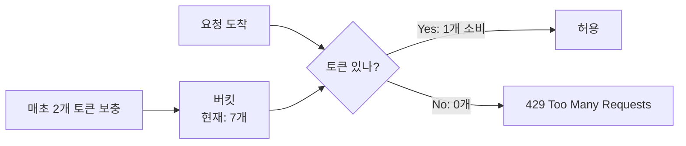
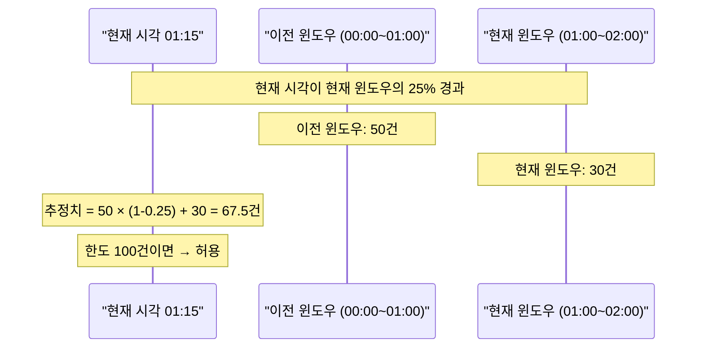
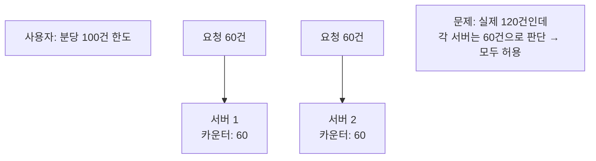
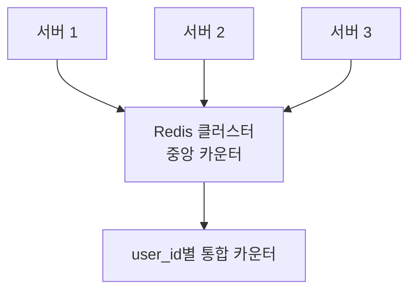
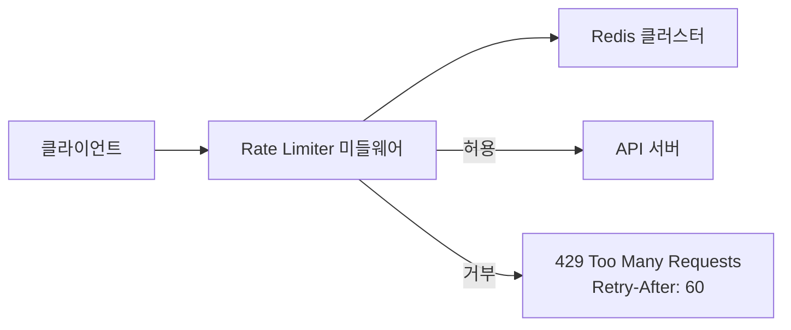
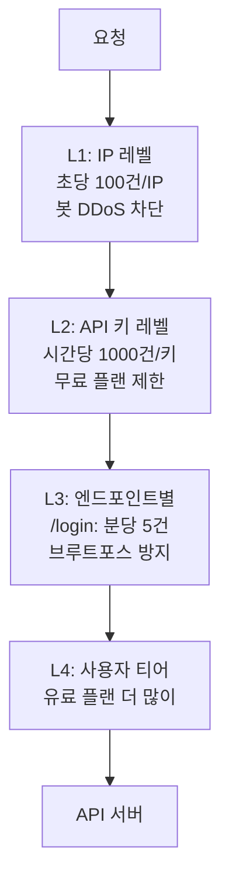
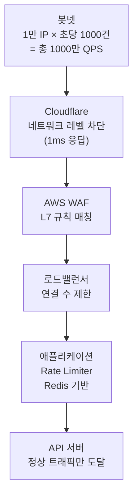

2023년, 한 스타트업의 API가 새벽 3시에 다운됐다. 원인은 경쟁사 봇이 초당 5만 건의 요청을 보낸 것이었다. DB 커넥션 풀이 고갈되고 서비스 전체가 멈췄다. Rate Limiter가 있었다면? IP당 초당 100건 제한으로 이 봇의 요청 99.998%가 차단됐을 것이다. **Rate Limiter는 "공정성"의 문제이기 전에 "생존"의 문제다.**

## 왜 Rate Limiter가 필요한가

> **비유**: 놀이공원 인기 어트랙션 앞의 "1회 탑승 후 재줄 서기" 규칙과 같다. 한 사람이 무한 반복 탑승하는 것을 막아 모든 사람이 공정하게 이용한다. 줄을 서지 않고 뒷문으로 수백 번 들어오려는 사람(봇)을 아예 입장 거부시킨다.

Rate Limiter 없으면 어떤 일이 생기는가:

| 상황 | 결과 |
|------|------|
| 악의적 봇: 초당 10만 요청 | 서버 다운 |
| 클라이언트 버그: 무한 루프 API 호출 | DB 커넥션 고갈 |
| 마케팅 이벤트: 트래픽 폭발 | 서비스 전체 느려짐 |
| 스크래퍼: 데이터 무단 수집 | 비용 폭발, 데이터 유출 |

---

## Rate Limiting 알고리즘 5가지

### 알고리즘 1: 토큰 버킷 (Token Bucket)

> **비유**: 물통에 일정 속도로 토큰(동전)이 채워진다. 요청마다 토큰 1개를 꺼낸다. 토큰이 없으면 요청 거부. 오래 기다리면 토큰이 쌓여 순간 폭발적 요청도 처리할 수 있다.



```python
class TokenBucket:
    def __init__(self, capacity: int, refill_rate: float):
        self.capacity = capacity      # 최대 토큰 수
        self.refill_rate = refill_rate  # 초당 보충 토큰 수
        self.tokens = capacity
        self.last_refill = time.time()

    def allow_request(self) -> bool:
        self._refill()
        if self.tokens >= 1:
            self.tokens -= 1
            return True
        return False

    def _refill(self):
        elapsed = time.time() - self.last_refill
        # 경과 시간에 비례해 토큰 보충 (최대 용량 초과 불가)
        self.tokens = min(self.capacity, self.tokens + elapsed * self.refill_rate)
        self.last_refill = time.time()
```

**특징**: 순간 버스트(burst) 허용 — 버킷이 꽉 찬 상태면 한 번에 많은 요청 처리 가능. 메모리 효율적.

### 알고리즘 2: 누출 버킷 (Leaky Bucket)

> **비유**: 밑에 구멍 뚫린 양동이. 물을 아무리 빨리 부어도 일정 속도로만 흘러나온다. 균일한 처리 속도가 보장된다.

요청이 큐에 들어가고, 일정 속도로 꺼내 처리한다. 큐가 가득 차면 새 요청을 버린다. 서버에 균일한 부하를 보장할 때 유용하다.

### 알고리즘 3: 고정 윈도우 카운터 (Fixed Window Counter)

1분 단위로 카운터를 초기화하고, 그 안에서 N회 제한한다. 구현이 가장 단순하지만 **경계 문제**가 있다:

```
00:59 → 100건 (허용, 새 윈도우 직전)
01:00 → 100건 (허용, 새 윈도우 시작)
→ 2초 사이에 200건이 처리됨!
```

### 알고리즘 4: 슬라이딩 윈도우 로그 (Sliding Window Log)

각 요청의 타임스탬프를 저장해두고, 현재 시각 기준 "최근 1분" 윈도우를 정확하게 계산한다. 경계 문제 없지만 요청마다 타임스탬프를 저장하므로 **메모리 사용량이 요청 수에 비례**한다.

### 알고리즘 5: 슬라이딩 윈도우 카운터 (Sliding Window Counter) — 추천

고정 윈도우 카운터의 경계 문제를 해결하면서 메모리도 효율적이다. **실무에서 가장 널리 쓰이는 방식.**



```python
class SlidingWindowCounter:
    def allow_request(self, user_id: str, redis) -> bool:
        now = time.time()
        current_window = int(now / self.window) * self.window
        prev_window = current_window - self.window
        # 현재 윈도우에서 경과한 비율 (0.0 ~ 1.0)
        elapsed_ratio = (now - current_window) / self.window

        prev_count = int(redis.get(f"counter:{user_id}:{prev_window}") or 0)
        curr_count = int(redis.get(f"counter:{user_id}:{current_window}") or 0)

        # 이전 윈도우의 "남은 비율"만큼 가중치 적용
        estimated = prev_count * (1 - elapsed_ratio) + curr_count

        if estimated >= self.limit:
            return False

        redis.incr(f"counter:{user_id}:{current_window}")
        return True
```

---

## 알고리즘 비교

| 알고리즘 | 메모리 | 정확도 | 버스트 허용 | 복잡도 |
|---------|--------|--------|------------|--------|
| 토큰 버킷 | 낮음 | 중간 | O | 낮음 |
| 누출 버킷 | 낮음 | 높음 | X | 낮음 |
| 고정 윈도우 | 낮음 | **낮음** (경계 문제) | X | 매우 낮음 |
| 슬라이딩 로그 | **높음** | 높음 | X | 중간 |
| **슬라이딩 카운터** | **낮음** | **높음** | X | 중간 |

---

## 분산 환경에서의 문제 — 서버가 여러 대면 카운터가 분산된다

서버가 3대이고 각 서버가 독립적으로 카운터를 유지하면?



**해결: 중앙화된 Redis**로 카운터를 공유한다.



**Lua 스크립트로 원자적 처리** (GET → 비교 → INCR 사이에 끼어들기 없음):

```lua
local key   = KEYS[1]
local limit = tonumber(ARGV[1])
local window = tonumber(ARGV[2])

local current = redis.call('GET', key)
if current and tonumber(current) >= limit then
    return 0  -- 거부
end

local count = redis.call('INCR', key)
if count == 1 then
    redis.call('EXPIRE', key, window)
end
return 1  -- 허용
```

만약 Lua 없이 GET → 비교 → INCR을 따로 하면? 두 서버가 동시에 GET → 둘 다 99건 → 둘 다 INCR → 실제 101건인데 모두 허용된다.

---

## Rate Limiter 아키텍처 — 미들웨어로 구현



429 응답 헤더에 제한 정보를 담아야 클라이언트가 올바르게 재시도할 수 있다:

```
X-RateLimit-Limit: 100       → 한도
X-RateLimit-Remaining: 45    → 남은 횟수
X-RateLimit-Reset: 1704067260 → 윈도우 리셋 시각
Retry-After: 60              → 재시도 가능까지 대기 초
```

이 헤더가 없으면? 클라이언트가 즉시 재시도를 반복해서 오히려 더 많은 429를 만든다.

---

## 계층별 Rate Limiting

단일 계층만으로는 모든 상황을 막을 수 없다:



```python
RATE_LIMIT_TIERS = {
    'free':       {'per_day': 1_000,    'per_minute': 20,     'burst': 50},
    'pro':        {'per_day': 100_000,  'per_minute': 500,    'burst': 1_000},
    'enterprise': {'per_day': 10_000_000, 'per_minute': 10_000, 'burst': 50_000},
}

# 엔드포인트별 추가 제한 (티어 제한과 AND 조건)
ENDPOINT_LIMITS = {
    '/api/auth/login':    (5, 60),     # 분당 5번 — 브루트포스 방지
    '/api/auth/register': (3, 3600),   # 시간당 3번
    '/api/send-sms':      (10, 3600),  # SMS는 비싸므로 엄격하게
}
```

---

<details class="extreme-scenario-details" ontoggle="if(this.open){var ad=this.querySelector('.extreme-scenario-ad');if(ad&&!ad.dataset.loaded){ad.dataset.loaded='1';(adsbygoogle=window.adsbygoogle||[]).push({});}}">
<summary class="extreme-scenario-summary">
<span class="extreme-scenario-icon">🔥</span>
<span class="extreme-scenario-label">극한 시나리오 — 클릭하여 펼치기</span>
<span class="extreme-scenario-toggle"></span>
</summary>
<div class="extreme-scenario-body">
<div class="extreme-scenario-ad" style="text-align:center; margin-bottom:1.5em;">
<ins class="adsbygoogle"
     style="display:block"
     data-ad-client="ca-pub-7225106491387870"
     data-ad-slot="0000000000"
     data-ad-format="auto"
     data-full-width-responsive="true"></ins>
</div>
<div class="extreme-scenario-content" markdown="1">



**자동 IP 차단:**

```python
class AdaptiveRateLimiter:
    def check(self, ip: str) -> str:
        if self.redis.sismember("banned_ips", ip):
            return "BANNED"  # 영구 차단 목록

        minute_count = self._get_count(ip, 60)

        if minute_count > 500:   # 분당 500건 초과
            self.redis.setex(f"temp_ban:{ip}", 3600, 1)  # 1시간 임시 차단
            self._alert_security_team(ip)
            return "BLOCKED"

        if minute_count > 100:   # 분당 100건 초과
            return "CHALLENGE"   # CAPTCHA 요구

        return "ALLOW"
```

---
</div>
</div>
</details>

## 핵심 설계 결정 요약

| 결정 | 선택 | 이유 |
|------|------|------|
| 알고리즘 | 슬라이딩 윈도우 카운터 | 정확도 + 메모리 효율 균형 |
| 저장소 | Redis Cluster | 분산 환경 원자적 카운터 |
| 원자성 | Lua 스크립트 | GET→비교→INCR 사이 Race Condition 방지 |
| 식별자 | API키 > 사용자ID > IP | 정밀도 높은 쪽 우선 |
| 응답 헤더 | X-RateLimit-* 표준 | 클라이언트가 재시도 타이밍 알 수 있게 |
| DDoS | 다층 방어 (CDN → WAF → 앱) | 단일 계층 우회 방지 |
