## 실생활 비유: 놀이공원 입장 제한

놀이공원에서 인기 어트랙션에 줄이 너무 길면 "1시간에 100명만 입장"이라고 제한합니다. 이것이 Rate Limiting입니다. 특정 사람(IP/사용자)이 너무 많은 요청을 보내면 잠시 막아 다른 사람들도 공정하게 서비스를 이용할 수 있게 합니다. DDoS 공격 방어, API 남용 방지, 서버 과부하 방지에 필수적입니다.

---

## 1. 왜 Rate Limiter가 필요한가?

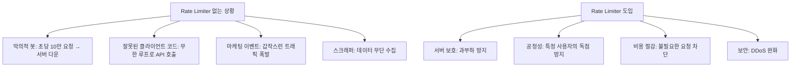

---

## 2. Rate Limiting 알고리즘

### 알고리즘 1: 토큰 버킷 (Token Bucket)

> 비유: 물통에 토큰이 일정 속도로 채워집니다. 요청마다 토큰 1개를 소비합니다. 토큰이 없으면 요청을 거부합니다.

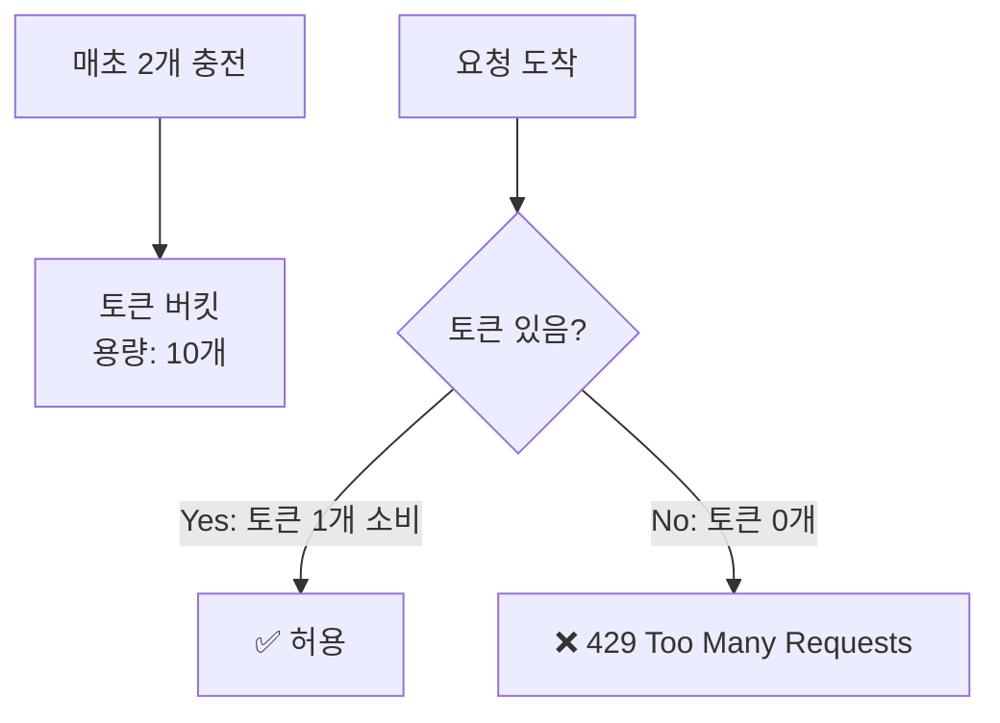

```python
import time
import threading

class TokenBucket:
    def __init__(self, capacity: int, refill_rate: float):
        """
        capacity: 버킷 최대 토큰 수
        refill_rate: 초당 충전 토큰 수
        """
        self.capacity = capacity
        self.refill_rate = refill_rate
        self.tokens = capacity
        self.last_refill = time.time()
        self.lock = threading.Lock()

    def allow_request(self) -> bool:
        with self.lock:
            self._refill()

            if self.tokens >= 1:
                self.tokens -= 1
                return True
            return False

    def _refill(self):
        now = time.time()
        elapsed = now - self.last_refill
        new_tokens = elapsed * self.refill_rate
        self.tokens = min(self.capacity, self.tokens + new_tokens)
        self.last_refill = now

# 사용 예시
limiter = TokenBucket(capacity=10, refill_rate=2)  # 10개 버킷, 초당 2개 충전

for i in range(15):
    if limiter.allow_request():
        print(f"요청 {i+1}: 허용")
    else:
        print(f"요청 {i+1}: 거부")
    time.sleep(0.1)
```

**특징:**
- 순간적인 버스트(급증) 허용 (버킷 가득 찼을 때)
- 평균 처리율 제어
- 구현 단순, 메모리 효율적

---

### 알고리즘 2: 누출 버킷 (Leaky Bucket)

> 비유: 밑에 구멍 뚫린 양동이. 물을 아무리 빨리 부어도 일정 속도로만 흘러나옵니다.

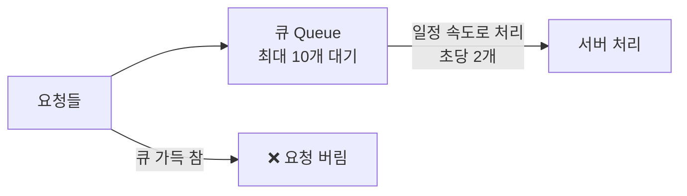

```python
import queue
import threading
import time

class LeakyBucket:
    def __init__(self, capacity: int, leak_rate: float):
        self.queue = queue.Queue(maxsize=capacity)
        self.leak_rate = leak_rate  # 초당 처리 수
        self._start_leaking()

    def _start_leaking(self):
        def leak():
            while True:
                try:
                    request = self.queue.get(timeout=0.1)
                    process_request(request)
                    time.sleep(1 / self.leak_rate)
                except queue.Empty:
                    pass

        thread = threading.Thread(target=leak, daemon=True)
        thread.start()

    def add_request(self, request) -> bool:
        try:
            self.queue.put_nowait(request)
            return True
        except queue.Full:
            return False  # 429 반환
```

**특징:**
- 균일한 처리 속도 보장
- 버스트 트래픽 평탄화
- 오래된 요청이 먼저 처리됨 (FIFO)

---

### 알고리즘 3: 고정 윈도우 카운터 (Fixed Window Counter)

> 비유: 1분 단위로 카운터 초기화. 1분에 100번만 허용.

```
시간: 00:00 ~ 01:00 | 01:00 ~ 02:00 | 02:00 ~ 03:00
요청:       85건    |      120건    |      45건
결과:       허용    |  15건 거부    |      허용
```

```python
class FixedWindowCounter:
    def __init__(self, limit: int, window_seconds: int):
        self.limit = limit
        self.window = window_seconds

    def allow_request(self, user_id: str, redis) -> bool:
        # 현재 윈도우 키 (예: "ratelimit:user1:1704067200")
        window_start = int(time.time() / self.window) * self.window
        key = f"ratelimit:{user_id}:{window_start}"

        count = redis.incr(key)
        if count == 1:
            redis.expire(key, self.window)  # 윈도우 만료 설정

        return count <= self.limit
```

**문제점: 경계 조건**
```
윈도우 경계 문제:
00:59 → 100건 요청 허용
01:00 → 100건 요청 허용 (새 윈도우!)
→ 2초 사이에 200건 처리됨!
```

---

### 알고리즘 4: 슬라이딩 윈도우 로그 (Sliding Window Log)

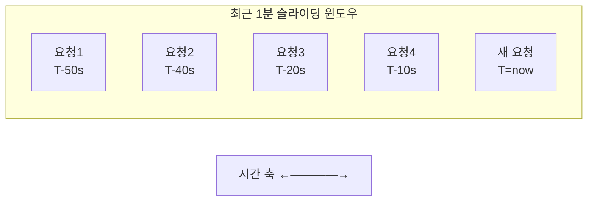

```python
class SlidingWindowLog:
    def __init__(self, limit: int, window_seconds: int):
        self.limit = limit
        self.window = window_seconds

    def allow_request(self, user_id: str, redis) -> bool:
        now = time.time()
        window_start = now - self.window
        key = f"sliding_log:{user_id}"

        # 파이프라인으로 원자적 실행
        pipe = redis.pipeline()
        # 오래된 요청 제거
        pipe.zremrangebyscore(key, 0, window_start)
        # 현재 윈도우 내 요청 수 확인
        pipe.zcard(key)
        # 현재 요청 추가
        pipe.zadd(key, {str(now): now})
        # TTL 설정
        pipe.expire(key, self.window)

        _, count, *_ = pipe.execute()
        return count < self.limit
```

**특징:**
- 정확한 슬라이딩 윈도우
- 메모리 사용량이 요청 수에 비례 (단점)

---

### 알고리즘 5: 슬라이딩 윈도우 카운터 (Sliding Window Counter) ⭐ 추천

고정 윈도우와 슬라이딩 로그의 장점을 결합합니다.

```
현재 시간: 01:15

이전 윈도우 (00:00~01:00): 50건
현재 윈도우 (01:00~02:00): 30건
현재 시간이 현재 윈도우의 25% 경과

가중 평균 계산:
현재 윈도우 내 추정 요청 수 = 50 × (1 - 0.25) + 30
                             = 50 × 0.75 + 30
                             = 37.5 + 30 = 67.5건

한도 100건이면 → 허용!
```

```python
class SlidingWindowCounter:
    def __init__(self, limit: int, window_seconds: int):
        self.limit = limit
        self.window = window_seconds

    def allow_request(self, user_id: str, redis) -> bool:
        now = time.time()
        current_window = int(now / self.window) * self.window
        prev_window = current_window - self.window
        elapsed_ratio = (now - current_window) / self.window

        prev_key = f"counter:{user_id}:{prev_window}"
        curr_key = f"counter:{user_id}:{current_window}"

        prev_count = int(redis.get(prev_key) or 0)
        curr_count = int(redis.get(curr_key) or 0)

        # 가중 평균
        estimated = prev_count * (1 - elapsed_ratio) + curr_count

        if estimated >= self.limit:
            return False

        # 현재 윈도우 카운터 증가
        pipe = redis.pipeline()
        pipe.incr(curr_key)
        pipe.expire(curr_key, self.window * 2)
        pipe.execute()

        return True
```

---

## 3. 알고리즘 비교

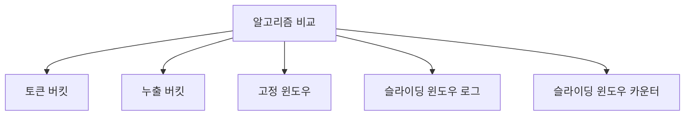

| 알고리즘 | 메모리 | 정확도 | 버스트 허용 | 구현 복잡도 |
|---------|--------|--------|------------|------------|
| 토큰 버킷 | 낮음 | 중간 | O | 낮음 |
| 누출 버킷 | 낮음 | 높음 | X | 낮음 |
| 고정 윈도우 | 낮음 | 낮음 | X | 매우 낮음 |
| 슬라이딩 로그 | 높음 | 높음 | X | 중간 |
| **슬라이딩 카운터** | **낮음** | **높음** | **X** | **중간** |

---

## 4. 분산 환경에서의 Rate Limiting

### 문제: 여러 서버에서 카운터 공유


### 해결책: 중앙화된 Redis

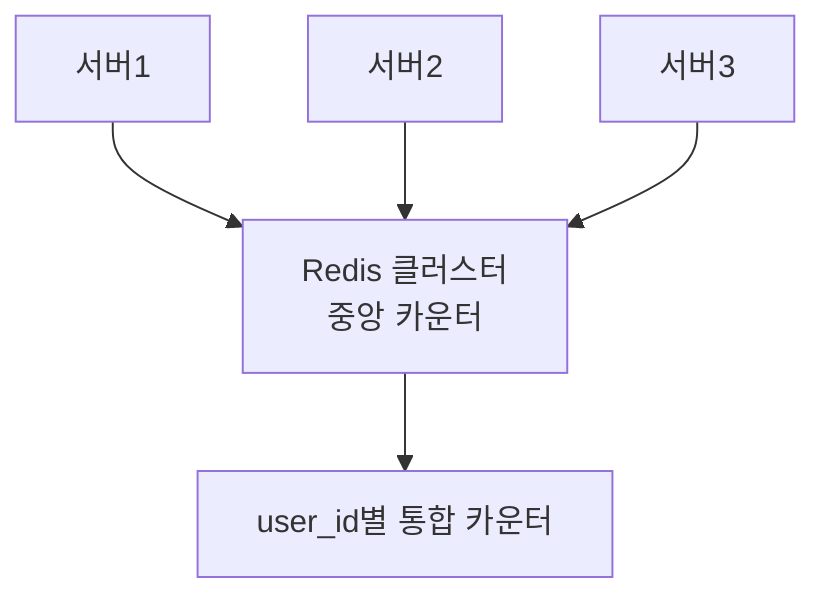

**Redis Lua 스크립트 (원자적 처리):**
```lua
-- rate_limit.lua
local key = KEYS[1]
local limit = tonumber(ARGV[1])
local window = tonumber(ARGV[2])
local now = tonumber(ARGV[3])

local current = redis.call('GET', key)

if current and tonumber(current) >= limit then
    return 0  -- 거부
end

local count = redis.call('INCR', key)
if count == 1 then
    redis.call('EXPIRE', key, window)
end

return 1  -- 허용
```

```python
import redis

class DistributedRateLimiter:
    def __init__(self, redis_client, limit: int, window: int):
        self.redis = redis_client
        self.limit = limit
        self.window = window

        # Lua 스크립트 로드
        with open('rate_limit.lua') as f:
            self.script = self.redis.register_script(f.read())

    def allow_request(self, identifier: str) -> bool:
        key = f"ratelimit:{identifier}:{int(time.time() / self.window)}"
        result = self.script(
            keys=[key],
            args=[self.limit, self.window, time.time()]
        )
        return bool(result)
```

---

## 5. Rate Limiter 아키텍처

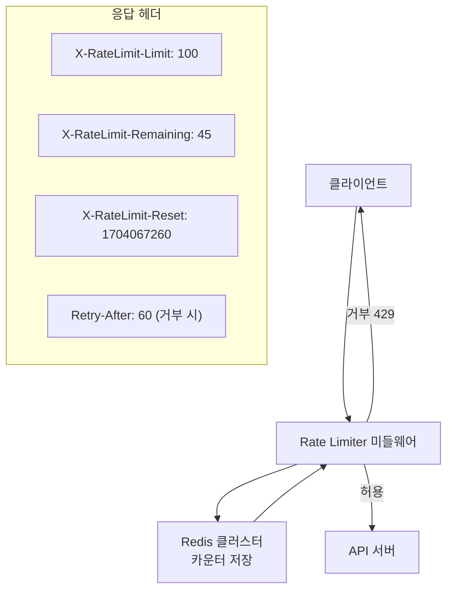

**미들웨어 구현 (FastAPI):**
```python
from fastapi import FastAPI, Request, HTTPException
from fastapi.responses import JSONResponse

app = FastAPI()

class RateLimitMiddleware:
    def __init__(self, app, redis, rules: dict):
        """
        rules: {"/api/v1/shorten": (100, 3600), ...}
               경로: (한도, 윈도우 초)
        """
        self.app = app
        self.redis = redis
        self.rules = rules
        self.limiter = SlidingWindowCounter

    async def __call__(self, scope, receive, send):
        if scope["type"] == "http":
            request = Request(scope)
            path = request.url.path

            # 규칙 매칭
            rule = self.rules.get(path)
            if rule:
                limit, window = rule
                user_id = self._get_identifier(request)
                limiter = self.limiter(limit, window)

                allowed, remaining, reset_at = limiter.check(
                    user_id, self.redis
                )

                if not allowed:
                    response = JSONResponse(
                        {"error": "Too Many Requests"},
                        status_code=429,
                        headers={
                            "X-RateLimit-Limit": str(limit),
                            "X-RateLimit-Remaining": "0",
                            "X-RateLimit-Reset": str(reset_at),
                            "Retry-After": str(window)
                        }
                    )
                    await response(scope, receive, send)
                    return

        await self.app(scope, receive, send)

    def _get_identifier(self, request: Request) -> str:
        """식별자 결정: API 키 > 사용자 ID > IP"""
        api_key = request.headers.get("X-API-Key")
        if api_key:
            return f"apikey:{api_key}"

        user_id = getattr(request.state, "user_id", None)
        if user_id:
            return f"user:{user_id}"

        return f"ip:{request.client.host}"
```

---

## 6. 계층별 Rate Limiting

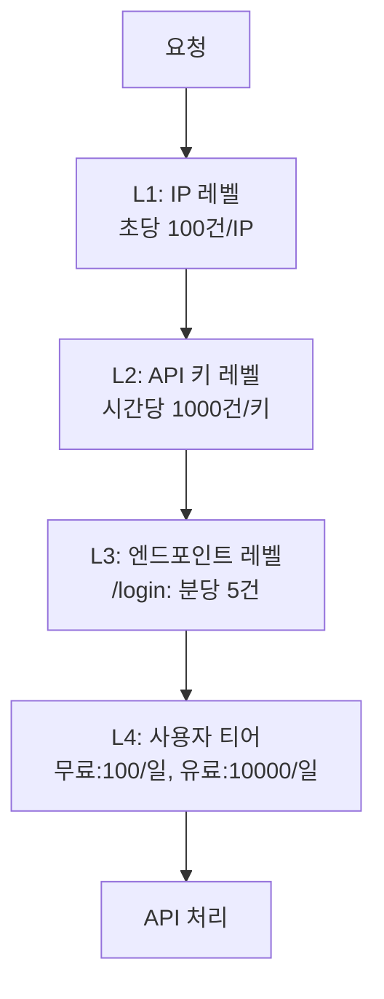

**티어별 설정:**
```python
RATE_LIMIT_TIERS = {
    'free': {
        'requests_per_day': 1000,
        'requests_per_minute': 20,
        'burst': 50
    },
    'pro': {
        'requests_per_day': 100_000,
        'requests_per_minute': 500,
        'burst': 1000
    },
    'enterprise': {
        'requests_per_day': 10_000_000,
        'requests_per_minute': 10_000,
        'burst': 50_000
    }
}

# 엔드포인트별 추가 제한
ENDPOINT_LIMITS = {
    '/api/v1/auth/login': (5, 60),         # 분당 5번
    '/api/v1/auth/register': (3, 3600),    # 시간당 3번
    '/api/v1/send-sms': (10, 3600),        # 시간당 10번
    '/api/v1/search': (100, 60),           # 분당 100번
}
```

---

## 7. 분산 환경 고급 패턴

### Redis Cluster + 일관된 해싱

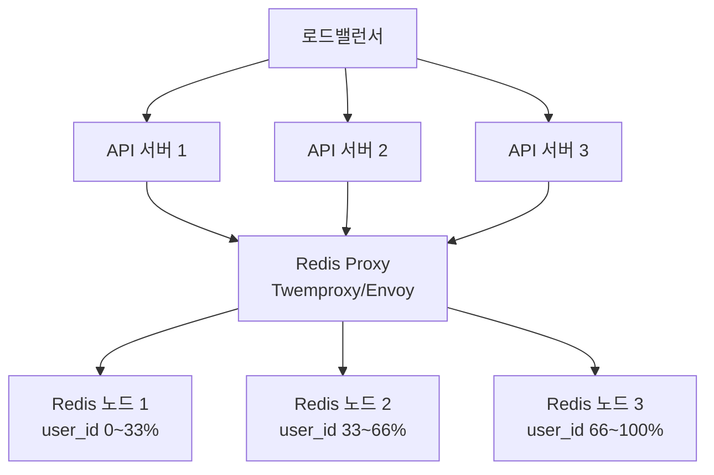

### Gossip 프로토콜 기반 분산 Rate Limiting

각 서버가 로컬 카운터를 유지하고 주기적으로 동기화:

```python
class GossipRateLimiter:
    """로컬 카운터 + 주기적 동기화로 Redis 부하 감소"""

    def __init__(self, limit, window, sync_interval=0.1):
        self.limit = limit
        self.local_count = {}
        self.sync_interval = sync_interval
        self._start_sync()

    def allow_request(self, user_id: str) -> bool:
        # 로컬 카운터 빠른 체크
        local = self.local_count.get(user_id, 0)
        if local >= self.limit * 0.8:  # 80% 도달 시 Redis 확인
            return self._check_redis(user_id)

        self.local_count[user_id] = local + 1
        return True

    def _check_redis(self, user_id: str) -> bool:
        """Redis에서 정확한 카운터 확인"""
        count = redis.incr(f"rl:{user_id}")
        return count <= self.limit

    def _start_sync(self):
        """로컬 카운터를 Redis에 주기적으로 동기화"""
        def sync():
            while True:
                for user_id, count in self.local_count.items():
                    if count > 0:
                        redis.incrby(f"rl:{user_id}", count)
                self.local_count.clear()
                time.sleep(self.sync_interval)

        threading.Thread(target=sync, daemon=True).start()
```

---

## 8. 극한 시나리오: DDoS 공격 대응

```
공격 상황:
- 공격자 IP: 1만 개 (봇넷)
- 각 IP에서 초당 1000건 요청
- 총 초당 1000만 요청
- 정상 트래픽: 초당 1만 건
```

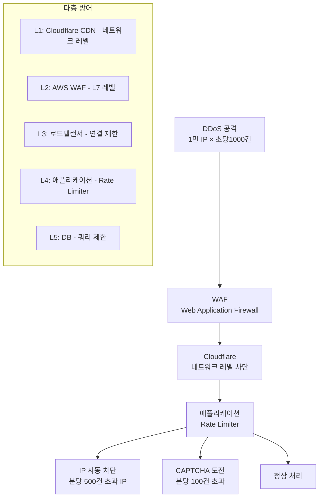

**자동 IP 차단 구현:**
```python
class AdaptiveRateLimiter:
    def __init__(self, redis):
        self.redis = redis
        self.thresholds = {
            'warn': 50,      # 분당 50건: 경고
            'challenge': 100, # 분당 100건: CAPTCHA
            'ban_temp': 500,  # 분당 500건: 1시간 차단
            'ban_perm': 10000 # 일일 1만건: 영구 차단
        }

    def check(self, ip: str) -> str:
        # 영구 차단 확인
        if self.redis.sismember("banned_ips", ip):
            return "BANNED"

        # 임시 차단 확인
        if self.redis.exists(f"temp_ban:{ip}"):
            return "TEMP_BANNED"

        # 분당 요청 수 확인
        minute_count = self._get_count(ip, 60)

        if minute_count > self.thresholds['ban_temp']:
            self.redis.setex(f"temp_ban:{ip}", 3600, 1)
            self._alert_security_team(ip, minute_count)
            return "BLOCKED"

        if minute_count > self.thresholds['challenge']:
            return "CHALLENGE"

        return "ALLOW"

    def _get_count(self, ip: str, window: int) -> int:
        key = f"ip_count:{ip}:{int(time.time() / window)}"
        count = self.redis.incr(key)
        if count == 1:
            self.redis.expire(key, window * 2)
        return count
```

---

## 9. 모니터링 및 알림

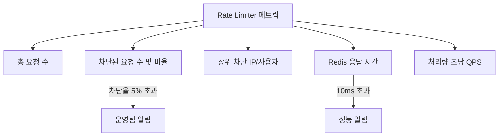

---

## 핵심 설계 결정 요약

| 결정 사항 | 선택 | 이유 |
|----------|------|------|
| 알고리즘 | 슬라이딩 윈도우 카운터 | 정확도 + 메모리 효율 균형 |
| 저장소 | Redis Cluster | 분산 환경 원자적 처리 |
| 원자성 보장 | Lua 스크립트 | Race condition 방지 |
| 식별자 | API키 > 사용자ID > IP | 정밀도 순서 |
| 응답 헤더 | X-RateLimit-* 표준 | 클라이언트 친화적 |
| DDoS 대응 | 다층 방어 | 단일 계층 우회 방지 |
