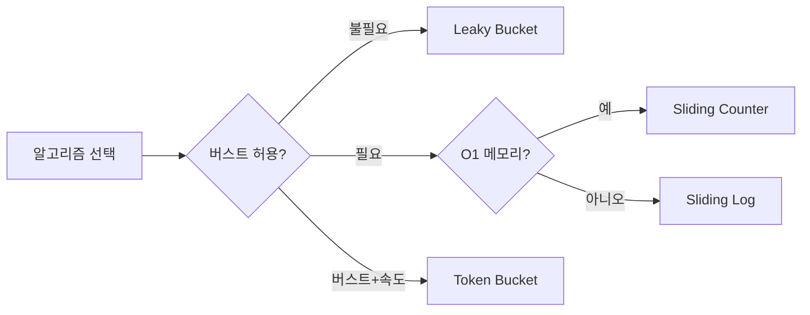
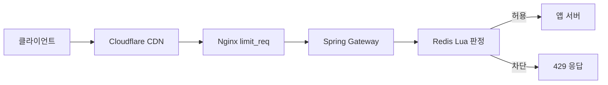

2023년 새벽 3시, 한 스타트업의 API가 다운됐다. 경쟁사 봇이 초당 5만 건을 보냈고, DB 커넥션 풀이 고갈되며 서비스 전체가 멈췄다. Rate Limiter가 있었다면 IP당 초당 100건 제한으로 이 봇의 요청 99.998%가 차단됐을 것이다. **Rate Limiter는 "공정성"의 문제이기 전에 "생존"의 문제다.**

---

## 1. 요구사항 분석 — WHY Rate Limiting이 필요한가

> **비유**: 놀이공원 인기 어트랙션 앞의 "1회 탑승 후 재줄 서기" 규칙이다. 한 사람이 무한 반복 탑승하는 것을 막아 모든 사람이 공정하게 이용한다. 뒷문으로 수백 번 들어오려는 사람(봇)은 아예 입장 거부된다.

### 1.1 Rate Limiting이 없으면 생기는 4가지 장애 유형

| 위협 유형 | 메커니즘 | 결과 | Rate Limiter 효과 |
|-----------|---------|------|-----------------|
| **DDoS 공격** | 봇넷이 초당 10M 요청 | 서버 CPU/메모리 포화, 전체 다운 | IP당 한도로 99.9% 차단 |
| **Thundering Herd** | 캐시 만료 순간 수천 요청 동시 도달 | DB가 같은 쿼리를 수천 번 실행 | 엔드포인트 한도로 동시성 제한 |
| **API 남용** | 클라이언트 버그가 무한 루프로 호출 | DB 커넥션 풀 고갈, 정상 요청 차단 | 사용자 한도로 비정상 패턴 즉시 차단 |
| **비용 폭발** | 스크래퍼가 AI API를 무제한 프록시 이용 | LLM 토큰 비용 수백만 원 | API 키 한도로 과금 상한 강제 |

**WHY Rate Limiter를 직접 구현하는가**: AWS API Gateway, Cloudflare 등의 외부 솔루션은 비즈니스 로직 기반 세밀한 제한이 불가능하다. 예를 들어 "무료 사용자는 분당 10건, 유료는 100건, 엔터프라이즈는 무제한"은 내부 사용자 DB를 조회해야 가능하다.

### 1.2 기능 요구사항

```
- IP, 사용자 ID, API 키 단위로 요청 횟수 제한
- 한도 초과 시 HTTP 429 + Retry-After 헤더 반환
- 사용자 티어(free/premium/enterprise)별 차등 한도
- 엔드포인트별 개별 한도 (/payment: 5/min, /search: 200/min)
- 분산 환경(서버 N대)에서 전역 카운트 일관성 보장
```

### 1.3 비기능 요구사항

```
- 응답 추가 지연: 1ms 이하 (Redis 로컬 캐시 조합)
- 가용성: Rate Limiter 장애 시 서비스 계속 (fail-open 전략)
- 처리량: 초당 100만 Rate Limit 판정 지원
- 정확도: 경계 오차 5% 이내 (Sliding Window 근사)
```

---

## 2. 알고리즘 심층 분석 — 5가지 알고리즘의 내부 동작과 WHY

알고리즘 선택이 잘못되면 버스트 트래픽을 막거나, 경계 구간에서 한도의 2배가 통과하거나, 메모리가 폭발한다. 각 알고리즘의 내부 메커니즘을 이해해야 선택이 가능하다.

### 2.1 Token Bucket — WHY AWS API Gateway가 이것을 선택했는가

**핵심 아이디어**: 버킷에 토큰이 채워지는 속도(refill rate)와 소비 속도(consumption rate)를 분리한다.

**내부 동작 메커니즘**:

```
버킷 상태: capacity=10, tokens=10, refill_rate=1/sec

T=0: 요청 5건 → tokens=5 (차감), 허용
T=0: 요청 5건 → tokens=0 (차감), 허용
T=0: 요청 1건 → tokens=-1 불가 → 거부 (429)
T=1: 1초 경과 → tokens=1 (리필)
T=1: 요청 1건 → tokens=0 (차감), 허용
```

**버스트 처리 WHY**: 토큰이 누적(capacity만큼)되므로 유휴 기간 후 짧은 순간의 트래픽 급증을 흡수한다. AWS API Gateway가 이 알고리즘을 쓰는 이유가 여기 있다. 모바일 앱이 백그라운드에서 깨어날 때 5~10건이 순간 폭발하는 것이 정상 패턴이기 때문이다.

**리필 메커니즘**: 매초 토큰을 추가하는 방식(timer-based)이 아니라 요청 도달 시 마지막 리필 시각과의 차이로 게으른 계산(lazy refill)을 한다. 이 방식이 타이머보다 정확하고 스케줄러 오버헤드가 없다.

```java
// Token Bucket: lazy refill 구현
public class TokenBucket {
    private final long capacity;
    private final double refillRatePerSecond;
    private double tokens;
    private long lastRefillTimestamp;

    public TokenBucket(long capacity, double refillRatePerSecond) {
        this.capacity = capacity;
        this.refillRatePerSecond = refillRatePerSecond;
        this.tokens = capacity;  // 처음엔 가득
        this.lastRefillTimestamp = System.currentTimeMillis();
    }

    public synchronized boolean tryConsume() {
        refill();  // 요청 도달 시점에 게으른 리필
        if (tokens >= 1.0) {
            tokens -= 1.0;
            return true;
        }
        return false;
    }

    private void refill() {
        long now = System.currentTimeMillis();
        double elapsed = (now - lastRefillTimestamp) / 1000.0;  // 초 단위
        double newTokens = elapsed * refillRatePerSecond;
        tokens = Math.min(capacity, tokens + newTokens);  // capacity 초과 불가
        lastRefillTimestamp = now;
    }
}
```

**Bucket4j로 Spring 통합 — WHY Bucket4j인가**: Bucket4j는 Java에서 Token Bucket의 표준 구현이다. 로컬 메모리(JVM)뿐 아니라 Redis, Hazelcast에 상태를 저장할 수 있어 분산 환경을 지원한다. 원자적 CAS(Compare-And-Swap) 연산으로 동시성 문제 없이 카운팅한다.

```java
// build.gradle
// implementation 'com.github.vladimir-bukhtoyarov:bucket4j-core:8.10.1'
// implementation 'com.github.vladimir-bukhtoyarov:bucket4j-redis:8.10.1'

@Configuration
public class Bucket4jConfig {

    @Bean
    public ProxyManager<String> proxyManager(RedissonClient redissonClient) {
        // Redis에 버킷 상태 저장 → 분산 환경에서 공유
        return Bucket4jRedisson.entryPointOf(redissonClient);
    }
}

@Service
public class RateLimitService {
    private final ProxyManager<String> buckets;

    // 사용자 티어별 Bandwidth 설정
    private BucketConfiguration configForUser(UserTier tier) {
        return switch (tier) {
            case FREE -> BucketConfiguration.builder()
                .addLimit(Bandwidth.classic(10, Refill.greedy(10, Duration.ofMinutes(1))))
                .build();
            case PREMIUM -> BucketConfiguration.builder()
                .addLimit(Bandwidth.classic(100, Refill.greedy(100, Duration.ofMinutes(1))))
                .build();
            case ENTERPRISE -> BucketConfiguration.builder()
                .addLimit(Bandwidth.classic(10_000, Refill.greedy(10_000, Duration.ofMinutes(1))))
                .build();
        };
    }

    public boolean tryConsume(String userId, UserTier tier) {
        String key = "rl:user:" + userId;
        // getProxy: 없으면 새 버킷 생성, 있으면 기존 버킷 반환 (원자적)
        BucketProxy bucket = buckets.builder()
            .build(key, () -> configForUser(tier));
        return bucket.tryConsume(1);
    }
}

// Spring HandlerInterceptor로 자동 적용
@Component
public class RateLimitInterceptor implements HandlerInterceptor {
    private final RateLimitService rateLimitService;
    private final UserService userService;

    @Override
    public boolean preHandle(HttpServletRequest request,
                             HttpServletResponse response,
                             Object handler) throws Exception {
        String userId = extractUserId(request);
        UserTier tier = userService.getTier(userId);

        if (!rateLimitService.tryConsume(userId, tier)) {
            response.setStatus(HttpStatus.TOO_MANY_REQUESTS.value());
            // WHY Retry-After: 클라이언트가 언제 재시도할지 알 수 있게 함
            // 이 헤더 없으면 클라이언트가 즉시 재시도 → 오히려 더 많은 요청 발생
            response.setHeader("Retry-After", "60");
            response.setHeader("X-RateLimit-Limit", String.valueOf(tier.getLimit()));
            response.setHeader("X-RateLimit-Remaining", "0");
            response.getWriter().write("{\"error\":\"Rate limit exceeded\",\"retryAfter\":60}");
            return false;
        }
        return true;
    }
}
```

**@RateLimiter 어노테이션 — Resilience4j 방식**:

```java
// build.gradle
// implementation 'io.github.resilience4j:resilience4j-spring-boot3:2.2.0'

# application.yml
resilience4j:
  ratelimiter:
    instances:
      paymentApi:
        limit-for-period: 5          # 주기당 허용 요청 수
        limit-refresh-period: 1m     # 주기 길이 (1분)
        timeout-duration: 0s         # 0s = 대기 없이 즉시 실패
      searchApi:
        limit-for-period: 200
        limit-refresh-period: 1m
        timeout-duration: 0s

@RestController
@RequestMapping("/api")
public class PaymentController {

    // WHY @RateLimiter: 코드 침투 없이 AOP로 Rate Limit 적용
    // 단점: 인스턴스 로컬 메모리 사용 → 분산 환경에서는 서버 수 × 한도가 실제 허용량
    @RateLimiter(name = "paymentApi", fallbackMethod = "paymentFallback")
    @PostMapping("/payment")
    public ResponseEntity<PaymentResult> pay(@RequestBody PaymentRequest req) {
        return ResponseEntity.ok(paymentService.process(req));
    }

    // 한도 초과 시 fallback 자동 호출
    public ResponseEntity<PaymentResult> paymentFallback(
            PaymentRequest req, RequestNotPermitted ex) {
        return ResponseEntity.status(429)
            .header("Retry-After", "60")
            .body(PaymentResult.rateLimited("분당 5건 한도 초과. 60초 후 재시도하세요."));
    }

    @RateLimiter(name = "searchApi", fallbackMethod = "searchFallback")
    @GetMapping("/search")
    public ResponseEntity<SearchResult> search(@RequestParam String q) {
        return ResponseEntity.ok(searchService.search(q));
    }

    public ResponseEntity<SearchResult> searchFallback(
            String q, RequestNotPermitted ex) {
        return ResponseEntity.status(429)
            .header("Retry-After", "10")
            .body(SearchResult.empty("검색 한도 초과"));
    }
}
```

**Token Bucket 장단점 요약**:

| 항목 | 내용 |
|------|------|
| 메모리 | O(1) — 버킷 1개(토큰 수 + 마지막 리필 시각) |
| 버스트 허용 | 가능 (누적 토큰 소비) |
| 경계 문제 | 없음 (시간 기반 연속 모델) |
| 적합한 용도 | API 서버 기본, AWS API Gateway 표준 |

---

### 2.2 Leaky Bucket — WHY 고정 처리율 출력이 필요한가

**핵심 아이디어**: 요청을 큐에 쌓고, 일정한 속도로만 꺼내 처리한다. 버킷에 구멍이 뚫려 일정하게 새는 것처럼 동작한다.

**내부 동작 메커니즘**:

```
큐 크기: 10, 처리율: 2 req/sec

T=0: 요청 5건 → 큐에 5건 입력 (큐: [R1,R2,R3,R4,R5])
T=0: 요청 6건 → 큐 용량 초과 1건 거부 (429)
T=0.5: 처리 1건 → 큐: [R2,R3,R4,R5]
T=1.0: 처리 1건 → 큐: [R3,R4,R5]
     새 요청 5건 → 큐: [R3,R4,R5,R6,R7,R8,R9,R10] (꽉 참)
T=1.0: 요청 3건 → 큐 초과, 3건 모두 거부
```

**Token Bucket과의 결정적 차이 WHY**: Token Bucket은 누적 토큰을 소비해 순간 버스트를 흡수한다. Leaky Bucket은 큐에서 일정 속도로만 꺼내므로 **출력 속도가 항상 일정**하다. 결제 처리 시스템에서 외부 PG사에 보내는 요청을 초당 정확히 N건으로 맞춰야 할 때, 또는 메시지 큐 소비자가 일정 속도로 처리해야 할 때 Leaky Bucket을 쓴다.

**WHY 결제에서 Leaky Bucket인가**: PG사 API는 초당 처리율 SLA를 엄격히 적용한다. Token Bucket으로 누적 토큰을 한 번에 소비하면 PG사에 단기 폭발이 발생해 PG사에서 차단당한다.

```java
// Leaky Bucket: 큐 기반 구현
// 실제 출력이 일정해야 하는 시스템(결제, 외부 API 호출)에 사용
@Component
public class LeakyBucketRateLimiter {
    private final BlockingQueue<Runnable> queue;
    private final ScheduledExecutorService scheduler;

    public LeakyBucketRateLimiter(int bucketSize, int ratePerSecond) {
        this.queue = new ArrayBlockingQueue<>(bucketSize);
        this.scheduler = Executors.newScheduledThreadPool(1);

        // 일정 속도로 큐에서 꺼내 처리 (출력 속도 고정)
        long intervalMs = 1000L / ratePerSecond;
        scheduler.scheduleAtFixedRate(() -> {
            Runnable task = queue.poll();
            if (task != null) task.run();
        }, 0, intervalMs, TimeUnit.MILLISECONDS);
    }

    // 반환: true=큐에 추가 성공, false=큐 가득 찬 경우 429
    public boolean submit(Runnable task) {
        return queue.offer(task);  // 비차단: 꽉 찼으면 즉시 false
    }
}

@Service
public class PaymentGatewayService {
    private final LeakyBucketRateLimiter limiter;

    public PaymentGatewayService() {
        // 외부 PG사 SLA: 초당 최대 50건
        this.limiter = new LeakyBucketRateLimiter(200, 50);
    }

    public CompletableFuture<PaymentResult> processPayment(PaymentRequest req) {
        CompletableFuture<PaymentResult> future = new CompletableFuture<>();

        boolean accepted = limiter.submit(() -> {
            try {
                PaymentResult result = externalPGApi.call(req);
                future.complete(result);
            } catch (Exception e) {
                future.completeExceptionally(e);
            }
        });

        if (!accepted) {
            // 큐가 가득 참 = 처리 용량 초과
            future.complete(PaymentResult.queued("처리 대기 중. 잠시 후 재시도하세요."));
        }
        return future;
    }
}
```

**Leaky Bucket 장단점 요약**:

| 항목 | 내용 |
|------|------|
| 메모리 | O(N) — 큐 크기만큼 |
| 출력 속도 | 항상 일정 (평활화) |
| 버스트 처리 | 큐에서 대기 (즉시 거부 아님) |
| 적합한 용도 | 외부 API 호출 속도 제한, 결제 처리 |
| Token Bucket 차이 | Token Bucket: 입력 속도 제한 / Leaky Bucket: 출력 속도 고정 |

---

### 2.3 Fixed Window Counter — WHY 구현이 단순하고 WHY 쓰면 안 되는가

**핵심 아이디어**: 1분 단위 고정 창에서 카운트한다. 00:00~00:59가 한 창, 01:00~01:59가 다음 창.

**내부 동작 메커니즘**:

```
한도: 분당 100건

00:50 ~ 00:59: 요청 100건 → 허용 (창 내 카운트 100)
01:00 ~ 01:10: 요청 100건 → 허용 (새 창, 카운트 초기화)

결과: 10초 동안 200건이 통과 → 실제로는 2배 허용
```

**경계 버스트 문제 WHY**: 창이 바뀌는 순간 카운터가 초기화된다. 이전 창 마지막 10초와 새 창 첫 10초에 각각 100건씩 넣으면 20초 동안 200건이 허용된다. 이 문제가 Fixed Window의 치명적 약점이다.

**WHY Redis INCR + EXPIRE인가**: INCR과 EXPIRE를 Redis 단일 명령으로 처리하면 원자성이 보장된다. MySQL이나 JVM 메모리를 쓰면 분산 환경에서 레이스 컨디션이 발생한다.

```java
// Fixed Window Counter: Redis INCR + EXPIRE
// WHY Lua 스크립트: INCR과 EXPIRE를 원자적으로 묶기 위해
@Service
public class FixedWindowRateLimiter {
    private final StringRedisTemplate redis;

    // Lua 스크립트: INCR → count가 1이면(첫 요청) EXPIRE 설정 → count 반환
    // WHY Lua: Redis는 Lua 스크립트를 원자적으로 실행 (중간에 다른 명령 끼어들 수 없음)
    private static final String FIXED_WINDOW_SCRIPT = """
        local key = KEYS[1]
        local limit = tonumber(ARGV[1])
        local window = tonumber(ARGV[2])
        local count = redis.call('INCR', key)
        if count == 1 then
            redis.call('EXPIRE', key, window)
        end
        return count
        """;

    public boolean isAllowed(String userId, String endpoint, int limit, int windowSeconds) {
        // 키: "rl:fixed:userId:endpoint:분단위타임스탬프"
        long windowStart = System.currentTimeMillis() / 1000 / windowSeconds;
        String key = String.format("rl:fixed:%s:%s:%d", userId, endpoint, windowStart);

        Long count = redis.execute(
            new DefaultRedisScript<>(FIXED_WINDOW_SCRIPT, Long.class),
            List.of(key),
            String.valueOf(limit),
            String.valueOf(windowSeconds)
        );

        return count != null && count <= limit;
    }
}
```

**Fixed Window 장단점 요약**:

| 항목 | 내용 |
|------|------|
| 메모리 | O(1) — 키 1개 |
| 구현 난이도 | 가장 단순 |
| 경계 버스트 | 창 경계에서 2배 허용 |
| 적합한 용도 | 내부 관리 API, 경계 버스트가 무해한 경우 |

---

### 2.4 Sliding Window Log — WHY 가장 정확하고 WHY 쓰면 안 되는가

**핵심 아이디어**: 모든 요청의 타임스탬프를 저장한다. 새 요청이 올 때 "현재 시각 - 1분 이전" 타임스탬프를 삭제하고 남은 개수를 센다.

**내부 동작 메커니즘**:

```
한도: 분당 5건, 로그: sorted set

T=00:10: 요청 → set에 추가 {00:10}. count=1 ≤ 5 → 허용
T=00:20: 요청 → set에 추가 {00:10, 00:20}. count=2 ≤ 5 → 허용
T=00:30: 요청 → set에 추가 {00:10, 00:20, 00:30}. count=3 → 허용
T=00:40: 요청 → count=4 → 허용
T=00:50: 요청 → count=5 → 허용
T=00:55: 요청 → count=6 > 5 → 거부 (5건 이미 있음)
T=01:11: 요청 → 00:10 타임스탬프 제거 → count=4+1=5 ≤ 5 → 허용
         (00:11부터 01:11까지 정확히 1분 슬라이딩)
```

**WHY 가장 정확한가**: 항상 "현재 시각 기준 정확히 1분 전"을 기준으로 계산한다. Fixed Window처럼 창 경계가 없고, Sliding Window Counter처럼 근사치도 아니다.

**WHY 메모리가 문제인가**: 요청마다 타임스탬프를 저장하므로 메모리가 O(N)이다. 한도가 분당 100만 건이라면 sorted set에 100만 개의 타임스탬프가 쌓인다. 고빈도 API에 적용하면 Redis 메모리가 폭발한다.

```java
// Sliding Window Log: Redis Sorted Set
// score = 타임스탬프 (UNIX milliseconds)
// WHY Sorted Set: ZRANGEBYSCORE로 시간 범위 조회/삭제가 O(log N)
@Service
public class SlidingWindowLogRateLimiter {

    private static final String SLIDING_LOG_SCRIPT = """
        local key = KEYS[1]
        local now = tonumber(ARGV[1])
        local window = tonumber(ARGV[2])
        local limit = tonumber(ARGV[3])
        local window_start = now - window

        -- 윈도우 밖 타임스탬프 제거 (O(log N + M))
        redis.call('ZREMRANGEBYSCORE', key, '-inf', window_start)

        -- 현재 윈도우 내 요청 수 조회
        local count = redis.call('ZCARD', key)

        if count < limit then
            -- 현재 요청 추가 (score=타임스탬프, member=타임스탬프+난수)
            redis.call('ZADD', key, now, now .. ':' .. math.random(1000000))
            redis.call('EXPIRE', key, math.ceil(window / 1000))
            return 1  -- 허용
        end
        return 0  -- 거부
        """;

    public boolean isAllowed(String userId, int limitPerMinute) {
        String key = "rl:log:" + userId;
        long now = System.currentTimeMillis();
        long windowMs = 60_000L;

        Long result = redis.execute(
            new DefaultRedisScript<>(SLIDING_LOG_SCRIPT, Long.class),
            List.of(key),
            String.valueOf(now),
            String.valueOf(windowMs),
            String.valueOf(limitPerMinute)
        );

        return Long.valueOf(1L).equals(result);
    }
}
```

**Sliding Window Log 장단점 요약**:

| 항목 | 내용 |
|------|------|
| 메모리 | O(N) — 요청마다 타임스탬프 저장 |
| 정확도 | 가장 높음 (경계 오차 없음) |
| 성능 | ZREMRANGEBYSCORE O(log N + M) |
| 적합한 용도 | 금융 규정 준수, 한도가 매우 낮은 경우 |

---

### 2.5 Sliding Window Counter — WHY 일반 API의 기본 선택인가

**핵심 아이디어**: Fixed Window의 O(1) 메모리와 Sliding Window Log의 경계 정확도를 절충한 하이브리드다. 이전 창의 가중치(overlap 비율)와 현재 창의 카운트를 조합해 근사치를 계산한다.

**내부 동작 메커니즘**:

```
한도: 분당 100건
이전 창(00:00~00:59): 80건 처리됨
현재 창(01:00~01:59): 01:30에 새 요청 도착

현재 창 시작으로부터 경과: 30초
창 크기: 60초
이전 창 가중치: (60-30)/60 = 0.5 (이전 창의 50%가 현재 슬라이딩 창에 포함)

추정 요청 수: 80 × 0.5 + (현재 창 카운트) = 40 + 현재카운트
→ 현재 창에 60건이 있다면: 40 + 60 = 100 → 한도 도달
→ 현재 창에 59건이 있다면: 40 + 59 = 99 → 허용
```

**WHY 근사치인데도 쓰는가**: 이전 창 요청이 창 전체에 균등하게 분포했다고 가정한다. 실제로는 그렇지 않지만, 실무에서 이 오차는 5% 이내이며 경계 버스트 문제보다 훨씬 작다. 메모리는 O(1) (창당 키 2개)이면서 경계 버스트가 없다는 것이 핵심 장점이다.

```java
// Sliding Window Counter: Redis 2개 키 (이전 창, 현재 창)
// WHY 2개 키: 이전 창 가중치 계산에 필요
@Service
public class SlidingWindowCounterRateLimiter {

    // Lua 스크립트: 원자적으로 이전창 조회 + 현재창 INCR + 판정
    private static final String SLIDING_COUNTER_SCRIPT = """
        local current_key = KEYS[1]
        local prev_key = KEYS[2]
        local now = tonumber(ARGV[1])
        local window_size = tonumber(ARGV[2])
        local limit = tonumber(ARGV[3])

        -- 현재 창 시작 시각 (초 단위 버림)
        local window_start = now - (now % window_size)
        -- 현재 창 내 경과 비율 (0.0 ~ 1.0)
        local elapsed_ratio = (now % window_size) / window_size
        -- 이전 창 가중치 (1 - elapsed_ratio)
        local prev_weight = 1.0 - elapsed_ratio

        -- 이전 창 카운트 조회
        local prev_count = tonumber(redis.call('GET', prev_key) or '0')
        -- 현재 창 카운트 조회 (아직 INCR 전)
        local curr_count = tonumber(redis.call('GET', current_key) or '0')

        -- 슬라이딩 윈도우 추정 카운트
        local estimated = prev_count * prev_weight + curr_count

        if estimated < limit then
            -- 현재 창 INCR + TTL 설정
            redis.call('INCR', current_key)
            redis.call('EXPIRE', current_key, window_size * 2)
            return 1  -- 허용
        end
        return 0  -- 거부
        """;

    public boolean isAllowed(String userId, String endpoint,
                             int limit, int windowSeconds) {
        long now = System.currentTimeMillis() / 1000;  // 초 단위
        long windowStart = now - (now % windowSeconds);
        long prevWindowStart = windowStart - windowSeconds;

        String currentKey = String.format("rl:sw:%s:%s:%d", userId, endpoint, windowStart);
        String prevKey = String.format("rl:sw:%s:%s:%d", userId, endpoint, prevWindowStart);

        Long result = redis.execute(
            new DefaultRedisScript<>(SLIDING_COUNTER_SCRIPT, Long.class),
            List.of(currentKey, prevKey),
            String.valueOf(now),
            String.valueOf(windowSeconds),
            String.valueOf(limit)
        );

        return Long.valueOf(1L).equals(result);
    }
}
```

**Sliding Window Counter 장단점 요약**:

| 항목 | 내용 |
|------|------|
| 메모리 | O(1) — 키 2개 |
| 정확도 | 높음 (오차 5% 이내) |
| 경계 버스트 | 없음 |
| 적합한 용도 | **일반 API 기본 선택** |
| 근사 오차 조건 | 이전 창 요청이 균등 분포 가정 |

---

### 2.6 알고리즘 선택 플로우



---

## 3. 분산 Rate Limiter — Redis Lua와 WHY 원자성이 필요한가

### 3.1 WHY Redis Lua 스크립트인가

분산 환경에서 Rate Limit 카운팅에 원자성이 필요한 이유를 레이스 컨디션으로 설명한다.

**레이스 컨디션 시나리오 (Lua 없을 때)**:

```
한도: 100건, 현재 카운트: 99
서버 A: GET count → 99 (아직 100 미만이므로 허용 결정)
서버 B: GET count → 99 (서버 A가 INCR 하기 전)
서버 A: INCR count → 100 ← 정상
서버 B: INCR count → 101 ← 한도 초과인데 허용됨!

결과: 두 요청 모두 허용 → 레이스 컨디션으로 한도 위반
```

**WHY Lua가 해결하는가**: Redis는 단일 스레드로 동작하고, Lua 스크립트는 원자적으로 실행된다. 스크립트 실행 중에는 다른 Redis 명령이 끼어들 수 없다. GET + 판정 + INCR을 Lua로 묶으면 레이스 컨디션이 원천 차단된다.

**WHY MULTI/EXEC(트랜잭션) 대신 Lua인가**: Redis 트랜잭션(MULTI/EXEC)은 WATCH로 낙관적 락을 구현하지만, WATCH 키가 변경되면 전체 트랜잭션이 실패하고 재시도가 필요하다. 고트래픽 환경에서는 재시도 폭풍이 발생한다. Lua는 실행 자체가 원자적이므로 재시도가 없다.

```java
// Redis Lua 스크립트 기반 Sliding Window Counter (프로덕션 수준)
@Service
public class DistributedRateLimiter {
    private final StringRedisTemplate redis;

    // 완전한 Sliding Window Counter Lua 스크립트
    // WHY Lua: GET + 계산 + INCR + EXPIRE를 원자적 단일 연산으로 처리
    private static final String RATE_LIMIT_LUA = """
        local tokens_key = KEYS[1]
        local timestamp_key = KEYS[2]
        local rate = tonumber(ARGV[1])
        local capacity = tonumber(ARGV[2])
        local now = tonumber(ARGV[3])
        local requested = tonumber(ARGV[4])

        local fill_time = capacity / rate
        local ttl = math.floor(fill_time * 2)

        local last_tokens = tonumber(redis.call('GET', tokens_key))
        if last_tokens == nil then
            last_tokens = capacity
        end

        local last_refreshed = tonumber(redis.call('GET', timestamp_key))
        if last_refreshed == nil then
            last_refreshed = 0
        end

        -- 경과 시간에 비례해 토큰 리필 (Token Bucket lazy refill)
        local delta = math.max(0, now - last_refreshed)
        local filled_tokens = math.min(capacity, last_tokens + (delta * rate))
        local allowed = filled_tokens >= requested
        local new_tokens = filled_tokens

        if allowed then
            new_tokens = filled_tokens - requested
        end

        -- 새 상태 저장
        redis.call('SETEX', tokens_key, ttl, new_tokens)
        redis.call('SETEX', timestamp_key, ttl, now)

        return { allowed and 1 or 0, new_tokens }
        """;

    public RateLimitResult checkLimit(String key, int ratePerSecond,
                                      int burstCapacity) {
        String tokensKey = "rl:tokens:" + key;
        String tsKey = "rl:ts:" + key;
        double now = System.currentTimeMillis() / 1000.0;

        @SuppressWarnings("unchecked")
        List<Long> result = (List<Long>) redis.execute(
            new DefaultRedisScript<>(RATE_LIMIT_LUA, List.class),
            List.of(tokensKey, tsKey),
            String.valueOf(ratePerSecond),
            String.valueOf(burstCapacity),
            String.valueOf(now),
            "1"
        );

        boolean allowed = result != null && result.get(0) == 1L;
        long remaining = result != null ? result.get(1) : 0L;

        return new RateLimitResult(allowed, remaining, ratePerSecond);
    }
}

// 결과 모델 + HTTP 헤더 매핑
public record RateLimitResult(boolean allowed, long remaining, int limit) {
    public void applyHeaders(HttpServletResponse response) {
        response.setHeader("X-RateLimit-Limit", String.valueOf(limit));
        response.setHeader("X-RateLimit-Remaining", String.valueOf(remaining));
        response.setHeader("X-RateLimit-Reset",
            String.valueOf(System.currentTimeMillis() / 1000 + 60));
        if (!allowed) {
            response.setHeader("Retry-After", "60");
        }
    }
}
```

### 3.2 로컬 + 분산 하이브리드 — WHY 2단계인가

**문제 상황**: Redis 조회는 1ms 미만이지만, 초당 100만 요청이 모두 Redis를 조회하면 Redis 자체가 병목이 된다.

**WHY 로컬 + 분산 하이브리드인가**:
- 로컬(JVM): 수십 나노초, 네트워크 없음 → 속도
- 분산(Redis): 서버 N대 공유 → 정확도

두 가지를 조합하면 속도와 정확도를 동시에 얻는다.

**동작 방식**: 전체 한도를 서버 수로 나눠 로컬 할당량을 정한다. 로컬 한도 초과 시에만 Redis를 조회해 전역 잔량을 확인하고 추가 할당을 받는다.

```java
// 로컬 + 분산 하이브리드 Rate Limiter
@Component
public class HybridRateLimiter {
    private final DistributedRateLimiter distributed;
    // 서버 수: 환경변수나 서비스 디스커버리에서 조회
    private final int serverCount;

    // 로컬 Token Bucket (서버 인스턴스별)
    private final Map<String, TokenBucket> localBuckets = new ConcurrentHashMap<>();

    public boolean isAllowed(String key, int globalLimit) {
        // 로컬 할당량: 전체 한도 / 서버 수
        int localLimit = Math.max(1, globalLimit / serverCount);

        TokenBucket local = localBuckets.computeIfAbsent(key,
            k -> new TokenBucket(localLimit, localLimit));

        if (local.tryConsume()) {
            // 1차: 로컬에서 빠르게 처리 (Redis 조회 없음)
            return true;
        }

        // 2차: 로컬 소진 → Redis에서 추가 토큰 요청
        // 이 경우만 네트워크 홉 발생
        RateLimitResult result = distributed.checkLimit(key, globalLimit / 10,
                                                        globalLimit / 5);
        if (result.allowed()) {
            // Redis에서 추가 할당 받아 로컬 버킷 보충
            localBuckets.put(key, new TokenBucket(localLimit, localLimit));
            return true;
        }
        return false;
    }
}
```

---

## 4. 구현 계층별 설계 — API Gateway + 애플리케이션

### 4.1 WHY HTTP 429 + Retry-After 헤더인가

**HTTP 429의 이유**: RFC 6585에 정의된 "Too Many Requests" 상태 코드다. 400 Bad Request나 503 Service Unavailable과 다르게, 클라이언트에게 "요청 자체는 정상이지만 너무 많다"는 정확한 신호를 준다. 클라이언트는 이 코드를 보고 로직을 변경해야 함을 안다.

**Retry-After 헤더의 WHY**: 이 헤더가 없으면 클라이언트가 즉시 재시도한다. 429를 받은 직후 재시도하면 다시 429가 온다. 이 루프가 오히려 서버에 더 많은 요청을 만든다. Retry-After로 "60초 후에 재시도하라"고 명시하면 클라이언트가 대기하고 서버 부하가 줄어든다.

**X-RateLimit 헤더 시리즈**: 클라이언트가 자신의 현재 상태를 알게 해서 능동적으로 요청 속도를 조절하게 한다.

```java
// Rate Limit 응답 표준 헤더
// RFC 6585: HTTP 429 Too Many Requests
response.setStatus(429);
response.setContentType("application/json");

// WHY Retry-After: 클라이언트가 언제 재시도 가능한지 알려줌
// 이 헤더 없으면 클라이언트가 즉시 재시도 → 서버에 더 많은 부하
response.setHeader("Retry-After", "60");

// WHY X-RateLimit-*: 클라이언트가 현재 상태를 알고 능동적으로 속도 조절
response.setHeader("X-RateLimit-Limit", "100");        // 전체 한도
response.setHeader("X-RateLimit-Remaining", "0");      // 남은 횟수
response.setHeader("X-RateLimit-Reset", "1714896060"); // 초기화 UNIX 타임스탬프

String body = """
    {
        "error": "rate_limit_exceeded",
        "message": "분당 100건 한도를 초과했습니다",
        "retryAfter": 60,
        "limit": 100,
        "reset": 1714896060
    }
    """;
response.getWriter().write(body);
```

### 4.2 Spring Cloud Gateway Rate Limiter

**WHY API Gateway에서도 Rate Limit인가**: 애플리케이션 레벨 Rate Limit은 요청이 이미 앱 서버에 도달한 후 처리한다. CPU, 메모리, 네트워크 소비가 발생한 다음이다. API Gateway에서 차단하면 요청 자체가 서비스에 도달하지 않는다.

```yaml
# Spring Cloud Gateway application.yml
spring:
  cloud:
    gateway:
      routes:
        - id: payment-service
          uri: lb://payment-service
          predicates:
            - Path=/api/payment/**
          filters:
            - name: RequestRateLimiter
              args:
                # WHY redis-rate-limiter: 게이트웨이가 Redis를 통해 분산 카운팅
                redis-rate-limiter.replenishRate: 5    # 초당 리필 토큰 (평균 처리율)
                redis-rate-limiter.burstCapacity: 10   # 최대 버스트 허용 (버킷 용량)
                redis-rate-limiter.requestedTokens: 1  # 요청당 소비 토큰
                # WHY key-resolver: 어떤 키로 카운팅할지 결정
                key-resolver: "#{@userKeyResolver}"

        - id: search-service
          uri: lb://search-service
          predicates:
            - Path=/api/search/**
          filters:
            - name: RequestRateLimiter
              args:
                redis-rate-limiter.replenishRate: 50
                redis-rate-limiter.burstCapacity: 100
                key-resolver: "#{@ipKeyResolver}"
```

```java
@Configuration
public class GatewayRateLimitConfig {

    // WHY 사용자 ID 기반 키: 같은 IP에서 여러 사용자가 요청해도 개별 한도 적용
    // NAT/프록시 뒤의 정상 사용자가 차단되는 것을 방지
    @Bean
    public KeyResolver userKeyResolver() {
        return exchange -> {
            String userId = exchange.getRequest()
                .getHeaders()
                .getFirst("X-User-Id");
            // 비로그인: IP 폴백 (IP만으로도 기본 보호)
            if (userId == null) {
                String ip = Objects.requireNonNull(
                    exchange.getRequest().getRemoteAddress()
                ).getAddress().getHostAddress();
                return Mono.just("anon:" + ip);
            }
            return Mono.just("user:" + userId);
        };
    }

    // IP 기반 키: DDoS 1차 방어용
    @Bean
    public KeyResolver ipKeyResolver() {
        return exchange -> Mono.just(
            Objects.requireNonNull(
                exchange.getRequest().getRemoteAddress()
            ).getAddress().getHostAddress()
        );
    }

    // API 키 기반 키: B2B 파트너 서비스 제한
    @Bean
    public KeyResolver apiKeyResolver() {
        return exchange -> {
            String apiKey = exchange.getRequest()
                .getHeaders()
                .getFirst("X-API-Key");
            return Mono.just(apiKey != null ? "apikey:" + apiKey : "nokey");
        };
    }
}
```

### 4.3 Nginx Rate Limiting — WHY limit_req인가

**WHY Nginx에서 Rate Limit인가**: Nginx는 C 언어로 구현되어 요청당 처리 비용이 마이크로초 수준이다. Spring Gateway가 JVM 오버헤드를 가지는 것과 비교하면 10~100배 빠르다. DDoS 트래픽의 90%를 Nginx에서 차단하면 Spring Gateway와 앱 서버의 부하가 극적으로 줄어든다.

```nginx
# nginx.conf
http {
    # WHY limit_req_zone: IP 기반 카운팅을 메모리(10m)에 저장
    # 10m = 약 160,000개 IP 상태 저장 가능
    limit_req_zone $binary_remote_addr zone=api_limit:10m rate=100r/m;
    limit_req_zone $binary_remote_addr zone=payment_limit:10m rate=5r/m;
    limit_req_zone $http_x_api_key zone=apikey_limit:10m rate=1000r/m;

    # 429 응답 코드 설정 (기본값 503이지만 429가 의미상 정확)
    limit_req_status 429;

    server {
        listen 80;

        location /api/payment {
            # burst: 순간 초과 허용량 (큐에 대기)
            # nodelay: 대기 없이 즉시 거부 (Leaky Bucket → Token Bucket 유사 동작)
            limit_req zone=payment_limit burst=2 nodelay;
            proxy_pass http://spring_backend;
        }

        location /api/ {
            limit_req zone=api_limit burst=20 nodelay;
            proxy_pass http://spring_backend;
        }

        # 알려진 봇 UA 차단 (1차 방어)
        if ($http_user_agent ~* "(python-requests|curl|scrapy|Go-http-client)") {
            return 403;
        }

        # Retry-After 헤더 추가
        add_header Retry-After 60 always;
    }
}
```

### 4.4 WHY IP / 사용자 / API 키별 다른 기준인가

같은 서비스라도 위협 유형에 따라 차단 기준이 달라야 한다.

```java
// 차단 기준별 키 전략
@Service
public class MultiKeyRateLimiter {
    private final DistributedRateLimiter limiter;

    // WHY IP 기반: DDoS, 미인증 봇 차단. 단점: NAT 연좌제 위험
    // 한도를 낮게(100/min) 잡고, 정상 로그인 사용자는 사용자 ID 기반으로 더 허용
    public boolean checkIp(String ip) {
        return limiter.checkLimit("ip:" + ip, 100, 200).allowed();
    }

    // WHY 사용자 ID 기반: 로그인 사용자는 IP 공유(NAT)해도 개별 한도 적용
    // 티어별 차등: 무료(10), 유료(100), 엔터프라이즈(무제한)
    public boolean checkUser(String userId, UserTier tier) {
        int limit = switch (tier) {
            case FREE -> 10;
            case PREMIUM -> 100;
            case ENTERPRISE -> Integer.MAX_VALUE;
        };
        return limiter.checkLimit("user:" + userId, limit, limit * 2).allowed();
    }

    // WHY API 키 기반: B2B 파트너가 자사 서버에서 호출 시 IP가 고정됨
    // IP 한도는 너무 좁고, 사용자 ID가 없을 때 API 키로 서비스 단위 제한
    public boolean checkApiKey(String apiKey, ApiKeyTier tier) {
        int limit = switch (tier) {
            case BASIC -> 1_000;
            case STANDARD -> 10_000;
            case UNLIMITED -> Integer.MAX_VALUE;
        };
        return limiter.checkLimit("apikey:" + apiKey, limit, limit).allowed();
    }

    // WHY 복합 키: 위협 유형별로 각 계층이 독립적으로 차단
    // IP 차단: 봇 IP 블랙리스트, 사용자 차단: 남용 계정, API 키 차단: 파트너 한도
    public RateLimitDecision checkAll(HttpServletRequest request,
                                      Authentication auth) {
        String ip = extractIp(request);
        String apiKey = request.getHeader("X-API-Key");

        // 1. IP 체크 (가장 빠른 차단, Redis 1회 조회)
        if (!checkIp(ip)) {
            return RateLimitDecision.denied("IP_LIMIT", ip);
        }

        // 2. API 키 체크 (B2B 요청)
        if (apiKey != null && !checkApiKey(apiKey, resolveApiKeyTier(apiKey))) {
            return RateLimitDecision.denied("APIKEY_LIMIT", apiKey);
        }

        // 3. 사용자 ID 체크 (로그인 사용자)
        if (auth != null && auth.isAuthenticated()) {
            String userId = auth.getName();
            UserTier tier = userService.getTier(userId);
            if (!checkUser(userId, tier)) {
                return RateLimitDecision.denied("USER_LIMIT", userId);
            }
        }

        return RateLimitDecision.allowed();
    }
}
```

---

## 5. 용량 추정 — 얼마나 많은 Redis 메모리가 필요한가

### 5.1 계산 방법

```
서비스 규모: MAU 100만, DAU 10만, 피크 동시 요청 10만/초 가정

Sliding Window Counter 기준:
- 키 1개 크기: "rl:sw:userId:endpoint:timestamp" ≈ 50 bytes
- 현재 창 키 + 이전 창 키 = 2개
- 활성 사용자 1만 명 × 엔드포인트 10개 = 10만 키
- 총 메모리: 10만 × 2 × 50B = 10MB

Token Bucket (Bucket4j + Redis) 기준:
- 버킷 상태: tokens(8B) + lastRefill(8B) + 메타데이터(50B) = 66B
- 활성 사용자 1만 명 = 1만 × 66B = 660KB

Redis 메모리 여유율 3배 적용:
- Sliding Window: 10MB × 3 = 30MB
- 전체 Redis 인스턴스: Rate Limit용 100MB 할당으로 충분

TTL 설정으로 자동 정리:
- 비활성 키는 창 크기 × 2 후 자동 만료 (EXPIRE 설정)
- 피크 시간대가 아닐 때 메모리 자동 반환
```

### 5.2 Redis Cluster 구성

```
단일 Redis 처리량 한계: 초당 100만 ops
피크 Rate Limit 판정: 10만/초 × Lua 스크립트 2~3 ops = 20~30만 ops

단일 Redis로 충분하지만 고가용성을 위해 Cluster 구성:
- Primary 3대: 데이터 16384 슬롯 분산
- Replica 3대: 각 Primary의 페일오버
- 총 6대로 초당 300만 ops 처리 가능

키 분산 설계:
- 키 패턴: "rl:{userId}:endpoint" → {} 안의 값으로 해시 슬롯 결정
- WHY {} 해시 태그: 동일 사용자의 키가 같은 슬롯에 배치 → Lua 스크립트에서 KEYS가 같은 노드에 있어야 원자성 보장
```

```java
// Redis Cluster 설정 (Spring Boot)
@Configuration
public class RedisClusterConfig {

    @Bean
    public RedisConnectionFactory redisConnectionFactory() {
        RedisClusterConfiguration config = new RedisClusterConfiguration(
            List.of("redis1:6379", "redis2:6379", "redis3:6379")
        );
        config.setMaxRedirects(3);

        LettuceClientConfiguration clientConfig = LettuceClientConfiguration.builder()
            .commandTimeout(Duration.ofMillis(200))  // 타임아웃 200ms
            .build();

        return new LettuceConnectionFactory(config, clientConfig);
    }

    @Bean
    public StringRedisTemplate stringRedisTemplate(
            RedisConnectionFactory factory) {
        StringRedisTemplate template = new StringRedisTemplate();
        template.setConnectionFactory(factory);

        // WHY enableTransactionSupport(false):
        // Rate Limit은 Lua 스크립트로 원자성 보장 → Spring 트랜잭션 불필요
        template.setEnableTransactionSupport(false);
        return template;
    }
}
```

---

## 6. 모니터링 — Micrometer로 Rate Limit 가시성 확보

**WHY 모니터링이 Rate Limit에서 중요한가**: Rate Limit은 잘못 설정하면 정상 사용자를 차단한다. 얼마나 많은 요청이 차단되는지, 어떤 사용자가 자주 차단되는지 보이지 않으면 튜닝이 불가능하다.

```java
// Micrometer 메트릭 연동
@Component
public class MeteredRateLimiter {
    private final DistributedRateLimiter limiter;
    private final MeterRegistry registry;

    public boolean isAllowed(String key, String endpoint,
                             int limit, UserTier tier) {
        boolean allowed = limiter.checkLimit(key, limit, limit * 2).allowed();

        // WHY 태그: Grafana에서 endpoint/tier별로 필터링 가능
        Counter.builder("rate_limit_requests_total")
            .tag("endpoint", endpoint)
            .tag("tier", tier.name())
            .tag("result", allowed ? "allowed" : "rejected")
            .register(registry)
            .increment();

        if (!allowed) {
            // 차단 이벤트: 어떤 키가 자주 차단되는지 추적
            registry.gauge("rate_limit_rejections_by_key",
                List.of(Tag.of("key", key)), 1.0);

            // 구조적 로그: ELK 스택에서 분석
            log.warn("RATE_LIMIT_EXCEEDED key={} endpoint={} tier={}",
                key, endpoint, tier);
        }

        return allowed;
    }
}

// Actuator 엔드포인트 노출 설정
// application.yml
management:
  endpoints:
    web:
      exposure:
        include: health,metrics,prometheus
  metrics:
    export:
      prometheus:
        enabled: true
    tags:
      application: api-service
      environment: production
```

```yaml
# Grafana 대시보드용 핵심 메트릭 쿼리 (PromQL)

# 초당 차단율 (이것이 급증하면 공격 가능성)
rate(rate_limit_requests_total{result="rejected"}[1m])

# 엔드포인트별 허용/거부 비율
sum(rate(rate_limit_requests_total[5m])) by (endpoint, result)

# 상위 차단 API 키 (남용 탐지)
topk(10, sum(rate(rate_limit_requests_total{result="rejected"}[1h])) by (key))

# P99 Rate Limit 처리 지연 (1ms 초과 시 경보)
histogram_quantile(0.99, rate(rate_limit_duration_seconds_bucket[5m]))
```

**알람 설정 예시**:

```yaml
# Prometheus 알람 규칙
groups:
  - name: rate_limiter
    rules:
      - alert: HighRejectionRate
        # WHY: 차단율 10% 이상은 공격 또는 설정 오류
        expr: |
          rate(rate_limit_requests_total{result="rejected"}[5m]) /
          rate(rate_limit_requests_total[5m]) > 0.10
        for: 2m
        annotations:
          summary: "Rate limit 차단율 10% 초과 (현재: {{ $value | humanizePercentage }})"

      - alert: RateLimiterLatencyHigh
        # WHY: Redis 응답 지연이 5ms 이상이면 Rate Limiter가 서비스 지연 유발
        expr: histogram_quantile(0.99, rate(rate_limit_duration_seconds_bucket[5m])) > 0.005
        for: 1m
        annotations:
          summary: "Rate Limiter P99 지연 5ms 초과"
```

---

## 7. 극한 시나리오 — 실제로 어떻게 무너지고 어떻게 버티는가

### 시나리오 1: DDoS 10M RPS 공격

**상황**: 봇넷 1만 대가 각각 초당 1000건씩 총 초당 1000만 건을 API 서버로 보낸다.

```
공격 트래픽: 10,000,000 RPS
정상 트래픽: 50,000 RPS
서버 처리 한계: 100,000 RPS

단계별 방어:
1. Cloudflare (CDN 레벨): L3/L4 트래픽 10M RPS → DDoS 자동 감지,
   봇넷 IP 블랙리스트 적용 → 9,800,000 RPS 차단 (98%)
   남은 트래픽: 200,000 RPS

2. Nginx (IP Rate Limit): IP당 100/min 한도
   각 봇 IP는 초당 1000건 시도 → IP당 초당 1.67건만 허용
   10,000개 봇 IP: 10,000 × 1.67 = 16,700 RPS만 통과
   → 정상 트래픽 50,000 RPS와 합산: 66,700 RPS (서버 한계 이하)

3. Spring Gateway (사용자 Rate Limit):
   봇은 인증 없음 → 비로그인 IP 한도 추가 적용
   → 실제 서버 도달 트래픽: 50,000 RPS 수준 유지

결과: 다층 방어로 서버는 정상 처리
핵심 교훈: 각 계층이 독립적으로 90%+ 차단 → 뒷단으로 갈수록 트래픽이 기하급수적으로 줄어야 함
```

**fail-open 전략 WHY**: Rate Limiter 자체(Redis)가 공격으로 다운된 경우 어떻게 할 것인가?

```java
// WHY fail-open: Rate Limiter 장애 시 서비스를 계속
// fail-closed (모든 요청 차단): Rate Limiter 버그가 전체 서비스 다운을 유발
// fail-open (모든 요청 허용): 공격에 노출되지만 서비스는 살아있음
// → 프로덕션에서는 fail-open이 표준. 단, 로컬 Circuit Breaker와 조합
@Service
public class SafeRateLimiter {
    private final DistributedRateLimiter distributed;
    private final TokenBucket localFallback;  // Redis 장애 시 로컬 폴백
    private final CircuitBreaker circuitBreaker;

    public boolean isAllowed(String key, int limit) {
        try {
            return circuitBreaker.executeSupplier(() ->
                distributed.checkLimit(key, limit, limit * 2).allowed()
            );
        } catch (CallNotPermittedException e) {
            // Circuit Breaker가 OPEN 상태 (Redis 장애 감지)
            // WHY 로컬 폴백: 완전 fail-open보다는 로컬 한도라도 유지
            log.warn("Rate limiter circuit open, using local fallback for key={}", key);
            return localFallback.tryConsume();  // 로컬에서 서버당 한도 적용
        } catch (Exception e) {
            // Redis 예외 → fail-open (서비스 계속)
            log.error("Rate limiter error, failing open: {}", e.getMessage());
            return true;
        }
    }
}
```

### 시나리오 2: Flash Sale — 10만 명 동시 접속

**상황**: 오전 10시 한정 판매. 10만 명이 동시에 /api/purchase를 호출한다.

```
문제:
- Token Bucket: 버스트 허용으로 초반 10만 건이 그대로 통과 → DB 다운
- Fixed Window: 창이 바뀌는 10시 정각에 2배 허용 가능성

올바른 설계:
1. /api/purchase 전용 엄격한 한도: 전체 초당 1000건 (서버 처리 한계)
2. 대기열(Queue) 도입: 1000건 초과분은 429가 아닌 대기열에 추가
3. 대기열 위치 반환: "현재 3247번째, 예상 대기시간 3.2분"
4. SSE/WebSocket으로 위치 실시간 업데이트
```

```java
// Flash Sale 전용 대기열 Rate Limiter
@Service
public class FlashSaleRateLimiter {
    private final StringRedisTemplate redis;
    private final SseEmitterRegistry emitterRegistry;

    // 초당 1000건 처리 한도
    private static final int PROCESS_RATE = 1000;

    public FlashSaleResult tryEnter(String userId) {
        String queueKey = "flash:queue:purchase";
        String processKey = "flash:processing:purchase";

        // 현재 처리 중 카운트 확인
        Long processing = redis.opsForValue().increment(processKey);
        if (processing == 1) {
            redis.expire(processKey, Duration.ofSeconds(1));
        }

        if (processing <= PROCESS_RATE) {
            // 즉시 처리 가능
            return FlashSaleResult.proceed(userId);
        }

        // 처리 한도 초과: 대기열에 추가
        Long position = redis.opsForList().rightPush(queueKey, userId);
        long estimatedWaitSeconds = position / PROCESS_RATE;

        // 대기열 위치를 클라이언트에게 실시간 전송 (SSE)
        emitterRegistry.sendPosition(userId, position, estimatedWaitSeconds);

        return FlashSaleResult.queued(position, estimatedWaitSeconds);
    }
}
```

### 시나리오 3: API 남용 — 클라이언트 버그 무한 루프

**상황**: 모바일 앱 버그로 특정 사용자의 디바이스가 초당 500건을 연속으로 호출한다.

```
탐지 시그널:
- 동일 사용자 ID에서 짧은 시간 내 비정상 패턴
- 정상 사용자: 분당 2~10건 / 버그 클라이언트: 초당 500건 (정상의 3000배)

대응 전략:
1. 사용자 Rate Limit 즉시 적용 (분당 100건)
   → 초당 500건 → 처음 1.67초 후 차단
2. 이상 탐지: 1분 내 100건 차단이 3회 반복 → 계정 자동 임시 정지
3. Push 알림: "앱을 재시작해주세요. 비정상 요청이 감지됨"
4. 클라이언트 팀 알람: 특정 앱 버전에서 이상 패턴 발생 중
```

```java
// 이상 패턴 자동 탐지 + 계정 임시 정지
@Service
public class AbuseDetectionService {
    private final StringRedisTemplate redis;
    private final NotificationService notification;

    public void recordRejection(String userId) {
        String rejectKey = "abuse:rejections:" + userId;
        Long rejections = redis.opsForValue().increment(rejectKey);

        if (rejections == 1) {
            redis.expire(rejectKey, Duration.ofMinutes(10));
        }

        // 10분 내 100번 이상 차단 → 자동 임시 정지
        if (rejections >= 100) {
            String suspendKey = "abuse:suspended:" + userId;
            redis.opsForValue().set(suspendKey, "auto_suspended",
                Duration.ofMinutes(30));

            log.warn("AUTO_SUSPEND userId={} rejections={}", userId, rejections);

            // Push 알림 + 개발팀 슬랙 알람
            notification.sendToUser(userId, "비정상 요청이 감지되어 30분간 제한됩니다.");
            notification.alertTeam("자동 정지: " + userId + " (" + rejections + "회 차단)");
        }
    }

    public boolean isSuspended(String userId) {
        return Boolean.TRUE.equals(
            redis.hasKey("abuse:suspended:" + userId)
        );
    }
}
```

### 시나리오 4: Graceful Degradation — Redis 클러스터 장애

**상황**: Redis Cluster 노드 2대가 동시에 장애를 일으켜 클러스터가 부분 불능 상태가 된다.

```
장애 전파 경로:
Redis node1,2 장애
→ Circuit Breaker 감지 (5초 내)
→ OPEN 전환 (Redis 조회 차단)
→ 로컬 Token Bucket 폴백 활성화
→ 서버당 개별 한도 적용 (정확도 저하, 서비스 유지)

복구 과정:
→ Redis 복구 (node1,2 재시작)
→ Circuit Breaker HALF_OPEN (소량 요청 테스트)
→ 성공 → CLOSED (정상 복귀)
→ 로컬 폴백 비활성화
```

```java
// Circuit Breaker + 로컬 폴백 통합 설정
@Configuration
public class RateLimiterResilienceConfig {

    @Bean
    public CircuitBreaker rateLimiterCB(CircuitBreakerRegistry registry) {
        CircuitBreakerConfig config = CircuitBreakerConfig.custom()
            .failureRateThreshold(50)          // 50% 실패율 → OPEN
            .waitDurationInOpenState(Duration.ofSeconds(30))
            .slidingWindowSize(10)
            .permittedNumberOfCallsInHalfOpenState(3)
            .build();
        return registry.circuitBreaker("rateLimiter", config);
    }

    @Bean
    public TokenBucket localFallbackBucket() {
        // Redis 장애 시 서버당 초당 1000건 허용
        // 서버 5대라면 전체 5000건/초 (정상 2000건/초보다 높지만 서비스 유지)
        return new TokenBucket(1000, 1000);
    }
}
```

---

## 8. 면접 포인트 5가지 — WHY로 깊게 답하기

<details>
<summary>펼쳐보기</summary>


### Q1: Token Bucket vs Sliding Window Counter, 언제 무엇을 선택하는가?

**표면 답변 (미드 레벨)**: "Token Bucket은 버스트를 허용하고 Sliding Window는 더 정확합니다."

**깊은 WHY 답변 (시니어 레벨)**:

Token Bucket을 선택하는 이유는 **버스트 흡수가 비즈니스 요구사항**일 때다. 모바일 앱은 백그라운드에서 깨어날 때 5~10건이 순간 폭발하는 것이 정상이다. AWS API Gateway가 Token Bucket을 쓰는 이유가 여기 있다. 이 패턴을 차단하면 정상 사용자 경험이 나빠진다.

Sliding Window Counter를 선택하는 이유는 **경계 버스트를 방지해야 할 때**다. Fixed Window에서 창 경계에서 2배 허용되는 문제를 근사치로 해결하면서 메모리는 O(1)이다. 일반 REST API의 기본값으로 적합하다.

**핵심 트레이드오프**: Token Bucket은 "언제" 버스트가 오는지를 제어하고, Sliding Window는 "얼마나" 많이 통과하는지를 더 정밀하게 제어한다.

---

### Q2: Redis Lua 스크립트를 쓰는 이유가 무엇인가?

**표면 답변**: "원자성 때문입니다."

**깊은 WHY 답변**:

Redis는 단일 스레드로 Lua 스크립트를 원자적으로 실행한다. INCR과 EXPIRE를 별도 명령으로 보내면 두 명령 사이에 다른 클라이언트의 INCR이 끼어들어 레이스 컨디션이 발생한다. 초당 10만 요청 환경에서는 이 레이스 윈도우가 수백 ms마다 열린다.

MULTI/EXEC 트랜잭션 대신 Lua를 쓰는 이유는 재시도 비용이다. WATCH를 쓴 낙관적 락은 충돌 시 전체 트랜잭션을 재시도해야 한다. 고트래픽에서 재시도 폭풍이 발생해 오히려 Redis 부하가 늘어난다. Lua는 실행 자체가 원자적이므로 재시도가 없다.

**추가 포인트**: Lua 스크립트는 Redis 서버에서 실행되므로 네트워크 왕복이 1회다. GET + 계산 + INCR + EXPIRE를 각각 보내면 4회 왕복이다.

---

### Q3: Rate Limiter를 어디에 배치해야 하는가?

**표면 답변**: "API Gateway와 애플리케이션 레이어에 중복 배치합니다."

**깊은 WHY 답변**:

계층별로 담당하는 위협 유형이 다르다. CDN(Cloudflare)은 L3/L4 DDoS를 막는다. 여기서 막지 못한 트래픽이 API Gateway(Nginx/Kong)로 오면 IP 레벨 Rate Limit을 적용한다. 애플리케이션 레이어에서는 사용자 ID, 사용자 티어, 엔드포인트별 세밀한 제한을 적용한다. 각 계층이 독립적으로 90%를 차단해야 뒷단이 살아남는다.

**배치 결정 기준**: 요청이 앱 서버에 도달할수록 처리 비용이 비싸다. CDN에서 1건 차단 비용은 사실상 0이지만, DB까지 도달한 요청을 차단하면 이미 CPU, 메모리, 커넥션을 소모했다. 앞단에서 최대한 막는 것이 비용 효율적이다.

---

### Q4: 분산 환경에서 Rate Limit 정확도를 어떻게 보장하는가?

**표면 답변**: "Redis를 중앙 저장소로 씁니다."

**깊은 WHY 답변**:

순수 Redis 방식은 정확하지만 모든 요청이 Redis를 조회하므로 초당 100만 요청에서는 Redis가 병목이 된다. 이를 해결하는 것이 로컬 + 분산 하이브리드다. 서버당 전체 한도의 1/N을 로컬 버킷에 할당하고, 로컬 소진 시에만 Redis에서 추가 토큰을 받는다. 95%의 요청은 네트워크 없이 로컬에서 처리되고, 5%만 Redis를 조회한다.

**정확도 오차 수용**: 이 방식은 서버 간에 불균등 분배가 발생할 수 있어 실제 허용량이 이론 한도보다 ±20% 차이가 날 수 있다. 이것이 허용 불가능하다면 모든 요청을 Redis로 보내는 대신 Redis를 샤딩해 처리량을 늘려야 한다.

---

### Q5: Rate Limiter 장애 시 어떻게 처리하는가?

**표면 답변**: "Redis가 다운되면 모든 요청을 허용합니다."

**깊은 WHY 답변**:

fail-open(모든 허용) vs fail-closed(모든 차단) 중에 프로덕션에서는 대부분 fail-open을 선택한다. fail-closed는 Rate Limiter 버그나 Redis 장애가 전체 서비스 다운을 유발하기 때문이다. 공격에 노출되는 것보다 서비스 자체가 죽는 것이 더 큰 피해다.

그러나 완전한 fail-open은 위험하다. **최선의 접근은 로컬 폴백 버킷을 Circuit Breaker와 조합하는 것**이다. Redis Circuit Breaker가 OPEN되면 서버당 로컬 토큰 버킷으로 폴백한다. 정확도는 떨어지지만 서버당 최소한의 제한은 유지된다. Redis가 복구되면 Circuit Breaker가 HALF_OPEN 상태로 자동 전환하고 정상 복귀한다.

---

## 9. 전체 아키텍처 흐름



**각 계층 역할 요약**:

| 계층 | 도구 | 차단 기준 | 처리 비용 |
|------|------|---------|---------|
| CDN | Cloudflare | L3/L4 DDoS, 봇 IP | ~0 |
| Nginx | limit_req | IP당 초당 한도 | 마이크로초 |
| Gateway | Spring Cloud Gateway + Redis | API 키, 서비스 레벨 | ~1ms |
| App | Bucket4j + Redis Lua | 사용자 ID, 티어, 엔드포인트 | ~1ms |
| Fallback | 로컬 Token Bucket | Redis 장애 시 서버당 한도 | 나노초 |

---

## 10. 설계 의사결정 요약


| 결정 항목 | 선택 | WHY |
|-----------|------|-----|
| 알고리즘 | Sliding Window Counter | O(1) 메모리 + 경계 버스트 없음 |
| 버스트 API | Token Bucket (Bucket4j) | 정상 버스트 흡수, AWS 표준 |
| 원자성 | Redis Lua | GET+INCR+EXPIRE 원자적 묶음, 재시도 없음 |
| 분산 | Redis Cluster | 원자적 INCR, TTL 자동 만료 |
| 성능 | 로컬 + 분산 하이브리드 | 95% 로컬 처리, 5%만 Redis |
| 장애 | fail-open + 로컬 폴백 | Rate Limiter 장애가 서비스 다운 유발 방지 |
| 응답 | HTTP 429 + Retry-After | 클라이언트 즉시 재시도 방지 |
| 차단 기준 | IP + 사용자 + API 키 복합 | 위협 유형별 독립 방어 |

</details>
