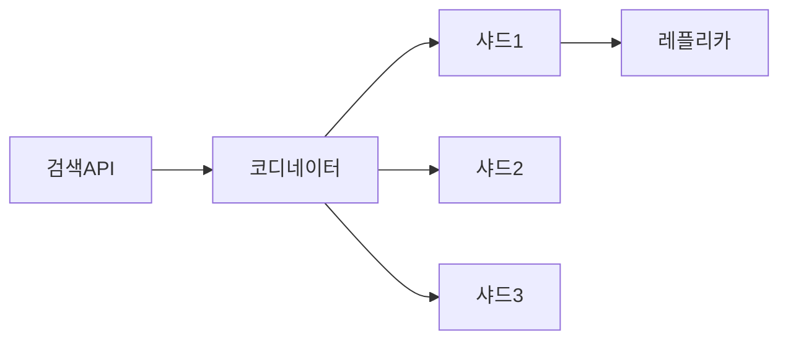
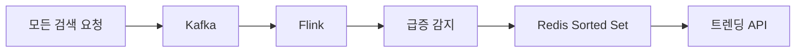
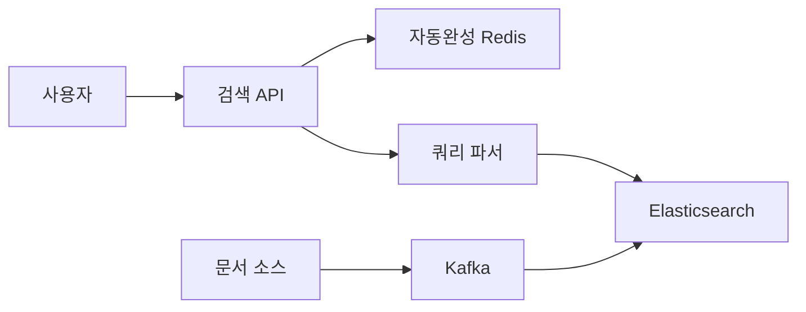

구글에 "파이썬 머신러닝"을 검색하면 수천억 개의 웹페이지 중에서 관련 결과가 100ms 안에 나온다. 단순히 "파이썬"과 "머신러닝"이 들어간 페이지를 하나씩 뒤지면? 전 세계 서버를 동원해도 수십 년이 걸린다. **검색이 빠른 이유는 데이터를 저장하는 방식이 근본적으로 다르기 때문이다.**

## 설계 의사결정 로드맵

### 결정 1: 검색 엔진 — MySQL LIKE vs Elasticsearch

**문제**: MySQL LIKE를 그대로 쓰면 데이터가 수천만 건을 넘는 순간 검색이 수 분씩 걸려 서비스 불가 상태가 된다.

| 후보 | 장점 | 단점 | 선택 이유 |
|------|------|------|-----------|
| MySQL LIKE | 별도 인프라 없음, 관리 단순 | 풀 스캔, 수백만 건 이상 불가, 관련성 점수 없음 | 100만 건 미만 소규모 전용 |
| MySQL FULLTEXT | LIKE보다 빠름, 추가 인프라 없음 | 수평 확장 불가, 한국어 형태소 미지원 | 단순 영문 검색 중소규모 |
| **Elasticsearch** | 역인덱스, BM25, 수평 확장, 한국어 Nori | 별도 클러스터 운영, 비용 | **수천만 건 이상 표준** |
| Apache Solr | ES와 유사한 기능 | 커뮤니티 작고 ES에 수렴 중 | 레거시 시스템 유지 한정 |

**우리의 선택: Elasticsearch** — 이유: 역인덱스로 100억 문서 100ms 응답, Nori 한국어 형태소 분석기 내장, 샤딩으로 수평 확장.

---

### 결정 2: 랭킹 알고리즘 — TF-IDF vs BM25 vs 벡터 검색

**문제**: 잘못된 랭킹은 관련 없는 문서가 1위에 오르거나, 짧은 문서가 구조적으로 불리해지는 불공정 결과를 만든다.

| 후보 | 장점 | 단점 | 선택 이유 |
|------|------|------|-----------|
| TF-IDF | 직관적, 1970년대부터 검증 | 문서 길이 보정 없음, 빈도 포화 없음 | 교육 목적 또는 소규모 |
| **BM25** | 문서 길이 보정, 빈도 포화, ES 기본값 | 동의어·의미 검색 불가 | **키워드 검색 표준** |
| 벡터(Dense Retrieval) | 의미 이해, 동의어·오타 강건 | 인덱스 용량 대폭 증가, 계산 비용 높음 | 의미 검색 필요 시 추가 |
| 하이브리드 RRF | BM25 + 벡터 두 장점 결합 | 복잡도 증가, 벡터 인프라 필요 | **고품질 검색 서비스 목표** |

**우리의 선택: BM25 기본 + 벡터 하이브리드 RRF** — 이유: 키워드 정확도는 BM25, 의미 검색은 벡터로 보완. 두 점수를 RRF로 편향 없이 결합.

---

### 결정 3: 자동완성 — Trie vs Redis Sorted Set

**문제**: Trie는 단일 서버에서 빠르지만 분산 환경에서 복제와 업데이트가 어렵다. 잘못 구현하면 메모리가 폭발한다.

| 후보 | 장점 | 단점 | 선택 이유 |
|------|------|------|-----------|
| Trie (인메모리) | O(L) 접두사 탐색, 직관적 | 복제 어려움, 수억 검색어 시 메모리 폭발 | 단일 서버 소규모 |
| DB 접두사 쿼리 | 별도 인프라 없음 | LIKE 'py%' 인덱스 부분 사용, 고QPS 불가 | 프로토타입 |
| **Redis Sorted Set + ZRANGEBYLEX** | 분산 환경 자연스러움, 메모리 효율 | 인기도 별도 관리 필요 | **실무 표준** |
| Elasticsearch prefix 쿼리 | 별도 구현 없음 | 검색 클러스터 부하 증가 | ES 단일 운영 소규모 |

**우리의 선택: Redis Sorted Set ZRANGEBYLEX** — 이유: 검색어 자체만 저장(접두사 폭발 없음), 분산 확장 용이, ZRANGEBYLEX 단일 명령으로 접두사 범위 조회.

---

### 결정 4: 인덱스 동기화 — 실시간 직접 쓰기 vs CDC

**문제**: 원본 DB 변경이 즉시 ES에 반영되지 않으면 검색 결과가 오래된 데이터를 보여준다. 반대로 과도한 동기화는 원본 DB에 부하를 준다.

| 후보 | 장점 | 단점 | 선택 이유 |
|------|------|------|-----------|
| 애플리케이션 이중 쓰기 | 가장 낮은 지연 | 두 저장소 중 하나 실패 시 불일치, 코드 결합 | 소규모 or 단순 시스템 |
| 배치 재색인 | 구현 단순 | 최대 수 시간 지연 | 실시간 요구 없는 경우 |
| **CDC (Debezium + Kafka)** | DB 원본에서 binlog 읽기, 느슨한 결합 | Kafka 운영 필요, 복잡도 증가 | **대규모 실시간 표준** |
| ES Logstash JDBC | 설정 기반, 코드 없음 | 풀링 방식, 최소 수 초~분 지연 | 지연 허용되는 배치성 |

**우리의 선택: CDC (Debezium + Kafka + ES Connector)** — 이유: 원본 DB 부하 없이 binlog만 읽음, Kafka로 버퍼링해 ES 장애 시에도 이벤트 유실 없음, 수 초 이내 동기화.

---

## 왜 Elasticsearch인가? — MySQL LIKE 검색이 안 되는 이유

"검색 기능 추가해줘"라는 요구에 가장 먼저 떠오르는 것은 `SELECT * FROM posts WHERE content LIKE '%파이썬%'`다. 왜 이게 안 되는가?

| 방식 | 100만 건 검색 | 1억 건 검색 | 다국어 지원 | 관련성 점수 |
|------|------------|-----------|-----------|-----------|
| MySQL LIKE | 2~5초 (풀 스캔) | 수분 이상 | 직접 구현 필요 | 없음 |
| MySQL FULLTEXT | 0.1~0.5초 | 5~30초 | 제한적 | 기본 TF-IDF |
| **Elasticsearch** | **10~50ms** | **50~200ms** | 언어별 분석기 내장 | BM25 + 커스텀 |

MySQL LIKE의 근본 문제는 인덱스를 쓸 수 없다는 것이다. `%파이썬%`처럼 앞에 와일드카드가 붙으면 B-Tree 인덱스가 무력화된다. 1억 개 행을 전부 읽어야 한다. 1행 읽기에 1µs라도 1억 건 = 100초다.

MySQL FULLTEXT가 있는데 왜 Elasticsearch인가?

- **샤딩**: MySQL FULLTEXT는 단일 테이블에서만 동작한다. 데이터가 수백 GB를 넘으면 수평 확장이 불가능하다. ES는 처음부터 분산 설계로 샤드 수를 늘리면 선형으로 확장된다.
- **분석기**: 한국어 형태소 분석(Nori), 동의어 처리, 어간 추출을 MySQL FULLTEXT는 지원하지 않는다. "학습하다"와 "학습"을 같은 단어로 처리하지 못한다.
- **집계**: 검색 결과에서 "카테고리별 건수", "가격 범위 분포" 같은 Facet 집계를 ES는 한 번의 쿼리로 처리한다. MySQL은 별도 GROUP BY 쿼리를 여러 번 실행해야 한다.

> 핵심: 데이터가 수백만 건 이하이고 단순 키워드 검색이면 MySQL FULLTEXT도 충분하다. 수천만 건 이상이거나 관련성 랭킹·한국어·실시간 집계가 필요하면 Elasticsearch가 필수다.

---

## 검색 엔진의 핵심: 역인덱스 (Inverted Index)

> **비유**: 도서관 색인 카드함과 같다. "파이썬"이라는 카드를 찾으면 "302호, 451호, 789호 책장"이라고 적혀있다. 책을 한 권씩 펼쳐보는 게 아니라 카드함에서 위치를 조회한다. 이것이 역인덱스다.

```
정방향 인덱스 (일반 DB):
  문서1: ["파이썬", "머신러닝", "딥러닝"]
  문서2: ["파이썬", "웹개발", "Django"]
  → "파이썬" 검색 시 모든 문서를 훑어야 함

역방향 인덱스 (검색 엔진):
  "파이썬"  → [문서1 (빈도:3, 위치:1,5,12), 문서2 (빈도:1, 위치:3)]
  "머신러닝" → [문서1 (빈도:2, 위치:2,15)]
  → "파이썬" 검색 시 즉시 [문서1, 문서2] 반환
```


만약 역인덱스 없이 100억 문서를 SELECT WHERE content LIKE '%파이썬%'로 검색하면? 초당 11,600 QPS에 100ms 이내 응답은 물리적으로 불가능하다.

---

## 요구사항 분석

```
일일 검색: 10억건
검색 QPS  = 10억 / 86400 ≈ 11,600 QPS
피크 QPS ≈ 35,000 QPS

문서 수: 100억개, 평균 10KB → 총 100TB
역인덱스 크기 (원본의 ~25%): 25TB

응답 시간: 100ms 이내
신선도: 새 문서 1시간 내 색인
```

---

## 문서 색인 파이프라인

새 문서가 들어오면 검색 가능하게 처리하는 과정:


```python
class KoreanTextProcessor:
    def __init__(self):
        self.okt = Okt()  # 한국어 형태소 분석기

    def tokenize(self, text: str) -> list:
        text = text.lower()
        tokens = self.okt.morphs(text, stem=True)  # 어간 추출: '학습하다' → '학습'
        # 불용어 제거: 검색 관련성 없는 조사, 접속사
        stopwords = {'은', '는', '이', '가', '을', '를', '의', '에서'}
        return [t for t in tokens if t not in stopwords and len(t) > 1]

    def process_document(self, doc_id: int, title: str, body: str) -> dict:
        title_tokens = self.tokenize(title)
        body_tokens  = self.tokenize(body)

        # 제목의 단어는 가중치 2배 — 제목에 있으면 더 관련성 높음
        tf = {}
        for t in title_tokens: tf[t] = tf.get(t, 0) + 2
        for t in body_tokens:  tf[t] = tf.get(t, 0) + 1

        return {'doc_id': doc_id, 'tf': tf}
```

왜 어간 추출(stemming)이 필요한가? "학습", "학습하다", "학습했다"를 모두 같은 단어로 처리해야 "학습하다"를 검색하면 "학습" 관련 문서가 모두 나온다.

---

## TF-IDF와 BM25 — 랭킹의 원리

### TF-IDF: 희귀한 단어일수록 가치 있다

- **TF (Term Frequency)**: 이 문서에서 단어가 얼마나 많이 나왔는가
- **IDF (Inverse Document Frequency)**: 전체 문서 중 이 단어가 드물수록 높은 점수

> **비유**: "은/는/이/가"는 모든 문서에 등장(IDF 낮음). "양자컴퓨팅"은 소수 문서에만 등장(IDF 높음). 희귀한 단어가 나오면 그 문서는 특정 주제에 대한 것일 가능성이 높다.

```python
import math

def tfidf(term: str, doc_id: int, all_docs: dict, inverted_index: dict) -> float:
    # TF: 이 문서에서 단어 빈도 (정규화)
    doc_terms = all_docs[doc_id]['terms']
    tf = doc_terms.count(term) / len(doc_terms)

    # IDF: 전체 문서 중 이 단어 포함 문서가 적을수록 높음
    total_docs   = len(all_docs)
    docs_with_term = len(inverted_index.get(term, []))
    idf = math.log(total_docs / (1 + docs_with_term))

    return tf * idf
```

### 왜 BM25인가? — TF-IDF의 두 가지 구조적 한계

TF-IDF는 1970년대에 만들어진 알고리즘이다. 직관적이지만 두 가지 치명적 문제가 있다.

**문제 1 — 빈도 포화 없음**: 단어가 10번 나오는 문서와 100번 나오는 문서의 TF-IDF 점수 차이는 10배다. 하지만 "파이썬"이 10번 언급된 문서와 100번 언급된 문서의 관련성 차이는 실제로 10배가 아니다. 100번 언급은 스팸성 키워드 반복일 가능성이 높다.

**문제 2 — 문서 길이 보정 없음**: 10,000단어 문서에서 "파이썬"이 5번 나오는 것과 100단어 문서에서 5번 나오는 것은 완전히 다른 의미다. 긴 문서는 단어가 많으므로 당연히 빈도가 높아 불공평하게 유리해진다.

### BM25: TF-IDF의 두 가지 문제 해결

TF-IDF의 문제: 단어가 100번 나오면 TF도 100배가 된다. 하지만 실제로는 10번 나온 것과 100번 나온 것의 관련성 차이는 크지 않다.

```
TF-IDF: 단어 10번 → 점수 10, 100번 → 점수 100 (비례)
BM25:   단어 10번 → 점수 9.5, 100번 → 점수 10.9 (포화)
→ BM25가 훨씬 현실적
```

```python
def bm25(term: str, doc_id: int, k1: float = 1.5, b: float = 0.75) -> float:
    tf      = get_term_frequency(term, doc_id)
    doc_len = get_document_length(doc_id)
    avg_len = get_average_document_length()
    idf     = get_idf(term)

    # k1: 빈도 포화 파라미터 — 높을수록 빈도의 영향 증가
    # b: 문서 길이 정규화 — 긴 문서는 단어가 많으므로 보정
    numerator   = tf * (k1 + 1)
    denominator = tf + k1 * (1 - b + b * doc_len / avg_len)
    return idf * (numerator / denominator)
```

**BM25가 Elasticsearch의 기본 알고리즘**인 이유가 이것이다. TF-IDF는 문서 길이 차이를 고려하지 않아 긴 문서가 불리하게 불공정하다.

---

## 시맨틱 검색 — 의미를 이해하는 검색

BM25는 키워드 매칭이므로 "강아지"를 검색하면 "퍼피"가 나오지 않습니다. 벡터 임베딩 검색은 의미적 유사도로 이 한계를 극복합니다.

> **비유**: BM25는 도서관에서 책 제목에 "요리"라는 글자가 있는 것만 찾는다. 벡터 검색은 "음식 만들기", "레시피", "쿠킹"이라고 써있어도 "요리"와 같은 뜻임을 이해하고 찾아준다.

```python
# 문서 임베딩 생성 (색인 시)
from sentence_transformers import SentenceTransformer

model = SentenceTransformer("jhgan/ko-sroberta-multitask")  # 한국어 특화 모델

def index_document(doc_id: int, text: str):
    vector = model.encode(text).tolist()  # 768차원 벡터
    es.index(index="docs", id=doc_id, body={
        "content": text,
        "content_vector": vector  # dense_vector 필드
    })
```

**Elasticsearch 8.x kNN Search 예시**:

```json
{
  "knn": {
    "field": "content_vector",
    "query_vector": [0.12, -0.34, 0.56],
    "k": 10,
    "num_candidates": 100
  }
}
```

`num_candidates`는 각 샤드에서 후보를 몇 개 뽑을지 결정한다. 클수록 정확하지만 느려진다.

### 하이브리드 검색 — BM25 + 벡터의 조합

키워드 정확도(BM25)와 의미 유사도(벡터)를 Reciprocal Rank Fusion(RRF)으로 합산한다:

```json
{
  "retriever": {
    "rrf": {
      "retrievers": [
        { "standard": { "query": { "match": { "content": "강아지" } } } },
        { "knn": { "field": "content_vector", "query_vector": [...], "k": 10 } }
      ],
      "rank_constant": 60
    }
  }
}
```

두 랭킹 결과를 단순 합산이 아닌 역순위 합(RRF)으로 결합하면 점수 스케일 차이로 인한 편향 없이 균형 있는 최종 순위가 나온다.

| 방식 | 강점 | 약점 |
|------|------|------|
| BM25만 | 정확한 키워드, 빠름 | 동의어·유사어 미인식 |
| 벡터만 | 의미 이해, 오타 강건 | 정확한 용어 검색에 불리 |
| 하이브리드(RRF) | 두 장점 결합 | 벡터 인덱스 용량 증가 |

---

## Elasticsearch 설계



각 샤드는 독립적인 Lucene 역인덱스다. 쿼리가 들어오면 코디네이터가 모든 샤드에 병렬로 요청하고, 결과를 모아 랭킹한 후 반환한다.

**인덱스 매핑 설계:**
```json
{
  "mappings": {
    "properties": {
      "title":      { "type": "text", "analyzer": "korean" },
      "content":    { "type": "text", "analyzer": "korean" },
      "category":   { "type": "keyword" },
      "created_at": { "type": "date" },
      "view_count": { "type": "long" }
    }
  },
  "settings": {
    "number_of_shards":   5,
    "number_of_replicas": 1,
    "analysis": {
      "analyzer": {
        "korean": {
          "type":      "custom",
          "tokenizer": "nori_tokenizer",
          "filter":    ["lowercase", "nori_part_of_speech"]
        }
      }
    }
  }
}
```

**검색 쿼리 — BM25 + 조회수 + 최신성 조합:**
```json
{
  "query": {
    "function_score": {
      "query": {
        "multi_match": {
          "query":    "파이썬 머신러닝",
          "fields":   ["title^2", "content", "tags"],
          "fuzziness": "AUTO"
        }
      },
      "functions": [
        {
          "field_value_factor": {
            "field":    "view_count",
            "modifier": "log1p",
            "factor":   0.1
          }
        },
        {
          "gauss": {
            "created_at": {
              "origin": "now",
              "scale":  "30d",
              "decay":  0.5
            }
          }
        }
      ]
    }
  }
}
```

`fuzziness: "AUTO"` — 오타 교정을 ES가 자동으로 처리한다. "파이쏜"을 검색해도 "파이썬" 문서가 나온다.

---

## 자동완성 — Redis ZRANGEBYLEX로 구현

Trie 자료구조가 교과서 답이지만, 실무에서는 **Redis Sorted Set + ZRANGEBYLEX**가 더 간단하고 분산 환경에 유리하다.

**기존 방식의 문제점**: "python"을 등록할 때 모든 접두사("p", "py", "pyt", "pyth", "pytho")를 키로 따로 등록하면 메모리가 폭발적으로 증가한다. 검색어 1억 개, 평균 길이 8자면 8억 개의 키가 필요하다.

**ZRANGEBYLEX 방식**: 검색어 자체만 score=0으로 저장하고, 접두사 범위 조회 한 번으로 후보를 가져온다.

```python
class RedisAutoComplete:
    def add_phrase(self, phrase: str, weight: int):
        # 검색어 자체만 저장 — 접두사 폭발 없음
        self.redis.zadd("autocomplete", {phrase: 0})
        # 인기도는 별도 Sorted Set으로 관리
        self.redis.zadd("autocomplete:weight", {phrase: weight})

    def suggest(self, prefix: str, limit: int = 5) -> list:
        # \xff = 해당 접두사로 시작하는 마지막 문자열 경계
        candidates = self.redis.zrangebylex(
            "autocomplete",
            f"[{prefix}",
            f"[{prefix}\xff",
            start=0, num=limit * 10
        )
        if not candidates:
            return []
        scored = [
            (c, self.redis.zscore("autocomplete:weight", c) or 0)
            for c in candidates
        ]
        scored.sort(key=lambda x: x[1], reverse=True)
        return [w for w, _ in scored[:limit]]
```

```
예시: "py" 입력 시
ZRANGEBYLEX autocomplete "[py" "[py\xff" LIMIT 0 5
→ 사전순 후보: ["pycon", "python", "pytorch"]
→ 인기도 재정렬 → ["python", "pytorch", "pycon"]
```

#### 면접 포인트
"자동완성을 어떻게 설계할 것인가?" — Trie는 단일 서버에서 빠르지만 분산 환경에서 복제가 어렵다. Redis ZRANGEBYLEX는 메모리 효율이 좋고 수평 확장이 가능하다. 검색어가 수억 개를 넘어가면 접두사 첫 글자 기준으로 샤딩을 추가 고려한다.

---

## 병목 지점 분석 — 어디서 시간이 걸리는가

검색 요청 하나가 100ms 안에 돌아와야 한다. 각 단계별 예상 지연시간을 분석해야 어디를 최적화할지 알 수 있다.

**인덱싱 파이프라인 병목**

```
문서 수신 → Kafka 큐 대기: 1~5ms (정상)
형태소 분석 (Nori): 1~10ms/문서 (문서 길이에 비례)
역인덱스 빌드: 5~20ms/문서
ES 샤드에 쓰기: 10~50ms (디스크 I/O)
레플리카 동기화: 추가 10~30ms

총 인덱싱 지연: 문서 수신 후 검색 가능까지 30~120ms
→ 실시간 인덱싱 요구사항이 "1초 이내"라면 충분히 달성 가능
→ "100ms 이내"라면 레플리카 비동기화 필요 (가용성 감소 트레이드오프)
```

**검색 쿼리 병목**

```
클라이언트 → 로드밸런서: 1~2ms (네트워크)
Redis 캐시 조회: 1~2ms (히트 시 여기서 반환, 전체 3~4ms)
캐시 미스 → ES 코디네이터: 2~5ms
ES → 전체 샤드 병렬 검색: 20~80ms (샤드 수, 문서 수에 비례)
  - 각 샤드: 역인덱스 조회 5~15ms + BM25 점수 계산 5~20ms
  - 코디네이터: 결과 수집 + 글로벌 랭킹 5~10ms
결과 직렬화 + 네트워크 반환: 3~8ms

총 캐시 미스 시: 30~100ms
핵심 병목: ES 샤드 내 BM25 연산 (문서 수 × 쿼리 복잡도에 비례)
```

**병목 해결 전략**

| 병목 | 원인 | 해결 방법 | 트레이드오프 |
|------|------|---------|------------|
| 샤드 검색 느림 | 샤드당 문서 너무 많음 | 샤드 수 증가 | 메모리·관리 비용 증가 |
| 모든 쿼리 ES 도달 | 캐시 없음 | Redis 캐시 (인기 검색어 1%) | 캐시 무효화 복잡성 |
| 인덱싱 지연 | 동기 레플리카 | 비동기 레플리카 | 노드 장애 시 데이터 손실 위험 |
| 벡터 검색 느림 | kNN 연산 고비용 | num_candidates 줄이기 | 검색 정확도 감소 |

---

## 검색 캐싱 전략

인기 검색어 상위 1%가 전체 쿼리의 80%를 차지한다(파레토). 이 1%만 캐시해도 ES 부하가 80% 줄어든다:

```python
def search_with_cache(query: str) -> list:
    cache_key = f"search:{hashlib.md5(query.encode()).hexdigest()}"

    # 캐시 히트: ES 건너뜀
    cached = redis.get(cache_key)
    if cached:
        return json.loads(cached)

    # ES 검색
    results = elasticsearch.search(query)

    # 인기 검색어만 캐시 (Sorted Set으로 빈도 추적)
    redis.zincrby("query_counts", 1, query)
    rank = redis.zrevrank("query_counts", query)
    total = redis.zcard("query_counts")

    if rank is not None and rank < total * 0.01:  # 상위 1%
        redis.setex(cache_key, 300, json.dumps(results))  # 5분 캐시

    return results
```

---


## 극한 시나리오

### 시나리오 1: 검색 스파이크 — "BTS 컴백" 발표 직후

평상시 QPS 11,600이 5분 만에 **100,000 QPS**로 9배 급증한다. 모든 사람이 "BTS 컴백"을 검색한다.

```
무너지는 메커니즘:
1. ES 코디네이터에 초당 10만 쿼리 도달
2. 각 쿼리가 5개 샤드에 병렬 요청 → 샤드당 초당 2만 쿼리
3. 샤드 스레드 풀 고갈 (기본 search threadpool = CPU 코어 수 × 3)
4. 쿼리 큐 적체 → 응답 시간 100ms → 수 초로 폭발
5. 타임아웃 → 클라이언트 재시도 → 부하 자가 증폭

방어 전략 (단계별):
1단계 (사전): "BTS 컴백" 같은 핫 쿼리를 Redis에 5분 TTL로 캐시
              → 10만 QPS 중 99%가 Redis에서 1ms로 반환, ES 부하 1%
2단계 (실시간): ES 서킷 브레이커 활성화 (큐 적체 감지 시 즉시 429 반환)
3단계 (자동화): Kubernetes HPA로 ES 데이터 노드 자동 증설
              → CPU 70% 초과 시 노드 추가 (단, 노드 초기화에 3~5분 소요)

수치: Redis 캐시 히트율 99%면 실제 ES QPS = 1,000. 문제없다.
```

### 시나리오 2: 인덱스 재구축 — 100억 문서를 다시 색인해야 할 때

분석기(Tokenizer)를 업그레이드하거나 새 필드를 추가하면 기존 인덱스를 전부 다시 색인해야 한다. 100억 문서 × 평균 10KB = **100TB** 재처리.

```
단순 접근의 문제:
- 기존 인덱스를 지우고 재색인 시작
- 완료까지 수 시간~수일: 그동안 검색 불가
- 색인 중 새 문서 추가도 복잡해짐

Zero-downtime 재색인 전략:
1. 새 인덱스(v2) 생성 (새 분석기 적용)
2. 기존 인덱스(v1)는 서비스 중. 신규 문서는 v1과 v2에 동시 색인
3. Kafka + 워커로 100억 문서를 v2에 배치 재색인
   - 워커 100대 병렬, 초당 10만 문서 처리
   - 100억 문서 / 10만 = 100,000초 = 약 28시간
4. 재색인 완료 후 트래픽을 v2로 전환 (인덱스 alias 변경, 무중단)
5. v1 삭제로 디스크 공간 회수

핵심: 재색인 중 디스크 요구량이 두 배(v1 + v2 = 50TB). 사전에 용량 확보 필요.
```

### 시나리오 3: 자동완성 폭주 — 키 입력마다 API 호출

자동완성은 사용자가 키를 누를 때마다 API를 호출한다. "파이썬"을 입력하면 "ㅍ", "파", "파이", "파이썬" 총 4번 호출. QPS가 검색보다 5~10배 높다.

```
QPS 계산:
- 검색 QPS: 11,600
- 자동완성 QPS: 11,600 × 7 (평균 입력 길이) = 81,200 QPS

Redis ZRANGEBYLEX의 한계:
- 단일 Redis 노드: 초당 10만 ops → 81,200 QPS는 가능
- 단, Redis 가 단일 장애점. 클러스터 필요

자동완성 전용 최적화:
1. 클라이언트 디바운싱: 타이핑 중 300ms 이내 추가 입력이 없을 때만 API 호출
   → QPS 81,200 → 15,000으로 감소 (80% 절감)
2. 클라이언트 측 캐시: 이전에 조회한 접두사 결과를 브라우저 메모리에 저장
   → "파이"를 이미 조회했으면 "파이썬" 입력 시 로컬에서 필터링
3. CDN 캐싱: 자동완성 결과는 개인화 없음 → CDN에서 10분 캐시
   → 전 세계 동일 접두사 쿼리를 CDN이 처리

결과: Redis 실제 QPS = 81,200 × 20%(디바운싱 통과) × 30%(캐시 미스) = 4,872 QPS
```

---

갑자기 "BTS 컴백"이 검색어 1위가 되는 순간을 실시간으로 감지한다:



```python
def get_trending(self, limit: int = 10) -> list:
    now = int(time.time())
    curr_window = now // 300 * 300   # 현재 5분 버킷
    prev_window = curr_window - 300  # 직전 5분 버킷

    current  = dict(self.redis.zrange(f"searches:{curr_window}", 0, -1, withscores=True))
    previous = dict(self.redis.zrange(f"searches:{prev_window}", 0, -1, withscores=True))

    trending = []
    for query, count in current.items():
        prev_count  = previous.get(query, 1)
        growth_rate = count / prev_count
        if growth_rate >= 3.0:  # 직전 대비 3배 이상 급증
            trending.append((query, growth_rate))

    return [q for q, _ in sorted(trending, key=lambda x: x[1], reverse=True)[:limit]]
```

---
## 전체 아키텍처



---

## 보안 고려사항

> **비유**: 도서관 사서가 어떤 책을 누가 빌렸는지 기록한다면, 그 기록 자체가 개인 정보다. 검색 시스템도 "무엇을 검색했는가"를 저장하는 순간 프라이버시 리스크가 생긴다.

**검색 인젝션 방지**

Elasticsearch 쿼리를 사용자 입력으로 직접 구성하면 쿼리 인젝션 공격에 노출된다. 반드시 파라미터화된 쿼리를 사용하고, 입력값에서 특수문자(`{`, `}`, `"`, `:` 등)를 이스케이프 처리한다.

**PII 필터링**

문서 색인 파이프라인에서 주민등록번호, 전화번호, 이메일 주소 같은 PII(개인 식별 정보) 패턴을 정규식으로 감지해 색인 전에 마스킹하거나 제외한다. 검색 결과에 PII가 그대로 노출되는 사고를 사전에 차단한다.

**검색 로그 익명화**

검색 로그는 트렌딩 분석과 추천 개선에 필수지만, 그대로 저장하면 사용자의 관심사·건강 상태·정치 성향까지 추적 가능해진다. 로그 저장 시 사용자 ID를 해시화(SHA-256 + Salt)하고, 30~90일 후 자동 삭제 정책을 적용한다.

---

### 꼭 직접 만들어야 하는가? — Build vs Buy

| 선택지 | 장점 | 단점 | 적합한 시점 |
|--------|------|------|-----------|
| Algolia | 호스팅 검색, 10ms P99, 타이포 허용, 프론트 위젯 제공 | 인덱스 100GB 초과 시 비용 급등, 커스텀 분석기 제한 | Phase 1~2 |
| Typesense | 오픈소스 대안, 셀프호스팅 가능, Algolia 호환 API | 관리형 지원 부족, 대규모 클러스터 운영 부담 | Phase 2~3 |
| Elasticsearch Service (AWS/Elastic Cloud) | 관리형 ES, 자동 스케일, 풍부한 쿼리 DSL | 비용 높음, 클러스터 튜닝 지식 필요 | Phase 2~3 |
| 직접 ES 클러스터 운영 | 완전한 제어, 비용 최적화, 커스텀 분석기·랭킹 | 운영 복잡도 매우 높음, 전담 인력 필요 | Phase 3~4 |

**실무 판단 기준**: 인덱스 100GB 초과, 커스텀 분석기/랭킹 필요, Algolia 비용이 월 $1,000 초과 시 전환한다.

> 핵심: Phase 1에서 직접 구축하면 오버 엔지니어링이고, Phase 3에서 SaaS에 의존하면 비용 폭발이다. 현재 MAU에 맞는 선택을 하고, 병목이 실제로 발생할 때 전환한다.

---

## Day 1 → Scale 진화

### Phase 1: MAU 1만 — MySQL FULLTEXT ($50/월)

단일 MySQL 서버에 FULLTEXT 인덱스. 영문 키워드 검색은 동작. 100만 건까지 수백 ms 응답 허용. 자동완성 없음, 관련성 점수 기본 TF-IDF.

```
구성: MySQL 1대 (r6g.large)
한계: 수천만 건 넘으면 검색 수 초 이상, 한국어 형태소 불가
```

### Phase 2: MAU 10만 — 단일 Elasticsearch 노드 ($300/월)

별도 ES 노드 도입. Nori 한국어 형태소 분석기, BM25 랭킹. 애플리케이션에서 MySQL 변경 시 ES에 이중 쓰기. Redis Sorted Set으로 자동완성 구현.

```
구성: ES 단일 노드 (m6g.xlarge 4코어 16GB) + Redis (r6g.medium)
한계: ES 단일 장애점, 이중 쓰기 불일치 가능성, 재색인 시 서비스 중단
```

### Phase 3: MAU 500만 — ES 클러스터 + CDC ($1,500/월)

ES 3노드 클러스터, 샤드 5개 복제 1. Debezium + Kafka CDC로 MySQL → ES 비동기 동기화. Redis 캐시로 인기 검색어 상위 1% 캐싱. 인덱스 alias로 무중단 재색인 가능.

```
구성: ES 클러스터 3노드 + Kafka 3브로커 + Redis Cluster
추가: 캐시 히트율 80%, 인덱스 Blue/Green 전환, 오타 교정 fuzziness
```

### Phase 4: MAU 1억 이상 — 하이브리드 BM25 + 벡터 검색 ($8,000+/월)

BM25 + Dense Vector 하이브리드 RRF. 한국어 특화 임베딩 모델(ko-sroberta)로 의미 검색. ES 샤드를 지역/카테고리별로 분리해 검색 범위 축소. ML 기반 개인화 랭킹 점수 추가.

```
구성: ES 클러스터 10+노드 + GPU 서버(임베딩 추론) + Flink(실시간 트렌딩)
추가: 벡터 인덱스 HNSW, 개인화 피처 스토어, A/B 테스트 랭킹 실험
```

---

## 핵심 운영 메트릭 5개

| 메트릭 | 정상 | 경고 | 장애 | 의미 |
|--------|------|------|------|------|
| 검색 P99 응답시간 | < 100ms | 100~500ms | > 500ms | ES 샤드 과부하 또는 캐시 미스 폭발 |
| 인덱스 동기화 지연 | < 5초 | 5~60초 | > 60초 | CDC 파이프라인 적체 — 검색 결과가 오래된 데이터 표시 |
| 캐시 히트율 | > 80% | 60~80% | < 60% | 인기 검색어 TTL 만료 또는 캐시 용량 부족 |
| zero-result율 | < 5% | 5~15% | > 15% | 인덱스 누락 또는 형태소 분석기 오설정 |
| 자동완성 P99 | < 30ms | 30~100ms | > 100ms | Redis 지연 또는 자동완성 전용 노드 과부하 |

---

## 실제 장애 사례

### 사례 1: 네이버 검색 장애 — 인덱스 업데이트 중 서비스 중단

**상황**: 네이버는 수백억 개의 웹 문서를 색인한다. 2019년 검색 랭킹 알고리즘 업데이트 배포 중 검색 결과가 수 분간 비어있거나 관련 없는 결과를 반환했다. 일부 사용자는 특정 검색어에서 404와 유사한 빈 결과 페이지를 경험했다.

**원인**: 인덱스 전환(구 인덱스 → 신 인덱스) 과정에서 alias 전환 타이밍이 맞지 않았다. 신 인덱스 빌드가 완료되기 전에 alias가 전환되어 아직 색인이 완성되지 않은 인덱스로 쿼리가 들어갔다. 특히 신규 문서가 신 인덱스에는 있었지만 구 인덱스에서 이미 제거된 상태였다.

**해결**: alias를 구 인덱스로 즉시 롤백. 신 인덱스 완전 색인 완료 확인 후 재전환. 이후 인덱스 전환 전 "색인 완료율 99.9% 이상" 체크 게이트를 자동화.

**교훈**: 인덱스 전환은 반드시 "신 인덱스가 쿼리를 처리할 준비가 됐는가"를 검증한 뒤 alias를 바꿔야 한다. 전환 후 5분간 zero-result율, P99 응답시간을 자동 모니터링해 이상 감지 시 즉시 자동 롤백하는 카나리 배포 절차가 필수다.

---

### 사례 2: Elasticsearch Split-Brain — 두 마스터가 동시에 선출될 때

**상황**: 글로벌 전자상거래 서비스 A사의 ES 클러스터(5노드)에서 네트워크 파티션이 발생했다. 노드 3개(DC1)와 노드 2개(DC2)로 분리된 상황에서 DC2의 노드들이 자신들이 과반수라고 착각해 새로운 마스터를 선출했다. 결과적으로 두 개의 마스터가 동시에 쓰기를 받아 인덱스 데이터가 분기됐다.

**원인**: `minimum_master_nodes` 설정이 기본값(1)으로 잘못 운영됐다. 5노드 클러스터에서 이 값은 `(5/2)+1 = 3`이어야 한다. 값이 1이었으므로 분리된 2노드 파티션도 마스터를 선출할 수 있었다.

**해결**: 네트워크 복구 후 두 인덱스 상태를 비교해 DC1(3노드, 과반수)의 데이터를 정본으로 채택. DC2에서 인덱싱된 약 4만 건의 상품 데이터는 재색인. ES 7.x 이상의 경우 `cluster.initial_master_nodes`와 자동 과반수 계산으로 이 문제가 개선됐으나 구버전 클러스터는 여전히 위험.

**교훈**: ES 클러스터 구성 시 `minimum_master_nodes = (총 마스터 후보 노드 / 2) + 1` 공식은 선택이 아닌 필수다. 마스터 후보 노드는 홀수(3 또는 5)로 설정해야 한다. 네트워크 파티션 시뮬레이션 테스트(Chaos Engineering)를 배포 전 반드시 실행해야 한다.

---

## 실무에서 놓치기 쉬운 케이스

### 1. 한국어 오타 내성 — "ㅇㅣ상형" 검색도 "이상형"을 찾아야 한다

ES의 `fuzziness: AUTO`는 편집 거리(Levenshtein) 기반이라 영어 오타에는 잘 작동하지만 한국어에는 맹점이 있다. 한국어는 자모 단위로 입력이 쪼개지기 때문에 "이상형"을 빠르게 치다가 "ㅇㅣ상형"이 되면 편집 거리는 3 이상으로 치솟아 퍼지 매칭이 실패한다.

두 가지 접근이 실무에서 사용된다.

**① 자모 분리 인덱스 병행**

```json
{
  "settings": {
    "analysis": {
      "analyzer": {
        "jamo_analyzer": {
          "type": "custom",
          "tokenizer": "nori_tokenizer",
          "filter": ["jamo_filter"]  // 자모 분리 필터 커스텀 구현
        }
      }
    }
  }
}
```

원문과 자모 분리본을 각각 인덱싱하고 검색 시 두 필드에 `multi_match`로 쿼리한다.

**② 사전 교정 레이어 (클라이언트 or API Gateway)**

```python
# 자모-완성형 변환 라이브러리 (예: python-jamo)
from jamo import h2j, j2hcj

def normalize_query(q):
    # "ㅇㅣ상형" → "이상형" 시도
    try:
        return compose_jamo(q)
    except:
        return q  # 변환 실패 시 원본 그대로 ES에 전달
```

모바일 앱에서 검색창 입력 중 실시간으로 자모를 완성형으로 변환하는 프론트엔드 처리가 가장 저렴한 방법이다.

---

### 2. DMCA·법적 콘텐츠 차단 — 저작권 침해 키워드를 검색 결과에서 숨겨야 한다

글로벌 서비스에서는 특정 키워드 검색 자체를 차단하거나, 결과 중 특정 URL·콘텐츠를 제거해야 하는 법적 의무가 생긴다. DMCA(미국 저작권법) 신고를 받으면 해당 콘텐츠를 색인에서 제거하고 그 사실을 법원에 통보해야 한다.

```python
BLOCKED_CONTENT_IDS = redis.smembers("dmca:blocked_ids")  # 실시간 업데이트

def filter_results(raw_hits):
    return [
        hit for hit in raw_hits
        if hit["_id"] not in BLOCKED_CONTENT_IDS
    ]
```

ES 레벨에서는 `must_not` 절로 차단 ID를 필터링하거나, 별도 `blocked` 필드를 두고 인덱스 업데이트로 처리한다. 중요한 것은 **차단 목록을 ES 재색인 없이 즉시 반영**할 수 있는 구조다. Redis에 차단 목록을 두고 API 레이어에서 후처리하는 방식이 가장 빠르게 적용된다.

특정 국가에서만 차단해야 하는 경우(예: 독일의 나치 관련 콘텐츠), 검색 요청의 IP 지역을 기준으로 차단 목록을 분기 적용한다.

---

### 3. 경쟁사의 검색 API 크롤링 — 자동화 봇이 색인을 통째로 복사한다

경쟁사가 자동화 스크립트로 검색 API를 초당 수백 회 호출해 전체 상품/콘텐츠 색인을 복사하는 것은 실제로 발생하는 공격이다. 이는 단순히 트래픽 문제가 아니라 지식재산 탈취다.

방어 계층을 여러 겹 쌓아야 한다.

```
1단계: Rate Limiting
  → 비로그인: IP당 분당 30회, 로그인: 사용자당 분당 100회
  → Nginx + Redis 토큰 버킷

2단계: 결과 다양성 제한
  → 동일 세션에서 페이지네이션 20페이지 이상 접근 차단
  → "검색 결과 N건" 총 개수를 1만으로 cap (실제 개수 노출 금지)

3단계: 봇 감지
  → 검색어 패턴 분석: 알파벳 순서대로 검색하거나 완전 일치 키워드만 반복하면 봇 의심
  → User-Agent + 행동 패턴으로 ML 기반 봇 스코어링

4단계: 허니팟
  → 실제 서비스에서는 노출되지 않는 가짜 상품 ID를 결과에 숨겨두기
  → 해당 ID를 조회하면 즉시 봇으로 판정 및 차단
```

---

## 핵심 설계 결정 요약

| 결정 | 선택 | 이유 |
|------|------|------|
| 검색 엔진 | Elasticsearch | 역인덱스 + BM25 + 수평 확장 내장 |
| 한국어 분석 | Nori Tokenizer | ES 공식 한국어 형태소 분석 |
| 랭킹 | BM25 + 조회수 + 최신성 | 관련성만으로 부족 — 인기도와 신선도 반영 |
| 자동완성 | Redis Sorted Set | 빠른 접두사 조회, 분산 환경 적합 |
| 오타 교정 | ES fuzziness AUTO | 편집 거리 기반, 추가 구현 없음 |
| 캐싱 | 상위 1% 검색어만 | ES 부하 80% 절감 |
| 트렌딩 | Kafka + Flink 5분 윈도우 | 실시간 급증 감지 |

---

## 실무에서 자주 하는 실수

1. **인덱스 크기와 검색 지연 간 트레이드오프 무시** — 모든 필드에 인덱스를 걸면 쓰기 성능이 급격히 저하된다. 검색 빈도와 필터링 패턴을 분석해 인덱스 대상 필드를 최소화해야 한다.

2. **검색 결과 캐싱 전략 없이 Elasticsearch 직접 호출** — 동일한 인기 검색어가 반복적으로 ES를 타격해 클러스터 부하가 높아진다. 상위 1~5% 검색어는 Redis로 캐싱하면 ES 부하를 80% 이상 줄일 수 있다.

3. **동의어/유의어 처리 누락으로 검색 실패** — "핸드폰"과 "스마트폰"을 별개로 처리하면 사용자가 원하는 결과를 찾지 못한다. 동의어 사전을 ES 분석기에 적용해야 한다.

4. **인덱싱 지연을 실시간으로 오해** — 데이터 변경 후 ES 인덱싱에 수 초~수십 초가 걸릴 수 있다. 실시간성이 필요한 자체 데이터는 DB를 직접 조회하고, 검색은 근실시간(Near Real-Time)임을 설계에 반영해야 한다.

5. **샤드 수를 나중에 변경할 수 없다는 점 간과** — ES 인덱스 생성 시 샤드 수가 고정된다. 데이터 증가를 예측해 초기 샤드 수를 결정하거나 ILM(Index Lifecycle Management)으로 인덱스를 주기적으로 교체해야 한다.
