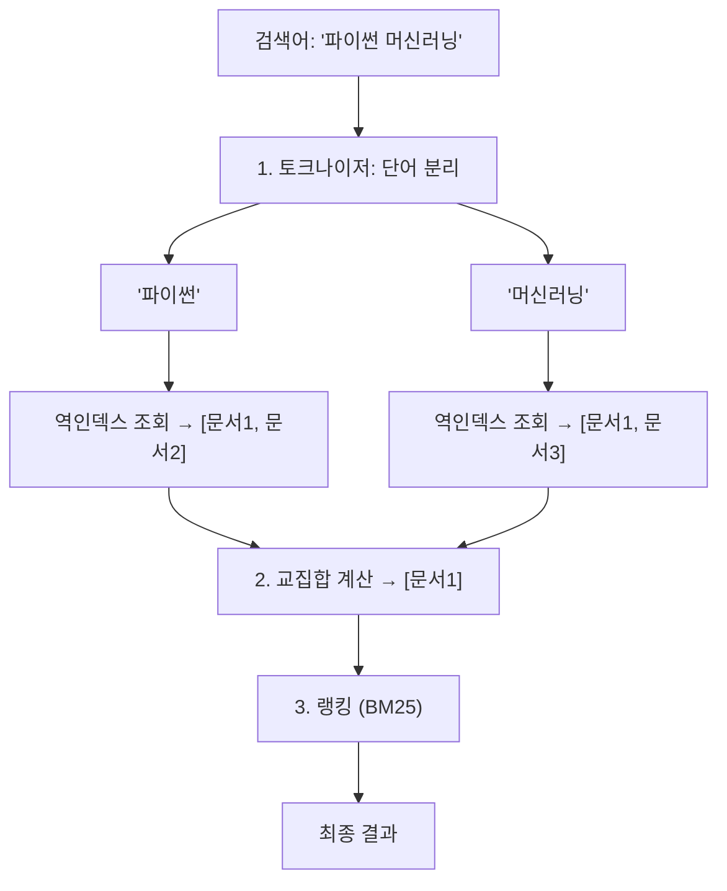
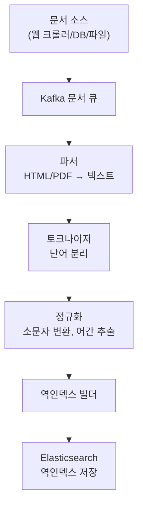
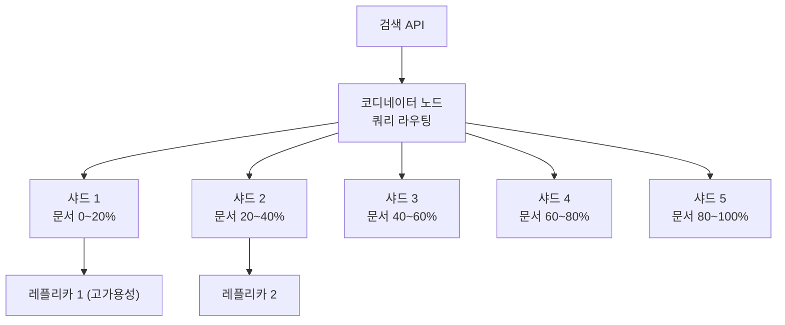
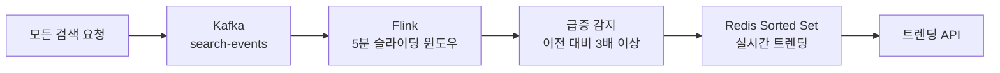
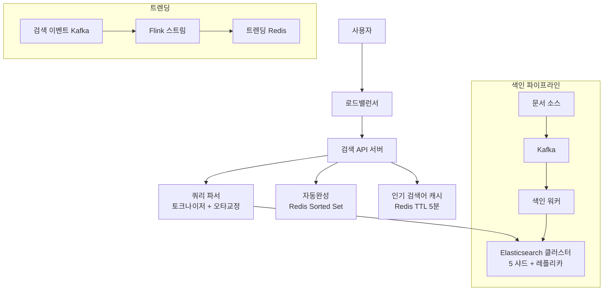

구글에 "파이썬 머신러닝"을 검색하면 수천억 개의 웹페이지 중에서 관련 결과가 100ms 안에 나온다. 단순히 "파이썬"과 "머신러닝"이 들어간 페이지를 하나씩 뒤지면? 전 세계 서버를 동원해도 수십 년이 걸린다. **검색이 빠른 이유는 데이터를 저장하는 방식이 근본적으로 다르기 때문이다.**

## 검색 엔진의 핵심: 역인덱스 (Inverted Index)

> **비유**: 도서관 색인 카드함과 같다. "파이썬"이라는 카드를 찾으면 "302호, 451호, 789호 책장"이라고 적혀있다. 책을 한 권씩 펼쳐보는 게 아니라 카드함에서 위치를 조회한다. 이것이 역인덱스다.

```
정방향 인덱스 (일반 DB):
  문서1: ["파이썬", "머신러닝", "딥러닝"]
  문서2: ["파이썬", "웹개발", "Django"]
  → "파이썬" 검색 시 모든 문서를 훑어야 함

역방향 인덱스 (검색 엔진):
  "파이썬"  → [문서1 (빈도:3, 위치:1,5,12), 문서2 (빈도:1, 위치:3)]
  "머신러닝" → [문서1 (빈도:2, 위치:2,15)]
  → "파이썬" 검색 시 즉시 [문서1, 문서2] 반환
```



만약 역인덱스 없이 100억 문서를 SELECT WHERE content LIKE '%파이썬%'로 검색하면? 초당 11,600 QPS에 100ms 이내 응답은 물리적으로 불가능하다.

---

## 요구사항 분석

```
일일 검색: 10억건
검색 QPS  = 10억 / 86400 ≈ 11,600 QPS
피크 QPS ≈ 35,000 QPS

문서 수: 100억개, 평균 10KB → 총 100TB
역인덱스 크기 (원본의 ~25%): 25TB

응답 시간: 100ms 이내
신선도: 새 문서 1시간 내 색인
```

---

## 문서 색인 파이프라인

새 문서가 들어오면 검색 가능하게 처리하는 과정:



```python
class KoreanTextProcessor:
    def __init__(self):
        self.okt = Okt()  # 한국어 형태소 분석기

    def tokenize(self, text: str) -> list:
        text = text.lower()
        tokens = self.okt.morphs(text, stem=True)  # 어간 추출: '학습하다' → '학습'
        # 불용어 제거: 검색 관련성 없는 조사, 접속사
        stopwords = {'은', '는', '이', '가', '을', '를', '의', '에서'}
        return [t for t in tokens if t not in stopwords and len(t) > 1]

    def process_document(self, doc_id: int, title: str, body: str) -> dict:
        title_tokens = self.tokenize(title)
        body_tokens  = self.tokenize(body)

        # 제목의 단어는 가중치 2배 — 제목에 있으면 더 관련성 높음
        tf = {}
        for t in title_tokens: tf[t] = tf.get(t, 0) + 2
        for t in body_tokens:  tf[t] = tf.get(t, 0) + 1

        return {'doc_id': doc_id, 'tf': tf}
```

왜 어간 추출(stemming)이 필요한가? "학습", "학습하다", "학습했다"를 모두 같은 단어로 처리해야 "학습하다"를 검색하면 "학습" 관련 문서가 모두 나온다.

---

## TF-IDF와 BM25 — 랭킹의 원리

### TF-IDF: 희귀한 단어일수록 가치 있다

- **TF (Term Frequency)**: 이 문서에서 단어가 얼마나 많이 나왔는가
- **IDF (Inverse Document Frequency)**: 전체 문서 중 이 단어가 드물수록 높은 점수

> **비유**: "은/는/이/가"는 모든 문서에 등장(IDF 낮음). "양자컴퓨팅"은 소수 문서에만 등장(IDF 높음). 희귀한 단어가 나오면 그 문서는 특정 주제에 대한 것일 가능성이 높다.

```python
import math

def tfidf(term: str, doc_id: int, all_docs: dict, inverted_index: dict) -> float:
    # TF: 이 문서에서 단어 빈도 (정규화)
    doc_terms = all_docs[doc_id]['terms']
    tf = doc_terms.count(term) / len(doc_terms)

    # IDF: 전체 문서 중 이 단어 포함 문서가 적을수록 높음
    total_docs   = len(all_docs)
    docs_with_term = len(inverted_index.get(term, []))
    idf = math.log(total_docs / (1 + docs_with_term))

    return tf * idf
```

### BM25: TF-IDF의 두 가지 문제 해결

TF-IDF의 문제: 단어가 100번 나오면 TF도 100배가 된다. 하지만 실제로는 10번 나온 것과 100번 나온 것의 관련성 차이는 크지 않다.

```
TF-IDF: 단어 10번 → 점수 10, 100번 → 점수 100 (비례)
BM25:   단어 10번 → 점수 9.5, 100번 → 점수 10.9 (포화)
→ BM25가 훨씬 현실적
```

```python
def bm25(term: str, doc_id: int, k1: float = 1.5, b: float = 0.75) -> float:
    tf      = get_term_frequency(term, doc_id)
    doc_len = get_document_length(doc_id)
    avg_len = get_average_document_length()
    idf     = get_idf(term)

    # k1: 빈도 포화 파라미터 — 높을수록 빈도의 영향 증가
    # b: 문서 길이 정규화 — 긴 문서는 단어가 많으므로 보정
    numerator   = tf * (k1 + 1)
    denominator = tf + k1 * (1 - b + b * doc_len / avg_len)
    return idf * (numerator / denominator)
```

**BM25가 Elasticsearch의 기본 알고리즘**인 이유가 이것이다. TF-IDF는 문서 길이 차이를 고려하지 않아 긴 문서가 불리하게 불공정하다.

---

## Elasticsearch 설계



각 샤드는 독립적인 Lucene 역인덱스다. 쿼리가 들어오면 코디네이터가 모든 샤드에 병렬로 요청하고, 결과를 모아 랭킹한 후 반환한다.

**인덱스 매핑 설계:**
```json
{
  "mappings": {
    "properties": {
      "title":      { "type": "text", "analyzer": "korean", "boost": 2.0 },
      "content":    { "type": "text", "analyzer": "korean" },
      "category":   { "type": "keyword" },
      "created_at": { "type": "date" },
      "view_count": { "type": "long" }
    }
  },
  "settings": {
    "number_of_shards":   5,
    "number_of_replicas": 1,
    "analysis": {
      "analyzer": {
        "korean": {
          "type":      "custom",
          "tokenizer": "nori_tokenizer",
          "filter":    ["lowercase", "nori_part_of_speech"]
        }
      }
    }
  }
}
```

**검색 쿼리 — BM25 + 조회수 + 최신성 조합:**
```json
{
  "query": {
    "function_score": {
      "query": {
        "multi_match": {
          "query":    "파이썬 머신러닝",
          "fields":   ["title^2", "content", "tags"],
          "fuzziness": "AUTO"
        }
      },
      "functions": [
        {
          "field_value_factor": {
            "field":    "view_count",
            "modifier": "log1p",
            "factor":   0.1
          }
        },
        {
          "gauss": {
            "created_at": {
              "origin": "now",
              "scale":  "30d",
              "decay":  0.5
            }
          }
        }
      ]
    }
  }
}
```

`fuzziness: "AUTO"` — 오타 교정을 ES가 자동으로 처리한다. "파이쏜"을 검색해도 "파이썬" 문서가 나온다.

---

## 자동완성 — Redis Sorted Set으로 구현

Trie 자료구조가 교과서 답이지만, 실무에서는 **Redis Sorted Set**이 더 간단하고 분산 환경에 유리하다:

```python
class RedisAutoComplete:
    def add_phrase(self, phrase: str, score: float):
        # 완성된 단어에는 높은 score, 중간 접두사에는 0
        self.redis.zadd("autocomplete", {phrase: score})
        # 모든 접두사도 등록 (위치 추적용)
        for i in range(1, len(phrase)):
            self.redis.zadd("autocomplete", {phrase[:i]: 0})

    def suggest(self, prefix: str, limit: int = 5) -> list:
        # Sorted Set에서 prefix의 위치를 찾아 이후 항목 스캔
        start = self.redis.zrank("autocomplete", prefix)
        if start is None:
            return []

        results = []
        for entry in self.redis.zrange("autocomplete", start, start + 200):
            if not entry.startswith(prefix):
                break
            score = self.redis.zscore("autocomplete", entry)
            if score and score > 0:  # score > 0 = 완성된 단어
                results.append((entry, score))

        results.sort(key=lambda x: x[1], reverse=True)
        return [w for w, _ in results[:limit]]
```

---

## 검색 캐싱 전략

인기 검색어 상위 1%가 전체 쿼리의 80%를 차지한다(파레토). 이 1%만 캐시해도 ES 부하가 80% 줄어든다:

```python
def search_with_cache(query: str) -> list:
    cache_key = f"search:{hashlib.md5(query.encode()).hexdigest()}"

    # 캐시 히트: ES 건너뜀
    cached = redis.get(cache_key)
    if cached:
        return json.loads(cached)

    # ES 검색
    results = elasticsearch.search(query)

    # 인기 검색어만 캐시 (Sorted Set으로 빈도 추적)
    redis.zincrby("query_counts", 1, query)
    rank = redis.zrevrank("query_counts", query)
    total = redis.zcard("query_counts")

    if rank is not None and rank < total * 0.01:  # 상위 1%
        redis.setex(cache_key, 300, json.dumps(results))  # 5분 캐시

    return results
```

---

## 극한 시나리오: 실시간 트렌딩 검색어

갑자기 "BTS 컴백"이 검색어 1위가 되는 순간을 실시간으로 감지한다:



```python
def get_trending(self, limit: int = 10) -> list:
    now = int(time.time())
    curr_window = now // 300 * 300   # 현재 5분 버킷
    prev_window = curr_window - 300  # 직전 5분 버킷

    current  = dict(self.redis.zrange(f"searches:{curr_window}", 0, -1, withscores=True))
    previous = dict(self.redis.zrange(f"searches:{prev_window}", 0, -1, withscores=True))

    trending = []
    for query, count in current.items():
        prev_count  = previous.get(query, 1)
        growth_rate = count / prev_count
        if growth_rate >= 3.0:  # 직전 대비 3배 이상 급증
            trending.append((query, growth_rate))

    return [q for q, _ in sorted(trending, key=lambda x: x[1], reverse=True)[:limit]]
```

---

## 전체 아키텍처



---

## 핵심 설계 결정 요약

| 결정 | 선택 | 이유 |
|------|------|------|
| 검색 엔진 | Elasticsearch | 역인덱스 + BM25 + 수평 확장 내장 |
| 한국어 분석 | Nori Tokenizer | ES 공식 한국어 형태소 분석 |
| 랭킹 | BM25 + 조회수 + 최신성 | 관련성만으로 부족 — 인기도와 신선도 반영 |
| 자동완성 | Redis Sorted Set | 빠른 접두사 조회, 분산 환경 적합 |
| 오타 교정 | ES fuzziness AUTO | 편집 거리 기반, 추가 구현 없음 |
| 캐싱 | 상위 1% 검색어만 | ES 부하 80% 절감 |
| 트렌딩 | Kafka + Flink 5분 윈도우 | 실시간 급증 감지 |
