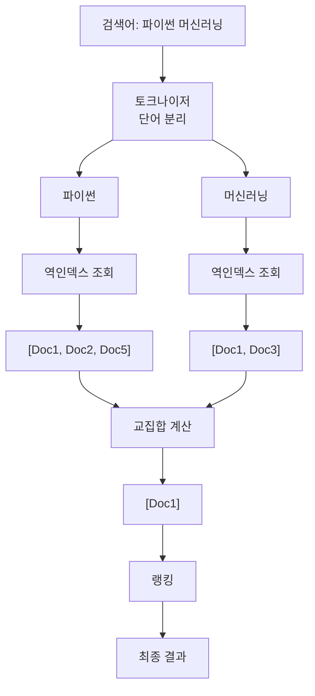
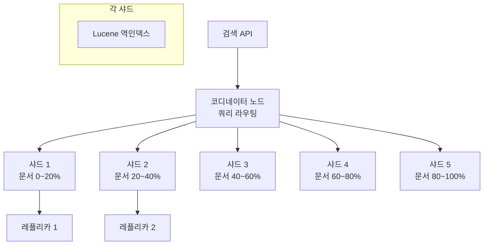
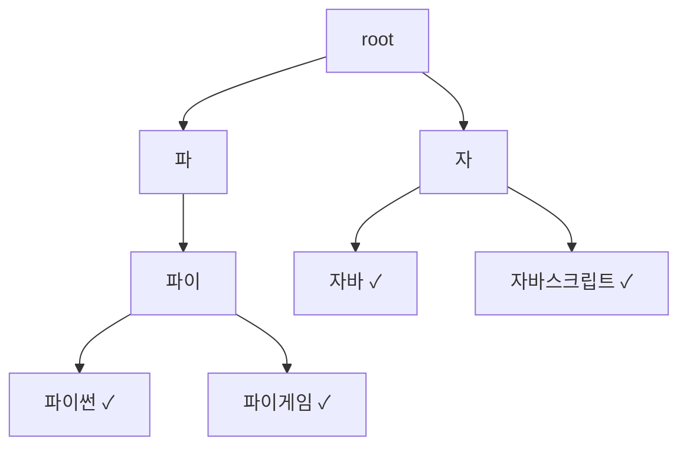
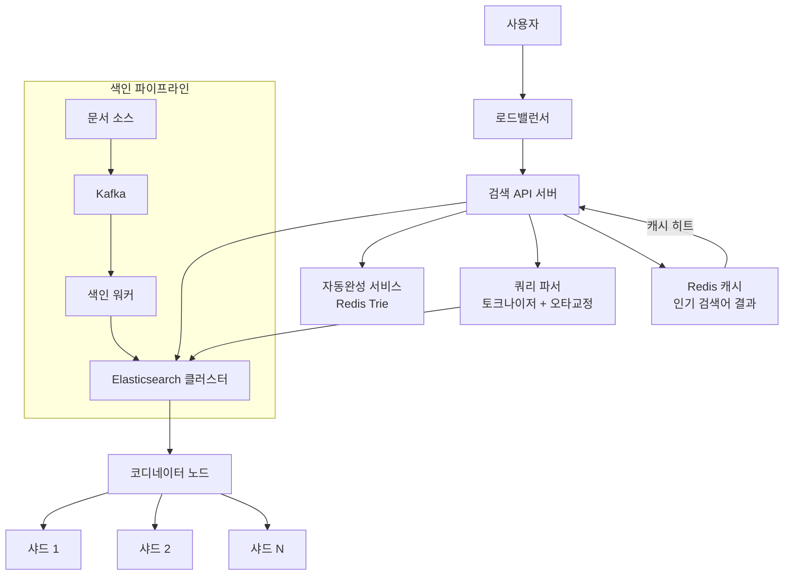
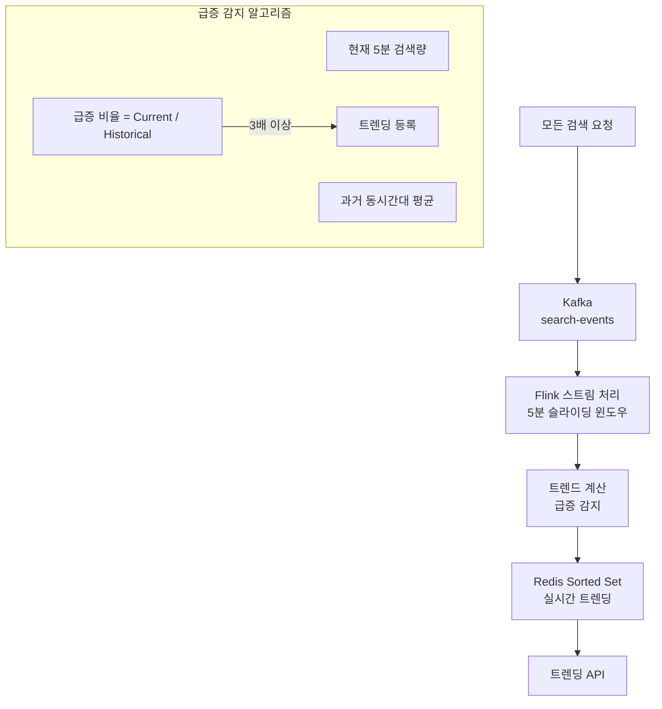

## 실생활 비유: 도서관 사서

도서관에서 "파이썬 머신러닝"을 찾는다고 합시다. 사서는 어떻게 빠르게 찾아줄까요? 모든 책을 뒤지는 게 아니라 **색인 카드함**을 봅니다. "파이썬" 카드에는 "302호, 451호, 789호 책장"이라고 적혀 있습니다. 검색 엔진의 **역인덱스(Inverted Index)**가 바로 이 색인 카드함입니다.

---

## 1. 요구사항 분석

### 기능 요구사항

1. 키워드 검색 → 관련 문서 반환
2. 자동완성 (타이핑 중 제안)
3. 오타 교정 (Did you mean?)
4. 필터링 (카테고리, 날짜, 위치)
5. 랭킹 (관련성 순서 정렬)

### 비기능 요구사항

- **규모**: 일일 검색 10억건, 문서 100억개
- **지연**: 100ms 미만 응답
- **신선도**: 새 문서 1시간 내 색인
- **가용성**: 99.99%

### 규모 추정

```
일일 검색: 10억건
검색 QPS = 10억 / 86400 ≈ 11,600 QPS
피크 QPS ≈ 35,000 QPS

문서 수: 100억개
문서 평균 크기: 10KB
총 저장: 100억 × 10KB = 100TB

역인덱스 크기 (원본의 20-30%):
100TB × 0.25 = 25TB
```

---

## 2. 핵심 개념: 역인덱스 (Inverted Index)

### 정방향 인덱스 vs 역방향 인덱스

```
정방향 인덱스 (문서 → 단어):
Document 1: ["파이썬", "머신러닝", "딥러닝"]
Document 2: ["파이썬", "웹개발", "Django"]
Document 3: ["자바", "스프링", "백엔드"]

역방향 인덱스 (단어 → 문서):  ← 검색 엔진이 사용하는 것
"파이썬":   [Doc1, Doc2]
"머신러닝": [Doc1]
"웹개발":   [Doc2]
"자바":     [Doc3]
```



### 역인덱스 상세 구조

```
단어         → 포스팅 리스트 (문서ID, 빈도, 위치)
"파이썬"     → [(Doc1, freq=3, pos=[1,5,12]),
                (Doc2, freq=1, pos=[3]),
                (Doc5, freq=2, pos=[2,8])]

"머신러닝"   → [(Doc1, freq=2, pos=[2,15]),
                (Doc3, freq=1, pos=[1])]
```

---

## 3. 문서 색인 파이프라인

```mermaid
graph TD
    Source["문서 소스들"] --> Crawler["크롤러/수집기"]

    subgraph Source
        Web["웹 페이지"]
        DB["데이터베이스"]
        FileSystem["파일 시스템"]
    end

    Crawler --> Queue["문서 큐 Kafka"]
    Queue --> Parser["파서<br>HTML/PDF/텍스트 파싱"]
    Parser --> Tokenizer["토크나이저<br>단어 분리"]
    Tokenizer --> Normalizer["정규화<br>소문자, 어간 추출"]
    Normalizer --> IndexBuilder["역인덱스 빌더"]
    IndexBuilder --> IndexStore["("인덱스 저장소<br>Elasticsearch")"]

    IndexStore --> SearchAPI["검색 API"]
```

### 텍스트 처리 단계

```python
import re
from konlpy.tag import Okt  # 한국어 형태소 분석

class KoreanTextProcessor:
    def __init__(self):
        self.okt = Okt()

    def tokenize(self, text: str) -> list[str]:
        """한국어 텍스트 토크나이징"""
        # 1. 소문자 변환 (영어의 경우)
        text = text.lower()

        # 2. 특수문자 제거
        text = re.sub(r'[^\w\s]', ' ', text)

        # 3. 형태소 분석 (한국어)
        tokens = self.okt.morphs(text, stem=True)  # 어간 추출

        # 4. 불용어(Stopword) 제거
        stopwords = {'은', '는', '이', '가', '을', '를', '의', '에서', '로'}
        tokens = [t for t in tokens if t not in stopwords and len(t) > 1]

        return tokens

    def process_document(self, doc_id: int, title: str, body: str) -> dict:
        """문서 전처리"""
        title_tokens = self.tokenize(title)
        body_tokens = self.tokenize(body)

        # 제목 단어는 가중치 2배
        all_tokens = [(t, 2) for t in title_tokens] + \
                     [(t, 1) for t in body_tokens]

        # 단어별 TF 계산
        tf = {}
        for token, weight in all_tokens:
            tf[token] = tf.get(token, 0) + weight

        return {
            'doc_id': doc_id,
            'title': title,
            'tf': tf,
            'tokens': list(set(title_tokens + body_tokens))
        }
```

---

## 4. TF-IDF 랭킹

### TF-IDF란?

- **TF (Term Frequency)**: 문서 내 단어 등장 빈도 (많을수록 관련성 높음)
- **IDF (Inverse Document Frequency)**: 전체 문서 중 해당 단어가 드물수록 높은 점수

> 비유: "은/는/이/가"는 모든 문서에 등장(낮은 IDF). "양자컴퓨팅"은 소수 문서에만 등장(높은 IDF). 희귀한 단어일수록 검색 관련성이 높습니다.

```python
import math

def calculate_tf_idf(
    term: str,
    doc_id: int,
    documents: dict,
    inverted_index: dict
) -> float:
    """TF-IDF 점수 계산"""

    # TF: 해당 문서에서 단어 빈도
    doc_terms = documents[doc_id]['terms']
    tf = doc_terms.count(term) / len(doc_terms)

    # IDF: log(전체 문서 수 / 해당 단어 포함 문서 수)
    total_docs = len(documents)
    docs_with_term = len(inverted_index.get(term, []))
    idf = math.log(total_docs / (1 + docs_with_term))

    return tf * idf

def search(query: str, inverted_index: dict, documents: dict,
           top_k: int = 10) -> list:
    """TF-IDF 기반 검색"""
    query_terms = tokenize(query)

    # 후보 문서 수집 (쿼리 단어 중 하나라도 포함된 문서)
    candidate_docs = set()
    for term in query_terms:
        candidate_docs.update(inverted_index.get(term, []))

    # 각 문서의 점수 계산
    scores = {}
    for doc_id in candidate_docs:
        score = sum(
            calculate_tf_idf(term, doc_id, documents, inverted_index)
            for term in query_terms
            if doc_id in inverted_index.get(term, [])
        )
        scores[doc_id] = score

    # 상위 K개 반환
    return sorted(scores.items(), key=lambda x: x[1], reverse=True)[:top_k]
```

---

## 5. BM25 알고리즘 (TF-IDF 개선)

Elasticsearch의 기본 랭킹 알고리즘입니다.

```python
def bm25_score(term: str, doc_id: int, k1: float = 1.5, b: float = 0.75) -> float:
    """
    BM25 점수 계산
    k1: 단어 빈도 포화(saturation) 파라미터 (보통 1.2~2.0)
    b: 문서 길이 정규화 파라미터 (0~1)
    """
    tf = get_term_frequency(term, doc_id)
    doc_len = get_document_length(doc_id)
    avg_doc_len = get_average_document_length()
    idf = get_idf(term)

    # BM25 공식
    numerator = tf * (k1 + 1)
    denominator = tf + k1 * (1 - b + b * doc_len / avg_doc_len)

    return idf * (numerator / denominator)
```

**TF-IDF vs BM25 차이:**
| 특성 | TF-IDF | BM25 |
|------|--------|------|
| 단어 반복 | 무한 증가 | 포화(saturation) |
| 문서 길이 | 보정 없음 | 길이 정규화 |
| 실전 성능 | 낮음 | 높음 |
| 현재 사용 | 거의 없음 | Elasticsearch 기본 |

---

## 6. Elasticsearch 설계



**인덱스 매핑 설계:**
```json
{
  "mappings": {
    "properties": {
      "title": {
        "type": "text",
        "analyzer": "korean",
        "boost": 2.0
      },
      "content": {
        "type": "text",
        "analyzer": "korean"
      },
      "category": {
        "type": "keyword"
      },
      "created_at": {
        "type": "date"
      },
      "author_id": {
        "type": "long"
      },
      "tags": {
        "type": "keyword"
      },
      "view_count": {
        "type": "long"
      }
    }
  },
  "settings": {
    "number_of_shards": 5,
    "number_of_replicas": 1,
    "analysis": {
      "analyzer": {
        "korean": {
          "type": "custom",
          "tokenizer": "nori_tokenizer",
          "filter": ["lowercase", "nori_part_of_speech"]
        }
      }
    }
  }
}
```

**검색 쿼리:**
```json
{
  "query": {
    "function_score": {
      "query": {
        "multi_match": {
          "query": "파이썬 머신러닝",
          "fields": ["title^2", "content", "tags"],
          "type": "best_fields",
          "fuzziness": "AUTO"
        }
      },
      "functions": [
        {
          "field_value_factor": {
            "field": "view_count",
            "modifier": "log1p",
            "factor": 0.1
          }
        },
        {
          "gauss": {
            "created_at": {
              "origin": "now",
              "scale": "30d",
              "decay": 0.5
            }
          }
        }
      ],
      "boost_mode": "multiply"
    }
  },
  "highlight": {
    "fields": {
      "title": {},
      "content": { "number_of_fragments": 3 }
    }
  }
}
```

---

## 7. 자동완성 시스템

### Trie(트라이) 자료구조



```python
class TrieNode:
    def __init__(self):
        self.children = {}
        self.is_end = False
        self.frequency = 0  # 검색 빈도
        self.top_suggestions = []  # 미리 계산된 추천

class AutoCompleter:
    def __init__(self):
        self.root = TrieNode()

    def insert(self, word: str, frequency: int):
        node = self.root
        for char in word:
            if char not in node.children:
                node.children[char] = TrieNode()
            node = node.children[char]
        node.is_end = True
        node.frequency = frequency

    def search(self, prefix: str, limit: int = 10) -> list[str]:
        """접두사로 시작하는 단어 검색"""
        node = self.root
        for char in prefix:
            if char not in node.children:
                return []
            node = node.children[char]

        # 해당 노드부터 DFS로 모든 단어 수집
        results = []
        self._dfs(node, prefix, results)

        # 빈도 순 정렬
        results.sort(key=lambda x: x[1], reverse=True)
        return [word for word, _ in results[:limit]]

    def _dfs(self, node: TrieNode, current: str, results: list):
        if node.is_end:
            results.append((current, node.frequency))
        for char, child in node.children.items():
            self._dfs(child, current + char, results)
```

### Redis 기반 자동완성 (실용적 접근)

```python
class RedisAutoComplete:
    """Redis Sorted Set을 활용한 자동완성"""

    def __init__(self, redis):
        self.redis = redis

    def add_phrase(self, phrase: str, score: float):
        """검색어와 점수 추가"""
        self.redis.zadd("autocomplete", {phrase: score})

        # 모든 접두사에 대해 추가
        for i in range(1, len(phrase) + 1):
            prefix = phrase[:i]
            self.redis.zadd("autocomplete", {prefix: 0})

    def suggest(self, prefix: str, limit: int = 10) -> list[str]:
        """접두사로 시작하는 제안 반환"""
        # 접두사 위치 찾기
        start = self.redis.zrank("autocomplete", prefix)
        if start is None:
            return []

        # 접두사 이후의 모든 항목 스캔
        results = []
        entries = self.redis.zrange("autocomplete", start, start + 200)

        for entry in entries:
            if not entry.startswith(prefix):
                break
            if not entry.endswith('*'):  # 완성된 단어만
                score = self.redis.zscore("autocomplete", entry)
                if score and score > 0:
                    results.append((entry, score))

        results.sort(key=lambda x: x[1], reverse=True)
        return [word for word, _ in results[:limit]]
```

---

## 8. 오타 교정 (Spell Correction)

### 편집 거리 (Edit Distance)

```python
def levenshtein_distance(s1: str, s2: str) -> int:
    """두 문자열 간의 편집 거리 계산"""
    m, n = len(s1), len(s2)
    dp = [[0] * (n + 1) for _ in range(m + 1)]

    for i in range(m + 1):
        dp[i][0] = i
    for j in range(n + 1):
        dp[0][j] = j

    for i in range(1, m + 1):
        for j in range(1, n + 1):
            if s1[i-1] == s2[j-1]:
                dp[i][j] = dp[i-1][j-1]
            else:
                dp[i][j] = 1 + min(
                    dp[i-1][j],    # 삭제
                    dp[i][j-1],    # 삽입
                    dp[i-1][j-1]   # 교체
                )

    return dp[m][n]

def suggest_correction(query: str, dictionary: list[str], max_dist: int = 2) -> str | None:
    """오타 교정 제안"""
    best_word = None
    best_dist = max_dist + 1
    best_freq = 0

    for word in dictionary:
        dist = levenshtein_distance(query, word)
        freq = get_search_frequency(word)

        if dist < best_dist or (dist == best_dist and freq > best_freq):
            best_word = word
            best_dist = dist
            best_freq = freq

    return best_word if best_dist <= max_dist else None
```

---

## 9. 검색 시스템 전체 아키텍처



---

## 10. 검색 캐싱 전략

```python
class SearchCache:
    """상위 1% 검색어는 캐싱"""

    def __init__(self, redis, ttl=300):  # 5분 TTL
        self.redis = redis
        self.ttl = ttl

    def get_cached_result(self, query: str) -> list | None:
        key = f"search:{hashlib.md5(query.encode()).hexdigest()}"
        result = self.redis.get(key)
        return json.loads(result) if result else None

    def cache_result(self, query: str, results: list):
        key = f"search:{hashlib.md5(query.encode()).hexdigest()}"
        self.redis.setex(key, self.ttl, json.dumps(results))

    def is_popular_query(self, query: str) -> bool:
        """인기 검색어 여부 확인"""
        count = self.redis.zincrby("query_counts", 1, query)
        total = self.redis.zcard("query_counts")
        rank = self.redis.zrevrank("query_counts", query)
        return rank is not None and rank < total * 0.01  # 상위 1%
```

---

## 11. 극한 시나리오: 실시간 트렌딩 검색어



```python
class TrendingSearches:
    def track_search(self, query: str):
        now = int(time.time())
        window = now // 300 * 300  # 5분 단위

        # 현재 윈도우 카운터 증가
        self.redis.zincrby(f"searches:{window}", 1, query)
        self.redis.expire(f"searches:{window}", 3600)

    def get_trending(self, limit: int = 10) -> list:
        now = int(time.time())
        current_window = now // 300 * 300
        prev_window = current_window - 300

        trending = []
        current = dict(self.redis.zrange(f"searches:{current_window}", 0, -1, withscores=True))
        previous = dict(self.redis.zrange(f"searches:{prev_window}", 0, -1, withscores=True))

        for query, count in current.items():
            prev_count = previous.get(query, 1)
            growth_rate = count / prev_count
            if growth_rate >= 3.0:  # 3배 이상 급증
                trending.append((query, growth_rate))

        trending.sort(key=lambda x: x[1], reverse=True)
        return [q for q, _ in trending[:limit]]
```

---

## 핵심 설계 결정 요약

| 결정 사항 | 선택 | 이유 |
|----------|------|------|
| 검색 엔진 | Elasticsearch | 역인덱스 + BM25 + 확장성 |
| 한국어 분석 | Nori Tokenizer | Elasticsearch 공식 한국어 플러그인 |
| 랭킹 알고리즘 | BM25 + 커스텀 점수 | 관련성 + 인기도 + 신선도 |
| 자동완성 | Redis Sorted Set | 빠른 접두사 조회 |
| 오타 교정 | 편집 거리 | 유사 단어 탐색 |
| 캐싱 | Redis + TTL 5분 | 인기 검색어 반복 조회 최적화 |
| 트렌딩 | Kafka + Flink | 실시간 급증 감지 |
