## 실생활 비유: 책의 색인

두꺼운 백과사전에서 원하는 내용을 찾으려면 어떻게 하나요? 매번 전체를 뒤지는 대신, 뒤쪽의 **색인(Index)**에서 짧은 페이지 번호를 찾아 바로 이동합니다. URL 단축기도 마찬가지입니다. 긴 URL을 짧은 코드로 바꾸고, 그 코드를 보면 원래 URL로 안내해줍니다.

`https://www.example.com/very/long/path?param1=value1&param2=value2` → `https://bit.ly/3xK9mP`

---

## 1. 요구사항 분석

### 기능 요구사항

1. URL을 입력하면 짧은 URL 생성
2. 짧은 URL로 접속하면 원래 URL로 리다이렉트
3. 사용자 지정 단축 URL 지원 (선택)
4. 링크 만료 기간 설정 (선택)

### 비기능 요구사항

- **고가용성**: 99.99% (연간 52분 다운타임)
- **저지연**: 리다이렉트 100ms 미만
- **확장성**: 초당 쓰기 1,000건, 읽기 10만건
- **내구성**: 데이터 영구 보존

### 규모 추정

```
일일 새 URL 생성: 1억건
읽기:쓰기 비율 = 100:1
일일 리다이렉트: 100억건

쓰기 QPS = 100,000,000 / 86,400 ≈ 1,160 QPS
읽기 QPS = 1,160 × 100 = 116,000 QPS
피크 QPS = 116,000 × 3 ≈ 350,000 QPS

URL 하나 저장 크기:
- shortURL: 7자 = 7B
- longURL: 평균 100자 = 100B
- createdAt: 8B
- expiresAt: 8B
- userID: 8B
총 ≈ 130B/건

10년 저장량:
1억 × 365 × 10 × 130B ≈ 47.5TB
```

---

## 2. 핵심 설계: 짧은 코드 생성

### 가장 중요한 질문: 7자리 코드를 어떻게 만들까?

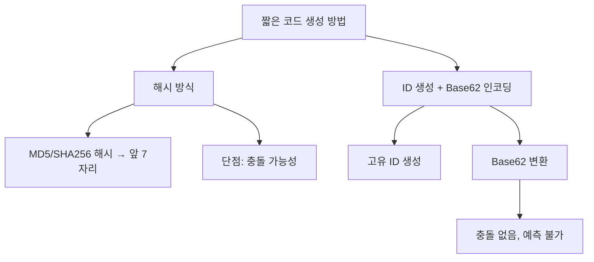

### Base62 인코딩 이해하기

Base62는 숫자(0-9), 소문자(a-z), 대문자(A-Z) 총 62가지 문자를 사용합니다.

```
7자리 Base62로 표현 가능한 URL 수:
62^7 = 3,521,614,606,208 ≈ 3.5조 개
```

**Base62 변환 예시:**

```python
CHARS = "0123456789abcdefghijklmnopqrstuvwxyzABCDEFGHIJKLMNOPQRSTUVWXYZ"

def encode(num: int) -> str:
    """숫자를 Base62 문자열로 변환"""
    if num == 0:
        return CHARS[0]

    result = []
    while num > 0:
        result.append(CHARS[num % 62])
        num //= 62

    return ''.join(reversed(result))

def decode(s: str) -> int:
    """Base62 문자열을 숫자로 변환"""
    result = 0
    for char in s:
        result = result * 62 + CHARS.index(char)
    return result

# 예시
print(encode(1000000))  # "4c92"
print(encode(12345678)) # "W7e"
```

### 충돌 방지: 분산 ID 생성

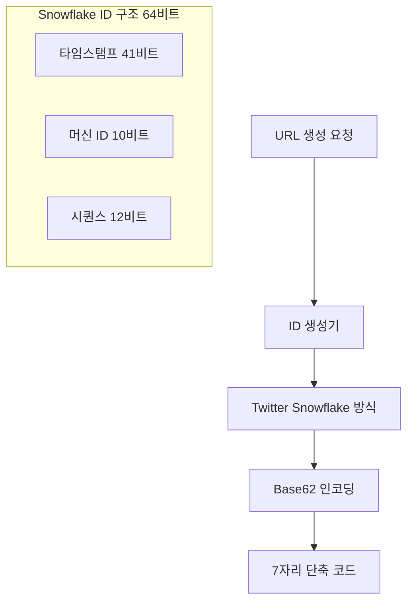

**Snowflake ID 구조:**
```
| 1비트(부호) | 41비트(밀리초 타임스탬프) | 10비트(머신ID) | 12비트(시퀀스) |
→ 초당 409만6000개의 고유 ID 생성 가능
→ 여러 서버에서 동시 생성해도 충돌 없음
```

---

## 3. 전체 아키텍처

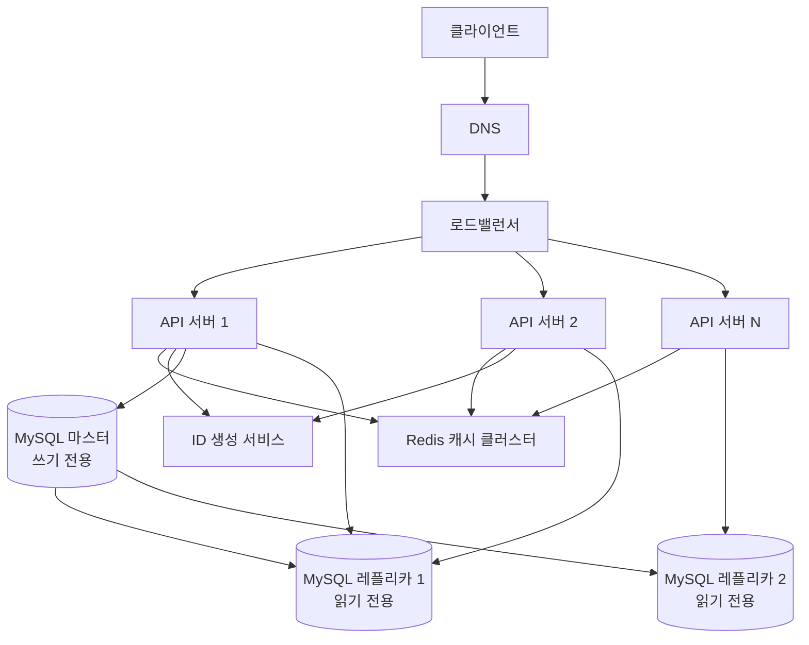

---

## 4. URL 단축 흐름 (쓰기)

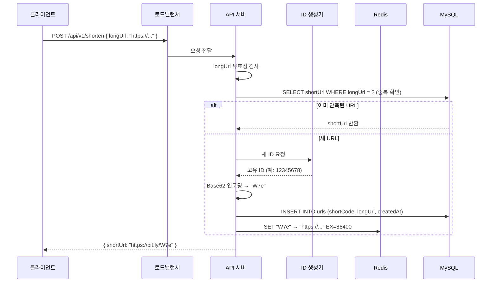

---

## 5. URL 리다이렉트 흐름 (읽기)

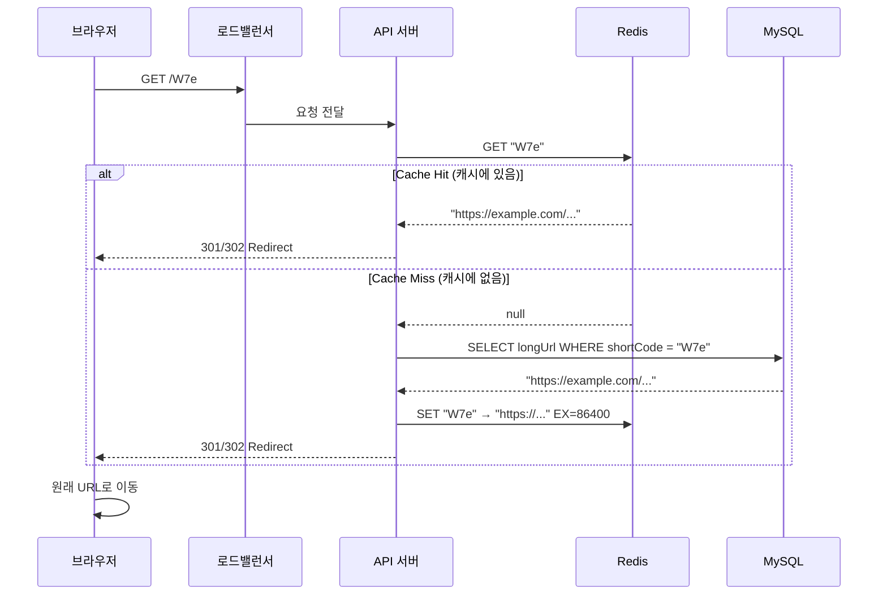

### 301 vs 302 리다이렉트

| 구분 | 301 Moved Permanently | 302 Found (Temporary) |
|------|----------------------|----------------------|
| 의미 | 영구 이동 | 임시 이동 |
| 브라우저 캐싱 | O (다음엔 서버 안 거침) | X (매번 서버 거침) |
| 서버 부하 | 낮음 | 높음 |
| 클릭 추적 | 불가 | 가능 |
| 추천 상황 | 부하 최소화 | 분석/추적 필요 시 |

> bit.ly는 **302**를 사용합니다. 클릭 수, 지역, 기기 정보를 추적하기 위해서입니다.

---

## 6. 데이터베이스 설계

### 테이블 스키마

```sql
CREATE TABLE urls (
    id          BIGINT      NOT NULL AUTO_INCREMENT,
    short_code  VARCHAR(7)  NOT NULL,
    long_url    VARCHAR(2048) NOT NULL,
    user_id     BIGINT,
    created_at  DATETIME    NOT NULL DEFAULT CURRENT_TIMESTAMP,
    expires_at  DATETIME,
    click_count BIGINT      DEFAULT 0,
    PRIMARY KEY (id),
    UNIQUE KEY uk_short_code (short_code),
    INDEX idx_long_url (long_url(255)),  -- 중복 URL 빠른 조회
    INDEX idx_user_id (user_id),
    INDEX idx_expires_at (expires_at)   -- 만료 정리 작업용
);

CREATE TABLE users (
    id          BIGINT      NOT NULL AUTO_INCREMENT,
    email       VARCHAR(255) NOT NULL,
    api_key     VARCHAR(64),
    tier        ENUM('free', 'pro', 'enterprise') DEFAULT 'free',
    PRIMARY KEY (id),
    UNIQUE KEY uk_email (email),
    INDEX idx_api_key (api_key)
);

-- 클릭 분석 (별도 저장 또는 Kafka → 데이터웨어하우스)
CREATE TABLE click_logs (
    id          BIGINT      NOT NULL AUTO_INCREMENT,
    short_code  VARCHAR(7)  NOT NULL,
    clicked_at  DATETIME    NOT NULL,
    ip_country  VARCHAR(2),
    device_type VARCHAR(20),
    referer     VARCHAR(255),
    PRIMARY KEY (id),
    INDEX idx_short_code_time (short_code, clicked_at)
);
```

### NoSQL vs RDBMS 선택

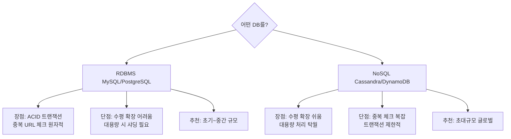

---

## 7. 캐싱 전략

### Redis 캐시 설계

```python
class URLCache:
    def __init__(self, redis_client, ttl=86400):  # 24시간 기본
        self.redis = redis_client
        self.ttl = ttl

    def get_long_url(self, short_code: str) -> str | None:
        """캐시에서 원래 URL 조회"""
        return self.redis.get(f"url:{short_code}")

    def set_url(self, short_code: str, long_url: str, ttl: int = None):
        """URL 매핑 캐시 저장"""
        self.redis.setex(
            f"url:{short_code}",
            ttl or self.ttl,
            long_url
        )

    def invalidate(self, short_code: str):
        """캐시 무효화"""
        self.redis.delete(f"url:{short_code}")
```

### 캐시 크기 계산

```
캐시 히트율 목표: 80%
인기 URL 비율: 상위 20%가 트래픽 80% 처리 (파레토 법칙)

일일 읽기 QPS = 116,000
캐시해야 할 URL 수 = 1억 × 0.2 = 2,000만건
URL 하나 크기 = 7 + 100 = 107B

필요 메모리 = 2,000만 × 107B ≈ 2.1GB
Redis 서버 1대(16GB)면 충분!
```

---

## 8. 사용자 지정 URL

```python
def create_custom_url(long_url: str, custom_code: str, user_id: int) -> str:
    # 1. 코드 유효성 검사 (영숫자, 3-16자)
    if not re.match(r'^[a-zA-Z0-9_-]{3,16}$', custom_code):
        raise ValueError("Invalid custom code format")

    # 2. 예약어 확인 (admin, api, login 등)
    RESERVED = {'admin', 'api', 'login', 'logout', 'help', 'about'}
    if custom_code.lower() in RESERVED:
        raise ValueError("Reserved word")

    # 3. 중복 확인
    existing = db.query("SELECT id FROM urls WHERE short_code = ?", custom_code)
    if existing:
        raise ConflictError("Custom code already taken")

    # 4. 저장
    db.execute(
        "INSERT INTO urls (short_code, long_url, user_id) VALUES (?, ?, ?)",
        (custom_code, long_url, user_id)
    )

    return f"https://bit.ly/{custom_code}"
```

---

## 9. 확장성 — 샤딩 전략

데이터가 수십 TB를 넘어서면 단일 DB로는 감당이 안 됩니다.

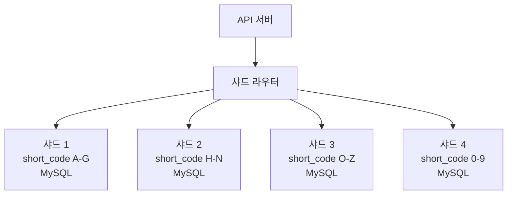

**일관된 해싱 (Consistent Hashing)**을 사용하면 샤드 추가/제거 시 데이터 이동을 최소화할 수 있습니다.

```python
def get_shard(short_code: str, num_shards: int) -> int:
    """short_code의 첫 글자 기준 샤드 결정"""
    hash_value = sum(ord(c) for c in short_code)
    return hash_value % num_shards
```

---

## 10. URL 만료 처리

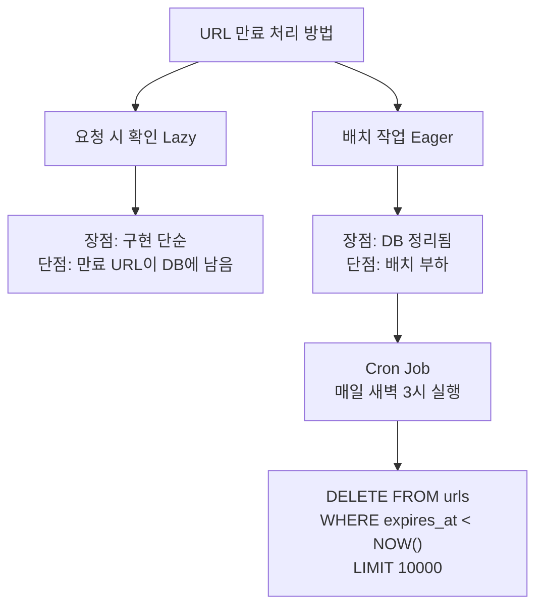

**요청 시 만료 확인:**
```python
def redirect(short_code: str):
    url = db.query(
        "SELECT long_url, expires_at FROM urls WHERE short_code = ?",
        short_code
    )

    if not url:
        raise NotFoundError("URL not found")

    if url.expires_at and url.expires_at < datetime.now():
        raise GoneError("URL has expired")  # 410 Gone

    return RedirectResponse(url.long_url, status_code=302)
```

---

## 11. 분석 및 통계

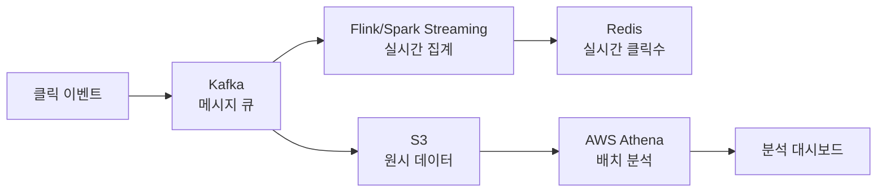

**클릭 추적 비동기 처리:**
```python
async def track_click(short_code: str, request: Request):
    """클릭을 비동기로 추적 (리다이렉트 속도 영향 없음)"""
    asyncio.create_task(
        kafka_producer.send('click-events', {
            'short_code': short_code,
            'ip': request.client.host,
            'user_agent': request.headers.get('user-agent'),
            'referer': request.headers.get('referer'),
            'timestamp': time.time()
        })
    )
```

---

## 12. Rate Limiting (남용 방지)

```python
def check_rate_limit(user_id: str, tier: str) -> bool:
    """Redis 기반 Rate Limiting"""
    limits = {
        'free': 100,       # 시간당 100건
        'pro': 1000,       # 시간당 1000건
        'enterprise': 10000
    }

    key = f"rate:{user_id}:{int(time.time() / 3600)}"  # 시간 단위

    current = redis.incr(key)
    if current == 1:
        redis.expire(key, 3600)  # 1시간 TTL

    return current <= limits.get(tier, 100)
```

---

## 13. 극한 시나리오: 슈퍼볼 광고 순간

2023년 슈퍼볼에서 코인베이스가 QR코드만 보여주는 광고를 방영했습니다. 수천만 명이 동시에 스캔하며 서버가 다운됐습니다. URL 단축기도 유사한 상황이 발생할 수 있습니다.

```
시나리오: 유명 유튜버가 bit.ly 링크를 방송에서 보여줌
순간 트래픽: 초당 50만 요청 (평상시 100배)
```

### 대응 방안

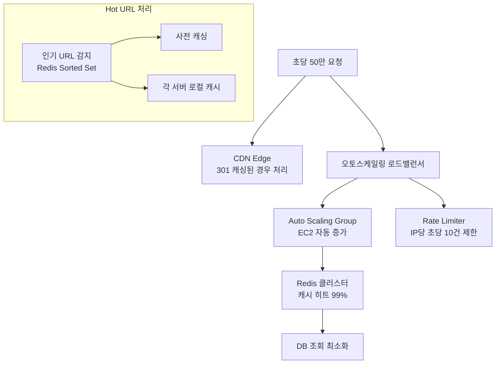

**Hot URL 감지:**
```python
def record_access(short_code: str):
    """인기 URL 추적 (Redis Sorted Set)"""
    redis.zincrby("hot_urls", 1, short_code)

def get_hot_urls(top_n: int = 100) -> list:
    """상위 N개 인기 URL 반환"""
    return redis.zrevrange("hot_urls", 0, top_n - 1, withscores=True)

# 매 5분마다 HOT URL을 서버 로컬 캐시에 프리로딩
@scheduler.every(minutes=5)
def preload_hot_urls():
    hot_urls = get_hot_urls(top_n=1000)
    for short_code, _ in hot_urls:
        long_url = db.get(short_code)
        local_cache[short_code] = long_url
```

---

## 14. 완성된 아키텍처 다이어그램

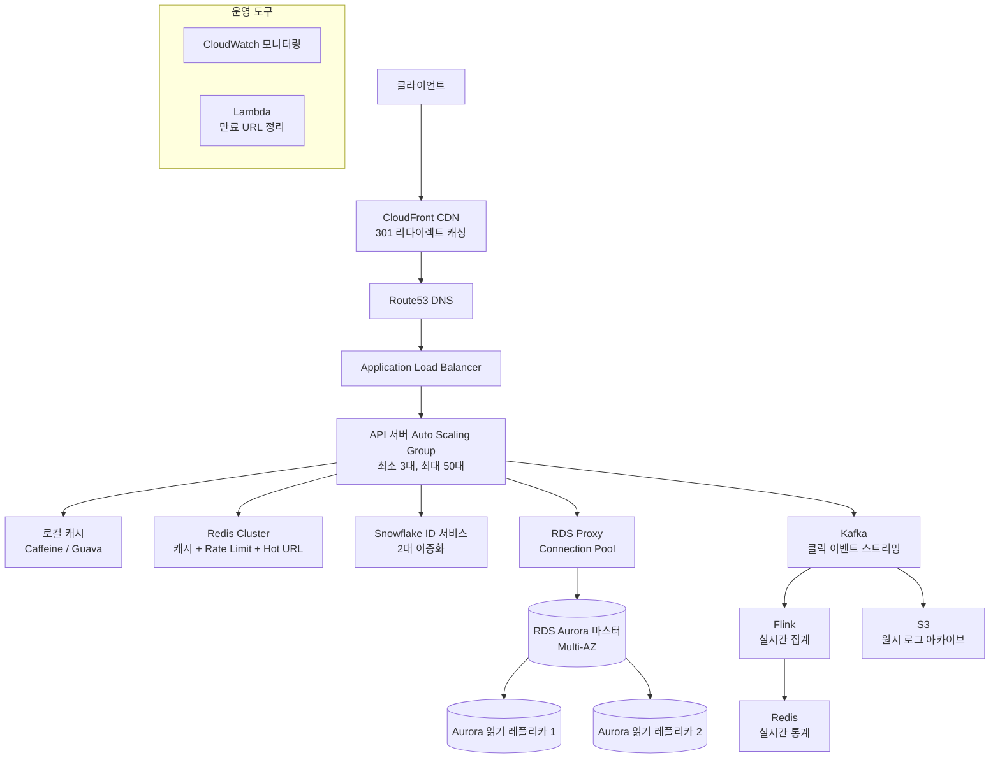

---

## 설계 결정 요약

| 결정 사항 | 선택 | 이유 |
|----------|------|------|
| 코드 생성 방식 | Snowflake + Base62 | 충돌 없음, 확장 용이 |
| 코드 길이 | 7자리 | 3.5조 URL 지원 |
| 리다이렉트 방식 | 302 | 클릭 추적 가능 |
| 캐시 | Redis Cluster | 분산 환경 적합 |
| DB | Aurora MySQL | 안정성 + 읽기 레플리카 |
| 클릭 추적 | Kafka 비동기 | 리다이렉트 성능 영향 없음 |
| Rate Limit | Redis 슬라이딩 윈도우 | 정확한 제한 |
