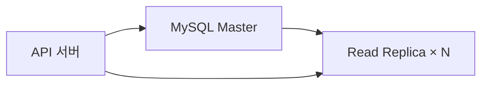
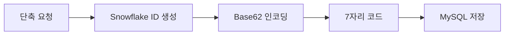
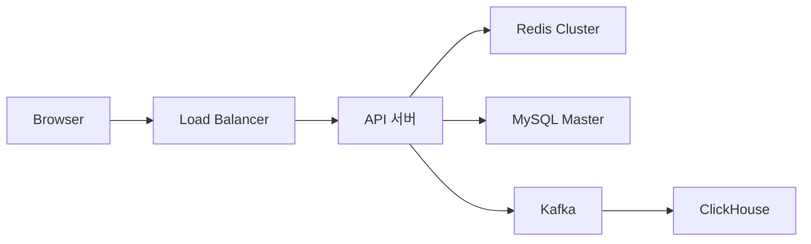
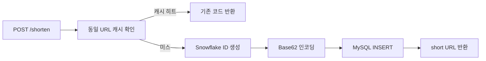
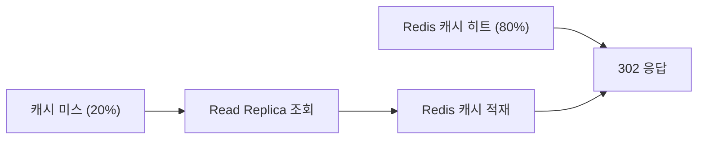
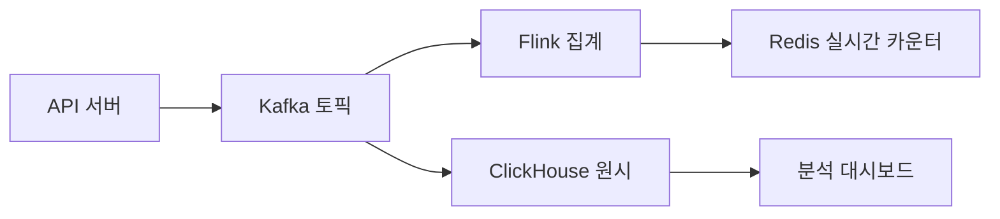

트위터가 140자 제한이었던 시절, `https://www.example.com/very/long/path?campaign=summer&source=newsletter&medium=email` 같은 URL은 그 자체로 트윗 대부분을 차지했다. bit.ly는 이 문제를 7글자로 해결했다. 단순해 보이지만, 초당 10만 건의 리다이렉트를 100ms 이내에 처리하고 수십 TB의 데이터를 수년간 관리하는 시스템이다. **"짧게 만든다"는 단순한 기능 뒤에 어떤 설계가 숨어있는가.**

---

## 1. 요구사항 분석 — 무엇을 만들 것인가

요구사항을 나열하는 것이 아니라, 각 요구사항이 **어떤 설계 결정을 강제하는가**부터 파악해야 한다. 면접에서 요구사항을 읽는 목적은 기능 목록 확인이 아니라 설계 제약 조건 도출이다.

### 기능 요구사항

| 기능 | 설계에 미치는 영향 |
|------|-----------------|
| 긴 URL → 짧은 URL 생성 | 전역 유일한 코드 생성 전략 필요 (단일 서버? 분산?) |
| 짧은 URL → 원본으로 리다이렉트 | 읽기 경로 최적화가 핵심. 301 vs 302 결정 필요 |
| 클릭 분석 (횟수, 국가, 기기) | 리다이렉트 경로에서 이벤트 수집 → 동기 불가, 비동기 파이프라인 필요 |
| 커스텀 별칭 (`bit.ly/mybrand`) | 코드 생성 공간과 커스텀 공간의 충돌 방지 전략 필요 |
| 만료 기간 설정 | 만료 URL 처리 — Lazy 검사 vs Eager 배치 정리 선택 |

### 비기능 요구사항 — 숫자의 의미

```
읽기:쓰기 = 100:1   → 리다이렉트가 전체 부하의 99%. 읽기 경로가 병목
리다이렉트 100ms 이내 → 사용자가 링크 클릭 후 체감 지연. 캐시 없이 불가능
99.99% 가용성       → 연간 다운타임 52분. 이 서비스가 죽으면 전 세계 bit.ly 링크가 404
```

비기능 요구사항 중 **읽기:쓰기 = 100:1** 이 가장 중요하다. 설계의 모든 선택이 "읽기를 어떻게 빠르게 만드는가"로 수렴한다.

---

## 2. 규모 추정 — 숫자로 설계 방향을 결정한다

추정의 목적은 정확한 숫자가 아니다. **어떤 컴포넌트가 병목인가**를 수치로 보여주는 것이다.

```
일일 새 URL 생성:    1억 건
읽기:쓰기 비율:      100:1
일일 리다이렉트:     100억 건

쓰기 QPS  = 1억 / 86,400 ≈ 1,160 QPS
읽기 QPS  = 1,160 × 100  = 116,000 QPS
피크 QPS  = 116,000 × 3  ≈ 350,000 QPS   ← 이게 설계 기준

URL 하나 크기:
  short_code: 7B
  long_url:   100B (평균)
  메타데이터: 30B (user_id, created_at, expires_at)
  합계:       ≈ 137B

5년 저장량:
  1억 × 365 × 5 × 137B ≈ 25TB
10년 저장량:
  1억 × 365 × 10 × 137B ≈ 50TB
```

**이 숫자에서 나오는 결론:**
- 읽기 116,000 QPS → MySQL 단일 인스턴스로 불가능(한계 ~10,000 QPS). Redis 캐시 필수
- 쓰기 1,160 QPS → MySQL 마스터 1대로 충분. DB 샤딩은 저장량 증가 시점에 필요
- 10년 50TB → 단일 인스턴스 한계. 수평 샤딩 전략 필요

---

## 3. DB 선택 — WHY MySQL + Redis + Kafka인가

DB 선택은 "어떤 DB가 좋은가"가 아니라 "이 워크로드에 어떤 DB가 맞는가"의 문제다.

### 3-1. MySQL — URL 매핑 영구 저장소



**왜 MySQL인가?**

URL 단축기의 핵심 데이터는 `short_code → long_url` 매핑이다. 얼핏 단순한 Key-Value 처럼 보이지만 다음 쿼리가 필요하다:

- 사용자별 생성한 URL 목록 (`WHERE user_id = ?`)
- 만료 URL 배치 삭제 (`WHERE expires_at < NOW()`)
- 동일 긴 URL 재단축 요청 시 기존 코드 반환 (`WHERE long_url = ?`)
- 클릭 통계와 URL 정보의 JOIN

이 패턴은 **관계형 쿼리가 필요한 구조**다. DynamoDB 같은 NoSQL은 단순 KV 조회에는 강하지만 복잡한 필터·JOIN에서 약하다. MySQL은 이 쿼리들을 인덱스 기반으로 효율적으로 처리한다.

**DynamoDB를 선택하지 않는 이유:** 클릭 분석, 사용자 링크 목록, 만료 관리에서 복잡한 쿼리가 필요하다. DynamoDB는 파티션 키 기반 단순 조회에 최적화되어 있고, 관계형 쿼리를 지원하지 않는다. 운영 규모가 글로벌(Phase 4)로 확장될 때 DynamoDB Global Tables로 전환을 고려한다.

### 3-2. Redis — 리다이렉트 캐시 (sub-ms 지연)

**왜 Redis인가?**

읽기 QPS 116,000을 MySQL이 전부 처리하면 즉시 다운된다. Redis는 메모리 기반으로 단일 인스턴스에서 초당 100만 건 이상의 GET/SET을 처리한다. 리다이렉트 경로(`short_code → long_url` 조회)는 순수한 Key-Value 패턴이라 Redis에 완벽하게 맞는다.

캐시 히트율 80% 목표 시 DB에 도달하는 QPS: `116,000 × 0.2 = 23,200 QPS` — MySQL 한계 이내.

**Memcached를 선택하지 않는 이유:** Redis는 Sorted Set(클릭 수 기반 인기 URL 추적), TTL 자동 만료(URL 만료 동기화), Pub/Sub(이벤트 알림)을 지원한다. Memcached는 단순 KV 캐시만 지원하여 이 추가 기능을 쓸 수 없다.

### 3-3. Kafka — 클릭 이벤트 비동기 수집

**왜 Kafka인가?**

클릭 이벤트(IP, User-Agent, Referer, 타임스탬프)를 리다이렉트 응답 경로에서 동기로 DB에 저장하면 리다이렉트 지연이 증가한다. 목표 응답 시간 100ms 중 DB 쓰기가 50ms를 차지하면 UX가 망가진다.

Kafka는 이벤트를 먼저 디스크에 순서대로 적재하고 Consumer가 비동기로 처리한다. 리다이렉트 요청은 Kafka Produce(~1ms) 후 즉시 302 응답을 반환한다. 분석 저장은 Consumer가 별도로 처리한다.

**SQS/RabbitMQ를 선택하지 않는 이유:** 클릭 이벤트는 초당 수십만 건이 발생한다. Kafka는 이 고처리량에 최적화되어 있고, 이벤트를 7일간 보관하여 재처리(클릭 집계 버그 발생 시 재계산)가 가능하다. SQS/RabbitMQ는 소비된 메시지를 삭제하여 재처리가 불가능하다.

---

## 4. 핵심 설계 결정 — 왜 이 선택인가

### 결정 1: 코드 생성 — Base62 인코딩 + Snowflake ID

**문제:** 서버 20대가 동시에 7자리 코드를 만들 때 중복이 발생하면 안 된다.

먼저 **문자 집합 선택**이다. 7자리로 몇 개의 URL을 표현할 수 있는가:

| 방식 | 문자 수 | 7자리 공간 |
|------|--------|----------|
| 숫자만 (0-9) | 10 | 1,000만 |
| Base62 (0-9, a-z, A-Z) | 62 | **3.5조** |
| Base64 (+ `+`, `/`) | 64 | 4.4조 |

**Base62를 선택하는 이유:** URL에 특수문자(`+`, `/`) 없이 3.5조 공간 확보. 10년치 1억 건/일 = 3,650억 개 필요. 3.5조는 이를 10배 수용한다. Base64의 `+`, `/`는 URL 인코딩 시 `%2B`, `%2F`로 변환되어 단축 URL이 깨질 수 있다.

```java
// Base62 인코딩 — 고유 숫자를 7자리 문자열로 변환
@Component
public class Base62Encoder {

    private static final String CHARS =
        "0123456789abcdefghijklmnopqrstuvwxyzABCDEFGHIJKLMNOPQRSTUVWXYZ";
    private static final int BASE = 62;

    public String encode(long id) {
        if (id == 0) return String.valueOf(CHARS.charAt(0));
        StringBuilder sb = new StringBuilder();
        while (id > 0) {
            sb.append(CHARS.charAt((int)(id % BASE)));
            id /= BASE;
        }
        return sb.reverse().toString();
    }

    public long decode(String code) {
        long result = 0;
        for (char c : code.toCharArray()) {
            result = result * BASE + CHARS.indexOf(c);
        }
        return result;
    }
}
```

**이제 "고유한 숫자"를 어떻게 만드는가 — Snowflake ID**

여러 후보를 비교하면:

| 후보 | 장점 | 단점 | 결론 |
|------|------|------|------|
| 랜덤 문자열 | 구현 단순 | 충돌 확률 존재, 재시도 필요, 매번 DB 조회 | 소규모만 가능 |
| MD5 해시 앞 7자리 | 같은 URL → 같은 코드(중복 방지) | 해시 충돌 가능, 7자리 잘라내면 충돌 증가 | 위험 |
| MySQL AUTO_INCREMENT + Base62 | 충돌 없음 | 서버 수평 확장 시 DB가 단일 병목 | 단일 서버만 |
| **Snowflake ID + Base62** | 전역 유일, 충돌 없음, 타임스탬프 포함 | 워커 ID 관리 필요 | **채택** |

**Snowflake ID 구조:**

```
64비트 구성:
  [1비트: 부호] [41비트: 타임스탬프] [10비트: 워커ID] [12비트: 시퀀스]

41비트 타임스탬프: 2^41ms ≈ 69년
10비트 워커ID:    최대 1,024대 서버 동시 운영
12비트 시퀀스:    동일 ms에 서버 1대당 최대 4,096개
```

서버 20대가 동일한 밀리초에 동시에 ID를 생성해도, 각 서버의 워커 ID 비트가 다르므로 수학적으로 충돌이 불가능하다.

```java
@Component
public class SnowflakeIdGenerator {

    private static final long EPOCH = 1700000000000L; // 2023-11-15 기준
    private static final long WORKER_ID_BITS = 10L;
    private static final long SEQUENCE_BITS = 12L;
    private static final long MAX_SEQUENCE = ~(-1L << SEQUENCE_BITS);  // 4095
    private static final long WORKER_ID_SHIFT = SEQUENCE_BITS;
    private static final long TIMESTAMP_SHIFT = SEQUENCE_BITS + WORKER_ID_BITS;

    private final long workerId;
    private long lastTimestamp = -1L;
    private long sequence = 0L;

    public SnowflakeIdGenerator(@Value("${snowflake.worker-id}") long workerId) {
        this.workerId = workerId;
    }

    public synchronized long nextId() {
        long now = System.currentTimeMillis();

        if (now == lastTimestamp) {
            sequence = (sequence + 1) & MAX_SEQUENCE;
            if (sequence == 0) {
                // 동일 ms에 4096개 초과 — 다음 ms까지 대기
                now = waitNextMillis(lastTimestamp);
            }
        } else {
            sequence = 0L;
        }

        lastTimestamp = now;
        return ((now - EPOCH) << TIMESTAMP_SHIFT)
             | (workerId << WORKER_ID_SHIFT)
             | sequence;
    }

    private long waitNextMillis(long lastTs) {
        long ts = System.currentTimeMillis();
        while (ts <= lastTs) ts = System.currentTimeMillis();
        return ts;
    }
}
```

**Base62 7자리 ← Snowflake ID 흐름:**



### 결정 2: 301 vs 302 리다이렉트 — WHY 302인가

**문제:** 짧은 URL 접속 시 브라우저에 어떤 상태코드를 반환하는가. 이 결정이 클릭 분석 데이터 수집 가능 여부를 결정한다.

| 구분 | 301 (영구) | 302 (임시) |
|------|-----------|-----------|
| 브라우저 캐싱 | 캐시함 — 이후 서버 미경유 | 캐시 안 함 — 매번 서버 경유 |
| 서버 부하 | 낮음 | 높음 |
| 클릭 추적 | **불가** — 브라우저가 서버 없이 직접 이동 | **가능** — 매번 서버를 거쳐 이벤트 수집 |
| long_url 변경 시 | 반영 안 됨 (캐시된 URL로 이동) | 즉시 반영 |

**302를 선택하는 이유:** bit.ly의 수익 모델은 클릭 분석 데이터다. 광고주가 구매하는 것은 "몇 명이, 어느 나라에서, 어떤 기기로, 몇 시에 클릭했는가"다. 301이면 브라우저가 캐시하여 서버를 거치지 않으므로 클릭 이벤트 자체를 수집할 수 없다. 서버 부하 문제는 Redis 캐시로 해결한다.

**301을 선택하면 어떻게 되는가:** 사용자의 브라우저가 `W7e3p2K → https://example.com/target` 매핑을 캐시한다. 이후 클릭은 서버를 거치지 않아 클릭 카운트가 0으로 기록된다. 분석 리포트가 완전히 무의미해지고, longUrl을 변경해도 캐시된 브라우저는 구 URL로 이동한다.

```java
@RestController
@RequestMapping("/")
public class RedirectController {

    private final UrlService urlService;
    private final KafkaTemplate<String, ClickEvent> kafkaTemplate;

    @GetMapping("/{shortCode}")
    public ResponseEntity<Void> redirect(
            @PathVariable String shortCode,
            HttpServletRequest request) {

        String longUrl = urlService.getLongUrl(shortCode)
            .orElseThrow(() -> new UrlNotFoundException(shortCode));

        // 클릭 이벤트 비동기 발행 — 응답 지연 없음
        ClickEvent event = ClickEvent.builder()
            .shortCode(shortCode)
            .ipMasked(maskIp(request.getRemoteAddr()))
            .userAgent(request.getHeader("User-Agent"))
            .referer(request.getHeader("Referer"))
            .clickedAt(Instant.now())
            .build();
        kafkaTemplate.send("click-events", shortCode, event);

        // 302 임시 리다이렉트 — 브라우저 캐시 안 함
        return ResponseEntity.status(HttpStatus.FOUND)
            .location(URI.create(longUrl))
            .build();
    }

    private String maskIp(String ip) {
        // GDPR: 마지막 옥텟 마스킹 (1.2.3.4 → 1.2.3.x)
        int lastDot = ip.lastIndexOf('.');
        return lastDot > 0 ? ip.substring(0, lastDot) + ".x" : ip;
    }
}
```

### 결정 3: 읽기 캐시 전략 — 파레토 기반 선별 캐시

**문제:** Redis에 모든 URL을 캐시할 수 없다. 어떤 URL을 캐시하고 어떤 URL을 DB에서 가져오는가.

| 전략 | 장점 | 단점 |
|------|------|------|
| 고정 TTL (모두 캐시) | 구현 단순 | 인기 URL도 TTL 만료 후 미스, 비인기 URL이 공간 점유 |
| LRU (최근 사용) | 자동으로 비인기 URL 제거 | 최근 단 한 번 조회된 URL이 오래된 인기 URL 밀어냄 |
| **파레토 기반** | 트래픽 80%를 2GB로 처리 | 인기도 추적 로직 필요 |

URL 클릭 분포는 파레토 법칙을 따른다. 상위 20%의 URL이 전체 트래픽의 80%를 처리한다.

```
전체 URL = 1억 건 × 0.2 = 상위 2,000만 건
URL 하나 캐시 크기 = 7B(코드) + 100B(longUrl) = 107B
필요 Redis 메모리 = 2,000만 × 107B ≈ 2.14GB

Redis 서버 16GB → 충분
```

**구현 — Redis Sorted Set으로 클릭 수 추적:**

```java
@Service
public class CacheWarmingService {

    private static final String HOT_URLS_KEY = "hot_urls";
    private static final int TOP_N = 1_000_000; // 상위 100만 개 추적

    private final RedisTemplate<String, String> redis;
    private final UrlRepository urlRepository;

    // 클릭마다 점수 증가
    public void recordClick(String shortCode) {
        redis.opsForZSet().incrementScore(HOT_URLS_KEY, shortCode, 1.0);
    }

    // 매 5분 상위 URL을 캐시에 유지
    @Scheduled(fixedDelay = 300_000)
    public void warmTopUrls() {
        Set<String> topCodes = redis.opsForZSet()
            .reverseRange(HOT_URLS_KEY, 0, TOP_N - 1);

        if (topCodes == null) return;

        topCodes.forEach(code -> {
            String cacheKey = "url:" + code;
            if (!Boolean.TRUE.equals(redis.hasKey(cacheKey))) {
                urlRepository.findByShortCode(code)
                    .ifPresent(url -> redis.opsForValue()
                        .set(cacheKey, url.getLongUrl(), 1, TimeUnit.HOURS));
            }
        });
    }
}
```

### 결정 4: 분산 ID 생성 — 왜 각 서버가 독립 생성인가

**문제:** 중앙 ID 생성 서버(Redis INCR)를 두는 방법과 각 서버가 독립 생성하는 방법 중 어느 것인가.

| 방식 | 장점 | 단점 |
|------|------|------|
| Redis INCR (중앙 카운터) | 구현 단순, 완벽한 순서 보장 | Redis 단일 장애점. Redis 다운 = 전체 URL 생성 불가 |
| DB AUTO_INCREMENT | ACID 보장 | 쓰기 병목. DB가 모든 생성 요청의 병목 |
| **Snowflake (각 서버 독립)** | SPOF 없음, 선형 확장, 충돌 불가 | 워커 ID 설정·관리 필요 |

워커 ID는 Kubernetes 환경에서는 Pod 순번(StatefulSet 인덱스)으로 자동 할당하거나, ZooKeeper/Consul에서 시작 시 발급받는다.

---

## 5. 전체 아키텍처



**각 컴포넌트의 역할:**

- **API 서버**: 단축 URL 생성, 리다이렉트, 클릭 이벤트 Kafka 발행
- **Redis Cluster**: 리다이렉트 캐시 (sub-ms 응답), 클릭 수 Sorted Set 관리
- **MySQL Master**: URL 매핑 영구 저장, 쓰기 전용
- **Read Replica**: 캐시 미스 시 조회, 사용자 링크 목록 쿼리
- **Kafka**: 클릭 이벤트 버퍼 (리다이렉트 응답 경로 분리)
- **Flink**: 실시간 클릭 집계 (1분 윈도우)
- **ClickHouse**: 클릭 분석 쿼리 저장소 (컬럼형 OLAP)

---

## 6. URL 생성 흐름 — 쓰기 경로



```java
@Service
@RequiredArgsConstructor
public class UrlShortenService {

    private final SnowflakeIdGenerator idGenerator;
    private final Base62Encoder encoder;
    private final UrlRepository urlRepository;
    private final RedisTemplate<String, String> redis;
    private final MaliciousUrlChecker maliciousUrlChecker;

    public ShortenResponse shorten(ShortenRequest request) {
        // 1. 악성 URL 동기 검사 (Google Safe Browsing)
        if (!maliciousUrlChecker.isSafe(request.getLongUrl())) {
            throw new MaliciousUrlException("악성 URL로 분류된 주소입니다");
        }

        // 2. 커스텀 코드 요청 처리
        if (StringUtils.hasText(request.getCustomAlias())) {
            return handleCustomAlias(request);
        }

        // 3. 동일 longUrl 중복 확인 (캐시 → DB 순서)
        String dedupeKey = "dedup:" + DigestUtils.sha256Hex(request.getLongUrl());
        String existingCode = redis.opsForValue().get(dedupeKey);
        if (existingCode != null) {
            return ShortenResponse.of(existingCode);
        }

        Optional<UrlMapping> existing = urlRepository.findByLongUrl(request.getLongUrl());
        if (existing.isPresent()) {
            redis.opsForValue().set(dedupeKey, existing.get().getShortCode(), 24, TimeUnit.HOURS);
            return ShortenResponse.of(existing.get().getShortCode());
        }

        // 4. 신규 코드 생성
        long id = idGenerator.nextId();
        String shortCode = encoder.encode(id);

        UrlMapping mapping = UrlMapping.builder()
            .shortCode(shortCode)
            .longUrl(request.getLongUrl())
            .userId(request.getUserId())
            .expiresAt(request.getExpiresAt())
            .createdAt(Instant.now())
            .build();

        urlRepository.save(mapping);

        // 5. 즉시 캐시 적재
        Duration ttl = request.getExpiresAt() != null
            ? Duration.between(Instant.now(), request.getExpiresAt())
            : Duration.ofDays(30);

        if (!ttl.isNegative()) {
            redis.opsForValue().set("url:" + shortCode, request.getLongUrl(), ttl);
        }

        return ShortenResponse.of(shortCode);
    }

    private ShortenResponse handleCustomAlias(ShortenRequest request) {
        String alias = request.getCustomAlias();
        validateCustomAlias(alias);  // 예약어·욕설·형식 검사

        UrlMapping mapping = UrlMapping.builder()
            .shortCode(alias)
            .longUrl(request.getLongUrl())
            .userId(request.getUserId())
            .expiresAt(request.getExpiresAt())
            .isCustom(true)
            .build();

        try {
            urlRepository.save(mapping);
        } catch (DataIntegrityViolationException e) {
            throw new AliasAlreadyTakenException("이미 사용 중인 별칭입니다: " + alias);
        }

        return ShortenResponse.of(alias);
    }
}
```

---

## 7. URL 리다이렉트 흐름 — 읽기 경로



**캐시 미스 — Cache-Aside 패턴:**

```java
@Service
@RequiredArgsConstructor
public class UrlService {

    private final RedisTemplate<String, String> redis;
    private final UrlRepository urlRepository;
    private final CacheWarmingService cacheWarmingService;

    public Optional<String> getLongUrl(String shortCode) {
        // 1. L1: Redis 캐시 조회 (sub-ms)
        String cached = redis.opsForValue().get("url:" + shortCode);
        if (cached != null) {
            cacheWarmingService.recordClick(shortCode);  // 클릭 수 증가
            return Optional.of(cached);
        }

        // 2. L2: DB 조회 (캐시 미스)
        Optional<UrlMapping> mapping = urlRepository.findByShortCode(shortCode);

        mapping.ifPresent(m -> {
            // 만료 확인
            if (m.getExpiresAt() != null && m.getExpiresAt().isBefore(Instant.now())) {
                return; // 만료 URL은 캐시하지 않음
            }

            // Redis에 적재 (TTL = URL 만료까지 남은 시간 or 기본 1시간)
            Duration ttl = m.getExpiresAt() != null
                ? Duration.between(Instant.now(), m.getExpiresAt())
                : Duration.ofHours(1);

            redis.opsForValue().set("url:" + shortCode, m.getLongUrl(), ttl);
            cacheWarmingService.recordClick(shortCode);
        });

        return mapping.map(UrlMapping::getLongUrl);
    }
}
```

---

## 8. 데이터베이스 설계

```sql
-- URL 매핑 테이블
CREATE TABLE url_mappings (
    id          BIGINT          NOT NULL,           -- Snowflake ID
    short_code  VARCHAR(30)     NOT NULL,           -- Base62 코드 또는 커스텀 별칭
    long_url    VARCHAR(2048)   NOT NULL,
    user_id     BIGINT,
    is_custom   BOOLEAN         NOT NULL DEFAULT FALSE,
    created_at  DATETIME(3)     NOT NULL DEFAULT CURRENT_TIMESTAMP(3),
    expires_at  DATETIME(3),
    PRIMARY KEY (id),
    UNIQUE  KEY uk_short_code (short_code),          -- 코드 중복 방지
    INDEX       idx_long_url   (long_url(255)),       -- 동일 URL 재단축 요청 조회
    INDEX       idx_user_id    (user_id),             -- 사용자별 링크 목록
    INDEX       idx_expires_at (expires_at)           -- 만료 배치 작업
) ENGINE=InnoDB DEFAULT CHARSET=utf8mb4;

-- 클릭 통계 집계 테이블 (Flink가 적재)
CREATE TABLE click_stats (
    short_code  VARCHAR(30)     NOT NULL,
    period      DATETIME        NOT NULL,            -- 1시간 버킷
    granularity ENUM('hour','day') NOT NULL,
    clicks      BIGINT          NOT NULL DEFAULT 0,
    unique_ips  BIGINT          NOT NULL DEFAULT 0,
    PRIMARY KEY (short_code, period, granularity),
    INDEX       idx_period      (period)
) ENGINE=InnoDB DEFAULT CHARSET=utf8mb4;
```

**왜 `long_url`에 인덱스가 필요한가:** 같은 긴 URL을 두 번 단축 요청할 때 기존 코드를 반환해야 한다. `long_url`은 최대 2048자이므로 전체 컬럼에 B-Tree 인덱스를 걸면 페이지가 커진다. `long_url(255)` 프리픽스 인덱스로 타협 — 255자 이내로 구분되는 URL은 인덱스로 처리하고, 충돌 시 full scan으로 확인한다.

**왜 Snowflake ID를 PK로 쓰는가:** AUTO_INCREMENT PK는 MySQL 마스터에서만 생성할 수 있어 서버 수평 확장 시 병목이 된다. Snowflake ID는 각 애플리케이션 서버에서 독립 생성하므로 DB 의존 없이 PK가 결정된다. 시간순 단조 증가라 B-Tree 인덱스 재균형도 최소화된다.

---

## 9. Analytics 파이프라인 — 클릭 이후의 여정



**Kafka Consumer → Flink 집계 흐름:**

```java
// 클릭 이벤트 도메인 모델
@Data
@Builder
public class ClickEvent {
    private String shortCode;
    private String ipMasked;      // 마지막 옥텟 마스킹
    private String userAgent;
    private String referer;
    private String country;       // GeoIP 변환 후 채움
    private Instant clickedAt;
}
```

```java
// Kafka Producer — 리다이렉트 후 비동기 발행
@Component
@RequiredArgsConstructor
public class ClickEventPublisher {

    private final KafkaTemplate<String, ClickEvent> kafka;
    private static final String TOPIC = "click-events";

    public void publish(ClickEvent event) {
        // shortCode를 파티션 키로 사용 → 동일 코드의 이벤트는 같은 파티션
        kafka.send(TOPIC, event.getShortCode(), event)
            .addCallback(
                result -> {},
                ex -> log.warn("클릭 이벤트 발행 실패: {}", event.getShortCode(), ex)
            );
    }
}
```

**ClickHouse 원시 이벤트 저장 (OLAP):**

```sql
-- ClickHouse: 수백억 행 집계를 초 단위로 처리
CREATE TABLE click_events (
    short_code  String,
    ip_masked   String,
    user_agent  String,
    country     String,
    clicked_at  DateTime
) ENGINE = MergeTree()
PARTITION BY toYYYYMM(clicked_at)
ORDER BY (short_code, clicked_at);

-- 시간별 클릭 집계 쿼리 (수억 행도 수초 처리)
SELECT
    toStartOfHour(clicked_at)   AS hour,
    count()                     AS clicks,
    uniqExact(ip_masked)        AS unique_visitors
FROM click_events
WHERE short_code = 'W7e3p2K'
  AND clicked_at >= now() - INTERVAL 7 DAY
GROUP BY hour
ORDER BY hour DESC;
```

**왜 ClickHouse인가:** MySQL로 수억 건 클릭 로그를 집계하면 수십 분이 걸린다. ClickHouse는 컬럼형 스토리지로 집계 쿼리에서 MySQL 대비 100~1000배 빠르다. MergeTree 엔진은 초당 수백만 행 삽입을 지원한다.

---

## 10. URL 만료 처리 — Lazy + Eager 조합

만료 처리에는 두 가지 접근이 있다. 실무에서는 두 가지를 조합한다.

**Lazy 검사 — 요청 시 만료 확인:**

```java
@GetMapping("/{shortCode}")
public ResponseEntity<Void> redirect(@PathVariable String shortCode) {
    UrlMapping mapping = urlRepository.findByShortCode(shortCode)
        .orElseThrow(() -> new UrlNotFoundException(shortCode));

    // 만료 확인
    if (mapping.getExpiresAt() != null
            && mapping.getExpiresAt().isBefore(Instant.now())) {
        // 410 Gone: 의도적으로 제거된 리소스 (404와 구분)
        // 검색 엔진이 410을 받으면 색인에서 즉시 제거
        return ResponseEntity.status(HttpStatus.GONE).build();
    }

    kafkaTemplate.send("click-events", buildClickEvent(shortCode));
    return ResponseEntity.status(HttpStatus.FOUND)
        .location(URI.create(mapping.getLongUrl()))
        .build();
}
```

**Eager 정리 — 새벽 배치 삭제:**

```java
@Component
@RequiredArgsConstructor
public class ExpiredUrlCleaner {

    private final JdbcTemplate jdbc;
    private final RedisTemplate<String, String> redis;

    // 매일 새벽 3시 실행
    @Scheduled(cron = "0 0 3 * * *")
    public void cleanExpiredUrls() {
        // 만료 후 30일 유예 기간 (분쟁 대응)
        // LIMIT으로 배치 분할 → 대량 잠금 방지
        int deleted;
        do {
            deleted = jdbc.update("""
                DELETE FROM url_mappings
                WHERE expires_at < NOW() - INTERVAL 30 DAY
                LIMIT 5000
                """);
            log.info("만료 URL 삭제: {}건", deleted);

            if (deleted > 0) {
                try { Thread.sleep(100); } catch (InterruptedException e) {
                    Thread.currentThread().interrupt();
                    break;
                }
            }
        } while (deleted == 5000); // 5000건 미만이면 완료
    }
}
```

**왜 410 Gone인가:** 404는 "없거나 임시 오류"를 의미한다. 검색 엔진은 404를 받으면 나중에 재시도할 수 있다고 판단한다. 410은 "의도적으로 영구 삭제"를 의미하여 검색 엔진이 해당 URL을 색인에서 즉시 제거한다.

---

## 11. 수평 확장 — 언제 샤딩이 필요한가

10년 저장량이 50TB다. MySQL 단일 인스턴스로는 한계가 있다. 그러나 처음부터 샤딩을 설계하면 오버엔지니어링이다. 어느 시점에 샤딩이 필요한가:

- 단일 MySQL 인스턴스 저장량 > 5TB
- 캐시 미스 후 DB 읽기 QPS > 8,000 QPS
- 쓰기 QPS > 5,000 QPS

**Consistent Hashing 샤딩 전략:**

단순 `hash(short_code) % N` 방식은 샤드 수를 4 → 5로 늘리는 순간 대부분의 키가 다른 샤드로 이동한다 (약 80% 재배치). Consistent Hashing은 샤드 추가 시 전체의 `1/N`만 재배치한다.

```java
@Component
public class ConsistentHashRouter {

    private final TreeMap<Long, DataSource> ring = new TreeMap<>();
    private static final int VIRTUAL_NODES = 150; // 샤드당 가상 노드 수

    public void addShard(String shardId, DataSource ds) {
        for (int i = 0; i < VIRTUAL_NODES; i++) {
            long hash = hash(shardId + "#" + i);
            ring.put(hash, ds);
        }
    }

    public DataSource getShardFor(String shortCode) {
        long hash = hash(shortCode);
        Map.Entry<Long, DataSource> entry = ring.ceilingEntry(hash);
        // 링의 끝을 넘어가면 첫 번째 샤드로 wrap-around
        return entry != null ? entry.getValue() : ring.firstEntry().getValue();
    }

    private long hash(String key) {
        // MurmurHash3 — CRC32보다 분산 균일
        return Hashing.murmur3_128().hashString(key, StandardCharsets.UTF_8)
            .asLong() & Long.MAX_VALUE;
    }
}
```

**가상 노드 (Virtual Nodes):** 샤드 1대를 링 위에 150개의 가상 노드로 분산 배치한다. 샤드 간 데이터 불균형(핫스팟)을 방지하고, 샤드 추가·제거 시 부하가 여러 샤드에 고르게 분산된다.

```
modulo 해싱:         샤드 4→5개 시 ~80% 키가 다른 샤드로 이동
Consistent Hashing:  샤드 4→5개 시 ~20%(1/N)의 키만 이동
```

---

## 12. 보안 — 악성 URL 차단 다중 레이어

```java
@Service
@RequiredArgsConstructor
public class MaliciousUrlChecker {

    private final SafeBrowsingClient safeBrowsing;  // Google Safe Browsing API
    private final RedisTemplate<String, String> redis;

    // 동기 검사 — URL 생성 시 (SLA: 200ms 이내)
    public boolean isSafe(String url) {
        // Redis 블랙리스트 먼저 확인 (이미 악성으로 판정된 URL)
        String hash = DigestUtils.sha256Hex(url);
        if (Boolean.TRUE.equals(redis.hasKey("blocked:url:" + hash))) {
            return false;
        }

        return safeBrowsing.check(url);
    }

    // 비동기 재검사 — 등록 후 24시간 뒤 (나중에 악성으로 등록된 URL 대응)
    @KafkaListener(topics = "url-recheck", groupId = "malicious-checker")
    public void recheckAsync(String shortCode) {
        urlRepository.findByShortCode(shortCode).ifPresent(mapping -> {
            if (!isSafe(mapping.getLongUrl())) {
                // Redis에 차단 플래그 설정
                redis.opsForValue().set(
                    "blocked:" + shortCode, "1", 30, TimeUnit.DAYS);
                log.warn("악성 URL 사후 탐지: {}", shortCode);
            }
        });
    }
}
```

**커스텀 슬러그 보호:**

```java
@Component
public class CustomAliasValidator {

    private static final Set<String> RESERVED = Set.of(
        "api", "admin", "health", "login", "signup", "help",
        "support", "about", "terms", "privacy", "docs", "status"
    );
    private static final Pattern VALID_PATTERN = Pattern.compile("^[a-zA-Z0-9_-]{4,30}$");

    public void validate(String alias) {
        if (!VALID_PATTERN.matcher(alias).matches()) {
            throw new InvalidAliasException("영문, 숫자, _, - 만 사용 가능 (4~30자)");
        }
        if (RESERVED.contains(alias.toLowerCase())) {
            throw new InvalidAliasException("예약된 별칭: " + alias);
        }
    }
}
```

**클릭 데이터 프라이버시 (GDPR):**

- IP는 저장 전 마지막 옥텟 마스킹 (`1.2.3.4 → 1.2.3.x`)
- User-Agent는 기기/OS 파싱 후 원본 삭제
- GDPR 삭제 요청 시 해당 user_id의 click_events를 90일 이내 삭제

---

## 13. Day 1 → Scale 진화

URL 단축기를 처음부터 Consistent Hashing 샤딩과 Redis Cluster로 구축하면 과잉 설계다. 읽기 QPS와 저장량 규모에 맞게 단계적으로 진화해야 한다.

### Phase 1 — 일 생성 1만 건, 일 리다이렉트 100만 건

**아키텍처:** API 서버 1대 + MySQL + AUTO_INCREMENT + Redis 단일 노드

| 항목 | 선택 | 이유 |
|------|------|------|
| 코드 생성 | MySQL AUTO_INCREMENT + Base62 | 단일 서버라 충돌 없음 |
| 리다이렉트 | Redis → MySQL 순서 | 읽기 QPS ~12, MySQL도 충분 |
| 분석 | MySQL clicks 테이블 직접 INSERT | Kafka 불필요 |
| 월 비용 | EC2 t3.medium + RDS db.t3.medium | **~$95/월** |

### Phase 2 — 일 생성 100만 건, 일 리다이렉트 1억 건

**아키텍처:** Snowflake ID 도입 + Redis 캐시 + Kafka 비동기 분석

| 항목 | 변경 이유 |
|------|---------|
| Snowflake ID | 서버 수평 확장 준비. AUTO_INCREMENT는 DB 병목 |
| Kafka 도입 | 클릭 분석을 리다이렉트 경로에서 분리. 응답 시간 보호 |
| 파레토 캐시 | 클릭 수 상위 20% URL 자동 캐시. 히트율 80% 목표 |
| 월 비용 | EC2 × 3 + RDS Multi-AZ + ElastiCache + Kafka MSK | **~$1,300/월** |

### Phase 3 — 일 생성 1000만 건, 일 리다이렉트 10억 건

**아키텍처:** MySQL 샤딩 + Redis Cluster + ClickHouse 분석

| 항목 | 변경 이유 |
|------|---------|
| MySQL 4샤드 | 저장량 10TB 초과, 단일 인스턴스 한계 |
| Redis Cluster | 캐시 용량 및 고가용성 |
| ClickHouse 도입 | 수억 건 클릭 집계. MySQL로는 수십 분 → ClickHouse 수초 |
| 월 비용 | ~$6,800/월 |

### Phase 4 — 일 생성 1억 건, 일 리다이렉트 100억 건 (글로벌)

**아키텍처:** 멀티리전 + DynamoDB 전환 + CDN 엣지 리다이렉트

| 항목 | 변경 이유 |
|------|---------|
| MySQL → DynamoDB Global Tables | 자동 샤딩, 멀티리전 복제 |
| CloudFront Functions | 엣지에서 직접 리다이렉트 (지연 20ms 이하) |
| 리전별 Snowflake 워커 | 리전 비트로 전역 유일성 보장 |
| 월 비용 | ~$43,000/월 |

---

## 14. 면접 포인트 5가지

### Q. 301 vs 302 — 어느 것을 선택하고 그 이유는?

**답변 구조:** 302를 선택한다. 이유는 비즈니스 요구사항에서 시작한다.

301은 브라우저가 캐시하여 이후 요청을 서버에 보내지 않는다. 클릭 추적이 불가능해진다. bit.ly의 수익 모델은 클릭 분석 데이터 판매다. 몇 명이 어느 나라에서, 어떤 기기로, 몇 시에 클릭했는가를 광고주에게 제공한다. 301로 배포하면 브라우저가 캐시하여 클릭 카운트가 0으로 기록된다. 분석 리포트가 완전히 무의미해진다.

부하 문제는 Redis 캐시로 해결한다. 302라도 Redis에서 응답하면 캐시 히트율 80%에서 DB 부하는 원래의 20%로 줄어든다.

**추가 포인트:** 만약 순수하게 URL 단축만 필요하고 분석이 불필요하다면 301이 맞다. 결정은 비즈니스 모델에서 나온다.

### Q. 코드 생성 전략 — Snowflake vs 랜덤 vs 해시의 트레이드오프는?

**랜덤 Base62:** 구현이 단순하다. 그러나 코드 생성 시마다 DB에서 중복 확인이 필요하다. URL이 쌓일수록 충돌 확률이 증가한다 (생일 역설). 3.5조 공간에서 10억 개가 존재하면 충돌 확률은 `1 - e^(-n²/2m) ≈ 14%`다.

**MD5 해시 앞 7자리:** 같은 URL은 항상 같은 코드가 나와 중복 저장을 자동으로 방지한다. 그러나 128비트 해시를 7자리(42비트)로 잘라내면 충돌이 증가한다. 충돌 발생 시 재생성 로직이 필요하다.

**Snowflake ID + Base62:** 구조적으로 충돌이 불가능하다. 타임스탬프가 포함되어 최근 생성 URL을 날짜 범위로 조회할 수 있다. 워커 ID 관리 인프라가 필요하지만, 이는 Kubernetes StatefulSet 인덱스로 자동화할 수 있다. 대규모 분산 환경의 표준이다.

### Q. 초당 10만 건 단축 요청을 처리하려면?

병목은 DB 쓰기다. Aurora MySQL 단일 마스터는 약 1~2만 TPS가 한계다.

**해결 방법:**

1. Snowflake ID를 각 서버가 독립 생성 → DB 시퀀스 의존 제거
2. 코드 사전 생성 풀 (Pre-generation Pool) — 백그라운드 스레드가 코드를 미리 생성해 메모리 큐에 적재, 요청 시 큐에서 꺼냄

```java
@Component
public class ShortCodePool {

    private final BlockingQueue<String> pool = new LinkedBlockingQueue<>(10_000);
    private final SnowflakeIdGenerator idGenerator;
    private final Base62Encoder encoder;

    @PostConstruct
    public void init() { refillPool(); }

    public String acquire() throws InterruptedException {
        return pool.poll(100, TimeUnit.MILLISECONDS);
    }

    @Scheduled(fixedDelay = 1000)
    public void refillPool() {
        int deficit = 10_000 - pool.size();
        for (int i = 0; i < deficit; i++) {
            pool.offer(encoder.encode(idGenerator.nextId()));
        }
    }
}
```

3. 단축 요청을 Kafka에 먼저 쌓고 Consumer가 배치 INSERT → DB 쓰기 I/O 최소화

### Q. 만료된 코드 재사용 정책은?

만료된 코드를 즉시 재사용하면 문제가 생긴다. 브라우저 캐시에 구 URL이 남아있을 수 있고, 검색 엔진 색인에 구 URL이 있을 수 있다. 재사용하면 새 URL과 구 URL이 혼재한다.

**안전한 정책:** 만료 후 최소 30일 Grace Period 유지 후 재사용 허용. 또는 만료 코드를 재사용하지 않고 새 코드 생성 (공간 낭비이지만 단순). Base62 7자리 = 3.5조이므로 10년치 URL 3,650억 개를 수용하고도 공간이 남는다. 재사용 없이 운영해도 문제없다.

**Redis TTL 동기화:** URL 만료 시 Redis 캐시도 함께 만료되어야 한다. `EXPIREAT` 명령으로 DB의 `expires_at`과 Redis TTL을 동기화한다. URL을 수동 삭제할 때는 `DEL url:{shortCode}`를 즉시 호출한다.

### Q. 극한 트래픽 — 방송에서 bit.ly 링크가 노출되면?

유명 방송에서 단축 URL이 노출되면 순간 트래픽이 평소의 100배가 된다. 초당 50만 요청이 단일 URL에 집중된다. 이를 Hot URL 문제라 한다.

**방어 계층:**

```
1단계: 각 API 서버 로컬 캐시 (Caffeine)
   → 상위 1,000개 URL을 프로세스 메모리에 보관
   → 네트워크 없이 마이크로초 응답

2단계: Redis 캐시
   → 로컬 캐시 미스 시 Redis 조회
   → 수십만 QPS 처리 가능

3단계: DB Read Replica
   → Redis 미스 시 DB 조회 (전체 요청의 ~1%)
```

```java
// 로컬 캐시 (Caffeine) — L1 캐시
@Bean
public Cache<String, String> localUrlCache() {
    return Caffeine.newBuilder()
        .maximumSize(1_000)          // 상위 1,000개 URL
        .expireAfterWrite(5, TimeUnit.MINUTES)
        .recordStats()
        .build();
}

// 읽기 순서: L1(로컬) → L2(Redis) → L3(DB)
public Optional<String> getLongUrl(String shortCode) {
    // L1
    String local = localUrlCache.getIfPresent(shortCode);
    if (local != null) return Optional.of(local);

    // L2
    String cached = redis.opsForValue().get("url:" + shortCode);
    if (cached != null) {
        localUrlCache.put(shortCode, cached);
        return Optional.of(cached);
    }

    // L3
    return urlRepository.findByShortCode(shortCode)
        .map(m -> {
            redis.opsForValue().set("url:" + shortCode, m.getLongUrl(),
                1, TimeUnit.HOURS);
            localUrlCache.put(shortCode, m.getLongUrl());
            return m.getLongUrl();
        });
}
```

---

## 15. 극한 시나리오 분석

### 시나리오 1: Redis 클러스터 전체 다운

**상황:** Redis Cluster 6노드가 네트워크 파티션으로 전부 응답 불가. 캐시 히트율 0%로 떨어진다.

**영향:** 읽기 QPS 116,000이 전부 MySQL DB로 직접 도달한다. MySQL 한계(~10,000 QPS)를 10배 초과. DB 커넥션 풀 고갈 → 리다이렉트 응답 실패.

**방어:**
1. 각 API 서버 로컬 캐시 (Caffeine) — Redis 없이도 상위 1,000개 URL 응답 가능
2. Circuit Breaker (Resilience4j) — DB 과부하 시 일부 요청을 즉시 503으로 차단, DB 보호
3. Read Replica 추가 투입 — 평소에는 캐시 미스만 처리, 비상 시 전체 트래픽 수용

```java
@Service
public class UrlService {

    @CircuitBreaker(name = "db-fallback", fallbackMethod = "fallbackUrl")
    public Optional<String> getLongUrlFromDb(String shortCode) {
        return urlRepository.findByShortCode(shortCode)
            .map(UrlMapping::getLongUrl);
    }

    // DB도 다운 시 fallback — 503 응답
    public Optional<String> fallbackUrl(String shortCode, Exception ex) {
        log.error("DB 조회 실패 — circuit open: {}", shortCode);
        return Optional.empty();  // Controller에서 503 반환
    }
}
```

### 시나리오 2: Snowflake 워커 ID 중복 설정

**상황:** 배포 자동화 버그로 서버 A와 서버 B가 동일한 워커 ID(42번)로 시작한다. 동일 밀리초에 두 서버가 ID를 생성하면 `(타임스탬프 동일) + (워커 ID 동일) + (시퀀스 동일)` 조건이 겹칠 수 있다.

**영향:** 동일한 short_code가 두 URL에 부여된다. MySQL UNIQUE KEY가 두 번째 INSERT를 거부. 한 요청은 HTTP 500으로 실패한다. 더 심각한 경우, 레이스 컨디션으로 두 URL이 모두 INSERT 성공하면 하나의 코드가 두 개의 원본 URL을 가리키는 데이터 오염이 발생한다.

**방어:**
1. 워커 ID를 Kubernetes Pod 인덱스에서 자동 할당 (`K8S_POD_INDEX` 환경변수)
2. 시작 시 ZooKeeper/etcd에서 워커 ID를 원자적으로 발급받고, 종료 시 반납
3. 모니터링: 코드 충돌 건수 메트릭. 하루 1건이라도 알람 → 즉각 워커 ID 설정 점검

### 시나리오 3: 봇에 의한 URL 대량 생성 공격

**상황:** 악의적인 봇이 초당 5,000건의 URL 생성 요청을 보낸다. DB 쓰기 QPS가 한계를 초과하고, 코드 공간이 빠르게 소진된다.

**방어:**

```java
// Rate Limiter — 사용자별 초당 10건, 미인증 IP별 초당 1건
@Component
public class RateLimitFilter implements HandlerInterceptor {

    private final RateLimiter<String> limiter;

    @Override
    public boolean preHandle(HttpServletRequest req, HttpServletResponse res,
                              Object handler) throws Exception {
        String key = extractRateLimitKey(req);  // userId or IP
        if (!limiter.tryAcquire(key)) {
            res.setStatus(HttpStatus.TOO_MANY_REQUESTS.value());
            res.getWriter().write("{\"error\": \"Rate limit exceeded\"}");
            return false;
        }
        return true;
    }
}
```

추가로 Google reCAPTCHA를 URL 생성 API에 적용하여 봇 요청을 프론트엔드에서 1차 차단한다.

### 시나리오 4: 유명 링크 삭제 요청

**상황:** 기업 법무팀이 특정 단축 URL에 상표권 침해 콘텐츠가 연결된다고 삭제를 요청한다. 해당 URL은 하루 수백만 클릭의 인기 링크다.

**처리 흐름:**
1. 관리자 API로 `short_code` 비활성화 (`is_active = false` 업데이트)
2. Redis에서 `url:{shortCode}` 즉시 삭제 (`DEL`)
3. Redis에 차단 플래그 설정 (`SET blocked:{shortCode} 1`)
4. 이후 리다이렉트 요청은 차단 안내 페이지로 응답 (HTTP 451 — 법적 이유로 차단)
5. 각 API 서버 로컬 캐시(Caffeine)도 무효화 → 캐시 무효화 이벤트를 Redis Pub/Sub으로 전파

---

## 16. 실무에서 놓치기 쉬운 케이스

### 케이스 1: 충돌 재시도 없는 랜덤 코드 생성

Snowflake ID 대신 랜덤 Base62를 쓰는 경우, 충돌 시 재시도 로직이 없으면 HTTP 500이 반환된다.

```java
@Service
public class RandomCodeShortenService {

    private static final int MAX_RETRIES = 3;

    public String createShortUrl(String longUrl) {
        for (int attempt = 0; attempt < MAX_RETRIES; attempt++) {
            String code = generateRandomBase62(7);
            try {
                urlRepository.save(new UrlMapping(code, longUrl));
                return "https://short.ly/" + code;
            } catch (DataIntegrityViolationException e) {
                // UNIQUE 충돌 — 재시도
                log.warn("코드 충돌 {}회차: {}", attempt + 1, code);
            }
        }
        // 3회 재시도 후 Snowflake ID 폴백 (충돌 불가능)
        return createWithSnowflakeId(longUrl);
    }
}
```

### 케이스 2: 캐시 TTL 설정 누락

```java
// 나쁜 예: TTL 없이 캐시 — 만료된 URL도 영구 캐시
redis.opsForValue().set("url:" + code, longUrl);

// 좋은 예: URL 만료 시각과 동기화
Instant expiresAt = mapping.getExpiresAt();
if (expiresAt != null) {
    Duration ttl = Duration.between(Instant.now(), expiresAt);
    if (ttl.isPositive()) {
        redis.opsForValue().set("url:" + code, longUrl, ttl);
    }
    // ttl이 음수 = 이미 만료 — 캐시하지 않음
} else {
    // 만료 없는 URL은 1시간 TTL (메모리 절약)
    redis.opsForValue().set("url:" + code, longUrl, 1, TimeUnit.HOURS);
}
```

### 케이스 3: 분석을 동기 처리해 리다이렉트 지연

```java
// 나쁜 예: DB 쓰기가 리다이렉트 응답 경로에 포함
@GetMapping("/{code}")
public ResponseEntity<Void> redirect(@PathVariable String code) {
    String longUrl = getLongUrl(code);
    clickRepository.save(new ClickEvent(code, request.getRemoteAddr())); // 동기 DB 쓰기
    return ResponseEntity.status(302).location(URI.create(longUrl)).build();
}

// 좋은 예: Kafka 비동기 발행 (~1ms) 후 즉시 응답
@GetMapping("/{code}")
public ResponseEntity<Void> redirect(@PathVariable String code) {
    String longUrl = getLongUrl(code);
    kafka.send("click-events", buildEvent(code, request)); // 비동기, ~1ms
    return ResponseEntity.status(302).location(URI.create(longUrl)).build();
}
```

---

## 17. 핵심 메트릭

URL 단축기에서 이 다섯 숫자가 동시에 정상이면 서비스는 건강하다.

| 메트릭 | 정상 기준 | 이상 신호 | 원인 가설 |
|--------|---------|---------|---------|
| **리다이렉트 P99** | 100ms 이내 | 500ms 초과 | Redis 캐시 미스 급증, DB 응답 지연, 핫 URL Redis 노드 집중 |
| **코드 생성 P99** | 50ms 이내 | 200ms 초과 | Snowflake 서버 과부하, DB INSERT 경합 |
| **캐시 히트율** | 80% 이상 | 60% 미만 | 신규 URL 폭증으로 파레토 분포 깨짐, Redis 메모리 부족 |
| **코드 충돌 건수** | 0건/일 | 1건 이상 | Snowflake 워커 ID 중복 설정 |
| **일 생성 URL 수** | 설계 용량 70% 이하 | 90% 초과 | 봇 공격, 바이럴 이벤트 |

**핵심 알람:**

```
리다이렉트 P99 > 200ms   → PagerDuty P1 (Redis 상태 즉시 확인)
캐시 히트율 < 70%        → Slack 알림 (Redis 메모리·캐시 워밍 확인)
코드 충돌 1건            → PagerDuty P0 (워커 ID 설정 즉시 점검)
일 생성 URL > 용량 85%   → Auto Scaling 트리거 + Slack 알림
악성 URL > 100건/시      → Slack 알림 (봇 공격 의심, Rate Limit 강화)
```

---

## 18. 설계 결정 요약

| 결정 | 선택 | 왜 이 선택인가 |
|------|------|--------------|
| 코드 생성 | Snowflake ID + Base62 | 분산 환경 충돌 불가, 7자리 3.5조 공간 |
| 리다이렉트 | 302 임시 | 클릭 추적 가능 — 비즈니스 수익 모델 |
| URL 영구 저장 | MySQL | 관계형 쿼리(사용자 목록, 만료 관리, JOIN) 필요 |
| 리다이렉트 캐시 | Redis Cluster | 읽기 116K QPS를 DB에서 분리, sub-ms 응답 |
| 분석 저장 | ClickHouse | 수억 건 집계를 초 단위 처리 |
| 클릭 이벤트 수집 | Kafka 비동기 | 리다이렉트 응답 경로에서 분리, 재처리 가능 |
| 수평 확장 | Consistent Hashing | 샤드 추가 시 재배치 최소화 (1/N) |
| 만료 처리 | Lazy + Eager 배치 조합 | 즉시 응답(Lazy) + DB 용량 관리(Eager) |
| 악성 URL | Safe Browsing + 비동기 재검사 | 생성 시 동기 차단 + 사후 악성 등록 대응 |

---

> URL 단축기는 "짧은 코드를 만든다"는 단순한 기능처럼 보이지만, 읽기:쓰기 100:1 비율이 캐시 전략을, 클릭 분석 수익 모델이 302 선택을, 분산 환경이 Snowflake ID를 강제한다. 모든 설계 결정은 요구사항에서 시작해야 한다. 면접에서 "왜 이 선택인가"를 항상 요구사항으로 거슬러 올라가 설명하는 것이 고점 답변의 핵심이다.
