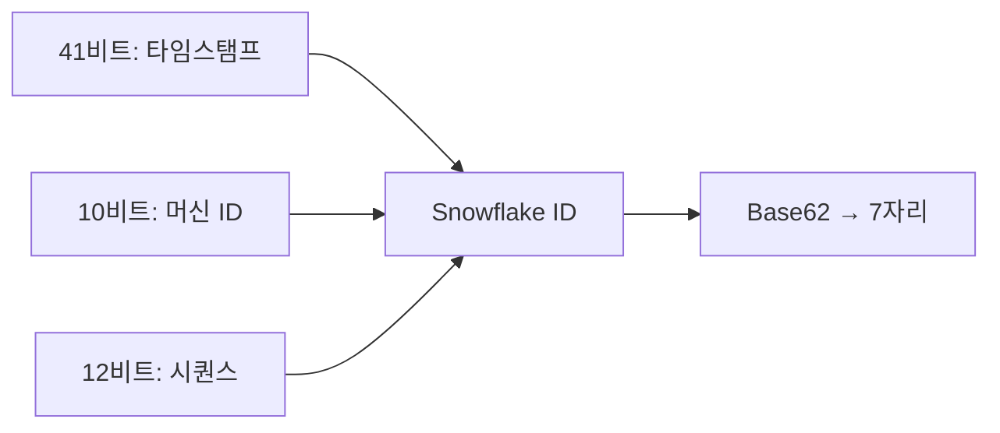
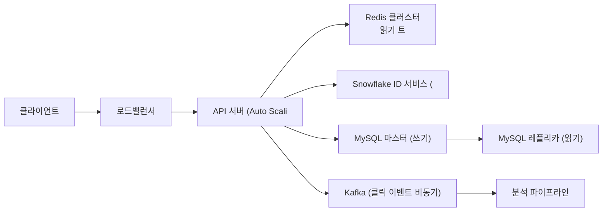
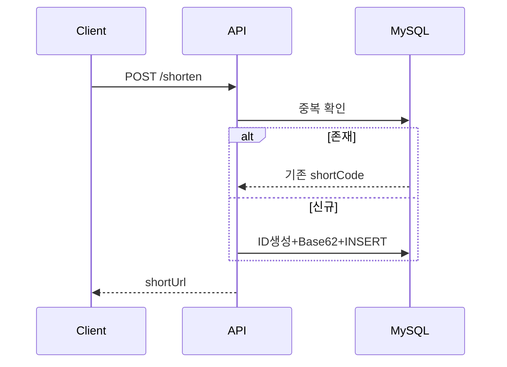
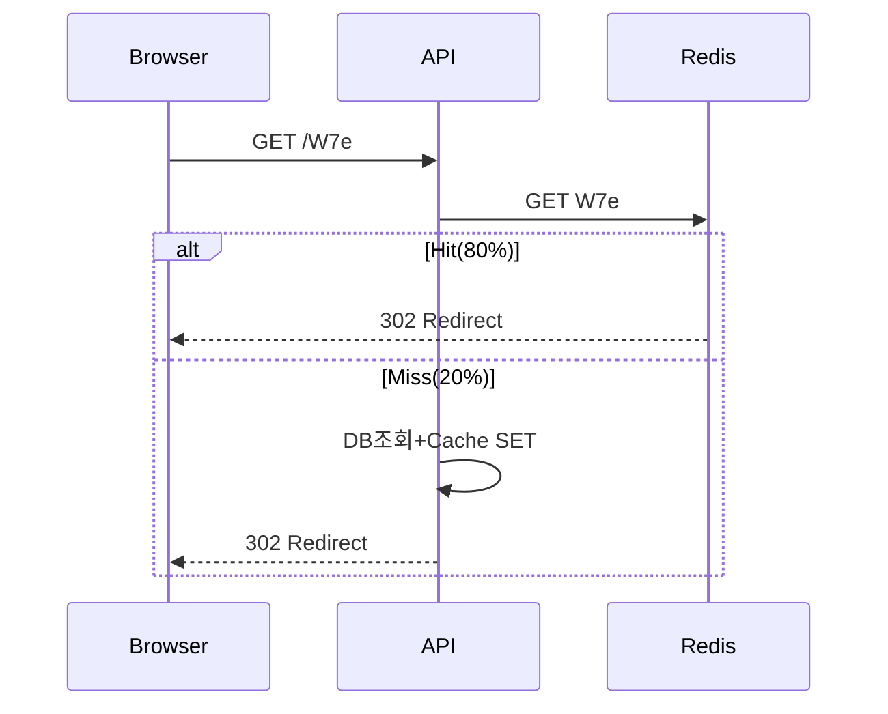
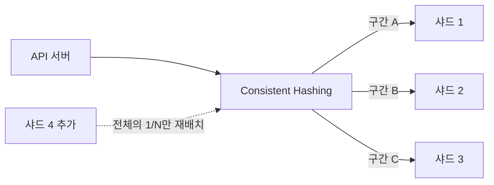
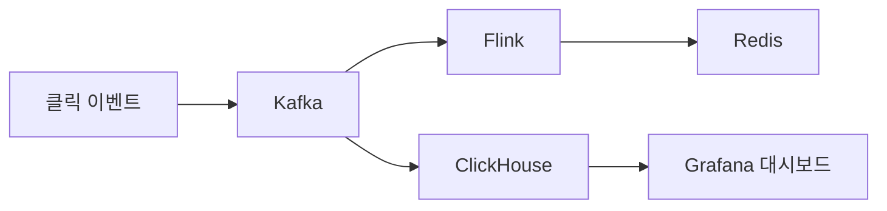
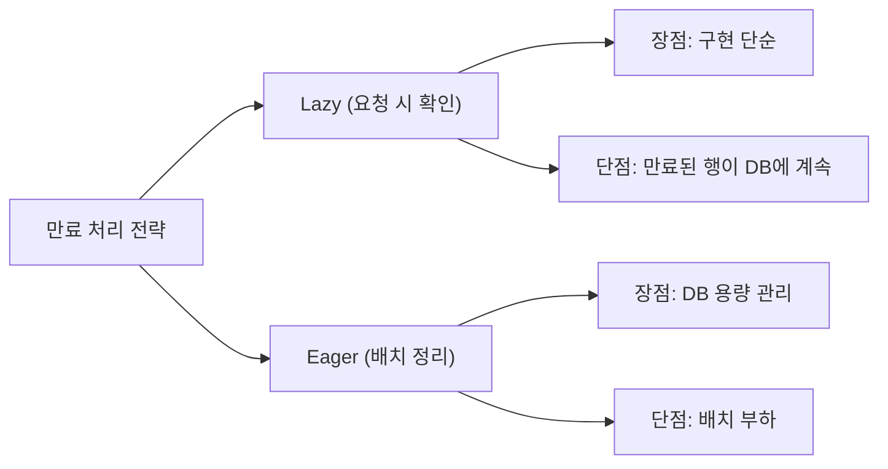
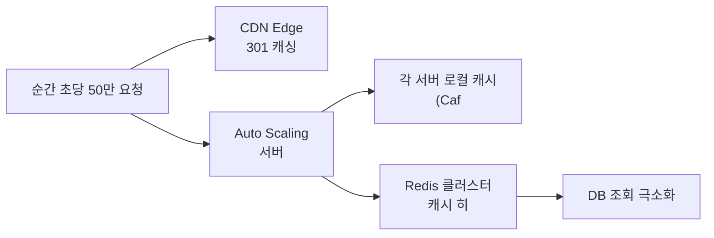

트위터가 140자 제한이었던 시절, `https://www.example.com/very/long/path?campaign=summer&source=newsletter&medium=email` 같은 URL은 그 자체로 트윗 대부분을 차지했다. bit.ly는 이 문제를 7글자로 해결했다. 단순해 보이지만, 초당 10만 건의 리다이렉트를 100ms 이내에 처리하고 수십 TB의 데이터를 수년간 관리하는 시스템이다. **"짧게 만든다"는 단순한 기능 뒤에 어떤 설계가 숨어있는가.**

## 요구사항 분석

### 기능 요구사항

1. 긴 URL을 입력하면 짧은 URL 생성
2. 짧은 URL로 접속하면 원래 URL로 리다이렉트
3. 사용자 지정 단축 URL 지원 (선택)
4. 링크 만료 기간 설정 (선택)

### 비기능 요구사항 — 왜 이 숫자가 중요한가

```
읽기:쓰기 = 100:1   → 리다이렉트가 대부분, 캐시 전략이 핵심
리다이렉트 100ms 이내 → 사용자가 링크를 클릭했는데 느리면 이탈
99.99% 가용성       → 연간 52분. 이 서비스가 죽으면 모든 bit.ly 링크가 404가 됨
```

### 규모 추정

```
일일 새 URL 생성:   1억 건
읽기:쓰기 비율  = 100:1
일일 리다이렉트:   100억 건

쓰기 QPS  = 1억 / 86,400 ≈ 1,160 QPS
읽기 QPS  = 1,160 × 100  = 116,000 QPS
피크 QPS  = 116,000 × 3  ≈ 350,000 QPS

URL 하나 크기:
  shortCode: 7B, longURL: 100B, 메타데이터: 30B → 약 137B

10년 저장량:
  1억 × 365 × 10 × 137B ≈ 50TB
```

---

## 설계 의사결정 로드맵

이 시스템을 설계할 때 내려야 하는 핵심 결정 4가지를 순서대로 짚는다. 각 결정에서 "왜 이 선택인가"를 명확히 하지 않으면 면접에서 "그냥 MD5 해시 쓰면 되지 않나요?"라는 후속 질문에 답할 수 없다.

### 결정 1: 코드 생성 — 랜덤 vs 해시(MD5) vs 카운터(Snowflake+Base62)

**문제**: 어떻게 충돌 없는 7자리 코드를 분산 환경에서 생성하는가? 서버 20대가 동시에 코드를 만들면 중복 가능성이 있다.

| 후보 | 장점 | 단점 | 언제 적합 |
|------|------|------|----------|
| 랜덤 문자열 | 구현 단순 | 충돌 확률 존재, 충돌 시 재생성 필요, DB 조회 필수 | 소규모 |
| MD5 해시 (긴 URL → 해시 앞 7자) | 결정론적, 같은 URL → 같은 코드 | 해시 충돌 가능, 128비트 중 7자리만 사용 | 중복 URL 자동 감지 원할 때 |
| Snowflake ID + Base62 | 전역 유일 보장, 시간순 정렬, 충돌 없음 | 워커 ID 관리 인프라 필요 | 대규모 분산 |

**우리의 선택: Snowflake ID + Base62**
- 이유: 서버 20대가 동시에 ID를 생성해도 워커 ID 비트가 다르므로 충돌이 수학적으로 불가능하다. Snowflake ID는 64비트이고 Base62로 인코딩하면 약 7자리가 되어 3.5조 개의 URL 공간을 확보한다. 시간 기반이라 ID 순서가 시간순으로 단조 증가하여 최근 생성 URL을 DB에서 효율적으로 범위 조회할 수 있다.
- 안 하면: MD5 해시의 앞 7자리를 코드로 쓰면 동일한 7자리 prefix를 공유하는 다른 URL이 존재할 수 있다. 충돌 시 8자리로 늘리거나 재생성하는 로직이 필요하고, 이 과정에서 DB 조회가 추가로 발생한다.

### 결정 2: 리다이렉트 — 301 vs 302

**문제**: 짧은 URL로 접속했을 때 브라우저에 어떤 리다이렉트 상태코드를 반환하는가? 이 결정이 클릭 분석 데이터 수집 가능 여부를 결정한다.

| 후보 | 장점 | 단점 | 언제 적합 |
|------|------|------|----------|
| 301 (영구 리다이렉트) | 브라우저가 캐시 → 이후 서버 미경유 → 부하 감소 | 클릭 추적 불가, 브라우저가 직접 이동 | 부하 최소화 우선 |
| 302 (임시 리다이렉트) | 매번 서버 경유 → 클릭 수·위치·기기 추적 가능 | 서버 부하 높음 | 분석 데이터 필요 |

**우리의 선택: 302**
- 이유: bit.ly의 수익 모델은 클릭 분석 데이터다. 광고주는 "얼마나 많은 사람이, 어느 나라에서, 어떤 기기로, 몇 시에 클릭했는가"를 구매한다. 301이면 브라우저가 캐시하여 서버를 거치지 않으므로 클릭 이벤트 자체를 수집할 수 없다. 부하 문제는 Redis 캐시로 해결한다.
- 안 하면: 301로 배포하면 사용자의 브라우저가 단축 URL → 원본 URL 매핑을 캐시한다. 이후 클릭은 서버를 거치지 않아 클릭 카운트가 0으로 기록된다. 광고주에게 제공하는 분석 리포트가 완전히 무의미해진다.

### 결정 3: 저장소 — MySQL vs DynamoDB

**문제**: 10년간 50TB, 읽기:쓰기 = 100:1의 패턴에서 어떤 DB를 선택하는가?

| 후보 | 장점 | 단점 | 언제 적합 |
|------|------|------|----------|
| MySQL | ACID, 복잡한 쿼리, 익숙한 운영 | 50TB 단일 인스턴스 한계, 읽기 확장 추가 구성 필요 | 중소 규모 |
| DynamoDB | 자동 샤딩, 무제한 확장, 관리형 | 복잡한 쿼리 불가, 비용 예측 어려움 | 단순 KV 패턴 |
| MySQL + Redis | MySQL 영구 저장 + Redis 읽기 캐시로 116K QPS 흡수 | 캐시 일관성 관리 필요 | 읽기 집약적 + 복잡한 관리 쿼리 |

**우리의 선택: MySQL + Redis**
- 이유: URL 단축기는 `short_code → long_url` 의 단순 KV 패턴이지만, 클릭 분석·사용자별 링크 목록·만료 관리 등 관계형 쿼리가 필요하다. MySQL 마스터에 쓰고, 읽기는 Redis 캐시(히트율 80%)로 처리하여 DB에 도달하는 QPS를 116,000 → 23,200으로 줄인다. 10년 50TB에서는 Consistent Hashing 기반 샤딩으로 확장한다.
- 안 하면: Redis 없이 MySQL만으로 읽기 116,000 QPS를 감당하면 MySQL 연결 풀이 즉시 고갈된다. MySQL 단일 인스턴스의 실용적 한계는 약 10,000 QPS다.

### 결정 4: 캐시 전략 — TTL vs LRU vs 파레토 기반

**문제**: Redis에 모든 URL을 캐시할 수 없다. 어떤 URL을 캐시하고 어떤 URL을 DB에서 직접 가져오는가?

| 후보 | 장점 | 단점 | 언제 적합 |
|------|------|------|----------|
| 고정 TTL | 구현 단순 | 인기 URL도 TTL 만료 후 캐시 미스, 비인기 URL이 캐시 점유 | 단순한 경우 |
| LRU (최근 사용) | 자동으로 비인기 URL 제거 | 최근에 한 번 조회된 URL이 오래된 인기 URL을 밀어냄 | 일반 캐시 |
| 파레토 기반 (상위 20% 캐시) | 트래픽 80%를 2.1GB로 커버 | 인기도 추적 로직 필요 | 파레토 분포 따를 때 |

**우리의 선택: 파레토 기반 선별 캐시**
- 이유: URL 클릭 분포는 파레토 법칙을 따른다. 상위 20% URL이 트래픽 80%를 처리한다. 전체 URL의 20%인 2000만 건 × 107B = 2.1GB만 캐시하면 읽기 QPS의 80%를 Redis에서 처리한다. Redis Sorted Set으로 클릭 수 상위 URL을 추적하고, 순위권 진입 시 캐시에 적재한다.
- 안 하면: LRU만 쓰면 방송에서 단 한 번 노출된 인기 URL이 캐시를 가득 채우고, 정작 매일 수백 번 클릭되는 URL이 캐시 밖으로 밀려날 수 있다. 핫스팟 URL마다 DB 조회가 발생한다.

---

## 핵심 설계: 7자리 코드를 어떻게 만드는가

> **비유**: 도서관의 책 청구기호와 같다. 수십만 권의 책에 각각 짧은 고유 번호를 부여하고, 그 번호만 알면 정확한 위치를 찾아갈 수 있다. 번호는 짧아야 하고, 절대 중복되어선 안 된다.

7자리로 얼마나 많은 URL을 표현할 수 있는가? **문자 집합 선택**이 핵심이다.

| 방식 | 문자 수 | 7자리 공간 |
|------|--------|----------|
| 숫자만 (0-9) | 10 | 1,000만 |
| Base62 (0-9, a-z, A-Z) | 62 | **3.5조** |
| Base64 (+ +, /) | 64 | 4.4조 |

Base62를 선택하는 이유: URL에서 특수문자 없이 3.5조 공간 확보. 10년치 1억 개/일로는 3,650억 개가 필요한데 충분하다.

### Base62 인코딩 원리

숫자(고유 ID)를 62진법으로 변환하는 것이다:

```python
CHARS = "0123456789abcdefghijklmnopqrstuvwxyzABCDEFGHIJKLMNOPQRSTUVWXYZ"

def encode(num: int) -> str:
    """고유 ID → Base62 문자열"""
    if num == 0:
        return CHARS[0]
    result = []
    while num > 0:
        result.append(CHARS[num % 62])
        num //= 62
    return ''.join(reversed(result))

# 12345 → "3D7"
# 복호화: '3'=3, 'D'=13, '7'=7
#   3×62² + 13×62 + 7
# = 3×3844 + 13×62 + 7
# = 11532 + 806 + 7 = 12345 ✓
```

### 고유 ID를 어떻게 만드는가 — Snowflake ID

Base62 인코딩은 "고유한 숫자"가 있어야 한다. 서버 20대가 동시에 같은 숫자를 생성하면 같은 단축 코드가 나온다. **Snowflake ID**가 이 문제를 해결한다:



만약 Snowflake 없이 UUID를 쓰면? UUID는 128비트라 Base62로 변환하면 22자리가 넘는다. "짧은" URL이 되지 않는다. 단순 AUTO_INCREMENT를 쓰면? 여러 서버에서 동시에 같은 번호가 나온다.

---

## 전체 아키텍처



---

## URL 단축 흐름 (쓰기)



---

## URL 리다이렉트 흐름 (읽기) — 왜 캐시가 필수인가

읽기 QPS가 116,000이다. 이 모두를 DB에서 처리하면 MySQL이 즉시 과부하된다. **캐시 히트율 80%**가 목표다:



### 301 vs 302 — 왜 bit.ly는 302를 쓰는가

| 구분 | 301 (영구) | 302 (임시) |
|------|-----------|-----------|
| 브라우저 캐싱 | O — 다음엔 서버 안 거침 | X — 매번 서버 거침 |
| 서버 부하 | 낮음 | 높음 |
| 클릭 추적 | **불가** — 브라우저가 직접 이동 | **가능** — 매번 서버 거쳐감 |

bit.ly의 수익은 클릭 분석 데이터다. 몇 명이 어디서 어떤 기기로 클릭했는지를 알아야 광고주에게 팔 수 있다. 그래서 302를 쓴다. 순수히 부하 최소화가 목표라면 301이 낫다.

---

## 데이터베이스 설계

```sql
CREATE TABLE urls (
    id          BIGINT      NOT NULL AUTO_INCREMENT,
    short_code  VARCHAR(7)  NOT NULL,
    long_url    VARCHAR(2048) NOT NULL,
    user_id     BIGINT,
    created_at  DATETIME    NOT NULL DEFAULT CURRENT_TIMESTAMP,
    expires_at  DATETIME,
    PRIMARY KEY (id),
    UNIQUE KEY uk_short_code (short_code),   -- 단축 코드 중복 방지
    INDEX idx_long_url (long_url(255)),       -- 동일 URL 재요청 시 빠른 조회
    INDEX idx_expires_at (expires_at)         -- 만료 배치 작업용
);
```

왜 `long_url`에 인덱스를 걸지 않으면 안 되는가? 같은 긴 URL을 두 번 단축 요청할 때 기존 코드를 반환해야 한다. 인덱스 없으면 매번 풀 스캔이다.

---

## 캐시 크기 계산

파레토 법칙: 상위 20% URL이 트래픽 80%를 처리한다.

```
전체 URL 수 = 1억 × 0.2 (상위 20%) = 2,000만 건
URL 하나 캐시 크기 = 7B + 100B = 107B
필요 메모리 = 2,000만 × 107B ≈ 2.1GB

→ Redis 서버 1대 (16GB)로 충분
```

캐시가 없다면? DB에 초당 116,000 쿼리. MySQL 커넥션 풀이 즉시 고갈된다.

---

## 확장성 — 언제 샤딩이 필요한가

10년 저장량이 50TB다. 단일 MySQL로는 한계가 있다. 단순 modulo 해싱(`hash % N`)은 샤드를 4개에서 5개로 늘리는 순간 대부분의 키가 다른 샤드로 이동한다. **Consistent Hashing**은 이 문제를 해결한다.

> **비유**: 0~360도 원형 링 위에 샤드와 키를 배치한다. 키는 시계 방향으로 가장 가까운 샤드에 할당된다. 샤드를 추가하면 그 샤드 바로 앞 구간의 키만 이동하면 된다. 전체 키의 `1/N`만 재배치된다.



**가상 노드(Virtual Nodes)**: 샤드 1대를 링 위에 100개의 가상 노드로 분산 배치한다. 샤드 간 데이터 불균형(핫스팟)을 방지하고, 샤드 추가·제거 시 부하가 여러 샤드에 고르게 분산된다.

```
modulo 해싱:        샤드 4→5개 증설 시 ~80% 키가 다른 샤드로 이동
Consistent Hashing: 샤드 4→5개 증설 시 ~20%(1/N)의 키만 이동
```

---

## Analytics 파이프라인 — 클릭 이후의 여정

Kafka로 클릭 이벤트를 보내는 것은 시작일 뿐이다. 실제로 "어떤 링크가 얼마나 클릭됐는가"를 실시간 대시보드와 일별·시간별 집계로 제공하는 전체 파이프라인이 필요하다.



**ClickHouse — 클릭 분석 저장소**

ClickHouse는 컬럼형 OLAP DB로 수십억 건의 클릭 로그를 초당 수백만 행 삽입하면서 집계 쿼리도 초 단위로 처리한다. MySQL로 대용량 로그를 집계하면 수십 분이 걸리는 쿼리가 ClickHouse에선 수 초다.

```sql
-- 시간별 클릭 집계 (ClickHouse)
SELECT
    toStartOfHour(clicked_at)  AS hour,
    short_code,
    count()                    AS clicks,
    uniq(ip_masked)            AS unique_visitors
FROM click_events
WHERE short_code = 'W7e3p2K'
  AND clicked_at >= now() - INTERVAL 7 DAY
GROUP BY hour, short_code
ORDER BY hour DESC;
```

**일별/시간별 사전 집계**

원본 이벤트를 매번 집계하면 비용이 크다. Flink가 1분 단위로 집계한 결과를 별도 `click_stats` 테이블에 적재한다:

```sql
CREATE TABLE click_stats (
    short_code  VARCHAR(7)  NOT NULL,
    period      DATETIME    NOT NULL,   -- 1시간 단위 버킷
    granularity ENUM('hour','day') NOT NULL,
    clicks      BIGINT      NOT NULL,
    unique_ips  BIGINT      NOT NULL,
    PRIMARY KEY (short_code, period, granularity)
);
```

**실시간 대시보드**

- Redis에서 현재 시간 기준 최근 1분 클릭 수를 조회해 실시간 수치 표시
- ClickHouse에서 지난 30일 시계열을 쿼리해 차트 렌더링
- Grafana + ClickHouse 플러그인 조합이 실무에서 가장 널리 쓰인다

---

## URL 만료 처리



실무에서는 **두 가지 조합**: 요청 시 만료 확인(즉시 응답)  + 새벽 배치 정리(DB 정리).

```python
def redirect(short_code: str):
    url = db.query("SELECT long_url, expires_at FROM urls WHERE short_code = ?", short_code)
    if not url:
        raise NotFoundError()
    if url.expires_at and url.expires_at < datetime.now():
        raise GoneError()  # 410 Gone — 영구 삭제된 리소스
    return RedirectResponse(url.long_url, status_code=302)
```

---


## 극한 시나리오

유명 방송에서 bit.ly 링크가 노출되면 순간 트래픽이 평상시 100배가 된다.



**Hot URL 사전 감지:**

```python
def record_access(short_code: str):
    redis.zincrby("hot_urls", 1, short_code)  # 클릭마다 점수 증가

# 매 5분마다 상위 1000개를 서버 로컬 메모리에 pre-loading
@scheduler.every(minutes=5)
def preload_hot_urls():
    for short_code, _ in redis.zrevrange("hot_urls", 0, 999, withscores=True):
        local_cache[short_code] = db.get(short_code)
```

이 패턴이 없으면? Redis에도 초당 50만 요청이 몰린다. Redis는 빠르지만 무한하지 않다.

---

## 보안 고려사항

> **비유**: 우편함에 주소를 써두면 누구나 편지를 넣을 수 있듯, URL 단축기는 악성 링크를 "정상처럼 보이게" 위장하는 도구로 악용될 수 있다.

**악성 URL 차단 — Google Safe Browsing API**

단축 URL 생성 시 원본 URL을 Google Safe Browsing API에 조회해 피싱·멀웨어 배포 사이트 여부를 확인한다. 악성으로 판정되면 생성을 거부하고, 이미 생성된 링크가 뒤늦게 악성으로 분류되면 즉시 404로 전환한다.

```python
def is_safe_url(long_url: str) -> bool:
    resp = requests.post(SAFE_BROWSING_API, json={
        "client": {"clientId": "myapp"},
        "threatInfo": {"threatTypes": ["MALWARE", "SOCIAL_ENGINEERING"],
                       "urlList": [{"url": long_url}]}
    })
    return len(resp.json().get("matches", [])) == 0
```

**커스텀 단축코드 충돌 처리**

사용자 지정 코드(`bit.ly/mybrand`)는 DB UNIQUE 제약으로 충돌을 차단한다. 단, 예약어(`api`, `admin`, `health` 등)와 기존 자동 생성 코드 공간이 겹치지 않도록 커스텀 코드 네임스페이스를 분리 관리한다.

**클릭 데이터 프라이버시**

클릭 이벤트(IP, User-Agent, 리퍼러)는 분석 목적으로 수집되지만 개인 식별이 가능하다. IP는 저장 전 마지막 옥텟을 마스킹(1.2.3.x)하고, GDPR 삭제권 요청 시 해당 사용자의 클릭 로그를 90일 이내에 삭제하는 파이프라인을 갖춘다.

---

### 꼭 직접 만들어야 하는가? — Build vs Buy

| 선택지 | 장점 | 단점 | 적합한 시점 |
|--------|------|------|-----------|
| Bitly / TinyURL API | 즉시 사용, 분석 대시보드 내장, 별도 인프라 불필요 | 자체 도메인 제한, 분석 커스텀 불가, 월 100만 건 초과 시 비용 급등 | Phase 1~2 |
| 직접 구축 | 도메인 브랜딩, 분석 커스텀, 비용 제어 완전 가능 | 초기 구현 부담, 운영·모니터링 필요 | Phase 2~4 |

**실무 판단 기준**: 월 100만 건 이상, 자체 도메인 필수, 분석 파이프라인 커스텀이 필요할 때 직접 구축으로 전환한다.

> 핵심: Phase 1에서 직접 구축하면 오버 엔지니어링이고, Phase 3에서 SaaS에 의존하면 비용 폭발이다. 현재 MAU에 맞는 선택을 하고, 병목이 실제로 발생할 때 전환한다.

---
## Day 1 → Scale 진화

URL 단축기를 처음부터 Consistent Hashing 샤딩과 Redis Cluster로 만들면 과잉 설계다. 읽기 QPS와 저장량 규모에 맞게 단계적으로 진화해야 한다.

### Phase 1 — 일 생성 1만 건, 일 리다이렉트 100만 건 (스타트업 초기)

**아키텍처**: API 서버 1대 + MySQL + Auto_increment 코드 생성

- 코드 생성: MySQL AUTO_INCREMENT를 Base62로 인코딩 (단일 서버라 충돌 없음)
- 리다이렉트: MySQL SELECT 후 302 응답 (읽기 QPS ~12, MySQL로 충분)
- 캐시: 없음 (QPS가 낮아 불필요)
- 분석: 클릭 이벤트를 MySQL clicks 테이블에 직접 INSERT

**월 비용**
- EC2 t3.medium × 1: ~$35
- RDS MySQL db.t3.medium: ~$60
- 합계: **~$95/월**

### Phase 2 — 일 생성 100만 건, 일 리다이렉트 1억 건 (서비스 성장)

**아키텍처**: Snowflake ID 도입 + Redis 캐시 + 클릭 분석 비동기화

- 코드 생성: Snowflake ID 서버 별도 구축 (서버 수평 확장 준비)
- 리다이렉트: Redis 캐시 추가 (히트율 80% 목표), 캐시 미스 시 MySQL
- 읽기 QPS: ~1,160 QPS → Redis 처리, DB는 ~230 QPS만 수신
- 클릭 분석: Kafka로 비동기화, 리다이렉트 응답 시간에 영향 없도록 분리
- 파레토 캐시: 클릭 수 상위 20% URL을 Redis Sorted Set으로 추적, 자동 캐시 워밍

**월 비용**
- EC2 c5.large × 3 (API + Snowflake): ~$300
- RDS MySQL db.r5.large (Multi-AZ): ~$400
- ElastiCache Redis r6g.large: ~$200
- Kafka MSK (2브로커): ~$400
- 합계: **~$1,300/월**

### Phase 3 — 일 생성 1000만 건, 일 리다이렉트 10억 건 (고성장)

**아키텍처**: MySQL 샤딩 + Redis Cluster + ClickHouse 분석

- 코드 생성: Snowflake ID 클러스터 (워커 10대), 분산 환경 충돌 없음
- DB 샤딩: Consistent Hashing으로 MySQL 4샤드 분산 (short_code 기준)
- 읽기: Redis Cluster(6노드), 인기 URL 로컬 캐시(Caffeine) L1 추가
- 분석: Kafka → Flink → ClickHouse 파이프라인, 시간별 클릭 집계 1초 내 조회
- URL 만료: 새벽 배치로 expires_at 초과 URL 일괄 삭제, Redis TTL 자동 만료

**월 비용**
- EC2 c5.2xlarge × 8: ~$2,000
- RDS MySQL 4샤드 (db.r5.large 각): ~$1,600
- ElastiCache Redis Cluster: ~$1,200
- Kafka + Flink + ClickHouse: ~$2,000
- 합계: **~$6,800/월**

### Phase 4 — 일 생성 1억 건, 일 리다이렉트 100억 건 (글로벌 플랫폼)

**아키텍처**: 멀티리전 + DynamoDB 전환 + CDN 엣지 리다이렉트

- 저장소: MySQL → DynamoDB Global Tables로 전환 (자동 샤딩, 멀티리전 복제)
- 엣지 리다이렉트: CloudFront Functions에서 Redis 조회 없이 DynamoDB 직접 조회 후 리다이렉트 (서버리스, 지연 20ms 이하)
- 코드 생성: 리전별 Snowflake ID 워커 (리전 비트로 전역 유일성 보장)
- 분석: 멀티리전 ClickHouse 클러스터, 국가별 클릭 분석 실시간 제공
- 보안: Google Safe Browsing API 연동 자동화, 악성 URL 생성 즉시 차단 + 기존 링크 자동 비활성화

**월 비용**
- DynamoDB Global Tables (읽기 100억 건/일): ~$25,000
- CloudFront Functions + 엣지 컴퓨팅: ~$10,000
- 멀티리전 분석 인프라: ~$8,000
- 합계: **~$43,000/월**

---

## 핵심 메트릭 5개

URL 단축기에서 이 다섯 숫자가 동시에 정상이면 서비스는 건강하다. 리다이렉트 지연이 가장 민감한 지표다 — 사용자가 링크를 클릭했을 때 100ms 이상 기다리면 UX가 망가진다.

| 메트릭 | 정상 기준 | 이상 신호 | 원인 가설 |
|--------|---------|---------|---------|
| **리다이렉트 P99** | 100ms 이내 | 500ms 초과 | Redis 캐시 미스 급증, DB 응답 지연, 핫 URL Redis 노드 집중 |
| **코드 생성 P99** | 50ms 이내 | 200ms 초과 | Snowflake 서버 과부하, DB INSERT 경합, UNIQUE 충돌 재시도 |
| **캐시 히트율** | 80% 이상 | 60% 미만 | 신규 URL 폭증으로 파레토 분포 깨짐, Redis 메모리 부족으로 LRU 과다 삭제 |
| **코드 충돌 건수** | 0건/일 | 1건 이상 | Snowflake 워커 ID 중복 설정, 커스텀 코드 네임스페이스 충돌 |
| **일 생성 URL 수** | 설계 용량 70% 이하 | 90% 초과 | 바이럴 이벤트, 봇에 의한 대량 생성 공격 (Rate Limit 확인) |

**핵심 알람 설정 예시**

```
리다이렉트 P99 > 200ms → PagerDuty P1 (Redis 상태 즉시 확인)
캐시 히트율 < 70% → Slack 알림 (Redis 메모리·파레토 캐시 워밍 확인)
코드 충돌 1건 → PagerDuty P0 (Snowflake 워커 ID 설정 즉시 점검)
일 생성 URL > 설계 용량 85% → Auto Scaling 트리거 + Slack 알림
악성 URL 탐지 > 100건/시 → Slack 알림 (봇 공격 가능성, IP Rate Limit 강화)
```

---

## 실제 장애 사례

### 사례 1: bit.ly 장애 — 단일 DB 의존과 캐시 없는 아키텍처

**상황**: bit.ly는 초기 성장 과정에서 MySQL 단일 인스턴스에 의존하는 아키텍처를 운영했다. 특정 시점에 트위터에서 인기 있는 단축 URL이 수백만 번 클릭되면서 MySQL 읽기 QPS가 한계를 초과했다. 리다이렉트 응답 시간이 수 초로 늘어나면서 사용자들이 링크를 클릭해도 원본 URL로 이동하지 못하는 상황이 수십 분간 지속됐다. 당시 트위터 링크 상당 부분이 bit.ly를 통해 단축되어 있었기에 파급력이 컸다.

**근본 원인**: 읽기 캐시 없이 모든 리다이렉트 요청이 MySQL에 직접 도달했다. URL 클릭 분포는 파레토를 따라 극소수 URL에 트래픽이 집중되는데, 이 핫 URL들이 매번 DB 조회를 발생시켰다. MySQL 읽기 QPS 한계(~10,000 QPS)를 초과하면서 연결 풀이 고갈됐다.

**해결책**:
- Redis 캐시 레이어 도입: 상위 20% URL을 Redis에 캐싱, 읽기 QPS의 80%를 DB에서 분리
- 파레토 캐시 전략: Redis Sorted Set으로 클릭 수 추적, 상위 진입 시 자동 캐시 워밍
- MySQL Read Replica 추가: 나머지 20% 캐시 미스 트래픽을 레플리카로 분산
- 핫 URL 로컬 캐시: 각 API 서버에 Caffeine으로 상위 1000개 URL을 in-process 캐싱

**교훈**: URL 단축기는 읽기:쓰기 = 100:1이다. 읽기 경로에 캐시 없이 DB만으로 설계하면 반드시 서비스가 죽는다. 캐시가 핵심 설계 결정이며, 서비스 출시 전부터 포함되어야 한다.

### 사례 2: Instagram UUID 충돌 사고 (2012)

**상황**: Instagram이 급성장하던 2012년, 포토 ID 생성 방식으로 PostgreSQL의 `uuid_generate_v4()` 함수를 사용하고 있었다. 서버 수가 늘어나면서 여러 서버가 동시에 UUID를 생성하는 빈도가 높아졌다. UUIDv4는 122비트 무작위이므로 이론적 충돌 확률은 극히 낮지만, 수백만 건/일의 고빈도 생성 환경에서 실제 충돌이 발생했다. 동일 ID를 가진 두 사진이 생성되면서 한 사진이 다른 사진의 URL로 덮어씌워지는 버그가 발생했다.

**근본 원인**: UUIDv4의 무작위성은 이론적으로 충돌 확률이 매우 낮지만 0이 아니다. 수억 건의 ID를 생성하면 생일 역설(Birthday Paradox)에 의해 충돌 확률이 유의미하게 증가한다. 또한 PostgreSQL의 UUID 생성이 완전한 무작위가 아닌 의사난수(PRNG)였고, PRNG 시드가 서버 간 일부 겹쳤다.

**해결책 (Instagram의 Sharding ID 시스템)**:
- 커스텀 64비트 ID 시스템 도입: 타임스탬프(41비트) + 샤드 ID(13비트) + 시퀀스(10비트)
- 이는 Twitter Snowflake와 동일한 구조로, 수학적으로 충돌이 불가능한 전역 유일 ID
- 각 샤드가 자신의 샤드 ID 비트를 포함하므로 여러 서버가 동시에 생성해도 충돌 없음
- PostgreSQL 함수로 구현하여 애플리케이션 레이어 변경 최소화

**교훈**: 분산 환경에서 ID 생성은 "충돌 확률이 낮다"로 안심하면 안 된다. 생성 건수가 많아질수록 확률은 현실이 된다. Snowflake ID처럼 구조적으로 충돌이 불가능한 방식을 사용해야 한다. URL 단축기도 동일 원칙이 적용된다 — 랜덤이나 해시 기반 코드 생성은 대규모에서 반드시 충돌 검증 로직이 필요하다.

---

## 실무에서 놓치기 쉬운 케이스

### 1. 악성 URL 은닉 — 단축 URL 뒤에 피싱 사이트가 숨는다

`bit.ly/abc123`을 클릭하기 전에는 목적지 URL을 알 수 없다. 이 특성을 이용해 피싱 사이트·악성코드 배포 사이트로 향하는 단축 URL이 SNS와 이메일로 퍼진다. 사용자 신뢰를 잃으면 서비스 전체가 블랙리스트에 오른다.

**방어 계층 설계:**

```
URL 등록 시 (동기 검사)
  → Google Safe Browsing API 호출
  → 응답 시간 150ms 이내, 악성 판정 시 등록 거부

URL 등록 후 (비동기 재검사)
  → 등록 24시간 뒤 Kafka Consumer가 재검사 (나중에 악성으로 등록되는 경우 대응)
  → 악성 판정 시 Redis에 차단 플래그 설정, 리다이렉트 시 경고 페이지로 전환

리다이렉트 시 (실시간 캐시 조회)
  → Redis: GET blocked:{short_code}
  → 차단 플래그 있으면 → 경고 중간 페이지 → 사용자가 직접 "계속 진행" 클릭
```

Google Safe Browsing API 외에 VirusTotal API를 병행하면 탐지율이 높아진다. 단, 응답 지연이 있으므로 비동기 재검사 파이프라인에서 활용하는 것이 적합하다.

---

### 2. 만료 URL 리소스 낭비 — 죽은 링크가 DB와 캐시를 잠식한다

1년 후 만료되는 단축 URL이 수억 개 쌓이면 DB와 Redis 모두 만료된 레코드로 채워진다. 리다이렉트 요청마다 "만료됨" 조회가 발생해 DB 읽기 부하가 쓸데없이 늘어난다.

```sql
-- 만료 URL 정리 배치 (매일 새벽 3시 실행)
DELETE FROM urls
WHERE expires_at < NOW() - INTERVAL 30 DAY  -- 만료 후 30일 유예 (분쟁 대응)
LIMIT 10000;  -- 한 번에 최대 1만 건, 대량 락 방지
```

Redis에서는 `EXPIRE`를 처음 캐싱할 때 TTL과 동기화해 자동 만료되도록 설정한다.

```python
def cache_url(short_code, long_url, expires_at):
    ttl = max(0, int(expires_at - time.time()))
    if ttl > 0:
        redis.setex(f"url:{short_code}", ttl, long_url)
    # ttl=0이면 이미 만료 — 캐싱 자체를 건너뜀
```

만료 URL에 대한 리다이렉트 요청에는 HTTP 410 Gone을 반환한다. 404가 아닌 410은 "의도적으로 제거됐음"을 의미하므로 검색 엔진이 해당 URL을 색인에서 제거한다.

---

### 3. 커스텀 슬러그 선점 — 누군가 "apple"을 먼저 등록한다

커스텀 슬러그 기능(`bit.ly/mycompany`)을 허용하면 브랜드명·욕설·경쟁사 이름을 선점하는 스쿼팅이 발생한다. `apple`, `google`, `samsung` 같은 슬러그를 악의적인 사용자가 먼저 등록하면 브랜드 신뢰 문제가 생긴다.

```python
RESERVED_SLUGS = set([
    "apple", "google", "amazon", "admin", "api",
    "login", "signup", "help", "support", "about",
    # ... 브랜드명·예약어 목록 (정기 업데이트)
])

PROFANITY_LIST = load_profanity_list()  # 욕설 필터

def validate_custom_slug(slug):
    if slug in RESERVED_SLUGS:
        raise ValueError("이미 예약된 슬러그입니다")
    if slug in PROFANITY_LIST:
        raise ValueError("사용할 수 없는 단어입니다")
    if len(slug) < 4 or len(slug) > 30:
        raise ValueError("슬러그는 4~30자여야 합니다")
    if not re.match(r'^[a-zA-Z0-9_-]+$', slug):
        raise ValueError("영문, 숫자, _, -만 사용 가능합니다")
```

인증된 브랜드 계정에는 자신의 브랜드명 슬러그를 사용할 수 있는 **브랜드 인증** 절차를 별도로 운영한다. 이미 등록된 슬러그라도 상표권 침해 신고를 받으면 강제 이전할 수 있는 관리자 도구가 필요하다.

---

## 설계 결정 요약

| 결정 | 선택 | 이유 |
|------|------|------|
| 코드 생성 | Snowflake + Base62 | 분산 환경 충돌 없음, 7자리 3.5조 공간 |
| 리다이렉트 | 302 (임시) | 클릭 추적 가능 |
| 캐시 | Redis Cluster | 읽기 116k QPS를 DB에서 분리 |
| DB | Aurora MySQL | ACID + 읽기 레플리카 |
| 클릭 추적 | Kafka 비동기 | 리다이렉트 응답 시간에 영향 없음 |
| 샤딩 | Consistent Hashing | 샤드 추가 시 재배치 최소화 |
