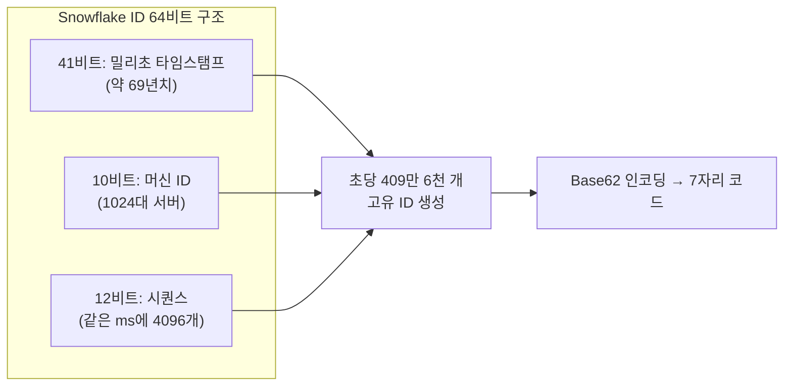
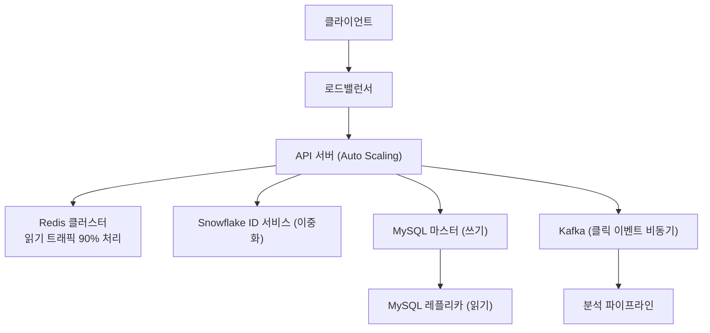
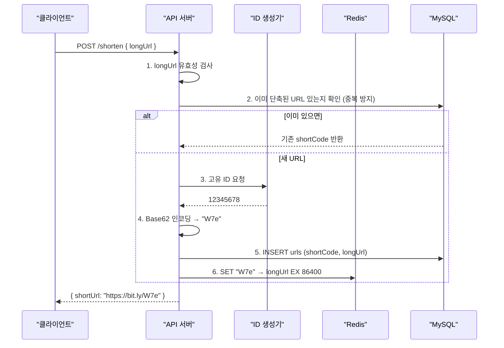
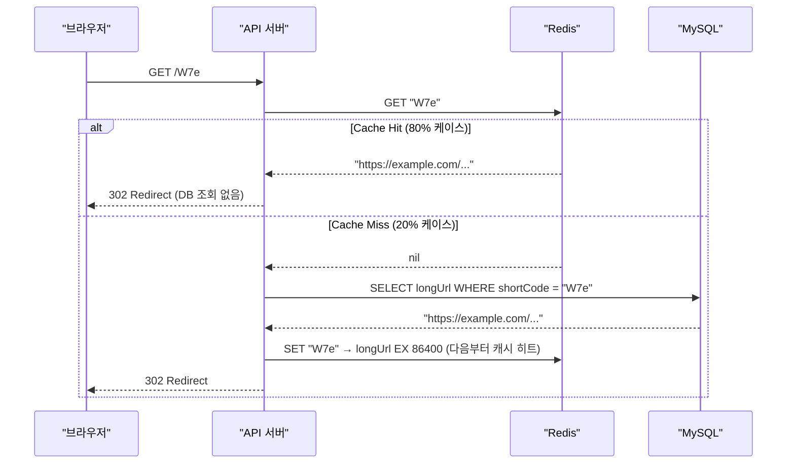
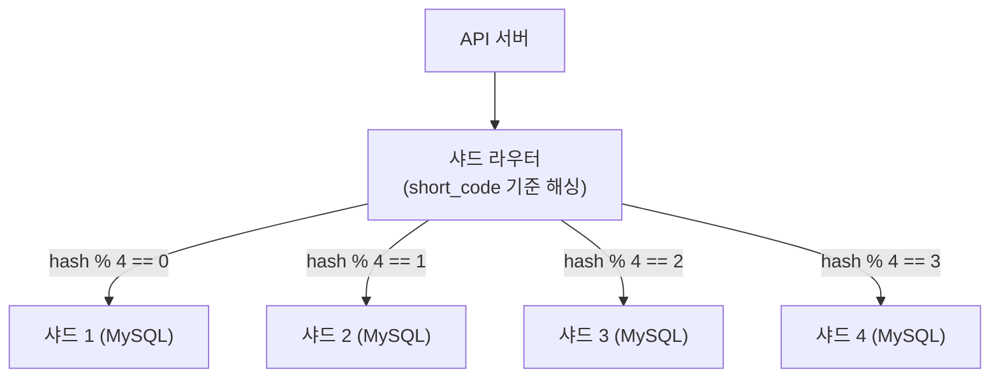
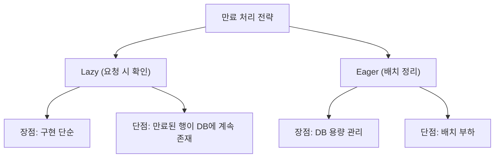
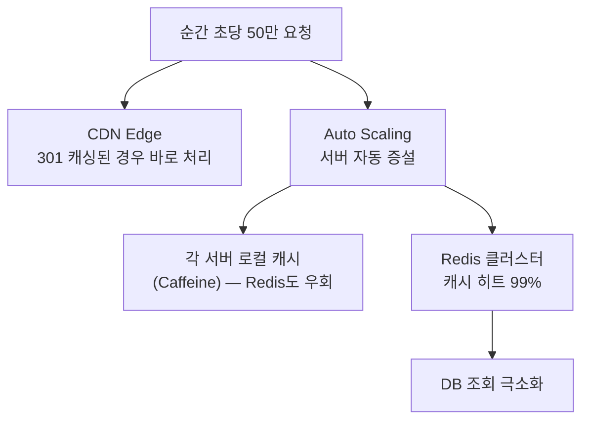

트위터가 140자 제한이었던 시절, `https://www.example.com/very/long/path?campaign=summer&source=newsletter&medium=email` 같은 URL은 그 자체로 트윗 대부분을 차지했다. bit.ly는 이 문제를 7글자로 해결했다. 단순해 보이지만, 초당 10만 건의 리다이렉트를 100ms 이내에 처리하고 수십 TB의 데이터를 수년간 관리하는 시스템이다. **"짧게 만든다"는 단순한 기능 뒤에 어떤 설계가 숨어있는가.**

## 요구사항 분석

### 기능 요구사항

1. 긴 URL을 입력하면 짧은 URL 생성
2. 짧은 URL로 접속하면 원래 URL로 리다이렉트
3. 사용자 지정 단축 URL 지원 (선택)
4. 링크 만료 기간 설정 (선택)

### 비기능 요구사항 — 왜 이 숫자가 중요한가

```
읽기:쓰기 = 100:1   → 리다이렉트가 대부분, 캐시 전략이 핵심
리다이렉트 100ms 이내 → 사용자가 링크를 클릭했는데 느리면 이탈
99.99% 가용성       → 연간 52분. 이 서비스가 죽으면 모든 bit.ly 링크가 404가 됨
```

### 규모 추정

```
일일 새 URL 생성:   1억 건
읽기:쓰기 비율  = 100:1
일일 리다이렉트:   100억 건

쓰기 QPS  = 1억 / 86,400 ≈ 1,160 QPS
읽기 QPS  = 1,160 × 100  = 116,000 QPS
피크 QPS  = 116,000 × 3  ≈ 350,000 QPS

URL 하나 크기:
  shortCode: 7B, longURL: 100B, 메타데이터: 30B → 약 137B

10년 저장량:
  1억 × 365 × 10 × 137B ≈ 50TB
```

---

## 핵심 설계: 7자리 코드를 어떻게 만드는가

> **비유**: 도서관의 책 청구기호와 같다. 수십만 권의 책에 각각 짧은 고유 번호를 부여하고, 그 번호만 알면 정확한 위치를 찾아갈 수 있다. 번호는 짧아야 하고, 절대 중복되어선 안 된다.

7자리로 얼마나 많은 URL을 표현할 수 있는가? **문자 집합 선택**이 핵심이다.

| 방식 | 문자 수 | 7자리 공간 |
|------|--------|----------|
| 숫자만 (0-9) | 10 | 1,000만 |
| Base62 (0-9, a-z, A-Z) | 62 | **3.5조** |
| Base64 (+ +, /) | 64 | 4.4조 |

Base62를 선택하는 이유: URL에서 특수문자 없이 3.5조 공간 확보. 10년치 1억 개/일로는 3,650억 개가 필요한데 충분하다.

### Base62 인코딩 원리

숫자(고유 ID)를 62진법으로 변환하는 것이다:

```python
CHARS = "0123456789abcdefghijklmnopqrstuvwxyzABCDEFGHIJKLMNOPQRSTUVWXYZ"

def encode(num: int) -> str:
    """고유 ID → Base62 문자열"""
    if num == 0:
        return CHARS[0]
    result = []
    while num > 0:
        result.append(CHARS[num % 62])
        num //= 62
    return ''.join(reversed(result))

# 12345678 → "W7e"
# 복호화: W=32, 7=7, e=40 → 32×62² + 7×62 + 40 = 12345678
```

### 고유 ID를 어떻게 만드는가 — Snowflake ID

Base62 인코딩은 "고유한 숫자"가 있어야 한다. 서버 20대가 동시에 같은 숫자를 생성하면 같은 단축 코드가 나온다. **Snowflake ID**가 이 문제를 해결한다:



만약 Snowflake 없이 UUID를 쓰면? UUID는 128비트라 Base62로 변환하면 22자리가 넘는다. "짧은" URL이 되지 않는다. 단순 AUTO_INCREMENT를 쓰면? 여러 서버에서 동시에 같은 번호가 나온다.

---

## 전체 아키텍처



---

## URL 단축 흐름 (쓰기)



---

## URL 리다이렉트 흐름 (읽기) — 왜 캐시가 필수인가

읽기 QPS가 116,000이다. 이 모두를 DB에서 처리하면 MySQL이 즉시 과부하된다. **캐시 히트율 80%**가 목표다:



### 301 vs 302 — 왜 bit.ly는 302를 쓰는가

| 구분 | 301 (영구) | 302 (임시) |
|------|-----------|-----------|
| 브라우저 캐싱 | O — 다음엔 서버 안 거침 | X — 매번 서버 거침 |
| 서버 부하 | 낮음 | 높음 |
| 클릭 추적 | **불가** — 브라우저가 직접 이동 | **가능** — 매번 서버 거쳐감 |

bit.ly의 수익은 클릭 분석 데이터다. 몇 명이 어디서 어떤 기기로 클릭했는지를 알아야 광고주에게 팔 수 있다. 그래서 302를 쓴다. 순수히 부하 최소화가 목표라면 301이 낫다.

---

## 데이터베이스 설계

```sql
CREATE TABLE urls (
    id          BIGINT      NOT NULL AUTO_INCREMENT,
    short_code  VARCHAR(7)  NOT NULL,
    long_url    VARCHAR(2048) NOT NULL,
    user_id     BIGINT,
    created_at  DATETIME    NOT NULL DEFAULT CURRENT_TIMESTAMP,
    expires_at  DATETIME,
    PRIMARY KEY (id),
    UNIQUE KEY uk_short_code (short_code),   -- 단축 코드 중복 방지
    INDEX idx_long_url (long_url(255)),       -- 동일 URL 재요청 시 빠른 조회
    INDEX idx_expires_at (expires_at)         -- 만료 배치 작업용
);
```

왜 `long_url`에 인덱스를 걸지 않으면 안 되는가? 같은 긴 URL을 두 번 단축 요청할 때 기존 코드를 반환해야 한다. 인덱스 없으면 매번 풀 스캔이다.

---

## 캐시 크기 계산

파레토 법칙: 상위 20% URL이 트래픽 80%를 처리한다.

```
전체 URL 수 = 1억 × 0.2 (상위 20%) = 2,000만 건
URL 하나 캐시 크기 = 7B + 100B = 107B
필요 메모리 = 2,000만 × 107B ≈ 2.1GB

→ Redis 서버 1대 (16GB)로 충분
```

캐시가 없다면? DB에 초당 116,000 쿼리. MySQL 커넥션 풀이 즉시 고갈된다.

---

## 확장성 — 언제 샤딩이 필요한가

10년 저장량이 50TB다. 단일 MySQL로는 한계가 있다. **Consistent Hashing**으로 샤딩하면 샤드 추가 시 데이터 이동을 최소화할 수 있다:



---

## URL 만료 처리



실무에서는 **두 가지 조합**: 요청 시 만료 확인(즉시 응답)  + 새벽 배치 정리(DB 정리).

```python
def redirect(short_code: str):
    url = db.query("SELECT long_url, expires_at FROM urls WHERE short_code = ?", short_code)
    if not url:
        raise NotFoundError()
    if url.expires_at and url.expires_at < datetime.now():
        raise GoneError()  # 410 Gone — 영구 삭제된 리소스
    return RedirectResponse(url.long_url, status_code=302)
```

---

<details class="extreme-scenario-details">
<summary class="extreme-scenario-summary">
<span class="extreme-scenario-icon">🔥</span>
<span class="extreme-scenario-label">극한 시나리오 — 클릭하여 펼치기</span>
<span class="extreme-scenario-toggle"></span>
</summary>
<div class="extreme-scenario-body">

<div class="extreme-scenario-content" markdown="1">

유명 방송에서 bit.ly 링크가 노출되면 순간 트래픽이 평상시 100배가 된다.



**Hot URL 사전 감지:**

```python
def record_access(short_code: str):
    redis.zincrby("hot_urls", 1, short_code)  # 클릭마다 점수 증가

# 매 5분마다 상위 1000개를 서버 로컬 메모리에 pre-loading
@scheduler.every(minutes=5)
def preload_hot_urls():
    for short_code, _ in redis.zrevrange("hot_urls", 0, 999, withscores=True):
        local_cache[short_code] = db.get(short_code)
```

이 패턴이 없으면? Redis에도 초당 50만 요청이 몰린다. Redis는 빠르지만 무한하지 않다.

---
</div>
</div>
</details>

## 설계 결정 요약

| 결정 | 선택 | 이유 |
|------|------|------|
| 코드 생성 | Snowflake + Base62 | 분산 환경 충돌 없음, 7자리 3.5조 공간 |
| 리다이렉트 | 302 (임시) | 클릭 추적 가능 |
| 캐시 | Redis Cluster | 읽기 116k QPS를 DB에서 분리 |
| DB | Aurora MySQL | ACID + 읽기 레플리카 |
| 클릭 추적 | Kafka 비동기 | 리다이렉트 응답 시간에 영향 없음 |
| 샤딩 | Consistent Hashing | 샤드 추가 시 재배치 최소화 |
