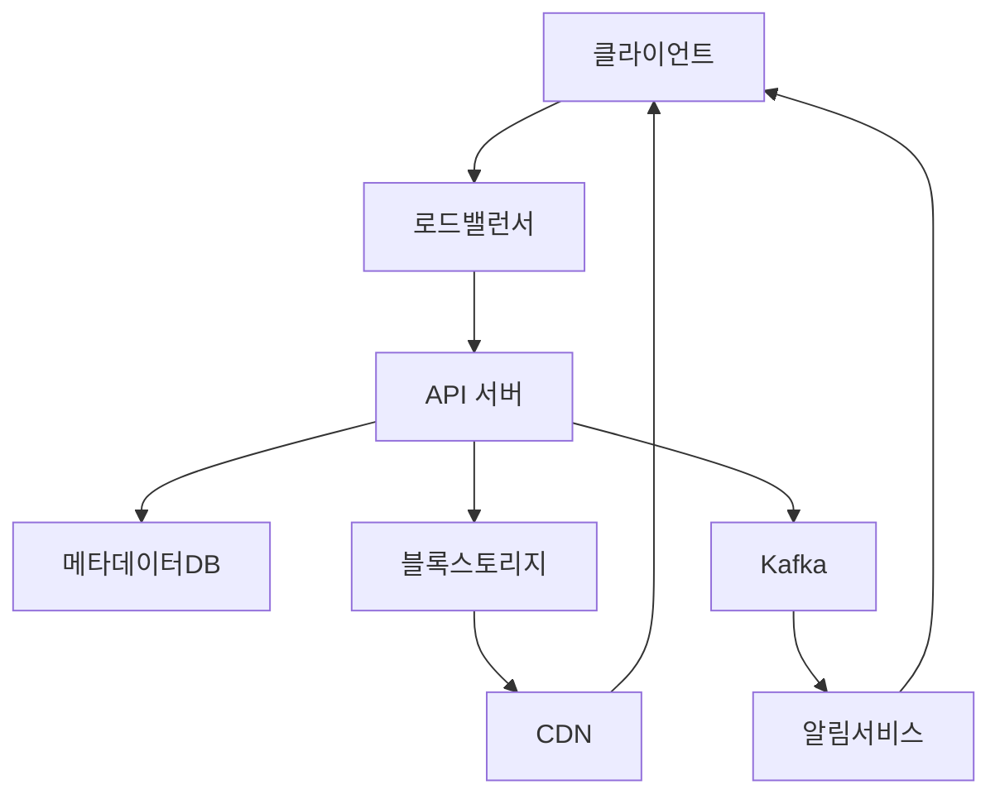
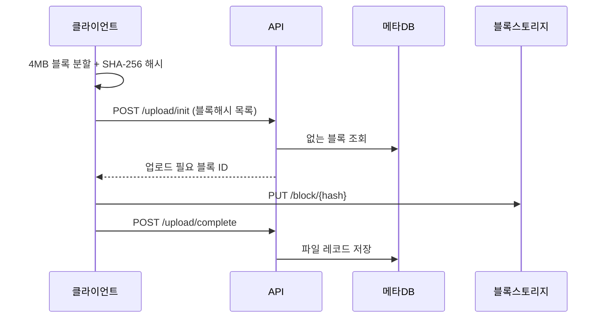
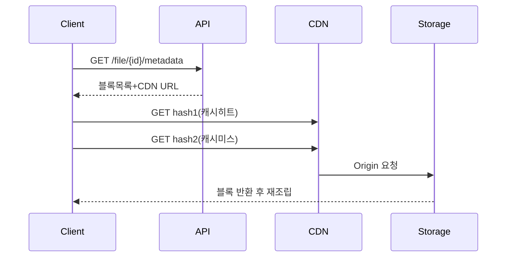
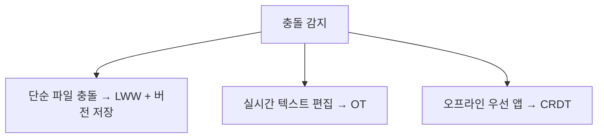
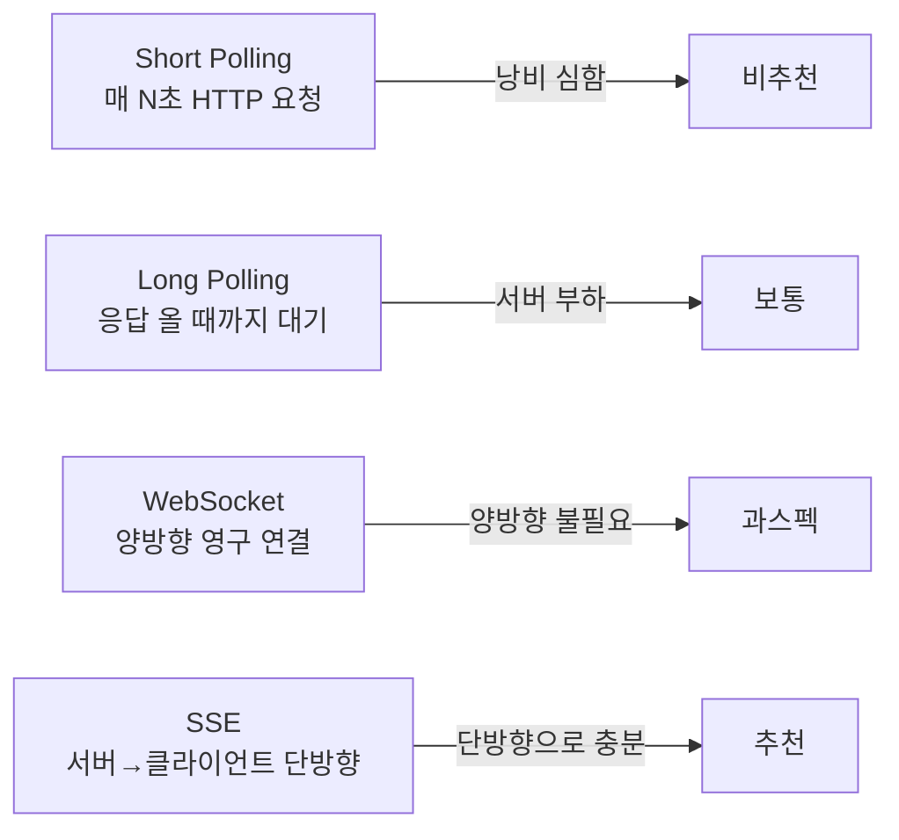
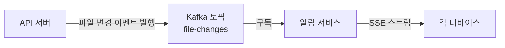
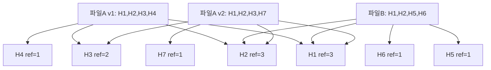
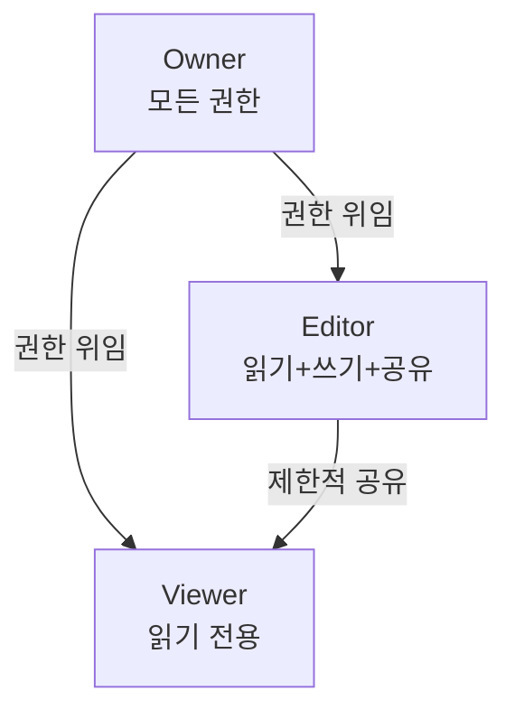

> **한 줄 요약**: 분산 파일 저장소의 핵심은 파일을 4MB 블록으로 쪼개 SHA-256 해시로 중복을 제거하고, 메타데이터 DB로 블록 조각을 추적하며, SSE/WebSocket으로 여러 디바이스에 변경을 실시간 전파하는 것이다.

## 실제 문제: Google Drive는 어떻게 5억 명의 파일을 저장할까?

2023년 기준 Google Drive에 저장된 데이터는 약 **15엑사바이트(EB)**를 넘는다고 알려져 있습니다. 이는 지구상 모든 인류가 생산한 인쇄물의 10배에 달하는 양입니다. 매일 수백만 명이 파일을 올리고, 팀과 공유하고, 다른 기기에서 동기화합니다.

이 시스템을 직접 만들어야 한다고 상상해 보세요. 단순히 파일을 디스크에 저장하는 것처럼 보이지만, 실제로는 엄청난 복잡도가 숨어 있습니다:

- 10GB짜리 영상 파일을 업로드하다 와이파이가 끊기면?
- 팀원 두 명이 동시에 같은 문서를 수정하면?
- 랜섬웨어가 계정의 모든 파일을 암호화하면?
- 사용자 1000만 명이 같은 영상 파일을 각자 복사본으로 업로드하면?

이 질문들이 곧 분산 파일 저장소 설계의 본질입니다.

---

## 1. 요구사항 분석 및 규모 추정

### 기능 요구사항

1. 파일 업로드 / 다운로드 / 삭제
2. 폴더 계층 구조 지원
3. 파일 공유 (링크 공유, 권한별 접근: Owner/Editor/Viewer)
4. 파일 버전 관리 (이전 버전 복원)
5. 멀티 디바이스 자동 동기화
6. 오프라인 편집 후 온라인 시 병합

### 비기능 요구사항

- 가용성: **99.99%** (연간 52분 이하 다운타임)
- 내구성: **99.999999999% (eleven nines)** — 파일은 절대 유실되지 않음
- 일관성: 같은 파일을 두 디바이스에서 보면 동일한 내용이어야 함
- 지연시간: 파일 목록 조회 **100ms 미만**, 다운로드는 CDN 활용

### 규모 추정

```
DAU: 5,000만 명
평균 파일 크기: 500KB
일일 업로드: 200만 건

--- 저장 용량 ---
1인 평균 저장 용량: 15GB (Google Drive 무료 한도)
총 사용자 수: 5억 명 (MAU 기준)
총 저장 용량: 5억 × 15GB = 7.5EB

--- 트래픽 ---
일일 업로드 200만 건 × 500KB = 1TB/일
업로드 QPS: 200만 / 86,400 ≈ 23 QPS (평균)
피크 업로드 QPS: 23 × 5 = 115 QPS

다운로드는 업로드의 10배 가정:
다운로드 QPS ≈ 230 QPS (평균)
피크 다운로드 QPS ≈ 1,150 QPS

--- 블록 단위 분할 기준 ---
파일 1개 = 4MB 블록으로 분할
500KB 파일 → 1블록
1GB 파일 → 256블록
10GB 파일 → 2,560블록
```

> **비유:** 블록 분할은 마치 이사할 때 짐을 **이삿짐 박스**에 나눠 담는 것과 같습니다. 소파를 통째로 들고 좁은 계단을 오르는 대신, 분해해서 각 부품을 따로 옮기면 한 박스가 계단에서 떨어져도 나머지는 안전합니다. 파일도 마찬가지로 블록 단위로 관리하면 특정 블록만 재전송하면 됩니다.

---

## 2. 고수준 아키텍처

### 전체 구성 요소



각 구성 요소의 역할은 다음과 같습니다:

1️⃣ **API 서버**: 파일 업로드/다운로드 요청 처리, 인증, 권한 검사, 청크 조율

2️⃣ **메타데이터 DB**: 파일명, 경로, 블록 목록, 버전, 공유 권한 등 파일의 "설명서" 저장

3️⃣ **블록 스토리지**: 실제 파일 데이터를 4MB 단위 블록으로 저장하는 오브젝트 스토리지 (AWS S3 호환)

4️⃣ **알림 서비스**: 파일 변경 이벤트를 다른 디바이스에 실시간 전파

5️⃣ **CDN**: 자주 다운로드되는 파일을 엣지 서버에 캐시해 지연시간 최소화

---

## 3. 파일 업로드 흐름 — 청크 업로드

### 왜 청크(Chunk) 업로드가 필요한가?

> **비유:** 대용량 파일을 통째로 업로드하는 것은 마치 **서울에서 부산까지 걸어서** 택배를 배달하는 것과 같습니다. 중간에 발목을 삐면 처음부터 다시 걸어야 합니다. 하지만 KTX를 타고 구간별로 나눠 이동하면, 한 구간에서 문제가 생겨도 그 구간만 다시 이동하면 됩니다.

10GB 파일을 한 번에 업로드할 경우, 9.9GB를 보내다가 네트워크가 끊기면 처음부터 다시 시작해야 합니다. 청크 업로드는 이를 방지합니다.

### 업로드 흐름 상세



### 중복 제거(Deduplication)의 마법

업로드 초기화 단계에서 클라이언트가 블록 해시 목록을 서버에 보내면, 서버는 **이미 저장된 블록은 재업로드하지 않아도 됩니다.** 이것이 블록 단위 중복 제거입니다.

예를 들어 회사 전체가 같은 100MB PowerPoint 템플릿을 각자 Drive에 저장하면, 첫 번째 사람만 실제로 업로드하고 나머지 999명은 해시 매핑만 추가하면 됩니다. 실제 스토리지 절감율은 **평균 40% 이상**으로 알려져 있습니다.

```python
# 클라이언트 측 블록 처리 의사 코드
def prepare_upload(file_path):
    blocks = []
    with open(file_path, 'rb') as f:
        while chunk := f.read(4 * 1024 * 1024):  # 4MB
            block_hash = hashlib.sha256(chunk).hexdigest()
            blocks.append({
                'hash': block_hash,
                'size': len(chunk),
                'data': chunk  # 메모리에 유지 (업로드 전까지)
            })
    return blocks

def upload_file(file_path):
    blocks = prepare_upload(file_path)
    hash_list = [b['hash'] for b in blocks]

    # 서버에 어떤 블록이 필요한지 확인
    response = api.post('/upload/init', {'hashes': hash_list})
    needed_hashes = set(response['needed'])

    # 필요한 블록만 업로드
    for block in blocks:
        if block['hash'] in needed_hashes:
            storage.put(f"/block/{block['hash']}", block['data'])

    # 파일 메타데이터 등록
    api.post('/upload/complete', {
        'name': file_path.name,
        'blocks': hash_list
    })
```

### 재개 가능 업로드(Resumable Upload)

네트워크 단절 시 클라이언트는 서버에 "어디까지 받았냐"를 물어볼 수 있습니다. 서버는 업로드 세션 상태를 유지해 이미 받은 블록 목록을 응답합니다. 클라이언트는 남은 블록만 재전송하면 됩니다.

```
GET /upload/{session_id}/status
→ { "received_blocks": ["hash1", "hash2", ...], "missing": ["hash7", ...] }
```

---

## 4. 파일 다운로드 흐름 — 블록 재조립

### 다운로드 순서



### CDN 활용 전략

자주 다운로드되는 파일(예: 공유된 영상, 인기 문서)은 CDN 엣지에 캐시됩니다. 블록 단위 저장의 장점이 여기서도 발휘됩니다. 같은 블록(동일 해시)이 여러 파일에 공유되면 CDN에 한 번만 올라가도 됩니다.

> **비유:** CDN은 마치 **동네 편의점**입니다. 자주 사는 물건(인기 파일 블록)은 편의점에 미리 갖다 놓고, 희귀한 물건만 창고(원본 스토리지)에서 가져옵니다. 고객(클라이언트)은 창고까지 갈 필요 없이 근처 편의점에서 바로 받을 수 있어 훨씬 빠릅니다.

---

## 5. 파일 동기화 — 충돌 해결 전략

### 동기화의 어려움

> **비유:** 두 사람이 동시에 같은 화이트보드에 서로 다른 내용을 적는다고 생각해보세요. 한 명이 "회의 날짜: 수요일"이라고 쓰는 동안 다른 사람이 "회의 날짜: 목요일"이라고 지우고 다시 씁니다. 누구의 내용이 맞을까요? 이것이 분산 시스템의 **충돌(Conflict)** 문제입니다.

### 전략 1: Last Writer Wins (LWW)

가장 단순한 전략입니다. 마지막으로 저장한 사람의 버전이 이깁니다. 타임스탬프를 비교해 나중 것을 채택합니다.

- **장점**: 구현 단순, 오버헤드 없음
- **단점**: 이전 편집자의 작업이 **완전히 소실**됨
- **사용처**: Dropbox 기본 동작, S3 오브젝트 덮어쓰기

```
파일 A - 사용자1 수정: 14:01:00 → "수요일"
파일 A - 사용자2 수정: 14:01:05 → "목요일"
결과: "목요일" 채택 (사용자1 작업 소실)
```

### 전략 2: Operational Transform (OT)

Google Docs가 사용하는 방식입니다. 두 편집 연산을 수학적으로 변환해 합칩니다.

- **장점**: 두 사람의 편집이 모두 보존됨
- **단점**: 구현 매우 복잡, 중앙 서버 필요
- **사용처**: Google Docs, Notion

```
사용자1: "Hello" → "Hello World" (위치 5에 " World" 삽입)
사용자2: "Hello" → "Hello!" (위치 5에 "!" 삽입)

OT 변환 결과:
사용자1의 연산을 사용자2 연산 이후로 조정:
→ "Hello! World" (두 삽입 모두 반영)
```

### 전략 3: CRDT (Conflict-free Replicated Data Type)

수학적으로 충돌이 발생하지 않도록 설계된 자료구조입니다. 중앙 서버 없이 P2P 동기화도 가능합니다.

- **장점**: 중앙 조율 서버 불필요, 오프라인 동기화 자연스럽게 처리
- **단점**: 데이터 구조 복잡, 특정 연산(삭제) 처리 까다로움
- **사용처**: Figma, Linear, Apple Notes

### Google Drive의 실제 선택

Google Drive는 파일 단위로는 **LWW + 버전 이력 보존**을 사용합니다. 즉, 충돌 시 두 버전 모두 저장하고 사용자에게 선택권을 줍니다. Google Docs (실시간 편집)은 OT를 사용합니다.



---

## 6. 메타데이터 DB 설계

### 왜 메타데이터가 중요한가?

블록 스토리지에는 그냥 SHA-256 해시 이름으로 된 바이너리 덩어리들만 있습니다. **이 블록들이 어떤 파일인지, 어떤 순서로 조립해야 하는지, 누가 접근 가능한지**는 모두 메타데이터 DB가 알고 있습니다. 블록 스토리지가 창고라면, 메타데이터 DB는 창고 목록표입니다.

### 핵심 테이블 스키마

**users 테이블**
```sql
CREATE TABLE users (
    id          BIGINT PRIMARY KEY AUTO_INCREMENT,
    email       VARCHAR(255) UNIQUE NOT NULL,
    quota_bytes BIGINT NOT NULL DEFAULT 16106127360, -- 15GB
    used_bytes  BIGINT NOT NULL DEFAULT 0,
    created_at  DATETIME NOT NULL
);
```

**files 테이블**
```sql
CREATE TABLE files (
    id          BIGINT PRIMARY KEY AUTO_INCREMENT,
    user_id     BIGINT NOT NULL,
    parent_id   BIGINT,           -- NULL이면 루트 폴더
    name        VARCHAR(512) NOT NULL,
    mime_type   VARCHAR(128),
    size_bytes  BIGINT NOT NULL DEFAULT 0,
    is_folder   BOOLEAN NOT NULL DEFAULT FALSE,
    is_deleted  BOOLEAN NOT NULL DEFAULT FALSE,
    created_at  DATETIME NOT NULL,
    updated_at  DATETIME NOT NULL,
    INDEX idx_user_parent (user_id, parent_id),
    INDEX idx_updated (updated_at)
);
```

**file_versions 테이블**
```sql
CREATE TABLE file_versions (
    id          BIGINT PRIMARY KEY AUTO_INCREMENT,
    file_id     BIGINT NOT NULL,
    version_num INT NOT NULL,
    size_bytes  BIGINT NOT NULL,
    created_by  BIGINT NOT NULL,
    created_at  DATETIME NOT NULL,
    UNIQUE KEY uq_file_version (file_id, version_num)
);
```

**blocks 테이블**
```sql
CREATE TABLE blocks (
    hash        CHAR(64) PRIMARY KEY,  -- SHA-256 hex
    size_bytes  INT NOT NULL,
    ref_count   INT NOT NULL DEFAULT 0, -- 참조 카운트 (중복 제거 핵심)
    storage_key VARCHAR(512) NOT NULL,  -- S3 오브젝트 키
    created_at  DATETIME NOT NULL
);
```

**version_blocks 테이블 (파일 버전 ↔ 블록 매핑)**
```sql
CREATE TABLE version_blocks (
    version_id  BIGINT NOT NULL,
    block_seq   INT NOT NULL,     -- 블록 순서 (재조립에 사용)
    block_hash  CHAR(64) NOT NULL,
    PRIMARY KEY (version_id, block_seq),
    INDEX idx_hash (block_hash)
);
```

**shares 테이블**
```sql
CREATE TABLE shares (
    id          BIGINT PRIMARY KEY AUTO_INCREMENT,
    file_id     BIGINT NOT NULL,
    grantee_id  BIGINT,           -- NULL이면 링크 공유
    permission  ENUM('viewer','editor','owner') NOT NULL,
    token       VARCHAR(64),      -- 링크 공유 토큰
    expires_at  DATETIME,         -- 만료 시각
    created_at  DATETIME NOT NULL,
    INDEX idx_file (file_id),
    INDEX idx_token (token)
);
```

### 읽기 성능 최적화

파일 목록 조회(폴더 내 파일 나열)는 가장 빈번한 쿼리입니다. `(user_id, parent_id)` 복합 인덱스로 O(1) 수준으로 조회할 수 있습니다.

블록 조회는 해시 기반이라 PRIMARY KEY 조회이므로 별도 인덱스가 필요 없습니다.

---

## 7. 버전 관리 — 스냅샷 vs 델타

### 스냅샷 방식

파일이 수정될 때마다 전체 블록 목록을 새 버전으로 저장합니다.

> **비유:** 스냅샷은 사진을 매번 새로 찍는 것과 같습니다. 변한 부분이 1%뿐이어도 100% 전체를 새로 찍습니다. 복원은 쉽지만(그냥 그 사진을 보면 됨), 저장 비용이 큽니다.

- **장점**: 특정 시점 복원이 즉시 가능, 구현 단순
- **단점**: 저장 비용이 높음 (블록 단위 중복 제거로 완화 가능)

### 델타 방식

변경된 블록만 저장하고, 버전 간 차이(diff)를 체인으로 연결합니다.

> **비유:** 델타는 일기를 쓸 때 "어제와 달라진 점만" 기록하는 것입니다. 저장 공간은 적지만, 5년 전 일기를 보려면 모든 변경 이력을 순차적으로 따라가야 합니다.

- **장점**: 저장 비용 대폭 절감
- **단점**: 특정 시점 복원 시 델타 체인 전체를 다시 계산해야 함

### Google Drive의 실제 접근

블록 단위 저장이 자연스럽게 델타 방식을 구현해줍니다. 파일이 수정되면 변경된 블록만 해시가 달라지고, 나머지 블록은 그대로 재사용됩니다.

```
v1: [hash_A, hash_B, hash_C, hash_D]
v2: [hash_A, hash_B, hash_E, hash_D]  ← hash_C만 hash_E로 교체
→ 실제로 새로 저장된 블록: hash_E 하나뿐
→ 나머지 3개 블록은 v1과 공유
```

### 버전 정책

무한정 모든 버전을 보존하면 저장 비용이 무한히 증가합니다. 실용적인 정책은 다음과 같습니다:

- 최근 30일: 모든 버전 보존
- 30일~1년: 일 단위 스냅샷만 보존 (시간별 삭제)
- 1년 이상: 월 단위 스냅샷만 보존

---

## 8. 알림 서비스 — 디바이스 간 변경 전파

### 왜 알림이 중요한가?

노트북에서 파일을 수정하면, 스마트폰의 Drive 앱에서도 변경된 버전이 보여야 합니다. 이것은 단순한 알림이 아니라 **분산 시스템의 이벤트 전파** 문제입니다.

### 방식 비교



### SSE(Server-Sent Events) 선택 이유

파일 변경 알림은 **서버 → 클라이언트** 단방향 이벤트입니다. 클라이언트가 서버에 "나도 변경했어"를 알리는 건 별도 HTTP 요청으로 처리합니다. 따라서 양방향 WebSocket은 과스펙이고, SSE가 더 적합합니다.

```
클라이언트 → 서버: HTTP 연결 유지 (SSE 구독)
서버 → 클라이언트: text/event-stream 형식으로 이벤트 푸시

이벤트 형식:
data: {"event":"file_updated","file_id":12345,"version":7}
data: {"event":"file_created","parent_id":100,"file_id":12346}
```

### Kafka를 통한 알림 파이프라인



Kafka를 중간에 두면 API 서버와 알림 서비스가 분리되어, 트래픽 급증 시 알림 서비스만 독립적으로 스케일 아웃할 수 있습니다.

---

## 9. 저장소 계층 — Hot/Warm/Cold 자동 티어링

### 저장 비용의 현실

모든 파일을 SSD에 저장하면 성능은 최고지만 비용이 폭발합니다. 실제로 대부분의 파일은 업로드 후 30일이 지나면 거의 접근되지 않습니다. 저장 계층을 나눠 비용을 최적화해야 합니다.

> **비유:** 파일 티어링은 식당의 **메뉴 진열**과 같습니다. 가장 많이 팔리는 메뉴는 주방 바로 앞(Hot, SSD), 계절 메뉴는 냉장고(Warm, HDD), 작년 메뉴는 창고(Cold, Glacier). 손님(클라이언트)이 주문하면 어디서 가져오든 같은 음식이지만, 창고에서 가져오면 시간이 좀 더 걸립니다.

### 티어 정의

| 계층 | 스토리지 | 접근 시간 | 비용 | 대상 |
|------|----------|-----------|------|------|
| Hot | SSD (NVMe) | 1-10ms | 높음 | 최근 7일 내 접근 파일 |
| Warm | HDD (SATA) | 50-100ms | 중간 | 7일~6개월 |
| Cold | S3 Glacier | 분~시간 | 매우 낮음 | 6개월 이상 미접근 |

### 자동 티어링 구현

파일 접근 시 `last_accessed_at`을 업데이트하고, 주기적인 배치 잡이 오래된 파일을 하위 계층으로 이동합니다.

```python
# 일 1회 실행되는 티어링 배치 잡 (의사 코드)
def auto_tier_down():
    now = datetime.utcnow()

    # Warm으로 이동 (7일 이상 미접근)
    hot_to_warm = db.query("""
        SELECT block_hash FROM block_locations
        WHERE tier = 'hot' AND last_accessed_at < NOW() - INTERVAL 7 DAY
    """)
    for block in hot_to_warm:
        storage.copy(block.hash, from_tier='hot', to_tier='warm')
        db.update_tier(block.hash, 'warm')

    # Cold로 이동 (6개월 이상 미접근)
    warm_to_cold = db.query("""
        SELECT block_hash FROM block_locations
        WHERE tier = 'warm' AND last_accessed_at < NOW() - INTERVAL 180 DAY
    """)
    for block in warm_to_cold:
        storage.copy(block.hash, from_tier='warm', to_tier='cold')
        db.update_tier(block.hash, 'cold')
```

Cold 계층에서 파일을 요청하면 즉시 반환 대신 "복원 중" 상태를 알려주고, 몇 분 후 다운로드 준비가 되면 SSE로 알립니다.

---

## 10. 중복 제거(Deduplication) 심화

### 블록 레벨 중복 제거

같은 해시를 가진 블록은 스토리지에 한 번만 저장됩니다. `blocks` 테이블의 `ref_count`가 이를 추적합니다.



### 파일 삭제 시 가비지 컬렉션

파일을 삭제하면 즉시 블록을 삭제하지 않습니다. `ref_count`를 줄이고, `ref_count = 0`인 블록을 주기적인 GC 잡이 실제 스토리지에서 삭제합니다.

```python
def delete_file_version(version_id):
    # 트랜잭션 내에서
    blocks = db.query("SELECT block_hash FROM version_blocks WHERE version_id = ?", version_id)
    for block_hash in blocks:
        db.execute("UPDATE blocks SET ref_count = ref_count - 1 WHERE hash = ?", block_hash)
    db.execute("DELETE FROM version_blocks WHERE version_id = ?", version_id)
    db.execute("DELETE FROM file_versions WHERE id = ?", version_id)
    # ref_count = 0인 블록은 GC 잡이 나중에 처리
```

### 절감 효과

실제 Google Drive 내부 데이터(추정)에 따르면:
- 개인 파일의 블록 중복률: **약 15-20%** (같은 사진 여러 폴더에 복사 등)
- 기업 환경(같은 회사 사람들이 공통 문서 많음): **약 40-60%**
- 전체 스토리지 절감: 평균 **40% 수준**

---

## 11. 보안 — E2E 암호화, 공유 링크, 권한 모델

### E2E(End-to-End) 암호화

서버는 파일 내용을 **읽을 수 없어야** 합니다. 진정한 E2E 암호화 구현 방식:

1️⃣ 클라이언트가 파일별 고유 **대칭키(AES-256)** 생성

2️⃣ 대칭키로 파일 암호화 후 업로드

3️⃣ 대칭키를 사용자의 **공개키(RSA-2048)**로 암호화해 서버에 저장

4️⃣ 다운로드 시 클라이언트가 자신의 **개인키**로 대칭키를 복호화 → 파일 복호화

```
서버가 저장하는 것: 암호화된 파일 블록 + 암호화된 대칭키
서버가 모르는 것: 실제 파일 내용, 대칭키 원문
→ 서버가 해킹당해도 파일 내용 노출 안 됨
```

**단점**: 비밀번호를 잊으면 파일 영구 복호화 불가능. Keybase, ProtonDrive가 이 방식을 사용합니다.

### 공유 링크 보안

링크 공유 시 `token`은 암호학적으로 안전한 난수여야 합니다. 짧은 토큰(6자리 등)은 브루트포스 공격에 취약합니다.

```sql
-- 보안 토큰 생성
token = base64url(random_bytes(32))  -- 43자, 충분히 예측 불가

-- 만료 시각 필수
expires_at = NOW() + INTERVAL 7 DAY

-- 접근 횟수 제한 (선택)
max_downloads = 10
download_count = 0
```

### 권한 모델 (Owner / Editor / Viewer)



| 권한 | 읽기 | 수정 | 삭제 | 공유 | 권한 변경 |
|------|------|------|------|------|-----------|
| Owner | O | O | O | O | O |
| Editor | O | O | X | O (Viewer만) | X |
| Viewer | O | X | X | X | X |

권한 조회는 모든 API 요청마다 발생하므로 Redis에 캐시합니다:

```
CACHE KEY: "perm:{file_id}:{user_id}"
CACHE VALUE: "viewer" / "editor" / "owner" / "none"
TTL: 5분 (권한 변경 시 즉시 무효화)
```

---

## 12. 극한 시나리오

### 시나리오 1: 10GB 파일 업로드 중 네트워크 끊김

**발생 상황**: 사용자가 큰 영상 파일을 업로드하다가 지하철 터널에 들어가 와이파이가 끊겼습니다.

**나쁜 설계**: 단일 HTTP POST로 전체 파일 전송 → 연결 끊기면 처음부터 재시작

**올바른 설계**:

1️⃣ 업로드 시작 시 서버가 `session_id` 발급 (유효기간 48시간)

2️⃣ 클라이언트는 블록 단위로 업로드하며 진행 상황을 로컬에 저장

3️⃣ 네트워크 재연결 시 서버에 `GET /upload/{session_id}/status` 요청

4️⃣ 서버가 받은 블록 목록 반환 → 클라이언트가 남은 블록만 재전송

5️⃣ 모든 블록 수신 완료 시 파일 레코드 생성

```
시간: 0분 — 2,560개 블록 중 0번부터 업로드 시작
시간: 15분 — 1,200번 블록 전송 중 연결 끊김
시간: 20분 — 재연결, 서버에 상태 조회
서버 응답: "1,199번까지 수신 완료, 1,200번부터 재전송하세요"
→ 전체의 53%를 버리지 않고 재활용
```

### 시나리오 2: 두 사람이 동시에 같은 문서를 오프라인 편집

**발생 상황**: Alice와 Bob이 비행기에서 오프라인으로 같은 보고서를 각자 수정했습니다. 착륙 후 둘 다 동기화를 시도합니다.

**나쁜 설계**: 마지막 동기화 요청이 이기고 이전 것을 덮어씀 → Alice나 Bob의 작업이 소실

**올바른 설계**:

1️⃣ 각 클라이언트는 오프라인 편집을 로컬 로그에 기록 (벡터 클록 포함)

2️⃣ 동기화 시 서버는 두 버전의 공통 조상(LCA, Lowest Common Ancestor)을 찾음

3️⃣ 3-way merge를 시도:
- 충돌 없는 변경: 자동 병합
- 충돌 발생: 두 버전을 모두 저장 후 사용자에게 선택 요청

4️⃣ 사용자 알림: "Alice와 Bob이 동시에 수정했습니다. 버전을 선택하세요"

```
공통 조상: v3 (비행기 탑승 전 마지막 동기화)
Alice 수정: 1페이지 수정
Bob 수정: 3페이지 수정
→ 1페이지와 3페이지 모두 다름: 3-way merge 성공, 자동 병합

Alice 수정: 2페이지 결론 → "매출 증가"
Bob 수정: 2페이지 결론 → "매출 감소"
→ 같은 위치 충돌: 두 버전 모두 보존, 사용자 판단 요청
```

### 시나리오 3: 랜섬웨어가 계정의 모든 파일을 암호화

**발생 상황**: 사용자 PC에 랜섬웨어가 감염되어 Drive 동기화 폴더의 모든 파일을 암호화한 후, 암호화된 파일을 Drive에 동기화했습니다.

**나쁜 설계**: 실시간 동기화 → 모든 파일이 암호화된 버전으로 덮어써지고 이전 버전은 삭제됨

**올바른 설계 (다층 방어)**:

1️⃣ **버전 이력 보존**: 최소 30일 이전 버전 자동 보관 → 감염 전 버전으로 롤백 가능

2️⃣ **이상 탐지**: 단시간에 대량 파일이 변경되면 자동 동기화 일시 중단

```python
def check_ransomware_pattern(user_id, changes_in_last_minute):
    # 1분에 100개 이상 파일이 변경되면 경고
    if len(changes_in_last_minute) > 100:
        suspend_sync(user_id)
        notify_user(user_id, "비정상적인 파일 변경이 감지되었습니다")
        return True

    # 엔트로피 기반 탐지: 암호화된 파일은 엔트로피가 높음
    for change in changes_in_last_minute:
        if calculate_entropy(change.new_blocks) > 7.9:  # 최대 8.0
            flag_for_review(change)
```

3️⃣ **격리된 스냅샷**: Cold 계층의 스냅샷은 read-only, 앱에서 직접 삭제 불가

4️⃣ **복구 절차**: 감염 시점 이전 버전을 대량 롤백하는 관리 도구 제공

---

## 13. 면접 포인트 5가지

### 1. "왜 블록을 4MB로 쪼개나요? 1KB나 100MB는 안 되나요?"

**답변 핵심**: 블록 크기는 **메타데이터 오버헤드 vs 재전송 비용의 트레이드오프**입니다.

- **너무 작게 (1KB)**: 블록 수가 폭발적 증가 → `version_blocks` 테이블에 수백만 행 → 메타데이터 DB 병목
- **너무 크게 (100MB)**: 네트워크 끊김 시 재전송 비용이 큼, 작은 파일 변경에도 전체 블록 재업로드
- **4MB**: Google Drive, Dropbox가 실제로 사용하는 값. 1GB 파일 = 256블록 (메타데이터 관리 가능), 재전송 비용도 수용 가능한 수준

### 2. "메타데이터 DB로 왜 MySQL인가요? NoSQL이 낫지 않나요?"

**답변 핵심**: 파일 시스템은 **폴더 계층 구조와 권한 검사**에 복잡한 조인이 필요합니다.

- 권한 체인 조회 (파일 → 부모 폴더 → 상위 폴더 순서로 권한 상속 확인)는 트랜잭션과 조인이 필수
- 블록의 `ref_count` 업데이트는 **ACID 트랜잭션** 없이는 경쟁 조건 발생
- 결론: 메타데이터는 MySQL, 실제 블록 데이터는 S3 (NoSQL의 장점) — **용도에 맞게 분리**

### 3. "중복 제거를 서버 사이드에서 하면 개인정보 문제가 있지 않나요?"

**답변 핵심**: **Client-side deduplication vs Server-side deduplication** 트레이드오프입니다.

- 서버 사이드: 블록을 받기 전에 해시만으로 "이미 있다"고 판단 → 악의적 사용자가 해시값만 알면 실제 파일을 업로드하지 않고도 다운로드 가능 (Proof-of-Ownership 문제)
- 해결책: 서버가 "해시가 있어도 이 사용자가 파일을 실제로 소유하는지" 별도 검증 후 중복 처리 (Challenge-Response)
- E2E 암호화 시 같은 파일도 사용자마다 다른 키로 암호화되어 해시가 달라짐 → 서버 사이드 중복 제거 불가

### 4. "파일 버전이 30개 쌓이면 어떻게 스토리지를 관리하나요?"

**답변 핵심**: **블록 공유 + 만료 정책**의 조합입니다.

- 버전 간 공통 블록은 공유되므로 실제 추가 저장 공간은 변경된 블록뿐
- 예: 10MB 문서를 30번 저장해도 매번 1%만 수정했다면 추가 저장: 10MB × 1% × 30 = 3MB
- 오래된 버전은 자동 삭제 정책으로 스토리지 상한 설정
- 유료 플랜은 더 많은 버전 이력 제공 (수익화 전략과 연결)

### 5. "동기화 클라이언트가 서버 변경을 어떻게 감지하나요? 폴링은 낭비 아닌가요?"

**답변 핵심**: **SSE + 델타 동기화**의 조합이 정답입니다.

- SSE 연결 유지 상태에서 서버가 "파일 ID X가 버전 7로 바뀌었다"는 이벤트만 푸시
- 클라이언트는 해당 파일의 메타데이터만 조회 → 변경된 블록 목록 확인 → 바뀐 블록만 다운로드
- 전체 폴더를 주기적으로 폴링하는 것 대비 트래픽을 **95% 이상 절감**
- 클라이언트가 오프라인 상태였다가 돌아오면 "마지막 동기화 이후 변경된 파일 목록" API로 일괄 처리

---

## 14. 실무에서 자주 하는 실수

### 실수 1: 파일 경로를 하드코딩

`/user/12345/documents/report.pdf` 방식으로 경로를 스토리지 키로 사용하면, 파일 이름 변경이나 폴더 이동 시 스토리지 객체를 실제로 이동해야 합니다. 블록 단위 저장에서는 경로와 스토리지 키를 분리해야 합니다. 경로는 메타데이터 DB에만 존재하고, 스토리지 키는 `SHA-256 해시`입니다.

### 실수 2: 버전 삭제 시 즉시 블록 삭제

여러 파일 버전이 같은 블록을 참조할 수 있습니다. 한 버전을 삭제할 때 즉시 블록을 지우면 다른 버전이 손상됩니다. 반드시 `ref_count` 기반 가비지 컬렉션을 사용해야 합니다.

### 실수 3: 공유 링크에 만료 시각 미설정

만료되지 않는 공유 링크는 한 번 유출되면 영구적으로 접근 가능합니다. 기본 만료는 7일로 설정하고, 사용자가 연장할 수 있도록 해야 합니다.

### 실수 4: 업로드 QPS와 다운로드 QPS를 같게 설계

다운로드는 업로드보다 10-50배 많습니다. 읽기 경로(CDN, 블록 스토리지 읽기 복제)를 쓰기 경로와 독립적으로 스케일 아웃해야 합니다.

### 실수 5: 메타데이터 DB를 단일 인스턴스로 운영

메타데이터 DB는 모든 파일 조회, 권한 확인, 블록 목록 조회의 단일 진입점입니다. 읽기 복제(Read Replica)를 두고, 핫 데이터(최근 파일, 공유 파일)는 Redis에 캐시해야 합니다.

---

## 마무리: 설계의 핵심 원칙

분산 파일 저장소 설계에서 배울 수 있는 세 가지 핵심 원칙을 정리합니다.

첫째, **데이터를 콘텐츠 기반으로 식별하라(Content-Addressable Storage)**. 파일 이름이나 경로 대신 내용의 해시를 주소로 사용하면, 중복 제거·무결성 검증·캐시 최적화가 자연스럽게 따라옵니다.

둘째, **메타데이터와 실제 데이터를 분리하라**. 조회 패턴이 다른 두 종류의 데이터를 같은 저장소에 넣으면 둘 다 최적화하기 어렵습니다. 메타데이터는 RDBMS, 블록은 오브젝트 스토리지로 역할을 명확히 분리해야 합니다.

셋째, **실패를 가정하고 설계하라**. 네트워크는 끊어지고, 동시 편집은 충돌하고, 랜섬웨어는 존재합니다. 이 모든 상황에서 데이터를 보호하려면 재개 가능 업로드, 버전 이력, 이상 탐지가 선택이 아닌 필수입니다.
