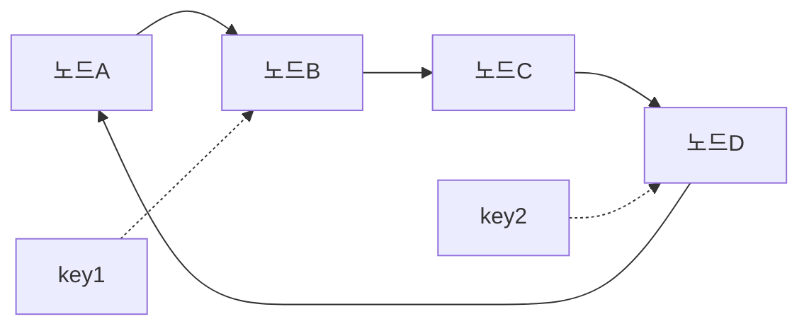
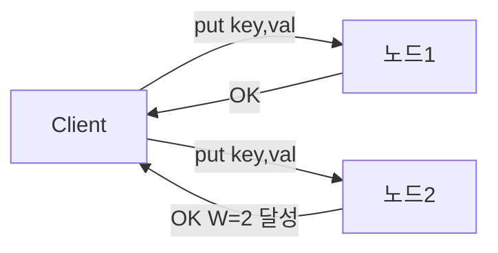
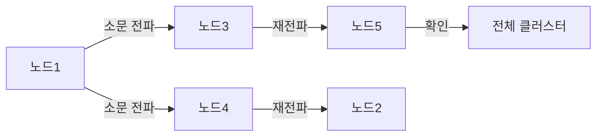
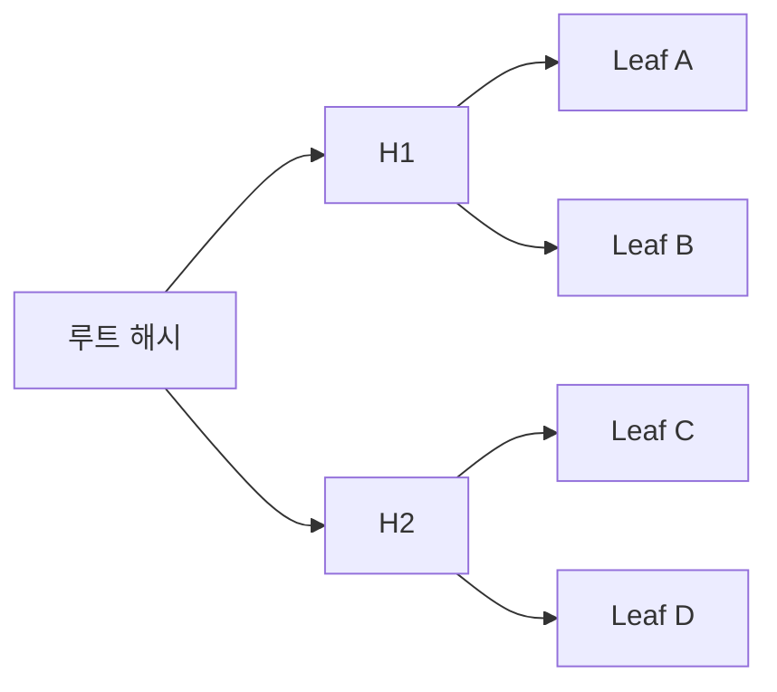
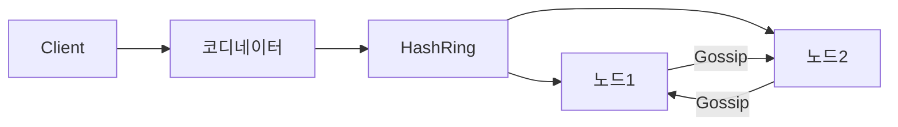
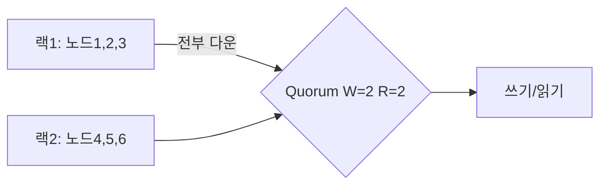

2024년 블랙프라이데이, 아마존의 DynamoDB는 초당 **1억 건** 이상의 요청을 처리했다. Redis는 단일 노드에서 초당 100만 QPS를 넘긴다. 이 숫자들이 가능한 이유는 단순한 "빠른 하드웨어" 때문이 아니다. 데이터를 어떻게 쪼개고, 복제하고, 저장하고, 복구하는지에 관한 수십 년의 공학적 결정이 쌓인 결과다. 이 글은 "면접 답변"이 아니라 **실제로 수백만 QPS를 견디는 Key-Value 스토어가 내부에서 무슨 일을 하는지** 를 처음부터 설계해본다.

---

## 설계 의사결정 로드맵

### 결정 1: 저장 엔진 — B-Tree vs LSM Tree

**문제**: 잘못 선택하면 쓰기 50만 QPS 요구사항을 충족할 수 없거나, 읽기 성능이 급격히 저하된다.

| 후보 | 장점 | 단점 | 선택 이유 |
|------|------|------|-----------|
| B-Tree (PostgreSQL, MySQL) | 읽기 빠름, 인플레이스 업데이트 | 랜덤 I/O, 쓰기 처리량 한계 | 읽기 중심 OLTP |
| **LSM Tree (RocksDB, Cassandra)** | 순차 I/O로 쓰기 처리량 최대화, Compaction으로 정리 | 읽기 시 여러 파일 탐색, Compaction 부하 | **쓰기 50만 QPS — 표준 선택** |
| 해시맵 (Redis 인메모리) | P99 1ms 미만, 구현 단순 | 데이터가 RAM 크기 초과 불가 | 캐시 계층, 핫 데이터 |
| B-Tree + WAL 혼합 | 읽기/쓰기 균형 | 복잡도 높음 | HTAP 워크로드 특수 경우 |

**우리의 선택: LSM Tree (RocksDB)** — 이유: 쓰기를 항상 순차 I/O로 처리, MemTable → SSTable 계층 구조로 쓰기 증폭 최소화, DynamoDB·TiKV·CockroachDB가 동일 선택.

---

### 결정 2: 파티셔닝 — Modulo 해싱 vs Consistent Hashing

**문제**: Modulo 해싱은 노드 1개 추가 시 전체 키의 67%가 이동해 100TB 클러스터에서 수십 시간의 데이터 이동이 발생한다.

| 후보 | 장점 | 단점 | 선택 이유 |
|------|------|------|-----------|
| Modulo (`hash(key) % N`) | 구현 한 줄 | 노드 추가/삭제 시 대부분 키 이동 | 노드 수 고정인 소규모 전용 |
| **Consistent Hashing + 가상 노드** | 노드 추가 시 1/N 키만 이동, 데이터 균등 분산 | 링 관리, 이진 탐색 구현 | **수평 확장 필수 — 표준** |
| Range 파티셔닝 | 범위 쿼리 효율 | 핫 파티션(순차 키 집중), 수동 재분할 | 시계열·로그 등 순차 키 특수 경우 |
| 디렉토리 기반 | 유연한 매핑 | 디렉토리 자체가 단일 장애점, 병목 | 메타데이터 오버헤드 허용되는 경우 |

**우리의 선택: Consistent Hashing + 가상 노드 150개/물리노드** — 이유: 노드 100개 클러스터에서 1개 추가 시 약 1% 키만 이동, 가상 노드로 데이터 불균형(핫 파티션) 방지.

---

### 결정 3: 복제 — 리더/팔로워 vs Quorum(리더리스)

**문제**: 리더 기반은 리더 장애 시 페일오버 수 초~수십 초 동안 쓰기가 불가능하고, 리더가 쓰기 병목이 된다.

| 후보 | 장점 | 단점 | 선택 이유 |
|------|------|------|-----------|
| 리더/팔로워 (Redis Sentinel) | 강한 일관성 용이, 구현 단순 | 리더 장애 시 페일오버 지연, 쓰기 병목 | 강한 일관성 필수, 단일 리전 |
| **리더리스 Quorum (W=2, R=2, N=3)** | 단일 장애점 없음, 쓰기 병렬화 | 최종 일관성, Vector Clock 필요 | **고가용성 분산 KV 표준** |
| 동기 다중 리더 | 멀티 리전 액티브-액티브 | 충돌 해결 복잡, 쓰기 지연 증가 | 멀티 리전 Active-Active 요구 시 |
| 단일 노드 (no replication) | 구현 최단, 지연 최소 | 장애 = 데이터 손실 | 개발 환경 전용 |

**우리의 선택: 리더리스 Quorum N=3, W=2, R=2** — 이유: W+R=4 > N=3으로 최신 데이터 읽기 보장, 노드 1대 장애 시도 서비스 지속, DynamoDB·Cassandra·Riak 동일 모델.

---

### 결정 4: 장애 감지 — Heartbeat(중앙 코디네이터) vs Gossip Protocol

**문제**: 중앙 코디네이터 방식은 코디네이터 자체가 단일 장애점이 되고, 1000노드 클러스터에서 동시 재연결 폭발이 발생한다.

| 후보 | 장점 | 단점 | 선택 이유 |
|------|------|------|-----------|
| 중앙 Heartbeat (Zookeeper) | 감지 즉각적, 일관성 강함 | 코디네이터 장애 = 전체 클러스터 마비, O(N) 폴링 병목 | 소규모 클러스터(~50노드) |
| **Gossip Protocol + Phi Accrual** | 탈중앙화, O(log N) 수렴, 노드 추가 선형 확장 | 최종 일관성(수 초 전파 지연) | **수백~수천 노드 표준** |
| 단순 타임아웃 | 구현 최단 | 네트워크 지연으로 오탐 빈번 | 내부 테스트 환경 |
| SWIM Protocol | Gossip 개선, 멤버십 수렴 속도 향상 | 구현 복잡도 높음 | 대규모 마이크로서비스 멤버십 |

**우리의 선택: Gossip Protocol + Phi Accrual Failure Detector** — 이유: 중앙 병목 없음, 네트워크 지연 통계 기반으로 오탐률 최소화, Cassandra·DynamoDB·Akka 동일 선택.

---

## 1. 요구사항 분석 + 규모 추정

### 기능 요구사항

- `put(key, value)` — 키-값 저장 (TTL 선택적)
- `get(key)` → value — 키로 조회
- `delete(key)` — 키 삭제
- 값 크기: 최대 10MB (대부분 1KB 이하)
- 키 크기: 최대 256 bytes

### 비기능 요구사항

| 항목 | 목표 |
|------|------|
| 읽기 QPS | 100만 QPS |
| 쓰기 QPS | 50만 QPS |
| 총 데이터 | 100TB |
| 읽기 지연 | p99 < 10ms |
| 쓰기 지연 | p99 < 5ms |
| 가용성 | 99.99% (연간 52분 다운타임 허용) |
| 일관성 | 최종 일관성 (Eventual Consistency) 기본, 강한 일관성 선택적 |

### 규모 추정

> **비유**: 100TB 데이터를 한 서버에 담으려면 4TB 디스크 25개가 필요하다. 하지만 그 서버가 죽으면? 전부 사라진다. 그래서 우리는 데이터를 **수평으로 쪼개고** (파티셔닝), **여러 곳에 복사한다** (복제).

```
읽기: 100만 QPS × 86400초 = 864억 회/일
쓰기: 50만 QPS × 86400초 = 432억 회/일
데이터: 100TB / 1KB 평균 = 약 1000억 개 키
노드당 1TB 저장 → 최소 100개 노드 필요
복제 계수 3 → 실제 300개 노드 (데이터 노드 기준)
단일 노드 처리량 ~10만 QPS → 읽기 10대, 쓰기 5대 필요
안전 여유 3배 → 읽기 30대, 쓰기 15대
```

---

## 2. 데이터 파티셔닝 — Consistent Hashing

### 왜 Consistent Hashing인가 — Modulo의 문제

**Modulo 방식의 구체적 붕괴 시나리오**:

```
노드 3대, 키 9개:
hash(A) % 3 = 0 → 노드0
hash(B) % 3 = 1 → 노드1
hash(C) % 3 = 2 → 노드2
... (나머지 6개 분배)

노드 1대 추가 (총 4대):
hash(A) % 4 = ? → 노드0 (그대로)
hash(B) % 4 = ? → 노드3 (이동!)
hash(C) % 4 = ? → 노드0 (이동!)

결과: 키 9개 중 6개(67%)가 담당 노드 변경
→ 6개 키 데이터를 새 노드로 복사해야 함
→ 100TB 클러스터라면 67TB 데이터 이동 발생
→ 이동 중 서비스 지연, 네트워크 포화
```

| 항목 | Modulo 해싱 | Consistent Hashing |
|------|------------|-------------------|
| 노드 추가 시 이동 키 비율 | **(N-1)/N ≈ 거의 전부** | **1/N** |
| 100노드→101노드 시 이동량 | 약 99% 키 | 약 1% 키 |
| 구현 복잡도 | 매우 단순 | 중간 (링 + 이진 탐색) |
| 핫 파티션 위험 | 균등 분포 (이론상) | 가상 노드로 해결 |
| 노드 장애 영향 | 전체 리해싱 | **인접 노드만 부하 흡수** |

**왜 1/N만 이동되는가**: Consistent Hash 링에서 노드를 추가하면 해당 노드가 링의 한 구간을 맡습니다. 그 구간의 키들만 새 노드로 이동합니다. 나머지 구간의 키는 담당 노드 변경 없음. 노드 100개 중 1개 추가 시 1/101 ≈ 1% 키만 이동합니다.

### 단순 해싱의 문제

`node = hash(key) % N` — 노드가 N개일 때 이 방식은 직관적이다. 하지만 노드 1개가 추가/삭제되면 **거의 모든 키의 담당 노드가 바뀐다**. 100억 개 키를 가진 클러스터에서 노드 하나를 추가하면? 수십억 건의 데이터 이동이 발생한다.

### Consistent Hashing

> **비유**: 원형 시계판에 서버들을 배치한다. 각 키는 해시값을 기준으로 "시계 방향으로 가장 가까운 서버"에 저장된다. 서버 하나가 사라지면 그 서버가 담당하던 키들만 다음 서버로 이동한다. 전체 키의 `1/N`만 이동한다.



### 가상 노드 (Virtual Nodes)

실제 물리 노드가 100개라도 해시 링에는 **3000개의 가상 노드**를 배치한다. 각 물리 노드가 30개의 가상 노드를 담당한다.

**왜 필요한가?** 물리 노드가 적으면 해시 링에서 "빈 구간"이 생겨 특정 노드에 데이터가 몰린다 (핫 파티션). 가상 노드를 쓰면 데이터가 균등하게 분산된다.

```python
class ConsistentHashRing:
    def __init__(self, virtual_nodes=150):
        self.ring = {}          # hash_position -> node_id
        self.sorted_keys = []   # 정렬된 해시 위치 목록
        self.virtual_nodes = virtual_nodes

    def add_node(self, node_id: str):
        for i in range(self.virtual_nodes):
            # "nodeA:0", "nodeA:1", ... "nodeA:149"
            vnode_key = f"{node_id}:{i}"
            position = self._hash(vnode_key)
            self.ring[position] = node_id
        self.sorted_keys = sorted(self.ring.keys())

    def get_node(self, key: str) -> str:
        h = self._hash(key)
        # 해시 링에서 h 이상인 가장 작은 위치 찾기
        idx = bisect.bisect_right(self.sorted_keys, h)
        if idx == len(self.sorted_keys):
            idx = 0  # 링의 끝 → 처음으로 wrap around
        return self.ring[self.sorted_keys[idx]]

    def _hash(self, key: str) -> int:
        return int(hashlib.md5(key.encode()).hexdigest(), 16)
```

### 핫 파티션 대응

특정 키에 트래픽이 폭발적으로 집중될 때 (예: 유명인 트위터 프로필) 가상 노드만으로는 부족하다.

1️⃣ **키 분산 (Key Sharding)**: `celebrity_id` 대신 `celebrity_id:0` ~ `celebrity_id:9` 로 10개 키에 분산 저장. 읽기 시 랜덤으로 하나를 선택.

2️⃣ **로컬 캐시**: 애플리케이션 서버 메모리에 핫 키를 수 초간 캐시. 스토어까지 요청이 도달하지 않도록.

3️⃣ **읽기 전용 복제본 증설**: 해당 파티션의 복제본 수를 일시적으로 늘려 읽기 부하를 분산.

---

## 3. 데이터 복제 — 장애에서 살아남기

### 리더/팔로워 복제

> **비유**: 사무실에 원본 문서 1개 (리더)와 복사본 2개 (팔로워)가 있다. 수정은 원본에만, 읽기는 복사본에서도 가능하다.

모든 쓰기는 리더로 가고, 리더가 팔로워에게 변경사항을 전파한다. 리더가 죽으면 팔로워 중 하나가 새 리더가 된다.

**장점**: 단순, 강한 일관성 보장 용이
**단점**: 리더가 쓰기 병목, 리더 장애 시 페일오버 지연 (수 초~수십 초)

### 리더리스 복제 (Dynamo 스타일)

> **비유**: 사무실에 복사본이 3개 있고, 누구나 수정할 수 있다. 단, 수정 사실을 3개 중 최소 2개에 알려야 "쓰기 완료"로 인정한다.

DynamoDB, Cassandra, Riak이 이 방식을 쓴다. 리더 없이 모든 노드가 읽기/쓰기를 처리할 수 있다.



### Quorum — W + R > N

리더리스 복제에서 일관성을 보장하는 핵심 공식:

- **N**: 복제 노드 수 (보통 3 또는 5)
- **W**: 쓰기 성공 응답을 기다릴 노드 수
- **R**: 읽기 응답을 기다릴 노드 수

`W + R > N` 이면 최소 1개 노드가 쓰기와 읽기 모두에 참여한다 → 최신 데이터를 반드시 읽는다.

| N | W | R | 설명 |
|---|---|---|------|
| 3 | 2 | 2 | 균형 (일반 설정) |
| 3 | 3 | 1 | 쓰기 강화 — 쓰기 느림, 읽기 빠름 |
| 3 | 1 | 3 | 읽기 강화 — 읽기 느림, 쓰기 빠름 |
| 3 | 1 | 1 | W+R=2 ≤ N=3 → 일관성 보장 안 됨 (최고 성능) |

```python
class QuorumStore:
    def __init__(self, nodes: list, N=3, W=2, R=2):
        self.nodes = nodes
        self.W, self.R = W, R

    def put(self, key: str, value: bytes) -> bool:
        target_nodes = self._get_nodes(key, count=self.N)
        futures = [node.put_async(key, value) for node in target_nodes]
        # W개의 성공 응답을 기다림
        successes = sum(1 for f in futures if f.result(timeout=5) == "OK")
        return successes >= self.W

    def get(self, key: str) -> bytes:
        target_nodes = self._get_nodes(key, count=self.N)
        responses = []
        for node in target_nodes:
            try:
                responses.append(node.get(key))
                if len(responses) >= self.R:
                    break
            except NodeException:
                continue
        # 가장 최신 버전 반환 (벡터 클럭으로 비교)
        return self._resolve_conflict(responses)
```

---

## 4. 일관성 모델 — 얼마나 "신선한" 데이터가 필요한가

### 강한 일관성 vs 최종 일관성

> **비유**: 은행 잔고는 **강한 일관성** — 어떤 창구에서 조회해도 같은 잔고를 보여줘야 한다. 소셜 미디어 "좋아요" 수는 **최종 일관성** — 1초 뒤에 업데이트돼도 사용자는 불편을 못 느낀다.

| 모델 | 보장 | 대표 사용처 | 성능 |
|------|------|------------|------|
| 강한 일관성 | 읽으면 항상 최신 데이터 | 금융 거래, 재고 | 느림 |
| 단조 읽기 | 한 번 읽은 버전보다 오래된 데이터 안 읽음 | 사용자 프로필 | 중간 |
| 읽기-쓰기 | 자신이 쓴 데이터는 바로 읽힘 | 내 게시물 조회 | 중간 |
| 최종 일관성 | 결국엔 같아지지만 시간 걸림 | 조회수, 좋아요 | 빠름 |

### Vector Clock으로 충돌 감지

리더리스 복제에서는 두 노드가 동시에 같은 키를 업데이트할 수 있다. 어느 것이 최신인가?

> **비유**: 구글 독스에서 두 사람이 동시에 같은 문단을 수정했다. "마지막으로 저장된 것" 대신, **누가 언제 어떤 버전을 기반으로 수정했는지** 추적하면 진짜 충돌만 사용자에게 알릴 수 있다.

```python
class VectorClock:
    def __init__(self):
        # {node_id: lamport_time}
        self.clock = {}

    def increment(self, node_id: str):
        self.clock[node_id] = self.clock.get(node_id, 0) + 1

    def merge(self, other: 'VectorClock'):
        for node_id, t in other.clock.items():
            self.clock[node_id] = max(self.clock.get(node_id, 0), t)

    def happened_before(self, other: 'VectorClock') -> bool:
        # self가 other보다 "이전에 발생"했는가?
        return (all(self.clock.get(k, 0) <= other.clock.get(k, 0)
                    for k in set(self.clock) | set(other.clock))
                and self.clock != other.clock)

    def concurrent_with(self, other: 'VectorClock') -> bool:
        # 둘 다 "이전"이 아님 → 동시 업데이트 (충돌!)
        return (not self.happened_before(other)
                and not other.happened_before(self))
```

충돌이 감지되면 두 버전을 모두 저장하고 다음 읽기 시 애플리케이션이 해결하게 한다 (DynamoDB의 "last writer wins" 또는 Cassandra의 수동 머지).

---

## 5. 장애 감지 — 죽은 노드를 어떻게 아는가

### 왜 Gossip Protocol인가 — 중앙 코디네이터의 한계

| 항목 | 중앙 코디네이터 방식 | Gossip Protocol |
|------|-------------------|----------------|
| 장애 감지 | 코디네이터가 모든 노드에 Ping | **각 노드가 이웃에게 상태 전파** |
| 코디네이터 장애 시 | **전체 클러스터 마비** | 영향 없음 (탈중앙화) |
| 노드 수 증가 시 | O(N) 폴링 부하 코디네이터 집중 | **O(log N) 라운드에 전파 완료** |
| 확장성 | 코디네이터가 병목 | **수천 노드까지 선형 확장** |
| 일관성 | 강함 (코디네이터가 권위) | 최종 일관성 (수 초 내 전파) |

**중앙 코디네이터의 구체적 붕괴**: Zookeeper 같은 중앙 코디네이터를 장애 감지에 쓴다고 가정합니다. 노드 1000대가 모두 Zookeeper에 5초마다 Heartbeat를 보내면 초당 200건. 괜찮아 보입니다. 하지만 네트워크 파티션으로 500개 노드가 동시에 재연결 시도하면 초당 수천 건의 폭발적 재연결이 발생합니다. Zookeeper가 이 폭발을 처리하는 동안 나머지 500개 노드도 응답 지연으로 "죽었다"고 잘못 판단될 수 있습니다. Gossip은 이런 중앙 병목이 없습니다.

### Gossip Protocol

> **비유**: 소문이 퍼지는 방식. "A가 노드B 죽었다고 들었어"를 C한테 말하고, C는 D한테 전달한다. 결국 모든 노드가 노드B의 상태를 알게 된다. 중앙 코디네이터 없이도 클러스터 전체에 정보가 퍼진다.



매 초마다 각 노드는 랜덤으로 `fanout=3` 개의 이웃 노드에게 자신의 상태 테이블을 전송한다. 수신자는 자신의 테이블과 병합한다. `O(log N)` 라운드 만에 전체 클러스터에 정보가 퍼진다.

```python
class GossipNode:
    def __init__(self, node_id: str, fanout=3):
        self.node_id = node_id
        self.fanout = fanout
        # {node_id: (heartbeat_counter, local_time)}
        self.membership_table = {node_id: (0, time.time())}

    def gossip_round(self, all_nodes: list):
        # 1. 자신의 heartbeat 증가
        counter, _ = self.membership_table[self.node_id]
        self.membership_table[self.node_id] = (counter + 1, time.time())

        # 2. fanout 개의 랜덤 노드에게 테이블 전송
        targets = random.sample([n for n in all_nodes if n != self], self.fanout)
        for target in targets:
            target.receive_gossip(self.membership_table)

    def receive_gossip(self, remote_table: dict):
        for node_id, (remote_counter, _) in remote_table.items():
            local_counter, _ = self.membership_table.get(node_id, (0, 0))
            if remote_counter > local_counter:
                self.membership_table[node_id] = (remote_counter, time.time())

    def get_failed_nodes(self, timeout=10.0) -> list:
        now = time.time()
        return [nid for nid, (_, t) in self.membership_table.items()
                if now - t > timeout and nid != self.node_id]
```

### Phi Accrual Failure Detector

단순한 타임아웃 ("10초 이상 응답 없으면 죽었다") 대신, 과거 heartbeat 간격의 통계를 사용해 **"현재 노드가 죽었을 확률"** 을 실수값으로 계산한다. Akka, Cassandra가 사용한다.

φ 값이 특정 임계값 (보통 8~10)을 넘으면 장애로 판단한다. 네트워크 지연이 일시적으로 증가해도 오탐을 줄인다.

---

## 6. 장애 복구 — 죽었다 살아난 노드에게 데이터 돌려주기

### Hinted Handoff

> **비유**: 이웃이 여행 중일 때 택배를 내가 대신 받아둔다. 이웃이 돌아오면 "이거 너 꺼야" 라며 건네준다.

노드 B가 일시적으로 다운됐을 때, 원래 B에게 가야 할 쓰기를 임시로 다른 노드 C가 "힌트"와 함께 저장해둔다. B가 복구되면 C가 힌트된 데이터를 B에게 전달한다.

```python
class HintedHandoff:
    def write_with_hint(self, key: str, value: bytes,
                        target_node: str, coordinator_node: str):
        hint = {
            "target_node": target_node,  # 원래 담당 노드
            "key": key,
            "value": value,
            "hint_ts": time.time()
        }
        # coordinator에 힌트 저장 (target 복구 후 전달 예정)
        self.hint_store.append(coordinator_node, hint)

    def replay_hints_for(self, recovered_node: str):
        hints = self.hint_store.get_hints_for(recovered_node)
        for hint in hints:
            try:
                recovered_node.put(hint["key"], hint["value"])
                self.hint_store.delete(hint)
            except Exception:
                pass  # 다음 라운드에 재시도
```

### Anti-Entropy — Merkle Tree로 노드 간 불일치 찾기

Hinted Handoff는 단기 장애에 효과적이지만, 노드가 오래 다운됐거나 네트워크 파티션이 발생하면 데이터 불일치가 누적된다. 이를 감지하고 복구하는 것이 Anti-Entropy다.

> **비유**: 두 도서관이 같은 책을 보유하는지 확인하려면, 모든 책 목록을 교환하는 대신 **전체 책의 "체크섬 체크섬"** 만 비교한다. 다르면 절반씩 좁혀가며 어느 선반에서 다른지 찾는다. 이것이 Merkle Tree다.



두 노드의 루트 해시가 같으면 → 완전히 동일. 다르면 자식 노드로 내려가며 어느 범위에서 불일치가 생겼는지 `O(log N)` 만에 찾는다. **전체 데이터 비교 없이 불일치 범위만 전송.**

### Read Repair

읽기 시 R개 노드에서 응답을 받았을 때 버전이 다르면, 백그라운드에서 오래된 노드에게 최신 데이터를 보내 수정한다. 읽기 트래픽이 자동으로 일관성을 회복시킨다.

---

## 7. 저장 엔진 — 디스크에 어떻게 쓰는가

### LSM Tree (Log-Structured Merge Tree)

> **비유**: 메모장에 일단 빠르게 받아 적고 (MemTable), 나중에 정리해서 파일로 옮긴다 (SSTable). 그리고 주기적으로 여러 파일을 하나로 합친다 (Compaction). 항상 순차 쓰기라 디스크 I/O가 최소화된다.


**쓰기 경로**:
1️⃣ WAL(Write-Ahead Log)에 순차 기록 — 크래시 복구용
2️⃣ 메모리의 MemTable (Red-Black Tree)에 삽입 — O(log N)
3️⃣ MemTable이 임계값 (보통 64MB)을 넘으면 → 불변 SSTable로 플러시

**읽기 경로**:
1️⃣ MemTable 조회 → 없으면
2️⃣ 최신 L0 SSTable부터 순서대로 탐색 (Bloom Filter로 불필요한 디스크 접근 제거)

**Compaction**: 여러 SSTable을 합쳐 삭제된 키 (tombstone)를 제거하고, 오래된 버전을 정리한다. 읽기 성능 유지의 핵심.

```python
class LSMTree:
    def __init__(self, memtable_limit=64 * 1024 * 1024):  # 64MB
        self.memtable = SortedDict()   # 메모리 내 정렬 구조
        self.memtable_size = 0
        self.wal = WAL("wal.log")
        self.sstables = []             # 디스크의 SSTable 목록 (최신순)
        self.bloom_filters = []

    def put(self, key: str, value: bytes):
        # 1. WAL에 먼저 기록 (내구성 보장)
        self.wal.append(key, value)
        # 2. MemTable에 삽입
        self.memtable[key] = value
        self.memtable_size += len(key) + len(value)
        # 3. 임계값 초과 시 SSTable로 플러시
        if self.memtable_size >= self.memtable_limit:
            self._flush_to_sstable()

    def get(self, key: str) -> bytes | None:
        # 1. MemTable 조회
        if key in self.memtable:
            return self.memtable[key]
        # 2. SSTable 역순 탐색 (최신 파일부터)
        for bf, sst in zip(self.bloom_filters, self.sstables):
            if bf.might_contain(key):  # Bloom Filter 통과한 것만
                result = sst.get(key)
                if result is not None:
                    return result
        return None

    def delete(self, key: str):
        # 삭제 = tombstone 값 쓰기 (즉시 제거 아님)
        self.put(key, TOMBSTONE)

    def _flush_to_sstable(self):
        # 정렬된 순서로 디스크에 쓰기 (순차 I/O)
        sst = SSTable.write(sorted(self.memtable.items()))
        bf = BloomFilter.build(self.memtable.keys())
        self.sstables.insert(0, sst)
        self.bloom_filters.insert(0, bf)
        self.memtable.clear()
        self.memtable_size = 0
        self.wal.truncate()
```

### B-Tree vs LSM Tree 비교

| 항목 | B-Tree | LSM Tree |
|------|--------|----------|
| 쓰기 성능 | 중간 (랜덤 I/O) | **높음** (순차 I/O) |
| 읽기 성능 | **높음** (인플레이스) | 중간 (여러 파일 탐색) |
| 공간 증폭 | 낮음 | 중간 (Compaction 전) |
| 쓰기 증폭 | 낮음 | 높음 (Compaction 반복) |
| 대표 시스템 | PostgreSQL, MySQL | RocksDB, Cassandra, LevelDB |
| 적합한 워크로드 | 읽기 많은 OLTP | 쓰기 많은 워크로드 |

KV 스토어에서는 쓰기 처리량이 핵심이므로 **LSM Tree**가 표준이다. RocksDB (Facebook 개발)를 저장 엔진으로 채택하면 DynamoDB, TiKV, CockroachDB 수준의 쓰기 성능을 낼 수 있다.

---

## 8. WAL — 크래시에서 살아남기

> **비유**: 요리사가 레시피대로 요리하다 기절했다. 일지(WAL)에 "3단계까지 완료"라고 적혀 있어서 깨어난 뒤 4단계부터 재개할 수 있다. 일지 없이 기억에만 의존했다면 처음부터 다시 해야 한다.

WAL은 모든 쓰기를 **디스크에 먼저** 기록한다. MemTable이 메모리에 있어 프로세스 크래시 시 사라지더라도, WAL을 재생(replay)해서 복구한다.

**fsync 정책 — 성능과 내구성의 트레이드오프**:

| 정책 | 설명 | 성능 | 내구성 |
|------|------|------|--------|
| `fsync=always` | 매 쓰기마다 디스크 동기화 | 가장 느림 | 최고 |
| `fsync=per_second` | 1초마다 동기화 | 중간 | 최대 1초치 손실 가능 |
| `fsync=no` | OS 버퍼에 맡김 | 가장 빠름 | 크래시 시 손실 |

Redis의 기본값은 `appendfsync everysec` — 초당 1회 fsync로 성능과 내구성을 균형. 금융 거래에는 `always`, 캐시 용도라면 `no`도 허용된다.

```python
class WAL:
    def __init__(self, path: str, fsync_policy="per_second"):
        self.file = open(path, "ab")
        self.fsync_policy = fsync_policy
        self.last_fsync = time.time()

    def append(self, key: str, value: bytes):
        # TLV(Type-Length-Value) 포맷으로 직렬화
        entry = struct.pack(">HI", len(key.encode()), len(value))
        entry += key.encode() + value
        entry += struct.pack(">I", crc32(entry))  # 체크섬
        self.file.write(entry)

        if self.fsync_policy == "always":
            os.fsync(self.file.fileno())
        elif self.fsync_policy == "per_second":
            if time.time() - self.last_fsync >= 1.0:
                os.fsync(self.file.fileno())
                self.last_fsync = time.time()

    def replay(self) -> list:
        # 크래시 복구: WAL 파일을 처음부터 읽어 MemTable 재구성
        entries = []
        self.file.seek(0)
        while chunk := self.file.read(6):
            key_len, val_len = struct.unpack(">HI", chunk)
            key = self.file.read(key_len).decode()
            value = self.file.read(val_len)
            checksum = struct.unpack(">I", self.file.read(4))[0]
            # 체크섬 검증 — 손상된 엔트리는 건너뜀
            if self._verify_checksum(key, value, checksum):
                entries.append((key, value))
        return entries
```

---

## 9. Bloom Filter — "없는 키" 조회를 빠르게 거르기

> **비유**: 도서관에 어떤 책이 있는지 물어볼 때, 사서가 모든 선반을 뒤지기 전에 "그 책 없어요"라고 확실히 말할 수 있는 작은 메모장이다. 다만 "있어요"라고 말하면 실제로 없을 수도 있다 (false positive). "없어요"는 항상 맞다 (false negative 없음).

LSM Tree에서 없는 키를 조회하면 모든 SSTable을 뒤져야 한다 (최악의 경우 수십 개 파일). Bloom Filter가 "이 파일에 이 키 없음"을 99% 확률로 정확하게 걸러준다.

```python
class BloomFilter:
    def __init__(self, capacity: int, false_positive_rate=0.01):
        # 최적 비트 수 계산: m = -n*ln(p) / (ln(2)^2)
        self.size = int(-capacity * math.log(false_positive_rate)
                        / (math.log(2) ** 2))
        # 최적 해시 함수 수: k = (m/n) * ln(2)
        self.hash_count = max(1, int((self.size / capacity) * math.log(2)))
        self.bits = bytearray(self.size // 8 + 1)

    def add(self, key: str):
        for seed in range(self.hash_count):
            h = mmh3.hash(key, seed) % self.size
            self.bits[h // 8] |= (1 << (h % 8))

    def might_contain(self, key: str) -> bool:
        # False: 확실히 없음 / True: 있을 수도 있음
        return all(
            (self.bits[h // 8] >> (h % 8)) & 1
            for seed in range(self.hash_count)
            for h in [mmh3.hash(key, seed) % self.size]
        )
```

false positive rate 1%의 의미: 없는 키 100개를 조회하면 1개는 "있을 수도 있다"고 잘못 판단해 디스크를 뒤진다. 99개는 즉시 "없음"으로 응답한다. 디스크 I/O 99% 절감.

메모리 사용량: capacity=1억, FPR=1%일 때 약 **114MB**. 10억 키도 1.14GB로 관리 가능.

---

## 10. TTL 처리 — 언제 키를 삭제하는가

### Lazy Expiration (지연 만료)

키를 읽을 때 TTL을 확인해서 만료됐으면 삭제하고 `null`을 반환한다. 백그라운드 작업 없음.

```python
def get(self, key: str):
    entry = self.store.get(key)
    if entry is None:
        return None
    if entry.expiry and time.time() > entry.expiry:
        self.store.delete(key)  # 접근 시점에 삭제
        return None
    return entry.value
```

**단점**: 만료된 키가 오래 메모리를 차지할 수 있다. 아무도 조회하지 않는 키는 영원히 남는다.

### Active Expiration (능동 만료)

백그라운드 스레드가 주기적으로 만료 키를 스캔해서 삭제한다. Redis는 두 방식을 모두 사용한다: 매 100ms마다 랜덤 샘플링으로 만료 키를 삭제하고, 조회 시 Lazy 방식으로 보완한다.

```python
class TTLManager:
    def __init__(self):
        # TTL 인덱스: {expiry_timestamp: [keys]}
        self.expiry_index = SortedDict()

    def set_ttl(self, key: str, ttl_seconds: int):
        expiry = time.time() + ttl_seconds
        self.expiry_index.setdefault(expiry, []).append(key)

    def active_expire_loop(self):
        while True:
            now = time.time()
            expired_times = [t for t in self.expiry_index if t <= now]
            for t in expired_times:
                for key in self.expiry_index.pop(t):
                    self.store.delete(key)
            time.sleep(0.1)  # 100ms마다 실행
```

**분산 환경 주의**: 노드 간 시계가 다를 수 있다 (clock skew). NTP로 동기화해도 수 ms 오차가 있다. TTL이 짧은 키 (< 1초)는 시계 오차로 예상보다 일찍 또는 늦게 만료될 수 있다.

---

## 11. 전체 아키텍처



**요청 흐름**:

1️⃣ 클라이언트가 아무 코디네이터에게 요청 전송
2️⃣ 코디네이터가 Consistent Hash로 담당 노드 결정
3️⃣ 해당 노드 + 복제 노드들에게 병렬 요청
4️⃣ Quorum (W=2, R=2, N=3) 달성 시 클라이언트에 응답
5️⃣ 백그라운드에서 Gossip으로 노드 상태 공유

---

## 12. 보안 고려사항

> **비유**: KV 스토어는 도서관 서고다. 열람증(인증) 없이 들어오는 사람은 막아야 하고, 책 내용(데이터)이 유출되어도 읽을 수 없게 암호화해야 하며, 서고 자체를 외부에서 보이지 않게 해야 한다 (네트워크 격리).

### 인증 (Authentication)

**Redis**: 기본 설정에 인증 없음. 반드시 `requirepass` 또는 ACL(Access Control List)을 설정해야 한다.

```
# redis.conf
requirepass <strong_password>

# ACL 설정 (Redis 6+)
# 읽기 전용 사용자
ACL SETUSER readonly on >readonly_pass ~* &* +get +mget +hget
# 쓰기 사용자 (특정 키 패턴만)
ACL SETUSER appuser on >app_pass ~app:* +get +set +del
```

**DynamoDB**: IAM 역할 기반 인증. 특정 테이블·접두사·속성에만 접근 권한 부여 가능.

### 전송 암호화 (Encryption in Transit)

Redis: TLS (`tls-port 6380`, `tls-cert-file` 설정)
DynamoDB: 기본으로 HTTPS 강제

내부 노드 간 통신도 TLS가 필요하다. 내부 네트워크라도 측면 이동(lateral movement) 공격을 막아야 한다.

### 저장 암호화 (Encryption at Rest)

DynamoDB: 기본 AWS KMS 암호화 (CMK 선택 가능)
Redis: 저장 암호화 없음 → 디스크 파일 접근 시 plaintext. OS 레벨 암호화 (LUKS) 또는 RDB 파일 자체 암호화 필요.

### 네트워크 격리

```
# VPC 설계 원칙
인터넷 → 없음 (KV 스토어는 Public Subnet 금지)
앱 서버 → KV 스토어: 특정 포트만 허용 (Redis: 6379, DynamoDB: 443)
KV 스토어 → 외부: 아웃바운드 최소화
모니터링: 별도 관리 네트워크
```

**Redis 실무 실수**: 개발 편의로 `bind 0.0.0.0`과 `protected-mode no`를 동시에 설정하고 방화벽 없이 운영. 2017년 수만 대의 Redis 서버가 이 방식으로 랜섬웨어에 감염됐다.

---

## 13. 극한 시나리오 3가지

### 시나리오 1: 핫 키 — 특정 키에 QPS 100만 집중

**상황**: BTS 새 앨범 발매 직후 `artist:BTS:info` 키에 초당 100만 건이 집중된다. 해당 파티션 노드 1대가 감당할 수 없다.


**대응**:

1️⃣ **로컬 캐시**: 앱 서버 메모리에 핫 키를 5초간 캐시. 99%의 요청이 KV 스토어에 도달하지 않음.

2️⃣ **키 복제**: `artist:BTS:info:0` ~ `artist:BTS:info:9` 로 10개 키에 같은 데이터를 저장. 읽기 시 `random.randint(0,9)` 로 랜덤 선택 → 부하가 10개 파티션으로 분산.

3️⃣ **읽기 전용 복제본 동적 증설**: 해당 파티션에 자동으로 읽기 복제본을 추가. DynamoDB DAX (캐시 계층) 활용.

### 시나리오 2: 노드 3대 동시 장애

**상황**: 데이터센터 랙(Rack) 하나에 화재가 발생해 노드 3대가 동시에 다운됐다. 복제 계수 N=3이고 3개 노드가 같은 랙에 배치된 경우.



**근본 원인**: 복제 배치 정책 부재. Consistent Hash Ring은 데이터를 균등하게 분산하지만, **물리적 위치**를 고려하지 않으면 같은 랙에 여러 복제본이 배치될 수 있다.

**대응**:
- **Rack-aware 복제**: 복제본 N개를 서로 다른 랙에 배치 (Cassandra의 `NetworkTopologyStrategy`)
- **AZ-aware 복제**: AWS 환경이면 복제본을 서로 다른 가용 영역(AZ)에 분산
- **최소 N=5 고려**: 3대 동시 장애에도 W+R>N을 맞추려면 N=5, W=3, R=3

```python
class RackAwareRing:
    def get_replica_nodes(self, key: str, N: int) -> list:
        all_nodes = self._get_ring_order(key)
        selected = []
        selected_racks = set()
        for node in all_nodes:
            if node.rack not in selected_racks:
                selected.append(node)
                selected_racks.add(node.rack)
            if len(selected) == N:
                break
        return selected
```

### 시나리오 3: 데이터 100TB 리밸런싱

**상황**: 클러스터 용량 부족으로 노드 100대를 추가한다. 기존 100TB를 새 노드들에게 이동시켜야 한다.

**계산**: 100TB / 100대 추가 = 1TB 이동 필요. 네트워크 대역폭 노드당 1Gbps라면 최소 `1TB / 1Gbps ≈ 8000초 ≈ 2.2시간`. 이 동안 서비스는 계속 운영돼야 한다.

**문제점**: 리밸런싱 중 해당 키를 읽으면 아직 이동 안 된 노드를 볼 수도, 이미 이동된 새 노드를 볼 수도 있다.

**대응**:

1️⃣ **단계적 노드 추가**: 100대를 한 번에 추가하지 않고 10대씩 나눠서. 데이터 이동량과 네트워크 충격을 분산.

2️⃣ **이중 쓰기 (Dual Write)**: 리밸런싱 완료 전까지 기존 노드와 새 노드 **모두**에 쓰기. 읽기는 새 노드에서 하되, 없으면 기존 노드 폴백.

3️⃣ **쓰로틀링**: 리밸런싱 대역폭을 제한 (예: 노드당 100Mbps). 서비스 트래픽 대역폭을 보호.

4️⃣ **블루/그린 리밸런싱**: 새 클러스터를 병렬 구성하고, 트래픽을 점진적으로 전환 (1% → 10% → 50% → 100%). 가장 안전하지만 비용이 2배.

---

## 14. 실제 시스템 비교: Redis vs DynamoDB vs Cassandra

| 항목 | Redis | DynamoDB | Cassandra |
|------|-------|----------|-----------|
| 저장소 | 메모리 (선택적 디스크) | SSD (클라우드) | SSD |
| 일관성 | 강한 일관성 (단일) | 강한/최종 선택 | 최종 일관성 기본 |
| 복제 | 리더/팔로워 | 자동 3 AZ | 리더리스 (N/W/R) |
| 파티셔닝 | 슬롯 기반 (16384 슬롯) | 자동 (무제한) | Consistent Hash |
| 저장 엔진 | 직접 구현 (해시/리스트/셋) | B-Tree 계열 | LSM Tree |
| p99 읽기 지연 | < 1ms | 1~5ms | 1~10ms |
| 최대 데이터 | RAM 크기 (수십 GB) | 무제한 | 수 PB |
| 쓰기 모델 | 단일 리더 | 자동 샤딩 | 멀티 마스터 |
| 관리 복잡도 | 낮음 | 매우 낮음 (관리형) | 높음 |
| 비용 | 메모리 비쌈 | 요청 기반 과금 | 자체 운영 |
| 대표 사용처 | 세션 캐시, 실시간 순위표 | 이커머스, 게임 | IoT, 로그, 시계열 |

**언제 무엇을?**

- **Redis**: 지연이 극단적으로 중요하고 데이터가 RAM에 들어가는 경우. 세션, 캐시, 실시간 카운터.
- **DynamoDB**: 관리 오버헤드를 최소화하고 싶고, AWS 환경에서 자동 스케일링이 필요한 경우. 이커머스, 게임 사용자 데이터.
- **Cassandra**: 쓰기가 극단적으로 많고 (이벤트 로그, IoT), 멀티 리전 Active-Active가 필요한 경우.

---

## 15. 면접 포인트 5개

**1️⃣ "Consistent Hashing이 왜 필요한가?"**

단순 `hash(key) % N` 대신 Consistent Hashing을 쓰면 노드 추가/삭제 시 이동하는 키가 `1/N`으로 줄어든다. 100개 노드에서 1개 추가 시 전체 키의 1%만 이동. 서비스 중단 없는 스케일 아웃의 핵심.

**2️⃣ "W + R > N이면 항상 강한 일관성인가?"**

아니다. W+R>N은 **최신 데이터를 읽을 가능성**을 보장하지만 완전한 선형화(linearizability)는 아니다. 쓰기가 진행 중일 때 동시에 읽으면 여전히 구 버전을 읽을 수 있다. 완전한 강한 일관성을 위해서는 리더 기반 복제 + 동기 복제가 필요하다.

**3️⃣ "Bloom Filter의 false positive가 문제가 되는 경우는?"**

일반적으로 false positive는 불필요한 디스크 I/O만 유발한다. 하지만 **보안 목적** (특정 키 접근 차단 등)에 Bloom Filter를 쓰면 false positive로 정상 접근을 막거나 비정상 접근을 허용하는 버그가 생긴다. Bloom Filter는 성능 최적화 전용.

**4️⃣ "CRDT vs Vector Clock — 언제 무엇을 쓰는가?"**

Vector Clock은 충돌을 **감지**해서 애플리케이션이 해결하게 한다. CRDT (Conflict-free Replicated Data Type)는 **항상 자동으로 머지 가능한** 데이터 구조다 (Counter, Set 등). "좋아요 수"처럼 교환 법칙이 성립하는 연산은 CRDT로, "사용자 프로필"처럼 의미 있는 머지가 필요한 건 Vector Clock + 수동 처리.

**5️⃣ "Redis 클러스터 vs Redis Sentinel 차이는?"**

| 항목 | Sentinel | Cluster |
|------|----------|---------|
| 목적 | HA (고가용성) | 샤딩 + HA |
| 데이터 분산 | X (단일 마스터) | O (16384 슬롯) |
| 최대 데이터 | 단일 서버 RAM | N대 합산 RAM |
| 복잡도 | 낮음 | 높음 |
| 적합 상황 | RAM 충분, 단순함 원함 | 대규모 확장 필요 |

Sentinel은 "죽으면 자동으로 페일오버", Cluster는 "죽으면 페일오버 + 데이터를 여러 노드에 분산".

---

## 16. 실무 실수 모음

**실수 1: Redis를 영구 스토어로 사용**
`appendonly yes` + `appendfsync always`를 설정하더라도 Redis는 메모리 중심 설계라 대용량 데이터(수십 GB 이상)에서 RDB 스냅샷이 수 분 걸리고 메모리 2배 사용. 영구 저장이 필요하면 RocksDB 기반 스토어를 쓰거나, Redis는 캐시 계층으로만 활용하라.

**실수 2: TTL 없이 세션 저장**
`SET session:user_id <data>` 만 하고 EXPIRE를 빠뜨리면 로그아웃해도 세션이 영원히 Redis에 남는다. 수백만 사용자 서비스에서 수십 GB의 좀비 세션이 쌓여 OOM을 유발한다. 항상 `SET key value EX 3600` 처럼 TTL을 함께 설정.

**실수 3: Quorum을 W=1, R=1로 설정 (성능 우선)**
"빠르니까"라는 이유로 W+R=2 ≤ N=3 설정. 쓰기 직후 읽으면 아직 복제 안 된 노드에서 구 버전이 읽힌다. 결제 처리, 재고 차감 등에서 이 설정은 데이터 불일치를 유발한다.

**실수 4: Compaction 백로그 무시**
LSM Tree 기반 스토어에서 쓰기가 폭발하면 Compaction이 따라가지 못해 SSTable이 수천 개로 늘어난다. 읽기 성능이 선형으로 저하된다. `max_write_buffer_number`, `level0_slowdown_writes_trigger` 등 백프레셔(backpressure) 설정이 필수.

**실수 5: 모든 노드를 같은 랙에 배치**
클라우드 환경에서 인스턴스를 특정 AZ 하나에 몰아넣으면 AZ 장애 시 전체 클러스터 다운. 복제본은 반드시 다른 AZ(또는 랙)에 배치하고, Placement Group은 신중히 사용하라.

---

### 꼭 직접 만들어야 하는가? — Build vs Buy

| 선택지 | 장점 | 단점 | 적합한 시점 |
|--------|------|------|-----------|
| Redis Cloud (Redis Labs) | 관리형 Redis, 자동 페일오버, 멀티 AZ 내장 | 비용 높음, 극한 레이턴시 튜닝 어려움 | Phase 1~2 |
| AWS ElastiCache / MemoryDB | AWS 통합, 자동 백업·복제, VPC 보안 | AWS 종속, 클러스터 구성 지식 필요 | Phase 2~3 |
| DynamoDB | 서버리스 KV, 용량 자동 확장, 관리 부담 없음 | 레이턴시 ms 단위, 핫 파티션 이슈 주의 | Phase 1~3 |
| 직접 구축 (자체 LSM Tree KV) | 구글/아마존 급 극한 제어, P99 100µs 미만 달성 가능 | 구현 수년, 전담 스토리지 엔지니어링 팀 필요 | Phase 4 |

**실무 판단 기준**: 99.99% 서비스는 관리형으로 충분하다. 직접 구축은 P99 레이턴시 100µs 미만 같은 극한 요구사항일 때만 고려한다.

> 핵심: Phase 1에서 직접 구축하면 오버 엔지니어링이고, Phase 3에서 SaaS에 의존하면 비용 폭발이다. 현재 MAU에 맞는 선택을 하고, 병목이 실제로 발생할 때 전환한다.

---

## Day 1 → Scale 진화

### Phase 1: MAU 1만 — 단일 Redis 노드 ($50/월)

단일 Redis 인스턴스(r6g.large, 16GB). TTL 기반 세션·캐시 저장. appendonly yes + appendfsync everysec 로 내구성 확보. 장애 시 수동 재시작.

```
구성: Redis 단일 노드
한계: RAM 16GB 초과 불가, 노드 장애 시 수 분 다운타임, 단일 장애점
```

### Phase 2: MAU 10만 — Redis Sentinel ($200/월)

Redis Primary + Replica 2대 + Sentinel 3대. Sentinel이 Primary 장애 감지 후 자동 페일오버(30초 이내). 읽기는 Replica에서 처리해 Primary 부하 분산.

```
구성: Redis Primary 1 + Replica 2 + Sentinel 3
한계: 데이터가 단일 Primary RAM 크기로 제한, 수평 확장 불가
```

### Phase 3: MAU 500만 — Redis Cluster ($1,000/월)

Redis Cluster 6노드(Master 3 + Replica 3), 16384 슬롯 균등 분배. 각 샤드가 독립 Primary/Replica 페어. Consistent Hashing으로 클라이언트가 직접 올바른 샤드로 라우팅. Lua 스크립트로 원자적 복합 연산.

```
구성: Redis Cluster 6노드 (m6g.2xlarge × 6)
추가: 핫 키 감지 → 키 분산(suffix 0~9), 로컬 캐시 L1 계층 추가
```

### Phase 4: MAU 1억 이상 — 자체 KV(LSM) + 멀티 리전 Dynamo 스타일 ($10,000+/월)

Redis 한계(RAM 비용)를 넘어서면 RocksDB 기반 자체 KV 또는 DynamoDB로 전환. Consistent Hash Ring + 가상 노드 150개. Gossip 기반 장애 감지. Quorum W=2, R=2, N=3. 멀티 리전 Active-Active(충돌 해결은 LWW + Vector Clock).

```
구성: 데이터 노드 300대(복제 계수 3) + 코디네이터 노드 30대 + 글로벌 Gossip
추가: Rack-aware 복제, Merkle Tree Anti-Entropy, Hinted Handoff, Phi Accrual 장애 감지
```

---

## 핵심 운영 메트릭 5개

| 메트릭 | 정상 | 경고 | 장애 | 의미 |
|--------|------|------|------|------|
| GET/SET P99 응답시간 | < 2ms | 2~10ms | > 10ms | 핫 키 집중 또는 네트워크 포화 — 즉시 핫 키 분산 조치 필요 |
| 캐시 히트율 | > 95% | 90~95% | < 90% | TTL 설정 오류 또는 캐시 용량 부족 — DB 부하 급증 신호 |
| 복제 지연 (Replica lag) | < 100ms | 100ms~1초 | > 1초 | Primary 과부하 또는 네트워크 파티션 — 읽기 일관성 저하 |
| 디스크 사용률 (LSM 기반) | < 70% | 70~85% | > 85% | Compaction 백로그 또는 데이터 증가 — 노드 추가 또는 TTL 강화 필요 |
| Compaction 시간/회 | < 30초 | 30초~5분 | > 5분 | SSTable 과다 누적 — 읽기 P99 선형 저하 시작 |

---

## 실제 장애 사례

### 사례 1: Redis OOM — 메모리 초과로 서버 프로세스 강제 종료

**상황**: 국내 대형 커머스 플랫폼 B사에서 세션 데이터를 Redis에 저장하면서 TTL을 설정하지 않았다. 서비스 오픈 6개월 후 누적 세션 데이터가 Redis 메모리(64GB)를 초과하자 Linux OOM Killer가 Redis 프로세스를 강제 종료했다. 모든 사용자가 로그아웃되고 세션 데이터 전체가 유실됐다. 서비스 복구까지 23분 소요.

**원인**: `SET session:user_id <data>` 명령에 EX(TTL) 옵션을 누락. 퇴직한 사용자, 탈퇴한 계정의 세션도 영구 보존. Redis의 기본 `maxmemory-policy`가 `noeviction`이라 메모리가 가득 차도 자동 삭제하지 않고 새 쓰기를 에러로 반환하다가 결국 OOM에 이름.

**해결**: Redis 재시작 후 `maxmemory-policy`를 `allkeys-lru`로 변경(메모리 부족 시 가장 오래 사용 안 된 키 자동 삭제). 모든 세션 키에 `EX 86400`(24시간) TTL 추가. `maxmemory`를 물리 RAM의 75%로 제한해 OOM 자체를 방지.

**교훈**: Redis에 저장하는 모든 키는 TTL을 기본값으로 설정해야 한다. `maxmemory`와 `maxmemory-policy`는 배포 전 반드시 설정하고, 메모리 사용률 80% 경보를 운영 알림으로 연결해야 한다. `noeviction` 정책은 캐시가 아닌 데이터 저장소 용도에만, 그리고 메모리 용량이 충분히 보장될 때만 사용해야 한다.

---

### 사례 2: DynamoDB 핫 파티션 스로틀링 — Amazon Prime Day (2018년)

**상황**: Amazon Prime Day 세일 시작 직후, 특정 상품(인기 가전제품)의 상품 상세 정보를 저장하는 DynamoDB 테이블에 초당 수십만 건의 읽기가 집중됐다. DynamoDB는 파티션당 처리량 한도(당시 3,000 RCU/파티션)를 초과하자 스로틀링을 적용해 `ProvisionedThroughputExceededException`을 반환하기 시작했다. 상품 페이지 로드 실패율이 5%를 넘었고, 결제 흐름까지 영향을 받았다.

**원인**: 인기 상품 10개의 item_id가 동일한 파티션에 해시됐다(파티션 키 설계 문제 + 우연한 해시 충돌). 10개 상품에 트래픽이 집중되면서 해당 파티션 한도를 초과. 다른 파티션의 처리량은 여유가 있었으나 DynamoDB는 파티션 간 자동 부하 이동을 즉시 하지 않았다(Adaptive Capacity는 이후 도입).

**해결**: 즉각적 조치로 상품 상세 정보를 ElastiCache(Redis)로 캐싱(TTL 5분). 10개 인기 상품에 대한 DynamoDB 읽기가 99% 감소. 근본 해결로는 파티션 키를 `item_id + random_suffix(0~9)`로 변경해 10개 파티션으로 분산. 읽기 시 랜덤 suffix 선택.

**교훈**: DynamoDB 파티션 키 설계는 "가장 트래픽이 몰릴 키"를 기준으로 검증해야 한다. 핫 파티션은 provisioned throughput을 아무리 늘려도 해당 파티션 물리 한도를 초과하면 스로틀링이 발생한다. 인기 데이터는 반드시 DAX(DynamoDB Accelerator) 또는 Redis 캐시 계층을 앞에 둬야 한다. Prime Day·블랙프라이데이 같은 예측 가능한 트래픽 폭발은 사전 load test와 캐시 워밍업이 필수다.

---

## 실무에서 놓치기 쉬운 케이스

### 1. 핫 키 문제 — 인기 상품 하나가 노드 하나를 태운다

Consistent Hashing으로 키를 분산해도 특정 키에 트래픽이 폭발적으로 몰리면 해당 키를 담당하는 노드가 병목이 된다. 쇼핑몰 타임딜 상품 재고(`stock:product:12345`)나 월드컵 경기 중 실시간 점수(`score:match:987`)가 대표적이다. 노드 전체 CPU가 이 하나의 키 때문에 100%에 달하는 일이 실제로 벌어진다.

```
단순 접근 (비추천):
  GET stock:product:12345 → 노드 A → 초당 500,000 RPS → 노드 A 포화

해결책 1: 키 샤딩 (Local Replication)
  stock:product:12345#shard0
  stock:product:12345#shard1
  ...
  stock:product:12345#shard9
  → 10개 샤드에 분산. 읽기 시 random(0~9)으로 선택
  → 단점: 쓰기 시 10개 모두 업데이트 필요 (Write Fan-out)

해결책 2: 로컬 캐시 (서버 메모리)
  각 애플리케이션 서버가 핫 키를 100ms 동안 로컬 캐시
  → KV 스토어 요청 자체를 줄임
  → TTL이 짧아야 Stale 데이터 위험 최소화

해결책 3: 읽기 레플리카 라우팅
  핫 키 감지 시 읽기 요청을 해당 키의 레플리카로 자동 분산
  → Consistent Hashing 링에서 레플리카 노드 목록 유지
```

핫 키 감지는 클라이언트 라이브러리나 KV 스토어 자체의 키별 접근 카운터로 할 수 있다. 상위 N개 키가 전체 요청의 X% 이상을 차지하면 핫 키로 판정한다.

---

### 2. 큰 값 (>1MB) — LSM Tree에서 GC 지옥이 시작된다

KV 스토어에 1MB가 넘는 값(예: JSON 사용자 설정 전체, 직렬화된 모델 가중치)을 저장하면 LSM Tree의 Compaction 과정에서 I/O가 폭발한다. RocksDB 기준으로 값이 크면 SSTable 파일이 빨리 차고, Compaction 빈도가 늘어나며, 쓰기 증폭(Write Amplification)이 심해져 성능이 급격히 떨어진다.

```python
MAX_VALUE_SIZE = 512 * 1024  # 512KB 상한

def put(key, value):
    if len(value) > MAX_VALUE_SIZE:
        # 큰 값은 오브젝트 스토리지(S3)에 저장
        s3_key = f"large-values/{key}/{hash(value)}"
        s3.put_object(Bucket="kv-overflow", Key=s3_key, Body=value)
        # KV 스토어에는 포인터만 저장
        kv_store.set(key, json.dumps({
            "_type": "s3_ref",
            "_s3_key": s3_key,
            "_size": len(value)
        }))
    else:
        kv_store.set(key, value)

def get(key):
    raw = kv_store.get(key)
    meta = json.loads(raw)
    if isinstance(meta, dict) and meta.get("_type") == "s3_ref":
        return s3.get_object(Bucket="kv-overflow", Key=meta["_s3_key"])["Body"].read()
    return raw
```

이 패턴을 **Blob Offloading** 이라고 한다. KV 스토어는 포인터만 관리하고, 실제 데이터는 S3처럼 대용량에 최적화된 스토리지에 저장한다. WiscKey(2016) 논문이 이 접근을 체계화했으며, TiKV 등 프로덕션 KV 스토어가 채택하고 있다.

---

### 3. 키 네임스페이스 충돌 — 두 팀이 같은 키 이름을 쓴다

단일 Redis 클러스터를 여러 팀이 공유하면 `user:123`, `session:abc`, `count:daily` 같은 단순한 키 이름이 충돌한다. 팀 A의 `user:123`이 팀 B의 `user:123`을 덮어쓰는 사고는 Redis를 공유하는 조직에서 반복적으로 발생한다.

```
잘못된 패턴:
  SET user:123 '{"name": "김철수"}'   ← 팀 A (사용자 서비스)
  SET user:123 '{"score": 1500}'      ← 팀 B (게임 서비스)  → 팀 A 데이터 덮어씀

올바른 패턴 — 네임스페이스 prefix 강제:
  SET user-service:user:123 '{"name": "김철수"}'
  SET game-service:user:123 '{"score": 1500}'
```

이를 코드 레벨에서 강제하려면 KV 클라이언트 래퍼를 만들어 서비스명을 자동으로 prefix에 포함시킨다.

```python
class NamespacedRedis:
    def __init__(self, redis_client, namespace):
        self.r = redis_client
        self.ns = namespace  # 예: "user-service"

    def _key(self, key):
        return f"{self.ns}:{key}"

    def get(self, key):
        return self.r.get(self._key(key))

    def set(self, key, value, **kwargs):
        return self.r.set(self._key(key), value, **kwargs)

# 팀 A
user_redis = NamespacedRedis(redis, "user-service")
user_redis.set("user:123", '{"name": "김철수"}')  # 실제 키: "user-service:user:123"
```

Redis Cluster 환경에서는 `{namespace}:key` 형식으로 해시 태그를 활용하면 같은 네임스페이스의 키가 같은 슬롯에 모여 MGET 등 다중 키 연산의 효율을 높일 수 있다.

---

## 17. 핵심 설계 결정 요약

| 결정 | 선택 | 이유 |
|------|------|------|
| 파티셔닝 | Consistent Hash + 가상 노드 | 노드 추가/삭제 시 1/N 키만 이동 |
| 복제 | 리더리스, N=3, W=2, R=2 | 단일 장애점 없음, 가용성 최대화 |
| 일관성 | 최종 일관성 기본 | 성능 우선, 충돌은 Vector Clock |
| 장애 감지 | Gossip + Phi Accrual | 중앙 코디네이터 없이 O(log N) 수렴 |
| 저장 엔진 | LSM Tree (RocksDB) | 쓰기 50만 QPS, 순차 I/O 최적 |
| 내구성 | WAL + fsync per second | 크래시 복구 + 성능 균형 |
| 읽기 최적화 | Bloom Filter (FPR 1%) | 없는 키 조회 디스크 I/O 99% 절감 |
| TTL | Lazy + Active 혼합 | Redis 방식, 메모리 회수 + 정확성 |
| 보안 | ACL + TLS + VPC 격리 | 심층 방어 (Defense in Depth) |
| 핫 파티션 | 키 분산 + 로컬 캐시 | 단일 파티션 병목 해소 |

---
## 실무에서 자주 하는 실수

**실수 1: Consistent Hashing 도입 없이 모듈로 샤딩**
`shard = hash(key) % N`으로 샤딩한 상태에서 노드를 1개 추가하면 `N+1`로 바뀌면서 기존 키의 80~90%가 다른 샤드로 이동합니다. 전체 데이터 재배치 동안 서비스 중단이 불가피합니다. 실제 DynamoDB, Cassandra 모두 Consistent Hashing을 사용하는 이유입니다. 초기부터 Consistent Hashing을 적용하면 노드 추가 시 `1/N` 비율만 이동합니다.

**실수 2: Quorum W+R > N 조건을 절반으로만 설정**
N=3 환경에서 W=1, R=1로 설정하면 쓰기 직후 다른 노드에서 읽을 때 이전 값을 반환합니다. W+R=2 < N=3이므로 강일관성 불보장. W=2, R=2 (W+R=4 > N=3)로 설정해야 최소한의 강일관성이 보장됩니다. 단, 이 경우 쓰기/읽기 응답 시간이 늘어나므로 서비스 특성에 맞게 조정이 필요합니다.

```java
// Quorum 설정 예시 (N=3 클러스터)
WriteOptions writeOptions = WriteOptions.builder()
    .consistencyLevel(ConsistencyLevel.QUORUM)  // W=2 (N/2+1)
    .build();

ReadOptions readOptions = ReadOptions.builder()
    .consistencyLevel(ConsistencyLevel.QUORUM)  // R=2
    .build();
// W+R=4 > N=3 → 강일관성 보장
```

**실수 3: Hinted Handoff 없이 노드 장애 대응**
W=2 쿼럼 환경에서 노드 1개가 장애 나면 쓰기 쿼럼을 충족하지 못해 쓰기가 실패합니다. Hinted Handoff는 다른 노드가 임시로 쓰기를 대신 받고("힌트"), 장애 노드 복구 후 전달합니다. DynamoDB의 핵심 가용성 기법입니다. 구현 없이 쓰기 실패를 그냥 클라이언트에 반환하면 가용성이 크게 저하됩니다.

**실수 4: 버전 충돌 감지 없이 Last-Write-Wins만 사용**
분산 환경에서 두 클라이언트가 동시에 같은 키를 업데이트하면 LWW는 하나를 유실합니다. Vector Clock 또는 MVCC를 사용해 충돌을 감지하고 클라이언트 또는 애플리케이션 레이어에서 병합 로직을 수행해야 합니다. Amazon Shopping Cart가 이 문제로 실제 장애를 겪은 후 Dynamo 논문이 나왔습니다.

### Q1. LSM Tree가 B-Tree보다 쓰기 성능이 좋은 이유는?
B-Tree는 디스크의 특정 위치를 찾아 in-place 업데이트합니다(Random I/O). LSM Tree는 메모리(MemTable)에 쓰고 나중에 순차적으로 디스크에 flush합니다(Sequential I/O). HDD에서 Sequential I/O는 Random I/O보다 100배 이상 빠릅니다. 단, 읽기 시 여러 레벨의 SSTable을 조회해야 하므로 읽기 증폭이 발생합니다. Bloom Filter로 없는 키 조회를 빠르게 필터링해 보완합니다.

### Q2. Gossip Protocol은 어떻게 클러스터 상태를 전파하는가?
각 노드가 주기적으로(1~2초) 랜덤하게 선택한 이웃 노드에게 자신이 아는 클러스터 상태를 전송합니다. 지수적으로 전파되므로 N개 노드에 O(log N) 라운드 내 전파 완료. 중앙 코디네이터가 없어 SPOF가 없습니다. Cassandra, DynamoDB가 채택한 방식입니다. 단점: 최종 일관성(Eventual Consistency)이므로 순간적으로 노드마다 다른 뷰를 가질 수 있습니다.

### Q3. 데이터 파티셔닝 시 핫 파티션을 어떻게 감지하고 해결하는가?
모니터링에서 특정 샤드의 CPU·메모리·네트워크가 다른 샤드 대비 2배 이상이면 핫 파티션입니다. 원인은 키 분포 쏠림(특정 키가 모든 트래픽 집중). 해결: ① 키에 랜덤 접미사 추가(`user:123:0`, `user:123:1`) 후 읽기 시 합산 ② 해당 파티션을 가상 노드 추가로 분산 ③ 핫 키를 로컬 캐시에 올려 KV Store 접근 자체를 줄임.

### Q4. 영속성 보장을 위해 WAL에서 fsync 빈도를 어떻게 설정하는가?
`fsync per write`: 모든 쓰기마다 디스크 동기화. 내구성 최고, 성능 최저(수백 TPS). `fsync per second`: 초당 1회. 최대 1초치 데이터 유실 가능성. RDB처럼 금융 데이터가 아니면 허용 가능. 성능은 수만 TPS. `no fsync`: OS에 맡김. 최고 성능이지만 OS 크래시 시 수십 초치 유실. 일반적으로 "fsync per second"가 성능과 내구성의 균형점입니다.

### Q5. 분산 KV Store에서 트랜잭션(Multi-key ACID)을 어떻게 구현하는가?
단순 KV Store는 단일 키 원자성만 보장합니다. Multi-key 트랜잭션이 필요하면 ① 2PC(Two-Phase Commit): 코디네이터가 모든 참여 노드와 준비/커밋 단계 수행. 블로킹 문제. ② Optimistic Locking + Retry: 읽기 시 버전 기록 후 쓰기 시 버전 검증. 충돌 빈도가 낮을 때 효율적. ③ 같은 파티션에 관련 키를 모아 단일 파티션 트랜잭션으로 처리. DynamoDB TransactWrite가 이 방식.
