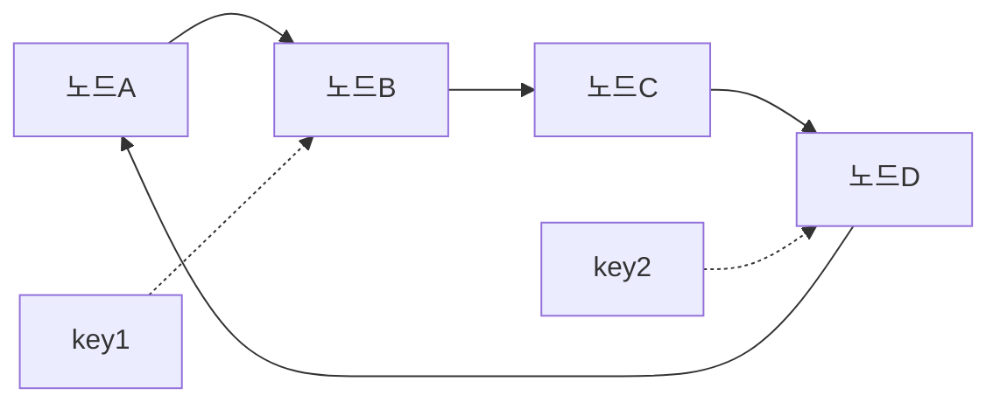
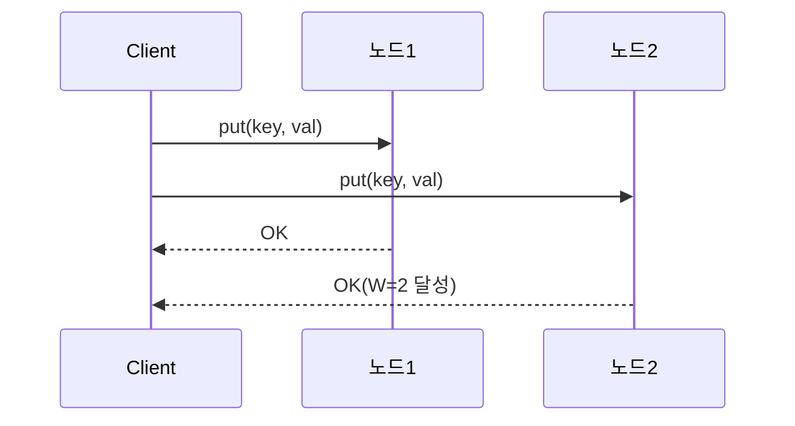
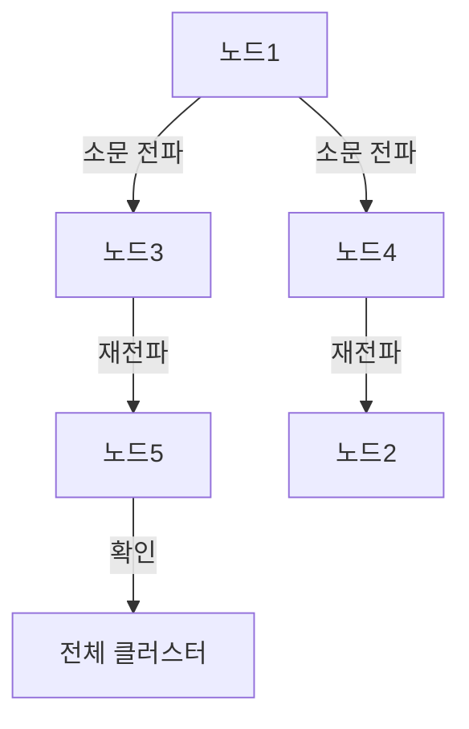
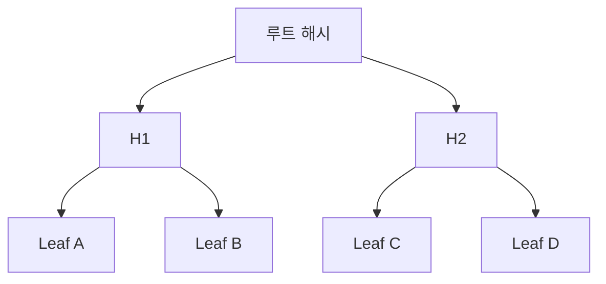
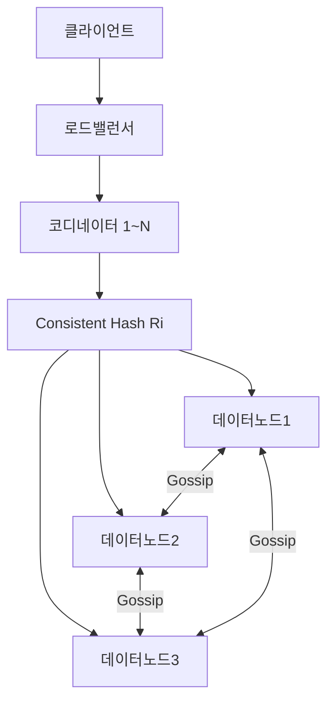
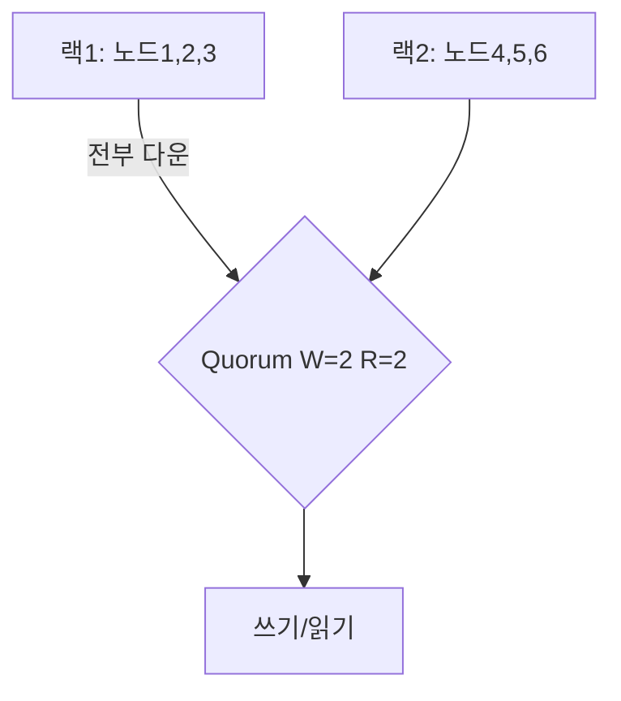

2024년 블랙프라이데이, 아마존의 DynamoDB는 초당 **1억 건** 이상의 요청을 처리했다. Redis는 단일 노드에서 초당 100만 QPS를 넘긴다. 이 숫자들이 가능한 이유는 단순한 "빠른 하드웨어" 때문이 아니다. 데이터를 어떻게 쪼개고, 복제하고, 저장하고, 복구하는지에 관한 수십 년의 공학적 결정이 쌓인 결과다. 이 글은 "면접 답변"이 아니라 **실제로 수백만 QPS를 견디는 Key-Value 스토어가 내부에서 무슨 일을 하는지** 를 처음부터 설계해본다.

---

## 1. 요구사항 분석 + 규모 추정

### 기능 요구사항

- `put(key, value)` — 키-값 저장 (TTL 선택적)
- `get(key)` → value — 키로 조회
- `delete(key)` — 키 삭제
- 값 크기: 최대 10MB (대부분 1KB 이하)
- 키 크기: 최대 256 bytes

### 비기능 요구사항

| 항목 | 목표 |
|------|------|
| 읽기 QPS | 100만 QPS |
| 쓰기 QPS | 50만 QPS |
| 총 데이터 | 100TB |
| 읽기 지연 | p99 < 10ms |
| 쓰기 지연 | p99 < 5ms |
| 가용성 | 99.99% (연간 52분 다운타임 허용) |
| 일관성 | 최종 일관성 (Eventual Consistency) 기본, 강한 일관성 선택적 |

### 규모 추정

> **비유**: 100TB 데이터를 한 서버에 담으려면 4TB 디스크 25개가 필요하다. 하지만 그 서버가 죽으면? 전부 사라진다. 그래서 우리는 데이터를 **수평으로 쪼개고** (파티셔닝), **여러 곳에 복사한다** (복제).

```
읽기: 100만 QPS × 86400초 = 864억 회/일
쓰기: 50만 QPS × 86400초 = 432억 회/일
데이터: 100TB / 1KB 평균 = 약 1000억 개 키
노드당 1TB 저장 → 최소 100개 노드 필요
복제 계수 3 → 실제 300개 노드 (데이터 노드 기준)
단일 노드 처리량 ~10만 QPS → 읽기 10대, 쓰기 5대 필요
안전 여유 3배 → 읽기 30대, 쓰기 15대
```

---

## 2. 데이터 파티셔닝 — Consistent Hashing

### 단순 해싱의 문제

`node = hash(key) % N` — 노드가 N개일 때 이 방식은 직관적이다. 하지만 노드 1개가 추가/삭제되면 **거의 모든 키의 담당 노드가 바뀐다**. 100억 개 키를 가진 클러스터에서 노드 하나를 추가하면? 수십억 건의 데이터 이동이 발생한다.

### Consistent Hashing

> **비유**: 원형 시계판에 서버들을 배치한다. 각 키는 해시값을 기준으로 "시계 방향으로 가장 가까운 서버"에 저장된다. 서버 하나가 사라지면 그 서버가 담당하던 키들만 다음 서버로 이동한다. 전체 키의 `1/N`만 이동한다.



### 가상 노드 (Virtual Nodes)

실제 물리 노드가 100개라도 해시 링에는 **3000개의 가상 노드**를 배치한다. 각 물리 노드가 30개의 가상 노드를 담당한다.

**왜 필요한가?** 물리 노드가 적으면 해시 링에서 "빈 구간"이 생겨 특정 노드에 데이터가 몰린다 (핫 파티션). 가상 노드를 쓰면 데이터가 균등하게 분산된다.

```python
class ConsistentHashRing:
    def __init__(self, virtual_nodes=150):
        self.ring = {}          # hash_position -> node_id
        self.sorted_keys = []   # 정렬된 해시 위치 목록
        self.virtual_nodes = virtual_nodes

    def add_node(self, node_id: str):
        for i in range(self.virtual_nodes):
            # "nodeA:0", "nodeA:1", ... "nodeA:149"
            vnode_key = f"{node_id}:{i}"
            position = self._hash(vnode_key)
            self.ring[position] = node_id
        self.sorted_keys = sorted(self.ring.keys())

    def get_node(self, key: str) -> str:
        h = self._hash(key)
        # 해시 링에서 h 이상인 가장 작은 위치 찾기
        idx = bisect.bisect_right(self.sorted_keys, h)
        if idx == len(self.sorted_keys):
            idx = 0  # 링의 끝 → 처음으로 wrap around
        return self.ring[self.sorted_keys[idx]]

    def _hash(self, key: str) -> int:
        return int(hashlib.md5(key.encode()).hexdigest(), 16)
```

### 핫 파티션 대응

특정 키에 트래픽이 폭발적으로 집중될 때 (예: 유명인 트위터 프로필) 가상 노드만으로는 부족하다.

1️⃣ **키 분산 (Key Sharding)**: `celebrity_id` 대신 `celebrity_id:0` ~ `celebrity_id:9` 로 10개 키에 분산 저장. 읽기 시 랜덤으로 하나를 선택.

2️⃣ **로컬 캐시**: 애플리케이션 서버 메모리에 핫 키를 수 초간 캐시. 스토어까지 요청이 도달하지 않도록.

3️⃣ **읽기 전용 복제본 증설**: 해당 파티션의 복제본 수를 일시적으로 늘려 읽기 부하를 분산.

---

## 3. 데이터 복제 — 장애에서 살아남기

### 리더/팔로워 복제

> **비유**: 사무실에 원본 문서 1개 (리더)와 복사본 2개 (팔로워)가 있다. 수정은 원본에만, 읽기는 복사본에서도 가능하다.

모든 쓰기는 리더로 가고, 리더가 팔로워에게 변경사항을 전파한다. 리더가 죽으면 팔로워 중 하나가 새 리더가 된다.

**장점**: 단순, 강한 일관성 보장 용이
**단점**: 리더가 쓰기 병목, 리더 장애 시 페일오버 지연 (수 초~수십 초)

### 리더리스 복제 (Dynamo 스타일)

> **비유**: 사무실에 복사본이 3개 있고, 누구나 수정할 수 있다. 단, 수정 사실을 3개 중 최소 2개에 알려야 "쓰기 완료"로 인정한다.

DynamoDB, Cassandra, Riak이 이 방식을 쓴다. 리더 없이 모든 노드가 읽기/쓰기를 처리할 수 있다.



### Quorum — W + R > N

리더리스 복제에서 일관성을 보장하는 핵심 공식:

- **N**: 복제 노드 수 (보통 3 또는 5)
- **W**: 쓰기 성공 응답을 기다릴 노드 수
- **R**: 읽기 응답을 기다릴 노드 수

`W + R > N` 이면 최소 1개 노드가 쓰기와 읽기 모두에 참여한다 → 최신 데이터를 반드시 읽는다.

| N | W | R | 설명 |
|---|---|---|------|
| 3 | 2 | 2 | 균형 (일반 설정) |
| 3 | 3 | 1 | 쓰기 강화 — 쓰기 느림, 읽기 빠름 |
| 3 | 1 | 3 | 읽기 강화 — 읽기 느림, 쓰기 빠름 |
| 3 | 1 | 1 | W+R=2 ≤ N=3 → 일관성 보장 안 됨 (최고 성능) |

```python
class QuorumStore:
    def __init__(self, nodes: list, N=3, W=2, R=2):
        self.nodes = nodes
        self.W, self.R = W, R

    def put(self, key: str, value: bytes) -> bool:
        target_nodes = self._get_nodes(key, count=self.N)
        futures = [node.put_async(key, value) for node in target_nodes]
        # W개의 성공 응답을 기다림
        successes = sum(1 for f in futures if f.result(timeout=5) == "OK")
        return successes >= self.W

    def get(self, key: str) -> bytes:
        target_nodes = self._get_nodes(key, count=self.N)
        responses = []
        for node in target_nodes:
            try:
                responses.append(node.get(key))
                if len(responses) >= self.R:
                    break
            except NodeException:
                continue
        # 가장 최신 버전 반환 (벡터 클럭으로 비교)
        return self._resolve_conflict(responses)
```

---

## 4. 일관성 모델 — 얼마나 "신선한" 데이터가 필요한가

### 강한 일관성 vs 최종 일관성

> **비유**: 은행 잔고는 **강한 일관성** — 어떤 창구에서 조회해도 같은 잔고를 보여줘야 한다. 소셜 미디어 "좋아요" 수는 **최종 일관성** — 1초 뒤에 업데이트돼도 사용자는 불편을 못 느낀다.

| 모델 | 보장 | 대표 사용처 | 성능 |
|------|------|------------|------|
| 강한 일관성 | 읽으면 항상 최신 데이터 | 금융 거래, 재고 | 느림 |
| 단조 읽기 | 한 번 읽은 버전보다 오래된 데이터 안 읽음 | 사용자 프로필 | 중간 |
| 읽기-쓰기 | 자신이 쓴 데이터는 바로 읽힘 | 내 게시물 조회 | 중간 |
| 최종 일관성 | 결국엔 같아지지만 시간 걸림 | 조회수, 좋아요 | 빠름 |

### Vector Clock으로 충돌 감지

리더리스 복제에서는 두 노드가 동시에 같은 키를 업데이트할 수 있다. 어느 것이 최신인가?

> **비유**: 구글 독스에서 두 사람이 동시에 같은 문단을 수정했다. "마지막으로 저장된 것" 대신, **누가 언제 어떤 버전을 기반으로 수정했는지** 추적하면 진짜 충돌만 사용자에게 알릴 수 있다.

```python
class VectorClock:
    def __init__(self):
        # {node_id: lamport_time}
        self.clock = {}

    def increment(self, node_id: str):
        self.clock[node_id] = self.clock.get(node_id, 0) + 1

    def merge(self, other: 'VectorClock'):
        for node_id, t in other.clock.items():
            self.clock[node_id] = max(self.clock.get(node_id, 0), t)

    def happened_before(self, other: 'VectorClock') -> bool:
        # self가 other보다 "이전에 발생"했는가?
        return (all(self.clock.get(k, 0) <= other.clock.get(k, 0)
                    for k in set(self.clock) | set(other.clock))
                and self.clock != other.clock)

    def concurrent_with(self, other: 'VectorClock') -> bool:
        # 둘 다 "이전"이 아님 → 동시 업데이트 (충돌!)
        return (not self.happened_before(other)
                and not other.happened_before(self))
```

충돌이 감지되면 두 버전을 모두 저장하고 다음 읽기 시 애플리케이션이 해결하게 한다 (DynamoDB의 "last writer wins" 또는 Cassandra의 수동 머지).

---

## 5. 장애 감지 — 죽은 노드를 어떻게 아는가

### Gossip Protocol

> **비유**: 소문이 퍼지는 방식. "A가 노드B 죽었다고 들었어"를 C한테 말하고, C는 D한테 전달한다. 결국 모든 노드가 노드B의 상태를 알게 된다. 중앙 코디네이터 없이도 클러스터 전체에 정보가 퍼진다.



매 초마다 각 노드는 랜덤으로 `fanout=3` 개의 이웃 노드에게 자신의 상태 테이블을 전송한다. 수신자는 자신의 테이블과 병합한다. `O(log N)` 라운드 만에 전체 클러스터에 정보가 퍼진다.

```python
class GossipNode:
    def __init__(self, node_id: str, fanout=3):
        self.node_id = node_id
        self.fanout = fanout
        # {node_id: (heartbeat_counter, local_time)}
        self.membership_table = {node_id: (0, time.time())}

    def gossip_round(self, all_nodes: list):
        # 1. 자신의 heartbeat 증가
        counter, _ = self.membership_table[self.node_id]
        self.membership_table[self.node_id] = (counter + 1, time.time())

        # 2. fanout 개의 랜덤 노드에게 테이블 전송
        targets = random.sample([n for n in all_nodes if n != self], self.fanout)
        for target in targets:
            target.receive_gossip(self.membership_table)

    def receive_gossip(self, remote_table: dict):
        for node_id, (remote_counter, _) in remote_table.items():
            local_counter, _ = self.membership_table.get(node_id, (0, 0))
            if remote_counter > local_counter:
                self.membership_table[node_id] = (remote_counter, time.time())

    def get_failed_nodes(self, timeout=10.0) -> list:
        now = time.time()
        return [nid for nid, (_, t) in self.membership_table.items()
                if now - t > timeout and nid != self.node_id]
```

### Phi Accrual Failure Detector

단순한 타임아웃 ("10초 이상 응답 없으면 죽었다") 대신, 과거 heartbeat 간격의 통계를 사용해 **"현재 노드가 죽었을 확률"** 을 실수값으로 계산한다. Akka, Cassandra가 사용한다.

φ 값이 특정 임계값 (보통 8~10)을 넘으면 장애로 판단한다. 네트워크 지연이 일시적으로 증가해도 오탐을 줄인다.

---

## 6. 장애 복구 — 죽었다 살아난 노드에게 데이터 돌려주기

### Hinted Handoff

> **비유**: 이웃이 여행 중일 때 택배를 내가 대신 받아둔다. 이웃이 돌아오면 "이거 너 꺼야" 라며 건네준다.

노드 B가 일시적으로 다운됐을 때, 원래 B에게 가야 할 쓰기를 임시로 다른 노드 C가 "힌트"와 함께 저장해둔다. B가 복구되면 C가 힌트된 데이터를 B에게 전달한다.

```python
class HintedHandoff:
    def write_with_hint(self, key: str, value: bytes,
                        target_node: str, coordinator_node: str):
        hint = {
            "target_node": target_node,  # 원래 담당 노드
            "key": key,
            "value": value,
            "hint_ts": time.time()
        }
        # coordinator에 힌트 저장 (target 복구 후 전달 예정)
        self.hint_store.append(coordinator_node, hint)

    def replay_hints_for(self, recovered_node: str):
        hints = self.hint_store.get_hints_for(recovered_node)
        for hint in hints:
            try:
                recovered_node.put(hint["key"], hint["value"])
                self.hint_store.delete(hint)
            except Exception:
                pass  # 다음 라운드에 재시도
```

### Anti-Entropy — Merkle Tree로 노드 간 불일치 찾기

Hinted Handoff는 단기 장애에 효과적이지만, 노드가 오래 다운됐거나 네트워크 파티션이 발생하면 데이터 불일치가 누적된다. 이를 감지하고 복구하는 것이 Anti-Entropy다.

> **비유**: 두 도서관이 같은 책을 보유하는지 확인하려면, 모든 책 목록을 교환하는 대신 **전체 책의 "체크섬 체크섬"** 만 비교한다. 다르면 절반씩 좁혀가며 어느 선반에서 다른지 찾는다. 이것이 Merkle Tree다.



두 노드의 루트 해시가 같으면 → 완전히 동일. 다르면 자식 노드로 내려가며 어느 범위에서 불일치가 생겼는지 `O(log N)` 만에 찾는다. **전체 데이터 비교 없이 불일치 범위만 전송.**

### Read Repair

읽기 시 R개 노드에서 응답을 받았을 때 버전이 다르면, 백그라운드에서 오래된 노드에게 최신 데이터를 보내 수정한다. 읽기 트래픽이 자동으로 일관성을 회복시킨다.

---

## 7. 저장 엔진 — 디스크에 어떻게 쓰는가

### LSM Tree (Log-Structured Merge Tree)

> **비유**: 메모장에 일단 빠르게 받아 적고 (MemTable), 나중에 정리해서 파일로 옮긴다 (SSTable). 그리고 주기적으로 여러 파일을 하나로 합친다 (Compaction). 항상 순차 쓰기라 디스크 I/O가 최소화된다.


**쓰기 경로**:
1️⃣ WAL(Write-Ahead Log)에 순차 기록 — 크래시 복구용
2️⃣ 메모리의 MemTable (Red-Black Tree)에 삽입 — O(log N)
3️⃣ MemTable이 임계값 (보통 64MB)을 넘으면 → 불변 SSTable로 플러시

**읽기 경로**:
1️⃣ MemTable 조회 → 없으면
2️⃣ 최신 L0 SSTable부터 순서대로 탐색 (Bloom Filter로 불필요한 디스크 접근 제거)

**Compaction**: 여러 SSTable을 합쳐 삭제된 키 (tombstone)를 제거하고, 오래된 버전을 정리한다. 읽기 성능 유지의 핵심.

```python
class LSMTree:
    def __init__(self, memtable_limit=64 * 1024 * 1024):  # 64MB
        self.memtable = SortedDict()   # 메모리 내 정렬 구조
        self.memtable_size = 0
        self.wal = WAL("wal.log")
        self.sstables = []             # 디스크의 SSTable 목록 (최신순)
        self.bloom_filters = []

    def put(self, key: str, value: bytes):
        # 1. WAL에 먼저 기록 (내구성 보장)
        self.wal.append(key, value)
        # 2. MemTable에 삽입
        self.memtable[key] = value
        self.memtable_size += len(key) + len(value)
        # 3. 임계값 초과 시 SSTable로 플러시
        if self.memtable_size >= self.memtable_limit:
            self._flush_to_sstable()

    def get(self, key: str) -> bytes | None:
        # 1. MemTable 조회
        if key in self.memtable:
            return self.memtable[key]
        # 2. SSTable 역순 탐색 (최신 파일부터)
        for bf, sst in zip(self.bloom_filters, self.sstables):
            if bf.might_contain(key):  # Bloom Filter 통과한 것만
                result = sst.get(key)
                if result is not None:
                    return result
        return None

    def delete(self, key: str):
        # 삭제 = tombstone 값 쓰기 (즉시 제거 아님)
        self.put(key, TOMBSTONE)

    def _flush_to_sstable(self):
        # 정렬된 순서로 디스크에 쓰기 (순차 I/O)
        sst = SSTable.write(sorted(self.memtable.items()))
        bf = BloomFilter.build(self.memtable.keys())
        self.sstables.insert(0, sst)
        self.bloom_filters.insert(0, bf)
        self.memtable.clear()
        self.memtable_size = 0
        self.wal.truncate()
```

### B-Tree vs LSM Tree 비교

| 항목 | B-Tree | LSM Tree |
|------|--------|----------|
| 쓰기 성능 | 중간 (랜덤 I/O) | **높음** (순차 I/O) |
| 읽기 성능 | **높음** (인플레이스) | 중간 (여러 파일 탐색) |
| 공간 증폭 | 낮음 | 중간 (Compaction 전) |
| 쓰기 증폭 | 낮음 | 높음 (Compaction 반복) |
| 대표 시스템 | PostgreSQL, MySQL | RocksDB, Cassandra, LevelDB |
| 적합한 워크로드 | 읽기 많은 OLTP | 쓰기 많은 워크로드 |

KV 스토어에서는 쓰기 처리량이 핵심이므로 **LSM Tree**가 표준이다. RocksDB (Facebook 개발)를 저장 엔진으로 채택하면 DynamoDB, TiKV, CockroachDB 수준의 쓰기 성능을 낼 수 있다.

---

## 8. WAL — 크래시에서 살아남기

> **비유**: 요리사가 레시피대로 요리하다 기절했다. 일지(WAL)에 "3단계까지 완료"라고 적혀 있어서 깨어난 뒤 4단계부터 재개할 수 있다. 일지 없이 기억에만 의존했다면 처음부터 다시 해야 한다.

WAL은 모든 쓰기를 **디스크에 먼저** 기록한다. MemTable이 메모리에 있어 프로세스 크래시 시 사라지더라도, WAL을 재생(replay)해서 복구한다.

**fsync 정책 — 성능과 내구성의 트레이드오프**:

| 정책 | 설명 | 성능 | 내구성 |
|------|------|------|--------|
| `fsync=always` | 매 쓰기마다 디스크 동기화 | 가장 느림 | 최고 |
| `fsync=per_second` | 1초마다 동기화 | 중간 | 최대 1초치 손실 가능 |
| `fsync=no` | OS 버퍼에 맡김 | 가장 빠름 | 크래시 시 손실 |

Redis의 기본값은 `appendfsync everysec` — 초당 1회 fsync로 성능과 내구성을 균형. 금융 거래에는 `always`, 캐시 용도라면 `no`도 허용된다.

```python
class WAL:
    def __init__(self, path: str, fsync_policy="per_second"):
        self.file = open(path, "ab")
        self.fsync_policy = fsync_policy
        self.last_fsync = time.time()

    def append(self, key: str, value: bytes):
        # TLV(Type-Length-Value) 포맷으로 직렬화
        entry = struct.pack(">HI", len(key.encode()), len(value))
        entry += key.encode() + value
        entry += struct.pack(">I", crc32(entry))  # 체크섬
        self.file.write(entry)

        if self.fsync_policy == "always":
            os.fsync(self.file.fileno())
        elif self.fsync_policy == "per_second":
            if time.time() - self.last_fsync >= 1.0:
                os.fsync(self.file.fileno())
                self.last_fsync = time.time()

    def replay(self) -> list:
        # 크래시 복구: WAL 파일을 처음부터 읽어 MemTable 재구성
        entries = []
        self.file.seek(0)
        while chunk := self.file.read(6):
            key_len, val_len = struct.unpack(">HI", chunk)
            key = self.file.read(key_len).decode()
            value = self.file.read(val_len)
            checksum = struct.unpack(">I", self.file.read(4))[0]
            # 체크섬 검증 — 손상된 엔트리는 건너뜀
            if self._verify_checksum(key, value, checksum):
                entries.append((key, value))
        return entries
```

---

## 9. Bloom Filter — "없는 키" 조회를 빠르게 거르기

> **비유**: 도서관에 어떤 책이 있는지 물어볼 때, 사서가 모든 선반을 뒤지기 전에 "그 책 없어요"라고 확실히 말할 수 있는 작은 메모장이다. 다만 "있어요"라고 말하면 실제로 없을 수도 있다 (false positive). "없어요"는 항상 맞다 (false negative 없음).

LSM Tree에서 없는 키를 조회하면 모든 SSTable을 뒤져야 한다 (최악의 경우 수십 개 파일). Bloom Filter가 "이 파일에 이 키 없음"을 99% 확률로 정확하게 걸러준다.

```python
class BloomFilter:
    def __init__(self, capacity: int, false_positive_rate=0.01):
        # 최적 비트 수 계산: m = -n*ln(p) / (ln(2)^2)
        self.size = int(-capacity * math.log(false_positive_rate)
                        / (math.log(2) ** 2))
        # 최적 해시 함수 수: k = (m/n) * ln(2)
        self.hash_count = max(1, int((self.size / capacity) * math.log(2)))
        self.bits = bytearray(self.size // 8 + 1)

    def add(self, key: str):
        for seed in range(self.hash_count):
            h = mmh3.hash(key, seed) % self.size
            self.bits[h // 8] |= (1 << (h % 8))

    def might_contain(self, key: str) -> bool:
        # False: 확실히 없음 / True: 있을 수도 있음
        return all(
            (self.bits[h // 8] >> (h % 8)) & 1
            for seed in range(self.hash_count)
            for h in [mmh3.hash(key, seed) % self.size]
        )
```

false positive rate 1%의 의미: 없는 키 100개를 조회하면 1개는 "있을 수도 있다"고 잘못 판단해 디스크를 뒤진다. 99개는 즉시 "없음"으로 응답한다. 디스크 I/O 99% 절감.

메모리 사용량: capacity=1억, FPR=1%일 때 약 **114MB**. 10억 키도 1.14GB로 관리 가능.

---

## 10. TTL 처리 — 언제 키를 삭제하는가

### Lazy Expiration (지연 만료)

키를 읽을 때 TTL을 확인해서 만료됐으면 삭제하고 `null`을 반환한다. 백그라운드 작업 없음.

```python
def get(self, key: str):
    entry = self.store.get(key)
    if entry is None:
        return None
    if entry.expiry and time.time() > entry.expiry:
        self.store.delete(key)  # 접근 시점에 삭제
        return None
    return entry.value
```

**단점**: 만료된 키가 오래 메모리를 차지할 수 있다. 아무도 조회하지 않는 키는 영원히 남는다.

### Active Expiration (능동 만료)

백그라운드 스레드가 주기적으로 만료 키를 스캔해서 삭제한다. Redis는 두 방식을 모두 사용한다: 매 100ms마다 랜덤 샘플링으로 만료 키를 삭제하고, 조회 시 Lazy 방식으로 보완한다.

```python
class TTLManager:
    def __init__(self):
        # TTL 인덱스: {expiry_timestamp: [keys]}
        self.expiry_index = SortedDict()

    def set_ttl(self, key: str, ttl_seconds: int):
        expiry = time.time() + ttl_seconds
        self.expiry_index.setdefault(expiry, []).append(key)

    def active_expire_loop(self):
        while True:
            now = time.time()
            expired_times = [t for t in self.expiry_index if t <= now]
            for t in expired_times:
                for key in self.expiry_index.pop(t):
                    self.store.delete(key)
            time.sleep(0.1)  # 100ms마다 실행
```

**분산 환경 주의**: 노드 간 시계가 다를 수 있다 (clock skew). NTP로 동기화해도 수 ms 오차가 있다. TTL이 짧은 키 (< 1초)는 시계 오차로 예상보다 일찍 또는 늦게 만료될 수 있다.

---

## 11. 전체 아키텍처



**요청 흐름**:

1️⃣ 클라이언트가 아무 코디네이터에게 요청 전송
2️⃣ 코디네이터가 Consistent Hash로 담당 노드 결정
3️⃣ 해당 노드 + 복제 노드들에게 병렬 요청
4️⃣ Quorum (W=2, R=2, N=3) 달성 시 클라이언트에 응답
5️⃣ 백그라운드에서 Gossip으로 노드 상태 공유

---

## 12. 보안 고려사항

> **비유**: KV 스토어는 도서관 서고다. 열람증(인증) 없이 들어오는 사람은 막아야 하고, 책 내용(데이터)이 유출되어도 읽을 수 없게 암호화해야 하며, 서고 자체를 외부에서 보이지 않게 해야 한다 (네트워크 격리).

### 인증 (Authentication)

**Redis**: 기본 설정에 인증 없음. 반드시 `requirepass` 또는 ACL(Access Control List)을 설정해야 한다.

```
# redis.conf
requirepass <strong_password>

# ACL 설정 (Redis 6+)
# 읽기 전용 사용자
ACL SETUSER readonly on >readonly_pass ~* &* +get +mget +hget
# 쓰기 사용자 (특정 키 패턴만)
ACL SETUSER appuser on >app_pass ~app:* +get +set +del
```

**DynamoDB**: IAM 역할 기반 인증. 특정 테이블·접두사·속성에만 접근 권한 부여 가능.

### 전송 암호화 (Encryption in Transit)

Redis: TLS (`tls-port 6380`, `tls-cert-file` 설정)
DynamoDB: 기본으로 HTTPS 강제

내부 노드 간 통신도 TLS가 필요하다. 내부 네트워크라도 측면 이동(lateral movement) 공격을 막아야 한다.

### 저장 암호화 (Encryption at Rest)

DynamoDB: 기본 AWS KMS 암호화 (CMK 선택 가능)
Redis: 저장 암호화 없음 → 디스크 파일 접근 시 plaintext. OS 레벨 암호화 (LUKS) 또는 RDB 파일 자체 암호화 필요.

### 네트워크 격리

```
# VPC 설계 원칙
인터넷 → 없음 (KV 스토어는 Public Subnet 금지)
앱 서버 → KV 스토어: 특정 포트만 허용 (Redis: 6379, DynamoDB: 443)
KV 스토어 → 외부: 아웃바운드 최소화
모니터링: 별도 관리 네트워크
```

**Redis 실무 실수**: 개발 편의로 `bind 0.0.0.0`과 `protected-mode no`를 동시에 설정하고 방화벽 없이 운영. 2017년 수만 대의 Redis 서버가 이 방식으로 랜섬웨어에 감염됐다.

---

## 13. 극한 시나리오 3가지

### 시나리오 1: 핫 키 — 특정 키에 QPS 100만 집중

**상황**: BTS 새 앨범 발매 직후 `artist:BTS:info` 키에 초당 100만 건이 집중된다. 해당 파티션 노드 1대가 감당할 수 없다.


**대응**:

1️⃣ **로컬 캐시**: 앱 서버 메모리에 핫 키를 5초간 캐시. 99%의 요청이 KV 스토어에 도달하지 않음.

2️⃣ **키 복제**: `artist:BTS:info:0` ~ `artist:BTS:info:9` 로 10개 키에 같은 데이터를 저장. 읽기 시 `random.randint(0,9)` 로 랜덤 선택 → 부하가 10개 파티션으로 분산.

3️⃣ **읽기 전용 복제본 동적 증설**: 해당 파티션에 자동으로 읽기 복제본을 추가. DynamoDB DAX (캐시 계층) 활용.

### 시나리오 2: 노드 3대 동시 장애

**상황**: 데이터센터 랙(Rack) 하나에 화재가 발생해 노드 3대가 동시에 다운됐다. 복제 계수 N=3이고 3개 노드가 같은 랙에 배치된 경우.



**근본 원인**: 복제 배치 정책 부재. Consistent Hash Ring은 데이터를 균등하게 분산하지만, **물리적 위치**를 고려하지 않으면 같은 랙에 여러 복제본이 배치될 수 있다.

**대응**:
- **Rack-aware 복제**: 복제본 N개를 서로 다른 랙에 배치 (Cassandra의 `NetworkTopologyStrategy`)
- **AZ-aware 복제**: AWS 환경이면 복제본을 서로 다른 가용 영역(AZ)에 분산
- **최소 N=5 고려**: 3대 동시 장애에도 W+R>N을 맞추려면 N=5, W=3, R=3

```python
class RackAwareRing:
    def get_replica_nodes(self, key: str, N: int) -> list:
        all_nodes = self._get_ring_order(key)
        selected = []
        selected_racks = set()
        for node in all_nodes:
            if node.rack not in selected_racks:
                selected.append(node)
                selected_racks.add(node.rack)
            if len(selected) == N:
                break
        return selected
```

### 시나리오 3: 데이터 100TB 리밸런싱

**상황**: 클러스터 용량 부족으로 노드 100대를 추가한다. 기존 100TB를 새 노드들에게 이동시켜야 한다.

**계산**: 100TB / 100대 추가 = 1TB 이동 필요. 네트워크 대역폭 노드당 1Gbps라면 최소 `1TB / 1Gbps ≈ 8000초 ≈ 2.2시간`. 이 동안 서비스는 계속 운영돼야 한다.

**문제점**: 리밸런싱 중 해당 키를 읽으면 아직 이동 안 된 노드를 볼 수도, 이미 이동된 새 노드를 볼 수도 있다.

**대응**:

1️⃣ **단계적 노드 추가**: 100대를 한 번에 추가하지 않고 10대씩 나눠서. 데이터 이동량과 네트워크 충격을 분산.

2️⃣ **이중 쓰기 (Dual Write)**: 리밸런싱 완료 전까지 기존 노드와 새 노드 **모두**에 쓰기. 읽기는 새 노드에서 하되, 없으면 기존 노드 폴백.

3️⃣ **쓰로틀링**: 리밸런싱 대역폭을 제한 (예: 노드당 100Mbps). 서비스 트래픽 대역폭을 보호.

4️⃣ **블루/그린 리밸런싱**: 새 클러스터를 병렬 구성하고, 트래픽을 점진적으로 전환 (1% → 10% → 50% → 100%). 가장 안전하지만 비용이 2배.

---

## 14. 실제 시스템 비교: Redis vs DynamoDB vs Cassandra

| 항목 | Redis | DynamoDB | Cassandra |
|------|-------|----------|-----------|
| 저장소 | 메모리 (선택적 디스크) | SSD (클라우드) | SSD |
| 일관성 | 강한 일관성 (단일) | 강한/최종 선택 | 최종 일관성 기본 |
| 복제 | 리더/팔로워 | 자동 3 AZ | 리더리스 (N/W/R) |
| 파티셔닝 | 슬롯 기반 (16384 슬롯) | 자동 (무제한) | Consistent Hash |
| 저장 엔진 | 직접 구현 (해시/리스트/셋) | B-Tree 계열 | LSM Tree |
| p99 읽기 지연 | < 1ms | 1~5ms | 1~10ms |
| 최대 데이터 | RAM 크기 (수십 GB) | 무제한 | 수 PB |
| 쓰기 모델 | 단일 리더 | 자동 샤딩 | 멀티 마스터 |
| 관리 복잡도 | 낮음 | 매우 낮음 (관리형) | 높음 |
| 비용 | 메모리 비쌈 | 요청 기반 과금 | 자체 운영 |
| 대표 사용처 | 세션 캐시, 실시간 순위표 | 이커머스, 게임 | IoT, 로그, 시계열 |

**언제 무엇을?**

- **Redis**: 지연이 극단적으로 중요하고 데이터가 RAM에 들어가는 경우. 세션, 캐시, 실시간 카운터.
- **DynamoDB**: 관리 오버헤드를 최소화하고 싶고, AWS 환경에서 자동 스케일링이 필요한 경우. 이커머스, 게임 사용자 데이터.
- **Cassandra**: 쓰기가 극단적으로 많고 (이벤트 로그, IoT), 멀티 리전 Active-Active가 필요한 경우.

---

## 15. 면접 포인트 5개

**1️⃣ "Consistent Hashing이 왜 필요한가?"**

단순 `hash(key) % N` 대신 Consistent Hashing을 쓰면 노드 추가/삭제 시 이동하는 키가 `1/N`으로 줄어든다. 100개 노드에서 1개 추가 시 전체 키의 1%만 이동. 서비스 중단 없는 스케일 아웃의 핵심.

**2️⃣ "W + R > N이면 항상 강한 일관성인가?"**

아니다. W+R>N은 **최신 데이터를 읽을 가능성**을 보장하지만 완전한 선형화(linearizability)는 아니다. 쓰기가 진행 중일 때 동시에 읽으면 여전히 구 버전을 읽을 수 있다. 완전한 강한 일관성을 위해서는 리더 기반 복제 + 동기 복제가 필요하다.

**3️⃣ "Bloom Filter의 false positive가 문제가 되는 경우는?"**

일반적으로 false positive는 불필요한 디스크 I/O만 유발한다. 하지만 **보안 목적** (특정 키 접근 차단 등)에 Bloom Filter를 쓰면 false positive로 정상 접근을 막거나 비정상 접근을 허용하는 버그가 생긴다. Bloom Filter는 성능 최적화 전용.

**4️⃣ "CRDT vs Vector Clock — 언제 무엇을 쓰는가?"**

Vector Clock은 충돌을 **감지**해서 애플리케이션이 해결하게 한다. CRDT (Conflict-free Replicated Data Type)는 **항상 자동으로 머지 가능한** 데이터 구조다 (Counter, Set 등). "좋아요 수"처럼 교환 법칙이 성립하는 연산은 CRDT로, "사용자 프로필"처럼 의미 있는 머지가 필요한 건 Vector Clock + 수동 처리.

**5️⃣ "Redis 클러스터 vs Redis Sentinel 차이는?"**

| 항목 | Sentinel | Cluster |
|------|----------|---------|
| 목적 | HA (고가용성) | 샤딩 + HA |
| 데이터 분산 | X (단일 마스터) | O (16384 슬롯) |
| 최대 데이터 | 단일 서버 RAM | N대 합산 RAM |
| 복잡도 | 낮음 | 높음 |
| 적합 상황 | RAM 충분, 단순함 원함 | 대규모 확장 필요 |

Sentinel은 "죽으면 자동으로 페일오버", Cluster는 "죽으면 페일오버 + 데이터를 여러 노드에 분산".

---

## 16. 실무 실수 모음

**실수 1: Redis를 영구 스토어로 사용**
`appendonly yes` + `appendfsync always`를 설정하더라도 Redis는 메모리 중심 설계라 대용량 데이터(수십 GB 이상)에서 RDB 스냅샷이 수 분 걸리고 메모리 2배 사용. 영구 저장이 필요하면 RocksDB 기반 스토어를 쓰거나, Redis는 캐시 계층으로만 활용하라.

**실수 2: TTL 없이 세션 저장**
`SET session:user_id <data>` 만 하고 EXPIRE를 빠뜨리면 로그아웃해도 세션이 영원히 Redis에 남는다. 수백만 사용자 서비스에서 수십 GB의 좀비 세션이 쌓여 OOM을 유발한다. 항상 `SET key value EX 3600` 처럼 TTL을 함께 설정.

**실수 3: Quorum을 W=1, R=1로 설정 (성능 우선)**
"빠르니까"라는 이유로 W+R=2 ≤ N=3 설정. 쓰기 직후 읽으면 아직 복제 안 된 노드에서 구 버전이 읽힌다. 결제 처리, 재고 차감 등에서 이 설정은 데이터 불일치를 유발한다.

**실수 4: Compaction 백로그 무시**
LSM Tree 기반 스토어에서 쓰기가 폭발하면 Compaction이 따라가지 못해 SSTable이 수천 개로 늘어난다. 읽기 성능이 선형으로 저하된다. `max_write_buffer_number`, `level0_slowdown_writes_trigger` 등 백프레셔(backpressure) 설정이 필수.

**실수 5: 모든 노드를 같은 랙에 배치**
클라우드 환경에서 인스턴스를 특정 AZ 하나에 몰아넣으면 AZ 장애 시 전체 클러스터 다운. 복제본은 반드시 다른 AZ(또는 랙)에 배치하고, Placement Group은 신중히 사용하라.

---

## 17. 핵심 설계 결정 요약

| 결정 | 선택 | 이유 |
|------|------|------|
| 파티셔닝 | Consistent Hash + 가상 노드 | 노드 추가/삭제 시 1/N 키만 이동 |
| 복제 | 리더리스, N=3, W=2, R=2 | 단일 장애점 없음, 가용성 최대화 |
| 일관성 | 최종 일관성 기본 | 성능 우선, 충돌은 Vector Clock |
| 장애 감지 | Gossip + Phi Accrual | 중앙 코디네이터 없이 O(log N) 수렴 |
| 저장 엔진 | LSM Tree (RocksDB) | 쓰기 50만 QPS, 순차 I/O 최적 |
| 내구성 | WAL + fsync per second | 크래시 복구 + 성능 균형 |
| 읽기 최적화 | Bloom Filter (FPR 1%) | 없는 키 조회 디스크 I/O 99% 절감 |
| TTL | Lazy + Active 혼합 | Redis 방식, 메모리 회수 + 정확성 |
| 보안 | ACL + TLS + VPC 격리 | 심층 방어 (Defense in Depth) |
| 핫 파티션 | 키 분산 + 로컬 캐시 | 단일 파티션 병목 해소 |
