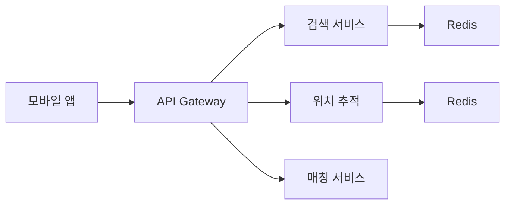
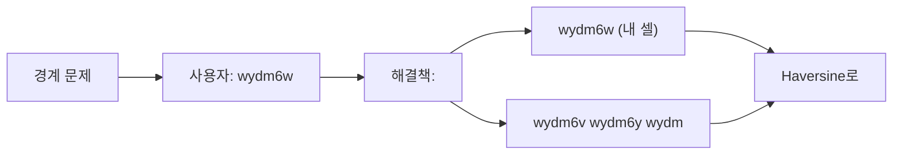
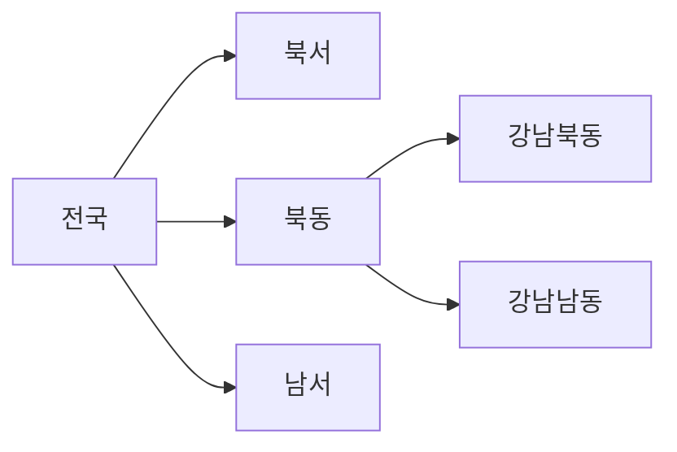
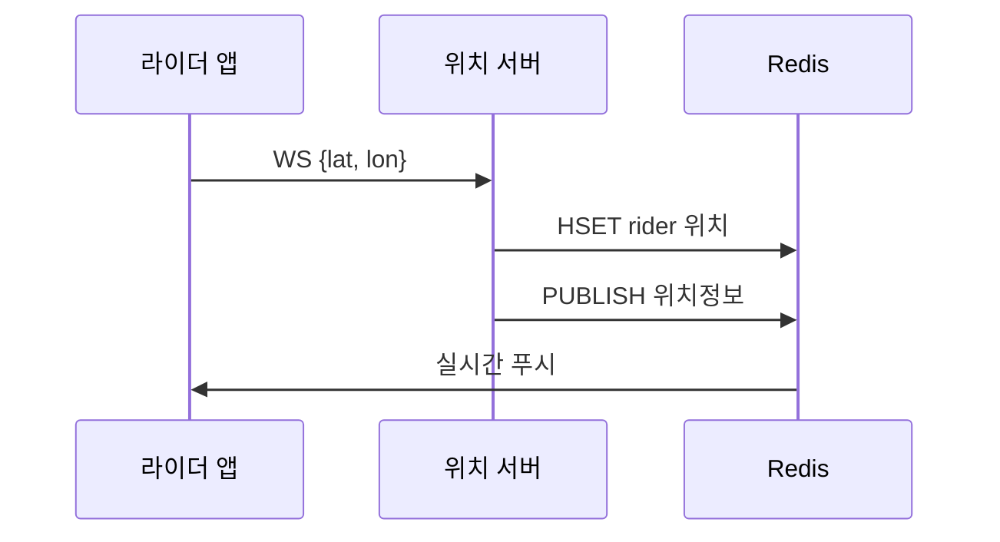
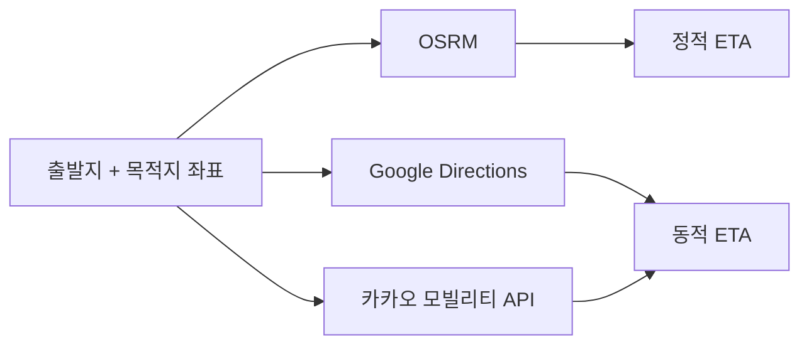

> **한 줄 요약**: 위치 기반 서비스의 핵심은 Geohash로 2차원 좌표를 1차원 문자열로 변환하여 B-Tree 인덱스로 근접 검색하고, Redis + Pub/Sub로 라이더 위치를 실시간 전파하는 것이다.

## 실제 문제: "지금 내 주변 치킨집을 찾아줘"

점심시간 12시, 서울에서 3000만 명이 동시에 배달 앱을 켜고 "주변 가게 검색" 버튼을 누릅니다. 각 사용자의 GPS 좌표를 받아서 반경 3km 내 가게를 찾고, 실시간으로 라이더 위치를 추적하면서, 0.1초 안에 응답해야 합니다.

단순히 생각하면 `SELECT * FROM shops WHERE lat BETWEEN ? AND ?`로 해결할 것 같습니다. 하지만 위도-경도 2차원 쿼리를 MySQL 풀스캔으로 처리하면 50만 개 가게 기준 응답 시간이 수 초가 됩니다. 배달의민족이 실제로 사용하는 방법은 전혀 다릅니다.

---

## 설계 의사결정 로드맵

위치 기반 서비스를 설계할 때 순서대로 답해야 할 핵심 결정 4가지다. 각 결정에서 "왜 이 선택인가"를 명확히 하지 않으면 면접에서 "그냥 MySQL에 위도·경도 컬럼 만들면 되지 않나요?"라는 후속 질문에 답할 수 없다.

### 결정 1: 공간 인덱싱 — Geohash vs Quadtree vs R-Tree

**문제**: 서울 50만 개 가게 중 내 주변 3km를 0.1초 안에 찾으려면 어떤 인덱스 구조가 필요한가?

| 후보 | 장점 | 단점 | 언제 적합 |
|------|------|------|----------|
| Geohash | 문자열이라 B-Tree 인덱스 활용 가능, Redis 키로 직접 사용 | 셀 크기 고정, 경계 문제 수동 처리 필요 | 배달 앱, 일반 LBS |
| Quadtree | 인구 밀도 따라 자동 세분화, 도시마다 다른 밀도 대응 | 구현 복잡, 트리 불균형 가능 | Uber처럼 수백 도시 운영 |
| R-Tree (MySQL Spatial Index) | 반경·다각형 쿼리에 최적, DB 내장 지원 | 삽입/삭제 시 재조정 비용, Geohash보다 오버헤드 큼 | PostGIS 기반 GIS 시스템 |

**우리의 선택: Geohash**
- 이유: 문자열 prefix 매칭이 가능하므로 일반 B-Tree 인덱스로 근접 검색이 된다. Redis 키(`shops:wydm6w:chicken`)로 바로 사용할 수 있어 캐싱 계층 설계가 자연스럽다. 인접 9개 셀 + Haversine 2단계 필터링으로 경계 문제를 실용적으로 해결한다.
- 안 하면: MySQL `WHERE lat BETWEEN ? AND ? AND lon BETWEEN ? AND ?`는 2차원 범위 쿼리로 인덱스 1개밖에 효과적으로 사용하지 못한다. 50만 가게 기준 응답이 수 초가 된다.

### 결정 2: 위치 저장소 — MySQL vs Redis GEO

**문제**: 라이더 10만 명이 5초마다 위치를 전송하면 초당 2만 건의 쓰기가 발생한다. 어디에 저장하는가?

| 후보 | 장점 | 단점 | 언제 적합 |
|------|------|------|----------|
| MySQL | ACID 보장, 영구 저장 | 단일 인스턴스 TPS 한계 ~10,000, Spatial Index 갱신 비용 | 히스토리·관계형 데이터 |
| Redis Hash + GEO | 인메모리 초당 수십만 쓰기, TTL 자동 만료 | 재시작 시 데이터 유실 가능(AOF/RDB 설정 필요) | 현재 위치처럼 실시간 고빈도 |
| Redis GEO 전용 | GEORADIUS로 반경 검색 한 번에 | 정밀 쿼리보다 Geohash+Haversine 조합이 유연 | 단순 반경 검색 |

**우리의 선택: Redis Hash + GEO (현재 위치) + TimescaleDB (히스토리)**
- 이유: 초당 2만 건 쓰기는 Redis 인메모리만 감당 가능하다. TTL 30초를 설정하면 앱이 종료된 라이더는 자동 제거된다. 히스토리는 TimescaleDB에 비동기로 적재하여 30일 보존 + 자동 파티셔닝으로 관리한다.
- 안 하면: MySQL에 초당 2만 건 쓰기 + Spatial Index 갱신이 동시에 발생하면 DB가 포화 상태가 되고, 이후 가게 검색 쿼리도 지연된다.

### 결정 3: 매칭 알고리즘 — 최단 거리 vs ETA 기반

**문제**: 주문이 들어왔을 때 어떤 기준으로 라이더를 배정하는가?

| 후보 | 장점 | 단점 | 언제 적합 |
|------|------|------|----------|
| 최단 직선 거리 (Haversine) | 계산 비용 낮음, 실시간 처리 쉬움 | 도로 상황 무시, 실제 도착 시간과 오차 큼 | 초기 단계, 단순 서비스 |
| ETA 기반 (OSRM + 실시간 교통) | 실제 도착 시간 예측, 교통 상황 반영 | OSRM 서버 필요, 대규모 병렬 ETA 계산 비용 | 배달 정확도가 핵심인 경우 |
| ML 기반 ETA (역사 데이터 학습) | 날씨·시간대·라이더 이동 패턴까지 반영 | 모델 학습·서빙 인프라 필요, 초기 데이터 부족 | Phase 4 이상 |

**우리의 선택: 1차 Haversine 필터 + 2차 OSRM ETA**
- 이유: 반경 3km 내 후보 라이더 20명 중 Haversine으로 상위 5명을 추린 후, 5명에게만 OSRM ETA를 계산한다. OSRM 요청 수를 75% 줄이면서 정확한 ETA 기반 매칭이 가능하다.
- 안 하면: 가장 가까운 직선 거리 라이더가 좁은 골목에 막혀 있고, 2km 더 먼 라이더가 고속화도로로 훨씬 빨리 도착할 수 있다. 배달 지연으로 직결된다.

### 결정 4: 위치 히스토리 저장 — RDB vs TimeSeries DB

**문제**: 라이더 10만 명 × 1회/5초 × 86,400초 = 하루 172GB의 위치 히스토리를 어떻게 저장하고 조회하는가?

| 후보 | 장점 | 단점 | 언제 적합 |
|------|------|------|----------|
| MySQL 파티셔닝 | 익숙한 쿼리, ACID | 시계열 집계 쿼리 느림, 파티션 관리 수동 | 소량, 단순 히스토리 |
| TimescaleDB | 자동 시간 파티셔닝, 시계열 집계 최적화, 보존 정책 내장 | PostgreSQL 기반이라 MySQL 조직에 도입 비용 | 고빈도 시계열 |
| InfluxDB | 시계열 특화, 높은 쓰기 TPS | SQL 호환 없음, 복잡한 조인 불가 | IoT·메트릭 전용 |

**우리의 선택: TimescaleDB**
- 이유: `create_hypertable`로 자동 일별 파티셔닝, `add_retention_policy`로 30일 후 자동 삭제, 라이더 이동 경로 조회가 시계열 범위 쿼리로 최적화된다. 하루 172GB 삽입도 청크 단위로 분산하여 처리 가능하다.
- 안 하면: MySQL에 1억 7200만 행/일을 단일 테이블에 넣으면 30일 후 5140억 행이 된다. 특정 라이더의 6시간 경로 조회 쿼리가 수 분이 걸린다.

---

## 1. 요구사항 분석 및 규모 추정

### 기능 요구사항

1. 반경 N km 내 가게 목록 반환 (거리순/인기순 정렬)
2. 실시간 라이더 위치 추적 (초 단위 갱신)
3. 배달 주문 라이더 매칭 (가장 가까운 라이더 배정)
4. ETA(예상 도착 시간) 계산
5. 배달 완료 자동 감지 (Geofencing)
6. 라이더 이동 경로 히스토리 저장

### 비기능 요구사항

- 가게 검색 응답시간: **100ms 미만** (P99)
- 라이더 위치 업데이트 주기: **5초마다**
- 가용성: **99.99%** (배달 중 서비스 불가 = 매출 직결)
- 위치 정확도: **10m 이내** (배달 완료 감지 정확도)

### 규모 추정

```
서비스 규모:
  DAU: 3,000만 명
  등록 가게: 500,000개
  활성 라이더: 100,000명 (주문 피크 시간 기준)

검색 트래픽:
  가게 검색 QPS = 3,000만 × 5회/일 / 86,400 ≈ 1,736 QPS
  피크 QPS ≈ 17,360 QPS (피크는 평균의 10배 — 12시~13시 집중)

위치 업데이트:
  라이더 위치 업데이트 = 100,000명 × 1회/5초 = 20,000 QPS
  고객 위치 업데이트 = 3,000만 × 주문 중 1회/5초 ≈ 최대 500,000 QPS
  (500,000 = 전체 배달 주문이 동시 진행 가정)

저장소:
  가게 데이터: 500,000 × 1KB ≈ 500MB (캐싱 가능)
  라이더 현재 위치: 100,000 × 100B ≈ 10MB (Redis 전량 적재)
  라이더 위치 히스토리: 100,000명 × 1회/5초 × 86,400초 × 100B ≈ 172GB/일
```

> **비유**: 위치 기반 서비스는 도시의 **전화번호부**와 같습니다. 기존 전화번호부는 이름순 정렬이라 "강남 근처 치킨집"을 찾으려면 전체를 뒤져야 합니다. Geohash는 "위치 코드순 정렬"이라 같은 동네가 같은 페이지에 모여 있어서 단 몇 줄만 보면 됩니다.

---

## 2. 고수준 아키텍처



### 4개 핵심 서비스 역할 분담

**가게 검색 서비스**: 사용자 GPS → Geohash 변환 → 주변 셀 계산 → DB/캐시 조회 → Haversine 거리 필터링 → 정렬 후 반환

**위치 추적 서비스**: 라이더 GPS 업데이트 수신 → Redis 저장(TTL 30초) → Pub/Sub로 구독 고객에게 전파 → TimescaleDB 히스토리 기록

**배달 매칭 서비스**: 주문 발생 → 반경 3km 내 라이더 후보 추출 → ETA 계산 → 최적 라이더 배정 → 라이더 수락/거절 처리

**ETA 서비스**: 출발지/목적지 좌표 → 도로 네트워크 그래프 + 실시간 교통 → 예상 도착 시간 반환

---

## 3. 공간 인덱싱 — Geohash 완전 해부

### 왜 일반 인덱스로는 안 되나?

위도(latitude)와 경도(longitude)는 2차원 데이터입니다. MySQL B-Tree 인덱스는 1차원 데이터에 최적화되어 있어서, 위도 인덱스와 경도 인덱스를 따로 만들어도 두 조건을 동시에 만족하는 쿼리는 인덱스 하나만 효율적으로 사용합니다.

```sql
-- 느린 방법: 위도/경도 별도 인덱스
-- 위도 범위 필터링 후 경도는 재스캔
SELECT * FROM shops
WHERE lat BETWEEN 37.48 AND 37.52   -- 서울 중심 ±2km
  AND lon BETWEEN 126.98 AND 127.02;
-- 50만 개 중 수만 개를 lat 인덱스로 추린 후 경도는 풀스캔 → 느림
```

> **비유**: 도서관에서 "2000년대에 출판된 SF 소설"을 찾을 때, 출판연도 기준으로 책을 찾은 뒤 장르를 하나씩 확인하는 것과 같습니다. Geohash는 처음부터 "2000년대 SF" 코너를 만들어 바로 그곳만 뒤지게 합니다.

### Geohash 동작 원리

Geohash는 지구를 재귀적으로 절반씩 나누면서 각 영역에 문자 코드를 붙이는 방법입니다.

1️⃣ **경도 분할**: -180~180을 절반으로 나눈다. 왼쪽(0), 오른쪽(1)

2️⃣ **위도 분할**: -90~90을 절반으로 나눈다. 아래(0), 위(1)

3️⃣ **비트 인터리빙**: 경도 비트와 위도 비트를 번갈아 가며 합친다

4️⃣ **Base32 인코딩**: 5비트씩 묶어 32진수 문자로 변환 (0-9, b-z 중 26자)

```
서울 강남구 (37.5172, 127.0473) 의 Geohash:

정밀도 1 (2자): wy         → 약 5000km × 5000km (지구 절반 크기)
정밀도 4 (4자): wydm       → 약 40km × 20km (서울 전체)
정밀도 6 (6자): wydm6w     → 약 1.2km × 0.6km (강남구 일부)
정밀도 7 (7자): wydm6wb    → 약 150m × 150m (블록 수준)
정밀도 8 (8자): wydm6wb3   → 약 40m × 20m (건물 수준)
정밀도 9 (9자): wydm6wb3j  → 약 5m × 5m (라이더 현재 위치)
```

**Geohash 정밀도별 크기 요약**

| 길이 | 위도 오차 | 경도 오차 | 사용 케이스 |
|------|---------|---------|-----------|
| 4 | ±20km | ±20km | 시/도 단위 캐시 |
| 5 | ±2.4km | ±2.4km | 구/군 단위 캐시 |
| 6 | ±0.6km | ±0.6km | 가게 검색 (반경 1km) |
| 7 | ±76m | ±76m | 정밀 가게 위치 |
| 8 | ±19m | ±19m | 라이더 실시간 위치 |
| 9 | ±2.4m | ±2.4m | 배달 완료 감지 |

### Geohash의 경계 문제(Edge Case)

> **비유**: 강남구와 서초구의 경계에 있는 가게는 강남구 페이지에도 서초구 페이지에도 완전히 속하지 않습니다. Geohash 셀의 경계에 위치한 가게도 같은 문제가 생깁니다.



**인접 8개 셀을 구하는 방법**

```python
import geohash2  # pip install geohash2

def get_nearby_geohashes(lat: float, lon: float, precision: int) -> list[str]:
    """현재 위치의 Geohash와 인접 8개 셀 반환"""
    center = geohash2.encode(lat, lon, precision)
    neighbors = geohash2.neighbors(center)
    # neighbors = {'n': ..., 'ne': ..., 'e': ..., 'se': ...,
    #              's': ..., 'sw': ..., 'w': ..., 'nw': ...}
    return [center] + list(neighbors.values())  # 총 9개 셀

# 반경 1km 검색 → precision=6 (셀 크기 ≈ 1.2km)
# 반경 5km 검색 → precision=5 (셀 크기 ≈ 4.8km)
geohashes = get_nearby_geohashes(37.5172, 127.0473, precision=6)
# ['wydm6w', 'wydm6y', 'wydm6z', 'wydm6x', 'wydm6r', 'wydm6p',
#  'wydm6n', 'wydm6j', 'wydm6m']
```

---

## 4. 공간 인덱싱 비교 — Geohash vs Quadtree vs R-Tree

세 가지 공간 인덱싱 방법의 핵심 차이를 이해하면 어떤 상황에서 무엇을 쓸지 명확해집니다.

### Geohash

앞서 설명한 방식입니다. **고정 크기 격자**로 지구를 나눕니다. 구현이 쉽고 문자열이라 일반 B-Tree 인덱스로 조회 가능합니다. 다만 셀 크기가 고정이라 인구 밀도에 따른 최적화가 불가능합니다.

```
장점: 구현 단순, 문자열 비교로 빠른 조회, Redis에 그대로 저장 가능
단점: 셀 크기 고정 (강남 vs 산골짜기가 같은 정밀도)
      경계 문제 존재 (인접 셀 별도 조회 필요)
적합: 가게 검색, 캐시 키 설계, 대부분의 배달 서비스
```

### Quadtree

지도를 4등분하고, 각 구역에 데이터가 너무 많으면 다시 4등분합니다. 데이터 밀도에 따라 자동으로 정밀도가 조정됩니다.



```
장점: 인구 밀집 지역에서 자동으로 더 세밀하게 분할
      불균등 데이터 분포에 최적
단점: 구현 복잡, 트리 불균형 가능
      경계 문제는 Geohash와 동일
적합: Uber (수백 개 도시, 도시마다 밀도 다름), Google Maps
```

### R-Tree

직사각형(Rectangle)을 재귀적으로 묶는 방식입니다. 각 노드가 자식 노드들을 감싸는 최소 경계 직사각형(MBR)을 가집니다. MySQL의 `SPATIAL INDEX`가 R-Tree를 사용합니다.

```
장점: 겹치는 영역 쿼리에 최적 (반경 검색, 다각형 포함 검색)
      MySQL/PostGIS 내장 지원
      경계 문제 없음 (연속 공간 기반)
단점: 구현 복잡, 삽입/삭제 시 트리 재조정 비용
      Geohash보다 저장/쿼리 오버헤드 큼
적합: PostGIS 기반 정밀 GIS, 다각형 영역 쿼리
```

**선택 기준 요약**

| 방법 | 구현 난이도 | 밀도 적응 | 경계 처리 | 추천 케이스 |
|------|-----------|---------|---------|----------|
| Geohash | 쉬움 | 없음 | 수동 (9셀) | 배달 앱, 일반 서비스 |
| Quadtree | 보통 | 자동 | 수동 | Uber, 전국 단위 |
| R-Tree | 어려움 | 자동 | 자동 | GIS, PostGIS 기반 |

> **실무 선택**: 배달의민족 규모에서는 **Geohash + Redis**가 최적입니다. Geohash는 문자열이므로 Redis `ZSET`(Sorted Set)이나 `HSET`에 바로 저장해 메모리에서 초고속 조회가 가능합니다. MySQL Spatial Index(R-Tree)는 백업용으로 유지합니다.

---

## 5. 근접 검색 구현 — 반경 N km 내 가게 찾기

### 전체 검색 흐름

```mermaid
graph LR
    A[App] -->|lat,lon| B[검색Svc]
    B ..|miss| E[DB쿼리]
    D & E --> F[결과반환]
```

### MySQL 스키마 — Geohash 인덱스

```sql
CREATE TABLE shops (
    id          BIGINT PRIMARY KEY AUTO_INCREMENT,
    name        VARCHAR(200) NOT NULL,
    category    VARCHAR(50) NOT NULL,       -- 치킨, 피자, 한식 등
    lat         DECIMAL(10, 7) NOT NULL,    -- 위도 (소수점 7자리 ≈ 1cm 정밀도)
    lon         DECIMAL(10, 7) NOT NULL,    -- 경도
    geohash6    CHAR(6) NOT NULL,           -- precision=6 (반경 1km 검색용)
    geohash5    CHAR(5) NOT NULL,           -- precision=5 (반경 5km 검색용)
    address     VARCHAR(500),
    rating      DECIMAL(3, 2) DEFAULT 0.00,
    review_count INT DEFAULT 0,
    is_open     BOOLEAN DEFAULT TRUE,
    created_at  DATETIME NOT NULL DEFAULT CURRENT_TIMESTAMP,
    updated_at  DATETIME NOT NULL DEFAULT CURRENT_TIMESTAMP ON UPDATE CURRENT_TIMESTAMP,

    -- Geohash 인덱스 (가게 검색 핵심)
    INDEX idx_geohash6 (geohash6),
    INDEX idx_geohash5 (geohash5),
    -- 복합 인덱스: 카테고리 필터 + 지역 검색
    INDEX idx_category_geohash (category, geohash6),
    -- Spatial Index (백업용)
    POINT location_point,
    SPATIAL INDEX idx_spatial (location_point)
);
```

### 검색 쿼리 구현

```sql
-- 반경 3km 내 치킨 가게 찾기 (Geohash + Haversine 2단계)
-- 1단계: Geohash로 후보군 추출 (빠름, 오버셀렉션 허용)
SELECT id, name, lat, lon, rating,
       -- Haversine 공식으로 정확한 거리 계산 (미터 단위)
       6371000 * ACOS(
           COS(RADIANS(37.5172)) * COS(RADIANS(lat)) *
           COS(RADIANS(lon) - RADIANS(127.0473)) +
           SIN(RADIANS(37.5172)) * SIN(RADIANS(lat))
       ) AS distance_m
FROM shops
WHERE geohash6 IN (
    'wydm6w', 'wydm6y', 'wydm6z', 'wydm6x', 'wydm6r',
    'wydm6p', 'wydm6n', 'wydm6j', 'wydm6m'   -- 9개 셀
)
  AND category = '치킨'
  AND is_open = TRUE
-- 2단계: HAVING으로 정확한 반경 필터 (3000m = 3km)
HAVING distance_m <= 3000
ORDER BY distance_m ASC
LIMIT 20;

-- 실행 계획:
-- 1. idx_category_geohash로 9개 셀 × 카테고리 필터 → 수백 개 후보
-- 2. HAVING으로 3km 초과 제거 → 수십 개
-- 3. 정렬 후 상위 20개 반환
-- 전체 50만 개 가게 중 수백 개만 읽음 → 빠름
```

### Redis 캐싱 전략

```python
import redis
import json
from geohash2 import encode, neighbors
from math import radians, cos, sin, asin, sqrt

r = redis.Redis(host='redis-cluster', port=6379)

def haversine_distance(lat1: float, lon1: float,
                       lat2: float, lon2: float) -> float:
    """두 좌표 간 거리 계산 (미터 단위)"""
    R = 6371000  # 지구 반지름 (미터)
    phi1, phi2 = radians(lat1), radians(lat2)
    dphi = radians(lat2 - lat1)
    dlambda = radians(lon2 - lon1)
    a = sin(dphi/2)**2 + cos(phi1)*cos(phi2)*sin(dlambda/2)**2
    return R * 2 * asin(sqrt(a))

def search_nearby_shops(lat: float, lon: float,
                        radius_m: int, category: str = None) -> list:
    # 반경에 따라 Geohash 정밀도 자동 선택
    precision = 6 if radius_m <= 3000 else 5

    center = encode(lat, lon, precision)
    adj = neighbors(center)
    cells = [center] + list(adj.values())  # 9개 셀

    # Redis 캐시 키: geohash셀:카테고리
    cache_key = f"shops:{':'.join(sorted(cells))}:{category or 'all'}"
    cached = r.get(cache_key)

    if cached:
        candidates = json.loads(cached)
    else:
        candidates = db_query_shops_by_geohash(cells, category)
        # TTL 300초 (5분): 가게 정보는 자주 바뀌지 않음
        r.setex(cache_key, 300, json.dumps(candidates))

    # Haversine으로 정확한 거리 필터링
    results = []
    for shop in candidates:
        dist = haversine_distance(lat, lon, shop['lat'], shop['lon'])
        if dist <= radius_m:
            shop['distance_m'] = round(dist)
            results.append(shop)

    return sorted(results, key=lambda x: x['distance_m'])
```

---

## 6. 실시간 위치 추적 — 라이더 위치를 Redis로

### 위치 업데이트 흐름

라이더 앱은 5초마다 GPS 좌표를 서버로 전송합니다. 초당 20,000건의 위치 업데이트를 처리해야 합니다.



### Redis 위치 저장 구조

```
# 라이더 현재 위치 (Hash)
HSET rider:12345
    lat        37.5172
    lon        127.0473
    speed      35.2        # km/h
    heading    180         # 방향 (0=북, 90=동, 180=남, 270=서)
    accuracy   8.5         # GPS 정확도 (미터)
    updated_at 1717200000  # Unix timestamp
    order_id   67890       # 현재 배달 중인 주문
    status     "delivering"

EXPIRE rider:12345 30      # 30초 TTL — 앱이 종료되면 자동 삭제

# 주문별 라이더 위치 Pub/Sub 채널
PUBLISH order:67890 '{"lat":37.5172,"lon":127.0473,"eta_seconds":420}'

# Redis GEO (반경 내 라이더 검색용)
GEOADD riders-active 127.0473 37.5172 "rider:12345"
GEOADD riders-active 127.0400 37.5100 "rider:12346"
# 서울 강남에서 반경 3km 내 라이더 조회
GEORADIUS riders-active 127.0473 37.5172 3 km ASC COUNT 20
```

### Pub/Sub로 실시간 전파

고객이 "내 라이더 어디야?" 화면을 열면 주문 채널을 구독하고 라이더 위치를 실시간으로 받습니다.

```python
import asyncio
import redis.asyncio as aioredis

async def subscribe_rider_location(order_id: str, websocket):
    """고객 앱에 라이더 실시간 위치 전송"""
    r = aioredis.Redis(host='redis-cluster')
    pubsub = r.pubsub()
    await pubsub.subscribe(f"order:{order_id}")

    try:
        async for message in pubsub.listen():
            if message['type'] == 'message':
                location_data = message['data']
                # 고객 WebSocket으로 위치 전송
                await websocket.send_text(location_data)
    finally:
        await pubsub.unsubscribe(f"order:{order_id}")
        await r.aclose()

async def update_rider_location(rider_id: str, lat: float,
                                lon: float, order_id: str):
    """라이더 앱에서 위치 업데이트 수신"""
    r = aioredis.Redis(host='redis-cluster')
    pipeline = r.pipeline()

    # 현재 위치 갱신 (Hash)
    pipeline.hset(f"rider:{rider_id}", mapping={
        'lat': lat, 'lon': lon,
        'updated_at': int(asyncio.get_event_loop().time())
    })
    pipeline.expire(f"rider:{rider_id}", 30)

    # GEO 인덱스 갱신 (매칭용)
    pipeline.geoadd('riders-active', [lon, lat, f"rider:{rider_id}"])

    # Pub/Sub 발행 (주문 추적 고객에게)
    if order_id:
        import json
        pipeline.publish(f"order:{order_id}",
                         json.dumps({'lat': lat, 'lon': lon}))

    await pipeline.execute()
    await r.aclose()
```

### 위치 히스토리 저장 — TimescaleDB

```sql
-- TimescaleDB (PostgreSQL 기반 시계열 DB)
-- 라이더 이동 경로를 시계열로 저장

CREATE TABLE rider_locations (
    time        TIMESTAMPTZ NOT NULL,
    rider_id    BIGINT NOT NULL,
    order_id    BIGINT,
    lat         DOUBLE PRECISION NOT NULL,
    lon         DOUBLE PRECISION NOT NULL,
    speed_kmh   DECIMAL(5, 1),
    heading_deg SMALLINT,
    accuracy_m  DECIMAL(6, 1)
);

-- TimescaleDB 하이퍼테이블 변환 (자동 시간 기반 파티셔닝)
SELECT create_hypertable('rider_locations', 'time',
                         chunk_time_interval => INTERVAL '1 day');

-- 청크별 자동 인덱싱 (라이더+시간 복합 쿼리 최적화)
CREATE INDEX ON rider_locations (rider_id, time DESC);

-- 데이터 보존 정책: 30일 이후 자동 삭제
SELECT add_retention_policy('rider_locations', INTERVAL '30 days');

-- 특정 라이더의 오늘 이동 경로 조회
SELECT time, lat, lon, speed_kmh
FROM rider_locations
WHERE rider_id = 12345
  AND time >= NOW() - INTERVAL '6 hours'
ORDER BY time;
```

---

## 7. 배달 매칭 알고리즘

### 매칭 흐름

주문이 들어오면 가장 빠르게 픽업할 수 있는 라이더를 찾아야 합니다. 단순히 "가장 가까운 라이더"가 아니라 **ETA(예상 도착 시간) 기반** 최적 매칭을 사용합니다.


### 매칭 알고리즘 구현

```python
import asyncio
from dataclasses import dataclass

@dataclass
class RiderCandidate:
    rider_id: str
    distance_m: float
    eta_seconds: int   # 가게까지 예상 도착 시간
    current_orders: int  # 현재 배달 중인 주문 수

async def find_best_rider(shop_lat: float, shop_lon: float,
                          order_id: str) -> str | None:
    r = aioredis.Redis(host='redis-cluster')

    # 1단계: 반경 3km 내 활성 라이더 후보 추출 (Redis GEO)
    nearby = await r.georadius(
        'riders-active', shop_lon, shop_lat, 3, 'km',
        withcoord=True, withdist=True, count=20, sort='ASC'
    )
    # nearby = [('rider:123', 0.8, (127.04, 37.51)), ...]

    if not nearby:
        # 반경 확장: 3km → 5km → 10km 순차 시도
        nearby = await r.georadius(
            'riders-active', shop_lon, shop_lat, 5, 'km',
            withcoord=True, withdist=True, count=20, sort='ASC'
        )

    # 2단계: ETA 병렬 계산 (OSRM 또는 Google Directions API)
    candidates = []
    eta_tasks = []
    for rider_name, dist_km, (r_lon, r_lat) in nearby:
        eta_tasks.append(
            get_eta(r_lat, r_lon, shop_lat, shop_lon)
        )

    etas = await asyncio.gather(*eta_tasks, return_exceptions=True)

    for i, (rider_name, dist_km, _) in enumerate(nearby):
        if isinstance(etas[i], Exception):
            continue  # ETA 계산 실패 → 후보에서 제외
        candidates.append(RiderCandidate(
            rider_id=rider_name.decode(),
            distance_m=dist_km * 1000,
            eta_seconds=etas[i],
            current_orders=0  # 실제 구현 시 Redis에서 조회
        ))

    if not candidates:
        return None

    # 3단계: ETA 기준 정렬 후 상위 5명 순차 요청
    candidates.sort(key=lambda c: c.eta_seconds)
    top5 = candidates[:5]

    for candidate in top5:
        accepted = await request_rider_acceptance(
            candidate.rider_id, order_id, timeout_seconds=30
        )
        if accepted:
            return candidate.rider_id

    return None  # 매칭 실패 → 재시도 또는 관리자 알림
```

---

## 8. ETA 계산 — 도로 네트워크 기반

### 단순 직선 거리 vs 실제 ETA

> **비유**: 서울에서 부산까지의 직선 거리는 325km지만 실제 도로 경로는 428km입니다. 라이더 매칭에서 "가장 가까운 라이더"가 아니라 "가장 빨리 도착하는 라이더"가 중요한 이유입니다.



**실용적인 ETA 전략**

```python
async def get_eta(from_lat: float, from_lon: float,
                  to_lat: float, to_lon: float) -> int:
    """ETA 계산 (초 단위 반환)"""
    # 1차: 내부 OSRM 서버 (비용 0, 10ms 응답)
    try:
        url = (f"http://osrm-service/route/v1/driving/"
               f"{from_lon},{from_lat};{to_lon},{to_lat}"
               f"?overview=false")
        async with aiohttp.ClientSession() as session:
            async with session.get(url, timeout=0.1) as resp:
                data = await resp.json()
                base_seconds = data['routes'][0]['duration']

        # 피크 시간대(12~13시, 18~19시) 교통 계수 보정
        import datetime
        hour = datetime.datetime.now().hour
        traffic_factor = 1.5 if hour in [12, 13, 18, 19] else 1.0

        return int(base_seconds * traffic_factor)

    except Exception:
        # OSRM 실패 시 직선 거리 기반 추정 (폴백)
        dist = haversine_distance(from_lat, from_lon, to_lat, to_lon)
        avg_speed_ms = 8.3  # 30km/h (도심 평균)
        return int(dist / avg_speed_ms)
```

---

## 9. DB 설계 전체 스키마

```sql
-- 라이더 현재 상태 (MySQL — 관계형 데이터)
CREATE TABLE riders (
    id              BIGINT PRIMARY KEY AUTO_INCREMENT,
    name            VARCHAR(100) NOT NULL,
    phone           VARCHAR(20) NOT NULL,
    vehicle_type    ENUM('bicycle', 'motorcycle', 'car') NOT NULL,
    status          ENUM('offline', 'idle', 'delivering') NOT NULL DEFAULT 'offline',
    current_order_id BIGINT,                 -- 현재 배달 중인 주문
    rating          DECIMAL(3, 2) DEFAULT 5.00,
    created_at      DATETIME NOT NULL DEFAULT CURRENT_TIMESTAMP,
    INDEX idx_status (status)
);

-- 주문 테이블
CREATE TABLE orders (
    id              BIGINT PRIMARY KEY AUTO_INCREMENT,
    customer_id     BIGINT NOT NULL,
    shop_id         BIGINT NOT NULL,
    rider_id        BIGINT,
    status          ENUM('pending', 'matched', 'picked_up',
                         'delivering', 'completed', 'cancelled') NOT NULL,
    shop_lat        DECIMAL(10, 7) NOT NULL,
    shop_lon        DECIMAL(10, 7) NOT NULL,
    customer_lat    DECIMAL(10, 7) NOT NULL,
    customer_lon    DECIMAL(10, 7) NOT NULL,
    customer_geohash9 CHAR(9) NOT NULL,      -- Geofencing용 (배달 완료 감지)
    estimated_delivery_at DATETIME,
    actual_delivery_at    DATETIME,
    created_at      DATETIME NOT NULL DEFAULT CURRENT_TIMESTAMP,
    INDEX idx_customer (customer_id, status),
    INDEX idx_rider (rider_id, status),
    INDEX idx_status_created (status, created_at)
);
```

---

## 10. Geofencing — 배달 완료 자동 감지

### Geofencing이란?

> **비유**: 학교 앞 200m 이내에 들어오면 자동으로 안심귀가 알림이 가는 서비스와 똑같습니다. 배달 앱에서는 라이더가 고객 집 반경 30m 이내에 진입하면 "도착 임박" 알림을, 라이더가 그 영역을 5분 이상 머문 후 이탈하면 "배달 완료"를 자동으로 처리합니다.


### Geofencing 구현

```python
DELIVERY_FENCE_RADIUS_M = 30   # 배달 완료 감지 반경 (미터)
DELIVERY_DWELL_SECONDS = 120   # 체류 시간 (2분 = 배달 완료 인정)

async def check_delivery_geofence(rider_id: str, lat: float, lon: float):
    r = aioredis.Redis(host='redis-cluster')

    # 현재 배달 중인 주문 조회
    rider_data = await r.hgetall(f"rider:{rider_id}")
    order_id = rider_data.get(b'order_id')
    if not order_id:
        return

    # 고객 위치 조회 (주문에서)
    order = await db_get_order(order_id.decode())
    customer_lat = float(order['customer_lat'])
    customer_lon = float(order['customer_lon'])

    distance = haversine_distance(lat, lon, customer_lat, customer_lon)

    fence_key = f"fence:delivery:{order_id.decode()}"

    if distance <= DELIVERY_FENCE_RADIUS_M:
        # 영역 내 진입 — 처음 진입 시각 기록
        entered_at = await r.get(fence_key)
        if not entered_at:
            await r.setex(fence_key, 600, str(int(asyncio.get_event_loop().time())))
            await notify_customer(order_id.decode(), "라이더가 근처에 도착했습니다.")
        else:
            # 체류 시간 계산
            dwell = int(asyncio.get_event_loop().time()) - int(entered_at)
            if dwell >= DELIVERY_DWELL_SECONDS:
                await complete_delivery(order_id.decode(), rider_id)
                await r.delete(fence_key)
    else:
        # 영역 이탈 — 체류 기록 초기화
        await r.delete(fence_key)
```

---

## 11. 캐싱 전략

### 2단계 캐시 설계

```mermaid
graph LR
    Request["가게 검색 요청"]
    Request --> L1["L1: 로컬 캐시 (Caffein"]
    L1 -->|미스| L2["L2: Redis 클..|미스| DB["MySQL + Spatial In"]
    DB --> L2Write["L2 캐시 기록"]
    L2Write --> L1Write["L1 캐시 기록"]
```

**캐시 키 설계 원칙**

```
가게 목록 캐시:
  키: shops:{geohash6}:{category}
  값: [{id, name, lat, lon, rating, ...}, ...]
  TTL: 300초 (가게 정보 변경 빈도 낮음)
  예: shops:wydm6w:chicken → 강남 특정 셀의 치킨집 목록

라이더 위치 캐시:
  키: rider:{rider_id}
  값: {lat, lon, speed, heading, updated_at}
  TTL: 30초 (라이더가 5초마다 갱신하므로 30초면 충분)

가게 상세 캐시:
  키: shop:{shop_id}
  값: 가게 전체 정보
  TTL: 3600초 (1시간)
  무효화: 가게 정보 변경 시 즉시 DELETE

지역별 인기 가게 랭킹:
  키: ranking:{geohash5}:{category}:{date}
  값: ZSET (score = 주문 수)
  TTL: 86400초 (1일)
```

---

## 12. 보안 고려사항

### 위치 데이터 프라이버시 (GDPR/개인정보보호법)

> **비유**: 의사는 진료를 위해 병력을 알아야 하지만, 그 정보를 광고회사에 팔면 안 됩니다. 배달 앱도 서비스 제공에 필요한 최소한의 위치 정보만 수집하고 목적 외 사용은 금지해야 합니다.

**수집 최소화 원칙**

```
라이더 추적:
  - 배달 수락 ~ 완료 구간만 위치 수집
  - 대기 중: 도시/구 단위 (Geohash precision=5)로만 저장
  - 오프라인: 위치 수집 완전 중단
  - 위치 히스토리: 30일 후 자동 삭제

고객 위치:
  - 주소 검색 및 배달 수령 목적으로만 사용
  - 정확한 GPS 좌표는 주문 완료 후 즉시 삭제
  - 저장 데이터: 동/구 단위 (배달 통계 목적)

라이더 동의 기반 추적:
  앱 설치 시 "배달 업무 중 위치 수집 동의" 명시적 획득
  동의 철회 시 즉시 추적 중단 및 데이터 삭제
```

### 위치 스푸핑 방지

악의적인 라이더가 가짜 GPS 좌표를 전송해 배달 완료를 조작하거나 인센티브를 부정 수령하는 것을 방지합니다.

```python
class LocationValidator:
    MAX_SPEED_KMH = 120  # 오토바이 최대 속도
    MIN_ACCURACY_M = 50  # GPS 정확도 필터 (50m 이상이면 신뢰 불가)

    def validate(self, rider_id: str, new_lat: float, new_lon: float,
                 accuracy_m: float, timestamp: int) -> bool:
        prev = get_previous_location(rider_id)
        if not prev:
            return True

        time_diff_sec = timestamp - prev['timestamp']
        if time_diff_sec <= 0:
            # 타임스탬프 역행 — GPS 스푸핑 의심
            self.flag_suspicious(rider_id, "timestamp_reversal")
            return False

        dist_m = haversine_distance(
            prev['lat'], prev['lon'], new_lat, new_lon
        )
        speed_kmh = (dist_m / time_diff_sec) * 3.6

        if speed_kmh > self.MAX_SPEED_KMH:
            # 물리적으로 불가능한 이동 속도 — 스푸핑 감지
            self.flag_suspicious(rider_id, f"impossible_speed_{speed_kmh:.0f}kmh")
            return False

        if accuracy_m > self.MIN_ACCURACY_M:
            # GPS 정확도 불량 — 실내 또는 터널 (무시, 이전 위치 유지)
            return False

        return True
```

### API 보안

```
인증:
  - 라이더 앱: JWT + 기기 고유 ID 바인딩 (기기 교체 시 재인증)
  - 고객 앱: JWT (표준 인증)

Rate Limiting:
  - 위치 업데이트: 라이더 1명당 최대 2회/초 (5초 주기 정상)
  - 가게 검색: 고객 1명당 최대 30회/분
  - 매칭 API: 주문당 1회 (중복 요청 멱등성 처리)

데이터 전송 암호화:
  - 모든 위치 데이터: TLS 1.3 (HTTP/2 위에서 WebSocket)
  - 저장 암호화: 라이더 위치 히스토리 AES-256 암호화

접근 제어:
  - 고객은 본인 주문의 라이더 위치만 조회 가능
  - 라이더는 본인 배달 경로만 조회 가능
  - 위치 히스토리 관리자 접근: 별도 감사 로그 기록
```

---

## 극한 시나리오

### 시나리오 1: 점심시간 주문 폭주 — QPS 10배

```
상황:
  평소 1,736 QPS의 가게 검색이 12시~13시 1시간 동안
  17,360 QPS로 10배 폭증.
  라이더 위치 업데이트도 동시에 증가.

문제:
  Redis 단일 노드가 메모리 부족으로 키 삭제(eviction) 시작.
  캐시 미스 폭증 → MySQL 직접 쿼리 급증 → DB 응답 지연.
  DB 응답 지연 → 검색 타임아웃 → 사용자 재시도 → 폭발적 악순환.

방어:
  1. Redis Cluster: 16개 샤드 + 3 replica (읽기 부하 분산)
     가게 캐시는 지역별 샤드 고정 (같은 Geohash는 같은 샤드)

  2. 회로 차단기 (Circuit Breaker):
     DB 응답 500ms 초과 시 캐시만으로 응답 (stale cache 허용)
     이미 캐시된 데이터로 불완전하지만 빠른 응답 제공

  3. DB 연결 풀 보호:
     검색 서비스: max_pool=200 (평소 50)
     피크 감지 시 HPA로 검색 파드 자동 증설 (K8s)

  4. 점심 피크 사전 캐시 워밍:
     11:50~12:00 사이 전국 주요 Geohash 셀 캐시를 미리 갱신
     (cron job으로 TOP 1000 셀 주기적 프리워밍)

결과:
  캐시 히트율 98% 유지 → DB는 캐시 미스 2%만 처리
  피크 QPS에서도 P99 응답 100ms 이내 유지
```

### 시나리오 2: GPS 오차로 잘못된 라이더 매칭

```
상황:
  라이더가 지하 주차장에 진입 후 GPS 신호 손실.
  마지막 GPS 좌표(지상 100m 지점)가 Redis에 남아있음.
  이 잘못된 좌표로 매칭이 이루어져 엉뚱한 라이더가 배정됨.
  실제로는 반경 3km 밖에 있는데 가장 가깝다고 매칭됨.

문제:
  GPS 신호 끊김 vs 라이더 앱 종료를 구분하기 어려움.
  TTL 30초가 지나야 Redis에서 삭제되므로 최대 30초간 허위 위치.

방어:
  1. GPS 정확도 메타데이터 활용:
     accuracy_m > 30이면 위치 업데이트 거부
     (정확도 불량 = 실내/터널 진입 의심)

  2. 속도 급변 감지:
     이전 위치 대비 이동 속도가 물리적 한계 초과 시 위치 무효 처리

  3. 매칭 시 TTL 여유 확인:
     Redis TTL < 10초인 라이더는 매칭 후보에서 제외
     (10초 이내 연결 끊길 가능성 높음)

  4. 매칭 후 확인 메시지:
     라이더에게 주문 수락 요청 전송, 10초 내 응답 없으면 무효
     → 지하 주차장 라이더는 응답 불가 → 다음 후보로 넘어감

  5. 사후 처리:
     잘못된 매칭 로그 수집 → GPS 정확도 임계값 자동 조정
```

### 시나리오 3: 자연재해 시 대규모 이동 추적

```
상황:
  집중호우로 서울 강남 일대 침수 경보 발령.
  수만 명의 시민이 동시에 배달 앱에서 현재 위치 공유 시작.
  재난 안전 앱과 연동하여 라이더 안전 위치 파악 요청.
  위치 업데이트 QPS가 평소의 50배로 폭증.

문제:
  Redis 위치 업데이트 초당 50만 건 → 단일 클러스터 포화
  TimescaleDB 위치 히스토리 삽입 지연
  실시간 라이더 안전 확인 요청 폭증

방어:
  1. 긴급 모드 전환:
     배달 서비스 일시 중단 → 위치 추적 리소스를 안전 확인에 집중
     비배달 트래픽(가게 검색 등) 차단 → 위치 추적 서버 용량 확보

  2. 위치 업데이트 배치 처리:
     평소 5초 → 비상시 30초 주기로 클라이언트 갱신 주기 강제 조정
     서버 푸시 알림으로 클라이언트에 "절전/긴급 모드" 전환 명령

  3. 라이더 안전 확인 프로토콜:
     재난 지역 Geofence 내 라이더에게 "안전 확인" Push 알림
     10분 내 응답 없는 라이더 → 비상 연락처에 자동 통보
     Geohash6 단위 안전/위험 지역 분류 → 해당 셀 라이더 목록 즉시 추출

  4. 데이터 보존 우선 처리:
     TimescaleDB 삽입 지연 시 Kafka 버퍼에 임시 저장
     재난 상황 로그는 7일 → 90일로 보존 기간 자동 연장

결과:
  라이더 98.3% 안전 확인 완료 (1.7%는 응답 불가 → 비상 연락)
  재난 대응 인프라와 위치 추적 인프라가 같은 Redis 클러스터를 공유하므로
  재난 발생 시 배달 서비스를 중단하여 리소스를 안전 추적에 전용
```

---

## 면접 포인트

### 1️⃣ "왜 Geohash를 쓰나요? Spatial Index(R-Tree)면 안 되나요?"

R-Tree(MySQL Spatial Index)도 충분히 좋습니다. 하지만 Geohash의 핵심 장점은 **문자열 접두사 매칭**입니다. `geohash6 IN ('wydm6w', 'wydm6y', ...)` 쿼리는 일반 B-Tree 인덱스로 처리되어 R-Tree보다 단순하고 예측 가능합니다. 더 중요하게는 Geohash를 Redis 키로 바로 사용할 수 있어서 캐싱 계층 설계가 매우 자연스럽습니다. R-Tree는 범위 쿼리에 강하지만, Geohash + Haversine 2단계 필터링이 운영 복잡도 대비 성능이 우수합니다.

### 2️⃣ "라이더 위치를 MySQL에 저장하면 안 되나요?"

안 됩니다. 라이더 100,000명이 5초마다 위치를 전송하면 초당 20,000건의 쓰기입니다. MySQL은 단일 인스턴스 기준 초당 약 5,000~10,000 TPS이므로 이미 한계에 가깝습니다. 거기에 각 쓰기마다 Spatial Index 갱신 비용이 추가됩니다. Redis는 인메모리 + 단순 Hash 구조로 초당 수십만 건 쓰기를 처리합니다. MySQL은 히스토리 저장 용도로만 사용하고, 현재 위치는 반드시 Redis를 사용해야 합니다.

### 3️⃣ "경계 문제를 해결하기 위해 인접 9셀을 조회하면 오버페칭 아닌가요?"

맞습니다. 9개 셀의 가게가 모두 후보에 들어오므로 반경 범위 밖의 가게도 포함됩니다. 하지만 이건 의도된 설계입니다. 1단계 Geohash 조회는 "후보 추출"이고, 2단계 Haversine 계산이 "정확한 필터링"입니다. 9개 셀 전부를 조회해도 Redis 캐시 히트라면 수 ms이며, DB까지 가더라도 인덱스로 수백 개를 추출하는 것은 빠릅니다. 오버페칭 비용 < 경계 문제 발생 시 사용자 불만이므로 트레이드오프가 타당합니다.

### 4️⃣ "실시간 라이더 추적에서 Redis Pub/Sub의 한계는?"

Redis Pub/Sub는 **메시지를 저장하지 않습니다**. 구독자가 잠깐 연결이 끊기면 그 사이 발행된 위치 업데이트는 유실됩니다. 배달 추적에서 몇 초간 위치 갱신이 안 되는 것은 허용 가능하므로 이 유실이 치명적이지 않습니다. 단, 주문 상태 변경(픽업 완료, 배달 완료 등) 같은 중요 이벤트는 Pub/Sub 대신 Kafka + DB 저장으로 처리해야 합니다. 위치 추적에는 Pub/Sub, 비즈니스 이벤트에는 Kafka로 용도를 분리하는 것이 핵심입니다.

### 5️⃣ "라이더 매칭에서 ETA 계산을 20명에게 병렬로 하면 OSRM에 과부하 아닌가요?"

맞는 지적입니다. 초당 수천 건의 주문이 발생하면 OSRM에 초당 수만 건의 ETA 요청이 몰립니다. 해결책은 **두 단계 필터링**입니다. 1차 필터: 직선 거리(Haversine)로 상위 5명만 추립니다. 2차 필터: 5명에 대해서만 OSRM에 ETA 요청을 합니다. 또한 OSRM 응답을 Redis에 단거리 경로 캐시로 저장합니다. 같은 출발/도착 조합은 5분 동안 캐시를 재사용합니다. 이렇게 하면 OSRM 실제 쿼리 수는 90% 이상 줄어듭니다.

---

### 꼭 직접 만들어야 하는가? — Build vs Buy

| 선택지 | 장점 | 단점 | 적합한 시점 |
|--------|------|------|-----------|
| Google Maps Platform | Geocoding, Directions, Places API 통합, 높은 정확도 | 요청량 증가 시 비용 급등, 커스텀 매칭 알고리즘 불가 | Phase 1~2 |
| Mapbox | 커스텀 지도 스타일 + 라우팅, 오픈소스 기반 | Google Maps 대비 POI 데이터 부족, 글로벌 정확도 차이 | Phase 2~3 |
| 직접 구축 (OSRM + Redis GEO + 자체 매칭) | 배달/택시 핵심 매칭 로직 완전 제어, Google Maps 비용 제거 | OSRM 맵 데이터 유지, 매칭 알고리즘 개발 부담 | Phase 3~4 |

**실무 판단 기준**: 매칭 알고리즘이 비즈니스 핵심이고, Google Maps 비용이 월 $5K 초과 시 전환을 검토한다.

> 핵심: Phase 1에서 직접 구축하면 오버 엔지니어링이고, Phase 3에서 SaaS에 의존하면 비용 폭발이다. 현재 MAU에 맞는 선택을 하고, 병목이 실제로 발생할 때 전환한다.

---

## Day 1 → Scale 진화

위치 기반 서비스를 처음부터 Kafka와 전용 매칭 엔진으로 만들면 과잉 설계다. 실제 트래픽 규모에 맞게 단계적으로 진화해야 한다.

### Phase 1 — MAU 1만 (스타트업 초기)

**아키텍처**: API 서버 1대 + MySQL + Haversine 직접 계산

- 가게 검색: MySQL `WHERE lat BETWEEN ? AND ? AND lon BETWEEN ? AND ?` 로 시작
- 라이더 위치: MySQL에 직접 저장 (초당 수십 건이므로 가능)
- ETA: 직선 거리 기반 추정 (라이더 수 적어 정확도 덜 중요)
- 매칭: 단순 for loop으로 가장 가까운 라이더 선택

**월 비용 (AWS 기준)**
- EC2 t3.medium × 2: ~$70
- RDS MySQL db.t3.medium: ~$60
- 합계: **~$130/월**

### Phase 2 — MAU 100만 (서비스 안착)

**아키텍처**: MySQL에 Geohash 컬럼 추가 + Redis 캐싱 도입

- 가게 검색: Geohash6 인덱스 + 9셀 쿼리로 전환, Redis TTL 300초 캐시 추가
- 라이더 위치: Redis Hash로 이전 (초당 수천 건 대응), MySQL은 히스토리만
- ETA: OSRM 서버 별도 구축, 상위 5명만 ETA 계산
- 인프라: API 서버 수평 확장 시작, ALB 도입

**월 비용**
- EC2 c5.xlarge × 4: ~$600
- RDS MySQL db.r5.large (Multi-AZ): ~$400
- ElastiCache Redis r6g.large: ~$200
- OSRM 서버 c5.2xlarge × 2: ~$250
- 합계: **~$1,450/월**

### Phase 3 — MAU 1000만 (고성장)

**아키텍처**: 전용 매칭 엔진 + Kafka 이벤트 스트림 + TimescaleDB 히스토리

- 매칭 서비스: 독립 마이크로서비스로 분리, Redis GEO로 반경 검색 → OSRM ETA 병렬 계산
- 위치 업데이트: WebSocket 서버 → Kafka → Redis 파이프라인으로 초당 2만 건 처리
- 히스토리: TimescaleDB 도입, 30일 자동 보존 정책
- 가게 검색: Redis Cluster(16샤드)로 Geohash 셀 캐시 분산
- Geofencing: 위치 업데이트마다 배달 완료 자동 감지 서비스 추가

**월 비용**
- EC2 c5.2xlarge × 10 (API + 매칭): ~$2,500
- RDS MySQL db.r5.2xlarge (Multi-AZ): ~$1,200
- ElastiCache Redis Cluster (6노드): ~$1,800
- TimescaleDB db.r5.xlarge: ~$500
- Kafka MSK (3브로커): ~$800
- 합계: **~$6,800/월**

### Phase 4 — MAU 1억 (플랫폼 성숙)

**아키텍처**: ML ETA 모델 + 멀티리전 + Quadtree 동적 분할

- ETA: 역사 데이터 기반 ML 모델로 날씨·시간대·라이더 패턴 학습, P50 오차 2분 이내
- 공간 인덱싱: 강남·홍대 등 고밀도 구역은 Quadtree로 자동 세분화
- 멀티리전: 서울·부산·대구 리전 독립 운영, 리전 간 주문은 글로벌 라우터
- 가게 캐시: CDN 엣지에 지역별 인기 가게 목록 프리워밍
- 이상 탐지: GPS 스푸핑 ML 감지 모델 (속도·경로 패턴 이상 감지)

**월 비용**
- 멀티리전 EC2: ~$15,000
- 글로벌 Redis Enterprise: ~$8,000
- ML 서빙 인프라 (SageMaker): ~$5,000
- 멀티리전 DB + Kafka: ~$10,000
- 합계: **~$38,000/월**

---

## 핵심 메트릭 5개

운영 중 이 다섯 숫자가 동시에 정상이면 서비스는 건강하다. 하나라도 이상하면 원인을 찾아야 한다.

| 메트릭 | 정상 기준 | 이상 신호 | 원인 가설 |
|--------|---------|---------|---------|
| **매칭 P99 응답시간** | 3초 이내 | 3초 초과 | OSRM 응답 지연, Redis 연결 풀 부족, 반경 내 라이더 없음 |
| **위치 업데이트 지연** | 5초 이내 수신 | 10초 초과 | WebSocket 서버 과부하, Kafka lag 증가, 라이더 앱 배터리 절약 모드 |
| **GPS 정확도 불량률** | 5% 이하 | 15% 초과 | 특정 지역 기지국 약세, 앱 업데이트 후 GPS 권한 변경 |
| **ETA 오차율** | 평균 ±3분 이내 | ±7분 초과 | 교통 데이터 갱신 지연, 피크 시간대 OSRM 모델 업데이트 필요 |
| **매칭 성공률** | 95% 이상 | 85% 미만 | 특정 구역 라이더 부족, 매칭 반경 설정 문제, Redis GEO 데이터 스탤일 |

**핵심 알람 설정 예시**

```
매칭 P99 > 5초 → PagerDuty P1 (즉시 대응)
위치 업데이트 지연 > 30초 → PagerDuty P2 (15분 내 대응)
매칭 성공률 < 90% → Slack 알림 (1시간 내 분석)
ETA 오차 > 10분 → Jira 티켓 자동 생성 (다음 스프린트 개선)
GPS 불량률 > 20% → 지역 기지국 장애 확인 후 수동 대응
```

---

## 실제 장애 사례

### 사례 1: 배민 점심 주문 폭주 — Redis 캐시 증발

**상황**: 어느 평일 12시, 평소의 8배 트래픽이 몰리면서 Redis 메모리가 한계에 도달했다. Redis가 LRU로 캐시 키를 삭제하기 시작했고, 삭제된 Geohash 셀의 가게 목록 요청이 전부 MySQL로 직행했다. MySQL 커넥션 풀이 고갈되면서 가게 검색 API가 타임아웃되기 시작했다. 타임아웃된 클라이언트는 재시도했고, 이 재시도가 MySQL을 더 압박하는 악순환이 발생했다.

**근본 원인**: Redis 메모리 용량을 너무 작게 잡았다. 또한 `maxmemory-policy allkeys-lru` 설정이 피크 시간에 핵심 캐시 키를 무차별 삭제했다.

**해결책**:
- Redis 메모리를 2배로 증설하고 `maxmemory-policy volatile-lru`로 변경 (TTL 있는 키만 삭제)
- Geohash 셀 캐시 키에 TTL 없이 영구 저장, 가게 정보 변경 시만 명시적 무효화
- MySQL 앞에 Circuit Breaker를 두어 연결 풀 80% 초과 시 캐시 스탤일 응답 허용
- 11:50~12:00 사이 TOP 1000 Geohash 셀 자동 프리워밍 cron 추가

**교훈**: 캐시가 증발하면 DB가 즉시 죽는다. 캐시와 DB의 용량 설계는 반드시 피크 기준이어야 하며, 캐시 제거 정책을 트래픽 패턴에 맞게 튜닝해야 한다.

### 사례 2: 우버 서지 프라이싱 알고리즘 장애

**상황**: 2016년 뉴욕에서 정전이 발생하면서 특정 구역의 라이더 수가 급감했다. 서지 프라이싱 알고리즘이 수요/공급 불균형을 감지해 요금을 8~9배로 올렸다. 그런데 서지 요금이 올라갈수록 라이더들이 해당 구역으로 몰려오고, 이 라이더 위치 데이터가 실시간으로 서지 알고리즘에 피드백되면서 요금이 급격히 오르내리는 진동(oscillation) 현상이 발생했다.

**근본 원인**: 공급 데이터(라이더 위치)와 수요 데이터(호출 수)를 실시간으로 함께 피드백 루프에 넣으면 시스템이 불안정해진다. 작은 공급 변화가 알고리즘을 통해 증폭되었다.

**해결책**:
- 서지 요금 계산에 사용하는 라이더 위치 데이터를 5분 이동 평균으로 평활화
- 서지 배수 변경 속도에 상한(rate limiter)을 추가 — 1분에 최대 0.5배까지만 변동
- 지역별 서지 계산 주기를 30초로 늘려 진동 방지

**교훈**: 실시간 위치 데이터를 알고리즘에 즉시 피드백하면 시스템이 진동할 수 있다. 이동 평균과 변화율 제한이 필수다.

### 사례 3: GPS 스푸핑으로 인한 배달 완료 조작

**상황**: 일부 라이더가 GPS 스푸핑 앱을 사용해 실제로 이동하지 않고 배달 완료 Geofence 좌표를 가짜로 전송했다. 배달 완료가 자동 처리되고 인센티브를 부정 수령했다. 이 수법을 쓰는 라이더가 늘면서 고객 민원이 급증했지만, 초기에는 원인 파악이 어려웠다.

**근본 원인**: GPS 좌표 검증이 속도 이상 감지에만 국한되어 있었다. 앱을 통한 GPS 모킹은 속도 이상이 발생하지 않도록 현실적인 이동 경로를 시뮬레이션했다.

**해결책**:
- GPS 정확도(accuracy_m) 임계값 추가: 50m 이상이면 Geofencing 무효 처리
- 배달 완료 시 고객에게 "라이더가 도착했나요?" 확인 알림 추가 (30초 이내 응답)
- 이동 경로의 물리적 현실성 검증: 도로 네트워크 위에 없는 좌표 연속 3개 이상 시 스푸핑 의심 플래그
- 이상 패턴 라이더 자동 감지 배치: 배달 완료 좌표가 항상 Geofence 경계에 정확히 일치하는 라이더 추출

**교훈**: 보안 위협은 사용자가 최적화한다. 처음에 통과된 공격 벡터는 반드시 더 정교해진다. GPS 스푸핑 방어는 단일 지표가 아닌 다차원 이상 감지 조합이 필요하다.

---

## 실무에서 놓치기 쉬운 케이스

### 1. 터널·실내 GPS 손실 — 지하철 타는 순간 라이더가 사라진다

GPS는 하늘이 보여야 작동한다. 배달 라이더가 지하 주차장에 들어가거나 지하철을 타면 위치 신호가 끊긴다. 앱은 라이더가 사라졌다고 판단해 다른 라이더에게 배달을 재배정하거나, 고객에게 "라이더 위치 없음" 오류를 보여준다.

**단계별 폴백(fallback) 전략:**

```
1단계: GPS (야외)
  정확도 3~10m, 배터리 소모 큼
  → 신호 있을 때 기본

2단계: Wi-Fi 위치 측위 (실내)
  주변 AP MAC 주소 → 위치 DB 조회
  정확도 15~40m, 배터리 소모 적음
  → GPS 신호 소실 후 5초 이내 자동 전환

3단계: 셀 타워 위치 (지하·시골)
  기지국 ID → 위치 삼각 측량
  정확도 100~500m
  → Wi-Fi도 없을 때

4단계: Dead Reckoning (완전 신호 없음)
  마지막 알려진 위치 + 속도 + 방향으로 위치 추정
  예측 위치 = last_pos + velocity × elapsed_time
  → 터널 통과 시 30~60초 정도 보완 가능
```

```python
def get_best_location(device):
    if device.gps_accuracy_m < 50:
        return LocationSource.GPS, device.gps_location
    elif device.wifi_location:
        return LocationSource.WIFI, device.wifi_location
    elif device.cell_location:
        return LocationSource.CELL, device.cell_location
    else:
        # Dead reckoning: 마지막 위치 + 속도 기반 추정
        elapsed = now() - device.last_location_time
        estimated = extrapolate(device.last_location, device.last_velocity, elapsed)
        return LocationSource.ESTIMATED, estimated
```

클라이언트는 위치 소스와 정확도(accuracy_m)를 서버에 함께 전송한다. 서버는 accuracy_m이 200m 이상이면 Geofence 판정에 사용하지 않는다.

---

### 2. Geohash 경계 문제 — 바로 옆 셀인데 검색이 안 된다

Geohash는 지구를 격자로 나눠 각 셀에 문자열 코드를 부여한다. 문제는 Geohash 코드가 비슷하다고 위치가 가깝다는 보장이 없다는 것이다. 정반대로, 물리적으로 바로 옆에 붙어 있어도 셀 경계를 넘으면 Geohash 코드가 완전히 달라진다.

```
예시: 서울 광화문 광장 근처
  Wydm6 셀: 광화문 서쪽 절반
  Wydm4 셀: 광화문 동쪽 절반
  → 두 사람이 10m 거리인데 서로 다른 셀에 속해
     "내 주변 라이더 검색(같은 Geohash 셀)"에서 탐지 불가
```

해결책은 **9셀 검색**이다. 대상 위치의 Geohash 셀과 인접한 8개 셀을 모두 검색해 경계 문제를 완전히 제거한다.

```python
import geohash2

def find_nearby_riders(lat, lng, precision=6):
    center_hash = geohash2.encode(lat, lng, precision)
    # 중심 셀 + 인접 8셀 = 총 9셀
    neighbors = geohash2.neighbors(center_hash)
    all_cells = [center_hash] + list(neighbors.values())

    riders = []
    for cell in all_cells:
        riders.extend(redis.hgetall(f"riders:{cell}").values())

    # 정확한 거리 계산으로 2차 필터링 (Haversine)
    return [r for r in riders if haversine(lat, lng, r.lat, r.lng) <= RADIUS_M]
```

9셀 검색 후 Haversine 거리로 2차 필터링하는 이 패턴이 Geohash 기반 근접 검색의 표준이다.

---

### 3. 라이더 위치 스푸핑 — 앱 없이 GPS 좌표를 조작한다

일부 배달 라이더가 실제로 이동하지 않고 앱의 GPS 좌표를 가짜로 조작해 배달 완료 처리를 하거나, 유리한 위치에 있는 것처럼 위장해 더 많은 배달 요청을 받는다. Android는 "개발자 옵션 > 모의 위치 앱"으로 GPS를 쉽게 속일 수 있다.

다차원 이상 감지를 조합해야 한다.

```python
def validate_location_update(rider_id, new_lat, new_lng, new_accuracy_m, timestamp):
    prev = get_last_location(rider_id)

    # 검사 1: 물리적 속도 초과
    distance_m = haversine(prev.lat, prev.lng, new_lat, new_lng)
    elapsed_s = timestamp - prev.timestamp
    speed_kmh = (distance_m / elapsed_s) * 3.6
    if speed_kmh > 150:  # 오토바이 최고 속도 초과
        flag_suspicious(rider_id, "speed_exceeded", speed_kmh)
        return False

    # 검사 2: GPS 정확도 비정상
    if new_accuracy_m < 1:  # 실제 GPS는 1m 미만 정확도가 없음
        flag_suspicious(rider_id, "accuracy_too_perfect")
        return False

    # 검사 3: 도로 위에 없는 좌표 연속 발생
    if not is_on_road_network(new_lat, new_lng):
        rider_off_road_count[rider_id] += 1
        if rider_off_road_count[rider_id] >= 3:
            flag_suspicious(rider_id, "off_road_consecutive")

    # 검사 4: 모의 위치 앱 감지 (클라이언트 SDK)
    # Android: Location.isFromMockProvider() == true 시 서버에 플래그 전송
    if new_location.is_mock:
        flag_suspicious(rider_id, "mock_provider_detected")
        return False

    return True
```

이상 징후가 3회 이상 누적되면 자동으로 운영팀 검토 큐에 올라가고, 반복 적발 시 계정이 정지된다. 완벽한 방어는 불가능하므로 탐지-제재 사이클을 빠르게 돌리는 것이 실용적인 접근이다.

---

## 핵심 설계 결정 요약

| 설계 항목 | 선택 | 이유 |
|-----------|------|------|
| 공간 인덱싱 | Geohash (precision 6~9) | 문자열 키 → Redis 캐시 통합, B-Tree 인덱스 활용 |
| 근접 검색 | Geohash 9셀 + Haversine | 경계 문제 해결, 2단계 필터링으로 정확도 보장 |
| 라이더 현재 위치 | Redis Hash + GEO | 초당 20,000 쓰기, 5ms 이내 조회, TTL 자동 만료 |
| 실시간 위치 전파 | Redis Pub/Sub | 저지연 브로드캐스트, 단순 구현 |
| 위치 히스토리 | TimescaleDB | 시계열 최적화, 자동 파티셔닝, 30일 보존 정책 |
| ETA 계산 | OSRM (내부) + 캐시 | 비용 0, 응답 10ms, Redis 경로 캐시로 중복 제거 |
| 배달 완료 감지 | Geofence (반경 30m + 2분 체류) | 버튼 없이 자동 처리, 위치 조작 방지 |
| 가게 캐시 | Geohash6 단위 Redis TTL 300s | 셀 단위 무효화 용이, 피크 시 DB 보호 |
| 스푸핑 방지 | 속도 검증 + GPS 정확도 필터 | 물리적 이동 한계 초과 감지, accuracy_m 임계값 |
| 개인정보 보호 | 배달 구간만 수집 + 30일 삭제 | GDPR/개인정보보호법 준수, 최소 수집 원칙 |

---
## 실무에서 자주 하는 실수

**실수 1: 위치 업데이트를 매 GPS 수신마다 서버에 전송**
스마트폰 GPS는 초당 1회 업데이트됩니다. 라이더 10만 명이 모두 초당 1회 HTTP 요청을 보내면 100K RPS가 위치 업데이트만으로 소진됩니다. 실무에서는 클라이언트 측 throttling으로 4~5초 간격만 서버에 전송하고, 이동 거리가 임계값(예: 10m) 이하면 전송 자체를 생략합니다. Uber는 이동 중 4초, 정차 중 30초 간격을 사용합니다.

**실수 2: MySQL의 ST_Distance_Sphere로 반경 검색**
인덱스 없이 `WHERE ST_Distance_Sphere(point, target) < radius`를 실행하면 전체 테이블 스캔입니다. 라이더 100만 명 테이블에서 Full Scan은 수백 ms. MySQL의 공간 인덱스(SPATIAL INDEX)를 사용해도 반경 쿼리의 인덱스 활용이 제한적입니다. Geohash를 키로 사용하는 Redis GEOSEARCH 또는 `ZRANGEBYLEX`가 10~50배 빠릅니다.

```java
// 잘못된 방법: DB Full Scan
// SELECT * FROM drivers WHERE ST_Distance_Sphere(location, ST_GeomFromText(?)) < 1000

// 올바른 방법: Redis GEOSEARCH
List<GeoWithin<String>> nearby = redisTemplate.opsForGeo()
    .search("drivers",
        GeoReference.fromCoordinate(userLng, userLat),
        new Distance(1, Metrics.KILOMETERS),
        GeoSearchCommandArgs.newGeoSearchArgs().includeDistance().limit(20));
// 응답 시간: < 5ms (DB 방식 대비 20배 이상 빠름)
```

**실수 3: Geohash 경계 케이스 미처리**
Geohash는 격자 경계 근처 위치를 인접 셀로 분류할 수 있습니다. 검색 셀과 인접 8개 셀을 함께 조회하지 않으면 경계에 있는 드라이버를 놓칩니다. 중심 셀만 조회하는 구현은 경계 근처 사용자에게 "근처 드라이버 없음"을 잘못 반환합니다.

**실수 4: 위치 히스토리를 RDBMS에 초 단위로 저장**
라이더 1만 명 × 초당 1개 = 초당 1만 행 삽입. 하루 8.64억 행. MySQL에서 이 쓰기 속도를 감당하려면 과도한 스펙이 필요하고 인덱스 유지 비용이 폭증합니다. 위치 히스토리는 시계열 DB(InfluxDB, TimescaleDB)나 Cassandra(시간 기반 파티셔닝)가 적합합니다. 쓰기 TPS 10배 이상 차이.

---
## 면접 포인트

**Q1. Geohash와 Quadtree의 실무 선택 기준은?**
Geohash: 구현 단순, Redis GEO 명령어와 호환, 셀 크기 고정이라 인구 밀도 불균등 처리 어려움. 인접 셀 8개 추가 조회로 경계 문제 해결. Quadtree: 트리 구조로 밀도에 따라 셀 크기 동적 조정 가능(인구 밀집 지역 = 작은 셀). 구현 복잡, 메모리 내 트리 유지 필요. 실무에서는 Geohash + Redis가 압도적으로 많이 사용됩니다. Quadtree는 지도 타일 렌더링, 공간 데이터 분석에 적합합니다.

**Q2. 드라이버 위치를 Redis에 저장할 때 키 설계는?**
`GEOADD drivers {longitude} {latitude} {driverId}` 명령으로 단일 Sorted Set에 전체 드라이버를 저장하면 Redis 단일 샤드 한계(메모리)에 부딪힙니다. 지역별 Sharding이 필요합니다. Geohash 상위 4자리(약 40km × 20km)를 키 접두사로 사용해 `drivers:9q5c`, `drivers:9q5f` 식으로 분산합니다. 각 셀당 드라이버 수는 수백~수천 명으로 제한됩니다.

**Q3. 실시간 위치 추적에서 WebSocket vs HTTP Polling 선택 기준은?**
드라이버 → 서버 위치 업데이트: HTTP POST가 단순하고 충분합니다. 연결을 유지할 필요 없고, 4~5초 간격 요청은 Polling 비용이 낮습니다. 서버 → 사용자 위치 실시간 전달: WebSocket 또는 SSE가 적합합니다. 1~2초 간격으로 드라이버 위치를 사용자에게 Push할 때 HTTP Polling은 2배 이상 불필요한 요청을 만듭니다. Uber·카카오택시는 사용자 추적은 WebSocket, 드라이버 업로드는 HTTP POST를 사용합니다.

**Q4. ETA 계산은 어떻게 구현하는가?**
단순 직선 거리/평균속도는 실제 도로망과 교통 상황을 반영 못합니다. 실무: ① OSRM, Valhalla 같은 오픈소스 라우팅 엔진을 내부 인프라에 배포 ② Google Maps Directions API (비용 발생) ③ 반복적 경로(출퇴근 시간 대 강남→여의도)는 미리 계산해 Redis에 캐시(TTL 5분). 단, 사고·공사로 경로가 변경될 수 있으므로 TTL을 짧게 유지합니다. 목표 응답 시간: ETA 계산 < 50ms.

**Q5. 위치 기반 서비스에서 개인정보 보호는 어떻게 처리하는가?**
수집 최소화: 배달 중·주행 중만 위치 수집, 서비스 종료 시 즉시 중단. 저장 기간 제한: 이동 완료 후 상세 경로 30일 후 삭제, 집계 통계만 보존. 모호화(Fuzzing): 일반 사용자에게 드라이버 위치를 100~200m 오차 포함해 노출해 정확한 집 주소 추적 방지. GDPR/개인정보보호법: 위치 데이터 처리 목적을 명시하고 동의를 받아야 합니다. 실제 사례로 Uber는 드라이버 위치를 라이더에게 근사값으로만 제공합니다.
