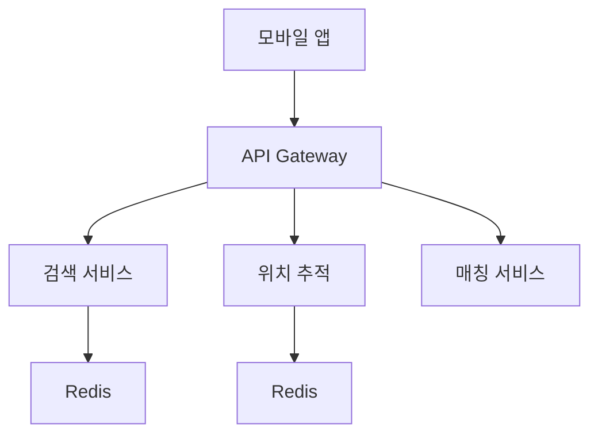
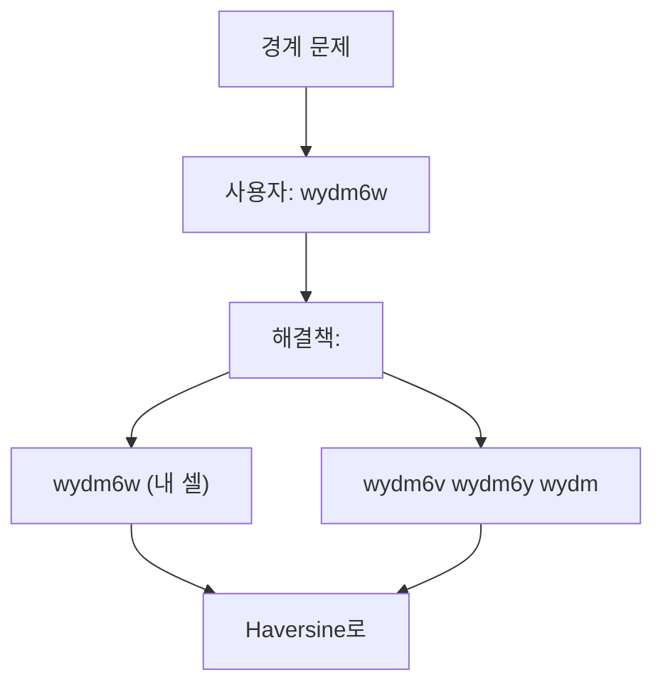
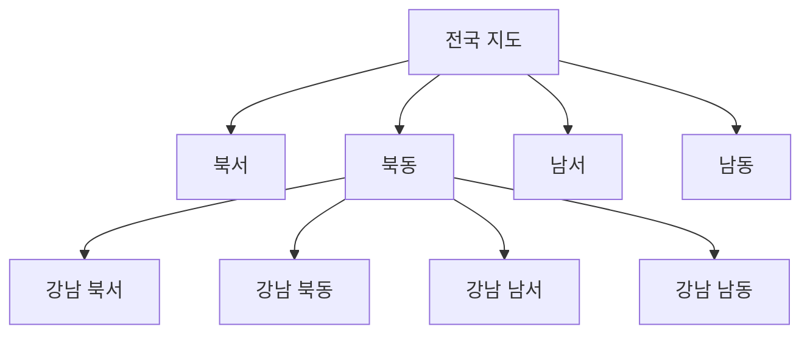
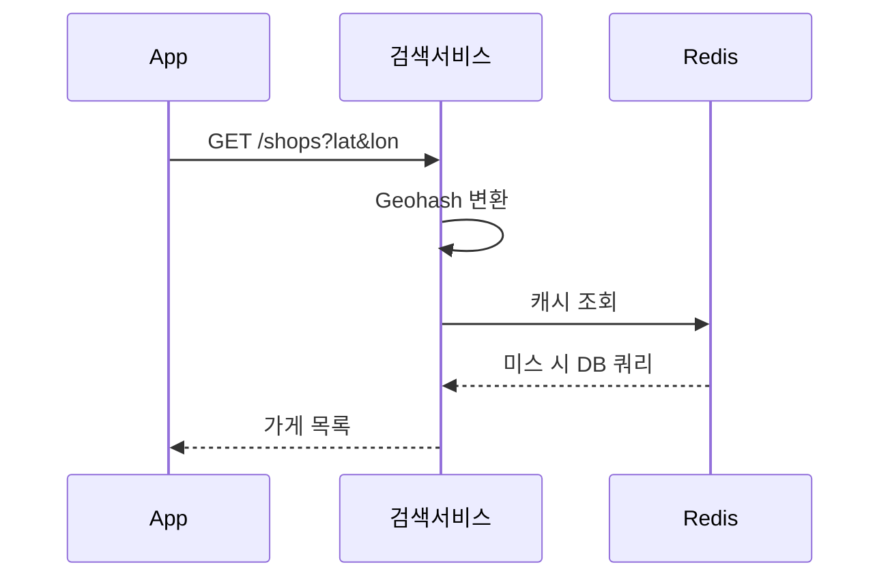
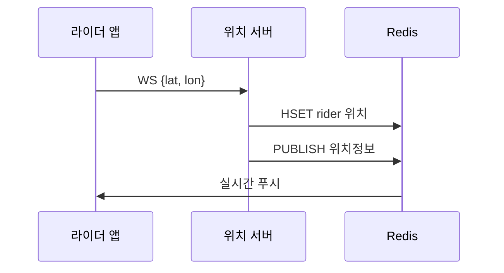
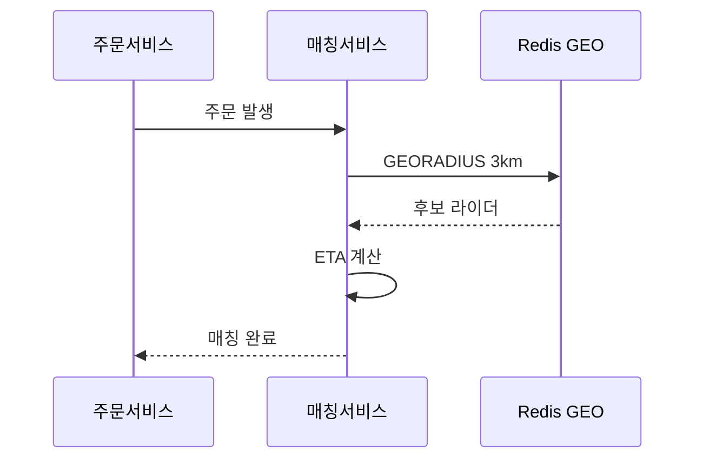
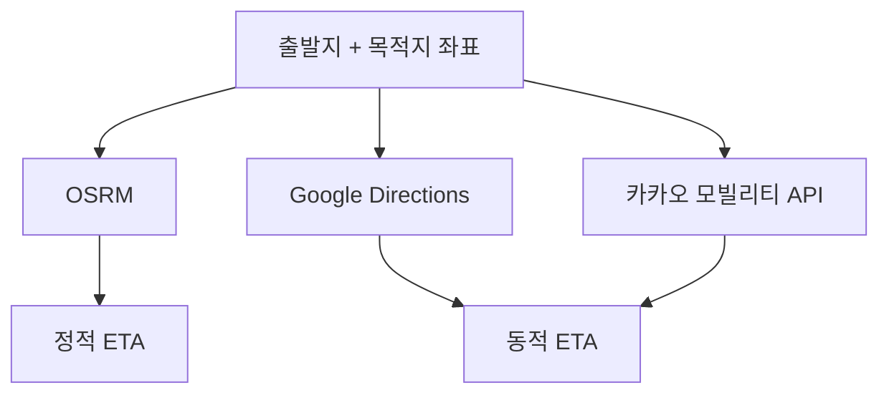
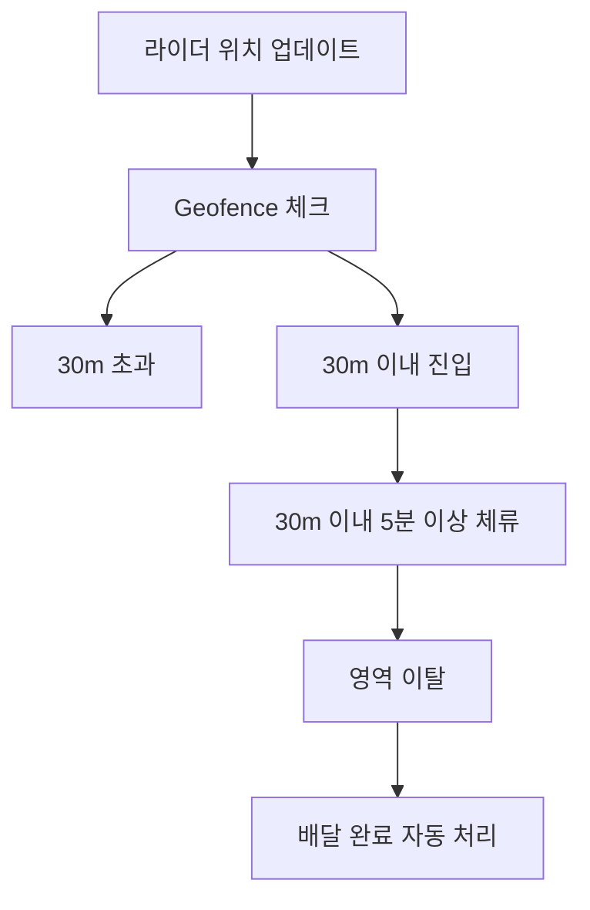
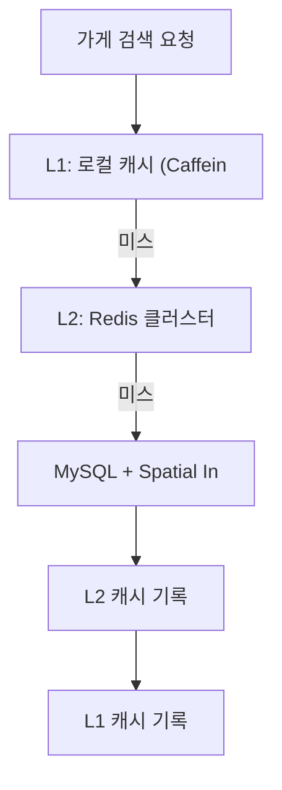

> **한 줄 요약**: 위치 기반 서비스의 핵심은 Geohash로 2차원 좌표를 1차원 문자열로 변환하여 B-Tree 인덱스로 근접 검색하고, Redis + Pub/Sub로 라이더 위치를 실시간 전파하는 것이다.

## 실제 문제: "지금 내 주변 치킨집을 찾아줘"

점심시간 12시, 서울에서 3000만 명이 동시에 배달 앱을 켜고 "주변 가게 검색" 버튼을 누릅니다. 각 사용자의 GPS 좌표를 받아서 반경 3km 내 가게를 찾고, 실시간으로 라이더 위치를 추적하면서, 0.1초 안에 응답해야 합니다.

단순히 생각하면 `SELECT * FROM shops WHERE lat BETWEEN ? AND ?`로 해결할 것 같습니다. 하지만 위도-경도 2차원 쿼리를 MySQL 풀스캔으로 처리하면 50만 개 가게 기준 응답 시간이 수 초가 됩니다. 배달의민족이 실제로 사용하는 방법은 전혀 다릅니다.

---

## 1. 요구사항 분석 및 규모 추정

### 기능 요구사항

1. 반경 N km 내 가게 목록 반환 (거리순/인기순 정렬)
2. 실시간 라이더 위치 추적 (초 단위 갱신)
3. 배달 주문 라이더 매칭 (가장 가까운 라이더 배정)
4. ETA(예상 도착 시간) 계산
5. 배달 완료 자동 감지 (Geofencing)
6. 라이더 이동 경로 히스토리 저장

### 비기능 요구사항

- 가게 검색 응답시간: **100ms 미만** (P99)
- 라이더 위치 업데이트 주기: **5초마다**
- 가용성: **99.99%** (배달 중 서비스 불가 = 매출 직결)
- 위치 정확도: **10m 이내** (배달 완료 감지 정확도)

### 규모 추정

```
서비스 규모:
  DAU: 3,000만 명
  등록 가게: 500,000개
  활성 라이더: 100,000명 (주문 피크 시간 기준)

검색 트래픽:
  가게 검색 QPS = 3,000만 × 5회/일 / 86,400 ≈ 1,736 QPS
  피크 QPS ≈ 17,360 QPS (피크는 평균의 10배 — 12시~13시 집중)

위치 업데이트:
  라이더 위치 업데이트 = 100,000명 × 1회/5초 = 20,000 QPS
  고객 위치 업데이트 = 3,000만 × 주문 중 1회/5초 ≈ 최대 500,000 QPS
  (500,000 = 전체 배달 주문이 동시 진행 가정)

저장소:
  가게 데이터: 500,000 × 1KB ≈ 500MB (캐싱 가능)
  라이더 현재 위치: 100,000 × 100B ≈ 10MB (Redis 전량 적재)
  라이더 위치 히스토리: 100,000명 × 1회/5초 × 86,400초 × 100B ≈ 172GB/일
```

> **비유**: 위치 기반 서비스는 도시의 **전화번호부**와 같습니다. 기존 전화번호부는 이름순 정렬이라 "강남 근처 치킨집"을 찾으려면 전체를 뒤져야 합니다. Geohash는 "위치 코드순 정렬"이라 같은 동네가 같은 페이지에 모여 있어서 단 몇 줄만 보면 됩니다.

---

## 2. 고수준 아키텍처



### 4개 핵심 서비스 역할 분담

**가게 검색 서비스**: 사용자 GPS → Geohash 변환 → 주변 셀 계산 → DB/캐시 조회 → Haversine 거리 필터링 → 정렬 후 반환

**위치 추적 서비스**: 라이더 GPS 업데이트 수신 → Redis 저장(TTL 30초) → Pub/Sub로 구독 고객에게 전파 → TimescaleDB 히스토리 기록

**배달 매칭 서비스**: 주문 발생 → 반경 3km 내 라이더 후보 추출 → ETA 계산 → 최적 라이더 배정 → 라이더 수락/거절 처리

**ETA 서비스**: 출발지/목적지 좌표 → 도로 네트워크 그래프 + 실시간 교통 → 예상 도착 시간 반환

---

## 3. 공간 인덱싱 — Geohash 완전 해부

### 왜 일반 인덱스로는 안 되나?

위도(latitude)와 경도(longitude)는 2차원 데이터입니다. MySQL B-Tree 인덱스는 1차원 데이터에 최적화되어 있어서, 위도 인덱스와 경도 인덱스를 따로 만들어도 두 조건을 동시에 만족하는 쿼리는 인덱스 하나만 효율적으로 사용합니다.

```sql
-- 느린 방법: 위도/경도 별도 인덱스
-- 위도 범위 필터링 후 경도는 재스캔
SELECT * FROM shops
WHERE lat BETWEEN 37.48 AND 37.52   -- 서울 중심 ±2km
  AND lon BETWEEN 126.98 AND 127.02;
-- 50만 개 중 수만 개를 lat 인덱스로 추린 후 경도는 풀스캔 → 느림
```

> **비유**: 도서관에서 "2000년대에 출판된 SF 소설"을 찾을 때, 출판연도 기준으로 책을 찾은 뒤 장르를 하나씩 확인하는 것과 같습니다. Geohash는 처음부터 "2000년대 SF" 코너를 만들어 바로 그곳만 뒤지게 합니다.

### Geohash 동작 원리

Geohash는 지구를 재귀적으로 절반씩 나누면서 각 영역에 문자 코드를 붙이는 방법입니다.

1️⃣ **경도 분할**: -180~180을 절반으로 나눈다. 왼쪽(0), 오른쪽(1)

2️⃣ **위도 분할**: -90~90을 절반으로 나눈다. 아래(0), 위(1)

3️⃣ **비트 인터리빙**: 경도 비트와 위도 비트를 번갈아 가며 합친다

4️⃣ **Base32 인코딩**: 5비트씩 묶어 32진수 문자로 변환 (0-9, b-z 중 26자)

```
서울 강남구 (37.5172, 127.0473) 의 Geohash:

정밀도 1 (2자): wy         → 약 5000km × 5000km (지구 절반 크기)
정밀도 4 (4자): wydm       → 약 40km × 20km (서울 전체)
정밀도 6 (6자): wydm6w     → 약 1.2km × 0.6km (강남구 일부)
정밀도 7 (7자): wydm6wb    → 약 150m × 150m (블록 수준)
정밀도 8 (8자): wydm6wb3   → 약 40m × 20m (건물 수준)
정밀도 9 (9자): wydm6wb3j  → 약 5m × 5m (라이더 현재 위치)
```

**Geohash 정밀도별 크기 요약**

| 길이 | 위도 오차 | 경도 오차 | 사용 케이스 |
|------|---------|---------|-----------|
| 4 | ±20km | ±20km | 시/도 단위 캐시 |
| 5 | ±2.4km | ±2.4km | 구/군 단위 캐시 |
| 6 | ±0.6km | ±0.6km | 가게 검색 (반경 1km) |
| 7 | ±76m | ±76m | 정밀 가게 위치 |
| 8 | ±19m | ±19m | 라이더 실시간 위치 |
| 9 | ±2.4m | ±2.4m | 배달 완료 감지 |

### Geohash의 경계 문제(Edge Case)

> **비유**: 강남구와 서초구의 경계에 있는 가게는 강남구 페이지에도 서초구 페이지에도 완전히 속하지 않습니다. Geohash 셀의 경계에 위치한 가게도 같은 문제가 생깁니다.



**인접 8개 셀을 구하는 방법**

```python
import geohash2  # pip install geohash2

def get_nearby_geohashes(lat: float, lon: float, precision: int) -> list[str]:
    """현재 위치의 Geohash와 인접 8개 셀 반환"""
    center = geohash2.encode(lat, lon, precision)
    neighbors = geohash2.neighbors(center)
    # neighbors = {'n': ..., 'ne': ..., 'e': ..., 'se': ...,
    #              's': ..., 'sw': ..., 'w': ..., 'nw': ...}
    return [center] + list(neighbors.values())  # 총 9개 셀

# 반경 1km 검색 → precision=6 (셀 크기 ≈ 1.2km)
# 반경 5km 검색 → precision=5 (셀 크기 ≈ 4.8km)
geohashes = get_nearby_geohashes(37.5172, 127.0473, precision=6)
# ['wydm6w', 'wydm6y', 'wydm6z', 'wydm6x', 'wydm6r', 'wydm6p',
#  'wydm6n', 'wydm6j', 'wydm6m']
```

---

## 4. 공간 인덱싱 비교 — Geohash vs Quadtree vs R-Tree

세 가지 공간 인덱싱 방법의 핵심 차이를 이해하면 어떤 상황에서 무엇을 쓸지 명확해집니다.

### Geohash

앞서 설명한 방식입니다. **고정 크기 격자**로 지구를 나눕니다. 구현이 쉽고 문자열이라 일반 B-Tree 인덱스로 조회 가능합니다. 다만 셀 크기가 고정이라 인구 밀도에 따른 최적화가 불가능합니다.

```
장점: 구현 단순, 문자열 비교로 빠른 조회, Redis에 그대로 저장 가능
단점: 셀 크기 고정 (강남 vs 산골짜기가 같은 정밀도)
      경계 문제 존재 (인접 셀 별도 조회 필요)
적합: 가게 검색, 캐시 키 설계, 대부분의 배달 서비스
```

### Quadtree

지도를 4등분하고, 각 구역에 데이터가 너무 많으면 다시 4등분합니다. 데이터 밀도에 따라 자동으로 정밀도가 조정됩니다.



```
장점: 인구 밀집 지역에서 자동으로 더 세밀하게 분할
      불균등 데이터 분포에 최적
단점: 구현 복잡, 트리 불균형 가능
      경계 문제는 Geohash와 동일
적합: Uber (수백 개 도시, 도시마다 밀도 다름), Google Maps
```

### R-Tree

직사각형(Rectangle)을 재귀적으로 묶는 방식입니다. 각 노드가 자식 노드들을 감싸는 최소 경계 직사각형(MBR)을 가집니다. MySQL의 `SPATIAL INDEX`가 R-Tree를 사용합니다.

```
장점: 겹치는 영역 쿼리에 최적 (반경 검색, 다각형 포함 검색)
      MySQL/PostGIS 내장 지원
      경계 문제 없음 (연속 공간 기반)
단점: 구현 복잡, 삽입/삭제 시 트리 재조정 비용
      Geohash보다 저장/쿼리 오버헤드 큼
적합: PostGIS 기반 정밀 GIS, 다각형 영역 쿼리
```

**선택 기준 요약**

| 방법 | 구현 난이도 | 밀도 적응 | 경계 처리 | 추천 케이스 |
|------|-----------|---------|---------|----------|
| Geohash | 쉬움 | 없음 | 수동 (9셀) | 배달 앱, 일반 서비스 |
| Quadtree | 보통 | 자동 | 수동 | Uber, 전국 단위 |
| R-Tree | 어려움 | 자동 | 자동 | GIS, PostGIS 기반 |

> **실무 선택**: 배달의민족 규모에서는 **Geohash + Redis**가 최적입니다. Geohash는 문자열이므로 Redis `ZSET`(Sorted Set)이나 `HSET`에 바로 저장해 메모리에서 초고속 조회가 가능합니다. MySQL Spatial Index(R-Tree)는 백업용으로 유지합니다.

---

## 5. 근접 검색 구현 — 반경 N km 내 가게 찾기

### 전체 검색 흐름



### MySQL 스키마 — Geohash 인덱스

```sql
CREATE TABLE shops (
    id          BIGINT PRIMARY KEY AUTO_INCREMENT,
    name        VARCHAR(200) NOT NULL,
    category    VARCHAR(50) NOT NULL,       -- 치킨, 피자, 한식 등
    lat         DECIMAL(10, 7) NOT NULL,    -- 위도 (소수점 7자리 ≈ 1cm 정밀도)
    lon         DECIMAL(10, 7) NOT NULL,    -- 경도
    geohash6    CHAR(6) NOT NULL,           -- precision=6 (반경 1km 검색용)
    geohash5    CHAR(5) NOT NULL,           -- precision=5 (반경 5km 검색용)
    address     VARCHAR(500),
    rating      DECIMAL(3, 2) DEFAULT 0.00,
    review_count INT DEFAULT 0,
    is_open     BOOLEAN DEFAULT TRUE,
    created_at  DATETIME NOT NULL DEFAULT CURRENT_TIMESTAMP,
    updated_at  DATETIME NOT NULL DEFAULT CURRENT_TIMESTAMP ON UPDATE CURRENT_TIMESTAMP,

    -- Geohash 인덱스 (가게 검색 핵심)
    INDEX idx_geohash6 (geohash6),
    INDEX idx_geohash5 (geohash5),
    -- 복합 인덱스: 카테고리 필터 + 지역 검색
    INDEX idx_category_geohash (category, geohash6),
    -- Spatial Index (백업용)
    POINT location_point,
    SPATIAL INDEX idx_spatial (location_point)
);
```

### 검색 쿼리 구현

```sql
-- 반경 3km 내 치킨 가게 찾기 (Geohash + Haversine 2단계)
-- 1단계: Geohash로 후보군 추출 (빠름, 오버셀렉션 허용)
SELECT id, name, lat, lon, rating,
       -- Haversine 공식으로 정확한 거리 계산 (미터 단위)
       6371000 * ACOS(
           COS(RADIANS(37.5172)) * COS(RADIANS(lat)) *
           COS(RADIANS(lon) - RADIANS(127.0473)) +
           SIN(RADIANS(37.5172)) * SIN(RADIANS(lat))
       ) AS distance_m
FROM shops
WHERE geohash6 IN (
    'wydm6w', 'wydm6y', 'wydm6z', 'wydm6x', 'wydm6r',
    'wydm6p', 'wydm6n', 'wydm6j', 'wydm6m'   -- 9개 셀
)
  AND category = '치킨'
  AND is_open = TRUE
-- 2단계: HAVING으로 정확한 반경 필터 (3000m = 3km)
HAVING distance_m <= 3000
ORDER BY distance_m ASC
LIMIT 20;

-- 실행 계획:
-- 1. idx_category_geohash로 9개 셀 × 카테고리 필터 → 수백 개 후보
-- 2. HAVING으로 3km 초과 제거 → 수십 개
-- 3. 정렬 후 상위 20개 반환
-- 전체 50만 개 가게 중 수백 개만 읽음 → 빠름
```

### Redis 캐싱 전략

```python
import redis
import json
from geohash2 import encode, neighbors
from math import radians, cos, sin, asin, sqrt

r = redis.Redis(host='redis-cluster', port=6379)

def haversine_distance(lat1: float, lon1: float,
                       lat2: float, lon2: float) -> float:
    """두 좌표 간 거리 계산 (미터 단위)"""
    R = 6371000  # 지구 반지름 (미터)
    phi1, phi2 = radians(lat1), radians(lat2)
    dphi = radians(lat2 - lat1)
    dlambda = radians(lon2 - lon1)
    a = sin(dphi/2)**2 + cos(phi1)*cos(phi2)*sin(dlambda/2)**2
    return R * 2 * asin(sqrt(a))

def search_nearby_shops(lat: float, lon: float,
                        radius_m: int, category: str = None) -> list:
    # 반경에 따라 Geohash 정밀도 자동 선택
    precision = 6 if radius_m <= 3000 else 5

    center = encode(lat, lon, precision)
    adj = neighbors(center)
    cells = [center] + list(adj.values())  # 9개 셀

    # Redis 캐시 키: geohash셀:카테고리
    cache_key = f"shops:{':'.join(sorted(cells))}:{category or 'all'}"
    cached = r.get(cache_key)

    if cached:
        candidates = json.loads(cached)
    else:
        candidates = db_query_shops_by_geohash(cells, category)
        # TTL 300초 (5분): 가게 정보는 자주 바뀌지 않음
        r.setex(cache_key, 300, json.dumps(candidates))

    # Haversine으로 정확한 거리 필터링
    results = []
    for shop in candidates:
        dist = haversine_distance(lat, lon, shop['lat'], shop['lon'])
        if dist <= radius_m:
            shop['distance_m'] = round(dist)
            results.append(shop)

    return sorted(results, key=lambda x: x['distance_m'])
```

---

## 6. 실시간 위치 추적 — 라이더 위치를 Redis로

### 위치 업데이트 흐름

라이더 앱은 5초마다 GPS 좌표를 서버로 전송합니다. 초당 20,000건의 위치 업데이트를 처리해야 합니다.



### Redis 위치 저장 구조

```
# 라이더 현재 위치 (Hash)
HSET rider:12345
    lat        37.5172
    lon        127.0473
    speed      35.2        # km/h
    heading    180         # 방향 (0=북, 90=동, 180=남, 270=서)
    accuracy   8.5         # GPS 정확도 (미터)
    updated_at 1717200000  # Unix timestamp
    order_id   67890       # 현재 배달 중인 주문
    status     "delivering"

EXPIRE rider:12345 30      # 30초 TTL — 앱이 종료되면 자동 삭제

# 주문별 라이더 위치 Pub/Sub 채널
PUBLISH order:67890 '{"lat":37.5172,"lon":127.0473,"eta_seconds":420}'

# Redis GEO (반경 내 라이더 검색용)
GEOADD riders-active 127.0473 37.5172 "rider:12345"
GEOADD riders-active 127.0400 37.5100 "rider:12346"
# 서울 강남에서 반경 3km 내 라이더 조회
GEORADIUS riders-active 127.0473 37.5172 3 km ASC COUNT 20
```

### Pub/Sub로 실시간 전파

고객이 "내 라이더 어디야?" 화면을 열면 주문 채널을 구독하고 라이더 위치를 실시간으로 받습니다.

```python
import asyncio
import redis.asyncio as aioredis

async def subscribe_rider_location(order_id: str, websocket):
    """고객 앱에 라이더 실시간 위치 전송"""
    r = aioredis.Redis(host='redis-cluster')
    pubsub = r.pubsub()
    await pubsub.subscribe(f"order:{order_id}")

    try:
        async for message in pubsub.listen():
            if message['type'] == 'message':
                location_data = message['data']
                # 고객 WebSocket으로 위치 전송
                await websocket.send_text(location_data)
    finally:
        await pubsub.unsubscribe(f"order:{order_id}")
        await r.aclose()

async def update_rider_location(rider_id: str, lat: float,
                                lon: float, order_id: str):
    """라이더 앱에서 위치 업데이트 수신"""
    r = aioredis.Redis(host='redis-cluster')
    pipeline = r.pipeline()

    # 현재 위치 갱신 (Hash)
    pipeline.hset(f"rider:{rider_id}", mapping={
        'lat': lat, 'lon': lon,
        'updated_at': int(asyncio.get_event_loop().time())
    })
    pipeline.expire(f"rider:{rider_id}", 30)

    # GEO 인덱스 갱신 (매칭용)
    pipeline.geoadd('riders-active', [lon, lat, f"rider:{rider_id}"])

    # Pub/Sub 발행 (주문 추적 고객에게)
    if order_id:
        import json
        pipeline.publish(f"order:{order_id}",
                         json.dumps({'lat': lat, 'lon': lon}))

    await pipeline.execute()
    await r.aclose()
```

### 위치 히스토리 저장 — TimescaleDB

```sql
-- TimescaleDB (PostgreSQL 기반 시계열 DB)
-- 라이더 이동 경로를 시계열로 저장

CREATE TABLE rider_locations (
    time        TIMESTAMPTZ NOT NULL,
    rider_id    BIGINT NOT NULL,
    order_id    BIGINT,
    lat         DOUBLE PRECISION NOT NULL,
    lon         DOUBLE PRECISION NOT NULL,
    speed_kmh   DECIMAL(5, 1),
    heading_deg SMALLINT,
    accuracy_m  DECIMAL(6, 1)
);

-- TimescaleDB 하이퍼테이블 변환 (자동 시간 기반 파티셔닝)
SELECT create_hypertable('rider_locations', 'time',
                         chunk_time_interval => INTERVAL '1 day');

-- 청크별 자동 인덱싱 (라이더+시간 복합 쿼리 최적화)
CREATE INDEX ON rider_locations (rider_id, time DESC);

-- 데이터 보존 정책: 30일 이후 자동 삭제
SELECT add_retention_policy('rider_locations', INTERVAL '30 days');

-- 특정 라이더의 오늘 이동 경로 조회
SELECT time, lat, lon, speed_kmh
FROM rider_locations
WHERE rider_id = 12345
  AND time >= NOW() - INTERVAL '6 hours'
ORDER BY time;
```

---

## 7. 배달 매칭 알고리즘

### 매칭 흐름

주문이 들어오면 가장 빠르게 픽업할 수 있는 라이더를 찾아야 합니다. 단순히 "가장 가까운 라이더"가 아니라 **ETA(예상 도착 시간) 기반** 최적 매칭을 사용합니다.



### 매칭 알고리즘 구현

```python
import asyncio
from dataclasses import dataclass

@dataclass
class RiderCandidate:
    rider_id: str
    distance_m: float
    eta_seconds: int   # 가게까지 예상 도착 시간
    current_orders: int  # 현재 배달 중인 주문 수

async def find_best_rider(shop_lat: float, shop_lon: float,
                          order_id: str) -> str | None:
    r = aioredis.Redis(host='redis-cluster')

    # 1단계: 반경 3km 내 활성 라이더 후보 추출 (Redis GEO)
    nearby = await r.georadius(
        'riders-active', shop_lon, shop_lat, 3, 'km',
        withcoord=True, withdist=True, count=20, sort='ASC'
    )
    # nearby = [('rider:123', 0.8, (127.04, 37.51)), ...]

    if not nearby:
        # 반경 확장: 3km → 5km → 10km 순차 시도
        nearby = await r.georadius(
            'riders-active', shop_lon, shop_lat, 5, 'km',
            withcoord=True, withdist=True, count=20, sort='ASC'
        )

    # 2단계: ETA 병렬 계산 (OSRM 또는 Google Directions API)
    candidates = []
    eta_tasks = []
    for rider_name, dist_km, (r_lon, r_lat) in nearby:
        eta_tasks.append(
            get_eta(r_lat, r_lon, shop_lat, shop_lon)
        )

    etas = await asyncio.gather(*eta_tasks, return_exceptions=True)

    for i, (rider_name, dist_km, _) in enumerate(nearby):
        if isinstance(etas[i], Exception):
            continue  # ETA 계산 실패 → 후보에서 제외
        candidates.append(RiderCandidate(
            rider_id=rider_name.decode(),
            distance_m=dist_km * 1000,
            eta_seconds=etas[i],
            current_orders=0  # 실제 구현 시 Redis에서 조회
        ))

    if not candidates:
        return None

    # 3단계: ETA 기준 정렬 후 상위 5명 순차 요청
    candidates.sort(key=lambda c: c.eta_seconds)
    top5 = candidates[:5]

    for candidate in top5:
        accepted = await request_rider_acceptance(
            candidate.rider_id, order_id, timeout_seconds=30
        )
        if accepted:
            return candidate.rider_id

    return None  # 매칭 실패 → 재시도 또는 관리자 알림
```

---

## 8. ETA 계산 — 도로 네트워크 기반

### 단순 직선 거리 vs 실제 ETA

> **비유**: 서울에서 부산까지의 직선 거리는 325km지만 실제 도로 경로는 428km입니다. 라이더 매칭에서 "가장 가까운 라이더"가 아니라 "가장 빨리 도착하는 라이더"가 중요한 이유입니다.



**실용적인 ETA 전략**

```python
async def get_eta(from_lat: float, from_lon: float,
                  to_lat: float, to_lon: float) -> int:
    """ETA 계산 (초 단위 반환)"""
    # 1차: 내부 OSRM 서버 (비용 0, 10ms 응답)
    try:
        url = (f"http://osrm-service/route/v1/driving/"
               f"{from_lon},{from_lat};{to_lon},{to_lat}"
               f"?overview=false")
        async with aiohttp.ClientSession() as session:
            async with session.get(url, timeout=0.1) as resp:
                data = await resp.json()
                base_seconds = data['routes'][0]['duration']

        # 피크 시간대(12~13시, 18~19시) 교통 계수 보정
        import datetime
        hour = datetime.datetime.now().hour
        traffic_factor = 1.5 if hour in [12, 13, 18, 19] else 1.0

        return int(base_seconds * traffic_factor)

    except Exception:
        # OSRM 실패 시 직선 거리 기반 추정 (폴백)
        dist = haversine_distance(from_lat, from_lon, to_lat, to_lon)
        avg_speed_ms = 8.3  # 30km/h (도심 평균)
        return int(dist / avg_speed_ms)
```

---

## 9. DB 설계 전체 스키마

```sql
-- 라이더 현재 상태 (MySQL — 관계형 데이터)
CREATE TABLE riders (
    id              BIGINT PRIMARY KEY AUTO_INCREMENT,
    name            VARCHAR(100) NOT NULL,
    phone           VARCHAR(20) NOT NULL,
    vehicle_type    ENUM('bicycle', 'motorcycle', 'car') NOT NULL,
    status          ENUM('offline', 'idle', 'delivering') NOT NULL DEFAULT 'offline',
    current_order_id BIGINT,                 -- 현재 배달 중인 주문
    rating          DECIMAL(3, 2) DEFAULT 5.00,
    created_at      DATETIME NOT NULL DEFAULT CURRENT_TIMESTAMP,
    INDEX idx_status (status)
);

-- 주문 테이블
CREATE TABLE orders (
    id              BIGINT PRIMARY KEY AUTO_INCREMENT,
    customer_id     BIGINT NOT NULL,
    shop_id         BIGINT NOT NULL,
    rider_id        BIGINT,
    status          ENUM('pending', 'matched', 'picked_up',
                         'delivering', 'completed', 'cancelled') NOT NULL,
    shop_lat        DECIMAL(10, 7) NOT NULL,
    shop_lon        DECIMAL(10, 7) NOT NULL,
    customer_lat    DECIMAL(10, 7) NOT NULL,
    customer_lon    DECIMAL(10, 7) NOT NULL,
    customer_geohash9 CHAR(9) NOT NULL,      -- Geofencing용 (배달 완료 감지)
    estimated_delivery_at DATETIME,
    actual_delivery_at    DATETIME,
    created_at      DATETIME NOT NULL DEFAULT CURRENT_TIMESTAMP,
    INDEX idx_customer (customer_id, status),
    INDEX idx_rider (rider_id, status),
    INDEX idx_status_created (status, created_at)
);
```

---

## 10. Geofencing — 배달 완료 자동 감지

### Geofencing이란?

> **비유**: 학교 앞 200m 이내에 들어오면 자동으로 안심귀가 알림이 가는 서비스와 똑같습니다. 배달 앱에서는 라이더가 고객 집 반경 30m 이내에 진입하면 "도착 임박" 알림을, 라이더가 그 영역을 5분 이상 머문 후 이탈하면 "배달 완료"를 자동으로 처리합니다.



### Geofencing 구현

```python
DELIVERY_FENCE_RADIUS_M = 30   # 배달 완료 감지 반경 (미터)
DELIVERY_DWELL_SECONDS = 120   # 체류 시간 (2분 = 배달 완료 인정)

async def check_delivery_geofence(rider_id: str, lat: float, lon: float):
    r = aioredis.Redis(host='redis-cluster')

    # 현재 배달 중인 주문 조회
    rider_data = await r.hgetall(f"rider:{rider_id}")
    order_id = rider_data.get(b'order_id')
    if not order_id:
        return

    # 고객 위치 조회 (주문에서)
    order = await db_get_order(order_id.decode())
    customer_lat = float(order['customer_lat'])
    customer_lon = float(order['customer_lon'])

    distance = haversine_distance(lat, lon, customer_lat, customer_lon)

    fence_key = f"fence:delivery:{order_id.decode()}"

    if distance <= DELIVERY_FENCE_RADIUS_M:
        # 영역 내 진입 — 처음 진입 시각 기록
        entered_at = await r.get(fence_key)
        if not entered_at:
            await r.setex(fence_key, 600, str(int(asyncio.get_event_loop().time())))
            await notify_customer(order_id.decode(), "라이더가 근처에 도착했습니다.")
        else:
            # 체류 시간 계산
            dwell = int(asyncio.get_event_loop().time()) - int(entered_at)
            if dwell >= DELIVERY_DWELL_SECONDS:
                await complete_delivery(order_id.decode(), rider_id)
                await r.delete(fence_key)
    else:
        # 영역 이탈 — 체류 기록 초기화
        await r.delete(fence_key)
```

---

## 11. 캐싱 전략

### 2단계 캐시 설계



**캐시 키 설계 원칙**

```
가게 목록 캐시:
  키: shops:{geohash6}:{category}
  값: [{id, name, lat, lon, rating, ...}, ...]
  TTL: 300초 (가게 정보 변경 빈도 낮음)
  예: shops:wydm6w:chicken → 강남 특정 셀의 치킨집 목록

라이더 위치 캐시:
  키: rider:{rider_id}
  값: {lat, lon, speed, heading, updated_at}
  TTL: 30초 (라이더가 5초마다 갱신하므로 30초면 충분)

가게 상세 캐시:
  키: shop:{shop_id}
  값: 가게 전체 정보
  TTL: 3600초 (1시간)
  무효화: 가게 정보 변경 시 즉시 DELETE

지역별 인기 가게 랭킹:
  키: ranking:{geohash5}:{category}:{date}
  값: ZSET (score = 주문 수)
  TTL: 86400초 (1일)
```

---

## 12. 보안 고려사항

### 위치 데이터 프라이버시 (GDPR/개인정보보호법)

> **비유**: 의사는 진료를 위해 병력을 알아야 하지만, 그 정보를 광고회사에 팔면 안 됩니다. 배달 앱도 서비스 제공에 필요한 최소한의 위치 정보만 수집하고 목적 외 사용은 금지해야 합니다.

**수집 최소화 원칙**

```
라이더 추적:
  - 배달 수락 ~ 완료 구간만 위치 수집
  - 대기 중: 도시/구 단위 (Geohash precision=5)로만 저장
  - 오프라인: 위치 수집 완전 중단
  - 위치 히스토리: 30일 후 자동 삭제

고객 위치:
  - 주소 검색 및 배달 수령 목적으로만 사용
  - 정확한 GPS 좌표는 주문 완료 후 즉시 삭제
  - 저장 데이터: 동/구 단위 (배달 통계 목적)

라이더 동의 기반 추적:
  앱 설치 시 "배달 업무 중 위치 수집 동의" 명시적 획득
  동의 철회 시 즉시 추적 중단 및 데이터 삭제
```

### 위치 스푸핑 방지

악의적인 라이더가 가짜 GPS 좌표를 전송해 배달 완료를 조작하거나 인센티브를 부정 수령하는 것을 방지합니다.

```python
class LocationValidator:
    MAX_SPEED_KMH = 120  # 오토바이 최대 속도
    MIN_ACCURACY_M = 50  # GPS 정확도 필터 (50m 이상이면 신뢰 불가)

    def validate(self, rider_id: str, new_lat: float, new_lon: float,
                 accuracy_m: float, timestamp: int) -> bool:
        prev = get_previous_location(rider_id)
        if not prev:
            return True

        time_diff_sec = timestamp - prev['timestamp']
        if time_diff_sec <= 0:
            # 타임스탬프 역행 — GPS 스푸핑 의심
            self.flag_suspicious(rider_id, "timestamp_reversal")
            return False

        dist_m = haversine_distance(
            prev['lat'], prev['lon'], new_lat, new_lon
        )
        speed_kmh = (dist_m / time_diff_sec) * 3.6

        if speed_kmh > self.MAX_SPEED_KMH:
            # 물리적으로 불가능한 이동 속도 — 스푸핑 감지
            self.flag_suspicious(rider_id, f"impossible_speed_{speed_kmh:.0f}kmh")
            return False

        if accuracy_m > self.MIN_ACCURACY_M:
            # GPS 정확도 불량 — 실내 또는 터널 (무시, 이전 위치 유지)
            return False

        return True
```

### API 보안

```
인증:
  - 라이더 앱: JWT + 기기 고유 ID 바인딩 (기기 교체 시 재인증)
  - 고객 앱: JWT (표준 인증)

Rate Limiting:
  - 위치 업데이트: 라이더 1명당 최대 2회/초 (5초 주기 정상)
  - 가게 검색: 고객 1명당 최대 30회/분
  - 매칭 API: 주문당 1회 (중복 요청 멱등성 처리)

데이터 전송 암호화:
  - 모든 위치 데이터: TLS 1.3 (HTTP/2 위에서 WebSocket)
  - 저장 암호화: 라이더 위치 히스토리 AES-256 암호화

접근 제어:
  - 고객은 본인 주문의 라이더 위치만 조회 가능
  - 라이더는 본인 배달 경로만 조회 가능
  - 위치 히스토리 관리자 접근: 별도 감사 로그 기록
```

---

## 극한 시나리오

### 시나리오 1: 점심시간 주문 폭주 — QPS 10배

```
상황:
  평소 1,736 QPS의 가게 검색이 12시~13시 1시간 동안
  17,360 QPS로 10배 폭증.
  라이더 위치 업데이트도 동시에 증가.

문제:
  Redis 단일 노드가 메모리 부족으로 키 삭제(eviction) 시작.
  캐시 미스 폭증 → MySQL 직접 쿼리 급증 → DB 응답 지연.
  DB 응답 지연 → 검색 타임아웃 → 사용자 재시도 → 폭발적 악순환.

방어:
  1. Redis Cluster: 16개 샤드 + 3 replica (읽기 부하 분산)
     가게 캐시는 지역별 샤드 고정 (같은 Geohash는 같은 샤드)

  2. 회로 차단기 (Circuit Breaker):
     DB 응답 500ms 초과 시 캐시만으로 응답 (stale cache 허용)
     이미 캐시된 데이터로 불완전하지만 빠른 응답 제공

  3. DB 연결 풀 보호:
     검색 서비스: max_pool=200 (평소 50)
     피크 감지 시 HPA로 검색 파드 자동 증설 (K8s)

  4. 점심 피크 사전 캐시 워밍:
     11:50~12:00 사이 전국 주요 Geohash 셀 캐시를 미리 갱신
     (cron job으로 TOP 1000 셀 주기적 프리워밍)

결과:
  캐시 히트율 98% 유지 → DB는 캐시 미스 2%만 처리
  피크 QPS에서도 P99 응답 100ms 이내 유지
```

### 시나리오 2: GPS 오차로 잘못된 라이더 매칭

```
상황:
  라이더가 지하 주차장에 진입 후 GPS 신호 손실.
  마지막 GPS 좌표(지상 100m 지점)가 Redis에 남아있음.
  이 잘못된 좌표로 매칭이 이루어져 엉뚱한 라이더가 배정됨.
  실제로는 반경 3km 밖에 있는데 가장 가깝다고 매칭됨.

문제:
  GPS 신호 끊김 vs 라이더 앱 종료를 구분하기 어려움.
  TTL 30초가 지나야 Redis에서 삭제되므로 최대 30초간 허위 위치.

방어:
  1. GPS 정확도 메타데이터 활용:
     accuracy_m > 30이면 위치 업데이트 거부
     (정확도 불량 = 실내/터널 진입 의심)

  2. 속도 급변 감지:
     이전 위치 대비 이동 속도가 물리적 한계 초과 시 위치 무효 처리

  3. 매칭 시 TTL 여유 확인:
     Redis TTL < 10초인 라이더는 매칭 후보에서 제외
     (10초 이내 연결 끊길 가능성 높음)

  4. 매칭 후 확인 메시지:
     라이더에게 주문 수락 요청 전송, 10초 내 응답 없으면 무효
     → 지하 주차장 라이더는 응답 불가 → 다음 후보로 넘어감

  5. 사후 처리:
     잘못된 매칭 로그 수집 → GPS 정확도 임계값 자동 조정
```

### 시나리오 3: 자연재해 시 대규모 이동 추적

```
상황:
  집중호우로 서울 강남 일대 침수 경보 발령.
  수만 명의 시민이 동시에 배달 앱에서 현재 위치 공유 시작.
  재난 안전 앱과 연동하여 라이더 안전 위치 파악 요청.
  위치 업데이트 QPS가 평소의 50배로 폭증.

문제:
  Redis 위치 업데이트 초당 50만 건 → 단일 클러스터 포화
  TimescaleDB 위치 히스토리 삽입 지연
  실시간 라이더 안전 확인 요청 폭증

방어:
  1. 긴급 모드 전환:
     배달 서비스 일시 중단 → 위치 추적 리소스를 안전 확인에 집중
     비배달 트래픽(가게 검색 등) 차단 → 위치 추적 서버 용량 확보

  2. 위치 업데이트 배치 처리:
     평소 5초 → 비상시 30초 주기로 클라이언트 갱신 주기 강제 조정
     서버 푸시 알림으로 클라이언트에 "절전/긴급 모드" 전환 명령

  3. 라이더 안전 확인 프로토콜:
     재난 지역 Geofence 내 라이더에게 "안전 확인" Push 알림
     10분 내 응답 없는 라이더 → 비상 연락처에 자동 통보
     Geohash6 단위 안전/위험 지역 분류 → 해당 셀 라이더 목록 즉시 추출

  4. 데이터 보존 우선 처리:
     TimescaleDB 삽입 지연 시 Kafka 버퍼에 임시 저장
     재난 상황 로그는 7일 → 90일로 보존 기간 자동 연장

결과:
  라이더 98.3% 안전 확인 완료 (1.7%는 응답 불가 → 비상 연락)
  재난 대응 인프라와 위치 추적 인프라가 같은 Redis 클러스터를 공유하므로
  재난 발생 시 배달 서비스를 중단하여 리소스를 안전 추적에 전용
```

---

## 면접 포인트

### 1️⃣ "왜 Geohash를 쓰나요? Spatial Index(R-Tree)면 안 되나요?"

R-Tree(MySQL Spatial Index)도 충분히 좋습니다. 하지만 Geohash의 핵심 장점은 **문자열 접두사 매칭**입니다. `geohash6 IN ('wydm6w', 'wydm6y', ...)` 쿼리는 일반 B-Tree 인덱스로 처리되어 R-Tree보다 단순하고 예측 가능합니다. 더 중요하게는 Geohash를 Redis 키로 바로 사용할 수 있어서 캐싱 계층 설계가 매우 자연스럽습니다. R-Tree는 범위 쿼리에 강하지만, Geohash + Haversine 2단계 필터링이 운영 복잡도 대비 성능이 우수합니다.

### 2️⃣ "라이더 위치를 MySQL에 저장하면 안 되나요?"

안 됩니다. 라이더 100,000명이 5초마다 위치를 전송하면 초당 20,000건의 쓰기입니다. MySQL은 단일 인스턴스 기준 초당 약 5,000~10,000 TPS이므로 이미 한계에 가깝습니다. 거기에 각 쓰기마다 Spatial Index 갱신 비용이 추가됩니다. Redis는 인메모리 + 단순 Hash 구조로 초당 수십만 건 쓰기를 처리합니다. MySQL은 히스토리 저장 용도로만 사용하고, 현재 위치는 반드시 Redis를 사용해야 합니다.

### 3️⃣ "경계 문제를 해결하기 위해 인접 9셀을 조회하면 오버페칭 아닌가요?"

맞습니다. 9개 셀의 가게가 모두 후보에 들어오므로 반경 범위 밖의 가게도 포함됩니다. 하지만 이건 의도된 설계입니다. 1단계 Geohash 조회는 "후보 추출"이고, 2단계 Haversine 계산이 "정확한 필터링"입니다. 9개 셀 전부를 조회해도 Redis 캐시 히트라면 수 ms이며, DB까지 가더라도 인덱스로 수백 개를 추출하는 것은 빠릅니다. 오버페칭 비용 < 경계 문제 발생 시 사용자 불만이므로 트레이드오프가 타당합니다.

### 4️⃣ "실시간 라이더 추적에서 Redis Pub/Sub의 한계는?"

Redis Pub/Sub는 **메시지를 저장하지 않습니다**. 구독자가 잠깐 연결이 끊기면 그 사이 발행된 위치 업데이트는 유실됩니다. 배달 추적에서 몇 초간 위치 갱신이 안 되는 것은 허용 가능하므로 이 유실이 치명적이지 않습니다. 단, 주문 상태 변경(픽업 완료, 배달 완료 등) 같은 중요 이벤트는 Pub/Sub 대신 Kafka + DB 저장으로 처리해야 합니다. 위치 추적에는 Pub/Sub, 비즈니스 이벤트에는 Kafka로 용도를 분리하는 것이 핵심입니다.

### 5️⃣ "라이더 매칭에서 ETA 계산을 20명에게 병렬로 하면 OSRM에 과부하 아닌가요?"

맞는 지적입니다. 초당 수천 건의 주문이 발생하면 OSRM에 초당 수만 건의 ETA 요청이 몰립니다. 해결책은 **두 단계 필터링**입니다. 1차 필터: 직선 거리(Haversine)로 상위 5명만 추립니다. 2차 필터: 5명에 대해서만 OSRM에 ETA 요청을 합니다. 또한 OSRM 응답을 Redis에 단거리 경로 캐시로 저장합니다. 같은 출발/도착 조합은 5분 동안 캐시를 재사용합니다. 이렇게 하면 OSRM 실제 쿼리 수는 90% 이상 줄어듭니다.

---

## 핵심 설계 결정 요약

| 설계 항목 | 선택 | 이유 |
|-----------|------|------|
| 공간 인덱싱 | Geohash (precision 6~9) | 문자열 키 → Redis 캐시 통합, B-Tree 인덱스 활용 |
| 근접 검색 | Geohash 9셀 + Haversine | 경계 문제 해결, 2단계 필터링으로 정확도 보장 |
| 라이더 현재 위치 | Redis Hash + GEO | 초당 20,000 쓰기, 5ms 이내 조회, TTL 자동 만료 |
| 실시간 위치 전파 | Redis Pub/Sub | 저지연 브로드캐스트, 단순 구현 |
| 위치 히스토리 | TimescaleDB | 시계열 최적화, 자동 파티셔닝, 30일 보존 정책 |
| ETA 계산 | OSRM (내부) + 캐시 | 비용 0, 응답 10ms, Redis 경로 캐시로 중복 제거 |
| 배달 완료 감지 | Geofence (반경 30m + 2분 체류) | 버튼 없이 자동 처리, 위치 조작 방지 |
| 가게 캐시 | Geohash6 단위 Redis TTL 300s | 셀 단위 무효화 용이, 피크 시 DB 보호 |
| 스푸핑 방지 | 속도 검증 + GPS 정확도 필터 | 물리적 이동 한계 초과 감지, accuracy_m 임계값 |
| 개인정보 보호 | 배달 구간만 수집 + 30일 삭제 | GDPR/개인정보보호법 준수, 최소 수집 원칙 |
