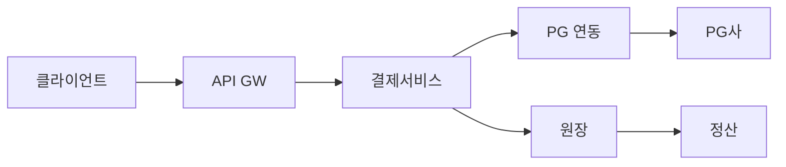
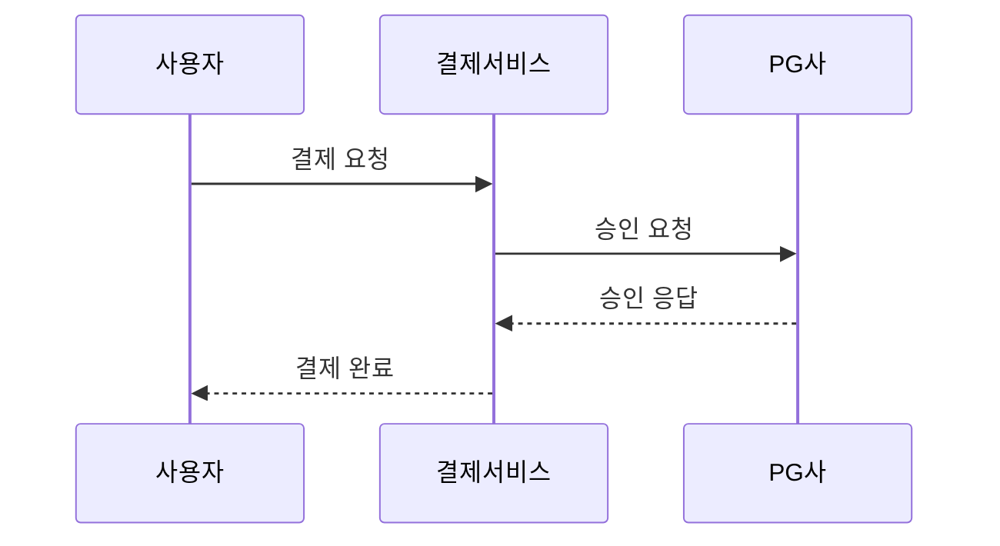
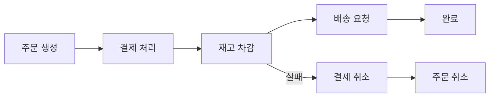
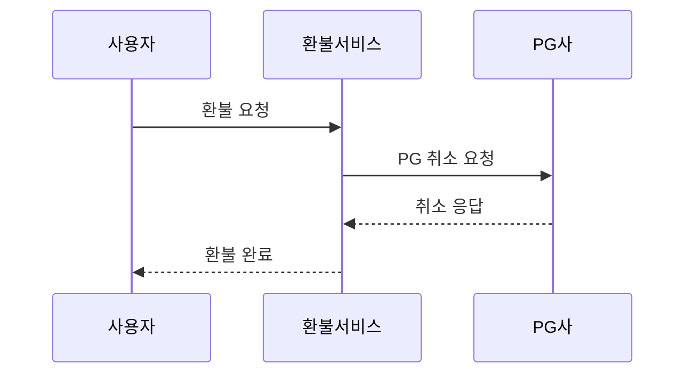
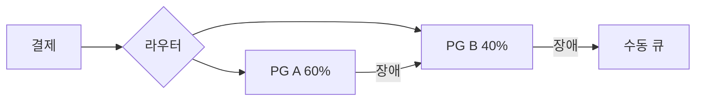
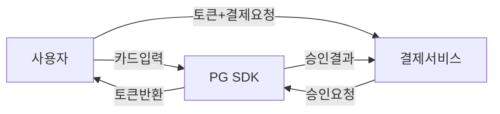

> **한 줄 요약**: 결제 시스템의 핵심은 멱등성으로 중복 결제를 막고, 복식부기로 돈의 흐름을 추적하며, Saga 패턴으로 분산 트랜잭션을 보상하는 것이다.

## 실제 문제: 1원이라도 틀리면 어떻게 되는가?

2022년 국내 A 커머스 플랫폼에서 네트워크 타임아웃으로 인해 결제가 이중 처리되는 버그가 발생했습니다. 사용자는 한 번 결제했지만 계좌에서 금액이 두 번 빠져나갔고, 피해 규모는 수천 건, 수억 원에 달했습니다. 원인은 단순했습니다. **타임아웃 재시도 시 멱등성 키를 붙이지 않았던 것**입니다.

결제 시스템은 "돈을 다루는 시스템"입니다. 1원이 틀려도 법적 분쟁이 발생하고, 고객 신뢰가 무너집니다. 네이버페이, 카카오페이, 토스가 수백 명의 엔지니어를 결제 안정성에 투입하는 이유가 바로 여기에 있습니다.

결제 시스템이 해결해야 할 핵심 문제:
- **중복 결제 방지**: 네트워크 재시도가 이중 청구를 만들면 안 됨
- **돈의 정확한 추적**: 어디서 들어와서 어디로 나갔는지 완전한 기록
- **분산 시스템 일관성**: 결제 성공 후 재고 차감 실패 시 어떻게 복구하는가
- **고가용성**: PG사 장애 시에도 결제가 멈추면 안 됨
- **보안**: 카드번호를 절대 우리 서버에 저장하지 않음

---

## 설계 의사결정 로드맵

결제 시스템 설계에서 순서대로 답해야 할 핵심 결정 4가지다. 각 결정에서 "왜 이 선택인가"를 명확히 하지 않으면 면접에서 "그냥 DB 트랜잭션 하나로 처리하면 되지 않나요?"라는 후속 질문에 답할 수 없다.

### 결정 1: 분산 트랜잭션 — 2PC vs Saga vs Outbox

**문제**: 결제 → 재고 차감 → 배송 요청이 서로 다른 서비스에 있을 때, 어떻게 원자성을 보장하는가?

| 후보 | 장점 | 단점 | 언제 적합 |
|------|------|------|----------|
| 2PC (2단계 커밋) | DB 레벨 원자성 보장, 구현 단순 | 코디네이터 장애 시 전체 블록, 외부 API(PG사) 참여 불가, TPS 급감 | 동일 DB 벤더 내 단일 시스템 |
| Saga (코레오그래피) | 각 서비스 독립, 락 없음, 높은 TPS | 보상 트랜잭션 직접 구현, 중간 상태 노출 | 마이크로서비스, 외부 API 포함 |
| Transactional Outbox | DB 트랜잭션 + 이벤트 발행 원자성 | 폴러 추가 운영, 최종 일관성 | 이벤트 발행과 DB 저장을 동시에 보장할 때 |

**우리의 선택: Saga + Transactional Outbox 조합**
- 이유: PG사 API는 외부 HTTP 호출이므로 2PC에 참여시킬 수 없다. Saga는 각 서비스가 로컬 트랜잭션만 처리하고 실패 시 보상 트랜잭션으로 롤백한다. Outbox 패턴은 "DB 저장 성공 후 Kafka 발행 실패" 문제를 해결한다 — 같은 트랜잭션에 Outbox 테이블에 기록하고, 폴러가 Kafka로 발행한다.
- 안 하면: 결제는 성공했는데 재고 차감 이벤트 발행이 실패하면 재고 불일치가 발생한다. 2PC를 쓰면 PG사 응답 대기 중 모든 서비스가 락을 잡고 있어 TPS가 10분의 1 이하로 떨어진다.

### 결정 2: 멱등성 — DB unique vs Redis + DB 이중 체크

**문제**: 타임아웃 재시도, 로드밸런서 재시도, 모바일 앱 중복 탭으로 동일 요청이 여러 번 들어올 때 어떻게 한 번만 처리하는가?

| 후보 | 장점 | 단점 | 언제 적합 |
|------|------|------|----------|
| DB UNIQUE 제약만 | 영구 저장, 정확한 중복 차단 | 매 요청마다 DB INSERT/SELECT, 피크 시 병목 | 소규모, 단순 구조 |
| Redis NX만 | 인메모리 고속, 초당 수만 건 | Redis 장애·재시작 시 중복 가능 | TTL 안에서만 보장 가능한 경우 |
| Redis NX + DB UNIQUE (이중) | Redis로 1차 빠른 차단, DB로 영구 보장 | 구현 복잡도 증가 | 결제처럼 절대 중복 안 되는 경우 |

**우리의 선택: Redis NX (1차) + DB UNIQUE (2차)**
- 이유: Redis `SET idempotent:{key} 1 EX 86400 NX`로 대부분의 중복을 빠르게 차단하고, DB에 UNIQUE 제약으로 Redis 장애 시에도 중복 INSERT가 실패한다. 분산 락(Redis SETNX)으로 동시 요청 중 하나만 처리 진행하고 나머지는 결과 대기한다.
- 안 하면: 결제 QPS 500에서 타임아웃 0.1%만 재시도해도 하루 43,200건의 중복 처리 위험이 생긴다. 평균 결제 30,000원 기준 하루 13억 원의 이중 결제 리스크다.

### 결정 3: 장부 방식 — 잔액 컬럼 vs 복식부기

**문제**: 돈의 이동을 어떻게 기록하는가? 계좌 테이블의 `balance` 컬럼을 UPDATE하는 것으로 충분한가?

| 후보 | 장점 | 단점 | 언제 적합 |
|------|------|------|----------|
| 잔액 컬럼 UPDATE | 구현 단순, 현재 잔액 조회 O(1) | 오류 원인 추적 불가, 감사 불가, 잔액 불일치 시 원인 모름 | 게임 포인트 등 감사 불필요한 경우 |
| 복식부기 (Append-Only) | 모든 이동 추적, 차변=대변 불변식으로 버그 즉시 감지, 금융당국 요구 충족 | 잔액 계산 시 합산 필요, 스냅샷 캐싱 필요 | 결제, 금융 서비스 필수 |

**우리의 선택: 복식부기 (Append-Only 원장)**
- 이유: 차변 합계 = 대변 합계 불변식이 깨지면 시스템 버그 신호다. 매일 배치로 이 검증을 돌리면 1원짜리 오류도 즉시 감지된다. 잔액 조회는 전날 스냅샷 + 당일 증분 합산으로 O(1)에 가깝게 최적화한다.
- 안 하면: 결제 서비스 버그로 특정 계정에서 두 번 차감됐을 때 잔액 컬럼만 있으면 "잔액이 왜 줄었지?"만 알 수 있고 원인 추적이 불가능하다. 법적 감사에서 이는 치명적이다.

### 결정 4: PG 연동 — 단일 PG vs 멀티 PG 라우팅

**문제**: 하나의 PG사만 사용하면 그 PG사가 장애 날 때 결제 전체가 멈춘다. 어떻게 PG 장애에 대비하는가?

| 후보 | 장점 | 단점 | 언제 적합 |
|------|------|------|----------|
| 단일 PG | 운영 단순, 계약 협상 쉬움 | PG 장애 = 서비스 전체 결제 불가 | 초기 단계 |
| 멀티 PG + 수동 전환 | 장애 대비 가능 | 전환 늦음, 운영자 개입 필요 | 소규모 |
| 멀티 PG + 서킷 브레이커 자동 전환 | 장애 수십 초 내 자동 폴백, 카드사별 최적 PG 라우팅 | 구현 복잡도, PG별 정산 분리 관리 | 결제 가용성이 매출 직결인 경우 |

**우리의 선택: 멀티 PG + 서킷 브레이커 자동 전환**
- 이유: PG사 오류율이 10초 윈도우에서 50% 초과 시 서킷을 열고 다음 우선순위 PG로 즉시 전환한다. 카드사별로 수수료·성공률이 다른 PG를 우선 라우팅하여 수수료도 최적화한다.
- 안 하면: 블랙프라이데이에 PG사 하나가 과부하로 응답이 느려지면 결제 서비스 스레드 풀 전체가 PG 응답 대기에 블로킹된다. 신규 결제 요청이 큐잉되다 타임아웃되고 사용자는 결제 실패 화면을 본다.

---

## 1. 요구사항 분석 및 규모 추정

### 기능 요구사항

1️⃣ **결제 처리**: 신용카드, 계좌이체, 간편결제 (카카오페이, 네이버페이 등)
2️⃣ **환불/취소**: 전액 환불, 부분 환불, 교환
3️⃣ **정산**: 판매자에게 T+N일 후 수수료 제외 정산
4️⃣ **원장 관리**: 모든 금융 트랜잭션의 불변 기록
5️⃣ **이상거래 탐지**: 비정상 패턴 실시간 감지 및 차단

### 비기능 요구사항

- **정확성**: 1원도 오차 없는 금액 처리 (최우선)
- **가용성**: 99.99% (연간 52분 이하 다운타임)
- **지연시간**: 결제 승인 응답 2초 이내 (P99)
- **멱등성**: 동일 요청 재시도 시 중복 처리 없음
- **감사 가능성**: 모든 거래 이력 5년 이상 보관 (금융당국 규정)

### 규모 추정

```
일일 결제 건수: 1,000만 건/일
평균 QPS = 1,000만 / 86,400 ≈ 116 QPS
피크 QPS = 116 × 43 ≈ 5,000 QPS  (블프, 수능 수험생 선물 등 피크는 평균의 43배)

연간 GMV: 10조원
평균 결제 금액: 10조 / (1,000만 × 365) ≈ 2,740원/건
실제 평균 결제: ~30,000원 (모수 조정 시)

데이터 용량:
  - 결제 건당 레코드: ~2KB
  - 일일 저장: 1,000만 × 2KB = 20GB/일
  - 연간: 20GB × 365 = 7.3TB/년
  - 5년 보관: 36.5TB (원장 포함 시 ×3 = 110TB)

피크 대응:
  - 블프 TPS: 5,000 × 10 = 50,000 TPS
  - PG사 동시 연결: 결제 서버 × PG 커넥션 = 500 × 200 = 100,000 연결
```

---

## 2. 고수준 아키텍처

> **비유:** 결제 시스템은 은행 창구와 같습니다. 고객(사용자)이 창구(API Gateway)에 오면, 은행원(결제 서비스)이 카드사(PG사)에 승인을 요청하고, 장부(원장)에 기록한 뒤, 나중에 가맹점(판매자)에게 입금(정산)합니다.



### 핵심 컴포넌트 역할

**결제 서비스 (Payment Service)**
모든 결제 요청의 진입점입니다. 멱등성 키 검증, 금액 유효성 확인, PG 라우팅 결정을 담당합니다. 상태 머신으로 결제 상태를 관리합니다 (`PENDING → PROCESSING → COMPLETED | FAILED`).

**PG 연동 레이어 (PG Adapter)**
여러 PG사(KG이니시스, NHN KCP, 토스페이먼츠)와의 통신을 추상화합니다. 각 PG사마다 API 스펙이 다르므로, 어댑터 패턴으로 인터페이스를 통일합니다. PG사 장애 시 자동 폴백을 수행합니다.

**원장 서비스 (Ledger Service)**
모든 금융 이동을 복식부기 방식으로 기록합니다. 한번 기록된 원장은 절대 수정되지 않으며, 오류가 있으면 역분개(reverse entry)를 새로 추가합니다.

**정산 서비스 (Settlement Service)**
매일 자정 배치로 실행됩니다. 원장에서 완료된 결제를 집계하고, 수수료를 계산한 뒤, 판매자 계좌로 T+2일에 입금합니다.

---

## 3. 결제 흐름 — 주문부터 완료까지

> **비유:** 결제 흐름은 레스토랑 계산서 처리와 같습니다. 손님이 카드를 내밀면(결제 요청), 직원이 단말기에 긁고(PG 요청), 카드사가 승인하면(PG 승인), 영수증이 나옵니다(결제 완료). 중간에 통신이 끊기면 재시도해야 하는데, 이때 이중 결제가 발생할 수 있습니다.



### 결제 상태 머신

결제는 단순한 성공/실패가 아닙니다. 중간 상태가 매우 중요합니다.

```
INITIATED      → 결제 요청 접수, idempotency_key 생성
PROCESSING     → PG사에 승인 요청 전송
PG_PENDING     → PG사가 카드사에 요청 중 (타임아웃 가능 구간)
APPROVED       → PG사 승인 완료
LEDGER_PENDING → 원장 기록 중
COMPLETED      → 모든 처리 완료
FAILED         → 어느 단계에서든 실패
REFUNDED       → 환불 완료
```

`PG_PENDING` 상태가 가장 위험합니다. PG사에 요청은 갔지만 응답을 받지 못한 상태입니다. 이 구간에서 재시도하면 이중 결제가 발생합니다.

---

## 4. 멱등성 — 재시도해도 안전한 결제

> **비유:** 엘리베이터 버튼을 여러 번 눌러도 한 층만 이동합니다. 이것이 멱등성입니다. 결제도 마찬가지로, 네트워크가 불안정해서 같은 요청이 여러 번 도달해도 딱 한 번만 처리되어야 합니다.

### 왜 멱등성 키인가 — 없으면 어떤 장애가 나는가

멱등성 키가 없을 때 실제로 발생한 사고 유형:

**사고 1 — 타임아웃 재시도**: 고객이 결제 버튼을 눌렀습니다. 서버가 PG사에 승인을 요청하고 처리가 완료됐지만, 서버→클라이언트 응답 전송 중 네트워크 끊김. 클라이언트는 5초 후 재시도. 서버는 새 요청으로 인식해 재승인. 고객 계좌에서 두 번 출금됩니다.

**사고 2 — 로드밸런서 재시도**: AWS ALB는 타임아웃 시 자동으로 다른 백엔드 서버로 재시도합니다. 첫 번째 서버가 이미 PG 요청을 완료했지만, 두 번째 서버는 모르고 다시 처리합니다. 멱등성 키가 없으면 이 재시도가 이중 결제가 됩니다.

**사고 3 — 모바일 앱 중복 탭**: 사용자가 결제 버튼을 빠르게 두 번 탭합니다. 앱이 두 건의 결제 요청을 거의 동시에 서버로 전송합니다. 서버가 두 요청을 각각 처리하면 이중 결제입니다.

```
멱등성 키 없는 환경에서 재시도 빈도 추정:
  결제 QPS 500 × 타임아웃 발생률 0.1% = 초당 0.5건
  하루 43,200초 × 0.5 = 21,600건/일
  평균 결제 30,000원 × 21,600 = 6억 4,800만원/일 이중 결제 위험
```

### 왜 멱등성이 필수인가

분산 시스템에서 네트워크는 언제든 실패할 수 있습니다. 클라이언트가 결제 요청을 보냈는데 응답이 없으면, 클라이언트는 모릅니다. 결제가 됐는지, 안 됐는지. 그래서 재시도합니다. 이때 서버가 멱등성을 보장하지 않으면 이중 결제가 발생합니다.

```
타임아웃 시나리오:
1. 클라이언트 → 서버: 결제 요청
2. 서버 → PG사: 승인 요청 (성공)
3. 서버 → 클라이언트: 응답 (네트워크 장애로 유실)
4. 클라이언트: 응답 없음 → 재시도
5. 서버: 같은 요청 재처리 → 이중 결제 발생!
```

### Idempotency Key 설계

클라이언트가 결제 요청 시 고유한 키를 함께 전송합니다.

```
POST /v1/payments
Headers:
  Idempotency-Key: ord_20240315_user123_a7f3k9

Body:
{
  "order_id": "ord_20240315_001",
  "amount": 29900,
  "currency": "KRW",
  "payment_method": "card",
  "card_token": "tok_visa_xxxx1234"
}
```

서버 처리 로직:

```python
def process_payment(request, idempotency_key):
    # 1. 캐시에서 이전 결과 확인 (Redis, TTL 24시간)
    cached = redis.get(f"idempotent:{idempotency_key}")
    if cached:
        return cached  # 동일한 응답 반환

    # 2. DB에서 확인 (Redis 장애 대비)
    existing = db.query(
        "SELECT * FROM payments WHERE idempotency_key = ?",
        idempotency_key
    )
    if existing:
        return existing.response

    # 3. 분산 락으로 동시 요청 방지
    with distributed_lock(f"lock:{idempotency_key}", ttl=30):
        # 4. 실제 결제 처리
        result = execute_payment(request)

        # 5. 결과 저장 (DB + Redis)
        db.save(idempotency_key, result)
        redis.setex(f"idempotent:{idempotency_key}", 86400, result)

    return result
```

핵심 포인트: 분산 락(Redis SETNX)으로 동시에 같은 키가 들어와도 한 번만 처리합니다. DB에도 저장하는 이유는 Redis가 재시작되거나 장애가 나도 24시간이 지나지 않은 요청을 올바르게 처리하기 위해서입니다.

---

## 5. 복식부기 — 돈은 반드시 두 줄로 기록한다

> **비유:** 복식부기는 회사 장부의 기본입니다. "현금 10만원을 지출했다"고 쓰면 나중에 왜 지출했는지 알 수 없습니다. 하지만 "현금 -10만원 / 광고비 +10만원"으로 쓰면 돈이 어디서 어디로 갔는지 완벽히 추적됩니다. 디지털 결제 시스템도 동일한 원리를 사용합니다.

### 왜 복식부기인가 — 단식 장부의 위험

단식 장부는 "잔액만" 기록합니다. 복식부기는 "모든 이동"을 기록합니다.

| 항목 | 단식 장부 | 복식부기 |
|------|-----------|---------|
| 기록 방식 | 잔액 변경만 | **모든 차변·대변 이동** |
| 오류 감지 | 어렵다 (잔액만 봐서는 원인 모름) | **차변 합계 ≠ 대변 합계 → 즉시 감지** |
| 감사 추적 | "잔액이 왜 줄었지?" 모름 | "언제, 무엇 때문에, 얼마가 이동했는지" 완전 추적 |
| 규정 준수 | 금융당국 요구 미충족 | **전자금융업 필수 요건** |
| 버그 발견 | 잔액 불일치 발견 시 원인 추적 불가 | 불일치 항목 즉시 특정 가능 |

**단식 장부의 실제 위험**: 결제 서비스에 버그가 생겨 특정 결제가 두 번 차감됐습니다. 단식 장부에는 잔액만 있으므로 "잔액이 음수가 됐다"는 것만 알 수 있습니다. 어떤 결제가 언제 두 번 실행됐는지 추적이 불가능합니다. 복식부기에서는 동일 `payment_id`에 대해 DEBIT 항목이 2개 존재하는 것을 쿼리 한 줄로 즉시 찾아냅니다.

### 복식부기의 황금 법칙

모든 거래에서 **차변 합계 = 대변 합계** 가 반드시 성립합니다. 이 규칙이 깨지면 시스템 어딘가에 버그가 있다는 신호입니다.

```
사용자 A가 30,000원 결제 시:

차변 (Debit)                대변 (Credit)
───────────────────────────────────────────
사용자_A_지갑  -30,000원   판매자_수취계정  +30,000원

PG 수수료 (3%) 처리:
───────────────────────────────────────────
판매자_수취계정 -900원      PG수수료_계정    +900원

최종 판매자 수령: 29,100원
```

### 원장 테이블 스키마

```sql
-- 원장 항목 (불변, 절대 UPDATE/DELETE 없음)
CREATE TABLE ledger_entries (
    id           BIGINT PRIMARY KEY AUTO_INCREMENT,
    entry_id     UUID NOT NULL UNIQUE,
    payment_id   UUID NOT NULL,
    account_id   VARCHAR(64) NOT NULL,  -- 어느 계정에서
    entry_type   ENUM('DEBIT', 'CREDIT'),
    amount       DECIMAL(19, 4) NOT NULL,  -- BigDecimal 사용
    currency     CHAR(3) NOT NULL,
    description  VARCHAR(255),
    created_at   TIMESTAMP NOT NULL DEFAULT CURRENT_TIMESTAMP,
    -- 수정 불가를 DB 레벨에서 강제
    INDEX idx_payment_id (payment_id),
    INDEX idx_account_id (account_id),
    INDEX idx_created_at (created_at)
);

-- 잔액 스냅샷 (매일 자정 생성, 검증용)
CREATE TABLE balance_snapshots (
    id           BIGINT PRIMARY KEY AUTO_INCREMENT,
    account_id   VARCHAR(64) NOT NULL,
    balance      DECIMAL(19, 4) NOT NULL,
    snapshot_at  DATE NOT NULL,
    entry_count  BIGINT NOT NULL,  -- 해당 날까지 누적 항목 수
    UNIQUE KEY uq_account_date (account_id, snapshot_at)
);
```

잔액 계산 방식은 두 가지입니다. **실시간 계산**: 모든 원장 항목을 합산 (느리지만 정확). **스냅샷 + 증분**: 마지막 스냅샷부터 이후 항목만 합산 (빠름). 운영 환경에서는 스냅샷을 매일 생성하고, 조회 시 스냅샷 + 당일 항목을 합산합니다.

---

## 6. 분산 트랜잭션 — Saga 패턴

> **비유:** 해외여행 패키지를 예약할 때를 떠올려보세요. 항공권, 호텔, 렌터카를 동시에 예약해야 합니다. 항공권은 됐는데 호텔이 안 됐다면? 항공권을 취소해야 합니다. Saga 패턴은 이런 연쇄 예약/취소 시나리오를 프로그래밍으로 구현한 것입니다.

### 왜 Saga인가 — 2PC의 한계

| 항목 | 2PC (2단계 커밋) | Saga 패턴 |
|------|----------------|-----------|
| 동작 방식 | 코디네이터가 모든 참여자에게 Prepare → Commit | 각 서비스가 로컬 트랜잭션 후 이벤트 발행 |
| 락 보유 시간 | **Prepare ~ Commit 전 구간** (수백ms~수초) | 없음 (각 서비스 로컬 트랜잭션만) |
| 코디네이터 장애 시 | **전체 시스템 블록** (락 해제 불가) | 각 서비스 독립 운영 |
| TPS 영향 | **락으로 인한 처리량 급감** | 거의 없음 |
| 롤백 방식 | 자동 (DB 트랜잭션) | 보상 트랜잭션 (명시적 구현 필요) |
| 구현 복잡도 | 낮음 (DB 지원) | 높음 (보상 로직 직접 구현) |

**2PC가 결제 시스템에서 쓸 수 없는 구체적 이유**: 결제 서비스 → PG사 API 호출은 외부 HTTP 요청입니다. PG사 DB에 2PC 참여를 요청할 수 없습니다. 2PC는 같은 DB 벤더 내에서만 동작합니다. 마이크로서비스 환경에서 각 서비스가 PostgreSQL·MySQL·MongoDB 등 다른 DB를 쓰면 2PC 코디네이터가 모든 DB 벤더를 지원해야 합니다. 현실적으로 불가능합니다.

**Saga 보상 트랜잭션의 주의점**: 보상 트랜잭션도 실패할 수 있습니다. 결제 취소를 PG사에 요청했는데 PG사가 응답하지 않으면? Dead Letter Queue에 저장해 수동 처리하거나, 지수 백오프로 최대 24시간 재시도합니다. 보상 실패를 유실하지 않는 것이 핵심입니다.

### PG 응답 지연 병목

결제 흐름에서 각 구간별 예상 지연:

```
[클라이언트] → [API 서버]: 10~50ms (네트워크)
[API 서버] 멱등성 키 검증: 5~10ms (Redis 조회)
[API 서버] → [PG사 API]: 200~2000ms ← 가장 큰 병목
[PG사] → [카드사 망]: 100~500ms (카드사 내부 처리)
[API 서버] 원장 기록: 10~30ms (DB 쓰기)
[API 서버] → [클라이언트]: 10~50ms

합계 P50: 약 400~600ms
합계 P99: 약 2~5초 (PG사 응답 지연이 지배)
```

**병목 해결 전략**:

| 전략 | 효과 | 트레이드오프 |
|------|------|------------|
| PG 타임아웃 단축 (10초→3초) | 지연 요청 빠르게 실패 처리 | 일부 정상 처리 중인 요청 강제 실패 |
| 다중 PG 라우팅 | 느린 PG에서 빠른 PG로 자동 전환 | 구현 복잡도 증가 |
| 비동기 결제 | 즉시 "처리 중" 응답, 완료 시 Push | 사용자가 즉시 결과를 모름 |
| 결제 요청 큐잉 | 피크 시 요청 버퍼링 | 결제 지연 허용 범위 필요 |

**실무 수치**: 국내 주요 PG사(토스페이먼츠·이니시스) P50 응답 200~400ms, P99 1~3초. 블랙프라이데이 등 피크 시 P99 5~10초까지 치솟는 사례 있음. 이 구간에서 서킷 브레이커가 동작하지 않으면 결제 서비스 스레드 풀이 PG 응답 대기로 모두 점유됩니다.

### 왜 2PC가 아닌 Saga인가

전통적인 2단계 커밋(2PC)은 여러 DB에 걸친 트랜잭션을 보장합니다. 하지만 마이크로서비스 환경에서는 각 서비스가 다른 DB를 씁니다. 2PC를 쓰면 모든 서비스가 코디네이터의 응답을 기다리며 락을 잡고 있어야 하므로, TPS가 높은 결제 시스템에서는 사용할 수 없습니다.

Saga 패턴은 각 서비스가 로컬 트랜잭션만 수행하고, 실패 시 이전 단계를 취소(보상 트랜잭션)합니다.

### 결제 Saga 흐름



```python
class PaymentSaga:
    def execute(self, order_id):
        steps = []
        try:
            # Step 1: 주문 확정
            order = order_service.confirm(order_id)
            steps.append(("order", order_id))

            # Step 2: 결제 처리
            payment = payment_service.charge(
                order_id=order_id,
                amount=order.total_amount,
                idempotency_key=f"saga_{order_id}_payment"
            )
            steps.append(("payment", payment.id))

            # Step 3: 재고 차감
            inventory_service.reserve(order.items)
            steps.append(("inventory", order_id))

            # Step 4: 배송 요청
            delivery_service.schedule(order_id)
            steps.append(("delivery", order_id))

        except Exception as e:
            # 역순으로 보상 트랜잭션 실행
            self.compensate(steps, e)
            raise

    def compensate(self, steps, reason):
        for service, ref_id in reversed(steps):
            try:
                if service == "payment":
                    payment_service.refund(ref_id, reason="saga_rollback")
                elif service == "inventory":
                    inventory_service.release(ref_id)
                elif service == "order":
                    order_service.cancel(ref_id)
            except Exception as comp_error:
                # 보상 실패 → Dead Letter Queue로 수동 처리 큐에 적재
                dead_letter_queue.push({
                    "service": service,
                    "ref_id": ref_id,
                    "error": str(comp_error)
                })
```

보상 트랜잭션도 실패할 수 있습니다. 예를 들어 결제 취소를 시도했는데 PG사가 응답하지 않는 경우입니다. 이때는 Dead Letter Queue에 적재해 CS팀이 수동으로 처리할 수 있도록 합니다. 중요한 것은 **실패 사실이 유실되지 않는 것**입니다.

---

## 7. 환불/취소 흐름

> **비유:** 환불은 결제의 역방향 흐름입니다. 원장에 기록된 거래를 "되돌리는" 것이 아니라, 새로운 반대 방향 거래를 추가하는 것입니다. 마치 잘못 쓴 장부 항목에 줄을 긋는 것이 아니라, "전 항목 취소"라는 새 항목을 적는 것과 같습니다.

### 환불 유형

1️⃣ **전액 환불**: 결제 금액 전체를 돌려줌. PG사에 전액 취소 요청.
2️⃣ **부분 환불**: 일부 상품만 반품. PG사가 부분 취소를 지원하는지 확인 필요.
3️⃣ **관리자 환불**: 결제일로부터 90일 초과 시 PG사 취소 불가. 직접 계좌이체.

### 환불 흐름



### PG 취소 실패 시 처리

PG사가 응답하지 않거나 취소에 실패하면 수동 처리 큐에 적재합니다.

```python
def process_refund(payment_id, amount, reason):
    refund = create_refund_record(
        payment_id=payment_id,
        amount=amount,
        status="PENDING"
    )

    try:
        # PG사 취소 요청 (타임아웃 10초)
        pg_result = pg_client.cancel(
            payment_id=payment_id,
            amount=amount,
            timeout=10
        )

        if pg_result.success:
            # 원장에 역분개 기록
            ledger.record_reverse_entry(payment_id, amount)
            refund.update(status="COMPLETED")
        else:
            # PG 취소 실패 → 수동 처리 큐
            manual_queue.push({
                "type": "REFUND_MANUAL",
                "refund_id": refund.id,
                "payment_id": payment_id,
                "amount": amount,
                "reason": pg_result.error_message
            })
            refund.update(status="MANUAL_PENDING")

    except TimeoutError:
        # 타임아웃: 취소됐는지 모름 → 상태 조회 후 판단
        pg_status = pg_client.query_status(payment_id)
        if pg_status == "CANCELLED":
            ledger.record_reverse_entry(payment_id, amount)
            refund.update(status="COMPLETED")
        else:
            # 상태 조회도 실패 → 재시도 큐
            retry_queue.push(refund.id, delay_seconds=60)
            refund.update(status="RETRY_PENDING")
```

---

## 8. 정산 시스템 — T+N일 판매자 입금

> **비유:** 카드 결제 후 실제 입금까지 시간이 걸리는 이유가 있습니다. PG사가 카드사에서 돈을 받아 플랫폼에 주고, 플랫폼이 수수료를 뗀 뒤 판매자에게 주는 다단계 과정이 있기 때문입니다. 정산 시스템은 이 전체 흐름을 자동화합니다.

### 정산 흐름

```
T+0일: 결제 완료 → 원장에 기록
T+1일: PG사가 플랫폼 계좌에 입금 (카드사 → PG → 플랫폼)
T+2일: 플랫폼이 판매자 계좌에 입금 (수수료 3% 차감)

수수료 계산 예시:
  판매액: 100,000원
  PG 수수료 (1.5%): -1,500원
  플랫폼 수수료 (1.5%): -1,500원
  판매자 수령액: 97,000원
```

### 정산 배치 처리

```python
# 매일 자정 실행 (Apache Airflow 또는 Spring Batch)
def daily_settlement_batch(settlement_date):
    # 1. 전날 완료된 결제 조회
    payments = db.query("""
        SELECT seller_id,
               SUM(amount) as gross_amount,
               SUM(pg_fee) as pg_fee,
               SUM(platform_fee) as platform_fee,
               COUNT(*) as transaction_count
        FROM payments
        WHERE status = 'COMPLETED'
          AND completed_at::date = %s - INTERVAL '1 day'
        GROUP BY seller_id
    """, settlement_date)

    for payment in payments:
        net_amount = (
            payment.gross_amount
            - payment.pg_fee
            - payment.platform_fee
        )

        # 2. 정산 레코드 생성
        settlement = Settlement(
            seller_id=payment.seller_id,
            gross_amount=payment.gross_amount,
            pg_fee=payment.pg_fee,
            platform_fee=payment.platform_fee,
            net_amount=net_amount,
            settlement_date=settlement_date,
            status="PENDING"
        )
        db.save(settlement)

        # 3. 원장에 정산 기록
        ledger.record(
            debit_account=f"seller_receivable:{payment.seller_id}",
            credit_account=f"platform_cash",
            amount=net_amount
        )

    # 4. 은행 API로 실제 이체
    bank_transfer_batch(settlements)
```

정산 배치는 **멱등하게** 설계해야 합니다. 배치가 중간에 실패해도 재실행하면 동일한 결과가 나와야 합니다. settlement_date + seller_id 조합에 유니크 키를 걸어서 중복 정산을 방지합니다.

---

## 9. 원장 설계 — 불변 로그와 감사 추적

> **비유:** 은행 장부는 지우개로 지울 수 없습니다. 잘못 기록했으면 "수정 항목"을 새로 추가합니다. 디지털 원장도 동일합니다. 한번 기록된 항목은 절대 변경하지 않고, 역분개로만 수정합니다. 이것이 감사 가능성(Auditability)의 핵심입니다.

### 불변 원장의 구현 원칙

1️⃣ **Append-Only**: INSERT만 허용, UPDATE/DELETE 없음
2️⃣ **이벤트 소싱**: 현재 잔액은 원장 이벤트의 합산으로 계산
3️⃣ **체크섬 연쇄**: 각 항목이 이전 항목의 해시를 포함 (블록체인과 유사)
4️⃣ **잔액 스냅샷**: 전체 합산을 매일 캐싱해서 조회 성능 확보

```sql
-- 잔액 불일치 감지 쿼리 (매일 실행)
SELECT
    s.account_id,
    s.balance as snapshot_balance,
    s.balance + COALESCE(SUM(
        CASE le.entry_type
            WHEN 'CREDIT' THEN le.amount
            WHEN 'DEBIT'  THEN -le.amount
        END
    ), 0) as calculated_balance,
    ABS(calculated_balance - s.balance) as discrepancy
FROM balance_snapshots s
LEFT JOIN ledger_entries le
    ON le.account_id = s.account_id
    AND le.created_at > s.snapshot_at
WHERE s.snapshot_at = CURRENT_DATE - 1
GROUP BY s.account_id, s.balance
HAVING discrepancy > 0;  -- 1원이라도 다르면 경보
```

이 쿼리로 매일 불일치를 검사합니다. 1원이라도 차이가 나면 즉시 알림이 발송되고 엔지니어가 조사에 착수합니다.

---

## 10. 통화 처리 — BigDecimal은 선택이 아닌 필수

> **비유:** `0.1 + 0.2`를 컴퓨터에게 물어보면 `0.30000000000000004`가 나옵니다. 부동소수점(float)의 한계입니다. 결제 시스템에서 float을 쓰면 수십만 건 누적 시 수천 원의 오차가 발생합니다. BigDecimal 또는 정수(최소 단위 기준)만 써야 합니다.

### 금액 표현 방식

```python
# 절대 사용 금지
price = 1000.50  # float — 부동소수점 오차 발생

# 올바른 방법 1: Python Decimal
from decimal import Decimal, ROUND_HALF_UP
price = Decimal("1000.50")
fee = price * Decimal("0.03")  # = 30.0150
fee_rounded = fee.quantize(
    Decimal("0.01"),
    rounding=ROUND_HALF_UP
)  # = 30.02

# 올바른 방법 2: 최소 단위 정수 (원화는 원 단위)
price_jeon = 100050  # 1000.50원을 전(0.01원) 단위로 저장
# DB에는 DECIMAL(19, 4) 타입 사용
```

### 다중 통화 처리

```python
class Money:
    def __init__(self, amount: Decimal, currency: str):
        self.amount = amount
        self.currency = currency

    def convert_to(self, target_currency: str, rate: Decimal) -> 'Money':
        if self.currency == target_currency:
            return self
        converted = self.amount * rate
        # 통화별 소수점 자리수 적용
        precision = CURRENCY_PRECISION[target_currency]  # KRW=0, USD=2, JPY=0
        rounded = converted.quantize(
            Decimal(10) ** -precision,
            rounding=ROUND_HALF_UP
        )
        return Money(rounded, target_currency)

CURRENCY_PRECISION = {
    "KRW": 0,   # 원화: 소수점 없음
    "USD": 2,   # 달러: 센트 단위
    "JPY": 0,   # 엔화: 소수점 없음
    "EUR": 2,   # 유로: 센트 단위
}
```

환율은 결제 시점의 환율을 원장에 함께 기록합니다. 나중에 환율이 바뀌어도 당시 거래 금액을 정확히 재현할 수 있어야 합니다.

---

## 11. PG사 장애 대응 — 다중 PG 라우팅

> **비유:** 아무리 좋은 식당도 재료 공급이 끊기면 영업을 못 합니다. PG사가 장애가 나면 우리도 결제를 받지 못합니다. 그래서 여러 PG사를 준비해두고, 하나가 장애나면 다른 곳으로 자동 전환하는 체계가 필요합니다.

### 다중 PG 라우팅 설계



```python
class PGRouter:
    def __init__(self):
        self.pg_clients = {
            "inicis": InicisClient(),
            "toss": TossPaymentsClient(),
            "kcp": KCPClient()
        }
        self.health_status = {}
        self.circuit_breakers = {}

    def route(self, payment_request) -> str:
        # 1. 카드사별 최적 PG 선택 (수수료/성공률 기준)
        preferred = self.get_preferred_pg(payment_request.card_brand)

        # 2. 서킷 브레이커 상태 확인
        if self.circuit_breakers[preferred].is_open():
            # 폴백 PG로 전환
            preferred = self.get_fallback_pg(preferred)

        return preferred

    def get_fallback_pg(self, failed_pg: str) -> str:
        """장애 PG 제외하고 다음 우선순위 PG 반환"""
        priority = ["inicis", "toss", "kcp"]
        for pg in priority:
            if pg != failed_pg and not self.circuit_breakers[pg].is_open():
                return pg
        raise NoPGAvailableException("모든 PG 장애")
```

### 서킷 브레이커

PG사가 응답이 느리면, 계속 요청을 보내는 것이 오히려 피해를 키웁니다. 서킷 브레이커는 일정 오류율 초과 시 요청을 차단하고 빠르게 폴백합니다.

```
CLOSED (정상):  요청 통과
  ↓ 오류율 50% 초과 (10초 윈도우)
OPEN (차단):    모든 요청 즉시 실패 처리
  ↓ 30초 후
HALF-OPEN:      소량 요청 시험 통과
  ↓ 성공 시
CLOSED (복구)
```

---

## 12. 보안 — PCI DSS와 토큰화

> **비유:** 카드번호를 직접 저장하는 것은 금고 안에 현금을 두는 게 아니라, 현금 사진을 찍어서 사무실에 붙여두는 것과 같습니다. 해커가 털면 끝입니다. 토큰화는 사진 대신 번호표를 발급하고, 실제 현금(카드번호)은 전문 금고(PCI DSS 인증 PG사)에만 보관하는 방식입니다.

### PCI DSS 핵심 요구사항

PCI DSS(Payment Card Industry Data Security Standard)는 카드 데이터를 다루는 모든 사업자가 반드시 준수해야 하는 보안 표준입니다.

```
우리 서버에 저장 금지:
  - 카드번호 (PAN): 절대 저장 금지
  - CVV/CVC: 절대 저장 금지 (심지어 암호화도 금지)
  - PIN 번호: 절대 저장 금지

허용 (암호화 필수):
  - 카드 만료일
  - 카드 소유자 이름
  - PG사가 발급한 토큰 (실제 카드번호 아님)
```

### 토큰화 흐름



카드번호는 PG사 서버에만 존재하고 우리 서버를 거치지 않습니다. 우리는 토큰만 저장합니다. 해커가 우리 DB를 털어도 카드번호는 없습니다.

### 이상거래 탐지 (FDS)

```python
class FraudDetectionService:
    def evaluate(self, payment_request) -> RiskScore:
        signals = []

        # 1. 빈도 이상: 1분 내 동일 카드 5회 이상 시도
        recent_attempts = redis.zcount(
            f"attempts:{payment_request.card_token}",
            time.time() - 60, time.time()
        )
        if recent_attempts >= 5:
            signals.append(RiskSignal.HIGH_FREQUENCY)

        # 2. 금액 이상: 평소 결제의 10배 이상
        avg_amount = get_user_avg_payment(payment_request.user_id)
        if payment_request.amount > avg_amount * 10:
            signals.append(RiskSignal.UNUSUAL_AMOUNT)

        # 3. 위치 이상: 1시간 내 물리적으로 불가능한 위치
        last_location = get_last_payment_location(payment_request.user_id)
        if is_impossible_travel(last_location, payment_request.ip_location):
            signals.append(RiskSignal.IMPOSSIBLE_TRAVEL)

        # 4. 신규 기기 + 고액
        if is_new_device(payment_request) and payment_request.amount > 500000:
            signals.append(RiskSignal.NEW_DEVICE_HIGH_AMOUNT)

        return calculate_risk_score(signals)
```

---

## 13. 극한 시나리오

### 극한 시나리오 1: 블프 결제 폭주 — TPS 10배

블랙프라이데이 자정, 평소 500 TPS이던 결제가 5,000 TPS로 급증합니다. DB 연결 풀이 모자라고, PG사 API도 응답이 느려집니다.

**문제점:**
- DB 커넥션 풀 고갈 → 결제 요청 대기 → 타임아웃 → 재시도 → 폭주 악화
- PG사 응답 3초 → 결제 서비스 스레드 점유 → 서비스 전체 블로킹

**대응 전략:**

1️⃣ **사전 오토 스케일링**: 블프 1주 전부터 인스턴스를 2배로 늘려둡니다. 이벤트 당일 자동 스케일링은 늦습니다(인스턴스 기동에 2~5분 소요).

2️⃣ **결제 요청 큐잉**: 피크 초과 요청은 즉시 거부하지 않고 SQS에 적재합니다. 사용자에게 "처리 중" 상태를 보여주고 30초 내 완료를 보장합니다.

3️⃣ **DB 읽기 분리**: 결제 처리는 Master DB, 상태 조회는 Read Replica에서만 처리합니다.

4️⃣ **PG 타임아웃 단축**: 평소 10초 타임아웃을 피크 시 3초로 단축합니다. 느린 PG보다 빠른 실패가 낫습니다.

5️⃣ **동적 PG 부하 분산**: PG사별 응답시간을 실시간 모니터링해서 빠른 PG에 더 많은 요청을 라우팅합니다.

### 극한 시나리오 2: PG사 장애 — 전액 환불 불가

자정 정산 중 주요 PG사가 8시간 장애가 발생했습니다. 이미 결제된 10만 건에 대해 환불 요청이 쏟아지지만, PG사 API가 응답하지 않습니다.

**문제점:**
- 환불 API 호출 실패 → 원장에 환불 기록 불가 → 사용자에게 돈 돌려주지 못함
- PG사 복구 후 10만 건 환불을 일괄 처리해야 함

**대응 전략:**

1️⃣ **환불 요청 내구성 보장**: 환불 요청을 즉시 DB에 저장합니다(`status=PENDING`). PG 장애 여부와 관계없이 요청 자체는 유실되지 않습니다.

2️⃣ **지수 백오프 재시도**: PG 복구 후 자동으로 재시도합니다 (1분, 2분, 4분, 8분... 최대 24시간).

3️⃣ **SLA 기반 수동 처리**: PG 장애 4시간 초과 시 자동으로 CS 티켓을 생성해서 수동 계좌이체 처리를 준비합니다.

4️⃣ **사용자 통지**: 환불 지연 이유를 투명하게 고지하고, 처리 완료 시 알림 발송을 예약합니다.

### 극한 시나리오 3: 이중 결제 발생

서버 A가 결제를 처리하고 응답을 보내는 도중 크래시가 났습니다. 클라이언트는 응답을 받지 못했고, 재시도했습니다. 이번엔 서버 B가 처리했습니다. 사용자는 두 번 결제됐습니다.

**원인 분석:**
- 서버 A: 결제 처리 완료, 응답 전 크래시
- 클라이언트: 타임아웃 → 재시도
- 서버 B: idempotency_key DB 저장 전 서버 A 크래시로 인해 중복 체크 실패

**대응 전략:**

1️⃣ **즉각 감지**: 결제 완료 후 원장 잔액 검증 배치가 1분 주기로 실행. 이중 결제 발생 시 차변/대변 불일치 즉시 감지.

2️⃣ **자동 환불**: 중복 결제 감지 시 나중 결제를 자동 취소하는 로직이 트리거됩니다.

3️⃣ **사후 대응**: 영향받은 사용자에게 사과 메일 발송 + 마일리지 보상.

4️⃣ **재발 방지**: idempotency_key를 DB에 먼저 INSERT(UNIQUE 제약)하고 PG 요청을 보내는 순서로 변경. DB INSERT 성공 후에만 PG 요청 진행.

```python
def process_payment_safe(request, idempotency_key):
    # 핵심: DB에 먼저 잠금용 레코드 INSERT
    # UNIQUE 제약으로 두 번째 INSERT는 실패
    try:
        db.execute("""
            INSERT INTO payment_locks
              (idempotency_key, status, created_at)
            VALUES (?, 'PROCESSING', NOW())
        """, idempotency_key)
    except UniqueViolation:
        # 이미 처리 중 또는 완료
        return get_existing_payment(idempotency_key)

    # DB에 락 확보 후 PG 요청
    result = pg_client.charge(request)
    db.update_payment_lock(idempotency_key, status="COMPLETED", result=result)
    return result
```

---

## 14. 면접 포인트 5가지

### 면접 포인트 1️⃣ "결제 시스템에서 트랜잭션을 어떻게 보장하나요?"

단일 DB 환경이라면 ACID 트랜잭션으로 충분합니다. 하지만 마이크로서비스 환경에서는 각 서비스가 다른 DB를 쓰므로 분산 트랜잭션이 필요합니다. 2PC는 락으로 인한 성능 문제가 있어 결제 시스템에 적합하지 않고, **Saga 패턴**(코레오그래피 또는 오케스트레이션 방식)을 사용합니다. 실패 시 보상 트랜잭션으로 롤백합니다.

### 면접 포인트 2️⃣ "이중 결제를 어떻게 막나요?"

**멱등성 키**가 핵심입니다. 클라이언트가 UUID v4 기반 키를 생성해서 요청에 포함합니다. 서버는 이 키를 DB에 UNIQUE 제약으로 저장합니다. 재시도 시 동일 키가 오면 기존 결과를 반환합니다. PG사도 자체 멱등성 키를 지원하지만, 우리 시스템 레벨에서 별도로 보장하는 것이 안전합니다.

### 면접 포인트 3️⃣ "원장 잔액이 틀렸을 때 어떻게 감지하나요?"

복식부기에서 **차변 합계 = 대변 합계** 불변식을 매일 배치로 검증합니다. 또한 잔액 스냅샷과 실제 원장 합산값을 비교합니다. 1원이라도 차이가 나면 PagerDuty 알림을 발송합니다. 결제 시스템에서 잔액 불일치는 P0(최고 긴급) 사고입니다.

### 면접 포인트 4️⃣ "카드 정보는 어떻게 안전하게 처리하나요?"

**PCI DSS** 준수가 필수입니다. 카드번호, CVV는 우리 서버에 절대 저장하지 않습니다. PG사가 제공하는 JavaScript SDK가 사용자 브라우저에서 직접 PG사 서버로 카드 정보를 전송하고, PG사가 토큰을 발급합니다. 우리 서버는 이 토큰만 받아서 저장하고 결제에 사용합니다. 카드번호 자체는 PCI DSS 인증을 받은 PG사 금고에만 존재합니다.

### 면접 포인트 5️⃣ "PG사가 장애 나면 어떻게 하나요?"

서킷 브레이커 + 다중 PG 폴백 조합입니다. 서킷 브레이커가 PG사 오류율을 추적하다가 임계치 초과 시 차단하고 폴백 PG로 전환합니다. 폴백 PG 선택은 카드사별로 최적화(수수료 및 성공률 기준)되어 있습니다. 모든 PG가 동시에 장애가 나는 경우에는 결제 요청을 큐에 쌓아두고 복구 후 처리하거나, 사용자에게 명확한 오류 메시지를 노출합니다.

---

## 15. 실무 실수 Top 5

**실수 1: float으로 금액 계산**
`double amount = 19.99 * 100;` 결과가 `1998.9999999999998`이 됩니다. DECIMAL(19,4) 또는 BigDecimal을 사용하세요.

**실수 2: 멱등성 키 없는 재시도**
타임아웃 발생 시 그냥 재시도하면 이중 결제입니다. 항상 멱등성 키를 붙여서 재시도하세요.

**실수 3: 원장에 UPDATE 허용**
"실수로 잘못 기록했으니 UPDATE로 수정"은 감사 추적을 파괴합니다. 역분개(취소 + 새 항목)만 사용하세요.

**실수 4: 정산 배치 비멱등 설계**
배치가 실패해서 재실행했더니 정산이 두 번 됐습니다. 항상 settlement_date + seller_id에 UNIQUE 제약을 걸어두세요.

**실수 5: 환불 성공 전에 재고 복구**
PG 취소가 완료되기 전에 재고를 먼저 복구하면, 환불 실패 시 재고 과다 상태가 됩니다. 환불 완료 이벤트를 받은 후에 재고를 복구하세요.

---

### 꼭 직접 만들어야 하는가? — Build vs Buy

| 선택지 | 장점 | 단점 | 적합한 시점 |
|--------|------|------|-----------|
| Stripe | 결제 로직 대부분 위임, Webhook으로 결과 수신, PCI DSS 자동 충족 | 수수료 고정(2.9%+30¢), 커스텀 정산 불가 | Phase 1~2 |
| Toss Payments / PortOne | 한국 PG 통합, SDK 제공, 국내 카드사 연동 간편 | 해외 결제 제한, 글로벌 확장 시 별도 PG 필요 | Phase 1~2 |
| 직접 구축 (멀티 PG + Saga + 복식부기) | 완전한 제어, 정산 최적화, FDS 커스텀 | 구현 복잡도 극히 높음, PCI DSS 직접 취득 필요 | Phase 3~4 |

**실무 판단 기준**: PG 수수료 협상력이 생기는 월 거래 10억 이상, 커스텀 정산/FDS가 필요할 때 전환한다.

> 핵심: Phase 1에서 직접 구축하면 오버 엔지니어링이고, Phase 3에서 SaaS에 의존하면 비용 폭발이다. 현재 MAU에 맞는 선택을 하고, 병목이 실제로 발생할 때 전환한다.

---

## Day 1 → Scale 진화

결제 시스템을 처음부터 멀티 PG + Saga + 복식부기로 만들면 출시 전에 팀이 지친다. 트래픽 규모에 맞게 단계적으로 쌓아야 한다.

### Phase 1 — MAU 1만, 일 결제 1만 건 (스타트업 초기)

**아키텍처**: PG사 SDK 직접 연동 + MySQL 단일 인스턴스

- PG 연동: 토스페이먼츠 또는 이니시스 SDK 직접 사용, 결제 결과를 MySQL에 저장
- 멱등성: DB UNIQUE 제약만으로 충분 (트래픽 적음)
- 장부: 결제 테이블에 amount, status 컬럼으로 단순 관리
- 환불: 수동 처리 + PG 콘솔에서 직접 취소

**월 비용**
- EC2 t3.medium × 2: ~$70
- RDS MySQL db.t3.medium: ~$60
- 합계: **~$130/월**

### Phase 2 — MAU 10만, 일 결제 10만 건 (서비스 성장)

**아키텍처**: 결제 서비스 분리 + 멱등성 키 도입 + 자동 환불

- 결제 서비스를 독립 마이크로서비스로 분리
- Redis NX로 멱등성 1차 차단 추가 (DB 부하 경감)
- 환불 자동화: PG 취소 API 연동, 실패 시 재시도 큐
- 정산 배치: 매일 자정 cron으로 판매자별 정산 집계
- 모니터링: 결제 성공률·PG P99 Grafana 대시보드 구축

**월 비용**
- EC2 c5.large × 4: ~$400
- RDS MySQL db.r5.large (Multi-AZ): ~$400
- ElastiCache Redis r6g.medium: ~$100
- 합계: **~$900/월**

### Phase 3 — MAU 100만, 일 결제 100만 건 (고성장)

**아키텍처**: 멀티 PG 라우팅 + Saga 패턴 + 복식부기 원장

- 멀티 PG: 이니시스·토스페이먼츠·KCP 동시 연동, 서킷 브레이커 자동 전환
- Saga: 결제→재고→배송 보상 트랜잭션, Dead Letter Queue 도입
- 복식부기 원장: ledger_entries Append-Only 테이블 도입, 일별 잔액 스냅샷
- Transactional Outbox: Kafka 이벤트 발행 원자성 보장
- FDS: 빈도·금액·위치 기반 이상거래 탐지 Rule Engine 도입

**월 비용**
- EC2 c5.2xlarge × 8: ~$2,000
- RDS Aurora MySQL (Multi-AZ, 읽기 레플리카 2): ~$2,500
- ElastiCache Redis Cluster: ~$600
- Kafka MSK: ~$800
- 합계: **~$5,900/월**

### Phase 4 — MAU 1억, 일 결제 1000만 건 (글로벌 정산 + ML FDS)

**아키텍처**: 글로벌 멀티리전 + ML 기반 FDS + 실시간 정산

- 글로벌 정산: 통화별 환율 스냅샷 원장, 국가별 세금 처리 자동화
- ML FDS: 사용자 행동 패턴 학습 모델, 실시간 피처 서빙 (Feature Store)
- 실시간 정산: T+1 정산을 실시간으로 전환, 판매자 즉시 출금 지원
- 결제 원장 분리: OLTP 원장과 OLAP 분석 원장을 ClickHouse로 분리
- PCI DSS Level 1 인증 취득

**월 비용**
- 멀티리전 컴퓨팅: ~$20,000
- 글로벌 DB 클러스터: ~$15,000
- ML 서빙 인프라: ~$8,000
- 보안·컴플라이언스 인프라: ~$5,000
- 합계: **~$48,000/월**

---

## 핵심 메트릭 5개

결제 시스템에서 이 다섯 숫자가 모두 정상 범위에 있으면 돈이 안전하게 흐르고 있다. 하나라도 이상하면 즉시 P0 대응이다.

| 메트릭 | 정상 기준 | 이상 신호 | 원인 가설 |
|--------|---------|---------|---------|
| **결제 성공률** | 99.5% 이상 | 99% 미만 | PG사 장애, 카드사 망 장애, 서킷 브레이커 오동작 |
| **PG 응답 P99** | 3초 이내 | 5초 초과 | PG사 서버 과부하, 카드사 망 응답 지연 (블프 등 피크) |
| **이중 결제 건수** | 0건/일 | 1건 이상 | 멱등성 키 버그, Redis 장애 후 복구 중 중복 처리 |
| **정산 불일치율** | 0.00% | 0.01% 이상 | 복식부기 차변≠대변, 배치 중간 실패 후 재실행 중복 |
| **FDS 탐지율** | 0.1~2% | 5% 초과 or 0% | 탐지율 과다 → 정상 결제 차단 과다, 0% → 탐지 로직 고장 |

**핵심 알람 설정 예시**

```
결제 성공률 < 99% → PagerDuty P0 (즉시 대응, 멀티 PG 폴백 확인)
PG P99 > 5초 → PagerDuty P1 (서킷 브레이커 상태 확인)
이중 결제 1건 감지 → PagerDuty P0 + 자동 환불 트리거
정산 불일치 발생 → PagerDuty P1 + CFO 이메일 자동 발송
FDS 탐지율 > 5% → Slack 알림 (정상 결제 차단 여부 즉시 확인)
```

---

## 실제 장애 사례

### 사례 1: 토스 결제 장애 — 멱등성 키 없는 재시도

**상황**: 2021년 특정 카드사와의 연동 구간에서 네트워크 불안정이 발생했다. 결제 서버가 카드사 승인 요청을 보냈지만 응답을 받지 못했다. 타임아웃 후 재시도했고, 카드사는 두 건을 모두 승인했다. 사용자 계좌에서 동일 금액이 두 번 출금됐다. 영향을 받은 사용자 수천 명이 고객센터에 연락했고, 토스는 즉각 환불 처리와 공개 사과를 진행했다.

**근본 원인**: 카드사 API 호출 시 멱등성 키를 전달하지 않았다. 카드사 시스템은 동일 요청을 두 건의 독립된 트랜잭션으로 처리했다. 재시도 로직에 멱등성이 없으면 타임아웃 = 이중 결제다.

**해결책**:
- 모든 PG·카드사 API 호출에 `Idempotency-Key` 헤더 의무화
- DB에 `payment_locks` 테이블 추가: 멱등성 키를 UNIQUE 제약으로 먼저 INSERT한 후 PG 호출
- 재시도 로직을 지수 백오프로 전환 (즉시 재시도 금지)
- 원장 불일치 감지 배치를 1일 1회 → 1시간 1회로 강화

**교훈**: 결제에서 재시도는 항상 멱등성 키와 함께다. 멱등성 없는 재시도는 반드시 이중 결제를 만든다. 이 원칙은 외부 API 호출의 모든 레이어에 적용되어야 한다.

### 사례 2: 페이팔 이중 결제 사고 — 2023 데이터베이스 장애

**상황**: 페이팔의 특정 데이터베이스 노드가 순간 다운됐다 복구되면서, 그 짧은 순간에 처리 중이던 결제 트랜잭션의 상태가 불명확해졌다. 복구 후 재시도 로직이 동작했고, 이미 완료된 결제 수천 건이 재처리됐다. 피해 금액은 수백만 달러에 달했고, 페이팔은 전액 환불 처리와 추가 보상금을 제공했다.

**근본 원인**: DB 장애 후 복구 시점의 트랜잭션 상태가 명확하지 않았다. `PG_PENDING` 상태(PG에 요청은 갔지만 응답 미수신)의 결제를 FAILED로 처리하고 재시도해야 하는지, COMPLETED로 처리해야 하는지 판단 로직이 없었다.

**해결책**:
- `PG_PENDING` 상태 결제는 재시도 전 반드시 PG사에 상태 조회(Status Check) 먼저 수행
- DB 복구 후 `PG_PENDING` 건 일괄 상태 조회 배치 실행 → 상태 확정 후 재시도
- 결제 상태 머신에 `UNKNOWN` 상태 추가: PG 응답 불명 시 UNKNOWN으로 분류 후 별도 처리
- 원장 검증 배치 즉시 실행으로 이중 결제 조기 감지

**교훈**: `PG_PENDING`은 가장 위험한 상태다. 이 상태에서 재시도하기 전에 반드시 PG사에 현재 상태를 조회해야 한다. "응답이 없었다"와 "처리가 실패했다"는 다르다.

### 사례 3: Stripe 2019 인프라 장애 — 전 세계 결제 90분 중단

**상황**: 2019년 9월 19일 Stripe의 네트워크 인프라 설정 변경 중 오류가 발생해 전 세계 결제 처리가 90분간 중단됐다. Shopify, Lyft, Slack 등 수천 개 기업의 결제가 모두 멈췄다. 미국 피크 타임에 발생하여 추정 피해액이 수억 달러에 달했다.

**근본 원인**: 인프라 설정 변경 중 핵심 네트워크 경로가 차단됐다. Canary 배포를 했지만 모니터링 시스템이 완전 장애와 트래픽 감소를 초기에 구분하지 못했다. 롤백에 시간이 걸렸다.

**해결책 (Stripe 이후 업계 전반 도입)**:
- 멀티 PG 전략의 중요성이 업계 전반에 확산 — Stripe 단독 의존 기업들이 백업 PG 도입
- 결제 서비스에 PG 장애 시 대기 큐(Queue) 도입: 장애 중 결제 요청을 버리지 않고 큐에 보관, 복구 후 순차 처리
- 서킷 브레이커 임계값을 더 보수적으로 설정 (오류율 30% → 10%에서 차단)
- PG 상태 페이지를 모니터링 대시보드에 통합, 서드파티 상태를 자동 감지

**교훈**: 아무리 신뢰성 높은 PG사도 장애가 난다. 단일 PG 의존은 단일 장애점이다. PG 다중화는 선택이 아닌 필수다. 장애 중에도 요청을 유실하지 않는 큐 기반 설계가 내구성을 보장한다.

---

## 실무에서 놓치기 쉬운 케이스

### 1. 포인트 + 카드 복합 결제 — 환불 순서가 틀리면 회계가 맞지 않는다

"포인트 3,000원 + 카드 7,000원"으로 10,000원 결제 후 환불 시 어떤 순서로 돌려주는가? 포인트를 먼저 환불하고 카드를 나중에 환불하면 PG 정산 금액과 회계 장부가 틀어질 수 있다. 법적으로 카드 취소가 먼저여야 하는 국가도 있다.

```python
def process_refund(order_id, refund_amount):
    order = get_order(order_id)
    payments = order["payment_breakdown"]  # [{method: "card", amount: 7000}, {method: "point", amount: 3000}]

    # 카드 결제 먼저 환불 (PG사 정산 정합성 보장)
    remaining = refund_amount
    for payment in sorted(payments, key=lambda p: REFUND_PRIORITY[p["method"]]):
        if remaining <= 0:
            break
        refund_this = min(remaining, payment["amount"])

        if payment["method"] == "card":
            pg_client.cancel(payment["transaction_id"], refund_this)
        elif payment["method"] == "point":
            point_service.restore(order["user_id"], refund_this)

        ledger.record_refund(order_id, payment["method"], refund_this)
        remaining -= refund_this

REFUND_PRIORITY = {"card": 1, "point": 2}  # 카드 먼저
```

부분 환불 시 금액 배분 로직(카드에서 얼마, 포인트에서 얼마)을 명확히 정의하지 않으면 회계 감사 시 문제가 된다. 환불 이벤트는 복식부기로 기록해 항상 대차를 맞춰야 한다.

---

### 2. 결제 타임아웃과 더블 클릭 — 500ms 차이로 이중 결제가 발생한다

사용자가 "결제하기" 버튼을 두 번 클릭하거나, 네트워크 타임아웃으로 클라이언트가 재시도하면 동일한 결제가 두 번 처리될 수 있다. PG사가 멱등성을 보장해도 애플리케이션 레이어의 경쟁 조건은 별도로 막아야 한다.

```python
def create_payment(user_id, order_id, amount, idempotency_key):
    # 1단계: Redis로 중복 요청 즉시 차단 (응답 시간 < 1ms)
    lock_key = f"payment_lock:{idempotency_key}"
    acquired = redis.set(lock_key, "1", nx=True, ex=300)  # 5분 TTL
    if not acquired:
        # 이미 처리 중인 요청 — 기존 결과 반환
        existing = db.fetchone(
            "SELECT * FROM payments WHERE idempotency_key=%s", (idempotency_key,)
        )
        return existing or {"status": "processing"}

    try:
        # 2단계: DB에 PENDING 상태로 먼저 기록
        payment_id = db.insert(
            "INSERT INTO payments (order_id, amount, status, idempotency_key) VALUES (%s,%s,'PENDING',%s)",
            (order_id, amount, idempotency_key)
        )

        # 3단계: PG API 호출 (느림, 1~3초)
        result = pg_client.charge(amount, idempotency_key=idempotency_key)

        # 4단계: 결과 업데이트
        db.execute("UPDATE payments SET status=%s WHERE id=%s",
                   (result["status"], payment_id))
        return result
    finally:
        redis.delete(lock_key)
```

클라이언트에서는 버튼 클릭 즉시 비활성화(disabled)하고, 서버 응답 후 다시 활성화한다. `idempotency_key`는 클라이언트가 생성해 헤더로 전달하며, UUID v4를 사용한다.

---

### 3. 환율 타이밍 — 결제 시점과 정산 시점의 환율이 다르다

달러로 결제한 금액을 원화로 정산할 때, 결제 시점(T)과 정산 시점(T+1~T+3)의 환율이 다르면 예상 수익과 실제 수익이 달라진다. 환율이 하루에 1~2% 변동하면 수억 원 규모 정산에서 수천만 원 차이가 생긴다.

```python
def create_payment_record(order_id, amount_usd, pg_transaction_id):
    # 결제 시점의 환율을 스냅샷으로 저장
    rate_snapshot = fx_service.get_rate("USD", "KRW")  # 외부 API (예: 한국은행 API)

    db.insert("""
        INSERT INTO payments
          (order_id, amount_usd, fx_rate_snapshot, amount_krw_at_capture,
           pg_transaction_id, captured_at)
        VALUES (%s, %s, %s, %s, %s, NOW())
    """, (
        order_id,
        amount_usd,
        rate_snapshot,
        amount_usd * rate_snapshot,  # 결제 시점 원화 환산액
        pg_transaction_id
    ))
```

정산 레포트에는 결제 시점 환율과 정산 시점 환율을 모두 기록하고, 차이(환율 손익)를 별도 항목으로 표시한다. 이 데이터가 없으면 회계 감사 시 환차손/환차익 계산이 불가능하다. 글로벌 서비스에서 다중 통화를 처리할 때는 내부 장부를 USD 단일 기준통화로 관리하고 원화 환산은 정산 시에만 적용하는 방식도 사용된다.

---

## 마무리

결제 시스템은 "실패해도 되는 게 없는" 시스템입니다. 채팅 메시지가 1초 늦게 오는 것은 UX 문제지만, 결제가 1원 틀리는 것은 법적 문제입니다.

핵심 원칙을 다시 정리하면:

| 문제 | 해결책 |
|------|--------|
| 이중 결제 | 멱등성 키 + 분산 락 |
| 잔액 불일치 | 복식부기 + 일별 검증 |
| 분산 트랜잭션 | Saga + 보상 트랜잭션 |
| PG 장애 | 서킷 브레이커 + 다중 PG |
| 카드 정보 유출 | 토큰화 + PCI DSS |
| 소수점 오차 | BigDecimal + DECIMAL(19,4) |

결제 시스템을 설계할 때는 **"이게 실패하면 어떻게 복구하는가"**를 모든 단계에서 먼저 생각하는 것이 시니어 엔지니어의 사고방식입니다. 해피 패스보다 에러 패스가 훨씬 복잡한 도메인입니다.

---
## 실무에서 자주 하는 실수

**실수 1: 멱등성 키를 클라이언트에서만 생성**
클라이언트가 생성한 `idempotency_key`를 서버가 그대로 신뢰하면, 악의적 클라이언트가 동일 키로 다른 금액 결제를 시도할 수 있습니다. 서버는 `{userId}:{orderId}:{amount}` 조합의 해시를 멱등성 키로 독립 계산하고, 클라이언트 제공 키는 참고용으로만 사용해야 합니다. 또한 멱등성 키를 Redis에만 저장하면 Redis 장애 시 멱등성이 깨집니다. DB unique constraint와 Redis를 이중으로 사용합니다.

```java
// 서버 측 멱등성 키 생성 (클라이언트 키를 신뢰하지 않음)
public String buildIdempotencyKey(Long userId, Long orderId, BigDecimal amount) {
    String raw = userId + ":" + orderId + ":" + amount.toPlainString();
    return Hashing.sha256().hashString(raw, StandardCharsets.UTF_8).toString();
}

// DB unique constraint + Redis 이중 체크
public PaymentResult processPayment(PaymentRequest request) {
    String idemKey = buildIdempotencyKey(request.getUserId(),
        request.getOrderId(), request.getAmount());
    
    // 1차: Redis로 빠른 중복 체크 (< 1ms)
    if (redisTemplate.opsForValue().setIfAbsent("payment:" + idemKey, "1", 
            Duration.ofHours(24)) == Boolean.FALSE) {
        return paymentRepository.findByIdempotencyKey(idemKey)
            .map(PaymentResult::from).orElseThrow();
    }
    
    try {
        // 2차: DB unique constraint가 최종 보호막
        return executePayment(request, idemKey);
    } catch (DataIntegrityViolationException e) {
        // Redis 정상이지만 DB에 이미 존재 → 중복 요청
        return paymentRepository.findByIdempotencyKey(idemKey)
            .map(PaymentResult::from).orElseThrow();
    }
}
```

**실수 2: 결제 금액 계산에 double/float 사용**
`double price = 0.1 + 0.2`의 결과는 `0.30000000000000004`입니다. 결제 시스템에서 부동소수점 오차가 누적되면 장부 불일치, 감사 실패, 규제 기관 제재로 이어집니다. 반드시 `BigDecimal`을 사용하고, DB 컬럼은 `DECIMAL(19, 4)`로 정의합니다. 절대로 `new BigDecimal(0.1)`을 쓰지 말고(여전히 부동소수점 오차 포함), `new BigDecimal("0.1")` 또는 `BigDecimal.valueOf(0.1)`을 사용합니다.

**실수 3: Saga 보상 트랜잭션에 실패 처리 없음**
주문 Saga에서 결제 취소(보상) 중 PG사 API가 타임아웃을 반환하면 어떻게 되는가? 보상 실패를 처리하지 않으면 돈은 빠져나갔는데 주문은 취소된 불일치 상태가 됩니다. 보상 트랜잭션도 Outbox 패턴으로 관리하고, 지수 백오프로 재시도, 최종 실패 시 수동 검토 큐에 적재하는 체계가 필수입니다.

**실수 4: 복식부기 없이 잔액 컬럼만 업데이트**
`UPDATE accounts SET balance = balance - 1000 WHERE id = ?`만 실행하면 감사(Audit) 추적이 불가합니다. "언제, 왜 잔액이 줄었는가"를 알 수 없습니다. 복식부기(Double-Entry Bookkeeping)로 모든 금액 이동을 `journal_entries` 테이블에 기록해야 합니다. `SUM(amount)`이 항상 0이어야 하며, 이 조건이 깨지면 즉시 알림을 보내야 합니다.

---
## 면접 포인트

**Q1. 결제 시스템에서 ACID가 왜 MSA에서 보장하기 어려운가?**
ACID는 단일 DB 트랜잭션 내에서 보장됩니다. MSA에서는 주문 서비스 DB, 결제 서비스 DB, 재고 서비스 DB가 분리되어 있어 하나의 트랜잭션으로 묶을 수 없습니다. 2PC(Two-Phase Commit)로 분산 ACID를 구현할 수 있지만 코디네이터 SPOF, 블로킹, 성능 저하로 인해 실무에서는 Saga 패턴 + 결과적 일관성을 채택합니다. "완벽한 원자성" 대신 "보상 가능한 일관성"이 현실적 목표입니다.

**Q2. PG사 Webhook이 중복 발송되면 어떻게 처리하는가?**
PG사는 결제 완료 알림을 2~3회 중복 발송하는 경우가 있습니다(네트워크 타임아웃으로 인한 재전송). 수신 엔드포인트에서 `payment_id` 기준으로 멱등성을 보장해야 합니다. 처리 완료된 `payment_id`는 Redis에 24시간 캐시하고, 중복 Webhook은 200 OK를 반환하되 재처리하지 않습니다. 400이나 500을 반환하면 PG사가 계속 재시도하므로 반드시 200을 반환해야 합니다.

**Q3. 결제 타임아웃 후 상태가 불명확할 때 어떻게 처리하는가?**
PG사 API 호출 후 30초 타임아웃이 발생하면 실제 결제가 성공했는지 실패했는지 알 수 없습니다. 이를 "불확실(Unknown)" 상태로 처리합니다. 백그라운드 Job이 PG사의 결제 조회 API로 실제 상태를 확인하고, 성공이면 완료 처리, 실패면 주문 취소+환불 보상 트랜잭션을 실행합니다. 이 Reconciliation Job은 5분 간격으로 수행합니다.

**Q4. 환불 처리 시 발생하는 복잡성은?**
부분 환불(50% 환불), 분할 결제 환불, 포인트+카드 혼합 결제 환불이 각각 다른 로직을 요구합니다. 포인트는 즉시 반환 가능하지만 카드 환불은 PG사를 통해 3~5 영업일이 걸립니다. 환불 상태를 `PENDING → PG_REFUND_REQUESTED → COMPLETED`로 관리하고, 각 단계의 Outbox 이벤트로 처리합니다. 환불도 복식부기로 기록해야 원래 결제 + 환불의 전체 흐름이 추적됩니다.

**Q5. 결제 시스템에서 모니터링 핵심 지표는?**
비즈니스 지표: 결제 성공률(목표 > 99%), 평균 결제 완료 시간(목표 < 3초), PG사별 성공률 비교. 기술 지표: Outbox 미처리 이벤트 수(> 100이면 알림), 멱등성 키 충돌 빈도, 보상 트랜잭션 실행 횟수. 이상 감지: 특정 PG사 성공률이 5분 내 5%p 급락하면 자동으로 다른 PG사로 라우팅 전환. 장부 불일치 감지: 복식부기 `SUM(amount) != 0`이면 즉시 P0 알림.
