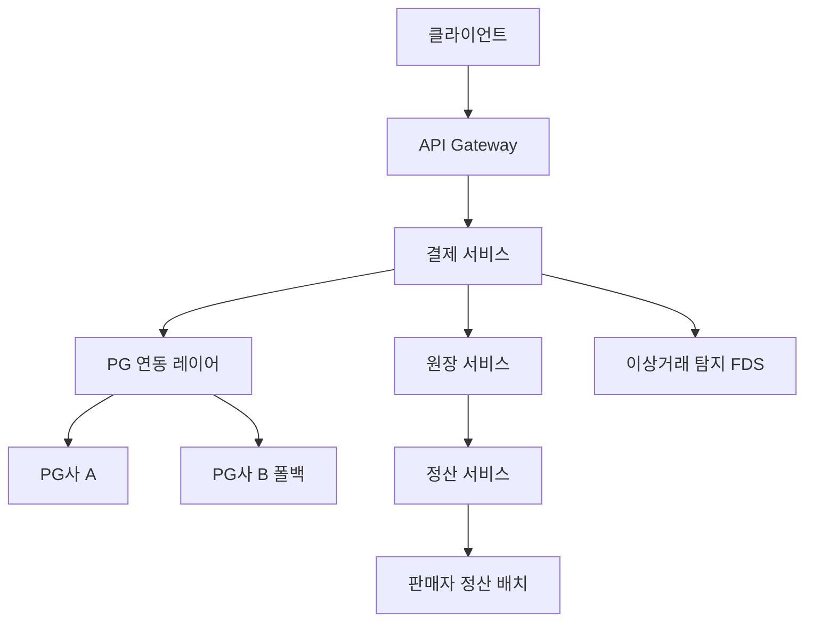
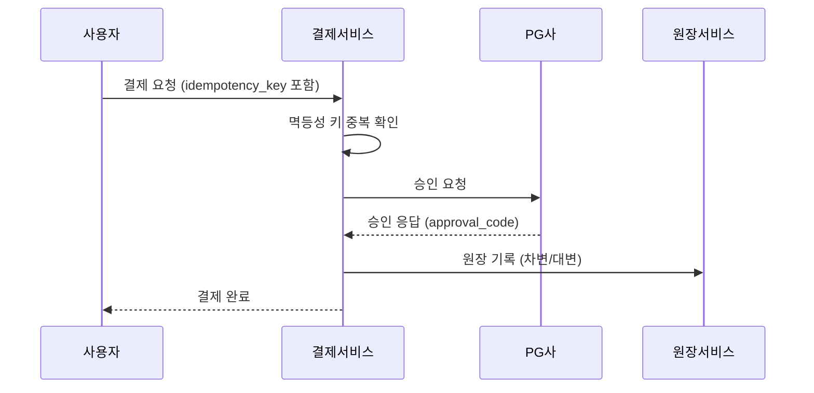
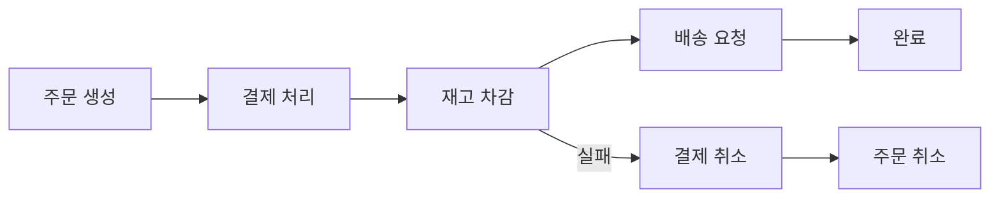
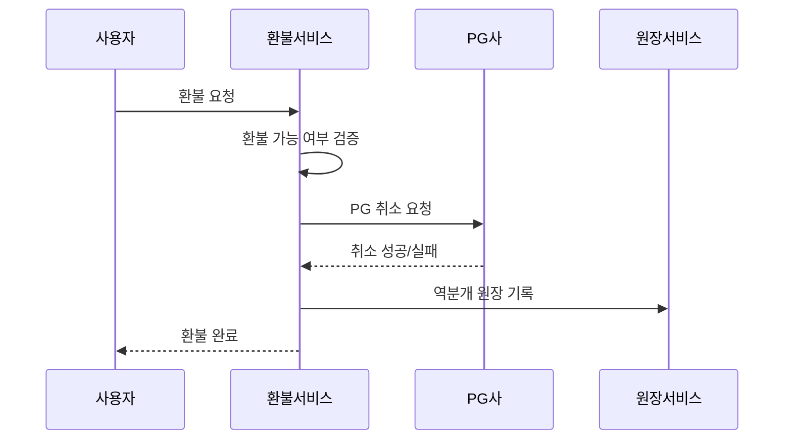
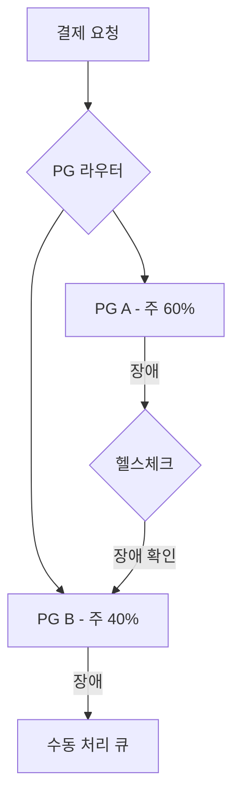
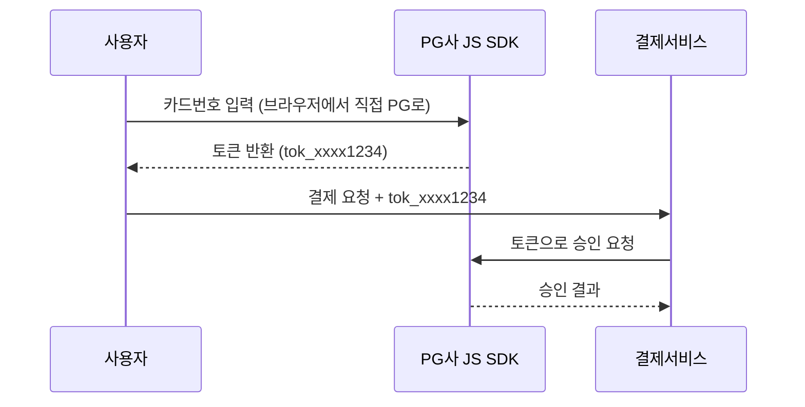

> **한 줄 요약**: 결제 시스템의 핵심은 멱등성으로 중복 결제를 막고, 복식부기로 돈의 흐름을 추적하며, Saga 패턴으로 분산 트랜잭션을 보상하는 것이다.

## 실제 문제: 1원이라도 틀리면 어떻게 되는가?

2022년 국내 A 커머스 플랫폼에서 네트워크 타임아웃으로 인해 결제가 이중 처리되는 버그가 발생했습니다. 사용자는 한 번 결제했지만 계좌에서 금액이 두 번 빠져나갔고, 피해 규모는 수천 건, 수억 원에 달했습니다. 원인은 단순했습니다. **타임아웃 재시도 시 멱등성 키를 붙이지 않았던 것**입니다.

결제 시스템은 "돈을 다루는 시스템"입니다. 1원이 틀려도 법적 분쟁이 발생하고, 고객 신뢰가 무너집니다. 네이버페이, 카카오페이, 토스가 수백 명의 엔지니어를 결제 안정성에 투입하는 이유가 바로 여기에 있습니다.

결제 시스템이 해결해야 할 핵심 문제:
- **중복 결제 방지**: 네트워크 재시도가 이중 청구를 만들면 안 됨
- **돈의 정확한 추적**: 어디서 들어와서 어디로 나갔는지 완전한 기록
- **분산 시스템 일관성**: 결제 성공 후 재고 차감 실패 시 어떻게 복구하는가
- **고가용성**: PG사 장애 시에도 결제가 멈추면 안 됨
- **보안**: 카드번호를 절대 우리 서버에 저장하지 않음

---

## 1. 요구사항 분석 및 규모 추정

### 기능 요구사항

1️⃣ **결제 처리**: 신용카드, 계좌이체, 간편결제 (카카오페이, 네이버페이 등)
2️⃣ **환불/취소**: 전액 환불, 부분 환불, 교환
3️⃣ **정산**: 판매자에게 T+N일 후 수수료 제외 정산
4️⃣ **원장 관리**: 모든 금융 트랜잭션의 불변 기록
5️⃣ **이상거래 탐지**: 비정상 패턴 실시간 감지 및 차단

### 비기능 요구사항

- **정확성**: 1원도 오차 없는 금액 처리 (최우선)
- **가용성**: 99.99% (연간 52분 이하 다운타임)
- **지연시간**: 결제 승인 응답 2초 이내 (P99)
- **멱등성**: 동일 요청 재시도 시 중복 처리 없음
- **감사 가능성**: 모든 거래 이력 5년 이상 보관 (금융당국 규정)

### 규모 추정

```
일일 결제 건수: 1,000만 건/일
평균 QPS = 1,000만 / 86,400 ≈ 116 QPS
피크 QPS = 116 × 43 ≈ 5,000 QPS  (블프, 수능 수험생 선물 등 피크는 평균의 43배)

연간 GMV: 10조원
평균 결제 금액: 10조 / (1,000만 × 365) ≈ 2,740원/건
실제 평균 결제: ~30,000원 (모수 조정 시)

데이터 용량:
  - 결제 건당 레코드: ~2KB
  - 일일 저장: 1,000만 × 2KB = 20GB/일
  - 연간: 20GB × 365 = 7.3TB/년
  - 5년 보관: 36.5TB (원장 포함 시 ×3 = 110TB)

피크 대응:
  - 블프 TPS: 5,000 × 10 = 50,000 TPS
  - PG사 동시 연결: 결제 서버 × PG 커넥션 = 500 × 200 = 100,000 연결
```

---

## 2. 고수준 아키텍처

> **비유:** 결제 시스템은 은행 창구와 같습니다. 고객(사용자)이 창구(API Gateway)에 오면, 은행원(결제 서비스)이 카드사(PG사)에 승인을 요청하고, 장부(원장)에 기록한 뒤, 나중에 가맹점(판매자)에게 입금(정산)합니다.



### 핵심 컴포넌트 역할

**결제 서비스 (Payment Service)**
모든 결제 요청의 진입점입니다. 멱등성 키 검증, 금액 유효성 확인, PG 라우팅 결정을 담당합니다. 상태 머신으로 결제 상태를 관리합니다 (`PENDING → PROCESSING → COMPLETED | FAILED`).

**PG 연동 레이어 (PG Adapter)**
여러 PG사(KG이니시스, NHN KCP, 토스페이먼츠)와의 통신을 추상화합니다. 각 PG사마다 API 스펙이 다르므로, 어댑터 패턴으로 인터페이스를 통일합니다. PG사 장애 시 자동 폴백을 수행합니다.

**원장 서비스 (Ledger Service)**
모든 금융 이동을 복식부기 방식으로 기록합니다. 한번 기록된 원장은 절대 수정되지 않으며, 오류가 있으면 역분개(reverse entry)를 새로 추가합니다.

**정산 서비스 (Settlement Service)**
매일 자정 배치로 실행됩니다. 원장에서 완료된 결제를 집계하고, 수수료를 계산한 뒤, 판매자 계좌로 T+2일에 입금합니다.

---

## 3. 결제 흐름 — 주문부터 완료까지

> **비유:** 결제 흐름은 레스토랑 계산서 처리와 같습니다. 손님이 카드를 내밀면(결제 요청), 직원이 단말기에 긁고(PG 요청), 카드사가 승인하면(PG 승인), 영수증이 나옵니다(결제 완료). 중간에 통신이 끊기면 재시도해야 하는데, 이때 이중 결제가 발생할 수 있습니다.



### 결제 상태 머신

결제는 단순한 성공/실패가 아닙니다. 중간 상태가 매우 중요합니다.

```
INITIATED      → 결제 요청 접수, idempotency_key 생성
PROCESSING     → PG사에 승인 요청 전송
PG_PENDING     → PG사가 카드사에 요청 중 (타임아웃 가능 구간)
APPROVED       → PG사 승인 완료
LEDGER_PENDING → 원장 기록 중
COMPLETED      → 모든 처리 완료
FAILED         → 어느 단계에서든 실패
REFUNDED       → 환불 완료
```

`PG_PENDING` 상태가 가장 위험합니다. PG사에 요청은 갔지만 응답을 받지 못한 상태입니다. 이 구간에서 재시도하면 이중 결제가 발생합니다.

---

## 4. 멱등성 — 재시도해도 안전한 결제

> **비유:** 엘리베이터 버튼을 여러 번 눌러도 한 층만 이동합니다. 이것이 멱등성입니다. 결제도 마찬가지로, 네트워크가 불안정해서 같은 요청이 여러 번 도달해도 딱 한 번만 처리되어야 합니다.

### 왜 멱등성이 필수인가

분산 시스템에서 네트워크는 언제든 실패할 수 있습니다. 클라이언트가 결제 요청을 보냈는데 응답이 없으면, 클라이언트는 모릅니다. 결제가 됐는지, 안 됐는지. 그래서 재시도합니다. 이때 서버가 멱등성을 보장하지 않으면 이중 결제가 발생합니다.

```
타임아웃 시나리오:
1. 클라이언트 → 서버: 결제 요청
2. 서버 → PG사: 승인 요청 (성공)
3. 서버 → 클라이언트: 응답 (네트워크 장애로 유실)
4. 클라이언트: 응답 없음 → 재시도
5. 서버: 같은 요청 재처리 → 이중 결제 발생!
```

### Idempotency Key 설계

클라이언트가 결제 요청 시 고유한 키를 함께 전송합니다.

```
POST /v1/payments
Headers:
  Idempotency-Key: ord_20240315_user123_a7f3k9

Body:
{
  "order_id": "ord_20240315_001",
  "amount": 29900,
  "currency": "KRW",
  "payment_method": "card",
  "card_token": "tok_visa_xxxx1234"
}
```

서버 처리 로직:

```python
def process_payment(request, idempotency_key):
    # 1. 캐시에서 이전 결과 확인 (Redis, TTL 24시간)
    cached = redis.get(f"idempotent:{idempotency_key}")
    if cached:
        return cached  # 동일한 응답 반환

    # 2. DB에서 확인 (Redis 장애 대비)
    existing = db.query(
        "SELECT * FROM payments WHERE idempotency_key = ?",
        idempotency_key
    )
    if existing:
        return existing.response

    # 3. 분산 락으로 동시 요청 방지
    with distributed_lock(f"lock:{idempotency_key}", ttl=30):
        # 4. 실제 결제 처리
        result = execute_payment(request)

        # 5. 결과 저장 (DB + Redis)
        db.save(idempotency_key, result)
        redis.setex(f"idempotent:{idempotency_key}", 86400, result)

    return result
```

핵심 포인트: 분산 락(Redis SETNX)으로 동시에 같은 키가 들어와도 한 번만 처리합니다. DB에도 저장하는 이유는 Redis가 재시작되거나 장애가 나도 24시간이 지나지 않은 요청을 올바르게 처리하기 위해서입니다.

---

## 5. 복식부기 — 돈은 반드시 두 줄로 기록한다

> **비유:** 복식부기는 회사 장부의 기본입니다. "현금 10만원을 지출했다"고 쓰면 나중에 왜 지출했는지 알 수 없습니다. 하지만 "현금 -10만원 / 광고비 +10만원"으로 쓰면 돈이 어디서 어디로 갔는지 완벽히 추적됩니다. 디지털 결제 시스템도 동일한 원리를 사용합니다.

### 복식부기의 황금 법칙

모든 거래에서 **차변 합계 = 대변 합계** 가 반드시 성립합니다. 이 규칙이 깨지면 시스템 어딘가에 버그가 있다는 신호입니다.

```
사용자 A가 30,000원 결제 시:

차변 (Debit)                대변 (Credit)
───────────────────────────────────────────
사용자_A_지갑  -30,000원   판매자_수취계정  +30,000원

PG 수수료 (3%) 처리:
───────────────────────────────────────────
판매자_수취계정 -900원      PG수수료_계정    +900원

최종 판매자 수령: 29,100원
```

### 원장 테이블 스키마

```sql
-- 원장 항목 (불변, 절대 UPDATE/DELETE 없음)
CREATE TABLE ledger_entries (
    id           BIGINT PRIMARY KEY AUTO_INCREMENT,
    entry_id     UUID NOT NULL UNIQUE,
    payment_id   UUID NOT NULL,
    account_id   VARCHAR(64) NOT NULL,  -- 어느 계정에서
    entry_type   ENUM('DEBIT', 'CREDIT'),
    amount       DECIMAL(19, 4) NOT NULL,  -- BigDecimal 사용
    currency     CHAR(3) NOT NULL,
    description  VARCHAR(255),
    created_at   TIMESTAMP NOT NULL DEFAULT CURRENT_TIMESTAMP,
    -- 수정 불가를 DB 레벨에서 강제
    INDEX idx_payment_id (payment_id),
    INDEX idx_account_id (account_id),
    INDEX idx_created_at (created_at)
);

-- 잔액 스냅샷 (매일 자정 생성, 검증용)
CREATE TABLE balance_snapshots (
    id           BIGINT PRIMARY KEY AUTO_INCREMENT,
    account_id   VARCHAR(64) NOT NULL,
    balance      DECIMAL(19, 4) NOT NULL,
    snapshot_at  DATE NOT NULL,
    entry_count  BIGINT NOT NULL,  -- 해당 날까지 누적 항목 수
    UNIQUE KEY uq_account_date (account_id, snapshot_at)
);
```

잔액 계산 방식은 두 가지입니다. **실시간 계산**: 모든 원장 항목을 합산 (느리지만 정확). **스냅샷 + 증분**: 마지막 스냅샷부터 이후 항목만 합산 (빠름). 운영 환경에서는 스냅샷을 매일 생성하고, 조회 시 스냅샷 + 당일 항목을 합산합니다.

---

## 6. 분산 트랜잭션 — Saga 패턴

> **비유:** 해외여행 패키지를 예약할 때를 떠올려보세요. 항공권, 호텔, 렌터카를 동시에 예약해야 합니다. 항공권은 됐는데 호텔이 안 됐다면? 항공권을 취소해야 합니다. Saga 패턴은 이런 연쇄 예약/취소 시나리오를 프로그래밍으로 구현한 것입니다.

### 왜 2PC가 아닌 Saga인가

전통적인 2단계 커밋(2PC)은 여러 DB에 걸친 트랜잭션을 보장합니다. 하지만 마이크로서비스 환경에서는 각 서비스가 다른 DB를 씁니다. 2PC를 쓰면 모든 서비스가 코디네이터의 응답을 기다리며 락을 잡고 있어야 하므로, TPS가 높은 결제 시스템에서는 사용할 수 없습니다.

Saga 패턴은 각 서비스가 로컬 트랜잭션만 수행하고, 실패 시 이전 단계를 취소(보상 트랜잭션)합니다.

### 결제 Saga 흐름



```python
class PaymentSaga:
    def execute(self, order_id):
        steps = []
        try:
            # Step 1: 주문 확정
            order = order_service.confirm(order_id)
            steps.append(("order", order_id))

            # Step 2: 결제 처리
            payment = payment_service.charge(
                order_id=order_id,
                amount=order.total_amount,
                idempotency_key=f"saga_{order_id}_payment"
            )
            steps.append(("payment", payment.id))

            # Step 3: 재고 차감
            inventory_service.reserve(order.items)
            steps.append(("inventory", order_id))

            # Step 4: 배송 요청
            delivery_service.schedule(order_id)
            steps.append(("delivery", order_id))

        except Exception as e:
            # 역순으로 보상 트랜잭션 실행
            self.compensate(steps, e)
            raise

    def compensate(self, steps, reason):
        for service, ref_id in reversed(steps):
            try:
                if service == "payment":
                    payment_service.refund(ref_id, reason="saga_rollback")
                elif service == "inventory":
                    inventory_service.release(ref_id)
                elif service == "order":
                    order_service.cancel(ref_id)
            except Exception as comp_error:
                # 보상 실패 → Dead Letter Queue로 수동 처리 큐에 적재
                dead_letter_queue.push({
                    "service": service,
                    "ref_id": ref_id,
                    "error": str(comp_error)
                })
```

보상 트랜잭션도 실패할 수 있습니다. 예를 들어 결제 취소를 시도했는데 PG사가 응답하지 않는 경우입니다. 이때는 Dead Letter Queue에 적재해 CS팀이 수동으로 처리할 수 있도록 합니다. 중요한 것은 **실패 사실이 유실되지 않는 것**입니다.

---

## 7. 환불/취소 흐름

> **비유:** 환불은 결제의 역방향 흐름입니다. 원장에 기록된 거래를 "되돌리는" 것이 아니라, 새로운 반대 방향 거래를 추가하는 것입니다. 마치 잘못 쓴 장부 항목에 줄을 긋는 것이 아니라, "전 항목 취소"라는 새 항목을 적는 것과 같습니다.

### 환불 유형

1️⃣ **전액 환불**: 결제 금액 전체를 돌려줌. PG사에 전액 취소 요청.
2️⃣ **부분 환불**: 일부 상품만 반품. PG사가 부분 취소를 지원하는지 확인 필요.
3️⃣ **관리자 환불**: 결제일로부터 90일 초과 시 PG사 취소 불가. 직접 계좌이체.

### 환불 흐름



### PG 취소 실패 시 처리

PG사가 응답하지 않거나 취소에 실패하면 수동 처리 큐에 적재합니다.

```python
def process_refund(payment_id, amount, reason):
    refund = create_refund_record(
        payment_id=payment_id,
        amount=amount,
        status="PENDING"
    )

    try:
        # PG사 취소 요청 (타임아웃 10초)
        pg_result = pg_client.cancel(
            payment_id=payment_id,
            amount=amount,
            timeout=10
        )

        if pg_result.success:
            # 원장에 역분개 기록
            ledger.record_reverse_entry(payment_id, amount)
            refund.update(status="COMPLETED")
        else:
            # PG 취소 실패 → 수동 처리 큐
            manual_queue.push({
                "type": "REFUND_MANUAL",
                "refund_id": refund.id,
                "payment_id": payment_id,
                "amount": amount,
                "reason": pg_result.error_message
            })
            refund.update(status="MANUAL_PENDING")

    except TimeoutError:
        # 타임아웃: 취소됐는지 모름 → 상태 조회 후 판단
        pg_status = pg_client.query_status(payment_id)
        if pg_status == "CANCELLED":
            ledger.record_reverse_entry(payment_id, amount)
            refund.update(status="COMPLETED")
        else:
            # 상태 조회도 실패 → 재시도 큐
            retry_queue.push(refund.id, delay_seconds=60)
            refund.update(status="RETRY_PENDING")
```

---

## 8. 정산 시스템 — T+N일 판매자 입금

> **비유:** 카드 결제 후 실제 입금까지 시간이 걸리는 이유가 있습니다. PG사가 카드사에서 돈을 받아 플랫폼에 주고, 플랫폼이 수수료를 뗀 뒤 판매자에게 주는 다단계 과정이 있기 때문입니다. 정산 시스템은 이 전체 흐름을 자동화합니다.

### 정산 흐름

```
T+0일: 결제 완료 → 원장에 기록
T+1일: PG사가 플랫폼 계좌에 입금 (카드사 → PG → 플랫폼)
T+2일: 플랫폼이 판매자 계좌에 입금 (수수료 3% 차감)

수수료 계산 예시:
  판매액: 100,000원
  PG 수수료 (1.5%): -1,500원
  플랫폼 수수료 (1.5%): -1,500원
  판매자 수령액: 97,000원
```

### 정산 배치 처리

```python
# 매일 자정 실행 (Apache Airflow 또는 Spring Batch)
def daily_settlement_batch(settlement_date):
    # 1. 전날 완료된 결제 조회
    payments = db.query("""
        SELECT seller_id,
               SUM(amount) as gross_amount,
               SUM(pg_fee) as pg_fee,
               SUM(platform_fee) as platform_fee,
               COUNT(*) as transaction_count
        FROM payments
        WHERE status = 'COMPLETED'
          AND completed_at::date = %s - INTERVAL '1 day'
        GROUP BY seller_id
    """, settlement_date)

    for payment in payments:
        net_amount = (
            payment.gross_amount
            - payment.pg_fee
            - payment.platform_fee
        )

        # 2. 정산 레코드 생성
        settlement = Settlement(
            seller_id=payment.seller_id,
            gross_amount=payment.gross_amount,
            pg_fee=payment.pg_fee,
            platform_fee=payment.platform_fee,
            net_amount=net_amount,
            settlement_date=settlement_date,
            status="PENDING"
        )
        db.save(settlement)

        # 3. 원장에 정산 기록
        ledger.record(
            debit_account=f"seller_receivable:{payment.seller_id}",
            credit_account=f"platform_cash",
            amount=net_amount
        )

    # 4. 은행 API로 실제 이체
    bank_transfer_batch(settlements)
```

정산 배치는 **멱등하게** 설계해야 합니다. 배치가 중간에 실패해도 재실행하면 동일한 결과가 나와야 합니다. settlement_date + seller_id 조합에 유니크 키를 걸어서 중복 정산을 방지합니다.

---

## 9. 원장 설계 — 불변 로그와 감사 추적

> **비유:** 은행 장부는 지우개로 지울 수 없습니다. 잘못 기록했으면 "수정 항목"을 새로 추가합니다. 디지털 원장도 동일합니다. 한번 기록된 항목은 절대 변경하지 않고, 역분개로만 수정합니다. 이것이 감사 가능성(Auditability)의 핵심입니다.

### 불변 원장의 구현 원칙

1️⃣ **Append-Only**: INSERT만 허용, UPDATE/DELETE 없음
2️⃣ **이벤트 소싱**: 현재 잔액은 원장 이벤트의 합산으로 계산
3️⃣ **체크섬 연쇄**: 각 항목이 이전 항목의 해시를 포함 (블록체인과 유사)
4️⃣ **잔액 스냅샷**: 전체 합산을 매일 캐싱해서 조회 성능 확보

```sql
-- 잔액 불일치 감지 쿼리 (매일 실행)
SELECT
    s.account_id,
    s.balance as snapshot_balance,
    s.balance + COALESCE(SUM(
        CASE le.entry_type
            WHEN 'CREDIT' THEN le.amount
            WHEN 'DEBIT'  THEN -le.amount
        END
    ), 0) as calculated_balance,
    ABS(calculated_balance - s.balance) as discrepancy
FROM balance_snapshots s
LEFT JOIN ledger_entries le
    ON le.account_id = s.account_id
    AND le.created_at > s.snapshot_at
WHERE s.snapshot_at = CURRENT_DATE - 1
GROUP BY s.account_id, s.balance
HAVING discrepancy > 0;  -- 1원이라도 다르면 경보
```

이 쿼리로 매일 불일치를 검사합니다. 1원이라도 차이가 나면 즉시 알림이 발송되고 엔지니어가 조사에 착수합니다.

---

## 10. 통화 처리 — BigDecimal은 선택이 아닌 필수

> **비유:** `0.1 + 0.2`를 컴퓨터에게 물어보면 `0.30000000000000004`가 나옵니다. 부동소수점(float)의 한계입니다. 결제 시스템에서 float을 쓰면 수십만 건 누적 시 수천 원의 오차가 발생합니다. BigDecimal 또는 정수(최소 단위 기준)만 써야 합니다.

### 금액 표현 방식

```python
# 절대 사용 금지
price = 1000.50  # float — 부동소수점 오차 발생

# 올바른 방법 1: Python Decimal
from decimal import Decimal, ROUND_HALF_UP
price = Decimal("1000.50")
fee = price * Decimal("0.03")  # = 30.0150
fee_rounded = fee.quantize(
    Decimal("0.01"),
    rounding=ROUND_HALF_UP
)  # = 30.02

# 올바른 방법 2: 최소 단위 정수 (원화는 원 단위)
price_jeon = 100050  # 1000.50원을 전(0.01원) 단위로 저장
# DB에는 DECIMAL(19, 4) 타입 사용
```

### 다중 통화 처리

```python
class Money:
    def __init__(self, amount: Decimal, currency: str):
        self.amount = amount
        self.currency = currency

    def convert_to(self, target_currency: str, rate: Decimal) -> 'Money':
        if self.currency == target_currency:
            return self
        converted = self.amount * rate
        # 통화별 소수점 자리수 적용
        precision = CURRENCY_PRECISION[target_currency]  # KRW=0, USD=2, JPY=0
        rounded = converted.quantize(
            Decimal(10) ** -precision,
            rounding=ROUND_HALF_UP
        )
        return Money(rounded, target_currency)

CURRENCY_PRECISION = {
    "KRW": 0,   # 원화: 소수점 없음
    "USD": 2,   # 달러: 센트 단위
    "JPY": 0,   # 엔화: 소수점 없음
    "EUR": 2,   # 유로: 센트 단위
}
```

환율은 결제 시점의 환율을 원장에 함께 기록합니다. 나중에 환율이 바뀌어도 당시 거래 금액을 정확히 재현할 수 있어야 합니다.

---

## 11. PG사 장애 대응 — 다중 PG 라우팅

> **비유:** 아무리 좋은 식당도 재료 공급이 끊기면 영업을 못 합니다. PG사가 장애가 나면 우리도 결제를 받지 못합니다. 그래서 여러 PG사를 준비해두고, 하나가 장애나면 다른 곳으로 자동 전환하는 체계가 필요합니다.

### 다중 PG 라우팅 설계



```python
class PGRouter:
    def __init__(self):
        self.pg_clients = {
            "inicis": InicisClient(),
            "toss": TossPaymentsClient(),
            "kcp": KCPClient()
        }
        self.health_status = {}
        self.circuit_breakers = {}

    def route(self, payment_request) -> str:
        # 1. 카드사별 최적 PG 선택 (수수료/성공률 기준)
        preferred = self.get_preferred_pg(payment_request.card_brand)

        # 2. 서킷 브레이커 상태 확인
        if self.circuit_breakers[preferred].is_open():
            # 폴백 PG로 전환
            preferred = self.get_fallback_pg(preferred)

        return preferred

    def get_fallback_pg(self, failed_pg: str) -> str:
        """장애 PG 제외하고 다음 우선순위 PG 반환"""
        priority = ["inicis", "toss", "kcp"]
        for pg in priority:
            if pg != failed_pg and not self.circuit_breakers[pg].is_open():
                return pg
        raise NoPGAvailableException("모든 PG 장애")
```

### 서킷 브레이커

PG사가 응답이 느리면, 계속 요청을 보내는 것이 오히려 피해를 키웁니다. 서킷 브레이커는 일정 오류율 초과 시 요청을 차단하고 빠르게 폴백합니다.

```
CLOSED (정상):  요청 통과
  ↓ 오류율 50% 초과 (10초 윈도우)
OPEN (차단):    모든 요청 즉시 실패 처리
  ↓ 30초 후
HALF-OPEN:      소량 요청 시험 통과
  ↓ 성공 시
CLOSED (복구)
```

---

## 12. 보안 — PCI DSS와 토큰화

> **비유:** 카드번호를 직접 저장하는 것은 금고 안에 현금을 두는 게 아니라, 현금 사진을 찍어서 사무실에 붙여두는 것과 같습니다. 해커가 털면 끝입니다. 토큰화는 사진 대신 번호표를 발급하고, 실제 현금(카드번호)은 전문 금고(PCI DSS 인증 PG사)에만 보관하는 방식입니다.

### PCI DSS 핵심 요구사항

PCI DSS(Payment Card Industry Data Security Standard)는 카드 데이터를 다루는 모든 사업자가 반드시 준수해야 하는 보안 표준입니다.

```
우리 서버에 저장 금지:
  - 카드번호 (PAN): 절대 저장 금지
  - CVV/CVC: 절대 저장 금지 (심지어 암호화도 금지)
  - PIN 번호: 절대 저장 금지

허용 (암호화 필수):
  - 카드 만료일
  - 카드 소유자 이름
  - PG사가 발급한 토큰 (실제 카드번호 아님)
```

### 토큰화 흐름



카드번호는 PG사 서버에만 존재하고 우리 서버를 거치지 않습니다. 우리는 토큰만 저장합니다. 해커가 우리 DB를 털어도 카드번호는 없습니다.

### 이상거래 탐지 (FDS)

```python
class FraudDetectionService:
    def evaluate(self, payment_request) -> RiskScore:
        signals = []

        # 1. 빈도 이상: 1분 내 동일 카드 5회 이상 시도
        recent_attempts = redis.zcount(
            f"attempts:{payment_request.card_token}",
            time.time() - 60, time.time()
        )
        if recent_attempts >= 5:
            signals.append(RiskSignal.HIGH_FREQUENCY)

        # 2. 금액 이상: 평소 결제의 10배 이상
        avg_amount = get_user_avg_payment(payment_request.user_id)
        if payment_request.amount > avg_amount * 10:
            signals.append(RiskSignal.UNUSUAL_AMOUNT)

        # 3. 위치 이상: 1시간 내 물리적으로 불가능한 위치
        last_location = get_last_payment_location(payment_request.user_id)
        if is_impossible_travel(last_location, payment_request.ip_location):
            signals.append(RiskSignal.IMPOSSIBLE_TRAVEL)

        # 4. 신규 기기 + 고액
        if is_new_device(payment_request) and payment_request.amount > 500000:
            signals.append(RiskSignal.NEW_DEVICE_HIGH_AMOUNT)

        return calculate_risk_score(signals)
```

---

## 13. 극한 시나리오

### 극한 시나리오 1: 블프 결제 폭주 — TPS 10배

블랙프라이데이 자정, 평소 500 TPS이던 결제가 5,000 TPS로 급증합니다. DB 연결 풀이 모자라고, PG사 API도 응답이 느려집니다.

**문제점:**
- DB 커넥션 풀 고갈 → 결제 요청 대기 → 타임아웃 → 재시도 → 폭주 악화
- PG사 응답 3초 → 결제 서비스 스레드 점유 → 서비스 전체 블로킹

**대응 전략:**

1️⃣ **사전 오토 스케일링**: 블프 1주 전부터 인스턴스를 2배로 늘려둡니다. 이벤트 당일 자동 스케일링은 늦습니다(인스턴스 기동에 2~5분 소요).

2️⃣ **결제 요청 큐잉**: 피크 초과 요청은 즉시 거부하지 않고 SQS에 적재합니다. 사용자에게 "처리 중" 상태를 보여주고 30초 내 완료를 보장합니다.

3️⃣ **DB 읽기 분리**: 결제 처리는 Master DB, 상태 조회는 Read Replica에서만 처리합니다.

4️⃣ **PG 타임아웃 단축**: 평소 10초 타임아웃을 피크 시 3초로 단축합니다. 느린 PG보다 빠른 실패가 낫습니다.

5️⃣ **동적 PG 부하 분산**: PG사별 응답시간을 실시간 모니터링해서 빠른 PG에 더 많은 요청을 라우팅합니다.

### 극한 시나리오 2: PG사 장애 — 전액 환불 불가

자정 정산 중 주요 PG사가 8시간 장애가 발생했습니다. 이미 결제된 10만 건에 대해 환불 요청이 쏟아지지만, PG사 API가 응답하지 않습니다.

**문제점:**
- 환불 API 호출 실패 → 원장에 환불 기록 불가 → 사용자에게 돈 돌려주지 못함
- PG사 복구 후 10만 건 환불을 일괄 처리해야 함

**대응 전략:**

1️⃣ **환불 요청 내구성 보장**: 환불 요청을 즉시 DB에 저장합니다(`status=PENDING`). PG 장애 여부와 관계없이 요청 자체는 유실되지 않습니다.

2️⃣ **지수 백오프 재시도**: PG 복구 후 자동으로 재시도합니다 (1분, 2분, 4분, 8분... 최대 24시간).

3️⃣ **SLA 기반 수동 처리**: PG 장애 4시간 초과 시 자동으로 CS 티켓을 생성해서 수동 계좌이체 처리를 준비합니다.

4️⃣ **사용자 통지**: 환불 지연 이유를 투명하게 고지하고, 처리 완료 시 알림 발송을 예약합니다.

### 극한 시나리오 3: 이중 결제 발생

서버 A가 결제를 처리하고 응답을 보내는 도중 크래시가 났습니다. 클라이언트는 응답을 받지 못했고, 재시도했습니다. 이번엔 서버 B가 처리했습니다. 사용자는 두 번 결제됐습니다.

**원인 분석:**
- 서버 A: 결제 처리 완료, 응답 전 크래시
- 클라이언트: 타임아웃 → 재시도
- 서버 B: idempotency_key DB 저장 전 서버 A 크래시로 인해 중복 체크 실패

**대응 전략:**

1️⃣ **즉각 감지**: 결제 완료 후 원장 잔액 검증 배치가 1분 주기로 실행. 이중 결제 발생 시 차변/대변 불일치 즉시 감지.

2️⃣ **자동 환불**: 중복 결제 감지 시 나중 결제를 자동 취소하는 로직이 트리거됩니다.

3️⃣ **사후 대응**: 영향받은 사용자에게 사과 메일 발송 + 마일리지 보상.

4️⃣ **재발 방지**: idempotency_key를 DB에 먼저 INSERT(UNIQUE 제약)하고 PG 요청을 보내는 순서로 변경. DB INSERT 성공 후에만 PG 요청 진행.

```python
def process_payment_safe(request, idempotency_key):
    # 핵심: DB에 먼저 잠금용 레코드 INSERT
    # UNIQUE 제약으로 두 번째 INSERT는 실패
    try:
        db.execute("""
            INSERT INTO payment_locks
              (idempotency_key, status, created_at)
            VALUES (?, 'PROCESSING', NOW())
        """, idempotency_key)
    except UniqueViolation:
        # 이미 처리 중 또는 완료
        return get_existing_payment(idempotency_key)

    # DB에 락 확보 후 PG 요청
    result = pg_client.charge(request)
    db.update_payment_lock(idempotency_key, status="COMPLETED", result=result)
    return result
```

---

## 14. 면접 포인트 5가지

### 면접 포인트 1️⃣ "결제 시스템에서 트랜잭션을 어떻게 보장하나요?"

단일 DB 환경이라면 ACID 트랜잭션으로 충분합니다. 하지만 마이크로서비스 환경에서는 각 서비스가 다른 DB를 쓰므로 분산 트랜잭션이 필요합니다. 2PC는 락으로 인한 성능 문제가 있어 결제 시스템에 적합하지 않고, **Saga 패턴**(코레오그래피 또는 오케스트레이션 방식)을 사용합니다. 실패 시 보상 트랜잭션으로 롤백합니다.

### 면접 포인트 2️⃣ "이중 결제를 어떻게 막나요?"

**멱등성 키**가 핵심입니다. 클라이언트가 UUID v4 기반 키를 생성해서 요청에 포함합니다. 서버는 이 키를 DB에 UNIQUE 제약으로 저장합니다. 재시도 시 동일 키가 오면 기존 결과를 반환합니다. PG사도 자체 멱등성 키를 지원하지만, 우리 시스템 레벨에서 별도로 보장하는 것이 안전합니다.

### 면접 포인트 3️⃣ "원장 잔액이 틀렸을 때 어떻게 감지하나요?"

복식부기에서 **차변 합계 = 대변 합계** 불변식을 매일 배치로 검증합니다. 또한 잔액 스냅샷과 실제 원장 합산값을 비교합니다. 1원이라도 차이가 나면 PagerDuty 알림을 발송합니다. 결제 시스템에서 잔액 불일치는 P0(최고 긴급) 사고입니다.

### 면접 포인트 4️⃣ "카드 정보는 어떻게 안전하게 처리하나요?"

**PCI DSS** 준수가 필수입니다. 카드번호, CVV는 우리 서버에 절대 저장하지 않습니다. PG사가 제공하는 JavaScript SDK가 사용자 브라우저에서 직접 PG사 서버로 카드 정보를 전송하고, PG사가 토큰을 발급합니다. 우리 서버는 이 토큰만 받아서 저장하고 결제에 사용합니다. 카드번호 자체는 PCI DSS 인증을 받은 PG사 금고에만 존재합니다.

### 면접 포인트 5️⃣ "PG사가 장애 나면 어떻게 하나요?"

서킷 브레이커 + 다중 PG 폴백 조합입니다. 서킷 브레이커가 PG사 오류율을 추적하다가 임계치 초과 시 차단하고 폴백 PG로 전환합니다. 폴백 PG 선택은 카드사별로 최적화(수수료 및 성공률 기준)되어 있습니다. 모든 PG가 동시에 장애가 나는 경우에는 결제 요청을 큐에 쌓아두고 복구 후 처리하거나, 사용자에게 명확한 오류 메시지를 노출합니다.

---

## 15. 실무 실수 Top 5

**실수 1: float으로 금액 계산**
`double amount = 19.99 * 100;` 결과가 `1998.9999999999998`이 됩니다. DECIMAL(19,4) 또는 BigDecimal을 사용하세요.

**실수 2: 멱등성 키 없는 재시도**
타임아웃 발생 시 그냥 재시도하면 이중 결제입니다. 항상 멱등성 키를 붙여서 재시도하세요.

**실수 3: 원장에 UPDATE 허용**
"실수로 잘못 기록했으니 UPDATE로 수정"은 감사 추적을 파괴합니다. 역분개(취소 + 새 항목)만 사용하세요.

**실수 4: 정산 배치 비멱등 설계**
배치가 실패해서 재실행했더니 정산이 두 번 됐습니다. 항상 settlement_date + seller_id에 UNIQUE 제약을 걸어두세요.

**실수 5: 환불 성공 전에 재고 복구**
PG 취소가 완료되기 전에 재고를 먼저 복구하면, 환불 실패 시 재고 과다 상태가 됩니다. 환불 완료 이벤트를 받은 후에 재고를 복구하세요.

---

## 마무리

결제 시스템은 "실패해도 되는 게 없는" 시스템입니다. 채팅 메시지가 1초 늦게 오는 것은 UX 문제지만, 결제가 1원 틀리는 것은 법적 문제입니다.

핵심 원칙을 다시 정리하면:

| 문제 | 해결책 |
|------|--------|
| 이중 결제 | 멱등성 키 + 분산 락 |
| 잔액 불일치 | 복식부기 + 일별 검증 |
| 분산 트랜잭션 | Saga + 보상 트랜잭션 |
| PG 장애 | 서킷 브레이커 + 다중 PG |
| 카드 정보 유출 | 토큰화 + PCI DSS |
| 소수점 오차 | BigDecimal + DECIMAL(19,4) |

결제 시스템을 설계할 때는 **"이게 실패하면 어떻게 복구하는가"**를 모든 단계에서 먼저 생각하는 것이 시니어 엔지니어의 사고방식입니다. 해피 패스보다 에러 패스가 훨씬 복잡한 도메인입니다.
