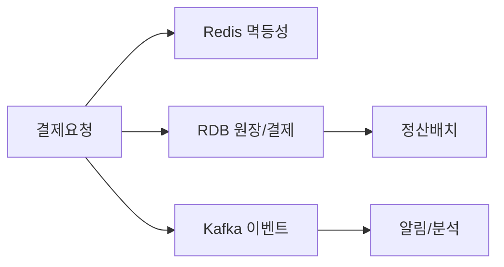
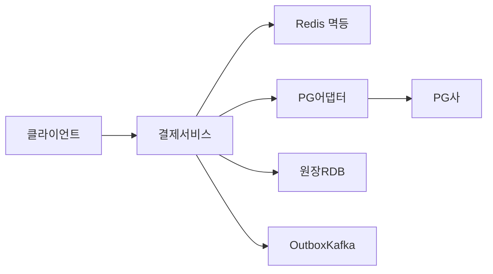
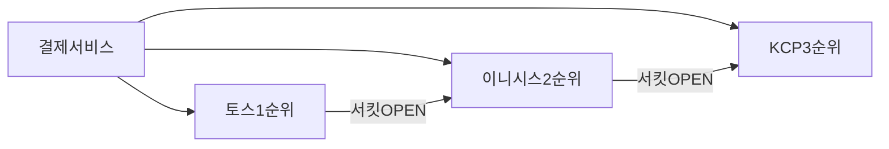
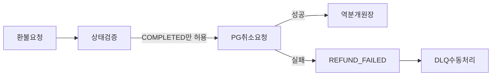

> **한 줄 요약**: 결제 시스템의 핵심은 세 가지다. 멱등성 키로 이중 결제를 원천 차단하고, 복식부기로 1원 단위 자금 무결성을 보장하며, PG 추상화 레이어로 벤더 장애를 투명하게 폴백한다. 이 세 가지를 "왜(WHY)" 그렇게 설계해야 하는지 이해하면 결제 시스템 면접의 80%를 커버할 수 있다.

---

## 실제 문제: 왜 결제 시스템은 이렇게 어려운가

2022년 국내 A 커머스 플랫폼에서 블랙프라이데이 피크 트래픽 중 결제 이중 처리 버그가 발생했습니다. 원인은 단 한 줄이었습니다. **네트워크 타임아웃 재시도 시 멱등성 키를 헤더에 붙이지 않은 것**입니다. 사용자는 한 번 결제했지만 계좌에서 금액이 두 번 빠져나갔습니다. 피해 규모는 수천 건, 수억 원이었습니다.

결제 시스템이 어려운 이유는 세 가지 요구사항이 동시에 충돌하기 때문입니다.

**첫째, 분산 시스템의 불신뢰성**: 네트워크는 언제든 끊길 수 있고, PG사는 응답을 늦게 줄 수 있습니다. "처리됐는지 모르는 상태"에서 재시도하면 이중 결제가 됩니다. 이것이 멱등성(Idempotency)이 존재하는 이유입니다.

**둘째, 돈의 무결성**: 소셜 피드에서 게시물 1건이 유실돼도 사용자가 모릅니다. 하지만 결제에서 1원이 틀리면 법적 분쟁이 발생하고 고객 신뢰가 무너집니다. 이것이 복식부기(Double-Entry Bookkeeping)가 필요한 이유입니다.

**셋째, 규정 준수**: PCI-DSS(카드 정보 보안), 전자금융거래법(감사 기록 5년 보관), 금융당국 정산 보고 의무가 있습니다. 기술 결정이 법적 의무와 직결됩니다.

네이버페이, 카카오페이, 토스가 수백 명의 엔지니어를 결제 안정성에 투입하는 이유가 여기에 있습니다.

---

## 1단계: 요구사항 분석 — 무엇을 만들 것인가

면접에서 가장 먼저 해야 할 것은 요구사항을 기능/비기능으로 분리하고, 각 요구사항이 어떤 설계 결정을 강제하는지 연결하는 것입니다.

### 기능 요구사항

**1. 결제 처리**: 신용카드, 계좌이체, 간편결제(카카오페이, 네이버페이, 토스페이) 지원. 결제 요청부터 PG 승인, 원장 기록, 완료 응답까지 일관된 상태 전이를 보장해야 합니다. 이것이 상태 머신(State Machine)을 요구하는 이유입니다.

**2. 환불/취소**: 전액 환불, 부분 환불, 관리자 수동 환불. 결제 후 90일 초과 시 PG 취소 불가이므로 직접 계좌이체 처리 경로가 별도로 필요합니다. 환불 역시 멱등성이 필요합니다. 환불 API를 두 번 호출해도 한 번만 처리되어야 합니다.

**3. 정산(Settlement)**: 판매자에게 T+2일 수수료 차감 후 입금. 매일 자정 배치로 전일 완료 결제를 집계하고, PG 정산 데이터와 대사(Reconciliation) 후 지급합니다. 이것이 비동기 정산이 필요한 이유입니다.

**4. 원장(Ledger) 관리**: 모든 금융 트랜잭션의 불변 기록. 복식부기 방식으로 차변·대변 동시 기록. 어떤 레코드도 UPDATE/DELETE 금지이며, 오류는 역분개 항목으로 정정합니다. 이것이 Append-Only 원장 설계를 요구하는 이유입니다.

**5. 결제 수단 관리**: 카드 토큰화(PCI-DSS 준수), 저장된 결제 수단 목록 조회·삭제. 원카드번호는 PG사 볼트에만, 우리 서버에는 토큰만 저장합니다.

### 비기능 요구사항

**Exactly-Once 시맨틱**: 동일 결제 요청이 네트워크 재시도, 로드밸런서 재시도, 앱 중복 탭으로 여러 번 들어와도 단 한 번만 처리. 이것이 달성되지 않으면 나머지 요구사항은 의미가 없습니다.

**대사(Reconciliation) 가능성**: 우리 DB의 결제 기록과 PG사의 정산 파일이 매일 100% 일치해야 합니다. 불일치 발생 시 24시간 내 원인 특정 및 정정이 가능해야 합니다.

**PCI-DSS 준수 고려**: 카드 정보를 우리 서버에서 처리·저장하지 않습니다. 결제 폼은 PG사 호스팅 페이지 또는 JS SDK를 사용하고, 카드번호는 절대 로그에 기록하지 않습니다.

**가용성 99.99%**: 연간 52분 이하 다운타임. PG사 단일 장애점 제거가 필수입니다.

**감사 가능성**: 모든 거래 이력 5년 이상 보관(전자금융거래법). 누가 언제 어떤 결제를 승인·취소했는지 추적 가능해야 합니다.

---

## 2단계: 규모 추정 — 얼마나 큰 시스템인가

```
일일 결제 건수    : 1,000만 건/일
평균 QPS         : 1,000만 / 86,400 ≈ 116 QPS
피크 QPS         : 116 × 43 ≈ 5,000 QPS
                   (블프·수능 선물 등 피크는 평균의 43배)

연간 GMV         : 10조원
평균 결제 금액    : ~30,000원/건

데이터 용량:
  결제 레코드      : ~2 KB/건
  일일 저장        : 1,000만 × 2 KB = 20 GB/일
  원장 항목        : 결제 1건당 4개 항목(차변2 + 대변2) × 512 B = 2 KB
  일일 원장        : 1,000만 × 2 KB = 20 GB/일
  연간 합계        : (20 + 20) GB × 365 = 14.6 TB/년
  5년 보관         : 73 TB (아카이브 포함 ~150 TB)

피크 PG 동시 연결:
  결제 서버 50대 × PG 커넥션 200개 = 10,000 동시 PG 연결
  PG사 커넥션 풀 부족 시 큐잉 → 타임아웃 연쇄 → 스레드 풀 고갈

멱등성 키 저장:
  Redis: 1,000만 키/일 × 100 B = 1 GB/일 (TTL 24시간이면 상시 1 GB)
  DB UNIQUE 인덱스: 1,000만 건/일 × 60 B = 600 MB/일

PG_PENDING 위험 구간 추정:
  타임아웃율 0.1% 가정 → 하루 10,000건 PG_PENDING
  복구 배치 5분 주기 → 최대 10,000건이 5분간 불확실 상태
  이 10,000건이 전부 이중 결제로 이어지면: 10,000 × 30,000원 = 3억원/일 리스크
```

이 수치가 설계 결정의 근거가 됩니다. PG_PENDING 복구 배치가 왜 5분 주기인지, Redis TTL이 왜 24시간인지, 스레드 풀을 왜 PG사별로 분리하는지가 이 추정에서 나옵니다.

---

## 3단계: DB 선택 — WHY가 핵심이다

결제 시스템에서 DB 선택은 "가장 빠른 것"이 아니라 "각 데이터 특성에 맞는 것"입니다. 면접관이 원하는 것은 선택 결과가 아니라 WHY입니다.



### WHY RDB — 원장과 결제 레코드에 RDB를 써야 하는 이유

원장 데이터는 **복식부기의 수학적 불변식(차변 합계 = 대변 합계)**을 DB 레벨에서 보장해야 합니다. 이 불변식을 깨는 버그가 발생하면 즉시 감지해야 합니다. RDB의 ACID 트랜잭션이 이를 가능하게 합니다.

**WHY ACID 트랜잭션이 필수인가**: 결제 완료 처리 시 세 가지 작업이 원자적으로 실행되어야 합니다.

1. 결제 상태를 COMPLETED로 업데이트
2. 원장에 차변·대변 항목 삽입
3. Outbox 이벤트 기록

이 중 2번이 실패하면 결제는 COMPLETED인데 원장에는 기록이 없는 유령 결제가 됩니다. 3번이 실패하면 정산 서비스가 이벤트를 못 받아 정산 누락이 발생합니다. RDB 트랜잭션은 이 세 작업을 하나의 원자적 단위로 묶습니다. 이것이 MongoDB를 원장에 쓰면 안 되는 이유이기도 합니다. 다중 문서 트랜잭션을 지원하지만, 복식부기 불변식을 DB 레벨에서 선언적으로 강제하기 어렵습니다.

**WHY UNIQUE 제약이 최후 방어선인가**: `idempotency_key` 컬럼에 UNIQUE 인덱스를 걸면 Redis가 다운되거나 분산 락이 실패해도 DB가 마지막 보루로 중복 INSERT를 막습니다. Redis는 1차 필터, DB UNIQUE는 2차 보루입니다. 이 이중 방어 없이 Redis만 믿으면 Redis 재시작 시 데이터 유실로 이중 결제 가능성이 열립니다.

**WHY Foreign Key로 참조 무결성인가**: `ledger_entries.payment_id`가 반드시 `payments.id`에 존재해야 한다는 제약을 DB가 보장합니다. 애플리케이션 레벨 검증만으로는 레이스 컨디션에서 고아 레코드(Orphan Record)가 생길 수 있습니다.

### WHY Redis — 멱등성 키에 Redis를 써야 하는 이유

멱등성 키 검사는 **모든 결제 요청에서 실행**됩니다. 피크 QPS 5,000에서 매 요청마다 RDB를 조회하면 결제 서비스가 DB 병목으로 바뀝니다.

**WHY SET NX EX의 원자성이 중요한가**: `SET idempotency:{key} 1 EX 86400 NX` 명령 하나로 "없으면 저장, 있으면 거절"을 원자적으로 실행합니다. DB로 같은 작업을 하려면 `SELECT` → `INSERT` 사이에 레이스 컨디션이 생깁니다. 두 요청이 동시에 SELECT에서 "없음"을 확인하고 둘 다 INSERT를 시도합니다. UNIQUE 제약으로 하나는 실패하지만, 그 실패를 처리하는 사이에 지연이 생깁니다. Redis NX는 이 레이스 컨디션 자체를 없앱니다.

**WHY TTL 자동 만료인가**: 24시간 TTL을 설정하면 만료된 키가 자동 삭제됩니다. DB 정리 배치가 필요 없고, 메모리 사용량이 예측 가능합니다. 1,000만 키 × 100 B = 상시 1 GB, 이는 Redis 단일 인스턴스로 충분히 처리 가능한 크기입니다.

**WHY Redis만으로 충분하지 않은가**: Redis는 AOF/RDB 지속성 설정에 따라 재시작 시 최대 수십 초 분량의 데이터 유실이 가능합니다. 이 창에서 들어온 멱등성 키는 사라집니다. 그래서 Redis를 1차 필터로, DB UNIQUE 제약을 2차 최후 방어선으로 구성하는 이중 방어가 필요합니다.

### WHY Kafka — 이벤트 로그에 Kafka를 써야 하는 이유

결제 완료 이벤트를 정산 서비스, 알림 서비스, 분석 시스템이 모두 소비해야 합니다. 직접 HTTP 호출로 연결하면 결제 서비스가 모든 downstream 서비스의 가용성에 의존하게 됩니다.

**WHY Transactional Outbox가 필수인가**: 결제 DB 저장과 Kafka 발행을 별도로 수행하면 "DB 저장 성공, Kafka 발행 실패" 상황에서 정산 서비스가 이벤트를 못 받아 정산 누락이 생깁니다. Outbox 패턴은 DB 트랜잭션 내에 Outbox 테이블에 이벤트를 먼저 기록하고, 폴러가 Kafka로 발행합니다. DB와 이벤트 발행이 원자적으로 묶입니다.

**WHY Kafka를 감사 로그로 사용하는가**: Kafka 토픽은 보존 정책을 통해 모든 결제 이벤트의 시계열 기록이 됩니다. 나중에 "이 결제가 언제, 어떤 상태로 처리됐나"를 Kafka 로그에서 재생(Replay)할 수 있습니다. RDB의 상태 스냅샷과 달리 Kafka는 상태 변화의 이력 자체를 저장합니다.

**WHY 컨슈머 그룹 분리인가**: 정산 서비스와 알림 서비스가 같은 토픽을 다른 컨슈머 그룹으로 소비합니다. 알림 서비스가 느려도 정산 서비스에 영향이 없습니다. 한 컨슈머 그룹의 lag이 다른 그룹에 전파되지 않습니다.

---

## 4단계: 고수준 아키텍처

> **비유**: 결제 시스템은 은행 창구와 같습니다. 고객(클라이언트)이 창구(API Gateway)에 오면, 은행원(결제 서비스)이 카드사(PG사)에 승인을 요청하고, 장부(원장 DB)에 기록한 뒤, 나중에 가맹점(판매자)에게 입금(정산 배치)합니다. 창구에 번호표(멱등성 키)가 없으면 같은 고객이 두 번 창구에 와도 두 번 처리됩니다.



### 핵심 컴포넌트 역할

**결제 서비스(Payment Service)**: 모든 결제 요청의 진입점. 멱등성 키 검증, 결제 상태 머신 관리, PG 어댑터 호출, 원장 기록을 하나의 DB 트랜잭션으로 묶어 처리.

**PG 어댑터(PG Abstraction Layer)**: KG이니시스, NHN KCP, 토스페이먼츠 등 벤더별 API 차이를 추상화. 서킷 브레이커로 장애 PG를 자동 감지하고 다음 우선순위 PG로 폴백.

**원장 서비스(Ledger Service)**: 복식부기 방식으로 차변·대변 항목을 원자적으로 삽입. 절대 UPDATE/DELETE 없음.

**정산 서비스(Settlement Service)**: 매일 자정 배치. 원장에서 전일 완료 결제 집계 → PG 정산 파일과 대사 → 불일치 알림 → 판매자 T+2 지급.

**Outbox 폴러**: DB Outbox 테이블을 폴링해서 미발행 이벤트를 Kafka에 발행. 결제 트랜잭션과 Kafka 발행의 원자성을 보장.

---

## 5단계: 설계 결정 1 — WHY 멱등성 키 패턴

### 어떤 장애가 발생하는가

멱등성 키 없이 피크 QPS 5,000에서 타임아웃이 0.1%만 발생해도:

```
5,000 QPS × 0.1% × 86,400초 = 432,000건/일 재시도 위험
평균 결제 30,000원 × 432,000 = 약 130억원/일 이중 결제 리스크
```

실제로 발생하는 세 가지 재시도 시나리오가 있습니다.

**시나리오 1 — 클라이언트 타임아웃**: 서버가 PG 승인을 완료했지만 응답 전송 중 네트워크 단절. 클라이언트는 5초 후 재시도. 서버는 새 요청으로 인식해 재승인. 고객 계좌에서 이중 출금이 발생합니다.

**시나리오 2 — AWS ALB 재시도**: ALB는 타임아웃 시 다른 백엔드 서버로 자동 재시도합니다. 첫 번째 서버가 이미 PG 요청을 완료했지만 두 번째 서버는 알 수 없습니다. 멱등성 키가 없으면 두 번 처리됩니다.

**시나리오 3 — 모바일 앱 중복 탭**: 사용자가 결제 버튼을 빠르게 두 번 탭. 앱이 두 건을 동시에 전송. 서버가 두 요청을 각각 처리하면 이중 결제가 발생합니다.

### 멱등성 키 설계 원칙 — WHY 클라이언트가 생성하는가

서버가 멱등성 키를 생성하면 재시도 시 문제가 발생합니다. 클라이언트가 결제 요청을 보내서 서버가 멱등성 키를 생성하고 PG 요청을 완료했는데 응답이 유실됐다고 가정합니다. 클라이언트가 재시도하면 서버는 이것이 동일한 결제 재시도인지 새 결제인지 구분할 방법이 없습니다. 멱등성 키를 새로 생성하면 이중 결제가 됩니다.

클라이언트가 멱등성 키를 생성하면, 재시도 시 동일한 키를 헤더에 포함합니다. 클라이언트는 멱등성 키를 `주문ID + 사용자ID + 타임스탬프`의 조합으로 생성해서 충분한 고유성을 보장하고, 서버는 키 존재 여부만 확인하면 됩니다.

### Java/Spring 구현 — 3단계 방어선

```java
// 멱등성 키는 클라이언트가 생성해서 헤더로 전송
// POST /v1/payments
// Idempotency-Key: ord_20240315_user123_a7f3k9

@RestController
@RequestMapping("/v1/payments")
@Slf4j
public class PaymentController {

    private final PaymentService paymentService;

    public PaymentController(PaymentService paymentService) {
        this.paymentService = paymentService;
    }

    @PostMapping
    public ResponseEntity<PaymentResponse> createPayment(
            @RequestHeader("Idempotency-Key") String idempotencyKey,
            @RequestBody @Valid PaymentRequest request) {

        // 멱등성 키 형식 검증: 사용자 ID 포함 필수 (충돌 방지)
        validateIdempotencyKey(idempotencyKey, request.getUserId());

        PaymentResponse response = paymentService.processPayment(idempotencyKey, request);
        return ResponseEntity.ok(response);
    }

    private void validateIdempotencyKey(String key, Long userId) {
        if (key == null || key.isBlank() || key.length() > 128) {
            throw new InvalidIdempotencyKeyException("멱등성 키 형식 오류");
        }
        // 키에 사용자 ID가 포함되어 있는지 검증 (다른 사용자와 충돌 방지)
        if (!key.contains(userId.toString())) {
            throw new InvalidIdempotencyKeyException("멱등성 키에 사용자 ID 포함 필수");
        }
    }
}
```

```java
@Service
@Slf4j
public class PaymentService {

    private final RedisTemplate<String, String> redisTemplate;
    private final PaymentRepository paymentRepository;
    private final PgAdapterFactory pgAdapterFactory;
    private final LedgerService ledgerService;
    private final OutboxEventRepository outboxEventRepository;
    private final ObjectMapper objectMapper;

    private static final String IDEMPOTENCY_PREFIX = "idempotent:pay:";
    private static final String LOCK_PREFIX = "lock:payment:";
    private static final long IDEMPOTENCY_TTL_SECONDS = 86400L;
    private static final long LOCK_TTL_SECONDS = 30L;

    public PaymentService(RedisTemplate<String, String> redisTemplate,
                          PaymentRepository paymentRepository,
                          PgAdapterFactory pgAdapterFactory,
                          LedgerService ledgerService,
                          OutboxEventRepository outboxEventRepository,
                          ObjectMapper objectMapper) {
        this.redisTemplate = redisTemplate;
        this.paymentRepository = paymentRepository;
        this.pgAdapterFactory = pgAdapterFactory;
        this.ledgerService = ledgerService;
        this.outboxEventRepository = outboxEventRepository;
        this.objectMapper = objectMapper;
    }

    public PaymentResponse processPayment(String idempotencyKey, PaymentRequest request) {

        // 1단계: Redis 1차 중복 검사 (빠른 필터, O(1))
        String redisKey = IDEMPOTENCY_PREFIX + idempotencyKey;
        String cachedResult = redisTemplate.opsForValue().get(redisKey);
        if (cachedResult != null) {
            log.info("Idempotency hit (Redis): key={}", idempotencyKey);
            return deserialize(cachedResult, PaymentResponse.class);
        }

        // 2단계: DB 2차 중복 검사 (Redis 장애/재시작 대비)
        Optional<Payment> existing = paymentRepository.findByIdempotencyKey(idempotencyKey);
        if (existing.isPresent()) {
            log.info("Idempotency hit (DB): key={}", idempotencyKey);
            PaymentResponse response = toResponse(existing.get());
            // Redis 복구 시 재캐싱 (다음 요청은 Redis에서 처리)
            cacheResult(redisKey, response);
            return response;
        }

        // 3단계: 분산 락으로 동시 요청 직렬화
        // 같은 키로 동시에 2개가 들어오면 하나만 처리하고 나머지는 대기
        String lockKey = LOCK_PREFIX + idempotencyKey;
        Boolean locked = redisTemplate.opsForValue()
                .setIfAbsent(lockKey, "1", Duration.ofSeconds(LOCK_TTL_SECONDS));

        if (!Boolean.TRUE.equals(locked)) {
            // 락 경합 → 짧게 대기 후 DB에서 결과 조회 (중복 탭 시나리오)
            return waitForResult(idempotencyKey);
        }

        try {
            // 4단계: 실제 결제 처리 (DB 트랜잭션 내)
            PaymentResponse response = executePaymentTransaction(idempotencyKey, request);

            // 5단계: Redis 캐싱 (다음 재시도는 Redis에서 빠르게 응답)
            cacheResult(redisKey, response);
            return response;

        } finally {
            redisTemplate.delete(lockKey);
        }
    }

    @Transactional(propagation = Propagation.REQUIRES_NEW)
    public PaymentResponse executePaymentTransaction(
            String idempotencyKey, PaymentRequest request) {

        // Payment 레코드 생성
        // DB UNIQUE 제약(idempotency_key)이 최후 방어선 역할
        Payment payment = Payment.builder()
                .idempotencyKey(idempotencyKey)
                .orderId(request.getOrderId())
                .userId(request.getUserId())
                .merchantId(request.getMerchantId())
                .amount(request.getAmount())
                .currency(request.getCurrency())
                .status(PaymentStatus.INITIATED)
                .build();

        try {
            paymentRepository.save(payment);
        } catch (DataIntegrityViolationException e) {
            // UNIQUE 제약 위반 → Redis 장애 상황에서 DB가 방어
            log.warn("DB UNIQUE 제약으로 중복 차단: key={}", idempotencyKey);
            return toResponse(paymentRepository.findByIdempotencyKey(idempotencyKey).orElseThrow());
        }

        // 상태 전이: INITIATED → PROCESSING
        payment.startProcessing();
        paymentRepository.save(payment);

        // PG 어댑터 선택 (서킷 브레이커 상태 고려)
        PgAdapter pgAdapter = pgAdapterFactory.selectAdapter(request.getPaymentMethod());

        // 상태 전이: PROCESSING → PG_PENDING (가장 위험한 구간 시작)
        payment.markPgPending(pgAdapter.getPgProvider());
        paymentRepository.save(payment);

        // PG 승인 요청 (외부 API 호출, 실패 가능)
        PgApprovalResult pgResult = pgAdapter.approve(PgApprovalRequest.builder()
                .paymentId(payment.getId())
                .orderId(request.getOrderId())
                .amount(request.getAmount())
                .cardToken(request.getCardToken())
                .build());

        if (!pgResult.isSuccess()) {
            payment.fail(pgResult.getErrorCode(), pgResult.getErrorMessage());
            paymentRepository.save(payment);
            throw new PaymentFailedException(pgResult.getErrorMessage());
        }

        // 상태 전이: PG_PENDING → COMPLETED
        payment.complete(pgResult.getPgTransactionId(), pgResult.getApprovedAt());
        paymentRepository.save(payment);

        // 복식부기 원장 기록 (동일 트랜잭션 — 원자적 보장)
        ledgerService.recordPayment(payment);

        // Outbox 이벤트 기록 (동일 트랜잭션 — Kafka 발행 원자성 보장)
        publishPaymentCompletedEvent(payment);

        return toResponse(payment);
        // 트랜잭션 커밋 시 payment + ledger_entries + outbox_events 원자적 저장
    }

    private void publishPaymentCompletedEvent(Payment payment) {
        try {
            PaymentCompletedEvent event = PaymentCompletedEvent.builder()
                    .paymentId(payment.getId())
                    .orderId(payment.getOrderId())
                    .merchantId(payment.getMerchantId())
                    .amount(payment.getAmount())
                    .currency(payment.getCurrency())
                    .pgTransactionId(payment.getPgTransactionId())
                    .completedAt(payment.getApprovedAt())
                    .build();

            OutboxEvent outbox = OutboxEvent.builder()
                    .aggregateId(payment.getId())
                    .eventType("PAYMENT_COMPLETED")
                    .payload(objectMapper.writeValueAsString(event))
                    .build();

            outboxEventRepository.save(outbox);
        } catch (JsonProcessingException e) {
            throw new RuntimeException("Outbox 이벤트 직렬화 실패", e);
        }
    }

    private PaymentResponse waitForResult(String idempotencyKey) {
        // 최대 10초 대기 후 DB에서 결과 조회
        for (int i = 0; i < 10; i++) {
            try {
                Thread.sleep(1000);
            } catch (InterruptedException ex) {
                Thread.currentThread().interrupt();
                throw new RuntimeException("인터럽트 발생", ex);
            }
            Optional<Payment> result = paymentRepository.findByIdempotencyKey(idempotencyKey);
            if (result.isPresent() && result.get().getStatus().isTerminal()) {
                return toResponse(result.get());
            }
        }
        throw new IdempotencyTimeoutException("결제 처리 대기 시간 초과");
    }

    private void cacheResult(String redisKey, PaymentResponse response) {
        try {
            redisTemplate.opsForValue().set(
                    redisKey,
                    objectMapper.writeValueAsString(response),
                    Duration.ofSeconds(IDEMPOTENCY_TTL_SECONDS));
        } catch (JsonProcessingException e) {
            log.warn("Redis 캐싱 실패 (무시): key={}", redisKey, e);
            // Redis 캐싱 실패는 비치명적 — DB 검사로 폴백됨
        }
    }

    private PaymentResponse deserialize(String json, Class<PaymentResponse> clazz) {
        try {
            return objectMapper.readValue(json, clazz);
        } catch (JsonProcessingException e) {
            throw new RuntimeException("응답 역직렬화 실패", e);
        }
    }

    private PaymentResponse toResponse(Payment payment) {
        return PaymentResponse.builder()
                .paymentId(payment.getId())
                .status(payment.getStatus())
                .amount(payment.getAmount())
                .pgTransactionId(payment.getPgTransactionId())
                .approvedAt(payment.getApprovedAt())
                .build();
    }
}
```

---

## 6단계: 설계 결정 2 — WHY 복식부기

### 단식 장부의 치명적 약점

단식 장부는 잔액 컬럼만 업데이트합니다.

```
단식 장부 예시:
payments 테이블의 balance 컬럼: 1,000,000원 → 970,000원

Q: 왜 30,000원이 줄었는가?
A: 모른다. UPDATE LOG를 봐야 한다. LOG가 없으면 영원히 모른다.
```

결제 서비스 버그로 특정 결제가 두 번 차감됐을 때 `balance` 컬럼만 보면 "잔액이 줄었다"는 것만 알 수 있습니다. 왜 줄었는지, 어떤 결제가 두 번 실행됐는지 추적이 불가능합니다. 법적 감사에서 이는 치명적입니다.

### 복식부기가 버그를 즉시 감지하는 이유

복식부기에서는 `payment_id`에 대해 DEBIT 항목이 2개인 레코드를 쿼리 한 줄로 즉시 찾습니다.

```sql
-- 이중 차변 감지 쿼리 — 복식부기의 힘
SELECT payment_id, COUNT(*) AS debit_count
FROM ledger_entries
WHERE entry_type = 'DEBIT'
GROUP BY payment_id
HAVING debit_count > 1;

-- 차변 합계 != 대변 합계인 거래 감지 (불변식 위반)
SELECT payment_id,
       SUM(CASE WHEN entry_type = 'DEBIT'  THEN amount ELSE 0 END) AS total_debit,
       SUM(CASE WHEN entry_type = 'CREDIT' THEN amount ELSE 0 END) AS total_credit
FROM ledger_entries
GROUP BY payment_id
HAVING total_debit != total_credit;
```

차변 합계 = 대변 합계 불변식이 깨지면 시스템 버그가 있다는 즉각적 신호입니다. 매일 배치로 이 검증을 실행하면 1원짜리 오류도 24시간 내에 감지됩니다.

```
사용자 A가 30,000원 결제:
────────────────────────────────────────────────
계정             | 유형   | 금액
────────────────────────────────────────────────
user:A_지갑      | DEBIT  | 30,000원  (출금)
merchant:B_수취  | CREDIT | 30,000원  (입금)
────────────────────────────────────────────────
차변 합계: 30,000 = 대변 합계: 30,000  검증 통과

PG 수수료 3% 처리 (정산 시점):
────────────────────────────────────────────────
merchant:B_수취  | DEBIT  | 900원    (수수료 차감)
pg_fee_account   | CREDIT | 900원    (PG 수수료 적립)
────────────────────────────────────────────────
최종 판매자 수령: 29,100원 (추적 가능)
```

### Java/Spring 구현

```java
// 원장 엔티티 — 절대 UPDATE/DELETE 없음
@Entity
@Table(name = "ledger_entries",
       indexes = {
           @Index(name = "idx_payment_id", columnList = "payment_id"),
           @Index(name = "idx_account_id_created", columnList = "account_id, created_at")
       })
@Immutable  // Hibernate: UPDATE 쿼리 발생 시 예외 발생
@NoArgsConstructor(access = AccessLevel.PROTECTED)
public class LedgerEntry {

    @Id
    @GeneratedValue(strategy = GenerationType.IDENTITY)
    private Long id;

    @Column(nullable = false, unique = true)
    private UUID entryId = UUID.randomUUID();

    @Column(name = "payment_id", nullable = false)
    private UUID paymentId;

    @Column(name = "account_id", nullable = false, length = 64)
    private String accountId;

    @Enumerated(EnumType.STRING)
    @Column(name = "entry_type", nullable = false)
    private EntryType entryType;  // DEBIT, CREDIT

    @Column(nullable = false, precision = 19, scale = 4)
    private BigDecimal amount;

    @Column(nullable = false, length = 3)
    private String currency;

    @Column(length = 255)
    private String description;

    @Column(name = "created_at", nullable = false, updatable = false)
    private Instant createdAt = Instant.now();

    // 정적 팩토리 메서드만 제공 — setter 없음
    public static LedgerEntry debit(UUID paymentId, String accountId,
                                    BigDecimal amount, String currency,
                                    String description) {
        LedgerEntry entry = new LedgerEntry();
        entry.paymentId = paymentId;
        entry.accountId = accountId;
        entry.entryType = EntryType.DEBIT;
        entry.amount = amount;
        entry.currency = currency;
        entry.description = description;
        return entry;
    }

    public static LedgerEntry credit(UUID paymentId, String accountId,
                                     BigDecimal amount, String currency,
                                     String description) {
        LedgerEntry entry = new LedgerEntry();
        entry.paymentId = paymentId;
        entry.accountId = accountId;
        entry.entryType = EntryType.CREDIT;
        entry.amount = amount;
        entry.currency = currency;
        entry.description = description;
        return entry;
    }
}
```

```java
@Service
public class LedgerService {

    private final LedgerEntryRepository ledgerRepository;
    private final BalanceSnapshotRepository snapshotRepository;

    public LedgerService(LedgerEntryRepository ledgerRepository,
                         BalanceSnapshotRepository snapshotRepository) {
        this.ledgerRepository = ledgerRepository;
        this.snapshotRepository = snapshotRepository;
    }

    // 결제 완료 시 복식부기 기록 (결제 트랜잭션 내에서 호출)
    public void recordPayment(Payment payment) {
        List<LedgerEntry> entries = Arrays.asList(
            // 차변: 사용자 지갑에서 출금
            LedgerEntry.debit(
                payment.getId(),
                "user:" + payment.getUserId(),
                payment.getAmount(),
                payment.getCurrency(),
                "결제: " + payment.getOrderId()),

            // 대변: 판매자 수취계정으로 입금
            LedgerEntry.credit(
                payment.getId(),
                "merchant:" + payment.getMerchantId(),
                payment.getAmount(),
                payment.getCurrency(),
                "판매 수취: " + payment.getOrderId())
        );

        // 복식부기 불변식 검증 후 저장
        validateDoubleEntry(entries);
        ledgerRepository.saveAll(entries);
    }

    // 환불 시 역분개 (기존 항목 수정 없이 새 항목 추가)
    public void recordRefund(Payment originalPayment, BigDecimal refundAmount) {
        List<LedgerEntry> reversingEntries = Arrays.asList(
            // 역분개: 판매자 수취계정에서 차감
            LedgerEntry.debit(
                originalPayment.getId(),
                "merchant:" + originalPayment.getMerchantId(),
                refundAmount,
                originalPayment.getCurrency(),
                "환불 역분개: " + originalPayment.getOrderId()),

            // 역분개: 사용자 지갑으로 반환
            LedgerEntry.credit(
                originalPayment.getId(),
                "user:" + originalPayment.getUserId(),
                refundAmount,
                originalPayment.getCurrency(),
                "환불 반환: " + originalPayment.getOrderId())
        );

        validateDoubleEntry(reversingEntries);
        ledgerRepository.saveAll(reversingEntries);
    }

    private void validateDoubleEntry(List<LedgerEntry> entries) {
        BigDecimal debitSum = entries.stream()
                .filter(e -> e.getEntryType() == EntryType.DEBIT)
                .map(LedgerEntry::getAmount)
                .reduce(BigDecimal.ZERO, BigDecimal::add);

        BigDecimal creditSum = entries.stream()
                .filter(e -> e.getEntryType() == EntryType.CREDIT)
                .map(LedgerEntry::getAmount)
                .reduce(BigDecimal.ZERO, BigDecimal::add);

        if (debitSum.compareTo(creditSum) != 0) {
            throw new LedgerImbalanceException(
                    String.format("복식부기 불일치: 차변=%s 대변=%s", debitSum, creditSum));
        }
    }

    // 계정 잔액 조회: 스냅샷 + 증분 합산으로 O(당일 거래 수) 달성
    public BigDecimal getBalance(String accountId) {
        // 1. 가장 최근 스냅샷 조회 (매일 자정 생성)
        BalanceSnapshot snapshot = snapshotRepository
                .findTopByAccountIdOrderBySnapshotAtDesc(accountId)
                .orElse(BalanceSnapshot.zero(accountId));

        // 2. 스냅샷 이후 원장 항목만 합산 (당일 거래만 대상)
        List<LedgerEntry> incrementalEntries = ledgerRepository
                .findByAccountIdAndCreatedAtAfter(accountId, snapshot.getSnapshotAt());

        BigDecimal incrementalBalance = incrementalEntries.stream()
                .map(e -> e.getEntryType() == EntryType.CREDIT
                        ? e.getAmount()
                        : e.getAmount().negate())
                .reduce(BigDecimal.ZERO, BigDecimal::add);

        return snapshot.getBalance().add(incrementalBalance);
    }
}
```

---

## 7단계: 설계 결정 3 — WHY 비동기 정산

### 실시간 정산이 불가능한 이유

결제가 완료될 때마다 판매자에게 즉시 송금하면 어떻게 될까요?

**문제 1 — Chargeback 리스크**: PG사는 결제 데이터를 당일 자정에 일괄 정산 파일로 제공합니다. 실시간으로 PG 확인 없이 판매자에게 송금했다가 나중에 PG사에서 "이 결제는 카드사 취소됐습니다"가 오면, 이미 지급된 금액을 회수해야 합니다.

**문제 2 — 환불 처리 복잡성**: 환불이 발생하면 이미 정산된 금액에서 차감해야 합니다. T+2 배치 정산에서는 당일 결제에서 환불을 차감하고 순액(Net)만 송금하면 됩니다.

```
비동기 정산의 수학:
판매자 정산액 = Σ(완료 결제) - Σ(환불) - Σ(PG 수수료) - Σ(플랫폼 수수료)

예시:
  당일 결제: 100건 × 50,000원 = 5,000,000원
  환불:       3건 × 50,000원 =   150,000원
  PG 수수료:  5,000,000원 × 1.5% = 75,000원
  플랫폼 수수료: 5,000,000원 × 1.0% = 50,000원
  ─────────────────────────────────────────
  판매자 수령: 5,000,000 - 150,000 - 75,000 - 50,000 = 4,725,000원
```

### 대사(Reconciliation) 프로세스

```
Step 1: 원장에서 전일(D-1) 완료 결제 집계
        SELECT merchant_id, SUM(amount) FROM ledger_entries
        WHERE DATE(created_at) = DATE_SUB(CURDATE(), INTERVAL 1 DAY)
        AND entry_type = 'CREDIT'
        GROUP BY merchant_id

Step 2: PG사 정산 파일 수신 (FTP/SFTP, 새벽 1시)
        - 토스페이먼츠: JSON API
        - KG이니시스: CSV 포맷, UTF-8
        - NHN KCP: 고정 컬럼 텍스트

Step 3: 원장 집계 vs PG 정산 파일 대사 (payment_id 기준 1:1 매칭)
        - 원장에 있는데 PG 파일에 없음 → 미정산 건 (PG에 문의)
        - PG 파일에 있는데 원장에 없음 → 원장 누락 (긴급 조사)
        - 금액 불일치 → 즉시 알림, 수동 확인

Step 4: 불일치 없으면 판매자 지급 실행
        - 은행 API로 판매자 계좌 이체 (멱등성 키: settlement:{merchantId}:{date})
        - 이체 결과를 원장에 기록 (대변: 정산금 지급)

Step 5: 정산 결과 리포트 생성 및 관리자 알림
```

### Java/Spring 구현

```java
@Component
@Slf4j
public class SettlementBatchJob {

    private final LedgerEntryRepository ledgerRepository;
    private final PgSettlementFileParser pgSettlementParser;
    private final ReconciliationService reconciliationService;
    private final BankTransferService bankTransferService;
    private final LedgerService ledgerService;
    private final AlertService alertService;

    public SettlementBatchJob(LedgerEntryRepository ledgerRepository,
                              PgSettlementFileParser pgSettlementParser,
                              ReconciliationService reconciliationService,
                              BankTransferService bankTransferService,
                              LedgerService ledgerService,
                              AlertService alertService) {
        this.ledgerRepository = ledgerRepository;
        this.pgSettlementParser = pgSettlementParser;
        this.reconciliationService = reconciliationService;
        this.bankTransferService = bankTransferService;
        this.ledgerService = ledgerService;
        this.alertService = alertService;
    }

    // 매일 새벽 2시 실행 (PG 정산 파일 수신 완료 후)
    @Scheduled(cron = "0 0 2 * * *", zone = "Asia/Seoul")
    public void runDailySettlement() {
        LocalDate targetDate = LocalDate.now(ZoneId.of("Asia/Seoul")).minusDays(1);
        log.info("정산 배치 시작: targetDate={}", targetDate);

        try {
            // 1. 원장에서 집계
            Map<String, BigDecimal> ledgerTotals = aggregateLedger(targetDate);

            // 2. PG 정산 파일 파싱 (PG사별 포맷 추상화)
            Map<String, PgSettlementRecord> pgTotals = parsePgSettlementFiles(targetDate);

            // 3. 대사 실행
            ReconciliationResult result = reconciliationService.reconcile(
                    ledgerTotals, pgTotals, targetDate);

            if (!result.getDiscrepancies().isEmpty()) {
                alertService.sendCriticalAlert(
                        "정산 대사 불일치 발생",
                        result.formatDiscrepancySummary());
                // 불일치 건은 수동 확인 큐에 적재, 지급은 일치 건만 진행
                saveDiscrepanciesForManualReview(result.getDiscrepancies());
            }

            // 4. 일치 건만 지급 처리
            int successCount = 0;
            int failCount = 0;
            for (MerchantSettlement settlement : result.getMatchedSettlements()) {
                try {
                    processSettlementTransfer(settlement, targetDate);
                    successCount++;
                } catch (Exception e) {
                    log.error("개별 정산 지급 실패: merchantId={}", settlement.getMerchantId(), e);
                    failCount++;
                }
            }

            log.info("정산 배치 완료: matched={}, discrepancy={}, success={}, fail={}",
                    result.getMatchedSettlements().size(),
                    result.getDiscrepancies().size(),
                    successCount, failCount);

        } catch (Exception e) {
            log.error("정산 배치 실패: targetDate={}", targetDate, e);
            alertService.sendCriticalAlert("정산 배치 실패", e.getMessage());
            throw e;  // 재실행 가능하도록 예외 전파
        }
    }

    @Transactional
    public void processSettlementTransfer(MerchantSettlement settlement,
                                           LocalDate targetDate) {
        // 정산 지급에도 멱등성 키 필수 (배치 재실행 시 이중 송금 방지)
        String transferIdempotencyKey = String.format("settlement:%s:%s",
                settlement.getMerchantId(), targetDate);

        BankTransferResult transferResult = bankTransferService.transfer(
                transferIdempotencyKey,
                settlement.getMerchantBankAccount(),
                settlement.getNetAmount());

        // 정산 원장 기록 (복식부기)
        ledgerService.recordSettlement(settlement, transferResult, targetDate);

        log.info("정산 지급 완료: merchantId={}, netAmount={}",
                settlement.getMerchantId(), settlement.getNetAmount());
    }

    private Map<String, BigDecimal> aggregateLedger(LocalDate date) {
        return ledgerRepository.aggregateByMerchantForDate(date).stream()
                .collect(Collectors.toMap(
                        LedgerAggregate::getMerchantId,
                        LedgerAggregate::getTotalAmount));
    }

    private Map<String, PgSettlementRecord> parsePgSettlementFiles(LocalDate date) {
        // 여러 PG사의 정산 파일을 통합 포맷으로 파싱
        Map<String, PgSettlementRecord> allRecords = new HashMap<>();
        for (PgProvider provider : PgProvider.values()) {
            Map<String, PgSettlementRecord> providerRecords =
                    pgSettlementParser.parse(provider, date);
            allRecords.putAll(providerRecords);
        }
        return allRecords;
    }

    private void saveDiscrepanciesForManualReview(List<ReconciliationDiscrepancy> discrepancies) {
        // 불일치 건을 수동 검토 테이블에 저장
        discrepancies.forEach(d -> {
            log.warn("정산 불일치: type={}, paymentId={}, ledgerAmount={}, pgAmount={}",
                    d.getType(), d.getPaymentId(), d.getLedgerAmount(), d.getPgAmount());
        });
    }
}
```

---

## 8단계: 설계 결정 4 — WHY 결제 상태 머신

### 상태 머신이 없으면 어떤 버그가 나는가

상태 머신 없이 조건문으로 상태를 관리하면 다음과 같은 버그가 발생합니다.

**버그 1 — COMPLETED 결제 재처리**: 결제가 완료된 후 네트워크 재시도로 같은 요청이 다시 들어왔을 때, 상태 검증 없이 PG 승인 요청을 다시 실행합니다. 이중 결제가 됩니다.

**버그 2 — FAILED 결제 환불 시도**: 결제가 실패했는데 환불 API를 호출합니다. PG사에서 "없는 거래"라는 오류가 옵니다. 이 케이스를 예상하지 못해 에러 처리가 없으면 원장에 음수 항목이 생깁니다.

**버그 3 — REFUNDED 결제 재환불**: 이미 환불된 결제에 대해 환불 API를 다시 호출합니다. PG사가 두 번 환불해주면 그만큼 손실입니다.

상태 머신은 "어떤 상태에서 어떤 전이가 허용되는지"를 명시적으로 정의합니다. 허용되지 않은 전이는 예외를 던져서 버그를 코드 레벨에서 차단합니다.

```
INITIATED → PROCESSING → PG_PENDING → COMPLETED
                       ↘             ↗ (PG Inquiry 결과)
                         FAILED
COMPLETED → REFUND_REQUESTED → REFUNDING → REFUNDED
                             ↘ REFUND_FAILED
```

`PG_PENDING`이 가장 위험한 상태입니다. PG사에 요청은 갔지만 응답을 받지 못한 상태입니다. 이 상태에서 재시도하면 이중 결제 위험이 있고, 포기하면 실제로 승인된 결제를 놓칩니다. PG Inquiry API가 유일한 해결책입니다.

### Java/Spring 구현

```java
public enum PaymentStatus {
    INITIATED,         // 결제 요청 접수
    PROCESSING,        // PG 요청 준비 중
    PG_PENDING,        // PG사에 요청 전송, 응답 대기 (위험 구간)
    COMPLETED,         // 모든 처리 완료
    FAILED,            // 실패 (어느 단계에서든)
    REFUND_REQUESTED,  // 환불 요청 접수
    REFUNDING,         // PG 취소 요청 중
    REFUNDED,          // 환불 완료
    REFUND_FAILED;     // 환불 실패 (수동 처리 필요)

    public boolean isTerminal() {
        return this == COMPLETED || this == FAILED
                || this == REFUNDED || this == REFUND_FAILED;
    }
}
```

```java
@Entity
@Table(name = "payments")
@NoArgsConstructor(access = AccessLevel.PROTECTED)
public class Payment {

    @Id
    private UUID id = UUID.randomUUID();

    @Column(name = "idempotency_key", nullable = false, unique = true)
    private String idempotencyKey;

    @Column(name = "order_id", nullable = false)
    private String orderId;

    @Column(name = "user_id", nullable = false)
    private Long userId;

    @Column(name = "merchant_id", nullable = false)
    private Long merchantId;

    @Column(nullable = false, precision = 19, scale = 4)
    private BigDecimal amount;

    @Column(nullable = false, length = 3)
    private String currency;

    @Enumerated(EnumType.STRING)
    @Column(nullable = false)
    private PaymentStatus status;

    @Column(name = "pg_provider")
    private String pgProvider;

    @Column(name = "pg_transaction_id")
    private String pgTransactionId;

    @Column(name = "error_code")
    private String errorCode;

    @Column(name = "approved_at")
    private Instant approvedAt;

    @Column(name = "created_at", nullable = false, updatable = false)
    private Instant createdAt = Instant.now();

    @Column(name = "updated_at", nullable = false)
    private Instant updatedAt = Instant.now();

    @Builder
    public Payment(String idempotencyKey, String orderId, Long userId,
                   Long merchantId, BigDecimal amount, String currency,
                   PaymentStatus status) {
        this.idempotencyKey = idempotencyKey;
        this.orderId = orderId;
        this.userId = userId;
        this.merchantId = merchantId;
        this.amount = amount;
        this.currency = currency;
        this.status = status;
    }

    // 상태 전이 메서드 — 허용된 전이만 가능

    public void startProcessing() {
        validateTransition(PaymentStatus.INITIATED, PaymentStatus.PROCESSING);
        this.status = PaymentStatus.PROCESSING;
        this.updatedAt = Instant.now();
    }

    public void markPgPending(String pgProvider) {
        validateTransition(PaymentStatus.PROCESSING, PaymentStatus.PG_PENDING);
        this.status = PaymentStatus.PG_PENDING;
        this.pgProvider = pgProvider;
        this.updatedAt = Instant.now();
    }

    public void complete(String pgTransactionId, Instant approvedAt) {
        // PG_PENDING에서만 COMPLETED로 전이 가능
        if (this.status != PaymentStatus.PG_PENDING) {
            throw new InvalidPaymentStateTransitionException(
                    String.format("complete() 불가: 현재 상태=%s (PG_PENDING 상태여야 함)", this.status));
        }
        this.status = PaymentStatus.COMPLETED;
        this.pgTransactionId = pgTransactionId;
        this.approvedAt = approvedAt;
        this.updatedAt = Instant.now();
    }

    public void fail(String errorCode, String errorMessage) {
        if (this.status == PaymentStatus.COMPLETED
                || this.status == PaymentStatus.REFUNDED) {
            throw new InvalidPaymentStateTransitionException(
                    String.format("fail() 불가: 현재 상태=%s (이미 완료/환불됨)", this.status));
        }
        this.status = PaymentStatus.FAILED;
        this.errorCode = errorCode;
        this.updatedAt = Instant.now();
    }

    public void requestRefund() {
        validateTransition(PaymentStatus.COMPLETED, PaymentStatus.REFUND_REQUESTED);
        this.status = PaymentStatus.REFUND_REQUESTED;
        this.updatedAt = Instant.now();
    }

    public void startRefunding() {
        validateTransition(PaymentStatus.REFUND_REQUESTED, PaymentStatus.REFUNDING);
        this.status = PaymentStatus.REFUNDING;
        this.updatedAt = Instant.now();
    }

    public void completeRefund() {
        validateTransition(PaymentStatus.REFUNDING, PaymentStatus.REFUNDED);
        this.status = PaymentStatus.REFUNDED;
        this.updatedAt = Instant.now();
    }

    public void failRefund() {
        validateTransition(PaymentStatus.REFUNDING, PaymentStatus.REFUND_FAILED);
        this.status = PaymentStatus.REFUND_FAILED;
        this.updatedAt = Instant.now();
    }

    private void validateTransition(PaymentStatus expected, PaymentStatus next) {
        if (this.status != expected) {
            throw new InvalidPaymentStateTransitionException(
                    String.format("상태 전이 불가: %s→%s (현재 상태=%s)",
                            expected, next, this.status));
        }
    }

    // Getter 생략 (Lombok @Getter 또는 직접 정의)
}
```

### PG_PENDING 복구 배치

```java
@Service
@Slf4j
public class PgPendingRecoveryJob {

    private final PaymentRepository paymentRepository;
    private final PgAdapterFactory pgAdapterFactory;
    private final LedgerService ledgerService;

    public PgPendingRecoveryJob(PaymentRepository paymentRepository,
                                PgAdapterFactory pgAdapterFactory,
                                LedgerService ledgerService) {
        this.paymentRepository = paymentRepository;
        this.pgAdapterFactory = pgAdapterFactory;
        this.ledgerService = ledgerService;
    }

    // 5분마다 PG_PENDING 상태인 결제 처리
    @Scheduled(fixedDelay = 300_000)
    public void recoverPgPendingPayments() {
        // 5분 이상 PG_PENDING 상태인 결제만 대상
        Instant threshold = Instant.now().minus(Duration.ofMinutes(5));
        List<Payment> pendingPayments = paymentRepository
                .findByStatusAndUpdatedAtBefore(PaymentStatus.PG_PENDING, threshold);

        log.info("PG_PENDING 복구 배치: {}건 처리 시작", pendingPayments.size());

        for (Payment payment : pendingPayments) {
            try {
                recoverSinglePayment(payment);
            } catch (Exception e) {
                log.error("PG_PENDING 복구 실패: paymentId={}", payment.getId(), e);
                // 실패해도 다음 건 계속 처리
            }
        }
    }

    @Transactional
    public void recoverSinglePayment(Payment payment) {
        PgAdapter adapter = pgAdapterFactory.getAdapterByProvider(payment.getPgProvider());

        // PG에 이 결제의 현재 상태를 조회 (PG Inquiry API)
        PgInquiryResult inquiryResult = adapter.inquire(payment.getPgTransactionId());

        if (inquiryResult.isApproved()) {
            // PG에서 승인됐으나 우리가 응답을 못 받은 케이스
            payment.complete(inquiryResult.getPgTransactionId(),
                            inquiryResult.getApprovedAt());
            paymentRepository.save(payment);
            ledgerService.recordPayment(payment);
            log.info("PG_PENDING 복구 완료(승인): paymentId={}", payment.getId());

        } else if (inquiryResult.isFailed()) {
            // PG에서 실패한 케이스
            payment.fail(inquiryResult.getErrorCode(), inquiryResult.getErrorMessage());
            paymentRepository.save(payment);
            log.info("PG_PENDING 복구 완료(실패): paymentId={}", payment.getId());

        } else {
            // 아직 처리 중 또는 PG가 모르는 거래 → 다음 회차에 재조회
            log.info("PG_PENDING 아직 처리 중: paymentId={}", payment.getId());
        }
    }
}
```

---

## 9단계: 설계 결정 5 — WHY PG 추상화 레이어

### 단일 PG 의존의 위험

블랙프라이데이에 PG사 하나가 과부하로 응답이 3초 이상 걸리기 시작합니다. 결제 서비스의 스레드 풀(200개)이 PG 응답 대기로 하나씩 점유됩니다. 5분 후 스레드 풀이 고갈되고, 새 결제 요청은 큐에서 대기하다 타임아웃됩니다. 이것이 단일 PG 의존의 현실입니다.



PG 추상화 레이어는 두 가지 문제를 동시에 해결합니다.

**WHY 벤더 독립성이 필요한가**: KG이니시스, NHN KCP, 토스페이먼츠의 API는 완전히 다릅니다. 승인 요청 필드명, 응답 코드 체계, 취소 API 설계가 모두 다릅니다. 이를 추상화하지 않으면 PG사별로 비즈니스 로직이 복제됩니다. 새 PG사 추가 시 결제 서비스 전체를 수정해야 합니다.

**WHY 서킷 브레이커가 필수인가**: PG사가 느려지면 그 연결을 잡고 있는 스레드가 증가합니다. 충분한 스레드가 점유되면 새 요청이 처리되지 못합니다. 서킷 브레이커는 실패율이 임계값을 넘으면 해당 PG로의 요청 자체를 차단하고, 즉시 다음 PG로 전환합니다. 스레드 풀 고갈을 방지합니다.

### Java/Spring 구현

```java
// PG 어댑터 공통 인터페이스 — 벤더 독립성 보장
public interface PgAdapter {
    PgApprovalResult approve(PgApprovalRequest request);
    PgCancelResult cancel(PgCancelRequest request);
    PgInquiryResult inquire(String pgTransactionId);
    String getPgProvider();  // "INICIS", "KCP", "TOSS_PAYMENTS"
    int getPriority();       // 낮을수록 우선 선택
    boolean supports(PaymentMethod paymentMethod);
}
```

```java
// 토스페이먼츠 어댑터 구현 — 벤더별 세부 구현을 캡슐화
@Component
@Slf4j
public class TossPaymentsAdapter implements PgAdapter {

    private final TossPaymentsApiClient apiClient;
    private final CircuitBreaker circuitBreaker;

    public TossPaymentsAdapter(TossPaymentsApiClient apiClient,
                               CircuitBreakerRegistry registry) {
        this.apiClient = apiClient;
        this.circuitBreaker = registry.circuitBreaker("toss-payments",
                CircuitBreakerConfig.custom()
                        .failureRateThreshold(50)
                        .waitDurationInOpenState(Duration.ofSeconds(30))
                        .slidingWindowType(SlidingWindowType.COUNT_BASED)
                        .slidingWindowSize(10)
                        .permittedNumberOfCallsInHalfOpenState(3)
                        .recordExceptions(IOException.class, TimeoutException.class)
                        .build());
    }

    @Override
    public PgApprovalResult approve(PgApprovalRequest request) {
        return circuitBreaker.executeSupplier(() -> {
            try {
                TossApprovalResponse response = apiClient.approve(
                        TossApprovalRequest.builder()
                                .paymentKey(request.getPaymentId().toString())
                                .orderId(request.getOrderId())
                                .amount(request.getAmount().longValue())
                                .build());

                return PgApprovalResult.success(
                        response.getPaymentKey(),
                        response.getApprovedAt().toInstant());

            } catch (TossPaymentsException e) {
                log.warn("TossPayments 승인 실패: code={}, message={}",
                        e.getCode(), e.getMessage());
                return PgApprovalResult.failure(e.getCode(), e.getMessage());
            }
        });
    }

    @Override
    public PgInquiryResult inquire(String pgTransactionId) {
        return circuitBreaker.executeSupplier(() -> {
            TossPaymentStatusResponse response = apiClient.getPayment(pgTransactionId);
            return switch (response.getStatus()) {
                case "DONE"      -> PgInquiryResult.approved(pgTransactionId,
                                        response.getApprovedAt().toInstant());
                case "CANCELED"  -> PgInquiryResult.failed("CANCELED", "결제 취소됨");
                case "ABORTED"   -> PgInquiryResult.failed("ABORTED", "결제 중단됨");
                default          -> PgInquiryResult.unknown();
            };
        });
    }

    @Override
    public String getPgProvider()  { return "TOSS_PAYMENTS"; }

    @Override
    public int getPriority()       { return 1; }  // 1순위

    @Override
    public boolean supports(PaymentMethod method) {
        return method == PaymentMethod.CREDIT_CARD
                || method == PaymentMethod.TOSS_PAY;
    }
}
```

```java
// PG 어댑터 팩토리 — 서킷 브레이커 상태 기반 자동 폴백
@Component
@Slf4j
public class PgAdapterFactory {

    private final List<PgAdapter> adapters;
    private final CircuitBreakerRegistry circuitBreakerRegistry;

    public PgAdapterFactory(List<PgAdapter> adapters,
                            CircuitBreakerRegistry circuitBreakerRegistry) {
        // 우선순위 순으로 정렬 (낮을수록 우선)
        this.adapters = adapters.stream()
                .sorted(Comparator.comparingInt(PgAdapter::getPriority))
                .collect(Collectors.toList());
        this.circuitBreakerRegistry = circuitBreakerRegistry;
    }

    // 결제 수단별 + 서킷 상태 기반 어댑터 선택
    public PgAdapter selectAdapter(PaymentMethod paymentMethod) {
        return adapters.stream()
                .filter(adapter -> adapter.supports(paymentMethod))
                .filter(this::isCircuitAvailable)
                .findFirst()
                .orElseThrow(() -> new AllPgUnavailableException(
                        "모든 PG사 서킷 OPEN — 결제 일시 불가"));
    }

    public PgAdapter getAdapterByProvider(String pgProvider) {
        return adapters.stream()
                .filter(a -> a.getPgProvider().equals(pgProvider))
                .findFirst()
                .orElseThrow(() -> new IllegalArgumentException("알 수 없는 PG: " + pgProvider));
    }

    private boolean isCircuitAvailable(PgAdapter adapter) {
        CircuitBreaker cb = circuitBreakerRegistry.circuitBreaker(
                adapter.getPgProvider().toLowerCase().replace("_", "-"));
        boolean available = cb.getState() != CircuitBreaker.State.OPEN;
        if (!available) {
            log.warn("PG 서킷 OPEN, 다음 PG로 폴백: provider={}, state={}",
                    adapter.getPgProvider(), cb.getState());
        }
        return available;
    }
}
```

---

## 10단계: 환불 흐름



```java
@Service
@Slf4j
public class RefundService {

    private final PaymentRepository paymentRepository;
    private final PgAdapterFactory pgAdapterFactory;
    private final LedgerService ledgerService;
    private final DeadLetterQueueService deadLetterQueueService;
    private final OutboxEventRepository outboxEventRepository;
    private final ObjectMapper objectMapper;

    @Transactional
    public RefundResponse processRefund(UUID paymentId, BigDecimal refundAmount, String reason) {
        Payment payment = paymentRepository.findById(paymentId)
                .orElseThrow(() -> new PaymentNotFoundException(paymentId));

        // 상태 머신 검증 — COMPLETED 상태만 환불 가능
        // FAILED, REFUNDED 상태에서 호출 시 InvalidPaymentStateTransitionException
        payment.requestRefund();
        paymentRepository.save(payment);

        // PG 취소 요청
        PgAdapter adapter = pgAdapterFactory.getAdapterByProvider(payment.getPgProvider());

        try {
            payment.startRefunding();
            paymentRepository.save(payment);

            PgCancelResult cancelResult = adapter.cancel(PgCancelRequest.builder()
                    .pgTransactionId(payment.getPgTransactionId())
                    .cancelAmount(refundAmount)
                    .cancelReason(reason)
                    .build());

            if (!cancelResult.isSuccess()) {
                payment.failRefund();
                paymentRepository.save(payment);
                deadLetterQueueService.enqueue(
                        DeadLetterItem.refundFailed(paymentId, refundAmount,
                                cancelResult.getErrorCode()));
                throw new RefundFailedException("PG 환불 실패: " + cancelResult.getErrorCode());
            }

        } catch (Exception e) {
            // PG 연결 자체 실패 → DLQ 적재
            payment.failRefund();
            paymentRepository.save(payment);
            deadLetterQueueService.enqueue(
                    DeadLetterItem.refundFailed(paymentId, refundAmount, e.getMessage()));
            throw new RefundFailedException("PG 환불 요청 실패 — 수동 처리 큐에 적재됨", e);
        }

        // 환불 완료 상태 전이
        payment.completeRefund();
        paymentRepository.save(payment);

        // 역분개 원장 기록 (새 항목 추가, 기존 항목 수정 없음)
        ledgerService.recordRefund(payment, refundAmount);

        // Outbox 이벤트 발행
        publishRefundCompletedEvent(payment, refundAmount);

        return RefundResponse.success(payment.getId(), refundAmount);
    }

    private void publishRefundCompletedEvent(Payment payment, BigDecimal refundAmount) {
        try {
            RefundCompletedEvent event = RefundCompletedEvent.builder()
                    .paymentId(payment.getId())
                    .orderId(payment.getOrderId())
                    .refundAmount(refundAmount)
                    .completedAt(Instant.now())
                    .build();

            OutboxEvent outbox = OutboxEvent.builder()
                    .aggregateId(payment.getId())
                    .eventType("PAYMENT_REFUNDED")
                    .payload(objectMapper.writeValueAsString(event))
                    .build();

            outboxEventRepository.save(outbox);
        } catch (JsonProcessingException e) {
            throw new RuntimeException("환불 이벤트 직렬화 실패", e);
        }
    }
}
```

---

## 11단계: Transactional Outbox 패턴

```java
@Entity
@Table(name = "outbox_events",
       indexes = {
           @Index(name = "idx_unpublished_created", columnList = "published, created_at")
       })
@NoArgsConstructor(access = AccessLevel.PROTECTED)
public class OutboxEvent {

    @Id
    private UUID id = UUID.randomUUID();

    @Column(name = "aggregate_id", nullable = false)
    private UUID aggregateId;  // payment_id

    @Column(name = "event_type", nullable = false, length = 64)
    private String eventType;  // "PAYMENT_COMPLETED", "PAYMENT_REFUNDED"

    @Column(name = "payload", columnDefinition = "TEXT", nullable = false)
    private String payload;    // JSON

    @Column(nullable = false)
    private boolean published = false;

    @Column(name = "retry_count", nullable = false)
    private int retryCount = 0;

    @Column(name = "created_at", nullable = false, updatable = false)
    private Instant createdAt = Instant.now();

    @Builder
    public OutboxEvent(UUID aggregateId, String eventType, String payload) {
        this.aggregateId = aggregateId;
        this.eventType = eventType;
        this.payload = payload;
    }

    public void markPublished() {
        this.published = true;
    }

    public void incrementRetry() {
        this.retryCount++;
    }
}
```

```java
@Component
@Slf4j
public class OutboxEventPublisher {

    private final OutboxEventRepository outboxRepository;
    private final KafkaTemplate<String, String> kafkaTemplate;

    private static final String PAYMENT_EVENTS_TOPIC = "payment-events";
    private static final int MAX_RETRY_COUNT = 10;

    public OutboxEventPublisher(OutboxEventRepository outboxRepository,
                                KafkaTemplate<String, String> kafkaTemplate) {
        this.outboxRepository = outboxRepository;
        this.kafkaTemplate = kafkaTemplate;
    }

    @Scheduled(fixedDelay = 1000)  // 1초마다
    @Transactional
    public void publishPendingEvents() {
        // 미발행이고 재시도 횟수 초과하지 않은 이벤트만 처리
        List<OutboxEvent> pending = outboxRepository
                .findByPublishedFalseAndRetryCountLessThanOrderByCreatedAtAsc(
                        MAX_RETRY_COUNT, Pageable.ofSize(100));

        for (OutboxEvent event : pending) {
            try {
                // Kafka 발행 (paymentId를 파티션 키로 — 같은 결제의 이벤트는 순서 보장)
                kafkaTemplate.send(
                        PAYMENT_EVENTS_TOPIC,
                        event.getAggregateId().toString(),
                        event.getPayload()
                ).get(5, TimeUnit.SECONDS);

                event.markPublished();
                outboxRepository.save(event);
                log.debug("Outbox 발행 완료: eventId={}, type={}",
                        event.getId(), event.getEventType());

            } catch (Exception e) {
                event.incrementRetry();
                outboxRepository.save(event);
                log.error("Outbox 발행 실패 (retry={}): eventId={}, type={}",
                        event.getRetryCount(), event.getId(), event.getEventType(), e);
            }
        }
    }
}
```

---

## 12단계: 스키마 설계

```sql
-- 결제 테이블 (상태 머신 + 멱등성 키)
CREATE TABLE payments (
    id                UUID PRIMARY KEY DEFAULT gen_random_uuid(),
    idempotency_key   VARCHAR(128) NOT NULL,
    order_id          VARCHAR(64)  NOT NULL,
    user_id           BIGINT       NOT NULL,
    merchant_id       BIGINT       NOT NULL,
    amount            DECIMAL(19,4) NOT NULL,
    currency          CHAR(3)      NOT NULL DEFAULT 'KRW',
    status            VARCHAR(32)  NOT NULL DEFAULT 'INITIATED',
    pg_provider       VARCHAR(32),              -- 'TOSS_PAYMENTS', 'INICIS', 'KCP'
    pg_transaction_id VARCHAR(128),
    error_code        VARCHAR(64),
    approved_at       TIMESTAMP WITH TIME ZONE,
    created_at        TIMESTAMP WITH TIME ZONE NOT NULL DEFAULT NOW(),
    updated_at        TIMESTAMP WITH TIME ZONE NOT NULL DEFAULT NOW(),

    CONSTRAINT uq_idempotency_key UNIQUE (idempotency_key),
    INDEX idx_order_id (order_id),
    INDEX idx_user_id_created (user_id, created_at),
    INDEX idx_status_updated (status, updated_at)  -- PG_PENDING 복구 배치용
);

-- 원장 테이블 (복식부기, Append-Only, 불변)
CREATE TABLE ledger_entries (
    id          BIGINT PRIMARY KEY AUTO_INCREMENT,
    entry_id    UUID          NOT NULL,
    payment_id  UUID          NOT NULL,
    account_id  VARCHAR(64)   NOT NULL,
    entry_type  ENUM('DEBIT','CREDIT') NOT NULL,
    amount      DECIMAL(19,4) NOT NULL,
    currency    CHAR(3)       NOT NULL,
    description VARCHAR(255),
    created_at  TIMESTAMP WITH TIME ZONE NOT NULL DEFAULT NOW(),

    CONSTRAINT uq_entry_id UNIQUE (entry_id),
    INDEX idx_payment_id (payment_id),
    INDEX idx_account_id_created (account_id, created_at)
    -- UPDATE/DELETE 권한은 DB 사용자에게 부여하지 않음
);

-- 잔액 스냅샷 (매일 자정 생성 — 잔액 조회 최적화)
CREATE TABLE balance_snapshots (
    id          BIGINT PRIMARY KEY AUTO_INCREMENT,
    account_id  VARCHAR(64)   NOT NULL,
    balance     DECIMAL(19,4) NOT NULL,
    snapshot_at DATE          NOT NULL,
    entry_count BIGINT        NOT NULL,  -- 검증용: 스냅샷 생성 시 집계한 항목 수

    CONSTRAINT uq_account_date UNIQUE (account_id, snapshot_at)
);

-- Outbox 이벤트 (Transactional Outbox 패턴)
CREATE TABLE outbox_events (
    id           UUID PRIMARY KEY DEFAULT gen_random_uuid(),
    aggregate_id UUID         NOT NULL,
    event_type   VARCHAR(64)  NOT NULL,
    payload      TEXT         NOT NULL,
    published    BOOLEAN      NOT NULL DEFAULT FALSE,
    retry_count  INT          NOT NULL DEFAULT 0,
    created_at   TIMESTAMP WITH TIME ZONE NOT NULL DEFAULT NOW(),

    INDEX idx_unpublished_created (published, retry_count, created_at)
);

-- 결제 수단 (토큰화된 카드 — 카드번호 없음)
CREATE TABLE payment_methods (
    id            UUID PRIMARY KEY DEFAULT gen_random_uuid(),
    user_id       BIGINT       NOT NULL,
    card_token    VARCHAR(256) NOT NULL,   -- PG사 볼트의 토큰
    card_last_four CHAR(4)     NOT NULL,  -- 표시용 마지막 4자리
    card_brand    VARCHAR(32)  NOT NULL,  -- 'VISA', 'MASTERCARD'
    card_expiry   VARCHAR(7)   NOT NULL,  -- '2027-12'
    pg_provider   VARCHAR(32)  NOT NULL,  -- 토큰이 유효한 PG사
    is_default    BOOLEAN      NOT NULL DEFAULT FALSE,
    created_at    TIMESTAMP WITH TIME ZONE NOT NULL DEFAULT NOW(),

    INDEX idx_user_id (user_id)
    -- card_number, cvv, pin은 절대 저장하지 않음
);

-- 정산 레코드 (T+2 정산 결과)
CREATE TABLE settlement_records (
    id              BIGINT PRIMARY KEY AUTO_INCREMENT,
    merchant_id     BIGINT        NOT NULL,
    settlement_date DATE          NOT NULL,
    gross_amount    DECIMAL(19,4) NOT NULL,   -- 총 결제액
    refund_amount   DECIMAL(19,4) NOT NULL DEFAULT 0,  -- 환불액
    pg_fee_amount   DECIMAL(19,4) NOT NULL,   -- PG 수수료
    platform_fee    DECIMAL(19,4) NOT NULL,   -- 플랫폼 수수료
    net_amount      DECIMAL(19,4) NOT NULL,   -- 실지급액
    status          VARCHAR(32)   NOT NULL DEFAULT 'PENDING',
    transferred_at  TIMESTAMP WITH TIME ZONE,
    created_at      TIMESTAMP WITH TIME ZONE NOT NULL DEFAULT NOW(),

    CONSTRAINT uq_merchant_date UNIQUE (merchant_id, settlement_date),
    INDEX idx_status_date (status, settlement_date)
);

-- 정산 대사 불일치 기록 (수동 검토용)
CREATE TABLE reconciliation_discrepancies (
    id             BIGINT PRIMARY KEY AUTO_INCREMENT,
    discrepancy_type VARCHAR(32) NOT NULL,  -- 'MISSING_IN_PG', 'MISSING_IN_LEDGER', 'AMOUNT_MISMATCH'
    payment_id     UUID,
    ledger_amount  DECIMAL(19,4),
    pg_amount      DECIMAL(19,4),
    settlement_date DATE NOT NULL,
    status         VARCHAR(32) NOT NULL DEFAULT 'PENDING',  -- PENDING, RESOLVED
    created_at     TIMESTAMP WITH TIME ZONE NOT NULL DEFAULT NOW()
);
```

---

## 면접 포인트 5개

### Q. 멱등성 키를 서버가 아닌 클라이언트가 생성하는 이유는?

서버가 멱등성 키를 생성하면 재시도 시 구분이 불가능합니다. 클라이언트가 결제 요청을 보내서 서버가 멱등성 키를 생성하고 PG 요청을 완료했는데 응답이 유실됐다고 가정합니다. 클라이언트가 재시도하면 서버는 이것이 동일한 결제 재시도인지 새 결제인지 구분할 방법이 없습니다. 멱등성 키를 새로 생성하면 이중 결제가 됩니다.

클라이언트가 멱등성 키를 생성하면, 재시도 시 동일한 키를 헤더에 포함합니다. 서버는 키 존재 여부만 확인하면 됩니다. 클라이언트는 멱등성 키를 `주문ID + 사용자ID + 타임스탬프`의 조합으로 생성해서 충분한 고유성을 보장합니다.

```java
// 클라이언트 사이드 멱등성 키 생성 예시 (Android/iOS 앱 → 서버 API 호출 전)
// 서버 측에서 이 형식을 강제하고 검증
public String generateIdempotencyKey(String orderId, Long userId) {
    // 주문ID + 사용자ID 조합으로 충돌 불가능하게 설계
    String base = orderId + ":" + userId + ":" + System.currentTimeMillis();
    return "pay_" + UUID.nameUUIDFromBytes(base.getBytes(StandardCharsets.UTF_8))
                        .toString().replace("-", "");
}
// 결과 예시: pay_a1b2c3d4e5f6a7b8c9d0e1f2a3b4c5d6
```

**극한 시나리오 — 멱등성 키 충돌**: 서로 다른 두 사용자가 우연히 같은 멱등성 키를 생성했습니다. 사용자 A의 결제가 처리되고, 사용자 B의 결제 요청이 들어오면 캐시된 사용자 A의 응답을 받습니다. 이를 방지하기 위해 멱등성 키에 사용자 ID를 포함시키고, 서버에서 헤더의 사용자 ID와 키 내 사용자 ID가 일치하는지 검증합니다. Redis 키를 `idempotent:pay:{user_id}:{client_key}` 형태로 설계하면 사용자 간 충돌이 수학적으로 불가능합니다.

### Q. PG_PENDING 상태에서 서버가 재시작되면 어떻게 복구하나요?

`PG_PENDING` 상태는 PG사에 요청을 보냈지만 응답을 받지 못한 상태입니다. 이 상태에서 서버가 재시작되면 이 결제가 됐는지 안 됐는지 모르는 상태가 됩니다.

복구 방법은 PG Inquiry API를 활용하는 것입니다. 5분 주기 복구 배치가 `PG_PENDING` 상태이고 5분이 지난 결제를 찾아서, PG사에 "이 결제 번호의 현재 상태를 알려주세요"라고 조회합니다. PG사가 "승인됨"을 반환하면 `COMPLETED`로 전이하고 원장을 기록합니다. PG사가 "실패"를 반환하면 `FAILED`로 전이합니다. PG사가 "모르는 거래"를 반환하면 결제가 실제로 처리되지 않은 것이므로 `FAILED`로 처리하고 클라이언트에게 재결제를 안내합니다.

**극한 시나리오 — PG Inquiry도 타임아웃**: PG사가 완전히 다운돼서 Inquiry 조회도 불가능합니다. 이 경우 결제를 자동으로 FAILED로 처리하면 실제로 승인된 결제를 놓칠 수 있습니다. 따라서 PG_PENDING 상태를 72시간 유지하고, PG사 장애 복구 후 일괄 Inquiry를 실행합니다. 이 72시간 동안 해당 주문은 "결제 확인 중" 상태로 표시하고, 고객에게 SMS로 알림을 보냅니다. 72시간 후에도 PG 응답이 없으면 `FAILED`로 처리하고 고객에게 재결제를 안내합니다.

### Q. 복식부기 원장 레코드가 수천만 건이 되면 잔액 조회가 느려지지 않나요?

원장 레코드 전체를 집계하면 O(N)입니다. 거래가 많은 판매자는 연간 수백만 건의 원장 항목이 생기고, 매 조회마다 수백만 건을 합산하면 수초가 걸립니다.

해결책은 스냅샷 테이블입니다. 매일 자정 배치가 모든 계정의 당일 잔액을 스냅샷 테이블에 기록합니다. 잔액 조회 시 가장 최근 스냅샷을 찾고, 스냅샷 이후 당일 원장 항목만 합산합니다. O(당일 거래 수)로 최적화됩니다. 활성 판매자도 하루 거래가 수천 건을 넘지 않으므로 밀리초 단위로 응답합니다.

스냅샷의 정합성 검증도 중요합니다. 매일 배치에서 `전일 스냅샷 + 당일 원장 합산 = 신규 스냅샷`이 맞는지 계산합니다. 불일치가 있으면 원장 버그의 신호입니다.

```java
@Component
@Slf4j
public class BalanceSnapshotBatchJob {

    private final LedgerEntryRepository ledgerRepository;
    private final BalanceSnapshotRepository snapshotRepository;

    // 매일 새벽 1시 실행 (정산 배치 전에 완료해야 함)
    @Scheduled(cron = "0 0 1 * * *", zone = "Asia/Seoul")
    @Transactional
    public void createDailySnapshots() {
        LocalDate yesterday = LocalDate.now(ZoneId.of("Asia/Seoul")).minusDays(1);

        // 전일 거래가 있는 모든 계정 ID 조회
        List<String> activeAccountIds = ledgerRepository
                .findDistinctAccountIdsForDate(yesterday);

        for (String accountId : activeAccountIds) {
            try {
                createSnapshotForAccount(accountId, yesterday);
            } catch (Exception e) {
                log.error("스냅샷 생성 실패: accountId={}, date={}", accountId, yesterday, e);
            }
        }
        log.info("잔액 스냅샷 생성 완료: date={}, accounts={}", yesterday, activeAccountIds.size());
    }

    private void createSnapshotForAccount(String accountId, LocalDate date) {
        // 전일 스냅샷 조회
        Optional<BalanceSnapshot> prevSnapshot = snapshotRepository
                .findByAccountIdAndSnapshotAt(accountId, date.minusDays(1));

        BigDecimal baseBalance = prevSnapshot.map(BalanceSnapshot::getBalance)
                .orElse(BigDecimal.ZERO);

        // 전일 원장 항목 합산
        BigDecimal dayBalance = ledgerRepository
                .sumByAccountIdAndDate(accountId, date);

        BigDecimal newBalance = baseBalance.add(dayBalance);

        // 스냅샷 저장 (이미 존재하면 업데이트 — 배치 재실행 가능)
        BalanceSnapshot snapshot = BalanceSnapshot.builder()
                .accountId(accountId)
                .balance(newBalance)
                .snapshotAt(date)
                .build();

        snapshotRepository.save(snapshot);
    }
}
```

**극한 시나리오 — 스냅샷 생성 실패**: 자정 배치가 DB 장애로 실패했습니다. 다음날 잔액 조회 시 스냅샷이 없어서 이틀치 원장을 합산해야 합니다. 이 경우 스냅샷이 없으면 최근 7일치를 자동으로 합산하는 fallback 로직을 두고, 배치 실패 알림으로 빠르게 수동 스냅샷 생성을 트리거합니다. 7일치 합산도 하루 거래 기준이라면 수만 건 수준으로 수백 밀리초 내에 처리 가능합니다.

### Q. 정산 대사(Reconciliation)에서 불일치가 발생하면 어떻게 처리하나요?

불일치 유형별로 처리 방법이 다릅니다.

**케이스 A — 우리 원장에 있는데 PG 파일에 없음**: PG사가 이 결제를 정산에 포함하지 않았습니다. 원인은 PG사 시스템 누락이거나, 우리가 승인된 것으로 기록했는데 실제로는 PG사가 취소한 케이스입니다. PG사에 문의해서 확인 전까지 판매자 지급을 보류합니다. 이 결제가 실제로 취소됐다면 원장에 역분개를 기록합니다.

**케이스 B — PG 파일에 있는데 우리 원장에 없음**: PG사는 처리했는데 우리 DB에 없습니다. 가장 위험한 케이스입니다. PG 파일의 `payment_id`로 결제 레코드를 찾아서 원장 항목을 소급 기록하고 판매자에게 지급합니다. 원인 분석으로 원장 누락 재발을 막습니다. Outbox 폴러 장애나 트랜잭션 롤백 버그가 주요 원인입니다.

**케이스 C — 금액 불일치**: `payment_id`는 매칭되는데 금액이 다릅니다. 원인은 PG 수수료 계산 오류이거나 부분 취소 처리 차이입니다. 1원 이상 불일치는 즉각 조사합니다.

**극한 시나리오 — PG사 정산 파일 미전송**: PG사 시스템 장애로 정산 파일이 새벽 1시에 오지 않습니다. 이 경우 PG사 API로 개별 결제 조회를 실행하는 fallback 대사를 사용합니다. API 조회는 건당 요청이라 느리지만, 전일 완료 결제 목록(최대 100만 건 정도)을 배치로 조회합니다. Rate Limit을 고려해 초당 100건씩, 약 3시간이면 완료됩니다. 이 시간 동안 정산 배치는 대기하고, 판매자 지급은 파일 수신 또는 API 조회 완료 후 시작합니다.

### Q. 카드번호를 서버에 저장하지 않으려면 결제 폼을 어떻게 설계하나요?

PCI-DSS 범위 최소화가 목표입니다. 카드번호를 우리 서버가 한 번이라도 수신하면 PCI-DSS 레벨 1 심사 대상이 됩니다. 연간 수천만 원의 심사 비용과 엄격한 규제가 따릅니다. 이를 피하는 방법이 두 가지입니다.

**방법 1 — PG 호스팅 결제 페이지**: 사용자를 PG사의 결제 페이지로 리다이렉트합니다. 카드번호 입력이 PG사 서버에서 이뤄지고, PG사가 승인 후 우리 서버에 결과(토큰)만 전달합니다. 구현이 단순하지만 UX가 다소 떨어집니다(리다이렉트).

**방법 2 — PG 제공 JS SDK(iFrame/Hosted Fields)**: PG사가 제공하는 JavaScript로 카드 입력 폼을 우리 UI에 삽입합니다. 겉으로는 우리 UI처럼 보이지만, 카드번호 입력 필드는 PG사 도메인의 iFrame입니다. 카드번호가 우리 서버를 통과하지 않습니다. 사용자는 자연스러운 UX를 경험하고, 우리는 PCI-DSS 범위에서 벗어납니다.

```java
// 토큰화된 카드 정보 저장 (카드번호 없음)
@Entity
@Table(name = "payment_methods")
@NoArgsConstructor(access = AccessLevel.PROTECTED)
public class PaymentMethod {

    @Id
    private UUID id = UUID.randomUUID();

    @Column(name = "user_id", nullable = false)
    private Long userId;

    @Column(name = "card_token", nullable = false, length = 256)
    // PG사 볼트의 토큰 — 카드번호 아님, 유출되어도 카드번호 복원 불가
    private String cardToken;

    @Column(name = "card_last_four", nullable = false, length = 4)
    private String cardLastFour;    // 표시용 마지막 4자리 (UX용)

    @Column(name = "card_brand", nullable = false, length = 32)
    private String cardBrand;       // "VISA", "MASTERCARD"

    @Column(name = "card_expiry", nullable = false, length = 7)
    private String cardExpiry;      // "2027-12" (표시 가능, 단독으로는 결제 불가)

    @Column(name = "pg_provider", nullable = false, length = 32)
    private String pgProvider;      // 토큰이 유효한 PG사

    @Column(name = "is_default", nullable = false)
    private boolean isDefault = false;

    @Column(name = "created_at", nullable = false, updatable = false)
    private Instant createdAt = Instant.now();

    // 절대 저장하지 않는 필드: card_number, cvv, pin
    // 이 클래스에 그 필드가 없는 것 자체가 설계 의도

    @Builder
    public PaymentMethod(Long userId, String cardToken, String cardLastFour,
                         String cardBrand, String cardExpiry, String pgProvider) {
        this.userId = userId;
        this.cardToken = cardToken;
        this.cardLastFour = cardLastFour;
        this.cardBrand = cardBrand;
        this.cardExpiry = cardExpiry;
        this.pgProvider = pgProvider;
    }
}
```

```java
// 로그 마스킹 필터 — 혹시라도 카드번호가 로그에 남지 않도록 2차 방어
@Component
public class SensitiveDataMaskingFilter extends OncePerRequestFilter {

    // 16자리 카드번호 패턴
    private static final Pattern CARD_NUMBER_PATTERN =
            Pattern.compile("\\b(\\d{4})[\\s-]?(\\d{4})[\\s-]?(\\d{4})[\\s-]?(\\d{4})\\b");

    // CVV 패턴 (JSON 필드명 포함)
    private static final Pattern CVV_PATTERN =
            Pattern.compile("\"cvv\"\\s*:\\s*\"(\\d{3,4})\"");

    @Override
    protected void doFilterInternal(HttpServletRequest request,
                                     HttpServletResponse response,
                                     FilterChain filterChain)
            throws ServletException, IOException {
        // 요청 바디에 카드번호 패턴이 있으면 즉시 400 반환
        // JS SDK가 카드번호를 PG사로 직접 전송하므로 이 필터는 실수 방어용
        ContentCachingRequestWrapper wrappedRequest =
                new ContentCachingRequestWrapper(request);

        filterChain.doFilter(wrappedRequest, response);

        String body = new String(wrappedRequest.getContentAsByteArray(),
                wrappedRequest.getCharacterEncoding());

        if (CARD_NUMBER_PATTERN.matcher(body).find()
                || CVV_PATTERN.matcher(body).find()) {
            log.error("PCI-DSS 위반: 카드 정보가 서버에 도달함! 즉시 조사 필요. URI={}",
                    request.getRequestURI());
            // 보안팀 즉시 알림
        }
    }
}
```

**극한 시나리오 — PG사 토큰 볼트 장애**: 저장된 결제 수단 토큰이 PG사 볼트 장애로 사용 불가 상태가 됩니다. 이 경우 해당 PG사 토큰을 사용하는 결제 요청은 모두 실패합니다. 사용자에게 카드를 다시 입력하도록 안내하고, 다른 PG사에서 새 토큰을 발급받아야 합니다. 이것이 멀티 PG 전략이 중요한 또 다른 이유입니다. 미리 여러 PG사에 동시 토큰을 등록해두는 "토큰 복제" 전략으로 이를 방지합니다. `payment_methods` 테이블에 동일 카드에 대해 PG사별 토큰을 각각 저장하고, PG사 장애 시 다른 PG사의 토큰으로 자동 폴백합니다.

---

## 극한 시나리오 — 블랙프라이데이 결제 서비스 생존기

```
오전 11:59 — 블프 세일 D-1분
  현황: 결제 QPS 116 → 500으로 상승 중
  Redis 멱등성: 초당 500 NX 명령 (Redis 단일 스레드로 처리 가능)
  DB 커넥션 풀: 100개 연결 중 40개 활성
  PG 서킷: 전부 CLOSED (정상)

오전 12:00 — 세일 시작
  QPS 급등: 500 → 12,000 (DDoS 수준)
  멱등성 Redis: 12,000 중 7,000건이 중복 요청으로 판별
  → 실질 처리: 5,000 QPS로 수렴
  DB 커넥션 풀: 100개 중 98개 활성

오전 12:02 — 토스페이먼츠 응답 지연
  P99 응답: 300ms → 4,000ms
  결제 서비스 스레드: PG 응답 대기로 점유 증가
  서킷 브레이커: 10건 슬라이딩 윈도우 기준 오류율 52% → 서킷 OPEN
  자동 폴백: KCP 어댑터로 전환 (사용자 체감 없음)
  PG_PENDING 급증: 5분간 약 2,000건 PG_PENDING 상태

오전 12:07 — KCP도 응답 저하
  KCP 서킷도 OPEN → KG이니시스로 전환
  이니시스에 트래픽 집중 → P99 2,000ms

오전 12:08 — Bulkhead 패턴 발동
  PG사별 스레드 풀 분리로 한 PG 지연이 다른 PG 처리 블로킹 방지
  큐 깊이 모니터링: 큐 > 500건이면 429 반환
  사용자: "현재 결제가 몰려 대기 중입니다 (예상 대기: 30초)"

오전 12:15 — 토스페이먼츠 복구
  서킷 Half-Open: 3건 테스트 요청 성공
  서킷 Close → 트래픽 재분산 (이니시스 부하 감소)

오전 12:17 — PG_PENDING 복구 배치 실행
  5분 이상 PG_PENDING인 결제 2,000건 대상
  PG Inquiry 실행: 1,800건 COMPLETED 확인 → 원장 기록
  200건 FAILED 확인 → FAILED 상태 전이, 고객 SMS 발송

오후 12:00 — 세일 종료 후 정산
  당일 결제: 500만 건
  이중 결제: 0건 (멱등성 키 3단계 방어)
  원장 불일치: 0건 (복식부기 + 동일 트랜잭션)
  결제 실패율: 1.8% (PG 폴백으로 최소화, SLA 2% 이내)
  다음날 새벽 PG 정산 파일 vs 원장 대사: 99.97% 일치
  불일치 3건: 수동 검토 큐 적재, 24시간 내 원인 특정
```

이 시나리오에서 각 설계 결정이 어떻게 실제 장애를 막는지 확인할 수 있습니다. 멱등성 키가 없었다면 7,000건의 중복 요청이 이중 결제로 이어졌습니다. 서킷 브레이커가 없었다면 PG 응답 대기로 스레드 풀이 고갈됐습니다. PG_PENDING 복구 배치가 없었다면 2,000건의 결제가 영원히 미결 상태로 남았습니다.

---

## 보안 — PCI-DSS 준수 체크리스트

```
필수 준수 항목:
  [O] 카드번호 서버 미수신 (PG JS SDK 또는 리다이렉트 사용)
  [O] CVV 저장 절대 금지 (PCI-DSS 3.2.1 — 결제 완료 후 즉시 파기)
  [O] 카드번호 로그 기록 금지 (SensitiveDataMaskingFilter)
  [O] TLS 1.2+ 강제 (네트워크 구간 암호화)
  [O] 카드 토큰만 저장 (PG사 볼트 활용)
  [O] 접근 제어: 결제 데이터는 필요한 서비스만 접근 (최소 권한 원칙)
  [O] 감사 로그: 누가 언제 결제 데이터를 조회했는지 기록
  [O] 원장 테이블 UPDATE/DELETE 권한 DB 사용자에게 미부여

로그 마스킹 기준:
  카드번호: 4532-****-****-1234 (첫 4자리, 마지막 4자리만 표시)
  CVV: 로그 없음 (절대 기록 금지)
  카드 만료일: 표시 가능 (단독으로는 결제 불가)
  계좌번호: ****-**-123456 (마지막 6자리만 표시)
```

---

## 요약 — WHY로 연결하는 설계 결정

| 문제 | 해결책 | WHY |
|------|--------|-----|
| 이중 결제 | Redis NX + DB UNIQUE 멱등성 키 | 네트워크 재시도는 피할 수 없음. 단일 방어선으로는 부족 |
| 자금 무결성 | 복식부기 원장 (Append-Only) | 차변=대변 불변식으로 버그 즉시 감지. 단식 장부는 버그 추적 불가 |
| PG 장애 | 서킷 브레이커 + 멀티 PG 폴백 | 단일 PG 의존은 단일 장애점. 스레드 풀 고갈 방지 |
| 분산 일관성 | Transactional Outbox | 2PC는 외부 API 참여 불가. DB-Kafka 원자성 보장 |
| 상태 오염 | 결제 상태 머신 | 허용되지 않은 전이를 코드 레벨 차단 |
| 정산 정확성 | 일별 대사 배치 | PG 정산 파일 vs 원장 자동 대조. 실시간 정산은 Chargeback 리스크 |
| 카드 보안 | PCI-DSS: 토큰화, PG 볼트 | 카드번호가 우리 서버에 닿지 않으면 PCI-DSS 범위 최소화 |
| 잔액 조회 성능 | 스냅샷 + 증분 합산 | 원장 전체 집계 O(N)을 O(당일 거래 수)로 최적화 |
| PG_PENDING 복구 | PG Inquiry API 주기 조회 | 재시도도 위험, 포기도 위험한 중간 상태의 유일한 해결책 |

결제 시스템 설계의 본질은 "어떻게 빠르게 만드는가"가 아닙니다. **"어떻게 절대 틀리지 않게 만드는가"**입니다. 멱등성, 복식부기, 상태 머신, 대사는 모두 이 하나의 목표를 위한 방어선입니다. 면접에서 각 결정의 WHY를 설명할 수 있다면, 설계의 깊이를 보여줄 수 있습니다.
