> **한 줄 요약**: YouTube의 핵심은 업로드된 영상을 DAG 기반 트랜스코딩 파이프라인으로 해상도별 분할 처리하고, HLS/DASH ABR로 네트워크 상황에 맞게 스트리밍하며, 글로벌 CDN으로 지연시간을 최소화하는 것이다.

## 실제 문제: 매초 500시간의 영상을 어떻게 처리하는가?

2024년 기준 YouTube에는 **매초 500시간 분량**의 영상이 업로드됩니다. 이를 하루로 환산하면 4,320만 시간, 연간으로는 157억 시간입니다. 단 하나의 서버로는 1초도 버틸 수 없는 규모입니다.

더 놀라운 점은 시청 측입니다. 전 세계 DAU 20억 명이 하루 평균 40분을 시청합니다. 동시에 수억 개의 영상 스트림이 흐르고 있습니다. 이 모든 것을 가능하게 하는 아키텍처는 어떻게 생겼을까요?

이 글에서는 시니어 개발자 수준에서 YouTube 수준의 동영상 스트리밍 시스템을 설계해봅니다.

---

## 1. 요구사항 분석 및 규모 추정

### 기능 요구사항

1️⃣ **업로드**: 사용자가 영상을 업로드하면 자동으로 여러 해상도로 변환
2️⃣ **스트리밍**: 네트워크 상황에 따라 해상도를 자동 전환하며 재생
3️⃣ **탐색**: 영상 중간 어디든 즉시 이동 (Seek)
4️⃣ **메타데이터**: 제목, 설명, 태그, 조회수, 좋아요
5️⃣ **추천**: 사용자별 맞춤 영상 추천
6️⃣ **라이브 스트리밍**: 실시간 방송 및 채팅
7️⃣ **콘텐츠 모더레이션**: NSFW/저작권 자동 감지

### 비기능 요구사항

- **가용성**: 99.99% (연간 52분 이하 다운타임)
- **지연시간**: 영상 재생 시작까지 2초 미만 (Time to First Frame)
- **내구성**: 업로드된 영상 영구 보존 (11 nines)
- **확장성**: 트래픽 스파이크 10배 대응 (BTS 신곡 공개 등)
- **보안**: DRM, 핫링크 방지, Geo-blocking

### 규모 추정

```
[사용자 규모]
DAU: 2억명
월간 영상 업로드: 50만 건/일
평균 영상 길이: 5분 = 300초
평균 영상 크기 (원본): 5분 × 10MB/분 = 약 50MB

[저장 용량]
일일 원본 영상: 50만 × 50MB = 25TB/일
트랜스코딩 후 (360p~4K, 5개 해상도): 원본의 약 3배 = 75TB/일
연간 저장: 75TB × 365 = 27.4PB/년

[스트리밍 트래픽]
DAU 2억 × 하루 40분 시청 = 80억 분/일
초당 시청 분: 80억 / 86,400 ≈ 93,000 분/초
720p 기준 비트레이트: 2.5Mbps
총 대역폭: 93,000 × 2.5Mbps ≈ 232Gbps (평균)
피크 (×3): ≈ 700Gbps

[업로드 QPS]
50만 건/일 / 86,400 ≈ 5.8 업로드/초 (평균)
피크: 약 20~30 업로드/초

[메타데이터 QPS]
영상 조회(재생): DAU 2억 × 5회 / 86,400 ≈ 11,574 QPS
쓰기(좋아요, 댓글): 읽기의 약 1/10 ≈ 1,157 QPS
```

> **비유:** 업로드 파이프라인은 원자재 공장이고, CDN은 전국 편의점 물류망입니다. 공장에서 완성품을 만들어 편의점 창고에 미리 쌓아두면, 고객은 가장 가까운 편의점에서 즉시 꺼내 먹을 수 있습니다.

---

## 2. 고수준 아키텍처

전체 시스템은 크게 **업로드 경로(Write Path)**와 **시청 경로(Read Path)**로 나뉩니다.

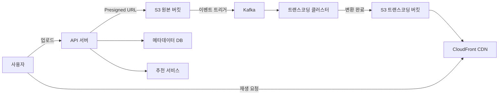

### 주요 구성 요소

| 컴포넌트 | 역할 | 기술 선택 |
|----------|------|-----------|
| API 서버 | 업로드 조율, 메타데이터 처리 | Go, gRPC |
| 원본 스토리지 | 업로드된 원본 파일 보관 | AWS S3 |
| 메시지 큐 | 트랜스코딩 작업 분배 | Apache Kafka |
| 트랜스코딩 클러스터 | 해상도 변환, 인코딩 | FFmpeg + GPU |
| 변환 스토리지 | 해상도별 세그먼트 파일 | AWS S3 |
| CDN | 엣지 캐시, 글로벌 배포 | CloudFront |
| 메타데이터 DB | 영상/채널/댓글 정보 | MySQL + Redis |
| 추천 서비스 | 개인화 추천 | Python, TensorFlow |

---

## 3. 업로드 파이프라인

### 3-1. 청크 업로드 (Chunked Upload)

500MB짜리 영상을 한 번에 올리면 어떻게 될까요? 네트워크가 중간에 끊기면 처음부터 다시 올려야 합니다. YouTube는 이를 **청크 업로드**로 해결합니다.

> **비유:** 이사할 때 가구 전체를 한 번에 들고 가지 않고, 박스 단위로 나눠 옮기는 것과 같습니다. 하나가 떨어져도 그 박스만 다시 가져오면 됩니다.

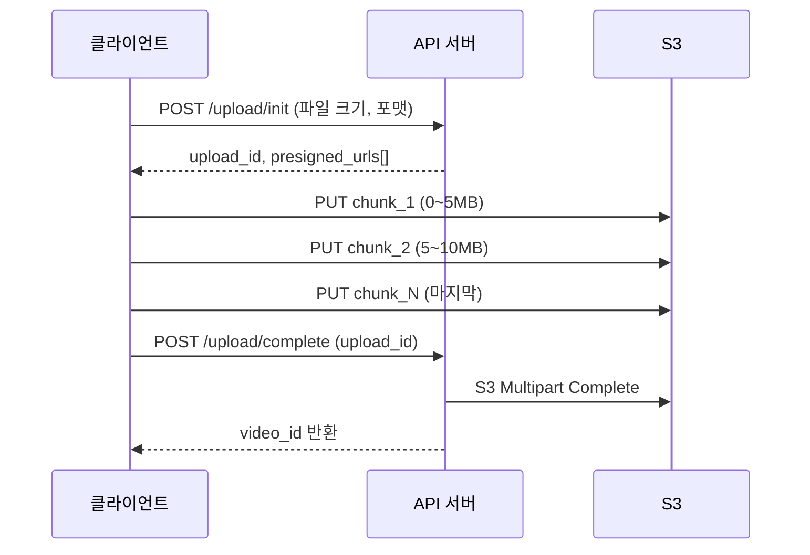

청크 크기는 보통 **5MB~25MB**로 설정합니다. 각 청크에 순번과 체크섬(MD5)을 붙여 순서 보장 및 무결성을 검증합니다.

### 3-2. Presigned URL로 S3 직접 업로드

API 서버를 거쳐 업로드하면 서버가 병목이 됩니다. 대신 **Presigned URL**을 사용해 클라이언트가 S3에 직접 업로드합니다.

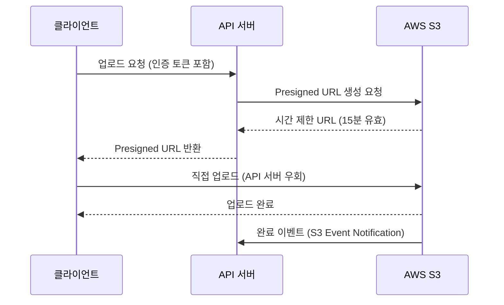

장점:
- API 서버 부하 제거
- S3가 직접 대역폭 처리 → 무제한 확장
- URL에 만료 시간 설정 → 보안 강화

### 3-3. 사전 검증 (Pre-validation)

업로드 전에 클라이언트 측에서 먼저 검증합니다:

1️⃣ **포맷 확인**: MP4, MOV, AVI, MKV 등 지원 포맷 여부
2️⃣ **크기 제한**: 무료 계정 15GB, 유료 계정 256GB
3️⃣ **길이 제한**: 기본 15분, 인증 계정 12시간
4️⃣ **해상도 최소값**: 240p 이상

서버 측에서는 업로드 완료 후 추가 검증:
- 파일 시그니처 확인 (Magic Bytes — MP4는 `ftyp` 헤더)
- 바이러스/악성코드 스캔
- 저작권 Content ID 사전 스캔

---

## 4. 트랜스코딩 파이프라인

업로드된 원본 영상을 여러 형식으로 변환하는 과정이 **트랜스코딩**입니다. YouTube는 이를 **DAG(Directed Acyclic Graph) 기반 파이프라인**으로 처리합니다.

> **비유:** 영화 후반 작업 스튜디오와 같습니다. 원본 필름이 들어오면 색보정팀, 자막팀, 음향팀이 동시에 각자 작업을 진행하고, 최종적으로 합쳐져 완성 영화가 나옵니다. 순차가 아닌 병렬 처리입니다.

### 4-1. DAG 기반 파이프라인 구조

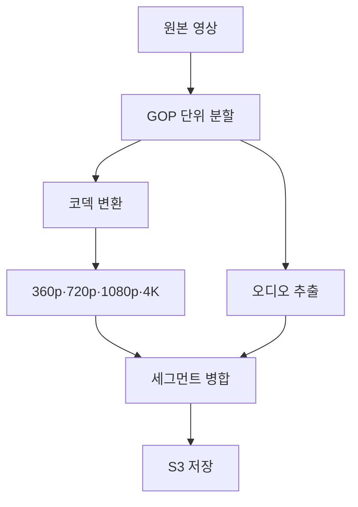

### 4-2. GOP(Group of Pictures) 분할의 이유

영상을 통째로 인코딩하면 4K 원본 1시간짜리가 수 시간 걸립니다. YouTube는 영상을 **GOP 단위(보통 2~4초)**로 잘라 수백 개의 워커가 병렬 처리합니다.

GOP는 I-Frame(완전한 프레임)으로 시작하기 때문에 독립적으로 인코딩 가능합니다. 1시간짜리 영상을 2초 단위로 자르면 1,800개의 청크가 되고, 1,800개 워커가 동시에 처리하면 이론상 거의 실시간 처리가 가능합니다.

### 4-3. FFmpeg과 GPU 가속

```bash
# CPU 인코딩 (느림)
ffmpeg -i input.mp4 -vf scale=1280:720 -c:v libx264 output_720p.mp4

# GPU 가속 인코딩 (NVIDIA NVENC — 5~10배 빠름)
ffmpeg -i input.mp4 -vf scale=1280:720 -c:v h264_nvenc \
  -preset p4 -b:v 2500k output_720p.mp4
```

YouTube는 **NVIDIA Tesla GPU**를 클러스터로 운용합니다. GPU 1장이 CPU 16코어 대비 트랜스코딩 속도 5~10배입니다. 4K HDR 콘텐츠는 특수 AV1 코덱으로 인코딩하여 H.264 대비 50% 용량 절감합니다.

### 4-4. 트랜스코딩 해상도 및 비트레이트 기준

| 해상도 | 비트레이트 (H.264) | 비트레이트 (AV1) |
|--------|-------------------|-----------------|
| 360p | 1 Mbps | 0.5 Mbps |
| 480p | 2.5 Mbps | 1.2 Mbps |
| 720p | 5 Mbps | 2.5 Mbps |
| 1080p | 8 Mbps | 4 Mbps |
| 4K | 35~45 Mbps | 15~20 Mbps |

### 4-5. 썸네일 자동 생성

FFmpeg로 영상의 10%, 30%, 50%, 70% 지점에서 프레임을 추출하여 썸네일 후보를 생성합니다. YouTube의 ML 모델이 가장 매력적인 프레임을 자동 선택하고, 업로더가 커스텀 썸네일을 올릴 수도 있습니다.

---

## 5. 어댑티브 비트레이트 스트리밍 (ABR)

### 5-1. 왜 ABR인가?

고정 화질로 스트리밍하면 두 가지 문제가 생깁니다:
- 네트워크가 느릴 때 → 계속 버퍼링
- 네트워크가 빠를 때 → 저화질로 낭비

ABR(Adaptive Bitrate Streaming)은 **네트워크 상태를 실시간으로 감지하여 화질을 자동 전환**합니다.

> **비유:** 고속도로 네비게이션 같습니다. 앞 도로가 막히면 자동으로 우회로로 안내합니다. 운전자(사용자)는 목적지(영상 시청)만 생각하면 되고, 경로(화질)는 자동으로 최적화됩니다.

### 5-2. HLS vs DASH

| 항목 | HLS (Apple) | DASH (ISO 표준) |
|------|-------------|----------------|
| 세그먼트 포맷 | TS, fMP4 | fMP4 |
| 플레이리스트 | .m3u8 | .mpd (XML) |
| 지원 플랫폼 | iOS, Safari 필수 | 브라우저, Android |
| 지연시간 | 6~30초 (LL-HLS: 2초) | 2~10초 |
| DRM | FairPlay | Widevine, PlayReady |

YouTube는 **DASH**를 주력으로 사용하고 iOS/Safari에서는 HLS로 폴백합니다.

### 5-3. HLS 동작 원리

```
master.m3u8 (마스터 플레이리스트)
├── 360p.m3u8
│   ├── seg_001.ts (2초)
│   ├── seg_002.ts (2초)
│   └── ...
├── 720p.m3u8
│   ├── seg_001.ts (2초)
│   └── ...
└── 1080p.m3u8
    └── ...
```

플레이어는 마스터 플레이리스트를 받은 후, 현재 대역폭에 맞는 화질의 `.m3u8`을 선택합니다. 각 세그먼트(2~4초 분량)를 다운로드하면서 지속적으로 대역폭을 측정하고, 필요하면 다른 화질 플레이리스트로 전환합니다.

### 5-4. Bandwidth Estimation (대역폭 추정)

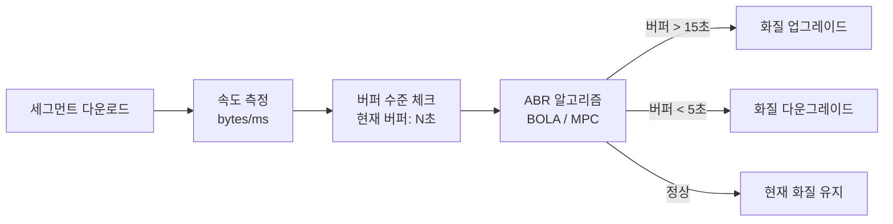

대표 알고리즘:
- **BOLA(Buffer Occupancy based Lyapunov Algorithm)**: 버퍼 수준 기반으로 화질 결정
- **MPC(Model Predictive Control)**: 미래 대역폭을 예측하여 화질 결정

---

## 6. CDN 전략

### 6-1. CDN 없이는 불가능하다

서울 데이터센터에서 브라질 상파울루 사용자에게 영상을 보내면 RTT(Round Trip Time)만 300ms 이상입니다. 2.5Mbps 720p 영상 스트리밍에서 매 세그먼트(2초)마다 300ms 지연이면 체감은 처참합니다.

CDN은 전 세계 수백 개의 **엣지 서버(PoP, Point of Presence)**에 영상 세그먼트를 캐시하여, 사용자는 가장 가까운 서버에서 받습니다.

> **비유:** 전국 편의점 체인과 같습니다. 본사(Origin) 창고에서 직접 배달하면 하루가 걸리지만, 동네 편의점(CDN 엣지)에 미리 채워두면 걸어서 5분 거리입니다.

### 6-2. Origin Shield

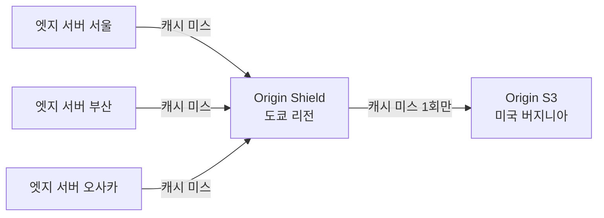

여러 엣지 서버가 Origin에 동시에 캐시 미스를 내면 Origin이 폭주합니다. **Origin Shield**는 중간 계층을 두어 Origin에 대한 요청을 집약합니다. 같은 콘텐츠 요청이 Origin에 한 번만 도달하도록 합니다.

### 6-3. 인기 영상 프리캐시 (Pre-warming)

BTS 신곡 MV처럼 예고된 대형 이벤트는 공개 전 미리 CDN에 캐시를 채웁니다.

1️⃣ 콘텐츠 팀이 "고인기 예상" 영상을 태깅
2️⃣ 공개 30분 전, CDN 프리워밍 스크립트 실행
3️⃣ Origin이 전 세계 PoP에 세그먼트를 밀어넣음
4️⃣ 사용자 폭주 시 모든 요청이 캐시 히트

### 6-4. 롱테일 콘텐츠 처리

전체 영상의 80%는 거의 조회되지 않습니다(롱테일). 이런 영상을 CDN에 영구 캐시하면 스토리지 낭비입니다.

전략:
- **TTL 차등 적용**: 인기 영상은 TTL 7일, 롱테일은 TTL 24시간
- **캐시 계층**: 엣지(SSD) → Regional(HDD) → Origin(S3 Glacier)
- **요청 빈도 기반 퇴출**: LFU(Least Frequently Used) 알고리즘으로 낮은 조회 콘텐츠 자동 퇴출

---

## 7. 메타데이터 데이터베이스

### 7-1. 스키마 설계

```sql
-- 영상 테이블
CREATE TABLE videos (
    video_id     VARCHAR(11) PRIMARY KEY,  -- 'dQw4w9WgXcQ' 형태
    channel_id   BIGINT NOT NULL,
    title        VARCHAR(100) NOT NULL,
    description  TEXT,
    status       ENUM('processing','active','deleted'),
    duration_sec INT,
    view_count   BIGINT DEFAULT 0,
    like_count   BIGINT DEFAULT 0,
    created_at   DATETIME,
    INDEX idx_channel (channel_id),
    INDEX idx_created (created_at)
);

-- 채널 테이블
CREATE TABLE channels (
    channel_id      BIGINT PRIMARY KEY AUTO_INCREMENT,
    user_id         BIGINT NOT NULL,
    channel_name    VARCHAR(100),
    subscriber_cnt  BIGINT DEFAULT 0,
    created_at      DATETIME
);

-- 댓글 테이블 (샤딩 키: video_id)
CREATE TABLE comments (
    comment_id  BIGINT PRIMARY KEY AUTO_INCREMENT,
    video_id    VARCHAR(11) NOT NULL,
    user_id     BIGINT NOT NULL,
    content     TEXT,
    like_count  INT DEFAULT 0,
    created_at  DATETIME,
    INDEX idx_video (video_id, created_at DESC)
);

-- 좋아요 테이블 (중복 방지)
CREATE TABLE video_likes (
    user_id   BIGINT,
    video_id  VARCHAR(11),
    liked_at  DATETIME,
    PRIMARY KEY (user_id, video_id)
);
```

### 7-2. 조회수 카운터 — 정확성 vs 성능

조회수는 초당 수만 건의 업데이트가 필요합니다. MySQL에 매번 `UPDATE videos SET view_count = view_count + 1`을 날리면 DB가 즉시 죽습니다.

> **비유:** 편의점 출입 카운터를 생각해보세요. 매 고객마다 본사 장부에 직접 기록하지 않고, 편의점 직원이 하루치를 모아 마감 때 본사에 보고합니다.

해결책:

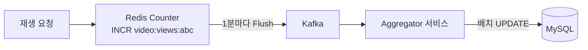

1️⃣ Redis에 `INCR video:views:{video_id}` 로 메모리 카운터 누적
2️⃣ 1분마다 Redis 값을 읽어 Kafka로 전송
3️⃣ Aggregator가 배치로 MySQL `view_count` 업데이트

단, 이 방식은 최대 1분의 지연이 있습니다. 실시간 정확성보다 **성능 우선**이 YouTube의 선택입니다.

### 7-3. 읽기 복제 (Read Replica)

메타데이터는 읽기 : 쓰기 = 9 : 1입니다. Primary 1대, Read Replica 5~10대로 읽기 부하를 분산합니다.

```
Primary DB (쓰기)
    ├── Replica 1 (아시아 읽기)
    ├── Replica 2 (유럽 읽기)
    ├── Replica 3 (미주 읽기)
    └── Replica 4 (검색/추천 읽기)
```

---

## 8. 추천 시스템

### 8-1. 왜 추천이 핵심인가?

YouTube 시청 시간의 **70%가 추천 영상**에서 발생합니다. 홈피드, 사이드바, 다음 영상 자동재생 모두 추천 엔진이 결정합니다.

### 8-2. 2단계 추천 아키텍처

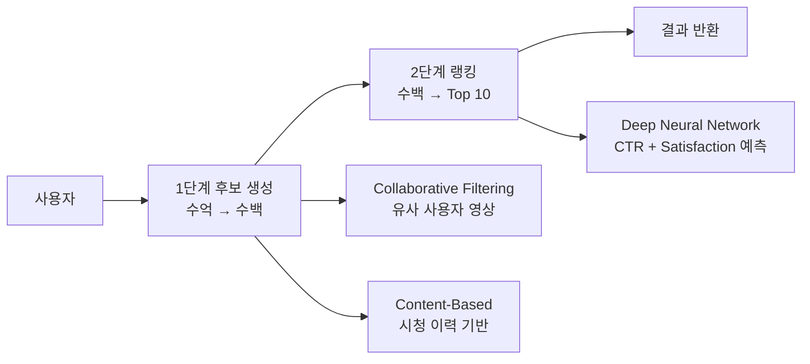

**1단계: 후보 생성 (Candidate Generation)**
- Collaborative Filtering: "당신과 비슷한 사람들이 본 영상"
- Content-Based: "당신이 본 영상과 유사한 영상"
- 수억 개 중 수백 개로 압축

**2단계: 랭킹 (Ranking)**
- 수백 개 후보에 정교한 DNN 적용
- 예측 지표: CTR(클릭률), Watch Time, 좋아요/싫어요, 댓글, 반복 시청
- 최종 Top 10~20 선정

### 8-3. 실시간 피처 서빙

추천 모델은 **실시간 피처**를 필요로 합니다:
- 방금 시청한 영상 (최근 5분 이내)
- 현재 트렌딩 영상 (실시간 조회수 급상승)
- 사용자의 현재 시간대, 디바이스

실시간 피처는 Redis/Cassandra에 저장하고 낮은 지연시간으로 서빙합니다. 배치 피처(시청 이력, 구독 채널)는 오프라인으로 계산하여 Feature Store(Feast 등)에 저장합니다.

---

## 9. 라이브 스트리밍

### 9-1. 라이브 스트리밍 아키텍처

라이브는 VOD와 근본적으로 다릅니다. 영상이 만들어지는 동시에 수백만 명이 봐야 합니다.

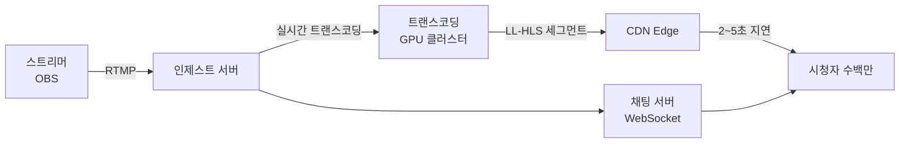

**RTMP(Real-Time Messaging Protocol)**: 스트리머 PC의 OBS 소프트웨어가 YouTube 인제스트 서버로 RTMP 스트림을 전송합니다.

**LL-HLS(Low Latency HLS)**: 기존 HLS의 지연(6~30초)을 2~3초로 줄인 Apple 확장 규격. 세그먼트 길이를 0.2~0.5초로 줄이고 HTTP/2 서버 푸시를 활용합니다.

### 9-2. 라이브 채팅 연동

동시 시청 500만 명이 채팅을 보내면 초당 수만 건의 메시지가 발생합니다.

1️⃣ 클라이언트 → WebSocket → 채팅 서버
2️⃣ 채팅 서버 → Kafka 토픽 (`live-chat-{stream_id}`)
3️⃣ 채팅 소비자 → 슈퍼챗/금지어 필터링
4️⃣ 처리된 메시지 → Redis Pub/Sub → 모든 시청자에게 브로드캐스트

트래픽이 너무 많을 때는 **메시지 샘플링**(전체의 일부만 노출)으로 처리합니다.

---

## 10. 콘텐츠 모더레이션

### 10-1. AI 기반 자동 심사

매일 50만 건이 업로드되는 상황에서 사람이 일일이 검토하는 것은 불가능합니다. YouTube는 **자동 AI 심사**를 먼저 거치게 합니다.

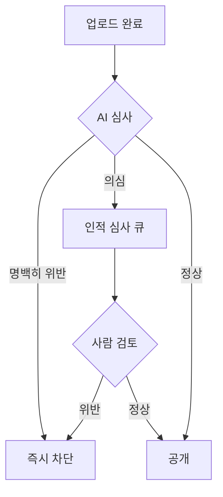

**NSFW 감지**: 프레임별 이미지 분류 모델. 초당 수천 프레임을 병렬 처리.
**혐오 발언**: 자막/음성 → STT → NLP 분류기. 다국어 지원.
**스팸**: 메타데이터(제목, 설명, 태그) 패턴 분석.

### 10-2. Content ID — 저작권 자동 감지

YouTube의 Content ID는 저작권자가 사전에 등록한 **핑거프린트**와 업로드된 영상을 비교합니다.

1️⃣ 음반사/영화사가 원본 콘텐츠의 오디오·비디오 핑거프린트 등록
2️⃣ 새 영상 업로드 시 전체 데이터베이스와 비교 (밀리초 내)
3️⃣ 일치 시 저작권자 설정에 따라: **차단** / **수익화** / **추적** 중 선택

기술: 오디오는 **Chromaprint** 기반 음향 지문, 비디오는 **Perceptual Hashing**(pHash)으로 비교합니다.

---

## 11. 보안

### 11-1. DRM (Digital Rights Management)

프리미엄 콘텐츠(YouTube Premium 오리지널, 영화 대여)는 DRM으로 보호합니다.

| DRM | 지원 플랫폼 |
|-----|------------|
| Widevine | Chrome, Android, Firefox |
| FairPlay | Safari, iOS, macOS |
| PlayReady | Windows, Edge, Xbox |

**작동 원리**:

1️⃣ 영상 세그먼트는 AES-128로 암호화된 채로 CDN에 저장
2️⃣ 플레이어가 라이선스 서버에 복호화 키 요청 (인증 토큰 포함)
3️⃣ 라이선스 서버가 구독 여부 확인 후 키 발급
4️⃣ 플레이어의 신뢰 환경(TEE)에서만 복호화 — 일반 메모리로 노출 안 됨

### 11-2. 핫링크 방지 (Hotlink Protection)

외부 사이트에서 YouTube CDN URL을 직접 링크하여 트래픽을 훔치는 것을 방지합니다.

- CDN URL에 **서명(Signature)**과 **만료 시간** 포함
- `?Expires=1699999999&Signature=abc123&Key-Pair-Id=K2...`
- 만료된 URL 또는 Referer가 허용 도메인이 아니면 403 반환

### 11-3. Geo-blocking

특정 콘텐츠는 저작권 계약에 따라 특정 국가에서만 시청 가능합니다.

- 사용자 IP → GeoIP DB → 국가 코드 판별
- CDN 엣지에서 국가 코드 기반 접근 제어 (CloudFront Geo Restriction)
- VPN 우회 감지: IP 평판 DB, datacenter IP 범위 차단

---

## 12. 극한 시나리오

### 시나리오 1️⃣: BTS 신곡 MV 공개 — 1시간에 1억 뷰

**문제**: 공개 직후 전 세계 팬들이 동시에 몰려듭니다. 평소의 100배 트래픽이 예고 없이(아니, 예고 있이) 쏟아집니다.

**대응 전략**:

1️⃣ **CDN 프리워밍**: 공개 30분 전 전 세계 PoP에 미리 캐시 배포
2️⃣ **자동 스케일링 사전 발동**: 예고된 이벤트이므로 트래픽 급증 전 서버 증설 완료
3️⃣ **조회수 카운터 Redis 샤딩**: 단일 키에 초당 수천 INCR → 여러 Redis 샤드에 분산 후 합산
4️⃣ **추천 캐시**: 이 영상이 모든 홈피드 상단에 올라오므로 추천 결과를 CDN에 캐시
5️⃣ **Origin Shield 강화**: 캐시 미스를 단 하나의 경로로만 Origin에 전달

**결과**: 1억 뷰 트래픽의 99.9%는 CDN이 처리하고 Origin 부하는 거의 증가하지 않습니다.

---

### 시나리오 2️⃣: 월드컵 결승 라이브 — 동시 시청 5000만

**문제**: 라이브 스트리밍은 VOD와 달리 캐시가 불가능합니다. 세그먼트가 실시간으로 만들어지기 때문입니다. 5000만 명이 동시에 2~3초짜리 세그먼트를 계속 요청합니다.

**대응 전략**:

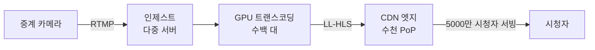

1️⃣ **인제스트 이중화**: RTMP 인제스트 서버를 최소 3대로 운영. Primary 장애 시 자동 Failover
2️⃣ **트랜스코딩 GPU 클러스터 증설**: 이벤트 당일 수백 대 온디맨드 GPU 인스턴스 추가 기동
3️⃣ **CDN 대역폭 사전 확보**: CDN 벤더와 트래픽 급증 계약 체결
4️⃣ **세그먼트 캐시 TTL**: LL-HLS 세그먼트는 수 초짜리이므로, 수백만 명이 동일 URL을 동시 요청 → CDN이 같은 파일을 서빙 (캐시 가능!)
5️⃣ **채팅 스로틀링**: 동시 채팅이 폭주하면 초당 메시지 수 제한, 슈퍼챗 우선 노출

**핵심 인사이트**: 라이브도 세그먼트 단위로 나뉘면 "준 캐시 가능" 상태가 됩니다. 5000만 명이 같은 세그먼트 URL을 요청하면 CDN이 캐시로 처리합니다.

---

### 시나리오 3️⃣: 100GB 4K 영상 업로드

**문제**: 유튜버가 4K 원본 100GB 파일을 업로드합니다. 집 인터넷 속도 100Mbps라도 100GB 업로드는 2시간 이상 걸립니다. 중간에 끊기면?

**대응 전략**:

1️⃣ **멀티파트 업로드 + 재개 가능**: 5MB 청크 2만 개로 분할. S3 Multipart Upload API 사용. 각 청크는 독립적으로 업로드되어 실패한 청크만 재시도
2️⃣ **업로드 세션 유지**: `upload_id`로 세션 상태 저장. 24시간 이내 재접속 시 이어 올리기
3️⃣ **클라이언트 측 체크섬**: 각 청크 업로드 후 MD5 검증. 네트워크 오염 즉시 감지
4️⃣ **트랜스코딩 우선순위 조정**: 100GB 파일 트랜스코딩은 수 시간 소요. 일반 영상 큐에 섞으면 전체 지연 발생 → 대용량 파일 전용 낮은 우선순위 큐 분리
5️⃣ **스토리지 비용 최적화**: 원본은 S3 Standard로 업로드 후 30일 후 S3 Glacier로 자동 이전 (트랜스코딩 완료본은 Standard 유지)

```
업로드 완료 시 처리 흐름:
1. S3 이벤트 → Kafka 토픽 'video-uploaded'
2. 트랜스코딩 워커 (낮은 우선순위 큐에서 픽업)
3. GOP 단위 분할 (2초 × 3000개 = 100분 기준)
4. 3000개 청크 병렬 인코딩 (5개 해상도)
5. 완료 시 metadata DB 업데이트, 사용자 알림
```

---

## 13. 면접 포인트 5가지

### 포인트 1: "조회수 카운터는 정확해야 하나요?"

면접관이 "조회수가 실시간으로 정확하지 않아도 괜찮냐"고 물으면, 이렇게 답하세요:

"YouTube는 Strong Consistency가 아닌 **Eventual Consistency**를 선택했습니다. 조회수가 1~2분 지연되어도 사용자 경험에 거의 영향이 없습니다. 반면 초당 수만 건을 DB에 직접 쓰면 시스템 전체가 멈춥니다. **Redis 버퍼 → Kafka → 배치 flush** 패턴으로 성능과 정확성의 균형을 맞춥니다."

### 포인트 2: "왜 트랜스코딩을 서버 내에서 동기 처리하지 않나요?"

"업로드 API가 트랜스코딩까지 동기로 처리하면 응답이 수십 분 걸립니다. 사용자가 기다릴 수 없습니다. 또한 업로드 서버와 트랜스코딩 워커가 강하게 결합되면 한쪽 장애가 전체 장애로 번집니다. **Kafka로 비동기 분리**하면 업로드 서버는 'S3에 저장 완료' 즉시 응답하고, 트랜스코딩은 백그라운드에서 진행됩니다. 서비스 간 장애 격리도 됩니다."

### 포인트 3: "ABR에서 화질 전환이 너무 자주 일어나면?"

"ABR의 함정은 '화질 플래핑(flapping)'입니다. 대역폭이 불안정하면 720p→480p→720p가 반복되어 UX가 나빠집니다. **히스테리시스(Hysteresis)** 로직으로 해결합니다. 업그레이드 임계값을 다운그레이드 임계값보다 높게 설정하고, 최근 N초의 이동 평균 대역폭을 사용합니다. 또한 현재 버퍼 수준이 충분하면 당장 빠른 대역폭이 없어도 화질 유지합니다."

### 포인트 4: "CDN 캐시 미스 시 Origin 보호는?"

"캐시 미스가 동시에 수만 건 발생하면 Origin이 폭주합니다. 이를 **Thundering Herd Problem**이라고 합니다. 해결책은 세 가지입니다: 1) **Origin Shield** 중간 계층으로 동일 콘텐츠 요청 집약, 2) **Probabilistic Early Expiration** — TTL 만료 직전에 일부 요청만 Origin 갱신 (나머지는 Stale 서빙), 3) **Rate Limiting** — CDN 미스 시 Origin으로의 요청 수 제한."

### 포인트 5: "라이브 스트리밍과 VOD의 근본적인 차이는?"

"VOD는 **Pull 모델**입니다. 영상이 이미 있고 사용자가 필요할 때 가져옵니다. CDN 캐시가 완벽하게 동작합니다. 라이브는 **Push 모델**에 가깝습니다. 콘텐츠가 실시간 생성되므로 트랜스코딩 파이프라인이 실시간으로 동작해야 하고, 지연시간이 핵심 지표입니다. LL-HLS는 세그먼트를 0.2초 단위로 쪼개어 end-to-end 지연을 2~3초로 줄입니다. 반면 CDN 히트율은 '동일 세그먼트 URL에 대한 동시 요청 수'에 달려있어, 시청자가 많을수록 오히려 캐시 효율이 높아집니다."

---

## 14. 실무 실수 모음

### 실수 1: 단일 업로드 엔드포인트로 대용량 처리

```python
# 잘못된 방식 — 서버 메모리 폭주
@app.post("/upload")
def upload_video(file: UploadFile):
    content = await file.read()  # 100GB를 메모리에!
    s3.put_object(Body=content, ...)
```

올바른 방식은 Presigned URL로 클라이언트가 S3에 직접 업로드합니다.

### 실수 2: 트랜스코딩 상태를 DB로만 관리

트랜스코딩 워커가 죽으면 진행 중이던 작업이 사라집니다. **Kafka Consumer Group + Offset Commit**으로 작업 상태를 관리하고, 워커 재시작 시 마지막 커밋 지점부터 재처리합니다.

### 실수 3: CDN URL에 서명 없이 직접 노출

영상 URL이 `https://cdn.example.com/video/abc123/720p/seg001.ts` 처럼 예측 가능하면 핫링크나 콘텐츠 도용이 쉽습니다. 반드시 **서명 + 만료 시간**을 URL에 포함시킵니다.

### 실수 4: 모든 해상도를 동시 인코딩 완료 대기

4K 인코딩은 360p보다 10배 이상 오래 걸립니다. 영상 공개를 4K 완료까지 기다리면 업로드 후 수십 분이 지나서야 영상이 보입니다. YouTube는 **360p, 480p 완료 즉시 공개**하고, 고해상도는 백그라운드에서 추가 처리합니다.

---

## 15. 보안 고려사항 심화

### SSRF(Server-Side Request Forgery) 방지

트랜스코딩 워커가 외부 URL에서 영상을 다운로드하는 기능이 있다면, 악의적인 사용자가 내부 메타데이터 서버 URL(`http://169.254.169.254/`)을 입력할 수 있습니다. 반드시:
- 입력 URL의 IP 대역 화이트리스트 검증
- DNS rebinding 방지 (resolve 후 IP 재검증)
- 내부망 대역(10.0.0.0/8, 172.16.0.0/12, 192.168.0.0/16) 차단

### 업로드 폭탄 방지

악의적인 사용자가 서버 자원을 고갈시키기 위해 수천 개의 동시 업로드를 시도할 수 있습니다:
- 계정당 동시 업로드 수 제한 (예: 3개)
- IP당 일일 업로드 용량 제한
- 미완료 업로드 세션 자동 만료 (24시간)
- 업로드 세션 생성 시 reCAPTCHA v3 적용

### Token Binding으로 재생 URL 보호

Presigned URL이 탈취되면 다른 사람이 사용할 수 있습니다. IP 바인딩으로 URL 생성 시 클라이언트 IP를 서명에 포함하면, 같은 URL을 다른 IP에서 사용하면 403이 반환됩니다. 단, VPN/프록시 사용자 경험에 영향을 주므로 Trade-off를 고려합니다.

---

## 요약: 핵심 설계 원칙

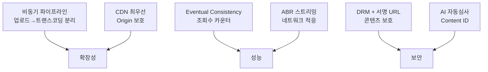

| 설계 결정 | 이유 |
|-----------|------|
| Presigned URL 직접 업로드 | API 서버 대역폭 병목 제거 |
| DAG 기반 트랜스코딩 | 병렬 처리로 처리 시간 최소화 |
| HLS/DASH ABR | 다양한 네트워크 환경 대응 |
| Origin Shield | Thundering Herd 방지 |
| Redis 조회수 버퍼 | DB 쓰기 부하 100배 감소 |
| 2단계 추천 (생성→랭킹) | 수억 개 후보를 실시간 처리 가능하게 압축 |
| LL-HLS 라이브 | 2~3초 내 배포로 몰입감 유지 |
| Content ID 핑거프린트 | 저작권 자동 처리로 규모 대응 |

동영상 스트리밍 시스템의 진짜 어려움은 **단일 기술의 복잡성**이 아닙니다. 업로드, 트랜스코딩, CDN, 추천, 라이브, 모더레이션이라는 **여섯 개의 복잡한 서브시스템이 하나의 매끄러운 경험으로 동작**하도록 만드는 것입니다. 그리고 이 모든 것이 매초 500시간의 영상이 추가되는 가운데 무중단으로 운영되어야 합니다.
