> **한 줄 요약**: YouTube의 핵심은 업로드된 영상을 DAG 기반 트랜스코딩 파이프라인으로 해상도별 분할 처리하고, HLS/DASH ABR로 네트워크 상황에 맞게 스트리밍하며, 글로벌 CDN으로 지연시간을 최소화하는 것이다.

## 실제 문제: 매초 500시간의 영상을 어떻게 처리하는가?

2024년 기준 YouTube에는 **매초 500시간 분량**의 영상이 업로드됩니다. 이를 하루로 환산하면 4,320만 시간, 연간으로는 157억 시간입니다. 단 하나의 서버로는 1초도 버틸 수 없는 규모입니다.

더 놀라운 점은 시청 측입니다. 전 세계 DAU 20억 명이 하루 평균 40분을 시청합니다. 동시에 수억 개의 영상 스트림이 흐르고 있습니다. 이 모든 것을 가능하게 하는 아키텍처는 어떻게 생겼을까요?

이 글에서는 시니어 개발자 수준에서 YouTube 수준의 동영상 스트리밍 시스템을 설계해봅니다.

---

## 설계 의사결정 로드맵

동영상 스트리밍 시스템을 설계할 때 순서대로 답해야 할 핵심 결정 4가지다. 각 결정에서 "왜 이 선택인가"를 명확히 하지 않으면 면접에서 "그냥 서버에서 MP4 파일 직접 스트리밍하면 되지 않나요?"라는 후속 질문에 답할 수 없다.

### 결정 1: 스트리밍 프로토콜 — RTMP vs HLS vs DASH

**문제**: 업로드된 영상을 시청자에게 어떤 프로토콜로 전달하는가? 선택에 따라 CDN 캐싱 가능 여부, 화질 자동 전환, 방화벽 통과 여부가 결정된다.

| 후보 | 장점 | 단점 | 언제 적합 |
|------|------|------|----------|
| RTMP (직접 전송) | 저지연 (1~2초), 구현 단순 | CDN 캐시 불가, TCP 연결 유지 필요, 포트 1935 방화벽 차단 흔함 | 스트리머→인제스트 서버 송출용 |
| HLS (Apple) | HTTP 기반이라 CDN 캐시 가능, iOS/Safari 필수 지원 | 기본 지연 6~30초 (LL-HLS는 2초) | iOS 지원 필수인 경우 |
| DASH (ISO 표준) | HTTP 기반 CDN 캐시, ABR 표준, 코덱 자유 | Safari 미지원 (HLS 폴백 필요) | 브라우저·Android 중심 |

**우리의 선택: DASH 주력 + HLS 폴백**
- 이유: DASH는 HTTP/HTTPS로 동작해 CDN이 세그먼트를 캐시한다. 1억 명이 같은 영상을 봐도 Origin 서버 부하는 거의 없다. iOS/Safari는 DASH를 지원하지 않으므로 HLS로 폴백한다. RTMP는 OBS 등 스트리머 앱 → 인제스트 서버 구간에만 사용하고, 시청자 배포는 전부 HLS/DASH로 처리한다.
- 안 하면: RTMP로 시청자에게 직접 전달하면 서버가 1억 개 TCP 연결을 유지해야 한다. CDN 캐시 불가로 모든 트래픽이 Origin에 직접 몰린다.

### 결정 2: 트랜스코딩 — 순차 처리 vs DAG 병렬 처리

**문제**: 업로드된 원본 영상을 5개 해상도(360p~4K)로 변환할 때 어떻게 처리 시간을 최소화하는가?

| 후보 | 장점 | 단점 | 언제 적합 |
|------|------|------|----------|
| 순차 처리 | 구현 단순, 워커 1대로 가능 | 1시간 4K 영상 기준 2시간 이상 소요, 부분 실패 시 전체 재시작 | 소규모, 단순 서비스 |
| DAG 병렬 처리 | 가장 긴 작업 시간만 소요, 실패 노드만 재실행, 360p 완료 즉시 공개 가능 | 의존성 그래프 관리 복잡, 분산 워커 조율 인프라 필요 | 대규모, 빠른 공개 필요 |

**우리의 선택: DAG 기반 병렬 트랜스코딩**
- 이유: 5개 해상도를 동시에 변환하면 처리 시간이 가장 긴 4K 인코딩 시간으로 수렴한다. 360p가 먼저 완료되면 즉시 공개하여 업로더와 시청자 대기 시간을 최소화한다. 4K 인코딩만 실패해도 나머지 해상도는 이미 완료 상태이므로 해당 노드만 재실행한다.
- 안 하면: 순차 처리에서 4K 인코딩이 마지막 단계에서 실패하면 이미 완료된 360p·720p·1080p 작업을 버리고 처음부터 재시작해야 한다. 매일 50만 건 업로드에서 1% 실패 시 5000건의 전체 재작업이 발생한다.

### 결정 3: CDN 전략 — 상업 CDN vs 자체 OCA

**문제**: 전 세계 사용자에게 낮은 지연시간으로 영상을 배포하려면 CDN을 어떻게 구성하는가?

| 후보 | 장점 | 단점 | 언제 적합 |
|------|------|------|----------|
| 상업 CDN (CloudFront·Akamai) | 즉시 사용 가능, 전 세계 PoP 확보, 관리형 | 트래픽 증가 시 비용 급증, 세밀한 최적화 불가 | Phase 1~2, 소규모 |
| 자체 OCA (Open Connect Appliance) | ISP 내부 배치로 최저 지연, 대용량 시 비용 절감, 세밀한 캐시 제어 | 구축 비용 큼, ISP 협상 필요, 운영 인력 필요 | Netflix 수준 대규모 |
| 하이브리드 (상업 CDN + 일부 OCA) | 인기 콘텐츠는 OCA, 롱테일은 CDN | 두 시스템 동시 운영 복잡도 | 중대형 규모 전환기 |

**우리의 선택: Phase 1~3 CloudFront, Phase 4에서 하이브리드 도입**
- 이유: 초기에는 CloudFront + Origin Shield 조합으로 빠르게 시작한다. 트래픽이 Netflix 수준(하루 수백 PB)에 가까워지면 자체 OCA가 비용 효율이 높아진다. OCA는 ISP 데이터센터 안에 서버를 설치하여 인터넷 구간을 거치지 않아 지연시간이 최소화된다.
- 안 하면: 자체 OCA 없이 상업 CDN만 쓰면 하루 수백 PB 트래픽에서 CDN 비용이 수십억 원/월을 초과한다.

### 결정 4: 해상도 선택 — 서버 결정 vs ABR (클라이언트 적응)

**문제**: 시청자의 네트워크 상황에 맞는 해상도를 누가 결정하는가?

| 후보 | 장점 | 단점 | 언제 적합 |
|------|------|------|----------|
| 서버 결정 (고정 해상도) | 구현 단순 | 네트워크 변화 대응 불가, 느린 망에서 버퍼링, 빠른 망에서 저화질 낭비 | 레거시 시스템 |
| ABR — 클라이언트 적응 (BOLA/MPC) | 대역폭 실시간 감지, 자동 화질 전환, 버퍼링 최소화 | 클라이언트 플레이어 구현 복잡, 화질 플래핑 방지 로직 필요 | 모던 스트리밍 서비스 표준 |

**우리의 선택: ABR (BOLA 알고리즘 기반)**
- 이유: 모바일 환경에서 LTE→WiFi 전환, 지하철 터널 등 대역폭이 수시로 변한다. ABR은 세그먼트 다운로드 속도와 버퍼 수준을 동시에 모니터링하여 최적 해상도를 자동 선택한다. 버퍼 15초 이상이면 화질 업그레이드, 5초 미만이면 화질 다운그레이드한다. 히스테리시스(hysteresis)로 화질 플래핑을 방지한다.
- 안 하면: 서버가 해상도를 고정하면 와이파이에서 720p로 보던 영상이 지하철에 들어가는 순간 버퍼링이 시작되고, 사용자는 10초 이상 기다리다 이탈한다.

---

## 1. 요구사항 분석 및 규모 추정

### 기능 요구사항

1️⃣ **업로드**: 사용자가 영상을 업로드하면 자동으로 여러 해상도로 변환
2️⃣ **스트리밍**: 네트워크 상황에 따라 해상도를 자동 전환하며 재생
3️⃣ **탐색**: 영상 중간 어디든 즉시 이동 (Seek)
4️⃣ **메타데이터**: 제목, 설명, 태그, 조회수, 좋아요
5️⃣ **추천**: 사용자별 맞춤 영상 추천
6️⃣ **라이브 스트리밍**: 실시간 방송 및 채팅
7️⃣ **콘텐츠 모더레이션**: NSFW/저작권 자동 감지

### 비기능 요구사항

- **가용성**: 99.99% (연간 52분 이하 다운타임)
- **지연시간**: 영상 재생 시작까지 2초 미만 (Time to First Frame)
- **내구성**: 업로드된 영상 영구 보존 (11 nines)
- **확장성**: 트래픽 스파이크 10배 대응 (BTS 신곡 공개 등)
- **보안**: DRM, 핫링크 방지, Geo-blocking

### 규모 추정

```
[사용자 규모]
DAU: 2억명
월간 영상 업로드: 50만 건/일
평균 영상 길이: 5분 = 300초
평균 영상 크기 (원본): 5분 × 10MB/분 = 약 50MB

[저장 용량]
일일 원본 영상: 50만 × 50MB = 25TB/일
트랜스코딩 후 (360p~4K, 5개 해상도): 원본의 약 3배 = 75TB/일
연간 저장: 75TB × 365 = 27.4PB/년

[스트리밍 트래픽]
DAU 2억 × 하루 40분 시청 = 80억 분/일
초당 시청 분: 80억 / 86,400 ≈ 93,000 분/초
720p 기준 비트레이트: 2.5Mbps
총 대역폭: 93,000 × 2.5Mbps ≈ 232Gbps (평균)
피크 (×3): ≈ 700Gbps

[업로드 QPS]
50만 건/일 / 86,400 ≈ 5.8 업로드/초 (평균)
피크: 약 20~30 업로드/초

[메타데이터 QPS]
영상 조회(재생): DAU 2억 × 5회 / 86,400 ≈ 11,574 QPS
쓰기(좋아요, 댓글): 읽기의 약 1/10 ≈ 1,157 QPS
```

> **비유:** 업로드 파이프라인은 원자재 공장이고, CDN은 전국 편의점 물류망입니다. 공장에서 완성품을 만들어 편의점 창고에 미리 쌓아두면, 고객은 가장 가까운 편의점에서 즉시 꺼내 먹을 수 있습니다.

---

## 2. 고수준 아키텍처

전체 시스템은 크게 **업로드 경로(Write Path)**와 **시청 경로(Read Path)**로 나뉩니다.

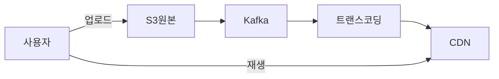

### 주요 구성 요소

| 컴포넌트 | 역할 | 기술 선택 |
|----------|------|-----------|
| API 서버 | 업로드 조율, 메타데이터 처리 | Go, gRPC |
| 원본 스토리지 | 업로드된 원본 파일 보관 | AWS S3 |
| 메시지 큐 | 트랜스코딩 작업 분배 | Apache Kafka |
| 트랜스코딩 클러스터 | 해상도 변환, 인코딩 | FFmpeg + GPU |
| 변환 스토리지 | 해상도별 세그먼트 파일 | AWS S3 |
| CDN | 엣지 캐시, 글로벌 배포 | CloudFront |
| 메타데이터 DB | 영상/채널/댓글 정보 | MySQL + Redis |
| 추천 서비스 | 개인화 추천 | Python, TensorFlow |

---

## 3. 업로드 파이프라인

### 3-1. 청크 업로드 (Chunked Upload)

500MB짜리 영상을 한 번에 올리면 어떻게 될까요? 네트워크가 중간에 끊기면 처음부터 다시 올려야 합니다. YouTube는 이를 **청크 업로드**로 해결합니다.

> **비유:** 이사할 때 가구 전체를 한 번에 들고 가지 않고, 박스 단위로 나눠 옮기는 것과 같습니다. 하나가 떨어져도 그 박스만 다시 가져오면 됩니다.

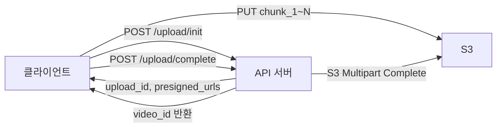

청크 크기는 보통 **5MB~25MB**로 설정합니다. 각 청크에 순번과 체크섬(MD5)을 붙여 순서 보장 및 무결성을 검증합니다.

### 3-2. Presigned URL로 S3 직접 업로드

API 서버를 거쳐 업로드하면 서버가 병목이 됩니다. 대신 **Presigned URL**을 사용해 클라이언트가 S3에 직접 업로드합니다.

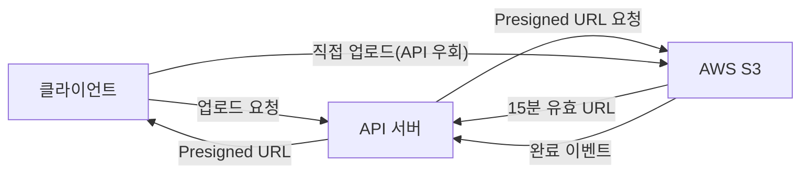

장점:
- API 서버 부하 제거
- S3가 직접 대역폭 처리 → 무제한 확장
- URL에 만료 시간 설정 → 보안 강화

### 3-3. 사전 검증 (Pre-validation)

업로드 전에 클라이언트 측에서 먼저 검증합니다:

1️⃣ **포맷 확인**: MP4, MOV, AVI, MKV 등 지원 포맷 여부
2️⃣ **크기 제한**: 무료 계정 15GB, 유료 계정 256GB
3️⃣ **길이 제한**: 기본 15분, 인증 계정 12시간
4️⃣ **해상도 최소값**: 240p 이상

서버 측에서는 업로드 완료 후 추가 검증:
- 파일 시그니처 확인 (Magic Bytes — MP4는 `ftyp` 헤더)
- 바이러스/악성코드 스캔
- 저작권 Content ID 사전 스캔

---

## 4. 트랜스코딩 파이프라인

업로드된 원본 영상을 여러 형식으로 변환하는 과정이 **트랜스코딩**입니다. YouTube는 이를 **DAG(Directed Acyclic Graph) 기반 파이프라인**으로 처리합니다.

### 왜 DAG 파이프라인인가 — 순차 처리의 한계

순차 처리로 1시간짜리 4K 영상을 변환하면:

```
순차 처리:
4K → 1080p 변환: 60분
4K → 720p 변환:  30분
4K → 480p 변환:  20분
4K → 360p 변환:  15분
오디오 추출:      5분
썸네일 생성:      2분
총 소요: 132분 (2시간 12분)

DAG 병렬 처리:
모든 작업 동시 실행 → 가장 오래 걸리는 작업 = 60분
총 소요: 약 65분 (오버헤드 포함)
```

| 항목 | 순차 처리 | DAG 병렬 처리 |
|------|-----------|--------------|
| 구현 복잡도 | 단순 | 복잡 (의존성 그래프 관리) |
| 처리 시간 | 합산 | **가장 긴 작업 시간** |
| 부분 실패 | 전체 재시작 | **실패 노드만 재실행** |
| 확장성 | 단일 서버 | **노드별 독립 스케일 아웃** |
| 영상 공개 시점 | 모든 해상도 완료 후 | **360p 완료 즉시 공개** |

**순차 처리의 치명적 문제**: 4K 인코딩이 실패해도 이미 완료된 360p·720p 작업을 버리고 처음부터 재시작해야 합니다. DAG는 실패한 노드만 재실행합니다. 매일 50만 건 업로드에서 1%만 실패해도 5000건의 재작업이 발생합니다. DAG 없이는 이 재작업 비용이 2배로 뜁니다.

### 트랜스코딩 병목 — CPU vs GPU, 실제 소요 시간

**CPU 트랜스코딩 (libx264)**:
```
5분짜리 1080p H.264 → 720p 변환
CPU 16코어: 약 8~12분 (실시간의 1.6~2.4배 소요)
CPU 비용: c5.4xlarge 기준 시간당 $0.68
```

**GPU 트랜스코딩 (NVENC)**:
```
동일 작업
NVIDIA A10G (GPU): 약 1~2분 (실시간의 0.2~0.4배 소요)
GPU 비용: g5.xlarge 기준 시간당 $1.006
속도: CPU 대비 5~10배 빠름
비용 효율: 처리량 기준 GPU가 3~5배 저렴
```

**병목 지점별 분석**:

| 단계 | 소요 시간 | 병목 자원 | 해결책 |
|------|-----------|-----------|--------|
| 원본 S3 다운로드 | 1~5분 (파일 크기별) | 네트워크 대역폭 | 트랜스코딩 워커를 S3와 같은 리전에 배치 |
| 영상 디코딩 | 10~30초 | CPU | GPU 하드웨어 디코딩 (NVDEC) |
| 영상 인코딩 | **가장 긴 단계** | CPU/GPU | GPU 클러스터, 병렬 GOP 처리 |
| 오디오 인코딩 | 수십 초 | CPU | 영상과 병렬 처리 |
| 결과 S3 업로드 | 30초~3분 | 네트워크 | 멀티파트 병렬 업로드 |

> **비유:** 영화 후반 작업 스튜디오와 같습니다. 원본 필름이 들어오면 색보정팀, 자막팀, 음향팀이 동시에 각자 작업을 진행하고, 최종적으로 합쳐져 완성 영화가 나옵니다. 순차가 아닌 병렬 처리입니다.

### 4-1. DAG 기반 파이프라인 구조

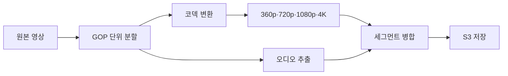

### 4-2. GOP(Group of Pictures) 분할의 이유

영상을 통째로 인코딩하면 4K 원본 1시간짜리가 수 시간 걸립니다. YouTube는 영상을 **GOP 단위(보통 2~4초)**로 잘라 수백 개의 워커가 병렬 처리합니다.

GOP는 I-Frame(완전한 프레임)으로 시작하기 때문에 독립적으로 인코딩 가능합니다. 1시간짜리 영상을 2초 단위로 자르면 1,800개의 청크가 되고, 1,800개 워커가 동시에 처리하면 이론상 거의 실시간 처리가 가능합니다.

### 4-3. FFmpeg과 GPU 가속

```bash
# CPU 인코딩 (느림)
ffmpeg -i input.mp4 -vf scale=1280:720 -c:v libx264 output_720p.mp4

# GPU 가속 인코딩 (NVIDIA NVENC — 5~10배 빠름)
ffmpeg -i input.mp4 -vf scale=1280:720 -c:v h264_nvenc \
  -preset p4 -b:v 2500k output_720p.mp4
```

YouTube는 **NVIDIA Tesla GPU**를 클러스터로 운용합니다. GPU 1장이 CPU 16코어 대비 트랜스코딩 속도 5~10배입니다. 4K HDR 콘텐츠는 특수 AV1 코덱으로 인코딩하여 H.264 대비 50% 용량 절감합니다.

### 4-4. 트랜스코딩 해상도 및 비트레이트 기준

| 해상도 | 비트레이트 (H.264) | 비트레이트 (AV1) |
|--------|-------------------|-----------------|
| 360p | 1 Mbps | 0.5 Mbps |
| 480p | 2.5 Mbps | 1.2 Mbps |
| 720p | 5 Mbps | 2.5 Mbps |
| 1080p | 8 Mbps | 4 Mbps |
| 4K | 35~45 Mbps | 15~20 Mbps |

### 4-5. 썸네일 자동 생성

FFmpeg로 영상의 10%, 30%, 50%, 70% 지점에서 프레임을 추출하여 썸네일 후보를 생성합니다. YouTube의 ML 모델이 가장 매력적인 프레임을 자동 선택하고, 업로더가 커스텀 썸네일을 올릴 수도 있습니다.

---

## 5. 어댑티브 비트레이트 스트리밍 (ABR)

### 5-1. 왜 ABR인가?

고정 화질로 스트리밍하면 두 가지 문제가 생깁니다:
- 네트워크가 느릴 때 → 계속 버퍼링
- 네트워크가 빠를 때 → 저화질로 낭비

ABR(Adaptive Bitrate Streaming)은 **네트워크 상태를 실시간으로 감지하여 화질을 자동 전환**합니다.

> **비유:** 고속도로 네비게이션 같습니다. 앞 도로가 막히면 자동으로 우회로로 안내합니다. 운전자(사용자)는 목적지(영상 시청)만 생각하면 되고, 경로(화질)는 자동으로 최적화됩니다.

### 5-2. 왜 HLS/DASH인가 — RTMP 직접 전송이 아닌 이유

RTMP(Real-Time Messaging Protocol)로 영상을 직접 스트리밍하면 안 되는가? 라이브 방송 송출은 RTMP를 쓰지만, 시청자에게 전달할 때는 HLS/DASH를 씁니다.

| 항목 | RTMP 직접 전송 | HLS/DASH (세그먼트) |
|------|--------------|-------------------|
| 프로토콜 | TCP 전용 | **HTTP** (CDN 캐시 가능) |
| 네트워크 적응 | 불가 (고정 품질) | **ABR — 자동 화질 전환** |
| CDN 캐싱 | 불가 (스트림은 캐시 불가) | **가능 (세그먼트 단위)** |
| 방화벽 | 포트 1935 차단 흔함 | 포트 80/443 (항상 열림) |
| Seek(탐색) | 처음부터 재생 필요 | **세그먼트 직접 요청** |
| 동시 시청자 | 서버 1대가 연결 유지 | CDN이 수억 명 처리 |

**핵심 이유**: RTMP는 TCP 연결을 서버가 직접 유지해야 합니다. 동시 시청 1억 명이면 서버가 1억 개 TCP 연결을 유지해야 합니다. HLS/DASH는 세그먼트(2~10초 파일)를 HTTP로 요청하는 방식이라 CDN이 캐시해서 제공합니다. 1억 명이 같은 세그먼트를 요청해도 CDN 엣지가 파일 하나를 1억 번 보내는 것입니다. Origin 서버 부하는 거의 없습니다.

### 5-3. HLS vs DASH 비교

| 항목 | HLS (Apple) | DASH (ISO 표준) |
|------|-------------|----------------|
| 세그먼트 포맷 | TS, fMP4 | fMP4 |
| 플레이리스트 | .m3u8 | .mpd (XML) |
| 지원 플랫폼 | iOS, Safari 필수 | 브라우저, Android |
| 지연시간 | 6~30초 (LL-HLS: 2초) | 2~10초 |
| DRM | FairPlay | Widevine, PlayReady |

YouTube는 **DASH**를 주력으로 사용하고 iOS/Safari에서는 HLS로 폴백합니다.

### 5-3. HLS 동작 원리

```
master.m3u8 (마스터 플레이리스트)
├── 360p.m3u8
│   ├── seg_001.ts (2초)
│   ├── seg_002.ts (2초)
│   └── ...
├── 720p.m3u8
│   ├── seg_001.ts (2초)
│   └── ...
└── 1080p.m3u8
    └── ...
```

플레이어는 마스터 플레이리스트를 받은 후, 현재 대역폭에 맞는 화질의 `.m3u8`을 선택합니다. 각 세그먼트(2~4초 분량)를 다운로드하면서 지속적으로 대역폭을 측정하고, 필요하면 다른 화질 플레이리스트로 전환합니다.

### 5-4. Bandwidth Estimation (대역폭 추정)

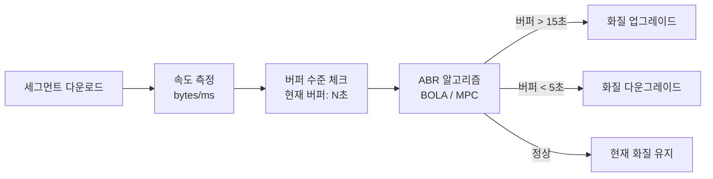

대표 알고리즘:
- **BOLA(Buffer Occupancy based Lyapunov Algorithm)**: 버퍼 수준 기반으로 화질 결정
- **MPC(Model Predictive Control)**: 미래 대역폭을 예측하여 화질 결정

---

## 6. CDN 전략

### 6-1. CDN 없이는 불가능하다

서울 데이터센터에서 브라질 상파울루 사용자에게 영상을 보내면 RTT(Round Trip Time)만 300ms 이상입니다. 2.5Mbps 720p 영상 스트리밍에서 매 세그먼트(2초)마다 300ms 지연이면 체감은 처참합니다.

CDN은 전 세계 수백 개의 **엣지 서버(PoP, Point of Presence)**에 영상 세그먼트를 캐시하여, 사용자는 가장 가까운 서버에서 받습니다.

> **비유:** 전국 편의점 체인과 같습니다. 본사(Origin) 창고에서 직접 배달하면 하루가 걸리지만, 동네 편의점(CDN 엣지)에 미리 채워두면 걸어서 5분 거리입니다.

### 6-2. 왜 Origin Shield인가

Origin Shield 없이 새 영상이 공개되면 어떻게 될까요?

```
Origin Shield 없는 경우:
  전 세계 200개 CDN 엣지 PoP → 모두 캐시 미스
  → 200개 엣지가 동시에 Origin S3에 세그먼트 요청
  → 1080p 영상 1개 = 세그먼트 수백 개 × 200 PoP = 수만 건의 동시 S3 요청
  → S3 요청 비용 폭증 + Origin 응답 지연 → 첫 시청자들 버퍼링

Origin Shield 있는 경우:
  200개 엣지 → 모두 캐시 미스 → Origin Shield(1~3개 리전)로 집약
  → Origin Shield가 Origin에 1회만 요청
  → Origin Shield 캐시 후 200개 엣지에 배포
  → Origin 요청 수: 200건 → 1건 (200배 감소)
```

| 항목 | Origin Shield 없음 | Origin Shield 있음 |
|------|-------------------|-------------------|
| Origin 요청 수 | PoP 수 × 세그먼트 수 | **세그먼트 수만** |
| Origin 비용 (S3 GET) | 매우 높음 | 최소화 |
| 신규 콘텐츠 캐시 워밍 | 느림 (각 PoP 개별) | 빠름 (Shield → 전체 배포) |
| Origin 장애 내성 | 낮음 | **Shield가 캐시로 버퍼링** |

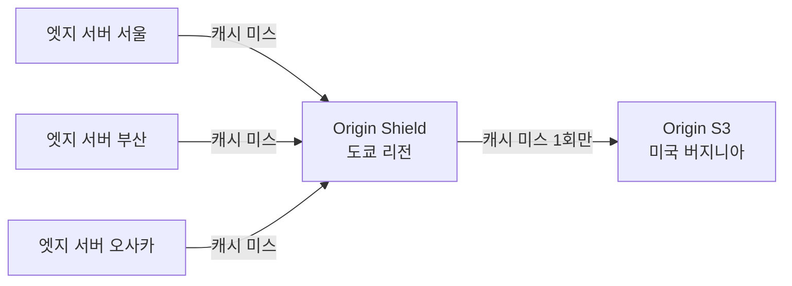

여러 엣지 서버가 Origin에 동시에 캐시 미스를 내면 Origin이 폭주합니다. **Origin Shield**는 중간 계층을 두어 Origin에 대한 요청을 집약합니다. 같은 콘텐츠 요청이 Origin에 한 번만 도달하도록 합니다.

### 6-3. 인기 영상 프리캐시 (Pre-warming)

BTS 신곡 MV처럼 예고된 대형 이벤트는 공개 전 미리 CDN에 캐시를 채웁니다.

1️⃣ 콘텐츠 팀이 "고인기 예상" 영상을 태깅
2️⃣ 공개 30분 전, CDN 프리워밍 스크립트 실행
3️⃣ Origin이 전 세계 PoP에 세그먼트를 밀어넣음
4️⃣ 사용자 폭주 시 모든 요청이 캐시 히트

### 6-4. 롱테일 콘텐츠 처리

전체 영상의 80%는 거의 조회되지 않습니다(롱테일). 이런 영상을 CDN에 영구 캐시하면 스토리지 낭비입니다.

전략:
- **TTL 차등 적용**: 인기 영상은 TTL 7일, 롱테일은 TTL 24시간
- **캐시 계층**: 엣지(SSD) → Regional(HDD) → Origin(S3 Glacier)
- **요청 빈도 기반 퇴출**: LFU(Least Frequently Used) 알고리즘으로 낮은 조회 콘텐츠 자동 퇴출

---

## 7. 메타데이터 데이터베이스

### 7-1. 스키마 설계

```sql
-- 영상 테이블
CREATE TABLE videos (
    video_id     VARCHAR(11) PRIMARY KEY,  -- 'dQw4w9WgXcQ' 형태
    channel_id   BIGINT NOT NULL,
    title        VARCHAR(100) NOT NULL,
    description  TEXT,
    status       ENUM('processing','active','deleted'),
    duration_sec INT,
    view_count   BIGINT DEFAULT 0,
    like_count   BIGINT DEFAULT 0,
    created_at   DATETIME,
    INDEX idx_channel (channel_id),
    INDEX idx_created (created_at)
);

-- 채널 테이블
CREATE TABLE channels (
    channel_id      BIGINT PRIMARY KEY AUTO_INCREMENT,
    user_id         BIGINT NOT NULL,
    channel_name    VARCHAR(100),
    subscriber_cnt  BIGINT DEFAULT 0,
    created_at      DATETIME
);

-- 댓글 테이블 (샤딩 키: video_id)
CREATE TABLE comments (
    comment_id  BIGINT PRIMARY KEY AUTO_INCREMENT,
    video_id    VARCHAR(11) NOT NULL,
    user_id     BIGINT NOT NULL,
    content     TEXT,
    like_count  INT DEFAULT 0,
    created_at  DATETIME,
    INDEX idx_video (video_id, created_at DESC)
);

-- 좋아요 테이블 (중복 방지)
CREATE TABLE video_likes (
    user_id   BIGINT,
    video_id  VARCHAR(11),
    liked_at  DATETIME,
    PRIMARY KEY (user_id, video_id)
);
```

### 7-2. 조회수 카운터 — 정확성 vs 성능

조회수는 초당 수만 건의 업데이트가 필요합니다. MySQL에 매번 `UPDATE videos SET view_count = view_count + 1`을 날리면 DB가 즉시 죽습니다.

> **비유:** 편의점 출입 카운터를 생각해보세요. 매 고객마다 본사 장부에 직접 기록하지 않고, 편의점 직원이 하루치를 모아 마감 때 본사에 보고합니다.

해결책:

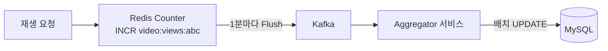

1️⃣ Redis에 `INCR video:views:{video_id}` 로 메모리 카운터 누적
2️⃣ 1분마다 Redis 값을 읽어 Kafka로 전송
3️⃣ Aggregator가 배치로 MySQL `view_count` 업데이트

단, 이 방식은 최대 1분의 지연이 있습니다. 실시간 정확성보다 **성능 우선**이 YouTube의 선택입니다.

### 7-3. 읽기 복제 (Read Replica)

메타데이터는 읽기 : 쓰기 = 9 : 1입니다. Primary 1대, Read Replica 5~10대로 읽기 부하를 분산합니다.

```
Primary DB (쓰기)
    ├── Replica 1 (아시아 읽기)
    ├── Replica 2 (유럽 읽기)
    ├── Replica 3 (미주 읽기)
    └── Replica 4 (검색/추천 읽기)
```

---

## 8. 추천 시스템

### 8-1. 왜 추천이 핵심인가?

YouTube 시청 시간의 **70%가 추천 영상**에서 발생합니다. 홈피드, 사이드바, 다음 영상 자동재생 모두 추천 엔진이 결정합니다.

### 8-2. 2단계 추천 아키텍처

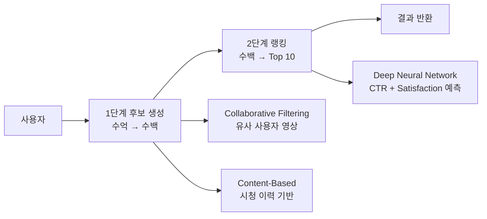

**1단계: 후보 생성 (Candidate Generation)**
- Collaborative Filtering: "당신과 비슷한 사람들이 본 영상"
- Content-Based: "당신이 본 영상과 유사한 영상"
- 수억 개 중 수백 개로 압축

**2단계: 랭킹 (Ranking)**
- 수백 개 후보에 정교한 DNN 적용
- 예측 지표: CTR(클릭률), Watch Time, 좋아요/싫어요, 댓글, 반복 시청
- 최종 Top 10~20 선정

### 8-3. 실시간 피처 서빙

추천 모델은 **실시간 피처**를 필요로 합니다:
- 방금 시청한 영상 (최근 5분 이내)
- 현재 트렌딩 영상 (실시간 조회수 급상승)
- 사용자의 현재 시간대, 디바이스

실시간 피처는 Redis/Cassandra에 저장하고 낮은 지연시간으로 서빙합니다. 배치 피처(시청 이력, 구독 채널)는 오프라인으로 계산하여 Feature Store(Feast 등)에 저장합니다.

---

## 9. 라이브 스트리밍

### 9-1. 라이브 스트리밍 아키텍처

라이브는 VOD와 근본적으로 다릅니다. 영상이 만들어지는 동시에 수백만 명이 봐야 합니다.

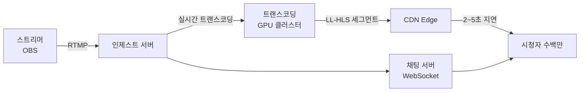

**RTMP(Real-Time Messaging Protocol)**: 스트리머 PC의 OBS 소프트웨어가 YouTube 인제스트 서버로 RTMP 스트림을 전송합니다.

**LL-HLS(Low Latency HLS)**: 기존 HLS의 지연(6~30초)을 2~3초로 줄인 Apple 확장 규격. 세그먼트 길이를 0.2~0.5초로 줄이고 HTTP/2 서버 푸시를 활용합니다.

### 9-2. 라이브 채팅 연동

동시 시청 500만 명이 채팅을 보내면 초당 수만 건의 메시지가 발생합니다.

1️⃣ 클라이언트 → WebSocket → 채팅 서버
2️⃣ 채팅 서버 → Kafka 토픽 (`live-chat-{stream_id}`)
3️⃣ 채팅 소비자 → 슈퍼챗/금지어 필터링
4️⃣ 처리된 메시지 → Redis Pub/Sub → 모든 시청자에게 브로드캐스트

트래픽이 너무 많을 때는 **메시지 샘플링**(전체의 일부만 노출)으로 처리합니다.

---

## 10. 콘텐츠 모더레이션

### 10-1. AI 기반 자동 심사

매일 50만 건이 업로드되는 상황에서 사람이 일일이 검토하는 것은 불가능합니다. YouTube는 **자동 AI 심사**를 먼저 거치게 합니다.

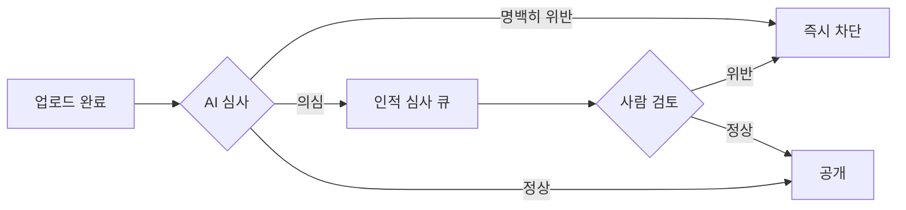

**NSFW 감지**: 프레임별 이미지 분류 모델. 초당 수천 프레임을 병렬 처리.
**혐오 발언**: 자막/음성 → STT → NLP 분류기. 다국어 지원.
**스팸**: 메타데이터(제목, 설명, 태그) 패턴 분석.

### 10-2. Content ID — 저작권 자동 감지

YouTube의 Content ID는 저작권자가 사전에 등록한 **핑거프린트**와 업로드된 영상을 비교합니다.

1️⃣ 음반사/영화사가 원본 콘텐츠의 오디오·비디오 핑거프린트 등록
2️⃣ 새 영상 업로드 시 전체 데이터베이스와 비교 (밀리초 내)
3️⃣ 일치 시 저작권자 설정에 따라: **차단** / **수익화** / **추적** 중 선택

기술: 오디오는 **Chromaprint** 기반 음향 지문, 비디오는 **Perceptual Hashing**(pHash)으로 비교합니다.

---

## 11. 보안

### 11-1. DRM (Digital Rights Management)

프리미엄 콘텐츠(YouTube Premium 오리지널, 영화 대여)는 DRM으로 보호합니다.

| DRM | 지원 플랫폼 |
|-----|------------|
| Widevine | Chrome, Android, Firefox |
| FairPlay | Safari, iOS, macOS |
| PlayReady | Windows, Edge, Xbox |

**작동 원리**:

1️⃣ 영상 세그먼트는 AES-128로 암호화된 채로 CDN에 저장
2️⃣ 플레이어가 라이선스 서버에 복호화 키 요청 (인증 토큰 포함)
3️⃣ 라이선스 서버가 구독 여부 확인 후 키 발급
4️⃣ 플레이어의 신뢰 환경(TEE)에서만 복호화 — 일반 메모리로 노출 안 됨

### 11-2. 핫링크 방지 (Hotlink Protection)

외부 사이트에서 YouTube CDN URL을 직접 링크하여 트래픽을 훔치는 것을 방지합니다.

- CDN URL에 **서명(Signature)**과 **만료 시간** 포함
- `?Expires=1699999999&Signature=abc123&Key-Pair-Id=K2...`
- 만료된 URL 또는 Referer가 허용 도메인이 아니면 403 반환

### 11-3. Geo-blocking

특정 콘텐츠는 저작권 계약에 따라 특정 국가에서만 시청 가능합니다.

- 사용자 IP → GeoIP DB → 국가 코드 판별
- CDN 엣지에서 국가 코드 기반 접근 제어 (CloudFront Geo Restriction)
- VPN 우회 감지: IP 평판 DB, datacenter IP 범위 차단

---

## 12. 극한 시나리오

### 시나리오 1️⃣: BTS 신곡 MV 공개 — 1시간에 1억 뷰

**문제**: 공개 직후 전 세계 팬들이 동시에 몰려듭니다. 평소의 100배 트래픽이 예고 없이(아니, 예고 있이) 쏟아집니다.

**대응 전략**:

1️⃣ **CDN 프리워밍**: 공개 30분 전 전 세계 PoP에 미리 캐시 배포
2️⃣ **자동 스케일링 사전 발동**: 예고된 이벤트이므로 트래픽 급증 전 서버 증설 완료
3️⃣ **조회수 카운터 Redis 샤딩**: 단일 키에 초당 수천 INCR → 여러 Redis 샤드에 분산 후 합산
4️⃣ **추천 캐시**: 이 영상이 모든 홈피드 상단에 올라오므로 추천 결과를 CDN에 캐시
5️⃣ **Origin Shield 강화**: 캐시 미스를 단 하나의 경로로만 Origin에 전달

**결과**: 1억 뷰 트래픽의 99.9%는 CDN이 처리하고 Origin 부하는 거의 증가하지 않습니다.

---

### 시나리오 2️⃣: 월드컵 결승 라이브 — 동시 시청 5000만

**문제**: 라이브 스트리밍은 VOD와 달리 캐시가 불가능합니다. 세그먼트가 실시간으로 만들어지기 때문입니다. 5000만 명이 동시에 2~3초짜리 세그먼트를 계속 요청합니다.

**대응 전략**:

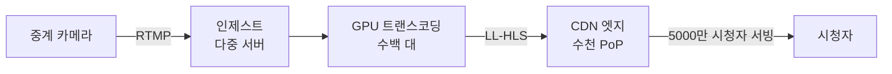

1️⃣ **인제스트 이중화**: RTMP 인제스트 서버를 최소 3대로 운영. Primary 장애 시 자동 Failover
2️⃣ **트랜스코딩 GPU 클러스터 증설**: 이벤트 당일 수백 대 온디맨드 GPU 인스턴스 추가 기동
3️⃣ **CDN 대역폭 사전 확보**: CDN 벤더와 트래픽 급증 계약 체결
4️⃣ **세그먼트 캐시 TTL**: LL-HLS 세그먼트는 수 초짜리이므로, 수백만 명이 동일 URL을 동시 요청 → CDN이 같은 파일을 서빙 (캐시 가능!)
5️⃣ **채팅 스로틀링**: 동시 채팅이 폭주하면 초당 메시지 수 제한, 슈퍼챗 우선 노출

**핵심 인사이트**: 라이브도 세그먼트 단위로 나뉘면 "준 캐시 가능" 상태가 됩니다. 5000만 명이 같은 세그먼트 URL을 요청하면 CDN이 캐시로 처리합니다.

---

### 시나리오 3️⃣: 100GB 4K 영상 업로드

**문제**: 유튜버가 4K 원본 100GB 파일을 업로드합니다. 집 인터넷 속도 100Mbps라도 100GB 업로드는 2시간 이상 걸립니다. 중간에 끊기면?

**대응 전략**:

1️⃣ **멀티파트 업로드 + 재개 가능**: 5MB 청크 2만 개로 분할. S3 Multipart Upload API 사용. 각 청크는 독립적으로 업로드되어 실패한 청크만 재시도
2️⃣ **업로드 세션 유지**: `upload_id`로 세션 상태 저장. 24시간 이내 재접속 시 이어 올리기
3️⃣ **클라이언트 측 체크섬**: 각 청크 업로드 후 MD5 검증. 네트워크 오염 즉시 감지
4️⃣ **트랜스코딩 우선순위 조정**: 100GB 파일 트랜스코딩은 수 시간 소요. 일반 영상 큐에 섞으면 전체 지연 발생 → 대용량 파일 전용 낮은 우선순위 큐 분리
5️⃣ **스토리지 비용 최적화**: 원본은 S3 Standard로 업로드 후 30일 후 S3 Glacier로 자동 이전 (트랜스코딩 완료본은 Standard 유지)

```
업로드 완료 시 처리 흐름:
1. S3 이벤트 → Kafka 토픽 'video-uploaded'
2. 트랜스코딩 워커 (낮은 우선순위 큐에서 픽업)
3. GOP 단위 분할 (2초 × 3000개 = 100분 기준)
4. 3000개 청크 병렬 인코딩 (5개 해상도)
5. 완료 시 metadata DB 업데이트, 사용자 알림
```

---

## 13. 면접 포인트 5가지

### 포인트 1: "조회수 카운터는 정확해야 하나요?"

면접관이 "조회수가 실시간으로 정확하지 않아도 괜찮냐"고 물으면, 이렇게 답하세요:

"YouTube는 Strong Consistency가 아닌 **Eventual Consistency**를 선택했습니다. 조회수가 1~2분 지연되어도 사용자 경험에 거의 영향이 없습니다. 반면 초당 수만 건을 DB에 직접 쓰면 시스템 전체가 멈춥니다. **Redis 버퍼 → Kafka → 배치 flush** 패턴으로 성능과 정확성의 균형을 맞춥니다."

### 포인트 2: "왜 트랜스코딩을 서버 내에서 동기 처리하지 않나요?"

"업로드 API가 트랜스코딩까지 동기로 처리하면 응답이 수십 분 걸립니다. 사용자가 기다릴 수 없습니다. 또한 업로드 서버와 트랜스코딩 워커가 강하게 결합되면 한쪽 장애가 전체 장애로 번집니다. **Kafka로 비동기 분리**하면 업로드 서버는 'S3에 저장 완료' 즉시 응답하고, 트랜스코딩은 백그라운드에서 진행됩니다. 서비스 간 장애 격리도 됩니다."

### 포인트 3: "ABR에서 화질 전환이 너무 자주 일어나면?"

"ABR의 함정은 '화질 플래핑(flapping)'입니다. 대역폭이 불안정하면 720p→480p→720p가 반복되어 UX가 나빠집니다. **히스테리시스(Hysteresis)** 로직으로 해결합니다. 업그레이드 임계값을 다운그레이드 임계값보다 높게 설정하고, 최근 N초의 이동 평균 대역폭을 사용합니다. 또한 현재 버퍼 수준이 충분하면 당장 빠른 대역폭이 없어도 화질 유지합니다."

### 포인트 4: "CDN 캐시 미스 시 Origin 보호는?"

"캐시 미스가 동시에 수만 건 발생하면 Origin이 폭주합니다. 이를 **Thundering Herd Problem**이라고 합니다. 해결책은 세 가지입니다: 1) **Origin Shield** 중간 계층으로 동일 콘텐츠 요청 집약, 2) **Probabilistic Early Expiration** — TTL 만료 직전에 일부 요청만 Origin 갱신 (나머지는 Stale 서빙), 3) **Rate Limiting** — CDN 미스 시 Origin으로의 요청 수 제한."

### 포인트 5: "라이브 스트리밍과 VOD의 근본적인 차이는?"

"VOD는 **Pull 모델**입니다. 영상이 이미 있고 사용자가 필요할 때 가져옵니다. CDN 캐시가 완벽하게 동작합니다. 라이브는 **Push 모델**에 가깝습니다. 콘텐츠가 실시간 생성되므로 트랜스코딩 파이프라인이 실시간으로 동작해야 하고, 지연시간이 핵심 지표입니다. LL-HLS는 세그먼트를 0.2초 단위로 쪼개어 end-to-end 지연을 2~3초로 줄입니다. 반면 CDN 히트율은 '동일 세그먼트 URL에 대한 동시 요청 수'에 달려있어, 시청자가 많을수록 오히려 캐시 효율이 높아집니다."

---

## 14. 실무 실수 모음

### 실수 1: 단일 업로드 엔드포인트로 대용량 처리

```python
# 잘못된 방식 — 서버 메모리 폭주
@app.post("/upload")
def upload_video(file: UploadFile):
    content = await file.read()  # 100GB를 메모리에!
    s3.put_object(Body=content, ...)
```

올바른 방식은 Presigned URL로 클라이언트가 S3에 직접 업로드합니다.

### 실수 2: 트랜스코딩 상태를 DB로만 관리

트랜스코딩 워커가 죽으면 진행 중이던 작업이 사라집니다. **Kafka Consumer Group + Offset Commit**으로 작업 상태를 관리하고, 워커 재시작 시 마지막 커밋 지점부터 재처리합니다.

### 실수 3: CDN URL에 서명 없이 직접 노출

영상 URL이 `https://cdn.example.com/video/abc123/720p/seg001.ts` 처럼 예측 가능하면 핫링크나 콘텐츠 도용이 쉽습니다. 반드시 **서명 + 만료 시간**을 URL에 포함시킵니다.

### 실수 4: 모든 해상도를 동시 인코딩 완료 대기

4K 인코딩은 360p보다 10배 이상 오래 걸립니다. 영상 공개를 4K 완료까지 기다리면 업로드 후 수십 분이 지나서야 영상이 보입니다. YouTube는 **360p, 480p 완료 즉시 공개**하고, 고해상도는 백그라운드에서 추가 처리합니다.

---

## 15. 보안 고려사항 심화

### SSRF(Server-Side Request Forgery) 방지

트랜스코딩 워커가 외부 URL에서 영상을 다운로드하는 기능이 있다면, 악의적인 사용자가 내부 메타데이터 서버 URL(`http://169.254.169.254/`)을 입력할 수 있습니다. 반드시:
- 입력 URL의 IP 대역 화이트리스트 검증
- DNS rebinding 방지 (resolve 후 IP 재검증)
- 내부망 대역(10.0.0.0/8, 172.16.0.0/12, 192.168.0.0/16) 차단

### 업로드 폭탄 방지

악의적인 사용자가 서버 자원을 고갈시키기 위해 수천 개의 동시 업로드를 시도할 수 있습니다:
- 계정당 동시 업로드 수 제한 (예: 3개)
- IP당 일일 업로드 용량 제한
- 미완료 업로드 세션 자동 만료 (24시간)
- 업로드 세션 생성 시 reCAPTCHA v3 적용

### Token Binding으로 재생 URL 보호

Presigned URL이 탈취되면 다른 사람이 사용할 수 있습니다. IP 바인딩으로 URL 생성 시 클라이언트 IP를 서명에 포함하면, 같은 URL을 다른 IP에서 사용하면 403이 반환됩니다. 단, VPN/프록시 사용자 경험에 영향을 주므로 Trade-off를 고려합니다.

---

### 꼭 직접 만들어야 하는가? — Build vs Buy

| 선택지 | 장점 | 단점 | 적합한 시점 |
|--------|------|------|-----------|
| YouTube / Vimeo OTT API | 업로드→트랜스코딩→CDN 전부 위임, 구현 부담 없음 | 커스텀 플레이어·DRM 불가, 플랫폼 정책 종속 | Phase 1 |
| AWS MediaConvert + CloudFront | 트랜스코딩만 위임, CDN 통합, AWS 생태계 활용 | 실시간 스트리밍 제한, 비용 예측 필요 | Phase 1~2 |
| Mux | 개발자 친화적 비디오 API, HLS 자동 생성, 분석 내장 | 월 처리량 10만 시간 초과 시 비용 급등 | Phase 2~3 |
| 직접 구축 (FFmpeg 파이프라인 + 자체 CDN) | 완전한 제어, 넷플릭스/디즈니+ 급 커스텀 가능 | 구현·운영 복잡도 극히 높음, 대규모 인프라 팀 필요 | Phase 3~4 |

**실무 판단 기준**: 동영상이 핵심 서비스이고, 월 처리량 10만 시간 초과 시 직접 구축을 검토한다.

> 핵심: Phase 1에서 직접 구축하면 오버 엔지니어링이고, Phase 3에서 SaaS에 의존하면 비용 폭발이다. 현재 MAU에 맞는 선택을 하고, 병목이 실제로 발생할 때 전환한다.

---

## Day 1 → Scale 진화

동영상 스트리밍을 처음부터 자체 CDN과 GPU 클러스터로 시작하면 서비스 출시 전에 인프라 비용으로 파산한다. 트래픽 규모에 맞게 단계적으로 진화해야 한다.

### Phase 1 — MAU 1만, 일 업로드 500건 (스타트업 초기)

**아키텍처**: S3 직접 업로드 + CloudFront + 단일 트랜스코딩 서버

- 업로드: Presigned URL로 S3에 직접 업로드
- 트랜스코딩: EC2 c5.2xlarge 1대에서 FFmpeg으로 720p·1080p 순차 변환
- 스트리밍: S3 + CloudFront HLS 배포
- 메타데이터: MySQL 단일 인스턴스 (RDS t3.medium)
- 추천: 없음 (최신 업로드 순 목록)

**월 비용**
- EC2 c5.2xlarge (트랜스코딩): ~$250
- RDS MySQL db.t3.medium: ~$60
- S3 저장 (27TB/년 기준 월 2.25TB): ~$50
- CloudFront 전송 (10TB/월): ~$850
- 합계: **~$1,210/월**

### Phase 2 — MAU 100만, 일 업로드 5만 건 (서비스 성장)

**아키텍처**: 트랜스코딩 파이프라인 분리 + Kafka 비동기 처리 + HLS 전환

- 트랜스코딩: Kafka 메시지 기반 비동기, GPU 인스턴스(g5.xlarge) 5대 병렬
- 파이프라인: 360p 완료 즉시 공개, 나머지 해상도 백그라운드 처리
- 스토리지: S3 Intelligent-Tiering (인기 콘텐츠 Standard, 롱테일 자동 이전)
- CDN: CloudFront + Origin Shield 도입 (Origin 요청 80% 감소)
- 메타데이터: MySQL Primary + 읽기 레플리카 2대, Redis 캐시 추가
- 조회수: Redis INCR 버퍼 → Kafka → 1분 배치 flush

**월 비용**
- GPU EC2 g5.xlarge × 5: ~$1,800
- RDS Aurora MySQL (Multi-AZ): ~$1,500
- ElastiCache Redis: ~$200
- CloudFront + Origin Shield: ~$5,000
- Kafka MSK: ~$600
- 합계: **~$9,100/월**

### Phase 3 — MAU 1000만, 일 업로드 50만 건 (고성장)

**아키텍처**: DAG 기반 트랜스코딩 + 자체 ABR 플레이어 + DASH 전환

- 트랜스코딩: Apache Airflow DAG로 GOP 단위 병렬 처리, 5개 해상도 동시 인코딩
- 코덱: H.264→AV1 전환 (용량 50% 절감, CDN 비용 절감)
- ABR: 자체 플레이어에 BOLA 알고리즘 내장, 화질 플래핑 히스테리시스 추가
- CDN: CloudFront + Akamai 이중화, 장애 시 자동 전환
- 추천: 2단계 파이프라인 도입 (Collaborative Filtering + DNN 랭킹)
- 라이브: LL-HLS 인제스트 서버 별도 구축, GPU 실시간 트랜스코딩

**월 비용**
- GPU 클러스터 (트랜스코딩·라이브): ~$15,000
- 멀티 CDN (CloudFront + Akamai): ~$30,000
- DB + Kafka 클러스터: ~$8,000
- 추천 서비스 (ML 학습·서빙): ~$5,000
- 합계: **~$58,000/월**

### Phase 4 — MAU 1억, 일 업로드 수백만 건 (글로벌 플랫폼)

**아키텍처**: 자체 OCA + 멀티리전 + 실시간 Content ID

- CDN: ISP 데이터센터에 자체 OCA 서버 배치 (Netflix 모델), 상업 CDN은 롱테일 처리
- 트랜스코딩: 전용 GPU 데이터센터 운영, 4K HDR AV1 실시간 처리
- 저작권: Content ID 핑거프린트 DB 실시간 비교 (업로드 즉시 밀리초 내)
- 라이브: 글로벌 인제스트 PoP 20개, 지역별 엣지 트랜스코딩
- 모더레이션: AI 모델로 NSFW·혐오·스팸 자동 감지, 인적 심사 큐
- 멀티리전: US·EU·APAC 3리전 독립 운영, 리전 간 영상 복제

**월 비용**
- 자체 OCA 운영 (서버·코로케이션): ~$200,000
- 글로벌 GPU 클러스터: ~$100,000
- 멀티리전 인프라 전체: ~$150,000
- 합계: **~$450,000/월** (상업 CDN만 썼을 경우 대비 60% 절감)

---

## 핵심 메트릭 5개

동영상 스트리밍에서 이 다섯 숫자가 동시에 정상이면 시청자 경험이 좋은 상태다. 하나라도 이상하면 어느 레이어에 문제가 있는지 추적해야 한다.

| 메트릭 | 정상 기준 | 이상 신호 | 원인 가설 |
|--------|---------|---------|---------|
| **버퍼링율** | 0.5% 이하 | 2% 초과 | CDN 특정 PoP 과부하, ABR 화질 다운그레이드 지연, 세그먼트 크기 과대 |
| **재생 시작 시간 (TTFF)** | 2초 이내 | 5초 초과 | CDN 캐시 미스 급증, Origin Shield 장애, 초기 세그먼트 크기 과대 |
| **트랜스코딩 지연** | 업로드 후 5분 이내 360p 공개 | 30분 초과 | Kafka lag 증가, GPU 워커 부족, 대용량 파일 큐 병목 |
| **CDN 히트율** | 95% 이상 | 80% 미만 | 신규 콘텐츠 폭증으로 캐시 워밍 미완료, TTL 설정 과소, 롱테일 집중 |
| **동시 시청 수** | 설계 용량 80% 이하 | 90% 초과 | 예상치 못한 이벤트(스포츠 결승 등), 오토 스케일링 지연 |

**핵심 알람 설정 예시**

```
버퍼링율 > 1% → PagerDuty P1 (CDN 상태 즉시 확인)
TTFF > 3초 (5분 평균) → PagerDuty P2 (Origin Shield·CDN 캐시 히트율 확인)
트랜스코딩 Kafka lag > 10,000 → Slack 알림 (GPU 워커 수평 확장)
CDN 히트율 < 85% → Slack 알림 (Origin 비용 급증 경고)
동시 시청 > 설계 용량 85% → Auto Scaling 즉시 트리거 + 온콜 알림
```

---

## 실제 장애 사례

### 사례 1: YouTube 2018 글로벌 장애 — 단일 서비스 의존성

**상황**: 2018년 10월 16일 YouTube가 약 1시간 30분 동안 전 세계적으로 접속 불가 상태가 됐다. 영상 로드, 업로드, 댓글 작성 모두 불가능했다. 이는 YouTube 역사상 가장 큰 규모의 장애 중 하나였다. Google은 공식적으로 내부 스토리지 시스템 변경 중 발생한 버그라고 밝혔다.

**근본 원인**: 내부 데이터 서비스 레이어의 설정 변경이 메타데이터 서비스와 충돌을 일으켰다. 영상 메타데이터를 읽지 못하면 CDN에 영상이 있어도 재생을 시작할 수 없다. 메타데이터 서비스가 단일 장애점이었고, 해당 레이어의 장애가 전체 재생 기능을 마비시켰다.

**해결책 (업계 전반 도입)**:
- 메타데이터 서비스 다중 리전 배포: 한 리전 장애 시 다른 리전에서 서빙
- 읽기 경로와 쓰기 경로 완전 분리: 메타데이터 쓰기 장애가 읽기(재생)에 영향 없도록
- 캐시 레이어 강화: 메타데이터 서비스 장애 시 스탤일 캐시로 일정 시간 서빙 가능
- 설정 변경 Canary 배포 강화: 트래픽 1%에 먼저 적용 후 지표 이상 없을 때만 확대

**교훈**: CDN에 영상이 있어도 메타데이터 서비스가 죽으면 재생이 불가능하다. 읽기 경로의 모든 의존 서비스는 다중화되어야 하며, 설정 변경은 반드시 Canary 배포로 진행해야 한다.

### 사례 2: 넷플릭스 AWS us-east-1 장애 (2022) — 리전 의존성

**상황**: 2022년 12월 AWS us-east-1 리전에서 대규모 장애가 발생했다. 넷플릭스를 포함한 수많은 서비스가 영향을 받았다. 넷플릭스는 미국 동부 사용자의 상당수가 영상 재생에 실패하는 상황을 경험했다. 단, 넷플릭스는 다중 리전 아키텍처 덕분에 유럽·아시아 사용자 영향을 최소화했다.

**근본 원인**: AWS 내부 네트워크 장비 설정 오류로 us-east-1 리전 내 서비스 간 통신이 단절됐다. 넷플릭스의 일부 컨트롤 플레인 서비스가 us-east-1에 집중되어 있어, 해당 리전 장애가 미국 동부 사용자 경험에 직접 영향을 줬다.

**해결책 (넷플릭스 이후 아키텍처 개선)**:
- Active-Active 멀티리전: us-east-1, us-west-2, eu-west-1 세 리전이 각각 독립적으로 트래픽을 처리할 수 있도록 전환
- 리전 격리(Cell Architecture): 각 리전을 독립적인 셀로 운영하여 한 리전 장애가 다른 리전으로 전파되지 않도록
- CDN OCA 배치 강화: ISP 내부 OCA에 영상이 있으면 AWS 리전 장애와 무관하게 재생 가능
- 컨트롤 플레인과 데이터 플레인 분리: 컨트롤 플레인 장애가 이미 진행 중인 스트리밍(데이터 플레인)에 영향 없도록

**교훈**: 단일 클라우드 리전은 단일 장애점이다. 동영상 스트리밍처럼 24/7 가용성이 필수인 서비스는 Active-Active 멀티리전이 필수다. 특히 OCA처럼 CDN 계층이 클라우드 리전과 독립적이면 리전 장애 시에도 재생 연속성을 보장할 수 있다.

### 사례 3: 트위치 라이브 폭주 — 동시 시청 급증 대응 실패

**상황**: 2020년 코로나 팬데믹 초기, 전 세계 봉쇄 조치로 트위치 동시 시청자 수가 수주 만에 3배 이상 폭증했다. 특히 유명 스트리머가 대형 게임 토너먼트를 중계할 때 동시 시청자가 수백만 명에 달하면서 특정 CDN PoP가 대역폭 한계에 도달했다. 일부 지역 시청자들이 버퍼링과 재생 불가를 경험했다.

**근본 원인**: 트위치의 CDN 대역폭 계약이 예상 트래픽 기준으로 체결되어 있었다. 팬데믹으로 인한 3배 폭증은 예측 모델 범위를 벗어났다. 자동 스케일링이 CDN 물리적 대역폭 한계를 초과하면 소프트웨어로 해결할 수 없다.

**해결책**:
- CDN 벤더 대역폭 계약을 피크 예상의 5배로 상향 (버스터블 플랜)
- 멀티 CDN 도입: Fastly + CloudFront + Akamai 동시 운영, PoP별 부하 모니터링하여 자동 분산
- 비상 화질 제한: CDN 특정 PoP 부하 90% 초과 시 해당 지역 최고 화질을 720p로 자동 제한
- 라이브 세그먼트 크기 최적화: 세그먼트를 2초에서 4초로 늘려 요청 수를 절반으로 감소시켜 CDN 부하 경감

**교훈**: CDN 대역폭은 소프트웨어로 해결할 수 없는 물리적 한계다. 계약 용량이 한계에 가까워지면 어떤 캐시 최적화도 효과가 없다. 예상 트래픽 기준의 3~5배 여유 용량과 멀티 CDN 분산이 필수다.

---

## 실무에서 놓치기 쉬운 케이스

### 1. Content ID 우회 — 영상을 좌우 반전하면 저작권 탐지를 피한다

YouTube Content ID는 영상의 오디오·비디오 핑거프린트를 원본과 대조해 저작권 침해를 탐지한다. 하지만 영상을 좌우 반전하거나, 화면 귀퉁이에 작은 사각형 로고를 추가하거나, 재생 속도를 2% 빠르게 하면 핑거프린트가 달라져 탐지를 피할 수 있다.

실무에서 사용하는 강화된 탐지 방식:

```
1단계: 기본 핑거프린트 비교 (Content ID 방식)
   perceptual hash로 영상 섬네일 배열 비교
   → 일치율 95% 이상이면 즉시 차단

2단계: 오디오 핑거프린트 (Shazam 방식)
   오디오 스펙트럼의 피크 패턴을 해시로 변환
   → 좌우 반전해도 오디오는 그대로이므로 탐지 가능

3단계: 변형 내성 핑거프린트
   DCT(Discrete Cosine Transform) 기반 로버스트 해시
   → 밝기 조정, 크롭, 소폭 속도 변경에도 같은 해시 값
   예: VideoHash, TMK+PDQF (Meta 오픈소스)

4단계: 사람 검토 큐
   자동 탐지 90~95%를 커버하고
   나머지는 신고 기반 + 사람 검토
```

완벽한 우회 방지는 불가능하므로 신고-탐지-차단 사이클을 빠르게 돌리는 것이 현실적인 목표다.

---

### 2. 라이브 스트림 딜레이 스포일러 — 경기 결과를 앱 알림이 먼저 알린다

HLS 라이브 스트리밍은 세그먼트 버퍼링 때문에 실시간 방송 대비 20~45초 딜레이가 생긴다. 이 사이에 앱 푸시 알림("손흥민 골!")이나 SNS 타임라인이 경기 결과를 먼저 노출하면 스포일러가 된다. 스포츠 중계 서비스에서는 치명적인 UX 문제다.

두 가지 대응이 있다.

**① 딜레이를 줄이는 기술적 접근: LL-HLS**

```
일반 HLS: 세그먼트 6초 × 버퍼 3개 = 최소 18초 딜레이
LL-HLS:   부분 세그먼트(Partial Segment) 0.2초 단위 전송
          → 2~3초 내 배포 가능
          → 딜레이를 SNS 반응 시간보다 짧게 만드는 것이 목표
```

**② 알림 딜레이 동기화**

라이브 스트리밍 중인 사용자에게는 경기 관련 알림을 스트림 딜레이만큼 지연 발송한다.

```python
def send_match_event_notification(event, viewer_delays):
    for user_id, delay_seconds in viewer_delays.items():
        scheduled_at = event["occurred_at"] + timedelta(seconds=delay_seconds)
        notification_queue.schedule(
            user_id=user_id,
            message=event["message"],
            send_at=scheduled_at
        )
```

---

### 3. 비인기 영상 콜드 스토리지 — 10년 된 영상의 스토리지 비용

YouTube에는 수십억 개의 영상이 있다. 이 중 대부분은 업로드 후 1년이 지나면 월 조회수가 10 미만이다. 이 영상들을 S3 Standard에 계속 보관하면 스토리지 비용이 폭발한다.

스토리지 티어링으로 비용을 절감한다.

```
Hot (S3 Standard):
  업로드 후 30일 이내 또는 최근 30일 조회수 1,000 이상
  비용: GB당 $0.023/월

Warm (S3 Standard-IA):
  조회수 100~999/월
  비용: GB당 $0.0125/월 (45% 절감)
  단점: 조회 첫 번째 요청 시 수십 ms 추가 지연

Cold (S3 Glacier Instant Retrieval):
  조회수 10~99/월
  비용: GB당 $0.004/월 (83% 절감)
  복구 시간: 수십 ms (즉시 재생 가능)

Archive (S3 Glacier Deep Archive):
  조회수 10 미만/월, 저작권 분쟁 대비 보관 필요 영상
  비용: GB당 $0.00099/월 (96% 절감)
  복구 시간: 12시간 (실시간 재생 불가, 복구 후 임시 링크 제공)
```

S3 Lifecycle Policy로 자동 이동을 설정하고, 영상 재생 요청 시 현재 스토리지 티어를 확인해 Glacier 영상은 복구 후 임시 URL로 리다이렉트한다. 트랜스코딩된 여러 화질(1080p, 720p, 480p) 중 저화질은 더 빨리 Cold로 이동시켜 추가로 절감할 수 있다.

---

## 요약: 핵심 설계 원칙

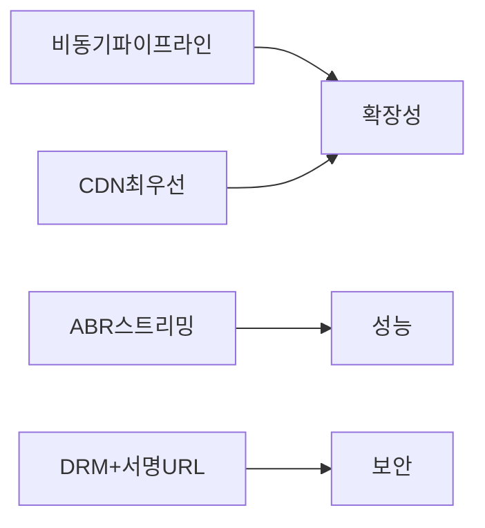

| 설계 결정 | 이유 |
|-----------|------|
| Presigned URL 직접 업로드 | API 서버 대역폭 병목 제거 |
| DAG 기반 트랜스코딩 | 병렬 처리로 처리 시간 최소화 |
| HLS/DASH ABR | 다양한 네트워크 환경 대응 |
| Origin Shield | Thundering Herd 방지 |
| Redis 조회수 버퍼 | DB 쓰기 부하 100배 감소 |
| 2단계 추천 (생성→랭킹) | 수억 개 후보를 실시간 처리 가능하게 압축 |
| LL-HLS 라이브 | 2~3초 내 배포로 몰입감 유지 |
| Content ID 핑거프린트 | 저작권 자동 처리로 규모 대응 |

동영상 스트리밍 시스템의 진짜 어려움은 **단일 기술의 복잡성**이 아닙니다. 업로드, 트랜스코딩, CDN, 추천, 라이브, 모더레이션이라는 **여섯 개의 복잡한 서브시스템이 하나의 매끄러운 경험으로 동작**하도록 만드는 것입니다. 그리고 이 모든 것이 매초 500시간의 영상이 추가되는 가운데 무중단으로 운영되어야 합니다.

---
## 실무에서 자주 하는 실수

**실수 1: 트랜스코딩을 단일 거대 Job으로 처리**
1시간짜리 영상을 단일 FFmpeg 프로세스로 360p/720p/1080p 세 해상도로 순차 처리하면 완료까지 30~60분. 그 사이 Job 서버가 재시작되면 처음부터 다시 시작해야 합니다. DAG 기반 파이프라인으로 영상을 2분짜리 세그먼트로 분할 후 각 세그먼트×해상도를 독립 Task로 병렬 처리하면 전체 시간을 1/10로 단축할 수 있습니다. YouTube의 실제 접근법입니다.

```java
// 세그먼트 단위 병렬 트랜스코딩 Job 등록
public void scheduleTranscoding(String videoId, String rawS3Key) {
    List<Segment> segments = segmentSplitter.split(rawS3Key, Duration.ofMinutes(2));
    List<Resolution> resolutions = List.of(Resolution.R360, Resolution.R720, Resolution.R1080);

    for (Segment seg : segments) {
        for (Resolution res : resolutions) {
            transcodeJobQueue.publish(TranscodeJob.builder()
                .videoId(videoId)
                .segmentId(seg.getId())
                .inputKey(seg.getS3Key())
                .outputResolution(res)
                .build());
        }
    }
    // 3 해상도 × N세그먼트가 병렬 처리됨
}
```

**실수 2: CDN 캐시 키를 URL 경로만으로 설정**
같은 영상이라도 사용자 지역, 디바이스, ABR 품질에 따라 다른 세그먼트를 반환해야 하는데, CDN 캐시 키가 경로만이면 첫 사용자의 응답이 다른 사용자에게 잘못 서빙됩니다. 특히 `Accept-Language`, 자막 포함 여부가 쿼리 파라미터에 있을 때 이를 캐시 키에 포함시키지 않으면 자막이 없는 세그먼트를 자막 요청자에게 서빙합니다.

**실수 3: ABR 로직을 서버에서 결정**
서버가 클라이언트 네트워크 상태를 정확히 알 수 없으므로, 서버가 해상도를 결정하면 실제 클라이언트 상황과 괴리가 생깁니다. HLS/DASH는 클라이언트가 세그먼트 다운로드 속도를 측정해 스스로 해상도를 선택(ABR)합니다. 서버가 해야 할 일은 모든 해상도의 세그먼트를 미리 만들어두고 매니페스트 파일에 선택지를 제공하는 것뿐입니다.

**실수 4: 영상 메타데이터를 트랜스코딩 완료 전에 검색 인덱스에 노출**
트랜스코딩이 완료되지 않은 영상 URL이 검색에 노출되면 사용자가 재생을 시도했을 때 404 또는 불완전한 영상을 보게 됩니다. 상태 머신(`UPLOADED → TRANSCODING → READY`)을 엄격히 관리하고, `READY` 상태가 된 이후에만 Elasticsearch 인덱싱과 추천 시스템 등록이 이루어져야 합니다.

---
## 면접 포인트

**Q1. HLS와 DASH의 차이는? 실무에서 무엇을 선택하는가?**
HLS(HTTP Live Streaming): Apple이 개발. `.m3u8` 매니페스트, `.ts` 세그먼트. iOS/macOS 네이티브 지원 필수. DASH(Dynamic Adaptive Streaming over HTTP): 오픈 표준. `.mpd` 매니페스트, `.mp4` 세그먼트. DRM 유연성 높음. 실무 선택: 글로벌 서비스는 두 가지 모두 제공합니다. iOS는 HLS, Android/Web은 DASH. YouTube는 DASH + HLS 병행, Netflix는 DASH + Widevine DRM 중심.

**Q2. 트랜스코딩 비용을 최소화하는 전략은?**
모든 업로드 영상을 최고 화질로 트랜스코딩하면 비용이 폭증합니다. 전략: ① 조회수 임계값 기반 트랜스코딩 — 1080p는 즉시, 4K는 조회수 1천 초과 후 시작 ② 원본 해상도 초과 트랜스코딩 금지 — 720p 원본을 1080p로 올리는 것은 낭비 ③ GPU 인스턴스 Spot Instance 활용 — 비용 60~70% 절감, 중단 시 재시도 로직 필수. 실제 YouTube는 트랜스코딩 인프라에 연간 수억 달러를 지출하며 효율화가 핵심 과제입니다.

**Q3. 라이브 스트리밍과 VOD의 아키텍처 차이는?**
VOD: 업로드 → 트랜스코딩 → CDN 배포의 단방향 파이프라인. 지연 허용 가능. 라이브: RTMP로 수신 → 실시간 트랜스코딩(< 2초) → HLS/DASH 세그먼트 생성(2초 단위) → CDN Edge에 즉시 배포. LL-HLS 사용 시 세그먼트를 200ms 단위로 더 잘게 쪼개 E2E 지연 2~3초 달성. 라이브는 CDN 캐시 TTL을 세그먼트 길이(2~4초)로 매우 짧게 유지해야 합니다.

**Q4. 영상 불법 복제 방지를 어떻게 구현하는가?**
DRM(Digital Rights Management): Widevine(Google, Android/Chrome), FairPlay(Apple, iOS/Safari), PlayReady(Microsoft) 세 가지를 동시 지원. 라이선스 서버가 재생 권한을 토큰으로 발급합니다. Signed URL: S3/CDN 세그먼트 URL에 만료 시각과 서명을 포함해 URL 공유만으로는 재생 불가. 워터마킹: 사용자 ID를 영상 픽셀에 비가시적으로 삽입해 유출 경로 추적.

**Q5. 영상 추천 시스템과 스트리밍의 연계 포인트는?**
추천 시스템이 영상 ID를 반환하면 스트리밍 시스템은 해당 영상의 CDN 프리페치를 트리거합니다. 사용자가 추천 영상에 마우스를 올리는 순간(`hover` 이벤트) 첫 세그먼트를 미리 로드하면 재생 버튼 클릭 후 지연이 0에 가깝습니다. 이 프리페치 신호는 서버에 전달되어 해당 영상 세그먼트를 Edge CDN에 미리 올립니다. Netflix는 이 방식으로 재생 시작 시간을 평균 200ms 이하로 달성합니다.
