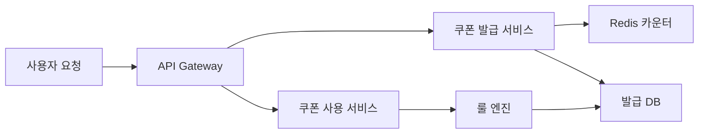
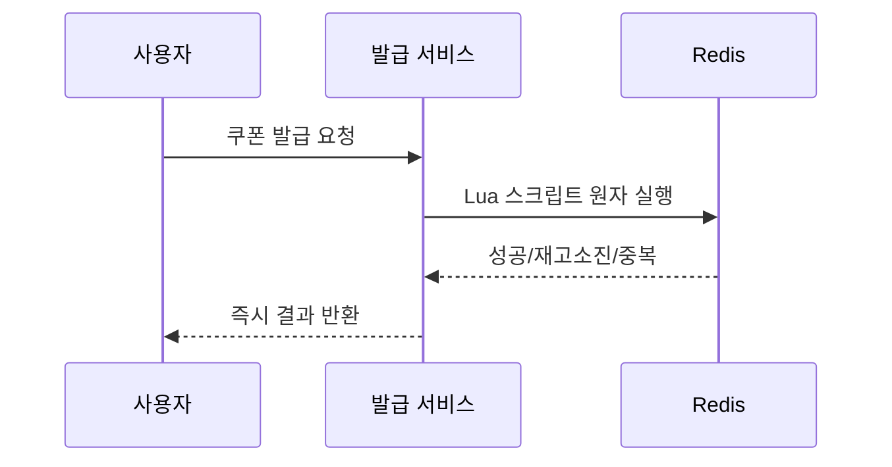
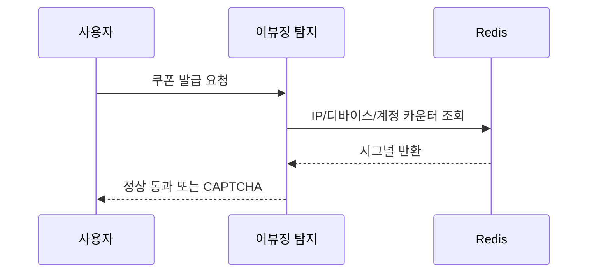

> **한 줄 요약**: 쿠폰 시스템의 핵심은 Redis 원자 연산으로 초과 발급을 막고, 룰 엔진으로 할인 조합을 유연하게 계산하며, 멀티 어카운트 어뷰징을 사전에 차단하는 것이다.

## 실제 문제: 선착순 쿠폰 초과 발급과 어뷰징

국내 한 대형 커머스 플랫폼이 "선착순 5만 장, 50% 할인" 쿠폰 이벤트를 열었습니다. DB의 `issued_count` 컬럼으로 카운터를 관리했는데, 수백 개의 DB 커넥션이 동시에 `49,998`이라는 값을 읽고 저마다 "아직 여유 있다"고 판단해 발급을 진행했습니다. 결과는 **6만 2천 장 발급**이었습니다.

설상가상으로 어뷰징 사용자들은 가족 명의 계정 10개로 쿠폰 10장을 챙겼습니다. 같은 IP에서 5번, 같은 핸드폰 번호에서 3번 발급이 이루어졌지만 시스템은 아무것도 감지하지 못했습니다.

쿠폰 시스템이 해결해야 할 핵심 문제:
- **초과 발급 방지**: 동시 요청 상황에서도 한도를 정확히 지키는 것
- **중복 발급 방지**: 한 사람이 동일 쿠폰을 여러 번 받지 못하게 하는 것
- **어뷰징 차단**: 멀티 계정, 자동화 봇의 쿠폰 사재기 탐지
- **유연한 할인 계산**: 정률/정액/최대 할인액 한도, 쿠폰 중복 적용 등 복잡한 규칙
- **만료 처리**: 수억 건의 쿠폰을 기한 안에 정확히 무효화하는 것

---

## 설계 의사결정 로드맵

### 결정 1: 쿠폰 발급 동시성 — DB 카운터 vs Redis DECR vs Kafka 큐

| 후보 | 장점 | 단점 | 언제 적합 |
|------|------|------|----------|
| DB 카운터 + SELECT FOR UPDATE | 구현 단순, 영구 저장 | 락 경합으로 TPS 급감, 초과 발급 위험 | 동시성 낮은 소규모 이벤트 |
| Redis DECR (원자 연산) | 경쟁 상태 없음, 인메모리 고속 | Redis 장애 시 카운터 소실 | 피크 트래픽이 높은 선착순 이벤트 |
| Kafka 큐 + 단일 소비자 | 순서 보장, 확실한 한도 제어 | 발급까지 지연 발생 | 비동기 허용, 공정성이 중요한 추첨형 |

**우리의 선택: Redis DECR + DB 후기록**
- `DECR coupon:{id}:remaining`는 Redis 단일 스레드가 원자적으로 처리하므로 동시에 100만 요청이 와도 카운터가 0 밑으로 내려가지 않는다. 발급 확정 후 비동기로 DB에 기록해 복구 기준점을 유지한다. DB SELECT FOR UPDATE 방식은 10만 TPS 환경에서 락 대기 큐가 폭발해 DB 커넥션 풀이 고갈된다.

### 결정 2: 할인 계산 엔진 — 하드코딩 vs 룰 엔진 vs DSL

| 후보 | 장점 | 단점 | 언제 적합 |
|------|------|------|----------|
| 하드코딩 if/else | 구현 빠름, 성능 최고 | 새 쿠폰 유형마다 배포 필요 | MVP, 쿠폰 유형 3가지 이하 |
| 룰 엔진 (Drools) | 조건-액션 분리, 비개발자 편집 가능 | 학습 곡선, 디버깅 어려움 | 규칙이 자주 바뀔 때 |
| JSON DSL + 인터프리터 | 배포 없이 신규 쿠폰 추가 | 인터프리터 직접 구현 | 마케팅 자동화, A/B 테스트가 잦은 커머스 |

**우리의 선택: JSON DSL + 경량 인터프리터**
- 배달의민족, 쿠팡처럼 마케팅팀이 매일 새 프로모션을 만드는 환경에서 하드코딩은 개발팀 병목이 된다. JSON으로 쿠폰 규칙을 DB에 저장하면 마케팅 콘솔에서 바로 편집하고 배포 없이 즉시 적용된다.

### 결정 3: 쿠폰 중복 적용 — 단일 적용 vs 스택형 vs 최적 조합

| 후보 | 장점 | 단점 | 언제 적합 |
|------|------|------|----------|
| 단일 적용 (1장만) | 구현 단순, 마진 보호 | 사용자 경험 나쁨 | 마진이 낮은 카테고리 |
| 스택형 (모두 적용) | 사용자 만족, 쿠폰 소진 빠름 | 역마진 위험 | 객단가 높은 패션·가전 |
| 최적 조합 자동 선택 | 사용자에게 최대 혜택 자동 제공 | 조합 폭발 (2^N 계산) | 프리미엄 서비스 |

**우리의 선택: 우선순위 기반 스택형 (최대 2장, 조합 상한 설정)**
- 쿠폰 타입(상품 쿠폰, 장바구니 쿠폰, 배송비 쿠폰)으로 나누고, 같은 타입은 1장만, 다른 타입은 중복 허용한다. `max_discount_amount`로 역마진을 방어한다.

### 결정 4: 만료/회수 — 배치 스캔 vs TTL vs 이벤트 기반

| 후보 | 장점 | 단점 | 언제 적합 |
|------|------|------|----------|
| 배치 스캔 (매일 자정) | 구현 단순 | 만료 즉시성 없음, 대용량 스캔 시 DB 부하 | 소량 쿠폰 |
| Redis TTL | 자동 만료 | 영구 기록 없음 | 캐시 레이어 쿠폰 상태에만 적합 |
| 이벤트 기반 (Kafka + 스케줄러) | 정확한 시각 만료, DB 부하 분산 | 구현 복잡도 | 시각 정밀도가 중요한 한정 이벤트 |

**우리의 선택: 이벤트 기반 만료 + 발급 시 인덱스 등록**
- 쿠폰 발급 시 만료 시각 기준 파티셔닝된 `expiry_queue` 테이블에 등록하고, 스케줄러가 1분마다 소량씩 읽어 `EXPIRED`로 전환한다. 쿠폰 10억 건이 쌓이면 전체 풀 스캔 배치는 수십 분간 DB를 쓰기 잠금으로 만든다.

---

## 1. 요구사항 분석 및 규모 추정

### 기능 요구사항

1. **쿠폰 생성**: 관리자가 캠페인 생성 (발급 한도, 유효기간, 할인 조건 정의)
2. **쿠폰 발급**: 선착순, 자동 지급, 코드 입력 방식
3. **쿠폰 사용**: 주문 시 쿠폰 적용 및 할인 금액 계산
4. **만료/회수**: 기한 초과 자동 무효화, 주문 취소 시 쿠폰 복원
5. **어뷰징 탐지**: 멀티 계정 사재기, 자동화 봇 감지 및 차단

### 비기능 요구사항

- **정확성**: 발급 한도 초과 0건 허용
- **낮은 지연**: 쿠폰 발급 p99 < 200ms, 할인 계산 p99 < 50ms
- **확장성**: 선착순 이벤트 시 초당 50,000 발급 요청 처리

### 규모 추정

| 항목 | 수치 |
|------|------|
| 일 활성 사용자 | 500만 명 |
| 일 쿠폰 발급 건수 | 200만 건 |
| 이벤트 피크 TPS | 50,000 req/s |
| 쿠폰 보유량 (총) | 5억 건 |
| 할인 계산 QPS | 30,000 |

---

## 2. 고수준 아키텍처

쿠폰 시스템은 놀이공원 입장권 발급소에 비유할 수 있습니다. 입장권 개수가 정해져 있고(한도), 한 명이 두 장 받으면 안 되며(중복 방지), 당일권은 자정이 지나면 무효(만료)입니다.



| 컴포넌트 | 역할 |
|----------|------|
| API Gateway | 요청 인증, Rate Limiting |
| 쿠폰 발급 서비스 | Redis DECR 원자 감소, 발급 이벤트 발행 |
| Redis 카운터 | 단일 스레드 원자 연산으로 경쟁 상태 차단 |
| 룰 엔진 | JSON DSL 기반 할인 조건 평가, 배포 없이 즉시 적용 |
| 발급 DB | 발급 내역 영구 저장, Redis 장애 시 복구 기준점 |

**선착순 쿠폰 발급 흐름:**



---

## 3. 핵심 컴포넌트 상세 설계

### 각 컴포넌트 동작원리 상세

**쿠폰 발급 서비스 (Issue Service)**
요청이 들어오면 먼저 어뷰징 탐지 서비스에 IP·디바이스 지문·계정 연령을 전달해 의심 여부를 확인합니다. 통과 시 Redis Lua 스크립트를 원자 실행해 중복 확인 → 잔여 수량 감소 → 발급자 집합 등록을 한 번에 처리합니다. 성공 결과는 즉시 사용자에게 반환하고, Kafka `coupon.issued` 토픽으로 이벤트를 발행합니다. DB 기록은 Kafka Consumer가 비동기로 처리해 발급 API 레이턴시를 DB I/O에서 분리합니다.

**Redis 카운터 레이어**
`coupon:remaining:{couponId}` 키에 잔여 수량을 STRING으로 저장하고, `coupon:members:{couponId}` 키에 발급받은 사용자 ID를 SET으로 저장합니다. Redis 단일 스레드 특성상 Lua 스크립트 내부에서는 명령 순서가 보장됩니다. 서비스 시작 시 DB에서 실제 발급 건수를 조회해 `SET NX`로 카운터를 복원합니다. Redis Sentinel 구성으로 단일 장애점을 제거하며, 마스터 장애 시 10초 내 슬레이브 승격이 이루어집니다.

**룰 엔진 (Rule Engine)**
쿠폰 규칙을 JSON DSL로 DB에 저장하고, 서비스 기동 시 전체 규칙을 로컬 캐시(Caffeine)에 적재합니다. 캐시 TTL은 5분으로 설정해 마케팅팀이 콘솔에서 규칙을 변경하면 5분 내에 반영됩니다. 할인 계산 요청이 들어오면 캐시에서 규칙을 읽어 조건 평가 → 금액 계산 → 상한 적용 순서로 처리합니다. BigDecimal로 정확한 소수점 계산을 보장합니다.

**어뷰징 탐지 서비스 (Abuse Detection Service)**
IP 버스트, 디바이스 멀티 계정, 신규 계정 세 가지 시그널을 Redis에서 읽어 종합 판정합니다. 즉시 차단 대신 소프트 차단(CAPTCHA 요구)을 기본 전략으로 채택해 오탐으로 인한 정상 사용자 차단을 방지합니다. 고가치 쿠폰(할인율 30% 이상)은 CI 검증 완료 계정에만 허용하는 별도 규칙을 적용합니다. 탐지 이벤트는 Kafka로 발행해 실시간 어뷰징 현황 대시보드에 반영합니다.

**만료 처리 스케줄러 (Expiry Scheduler)**
쿠폰 발급 시 `expiry_queue` 테이블에 `(coupon_id, user_id, expires_at)` 레코드를 삽입합니다. 스케줄러가 1분마다 `expires_at <= NOW()` 조건으로 소량(1,000건)씩 읽어 `user_coupon` 테이블 상태를 `EXPIRED`로 전환합니다. 전체 5억 건을 풀 스캔하지 않고 `expires_at` 인덱스를 활용해 효율적으로 처리합니다. 만료 처리 지연이 10분 초과 시 알림을 발송합니다.

### 3-1. Redis DECR + Lua 스크립트로 원자적 발급

"잔여 수량 확인 → 감소 → 중복 발급 확인"처럼 여러 Redis 명령을 연속 실행하면 그 사이에 다른 요청이 끼어들 수 있습니다. Lua 스크립트는 Redis 서버에서 인터럽트 없이 실행되므로 세 작업 전체가 하나의 원자 단위가 됩니다.

```java
private static final String ISSUE_SCRIPT = """
    local userId = ARGV[1]
    local memberKey = KEYS[1]   -- SET: 발급받은 사용자 집합
    local countKey  = KEYS[2]   -- STRING: 잔여 수량

    if redis.call('SISMEMBER', memberKey, userId) == 1 then
        return -1  -- 중복 발급
    end

    local remaining = tonumber(redis.call('GET', countKey))
    if remaining == nil or remaining <= 0 then
        return 0   -- 재고 소진
    end

    redis.call('DECR', countKey)
    redis.call('SADD', memberKey, userId)
    return 1  -- 발급 성공
    """;

public IssueResult issueCoupon(Long userId, Long couponId) {
    Long result = redisTemplate.execute(
        new DefaultRedisScript<>(ISSUE_SCRIPT, Long.class),
        List.of("coupon:members:" + couponId, "coupon:remaining:" + couponId),
        String.valueOf(userId), String.valueOf(couponId)
    );

    if (result == null || result == 0) return IssueResult.SOLD_OUT;
    if (result == -1) return IssueResult.DUPLICATE;

    eventPublisher.publishEvent(new CouponIssuedEvent(userId, couponId));
    return IssueResult.SUCCESS;
}
```

### 3-2. JSON DSL 기반 룰 엔진

쿠폰 규칙을 코드가 아닌 데이터로 표현합니다. DB에 저장하면 서버 재시작 없이 즉시 적용됩니다.

```json
{
  "couponId": "CP_2026_SUMMER",
  "discountType": "PERCENT",
  "discountValue": 20,
  "maxDiscountAmount": 10000,
  "minOrderAmount": 30000,
  "conditions": [
    { "type": "CATEGORY", "operator": "IN", "values": ["패션", "뷰티"] },
    { "type": "USER_GRADE", "operator": "IN", "values": ["NEW", "SILVER"] }
  ],
  "stackable": false,
  "stackGroup": "CART_COUPON"
}
```

```java
public DiscountResult calculate(CouponRule rule, OrderContext order) {
    for (CouponCondition condition : rule.getConditions()) {
        if (!evaluate(condition, order)) {
            return DiscountResult.notApplicable("조건 불충족: " + condition.getType());
        }
    }

    if (order.getTotalAmount() < rule.getMinOrderAmount()) {
        return DiscountResult.notApplicable("최소 주문금액 미달");
    }

    // ✅ BigDecimal — 정확한 금전 계산 (double/long 정수 나눗셈은 반올림 오류 유발)
    long discount = switch (rule.getDiscountType()) {
        case PERCENT -> {
            BigDecimal rate = BigDecimal.valueOf(rule.getDiscountValue())
                .divide(BigDecimal.valueOf(100));
            yield BigDecimal.valueOf(order.getTotalAmount()).multiply(rate)
                .setScale(0, RoundingMode.HALF_UP).longValue();
        }
        case FIXED -> rule.getDiscountValue();
    };

    return DiscountResult.success(Math.min(discount, rule.getMaxDiscountAmount()));
}
```

### 3-3. 쿠폰 스태킹 로직

같은 `stackGroup`은 1장만, 다른 그룹은 중복 허용합니다. 그룹별 최선 쿠폰만 선택하므로 쿠폰 수에 관계없이 그룹 수만큼만 계산합니다 — O(N).

```java
public long calculateStackedDiscount(List<CouponRule> coupons, OrderContext order) {
    Map<String, CouponRule> bestByGroup = new LinkedHashMap<>();

    for (CouponRule coupon : coupons) {
        DiscountResult result = discountRuleEngine.calculate(coupon, order);
        if (!result.isApplicable()) continue;

        bestByGroup.merge(coupon.getStackGroup(), coupon,
            (existing, candidate) ->
                discountRuleEngine.calculate(candidate, order).getAmount()
                > discountRuleEngine.calculate(existing, order).getAmount()
                ? candidate : existing
        );
    }

    long total = bestByGroup.values().stream()
        .mapToLong(c -> discountRuleEngine.calculate(c, order).getAmount()).sum();

    return Math.min(total, MAX_TOTAL_DISCOUNT);
}
```

### 3-4. 어뷰징 탐지 (멀티 어카운트 차단)

세 가지 시그널을 조합합니다.

```java
public AbuseCheckResult check(Long userId, String ipAddress, String deviceFingerprint, Long couponId) {
    List<String> flags = new ArrayList<>();

    // 1. 동일 IP에서 분당 발급 요청 빈도
    Long ipCount = redisTemplate.opsForValue().increment("abuse:ip:" + ipAddress + ":" + couponId);
    redisTemplate.expire("abuse:ip:" + ipAddress + ":" + couponId, Duration.ofMinutes(1));
    if (ipCount != null && ipCount > 5) flags.add("IP_BURST");

    // 2. 동일 디바이스 지문에서 다계정 시도
    redisTemplate.opsForSet().add("abuse:device:" + deviceFingerprint, String.valueOf(userId));
    Long deviceAccounts = redisTemplate.opsForSet().size("abuse:device:" + deviceFingerprint);
    if (deviceAccounts != null && deviceAccounts > 3) flags.add("DEVICE_MULTI_ACCOUNT");

    // 3. 계정 생성 후 24시간 이내 고가치 쿠폰 요청
    String createdAt = redisTemplate.opsForValue().get("user:created:" + userId);
    if (createdAt != null) {
        long ageHours = Duration.between(Instant.parse(createdAt), Instant.now()).toHours();
        if (ageHours < 24) flags.add("NEW_ACCOUNT");
    }

    return flags.isEmpty() ? AbuseCheckResult.clean() : AbuseCheckResult.suspicious(flags);
}
```

즉시 차단보다 **소프트 차단**이 효과적입니다. 의심 사용자에게 CAPTCHA를 요구하거나, 발급은 허용하되 사용 시 추가 인증을 요구합니다.

**어뷰징 탐지 흐름:**



---

## 4. 극한 시나리오

### 극한 시나리오 1: 선착순 10만 장 — 3초 만에 소진

오전 10시 정각, 마케팅팀이 공지한 "50% 할인 선착순 10만 장" 이벤트가 시작됩니다. 수십만 명이 동시에 발급 버튼을 누릅니다. API Gateway가 초당 80,000 요청을 받고 백엔드 서버 CPU가 100%에 도달합니다. 3초 만에 쿠폰이 소진되지만 수만 명의 요청이 여전히 대기열에 쌓여있고 타임아웃 응답이 쏟아집니다.

**문제점:**
- Redis Lua 스크립트 자체는 빠르지만 API 서버 → Redis 사이의 네트워크 홉이 병목
- 소진 이후에도 수만 건의 요청이 Redis까지 도달해 불필요한 SISMEMBER 조회 발생
- 타임아웃으로 재시도한 요청이 중복 발급 확인 없이 다시 진입하는 경우 발생 가능성

**대응 전략:**
1️⃣ CDN Edge 캐싱: 쿠폰 소진 시 `X-Coupon-Sold-Out: true` 헤더를 CDN에 캐싱 → 이후 요청은 오리진 도달 전에 차단 (비용 절감 + 서버 보호)
2️⃣ 대기열(Waiting Room) 패턴: 동시 처리 가능 수(초당 5,000건)를 초과하면 대기 번호표 발급 후 순번 도달 시 실제 발급 시도
3️⃣ Rate Limiting: API Gateway에서 사용자별 초당 1회 제한 — 봇의 초당 수백 회 요청 차단
4️⃣ 소진 상태 Redis 플래그: `coupon:sold_out:{id}` 키 설정 후 발급 서비스 진입 전 단계에서 체크 — Lua 실행 비용 절감
5️⃣ 발급 API 자동 다운그레이드: 서버 CPU 95% 초과 시 어뷰징 탐지를 비동기로 전환 (발급 후 사후 검증) — 정상 사용자 UX 보호

### 극한 시나리오 2: 멀티 계정 어뷰징 — 1,000개 계정으로 쿠폰 사재기

전문 어뷰저가 스크립트로 1,000개 계정을 생성하고 1분 안에 고가치 쿠폰(5만 원 즉시 할인)을 1,000장 발급받았습니다. 중고 거래 플랫폼에 장당 3만 원에 판매했습니다. 플랫폼 손실은 5,000만 원, 일반 사용자는 쿠폰을 받지 못했습니다.

**문제점:**
- 계정 생성 후 즉시 고가치 쿠폰 발급이 허용된 구조
- 디바이스 지문 없이 계정 ID 기준으로만 중복 확인 — 멀티 계정 탐지 불가
- 어뷰징 탐지가 이벤트 후 배치 분석에만 의존 — 실시간 차단 없음

**대응 전략:**
1️⃣ 고가치 쿠폰 본인 인증 의무화: 할인액 1만 원 이상 쿠폰은 휴대폰 인증 완료 계정만 발급 가능 (CI 기반 동일인 식별)
2️⃣ 계정 성숙도 조건: 생성 후 7일 미만 계정에는 발급 금지, 또는 발급 후 72시간 사용 지연 적용
3️⃣ 실시간 IP 클러스터링: 같은 /24 서브넷에서 5분 내 10건 이상 발급 시 해당 IP 대역 차단 + 즉시 알림
4️⃣ 디바이스 지문 교차 검증: FingerprintJS Pro로 브라우저 지문 수집 → 동일 지문으로 3개 이상 계정 시도 시 소프트 차단
5️⃣ 사후 무효화 파이프라인: 발급 직후 어뷰징 스코어 비동기 계산 → 임계 초과 시 쿠폰 상태를 `ABUSED`로 전환 + 사용 시도 시 차단

### 극한 시나리오 3: 할인 계산 버그 — 역마진 쿠폰 대량 사용

룰 엔진 배포 시 `maxDiscountAmount` 조건 평가 로직에 버그가 있었습니다. 최대 할인 1만 원 제한이 있는 30% 할인 쿠폰이 주문 금액 100만 원에 적용되어 30만 원이 할인됐습니다. 사용자들이 SNS로 공유하면서 4시간 동안 1만 5천 건이 처리됐고 손실은 30억 원에 달했습니다.

**문제점:**
- 새 쿠폰 규칙 배포 시 E2E 자동 테스트가 없어 계산 결과를 검증하지 않음
- 할인 금액 이상 징후 모니터링 없음 — 평균 할인액의 3배 초과 시 알림이 있었다면 30분 내 차단 가능
- 긴급 발급 중단 절차가 운영자 수동 개입에만 의존 — 대응이 4시간 소요

**대응 전략:**
1️⃣ 쿠폰 규칙 배포 전 자동 시뮬레이션: 새 규칙 저장 시 샘플 주문 100건에 대한 할인 결과를 미리 계산, 평균 할인율이 쿠폰 설정값의 110% 초과 시 저장 거부
2️⃣ 실시간 할인 금액 이상 탐지: 직전 1시간 평균 할인액 대비 2배 이상 초과 시 자동 알림 + 해당 쿠폰 일시 정지
3️⃣ 운영자 킬스위치: 관리자 콘솔에서 쿠폰 ID 입력 1회로 즉시 발급·사용 중단 가능한 API 버튼
4️⃣ 금액 이중 검증: 룰 엔진 외에 `discount_amount <= order_amount * max_discount_rate` 하드코딩 상한 적용 — 룰 엔진 버그가 있어도 극단적 역마진 방어
5️⃣ 카나리 배포: 새 쿠폰 규칙을 전체 사용자에게 즉시 배포하지 않고 1% 트래픽에 먼저 적용, 10분간 이상 없으면 전체 적용

---

## 4-1. 장애 시나리오와 대응 (기술 상세)

### 시나리오 1: Redis 장애 — 카운터 소실

Redis 재시작 시 잔여 수량 카운터가 사라집니다.

```java
@EventListener(ApplicationReadyEvent.class)
public void restoreCounters() {
    List<ActiveCoupon> activeCoupons = couponRepository.findAllActive();
    for (ActiveCoupon coupon : activeCoupons) {
        // Redis에 키가 없을 때만 복원 (SET NX)
        redisTemplate.opsForValue().setIfAbsent(
            "coupon:remaining:" + coupon.getId(),
            String.valueOf(coupon.getRemainingCount())
        );
    }
}
```

Redis Sentinel 또는 Cluster로 단일 장애점을 제거하고, 복원 전까지 발급 API를 "일시 중단" 상태로 전환합니다.

### 시나리오 2: 발급 DB 쓰기 지연 — Redis와 DB 불일치

Redis DECR 성공 후 DB INSERT가 타임아웃되면 Redis에는 "발급됨"이지만 DB에는 없는 쿠폰이 생깁니다.

- 발급 이벤트를 Kafka에 발행하고 소비자가 DB에 기록 (at-least-once 보장)
- `(user_id, coupon_id)` UNIQUE 제약으로 멱등성 보장
- 1시간마다 배치로 Redis 발급 집합과 DB 발급 내역 대조 → 불일치 건 알림

### 시나리오 3: 선착순 이벤트 트래픽 폭발

- API Gateway에서 사용자별 Rate Limit 적용 (1초에 1번)
- 대기열(Waiting Room) 패턴: 동시 처리 가능 수를 넘으면 대기 번호표 발급
- CDN Edge에서 "이미 소진된 쿠폰" 응답 캐싱

### 시나리오 4: 쿠폰 사용 후 주문 취소 — 쿠폰 복원

Saga 보상 트랜잭션으로 쿠폰 상태를 `USED` → `RESTORED`로 복원합니다.

```java
@EventListener
@Transactional
public void onOrderCancelled(OrderCancelledEvent event) {
    if (event.getCouponId() == null) return;

    UserCoupon coupon = userCouponRepository
        .findByUserIdAndCouponId(event.getUserId(), event.getCouponId())
        .orElseThrow();

    // 어뷰징 판정 취소는 복원 금지
    if (event.getCancelReason() != CancelReason.ABUSE_DETECTED) {
        coupon.restore();
    }
}
```

---

## 5. 실무 실수 Top 5

**실수 1: DB SELECT FOR UPDATE로 동시성 제어**
`SELECT remaining FROM coupon WHERE id=? FOR UPDATE`로 잔여 수량을 확인하면 행 잠금이 발생합니다. 선착순 이벤트에서 10만 TPS가 동시에 같은 행에 잠금을 요청하면 대기 큐가 폭발하고 DB 커넥션 풀이 고갈됩니다. Redis 원자 연산으로 이 레이어를 분리해야 합니다.

**실수 2: 할인 금액을 double 또는 long 나눗셈으로 계산**
`long discount = orderAmount * discountRate / 100`에서 정수 나눗셈은 소수점을 버립니다. 30% 할인에 99,999원 주문이면 `99999 * 30 / 100 = 29999`가 되어 1원 오차가 발생합니다. 수억 건이 쌓이면 정산 불일치가 수천만 원에 달할 수 있습니다. 반드시 `BigDecimal`로 처리해야 합니다.

**실수 3: 쿠폰 복원 없이 주문 취소 처리**
주문 취소 이벤트 핸들러에서 쿠폰 복원 로직을 누락하면, 사용자는 쿠폰을 썼는데 취소 후 쿠폰이 사라지는 사태가 발생합니다. Saga 보상 트랜잭션에서 쿠폰 복원을 명시적으로 구현하고, 어뷰징 판정 취소는 복원 대상에서 제외하는 조건을 반드시 추가해야 합니다.

**실수 4: 만료 처리를 전체 테이블 스캔 배치로 구현**
`UPDATE user_coupon SET status='EXPIRED' WHERE expires_at < NOW()`를 매일 자정에 한 번 실행하면, 쿠폰 5억 건 테이블을 풀 스캔하는 과정에서 수십 분간 DB 쓰기 성능이 급락합니다. `expires_at` 인덱스 기반 파티셔닝된 만료 큐로 분산 처리해야 합니다.

**실수 5: Redis 장애를 대비하지 않은 발급 흐름**
Redis 장애 시 Circuit Breaker 없이 발급 API가 Redis 응답을 무한 대기하면, 타임아웃이 적재되어 전체 API 서버 스레드 풀이 고갈됩니다. Redis 장애 감지 즉시 발급 API를 "일시 중단" 상태로 전환하고, 복구 후 DB에서 실제 발급 건수를 집계해 카운터를 재설정하는 절차를 반드시 준비해야 합니다.

---

## 6. Phase 1→4 진화

### Phase 1 — DAU 1만, 일 쿠폰 발급 1만 건 (스타트업 초기)

**월 비용: 약 20만 원**

DB 카운터 + SELECT FOR UPDATE로 발급 한도를 관리합니다. 동시성이 낮아 DB 락 경합이 발생하지 않습니다. 어뷰징 탐지 없음. 쿠폰 규칙은 코드에 하드코딩합니다.

```
구성: API 서버 1대 + PostgreSQL 1대
발급 방식: DB SELECT FOR UPDATE + 동기 기록
할인 계산: 코드 하드코딩 (쿠폰 유형 3가지 이하)
어뷰징 탐지: 없음
만료 처리: 매일 자정 배치 스캔
```

쿠폰 유형이 5가지 이하이고 이벤트 규모가 작으면 Redis와 룰 엔진은 과투자입니다.

### Phase 2 — DAU 10만, 일 쿠폰 발급 10만 건 (서비스 성장)

**월 비용: 약 80만 원**

Redis DECR으로 발급 한도를 관리하고 DB는 비동기 후기록합니다. 마케팅팀이 콘솔에서 쿠폰을 직접 생성하므로 JSON DSL 룰 엔진을 도입합니다. IP 기반 기초 어뷰징 탐지를 추가합니다.

```
구성: API 서버 2대 + Redis 1대 + PostgreSQL 1대
발급 방식: Redis Lua 스크립트 원자 발급 + Kafka 비동기 DB 기록
할인 계산: JSON DSL 룰 엔진 (DB 저장, 배포 없이 변경 가능)
어뷰징 탐지: IP Rate Limiting
만료 처리: expiry_queue 테이블 + 1분 주기 스케줄러
```

### Phase 3 — DAU 100만, 일 쿠폰 발급 100만 건 (고성장)

**월 비용: 약 500만 원**

선착순 이벤트 TPS 50,000 대응. 대기열 패턴 도입. 디바이스 지문 기반 멀티 계정 탐지 추가. Redis Sentinel으로 고가용성 확보. 쿠폰 스태킹 로직 고도화.

```
구성: API 서버 4대 + Redis Sentinel (마스터 1 + 슬레이브 2) + PostgreSQL (Primary + Replica)
발급 방식: 대기열 패턴 + Redis Lua 원자 발급
어뷰징 탐지: IP + 디바이스 지문 + 계정 연령 복합 탐지
쿠폰 스태킹: stackGroup 기반 우선순위 스택형 (최대 2장)
정밀 할인 계산: BigDecimal, 최대 할인 상한 적용
```

### Phase 4 — DAU 1,000만, 일 쿠폰 발급 1,000만 건 (대규모 플랫폼)

**월 비용: 약 3,000만 원**

개인화 쿠폰 타겟팅 (사용자 세그먼트 연동). CI 기반 본인 인증 의무화. 실시간 캠페인 ROI 대시보드. 머신러닝 기반 어뷰징 스코어링. 글로벌 멀티 리전 발급.

```
구성: API 서버 16대 + Redis Cluster (6노드) + MySQL 샤딩 + Kafka + Flink
발급 방식: 리전별 Redis Cluster + 글로벌 발급 조율
어뷰징 탐지: ML 모델 기반 실시간 스코어링 (FraudDetection 서비스)
개인화 타겟팅: 사용자 세그먼트 서비스 연동, 코드 없이 타겟 조건 설정
ROI 분석: Flink 실시간 스트리밍 → 캠페인별 발급/사용/매출 대시보드
```

---

## 7. 핵심 메트릭

| 메트릭 | 설명 | 목표값 | 측정 방법 |
|--------|------|--------|-----------|
| **초과 발급율** | 한도 초과 발급 건수 / 총 발급 건수 | 0% | Redis 카운터 최소값 모니터링 |
| **발급 레이턴시 P99** | 99번째 백분위 발급 응답 시간 | < 200ms | Prometheus + Grafana |
| **할인 계산 레이턴시 P99** | 룰 엔진 할인 계산 응답 시간 | < 50ms | 룰 엔진 호출 타이머 |
| **어뷰징 차단율** | 탐지된 어뷰징 요청 / 전체 요청 | 모니터링 용도 (이상 급증 시 알림) | 어뷰징 탐지 플래그 카운트 |
| **쿠폰 사용률** | 발급 후 실제 사용된 비율 | > 40% | `USED` 상태 건수 / 총 발급 건수 |
| **만료 처리 지연** | 만료 시각 이후 처리까지 소요 시간 | < 10분 | expiry_queue 처리 지연 모니터링 |
| **Redis-DB 불일치율** | Redis 발급 집합과 DB 발급 내역 불일치 비율 | 0% (1시간 주기 검증) | 대조 배치 결과 알림 |
| **캠페인 ROI** | 쿠폰 발급 비용 대비 매출 증가분 | 캠페인별 목표 설정 | 발급/사용/매출 Flink 집계 |

---

## 8. 실제 장애 사례

### 사례 1: 국내 대형 커머스 — 선착순 쿠폰 초과 발급 (2021)

"선착순 5만 장, 50% 할인" 이벤트에서 DB `issued_count` 컬럼을 `SELECT → 비교 → UPDATE` 방식으로 관리했습니다. 수백 개의 DB 커넥션이 동시에 `49,998`을 읽고 모두 "여유 있다"고 판단해 발급을 진행했습니다. 결과는 6만 2천 장 발급이었고, 초과분 1만 2천 장의 할인 비용은 약 6억 원에 달했습니다.

근본 원인: 읽기와 쓰기 사이의 시간 간격(TOCTOU: Time Of Check To Time Of Use)에 다른 요청이 끼어드는 경쟁 상태. Redis 원자 연산 또는 DB `UPDATE ... WHERE remaining > 0`으로 해결 가능했습니다.

대응: 이후 Redis Lua 스크립트로 전환하고, DB는 이벤트 후 집계용으로만 사용합니다.

### 사례 2: 배달의민족 — 쿠폰 중복 적용 역마진 사고 (2020)

배민이 도입한 "중복 적용 허용" 정책에서 할인 상한 검증 로직에 버그가 있었습니다. 배달비 무료 쿠폰(최대 3,000원)과 주문 금액 20% 할인 쿠폰(최대 2,000원)을 함께 적용할 때 두 쿠폰의 상한이 각각 적용되어 합산 상한이 없었습니다. 고가 주문에서 쿠폰 2장을 함께 쓰면 주문 원가 이하로 할인되는 경우가 발생했습니다.

근본 원인: 개별 쿠폰 상한은 검증했지만 스태킹 후 합산 할인 상한 검증이 누락됐습니다.

대응: `MAX_TOTAL_DISCOUNT` 글로벌 상한을 추가하고, 쿠폰 스태킹 계산 최종 단계에서 주문 금액의 일정 비율(예: 50%) 이상 할인 불가 제약을 적용했습니다.

### 사례 3: 토스 — 쿠폰 복원 누락으로 고객 민원 폭증 (2022)

주문 취소 시 Saga 보상 트랜잭션에서 쿠폰 복원 이벤트가 간헐적으로 누락됐습니다. Kafka Consumer의 재처리 로직에서 `(user_id, coupon_id)` 멱등성 키를 잘못 구현해 일부 복원 이벤트가 중복으로 처리되거나 아예 누락됐습니다. 하루 평균 300~500건의 쿠폰이 복원되지 않았고, CS 문의가 폭증했습니다.

근본 원인: Kafka at-least-once 보장에서 중복 컨슈밍이 발생했고, 쿠폰 복원 Consumer의 멱등성 처리가 누락됐습니다.

대응: 쿠폰 복원 Consumer에 `(order_id, event_type)` UNIQUE 제약으로 멱등성을 보장하고, 매시간 배치로 취소 주문과 복원된 쿠폰 건수를 대조해 불일치 건에 자동 복원 + 알림을 추가했습니다.

---

## 9. 확장 포인트

**개인화 쿠폰 타겟팅**: 쿠폰 DSL에 `targetSegment` 조건을 추가해 사용자 세그먼트 서비스와 연동하면 "최근 30일 미구매 사용자에게만 재활성 쿠폰 자동 발급"을 코드 없이 만들 수 있습니다.

**실시간 할인 효과 분석**: Kafka로 발급/사용 이벤트를 스트리밍하고 Flink로 집계해 캠페인 ROI를 실시간으로 측정합니다.

**쿠폰 거래 방지**: 쿠폰 코드를 `HMAC-SHA256(userId + couponId + secret)`으로 생성합니다. 사용 시 서명을 검증하면 다른 사용자가 구매한 코드는 무효 처리됩니다.

---

## 면접 포인트

### 면접 포인트 1️⃣ "Redis DECR만 쓰면 되는데 왜 Lua 스크립트가 필요한가요?"

DECR 단독으로는 "수량 감소"만 원자적입니다. "중복 발급 확인 + 수량 감소 + 사용자 등록"을 세 번의 Redis 명령으로 나누면 명령 사이에 다른 요청이 끼어들 수 있습니다. Lua 스크립트는 서버에서 인터럽트 없이 실행되므로 세 작업 전체가 하나의 원자 단위가 됩니다.

### 면접 포인트 2️⃣ "Redis 장애 시 쿠폰이 더 발급될 수 있지 않나요?"

Redis 장애를 감지하면 Circuit Breaker로 발급 API를 즉시 차단합니다. 복구 후 DB에서 실제 발급 건수를 집계해 카운터를 재설정한 뒤 재개합니다. 장애 감지 → 차단까지 수 초의 공백이 있을 수 있으므로 발급 한도를 실제 목표보다 0.1% 낮게 설정하는 안전 마진 전략을 씁니다.

### 면접 포인트 3️⃣ "쿠폰 스태킹에서 조합 최적화가 필요하면 어떻게 하나요?"

보유 쿠폰이 N장일 때 최적 조합을 찾는 완전 탐색은 O(2^N)입니다. 현실적으로는 stackGroup을 3~5개로 제한하고 그룹 내 최선 쿠폰만 선택하는 Greedy 방식으로 O(N)에 해결합니다. 더 복잡한 경우는 DP로 접근하되 쿠폰 수 상한(예: 10장)으로 연산량을 제한합니다.

### 면접 포인트 4️⃣ "선착순 쿠폰에서 내가 받았는지를 어떻게 즉시 알려주나요?"

Lua 스크립트의 반환값으로 즉시 성공/실패/중복을 알 수 있으므로 폴링 없이 응답합니다. DB 후기록은 비동기라 "내 쿠폰함 조회" 시 수 초 지연이 있을 수 있습니다. Redis에 사용자 발급 내역 캐시를 두고 DB 동기화 전까지 Redis를 소스 오브 트루스로 사용합니다.

### 면접 포인트 5️⃣ "계정을 새로 만들어 쿠폰을 또 받으면 어떻게 막나요?"

계정 기준 외에 디바이스 지문, CI(주민번호 기반 해시), 핸드폰 번호 인증 이력을 교차 확인합니다. 고가치 쿠폰은 본인 인증 완료 계정에만 발급하는 것이 근본적 해결책입니다. 토스와 카카오페이가 고액 혜택 이벤트에 반드시 CI 검증을 붙이는 이유가 여기에 있습니다.
