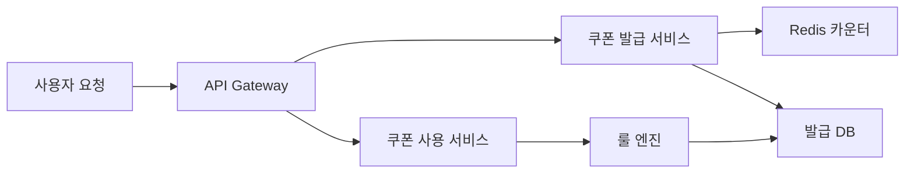

> **한 줄 요약**: 쿠폰 시스템의 핵심은 Redis 원자 연산으로 초과 발급을 막고, 룰 엔진으로 할인 조합을 유연하게 계산하며, 멀티 어카운트 어뷰징을 사전에 차단하는 것이다.

## 실제 문제: 선착순 쿠폰 초과 발급과 어뷰징

국내 한 대형 커머스 플랫폼이 "선착순 5만 장, 50% 할인" 쿠폰 이벤트를 열었습니다. DB의 `issued_count` 컬럼으로 카운터를 관리했는데, 수백 개의 DB 커넥션이 동시에 `49,998`이라는 값을 읽고 저마다 "아직 여유 있다"고 판단해 발급을 진행했습니다. 결과는 **6만 2천 장 발급**이었습니다.

설상가상으로 어뷰징 사용자들은 가족 명의 계정 10개로 쿠폰 10장을 챙겼습니다. 같은 IP에서 5번, 같은 핸드폰 번호에서 3번 발급이 이루어졌지만 시스템은 아무것도 감지하지 못했습니다.

쿠폰 시스템이 해결해야 할 핵심 문제:
- **초과 발급 방지**: 동시 요청 상황에서도 한도를 정확히 지키는 것
- **중복 발급 방지**: 한 사람이 동일 쿠폰을 여러 번 받지 못하게 하는 것
- **어뷰징 차단**: 멀티 계정, 자동화 봇의 쿠폰 사재기 탐지
- **유연한 할인 계산**: 정률/정액/최대 할인액 한도, 쿠폰 중복 적용 등 복잡한 규칙
- **만료 처리**: 수억 건의 쿠폰을 기한 안에 정확히 무효화하는 것

---

## 설계 의사결정 로드맵

### 결정 1: 쿠폰 발급 동시성 — DB 카운터 vs Redis DECR vs Kafka 큐

| 후보 | 장점 | 단점 | 언제 적합 |
|------|------|------|----------|
| DB 카운터 + SELECT FOR UPDATE | 구현 단순, 영구 저장 | 락 경합으로 TPS 급감, 초과 발급 위험 | 동시성 낮은 소규모 이벤트 |
| Redis DECR (원자 연산) | 경쟁 상태 없음, 인메모리 고속 | Redis 장애 시 카운터 소실 | 피크 트래픽이 높은 선착순 이벤트 |
| Kafka 큐 + 단일 소비자 | 순서 보장, 확실한 한도 제어 | 발급까지 지연 발생 | 비동기 허용, 공정성이 중요한 추첨형 |

**우리의 선택: Redis DECR + DB 후기록**
- `DECR coupon:{id}:remaining`는 Redis 단일 스레드가 원자적으로 처리하므로 동시에 100만 요청이 와도 카운터가 0 밑으로 내려가지 않는다. 발급 확정 후 비동기로 DB에 기록해 복구 기준점을 유지한다. DB SELECT FOR UPDATE 방식은 10만 TPS 환경에서 락 대기 큐가 폭발해 DB 커넥션 풀이 고갈된다.

### 결정 2: 할인 계산 엔진 — 하드코딩 vs 룰 엔진 vs DSL

| 후보 | 장점 | 단점 | 언제 적합 |
|------|------|------|----------|
| 하드코딩 if/else | 구현 빠름, 성능 최고 | 새 쿠폰 유형마다 배포 필요 | MVP, 쿠폰 유형 3가지 이하 |
| 룰 엔진 (Drools) | 조건-액션 분리, 비개발자 편집 가능 | 학습 곡선, 디버깅 어려움 | 규칙이 자주 바뀔 때 |
| JSON DSL + 인터프리터 | 배포 없이 신규 쿠폰 추가 | 인터프리터 직접 구현 | 마케팅 자동화, A/B 테스트가 잦은 커머스 |

**우리의 선택: JSON DSL + 경량 인터프리터**
- 배달의민족, 쿠팡처럼 마케팅팀이 매일 새 프로모션을 만드는 환경에서 하드코딩은 개발팀 병목이 된다. JSON으로 쿠폰 규칙을 DB에 저장하면 마케팅 콘솔에서 바로 편집하고 배포 없이 즉시 적용된다.

### 결정 3: 쿠폰 중복 적용 — 단일 적용 vs 스택형 vs 최적 조합

| 후보 | 장점 | 단점 | 언제 적합 |
|------|------|------|----------|
| 단일 적용 (1장만) | 구현 단순, 마진 보호 | 사용자 경험 나쁨 | 마진이 낮은 카테고리 |
| 스택형 (모두 적용) | 사용자 만족, 쿠폰 소진 빠름 | 역마진 위험 | 객단가 높은 패션·가전 |
| 최적 조합 자동 선택 | 사용자에게 최대 혜택 자동 제공 | 조합 폭발 (2^N 계산) | 프리미엄 서비스 |

**우리의 선택: 우선순위 기반 스택형 (최대 2장, 조합 상한 설정)**
- 쿠폰 타입(상품 쿠폰, 장바구니 쿠폰, 배송비 쿠폰)으로 나누고, 같은 타입은 1장만, 다른 타입은 중복 허용한다. `max_discount_amount`로 역마진을 방어한다.

### 결정 4: 만료/회수 — 배치 스캔 vs TTL vs 이벤트 기반

| 후보 | 장점 | 단점 | 언제 적합 |
|------|------|------|----------|
| 배치 스캔 (매일 자정) | 구현 단순 | 만료 즉시성 없음, 대용량 스캔 시 DB 부하 | 소량 쿠폰 |
| Redis TTL | 자동 만료 | 영구 기록 없음 | 캐시 레이어 쿠폰 상태에만 적합 |
| 이벤트 기반 (Kafka + 스케줄러) | 정확한 시각 만료, DB 부하 분산 | 구현 복잡도 | 시각 정밀도가 중요한 한정 이벤트 |

**우리의 선택: 이벤트 기반 만료 + 발급 시 인덱스 등록**
- 쿠폰 발급 시 만료 시각 기준 파티셔닝된 `expiry_queue` 테이블에 등록하고, 스케줄러가 1분마다 소량씩 읽어 `EXPIRED`로 전환한다. 쿠폰 10억 건이 쌓이면 전체 풀 스캔 배치는 수십 분간 DB를 쓰기 잠금으로 만든다.

---

## 1. 요구사항 분석 및 규모 추정

### 기능 요구사항

1. **쿠폰 생성**: 관리자가 캠페인 생성 (발급 한도, 유효기간, 할인 조건 정의)
2. **쿠폰 발급**: 선착순, 자동 지급, 코드 입력 방식
3. **쿠폰 사용**: 주문 시 쿠폰 적용 및 할인 금액 계산
4. **만료/회수**: 기한 초과 자동 무효화, 주문 취소 시 쿠폰 복원
5. **어뷰징 탐지**: 멀티 계정 사재기, 자동화 봇 감지 및 차단

### 비기능 요구사항

- **정확성**: 발급 한도 초과 0건 허용
- **낮은 지연**: 쿠폰 발급 p99 < 200ms, 할인 계산 p99 < 50ms
- **확장성**: 선착순 이벤트 시 초당 50,000 발급 요청 처리

### 규모 추정

| 항목 | 수치 |
|------|------|
| 일 활성 사용자 | 500만 명 |
| 일 쿠폰 발급 건수 | 200만 건 |
| 이벤트 피크 TPS | 50,000 req/s |
| 쿠폰 보유량 (총) | 5억 건 |
| 할인 계산 QPS | 30,000 |

---

## 2. 고수준 아키텍처

쿠폰 시스템은 놀이공원 입장권 발급소에 비유할 수 있습니다. 입장권 개수가 정해져 있고(한도), 한 명이 두 장 받으면 안 되며(중복 방지), 당일권은 자정이 지나면 무효(만료)입니다.



- **API Gateway**: 요청 인증, 사용자당 발급 빈도 Rate Limiting
- **쿠폰 발급 서비스**: Redis DECR로 카운터 원자 감소, 성공 시 발급 이벤트 발행
- **Redis 카운터**: 단일 스레드 원자 연산으로 경쟁 상태 원천 차단
- **룰 엔진**: JSON DSL 기반 할인 조건 평가. 배포 없이 즉시 적용
- **발급 DB**: 발급 내역 영구 저장. Redis 장애 시 복구 기준점

---

## 3. 핵심 컴포넌트 상세 설계

### 3-1. Redis DECR + Lua 스크립트로 원자적 발급

"잔여 수량 확인 → 감소 → 중복 발급 확인"처럼 여러 Redis 명령을 연속 실행하면 그 사이에 다른 요청이 끼어들 수 있습니다. Lua 스크립트는 Redis 서버에서 인터럽트 없이 실행되므로 세 작업 전체가 하나의 원자 단위가 됩니다.

```java
private static final String ISSUE_SCRIPT = """
    local userId = ARGV[1]
    local memberKey = KEYS[1]   -- SET: 발급받은 사용자 집합
    local countKey  = KEYS[2]   -- STRING: 잔여 수량

    if redis.call('SISMEMBER', memberKey, userId) == 1 then
        return -1  -- 중복 발급
    end

    local remaining = tonumber(redis.call('GET', countKey))
    if remaining == nil or remaining <= 0 then
        return 0   -- 재고 소진
    end

    redis.call('DECR', countKey)
    redis.call('SADD', memberKey, userId)
    return 1  -- 발급 성공
    """;

public IssueResult issueCoupon(Long userId, Long couponId) {
    Long result = redisTemplate.execute(
        new DefaultRedisScript<>(ISSUE_SCRIPT, Long.class),
        List.of("coupon:members:" + couponId, "coupon:remaining:" + couponId),
        String.valueOf(userId), String.valueOf(couponId)
    );

    if (result == null || result == 0) return IssueResult.SOLD_OUT;
    if (result == -1) return IssueResult.DUPLICATE;

    eventPublisher.publishEvent(new CouponIssuedEvent(userId, couponId));
    return IssueResult.SUCCESS;
}
```

### 3-2. JSON DSL 기반 룰 엔진

쿠폰 규칙을 코드가 아닌 데이터로 표현합니다. DB에 저장하면 서버 재시작 없이 즉시 적용됩니다.

```json
{
  "couponId": "CP_2026_SUMMER",
  "discountType": "PERCENT",
  "discountValue": 20,
  "maxDiscountAmount": 10000,
  "minOrderAmount": 30000,
  "conditions": [
    { "type": "CATEGORY", "operator": "IN", "values": ["패션", "뷰티"] },
    { "type": "USER_GRADE", "operator": "IN", "values": ["NEW", "SILVER"] }
  ],
  "stackable": false,
  "stackGroup": "CART_COUPON"
}
```

```java
public DiscountResult calculate(CouponRule rule, OrderContext order) {
    for (CouponCondition condition : rule.getConditions()) {
        if (!evaluate(condition, order)) {
            return DiscountResult.notApplicable("조건 불충족: " + condition.getType());
        }
    }

    if (order.getTotalAmount() < rule.getMinOrderAmount()) {
        return DiscountResult.notApplicable("최소 주문금액 미달");
    }

    // ✅ BigDecimal — 정확한 금전 계산 (double/long 정수 나눗셈은 반올림 오류 유발)
    long discount = switch (rule.getDiscountType()) {
        case PERCENT -> {
            BigDecimal rate = BigDecimal.valueOf(rule.getDiscountValue())
                .divide(BigDecimal.valueOf(100));
            yield BigDecimal.valueOf(order.getTotalAmount()).multiply(rate)
                .setScale(0, RoundingMode.HALF_UP).longValue();
        }
        case FIXED -> rule.getDiscountValue();
    };

    return DiscountResult.success(Math.min(discount, rule.getMaxDiscountAmount()));
}
```

### 3-3. 쿠폰 스태킹 로직

같은 `stackGroup`은 1장만, 다른 그룹은 중복 허용합니다. 그룹별 최선 쿠폰만 선택하므로 쿠폰 수에 관계없이 그룹 수만큼만 계산합니다 — O(N).

```java
public long calculateStackedDiscount(List<CouponRule> coupons, OrderContext order) {
    Map<String, CouponRule> bestByGroup = new LinkedHashMap<>();

    for (CouponRule coupon : coupons) {
        DiscountResult result = discountRuleEngine.calculate(coupon, order);
        if (!result.isApplicable()) continue;

        bestByGroup.merge(coupon.getStackGroup(), coupon,
            (existing, candidate) ->
                discountRuleEngine.calculate(candidate, order).getAmount()
                > discountRuleEngine.calculate(existing, order).getAmount()
                ? candidate : existing
        );
    }

    long total = bestByGroup.values().stream()
        .mapToLong(c -> discountRuleEngine.calculate(c, order).getAmount()).sum();

    return Math.min(total, MAX_TOTAL_DISCOUNT);
}
```

### 3-4. 어뷰징 탐지 (멀티 어카운트 차단)

세 가지 시그널을 조합합니다.

```java
public AbuseCheckResult check(Long userId, String ipAddress, String deviceFingerprint, Long couponId) {
    List<String> flags = new ArrayList<>();

    // 1. 동일 IP에서 분당 발급 요청 빈도
    Long ipCount = redisTemplate.opsForValue().increment("abuse:ip:" + ipAddress + ":" + couponId);
    redisTemplate.expire("abuse:ip:" + ipAddress + ":" + couponId, Duration.ofMinutes(1));
    if (ipCount != null && ipCount > 5) flags.add("IP_BURST");

    // 2. 동일 디바이스 지문에서 다계정 시도
    redisTemplate.opsForSet().add("abuse:device:" + deviceFingerprint, String.valueOf(userId));
    Long deviceAccounts = redisTemplate.opsForSet().size("abuse:device:" + deviceFingerprint);
    if (deviceAccounts != null && deviceAccounts > 3) flags.add("DEVICE_MULTI_ACCOUNT");

    // 3. 계정 생성 후 24시간 이내 고가치 쿠폰 요청
    String createdAt = redisTemplate.opsForValue().get("user:created:" + userId);
    if (createdAt != null) {
        long ageHours = Duration.between(Instant.parse(createdAt), Instant.now()).toHours();
        if (ageHours < 24) flags.add("NEW_ACCOUNT");
    }

    return flags.isEmpty() ? AbuseCheckResult.clean() : AbuseCheckResult.suspicious(flags);
}
```

즉시 차단보다 **소프트 차단**이 효과적입니다. 의심 사용자에게 CAPTCHA를 요구하거나, 발급은 허용하되 사용 시 추가 인증을 요구합니다.

---

## 4. 장애 시나리오와 대응

### 시나리오 1: Redis 장애 — 카운터 소실

Redis 재시작 시 잔여 수량 카운터가 사라집니다.

```java
@EventListener(ApplicationReadyEvent.class)
public void restoreCounters() {
    List<ActiveCoupon> activeCoupons = couponRepository.findAllActive();
    for (ActiveCoupon coupon : activeCoupons) {
        // Redis에 키가 없을 때만 복원 (SET NX)
        redisTemplate.opsForValue().setIfAbsent(
            "coupon:remaining:" + coupon.getId(),
            String.valueOf(coupon.getRemainingCount())
        );
    }
}
```

Redis Sentinel 또는 Cluster로 단일 장애점을 제거하고, 복원 전까지 발급 API를 "일시 중단" 상태로 전환합니다.

### 시나리오 2: 발급 DB 쓰기 지연 — Redis와 DB 불일치

Redis DECR 성공 후 DB INSERT가 타임아웃되면 Redis에는 "발급됨"이지만 DB에는 없는 쿠폰이 생깁니다.

- 발급 이벤트를 Kafka에 발행하고 소비자가 DB에 기록 (at-least-once 보장)
- `(user_id, coupon_id)` UNIQUE 제약으로 멱등성 보장
- 1시간마다 배치로 Redis 발급 집합과 DB 발급 내역 대조 → 불일치 건 알림

### 시나리오 3: 선착순 이벤트 트래픽 폭발

- API Gateway에서 사용자별 Rate Limit 적용 (1초에 1번)
- 대기열(Waiting Room) 패턴: 동시 처리 가능 수를 넘으면 대기 번호표 발급
- CDN Edge에서 "이미 소진된 쿠폰" 응답 캐싱

### 시나리오 4: 쿠폰 사용 후 주문 취소 — 쿠폰 복원

Saga 보상 트랜잭션으로 쿠폰 상태를 `USED` → `RESTORED`로 복원합니다.

```java
@EventListener
@Transactional
public void onOrderCancelled(OrderCancelledEvent event) {
    if (event.getCouponId() == null) return;

    UserCoupon coupon = userCouponRepository
        .findByUserIdAndCouponId(event.getUserId(), event.getCouponId())
        .orElseThrow();

    // 어뷰징 판정 취소는 복원 금지
    if (event.getCancelReason() != CancelReason.ABUSE_DETECTED) {
        coupon.restore();
    }
}
```

---

## 5. 확장 포인트

**개인화 쿠폰 타겟팅**: 쿠폰 DSL에 `targetSegment` 조건을 추가해 사용자 세그먼트 서비스와 연동하면 "최근 30일 미구매 사용자에게만 재활성 쿠폰 자동 발급"을 코드 없이 만들 수 있습니다.

**실시간 할인 효과 분석**: Kafka로 발급/사용 이벤트를 스트리밍하고 Flink로 집계해 캠페인 ROI를 실시간으로 측정합니다.

**쿠폰 거래 방지**: 쿠폰 코드를 `HMAC-SHA256(userId + couponId + secret)`으로 생성합니다. 사용 시 서명을 검증하면 다른 사용자가 구매한 코드는 무효 처리됩니다.

---

## 면접 포인트

<details>
<summary><strong>Q. Redis DECR만 쓰면 되는데 왜 Lua 스크립트가 필요한가요?</strong></summary>

DECR 단독으로는 "수량 감소"만 원자적입니다. "중복 발급 확인 + 수량 감소 + 사용자 등록"을 세 번의 Redis 명령으로 나누면 명령 사이에 다른 요청이 끼어들 수 있습니다. Lua 스크립트는 서버에서 인터럽트 없이 실행되므로 세 작업 전체가 하나의 원자 단위가 됩니다.

</details>

<details>
<summary><strong>Q. Redis 장애 시 쿠폰이 더 발급될 수 있지 않나요?</strong></summary>

Redis 장애를 감지하면 Circuit Breaker로 발급 API를 즉시 차단합니다. 복구 후 DB에서 실제 발급 건수를 집계해 카운터를 재설정한 뒤 재개합니다. 장애 감지 → 차단까지 수 초의 공백이 있을 수 있으므로 발급 한도를 실제 목표보다 0.1% 낮게 설정하는 안전 마진 전략을 씁니다.

</details>

<details>
<summary><strong>Q. 쿠폰 스태킹에서 조합 최적화가 필요하면 어떻게 하나요?</strong></summary>

보유 쿠폰이 N장일 때 최적 조합을 찾는 완전 탐색은 O(2^N)입니다. 현실적으로는 stackGroup을 3~5개로 제한하고 그룹 내 최선 쿠폰만 선택하는 Greedy 방식으로 O(N)에 해결합니다. 더 복잡한 경우는 DP로 접근하되 쿠폰 수 상한(예: 10장)으로 연산량을 제한합니다.

</details>

<details>
<summary><strong>Q. 선착순 쿠폰에서 "내가 받았는지"를 어떻게 즉시 알려주나요?</strong></summary>

Lua 스크립트의 반환값으로 즉시 성공/실패/중복을 알 수 있으므로 폴링 없이 응답합니다. DB 후기록은 비동기라 "내 쿠폰함 조회" 시 수 초 지연이 있을 수 있습니다. Redis에 사용자 발급 내역 캐시를 두고 DB 동기화 전까지 Redis를 소스 오브 트루스로 사용합니다.

</details>

<details>
<summary><strong>Q. 계정을 새로 만들어 쿠폰을 또 받으면 어떻게 막나요?</strong></summary>

계정 기준 외에 디바이스 지문, CI(주민번호 기반 해시), 핸드폰 번호 인증 이력을 교차 확인합니다. 고가치 쿠폰은 본인 인증 완료 계정에만 발급하는 것이 근본적 해결책입니다. 토스와 카카오페이가 고액 혜택 이벤트에 반드시 CI 검증을 붙이는 이유가 여기에 있습니다.

</details>
