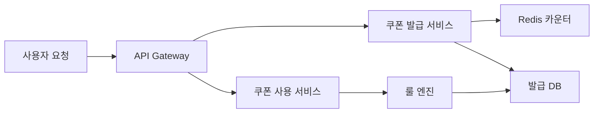

> **한 줄 요약**: 쿠폰 시스템의 핵심은 Redis 원자 연산으로 초과 발급을 막고, 룰 엔진으로 할인 조합을 유연하게 계산하며, 멀티 어카운트 어뷰징을 사전에 차단하는 것이다.

## 실제 문제: 선착순 쿠폰 초과 발급과 어뷰징

2021년 국내 한 대형 커머스 플랫폼이 "선착순 5만 장, 50% 할인" 쿠폰 이벤트를 열었습니다. 오전 10시 정각 이벤트가 시작되자 트래픽이 순식간에 평소의 20배로 치솟았습니다. 담당 엔지니어는 DB의 `issued_count` 컬럼에 `UPDATE ... SET issued_count = issued_count + 1 WHERE issued_count < 50000`으로 카운터를 관리했습니다. 결과는 어떻게 됐을까요? **쿠폰은 6만 2천 장이 발급됐고**, 회사는 초과분의 할인액을 전부 손실로 떠안았습니다.

원인은 단순했습니다. 수백 개의 DB 커넥션이 동시에 `issued_count`를 읽고 `49,998`이라는 값을 확인한 뒤, 저마다 "아직 여유 있다"고 판단하고 발급을 진행한 것입니다. 경쟁 상태(Race Condition)가 카운터 제한을 무력화했습니다.

설상가상으로 어뷰징 사용자들은 **가족 명의 계정 10개**를 미리 만들어 두고 쿠폰 10장을 챙겼습니다. 같은 IP에서 5번, 같은 핸드폰 번호에서 3번 발급이 이루어졌지만 시스템은 아무것도 감지하지 못했습니다.

쿠폰 시스템이 해결해야 할 핵심 문제:
- **초과 발급 방지**: 10만 장 한도를 동시 요청 상황에서도 정확히 지키는 것
- **중복 발급 방지**: 한 사람이 동일 쿠폰을 여러 번 받지 못하게 하는 것
- **어뷰징 차단**: 멀티 계정, 자동화 봇의 쿠폰 사재기 탐지
- **유연한 할인 계산**: 정률/정액/최대 할인액 한도, 쿠폰 중복 적용 등 복잡한 규칙
- **만료 처리**: 수억 건의 쿠폰을 기한 안에 정확히 무효화하는 것

---

## 설계 의사결정 로드맵

쿠폰 시스템 설계에서 순서대로 답해야 할 핵심 결정 4가지입니다. 각 결정에서 "왜 이 선택인가"를 명확히 하지 않으면 면접관의 "그냥 DB 트랜잭션 하나로 처리하면 안 되나요?" 라는 질문에 무너집니다.

### 결정 1: 쿠폰 발급 동시성 — DB 카운터 vs Redis DECR vs Kafka 큐

**문제**: 이벤트 시작과 동시에 10만 명이 동시 요청을 보낼 때, 어떻게 정확히 10만 장만 발급하는가?

| 후보 | 장점 | 단점 | 언제 적합 |
|------|------|------|----------|
| DB 카운터 + SELECT FOR UPDATE | 구현 단순, 영구 저장 | 락 경합으로 TPS 급감, 초과 발급 위험 | 동시성 낮은 소규모 이벤트 |
| Redis DECR (원자 연산) | 단일 스레드 연산으로 경쟁 상태 없음, 인메모리 고속 | Redis 장애 시 카운터 소실, DB와 동기화 필요 | 피크 트래픽이 높은 선착순 이벤트 |
| Kafka 큐 + 단일 소비자 | 순서 보장, 확실한 한도 제어 | 발급까지 지연 발생(수 초), 실시간 피드백 어려움 | 비동기 허용, 공정성이 중요한 추첨형 |

**우리의 선택: Redis DECR + DB 후기록**
- 이유: `DECR coupon:{id}:remaining`는 Redis 단일 스레드가 원자적으로 처리하므로 동시에 100만 요청이 와도 카운터가 0 밑으로 내려가지 않습니다. 발급이 확정된 후 비동기로 DB에 기록해 Redis 장애 시 복구 기준점을 유지합니다.
- 안 하면: DB SELECT FOR UPDATE 방식은 10만 TPS 환경에서 락 대기 큐가 폭발하여 평균 응답시간이 수십 초로 늘어나고 DB 커넥션 풀이 고갈됩니다. 쿠폰 이벤트가 전체 서비스 장애의 도화선이 됩니다.

### 결정 2: 할인 계산 엔진 — 하드코딩 vs 룰 엔진 vs DSL

**문제**: "특정 카테고리에서만, 최소 주문 3만 원 이상, 최대 1만 원까지 20% 할인" 같은 복잡한 조건을 어떻게 코드로 관리하는가?

| 후보 | 장점 | 단점 | 언제 적합 |
|------|------|------|----------|
| 하드코딩 if/else | 구현 빠름, 성능 최고 | 새 쿠폰 유형마다 배포 필요, 마케팅팀이 직접 수정 불가 | MVP, 쿠폰 유형 3가지 이하 |
| 룰 엔진 (Drools, Easy Rules) | 조건-액션 분리, 비개발자도 규칙 편집 가능 | 학습 곡선, 디버깅 어려움 | 규칙이 자주 바뀌고 종류가 많을 때 |
| JSON DSL + 인터프리터 | DB에 규칙 저장 → 배포 없이 신규 쿠폰 추가, 사내 툴 연동 쉬움 | 인터프리터 직접 구현, 복잡한 조건 표현 한계 | 마케팅 자동화, A/B 테스트가 잦은 커머스 |

**우리의 선택: JSON DSL + 경량 인터프리터**
- 이유: 배달의민족, 쿠팡처럼 마케팅팀이 매일 새 프로모션을 만드는 환경에서 하드코딩은 개발팀 병목을 만듭니다. JSON으로 쿠폰 규칙을 DB에 저장하면 마케팅 콘솔에서 바로 편집하고 배포 없이 즉시 적용됩니다.
- 안 하면: "이번 어린이날 이벤트 쿠폰 조건 변경해 주세요"가 배포 티켓으로 들어오고, 개발자가 `if (category == "KIDS" && orderAmount >= 15000)` 한 줄을 위해 코드 리뷰 + 스테이징 + 배포 파이프라인을 돌려야 합니다.

### 결정 3: 쿠폰 중복 적용 — 단일 적용 vs 스택형 vs 최적 조합

**문제**: 사용자가 쿠폰 A(10% 할인)와 쿠폰 B(3,000원 할인)를 동시에 갖고 있을 때, 어떻게 처리하는가?

| 후보 | 장점 | 단점 | 언제 적합 |
|------|------|------|----------|
| 단일 적용 (1장만) | 구현 단순, 마진 보호 쉬움 | 사용자 경험 나쁨, 쿠폰 소진 느림 | 마진이 낮은 카테고리 |
| 스택형 (모두 적용) | 사용자 만족, 쿠폰 소진 빠름 | 복수 할인이 겹치면 역마진 위험 | 객단가 높은 패션·가전 |
| 최적 조합 자동 선택 | 사용자에게 최대 혜택 자동 제공 | 조합 폭발(N개 쿠폰 → 2^N 계산) | 프리미엄 서비스, 충성 고객 전략 |

**우리의 선택: 우선순위 기반 스택형 (최대 2장, 조합 상한 설정)**
- 이유: 쿠폰을 쿠폰 타입(상품 쿠폰, 장바구니 쿠폰, 배송비 쿠폰)으로 나누고, 같은 타입은 1장만, 다른 타입은 중복 허용합니다. 각 쿠폰에 `stackable: true/false` 속성을 두고 최대 할인 상한(`max_discount_amount`)으로 역마진을 방어합니다.
- 안 하면: "상품 쿠폰 30% + 장바구니 쿠폰 20% + 멤버십 10% = 60% 할인"이 가능해지면서 원가 이하 판매가 발생합니다. 실제로 한 플랫폼은 이 버그로 하루 만에 수억 원 손실을 봤습니다.

### 결정 4: 만료/회수 — 배치 스캔 vs TTL vs 이벤트 기반

**문제**: 발급된 쿠폰 1억 건을 어떻게 기한 안에 만료시키는가?

| 후보 | 장점 | 단점 | 언제 적합 |
|------|------|------|----------|
| 배치 스캔 (매일 자정) | 구현 단순 | 만료 즉시성 없음, 대용량 스캔 시 DB 부하 | 소량 쿠폰, 일 단위 만료로 충분한 경우 |
| Redis TTL | 자동 만료, 추가 작업 없음 | 영구 기록 없음, Redis 재시작 시 소실 | 캐시 레이어 쿠폰 상태에만 적합 |
| 이벤트 기반 (Kafka + 스케줄러) | 정확한 시각 만료, DB 부하 분산 | 구현 복잡도, 파티션 설계 필요 | 시각 정밀도가 중요한 한정 이벤트 |

**우리의 선택: 이벤트 기반 만료 + 발급 시 인덱스 등록**
- 이유: 쿠폰 발급 시 만료 시각 기준 파티셔닝된 `expiry_queue` 테이블에 등록합니다. 스케줄러가 1분마다 `WHERE expires_at <= NOW()`를 소량씩 읽어 상태를 `EXPIRED`로 전환합니다. 전체 쿠폰 테이블 풀 스캔 없이 만료 처리가 가능합니다.
- 안 하면: 쿠폰 10억 건이 쌓인 상황에서 매일 자정 배치가 `UPDATE coupons SET status='EXPIRED' WHERE expires_at < NOW()`를 실행하면 수십 분간 DB가 쓰기 잠금으로 몸살을 앓고, 다음 날 새벽 주문이 쿠폰 조회 타임아웃으로 실패합니다.

---

## 1. 요구사항 분석 및 규모 추정

### 기능 요구사항

1. **쿠폰 생성**: 관리자가 쿠폰 캠페인을 생성 (발급 한도, 유효기간, 할인 조건 정의)
2. **쿠폰 발급**: 사용자가 쿠폰 수령 (선착순, 자동 지급, 코드 입력 방식)
3. **쿠폰 사용**: 주문 시 쿠폰 적용 및 할인 금액 계산
4. **쿠폰 만료/회수**: 기한 초과 쿠폰 자동 무효화, 주문 취소 시 쿠폰 복원
5. **어뷰징 탐지**: 멀티 계정 사재기, 자동화 봇 요청 감지 및 차단

### 비기능 요구사항

- **정확성**: 발급 한도 초과 0건 허용 (금전 손실 직결)
- **고가용성**: 이벤트 피크 시 99.9% 가용성
- **낮은 지연**: 쿠폰 발급 p99 < 200ms, 할인 계산 p99 < 50ms
- **확장성**: 선착순 이벤트 시 초당 50,000 발급 요청 처리

### 규모 추정

| 항목 | 수치 | 근거 |
|------|------|------|
| 일 활성 사용자 | 500만 명 | 국내 중대형 커머스 기준 |
| 일 쿠폰 발급 건수 | 200만 건 | DAU의 40% 수령 |
| 이벤트 피크 TPS | 50,000 req/s | 선착순 10만 장, 60초 내 소진 가정 |
| 쿠폰 보유량 (총) | 5억 건 | 1인 평균 100장, 5년 누적 |
| 할인 계산 QPS | 30,000 | 주문 흐름의 체크아웃 단계 |

---

## 2. 고수준 아키텍처

쿠폰 시스템은 **놀이공원 입장권 발급소**에 비유할 수 있습니다. 입장권은 개수가 정해져 있고(한도), 한 명이 두 장 받으면 안 되며(중복 방지), 당일권은 자정이 지나면 무효(만료)입니다. 그리고 줄을 서지 않고 새치기하거나 가짜 신분증을 쓰는 사람(어뷰저)을 걸러내야 합니다.



**각 컴포넌트 역할:**

- **API Gateway**: 요청 인증, 사용자당 발급 요청 빈도 제한 (Rate Limiting). "1분에 3번 초과 요청은 자동으로 봇 의심"
- **쿠폰 발급 서비스**: Redis DECR로 카운터 원자 감소, 성공 시 발급 이벤트 발행
- **쿠폰 사용 서비스**: 쿠폰 유효성 검증 → 룰 엔진 할인 계산 → 사용 처리
- **Redis 카운터**: 쿠폰별 잔여 수량 관리. 단일 스레드 원자 연산으로 경쟁 상태 원천 차단
- **룰 엔진**: JSON DSL 기반 할인 조건 평가. 배포 없이 신규 프로모션 즉시 적용
- **발급 DB**: 발급 내역 영구 저장. Redis 장애 시 복구 기준점

---

## 3. 핵심 컴포넌트 상세 설계

### 3-1. Redis DECR + Lua 스크립트로 원자적 발급

Redis `DECR` 명령은 단일 스레드에서 실행되므로 경쟁 상태가 없습니다. 그러나 "잔여 수량 확인 → 감소 → 중복 발급 확인"처럼 여러 Redis 명령을 연속 실행할 때는 그 사이에 다른 요청이 끼어들 수 있습니다. **Lua 스크립트**는 Redis 서버에서 원자적으로 실행되므로 이 문제를 해결합니다.

```java
// CouponIssueService.java
@Service
@RequiredArgsConstructor
public class CouponIssueService {

    private final RedisTemplate<String, String> redisTemplate;
    private final CouponIssueRepository issueRepository;
    private final ApplicationEventPublisher eventPublisher;

    // Lua 스크립트: 중복 확인 + 잔여 수량 감소를 원자적으로 처리
    private static final String ISSUE_SCRIPT = """
        local userId = ARGV[1]
        local couponId = ARGV[2]
        local memberKey = KEYS[1]   -- SET: 발급받은 사용자 집합
        local countKey  = KEYS[2]   -- STRING: 잔여 수량

        -- 이미 발급받았는지 확인
        if redis.call('SISMEMBER', memberKey, userId) == 1 then
            return -1  -- 중복 발급
        end

        -- 잔여 수량 확인
        local remaining = tonumber(redis.call('GET', countKey))
        if remaining == nil or remaining <= 0 then
            return 0   -- 재고 소진
        end

        -- 원자적으로 처리: 수량 감소 + 사용자 등록
        redis.call('DECR', countKey)
        redis.call('SADD', memberKey, userId)
        return 1  -- 발급 성공
        """;

    public IssueResult issueCoupon(Long userId, Long couponId) {
        String memberKey  = "coupon:members:" + couponId;
        String countKey   = "coupon:remaining:" + couponId;

        Long result = redisTemplate.execute(
            new DefaultRedisScript<>(ISSUE_SCRIPT, Long.class),
            List.of(memberKey, countKey),
            String.valueOf(userId),
            String.valueOf(couponId)
        );

        if (result == null || result == 0) {
            return IssueResult.SOLD_OUT;
        }
        if (result == -1) {
            return IssueResult.DUPLICATE;
        }

        // 발급 성공 → 비동기로 DB 저장
        eventPublisher.publishEvent(new CouponIssuedEvent(userId, couponId));
        return IssueResult.SUCCESS;
    }
}
```

**왜 Lua인가?** 잔여 수량 확인(`GET`)과 감소(`DECR`), 사용자 등록(`SADD`)을 분리하면 두 요청이 동시에 "잔여 1장"을 확인하고 각자 발급을 진행해 2장이 나가는 극한 시나리오가 생깁니다. Lua는 Redis 서버에서 인터럽트 없이 실행되므로 이 시나리오가 물리적으로 불가능합니다.

### 3-2. JSON DSL 기반 룰 엔진

쿠폰 규칙을 코드가 아닌 데이터로 표현합니다. 마케팅 콘솔에서 규칙을 편집하면 DB에 저장되고, 서버 재시작 없이 즉시 적용됩니다.

```json
{
  "couponId": "CP_2026_SUMMER",
  "name": "쿠팡 여름 웰컴딜",
  "discountType": "PERCENT",
  "discountValue": 20,
  "maxDiscountAmount": 10000,
  "minOrderAmount": 30000,
  "conditions": [
    { "type": "CATEGORY", "operator": "IN", "values": ["패션", "뷰티"] },
    { "type": "USER_GRADE", "operator": "IN", "values": ["NEW", "SILVER"] },
    { "type": "ORDER_COUNT", "operator": "LTE", "value": 3 }
  ],
  "stackable": false,
  "stackGroup": "CART_COUPON"
}
```

```java
// DiscountRuleEngine.java
@Component
public class DiscountRuleEngine {

    public DiscountResult calculate(CouponRule rule, OrderContext order) {
        // 조건 검증
        for (CouponCondition condition : rule.getConditions()) {
            if (!evaluate(condition, order)) {
                return DiscountResult.notApplicable("조건 불충족: " + condition.getType());
            }
        }

        // 최소 주문 금액 검증
        if (order.getTotalAmount() < rule.getMinOrderAmount()) {
            return DiscountResult.notApplicable("최소 주문금액 미달");
        }

        // 할인 금액 계산
        long discount = switch (rule.getDiscountType()) {
            case PERCENT -> order.getTotalAmount() * rule.getDiscountValue() / 100;
            case FIXED   -> rule.getDiscountValue();
        };

        // 최대 할인 한도 적용 (역마진 방어)
        discount = Math.min(discount, rule.getMaxDiscountAmount());

        return DiscountResult.success(discount);
    }

    private boolean evaluate(CouponCondition condition, OrderContext order) {
        return switch (condition.getType()) {
            case CATEGORY   -> order.getCategories().stream()
                                   .anyMatch(c -> condition.getValues().contains(c));
            case USER_GRADE -> condition.getValues().contains(order.getUserGrade());
            case ORDER_COUNT -> order.getPastOrderCount() <= condition.getLteValue();
            default -> false;
        };
    }
}
```

### 3-3. 쿠폰 스태킹 로직

쿠폰 중복 적용 규칙: **같은 `stackGroup`은 1장만, 다른 그룹은 중복 허용**. 최종 할인 상한도 적용합니다.

```java
// CouponStackingService.java
@Service
public class CouponStackingService {

    private static final long MAX_TOTAL_DISCOUNT = 50_000L; // 최대 할인 5만 원

    public long calculateStackedDiscount(List<CouponRule> coupons, OrderContext order) {
        // stackGroup별로 가장 유리한 쿠폰 1장만 선택
        Map<String, CouponRule> bestByGroup = new LinkedHashMap<>();

        for (CouponRule coupon : coupons) {
            DiscountResult result = discountRuleEngine.calculate(coupon, order);
            if (!result.isApplicable()) continue;

            String group = coupon.getStackGroup(); // 예: "CART_COUPON", "PRODUCT_COUPON"
            bestByGroup.merge(group, coupon,
                (existing, candidate) ->
                    discountRuleEngine.calculate(candidate, order).getAmount()
                    > discountRuleEngine.calculate(existing, order).getAmount()
                    ? candidate : existing
            );
        }

        // 그룹 간 합산 + 전체 상한 적용
        long total = bestByGroup.values().stream()
            .mapToLong(c -> discountRuleEngine.calculate(c, order).getAmount())
            .sum();

        return Math.min(total, MAX_TOTAL_DISCOUNT);
    }
}
```

**극한 시나리오**: 사용자가 쿠폰 50장을 보유한 경우. 그룹별 최선 선택이므로 쿠폰 수에 관계없이 그룹 수만큼만 계산하면 됩니다. 그룹이 5개라면 최대 5번 연산 — O(N)으로 충분합니다.

### 3-4. 어뷰징 탐지 (멀티 어카운트 차단)

토스 선착순 이벤트에서 쿠폰 봇을 차단하는 방식은 세 가지 시그널을 조합합니다.

```java
// AbuseDetectionService.java
@Service
@RequiredArgsConstructor
public class AbuseDetectionService {

    private final RedisTemplate<String, String> redisTemplate;

    public AbuseCheckResult check(Long userId, String ipAddress,
                                   String deviceFingerprint, Long couponId) {
        List<String> flags = new ArrayList<>();

        // 1. 동일 IP에서 분당 발급 요청 빈도 확인
        String ipKey = "abuse:ip:" + ipAddress + ":" + couponId;
        Long ipCount = redisTemplate.opsForValue().increment(ipKey);
        redisTemplate.expire(ipKey, Duration.ofMinutes(1));
        if (ipCount != null && ipCount > 5) {
            flags.add("IP_BURST: " + ipCount + "req/min");
        }

        // 2. 동일 디바이스 지문에서 다계정 시도
        String deviceKey = "abuse:device:" + deviceFingerprint;
        redisTemplate.opsForSet().add(deviceKey, String.valueOf(userId));
        redisTemplate.expire(deviceKey, Duration.ofHours(24));
        Long deviceAccounts = redisTemplate.opsForSet().size(deviceKey);
        if (deviceAccounts != null && deviceAccounts > 3) {
            flags.add("DEVICE_MULTI_ACCOUNT: " + deviceAccounts + "accounts");
        }

        // 3. 계정 생성 후 24시간 이내 고가치 쿠폰 요청
        String userAgeKey = "user:created:" + userId;
        String createdAt = redisTemplate.opsForValue().get(userAgeKey);
        if (createdAt != null) {
            long ageHours = Duration.between(
                Instant.parse(createdAt), Instant.now()).toHours();
            if (ageHours < 24) {
                flags.add("NEW_ACCOUNT: " + ageHours + "h old");
            }
        }

        if (!flags.isEmpty()) {
            log.warn("어뷰징 의심 userId={}, ip={}, flags={}", userId, ipAddress, flags);
            return AbuseCheckResult.suspicious(flags);
        }
        return AbuseCheckResult.clean();
    }
}
```

**어뷰징 대응 전략:** 즉시 차단보다 **소프트 차단**이 효과적입니다. 의심 사용자에게는 CAPTCHA를 요구하거나, 발급은 허용하되 사용 시 추가 인증을 요구합니다. 봇 운영자는 차단 신호를 탐지해 전략을 바꾸므로 즉시 차단은 진화를 유도합니다.

---

## 4. 장애 시나리오와 대응

### 시나리오 1: Redis 장애 — 카운터 소실

**발생**: Redis 노드가 OOM으로 재시작되면 쿠폰 잔여 수량 카운터가 사라집니다.

**대응:**
1. Redis 시작 시 DB의 `(total_count - issued_count)`를 읽어 카운터 자동 복원
2. Redis Sentinel 또는 Cluster로 단일 장애점 제거
3. 카운터 복원 전까지 발급 API를 "일시 중단" 상태로 전환 (재고 없음 응답)

```java
@EventListener(ApplicationReadyEvent.class)
public void restoreCounters() {
    List<ActiveCoupon> activeCoupons = couponRepository.findAllActive();
    for (ActiveCoupon coupon : activeCoupons) {
        String key = "coupon:remaining:" + coupon.getId();
        // Redis에 키가 없을 때만 복원 (SET NX)
        redisTemplate.opsForValue().setIfAbsent(
            key,
            String.valueOf(coupon.getRemainingCount())
        );
    }
    log.info("쿠폰 카운터 복원 완료: {}개", activeCoupons.size());
}
```

### 시나리오 2: 발급 DB 쓰기 지연 — Redis와 DB 불일치

**발생**: Redis DECR 성공 후 DB INSERT가 타임아웃 → Redis에는 "발급됨"이지만 DB에는 없는 쿠폰이 생깁니다.

**대응:**
- 발급 이벤트를 Kafka에 발행하고, 소비자가 DB에 기록 (at-least-once 보장)
- 소비자가 DB INSERT 실패 시 재시도 (멱등성 보장을 위해 `(user_id, coupon_id)` UNIQUE 제약)
- 정기 배치(1시간마다)로 Redis 발급 집합과 DB 발급 내역 대조 → 불일치 건 알림

### 시나리오 3: 선착순 이벤트 트래픽 폭발

**발생**: 배달의민족 치킨 무료 이벤트처럼 정각 10시에 수십만 req/s가 쏟아집니다.

**대응:**
- API Gateway에서 쿠폰 발급 엔드포인트에 사용자별 Rate Limit 적용 (1초에 1번)
- 대기열(Waiting Room) 패턴: 동시 처리 가능 수를 넘으면 대기 번호표 발급, 순서대로 입장
- CDN Edge에서 "이미 소진된 쿠폰" 응답 캐싱 (소진 후에는 오리진 트래픽 0으로)

### 시나리오 4: 쿠폰 사용 후 주문 취소 — 쿠폰 복원

**발생**: 쿠폰 사용 → 결제 완료 → 주문 취소 시 쿠폰을 어떻게 돌려주는가?

**대응:** Saga 보상 트랜잭션으로 쿠폰 상태를 `USED` → `RESTORED`로 복원합니다.

```java
// OrderCancelledEventHandler.java
@EventListener
@Transactional
public void onOrderCancelled(OrderCancelledEvent event) {
    if (event.getCouponId() == null) return;

    UserCoupon coupon = userCouponRepository
        .findByUserIdAndCouponId(event.getUserId(), event.getCouponId())
        .orElseThrow();

    // 취소 사유가 단순 변심이면 복원, 어뷰징 판정이면 복원 금지
    if (event.getCancelReason() != CancelReason.ABUSE_DETECTED) {
        coupon.restore(); // USED → AVAILABLE
        log.info("쿠폰 복원: userId={}, couponId={}", event.getUserId(), event.getCouponId());
    }
}
```

---

## 5. 확장 포인트

### 개인화 쿠폰 타겟팅

단순 선착순을 넘어 "최근 30일 미구매 사용자에게만 재활성 쿠폰 자동 발급"처럼 조건 기반 자동 발급이 필요해집니다. 쿠폰 DSL에 `targetSegment` 조건을 추가하고, 사용자 세그먼트 서비스와 연동하면 마케팅팀이 코드 없이 타겟팅 쿠폰을 만들 수 있습니다.

### 실시간 할인 효과 분석

쿠폰 발급 → 사용까지 사용 전환율, 평균 주문 금액 증가분, 캠페인 ROI를 실시간으로 측정합니다. Kafka로 발급/사용 이벤트를 스트리밍하고, Flink로 집계하여 마케팅 대시보드에 표시합니다.

### 글로벌 확장: 다통화 쿠폰

정액 할인(`FIXED`) 쿠폰은 통화 단위를 명시해야 합니다. 쿠폰 DSL에 `currency: "KRW"` 필드를 추가하고, 계산 시 주문 통화와 불일치하면 환율 변환하거나 적용 거부합니다.

### 쿠폰 거래 방지

발급된 쿠폰이 외부 거래 사이트에서 팔리는 것을 막기 위해 쿠폰 코드를 `HMAC-SHA256(userId + couponId + secret)`으로 생성합니다. 사용 시 서명을 검증하면 다른 사용자가 구매한 코드는 무효 처리됩니다.

---

## 면접 포인트

**Q: Redis DECR만 쓰면 되는데 왜 Lua 스크립트가 필요한가요?**
> DECR 단독으로는 "수량 감소"만 원자적입니다. "중복 발급 확인 + 수량 감소 + 사용자 등록"을 세 번의 Redis 명령으로 나누면 명령 사이에 다른 요청이 끼어들 수 있습니다. Lua 스크립트는 서버에서 인터럽트 없이 실행되므로 세 작업 전체가 하나의 원자 단위가 됩니다.

**Q: Redis 장애 시 쿠폰이 더 발급될 수 있지 않나요?**
> Redis 장애를 감지하면 발급 API를 Circuit Breaker로 즉시 차단합니다. 복구 후 DB에서 실제 발급 건수를 집계해 카운터를 재설정한 뒤 재개합니다. 장애 감지 → 차단까지 수 초의 공백이 있을 수 있으므로, 발급 한도를 실제 목표보다 0.1% 낮게 설정하는 안전 마진 전략을 씁니다.

**Q: 쿠폰 스태킹에서 조합 최적화가 필요하면 어떻게 하나요?**
> 보유 쿠폰이 N장일 때 최적 조합을 찾는 완전 탐색은 O(2^N)입니다. 현실적으로는 stackGroup을 3~5개로 제한하고, 그룹 내 최선 쿠폰만 선택하는 Greedy 방식으로 O(N)에 해결합니다. 더 복잡한 경우는 DP로 접근하되 쿠폰 수 상한(예: 10장)으로 연산량을 제한합니다.

**Q: 선착순 쿠폰 이벤트에서 대기 없이 "내가 받았는지"를 어떻게 즉시 알려주나요?**
> Lua 스크립트의 반환값으로 즉시 성공/실패/중복을 알 수 있으므로 폴링 없이 응답합니다. 단, DB 후기록은 비동기라 "내 쿠폰함 조회" 시 수초 지연이 있을 수 있습니다. 이를 위해 Redis에 사용자 발급 내역 캐시를 두고 DB 동기화 전까지 Redis를 소스 오브 트루스로 사용합니다.

**Q: 동일 이벤트에서 계정을 새로 만들어 쿠폰을 또 받으면 어떻게 막나요?**
> 계정 기준 외에 디바이스 지문(Device Fingerprint), CI(연계 정보, 주민번호 기반 해시), 핸드폰 번호 인증 이력을 교차 확인합니다. 고가치 쿠폰은 본인 인증 완료 계정에만 발급하는 것이 근본적 해결책입니다. 토스와 카카오페이가 고액 혜택 이벤트에 반드시 CI 검증을 붙이는 이유가 여기에 있습니다.
