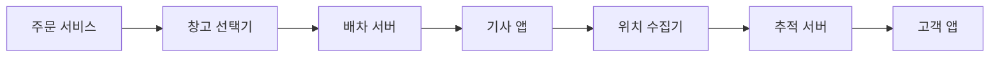
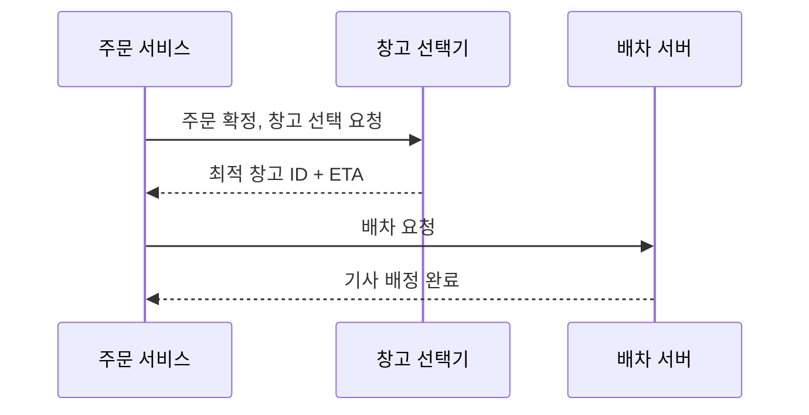
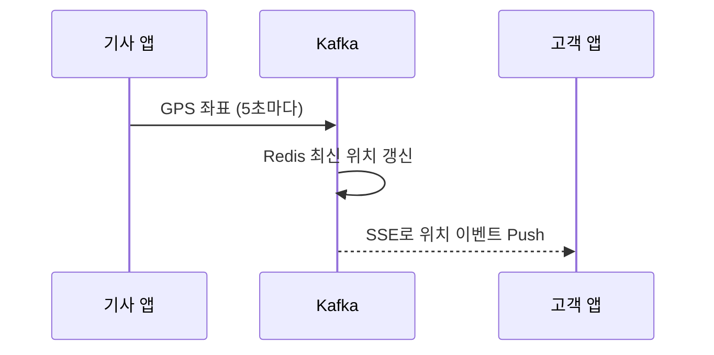

> **한 줄 요약**: 배송 시스템의 핵심은 실시간 위치 추적으로 고객 불안을 제거하고, 최근접 창고 선택으로 리드타임을 단축하며, 이벤트 소싱으로 배송 상태 이력을 완전하게 보존하는 것입니다.

## 실제 문제: 쿠팡 로켓배송과 마켓컬리가 만들어낸 배송 혁신

2014년 쿠팡이 로켓배송을 출시할 때 업계 표준은 택배사에 물건을 넘기면 2~3일 후 배달되는 구조였습니다. 마켓컬리는 밤 11시 전에 주문하면 다음 날 오전 7시 전에 신선식품이 현관 앞에 놓이는 새벽 배송을 시작했습니다. 냉장·냉동 상품을 새벽에 배달하려면 온도 관리, 경로 최적화, 기사 배차가 초 단위로 맞아 떨어져야 합니다.

이 두 서비스가 해결한 핵심 문제:
- **리드타임 단축**: 창고에서 고객 집까지 걸리는 시간을 어떻게 최소화하는가
- **실시간 추적**: "내 택배 지금 어디 있지?"라는 고객의 불안을 어떻게 해소하는가
- **배차 최적화**: 수백 명의 배송기사에게 수천 개의 주문을 어떻게 효율적으로 배정하는가
- **창고 선택**: 전국 수십 개 물류센터 중 어느 창고에서 출발해야 가장 빠른가

---

## 설계 의사결정 로드맵

### 결정 1: 배송 추적 — 폴링 vs 웹소켓 vs SSE

| 후보 | 장점 | 단점 | 언제 적합 |
|------|------|------|----------|
| HTTP 폴링 | 구현 단순, REST API 재사용 | 불필요한 트래픽, 최대 5초 지연 | 정확도가 낮아도 되는 배송 완료 확인 |
| 웹소켓 | 양방향 실시간, 지연 최소화 | 연결 유지 비용, 재연결 필요 | 채팅, 양방향 통신이 필요한 경우 |
| SSE (Server-Sent Events) | 서버→클라이언트 단방향 실시간, HTTP 기반 방화벽 친화적 | 클라이언트→서버 채널 별도 필요 | 위치 추적처럼 서버가 Push하는 경우 |

**우리의 선택: SSE (Server-Sent Events)**
- 배송 추적은 서버→클라이언트 단방향이다. SSE는 HTTP/2 위에서 동작해 기존 로드밸런서·방화벽 설정 변경 없이 사용 가능하고, 연결이 끊어지면 브라우저가 자동 재연결한다. 폴링을 5초마다 하는 고객이 100만 명이면 초당 20만 건의 요청이 발생하며 90%가 "변화 없음"을 응답하는 데 낭비된다.

### 결정 2: 배차 알고리즘 — 수동 배정 vs 라운드로빈 vs 최적화 엔진

| 후보 | 장점 | 단점 | 언제 적합 |
|------|------|------|----------|
| 수동 배정 | 상황 판단 가능 | 확장성 없음, 수백 건 동시 처리 불가 | 소규모 퀵서비스 |
| 라운드로빈 | 구현 단순, 공평한 분배 | 기사 위치·업무량 무시 | 배달 밀도가 균일한 경우 |
| 최적화 엔진 (VRP 기반) | 거리·업무량·시간창 동시 최적화 | 구현 복잡, 실시간 계산 비용 높음 | 당일·새벽배송처럼 시간이 핵심인 경우 |

**우리의 선택: 최적화 엔진 (단순화된 VRP)**
- 새벽배송은 오전 7시 전이라는 절대적 시간 제약이 있어 라운드로빈으로는 해결 불가. VRP는 NP-Hard라 실시간 적용이 불가능하므로 그리디 + 지역 탐색(Local Search)으로 준최적해를 1초 이내에 계산한다. 최적화 없는 배차 대비 주행 거리가 30~40% 증가한다.

### 결정 3: 창고 선택 — 고정 배정 vs 거리 기반 vs 재고+거리 최적화

| 후보 | 장점 | 단점 | 언제 적합 |
|------|------|------|----------|
| 고정 배정 (지역별 창고) | 운영 단순 | 재고 소진 시 배송 불가 | 소규모 단창고 |
| 거리 기반 최근접 창고 | 빠른 배송 보장 | 재고 미확인 시 출고 실패 | 재고가 충분한 경우 |
| 재고+거리 통합 최적화 | 재고 확인 후 최근접 창고 선택 | 여러 창고 재고 실시간 조회 필요 | 당일배송, 재고 분산 환경 |

**우리의 선택: 재고+거리 통합 최적화**
- 최근접 창고에 재고가 없으면 거리 계산이 의미 없다. 재고 조회 후 거리 가중치를 적용해 "재고 있는 창고 중 가장 가까운 곳"을 선택한다.

### 결정 4: 배송 상태 관리 — RDB 상태 컬럼 vs 이벤트 소싱 vs 상태 머신

| 후보 | 장점 | 단점 | 언제 적합 |
|------|------|------|----------|
| RDB 상태 컬럼 UPDATE | 구현 단순 | 이전 상태 이력 소실 | 상태가 2~3가지인 단순 시스템 |
| 이벤트 소싱 | 완전한 이력 보존, 감사 추적 | 최신 상태 조회 시 이벤트 재생 필요 | 법적 증거·환불 분쟁이 있는 배송 |
| 상태 머신 + RDB | 잘못된 상태 전이 방지 | 상태 정의 변경 시 코드·DB 동시 수정 | 상태 전이 규칙이 복잡한 경우 |

**우리의 선택: 이벤트 소싱 + 상태 머신 조합**
- "배송 완료" 후 고객이 분쟁을 제기하면 배송기사가 언제 어디서 배달했는지 GPS 이력까지 포함한 완전한 증거가 필요하다. 상태 머신은 "취소됨 → 배달중" 같은 잘못된 전이를 코드 레벨에서 차단한다.

---

## 1. 요구사항 분석 및 규모 추정

### 기능 요구사항

1. **주문 접수 및 창고 배정**: 주문 확정 즉시 최적 창고 선택 및 출고 지시
2. **배차 및 경로 최적화**: 배송기사에게 효율적인 순서로 배송 목록 배정
3. **실시간 위치 추적**: 배송기사 GPS를 수집하여 고객에게 실시간 노출
4. **ETA 예측**: 현재 위치, 잔여 배송 건수, 교통 상황 기반 도착 예정 시각 계산
5. **배송 상태 관리**: 집화→이동→배달중→완료의 상태 전이 기록
6. **알림 발송**: 출발, 근처 도착, 배달 완료 시 고객에게 푸시 알림

### 비기능 요구사항

- **가용성**: 99.99%
- **실시간성**: 기사 위치 갱신 후 고객 화면 반영까지 3초 이내
- **내구성**: 배송 이벤트 절대 유실 불가 (분쟁 증거)

### 규모 추정

- 일일 주문: 500만 건
- 배송기사: 5만 명
- 기사 GPS 업데이트: 5초마다 1회 → 초당 10,000건
- 고객 배송 추적 동시 접속: 최대 50만 명 (피크 시)
- 하루 위치 이벤트 저장: 10,000건/초 × 86,400초 = 약 8.64억 건

이 규모에서 단일 MySQL로 위치 데이터를 처리하는 것은 불가능합니다. 위치 데이터는 시계열 특성이 강하므로 전용 시계열 DB 또는 Redis 계층 구조가 필요합니다.

---

## 2. 고수준 아키텍처



| 컴포넌트 | 역할 |
|----------|------|
| 창고 선택기 | 재고 DB + 거리 계산으로 최적 창고 결정 |
| 배차 서버 | VRP 기반 그리디 알고리즘으로 배송 목록 배정 |
| 위치 수집기 | 기사 GPS 좌표를 Kafka로 수신, Redis에 최신 위치 저장 |
| 추적 서버 | SSE 연결 유지, 고객에게 위치 변경 이벤트 Push |

**주문 접수 → 배차 흐름:**



---

## 3. 핵심 컴포넌트 상세 설계

### 3-1. 실시간 위치 추적

위치 이력은 시계열 DB(InfluxDB/TimescaleDB)에 별도 저장합니다. SSE 서버는 Redis Pub/Sub를 구독하여 특정 기사 위치 변경 시 해당 기사를 추적 중인 고객에게만 이벤트를 전송합니다.



```java
// 기사 앱 → 서버: 위치 업데이트 (5초마다)
@PostMapping("/driver/location")
public ResponseEntity<Void> updateLocation(
        @RequestHeader("X-Driver-Id") String driverId,
        @RequestBody LocationRequest req) {

    kafkaTemplate.send("driver-location", driverId,
        DriverLocationEvent.builder()
            .driverId(driverId)
            .latitude(req.getLatitude()).longitude(req.getLongitude())
            .timestamp(Instant.now()).build());
    return ResponseEntity.ok().build();
}
```

> **보안**: `X-Driver-Id` 헤더 대신 JWT 토큰으로 기사를 인증해야 합니다. 비현실적인 위치 변화(1초에 100km 이동)는 GPS 스푸핑으로 간주하고 무시합니다.

```java
// Kafka 소비자: Redis에 최신 위치 저장 + Pub/Sub 발행
@KafkaListener(topics = "driver-location", groupId = "location-updater")
public void consume(DriverLocationEvent event) {
    String value = event.getLatitude() + "," + event.getLongitude();
    // TTL 30초: 30초 안에 업데이트 없으면 오프라인 간주
    redisTemplate.opsForValue().set("driver:location:" + event.getDriverId(), value, Duration.ofSeconds(30));
    redisTemplate.convertAndSend("location-update:" + event.getDriverId(), value);
}

// SSE 엔드포인트: 고객이 기사 위치를 실시간 구독
@GetMapping(value = "/track/{orderId}", produces = MediaType.TEXT_EVENT_STREAM_VALUE)
public SseEmitter trackOrder(@PathVariable String orderId) {
    SseEmitter emitter = new SseEmitter(Long.MAX_VALUE);
    String driverId = getDriverIdByOrderId(orderId);

    // ⚠️ 프로덕션에서는 RedisMessageListenerContainer로 커넥션 풀을 공유해야 합니다.
    redisTemplate.getConnectionFactory().getConnection()
        .subscribe((message, pattern) -> {
            try {
                emitter.send(SseEmitter.event().name("location").data(new String(message.getBody())));
            } catch (IOException e) {
                emitter.completeWithError(e);
            }
        }, ("location-update:" + driverId).getBytes());

    return emitter;
}
```

### 3-2. 배차 알고리즘 (단순화된 VRP)

최근접 이웃(Nearest Neighbor) 알고리즘으로 배송 순서를 정렬하고, 2-opt 스왑으로 경로를 개선합니다.

```java
public List<DeliveryOrder> optimizeRoute(Location driverLocation, List<DeliveryOrder> orders) {
    List<DeliveryOrder> remaining = new ArrayList<>(orders);
    List<DeliveryOrder> route = new ArrayList<>();
    Location current = driverLocation;

    while (!remaining.isEmpty()) {
        DeliveryOrder nearest = remaining.stream()
            .min(Comparator.comparingDouble(o -> haversineDistance(current, o.getDeliveryLocation())))
            .orElseThrow();
        route.add(nearest);
        remaining.remove(nearest);
        current = nearest.getDeliveryLocation();
    }
    return route;
}

// 두 GPS 좌표 간 거리 계산 (Haversine 공식, 단위: km)
private double haversineDistance(Location a, Location b) {
    double R = 6371.0;
    double dLat = Math.toRadians(b.getLat() - a.getLat());
    double dLon = Math.toRadians(b.getLon() - a.getLon());
    double sinLat = Math.sin(dLat / 2), sinLon = Math.sin(dLon / 2);
    double c = 2 * Math.asin(Math.sqrt(sinLat * sinLat +
        Math.cos(Math.toRadians(a.getLat())) * Math.cos(Math.toRadians(b.getLat())) * sinLon * sinLon));
    return R * c;
}
```

### 3-3. 창고 선택 알고리즘

거리(60%)와 창고 마감 시간(40%)을 가중 합산해 최적 창고를 선택합니다.

```java
public WarehouseSelectionResult selectWarehouse(String productId, int quantity, Location customerLocation) {
    List<WarehouseStock> stocks = inventoryClient.getAvailableStocks(productId, quantity);
    if (stocks.isEmpty()) throw new OutOfStockException(productId + " 재고 없음");

    return stocks.stream()
        .map(stock -> {
            Warehouse wh = warehouseRepo.findById(stock.getWarehouseId());
            double distance = haversineDistance(wh.getLocation(), customerLocation);
            double timeScore = getRemainingProcessingTimeScore(wh);
            return new ScoredWarehouse(wh, stock, distance * 0.6 + timeScore * 0.4);
        })
        .min(Comparator.comparingDouble(ScoredWarehouse::getScore))
        .map(sw -> new WarehouseSelectionResult(
            sw.getWarehouse().getId(), sw.getStock().getQuantity(),
            calculateEta(sw.getWarehouse().getLocation(), customerLocation)))
        .orElseThrow();
}

private double getRemainingProcessingTimeScore(Warehouse wh) {
    long minutesLeft = ChronoUnit.MINUTES.between(LocalTime.now(), wh.getCutoffTime());
    if (minutesLeft < 30) return 100.0;  // 마감 임박 창고는 높은 페널티
    if (minutesLeft < 60) return 30.0;
    return 0.0;
}
```

### 3-4. ETA 예측

ETA 계산 요소: 잔여 배송 건수, 건당 평균 처리 시간(이력 기반), 현재 교통 상황(카카오맵/T맵 API), 기사 최근 이동 속도.

```java
public EtaResult calculateEta(String orderId, String driverId) {
    DriverStatus status = getDriverStatus(driverId);
    int ordersAhead = status.getOrdersBeforeTarget(orderId);

    double avgMinutesPerStop = historyRepo.getAvgDeliveryMinutes(
        status.getCurrentArea(), LocalTime.now().getHour());
    double trafficMinutes = mapApiClient.getEstimatedDriveMinutes(
        status.getCurrentLocation(), getTargetLocation(orderId));

    return EtaResult.builder()
        .estimatedArrival(Instant.now().plusSeconds((long)((ordersAhead * avgMinutesPerStop + trafficMinutes) * 60)))
        .confidenceRange(Duration.ofMinutes(15))
        .ordersAhead(ordersAhead)
        .build();
}
```

---

## 4. 장애 시나리오와 대응

### 시나리오 1: GPS 신호 단절 (터널, 지하 주차장)

- Redis TTL 30초 활용: 30초 이상 업데이트 없으면 고객 앱에 "기사가 건물 내부에 있습니다" 표시
- 기사 앱은 GPS 불량 시 Wi-Fi 위치, 셀 타워 위치로 대체 측위
- 마지막 알려진 위치 + 예상 이동 경로로 "예상 위치" 표시 (Dead Reckoning)

### 시나리오 2: 블랙프라이데이 주문 폭증

- 배차 서버는 Auto Scaling으로 5분 내 인스턴스 10배 확장
- 배차 요청은 Kafka 큐를 통해 비동기 처리
- VRP 최적화 반복 횟수를 평상시 100회 → 폭증 시 20회로 축소 (품질보다 속도)

### 시나리오 3: 배송 이벤트 DB 장애

- 모든 배송 이벤트는 먼저 Kafka에 기록 (디스크 기반, 7일 보관)
- DB 복구 후 Kafka 오프셋부터 이벤트를 재처리하여 상태 재구성
- 읽기는 Read Replica로 서빙해 고객 추적 화면은 정상 동작 유지

### 시나리오 4: 잘못된 배달 완료 처리

- 이벤트 소싱으로 배달 완료 시각의 GPS 좌표 기록
- 배달 완료 시 기사 앱이 배달 사진 촬영 강제 (S3에 저장, 위치 메타데이터 포함)
- GPS 좌표와 고객 주소 간 거리가 100m 초과 시 "위치 불일치 경고" 후 재확인 요청

---

## 5. 확장 포인트

**다중 지역 확장**: 지역별 Kafka 클러스터 분리, 창고 DB는 지역 샤딩으로 독립 운영합니다.

**드론·로봇 배송 통합**: `DriverType` 필드를 `HUMAN | DRONE | ROBOT`으로 확장합니다. 드론은 직선 경로와 비행 고도 제한을 적용하는 별도 경로 계산기를 사용합니다.

**국제 물류 확장**: 택배사별 상태 코드를 내부 표준 상태로 변환하는 어댑터 레이어와 세관 이벤트를 이벤트 소싱에 통합합니다.

---

## 면접 포인트

### 면접 포인트 1️⃣ "기사 위치를 Redis에만 저장하면 Redis 재시작 시 위치 데이터가 사라지지 않나요?"

Redis에는 최신 위치만 저장합니다. 위치 이력은 Kafka → 시계열 DB(InfluxDB)에 영속 저장합니다. Redis 재시작 시 5초 이내에 기사 앱이 새 위치를 전송하므로 자동 복구됩니다. Redis를 "TTL 있는 실시간 캐시"로 사용하는 패턴입니다.

### 면접 포인트 2️⃣ "VRP가 NP-Hard인데 실시간 배차를 어떻게 처리하나요?"

NP-Hard는 이론적 최적해를 보장하는 알고리즘이 없다는 의미입니다. 실무에서는 그리디 + 제한된 반복 횟수의 국소 탐색으로 충분히 좋은 해를 1초 이내에 구합니다. 그리디만으로도 이론적 최적 대비 5~15% 차이에 수렴합니다.

### 면접 포인트 3️⃣ "배송 이벤트가 순서 없이 도착하면 어떻게 처리하나요?"

Kafka 파티션을 주문 ID 기반으로 설정하면 동일 주문의 이벤트는 반드시 같은 파티션에 순서대로 들어갑니다. 다른 시스템에서 이벤트가 순서 없이 도착한다면 `sequence_number` 또는 `event_timestamp`로 정렬 후 처리합니다.

### 면접 포인트 4️⃣ "새벽배송에서 ETA 정확도를 어떻게 높이나요?"

새벽 2~5시는 교통 변수가 적어 거리 기반 ETA 정확도가 높습니다. 이력 데이터로 "이 아파트 단지 배달은 평균 X분"을 학습해 이상치를 제거합니다. 배달 완료 시각 vs 예측 시각 오차를 매일 모니터링해 모델을 개선합니다.

### 면접 포인트 5️⃣ "배송기사가 갑자기 앱을 종료하면 어떻게 되나요?"

기사 앱은 백그라운드에서도 위치를 전송하는 Foreground Service로 동작합니다. 30초간 위치 업데이트가 없으면 배차 서버가 기사를 "연락 불가" 상태로 표시하고 고객과 관제 센터에 알림을 보냅니다. 동시에 재배차 절차가 시작됩니다.
