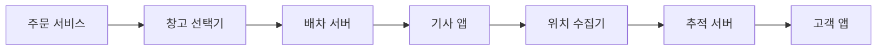

> **한 줄 요약**: 배송 시스템의 핵심은 실시간 위치 추적으로 고객 불안을 제거하고, 최근접 창고 선택으로 리드타임을 단축하며, 이벤트 소싱으로 배송 상태 이력을 완전하게 보존하는 것이다.

## 실제 문제: 쿠팡 로켓배송과 마켓컬리가 만들어낸 배송 혁신

2014년 쿠팡이 로켓배송을 출시했을 때, 업계는 "당일 배송은 불가능하다"고 했습니다. 당시 e-커머스 표준은 택배사에 물건을 넘기면 2~3일 후에 배달되는 구조였습니다. 쿠팡은 이 공식을 깨기 위해 물류 시스템 전체를 직접 설계했습니다.

마켓컬리는 한 발 더 나아가 2015년 새벽 배송을 시작했습니다. 밤 11시 전에 주문하면 다음 날 오전 7시 전에 현관 앞에 신선식품이 놓이는 구조입니다. 냉장·냉동 상품을 새벽에 배달하려면 온도 관리, 배송 경로 최적화, 기사 배차가 초 단위로 맞아 떨어져야 합니다.

이 두 서비스가 해결한 핵심 문제:
- **리드타임 단축**: 물건이 창고에서 출발하는 시점부터 고객 집까지 걸리는 시간을 어떻게 최소화하는가
- **실시간 추적**: "내 택배 지금 어디 있지?"라는 고객의 불안을 어떻게 해소하는가
- **배차 최적화**: 수백 명의 배송기사에게 수천 개의 주문을 어떻게 효율적으로 배정하는가
- **창고 선택**: 전국 수십 개 물류센터 중 어느 창고에서 출발해야 가장 빠른가
- **장애 대응**: 배송기사 앱이 GPS 신호를 잃거나, 배송 중 주문이 폭증하면 어떻게 되는가

---

## 설계 의사결정 로드맵

배송 시스템 설계에서 순서대로 답해야 할 핵심 결정 4가지다. 각 결정에서 "왜 이 선택인가"를 명확히 하지 않으면 면접에서 "그냥 DB 폴링으로 하면 되지 않나요?"라는 후속 질문에 답할 수 없다.

### 결정 1: 배송 추적 — 폴링 vs 웹소켓 vs SSE

**문제**: 고객 앱에서 배송기사 위치를 실시간으로 보여주려면 어떤 통신 방식을 써야 하는가?

| 후보 | 장점 | 단점 | 언제 적합 |
|------|------|------|----------|
| HTTP 폴링 | 구현 단순, 기존 REST API 재사용 | 5초마다 요청 시 불필요한 트래픽, 위치 갱신 최대 5초 지연 | 정확도가 낮아도 되는 배송 완료 확인 |
| 웹소켓 | 양방향 실시간, 지연 최소화 | 연결 유지 비용, 모바일 네트워크 전환 시 재연결 필요 | 채팅, 양방향 통신이 필요한 경우 |
| SSE (Server-Sent Events) | 서버→클라이언트 단방향 실시간, HTTP 기반 방화벽 친화적 | 클라이언트→서버 채널 별도 필요 | 위치 추적처럼 서버가 데이터를 Push하는 경우 |

**우리의 선택: SSE (Server-Sent Events)**
- 이유: 배송 추적은 서버(기사 위치 서버)→클라이언트(고객 앱) 단방향이다. 웹소켓의 양방향 복잡도가 필요 없다. SSE는 HTTP/2 위에서 동작하여 기존 로드밸런서·방화벽 설정 변경 없이 사용 가능하다. 연결이 끊어지면 브라우저가 자동 재연결한다.
- 안 하면: 폴링을 5초마다 하는 고객이 100만 명이면 초당 20만 건의 위치 조회 요청이 발생한다. 실제 위치 변화가 없어도 요청이 오기 때문에 서버 자원의 90%가 "변화 없음"을 응답하는 데 낭비된다.

### 결정 2: 배차 알고리즘 — 수동 배정 vs 라운드로빈 vs 최적화 엔진

**문제**: 신규 주문이 들어올 때 어느 배송기사에게 배정해야 가장 효율적인가?

| 후보 | 장점 | 단점 | 언제 적합 |
|------|------|------|----------|
| 수동 배정 | 배차 담당자가 상황 판단 가능 | 확장성 없음, 사람의 실수, 수백 건 동시 처리 불가 | 소규모 퀵서비스 |
| 라운드로빈 | 구현 단순, 공평한 분배 | 기사 위치·현재 업무량 무시, 먼 기사에게 배정 가능 | 배달 밀도가 균일한 경우 |
| 최적화 엔진 (VRP 기반) | 거리·업무량·시간창 동시 최적화, 연료비·시간 절감 | 구현 복잡, 실시간 계산 비용 높음 | 당일·새벽배송처럼 시간이 핵심인 경우 |

**우리의 선택: 최적화 엔진 (단순화된 VRP)**
- 이유: 새벽배송은 오전 7시 전이라는 절대적 시간 제약이 있다. 라운드로빈은 이 제약을 무시한다. VRP(Vehicle Routing Problem)를 풀면 이론적으로 최적이지만 NP-Hard라 실시간 적용이 불가능하다. 현실적 대안은 그리디 + 지역 탐색(Local Search)으로 준최적해를 1초 이내에 계산하는 것이다.
- 안 하면: 라운드로빈으로 배정하면 강남 기사가 잠실 배송을 맡고, 잠실 기사가 강남 배송을 맡는 상황이 발생한다. 쿠팡 연구에 따르면 최적화 없는 배차 대비 주행 거리가 30~40% 증가한다.

### 결정 3: 창고 선택 — 고정 배정 vs 거리 기반 vs 재고+거리 최적화

**문제**: 전국 30개 물류센터 중 어느 창고에서 주문 상품을 출고해야 하는가?

| 후보 | 장점 | 단점 | 언제 적합 |
|------|------|------|----------|
| 고정 배정 (지역별 창고) | 운영 단순, 예측 가능 | 창고 재고 소진 시 배송 불가, 인접 창고 활용 불가 | 소규모 단창고 |
| 거리 기반 최근접 창고 | 빠른 배송 보장, 구현 단순 | 재고 미확인 시 출고 실패 가능 | 재고가 충분한 경우 |
| 재고+거리 통합 최적화 | 재고 확인 후 최근접 창고 선택, 분산 주문도 처리 | 여러 창고 재고 실시간 조회 필요 | 당일배송, 재고 분산 환경 |

**우리의 선택: 재고+거리 통합 최적화**
- 이유: 최근접 창고에 재고가 없으면 거리 계산이 의미 없다. 재고 조회 후 거리 가중치를 적용하여 "재고 있는 창고 중 가장 가까운 곳"을 선택한다. 상품이 여러 창고에 분산되어 있으면 단일 창고 출고로 합치거나 분할 출고 여부도 결정한다.
- 안 하면: 2021년 추석 연휴 전날, 특정 창고 재고가 동시에 소진되면서 단순 거리 기반 배정 시스템이 재고 없는 창고로 주문을 배정했다. 출고 실패 후 수동 재배정으로 수천 건의 배송이 하루 이상 지연되었다.

### 결정 4: 배송 상태 관리 — RDB 상태 컬럼 vs 이벤트 소싱 vs 상태 머신

**문제**: 주문접수→출고→집화→이동→배달중→완료 상태를 어떻게 저장하고 추적하는가?

| 후보 | 장점 | 단점 | 언제 적합 |
|------|------|------|----------|
| RDB 상태 컬럼 UPDATE | 구현 단순, 현재 상태 조회 O(1) | 이전 상태 이력 소실, 이상 전이 감지 어려움 | 상태가 2~3가지인 단순 시스템 |
| 이벤트 소싱 | 완전한 이력 보존, 상태 재계산 가능, 감사 추적 | 최신 상태 조회 시 이벤트 재생 필요, 스냅샷 관리 필요 | 법적 증거·환불 분쟁이 있는 배송 |
| 상태 머신 + RDB | 유효 전이만 허용, 잘못된 상태 전이 방지 | 상태 정의 변경 시 코드·DB 동시 수정 필요 | 상태 전이 규칙이 복잡한 경우 |

**우리의 선택: 이벤트 소싱 + 상태 머신 조합**
- 이유: "배송 완료" 후 고객이 "받은 적 없다"고 분쟁을 제기하면 배송기사가 언제 어디서 배달했는지 GPS 이력까지 포함한 완전한 증거가 필요하다. 이벤트 소싱은 모든 상태 전이를 불변 이벤트로 저장한다. 상태 머신은 "취소됨 → 배달중" 같은 잘못된 전이를 코드 레벨에서 차단한다.
- 안 하면: 상태 컬럼만 UPDATE하면 "이 주문이 왜 갑자기 배달완료 상태인가?"를 추적할 수 없다. CJ대한통운은 배송 분쟁 대응을 위해 모든 스캔 이벤트를 시계열 DB에 7년간 보관한다.

---

## 1. 요구사항 분석 및 규모 추정

### 기능 요구사항

1️⃣ **주문 접수 및 창고 배정**: 주문 확정 즉시 최적 창고 선택 및 출고 지시
2️⃣ **배차 및 경로 최적화**: 배송기사에게 효율적인 순서로 배송 목록 배정
3️⃣ **실시간 위치 추적**: 배송기사 GPS를 수집하여 고객에게 실시간 노출
4️⃣ **ETA 예측**: 현재 위치, 잔여 배송 건수, 교통 상황 기반 도착 예정 시각 계산
5️⃣ **배송 상태 관리**: 집화→이동→배달중→완료의 상태 전이 기록
6️⃣ **알림 발송**: 출발, 근처 도착, 배달 완료 시 고객에게 푸시 알림

### 비기능 요구사항

- **가용성**: 99.99% (배송 추적 불가 = 고객 불만 폭발)
- **실시간성**: 기사 위치 갱신 후 고객 화면 반영까지 3초 이내
- **확장성**: 블랙프라이데이 주문량 평소의 10배 처리
- **내구성**: 배송 이벤트는 절대 유실되면 안 됨 (분쟁 증거)

### 규모 추정

쿠팡 기준으로 추정:
- 일일 주문: 500만 건
- 피크 시간대 (오후 8~11시) 주문: 전체의 40% = 200만 건 / 3시간 = 초당 185건
- 배송기사: 5만 명 (쿠팡맨 + 협력사)
- 기사 GPS 업데이트: 5초마다 1회 → 초당 10,000건의 위치 이벤트
- 고객 배송 추적 동시 접속: 최대 50만 명 (피크 시)
- 하루 위치 이벤트 저장: 10,000건/초 × 86,400초 = 약 8.64억 건

이 규모에서 단일 MySQL 인스턴스로 위치 데이터를 처리하는 것은 불가능하다. 위치 데이터는 시계열 특성이 강하므로 전용 시계열 DB 또는 Redis를 활용한 계층 구조가 필요하다.

---

## 2. 고수준 아키텍처

배송 시스템을 음식 배달로 비유하면 이해하기 쉽습니다. **주방(창고)**에서 요리(상품)가 나오면, **배달 앱(배차 서버)**이 가장 가까운 **라이더(기사)**를 찾아 배정합니다. 라이더는 **지도(경로 최적화)**를 보고 이동하고, 고객은 **실시간 지도 화면(추적 서버)**으로 라이더 위치를 봅니다. 차이는 규모뿐입니다. 쿠팡은 이 과정을 하루 500만 번 반복합니다.



각 컴포넌트의 역할:
- **창고 선택기**: 재고 DB와 거리 계산으로 최적 창고 결정
- **배차 서버**: VRP 기반 그리디 알고리즘으로 기사에게 배송 목록 배정
- **위치 수집기**: 기사 앱에서 GPS 좌표를 Kafka로 수신, Redis에 최신 위치 저장
- **추적 서버**: SSE 연결을 유지하며 고객에게 위치 변경 이벤트 Push

---

## 3. 핵심 컴포넌트 상세 설계

### 3-1. 실시간 위치 추적

배송기사 위치 추적은 **"수만 개의 점이 움직이는 지도"** 문제입니다. 5초마다 5만 개의 GPS 좌표가 들어오고, 동시에 50만 명의 고객이 자신의 기사 위치를 구독합니다.

**데이터 흐름**:

기사 앱 → Kafka (위치 토픽) → 위치 소비자 → Redis (최신 위치) → SSE 서버 → 고객 앱

Redis에는 기사 ID를 키로 최신 좌표만 저장합니다 (TTL 30초). 위치 이력은 시계열 DB(InfluxDB 또는 TimescaleDB)에 별도 저장합니다. SSE 서버는 Redis Pub/Sub를 구독하여 특정 기사 위치 변경 시 해당 기사를 추적 중인 고객에게만 이벤트를 전송합니다.

```java
// 기사 앱 → 서버: 위치 업데이트 (5초마다)
@RestController
public class DriverLocationController {

    private final KafkaTemplate<String, DriverLocationEvent> kafkaTemplate;

    @PostMapping("/driver/location")
    public ResponseEntity<Void> updateLocation(
            @RequestHeader("X-Driver-Id") String driverId,
            @RequestBody LocationRequest req) {

        DriverLocationEvent event = DriverLocationEvent.builder()
                .driverId(driverId)
                .latitude(req.getLatitude())
                .longitude(req.getLongitude())
                .timestamp(Instant.now())
                .build();

        kafkaTemplate.send("driver-location", driverId, event);
        return ResponseEntity.ok().build();
    }
}

// Kafka 소비자: 최신 위치를 Redis에 저장 + Pub/Sub 발행
@Component
public class LocationConsumer {

    private final StringRedisTemplate redisTemplate;

    @KafkaListener(topics = "driver-location", groupId = "location-updater")
    public void consume(DriverLocationEvent event) {
        String key = "driver:location:" + event.getDriverId();
        String value = event.getLatitude() + "," + event.getLongitude();

        // 최신 위치 저장 (TTL 30초: 30초 안에 업데이트 없으면 오프라인 간주)
        redisTemplate.opsForValue().set(key, value, Duration.ofSeconds(30));

        // 구독자에게 변경 알림
        redisTemplate.convertAndSend("location-update:" + event.getDriverId(), value);
    }
}

// SSE 엔드포인트: 고객이 기사 위치를 실시간 구독
@RestController
public class TrackingController {

    private final StringRedisTemplate redisTemplate;

    @GetMapping(value = "/track/{orderId}", produces = MediaType.TEXT_EVENT_STREAM_VALUE)
    public SseEmitter trackOrder(@PathVariable String orderId) {
        SseEmitter emitter = new SseEmitter(Long.MAX_VALUE);
        String driverId = getDriverIdByOrderId(orderId);

        // Redis Pub/Sub 구독: 기사 위치 변경 시 고객에게 전송
        redisTemplate.getConnectionFactory()
                .getConnection()
                .subscribe((message, pattern) -> {
                    try {
                        emitter.send(SseEmitter.event()
                                .name("location")
                                .data(new String(message.getBody())));
                    } catch (IOException e) {
                        emitter.completeWithError(e);
                    }
                }, ("location-update:" + driverId).getBytes());

        return emitter;
    }
}
```

### 3-2. 배차 알고리즘 (단순화된 VRP)

VRP(Vehicle Routing Problem)는 "여러 차량이 여러 고객을 방문하는 최단 경로"를 구하는 문제입니다. 이론적 최적해는 NP-Hard(경우의 수가 팩토리얼로 증가)이므로 실제 배송 시스템은 **그리디 + 국소 탐색**으로 준최적해를 빠르게 구합니다.

**알고리즘 단계**:
1. 출고 준비된 주문 목록을 클러스터링 (지역별 묶음)
2. 각 클러스터에 가장 가까운 대기 기사 배정
3. 기사별 배송 순서를 최근접 이웃(Nearest Neighbor) 알고리즘으로 정렬
4. 2-opt 스왑으로 경로 개선 (반복 횟수 제한으로 시간 제약)

```java
@Service
public class DispatchService {

    // 단순화된 최근접 이웃 알고리즘으로 배송 순서 결정
    public List<DeliveryOrder> optimizeRoute(
            Location driverLocation,
            List<DeliveryOrder> orders) {

        List<DeliveryOrder> remaining = new ArrayList<>(orders);
        List<DeliveryOrder> route = new ArrayList<>();
        Location current = driverLocation;

        while (!remaining.isEmpty()) {
            // 현재 위치에서 가장 가까운 배송지 선택
            DeliveryOrder nearest = remaining.stream()
                    .min(Comparator.comparingDouble(
                            o -> haversineDistance(current, o.getDeliveryLocation())))
                    .orElseThrow();

            route.add(nearest);
            remaining.remove(nearest);
            current = nearest.getDeliveryLocation();
        }

        return route;
    }

    // 두 GPS 좌표 간 거리 계산 (Haversine 공식, 단위: km)
    private double haversineDistance(Location a, Location b) {
        double R = 6371.0;
        double dLat = Math.toRadians(b.getLat() - a.getLat());
        double dLon = Math.toRadians(b.getLon() - a.getLon());
        double sinLat = Math.sin(dLat / 2);
        double sinLon = Math.sin(dLon / 2);
        double c = 2 * Math.asin(Math.sqrt(
                sinLat * sinLat +
                Math.cos(Math.toRadians(a.getLat()))
                        * Math.cos(Math.toRadians(b.getLat()))
                        * sinLon * sinLon));
        return R * c;
    }

    // 기사-주문 매칭: 대기 기사 중 가장 가까운 기사 배정
    public String assignDriver(List<String> availableDrivers,
                               Location pickupLocation,
                               Map<String, Location> driverLocations) {
        return availableDrivers.stream()
                .min(Comparator.comparingDouble(
                        id -> haversineDistance(driverLocations.get(id), pickupLocation)))
                .orElseThrow(() -> new NoAvailableDriverException("배정 가능한 기사 없음"));
    }
}
```

### 3-3. 창고 선택 알고리즘

창고 선택은 "재고 있는 창고 중 고객과 가장 가까운 곳"이 기본 원칙이지만, 현실은 더 복잡합니다. **상품이 여러 창고에 분산**되어 있거나, **특정 창고가 오늘 마감**에 가까워 출고 처리 가능 시간이 얼마 남지 않았을 수도 있습니다.

```java
@Service
public class WarehouseSelectionService {

    private final InventoryClient inventoryClient;
    private final WarehouseRepository warehouseRepo;

    public WarehouseSelectionResult selectWarehouse(
            String productId,
            int quantity,
            Location customerLocation) {

        // 1단계: 재고 있는 창고 목록 조회
        List<WarehouseStock> stocks = inventoryClient
                .getAvailableStocks(productId, quantity);

        if (stocks.isEmpty()) {
            throw new OutOfStockException(productId + " 재고 없음");
        }

        // 2단계: 각 창고에 점수 계산 (거리 + 잔여 처리 시간 + 재고량)
        return stocks.stream()
                .map(stock -> {
                    Warehouse wh = warehouseRepo.findById(stock.getWarehouseId());
                    double distance = haversineDistance(wh.getLocation(), customerLocation);
                    double timeScore = getRemainingProcessingTimeScore(wh);
                    double score = distance * 0.6 + timeScore * 0.4; // 거리 60%, 시간 40%
                    return new ScoredWarehouse(wh, stock, score);
                })
                .min(Comparator.comparingDouble(ScoredWarehouse::getScore))
                .map(sw -> new WarehouseSelectionResult(
                        sw.getWarehouse().getId(),
                        sw.getStock().getQuantity(),
                        calculateEta(sw.getWarehouse().getLocation(), customerLocation)))
                .orElseThrow();
    }

    // 창고 마감 시간까지 남은 시간에 따른 점수 (남은 시간 적을수록 높은 페널티)
    private double getRemainingProcessingTimeScore(Warehouse wh) {
        long minutesLeft = ChronoUnit.MINUTES.between(
                LocalTime.now(), wh.getCutoffTime());
        if (minutesLeft < 30) return 100.0; // 마감 임박 창고는 높은 페널티
        if (minutesLeft < 60) return 30.0;
        return 0.0;
    }
}
```

### 3-4. ETA 예측

ETA(Estimated Time of Arrival)는 고객 경험의 핵심입니다. "2시간 후 도착"을 말해줬는데 4시간이 걸리면 신뢰가 무너집니다. 반대로 "5시간 후"라고 했는데 2시간에 오면 고객이 집에 없을 수 있습니다.

ETA 계산 요소:
- **잔여 배송 건수**: 내 배송 전에 몇 건이 남아 있는가
- **건당 평균 처리 시간**: 해당 지역, 해당 시간대의 이력 데이터 기반
- **현재 교통 상황**: 외부 지도 API (카카오맵, T맵) 연동
- **기사 이동 속도**: 최근 5분간 실제 이동 속도

```java
@Service
public class EtaCalculationService {

    private final MapApiClient mapApiClient;
    private final DeliveryHistoryRepo historyRepo;

    public EtaResult calculateEta(String orderId, String driverId) {
        DriverStatus status = getDriverStatus(driverId);
        int ordersAhead = status.getOrdersBeforeTarget(orderId);

        // 해당 지역·시간대의 건당 평균 처리 시간 (이력 기반)
        double avgMinutesPerStop = historyRepo.getAvgDeliveryMinutes(
                status.getCurrentArea(),
                LocalTime.now().getHour());

        // 잔여 이동 거리에 대한 교통 소요 시간
        double trafficMinutes = mapApiClient.getEstimatedDriveMinutes(
                status.getCurrentLocation(),
                getTargetLocation(orderId));

        double totalMinutes = (ordersAhead * avgMinutesPerStop) + trafficMinutes;

        return EtaResult.builder()
                .estimatedArrival(Instant.now().plusSeconds((long)(totalMinutes * 60)))
                .confidenceRange(Duration.ofMinutes(15)) // ±15분 오차 범위
                .ordersAhead(ordersAhead)
                .build();
    }
}
```

---

## 4. 장애 시나리오와 대응

### 시나리오 1: GPS 신호 단절 (터널, 지하 주차장)

**상황**: 기사가 아파트 지하 주차장에 진입하여 GPS 신호가 끊겼다. 고객 앱에서 기사 위치가 멈췄다.

**대응**:
- Redis TTL 30초 활용: 30초 이상 위치 업데이트가 없으면 고객 앱에 "기사가 건물 내부에 있습니다" 메시지 표시
- 기사 앱은 GPS 불량 시 Wi-Fi 위치, 셀 타워 위치로 대체 측위
- 마지막 알려진 위치 + 예상 이동 경로로 고객 화면에 "예상 위치" 표시 (Dead Reckoning)

### 시나리오 2: 블랙프라이데이 주문 폭증 (평소의 10배)

**상황**: 오전 10시 특가 세일 시작과 함께 초당 주문이 1,850건으로 10배 급증했다. 배차 서버 CPU가 95%에 도달했다.

**대응**:
- 배차 서버는 Auto Scaling으로 5분 내 인스턴스 10배 확장
- 배차 요청은 Kafka 큐를 통해 비동기 처리: 주문은 즉시 접수되고 배차는 순차 처리
- 배차 알고리즘의 VRP 최적화 반복 횟수를 평상시 100회 → 폭증 시 20회로 축소 (품질보다 속도)
- Circuit Breaker: 외부 지도 API가 과부하 시 캐시된 거리 데이터로 폴백

### 시나리오 3: 배송 이벤트 DB 장애

**상황**: 배송 상태를 저장하는 MySQL이 Primary 장애로 60초간 쓰기 불가 상태가 됐다. 이 시간 동안 수백 건의 배송 완료 이벤트가 유실될 위기다.

**대응**:
- 이벤트 소싱 아키텍처에서 모든 배송 이벤트는 먼저 Kafka에 기록
- Kafka는 디스크 기반으로 이벤트를 7일간 보관 (유실 없음)
- DB 복구 후 Kafka 오프셋부터 이벤트를 재처리하여 상태 재구성
- Replica Failover 완료까지 읽기는 Read Replica로 서빙하여 고객 추적 화면은 정상 동작 유지

### 시나리오 4: 잘못된 배달 완료 처리 (다른 집에 놓고 완료 처리)

**상황**: 기사가 실수로 옆집 문 앞에 놓고 배달 완료 버튼을 눌렀다. 고객은 "받은 적 없다"고 신고했다.

**대응**:
- 이벤트 소싱으로 배달 완료 처리 시각의 GPS 좌표가 기록됨
- 배달 완료 시 기사 앱이 배달 사진 촬영을 강제 (S3에 저장, 위치 메타데이터 포함)
- GPS 좌표와 고객 주소 간 거리가 100m 초과 시 "위치 불일치 경고" 알림 후 재확인 요청
- 분쟁 발생 시 이벤트 이력 + 사진 + GPS 로그로 사실 확인

---

## 5. 확장 포인트

### 다중 지역 확장: 서울 → 전국

단일 데이터센터로 서울 서비스를 운영하다가 전국으로 확장할 때:
- 지역별 Kafka 클러스터 분리: 서울 기사 위치 이벤트가 부산 클러스터에 갈 이유 없음
- 창고 DB는 지역 샤딩: 창고 ID 기반 샤드 키로 지역별 독립 운영
- 글로벌 ETA 쿼리는 API Gateway가 지역 라우팅 후 집계

### 드론·로봇 배송 통합

쿠팡이 드론 배송을 시작한다면:
- `DriverType` 필드를 `HUMAN | DRONE | ROBOT`으로 확장
- 드론은 도로 경로가 아닌 직선 경로와 비행 고도 제한을 적용하는 별도 경로 계산기
- 기사 앱 → 드론 펌웨어 SDK로 동일한 위치 이벤트 스키마를 사용

### 국제 물류 확장

해외 배송(FedEx, DHL 연동)이 필요해지면:
- 택배사 별 상태 코드를 내부 표준 상태로 변환하는 어댑터 레이어
- 세관 이벤트(통관 완료, 세관 검사 중)를 배송 이벤트 소싱에 통합
- 다통화 배송비 계산 서비스 분리

---

## 면접 포인트

### Q1. 기사 위치를 Redis에만 저장하면 Redis가 재시작될 때 위치 데이터가 사라지지 않나요?

Redis에는 **최신 위치만** 저장합니다. 위치 이력은 Kafka → 시계열 DB(InfluxDB)에 영속 저장합니다. Redis 재시작 시 5초 이내에 기사 앱이 새 위치를 전송하므로 자동 복구됩니다. Redis를 "TTL 있는 실시간 캐시"로 사용하는 패턴입니다.

### Q2. VRP가 NP-Hard인데 실시간 배차를 어떻게 처리하나요?

NP-Hard는 이론적 최적해를 보장하는 알고리즘이 없다는 의미입니다. 실무에서는 **그리디 + 제한된 반복 횟수의 국소 탐색**으로 충분히 좋은 해를 1초 이내에 구합니다. 쿠팡은 강화학습 기반 배차 엔진을 연구 중이지만, 그리디만으로도 이론적 최적 대비 5~15% 차이에 수렴합니다.

### Q3. 배송 이벤트가 순서 없이 도착하면 어떻게 처리하나요?

Kafka 파티션을 주문 ID 기반으로 설정하면 동일 주문의 이벤트는 반드시 같은 파티션에 순서대로 들어갑니다. 파티션 내 순서는 Kafka가 보장합니다. 만약 다른 시스템에서 이벤트가 순서 없이 도착한다면 `sequence_number` 또는 `event_timestamp`로 정렬 후 처리합니다.

### Q4. 새벽배송에서 ETA 정확도를 어떻게 높이나요?

새벽 2~5시는 교통 변수가 적어 거리 기반 ETA 정확도가 높습니다. 이력 데이터로 "이 아파트 단지 배달은 평균 X분"을 학습하여 이상치를 제거합니다. 배달 완료 시각 vs 예측 시각 오차를 매일 모니터링하여 모델을 개선합니다. 마켓컬리의 경우 배달 완료 예측 오차가 ±10분 이내를 목표로 합니다.

### Q5. 배송기사가 갑자기 앱을 종료하면 어떻게 되나요?

기사 앱은 백그라운드에서도 위치를 전송하는 Foreground Service로 동작합니다. 30초간 위치 업데이트가 없으면 배차 서버가 기사를 "연락 불가" 상태로 표시하고 담당 고객에게 알림을 보냅니다. 동시에 관제 센터에 알림이 가서 수동 대응 또는 재배차 절차가 시작됩니다.
