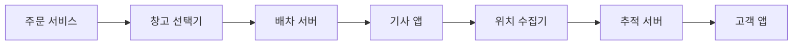
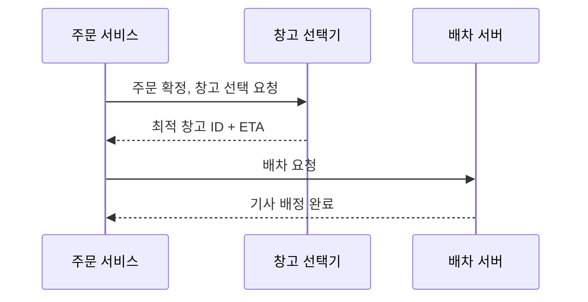
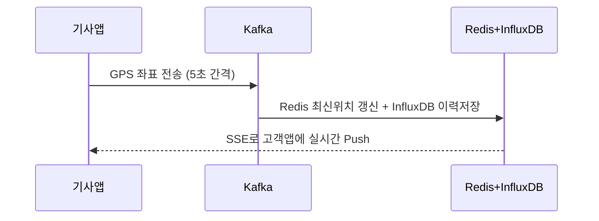

> **한 줄 요약**: 배송 시스템의 핵심은 실시간 위치 추적으로 고객 불안을 제거하고, 최근접 창고 선택으로 리드타임을 단축하며, 이벤트 소싱으로 배송 상태 이력을 완전하게 보존하는 것입니다.

## 실제 문제: 쿠팡 로켓배송과 마켓컬리가 만들어낸 배송 혁신

2014년 쿠팡이 로켓배송을 출시할 때 업계 표준은 택배사에 물건을 넘기면 2~3일 후 배달되는 구조였습니다. 마켓컬리는 밤 11시 전에 주문하면 다음 날 오전 7시 전에 신선식품이 현관 앞에 놓이는 새벽 배송을 시작했습니다. 냉장·냉동 상품을 새벽에 배달하려면 온도 관리, 경로 최적화, 기사 배차가 초 단위로 맞아 떨어져야 합니다.

이 두 서비스가 해결한 핵심 문제:
- **리드타임 단축**: 창고에서 고객 집까지 걸리는 시간을 어떻게 최소화하는가
- **실시간 추적**: "내 택배 지금 어디 있지?"라는 고객의 불안을 어떻게 해소하는가
- **배차 최적화**: 수백 명의 배송기사에게 수천 개의 주문을 어떻게 효율적으로 배정하는가
- **창고 선택**: 전국 수십 개 물류센터 중 어느 창고에서 출발해야 가장 빠른가

---

## 설계 의사결정 로드맵

### 결정 1: 배송 추적 — 폴링 vs 웹소켓 vs SSE

| 후보 | 장점 | 단점 | 언제 적합 |
|------|------|------|----------|
| HTTP 폴링 | 구현 단순, REST API 재사용 | 불필요한 트래픽, 최대 5초 지연 | 정확도가 낮아도 되는 배송 완료 확인 |
| 웹소켓 | 양방향 실시간, 지연 최소화 | 연결 유지 비용, 재연결 필요 | 채팅, 양방향 통신이 필요한 경우 |
| SSE (Server-Sent Events) | 서버→클라이언트 단방향 실시간, HTTP 기반 방화벽 친화적 | 클라이언트→서버 채널 별도 필요 | 위치 추적처럼 서버가 Push하는 경우 |

**우리의 선택: SSE (Server-Sent Events)**
- 배송 추적은 서버→클라이언트 단방향이다. SSE는 HTTP/2 위에서 동작해 기존 로드밸런서·방화벽 설정 변경 없이 사용 가능하고, 연결이 끊어지면 브라우저가 자동 재연결한다. 폴링을 5초마다 하는 고객이 100만 명이면 초당 20만 건의 요청이 발생하며 90%가 "변화 없음"을 응답하는 데 낭비된다.

### 결정 2: 배차 알고리즘 — 수동 배정 vs 라운드로빈 vs 최적화 엔진

| 후보 | 장점 | 단점 | 언제 적합 |
|------|------|------|----------|
| 수동 배정 | 상황 판단 가능 | 확장성 없음, 수백 건 동시 처리 불가 | 소규모 퀵서비스 |
| 라운드로빈 | 구현 단순, 공평한 분배 | 기사 위치·업무량 무시 | 배달 밀도가 균일한 경우 |
| 최적화 엔진 (VRP 기반) | 거리·업무량·시간창 동시 최적화 | 구현 복잡, 실시간 계산 비용 높음 | 당일·새벽배송처럼 시간이 핵심인 경우 |

**우리의 선택: 최적화 엔진 (단순화된 VRP)**
- 새벽배송은 오전 7시 전이라는 절대적 시간 제약이 있어 라운드로빈으로는 해결 불가. VRP는 NP-Hard라 실시간 적용이 불가능하므로 그리디 + 지역 탐색(Local Search)으로 준최적해를 1초 이내에 계산한다. 최적화 없는 배차 대비 주행 거리가 30~40% 증가한다.

### 결정 3: 창고 선택 — 고정 배정 vs 거리 기반 vs 재고+거리 최적화

| 후보 | 장점 | 단점 | 언제 적합 |
|------|------|------|----------|
| 고정 배정 (지역별 창고) | 운영 단순 | 재고 소진 시 배송 불가 | 소규모 단창고 |
| 거리 기반 최근접 창고 | 빠른 배송 보장 | 재고 미확인 시 출고 실패 | 재고가 충분한 경우 |
| 재고+거리 통합 최적화 | 재고 확인 후 최근접 창고 선택 | 여러 창고 재고 실시간 조회 필요 | 당일배송, 재고 분산 환경 |

**우리의 선택: 재고+거리 통합 최적화**
- 최근접 창고에 재고가 없으면 거리 계산이 의미 없다. 재고 조회 후 거리 가중치를 적용해 "재고 있는 창고 중 가장 가까운 곳"을 선택한다.

### 결정 4: 배송 상태 관리 — RDB 상태 컬럼 vs 이벤트 소싱 vs 상태 머신

| 후보 | 장점 | 단점 | 언제 적합 |
|------|------|------|----------|
| RDB 상태 컬럼 UPDATE | 구현 단순 | 이전 상태 이력 소실 | 상태가 2~3가지인 단순 시스템 |
| 이벤트 소싱 | 완전한 이력 보존, 감사 추적 | 최신 상태 조회 시 이벤트 재생 필요 | 법적 증거·환불 분쟁이 있는 배송 |
| 상태 머신 + RDB | 잘못된 상태 전이 방지 | 상태 정의 변경 시 코드·DB 동시 수정 | 상태 전이 규칙이 복잡한 경우 |

**우리의 선택: 이벤트 소싱 + 상태 머신 조합**
- "배송 완료" 후 고객이 분쟁을 제기하면 배송기사가 언제 어디서 배달했는지 GPS 이력까지 포함한 완전한 증거가 필요하다. 상태 머신은 "취소됨 → 배달중" 같은 잘못된 전이를 코드 레벨에서 차단한다.

---

## 1. 요구사항 분석 및 규모 추정

### 기능 요구사항

1. **주문 접수 및 창고 배정**: 주문 확정 즉시 최적 창고 선택 및 출고 지시
2. **배차 및 경로 최적화**: 배송기사에게 효율적인 순서로 배송 목록 배정
3. **실시간 위치 추적**: 배송기사 GPS를 수집하여 고객에게 실시간 노출
4. **ETA 예측**: 현재 위치, 잔여 배송 건수, 교통 상황 기반 도착 예정 시각 계산
5. **배송 상태 관리**: 집화→이동→배달중→완료의 상태 전이 기록
6. **알림 발송**: 출발, 근처 도착, 배달 완료 시 고객에게 푸시 알림

### 비기능 요구사항

- **가용성**: 99.99%
- **실시간성**: 기사 위치 갱신 후 고객 화면 반영까지 3초 이내
- **내구성**: 배송 이벤트 절대 유실 불가 (분쟁 증거)

### 규모 추정

- 일일 주문: 500만 건
- 배송기사: 5만 명
- 기사 GPS 업데이트: 5초마다 1회 → 초당 10,000건
- 고객 배송 추적 동시 접속: 최대 50만 명 (피크 시)
- 하루 위치 이벤트 저장: 10,000건/초 × 86,400초 = 약 8.64억 건

이 규모에서 단일 MySQL로 위치 데이터를 처리하는 것은 불가능합니다. 위치 데이터는 시계열 특성이 강하므로 전용 시계열 DB 또는 Redis 계층 구조가 필요합니다.

---

## 2. 고수준 아키텍처

> **비유**: 배송 시스템은 택시 배차 앱과 같습니다. 손님(주문)이 호출하면, 중앙 관제(배차 서버)가 가장 가까운 기사(배송 기사)를 찾아 배정하고, 기사의 GPS 위치를 실시간으로 손님에게 보여줍니다. 기사가 도착하면 "배달 완료"를 누르고, 이 모든 기록이 남습니다.



| 컴포넌트 | 역할 |
|----------|------|
| 창고 선택기 | 재고 DB + 거리 계산으로 최적 창고 결정 |
| 배차 서버 | VRP 기반 그리디 알고리즘으로 배송 목록 배정 |
| 위치 수집기 | 기사 GPS 좌표를 Kafka로 수신, Redis에 최신 위치 저장 |
| 추적 서버 | SSE 연결 유지, 고객에게 위치 변경 이벤트 Push |

**주문 접수 → 배차 흐름:**



---

## 3. 핵심 컴포넌트 상세 설계

### 컴포넌트 동작 원리

**창고 선택기 (Warehouse Selector)**
주문 확정 이벤트를 수신하면 재고 서비스에 병렬 조회 요청을 보냅니다. 전국 창고 목록과 재고 가용 여부를 응답받은 뒤 Haversine 공식으로 각 창고와 고객 주소 간 직선 거리를 계산합니다. 거리(60%)와 창고 마감시간 여유(40%)를 가중 합산해 점수가 가장 낮은 창고를 선택하고, 결과를 배차 서버에 전달합니다. 재고가 없는 창고는 후보에서 제외하며, 전국 모든 창고에 재고가 없으면 `OutOfStockException`을 발생시켜 주문을 홀딩 상태로 전환합니다.

**배차 서버 (Dispatch Server)**
창고 선택 완료 이벤트를 수신하면 해당 창고 반경 N km 내 가용 기사 목록을 조회합니다. 기사별 현재 위치(Redis), 현재 처리 중인 배송 건수, 차량 적재 가능 여부를 종합해 후보를 필터링합니다. 최근접 이웃 알고리즘으로 배송 순서를 정렬하고, 2-opt 스왑으로 경로를 개선한 뒤 기사 앱으로 배송 목록을 푸시합니다. 기사가 배차를 거부하면 다음 후보에게 재배차합니다.

**위치 수집기 (Location Collector)**
기사 앱에서 5초마다 전송하는 GPS 좌표를 Kafka `driver-location` 토픽으로 수신합니다. Consumer는 수신 즉시 두 가지 작업을 병렬 처리합니다. 첫째, Redis에 `driver:location:{id}` 키로 최신 좌표를 저장하고 TTL 30초를 설정합니다(30초 이상 갱신 없으면 오프라인 처리). 둘째, InfluxDB에 타임스탬프와 함께 이력을 영속 저장합니다. 분쟁 발생 시 GPS 이력이 증거가 됩니다.

**추적 서버 (Tracking Server)**
고객 앱이 `/track/{orderId}` SSE 엔드포인트에 연결하면, 주문 ID로 담당 기사 ID를 조회하고 Redis Pub/Sub 채널 `location-update:{driverId}`를 구독합니다. 위치 수집기가 Redis Pub/Sub에 새 좌표를 발행할 때마다 해당 기사를 추적 중인 모든 고객 SSE 연결로 이벤트를 즉시 푸시합니다. 연결이 끊기면 브라우저가 자동 재연결을 시도하며, 재연결 시 마지막 알려진 위치부터 다시 스트리밍합니다.

**ETA 예측기 (ETA Predictor)**
잔여 배송 건수 × 건당 평균 처리 시간(시간대·지역별 이력 집계) + 외부 지도 API 실시간 교통 정보를 합산합니다. 새벽배송(02~06시)은 교통 변수가 적으므로 이력 기반 ETA가 높은 정확도를 보입니다. 예측 오차(예측 시각 vs 실제 완료 시각)를 매일 집계해 보정 계수를 업데이트합니다.

---

### 3-1. 실시간 위치 추적

위치 이력은 시계열 DB(InfluxDB/TimescaleDB)에 별도 저장합니다.

> **왜 MySQL이 아닌 시계열 DB인가?** GPS 좌표는 초당 수만 건이 쌓이고, "최근 30분 기사 이동 경로" 같은 시간 범위 쿼리가 대부분입니다. MySQL의 B-Tree 인덱스는 범위 쿼리에 비효율적이지만, InfluxDB/TimescaleDB는 시간 기준 파티셔닝과 자동 다운샘플링(예: 1초 데이터를 1분 평균으로 압축)을 제공해 수십배 빠른 조회가 가능합니다.

SSE 서버는 Redis Pub/Sub를 구독하여 특정 기사 위치 변경 시 해당 기사를 추적 중인 고객에게만 이벤트를 전송합니다.



```java
// 기사 앱 → 서버: 위치 업데이트 (5초마다)
@PostMapping("/driver/location")
public ResponseEntity<Void> updateLocation(
        @RequestHeader("X-Driver-Id") String driverId,
        @RequestBody LocationRequest req) {

    kafkaTemplate.send("driver-location", driverId,
        DriverLocationEvent.builder()
            .driverId(driverId)
            .latitude(req.getLatitude()).longitude(req.getLongitude())
            .timestamp(Instant.now()).build());
    return ResponseEntity.ok().build();
}
```

> **보안**: `X-Driver-Id` 헤더 대신 JWT 토큰으로 기사를 인증해야 합니다. 비현실적인 위치 변화(1초에 100km 이동)는 GPS 스푸핑으로 간주하고 무시합니다.

```java
// Kafka 소비자: Redis에 최신 위치 저장 + Pub/Sub 발행
@KafkaListener(topics = "driver-location", groupId = "location-updater")
public void consume(DriverLocationEvent event) {
    String value = event.getLatitude() + "," + event.getLongitude();
    // TTL 30초: 30초 안에 업데이트 없으면 오프라인 간주
    redisTemplate.opsForValue().set("driver:location:" + event.getDriverId(), value, Duration.ofSeconds(30));
    redisTemplate.convertAndSend("location-update:" + event.getDriverId(), value);
}

// SSE 엔드포인트: 고객이 기사 위치를 실시간 구독
@GetMapping(value = "/track/{orderId}", produces = MediaType.TEXT_EVENT_STREAM_VALUE)
public SseEmitter trackOrder(@PathVariable String orderId) {
    SseEmitter emitter = new SseEmitter(Long.MAX_VALUE);
    String driverId = getDriverIdByOrderId(orderId);

    // ⚠️ 프로덕션에서는 RedisMessageListenerContainer로 커넥션 풀을 공유해야 합니다.
    redisTemplate.getConnectionFactory().getConnection()
        .subscribe((message, pattern) -> {
            try {
                emitter.send(SseEmitter.event().name("location").data(new String(message.getBody())));
            } catch (IOException e) {
                emitter.completeWithError(e);
            }
        }, ("location-update:" + driverId).getBytes());

    return emitter;
}
```

### 3-2. 배차 알고리즘 (단순화된 VRP)

최근접 이웃(Nearest Neighbor) 알고리즘으로 배송 순서를 정렬하고, 2-opt 스왑으로 경로를 개선합니다.

> **2-opt 스왑이란?** Nearest Neighbor로 만든 경로에서 두 구간을 선택해 교차 연결을 해제하는 최적화 기법입니다. A→B→C→D 경로에서 B→C 구간과 A→D 구간이 교차하면, A→C→B→D로 바꿔 총 거리를 줄입니다. 한 번에 최적해를 찾지 못하지만, 반복할수록 경로가 짧아지며 보통 5~15% 개선됩니다.

```java
public List<DeliveryOrder> optimizeRoute(Location driverLocation, List<DeliveryOrder> orders) {
    List<DeliveryOrder> remaining = new ArrayList<>(orders);
    List<DeliveryOrder> route = new ArrayList<>();
    Location current = driverLocation;

    while (!remaining.isEmpty()) {
        DeliveryOrder nearest = remaining.stream()
            .min(Comparator.comparingDouble(o -> haversineDistance(current, o.getDeliveryLocation())))
            .orElseThrow();
        route.add(nearest);
        remaining.remove(nearest);
        current = nearest.getDeliveryLocation();
    }
    return route;
}

// 두 GPS 좌표 간 거리 계산 (Haversine 공식, 단위: km)
private double haversineDistance(Location a, Location b) {
    double R = 6371.0;
    double dLat = Math.toRadians(b.getLat() - a.getLat());
    double dLon = Math.toRadians(b.getLon() - a.getLon());
    double sinLat = Math.sin(dLat / 2), sinLon = Math.sin(dLon / 2);
    double c = 2 * Math.asin(Math.sqrt(sinLat * sinLat +
        Math.cos(Math.toRadians(a.getLat())) * Math.cos(Math.toRadians(b.getLat())) * sinLon * sinLon));
    return R * c;
}
```

### 3-3. 창고 선택 알고리즘

거리(60%)와 창고 마감 시간(40%)을 가중 합산해 최적 창고를 선택합니다.

```java
public WarehouseSelectionResult selectWarehouse(String productId, int quantity, Location customerLocation) {
    List<WarehouseStock> stocks = inventoryClient.getAvailableStocks(productId, quantity);
    if (stocks.isEmpty()) throw new OutOfStockException(productId + " 재고 없음");

    return stocks.stream()
        .map(stock -> {
            Warehouse wh = warehouseRepo.findById(stock.getWarehouseId());
            double distance = haversineDistance(wh.getLocation(), customerLocation);
            double timeScore = getRemainingProcessingTimeScore(wh);
            return new ScoredWarehouse(wh, stock, distance * 0.6 + timeScore * 0.4);
        })
        .min(Comparator.comparingDouble(ScoredWarehouse::getScore))
        .map(sw -> new WarehouseSelectionResult(
            sw.getWarehouse().getId(), sw.getStock().getQuantity(),
            calculateEta(sw.getWarehouse().getLocation(), customerLocation)))
        .orElseThrow();
}

private double getRemainingProcessingTimeScore(Warehouse wh) {
    long minutesLeft = ChronoUnit.MINUTES.between(LocalTime.now(), wh.getCutoffTime());
    if (minutesLeft < 30) return 100.0;  // 마감 임박 창고는 높은 페널티
    if (minutesLeft < 60) return 30.0;
    return 0.0;
}
```

### 3-4. ETA 예측

ETA 계산 요소: 잔여 배송 건수, 건당 평균 처리 시간(이력 기반), 현재 교통 상황(카카오맵/T맵 API), 기사 최근 이동 속도.

```java
public EtaResult calculateEta(String orderId, String driverId) {
    DriverStatus status = getDriverStatus(driverId);
    int ordersAhead = status.getOrdersBeforeTarget(orderId);

    double avgMinutesPerStop = historyRepo.getAvgDeliveryMinutes(
        status.getCurrentArea(), LocalTime.now().getHour());
    double trafficMinutes = mapApiClient.getEstimatedDriveMinutes(
        status.getCurrentLocation(), getTargetLocation(orderId));

    return EtaResult.builder()
        .estimatedArrival(Instant.now().plusSeconds((long)((ordersAhead * avgMinutesPerStop + trafficMinutes) * 60)))
        .confidenceRange(Duration.ofMinutes(15))
        .ordersAhead(ordersAhead)
        .build();
}
```

---

## 4. 장애 시나리오와 대응

### 시나리오 1: GPS 신호 단절 (터널, 지하 주차장)

- Redis TTL 30초 활용: 30초 이상 업데이트 없으면 고객 앱에 "기사가 건물 내부에 있습니다" 표시
- 기사 앱은 GPS 불량 시 Wi-Fi 위치, 셀 타워 위치로 대체 측위
- 마지막 알려진 위치 + 예상 이동 경로로 "예상 위치" 표시 (Dead Reckoning)

### 시나리오 2: 블랙프라이데이 주문 폭증

- 배차 서버는 Auto Scaling으로 5분 내 인스턴스 10배 확장
- 배차 요청은 Kafka 큐를 통해 비동기 처리
- VRP 최적화 반복 횟수를 평상시 100회 → 폭증 시 20회로 축소 (품질보다 속도)

### 시나리오 3: 배송 이벤트 DB 장애

- 모든 배송 이벤트는 먼저 Kafka에 기록 (디스크 기반, 7일 보관)
- DB 복구 후 Kafka 오프셋부터 이벤트를 재처리하여 상태 재구성
- 읽기는 Read Replica로 서빙해 고객 추적 화면은 정상 동작 유지

### 시나리오 4: 잘못된 배달 완료 처리

- 이벤트 소싱으로 배달 완료 시각의 GPS 좌표 기록
- 배달 완료 시 기사 앱이 배달 사진 촬영 강제 (S3에 저장, 위치 메타데이터 포함)
- GPS 좌표와 고객 주소 간 거리가 100m 초과 시 "위치 불일치 경고" 후 재확인 요청

---

## 5. 극한 시나리오

### 극한 시나리오 1: 블랙프라이데이 배송 폭증 — 배차 서버가 터지는 날

새벽 0시 특가 세일이 시작되자 30분 만에 평소 10배인 50만 건의 주문이 쏟아집니다. 배차 서버는 VRP 계산을 위해 각 주문당 CPU 연산 100ms씩 소모하는데, 큐가 쌓이면서 배차 지연이 30분을 넘어갑니다. 고객들은 "주문했는데 배송 기사 배정 중" 화면만 계속 보게 됩니다.

**문제점:**
- VRP 최적화 반복 횟수가 고정(100회)이라 부하와 무관하게 동일 CPU를 소모
- 배차 요청이 동기 처리라 큐가 폭발적으로 증가
- 배차 서버 인스턴스가 고정돼 있어 수평 확장 불가

**대응 전략:**
1️⃣ 배차 요청을 Kafka 비동기 큐로 전환 — 배차 서버 장애가 주문 서비스로 전파되지 않음
2️⃣ 부하 지표(Kafka Consumer Lag)에 따라 VRP 반복 횟수를 동적으로 축소 (평상시 100회 → 폭증 시 20회)
3️⃣ 배차 서버 Auto Scaling 설정 — CPU 70% 초과 시 5분 내 인스턴스 10배 확장
4️⃣ 피크 전 VRP 결과를 미리 캐싱 (오전 11시 예측 주문 패턴으로 경로 사전 계산)
5️⃣ SLA 기반 우선순위 큐 — 새벽배송(마감 임박)을 일반 배송보다 앞서 처리

---

### 극한 시나리오 2: GPS 집단 오작동 — 기사 200명이 바다에 빠진 날

겨울 폭설 날 아침, 특정 통신사 GPS 보조 네트워크 장애로 서울 서부 지역 기사 200명의 좌표가 일제히 `(0.0, 0.0)`(아프리카 서부 해상)으로 반환됩니다. 추적 서버는 이 좌표를 고객 앱에 그대로 노출하고, ETA 계산은 고객 주소까지 1만 5천 km라는 황당한 값을 반환합니다.

**문제점:**
- 위치 유효성 검증 로직 부재 (국내 서비스인데 국내 경계 외 좌표 허용)
- GPS 오류와 GPS 미수신을 구분하지 못함
- 이상 좌표가 Redis와 InfluxDB에 모두 오염됨

**대응 전략:**
1️⃣ 입력 단계에서 좌표 유효성 검증 — 위도 33~38°N, 경도 125~130°E 범위 이탈 시 즉시 폐기
2️⃣ 이전 좌표 대비 이동 속도 계산 — 1초에 100km 이상 이동 시 GPS 스푸핑/오류로 판단하고 무시
3️⃣ 무효 좌표 수신 시 Redis TTL 유지 (이전 유효 좌표를 더 오래 캐싱)
4️⃣ 고객 앱에 "현재 위치 확인 중" 표시 — 오류 좌표 노출 대신 불확실성 메시지로 대체
5️⃣ 좌표 오류율 임계치 초과 시 PagerDuty 알림 — 통신사 장애 조기 감지

---

### 극한 시나리오 3: 새벽배송 기사 대량 이탈 — 출발 2시간 전 30% 결근

새벽 1시, 배송 출발 2시간 전에 폭설 예보로 기사 500명 중 150명이 출근 취소를 통보합니다. 기존에 배정된 배송 경로가 모두 무효화되고, 남은 350명에게 재배차해야 합니다. 일부 고객 주문은 당일 배송이 불가해지는 상황입니다.

**문제점:**
- 기사 이탈이 연쇄적으로 재배차 폭풍을 유발 (1명 이탈 → 담당 구역 전체 재계산)
- 배달 불가 주문을 고객에게 자동으로 통보하는 로직 부재
- SLA 위반(새벽배송 오전 7시 마감) 예측 및 선제 대응 불가

**대응 전략:**
1️⃣ 기사 가용 인원 임계치 모니터링 — 예정 인원 대비 80% 이하 시 즉시 알림 및 비상 프로토콜 발동
2️⃣ 구역 재편성 알고리즘 — 이탈 기사 담당 구역을 인접 기사들에게 분산 재배정 (최대 업무량 제한 준수)
3️⃣ SLA 달성 불가 주문 자동 선별 — 마감(오전 7시) 기준 역산하여 배달 불가 주문 추출
4️⃣ 고객 자동 알림 + 보상 쿠폰 발행 — "기상 악화로 익일 배송 전환" 사전 통보, 불만 최소화
5️⃣ 예비 기사 풀 유지 — 전체 기사의 10%를 대기 인력으로 확보, 비상 시 호출

---

## 6. 실무 실수 Top 5

### 실수 1: 기사 위치를 폴링으로 가져오는 구조

"SSE 구현이 복잡하니 5초마다 클라이언트가 폴링하면 되지 않나요?"라는 생각으로 폴링을 선택합니다. 50만 명이 동시 추적하면 초당 10만 건의 폴링 요청이 발생하고, 그중 90%는 "변경 없음" 응답입니다. 서버와 DB가 의미 없는 요청을 처리하다 과부하됩니다.

**올바른 방법:** SSE(Server-Sent Events)로 서버가 변경 시에만 Push합니다. 위치 변경이 없으면 요청 자체가 없으므로 트래픽이 획기적으로 줄어듭니다.

---

### 실수 2: GPS 좌표 유효성 검증 생략

기사 앱이 전송하는 GPS 좌표를 아무런 검증 없이 Redis와 DB에 저장합니다. GPS 수신 불량, 앱 버그, 악의적 스푸핑으로 `(0, 0)` 또는 반경 1000km 밖 좌표가 들어오면 ETA 계산이 완전히 망가집니다.

**올바른 방법:** 좌표 수신 즉시 ① 서비스 운영 국가 경계 검사 ② 이전 좌표 대비 물리적으로 가능한 이동 거리 검사 두 가지 검증을 적용합니다.

---

### 실수 3: 배송 이벤트 순서 보장을 무시한 설계

Kafka에서 배송 이벤트를 처리할 때 `groupId`만 설정하고 파티션 키를 랜덤으로 둡니다. `배달중` 이벤트가 `배달완료` 이벤트보다 늦게 처리되어 상태가 "완료 → 배달중"으로 역행하는 현상이 발생합니다.

**올바른 방법:** Kafka 파티션 키를 주문 ID로 설정합니다. 동일 주문의 이벤트는 반드시 같은 파티션에 순서대로 저장되어, 소비 순서가 보장됩니다.

---

### 실수 4: 재배차 없이 기사 연락 불가를 방치

기사가 앱을 종료하거나 사고로 응답이 없을 때 해당 기사에게 배정된 주문을 그대로 방치합니다. 고객은 무한정 "배달중" 상태를 보게 되고, 고객 센터 문의가 폭증합니다.

**올바른 방법:** Redis TTL(30초)로 기사 오프라인을 감지하면 즉시 ① 고객에게 "배달 지연" 알림 ② 관제 센터 알림 ③ 자동 재배차 절차를 트리거합니다.

---

### 실수 5: VRP 최적화를 동기로 처리

배차 요청이 들어올 때 VRP 계산(100ms~1초)을 동기 처리합니다. 배차 서버가 CPU 연산으로 꽉 차면 주문 서비스가 배차 응답을 기다리다 타임아웃되고, 주문 서비스 전체가 장애로 전파됩니다.

**올바른 방법:** 배차 요청을 Kafka 큐에 적재하고 비동기로 처리합니다. 배차 완료 시 기사 앱 푸시와 주문 서비스 콜백으로 결과를 전달합니다. 주문 서비스는 배차 완료를 기다리지 않고 즉시 "배차 중" 상태를 반환합니다.

---

## 7. Phase 1→4 진화

배송 시스템은 규모와 예산에 따라 단계적으로 구축합니다.

| Phase | 목표 | 아키텍처 | 배송기사 수 | 월 인프라 비용 |
|-------|------|----------|------------|--------------|
| Phase 1 | MVP: 수동 배차, 기본 추적 | 단일 서버 + MySQL + 폴링 | ~50명 | 30~50만원 |
| Phase 2 | 자동 배차, SSE 추적 | 배차/추적 서비스 분리 + Redis | ~500명 | 150~300만원 |
| Phase 3 | 실시간 최적화 배차 | Kafka + VRP 엔진 + InfluxDB | ~5,000명 | 700만~1,500만원 |
| Phase 4 | 전국 다지역, AI ETA | MSA + 지역 샤딩 + ML ETA 모델 | ~50,000명 | 5,000만원 이상 |

**Phase 1 → Phase 2 전환 트리거:**
- 배송기사 100명 초과 시 수동 배차 한계 도달
- 고객 "내 배송 어디?" 문의가 전체 CS의 30% 초과

**Phase 2 → Phase 3 전환 트리거:**
- 기사 1,000명 이상으로 라운드로빈 배차의 비효율이 주행 거리 30% 이상 낭비
- 당일배송/새벽배송 SLA 달성률 95% 미만

**Phase 3 → Phase 4 전환 트리거:**
- 지역별 데이터 격리 필요 (지역 개인정보보호법)
- 기사 10,000명 이상으로 단일 Kafka 클러스터 IOPS 한계 도달

---

## 8. 핵심 메트릭

배송 시스템의 건강 상태를 모니터링하는 핵심 지표입니다.

| 메트릭 | 설명 | 목표값 | 경보 임계치 |
|--------|------|--------|------------|
| 배차 지연 (P99) | 주문 확정 후 기사 배정까지 걸리는 시간 | 30초 이내 | 5분 초과 |
| ETA 오차율 | 예측 도착 시각 vs 실제 도착 시각 차이 | ±15분 이내 90% | ±30분 초과 20% 이상 |
| GPS 업데이트 지연 | 기사 위치 변경 후 고객 화면 반영까지 | 3초 이내 | 10초 초과 |
| 배달 성공률 | 전체 배송 중 첫 시도 성공 비율 | 98% 이상 | 95% 미만 |
| 기사 오프라인 비율 | 전체 기사 중 GPS 30초 이상 미수신 | 5% 미만 | 15% 초과 |
| 재배차 발생률 | 전체 주문 중 재배차가 필요했던 비율 | 2% 미만 | 5% 초과 |
| SLA 달성률 (새벽배송) | 오전 7시 이전 배달 완료 비율 | 99% 이상 | 97% 미만 |
| Kafka Consumer Lag | 위치 수집기 처리 지연 (이벤트 수) | 1,000건 미만 | 10,000건 초과 |

---

## 9. 실제 장애 사례

### 사례 1: 대형 커머스 새벽배송 GPS 좌표 대량 오염 (2022년)

**상황:** 특정 안드로이드 기기 OS 업데이트 이후 기사 앱의 백그라운드 위치 권한이 일괄 해제됐습니다. 앱이 마지막으로 캐시된 위치(출발지 창고)를 반복 전송하면서, 실제로는 배달 중인 기사들이 모두 창고에 있는 것처럼 표시됐습니다.

**원인:** GPS 좌표 유효성 검증 없이 캐시 위치를 그대로 사용. OS 업데이트에 따른 권한 변경을 감지하는 로직 부재.

**해결:** ① 기사 앱에 위치 권한 상태를 서버에 전송하는 하트비트 추가 ② 동일 좌표가 5분 이상 반복되면 "위치 고정 의심" 플래그 설정 ③ 해당 기사에게 앱 재시작 알림 푸시

---

### 사례 2: 배차 서버 OOM으로 전체 배차 중단 (2023년)

**상황:** 연휴 직전 주문 폭증 시, VRP 알고리즘이 메모리에 전체 주문 리스트를 올려 처리하다 Java Heap OOM이 발생했습니다. 배차 서버 전체 인스턴스가 동시에 재시작되면서 15분간 배차가 전면 중단됐습니다.

**원인:** 주문을 배치 단위로 처리하지 않고 전체를 한 번에 메모리에 로드. Heap 크기 모니터링 알림 미설정.

**해결:** ① VRP를 구역별 소규모 배치(최대 50건)로 분할 처리 ② JVM Heap 사용률 80% 초과 시 즉시 알림 ③ 배차 서버 재시작 시 처리 중이던 주문 상태를 Redis에 체크포인트로 저장하여 복구

---

### 사례 3: Kafka Consumer Lag 급증으로 고객 위치 10분 지연 (2024년)

**상황:** 위치 수집기 Kafka Consumer에 메모리 누수가 있어 6시간마다 GC Pause가 30초씩 발생했습니다. 이 기간 동안 Consumer가 이벤트를 처리하지 못해 Lag이 수십만 건으로 쌓였습니다. 고객 화면의 기사 위치가 실제 위치보다 10분 이상 지연됐고, 일부 고객은 "기사가 집 앞에 왔다고 해서 나갔는데 아직 멀리 있었다"는 민원을 제기했습니다.

**원인:** Long-lived 객체가 Old Generation에 누적되어 Full GC 발생. Consumer Lag 모니터링 없음.

**해결:** ① Kafka Consumer Lag을 핵심 알림 메트릭으로 등록 (1만 건 초과 시 PagerDuty) ② 메모리 누수 패치 (이벤트 처리 후 객체 참조 해제) ③ Consumer 인스턴스를 다수로 늘려 하나가 느려져도 나머지가 처리

---

## 10. 확장 포인트

**다중 지역 확장**: 지역별 Kafka 클러스터 분리, 창고 DB는 지역 샤딩으로 독립 운영합니다.

**드론·로봇 배송 통합**: `DriverType` 필드를 `HUMAN | DRONE | ROBOT`으로 확장합니다. 드론은 직선 경로와 비행 고도 제한을 적용하는 별도 경로 계산기를 사용합니다.

**국제 물류 확장**: 택배사별 상태 코드를 내부 표준 상태로 변환하는 어댑터 레이어와 세관 이벤트를 이벤트 소싱에 통합합니다.

---

## 면접 포인트

### 면접 포인트 1️⃣ "기사 위치를 Redis에만 저장하면 Redis 재시작 시 위치 데이터가 사라지지 않나요?"

Redis에는 최신 위치만 저장합니다. 위치 이력은 Kafka → 시계열 DB(InfluxDB)에 영속 저장합니다. Redis 재시작 시 5초 이내에 기사 앱이 새 위치를 전송하므로 자동 복구됩니다. Redis를 "TTL 있는 실시간 캐시"로 사용하는 패턴입니다.

### 면접 포인트 2️⃣ "VRP가 NP-Hard인데 실시간 배차를 어떻게 처리하나요?"

NP-Hard는 이론적 최적해를 보장하는 알고리즘이 없다는 의미입니다. 실무에서는 그리디 + 제한된 반복 횟수의 국소 탐색으로 충분히 좋은 해를 1초 이내에 구합니다. 그리디만으로도 이론적 최적 대비 5~15% 차이에 수렴합니다.

### 면접 포인트 3️⃣ "배송 이벤트가 순서 없이 도착하면 어떻게 처리하나요?"

Kafka 파티션을 주문 ID 기반으로 설정하면 동일 주문의 이벤트는 반드시 같은 파티션에 순서대로 들어갑니다. 다른 시스템에서 이벤트가 순서 없이 도착한다면 `sequence_number` 또는 `event_timestamp`로 정렬 후 처리합니다.

### 면접 포인트 4️⃣ "새벽배송에서 ETA 정확도를 어떻게 높이나요?"

새벽 2~5시는 교통 변수가 적어 거리 기반 ETA 정확도가 높습니다. 이력 데이터로 "이 아파트 단지 배달은 평균 X분"을 학습해 이상치를 제거합니다. 배달 완료 시각 vs 예측 시각 오차를 매일 모니터링해 모델을 개선합니다.

### 면접 포인트 5️⃣ "배송기사가 갑자기 앱을 종료하면 어떻게 되나요?"

기사 앱은 백그라운드에서도 위치를 전송하는 Foreground Service로 동작합니다. 30초간 위치 업데이트가 없으면 배차 서버가 기사를 "연락 불가" 상태로 표시하고 고객과 관제 센터에 알림을 보냅니다. 동시에 재배차 절차가 시작됩니다.
