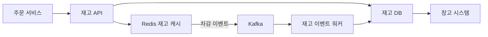
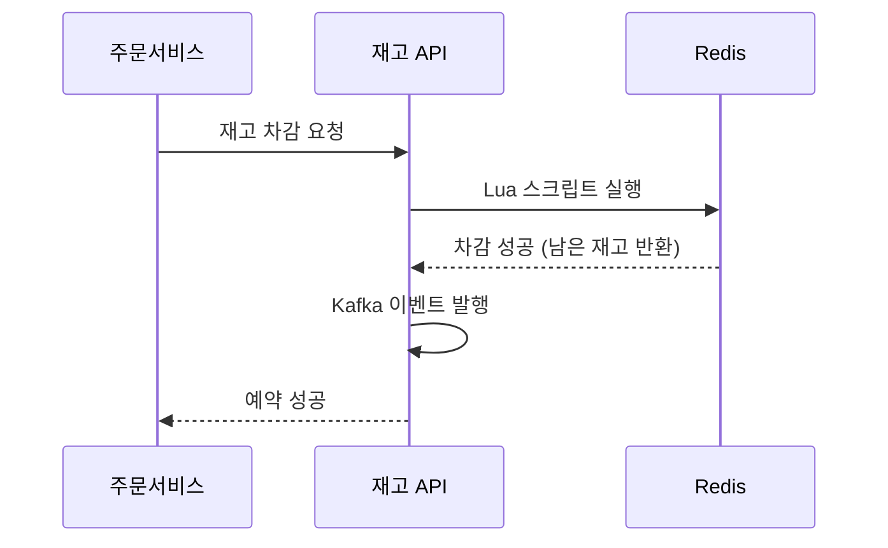
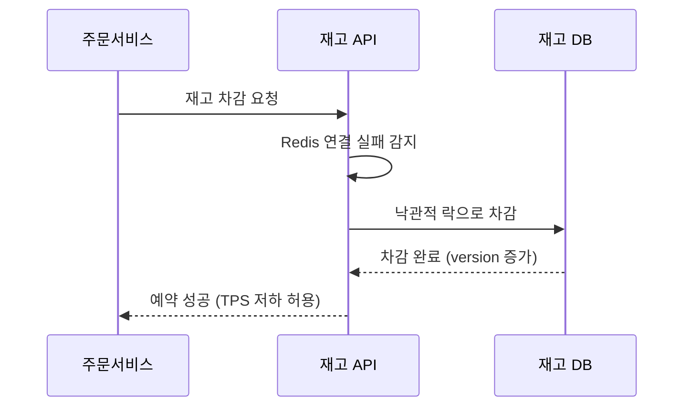
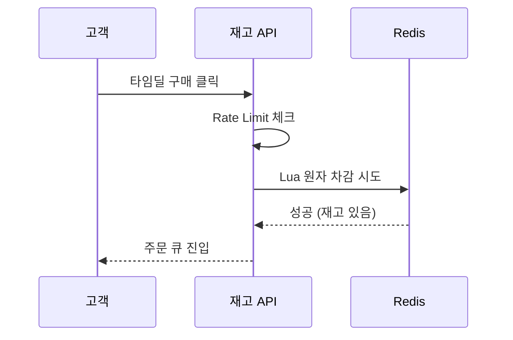

> **한 줄 요약**: Redis 원자 연산으로 초과판매를 막고, 예약/가용/판매 분리 모델로 정합성을 유지하며, 분산 락으로 타임딜의 극한 동시성을 처리하는 것이다.

## 실제 문제: 초과판매(Oversell) 사고

2021년 11번가 타임딜에서 100개 한정 판매 상품의 주문이 마감 후 143건으로 확인됐습니다. 43명에게 "재고 없음" 안내 후 환불 처리, 공정거래위원회 조사로 이어졌습니다.

원인은 재고 조회와 차감 사이의 **경쟁 조건(Race Condition)** 이었습니다.

```
스레드 A: 재고 확인 → 1개 남음 → (컨텍스트 스위치) → 주문 처리
스레드 B: 재고 확인 → 1개 남음 → 주문 처리
스레드 A: 재고 차감 → 0개
스레드 B: 재고 차감 → -1개 (초과판매!)
```

재고 시스템이 해결해야 할 핵심 문제:

- **초과판매 방지**: 동시 주문이 재고보다 많이 처리되면 안 됨
- **재고 정합성**: DB, Redis, 창고 시스템 간 재고 수치가 항상 일치
- **타임딜 극한 트래픽**: 평소 100배 트래픽에서도 정확하게 처리
- **다중 창고 조율**: 전국 창고 재고를 통합 관리
- **반품/취소 처리**: 반품된 재고 복구를 원자적으로 처리

---

## 설계 의사결정 로드맵

### 결정 1: 동시성 제어 — DB Lock vs Redis 분산 락 vs 낙관적 락

**문제**: 만 명이 동시에 재고 1개 남은 상품을 클릭할 때, 정확히 1명만 성공하게 어떻게 보장하는가?

| 후보 | 장점 | 단점 | 언제 적합 |
|------|------|------|----------|
| DB 비관적 락 (SELECT FOR UPDATE) | 구현 단순, DB 레벨 원자성 | 락 경합으로 TPS 급감, 데드락 위험 | 동시 요청 수십 건 이하 |
| Redis 분산 락 (Redlock) | 인메모리 고속, TTL로 데드락 방지 | Redis 장애 시 락 소실 | 타임딜 극한 동시 트래픽 |
| 낙관적 락 (버전 컬럼) | 락 없이 충돌 감지, 읽기 성능 좋음 | 충돌 시 재시도 필요, 충돌률 높으면 CPU 낭비 | 충돌 빈도가 낮은 일반 상품 |
| Redis 원자 Lua 스크립트 | 원자 실행 보장, 락 없이 check-and-decrement | Redis 단일 장애점 | 재고 차감 같은 단순 원자 연산 |

**우리의 선택: 일반 주문 → 낙관적 락, 타임딜 → Redis Lua 원자 스크립트**
- 일반 상품은 동시 충돌이 드물어 낙관적 락의 재시도 비용이 낮습니다. 타임딜은 수천 명이 동시에 같은 상품을 클릭하면 재시도율이 99%에 달해 CPU가 폭발합니다. Redis 단일 스레드 특성을 활용한 Lua 스크립트가 락 없이 직렬화합니다.
- 안 하면: 비관적 락을 타임딜에 쓰면 DB 커넥션 풀 100개가 전부 SELECT FOR UPDATE 대기 상태로 묶여 타임딜 시작 30초 만에 503 오류가 발생합니다.

### 결정 2: 재고 차감 시점 — 장바구니 vs 주문 시 vs 결제 완료 시

**문제**: 장바구니에 담을 때 차감하면 "담아두고 안 사는" 고객이 다른 사람의 구매를 막습니다.

| 후보 | 장점 | 단점 | 언제 적합 |
|------|------|------|----------|
| 장바구니 담을 때 차감 | 고객에게 재고 보장 | 허위 품절 발생, 악용 가능 | 재고 극소수 고가품 |
| 주문 생성 시 차감 (예약) | 결제 진행 중 재고 보호 | 결제 타임아웃 동안 재고 묶임 | 일반 e-커머스 표준 |
| 결제 완료 후 차감 | 구현 단순 | 동시 결제 시 초과판매 위험 | 재고 충분해 초과판매 무해한 경우 |
| 타임드 예약 (15분 홀드) | 재고 보호 + 허위 품절 방지 | 예약 만료 처리 배치 필요 | 항공권, 콘서트 티켓 |

**우리의 선택: 주문 생성 시 예약 차감 + 결제 완료 시 확정**
- 주문 버튼을 누르는 순간 `reserved` 증가, `available` 감소. 결제 완료 시 `reserved` 감소, `sold` 증가. 결제 실패나 15분 타임아웃 시 예약을 취소해 `available`을 복구합니다.
- 안 하면: 결제 완료 후 차감하면 100개 재고에 200명이 동시에 결제를 진행하고, 100명은 결제는 됐는데 재고 차감 실패로 환불 처리가 됩니다.

### 결정 3: 재고 데이터 모델 — 단일 숫자 vs 이벤트 소싱 vs 예약/가용 분리

**문제**: 재고를 `stock_count = 100` 숫자 하나로 관리하면 "지금 재고가 왜 37개야?"라는 질문에 답할 수 없습니다.

| 후보 | 장점 | 단점 | 언제 적합 |
|------|------|------|----------|
| 단일 숫자 컬럼 | 구현 단순, 조회 O(1) | 재고 변경 이력 없음, 불일치 추적 불가 | 소규모 |
| 이벤트 소싱 | 완전한 감사 추적, 재고 불일치 원인 파악 | 현재 재고 계산에 집계 필요 | 금융 수준 감사 필요 |
| 예약/가용/판매 분리 | 진행 중 상태 추적 가능 | 세 컬럼 합산 검증 필요 | 결제 진행 중 재고 보호 필요 |
| 예약 분리 + 이벤트 로그 병행 | 실시간 상태 + 감사 추적 모두 가능 | 구현 복잡도 | 대형 e-커머스 표준 |

**우리의 선택: 예약/가용/판매 분리 + 재고 이벤트 로그 병행**
- `available + reserved + sold = total_stock` 불변식이 깨지면 즉시 버그를 감지합니다. 이벤트 로그는 어떤 주문이 언제 얼마나 차감했는지 완전히 추적하고, 불일치 발생 시 로그를 재생(replay)해 현재 재고를 재계산할 수 있습니다.
- 안 하면: 단일 숫자만 쓰면 재고가 틀렸을 때 원인 추적에 수일이 걸리고, 전체 재고 실사 동안 해당 상품 판매를 중단해야 합니다.

### 결정 4: 다중 창고 재고 — 단일 풀 vs 창고별 분리 vs 가상 통합

**문제**: 서울 창고에 재고 0개, 부산 창고에 10개일 때 서울 고객에게 "재고 있음"으로 표시해야 하는가?

| 후보 | 장점 | 단점 | 언제 적합 |
|------|------|------|----------|
| 단일 통합 풀 | 재고 효율 최대화 | 배송지-창고 매칭 없어 배송비 최적화 불가 | 창고 1~2개 소규모 |
| 창고별 완전 분리 | 배송지별 최적 창고 선택 | 창고 간 불균형, 일부 창고 품절 시 판매 불가 | 지역별 상품 분류 다른 경우 |
| 가상 통합 + 배송 라우팅 | 전체 재고 표시, 배송비·시간 최적 창고 선택 | 라우팅 로직 복잡 | 전국 당일배송 보장 서비스 |

**우리의 선택: 가상 통합 재고 + 창고별 배송 라우팅**
- 고객에게는 전국 재고 합계로 표시하고, 주문 시 고객 주소와 창고별 재고/배송 시간을 고려해 최적 창고를 배정합니다.
- 안 하면: 창고별 분리 시 서울 창고만 0이 되면 전국에 재고가 있어도 서울 고객에게 품절로 표시됩니다.

---

## 1. 요구사항 분석 및 규모 추정

### 기능 요구사항

1. **재고 조회**: 현재 재고 수량 및 가용 여부 실시간 표시
2. **재고 예약**: 주문 생성 시 구매 수량만큼 예약 차감
3. **재고 확정**: 결제 완료 시 예약 → 판매 확정
4. **재고 복구**: 결제 실패, 취소, 반품 시 원상복구
5. **재고 보충**: 입고, 반품 재검수 완료 후 가용 재고 증가
6. **다중 창고**: 창고별 재고 관리 및 최적 창고 배정
7. **이력 추적**: 모든 재고 변동 사유, 주문 번호, 타임스탬프 기록

### 비기능 요구사항

- **정확성**: 초과판매 0건 (최우선)
- **가용성**: 99.99%
- **지연시간**: 재고 조회 P99 < 20ms, 재고 차감 P99 < 50ms
- **처리량**: 평상시 TPS 5,000, 타임딜 피크 TPS 50,000

### 규모 추정

```
일일 주문: 100만 건 × 평균 2.5개 = 250만 재고 차감 이벤트
초당 평균 TPS: 250만 / 86,400 ≈ 29 TPS
타임딜 피크: 30분 내 10만 건 → 피크 TPS 약 560

저장소:
  - 재고 테이블: 500만 행 × 200 bytes = 1 GB
  - 재고 이벤트 로그: 일 250만 건 × 500 bytes × 365일 = 456 GB/년
  - Redis 캐시: 500만 SKU × 100 bytes = 500 MB
```

---

## 2. 고수준 아키텍처

> **비유:** 도서관에 인기 도서 1권에 100명이 동시에 빌리려 합니다. 사서(Redis)는 단일 스레드로 한 명씩 처리합니다. 첫 번째 사람이 대출에 성공하면 나머지 99명에게 "대출 중"이라고 말합니다. DB(메인 전산)는 나중에 사서 장부와 동기화됩니다.



**데이터 흐름**:

| 단계 | 처리 |
|------|------|
| 1 | 주문 서비스 → 재고 API 호출 |
| 2 | 재고 API → Redis Lua 스크립트로 원자 차감 시도 |
| 3 | 차감 성공 → Kafka에 재고 차감 이벤트 발행 |
| 4 | 재고 이벤트 워커 → DB에 영구 기록 |
| 5 | 창고 시스템 → DB 구독 → 실물 피킹(picking) 시작 |

핵심은 **Redis 원자 차감이 진실의 원천**이라는 점입니다. DB는 약간의 지연을 허용하는 대신 Redis 다운 시 복구 기반이 됩니다.

**재고 차감 정상 흐름 (Redis Lua)**



**Redis 장애 시 DB 폴백 흐름**



---

## 3. 핵심 컴포넌트 상세 설계

### 3.1 재고 DB 스키마

```sql
CREATE TABLE inventory (
    sku_id        BIGINT       NOT NULL,
    warehouse_id  INT          NOT NULL,
    total_stock   INT          NOT NULL DEFAULT 0,
    available     INT          NOT NULL DEFAULT 0,
    reserved      INT          NOT NULL DEFAULT 0,
    sold          INT          NOT NULL DEFAULT 0,
    version       BIGINT       NOT NULL DEFAULT 0,
    updated_at    DATETIME(3)  NOT NULL,
    PRIMARY KEY (sku_id, warehouse_id),
    CONSTRAINT chk_stock CHECK (
        available >= 0 AND reserved >= 0 AND sold >= 0
        AND available + reserved + sold = total_stock
    )
);

-- 재고 이벤트 로그 (Append-Only)
CREATE TABLE inventory_event (
    id            BIGINT       NOT NULL AUTO_INCREMENT,
    sku_id        BIGINT       NOT NULL,
    warehouse_id  INT          NOT NULL,
    event_type    VARCHAR(30)  NOT NULL,  -- RESERVE, CONFIRM, RELEASE, RESTOCK
    quantity      INT          NOT NULL,  -- 양수: 증가, 음수: 감소
    order_id      BIGINT,
    reason        VARCHAR(200),
    created_at    DATETIME(3)  NOT NULL DEFAULT NOW(3),
    PRIMARY KEY (id),
    INDEX idx_sku_created (sku_id, created_at),
    INDEX idx_order (order_id)
);

-- 재고 예약 테이블 (주문 단위 예약 추적)
CREATE TABLE inventory_reservation (
    reservation_id  BIGINT      NOT NULL AUTO_INCREMENT,
    order_id        BIGINT      NOT NULL,
    sku_id          BIGINT      NOT NULL,
    warehouse_id    INT         NOT NULL,
    quantity        INT         NOT NULL,
    status          VARCHAR(20) NOT NULL DEFAULT 'ACTIVE',  -- ACTIVE, CONFIRMED, CANCELLED
    expires_at      DATETIME(3) NOT NULL,  -- 15분 후 만료
    created_at      DATETIME(3) NOT NULL DEFAULT NOW(3),
    PRIMARY KEY (reservation_id),
    UNIQUE KEY uk_order_sku (order_id, sku_id),
    INDEX idx_expires (status, expires_at)
);
```

`available + reserved + sold = total_stock` CHECK 제약이 DB 레벨에서 불변식을 강제합니다. 어떤 버그로 합이 달라지면 즉시 DB가 오류를 반환합니다.

### 3.2 Redis 원자 재고 차감 — Lua 스크립트

Redis의 핵심 가치는 **단일 스레드 + Lua 스크립트 원자 실행**입니다. 실행 중 다른 명령이 끼어들 수 없어 재고 조회와 차감 사이의 경쟁 조건을 원천 차단합니다.

```lua
-- KEYS[1]: 재고 키 ("inv:{skuId}:{warehouseId}")
-- ARGV[1]: 차감할 수량
-- 반환값: 차감 후 남은 available, -1이면 재고 부족, -2이면 캐시 미스

local key = KEYS[1]
local qty = tonumber(ARGV[1])

local available = tonumber(redis.call('HGET', key, 'available'))
if available == nil then return -2 end  -- 캐시 미스: DB에서 로드 필요
if available < qty then return -1 end   -- 재고 부족

redis.call('HINCRBY', key, 'available', -qty)
redis.call('HINCRBY', key, 'reserved', qty)

return available - qty
```

```java
@Service
@RequiredArgsConstructor
public class InventoryRedisService {

    private final StringRedisTemplate redisTemplate;
    private final RedisScript<Long> decrementScript;
    private static final int RESERVATION_TTL_SECONDS = 900; // 15분

    public ReservationResult reserve(long skuId, int warehouseId, int quantity) {
        String key = "inv:" + skuId + ":" + warehouseId;

        Long result = redisTemplate.execute(
            decrementScript,
            Collections.singletonList(key),
            String.valueOf(quantity),
            String.valueOf(RESERVATION_TTL_SECONDS)
        );

        if (result == null || result == -2L) {
            loadInventoryFromDb(skuId, warehouseId);  // 캐시 미스: DB 로드 후 재시도
            result = redisTemplate.execute(
                decrementScript,
                Collections.singletonList(key),
                String.valueOf(quantity),
                String.valueOf(RESERVATION_TTL_SECONDS)
            );
        }

        return (result == null || result < 0)
            ? ReservationResult.outOfStock()
            : ReservationResult.success(result);
    }
}
```

### 3.3 낙관적 락 — 일반 주문 재고 차감

일반 상품은 동시 충돌이 드뭅니다. 낙관적 락은 버전 번호로 충돌을 감지하고 충돌 시에만 재시도합니다.

```java
@Retryable(value = OptimisticLockException.class, maxAttempts = 3)
@Transactional
public boolean reserveWithOptimisticLock(long skuId, int warehouseId, long orderId, int quantity) {

    for (int attempt = 0; attempt < MAX_RETRY; attempt++) {
        Inventory inv = inventoryRepository.findBySkuAndWarehouse(skuId, warehouseId);
        if (inv == null || inv.getAvailable() < quantity) return false;

        // version 불일치 시 0 rows updated → 재시도
        int updated = inventoryRepository.decrementAvailable(
            skuId, warehouseId, quantity, inv.getVersion());

        if (updated == 1) {
            saveEvent(skuId, warehouseId, orderId, -quantity, "RESERVE");
            return true;
        }
        sleepMs(10L * (1L << attempt));  // 지수 백오프
    }
    return false;
}
```

```java
@Query("""
    UPDATE inventory
    SET available = available - :qty,
        reserved  = reserved  + :qty,
        version   = version   + 1,
        updated_at = NOW(3)
    WHERE sku_id = :skuId AND warehouse_id = :warehouseId
      AND available >= :qty AND version = :version
    """)
@Modifying
int decrementAvailable(@Param("skuId") long skuId, @Param("warehouseId") int warehouseId,
    @Param("qty") int qty, @Param("version") long version);
```

`version = :version` 조건이 핵심입니다. 다른 트랜잭션이 이미 차감했으면 version이 바뀌어 UPDATE가 0 rows를 반환하고, 이를 감지해 재시도합니다.

### 3.4 예약 만료 처리 — 좀비 예약 자동 해제

결제 도중 이탈한 사용자의 예약이 해제되지 않으면 재고가 영구적으로 묶입니다.

```java
@Component
@RequiredArgsConstructor
public class ReservationExpiryScheduler {

    // ShedLock: 다중 인스턴스 환경에서 하나의 인스턴스만 실행하도록 보장
    @Scheduled(fixedRate = 60_000)
    @SchedulerLock(name = "expireReservations", lockAtLeastFor = "50s", lockAtMostFor = "55s")
    @Transactional
    public void expireStaleReservations() {
        List<InventoryReservation> expired = reservationRepo
            .findExpiredActive(LocalDateTime.now());

        for (InventoryReservation res : expired) {
            inventoryRepo.releaseReservation(res.getSkuId(), res.getWarehouseId(), res.getQuantity());
            redisService.releaseReservation(res.getSkuId(), res.getWarehouseId(), res.getQuantity());
            res.setStatus("CANCELLED");
            reservationRepo.save(res);
        }
    }
}
```

### 3.5 다중 창고 라우팅

```java
@Service
@RequiredArgsConstructor
public class WarehouseRoutingService {

    public WarehouseAssignment selectWarehouse(long skuId, int quantity, Address customerAddr) {
        return inventoryRepo.findWarehousesWithStock(skuId, quantity).stream()
            .filter(w -> w.getAvailable() >= quantity)
            .sorted(Comparator
                // 당일배송 가능 창고 우선
                .comparingInt((WarehouseStock w) ->
                    deliveryEstimator.canDeliverToday(w.getWarehouseId(), customerAddr) ? 0 : 1)
                // 배송비 낮은 순
                .thenComparingInt(w ->
                    deliveryEstimator.estimateCost(w.getWarehouseId(), customerAddr))
            )
            .findFirst()
            .map(w -> new WarehouseAssignment(w.getWarehouseId(), quantity))
            .orElseThrow(() -> new OutOfStockException(skuId));
    }
}
```

---

## 4. 장애 시나리오와 대응

### Redis 장애 — 재고 캐시 전체 소실

초당 5,000건의 재고 조회가 모두 DB에 직접 몰립니다.

1. **Cache Fallback**: Redis 미스 시 DB에서 읽고 Redis를 재워밍합니다. 동시에 모든 요청이 DB를 치지 않도록 단일 요청만 DB를 읽도록 직렬화합니다.
2. **Redis Cluster**: 마스터 3대 + 레플리카 3대로 단일 장애점을 제거합니다.
3. **DB 폴백**: Redis가 완전히 죽으면 DB 낙관적 락으로 차감합니다. TPS는 떨어지지만 초과판매 없이 서비스를 유지합니다.

```java
public ReservationResult reserve(long skuId, int warehouseId, int quantity) {
    try {
        return reserveViaRedis(skuId, warehouseId, quantity);
    } catch (RedisConnectionFailureException e) {
        log.warn("Redis 장애 감지, DB 폴백 전환: skuId={}", skuId);
        boolean success = reserveWithOptimisticLock(skuId, warehouseId, FALLBACK_ORDER_ID, quantity);
        return success ? ReservationResult.success(-1) : ReservationResult.outOfStock();
    }
}
```

### 타임딜 시작 — 동시 5만 요청이 1초에 몰림

1. **Rate Limiting per User**: 동일 사용자가 0.1초 안에 3회 이상 요청하면 429 반환
2. **대기열(Queue)**: 타임딜 상품은 Kafka 큐에 넣고 워커가 순서대로 차감, 결과를 SSE로 푸시
3. **Redis 재고 선차감**: 타임딜 시작 전 Redis에 재고를 미리 적재하고 Lua 스크립트로 원자 차감

**타임딜 요청 처리 흐름**



### 재고 불일치 — Redis와 DB 수치가 다름

Redis 차감 후 Kafka 발행은 성공했지만 워커의 DB UPDATE가 실패한 경우입니다.

1. **주기적 정합성 검증**: 매 1시간 Redis와 DB 재고를 비교. 불일치 발견 시 DB 기준으로 Redis를 보정합니다.
2. **이벤트 로그 재생**: DB 수치가 의심스러울 때 `inventory_event` 로그를 재생해 재계산·검증합니다.
3. **보수적 방향**: 불일치 시 항상 낮은 수치를 채택합니다. 품절 표시가 초과판매보다 낫습니다.

> **운영 주의**: 500만 SKU × 50창고 = 2억 5천만 행을 매시간 풀 스캔하면 부하가 과도합니다. `updated_at >= NOW() - INTERVAL 2 HOUR`로 변경된 항목만 증분 대조하고, 전체 대조는 새벽에 1일 1회만 수행합니다.

```java
@Scheduled(cron = "0 0 * * * *")
public void reconcileInventory() {
    List<Inventory> dbInventories = inventoryRepo.findAll();
    int mismatchCount = 0;

    for (Inventory db : dbInventories) {
        String key = "inv:" + db.getSkuId() + ":" + db.getWarehouseId();
        Long redisAvailable = getRedisAvailable(key);

        if (redisAvailable != null && Math.abs(redisAvailable - db.getAvailable()) > 0) {
            log.warn("재고 불일치: skuId={}, redis={}, db={}", db.getSkuId(), redisAvailable, db.getAvailable());
            redisTemplate.opsForHash().put(key, "available", String.valueOf(db.getAvailable()));
            mismatchCount++;
        }
    }

    if (mismatchCount > 0)
        alertService.send(AlertLevel.WARNING, "재고 불일치 " + mismatchCount + "건 보정 완료");
}
```

### 반품 폭주 — 대량 재고 복구

대규모 리콜로 1만 건이 동시에 반품 처리될 때, DB UPDATE를 직접 10,000번 날리지 않고 Kafka에 반품 이벤트를 발행해 워커가 순서대로 복구합니다.

---

## 5. 확장 포인트

**Flash Sale 전용 재고 분리**: 타임딜 상품은 별도 `flash_inventory` 테이블과 Redis 네임스페이스를 사용해 일반 재고 시스템에 영향을 주지 않도록 격리합니다.

**재고 예측 및 자동 발주**: 재고 이벤트 로그를 실시간 집계해 소진 속도를 예측합니다. 예상 소진 시점이 리드타임(7일)보다 가까워지면 자동 발주 이벤트를 생성합니다.

**재고 이벤트 스트리밍**: `inventory_event`를 Kafka로 스트리밍해 다운스트림 시스템이 구독합니다.
- **검색 엔진**: 재고 소진 시 즉시 품절 표시
- **가격 엔진**: 재고 부족 시 자동 가격 인상 트리거
- **마케팅**: 재고 5개 이하 시 "97명이 보고 있어요" 알림

---

## 면접 포인트

### 면접 포인트 1️⃣ "DB 트랜잭션 하나로 재고 차감하면 되지 않나요?"

단일 서버·단일 DB에서는 맞습니다. 그러나 타임딜처럼 초당 5만 요청이 같은 행의 `available` 컬럼을 UPDATE하면, 모든 트랜잭션이 같은 행의 락을 기다리며 직렬화됩니다. 결과는 TPS가 수십 이하로 떨어지고 타임아웃이 폭주합니다. Redis Lua 스크립트는 DB 락 없이 원자성을 보장하면서 초당 수십만 연산을 처리합니다.

### 면접 포인트 2️⃣ "Redis가 죽으면 어떻게 되나요?"

- **폴백**: DB 낙관적 락으로 전환. TPS는 떨어지지만 초과판매는 방지
- **자동 복구**: Redis Sentinel/Cluster로 페일오버 구성 시 장애 시간 수십 초 이내
- **워밍업**: 재기동 후 DB 수치로 Redis 캐시 재적재

### 면접 포인트 3️⃣ "낙관적 락과 비관적 락 중 무엇을 써야 하나요?"

충돌 빈도에 따라 다릅니다.

- **일반 상품 (충돌 드묾)**: 낙관적 락 — 락 오버헤드 없음
- **타임딜 (충돌 거의 확실)**: 낙관적 락의 재시도 비용이 폭발 → Redis 원자 스크립트 적합

### 면접 포인트 4️⃣ "재고가 -1이 됐습니다. 어떻게 디버깅하나요?"

- `inventory_event` 로그를 해당 SKU로 필터링해 시간 순 조회
- `SUM(quantity)`가 현재 `available`과 일치하는지 확인
- 불일치 시점의 이벤트로 어떤 주문 ID가 차감했는지 추적
- 이것이 이벤트 로그를 병행하는 핵심 이유

### 면접 포인트 5️⃣ "100개 재고에 99명이 동시에 1개씩 주문했을 때 몇 명이 성공하나요?"

Redis Lua 스크립트 기준으로 정확히 **99명**이 성공합니다. Lua 스크립트는 단일 스레드로 직렬 실행되어 check-and-decrement가 원자적으로 수행됩니다. 100개에서 99번 차감하면 1개가 남고, 나머지 요청은 모두 "재고 부족" 응답을 받습니다.

### 면접 포인트 6️⃣ "글로벌 서비스로 확장할 때 어떻게 하나요?"

지역별로 재고를 할당(파티셔닝)합니다.

- 전체 재고 1,000개 중 한국 700개, 미국 300개 사전 배분
- 지역별 차감은 해당 지역 Redis/DB에서만 처리 → 네트워크 레이턴시 없음
- 한쪽이 먼저 소진되면 중앙 재고 풀에서 보충하는 **2단계 구조**로 운영
