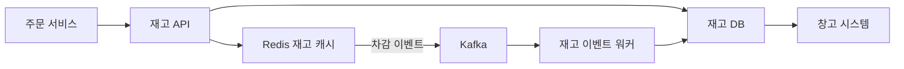

> **한 줄 요약**: 재고 시스템의 핵심은 Redis 원자 연산으로 초과판매를 막고, 예약/가용/판매 분리 모델로 정합성을 유지하며, 분산 락으로 타임딜의 극한 동시성을 처리하는 것이다.

## 실제 문제: 초과판매(Oversell) 사고

2021년 11번가 타임딜에서 실제로 벌어진 일입니다. 인기 전자제품을 50% 할인가로 100개 한정 판매했는데, 주문이 마감된 후 확인해보니 실제로 처리된 주문이 143건이었습니다. 재고는 100개인데 143명이 구매 확정을 받은 것입니다. 결과는 43명에게 "죄송합니다, 재고가 없습니다" 안내 후 환불 처리, 고객 신뢰 하락, 공정거래위원회 조사였습니다.

원인은 단순했습니다. 재고 조회와 차감 사이에 **경쟁 조건(Race Condition)** 이 있었습니다.

```
스레드 A: 재고 확인 → 1개 남음 → (여기서 컨텍스트 스위치) → 주문 처리
스레드 B: 재고 확인 → 1개 남음 → 주문 처리
스레드 A: 재고 차감 → 0개
스레드 B: 재고 차감 → -1개 (초과판매!)
```

마켓컬리 새벽배송의 경우 더 복잡합니다. 밤 11시에 새벽 배송 마감이 되면 수만 명이 동시에 장바구니를 결제합니다. 여기서 재고가 맞지 않으면 새벽 4시에 집에 도착해야 할 상품이 없는 상황이 됩니다. 쿠팡 로켓배송도 동일합니다. "오늘 밤 12시까지 주문 시 내일 아침 배송" 보장은 재고 시스템의 실시간 정확성이 전제입니다.

재고 시스템이 해결해야 할 핵심 문제:
- **초과판매 방지**: 동시 주문이 재고보다 많이 처리되면 안 됨
- **재고 정합성**: DB, Redis, 창고 시스템 간 재고 수치가 항상 일치해야 함
- **타임딜 극한 트래픽**: 평소 100배 트래픽이 몰려도 정확하게 처리
- **다중 창고 조율**: 서울 창고 5개, 부산 창고 3개의 재고를 어떻게 통합 관리하는가
- **반품/취소 처리**: 반품된 상품의 재고 복구를 어떻게 원자적으로 처리하는가

---

## 설계 의사결정 로드맵

재고 시스템 설계에서 순서대로 답해야 할 핵심 결정 4가지입니다. 각 결정에서 "왜 이 선택인가"를 명확히 하지 않으면 면접에서 "그냥 DB UPDATE로 처리하면 되지 않나요?"라는 후속 질문에 답할 수 없습니다.

### 결정 1: 동시성 제어 — DB Lock vs Redis 분산 락 vs 낙관적 락

**문제**: 만 명이 동시에 재고 1개 남은 상품 버튼을 클릭할 때, 정확히 1명만 구매 성공하게 어떻게 보장하는가?

| 후보 | 장점 | 단점 | 언제 적합 |
|------|------|------|----------|
| DB 비관적 락 (SELECT FOR UPDATE) | 구현 단순, DB 레벨 원자성 | 락 경합으로 TPS 급감, 데드락 위험, DB 커넥션 고갈 | 동시 요청 수십 건 이하 |
| Redis 분산 락 (Redlock) | 인메모리 고속, DB 부하 분산, TTL로 데드락 방지 | Redis 장애 시 락 소실, 구현 복잡도 증가 | 타임딜처럼 극한 동시 트래픽 |
| 낙관적 락 (버전 컬럼) | 락 없이 충돌 감지, 읽기 성능 좋음 | 충돌 시 재시도 필요, 충돌률 높으면 CPU 낭비 | 충돌 빈도가 낮은 일반 상품 |
| Redis 원자 Lua 스크립트 | 원자 실행 보장, 락 없이 check-and-decrement | Redis 단일 장애점, 스크립트 복잡도 | 재고 차감처럼 단순 원자 연산 |

**우리의 선택: 일반 주문 → 낙관적 락, 타임딜 → Redis Lua 원자 스크립트**
- 이유: 일반 상품은 동시 주문 충돌이 드물어 낙관적 락의 재시도 비용이 낮습니다. 타임딜처럼 수천 명이 동시에 같은 상품을 클릭하면 낙관적 락의 재시도율이 99%에 달해 CPU가 폭발합니다. 이때는 Redis의 단일 스레드 특성을 활용해 Lua 스크립트로 조회-차감을 원자 처리하면 락 없이 직렬화됩니다.
- 안 하면: 비관적 락을 타임딜에 쓰면 DB 커넥션 풀 100개가 모두 SELECT FOR UPDATE 대기 상태로 묶입니다. 새 요청은 커넥션을 얻지 못해 타임아웃되고, 결국 타임딜 시작 30초 만에 서비스 전체가 503 오류를 반환합니다.

### 결정 2: 재고 차감 시점 — 장바구니 vs 주문 시 vs 결제 완료 시

**문제**: 고객이 상품을 장바구니에 담은 순간부터 재고를 차감하면 "담아두고 안 사는" 고객이 다른 사람의 구매를 막습니다. 반대로 결제 완료 후에 차감하면 결제 도중 재고가 초과될 수 있습니다.

| 후보 | 장점 | 단점 | 언제 적합 |
|------|------|------|----------|
| 장바구니 담을 때 차감 | 고객에게 재고 보장 | 허위 품절 발생, 악용 가능 (경쟁사 카트에 담기) | 재고 극소수(1~2개) 고가품 |
| 주문 생성 시 차감 (예약) | 결제 진행 중 재고 보호 | 결제 실패 시 즉시 복구 필요, 결제 타임아웃 동안 재고 묶임 | 일반 e-커머스 표준 |
| 결제 완료 후 차감 | 구현 단순 | 동시 결제 시 초과판매 위험 | 재고가 충분해 초과판매 무해한 경우 |
| 타임드 예약 (15분 홀드) | 재고 보호 + 허위 품절 방지 | 예약 만료 처리 배치 필요, 만료 중 재고 복구 타이밍 | 항공권, 콘서트 티켓 |

**우리의 선택: 주문 생성 시 예약 차감 + 결제 완료 시 확정**
- 이유: 고객이 주문 버튼을 누르는 순간 `reserved` 수량을 증가시키고 `available` 수량을 감소시킵니다. 결제가 완료되면 `reserved`를 줄이고 `sold`를 늘립니다. 결제 실패나 15분 타임아웃 시 예약을 취소해 `available`을 복구합니다. 이 방식은 결제 진행 중인 고객에게 재고를 보호하면서, 타임아웃된 좀비 예약이 재고를 영구 점유하지 않도록 만료 처리가 됩니다.
- 안 하면: 결제 완료 후 차감하면 100개 재고에 200명이 동시에 결제를 진행할 수 있습니다. 처음 100명이 결제 완료 후 재고 차감에 성공하고, 나머지 100명은 결제는 됐는데 재고 차감 실패로 주문이 취소됩니다. 이미 빠져나간 돈을 돌려주는 환불 처리 + 고객 항의가 쏟아집니다.

### 결정 3: 재고 데이터 모델 — 단일 숫자 vs 이벤트 소싱 vs 예약/가용 분리

**문제**: 재고를 `stock_count = 100` 숫자 하나로 관리하면 단순하지만, "지금 재고가 왜 37개야?"라는 질문에 답할 수 없습니다.

| 후보 | 장점 | 단점 | 언제 적합 |
|------|------|------|----------|
| 단일 숫자 컬럼 | 구현 단순, 조회 O(1) | 재고 변경 이력 없음, 불일치 원인 추적 불가 | 감사 불필요한 소규모 |
| 이벤트 소싱 (재고 원장) | 완전한 감사 추적, 재고 불일치 원인 파악 | 현재 재고 계산에 집계 필요, 성능 최적화 복잡 | 금융 수준 감사 필요 시 |
| 예약/가용/판매 분리 컬럼 | 진행 중 상태 추적, 예약된 재고 별도 관리 | 세 컬럼 합산 검증 필요 | 결제 진행 중 재고 보호 필요 시 |
| 예약 분리 + 이벤트 로그 병행 | 실시간 상태 + 감사 추적 모두 가능 | 구현 복잡도, 이벤트 로그 저장 비용 | 대형 e-커머스 표준 |

**우리의 선택: 예약/가용/판매 분리 + 재고 이벤트 로그 병행**
- 이유: `available + reserved + sold = total_stock` 불변식이 깨지면 즉시 버그를 감지할 수 있습니다. 이벤트 로그는 "어떤 주문이 언제 재고를 얼마나 차감했는가"를 완전히 추적합니다. 재고 불일치 발생 시 이벤트 로그를 재생(replay)해서 현재 재고를 재계산할 수 있어 신뢰성의 최후 방어선이 됩니다.
- 안 하면: 단일 숫자 컬럼만 쓰면 배치 집계 오류, 반품 처리 버그, 창고 시스템 연동 오류 등으로 재고가 틀려졌을 때 원인을 찾는 데 수일이 걸립니다. 재고 불일치로 초과판매가 반복되면 결국 전체 재고 실사를 해야 하고, 그 동안 해당 상품 판매를 중단해야 합니다.

### 결정 4: 다중 창고 재고 — 단일 풀 vs 창고별 분리 vs 가상 통합

**문제**: 쿠팡은 전국에 100개 이상의 풀필먼트 센터를 운영합니다. 서울 창고에 재고 0개, 부산 창고에 10개가 있을 때 서울 고객에게 "재고 있음"으로 표시해야 하는가?

| 후보 | 장점 | 단점 | 언제 적합 |
|------|------|------|----------|
| 단일 통합 풀 | 재고 효율 최대화, 구현 단순 | 배송지-창고 매칭 없어 배송비 최적화 불가 | 창고 1~2개 소규모 |
| 창고별 완전 분리 | 배송지별 최적 창고 선택 | 창고 간 재고 불균형, 일부 창고 품절 시 판매 불가 | 지역별 상품 분류가 다른 경우 |
| 가상 통합 + 배송 라우팅 | 전체 재고 표시, 배송비/시간 최적 창고 선택 | 라우팅 로직 복잡, 배송 SLA 계산 복잡 | 전국 당일배송 보장 서비스 |

**우리의 선택: 가상 통합 재고 + 창고별 배송 라우팅**
- 이유: 고객에게는 전국 재고 합계로 표시해 품절 표시를 최소화하고, 주문 시 고객 주소와 창고별 재고/배송 가능 시간을 고려해 최적 창고를 배정합니다. "오늘 밤 12시까지 주문 시 내일 아침 도착" 계산도 이 라우팅 로직에서 담당합니다.
- 안 하면: 창고별 완전 분리 시 서울 창고 재고만 0이 되면 전국에 재고가 있어도 서울 고객에게는 품절로 표시됩니다. 실제 쿠팡/마켓컬리의 재고 효율이 떨어지고, 부산 창고 재고를 채우기 위한 창고 간 이동(ITT) 비용이 증가합니다.

---

## 1. 요구사항 분석 및 규모 추정

### 기능 요구사항

1. **재고 조회**: 상품 페이지에서 현재 재고 수량 및 가용 여부 실시간 표시
2. **재고 예약**: 주문 생성 시 구매 수량만큼 예약 차감
3. **재고 확정**: 결제 완료 시 예약 → 판매 확정
4. **재고 복구**: 결제 실패, 주문 취소, 반품 시 재고 원상복구
5. **재고 보충**: 입고, 반품 재검수 완료 후 가용 재고 증가
6. **다중 창고**: 창고별 재고 관리 및 주문별 최적 창고 배정
7. **이력 추적**: 모든 재고 변동 사유, 주문 번호, 타임스탬프 기록

### 비기능 요구사항

- **정확성**: 초과판매 0건 (최우선)
- **가용성**: 99.99% (연간 52분 이하 다운타임)
- **지연시간**: 재고 조회 P99 < 20ms, 재고 차감 P99 < 50ms
- **처리량**: 평상시 TPS 5,000, 타임딜 피크 TPS 50,000

### 규모 추정

**트래픽 계산** (중형 e-커머스 기준):

```
일일 주문: 100만 건
주문당 평균 상품 수: 2.5개
일일 재고 차감 이벤트: 250만 건
초당 평균 TPS: 250만 / 86,400 ≈ 29 TPS

타임딜 피크 (30분 내 10만 건):
30분 = 1,800초
평균 TPS: 10만 / 1,800 ≈ 56 TPS
피크 TPS (평균 × 10): 약 560 TPS

상품 수: 500만 개
창고 수: 50개
창고당 평균 SKU: 20만 개
```

**저장소 계산**:

```
재고 테이블: 500만 행 × 200 bytes = 1 GB
재고 이벤트 로그: 일 250만 건 × 500 bytes × 365일 = 456 GB/년
Redis 재고 캐시: 500만 SKU × 100 bytes = 500 MB
```

---

## 2. 고수준 아키텍처

### 비유: 도서관 사서 시스템

도서관에 인기 도서가 1권 있고 100명이 동시에 빌리려 한다고 상상해보세요. 사서(Redis)가 대출 장부를 관리합니다. 100명이 동시에 "빌려주세요"라고 외쳐도, 사서는 한 명씩 순서대로 처리합니다(단일 스레드). 첫 번째 사람이 대출에 성공하면 사서는 나머지 99명에게 "죄송합니다, 대출 중입니다"라고 말합니다. DB(도서관 메인 전산 시스템)는 나중에 사서 장부와 동기화됩니다.

재고 시스템도 동일합니다. Redis가 인메모리 사서 역할을 하고, DB는 영구 기록을 담당합니다.



**데이터 흐름 설명**:

1. 주문 서비스가 재고 API를 호출합니다.
2. 재고 API는 Redis에서 Lua 스크립트로 원자 차감을 시도합니다.
3. 차감 성공 시 Kafka에 재고 차감 이벤트를 발행합니다.
4. 재고 이벤트 워커가 DB에 영구 기록합니다.
5. 창고 시스템은 DB를 구독해 실물 피킹(picking) 작업을 시작합니다.

이 구조의 핵심은 **Redis 원자 차감이 진실의 원천(source of truth)** 이라는 점입니다. DB는 약간의 지연을 허용하는 대신 Redis가 다운됐을 때의 복구 기반이 됩니다.

---

## 3. 핵심 컴포넌트 상세 설계

### 3.1 재고 DB 스키마

```sql
-- 재고 마스터 테이블
CREATE TABLE inventory (
    sku_id        BIGINT       NOT NULL,
    warehouse_id  INT          NOT NULL,
    total_stock   INT          NOT NULL DEFAULT 0,   -- 총 재고
    available     INT          NOT NULL DEFAULT 0,   -- 주문 가능 수량
    reserved      INT          NOT NULL DEFAULT 0,   -- 결제 진행 중 예약
    sold          INT          NOT NULL DEFAULT 0,   -- 판매 확정
    version       BIGINT       NOT NULL DEFAULT 0,   -- 낙관적 락 버전
    updated_at    DATETIME(3)  NOT NULL,
    PRIMARY KEY (sku_id, warehouse_id),
    CONSTRAINT chk_stock CHECK (
        available >= 0
        AND reserved >= 0
        AND sold >= 0
        AND available + reserved + sold = total_stock
    )
);

-- 재고 이벤트 로그 (Append-Only)
CREATE TABLE inventory_event (
    id            BIGINT       NOT NULL AUTO_INCREMENT,
    sku_id        BIGINT       NOT NULL,
    warehouse_id  INT          NOT NULL,
    event_type    VARCHAR(30)  NOT NULL,  -- RESERVE, CONFIRM, RELEASE, RESTOCK
    quantity      INT          NOT NULL,  -- 양수: 증가, 음수: 감소
    order_id      BIGINT,
    reason        VARCHAR(200),
    created_at    DATETIME(3)  NOT NULL DEFAULT NOW(3),
    PRIMARY KEY (id),
    INDEX idx_sku_created (sku_id, created_at),
    INDEX idx_order (order_id)
);

-- 재고 예약 테이블 (주문 단위 예약 추적)
CREATE TABLE inventory_reservation (
    reservation_id  BIGINT      NOT NULL AUTO_INCREMENT,
    order_id        BIGINT      NOT NULL,
    sku_id          BIGINT      NOT NULL,
    warehouse_id    INT         NOT NULL,
    quantity        INT         NOT NULL,
    status          VARCHAR(20) NOT NULL DEFAULT 'ACTIVE',  -- ACTIVE, CONFIRMED, CANCELLED
    expires_at      DATETIME(3) NOT NULL,  -- 15분 후 만료
    created_at      DATETIME(3) NOT NULL DEFAULT NOW(3),
    PRIMARY KEY (reservation_id),
    UNIQUE KEY uk_order_sku (order_id, sku_id),
    INDEX idx_expires (status, expires_at)
);
```

`available + reserved + sold = total_stock` CHECK 제약이 DB 레벨에서 불변식을 강제합니다. 어떤 버그로 세 컬럼의 합이 total_stock과 달라지면 즉시 DB가 오류를 반환합니다.

### 3.2 Redis 원자 재고 차감 — Lua 스크립트

Redis의 핵심 가치는 **단일 스레드 + Lua 스크립트 원자 실행**입니다. Lua 스크립트는 실행 중 다른 Redis 명령이 끼어들 수 없어, 재고 조회와 차감 사이의 경쟁 조건을 원천 차단합니다.

```lua
-- inventory_decrement.lua
-- KEYS[1]: 재고 키 (예: "inv:{skuId}:{warehouseId}")
-- ARGV[1]: 차감할 수량
-- ARGV[2]: 예약 TTL (초, 기본 900 = 15분)
-- 반환값: 차감 후 남은 available 수량, -1이면 재고 부족

local key = KEYS[1]
local qty = tonumber(ARGV[1])
local ttl = tonumber(ARGV[2])

-- 현재 가용 재고 조회
local available = tonumber(redis.call('HGET', key, 'available'))

if available == nil then
    -- 캐시 미스: DB에서 로드 필요 신호
    return -2
end

if available < qty then
    -- 재고 부족
    return -1
end

-- 원자적으로 available 감소, reserved 증가
redis.call('HINCRBY', key, 'available', -qty)
redis.call('HINCRBY', key, 'reserved', qty)

-- 예약 만료 추적을 위한 별도 키 설정
local reservation_key = key .. ':rsv'
redis.call('SET', reservation_key, qty, 'EX', ttl)

return available - qty
```

```java
// Spring Boot + Lettuce 클라이언트 구현
@Service
@RequiredArgsConstructor
public class InventoryRedisService {

    private final StringRedisTemplate redisTemplate;
    private final RedisScript<Long> decrementScript;

    private static final String INVENTORY_KEY_PREFIX = "inv:";
    private static final int RESERVATION_TTL_SECONDS = 900; // 15분

    public ReservationResult reserve(long skuId, int warehouseId, int quantity) {
        String key = INVENTORY_KEY_PREFIX + skuId + ":" + warehouseId;

        Long result = redisTemplate.execute(
            decrementScript,
            Collections.singletonList(key),
            String.valueOf(quantity),
            String.valueOf(RESERVATION_TTL_SECONDS)
        );

        if (result == null || result == -2L) {
            // 캐시 미스: DB에서 재고 로드 후 재시도
            loadInventoryFromDb(skuId, warehouseId);
            result = redisTemplate.execute(
                decrementScript,
                Collections.singletonList(key),
                String.valueOf(quantity),
                String.valueOf(RESERVATION_TTL_SECONDS)
            );
        }

        if (result == null || result < 0) {
            return ReservationResult.outOfStock();
        }

        return ReservationResult.success(result);
    }

    private void loadInventoryFromDb(long skuId, int warehouseId) {
        Inventory inv = inventoryRepository.findBySkuAndWarehouse(skuId, warehouseId);
        if (inv == null) return;

        String key = INVENTORY_KEY_PREFIX + skuId + ":" + warehouseId;
        Map<String, String> fields = Map.of(
            "available", String.valueOf(inv.getAvailable()),
            "reserved",  String.valueOf(inv.getReserved()),
            "sold",      String.valueOf(inv.getSold())
        );
        redisTemplate.opsForHash().putAll(key, fields);
    }
}
```

### 3.3 낙관적 락 — 일반 주문 재고 차감

타임딜이 아닌 일반 상품은 동시 충돌이 드뭅니다. 낙관적 락은 락을 잡지 않고 버전 번호로 충돌을 감지합니다. 충돌 시에만 재시도하므로 평균 성능이 훨씬 좋습니다.

```java
@Service
@RequiredArgsConstructor
public class InventoryService {

    private final InventoryRepository inventoryRepository;
    private final InventoryEventRepository eventRepository;

    private static final int MAX_RETRY = 3;

    @Transactional
    public boolean reserveWithOptimisticLock(
            long skuId, int warehouseId, long orderId, int quantity) {

        for (int attempt = 0; attempt < MAX_RETRY; attempt++) {
            Inventory inv = inventoryRepository
                .findBySkuAndWarehouse(skuId, warehouseId);

            if (inv == null || inv.getAvailable() < quantity) {
                return false; // 재고 부족
            }

            // 버전 번호 포함 UPDATE: 버전이 변경됐으면 0 rows updated
            int updated = inventoryRepository.decrementAvailable(
                skuId, warehouseId, quantity, inv.getVersion()
            );

            if (updated == 1) {
                // 성공: 이벤트 로그 기록
                saveEvent(skuId, warehouseId, orderId, -quantity, "RESERVE");
                return true;
            }
            // 충돌: 잠깐 대기 후 재시도 (지수 백오프)
            sleepMs(10L * (1L << attempt));
        }
        return false; // 3회 모두 충돌
    }
}
```

```java
// Repository 레이어 — 버전 포함 UPDATE
@Query("""
    UPDATE inventory
    SET available = available - :qty,
        reserved  = reserved  + :qty,
        version   = version   + 1,
        updated_at = NOW(3)
    WHERE sku_id      = :skuId
      AND warehouse_id = :warehouseId
      AND available   >= :qty
      AND version     = :version
    """)
@Modifying
int decrementAvailable(
    @Param("skuId") long skuId,
    @Param("warehouseId") int warehouseId,
    @Param("qty") int qty,
    @Param("version") long version
);
```

`version = :version` 조건이 핵심입니다. 조회 이후 다른 트랜잭션이 이미 차감했으면 version이 바뀌어 UPDATE가 0 rows를 반환합니다. 이를 감지해 재시도합니다.

### 3.4 예약 만료 처리 — 좀비 예약 자동 해제

결제 도중 이탈한 사용자의 예약이 15분 후 자동 해제되지 않으면, 재고가 영구적으로 묶여 품절이 됩니다. 스케줄러가 주기적으로 만료된 예약을 정리합니다.

```java
@Component
@RequiredArgsConstructor
public class ReservationExpiryScheduler {

    private final InventoryReservationRepository reservationRepo;
    private final InventoryRepository inventoryRepo;

    @Scheduled(fixedDelay = 60_000) // 1분마다 실행
    @Transactional
    public void expireStaleReservations() {
        LocalDateTime now = LocalDateTime.now();
        List<InventoryReservation> expired = reservationRepo
            .findExpiredActive(now); // status=ACTIVE AND expires_at < now

        for (InventoryReservation res : expired) {
            // DB 재고 복구 (낙관적 락 불필요 — 배치 단독 처리)
            inventoryRepo.releaseReservation(
                res.getSkuId(),
                res.getWarehouseId(),
                res.getQuantity()
            );

            // Redis 재고도 복구
            redisService.releaseReservation(
                res.getSkuId(), res.getWarehouseId(), res.getQuantity()
            );

            res.setStatus("CANCELLED");
            reservationRepo.save(res);

            log.info("예약 만료 처리: orderId={}, skuId={}, qty={}",
                res.getOrderId(), res.getSkuId(), res.getQuantity());
        }
    }
}
```

### 3.5 다중 창고 라우팅

주문이 들어오면 고객 주소와 각 창고의 재고, 배송 예상 시간을 종합해 최적 창고를 선택합니다.

```java
@Service
@RequiredArgsConstructor
public class WarehouseRoutingService {

    public WarehouseAssignment selectWarehouse(
            long skuId, int quantity, Address customerAddr) {

        List<WarehouseStock> candidates = inventoryRepo
            .findWarehousesWithStock(skuId, quantity);

        return candidates.stream()
            // 1. 재고 충분한 창고만 필터
            .filter(w -> w.getAvailable() >= quantity)
            // 2. 당일배송 가능 창고 우선
            .sorted(Comparator
                .comparingInt((WarehouseStock w) ->
                    deliveryEstimator.canDeliverToday(w.getWarehouseId(),
                        customerAddr) ? 0 : 1)
                // 3. 배송비 낮은 순 정렬
                .thenComparingInt(w ->
                    deliveryEstimator.estimateCost(w.getWarehouseId(),
                        customerAddr))
            )
            .findFirst()
            .map(w -> new WarehouseAssignment(w.getWarehouseId(), quantity))
            .orElseThrow(() -> new OutOfStockException(skuId));
    }
}
```

---

## 4. 장애 시나리오와 대응

### 시나리오 1: Redis 장애 — 재고 캐시 전체 소실

**발생 상황**: Redis 노드 장애로 재고 캐시가 전부 사라졌습니다. 초당 5,000건의 재고 조회가 모두 DB에 직접 몰립니다.

**대응 방식**:

1. **Cache Fallback**: Redis 미스 시 DB에서 재고를 읽고 Redis에 재워밍합니다. 모든 요청이 동시에 DB를 치지 않도록 Mutex Lock(Redlock 대신 단일 Redis 인스턴스 NX)으로 한 요청만 DB를 읽도록 직렬화합니다.
2. **Redis Cluster**: 마스터 3대 + 레플리카 3대로 단일 장애점을 제거합니다. 노드 하나가 죽어도 레플리카가 즉시 승격합니다.
3. **DB 재고 차감 폴백**: Redis가 완전히 죽으면 DB의 낙관적 락으로 차감합니다. TPS는 떨어지지만 초과판매 없이 서비스를 유지합니다.

```java
public ReservationResult reserve(long skuId, int warehouseId, int quantity) {
    try {
        return reserveViaRedis(skuId, warehouseId, quantity);
    } catch (RedisConnectionFailureException e) {
        // Redis 장애 시 DB 낙관적 락으로 폴백
        log.warn("Redis 장애 감지, DB 폴백 전환: skuId={}", skuId);
        boolean success = reserveWithOptimisticLock(skuId, warehouseId,
            FALLBACK_ORDER_ID, quantity);
        return success
            ? ReservationResult.success(-1) // remaining unknown
            : ReservationResult.outOfStock();
    }
}
```

### 시나리오 2: 타임딜 시작 — 동시 5만 요청이 1초에 몰림

**발생 상황**: 11번가 타임딜 오후 1시 정각. 재고 200개 상품에 대해 0.1초 동안 10만 요청이 들어옵니다.

**대응 방식**:

1. **Rate Limiting per User**: 동일 사용자가 0.1초 안에 3회 이상 요청하면 429 반환으로 봇 방어 및 부하 절감
2. **대기열(Queue) 방식**: 타임딜 상품은 요청을 Kafka 큐에 넣고, 워커가 순서대로 재고 차감 처리 후 결과를 SSE로 클라이언트에 푸시
3. **Redis 재고 선차감**: 타임딜 시작 전에 Redis에 재고를 미리 적재하고, Lua 스크립트로 원자 차감. DB는 비동기로 반영

```
[타임딜 흐름]
고객 클릭 → Rate Limit 체크
  → 통과: Redis Lua 차감 시도
    → 성공: 주문 생성 큐 진입 → 결과 반환
    → 실패(품절): 즉시 "품절" 반환
  → 실패(봇차단): 429 반환
```

### 시나리오 3: 재고 불일치 — Redis와 DB 수치가 다름

**발생 상황**: Redis에는 50개, DB에는 47개로 표시됩니다. 어느 것이 맞는가?

**발생 원인**: Redis 차감 후 Kafka 발행은 성공했지만, 워커의 DB UPDATE가 실패했을 경우입니다. 또는 예약 만료 배치가 Redis는 복구했지만 DB 업데이트는 실패한 경우입니다.

**대응 방식**:

1. **주기적 정합성 검증**: 매 1시간마다 Redis와 DB 재고를 비교하는 배치 잡 실행. 불일치 발견 시 알럿 발송 후 DB를 진실의 원천으로 Redis를 보정합니다.
2. **이벤트 로그 재생**: DB 재고 수치가 의심스러울 경우 inventory_event 로그를 처음부터 재생해 현재 재고를 재계산해 검증합니다.
3. **보수적 방향**: 불일치 시 항상 낮은 수치를 채택합니다. 초과판매가 품절 표시보다 낫기 때문입니다.

```java
@Scheduled(cron = "0 0 * * * *") // 매 정각
public void reconcileInventory() {
    List<Inventory> dbInventories = inventoryRepo.findAll();
    int mismatchCount = 0;

    for (Inventory db : dbInventories) {
        String key = "inv:" + db.getSkuId() + ":" + db.getWarehouseId();
        Long redisAvailable = getRedisAvailable(key);

        if (redisAvailable != null
                && Math.abs(redisAvailable - db.getAvailable()) > 0) {
            log.warn("재고 불일치 감지: skuId={}, redis={}, db={}",
                db.getSkuId(), redisAvailable, db.getAvailable());
            // DB를 기준으로 Redis 보정
            redisTemplate.opsForHash().put(key, "available",
                String.valueOf(db.getAvailable()));
            mismatchCount++;
        }
    }

    if (mismatchCount > 0) {
        alertService.send(AlertLevel.WARNING,
            "재고 불일치 " + mismatchCount + "건 감지 및 보정 완료");
    }
}
```

### 시나리오 4: 반품 폭주 — 판매 취소 후 재고 복구 순서 문제

**발생 상황**: 대규모 불량품 리콜로 1만 건이 동시에 반품 처리됩니다. 반품 처리 워커가 동시에 `available += 1`을 10,000번 실행합니다.

**대응 방식**: 반품 처리도 이벤트 방식으로 처리합니다. Kafka에 반품 이벤트를 발행하고 워커가 순서대로 재고를 복구합니다. 직접 DB UPDATE를 동시에 10,000번 날리지 않아 DB 부하를 제어할 수 있습니다.

---

## 5. 확장 포인트

### 5.1 Flash Sale 전용 재고 분리

타임딜 상품은 별도 `flash_inventory` 테이블과 Redis 네임스페이스를 사용해 일반 재고 시스템에 영향을 주지 않도록 격리합니다. 타임딜이 끝나면 남은 재고를 일반 재고 풀에 합칩니다.

### 5.2 재고 예측 및 자동 발주

재고 이벤트 로그를 Kafka로 실시간 집계해 소진 속도를 예측합니다. 예상 소진 시점이 리드타임(조달 기간)보다 가까워지면 자동 발주 이벤트를 생성합니다.

```
재고 소진 예측 = 현재 available / 최근 7일 일평균 판매량
예측 소진일 < 오늘 + 리드타임(7일) → 자동 발주 트리거
```

### 5.3 지역별 재고 캐시 분리

전국을 서울/경기, 영남, 호남, 기타로 나누어 지역별 Redis 클러스터를 운영합니다. 서울 고객의 재고 조회는 서울/경기 Redis를 치고, 부산 고객은 영남 Redis를 칩니다. 네트워크 홉이 줄어 조회 레이턴시가 개선됩니다.

### 5.4 재고 이벤트 스트리밍 활용

`inventory_event`를 Kafka로 실시간 스트리밍하면 다양한 다운스트림 시스템이 구독할 수 있습니다.

- **검색 엔진**: 재고 소진 시 즉시 검색 결과에서 품절 표시
- **가격 엔진**: 재고 부족 시 자동 가격 인상 트리거 (동적 가격 책정)
- **마케팅**: 재고 5개 이하 시 "이 상품 97명이 보고 있어요" 알림

---

## 면접 포인트

**Q1. "DB 트랜잭션 하나로 재고 차감하면 되지 않나요?"**

단일 서버, 단일 DB에서는 맞습니다. 그러나 타임딜처럼 초당 5만 요청이 같은 행의 `available` 컬럼을 UPDATE하면, 모든 트랜잭션이 같은 행의 락을 기다리며 직렬화됩니다. 결과는 TPS가 수십 이하로 떨어지고 타임아웃이 폭주합니다. Redis Lua 스크립트는 DB 락 없이 원자성을 보장하면서 초당 수십만 연산을 처리합니다.

**Q2. "Redis가 죽으면 어떻게 되나요?"**

Redis 장애 시 DB 낙관적 락으로 폴백합니다. TPS는 떨어지지만 초과판매는 방지됩니다. Redis Sentinel이나 Cluster로 자동 페일오버를 구성하면 장애 시간 자체를 수십 초 이내로 줄일 수 있습니다. 재기동 후에는 DB 수치로 Redis를 워밍업합니다.

**Q3. "낙관적 락과 비관적 락 중 무엇을 써야 하나요?"**

충돌 빈도에 따라 다릅니다. 동시 주문이 드문 일반 상품은 낙관적 락이 적합합니다(락 오버헤드 없음). 타임딜처럼 충돌이 거의 확실한 상황에서는 낙관적 락의 재시도 비용이 폭발하므로 Redis 원자 스크립트가 적합합니다.

**Q4. "재고가 -1이 됐습니다. 어떻게 디버깅하나요?"**

`inventory_event` 로그를 해당 SKU로 필터링해 모든 이벤트를 시간 순으로 조회합니다. `SUM(quantity)`가 현재 `available`과 일치하는지 확인합니다. 불일치 시점의 이벤트를 찾아 어떤 주문 ID가 차감했는지 추적합니다. 이것이 이벤트 소싱 모델의 핵심 가치입니다.

**Q5. "100개 재고에 99명이 동시에 1개씩 주문했을 때 몇 명이 성공하나요?"**

Redis Lua 스크립트 기준으로 정확히 99명이 성공합니다. Lua 스크립트는 단일 스레드로 직렬 실행되고, 각 실행은 check-and-decrement를 원자적으로 수행합니다. 100개에서 99번 차감하면 1개가 남고, 나머지 요청은 모두 "재고 부족" 응답을 받습니다. 초과판매가 발생할 여지가 없습니다.

**Q6. "글로벌 서비스로 확장할 때 어떻게 하나요?"**

지역별로 재고를 할당(파티셔닝)하는 방식을 씁니다. 전체 재고 1,000개 중 한국 700개, 미국 300개를 사전 배분합니다. 지역별 차감은 해당 지역 Redis/DB에서만 일어나 네트워크 레이턴시 없이 처리됩니다. 재고 소진 속도 차이로 한쪽이 먼저 소진되면 중앙 재고 풀에서 보충하는 2단계 구조로 운영합니다.
