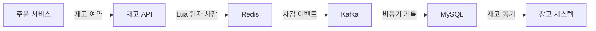
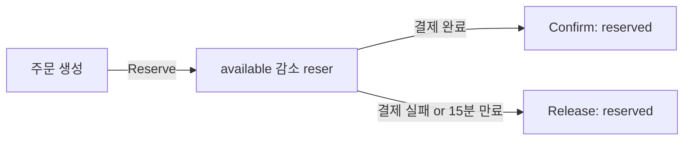
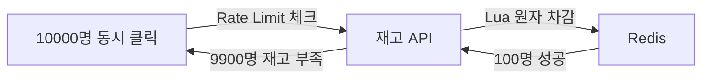

> **한 줄 요약**: MySQL은 ACID로 재고 불변식을 강제하고, Redis는 원자 DECR로 동시 차감 경쟁을 차단하며, Kafka는 비동기 분리로 확정 지연을 흡수한다. 세 계층이 각자의 역할을 맡아야 초과판매 0건과 타임딜 극한 트래픽을 동시에 달성한다.

---

## 1. 요구사항 분석 — 무엇이 진짜 어려운 문제인가

시니어 면접에서 재고 시스템을 설계하라는 질문이 나오면 "Redis 쓰면 됩니다"라는 답변은 반쪽짜리입니다. 면접관이 실제로 듣고 싶은 것은 **왜** Redis인지, Redis로 무엇을 해결하고 DB로 무엇을 해결하는지의 경계선입니다.

### 기능 요구사항

1. **재고 차감**: 주문 생성 시 구매 수량만큼 즉시 예약 차감 (available 감소, reserved 증가)
2. **재고 확정**: 결제 완료 시 예약을 판매 확정으로 전환 (reserved 감소, sold 증가)
3. **재고 복구**: 결제 실패, 주문 취소, 반품 시 available 복구 (idempotent하게)
4. **재고 조회**: 현재 가용 재고를 실시간으로 노출 (캐시 히트율 98% 이상)
5. **재고 보충**: 입고, 반품 재검수 완료 후 available 증가
6. **이력 추적**: 모든 재고 변동의 사유, 주문번호, 타임스탬프를 Append-Only로 기록

### 비기능 요구사항 — 숫자로 못 박아야 한다

| 항목 | 목표 | 근거 |
|------|------|------|
| 초과판매 건수 | 0건 | 환불 비용, 공정위 제재, 고객 신뢰 손실 |
| 재고 차감 P99 | < 50ms | 주문 흐름에서 동기 호출로 응답 체감 직결 |
| 재고 조회 P99 | < 20ms | 상품 목록 렌더링 병렬 호출 |
| 가용성 | 99.99% | 연간 52분 다운 허용 (커머스 기준) |
| 평상시 TPS | 5,000 | 일 주문 100만 건, 평균 item 2.5개 |
| 타임딜 피크 TPS | 50,000 | 평상시 10배, 1분 집중 |

### 핵심 동시성 문제 세 가지

**문제 1 — 동시 재고 차감 (Concurrent Stock Deduction)**

10,000명이 재고 1개 남은 상품을 0.1초 사이에 클릭한다. 한 명만 성공해야 한다.

```
스레드 A: SELECT available = 1 (조회)
스레드 B: SELECT available = 1 (조회)  ← A와 B가 동시에 읽음
스레드 A: UPDATE available = 0         ← 차감 성공
스레드 B: UPDATE available = -1        ← 초과판매 발생!
```

조회와 차감이 별도 연산이면 사이에 다른 스레드가 끼어든다. 이것이 경쟁 조건(Race Condition)이며, 재고 시스템의 근본 문제다.

**문제 2 — 초과판매 방지 (Oversell Prevention)**

초과판매는 재고가 음수가 되는 사건이다. 방지 전략은 두 가지 방향이 있다. 첫째, 차감 연산 자체를 원자적으로 만들어 끼어들기를 불가능하게 한다. 둘째, DB CHECK 제약으로 음수 차감 자체를 DB가 거부하도록 한다. 두 방어선을 모두 설치해야 한다.

**문제 3 — 타임딜 피크 (Flash Sale Peak)**

타임딜은 평상시와 질적으로 다르다. 평상시에는 동일 SKU에 동시 요청이 수십 건이지만, 타임딜은 수만 건이 동시에 같은 행(row)의 같은 컬럼을 수정하려 한다. DB 락 기반 접근은 커넥션 풀을 모두 소진하고 서비스를 다운시킨다.

---

## 2. 용량 추정 — 숫자가 설계를 결정한다

면접에서 용량 추정을 생략하면 설계 결정의 근거가 없어진다. 숫자를 먼저 뽑아야 어떤 계층이 병목인지 보인다.

```
[트래픽 추정]
일 주문: 1,000,000건
평균 SKU 수/주문: 2.5개
일 재고 차감 이벤트: 2,500,000건
초당 평균 차감 TPS: 2,500,000 / 86,400 ≈ 29 TPS

타임딜: 30분 내 100,000건 집중
피크 TPS: 100,000 / (30 × 60) ≈ 56 TPS (단순 평균)
실제 피크: 타임딜 시작 첫 10초에 80% 집중 → 8,000 TPS 순간 피크

[저장소 추정]
재고 테이블: 5,000,000 SKU × 200 bytes = 1 GB
재고 이벤트 로그: 2,500,000건/일 × 500 bytes × 365일 = 456 GB/년
Redis 재고 캐시: 5,000,000 SKU × 100 bytes = 500 MB

[Redis 처리량]
Redis 단일 노드: ~100,000 ops/sec
타임딜 피크 8,000 TPS → Redis 단일 노드로 충분
단, 핫키 집중 시 단일 슬롯 병목 → 샤딩 필요 (섹션 6 참고)
```

핵심 인사이트: **평상시 29 TPS는 MySQL 단독으로 처리 가능**하다. 하지만 타임딜 순간 피크 8,000 TPS, 그리고 같은 SKU 행에 집중되는 특성 때문에 Redis 선차감 레이어가 필요하다.

---

## 3. DB 선택 — 왜 MySQL인가, 왜 Redis인가, 왜 Kafka인가

이것이 면접에서 가장 중요한 섹션이다. "Redis 쓰면 빠르다"는 답은 틀리지 않지만 WHY가 없다.

### MySQL — 왜 재고 원장에 RDB인가

**선택 이유: ACID + 비관적 락 + CHECK 제약**

재고의 핵심 불변식은 `available + reserved + sold = total_stock`이다. 이 등식이 깨지면 초과판매 또는 재고 증발이 발생한다. RDB는 이 불변식을 CHECK 제약으로 DB 레벨에서 강제한다. 어떤 버그 있는 코드가 실행되어도 DB가 거부한다.

또한 `SELECT FOR UPDATE` 비관적 락은 타임딜 이외 상황에서 안전한 차감을 단순하게 구현할 수 있다. 낙관적 락(버전 컬럼)과 조합하면 일반 상품에서 충분한 성능을 낸다.

**선택하지 않은 것: MongoDB, Cassandra**

MongoDB는 트랜잭션을 지원하지만 CHECK 제약이 없고, 다중 문서 트랜잭션에서 RDB보다 복잡하다. Cassandra는 eventual consistency가 기본이라 재고 불변식 강제가 불가능하다. 재고는 "나중에 맞으면 된다"가 허용되지 않는 도메인이다.

### Redis — 왜 재고 선차감에 인메모리 캐시인가

**선택 이유: 단일 스레드 + Lua 원자 실행 + 마이크로초 응답**

Redis의 결정적 특성은 단일 스레드 이벤트 루프다. Lua 스크립트를 실행하는 동안 다른 명령이 끼어들 수 없다. 이것이 재고 조회(HGET)와 차감(HINCRBY)을 원자 연산으로 묶을 수 있는 이유다. DB 락 없이, 스레드 경쟁 없이, 10만 TPS를 직렬 처리한다.

**선택하지 않은 것: Memcached**

Memcached는 원자 INCR/DECR을 지원하지만 Lua 스크립트와 Hash 자료구조가 없다. available/reserved/sold 세 필드를 조합 연산하는 것이 불가능하다.

**선택하지 않은 것: Redis를 원장으로 사용**

Redis는 AOF/RDB 영속성을 지원하지만, 장애 복구 시 최대 1초 데이터 유실이 발생한다. 재고는 금전적 가치가 있으므로 유실이 허용되지 않는다. Redis는 선차감 레이어(write-through 캐시)로만 사용하고, MySQL이 원장이다.

### Kafka — 왜 재고 확정에 메시지 큐인가

**선택 이유: 비동기 분리 + Exactly-Once 의미 + 재처리 가능**

Redis로 선차감에 성공하면 주문 응답을 즉시 반환한다. MySQL에 재고 이력을 기록하는 작업은 비동기로 처리한다. 이 분리 덕분에 MySQL 응답 시간(~5ms)이 주문 응답 P99에서 제거된다.

Kafka는 이벤트를 보존하므로 워커 장애 후 재시작 시 미처리 이벤트를 순서대로 재처리한다. MySQL UPDATE 실패는 Kafka DLQ로 보내고, 자동 재시도한다. Kafka 없이 Redis→MySQL 동기 기록을 하면 MySQL 장애 시 Redis 차감이 롤백되지 않아 불일치가 발생한다.

**선택하지 않은 것: RabbitMQ**

RabbitMQ는 메시지 보존 기간이 짧고, 이벤트 재처리(replay) 기능이 없다. 재고 이벤트 감사(audit)와 불일치 복구를 위한 로그 재생이 불가능하다.

---

## 4. 고수준 아키텍처

> **비유**: 재고 시스템은 콘서트 입장과 같다. Redis(검표원)가 단일 스레드로 한 명씩 티켓을 확인하고 입장을 허락한다. 검표원이 "입장 가능"을 확인하는 순간부터 확인 완료까지 다른 사람이 끼어들 수 없다. DB(공식 출연자 명단)는 이후에 천천히 기록된다. 검표원이 쓰러지면(Redis 장애) 직원(DB 비관적 락)이 대신 입장을 통제하지만 속도가 느려진다.



**데이터 흐름 단계별 설명**

| 단계 | 처리 내용 | WHY |
|------|----------|-----|
| 1 | 주문 서비스 → 재고 API 호출 (동기) | 주문 생성 전 재고 확보가 선행되어야 초과판매 방지 |
| 2 | Redis Lua 스크립트로 원자 선차감 | DB 락 없이 경쟁 조건 차단, 마이크로초 응답 |
| 3 | 차감 성공 즉시 주문 응답 반환 | MySQL 동기 기록 없이 응답 → P99 지연 감소 |
| 4 | Kafka에 재고 차감 이벤트 발행 | 비동기 분리, 재처리 가능, 이벤트 소싱 기반 |
| 5 | 재고 이벤트 워커 → MySQL Append-Only 기록 | 감사 추적, 불일치 복구, 불변식 검증 |
| 6 | 창고 시스템 → MySQL 구독 → 실물 피킹 시작 | 재고 확정 후 물리 출고 프로세스 트리거 |

---

## 5. DB 스키마 설계 — 불변식을 DB가 강제한다

### 5.1 핵심 설계 결정: 왜 단일 숫자가 아닌 3-field 분리인가

`stock_count = 100` 단일 컬럼으로 관리하면 두 가지 문제가 생긴다.

첫째, "지금 재고가 37개인데 100개에서 어떻게 37개가 됐지?"라는 질문에 답할 수 없다. 주문인지, 취소인지, 반품인지, 관리자 조정인지 알 수 없다.

둘째, 결제 진행 중인 재고와 확정 재고를 구분할 수 없다. 결제 중인 50개를 빼면 50개만 보이는데, 결제가 실패하면 50개가 복구되어야 한다. 이 복구 로직이 단일 숫자 모델에서는 별도 장부(reservation 테이블) 없이 구현할 수 없다.

**3-field 분리 모델**: `available(구매 가능) + reserved(결제 진행 중) + sold(판매 완료) = total_stock(총 입고량)`

이 등식이 DB CHECK 제약으로 강제된다. 어떤 코드 버그로도 이 등식을 깰 수 없다.

```sql
-- 재고 원장 테이블
CREATE TABLE inventory (
    sku_id        BIGINT       NOT NULL,
    warehouse_id  INT          NOT NULL,
    total_stock   INT          NOT NULL DEFAULT 0,
    available     INT          NOT NULL DEFAULT 0,
    reserved      INT          NOT NULL DEFAULT 0,
    sold          INT          NOT NULL DEFAULT 0,
    version       BIGINT       NOT NULL DEFAULT 0,    -- 낙관적 락용
    updated_at    DATETIME(3)  NOT NULL,
    PRIMARY KEY (sku_id, warehouse_id),
    CONSTRAINT chk_non_negative CHECK (available >= 0 AND reserved >= 0 AND sold >= 0),
    CONSTRAINT chk_sum CHECK (available + reserved + sold = total_stock)
);

-- 재고 이벤트 로그 (Append-Only, 이벤트 소싱 기반 감사 추적)
CREATE TABLE inventory_event (
    id            BIGINT       NOT NULL AUTO_INCREMENT,
    sku_id        BIGINT       NOT NULL,
    warehouse_id  INT          NOT NULL,
    event_type    VARCHAR(30)  NOT NULL,   -- RESERVE, CONFIRM, RELEASE, RESTOCK, RECALL
    quantity      INT          NOT NULL,   -- 양수: 증가, 음수: 감소
    order_id      BIGINT,
    idempotency_key  VARCHAR(64),          -- 중복 처리 방지
    reason        VARCHAR(200),
    created_at    DATETIME(3)  NOT NULL DEFAULT NOW(3),
    PRIMARY KEY (id),
    INDEX idx_sku_created (sku_id, created_at),
    INDEX idx_order (order_id),
    UNIQUE KEY uk_idempotency (idempotency_key)   -- 동일 이벤트 중복 삽입 방지
);

-- 재고 예약 테이블 (주문 단위 예약 상태 추적)
CREATE TABLE inventory_reservation (
    reservation_id   BIGINT      NOT NULL AUTO_INCREMENT,
    order_id         BIGINT      NOT NULL,
    sku_id           BIGINT      NOT NULL,
    warehouse_id     INT         NOT NULL,
    quantity         INT         NOT NULL,
    status           VARCHAR(20) NOT NULL DEFAULT 'ACTIVE',  -- ACTIVE, CONFIRMED, CANCELLED
    expires_at       DATETIME(3) NOT NULL,                   -- 15분 후 만료
    created_at       DATETIME(3) NOT NULL DEFAULT NOW(3),
    PRIMARY KEY (reservation_id),
    UNIQUE KEY uk_order_sku (order_id, sku_id),
    INDEX idx_expires (status, expires_at)
);
```

### 5.2 왜 이벤트 로그를 별도 테이블로 두는가 (이벤트 소싱 패턴)

재고 이벤트 로그는 단순한 감사 기록이 아니다. 두 가지 핵심 역할을 한다.

**역할 1 — 불일치 복구**: Redis와 MySQL 재고 수치가 다를 때 진실의 원천은 이벤트 로그다. `SUM(quantity)` 재계산으로 현재 재고를 정확히 복원한다. 단일 숫자 컬럼만 있으면 불일치 발견 시 원인을 추적할 수 없다.

**역할 2 — 멱등성 보장**: `idempotency_key` UNIQUE 제약으로 동일한 이벤트가 두 번 삽입되면 DB가 즉시 거부한다. Kafka 컨슈머 재시도로 인한 중복 처리가 원천 차단된다.

---

## 6. 핵심 컴포넌트 상세 설계

### 6.1 Redis Lua 스크립트 — 왜 Lua가 필요한가

Java 코드에서 Redis 명령을 순서대로 실행하면 아래 경쟁이 발생한다.

```
스레드 A: HGET inv:1001:1 available  → 10
스레드 B: HGET inv:1001:1 available  → 10  (A와 동시에 읽음)
스레드 A: HINCRBY inv:1001:1 available -1   → 9
스레드 B: HINCRBY inv:1001:1 available -1   → 8  (초과 차감!)
```

Lua 스크립트는 Redis 단일 스레드 위에서 **원자적**으로 실행된다. 스크립트 실행 중 다른 명령이 끼어들 수 없으므로 위 경쟁이 원천 불가능하다.

```lua
-- Redis Lua 스크립트: 원자 재고 차감
-- KEYS[1]: 재고 키 ("inv:{skuId}:{warehouseId}")
-- ARGV[1]: 차감 수량
-- 반환값: 차감 후 남은 available (-1: 재고 부족, -2: 캐시 미스)

local key   = KEYS[1]
local qty   = tonumber(ARGV[1])

local avail = tonumber(redis.call('HGET', key, 'available'))
if avail == nil then
    return -2  -- 캐시 미스: DB에서 로드 후 재시도
end
if avail < qty then
    return -1  -- 재고 부족
end

redis.call('HINCRBY', key, 'available', -qty)
redis.call('HINCRBY', key, 'reserved',   qty)

return avail - qty  -- 차감 후 남은 available 반환
```

```java
@Service
@RequiredArgsConstructor
public class InventoryRedisService {

    private final StringRedisTemplate redisTemplate;
    private final RedisScript<Long> decrementScript;
    private final InventoryRepository inventoryRepository;

    private static final int TTL_SECONDS      = 3600;  // 캐시 TTL 1시간
    private static final int RESERVATION_MINS = 15;    // 예약 만료 15분

    /**
     * Redis 원자 선차감.
     * 캐시 미스(-2) 시 DB에서 로드 후 1회 재시도.
     * 재고 부족(-1) 시 OutOfStock 결과 반환.
     */
    public ReservationResult reserve(long skuId, int warehouseId, int quantity) {
        String key = redisKey(skuId, warehouseId);

        Long result = executeDecrement(key, quantity);

        if (result != null && result == -2L) {
            // 캐시 미스: DB에서 로드 후 단 한 번만 재시도
            warmUpFromDb(skuId, warehouseId);
            result = executeDecrement(key, quantity);
        }

        if (result == null || result < 0L) {
            return ReservationResult.outOfStock(skuId, quantity);
        }
        return ReservationResult.success(skuId, quantity, result);
    }

    private Long executeDecrement(String key, int quantity) {
        return redisTemplate.execute(
            decrementScript,
            List.of(key),
            String.valueOf(quantity)
        );
    }

    /**
     * DB → Redis 캐시 워밍업.
     * 동시에 여러 스레드가 캐시 미스를 발견해도 SETNX로 단일 워밍업 보장.
     */
    public void warmUpFromDb(long skuId, int warehouseId) {
        String lockKey  = "inv:lock:" + skuId + ":" + warehouseId;
        String cacheKey = redisKey(skuId, warehouseId);

        Boolean acquired = redisTemplate.opsForValue()
            .setIfAbsent(lockKey, "1", Duration.ofSeconds(5));
        if (!Boolean.TRUE.equals(acquired)) {
            return;  // 다른 스레드가 워밍업 중
        }
        try {
            Inventory inv = inventoryRepository
                .findBySkuIdAndWarehouseId(skuId, warehouseId)
                .orElseThrow(() -> new SkuNotFoundException(skuId));

            Map<String, String> fields = Map.of(
                "available", String.valueOf(inv.getAvailable()),
                "reserved",  String.valueOf(inv.getReserved()),
                "sold",      String.valueOf(inv.getSold())
            );
            redisTemplate.opsForHash().putAll(cacheKey, fields);
            redisTemplate.expire(cacheKey, Duration.ofSeconds(TTL_SECONDS));
        } finally {
            redisTemplate.delete(lockKey);
        }
    }

    public void releaseReservation(long skuId, int warehouseId, int quantity) {
        String key = redisKey(skuId, warehouseId);
        redisTemplate.opsForHash().increment(key, "available",  quantity);
        redisTemplate.opsForHash().increment(key, "reserved",  -quantity);
    }

    private String redisKey(long skuId, int warehouseId) {
        return "inv:" + skuId + ":" + warehouseId;
    }
}
```

### 6.2 낙관적 락 vs 비관적 락 — 언제 무엇을 쓰는가

이 선택은 **충돌 빈도**에 달려 있다.

| 상황 | 충돌 빈도 | 적합한 락 | 이유 |
|------|---------|---------|------|
| 일반 상품, 충분한 재고 | 낮음 (< 5%) | 낙관적 락 (version 컬럼) | 락 오버헤드 없이 충돌 시에만 재시도 |
| 인기 상품, 재고 부족 | 중간 (5~30%) | 낙관적 락 + Redis 선차감 | Redis가 DB 충돌 자체를 줄임 |
| 타임딜 단일 SKU | 극도로 높음 (> 90%) | Redis Lua 전용 경로 | 낙관적 락 재시도 자체가 DB 과부하 |

낙관적 락이 타임딜에 위험한 이유: 재고 100개에 10,000 요청이 몰리면 100개만 성공하고 9,900개가 재시도한다. 재시도 9,900 × 평균 3회 = 29,700 DB 쿼리가 폭발한다.

```java
@Service
@RequiredArgsConstructor
public class InventoryDbService {

    private final InventoryRepository inventoryRepository;
    private final InventoryEventRepository eventRepository;

    private static final int MAX_RETRY = 3;

    /**
     * 낙관적 락 기반 재고 차감 (일반 상품용).
     * version 불일치 시 지수 백오프 후 재시도. 최대 3회.
     */
    @Transactional
    public boolean reserveWithOptimisticLock(
            long skuId, int warehouseId, long orderId, int quantity, String idempotencyKey) {

        for (int attempt = 0; attempt < MAX_RETRY; attempt++) {
            Inventory inv = inventoryRepository
                .findBySkuIdAndWarehouseId(skuId, warehouseId)
                .orElseThrow(() -> new SkuNotFoundException(skuId));

            if (inv.getAvailable() < quantity) {
                return false;  // 재고 부족, 재시도 불필요
            }

            // version 조건 불일치 → 0 rows updated → 재시도
            int updated = inventoryRepository.decrementAvailableWithVersion(
                skuId, warehouseId, quantity, inv.getVersion());

            if (updated == 1) {
                saveReserveEvent(skuId, warehouseId, orderId, quantity, idempotencyKey);
                return true;
            }

            // 충돌: 지수 백오프 후 재시도
            if (attempt < MAX_RETRY - 1) {
                sleepQuietly(10L * (1L << attempt));  // 10ms, 20ms, 40ms
            }
        }
        return false;  // 3회 실패
    }

    /**
     * 비관적 락 기반 재고 차감 (Redis 장애 시 폴백용).
     * SELECT FOR UPDATE로 행 레벨 락 획득 후 차감.
     */
    @Transactional(timeout = 5)  // 5초 타임아웃: 데드락 방지
    public boolean reserveWithPessimisticLock(
            long skuId, int warehouseId, long orderId, int quantity, String idempotencyKey) {

        Inventory inv = inventoryRepository
            .findBySkuIdAndWarehouseIdForUpdate(skuId, warehouseId)  // SELECT FOR UPDATE
            .orElseThrow(() -> new SkuNotFoundException(skuId));

        if (inv.getAvailable() < quantity) {
            return false;
        }

        inv.decrementAvailable(quantity);
        inventoryRepository.save(inv);
        saveReserveEvent(skuId, warehouseId, orderId, quantity, idempotencyKey);
        return true;
    }

    private void saveReserveEvent(
            long skuId, int warehouseId, long orderId, int quantity, String idempotencyKey) {
        InventoryEvent event = InventoryEvent.builder()
            .skuId(skuId)
            .warehouseId(warehouseId)
            .eventType("RESERVE")
            .quantity(-quantity)
            .orderId(orderId)
            .idempotencyKey(idempotencyKey)
            .createdAt(Instant.now())
            .build();
        eventRepository.save(event);  // idempotency_key UNIQUE 제약으로 중복 방지
    }

    private void sleepQuietly(long millis) {
        try { Thread.sleep(millis); }
        catch (InterruptedException e) { Thread.currentThread().interrupt(); }
    }
}
```

```java
// InventoryRepository
public interface InventoryRepository extends JpaRepository<Inventory, Long> {

    Optional<Inventory> findBySkuIdAndWarehouseId(long skuId, int warehouseId);

    @Lock(LockModeType.PESSIMISTIC_WRITE)
    @Query("SELECT i FROM Inventory i WHERE i.skuId = :skuId AND i.warehouseId = :warehouseId")
    Optional<Inventory> findBySkuIdAndWarehouseIdForUpdate(
        @Param("skuId") long skuId, @Param("warehouseId") int warehouseId);

    @Query("""
        UPDATE inventory
        SET available  = available  - :qty,
            reserved   = reserved   + :qty,
            version    = version    + 1,
            updated_at = NOW(3)
        WHERE sku_id      = :skuId
          AND warehouse_id = :warehouseId
          AND available   >= :qty
          AND version     = :version
        """)
    @Modifying
    int decrementAvailableWithVersion(
        @Param("skuId")       long skuId,
        @Param("warehouseId") int  warehouseId,
        @Param("qty")         int  qty,
        @Param("version")     long version);
}
```

### 6.3 재고 예약-확정-복구 흐름 — 결제 단계별 상태 전환

재고 차감 시점을 결제 완료 후로 미루면 위험하다. 100개 재고에 200명이 결제를 완료한 뒤 100명에게 "죄송합니다. 재고가 없어 환불합니다"를 안내해야 한다. PG 수수료는 이미 나갔고 고객 신뢰는 무너진다.

**올바른 모델: 주문 생성 시 예약(Reserve) → 결제 완료 시 확정(Confirm) → 결제 실패/취소 시 복구(Release)**



```java
@Service
@RequiredArgsConstructor
public class InventoryReservationService {

    private final InventoryRedisService redisService;
    private final InventoryDbService dbService;
    private final InventoryReservationRepository reservationRepo;
    private final KafkaTemplate<String, InventoryEvent> kafkaTemplate;

    /**
     * 주문 생성 시 재고 예약.
     * 1) Redis 원자 선차감
     * 2) DB 예약 레코드 생성 (15분 만료)
     * 3) Kafka 비동기 이벤트 발행
     */
    @Transactional
    public ReservationResult reserve(ReserveRequest request) {
        // 멱등성 키: 동일 주문 재시도 시 중복 차감 방지
        String idempotencyKey = "RESERVE:" + request.getOrderId() + ":" + request.getSkuId();

        // 이미 처리된 요청이면 기존 결과 반환
        if (reservationRepo.existsByOrderIdAndSkuId(request.getOrderId(), request.getSkuId())) {
            return ReservationResult.alreadyReserved(request.getSkuId());
        }

        ReservationResult result = redisService.reserve(
            request.getSkuId(), request.getWarehouseId(), request.getQuantity());

        if (!result.isSuccess()) {
            return result;
        }

        // DB 예약 레코드 생성 (만료 추적용)
        InventoryReservation reservation = InventoryReservation.builder()
            .orderId(request.getOrderId())
            .skuId(request.getSkuId())
            .warehouseId(request.getWarehouseId())
            .quantity(request.getQuantity())
            .status(ReservationStatus.ACTIVE)
            .expiresAt(LocalDateTime.now().plusMinutes(15))
            .build();
        reservationRepo.save(reservation);

        // Kafka 비동기 이벤트 (DB inventory_event 기록용)
        kafkaTemplate.send("inventory.reserved", String.valueOf(request.getSkuId()),
            InventoryEvent.reserve(request, idempotencyKey));

        return result;
    }

    /**
     * 결제 완료 시 예약 확정.
     * reserved → sold 전환. Kafka로 비동기 DB 업데이트.
     */
    @Transactional
    public void confirm(long orderId, long skuId) {
        InventoryReservation reservation = reservationRepo
            .findByOrderIdAndSkuId(orderId, skuId)
            .orElseThrow(() -> new ReservationNotFoundException(orderId, skuId));

        if (reservation.getStatus() != ReservationStatus.ACTIVE) {
            return;  // 이미 확정 or 취소된 예약 (멱등성)
        }

        reservation.confirm();
        reservationRepo.save(reservation);

        // Redis: reserved 감소, sold는 Redis에서 관리 안 함 (DB 전용)
        redisService.confirmReservation(skuId, reservation.getWarehouseId(), reservation.getQuantity());

        kafkaTemplate.send("inventory.confirmed", String.valueOf(skuId),
            InventoryEvent.confirm(reservation));
    }

    /**
     * 결제 실패 또는 취소 시 예약 해제.
     * reserved → available 복구.
     */
    @Transactional
    public void release(long orderId, long skuId) {
        InventoryReservation reservation = reservationRepo
            .findByOrderIdAndSkuId(orderId, skuId)
            .orElseThrow(() -> new ReservationNotFoundException(orderId, skuId));

        if (reservation.getStatus() != ReservationStatus.ACTIVE) {
            return;  // 이미 처리됨 (멱등성)
        }

        reservation.cancel();
        reservationRepo.save(reservation);

        // Redis: reserved 감소, available 증가
        redisService.releaseReservation(skuId, reservation.getWarehouseId(), reservation.getQuantity());

        kafkaTemplate.send("inventory.released", String.valueOf(skuId),
            InventoryEvent.release(reservation));
    }
}
```

### 6.4 멱등성 보장 — 왜 중복 처리 방지가 필수인가

네트워크 타임아웃 후 재시도하면 같은 요청이 두 번 처리될 수 있다. 재고 차감이 두 번 발생하면 초과 차감이 된다.

**3단계 멱등성 방어선**

1. **API 레벨**: `idempotency_key` 헤더를 받아 동일 키 요청은 동일 결과 반환
2. **DB 레벨**: `inventory_event.idempotency_key` UNIQUE 제약으로 중복 삽입 즉시 거부
3. **예약 레벨**: `inventory_reservation.uk_order_sku` UNIQUE 제약으로 동일 주문-SKU 중복 예약 방지

```java
@RestController
@RequiredArgsConstructor
@RequestMapping("/api/v1/inventory")
public class InventoryController {

    private final InventoryReservationService reservationService;
    private final IdempotencyStore idempotencyStore;

    @PostMapping("/reserve")
    public ResponseEntity<ReservationResult> reserve(
            @RequestHeader("Idempotency-Key") String idempotencyKey,
            @RequestBody @Validated ReserveRequest request) {

        // 동일 idempotency_key 요청은 캐시된 이전 결과 반환
        return idempotencyStore.getOrExecute(
            idempotencyKey,
            () -> reservationService.reserve(request.withIdempotencyKey(idempotencyKey)),
            ReservationResult.class
        );
    }
}
```

```java
@Service
@RequiredArgsConstructor
public class IdempotencyStore {

    private final StringRedisTemplate redisTemplate;
    private final ObjectMapper objectMapper;

    private static final Duration TTL = Duration.ofHours(24);

    public <T> ResponseEntity<T> getOrExecute(
            String key, Supplier<T> action, Class<T> responseType) {

        String cacheKey = "idem:" + key;
        String cached   = redisTemplate.opsForValue().get(cacheKey);

        if (cached != null) {
            T result = objectMapper.readValue(cached, responseType);
            return ResponseEntity.ok(result);  // 캐시된 이전 결과 반환
        }

        T result = action.get();
        redisTemplate.opsForValue().set(cacheKey, objectMapper.writeValueAsString(result), TTL);
        return ResponseEntity.ok(result);
    }
}
```

### 6.5 예약 만료 스케줄러 — 왜 안전밸브가 필요한가

결제 페이지에서 이탈한 사용자의 예약이 해제되지 않으면 재고가 영구적으로 묶인다. 실제 창고에 재고가 100개 있어도 `available = 0`으로 표시된다. 예약 만료 처리는 재고 시스템의 핵심 안전밸브다.

```java
@Component
@RequiredArgsConstructor
public class ReservationExpiryScheduler {

    private final InventoryReservationRepository reservationRepo;
    private final InventoryReservationService    reservationService;

    /**
     * 60초마다 만료된 ACTIVE 예약을 일괄 해제.
     * ShedLock: 다중 인스턴스 환경에서 단 하나의 인스턴스만 실행.
     * lockAtMostFor: 배치가 응답 없이 락을 영구 보유하는 것을 방지.
     */
    @Scheduled(fixedRate = 60_000)
    @SchedulerLock(name = "expireReservations", lockAtLeastFor = "50s", lockAtMostFor = "55s")
    public void expireStaleReservations() {
        List<InventoryReservation> expired = reservationRepo
            .findByStatusAndExpiresAtBefore(ReservationStatus.ACTIVE, LocalDateTime.now());

        int count = 0;
        for (InventoryReservation res : expired) {
            try {
                reservationService.release(res.getOrderId(), res.getSkuId());
                count++;
            } catch (Exception e) {
                log.error("예약 만료 처리 실패: reservationId={}", res.getReservationId(), e);
                // 개별 실패가 전체 배치를 멈추지 않도록 계속 진행
            }
        }

        if (count > 0) {
            log.info("예약 만료 처리 완료: {}건", count);
        }
    }
}
```

**ShedLock을 쓰는 이유**: 여러 서버 인스턴스가 동시에 같은 예약을 "만료 처리"하면 중복 release가 발생하고 available이 두 배로 복구된다. ShedLock은 분산 잠금으로 이 문제를 방지한다.

### 6.6 Kafka 이벤트 워커 — 비동기 DB 동기화

```java
@Component
@RequiredArgsConstructor
public class InventoryEventConsumer {

    private final InventoryRepository inventoryRepository;
    private final InventoryEventRepository eventRepository;

    /**
     * Kafka 재고 예약 이벤트를 DB에 Append-Only로 기록.
     * 멱등성: idempotency_key UNIQUE 제약으로 중복 INSERT 자동 거부.
     */
    @KafkaListener(topics = "inventory.reserved", groupId = "inventory-worker",
                   concurrency = "4")  // 파티션 4개와 맞춤
    @Transactional
    public void handleReserved(InventoryEvent event,
                               Acknowledgment ack) {
        try {
            // inventory 테이블 업데이트
            int updated = inventoryRepository.decrementAvailable(
                event.getSkuId(), event.getWarehouseId(), event.getQuantity());

            if (updated == 0) {
                log.error("DB 재고 차감 실패: skuId={}, 재고 부족 or 행 없음", event.getSkuId());
                // DLQ로 보내 수동 검토
                throw new InventoryUpdateFailedException(event);
            }

            // inventory_event Append-Only 기록
            eventRepository.save(toEntity(event));

            ack.acknowledge();  // 수동 커밋: 성공 후에만 오프셋 커밋
        } catch (DataIntegrityViolationException e) {
            // idempotency_key UNIQUE 위반 = 중복 이벤트 → 무시하고 커밋
            log.warn("중복 이벤트 무시: idempotencyKey={}", event.getIdempotencyKey());
            ack.acknowledge();
        }
    }

    @KafkaListener(topics = "inventory.reserved.DLT", groupId = "inventory-dlq-worker")
    public void handleDeadLetter(InventoryEvent event) {
        log.error("DLQ 이벤트 수신, 수동 처리 필요: {}", event);
        alertService.sendPagerDuty("재고 DLQ 이벤트 발생", event);
    }
}
```

---

## 7. 다중 창고 라우팅 — 전국 재고를 하나로 보이게 하는 법

단일 창고에 재고를 쌓으면 물류 비용이 높아지고 배송 SLA를 맞추기 어렵다. 전국 창고에 분산하면 고객에게는 전체 재고를 보여주되, 주문 시 최적 창고를 선정해야 한다.

```java
@Service
@RequiredArgsConstructor
public class WarehouseRoutingService {

    private final InventoryRepository    inventoryRepository;
    private final DeliveryEstimator      deliveryEstimator;

    /**
     * 주문 시 최적 창고 선정.
     * 우선순위: 1) 당일배송 가능 여부  2) 배송비 낮은 순
     */
    public WarehouseAssignment selectWarehouse(
            long skuId, int quantity, Address customerAddr) {

        return inventoryRepository.findWarehousesWithStock(skuId, quantity)
            .stream()
            .filter(w -> w.getAvailable() >= quantity)
            .sorted(Comparator
                .comparingInt((WarehouseStock w) ->
                    deliveryEstimator.canDeliverToday(w.getWarehouseId(), customerAddr) ? 0 : 1)
                .thenComparingInt(w ->
                    deliveryEstimator.estimateCost(w.getWarehouseId(), customerAddr))
            )
            .findFirst()
            .map(w -> new WarehouseAssignment(w.getWarehouseId(), quantity))
            .orElseThrow(() -> new OutOfStockException(skuId));
    }

    /**
     * 가상 통합 재고 조회: 전국 창고 available 합산.
     * 고객에게는 합산 수치로 표시, 실제 예약 시 창고 선정.
     */
    public int getTotalAvailable(long skuId) {
        return inventoryRepository.sumAvailableBySkuId(skuId);
    }
}
```

---

## 8. 장애 시나리오와 대응

### 8.1 Redis 전체 장애 — 재고 캐시 소실

> **비유**: 검표원(Redis)이 쓰러지면 공연장 직원(DB 비관적 락)이 직접 한 명씩 입장을 통제한다. 느리지만 초과 입장은 없다.

초당 5,000건의 재고 조회가 DB에 직접 몰린다.

```java
@Service
@RequiredArgsConstructor
public class InventoryFacadeService {

    private final InventoryRedisService  redisService;
    private final InventoryDbService     dbService;

    /**
     * Redis 정상 시: Lua 원자 선차감 (수십 마이크로초)
     * Redis 장애 시: DB 비관적 락으로 폴백 (수 밀리초, TPS 감소)
     * 초과판매는 두 경로 모두 방지됨.
     */
    public ReservationResult reserve(ReserveRequest request) {
        try {
            return redisService.reserve(
                request.getSkuId(), request.getWarehouseId(), request.getQuantity());
        } catch (RedisConnectionFailureException | QueryTimeoutException e) {
            log.warn("Redis 장애, DB 비관적 락 폴백: skuId={}", request.getSkuId());
            boolean success = dbService.reserveWithPessimisticLock(
                request.getSkuId(), request.getWarehouseId(),
                request.getOrderId(), request.getQuantity(), request.getIdempotencyKey());
            return success
                ? ReservationResult.success(request.getSkuId(), request.getQuantity(), -1L)
                : ReservationResult.outOfStock(request.getSkuId(), request.getQuantity());
        }
    }
}
```

**3단계 Redis 고가용성 구성**

1. **Redis Sentinel**: 마스터 1 + 레플리카 2, 페일오버 30초 이내 자동 전환
2. **Redis Cluster**: 마스터 3 + 레플리카 3, 노드 단위 수평 확장
3. **재기동 워밍업**: Redis 재기동 후 DB → Redis 캐시 재적재 (캐시 미스 급증 방지)

### 8.2 타임딜 피크 — 순간 8,000 TPS에 재고 100개



**타임딜 전용 처리 전략**

```java
@Service
@RequiredArgsConstructor
public class FlashSaleInventoryService {

    private final InventoryRedisService redisService;
    private final RateLimiter           rateLimiter;

    /**
     * 타임딜 재고 차감.
     * 일반 재고 경로와 완전히 분리하여 일반 상품에 영향 없음.
     */
    public FlashSaleResult reserveFlashSale(FlashSaleRequest request) {
        // 1. 사용자당 Rate Limit: 동일 SKU 0.5초 내 2회 이상 요청 차단
        String limitKey = "rate:" + request.getUserId() + ":" + request.getSkuId();
        if (!rateLimiter.tryAcquire(limitKey, 2, Duration.ofMillis(500))) {
            return FlashSaleResult.rateLimited();
        }

        // 2. 이미 품절된 타임딜 상품: Redis 품절 플래그로 차감 시도 자체 차단
        String soldOutKey = "flash:soldout:" + request.getSkuId();
        if (Boolean.TRUE.equals(redisTemplate.hasKey(soldOutKey))) {
            return FlashSaleResult.soldOut();
        }

        // 3. Lua 원자 차감
        ReservationResult result = redisService.reserve(
            request.getSkuId(), request.getWarehouseId(), 1);

        // 4. 재고 소진 시 품절 플래그 설정 (이후 요청은 Redis 조회만으로 즉시 거부)
        if (!result.isSuccess()) {
            redisTemplate.opsForValue().set(soldOutKey, "1", Duration.ofHours(2));
            return FlashSaleResult.soldOut();
        }

        return FlashSaleResult.success(result);
    }

    /**
     * 타임딜 시작 1분 전 Redis 워밍업.
     * 캐시 미스 0 유지, Lua 스크립트 캐시 미스 재시도 없음.
     */
    @Transactional(readOnly = true)
    public void warmUpFlashSaleInventory(long skuId, int warehouseId) {
        log.info("타임딜 Redis 워밍업: skuId={}", skuId);
        redisService.warmUpFromDb(skuId, warehouseId);
    }
}
```

### 8.3 Redis-MySQL 재고 불일치 — 주기적 정합성 검증

Kafka 워커 장애로 일부 차감 이벤트가 MySQL에 반영되지 않으면 Redis와 MySQL 수치가 달라진다.

**진실의 원천 결정 원칙**: Redis가 현재 가용 재고, MySQL이 확정 원장. 불일치 시 항상 낮은 수치(보수적 방향) 채택. 품절 표시가 초과판매보다 낫다.

```java
@Component
@RequiredArgsConstructor
public class InventoryReconciliationJob {

    private final InventoryRepository    inventoryRepository;
    private final InventoryRedisService  redisService;
    private final AlertService           alertService;

    /**
     * 매시간 증분 대조 (최근 2시간 변경 항목만).
     * 전체 대조(5백만 SKU)는 새벽 3시 배치에서 별도 실행.
     */
    @Scheduled(cron = "0 0 * * * *")
    @SchedulerLock(name = "reconcileInventory", lockAtLeastFor = "50s", lockAtMostFor = "55s")
    public void incrementalReconcile() {
        List<Inventory> recentlyUpdated = inventoryRepository
            .findByUpdatedAtAfter(Instant.now().minus(Duration.ofHours(2)));

        int mismatchCount = 0;

        for (Inventory db : recentlyUpdated) {
            Long redisAvailable = redisService.getAvailable(db.getSkuId(), db.getWarehouseId());

            if (redisAvailable == null) {
                continue;  // Redis에 없음 (캐시 미스, 정상)
            }

            long diff = Math.abs(redisAvailable - db.getAvailable());
            if (diff > 0) {
                log.warn("재고 불일치 감지: skuId={}, redis={}, db={}",
                    db.getSkuId(), redisAvailable, db.getAvailable());

                // 보수적 방향: 낮은 수치로 Redis 보정
                long corrected = Math.min(redisAvailable, db.getAvailable());
                redisService.setAvailable(db.getSkuId(), db.getWarehouseId(), corrected);
                mismatchCount++;
            }
        }

        if (mismatchCount > 0) {
            alertService.send(AlertLevel.WARNING,
                "재고 불일치 " + mismatchCount + "건 보정 완료. DLQ 확인 필요.");
        }
    }

    /**
     * 이벤트 로그 재생으로 DB 재고 정합성 검증.
     * inventory_event SUM(quantity)와 inventory.available 비교.
     */
    public void verifyByEventReplay(long skuId, int warehouseId) {
        Long computedAvailable = eventRepository
            .sumQuantityBySkuIdAndWarehouseId(skuId, warehouseId);
        Inventory inv = inventoryRepository
            .findBySkuIdAndWarehouseId(skuId, warehouseId).orElseThrow();

        if (!Objects.equals(computedAvailable, (long) inv.getAvailable())) {
            log.error("이벤트 재생 불일치: skuId={}, computed={}, actual={}",
                skuId, computedAvailable, inv.getAvailable());
            alertService.send(AlertLevel.CRITICAL, "이벤트 로그 불일치, 수동 조사 필요");
        }
    }
}
```

### 8.4 예약 만료 배치 장애 — 재고 묶임 확산

예약 만료 배치가 6시간 중단되면 결제 이탈 사용자의 예약이 해제되지 않아 재고가 묶인다.

**감지 지표**: `reserved / total_stock > 30%`이면 비정상. P2 알람 발송.

```java
@Scheduled(cron = "0 */10 * * * *")  // 10분마다 모니터링
public void monitorReservationRatio() {
    List<Inventory> highReserved = inventoryRepository
        .findByReservedRatioExceeding(0.30);  // reserved > total_stock * 30%

    if (!highReserved.isEmpty()) {
        alertService.send(AlertLevel.WARNING,
            "비정상 예약 비율 " + highReserved.size() + "개 SKU. 만료 배치 확인 필요.");
    }
}
```

---

## 9. 핫키 문제 — Redis Cluster가 해결하지 못하는 것

Redis Cluster는 키를 CRC16 해시로 16,384개 슬롯에 분산한다. `inv:98765:1` 키는 항상 같은 슬롯, 같은 노드에 배정된다. 노드를 100대로 늘려도 단일 SKU의 타임딜 트래픽은 노드 1대에 집중된다.

**해결책: 키 샤딩**

```java
@Service
@RequiredArgsConstructor
public class HotKeyInventoryService {

    private static final int SHARD_COUNT = 5;
    private final StringRedisTemplate redisTemplate;
    private final RedisScript<Long>   decrementScript;

    /**
     * 핫키 분산: 재고 100개를 5개 샤드에 20개씩 분산.
     * 요청마다 랜덤 샤드 선택. 해당 샤드가 소진되면 다른 샤드 시도.
     */
    public ReservationResult reserveWithSharding(long skuId, int warehouseId, int quantity) {
        // 랜덤 샤드 순서로 시도 (부하 분산)
        List<Integer> shardOrder = IntStream.range(0, SHARD_COUNT)
            .boxed()
            .collect(Collectors.toList());
        Collections.shuffle(shardOrder);

        for (int shard : shardOrder) {
            String key    = "inv:" + skuId + ":" + warehouseId + ":" + shard;
            Long   result = redisTemplate.execute(decrementScript, List.of(key), String.valueOf(quantity));

            if (result != null && result >= 0) {
                return ReservationResult.success(skuId, quantity, result);
            }
        }
        return ReservationResult.outOfStock(skuId, quantity);
    }

    /**
     * 타임딜 시작 전 재고를 SHARD_COUNT개 샤드에 균등 분배.
     * 총 100개 → 샤드 0~4에 각 20개.
     */
    public void distributeToShards(long skuId, int warehouseId, int totalQty) {
        int perShard = totalQty / SHARD_COUNT;
        for (int shard = 0; shard < SHARD_COUNT; shard++) {
            String key = "inv:" + skuId + ":" + warehouseId + ":" + shard;
            redisTemplate.opsForHash().put(key, "available", String.valueOf(perShard));
            redisTemplate.expire(key, Duration.ofHours(2));
        }
    }
}
```

---

## 10. 핵심 메트릭 — 무엇을 모니터링해야 하는가

| 메트릭 | 정상 기준 | 이상 신호 | 원인 가설 | 대응 |
|--------|----------|----------|----------|------|
| 재고 차감 P99 | < 50ms | > 200ms | Redis 장애 또는 DB 낙관적 락 재시도 폭증 | Redis 상태 확인, DB 폴백 여부 확인 |
| 초과판매 건수 | 0건 | 1건 이상 | Lua 스크립트 미적용, DB 폴백 경쟁 조건 | 즉시 P0, 차감 경로 점검 |
| Redis 캐시 히트율 | > 98% | < 90% | 캐시 미스 급증, 타임딜 Warm-up 미실시 | 즉시 DB 직접 접근 증가 경보 |
| 예약 비율 (reserved/total) | < 30% | > 50% | 만료 배치 장애, 재고 묶임 | 만료 배치 상태 확인 |
| Redis-DB 불일치 SKU 수 | 0 | > 10 | Kafka 워커 장애, DLQ 적재 | DLQ 확인, 정합성 보정 실행 |
| 낙관적 락 재시도율 | < 5% | > 20% | 타임딜 트래픽이 낙관적 락 경로로 유입 | 타임딜 전용 Redis 경로 확인 |
| Kafka Consumer Lag | < 500 | > 5,000 | 워커 처리량 부족 | 파티션 수 증가, 컨슈머 스케일 아웃 |
| DLQ 메시지 수 | 0 | > 0 | DB 업데이트 실패 | 즉시 P1 알람, 수동 처리 검토 |

---

## 11. 면접 포인트 5개 — 시니어가 반드시 답해야 하는 질문

### 면접 포인트 1 — "DB 트랜잭션 하나로 재고 차감하면 되지 않나요?"

**단일 서버 소규모에서는 맞다.** 하지만 타임딜처럼 10,000 요청이 같은 행을 동시에 UPDATE할 때 문제가 생긴다.

DB 비관적 락(`SELECT FOR UPDATE`): 모든 요청이 같은 행의 락을 기다리며 직렬화된다. DB 커넥션 풀 100개가 전부 락 대기 상태로 묶이고, 타임딜 시작 30초 만에 커넥션 풀 고갈로 503 오류가 발생한다.

낙관적 락(`version` 조건): 10,000 요청 중 100개만 성공하고 9,900개가 재시도한다. 재시도 폭주로 DB TPS가 유효 처리량보다 재시도에 더 많이 소비되고, CPU와 DB 연결이 포화된다.

Redis Lua 스크립트는 단일 스레드로 10,000 요청을 순서대로 처리하되 마이크로초 단위로 응답한다. DB 락 없이 원자성을 보장하면서 초당 100,000 연산을 소화한다.

**답변 구조**: DB만으로도 초과판매는 막을 수 있다. 하지만 타임딜 극한 동시성에서는 락 경합과 재시도 폭주로 서비스 자체가 다운된다. Redis Lua는 DB 부하를 제거하면서 원자성을 유지한다.

### 면접 포인트 2 — "Redis 선차감 후 MySQL 기록 실패하면 어떻게 되나요?"

이것이 Redis + MySQL 이중 레이어의 핵심 취약점이다.

**시나리오**: Redis에서 재고 1개를 차감했다. Kafka 이벤트를 발행했다. 워커가 MySQL UPDATE를 시도했지만 MySQL이 순간 다운됐다.

**결과**: Redis 기준 재고는 99개, MySQL 기준 재고는 100개. 불일치 발생.

**대응 3단계**

1. Kafka DLQ: 실패 이벤트를 DLQ에 보관. MySQL 복구 후 재처리. 이벤트 순서 보장.
2. 정합성 검증: 매시간 Redis-MySQL 대조. 불일치 발견 시 낮은 수치로 보정.
3. 이벤트 재생: `inventory_event` 로그로 MySQL 재고 재계산. 로그가 진실의 원천.

**왜 Redis를 선택하나**: Redis 차감 후 MySQL 기록 실패는 "일시적 불일치"이고 자동 복구 가능하다. 반대로 MySQL만 쓰면 락 경합으로 서비스가 다운되는 것은 "영구적 서비스 장애"다. 두 시나리오의 위험도가 다르다.

### 면접 포인트 3 — "낙관적 락과 비관적 락, 어느 것이 더 좋은가요?"

"더 좋은" 것은 없다. **충돌 빈도**에 따라 달라진다.

충돌이 드문 일반 상품(동시 차감 < 5%): 낙관적 락이 유리하다. 락 오버헤드 없이 충돌 시에만 재시도한다.

충돌이 잦은 인기 상품(동시 차감 5~30%): Redis 선차감으로 DB 충돌 자체를 줄인다. 낙관적 락은 예외 처리용으로만 남긴다.

충돌이 거의 확실한 타임딜(동시 차감 > 90%): 낙관적 락 재시도가 DB를 포화시킨다. Redis Lua 전용 경로로 DB 락을 완전히 제거한다.

비관적 락(`SELECT FOR UPDATE`)을 언제 쓰는가: Redis 장애 시 폴백, 또는 재고 조정/관리자 수동 수정처럼 동시성보다 정확성이 중요한 케어. 타임딜에 비관적 락을 쓰면 커넥션 풀이 고갈된다.

### 면접 포인트 4 — "재고가 -1이 됐습니다. 어떻게 디버깅하나요?"

재고가 음수가 됐다는 것은 초과판매가 발생했다는 뜻이다. 즉시 P0 대응이 필요하다.

**1단계 즉시 대응**: 해당 SKU 판매를 차단한다(`maintenance` 플래그). 추가 초과판매 방지.

**2단계 원인 추적**:
```sql
-- 해당 SKU의 이벤트 로그를 시간 순으로 조회
SELECT event_type, quantity, order_id, created_at
FROM inventory_event
WHERE sku_id = ?
ORDER BY created_at DESC
LIMIT 100;

-- 이벤트 로그로 현재 재고 재계산
SELECT SUM(quantity) AS computed_available
FROM inventory_event
WHERE sku_id = ? AND warehouse_id = ?;
```

**3단계 불일치 시점 확인**: `SUM(quantity)`가 현재 `available`과 다르면 특정 이벤트가 적용되지 않은 것이다. `idempotency_key`를 추적해 어떤 이벤트가 중복 처리됐거나 누락됐는지 확인한다.

**4단계 근본 원인 패턴**: Redis DB 폴백 경로에서 낙관적 락 재시도 없이 직접 UPDATE를 했거나, CHECK 제약이 없는 DB 컬럼이거나, 이벤트 소싱 없이 단일 숫자만 관리한 경우다.

### 면접 포인트 5 — "글로벌 서비스로 확장할 때 어떻게 하나요?"

단일 리전 재고를 전 세계 서비스에 쓰면 두 가지 문제가 생긴다. 첫째, 네트워크 레이턴시: 한국 고객이 미국 Redis에 재고 차감 요청을 보내면 왕복 200ms가 추가된다. 둘째, 재고 분쟁: 미국 창고 재고를 한국 주문이 차감하면 미국 배송이 불가능하다.

**2단계 글로벌 재고 구조**

```
[글로벌 재고 풀]          총 1,000개
        ↓ 지역 할당
[한국 리전]  700개        한국 Redis + MySQL
[미국 리전]  300개        미국 Redis + MySQL
        ↓ 지역 소진 시
[글로벌 풀 재할당]        중앙 조정 서비스로 추가 배분
```

지역 내 차감은 해당 리전 Redis/MySQL에서만 처리한다. 리전 간 데이터 이동 없음. 한 리전이 소진되면 글로벌 조정 서비스가 다른 리전에서 할당을 가져온다. 단, 국제 배송이 가능한 상품에 한해서만 리전 간 재고를 공유한다.

---

## 12. 극한 시나리오

### 극한 시나리오 1 — 타임딜 D-Day: 10,000명이 재고 100개에 동시 진입

오전 10시 정각 타임딜 알림이 발송된다. 10,000명이 0.1초 안에 구매 버튼을 클릭한다.

**분석**: 피크 TPS는 10,000 / 0.1 = 100,000 TPS. Redis 단일 노드 한계(~100,000 ops/sec)에 근접. 동일 SKU 키에 집중되면 단일 슬롯 병목.

**연쇄 실패 시나리오**:
1. Rate Limit 없음 → 매크로 봇 수십 ms 안에 100개 독점
2. Redis Warm-up 없음 → 첫 요청들이 모두 캐시 미스 → DB 10,000 동시 쿼리 폭발
3. 품절 플래그 없음 → 품절 후에도 9,900 요청이 Redis 차감 시도 → Redis CPU 포화
4. 핫키 대책 없음 → Redis 단일 노드 과부하 → 해당 노드 응답 중단

**완전한 대응 체계**:

```
T-60초: 타임딜 SKU Redis Warm-up 완료 (캐시 미스 = 0)
T-60초: 5개 샤드에 재고 균등 분배 (핫키 분산)
T-0초:  타임딜 시작
T+0.1초: 사용자당 Rate Limit (0.5초 내 2회 초과 → 429)
T+0.xms: Lua 원자 차감 × 100 성공
T+0.xms: 품절 플래그 설정 (flash:soldout:SKUID)
T+0.xms: 이후 9,900 요청 → 품절 플래그 확인 후 즉시 거부 (Redis 1 HGET)
T+수초:  Kafka 이벤트 100건 → MySQL 비동기 기록
```

핵심: 품절 플래그 하나로 9,900 요청이 Lua 스크립트 실행 없이 O(1)으로 거부된다.

### 극한 시나리오 2 — 대규모 리콜: 10만 건 동시 반품

제조사 결함으로 특정 SKU 전체 리콜이 선언된다. 10만 건의 주문에 대해 동시에 반품 요청이 몰린다.

**분석**: 10만 건 × `UPDATE inventory SET available = available + 1` = 같은 행에 10만 번 UPDATE. DB 행 락 경합으로 TPS가 수십으로 떨어진다. `available + reserved + sold = total_stock` 불변식이 동시 UPDATE 중 순간적으로 깨질 수 있다.

**대응 전략**:

```java
// 리콜 시작 즉시: 해당 SKU 신규 판매 차단
inventoryRepository.setStatus(skuId, InventoryStatus.RECALL);

// 10만 반품 요청을 Kafka에 일괄 발행 (DB 직접 UPDATE 대신)
List<ReturnEvent> returnEvents = buildReturnEvents(recalledOrders);
kafkaTemplate.send("inventory.return.bulk", returnEvents);
```

```java
// Kafka 워커: 배치 500건씩 묶어 처리
@KafkaListener(topics = "inventory.return.bulk", concurrency = "10")
public void handleBulkReturn(List<ReturnEvent> batch) {
    // Redis: 500건을 하나의 HINCRBY로 누적
    Map<String, Long> aggregated = batch.stream()
        .collect(Collectors.groupingBy(
            e -> e.getSkuId() + ":" + e.getWarehouseId(),
            Collectors.summingLong(ReturnEvent::getQuantity)));

    aggregated.forEach((key, qty) -> {
        String[] parts = key.split(":");
        redisService.increaseAvailable(Long.parseLong(parts[0]),
            Integer.parseInt(parts[1]), qty.intValue());
    });

    // MySQL: 배치 UPDATE
    inventoryRepository.bulkIncreaseAvailable(batch);
}
```

처리 후 즉시 정합성 검증 실행. 리콜 SKU가 정상화되면 `RECALL` 상태 해제.

### 극한 시나리오 3 — 이벤트 워커 장애: Redis-MySQL 대규모 불일치

Kafka 워커가 4시간 다운됐다. 그 사이 Redis에서는 40,000건의 차감이 발생했지만 MySQL에는 반영되지 않았다.

**분석**: MySQL 기준 재고 > Redis 기준 재고. MySQL이 낙관적으로 높게 표시됨. 판매는 Redis 기준으로 막혀 있지만, MySQL 기준으로 조회하는 시스템(창고, 회계)은 잘못된 수치를 본다.

**복구 절차**:

```
1. 워커 장애 감지 → DLQ 확인 → 미처리 이벤트 40,000건 확인
2. 해당 SKU 목록 추출 → maintenance 플래그 설정 (신규 차감 차단)
3. DLQ 이벤트 순서대로 MySQL 재적용 (idempotency_key로 중복 방지)
4. MySQL 업데이트 완료 → inventory_event 재생으로 검증
5. 검증 통과 → maintenance 플래그 해제
6. Kafka 워커 재시작 → 정상 운영 복귀
```

**예방책**:
- Kafka Consumer Lag > 1,000 → P1 알람 (5분 내 대응)
- Consumer Lag > 5,000 → P0 알람 (즉시 대응)
- DLQ 메시지 > 0 → 즉시 PagerDuty 발송

---

## 13. 진화 로드맵 — 스타트업부터 대형 커머스까지

### Phase 1 — MAU 1만, 일 주문 500건

단일 Spring Boot + MySQL 1대. `stock_count` 단일 컬럼. `UPDATE inventory SET stock = stock - 1 WHERE id = ? AND stock > 0`. 행 레벨 락으로 초과판매 방지. Redis 불필요.

월 비용: ~$50 (t3.small + RDS db.t3.micro)
한계: TPS 수십 이하, 재고 이력 없음, 타임딜 불가

### Phase 2 — MAU 10만, 일 주문 5,000건

`available/reserved/sold` 3-field 모델 도입. `inventory_event` 이력 테이블. 낙관적 락 전환. Redis 캐시 추가 (조회 부하 분산). 예약 만료 스케줄러.

월 비용: ~$300 (EC2 × 2 + RDS + ElastiCache t3.micro)
한계: Redis 단일 장애점, 타임딜 극한 트래픽 미지원

### Phase 3 — MAU 100만, 일 주문 5만 건

Redis Lua 원자 스크립트 도입. Kafka 비동기 DB 동기화. Redis Sentinel 고가용성. 타임딜 전용 Flash Sale 경로 분리. 창고 라우팅 서비스. ShedLock 기반 분산 스케줄러.

월 비용: ~$3,000 (ECS Fargate × 4 + RDS Multi-AZ + ElastiCache Sentinel + MSK)
한계: Redis 단일 마스터 한계 근접, 글로벌 다중 리전 미지원

### Phase 4 — MAU 1,000만, 일 주문 50만 건

Redis Cluster (마스터 6 + 레플리카 6). 핫키 샤딩. 지역별 재고 파티셔닝. ML 기반 재고 소진 예측 + 자동 발주. 재고 이벤트 실시간 스트리밍 (검색·가격·마케팅 엔진 연동).

월 비용: ~$30,000 (K8s + Redis Cluster + Aurora Global + MSK + ML 파이프라인)

---

## 요약 — 세 계층이 각자 역할을 맡는다

재고 시스템의 핵심은 "무엇을 어느 계층에 맡기는가"의 경계 설정이다.

| 계층 | 역할 | WHY |
|------|------|-----|
| **MySQL** | 재고 불변식 강제, 감사 추적, 최종 원장 | ACID, CHECK 제약, 이벤트 소싱 |
| **Redis** | 원자 선차감, 동시성 직렬화, 타임딜 극한 처리 | 단일 스레드 Lua, 마이크로초 응답 |
| **Kafka** | 비동기 DB 동기화, 재처리 보장, 이벤트 전파 | 응답 지연 분리, DLQ, Exactly-Once |

MySQL 없이 Redis만: 장애 시 재고 유실, 불변식 강제 불가.
Redis 없이 MySQL만: 타임딜 커넥션 풀 고갈, 서비스 다운.
Kafka 없이 동기 기록: MySQL 장애가 주문 응답을 직접 블록킹.

세 계층이 함께할 때만 초과판매 0건과 타임딜 극한 트래픽이 양립한다.
