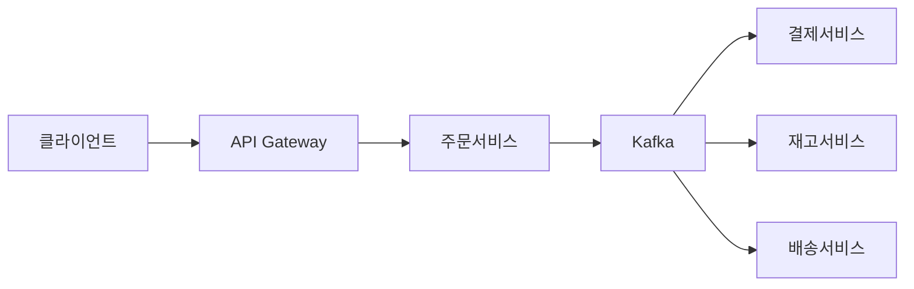
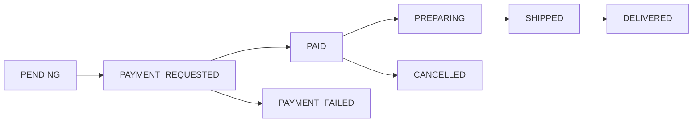

> **한 줄 요약**: 주문 시스템의 핵심은 상태 머신으로 주문 흐름을 제어하고, Saga 패턴으로 분산 트랜잭션을 보상하며, CQRS로 읽기·쓰기 부하를 분리하는 것이다.

## 실제 문제: 대규모 할인 행사 당일의 주문 시스템 장애

2023년 11월 국내 A 커머스 플랫폼의 대규모 할인 행사 당일, 자정 직후 초당 주문 건수가 평소의 30배 이상으로 치솟으면서 주문 서비스가 단속적으로 장애를 일으켰습니다. 일부 사용자는 결제가 완료됐음에도 주문 목록에서 주문이 보이지 않는 현상을 겪었고, 일부는 재고 소진 상품을 주문하는 데 성공했습니다. 두 가지 모두 같은 원인에서 비롯됐습니다. **주문 생성, 재고 차감, 결제 요청이 단일 동기 트랜잭션으로 묶여 있었고, 피크 트래픽에서 DB 락 경합이 폭발했기 때문**입니다.

쿠팡만의 문제가 아닙니다. 배달의민족은 치킨 주문 피크인 금요일 저녁 6~9시에, 마켓컬리는 새벽 배송 마감 직전 11~12시에 동일한 압력을 받습니다. 이 시스템들이 공통으로 풀어야 하는 문제는 세 가지입니다.

- **주문 유실 방지**: 결제는 됐는데 주문이 안 생기는 사태 — 돈은 나갔는데 상품은 안 온다
- **재고 초과 판매**: 재고 1개짜리 상품에 주문이 3건 들어오는 동시성 문제
- **주문 상태 불일치**: 사용자가 보는 주문 상태와 실제 처리 상태가 다른 경우

이 글에서는 이 세 문제를 정면으로 해결하는 주문 시스템 아키텍처를 단계별로 설계합니다.

---

## 설계 의사결정 로드맵

주문 시스템 설계에서 순서대로 답해야 할 핵심 결정 4가지입니다. 각 결정에서 "왜 이 선택인가"를 명확히 하지 않으면 면접에서 "그냥 DB 트랜잭션 하나로 하면 되지 않나요?"라는 후속 질문에 막힙니다.

### 결정 1: 주문 상태 관리 — 상태 컬럼 vs 상태 머신 vs 이벤트 소싱

**문제**: 주문은 생성부터 배송 완료까지 10개 이상의 상태를 거칩니다. 상태 전이를 어떻게 안전하게 관리하고, 잘못된 전이(예: 취소된 주문의 배송 처리)를 어떻게 막는가?

| 후보 | 장점 | 단점 | 언제 적합 |
|------|------|------|----------|
| 상태 컬럼 UPDATE | 구현 단순, 현재 상태 조회 O(1) | 잘못된 전이 방어 없음, 전이 이력 추적 불가 | 상태 2~3개 단순 시스템 |
| 상태 머신 (FSM) | 허용된 전이만 실행, 코드로 비즈니스 규칙 명시, 전이 이벤트 발행 | 설계 비용, 상태 증가 시 복잡도 | 커머스·예약처럼 복잡한 흐름 |
| 이벤트 소싱 | 전체 이력 추적, 시점 복원 가능, 이벤트 스트림으로 감사 완벽 | 구현 복잡도 매우 높음, 조회 시 스냅샷 필요 | 금융·감사 요구 극히 엄격한 경우 |

**우리의 선택: 상태 머신 (FSM)**
- 이유: 취소된 주문에 배송 처리가 들어오거나, 결제 전 주문이 완료 처리되는 버그를 코드 레벨에서 원천 차단합니다. 상태 전이 시 이벤트를 발행하므로 다운스트림 서비스(알림, 포인트, 배송)가 이벤트를 구독하여 자동 처리됩니다.
- 안 하면: 서비스가 성장하면서 개발자들이 `order.setStatus("COMPLETED")`를 여기저기 호출하게 됩니다. 3년 후에는 어디서 상태를 바꾸는지 아무도 모르는 코드베이스가 됩니다.

### 결정 2: 분산 트랜잭션 — 동기식 vs Saga vs Outbox

**문제**: 주문 생성 → 결제 요청 → 재고 차감 → 배송 요청이 서로 다른 마이크로서비스에 있을 때, 결제는 성공했는데 재고 차감이 실패하면 어떻게 하는가?

| 후보 | 장점 | 단점 | 언제 적합 |
|------|------|------|----------|
| 단일 동기 트랜잭션 | 구현 단순, ACID 보장 | 서비스 간 강결합, 하나가 느리면 전체 블로킹, 외부 API 포함 불가 | 모놀리스, 서비스 1~2개 |
| Saga (코레오그래피) | 서비스 독립, 락 없음, 높은 TPS | 보상 트랜잭션 직접 구현, 중간 상태 노출 | 마이크로서비스, 서비스 3개 이상 |
| Transactional Outbox | DB 트랜잭션과 이벤트 발행 원자성 보장 | 폴러 추가 운영, 최종 일관성 | 이벤트 유실 절대 안 되는 경우 |

**우리의 선택: Saga + Transactional Outbox 조합**
- 이유: 결제 서비스는 외부 PG사 HTTP API를 호출하므로 DB 트랜잭션에 묶을 수 없습니다. Saga는 각 서비스가 로컬 트랜잭션만 처리하고, 실패 시 보상 트랜잭션으로 이전 단계를 되돌립니다. Outbox 패턴은 "DB 저장 성공 후 Kafka 발행 실패" 문제를 해결합니다.
- 안 하면: 블프 피크에 결제 서버 응답 대기로 주문 서버 스레드 풀이 전부 블로킹되고, 신규 주문이 큐잉되다 타임아웃됩니다. 쿠팡 장애의 재현입니다.

### 결정 3: 주문번호 생성 — AUTO_INCREMENT vs UUID vs Snowflake

**문제**: 초당 1만 건의 주문을 여러 서버에서 동시에 생성할 때, 전역 유일한 주문번호를 어떻게 생성하는가? 주문번호는 고객이 CS에 직접 말하는 식별자이기도 합니다.

| 후보 | 장점 | 단점 | 언제 적합 |
|------|------|------|----------|
| AUTO_INCREMENT | 단순, 정렬 가능, 숫자 짧음 | 단일 DB 병목, 분산 환경 불가, 경쟁사에 건수 노출 | 단일 DB, 소규모 |
| UUID v4 | 분산 생성 가능, 충돌 없음 | 128비트 대용량, 비정렬로 인덱스 단편화, 고객이 외우기 불가 | 내부 식별자로만 사용 |
| Snowflake ID | 64비트 정수, 시간순 정렬, 분산 생성, 밀리초 안에 4,096개 | 서버 간 시계 동기화 필요, 워커 ID 관리 | 대규모 분산 시스템 |

**우리의 선택: Snowflake ID (내부) + 가독성 주문번호 (외부) 이중 구조**
- 이유: Snowflake ID를 PK로 사용하면 시간순 INSERT로 B-Tree 인덱스 단편화가 없고, 분산 환경에서 DB 없이 생성됩니다. 고객 노출용 주문번호는 `20260511-A1B2C3` 형태로 별도 생성하여 CS 소통을 쉽게 합니다.
- 안 하면: UUID를 PK로 쓰면 피크 시 INSERT가 랜덤 위치에 들어가 B-Tree 재정렬이 발생합니다. 초당 1만 건 피크에서 주문 테이블 INSERT가 2~3배 느려집니다.

### 결정 4: 주문 데이터 저장 — 단일 RDB vs CQRS vs 이벤트 스토어

**문제**: 주문 생성(쓰기)은 트랜잭션 안전성이 필요하고, 주문 목록 조회(읽기)는 필터·정렬·페이지네이션이 필요합니다. 하나의 DB로 두 부하를 감당하면 어떤 문제가 생기는가?

| 후보 | 장점 | 단점 | 언제 적합 |
|------|------|------|----------|
| 단일 RDB | 구현 단순, 강한 일관성 | 읽기·쓰기 부하 경합, 복잡한 조회 쿼리가 쓰기 성능 저하 | 초기 단계, 소규모 |
| CQRS (읽기/쓰기 분리) | 읽기·쓰기 독립 확장, 읽기 최적화 모델 구성 가능 | 구현 복잡도, 최종 일관성(수백 ms 지연) | 읽기 > 쓰기 비율 높은 경우 |
| 이벤트 스토어 | 완전한 이력, 시점 복원, Replay 가능 | 운영 복잡도 매우 높음, 학습 비용 | 감사·복원이 핵심인 금융 |

**우리의 선택: CQRS — MySQL(쓰기) + Elasticsearch(읽기)**
- 이유: 주문 생성·상태 업데이트는 MySQL에서 트랜잭션으로 처리합니다. 주문 목록 조회, 검색, 통계는 Elasticsearch에서 처리합니다. 읽기:쓰기 비율이 100:1이므로 읽기를 독립 확장하면 전체 비용 대비 효율이 큽니다.
- 안 하면: "내 주문 목록에서 날짜별·상태별 필터"를 단일 MySQL로 처리하면, 조회 쿼리의 Full Scan이 주문 생성 트랜잭션과 같은 DB 자원을 두고 경합합니다. 블프 피크에 주문 생성 TPS가 절반으로 떨어집니다.

---

## 1. 요구사항 분석 및 규모 추정

### 기능 요구사항

1. **주문 생성**: 장바구니 확정, 쿠폰 적용, 배송지 선택 후 주문 접수
2. **주문 조회**: 주문 상세, 주문 목록 (날짜·상태 필터, 페이지네이션)
3. **주문 취소**: 결제 전·후 취소, 부분 취소, 환불 연동
4. **주문 상태 추적**: 접수 → 결제 → 상품 준비 → 배송 중 → 완료
5. **재고 연동**: 주문 시 재고 선점(reserve), 취소 시 반환
6. **알림**: 주문 상태 변경 시 푸시·문자 발송

### 비기능 요구사항

- **가용성**: 99.99% (연간 52분 이하 다운타임) — 주문 불가 = 매출 직결 손실
- **지연시간**: 주문 생성 응답 1초 이내 (P99), 목록 조회 200ms 이내
- **일관성**: 재고 초과 판매 절대 불가 (강한 일관성 필요 영역)
- **확장성**: 블프 피크 평소의 30배 트래픽을 자동 확장으로 처리
- **내구성**: 주문 데이터 유실 불가, WAL + 다중 복제본

### 규모 추정

```
사용자 수: MAU 2,000만 명 (쿠팡 수준)
일일 주문: 300만 건/일
평균 QPS = 300만 / 86,400 ≈ 35 QPS
피크 QPS = 35 × 30 ≈ 1,050 QPS  (블프 피크 평소의 30배)

주문 생성 처리:
  - 1건당 처리 시간: 200ms (결제 포함 1,500ms)
  - 주문 서버 1대: 50 TPS 처리 가능
  - 피크 대응 서버 수: 1,050 / 50 = 21대 (오토스케일링)

데이터 용량:
  - 주문 1건: 주문 헤더(1KB) + 주문 상품(건당 0.5KB × 평균 3개) = 2.5KB
  - 일일 저장: 300만 × 2.5KB = 7.5GB/일
  - 연간: 7.5GB × 365 = 2.7TB/년
  - 5년 보관: 13.5TB (이벤트 로그 포함 × 3 = 40TB)

읽기 부하:
  - 주문 조회 QPS: 주문 생성의 100배 = 3,500 QPS 평균
  - 피크 조회: 3,500 × 30 = 105,000 QPS
  - → Elasticsearch 클러스터 + 읽기 캐시 필수
```

---

## 2. 고수준 아키텍처

> **비유:** 주문 시스템은 음식점 주방과 같습니다. 손님(사용자)이 홀 직원(API Gateway)에게 주문을 넣으면, 주문 접수 시스템(Order Service)이 주방표를 만듭니다. 계산대(Payment Service)가 결제를 처리하고, 창고(Inventory Service)에서 재료를 꺼내며, 배달부(Delivery Service)에게 넘깁니다. 각 파트는 독립적으로 움직이되, 주방표(이벤트)로 서로 소통합니다.



### 핵심 컴포넌트 역할

**API Gateway**
인증, 레이트 리미팅, SSL 종료를 담당합니다. 주문 생성은 Order Service로, 주문 조회는 Query Service(Elasticsearch 앞단)로 라우팅합니다. 블프 피크에 DDoS 방어 첫 번째 관문이기도 합니다.

**주문 서비스 (Order Service)**
주문의 생성과 상태 전이를 담당하는 핵심 서비스입니다. 상태 머신으로 허용된 전이만 실행하고, 각 전이 시 Outbox 테이블에 이벤트를 기록합니다. MySQL을 쓰기 저장소로 사용합니다.

**Kafka + Outbox Relay**
Order Service가 DB 트랜잭션 안에 Outbox 테이블에 이벤트를 기록하면, Relay 프로세스가 이를 읽어 Kafka로 발행합니다. 이 구조로 DB 저장과 이벤트 발행의 원자성을 보장합니다.

**결제 / 재고 / 배송 서비스**
각 서비스는 Kafka 이벤트를 구독하여 독립적으로 동작합니다. 실패 시 보상 이벤트를 발행하여 Saga 패턴으로 롤백합니다.

**Query Service + Elasticsearch**
주문 상태 변경 이벤트를 구독하여 Elasticsearch 인덱스를 동기화합니다. 사용자의 주문 목록 조회, 검색, 필터는 모두 Elasticsearch를 통해 MySQL에 부담 없이 처리합니다.

---

## 3. 핵심 컴포넌트 상세 설계

### 3-1. 주문 상태 머신

주문의 전체 생명주기를 상태 머신으로 정의합니다. 허용되지 않은 전이는 예외를 던지고, 각 전이는 반드시 이유(이벤트)를 동반합니다.



상태 전이 규칙 — "이 상태에서 저 상태로"만 허용:

| 현재 상태 | 허용 전이 | 트리거 이벤트 |
|-----------|-----------|--------------|
| PENDING | PAYMENT_REQUESTED | 결제 요청 |
| PAYMENT_REQUESTED | PAID, PAYMENT_FAILED | PG사 응답 수신 |
| PAID | PREPARING, CANCELLED | 판매자 확인 / 사용자 취소 |
| PREPARING | SHIPPED | 출고 처리 |
| SHIPPED | DELIVERED | 배송 완료 |

### 3-2. 주문 DB 스키마

```sql
-- 주문 헤더: 주문 1건의 핵심 정보
CREATE TABLE orders (
    id            BIGINT PRIMARY KEY,          -- Snowflake ID
    order_no      VARCHAR(20) UNIQUE NOT NULL, -- 고객 노출용 "20260511-A1B2C3"
    user_id       BIGINT NOT NULL,
    status        VARCHAR(30) NOT NULL,        -- 상태 머신 상태값
    total_amount  DECIMAL(15,2) NOT NULL,
    coupon_id     BIGINT,
    delivery_addr TEXT NOT NULL,
    created_at    DATETIME(6) NOT NULL,
    updated_at    DATETIME(6) NOT NULL,
    version       INT NOT NULL DEFAULT 0,      -- 낙관적 락 버전
    INDEX idx_user_status (user_id, status),
    INDEX idx_created_at (created_at)
);

-- 주문 상품: 주문 1건에 N개의 상품
CREATE TABLE order_items (
    id          BIGINT PRIMARY KEY,
    order_id    BIGINT NOT NULL,
    product_id  BIGINT NOT NULL,
    quantity    INT NOT NULL,
    unit_price  DECIMAL(15,2) NOT NULL,
    total_price DECIMAL(15,2) NOT NULL,
    FOREIGN KEY (order_id) REFERENCES orders(id)
);

-- Outbox 테이블: 이벤트 유실 방지
CREATE TABLE order_outbox (
    id           BIGINT PRIMARY KEY AUTO_INCREMENT,
    aggregate_id BIGINT NOT NULL,       -- orders.id
    event_type   VARCHAR(100) NOT NULL, -- "OrderCreated", "OrderCancelled"
    payload      JSON NOT NULL,
    published    BOOLEAN DEFAULT FALSE,
    created_at   DATETIME(6) NOT NULL,
    INDEX idx_unpublished (published, created_at)
);

-- 주문 상태 이력: 감사 로그
CREATE TABLE order_status_history (
    id         BIGINT PRIMARY KEY AUTO_INCREMENT,
    order_id   BIGINT NOT NULL,
    from_status VARCHAR(30),
    to_status   VARCHAR(30) NOT NULL,
    reason      VARCHAR(200),
    created_at  DATETIME(6) NOT NULL,
    INDEX idx_order_id (order_id)
);
```

### 3-3. Snowflake ID 생성

트위터가 고안한 Snowflake ID는 64비트 정수입니다. 앞에서부터 41비트 타임스탬프, 10비트 워커 ID, 12비트 시퀀스 번호로 구성됩니다. 밀리초당 4,096개, 초당 410만 개 생성이 가능합니다.

```java
@Component
public class SnowflakeIdGenerator {

    private static final long EPOCH = 1700000000000L; // 2023-11-14 기준점
    private static final long WORKER_ID_BITS = 10L;
    private static final long SEQUENCE_BITS = 12L;
    private static final long MAX_WORKER_ID = ~(-1L << WORKER_ID_BITS); // 1023
    private static final long SEQUENCE_MASK = ~(-1L << SEQUENCE_BITS);  // 4095

    private final long workerId;
    private long lastTimestamp = -1L;
    private long sequence = 0L;

    public SnowflakeIdGenerator(@Value("${snowflake.worker-id}") long workerId) {
        if (workerId > MAX_WORKER_ID || workerId < 0) {
            throw new IllegalArgumentException("Worker ID must be between 0 and " + MAX_WORKER_ID);
        }
        this.workerId = workerId;
    }

    public synchronized long nextId() {
        long timestamp = currentMs();

        // 시계가 뒤로 가는 경우 — NTP 보정 시 발생 가능
        if (timestamp < lastTimestamp) {
            throw new ClockMovedBackwardsException(
                "시계가 " + (lastTimestamp - timestamp) + "ms 역행했습니다. " +
                "짧은 대기 후 재시도하세요.");
        }

        if (timestamp == lastTimestamp) {
            sequence = (sequence + 1) & SEQUENCE_MASK;
            if (sequence == 0) {
                // 같은 밀리초에 4,096개 초과 — 다음 밀리초까지 대기
                timestamp = waitNextMillis(lastTimestamp);
            }
        } else {
            sequence = 0L;
        }

        lastTimestamp = timestamp;

        // 비트 조립: [타임스탬프 41bit][워커ID 10bit][시퀀스 12bit]
        return ((timestamp - EPOCH) << (WORKER_ID_BITS + SEQUENCE_BITS))
             | (workerId << SEQUENCE_BITS)
             | sequence;
    }

    private long waitNextMillis(long last) {
        long ts = currentMs();
        while (ts <= last) ts = currentMs();
        return ts;
    }

    private long currentMs() {
        return System.currentTimeMillis();
    }
}
```

### 3-4. 주문 생성 — Transactional Outbox 적용

```java
@Service
@RequiredArgsConstructor
public class OrderService {

    private final OrderRepository orderRepo;
    private final OrderOutboxRepository outboxRepo;
    private final OrderItemRepository itemRepo;
    private final SnowflakeIdGenerator idGen;
    private final OrderStateMachine stateMachine;

    @Transactional
    public OrderResult createOrder(CreateOrderRequest req) {
        // 1단계: 주문 생성 + Redis 재고 선점 (동기) — 빠른 재고 확인용
        // 2단계: OrderCreated 이벤트 발행 → Saga로 DB 재고 확정 (비동기)
        // Redis 선점은 "빠른 검증"이고, 실제 DB 차감은 Saga 스텝에서 수행
        validateAndReserveInventory(req.getItems());

        // 2. 주문 엔티티 생성
        long orderId = idGen.nextId();
        String orderNo = generateOrderNo();  // "20260511-A1B2C3"

        Order order = Order.builder()
            .id(orderId)
            .orderNo(orderNo)
            .userId(req.getUserId())
            .status(OrderStatus.PENDING)
            .totalAmount(calculateTotal(req))
            .deliveryAddr(req.getDeliveryAddr())
            .version(0)
            .build();

        List<OrderItem> items = req.getItems().stream()
            .map(i -> OrderItem.builder()
                .id(idGen.nextId())
                .orderId(orderId)
                .productId(i.getProductId())
                .quantity(i.getQuantity())
                .unitPrice(i.getUnitPrice())
                .totalPrice(i.getUnitPrice().multiply(BigDecimal.valueOf(i.getQuantity())))
                .build())
            .toList();

        orderRepo.save(order);
        itemRepo.saveAll(items);

        // 3. Outbox에 이벤트 기록 (DB 트랜잭션 내 — 원자성 보장)
        //    Kafka 발행은 별도 Relay 프로세스가 담당
        outboxRepo.save(OrderOutbox.builder()
            .aggregateId(orderId)
            .eventType("OrderCreated")
            .payload(toJson(new OrderCreatedEvent(orderId, orderNo, req)))
            .published(false)
            .build());

        return new OrderResult(orderId, orderNo);
    }

    @Transactional
    public void updateStatus(long orderId, OrderStatus newStatus, String reason) {
        // 낙관적 락: 동시에 같은 주문 상태를 변경하면 하나만 성공
        Order order = orderRepo.findByIdWithLock(orderId)
            .orElseThrow(() -> new OrderNotFoundException(orderId));

        // 상태 머신이 허용된 전이인지 검증
        OrderStatus prevStatus = order.getStatus();
        stateMachine.transition(order, newStatus);  // 불허 시 예외

        orderRepo.save(order);

        // 상태 이력 기록
        orderRepo.saveHistory(orderId, prevStatus, newStatus, reason);

        // Outbox에 상태 변경 이벤트 기록
        outboxRepo.save(OrderOutbox.builder()
            .aggregateId(orderId)
            .eventType("OrderStatusChanged")
            .payload(toJson(new OrderStatusChangedEvent(orderId, prevStatus, newStatus)))
            .published(false)
            .build());
    }
}
```

### 3-5. Saga — 주문 → 결제 → 재고 → 배송 흐름

Saga 패턴은 각 서비스가 로컬 트랜잭션으로 처리하고, 실패 시 이전 서비스에 보상(Compensating Transaction)을 요청하는 방식입니다.

```
정상 흐름:
  OrderCreated → [결제서비스] PaymentRequested → PaymentCompleted
               → [재고서비스] InventoryReserved
               → [배송서비스] DeliveryScheduled
               → OrderStatus: PAID → PREPARING → SHIPPED

실패 보상 흐름 (결제 실패 시):
  PaymentFailed
    → [재고서비스] InventoryReleased  (선점 해제)
    → [주문서비스] OrderCancelled      (상태 PAYMENT_FAILED로 전이)
    → [알림서비스] PaymentFailedNotification
```

```java
// 결제 서비스: OrderCreated 이벤트 수신 후 결제 요청
@KafkaListener(topics = "order.created")
@Transactional
public void handleOrderCreated(OrderCreatedEvent event) {
    try {
        PaymentResult result = pgGateway.requestPayment(
            event.getOrderId(),
            event.getTotalAmount(),
            event.getPaymentMethod()
        );

        if (result.isSuccess()) {
            // 결제 성공 — Outbox에 완료 이벤트
            publishEvent("payment.completed",
                new PaymentCompletedEvent(event.getOrderId(), result.getTxId()));
        } else {
            // 결제 실패 — 보상 이벤트 발행
            publishEvent("payment.failed",
                new PaymentFailedEvent(event.getOrderId(), result.getFailReason()));
        }
    } catch (PgTimeoutException e) {
        // PG 타임아웃: 멱등키로 결과 조회 후 처리
        schedulePaymentResultInquiry(event.getOrderId());
    }
}

// 재고 서비스: 결제 실패 시 선점 해제 (보상 트랜잭션)
@KafkaListener(topics = "payment.failed")
@Transactional
public void handlePaymentFailed(PaymentFailedEvent event) {
    inventoryRepo.releaseReservation(event.getOrderId());
    log.info("Inventory released for cancelled order {}", event.getOrderId());
}
```

### 3-6. 재고 선점 — 동시성 제어

블프 피크에 재고 1개짜리 한정판 상품에 수천 건의 주문이 동시에 들어올 때, 재고 초과 판매를 막는 방법입니다.

```java
// 낙관적 락으로 재고 차감 — 충돌 시 재시도
@Retryable(value = OptimisticLockException.class, maxAttempts = 3)
@Transactional
public void reserveInventory(long productId, int quantity) {
    Inventory inv = inventoryRepo.findById(productId)
        .orElseThrow(() -> new ProductNotFoundException(productId));

    if (inv.getAvailable() < quantity) {
        throw new OutOfStockException(productId);
    }

    // version 필드로 낙관적 락: 동시 수정 시 하나만 성공
    inv.reserve(quantity);  // available -= quantity, version++ 자동
    inventoryRepo.save(inv);
}
```

피크 대응을 위해 Redis를 앞단 완충재로 사용합니다. MySQL에서 `available > 0` 체크는 Redis에서 `DECRBY`로 먼저 처리하고, MySQL은 최종 확정만 담당합니다.

```java
// Redis로 선행 재고 차감 — MySQL 부하 절감
public boolean tryReserveWithRedis(long productId, int quantity) {
    String key = "inventory:" + productId;
    Long remaining = redisTemplate.opsForValue()
        .decrement(key, quantity);

    if (remaining != null && remaining >= 0) {
        return true;  // 선점 성공, MySQL 확정은 배치로 처리
    }
    // 초과 차감 복구
    redisTemplate.opsForValue().increment(key, quantity);
    return false;
}
```

> **정합성 복구**: Redis 선점 후 서비스가 죽으면 Redis와 MySQL이 불일치합니다. 이를 방지하기 위해 (1) Redis 예약에 TTL(15분)을 설정하여 미확정 예약을 자동 만료시키고, (2) 매 시간 배치로 Redis 잔여 수량과 MySQL `available` 컬럼을 대조하여 차이가 발생하면 MySQL 기준으로 Redis를 리셋합니다.

---

## 4. 장애 시나리오와 대응

| 시나리오 | 영향 | 감지 방법 | 대응 |
|---------|------|----------|------|
| MySQL 쓰기 노드 장애 | 주문 생성 불가 | Health check + 알림 | 레플리카 자동 Failover (60초 이내), 그 동안 주문 요청 큐잉 |
| Kafka 클러스터 장애 | 결제/재고/배송 이벤트 전파 중단 | Consumer lag 급증 | Outbox 테이블에 이벤트 보관, Kafka 복구 후 Relay가 재발행 |
| 결제 서비스 장애 | 결제 진행 불가 | Error rate spike | 주문은 PAYMENT_REQUESTED 상태로 보존, 결제 서비스 복구 후 재처리 |
| PG사 타임아웃 | 결제 성공 여부 불확실 | 응답 지연 > 5s | 멱등키로 PG사에 결과 재조회 (최대 3회), 불명 시 취소 처리 |
| 재고 서비스 장애 | 재고 선점 실패 | 5xx rate | Redis 재고 카운터가 버퍼로 동작, 재고 서비스 복구 후 MySQL 동기화 |
| Elasticsearch 장애 | 주문 목록 조회 불가 | Search 5xx | MySQL 읽기 레플리카로 Fallback (성능 저하지만 조회 가능) |
| 블프 트래픽 30배 | 전체 서버 부하 | CPU/메모리 알림 | 오토스케일링 사전 예열 (트래픽 예측 시 미리 스케일 아웃) |
| Outbox Relay 프로세스 다운 | 이벤트 발행 완전 중단, 하위 서비스 미동작 | Relay 하트비트 알림 | Relay를 2대 이상 배포하고 ShedLock으로 리더 선출, 폴링 간격 500ms, at-least-once 보장 후 컨슈머에서 멱등 처리 |

---

## 5. 확장 포인트

### 5-1. 수평 확장 전략

주문 서비스는 무상태(Stateless)로 설계되어 있어 수평 확장이 쉽습니다. 피크 트래픽 예측 시 오토스케일링 정책으로 서버를 미리 증설합니다. Kubernetes HPA(Horizontal Pod Autoscaler)를 CPU 70% 기준으로 설정하되, 블프 같은 계획된 이벤트는 `kubectl scale`로 미리 증설합니다.

```
오토스케일링 예열 시나리오:
  D-1 오후 11시: 서버 10대 → 30대 예비 증설
  D-day 자정:   트래픽 급증 감지 → HPA 30대 → 최대 100대
  D-day 오전 2시: 트래픽 감소 → 자동 스케일 인
```

### 5-2. DB 샤딩

단일 MySQL의 한계(약 5,000 TPS)를 넘어서면 `user_id % N` 기반 샤딩을 적용합니다. 주문 목록 조회가 항상 특정 사용자의 주문만 조회하므로, user_id 기반 샤딩은 크로스-샤드 쿼리 없이 깔끔하게 분산됩니다.

```
샤드 키 선택 기준:
  - user_id 기반: 사용자별 조회가 대부분 → 한 샤드에서 완결
  - order_id 기반: 단건 조회에는 좋지만 목록 조회 시 크로스-샤드 문제
  - 날짜 기반: 핫 파티션 문제 (최근 날짜 샤드에 부하 집중)

  결론: user_id % 16 샤딩이 커머스 주문에 가장 적합
```

### 5-3. 주문 아카이빙

5년 이상 된 주문 데이터는 MySQL에서 S3 기반 콜드 스토리지로 아카이빙합니다. 서비스 DB에는 최근 2년 데이터만 유지하여 쿼리 성능을 보존합니다.

```
아카이빙 파이프라인:
  MySQL → Spark 배치 (일 1회) → Parquet 변환 → S3 저장
  S3 데이터 조회: Athena 쿼리 (CS 팀 전용, 비용 per-query)
```

---

## 면접 포인트

**Q: 주문 생성 시 재고 차감을 어느 시점에 해야 하는가? 주문 시점 vs 결제 완료 시점**

A: 두 가지 전략이 있습니다. **결제 완료 후 차감**은 실제 판매만 집계하지만, 결제 진행 중에 재고가 소진되어 다른 사용자가 구매 불가한 문제가 있습니다. **주문 시점 선점 + 결제 완료 시 확정**이 커머스 표준입니다. 다만 선점 후 결제 미완 시 선점 해제 타임아웃(예: 10분)이 필요합니다. 쿠팡처럼 한정판 상품이 있는 경우 선점 없이 동시에 수천 명이 결제를 시도하게 됩니다.

**Q: 주문번호 노출로 경쟁사가 건수를 역산할 수 있다. 어떻게 막는가?**

A: 내부 PK로는 Snowflake ID(순차)를 사용하되, 고객 노출 주문번호는 별도 생성합니다. 날짜 + 랜덤 6자리 영숫자(`20260511-A1B2C3`)를 사용하면 경쟁사가 건수를 역산할 수 없고, CS 소통도 쉽습니다.

**Q: Saga의 보상 트랜잭션이 실패하면 어떻게 되는가?**

A: 보상 트랜잭션도 실패할 수 있습니다. 이 경우 재시도 + 알림으로 운영팀이 수동 처리합니다. 보상 트랜잭션은 반드시 멱등성을 보장해야 합니다(여러 번 실행해도 같은 결과). 보상도 실패하는 극단 케이스는 "데드 레터 큐(DLQ)"에 보관하고 운영팀이 처리하는 것이 현실적입니다.

**Q: CQRS에서 읽기 모델이 최신 상태가 아닐 수 있다. 주문 직후 조회 시 내 주문이 안 보이면?**

A: CQRS 읽기 모델의 최종 일관성 지연은 보통 수백 ms 이내입니다. 주문 직후 "내 주문 확인" 화면은 쓰기 DB(MySQL)에서 직접 조회하고, 주문 목록·검색은 Elasticsearch에서 조회하는 방식으로 분리합니다. UI에서 "주문이 처리 중입니다" 표시로 사용자 경험도 보완합니다.

**Q: 블프 피크에 초당 1만 건을 처리하려면 서버가 몇 대 필요한가?**

A: 주문 서버 1대 TPS를 50으로 가정하면 200대 필요합니다. 현실적으로 주문 처리의 병목은 서버가 아니라 DB입니다. MySQL 쓰기 노드 1대 한계(~5,000 TPS)를 넘어서면 DB 샤딩이 필수입니다. 16샤드 구성 시 80,000 TPS까지 확장 가능합니다. 실제로는 피크 트래픽의 80%가 재고 조회·주문 목록이므로 CQRS로 읽기를 분리하면 쓰기 DB 실질 부하는 훨씬 낮습니다.
