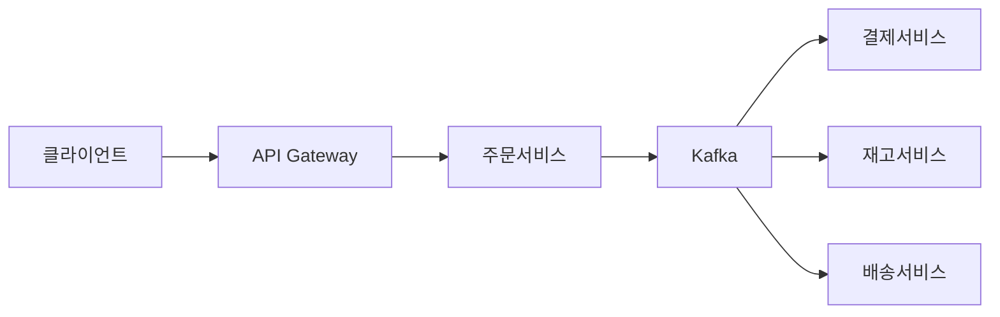
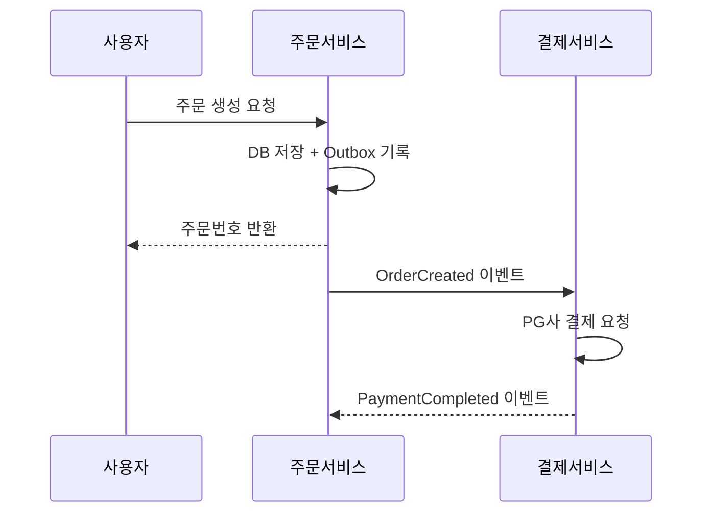
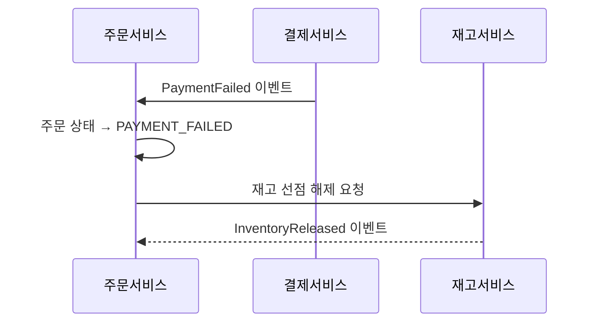
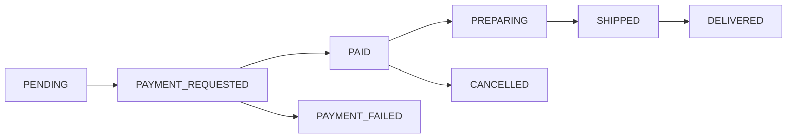

> **한 줄 요약**: 주문 시스템의 핵심은 상태 머신으로 주문 흐름을 제어하고, Saga 패턴으로 분산 트랜잭션을 보상하며, CQRS로 읽기·쓰기 부하를 분리하는 것이다.

## 실제 문제: 대규모 할인 행사 당일의 주문 시스템 장애

2023년 11월 국내 A 커머스 플랫폼의 자정 직후, 초당 주문이 평소의 30배로 치솟으면서 주문 서비스가 단속적으로 장애를 일으켰습니다. 일부 사용자는 결제가 됐는데 주문이 안 보이고, 일부는 품절 상품 주문에 성공했습니다. **주문 생성, 재고 차감, 결제 요청이 단일 동기 트랜잭션으로 묶여 피크 트래픽에서 DB 락 경합이 폭발했기 때문**입니다.

이 시스템들이 공통으로 풀어야 하는 문제:

- **주문 유실 방지**: 결제는 됐는데 주문이 안 생기는 사태
- **재고 초과 판매**: 재고 1개에 주문 3건이 들어오는 동시성 문제
- **주문 상태 불일치**: 사용자가 보는 상태와 실제 처리 상태가 다른 경우

---

## 설계 의사결정 로드맵

### 결정 1: 주문 상태 관리 — 상태 컬럼 vs 상태 머신 vs 이벤트 소싱

**문제**: 주문은 생성부터 배송 완료까지 10개 이상의 상태를 거칩니다. 잘못된 전이(취소된 주문의 배송 처리)를 어떻게 막는가?

| 후보 | 장점 | 단점 | 언제 적합 |
|------|------|------|----------|
| 상태 컬럼 UPDATE | 구현 단순, 현재 상태 O(1) | 잘못된 전이 방어 없음, 이력 추적 불가 | 상태 2~3개 단순 시스템 |
| 상태 머신 (FSM) | 허용된 전이만 실행, 전이 이벤트 발행 | 설계 비용, 상태 증가 시 복잡도 | 커머스·예약처럼 복잡한 흐름 |
| 이벤트 소싱 | 전체 이력 추적, 시점 복원 가능 | 구현 복잡도 매우 높음, 조회 시 스냅샷 필요 | 금융·감사 요구 극히 엄격한 경우 |

**우리의 선택: 상태 머신 (FSM)**

- 취소된 주문에 배송 처리가 들어오는 버그를 코드 레벨에서 원천 차단합니다.
- 상태 전이 시 이벤트를 발행하므로 다운스트림 서비스(알림·포인트·배송)가 자동 처리됩니다.
- **안 하면**: 서비스가 성장하면서 `order.setStatus("COMPLETED")`를 여기저기 호출하고, 결국 어디서 상태를 바꾸는지 아무도 모르는 코드가 됩니다.

### 결정 2: 분산 트랜잭션 — 동기식 vs Saga vs Outbox

**문제**: 주문 → 결제 → 재고 → 배송이 서로 다른 마이크로서비스에 있을 때, 결제는 성공했는데 재고 차감이 실패하면?

| 후보 | 장점 | 단점 | 언제 적합 |
|------|------|------|----------|
| 단일 동기 트랜잭션 | 구현 단순, ACID 보장 | 서비스 간 강결합, 외부 API 포함 불가 | 모놀리스, 서비스 1~2개 |
| Saga (코레오그래피) | 서비스 독립, 락 없음, 높은 TPS | 보상 트랜잭션 직접 구현, 중간 상태 노출 | 마이크로서비스 3개 이상 |
| Transactional Outbox | DB 트랜잭션과 이벤트 발행 원자성 보장 | 폴러 추가 운영, 최종 일관성 | 이벤트 유실 절대 안 되는 경우 |

**우리의 선택: Saga + Transactional Outbox 조합**

- 결제 서비스는 외부 PG사 HTTP API를 호출하므로 DB 트랜잭션에 묶을 수 없습니다.
- Saga는 각 서비스가 로컬 트랜잭션만 처리하고 실패 시 보상 트랜잭션으로 롤백합니다.
- Outbox 패턴은 "DB 저장 성공 후 Kafka 발행 실패" 문제를 해결합니다.
- **안 하면**: 블프 피크에 결제 서버 응답 대기로 주문 서버 스레드 풀 전체가 블로킹되고, 신규 주문이 타임아웃됩니다.

### 결정 3: 주문번호 생성 — AUTO_INCREMENT vs UUID vs Snowflake

**문제**: 초당 1만 건의 주문을 여러 서버에서 동시에 생성할 때, 전역 유일한 주문번호를 어떻게 생성하는가?

| 후보 | 장점 | 단점 | 언제 적합 |
|------|------|------|----------|
| AUTO_INCREMENT | 단순, 정렬 가능 | 단일 DB 병목, 경쟁사에 건수 노출 | 단일 DB, 소규모 |
| UUID v4 | 분산 생성 가능, 충돌 없음 | 비정렬로 인덱스 단편화, 고객이 외우기 불가 | 내부 식별자로만 사용 |
| Snowflake ID | 64비트, 시간순 정렬, 분산 생성 | 서버 간 시계 동기화 필요 | 대규모 분산 시스템 |

**우리의 선택: Snowflake ID (내부) + 가독성 주문번호 (외부) 이중 구조**

- Snowflake ID를 PK로 사용하면 시간순 INSERT로 B-Tree 단편화가 없고 DB 없이 분산 생성됩니다.
- 고객 노출용은 `20260511-A1B2C3` 형태로 별도 생성합니다.
- **안 하면**: UUID를 PK로 쓰면 피크 시 INSERT가 랜덤 위치에 들어가 초당 1만 건 피크에서 주문 테이블 INSERT가 2~3배 느려집니다.

### 결정 4: 주문 데이터 저장 — 단일 RDB vs CQRS vs 이벤트 스토어

**문제**: 주문 생성(쓰기)은 트랜잭션 안전성, 목록 조회(읽기)는 필터·정렬·페이지네이션이 필요합니다.

| 후보 | 장점 | 단점 | 언제 적합 |
|------|------|------|----------|
| 단일 RDB | 구현 단순, 강한 일관성 | 읽기·쓰기 부하 경합 | 초기 단계, 소규모 |
| CQRS (읽기/쓰기 분리) | 읽기·쓰기 독립 확장 | 구현 복잡도, 최종 일관성 | 읽기 > 쓰기 비율 높은 경우 |
| 이벤트 스토어 | 완전한 이력, Replay 가능 | 운영 복잡도 매우 높음 | 감사·복원이 핵심인 금융 |

**우리의 선택: CQRS — MySQL(쓰기) + Elasticsearch(읽기)**

- 주문 생성·상태 업데이트는 MySQL 트랜잭션으로 처리하고, 목록 조회·검색·통계는 Elasticsearch에서 처리합니다.
- 읽기:쓰기 비율이 100:1이므로 읽기를 독립 확장하면 비용 대비 효율이 큽니다.
- **안 하면**: 날짜별·상태별 필터 쿼리의 Full Scan이 주문 생성 트랜잭션과 DB 자원을 두고 경합해 블프 피크에 쓰기 TPS가 절반으로 떨어집니다.

---

## 1. 요구사항 분석 및 규모 추정

### 기능 요구사항

1. **주문 생성**: 장바구니 확정, 쿠폰 적용, 배송지 선택 후 주문 접수
2. **주문 조회**: 주문 상세, 목록 (날짜·상태 필터, 페이지네이션)
3. **주문 취소**: 결제 전·후 취소, 부분 취소, 환불 연동
4. **주문 상태 추적**: 접수 → 결제 → 상품 준비 → 배송 중 → 완료
5. **재고 연동**: 주문 시 재고 선점(reserve), 취소 시 반환
6. **알림**: 주문 상태 변경 시 푸시·문자 발송

### 비기능 요구사항

- **가용성**: 99.99% — 주문 불가는 매출 직결 손실
- **지연시간**: 주문 생성 P99 1초 이내, 목록 조회 200ms 이내
- **일관성**: 재고 초과 판매 절대 불가
- **확장성**: 블프 피크 평소의 30배 트래픽을 자동 확장으로 처리

### 규모 추정

```
일일 주문: 300만 건/일
평균 QPS = 300만 / 86,400 ≈ 35 QPS
피크 QPS = 35 × 30 ≈ 1,050 QPS

데이터 용량:
  - 주문 1건: 헤더(1KB) + 상품 평균 3개(0.5KB) = 2.5KB
  - 연간: 7.5GB × 365 = 2.7TB
  - 5년 보관: 40TB (이벤트 로그 포함)

읽기 부하:
  - 주문 조회 QPS: 쓰기의 100배 → 피크 105,000 QPS
  - → Elasticsearch 클러스터 + 읽기 캐시 필수
```

---

## 2. 고수준 아키텍처

> **비유:** 주문 시스템은 음식점 주방과 같습니다. 손님(사용자)이 홀 직원(API Gateway)에게 주문을 넣으면, 계산대(Payment Service)가 결제하고, 창고(Inventory Service)에서 재료를 꺼내며, 배달부(Delivery Service)에게 넘깁니다. 각 파트는 주방표(이벤트)로 소통합니다.



### 핵심 컴포넌트 역할

| 컴포넌트 | 핵심 역할 | 내부 동작 흐름 |
|----------|----------|--------------|
| **API Gateway** | 인증 + 읽기·쓰기 경로 분리 | JWT 검증 → 쓰기는 Order Service, 읽기는 Query Service(ES)로 라우팅 |
| **주문 서비스** | FSM 상태 전이 + Outbox 원자 기록 | 허용된 전이만 실행 → orders UPDATE + order_outbox INSERT 단일 트랜잭션 |
| **Kafka + Outbox Relay** | 이벤트 유실 원천 차단 | `published=false` 레코드 폴링 → Kafka 발행 → `published=true` 마킹 |
| **결제/재고/배송 서비스** | Kafka 기반 완전 독립 동작 | 이벤트 구독 → 로컬 트랜잭션 처리 → 성공/실패 이벤트 발행 |
| **Query Service + ES** | 읽기 전용 CQRS 모델 | 주문 직후는 MySQL 레플리카, 반복 조회는 ES 캐시에서 응답 |

**주문 생성 정상 흐름 (Saga)**



**결제 실패 시 Saga 보상 흐름**



---

## 3. 핵심 컴포넌트 상세 설계

### 3-1. 주문 상태 머신



| 현재 상태 | 허용 전이 | 트리거 이벤트 |
|-----------|-----------|--------------|
| PENDING | PAYMENT_REQUESTED | 결제 요청 |
| PAYMENT_REQUESTED | PAID, PAYMENT_FAILED | PG사 응답 수신 |
| PAID | PREPARING, CANCELLED | 판매자 확인 / 사용자 취소 |
| PREPARING | SHIPPED | 출고 처리 |
| SHIPPED | DELIVERED | 배송 완료 |

### 3-2. 주문 DB 스키마

```sql
CREATE TABLE orders (
    id            BIGINT PRIMARY KEY,          -- Snowflake ID
    order_no      VARCHAR(20) UNIQUE NOT NULL, -- 고객 노출용 "20260511-A1B2C3"
    user_id       BIGINT NOT NULL,
    status        VARCHAR(30) NOT NULL,
    total_amount  DECIMAL(15,2) NOT NULL,
    coupon_id     BIGINT,
    delivery_addr TEXT NOT NULL,
    created_at    DATETIME(6) NOT NULL,
    updated_at    DATETIME(6) NOT NULL,
    version       INT NOT NULL DEFAULT 0,      -- 낙관적 락
    INDEX idx_user_status (user_id, status),
    INDEX idx_created_at (created_at)
);

CREATE TABLE order_items (
    id          BIGINT PRIMARY KEY,
    order_id    BIGINT NOT NULL,
    product_id  BIGINT NOT NULL,
    quantity    INT NOT NULL,
    unit_price  DECIMAL(15,2) NOT NULL,
    total_price DECIMAL(15,2) NOT NULL,
    FOREIGN KEY (order_id) REFERENCES orders(id)
);

-- Outbox 테이블: 이벤트 유실 방지
CREATE TABLE order_outbox (
    id           BIGINT PRIMARY KEY AUTO_INCREMENT,
    aggregate_id BIGINT NOT NULL,
    event_type   VARCHAR(100) NOT NULL,
    payload      JSON NOT NULL,
    published    BOOLEAN DEFAULT FALSE,
    created_at   DATETIME(6) NOT NULL,
    INDEX idx_unpublished (published, created_at)
);

-- 주문 상태 이력: 감사 로그
CREATE TABLE order_status_history (
    id         BIGINT PRIMARY KEY AUTO_INCREMENT,
    order_id   BIGINT NOT NULL,
    from_status VARCHAR(30),
    to_status   VARCHAR(30) NOT NULL,
    reason      VARCHAR(200),
    created_at  DATETIME(6) NOT NULL,
    INDEX idx_order_id (order_id)
);
```

### 3-3. Snowflake ID 생성

> **왜 Snowflake ID인가?** AUTO_INCREMENT는 단일 DB가 병목이 되고 경쟁사에 주문 건수가 노출됩니다. UUID는 랜덤 삽입으로 B-Tree 단편화가 심합니다. Snowflake는 시간순 정렬 + 분산 생성 + 64비트 정수라는 세 조건을 동시에 만족합니다.

41비트 타임스탬프 + 10비트 워커 ID + 12비트 시퀀스. 밀리초당 4,096개, 초당 410만 개 생성 가능합니다.

```java
@Component
public class SnowflakeIdGenerator {

    private static final long EPOCH = 1700000000000L;
    private static final long WORKER_ID_BITS = 10L;
    private static final long SEQUENCE_BITS = 12L;
    private static final long MAX_WORKER_ID = ~(-1L << WORKER_ID_BITS);
    private static final long SEQUENCE_MASK = ~(-1L << SEQUENCE_BITS);

    private final long workerId;
    private long lastTimestamp = -1L;
    private long sequence = 0L;

    public SnowflakeIdGenerator(@Value("${snowflake.worker-id}") long workerId) {
        if (workerId > MAX_WORKER_ID || workerId < 0)
            throw new IllegalArgumentException("Worker ID must be between 0 and " + MAX_WORKER_ID);
        this.workerId = workerId;
    }

    public synchronized long nextId() {
        long timestamp = currentMs();

        if (timestamp < lastTimestamp)
            throw new ClockMovedBackwardsException(lastTimestamp - timestamp + "ms 역행");

        if (timestamp == lastTimestamp) {
            sequence = (sequence + 1) & SEQUENCE_MASK;
            if (sequence == 0) timestamp = waitNextMillis(lastTimestamp);
        } else {
            sequence = 0L;
        }

        lastTimestamp = timestamp;
        return ((timestamp - EPOCH) << (WORKER_ID_BITS + SEQUENCE_BITS))
             | (workerId << SEQUENCE_BITS)
             | sequence;
    }

    private long waitNextMillis(long last) {
        long ts = currentMs();
        while (ts <= last) ts = currentMs();
        return ts;
    }

    private long currentMs() { return System.currentTimeMillis(); }
}
```

### 3-4. 주문 생성 — Transactional Outbox 적용

> **왜 Outbox 패턴인가?** `@Transactional` 안에서 Kafka를 직접 호출하면 DB 커밋 성공 후 Kafka 발행이 실패할 때 이벤트가 영구 유실됩니다. Outbox 테이블에 이벤트를 DB 트랜잭션과 함께 기록하면 Relay가 반드시 한 번 이상 발행을 보장합니다.

```java
@Service
@RequiredArgsConstructor
public class OrderService {

    private final OrderRepository orderRepo;
    private final OrderOutboxRepository outboxRepo;
    private final SnowflakeIdGenerator idGen;

    @Transactional
    public OrderResult createOrder(CreateOrderRequest req) {
        validateAndReserveInventory(req.getItems());

        long orderId = idGen.nextId();
        String orderNo = generateOrderNo();  // "20260511-A1B2C3"

        Order order = Order.builder()
            .id(orderId).orderNo(orderNo).userId(req.getUserId())
            .status(OrderStatus.PENDING).totalAmount(calculateTotal(req))
            .deliveryAddr(req.getDeliveryAddr()).version(0).build();

        List<OrderItem> items = req.getItems().stream()
            .map(i -> OrderItem.builder()
                .id(idGen.nextId()).orderId(orderId)
                .productId(i.getProductId()).quantity(i.getQuantity())
                .unitPrice(i.getUnitPrice())
                .totalPrice(i.getUnitPrice().multiply(BigDecimal.valueOf(i.getQuantity())))
                .build())
            .toList();

        orderRepo.save(order);
        itemRepo.saveAll(items);

        // Outbox에 이벤트 기록 (DB 트랜잭션 내 — 원자성 보장)
        outboxRepo.save(OrderOutbox.builder()
            .aggregateId(orderId).eventType("OrderCreated")
            .payload(toJson(new OrderCreatedEvent(orderId, orderNo, req)))
            .published(false).build());

        return new OrderResult(orderId, orderNo);
    }

    @Transactional
    public void updateStatus(long orderId, OrderStatus newStatus, String reason) {
        Order order = orderRepo.findByIdWithLock(orderId)
            .orElseThrow(() -> new OrderNotFoundException(orderId));

        OrderStatus prevStatus = order.getStatus();
        stateMachine.transition(order, newStatus);  // 불허 시 예외
        orderRepo.save(order);
        orderRepo.saveHistory(orderId, prevStatus, newStatus, reason);

        outboxRepo.save(OrderOutbox.builder()
            .aggregateId(orderId).eventType("OrderStatusChanged")
            .payload(toJson(new OrderStatusChangedEvent(orderId, prevStatus, newStatus)))
            .published(false).build());
    }
}
```

### 3-5. Saga — 주문 → 결제 → 재고 → 배송 흐름

> **왜 Saga인가?** 결제 서비스는 외부 PG사 HTTP API를 호출하므로 DB 트랜잭션에 묶을 수 없습니다. 각 서비스가 로컬 트랜잭션만 처리하고 실패 시 보상 이벤트로 역방향 롤백하는 Saga 패턴이 분산 트랜잭션의 현실적 해법입니다.

```
정상 흐름:
  OrderCreated → [결제서비스] PaymentCompleted
               → [재고서비스] InventoryReserved
               → [배송서비스] DeliveryScheduled

실패 보상 흐름 (결제 실패):
  PaymentFailed
    → [재고서비스] InventoryReleased
    → [주문서비스] OrderCancelled (PAYMENT_FAILED)
    → [알림서비스] PaymentFailedNotification
```

```java
@KafkaListener(topics = "order.created")
@Transactional
public void handleOrderCreated(OrderCreatedEvent event) {
    try {
        PaymentResult result = pgGateway.requestPayment(
            event.getOrderId(), event.getTotalAmount(), event.getPaymentMethod());

        if (result.isSuccess()) {
            publishEvent("payment.completed",
                new PaymentCompletedEvent(event.getOrderId(), result.getTxId()));
        } else {
            publishEvent("payment.failed",
                new PaymentFailedEvent(event.getOrderId(), result.getFailReason()));
        }
    } catch (PgTimeoutException e) {
        // PG 타임아웃: 멱등키로 결과 조회 후 처리
        schedulePaymentResultInquiry(event.getOrderId());
    }
}

// 재고 서비스: 결제 실패 시 선점 해제 (보상 트랜잭션)
@KafkaListener(topics = "payment.failed")
@Transactional
public void handlePaymentFailed(PaymentFailedEvent event) {
    inventoryRepo.releaseReservation(event.getOrderId());
}
```

### 3-6. 재고 선점 — 동시성 제어

> **왜 낙관적 락 + Redis 2단계인가?** 비관적 락(SELECT FOR UPDATE)은 피크 시 DB 커넥션 전체를 락 대기 상태로 묶습니다. 낙관적 락으로 충돌 빈도가 낮은 일반 주문을 처리하고, 피크 대응은 Redis `DECRBY` 원자 연산이 DB 앞에서 재고를 먼저 걸러냅니다.

```java
@Retryable(value = OptimisticLockException.class, maxAttempts = 3)
@Transactional
public void reserveInventory(long productId, int quantity) {
    Inventory inv = inventoryRepo.findById(productId)
        .orElseThrow(() -> new ProductNotFoundException(productId));

    if (inv.getAvailable() < quantity)
        throw new OutOfStockException(productId);

    inv.reserve(quantity);  // available -= quantity, version++ 자동
    inventoryRepo.save(inv);
}
```

피크 대응을 위해 Redis를 완충재로 사용합니다. `available > 0` 체크는 Redis `DECRBY`로 먼저 처리하고, MySQL은 최종 확정만 담당합니다.

```java
public boolean tryReserveWithRedis(long productId, int quantity) {
    String key = "inventory:" + productId;
    Long remaining = redisTemplate.opsForValue().decrement(key, quantity);

    if (remaining != null && remaining >= 0) return true;
    redisTemplate.opsForValue().increment(key, quantity);  // 초과 차감 복구
    return false;
}
```

> **정합성 복구**: Redis 예약에 TTL(15분)을 설정해 미확정 예약을 자동 만료시키고, 매 시간 배치로 Redis와 MySQL `available` 컬럼을 대조해 차이 발생 시 MySQL 기준으로 리셋합니다.

---

## 4. 장애 시나리오와 대응

| 시나리오 | 영향 | 대응 |
|---------|------|------|
| MySQL 쓰기 노드 장애 | 주문 생성 불가 | 레플리카 자동 Failover (60초), 그 동안 주문 요청 큐잉 |
| Kafka 클러스터 장애 | 이벤트 전파 중단 | Outbox 테이블에 이벤트 보관, 복구 후 Relay 재발행 |
| 결제 서비스 장애 | 결제 진행 불가 | 주문은 PAYMENT_REQUESTED로 보존, 복구 후 재처리 |
| PG사 타임아웃 | 결제 성공 여부 불확실 | 멱등키로 PG사에 결과 재조회 (최대 3회), 불명 시 취소 |
| Elasticsearch 장애 | 주문 목록 조회 불가 | MySQL 읽기 레플리카로 Fallback |
| 블프 트래픽 30배 | 전체 부하 | 오토스케일링 사전 예열 (트래픽 예측 시 미리 스케일 아웃) |
| Outbox Relay 다운 | 이벤트 발행 완전 중단 | Relay 2대 이상 + ShedLock 리더 선출, at-least-once 후 컨슈머 멱등 처리 |

---

## 5. 확장 포인트

### 5-1. 수평 확장 전략

주문 서비스는 무상태(Stateless)로 수평 확장이 쉽습니다. HPA를 CPU 70% 기준으로 설정하되, 블프 같은 계획된 이벤트는 미리 증설합니다.

> **비유:** Auto Scaling은 불이 난 뒤 소방차를 부르는 것입니다. 계획된 이벤트는 불이 나기 전에 소방차를 배치해 두는 것이 맞습니다.

```
D-1 오후 11시: 서버 10대 → 30대 예비 증설
D-day 자정:   HPA 30대 → 최대 100대
D-day 오전 2시: 트래픽 감소 → 자동 스케일 인
```

### 5-2. DB 샤딩

> **왜 `user_id` 기준 샤딩인가?** 주문 목록 조회는 항상 특정 사용자의 주문만 조회하므로, `user_id % N`으로 샤딩하면 크로스-샤드 쿼리가 발생하지 않습니다.

| 샤딩 수 | 최대 TPS | 적용 시점 |
|---------|---------|---------|
| 단일 MySQL | ~5,000 | Phase 1~2 |
| 4 샤드 | ~20,000 | Phase 3 |
| 16 샤드 | ~80,000 | Phase 4 (글로벌) |

### 5-3. 주문 아카이빙

5년 이상 된 주문 데이터는 MySQL에서 S3 콜드 스토리지로 아카이빙합니다. 서비스 DB에는 최근 2년 데이터만 유지해 쿼리 성능을 보존합니다.

```
MySQL → Spark 배치 (일 1회) → Parquet → S3
S3 조회: Athena 쿼리 (CS 팀 전용, 비용 per-query)
```

---

## 면접 포인트

### 면접 포인트 1️⃣ "주문 생성 시 재고 차감을 어느 시점에 해야 하는가? 주문 시점 vs 결제 완료 시점"

- **결제 완료 후 차감**: 실제 판매만 집계하지만 결제 진행 중 재고가 소진되어 다른 사용자가 구매 불가한 문제 발생
- **주문 시점 선점 + 결제 완료 시 확정**: 커머스 표준. 선점 후 결제 미완 시 선점 해제 타임아웃(10분) 필요

### 면접 포인트 2️⃣ "주문번호 노출로 경쟁사가 건수를 역산할 수 있다. 어떻게 막는가?"

내부 PK는 Snowflake ID(순차)를 사용하고, 고객 노출 주문번호는 날짜 + 랜덤 6자리 영숫자(`20260511-A1B2C3`)로 별도 생성합니다. 경쟁사가 건수를 역산할 수 없고, CS 소통도 쉽습니다.

### 면접 포인트 3️⃣ "Saga의 보상 트랜잭션이 실패하면 어떻게 되는가?"

- 보상 트랜잭션도 실패할 수 있습니다. 재시도 + 알림으로 운영팀이 수동 처리합니다.
- 보상 트랜잭션은 반드시 **멱등성**을 보장해야 하며(여러 번 실행해도 같은 결과)
- 보상도 실패하는 극단 케이스는 **DLQ(Dead Letter Queue)** 에 보관 후 운영팀이 처리합니다.

### 면접 포인트 4️⃣ "CQRS에서 주문 직후 조회 시 내 주문이 안 보이면?"

읽기 모델의 최종 일관성 지연은 보통 수백 ms 이내입니다. 주문 직후 "내 주문 확인" 화면은 쓰기 DB(MySQL)에서 직접 조회하고, 주문 목록·검색은 Elasticsearch에서 조회하는 방식으로 분리합니다. UI에서 "주문이 처리 중입니다" 표시로 UX를 보완합니다.

### 면접 포인트 5️⃣ "블프 피크에 초당 1만 건을 처리하려면 서버가 몇 대 필요한가?"

- 주문 서버 1대 TPS를 50으로 가정하면 **200대** 필요
- 실제 병목은 서버가 아니라 **DB**: MySQL 쓰기 노드 한계(~5,000 TPS) 초과 시 DB 샤딩 필수
- 16샤드 구성 시 **80,000 TPS**까지 확장 가능
- 피크 트래픽의 80%가 재고 조회·목록이므로 CQRS로 읽기를 분리하면 쓰기 DB 실질 부하는 훨씬 낮음

---

## 극한 시나리오

### 극한 시나리오 1: 자정 블프 — 초당 1만 건 주문 폭주

자정 정각 쿠폰 행사가 시작되면서 평소 35 QPS이던 주문이 10,000 QPS로 순식간에 치솟습니다. 주문 생성, 재고 선점, 결제 요청이 동시에 폭발합니다.

**문제점:**
- MySQL 쓰기 노드 커넥션 풀 소진으로 주문 INSERT가 대기 큐에 쌓임
- 재고 선점 Redis DECRBY 경합: 동일 상품에 수천 건이 동시에 요청해 음수 재고 발생 위험
- 결제 서비스 스레드 풀이 PG사 응답 대기로 전부 블로킹되어 신규 주문 타임아웃

**대응 전략:**
1️⃣ **사전 스케일 아웃**: 블프 D-1 오후 11시에 서버를 10대 → 30대로 미리 증설합니다. Auto Scaling은 기동에 2~5분이 걸리므로 자정 피크에는 이미 늦습니다.

2️⃣ **Redis 재고 원자 연산**: `DECRBY`로 차감 후 잔여가 0 미만이면 즉시 `INCRBY`로 복구합니다. Redis 단일 스레드 특성 덕분에 두 명령 사이에 다른 요청이 끼어들지 않습니다.

3️⃣ **주문 큐잉 버퍼**: DB 커넥션 풀 90% 소진 시 신규 주문을 SQS에 적재하고 "잠시 후 확인" 응답을 반환합니다. 사용자에게 주문번호를 즉시 발급해 불안감을 줄이고, 큐에서 순차 처리합니다.

4️⃣ **PG 타임아웃 단축**: 평소 10초 → 피크 시 3초. 느린 PG보다 빠른 실패가 폴백 PG로의 전환을 앞당깁니다.

### 극한 시나리오 2: 재고 초과 판매 — 동시 주문 1,000건에 재고 1개

한정판 상품 재고 1개에 1,000명이 동시에 주문을 시도합니다. DB 낙관적 락 충돌이 폭발하고 일부 요청이 재고 0임에도 통과될 위험이 있습니다.

**문제점:**
- 낙관적 락 충돌로 대부분의 요청이 `OptimisticLockException` → 재시도 → 충돌 반복
- Redis DECRBY 음수 허용 시 재고가 -50까지 떨어지는 초과 판매
- 재시도 루프로 DB와 Redis에 대한 부하가 원래 요청의 10배로 증폭

**대응 전략:**
1️⃣ **Redis 재고 원자 차감 선행**: DB 조회 전에 Redis `DECRBY`로 먼저 재고를 차감합니다. 잔여가 음수이면 즉시 복구하고 품절 응답을 반환합니다. DB까지 도달하는 요청 수를 극적으로 줄입니다.

2️⃣ **재고 선점 TTL**: Redis 예약에 15분 TTL을 설정합니다. 결제를 완료하지 않은 선점은 자동으로 해제되어 다음 대기자에게 기회가 돌아갑니다.

3️⃣ **낙관적 락 재시도 횟수 제한**: `@Retryable(maxAttempts=3)`으로 재시도를 3회로 제한하고 이후에는 품절 응답을 반환합니다. 무한 재시도 루프를 차단합니다.

### 극한 시나리오 3: Saga 보상 실패 — 결제는 됐는데 주문이 없다

결제 서비스가 PG사 승인을 받고 `PaymentCompleted` 이벤트를 발행했지만, 주문 서비스가 Kafka Consumer 재시작 중이었고 이벤트를 처리하기 전에 Consumer 오프셋 커밋에 실패했습니다. 사용자 계좌에서 돈은 빠졌는데 주문이 생성되지 않은 상태가 됩니다.

**문제점:**
- 사용자: "결제됐는데 주문이 없다" → CS 폭주
- 환불을 위해선 주문 ID가 필요한데 주문이 없으므로 수동 처리 필요
- 동일 이벤트를 재처리하면 이미 처리된 경우 중복 주문 생성 위험

**대응 전략:**
1️⃣ **Consumer 멱등성 보장**: `payment_id`를 주문 테이블에 UNIQUE 제약으로 저장합니다. 이벤트가 중복 처리돼도 두 번째 INSERT는 실패하고 기존 주문을 반환합니다.

2️⃣ **결제-주문 상태 정합성 배치**: 5분마다 `PaymentCompleted` 이벤트가 있지만 대응하는 주문이 없는 건을 감지해 자동으로 주문을 생성하거나 환불 프로세스를 트리거합니다.

3️⃣ **DLQ 모니터링**: 처리 실패 이벤트가 DLQ에 쌓이면 P0 알람을 발생시키고 운영팀이 수동으로 재처리합니다. DLQ 메시지 유실이 결국 "돈 잃어버린 사용자"를 만듭니다.

---

## 실무 실수 Top 5

**실수 1: 주문 생성과 결제 요청을 단일 동기 트랜잭션으로 묶는다**
`@Transactional` 안에서 PG사 HTTP API를 호출하는 코드를 자주 봅니다. PG사 응답이 3초 걸리는 동안 DB 트랜잭션이 열려 있어 커넥션을 점유합니다. 블프 피크에 커넥션 풀 전체가 PG 응답 대기에 묶이면 서비스 전체가 멈춥니다. 주문 생성은 DB 트랜잭션으로 완결하고, PG 요청은 Saga 이벤트로 비동기 처리하세요.

**실수 2: 재고 차감을 결제 완료 후에 한다**
"결제가 확정된 건에만 재고를 차감하겠다"는 논리는 맞지만, 결제 진행 중 다른 사용자가 같은 상품을 주문해 재고를 모두 소진할 수 있습니다. 결제 완료 후 재고가 없어서 주문 취소가 발생하면 사용자 경험이 최악입니다. 커머스 표준은 주문 시점에 재고를 선점(reserve)하고, 결제 완료 시 확정(confirm), 결제 실패 시 반환(release)하는 3단계입니다.

**실수 3: 보상 트랜잭션을 멱등하게 만들지 않는다**
`inventoryRepo.releaseReservation(orderId)` 를 두 번 호출하면 재고가 두 배 복구됩니다. Kafka Consumer의 at-least-once 발행 특성상 보상 이벤트가 중복 처리될 수 있습니다. 모든 보상 트랜잭션은 처리 여부를 DB에 기록하고 이미 처리된 경우 무시(idempotent)하도록 설계하세요.

**실수 4: Outbox Relay를 단일 인스턴스로만 운영한다**
Relay가 다운되면 이벤트 발행이 완전히 중단됩니다. Relay를 2대 이상 운영하되, ShedLock 또는 Redis 분산 락으로 중복 발행을 막아야 합니다. Relay 2대가 동시에 같은 Outbox 레코드를 처리하면 이벤트가 두 번 발행되므로 Consumer 멱등성이 전제되어야 합니다.

**실수 5: 주문 목록 조회에 MySQL OFFSET 페이지네이션을 사용한다**
`SELECT ... LIMIT 20 OFFSET 10000`은 OFFSET이 클수록 느립니다. 300만 건 주문 테이블에서 `OFFSET 100000`은 풀 스캔에 가깝습니다. Cursor 기반 페이지네이션(`WHERE id < :lastId ORDER BY id DESC LIMIT 20`)으로 전환하거나, 목록 조회를 Elasticsearch로 이관해서 MySQL 부하를 없애세요.

---

## Day 1 → Scale 진화

주문 시스템을 처음부터 Saga + CQRS + Snowflake ID로 구성하면 MAU 1만에서도 운영 복잡도가 팀을 압도한다. 실제 트래픽 규모가 병목을 만들 때 전환하는 것이 원칙이다.

### Phase 1 — MAU 1만, 일 주문 1만 건 (스타트업 초기)

**아키텍처**: 모놀리스 + MySQL 단일 인스턴스
- 주문·결제·재고를 단일 서비스 내 DB 트랜잭션으로 처리 (Saga 불필요)
- 주문번호: MySQL AUTO_INCREMENT (경쟁사 노출 문제는 MAU 1만에서는 허용)
- 재고: MySQL row-level 락으로 동시성 제어
- 상태 관리: Enum 컬럼 + 서비스 레이어 if-else (FSM 불필요)

**월 비용**: ~$130/월
- EC2 t3.medium × 2: ~$70
- RDS MySQL db.t3.medium: ~$60

### Phase 2 — MAU 10만, 일 주문 10만 건 (서비스 성장)

**아키텍처**: 주문 서비스 분리 + 상태 머신 도입
- 주문 서비스를 독립 마이크로서비스로 분리. 결제는 여전히 동기 HTTP 호출
- 상태 머신(FSM) 도입으로 잘못된 전이 원천 차단
- 주문번호를 Snowflake ID + 가독성 번호 이중 구조로 전환
- 재고 선점 Redis 도입 (피크 시 DB 락 경합 방지)
- MySQL 읽기 레플리카 추가로 조회 부하 분산

**월 비용**: ~$800/월
- EC2 c5.large × 4: ~$400
- RDS MySQL Multi-AZ: ~$250
- ElastiCache Redis r6g.small: ~$80
- 기타: ~$70

### Phase 3 — MAU 100만, 일 주문 300만 건 (고성장)

**아키텍처**: Saga + CQRS + Transactional Outbox
- 결제·재고·배송 서비스 완전 분리, Kafka 기반 Saga 이벤트 체인 구축
- Transactional Outbox 패턴으로 이벤트 유실 원천 차단
- CQRS: MySQL(쓰기) + Elasticsearch(읽기) 분리. 주문 목록 조회 ES로 이관
- DB 샤딩 준비: `user_id % 4` 기준 논리 샤딩 먼저 적용
- DLQ + 운영 대시보드: Saga 보상 실패 모니터링 체계 구축

**월 비용**: ~$6,000/월
- EC2 c5.2xlarge × 8: ~$2,000
- RDS Aurora MySQL (Multi-AZ + 읽기 레플리카 2): ~$2,500
- ElastiCache Redis Cluster: ~$600
- Kafka MSK: ~$400
- ES 클러스터 (주문 목록용): ~$500

### Phase 4 — MAU 1억, 일 주문 3,000만 건 (글로벌)

**아키텍처**: DB 샤딩 + 멀티리전 + 실시간 배송 추적
- `user_id % 16` DB 샤딩으로 80,000 TPS까지 확장
- 멀티리전 Active-Active: 한국·미국·동남아 리전 독립 주문 처리
- 실시간 배송 추적: 배송사 웹훅 → Kafka → 주문 상태 자동 갱신
- 주문 아카이빙: 5년 이상 주문을 S3 Parquet으로 이관, Athena로 조회
- ML 기반 사기 주문 탐지: 비정상 패턴 실시간 차단

**월 비용**: ~$50,000/월
- 멀티리전 컴퓨팅: ~$20,000
- 샤딩 DB 클러스터: ~$15,000
- Kafka + ES + Redis: ~$8,000
- ML 서빙 + 모니터링: ~$7,000

---

## 핵심 메트릭

| 메트릭 | 정상 기준 | 이상 신호 | 원인 가설 |
|--------|---------|---------|---------|
| **주문 생성 P99** | 1초 이내 | 3초 초과 | DB 커넥션 풀 소진, PG 동기 호출 블로킹, Outbox INSERT 지연 |
| **재고 초과 판매 건수** | 0건/일 | 1건 이상 | Redis 음수 재고 방어 누락, 낙관적 락 재시도 한도 초과 |
| **Outbox Relay Lag** | 5초 이내 | 30초 초과 | Relay 프로세스 다운, DB 커넥션 부족, Kafka 클러스터 응답 지연 |
| **Saga 보상 실패 건수** | 0건/일 | 1건 이상 | 보상 트랜잭션 멱등성 부재, 외부 서비스(PG·배송사) 장기 장애 |
| **DLQ 적재 건수** | 0건/일 | 10건 이상 | Consumer 처리 실패 반복, 스키마 불일치, 비즈니스 예외 미처리 |
| **주문 상태 불일치 건수** | 0건/일 | 1건 이상 | FSM 우회 코드 존재, Kafka 이벤트 순서 역전, Consumer 중복 처리 |

**핵심 알람 설정 예시**

```
주문 생성 P99 > 3초 → PagerDuty P1 (DB 커넥션 풀 상태 즉시 확인)
재고 초과 판매 1건 → PagerDuty P0 + 해당 주문 즉시 취소 및 사용자 통지
Outbox Relay Lag > 30초 → PagerDuty P1 (Relay 인스턴스 상태 확인)
Saga 보상 실패 1건 → PagerDuty P0 (DLQ 확인, 수동 처리 준비)
DLQ 10건 이상 → Slack 알림 (Consumer 로그 즉시 확인)
```

---

## 실제 장애 사례

### 사례 1: 쿠팡 2020 블프 — 단일 DB 트랜잭션이 PG 호출을 포함

**상황**: 블프 자정 직후 주문 트래픽이 30배 폭증했다. 주문 생성 로직이 `@Transactional` 안에서 PG사 HTTP 승인 API를 동기 호출하고 있었다. PG사 응답이 평소 200ms에서 피크 시 3~8초로 늘어났다. DB 커넥션 풀 200개가 모두 PG 응답 대기에 블로킹됐고, 새 주문 요청이 커넥션을 받지 못해 큐에 쌓였다. 큐도 가득 차자 서비스가 503 응답을 반환하기 시작했다. 30분간 주문 불가 상태가 지속됐다.

**근본 원인**: `@Transactional` 범위 안에 외부 API(PG사) 호출을 포함했다. 외부 API는 응답 시간이 예측 불가능하므로 DB 커넥션을 장기 점유하게 된다.

**해결책**:
- 주문 생성은 DB 트랜잭션만으로 완결 (결제 요청은 Outbox 이벤트로 비동기 처리)
- 결제 서비스를 독립 프로세스로 분리, Saga 패턴 적용
- DB 커넥션 풀 크기를 CPU 코어 수 × 2 + 10 공식으로 적정화
- PG 타임아웃을 피크 시 3초로 단축해 블로킹 최소화

**교훈**: DB 트랜잭션 안에 절대 외부 HTTP 호출을 포함하지 말라. 외부 API는 항상 느려질 수 있고, 그 순간 DB 커넥션을 인질로 잡는다.

### 사례 2: 배달의민족 2022 — FSM 없는 상태 관리로 중복 배달 발생

**상황**: 주문 상태를 단순 Enum 컬럼으로 관리하고 있었다. 배송 서비스가 `SHIPPED` 이벤트를 Kafka에서 두 번 수신했다(Consumer 재시작으로 인한 중복 발행). 두 이벤트 모두 `order.setStatus("SHIPPED")`를 실행했고, 두 번째 호출이 배달 기사에게 두 번 배달 요청을 보냈다. 같은 주문이 두 번 배달되는 사고가 발생했다.

**근본 원인**: 상태 전이에 FSM이 없었고, Consumer 멱등성도 보장되지 않았다. `SHIPPED → SHIPPED` 전이가 가능했고, 두 번째 전이가 또 다른 배달 요청을 트리거했다.

**해결책**:
- FSM 도입으로 `SHIPPED → SHIPPED` 전이 시 예외 발생 (이미 처리된 것으로 무시)
- 배달 요청 전 `delivery_id` UNIQUE 체크로 중복 요청 차단
- Kafka Consumer에 `event_id` 기반 멱등성 처리 테이블 추가
- 주문 상태 변경 이벤트를 처리하기 전 현재 상태를 다시 조회해 유효성 검증

**교훈**: 이벤트 기반 시스템에서 중복 이벤트는 반드시 발생한다. Consumer 멱등성과 FSM은 옵션이 아닌 필수다.

### 사례 3: 마켓컬리 2023 — 재고 선점 TTL 미설정으로 영구 재고 잠김

**상황**: 주문 시점에 Redis로 재고를 선점하는 로직을 도입했다. 그런데 선점한 재고에 TTL을 설정하지 않았다. 결제 페이지에서 이탈한 사용자의 선점 재고가 영원히 해제되지 않았다. 인기 상품 재고 100개가 며칠 만에 모두 선점돼 구매 불가 상태가 됐지만 실제 판매는 30개에 불과했다. 재고가 있음에도 품절로 표시된 채 수만 명의 잠재 구매자를 잃었다.

**근본 원인**: Redis 재고 선점에 TTL을 설정하지 않았다. 결제를 완료하지 않은 선점이 무기한 유지됐다.

**해결책**:
- 재고 선점 Redis 키에 TTL 15분 강제 설정 (`EXPIRE inventory:reserve:{orderId} 900`)
- 결제 완료 이벤트 수신 시 선점 → 확정으로 상태 변경, TTL 제거
- 주문 생성 후 15분 타이머: 결제 미완료 시 자동으로 재고 선점 해제 + 주문 CANCELLED 처리
- 매 시간 배치로 Redis 선점 수량과 MySQL 실제 재고의 차이를 검증, 불일치 시 알람

**교훈**: Redis에 저장하는 모든 비즈니스 상태에는 항상 TTL을 설정하라. TTL 없는 Redis 데이터는 시간이 지나면 반드시 문제를 만든다.
