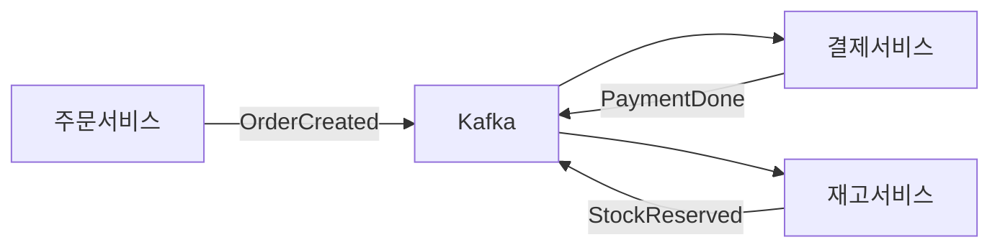
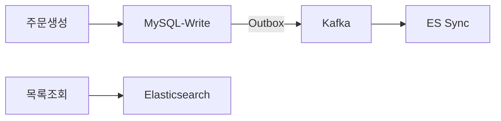
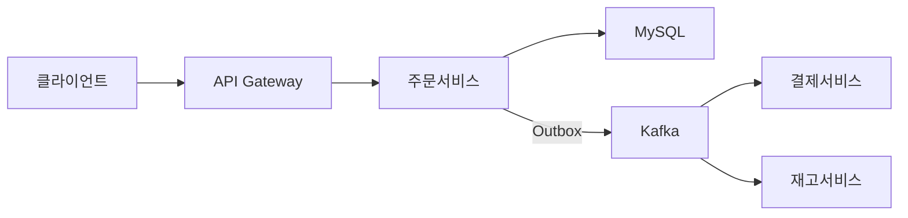
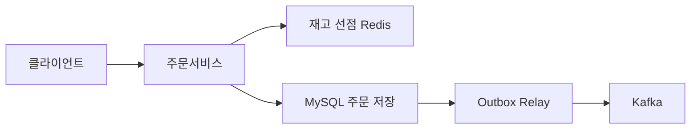

> **한 줄 요약**: 시니어는 "무엇을 쓰느냐"가 아니라 "왜 쓰느냐"를 설명한다. MySQL을 고른 이유, Saga를 고른 이유, CQRS를 고른 이유 — 모든 결정에 WHY가 있어야 면접을 통과한다.

---

## 실제 사고 (Incident): 블프 자정, 30분 만에 503

2023년 11월 블랙프라이데이 자정. 평소 35 QPS이던 주문이 순식간에 10,000 QPS로 폭증했습니다. 30분 뒤 서비스 전체가 503을 반환했고, "결제됐는데 주문이 없다"는 CS 신고가 폭주했습니다.

**장애의 진짜 원인 세 가지**

첫째, `@Transactional` 안에서 PG사 HTTP API를 동기 호출하고 있었습니다. PG사 응답이 피크 시 200ms에서 8초로 늘어나자 DB 커넥션 풀 200개가 전부 PG 응답 대기에 묶였습니다. 새 요청은 커넥션조차 얻지 못하고 큐에 쌓이다 타임아웃됐습니다.

둘째, 주문·결제·재고가 단일 DB 트랜잭션으로 묶여 있어 락 경합이 선형이 아닌 지수 함수로 증가했습니다.

셋째, 재고 선점에 TTL이 없어 결제를 이탈한 사용자의 선점이 영구 유지됐습니다. 재고 100개 중 70개가 잠긴 채 품절로 표시됐습니다.

이 글은 이 세 가지 문제를 "왜 그 방법으로 해결해야 하는가"를 중심으로 주문 시스템 전체를 설계합니다.

---

## 1. 요구사항 분석 — 면접의 첫 번째 채점 항목

"주문 시스템이요? 네, 바로 설계하겠습니다"라고 하면 탈락입니다. 시니어 면접관이 가장 먼저 보는 것은 요구사항을 스스로 도출하는 능력입니다.

### 1-1. 기능 요구사항

면접에서 반드시 확인해야 할 질문들과 함께 정리합니다.

| 기능 | 상세 | 면접에서 반드시 확인할 것 |
|------|------|--------------------------|
| **주문 생성** | 장바구니 확정 → 쿠폰 적용 → 배송지 선택 → 주문 접수 | 부분 주문 가능한가? 비회원 주문인가? |
| **주문 취소** | 결제 전 즉시 취소, 결제 후 환불 요청, 부분 취소 | 취소 가능 시간 제한이 있는가? |
| **환불 처리** | PG사 환불 요청 → 주문 상태 REFUNDED 전이 | 즉시 환불인가, 영업일 기준인가? |
| **주문 이력** | 날짜·상태 필터, 페이지네이션, 상세 조회 | 얼마나 오래된 데이터까지 조회하는가? |
| **상태 추적** | 접수 → 결제 → 상품 준비 → 배송 중 → 완료 | 실시간 배송 위치 추적이 필요한가? |
| **재고 연동** | 주문 시 선점(reserve), 취소 시 반환, 결제 완료 시 확정 | 재고 0 시 대기열을 받는가? |
| **장바구니** | 상품 추가·삭제·수량 변경, 세션 유지 | 로그인 전 장바구니가 로그인 후에 합쳐지는가? |

### 1-2. 비기능 요구사항 — 숫자에 이유가 있어야 한다

**가용성 목표: 99.99% — 왜 99.9%가 아닌가**

주문 불가는 매출 직결 손실입니다. 99.9%는 연간 8.7시간 다운을 허용합니다. 블프 당일 8시간 장애는 수백억 원 손실입니다. 99.99%는 연간 52분입니다. "왜 99.99%인가"를 설명 못 하면 숫자를 외운 것으로 보입니다.

**일관성: 재고 초과 판매 절대 불가 — 왜 최종 일관성이 아닌가**

"최종 일관성이면 괜찮지 않나요?"라고 답하면 탈락입니다. 재고 1개에 주문 2건이 들어오면 1건은 반드시 실패해야 합니다. 결제 금액, 재고 수량 같은 금융 데이터는 Strong Consistency가 필수입니다.

**지연시간 목표**

| 작업 | 목표 | 왜 이 수치인가 |
|------|------|----------------|
| 주문 생성 P99 | 1초 이내 | 결제 버튼 후 1초 초과 시 이탈률 급증. 심리학적 임계점 |
| 주문 목록 조회 P99 | 200ms 이내 | 200ms 초과 시 사용자가 느리다고 인지 |
| 재고 확인 | 50ms 이내 | 상품 상세 페이지 동기 호출. 초과 시 렌더링 지연 |
| 장바구니 응답 | 30ms 이내 | 클릭 즉시 피드백이어야 UX 충족 |

---

## 2. 규모 추정 — 숫자 없이 설계하면 감각이 없는 것

규모 추정을 생략하면 "그냥 스케일 아웃하면 되지"라는 사고로 보입니다. 구체적인 수치가 DB 샤딩 시점, 캐시 용량, 서버 대수를 결정합니다.

### 2-1. 주문량 추정

```
가정: MAU 500만, 구매 전환율 2%/월, 평균 주문 2회/월
일일 주문 = 500만 × 2% × 2회 / 30일 ≈ 6,700건/일

대형 커머스 가정: 300만 건/일
평균 QPS = 3,000,000 / 86,400 ≈ 35 QPS

피크 배율:
  점심 12~13시, 저녁 20~22시 → 평균의 5배 → 175 QPS
  블프 자정 → 평균의 300배 → 10,500 QPS

중요한 인사이트:
  Auto Scaling 반응 속도 = 2~5분
  트래픽 상승 속도 = 초 단위
  → 계획된 이벤트는 반드시 사전 증설. Auto Scaling 믿으면 장애
```

### 2-2. 저장 용량 추정

```
주문 1건 용량:
  orders 헤더: user_id, status, total_amount, coupon_id, addr ≈ 500B
  order_items (평균 3개): product_id, quantity, unit_price ≈ 450B
  order_outbox: event payload JSON ≈ 500B
  order_status_history: 평균 5번 전이 × 100B ≈ 500B
  합계: 약 2KB/건

연간 용량 = 3,000,000건 × 365일 × 2KB ≈ 2.2TB/년
5년 보관 (법적 요건) = 11TB + 인덱스 오버헤드 30% ≈ 14TB

MySQL 단일 서버 권장 한계: 2~3TB
→ 5년 내 샤딩 또는 아카이빙 전략 필요
```

### 2-3. 읽기/쓰기 비율 — CQRS 필요성의 근거

```
쓰기 QPS (피크): 10,500 (주문 생성 + 상태 업데이트)
읽기 QPS (피크): 주문 목록 조회 = 주문 생성의 50배 가정
  → 10,500 × 50 = 525,000 QPS

읽기 : 쓰기 = 50 : 1

이 비율이 CQRS 도입의 근거입니다.
읽기와 쓰기를 같은 MySQL에서 처리하면
쓰기 트랜잭션 락과 읽기 풀 테이블 스캔이 Buffer Pool을 두고 경합합니다.
결과: 피크 시 주문 생성 TPS가 절반으로 떨어집니다.
```

### 2-4. 캐시 용량 추정

```
활성 사용자 장바구니 (Redis):
  동시 활성 사용자 = MAU 500만 × 10% ≈ 50만
  장바구니 1개 = 평균 5개 상품 × 50B ≈ 250B
  총 = 50만 × 250B ≈ 125MB → Redis 단일 인스턴스로 충분

재고 선점 (Redis):
  초당 10,500건 × 선점 유효 시간 15분 = 9,450,000개 키
  키 1개 ≈ 100B → 약 945MB ≈ 1GB
```

---

## 3. DB 선택 — WHY가 없으면 암기에 불과하다

"주문에는 MySQL, 장바구니는 Redis, 검색은 ES"를 외우면 안 됩니다. 왜 그 선택인지 설명해야 합니다.

### 3-1. WHY MySQL for Orders — ACID = 돈 보호

주문과 결제는 돈이 오가는 트랜잭션입니다. ACID의 각 속성이 왜 필요한지 구체적으로 설명해야 합니다.

**Atomicity (원자성) — 반쪽 주문 방지**

주문 헤더 INSERT + 주문 상품 INSERT + Outbox INSERT가 하나의 단위로 성공하거나 전부 실패해야 합니다. 헤더만 저장되고 상품 목록이 저장 안 된 주문이 존재하면 CS 악몽입니다. MongoDB 단일 문서 트랜잭션은 문서 간 원자성을 보장하지 않습니다.

**Consistency (일관성) — 재고 음수 방지**

재고 차감 후 재고가 음수가 되면 DB 제약 조건이 즉시 거부해야 합니다. NoSQL은 스키마 없이 어떤 값도 저장 가능하므로 이 보호가 없습니다. 애플리케이션에서 검증하면 동시성 버그로 초과 판매가 발생합니다.

**Isolation (격리성) — 동시 주문 충돌 방지**

재고 1개에 두 명이 동시에 주문할 때 낙관적 락(version 컬럼)으로 한 명만 성공해야 합니다. MySQL InnoDB의 MVCC가 이것을 처리합니다. DynamoDB의 Conditional Writes로도 구현 가능하지만 복잡도가 높습니다.

**Durability (내구성) — 결제 후 서버 죽어도 주문 유지**

결제 완료 후 서버가 죽어도 주문이 사라지면 안 됩니다. MySQL InnoDB WAL(Write-Ahead Log)이 이것을 보장합니다. Redis는 기본적으로 메모리 기반이라 AOF를 켜도 최대 1초 데이터 손실 가능성이 있습니다.

**왜 MongoDB, DynamoDB를 안 쓰는가**

- 다중 문서 트랜잭션이 RDB보다 제한적이고 성능 오버헤드가 크다
- 재고 초과 판매 방지 동시성 제어를 애플리케이션 레이어에서 직접 구현해야 한다
- 스키마 강제가 없어 데이터 정합성을 코드로 보장해야 한다
- 결론: 돈 관련 트랜잭션에는 ACID를 DB가 보장해주는 RDB가 맞다

### 3-2. WHY Redis for Cart — 임시·빠름·TTL

장바구니에 MySQL을 쓰면 안 되는 이유가 구체적으로 있습니다.

**임시 데이터 — 버려질 데이터를 영구 저장소에 쓰지 않는다**

장바구니의 70%는 주문으로 전환되지 않고 버려집니다. 525,000 QPS 읽기 부하를 이미 감당해야 하는 MySQL에 버려질 데이터 쓰기까지 추가하는 것은 낭비입니다.

**빈번한 업데이트 — write-heavy에 RDBMS 오버스펙**

상품 추가, 수량 변경, 삭제가 페이지 방문마다 발생합니다. 이런 패턴에 MySQL B-Tree 인덱스 갱신은 불필요한 오버헤드입니다.

**빠른 읽기 — 1ms vs 2ms**

Redis는 메모리 기반이라 1ms 이내 응답이 가능합니다. 장바구니 표시를 위해 매 페이지 로드마다 MySQL 쿼리를 실행하면 30ms 목표 달성이 어렵습니다.

**TTL 자연 지원 — 배치 잡 없이 만료**

30일 미사용 장바구니는 자동 만료됩니다. MySQL에서 구현하려면 배치 잡이 필요하고, 피크 시간에 DELETE 배치가 쓰기 락 경합을 일으킵니다.

```java
@Service
@RequiredArgsConstructor
public class CartService {

    private final RedisTemplate<String, String> redisTemplate;
    private static final Duration CART_TTL = Duration.ofDays(30);

    /**
     * WHY Hash: 상품별 독립 업데이트가 가능하다.
     * String 타입으로 전체 장바구니를 직렬화하면 동시 수정 시 덮어쓰기 발생.
     * Hash는 필드 단위 원자적 업데이트 (HSET)가 가능하다.
     */
    public void addItem(Long userId, Long productId, int quantity) {
        String key = "cart:" + userId;
        HashOperations<String, String, String> ops = redisTemplate.opsForHash();
        ops.put(key, String.valueOf(productId), String.valueOf(quantity));
        redisTemplate.expire(key, CART_TTL);
    }

    public Map<Long, Integer> getCart(Long userId) {
        String key = "cart:" + userId;
        Map<Object, Object> raw = redisTemplate.opsForHash().entries(key);
        return raw.entrySet().stream().collect(
            Collectors.toMap(
                e -> Long.valueOf((String) e.getKey()),
                e -> Integer.valueOf((String) e.getValue())
            )
        );
    }

    /**
     * 주문 완료 시 장바구니를 즉시 삭제.
     * WHY 즉시 삭제: TTL까지 기다리면 사용자가 결제한 상품이 장바구니에 남아
     * 중복 주문을 유도하는 UX 버그가 된다.
     */
    public void clearCart(Long userId) {
        redisTemplate.delete("cart:" + userId);
    }

    /**
     * 비회원 → 회원 전환 시 장바구니 합산.
     * WHY 필요: 로그인 전 담은 상품이 사라지면 전환율 하락.
     */
    public void mergeCart(String guestSessionId, Long userId) {
        String guestKey = "cart:guest:" + guestSessionId;
        String userKey = "cart:" + userId;
        Map<Object, Object> guestCart = redisTemplate.opsForHash().entries(guestKey);
        if (!guestCart.isEmpty()) {
            redisTemplate.opsForHash().putAll(userKey, guestCart);
            redisTemplate.expire(userKey, CART_TTL);
            redisTemplate.delete(guestKey);
        }
    }
}
```

### 3-3. WHY Elasticsearch for Order History — 검색·필터·집계

주문 목록 조회 쿼리가 왜 MySQL에서 문제가 되는지 구체적으로 봅니다.

```sql
-- 이 쿼리가 피크 시 525,000 QPS로 MySQL에 들어오면?
SELECT * FROM orders
WHERE user_id = ?
  AND status IN ('PAID', 'PREPARING', 'SHIPPED')
  AND created_at BETWEEN ? AND ?
  AND total_amount >= ?
ORDER BY created_at DESC
LIMIT 20 OFFSET ?;
```

인덱스를 (user_id, status, created_at, total_amount) 순서로 걸어도 이 쿼리는 주문 INSERT가 폭증하는 피크 시간에 같은 테이블을 공유합니다. MySQL Buffer Pool이 읽기 데이터로 가득 차면 쓰기 쿼리의 인덱스 캐시가 밀려납니다.

**Elasticsearch가 적합한 구체적 이유**

- **역인덱스(Inverted Index)**: 복합 필터가 MySQL Full Scan보다 10~100배 빠름
- **수평 샤딩 내장**: 읽기 샤드를 독립적으로 증설 가능. MySQL Read Replica는 전체 데이터를 복제하므로 저장 비용이 선형 증가
- **집계(Aggregation)**: 월별 주문 금액 합계, 카테고리별 주문 수 통계가 MySQL GROUP BY보다 빠름
- **쓰기 DB 완전 격리**: MySQL 쓰기 부하와 읽기 부하가 물리적으로 분리

**Elasticsearch의 단점과 대응**

| 단점 | 발생 시점 | 대응 |
|------|-----------|------|
| 최종 일관성 | 주문 직후 목록에 즉시 반영 안 될 수 있음 | 주문 직후 상세 조회는 MySQL, 목록은 ES (CQRS) |
| ES 장애 | ES 클러스터 다운 | MySQL Read Replica Fallback 구현 |
| 데이터 동기화 | Outbox 지연 시 ES 데이터 stale | 보정 배치 주 1회 실행 |

---

## 4. 핵심 설계 결정 — WHY를 설명 못 하면 암기다

### 결정 1: WHY 이벤트 드리븐 — 동기 호출의 지수 함수 장애 전파

동기 호출로 설계했을 때 어떻게 되는지 먼저 봅니다.

```
[동기 호출 체인]
주문서비스 → HTTP → 결제서비스 → HTTP → 재고서비스 → HTTP → 배송서비스

문제 1: 결제서비스 응답이 8초로 늘면 주문서비스 스레드가 8초 블로킹
문제 2: 재고서비스 장애 → 주문 생성 자체가 실패 (직접 결합)
문제 3: 배송서비스 배포 중 → 주문 생성 불가
문제 4: 가용성 = 0.99 × 0.99 × 0.99 = 0.97 (각 서비스 99%이면 전체는 97%)
문제 5: 주문서비스가 결제·재고·배송 API 스펙을 모두 알아야 함 (강결합)
```

이벤트 드리븐으로 바꾸면 이 문제가 전부 해결됩니다.



**느슨한 결합**: 주문서비스는 Kafka에 이벤트만 발행합니다. 결제서비스가 몇 대인지, 어떤 API를 가지는지 알 필요가 없습니다. 포인트 적립 서비스를 추가할 때 주문서비스 코드를 수정하지 않습니다.

**장애 격리**: 재고서비스가 다운되어도 주문서비스는 계속 동작합니다. Kafka가 이벤트를 보관하고 재고서비스가 복구되면 자동 처리합니다.

**백프레셔**: 결제서비스가 처리할 수 있는 속도로만 이벤트를 소비합니다. 동기 호출이었다면 결제서비스가 느릴 때 주문서비스 스레드가 전부 대기 상태가 됩니다.

**Outbox Pattern — WHY Kafka 직접 발행이 아닌가**

이벤트 드리븐에서 가장 흔한 실수는 DB 커밋과 Kafka 발행을 별개로 하는 것입니다.

```java
// 위험한 코드: DB 커밋 후 Kafka 발행 사이에 서버 재시작 시 이벤트 유실
@Transactional
public void createOrder(CreateOrderCommand cmd) {
    orderRepo.save(order);
    // 여기서 서버가 죽으면? DB에는 주문이 있는데 Kafka에는 이벤트 없음
    kafka.send("order.created", event); // 이벤트 유실
}
```

Outbox Pattern으로 해결합니다.

```java
// 안전한 코드: DB 트랜잭션 안에 이벤트를 함께 저장
@Transactional
public OrderResult createOrder(CreateOrderCommand cmd) {
    Order order = Order.create(cmd);
    orderRepo.save(order);

    // WHY: orders와 order_outbox가 같은 트랜잭션.
    // 주문 저장 성공 = 이벤트 저장 성공. 원자성 보장.
    OrderOutbox outbox = OrderOutbox.builder()
        .aggregateId(order.getId())
        .eventType("ORDER_CREATED")
        .payload(toJson(OrderCreatedEvent.from(order)))
        .published(false)
        .build();
    outboxRepo.save(outbox);

    return OrderResult.from(order);
}
```

별도 Outbox Relay가 미발행 이벤트를 Kafka에 발행합니다.

```java
@Component
@RequiredArgsConstructor
public class OutboxRelay {

    private final OrderOutboxRepository outboxRepo;
    private final KafkaTemplate<String, String> kafka;

    /**
     * WHY @Scheduled + 폴링: CDC (Debezium)가 더 나은 대안이지만
     * 운영 복잡도가 높다. 초기에는 폴링으로 시작하고,
     * 지연이 문제가 될 때 CDC로 전환하는 것이 현실적이다.
     */
    @Scheduled(fixedDelay = 100) // 100ms 폴링
    @Transactional
    public void relay() {
        List<OrderOutbox> pending = outboxRepo
            .findTop100ByPublishedFalseOrderByCreatedAtAsc();

        for (OrderOutbox outbox : pending) {
            try {
                kafka.send(toTopic(outbox.getEventType()),
                    String.valueOf(outbox.getAggregateId()),
                    outbox.getPayload()).get(5, TimeUnit.SECONDS);
                outbox.markPublished();
                outboxRepo.save(outbox);
            } catch (Exception e) {
                log.error("Outbox relay failed for id={}", outbox.getId(), e);
                // 실패 시 다음 폴링에서 재시도 (published=false 유지)
            }
        }
    }

    private String toTopic(String eventType) {
        return switch (eventType) {
            case "ORDER_CREATED" -> "order.created";
            case "ORDER_CANCELLED" -> "order.cancelled";
            case "ORDER_STATUS_CHANGED" -> "order.status.changed";
            default -> throw new IllegalArgumentException("Unknown event type: " + eventType);
        };
    }
}
```

### 결정 2: WHY Saga not 2PC — 분산 락 없이 분산 트랜잭션

2PC(Two-Phase Commit)가 왜 마이크로서비스에 부적합한지 설명할 수 있어야 합니다.

**2PC의 근본 문제**

2PC Coordinator가 PREPARE를 보낸 후 응답을 기다리는 동안 참여자들은 모두 리소스를 잠금 상태로 유지합니다.

- 결제서비스는 외부 PG사 HTTP API를 호출합니다. PG사는 DB 트랜잭션에 참여할 수 없습니다. 2PC 프로토콜을 지원하는 PG사는 없습니다.
- Coordinator 장애 시 참여자들이 무한정 락을 유지합니다. 해결 방법이 없습니다.
- 마이크로서비스 간 네트워크는 신뢰할 수 없습니다. PREPARE 후 응답이 오지 않으면 처리할 방법이 없습니다.
- 참여자 수가 늘수록 잠금 시간이 길어져 TPS가 선형 감소합니다.

**Saga가 해결하는 방법**

Saga는 각 서비스가 로컬 트랜잭션만 실행하고, 실패 시 보상 트랜잭션(Compensating Transaction)으로 역방향 롤백합니다. 전역 락이 없으므로 블로킹이 없습니다.

```
[정상 흐름 - Choreography 방식]
주문서비스   : ORDER(PENDING) 저장 + OrderCreated 발행
결제서비스   : OrderCreated 수신 → PG사 결제 → PaymentCompleted 발행
재고서비스   : PaymentCompleted 수신 → 재고 확정 → StockConfirmed 발행
배송서비스   : StockConfirmed 수신 → 배송 스케줄 등록

[실패 보상 흐름 - 결제 실패 시]
결제서비스   : PG사 실패 → PaymentFailed 발행
재고서비스   : PaymentFailed 수신 → 재고 선점 해제 (보상 트랜잭션)
주문서비스   : PaymentFailed 수신 → ORDER 상태 PAYMENT_FAILED 전이 (보상)
알림서비스   : PaymentFailed 수신 → 사용자에게 결제 실패 알림
```

**Choreography vs Orchestration — 왜 Choreography를 선택하는가**

| 구분 | Choreography | Orchestration |
|------|--------------|---------------|
| 방식 | 각 서비스가 이벤트 보고 스스로 판단 | 중앙 조율자가 각 서비스에 명령 |
| 장점 | 서비스 독립성 높음, 조율자 없음 | 전체 흐름 한 곳에서 파악 가능 |
| 단점 | 전체 흐름 추적 어려움 | 조율자가 단일 장애점, Temporal 같은 엔진 필요 |
| 선택 기준 | 서비스 3~5개, 선형 흐름 | 서비스 5개 이상, 복잡한 분기 로직 |

주문 플로우(주문→결제→재고→배송)는 선형이고 분기가 단순합니다. Choreography로 충분합니다. Orchestration은 운영 복잡도가 높아 초기에 선택하면 과설계입니다.

```java
@Service
@RequiredArgsConstructor
public class PaymentSagaParticipant {

    private final PgGateway pgGateway;
    private final KafkaTemplate<String, Object> kafka;
    private final PaymentRepository paymentRepo;

    @KafkaListener(topics = "order.created", groupId = "payment-service")
    @Transactional
    public void handleOrderCreated(OrderCreatedEvent event) {
        // WHY 멱등성 체크: Kafka at-least-once 보장으로 중복 수신 가능
        // 이미 처리한 주문이면 PG사 재호출 없이 리턴
        if (paymentRepo.existsByOrderId(event.getOrderId())) {
            return;
        }

        try {
            PaymentResult result = pgGateway.requestPayment(
                event.getOrderId(),
                event.getTotalAmount(),
                event.getIdempotencyKey()
            );

            Payment payment = Payment.builder()
                .orderId(event.getOrderId())
                .amount(event.getTotalAmount())
                .pgTxId(result.getTxId())
                .status(result.isSuccess()
                    ? PaymentStatus.COMPLETED
                    : PaymentStatus.FAILED)
                .build();
            paymentRepo.save(payment);

            String topic = result.isSuccess()
                ? "payment.completed"
                : "payment.failed";

            Object outEvent = result.isSuccess()
                ? new PaymentCompletedEvent(event.getOrderId(), result.getTxId())
                : new PaymentFailedEvent(event.getOrderId(), result.getFailReason());

            kafka.send(topic, String.valueOf(event.getOrderId()), outEvent);

        } catch (PgTimeoutException e) {
            // WHY 타임아웃 별도 처리: 타임아웃은 결제 성공/실패 미확정
            // 즉시 실패로 처리하면 실제로 성공한 결제가 취소될 수 있음
            // 멱등키로 PG에 결과 재조회 스케줄
            scheduleResultInquiry(event.getOrderId(), event.getIdempotencyKey());
        }
    }

    // 보상 트랜잭션: 주문 취소 시 결제 환불
    @KafkaListener(topics = "order.cancelled", groupId = "payment-service")
    @Transactional
    public void handleOrderCancelled(OrderCancelledEvent event) {
        paymentRepo.findByOrderId(event.getOrderId())
            .filter(p -> p.getStatus() == PaymentStatus.COMPLETED)
            .ifPresent(payment -> {
                RefundResult refund = pgGateway.refund(
                    payment.getPgTxId(),
                    payment.getAmount(),
                    event.getCancelReason()
                );
                payment.refund(refund.getRefundTxId());
                paymentRepo.save(payment);
                kafka.send("payment.refunded",
                    String.valueOf(event.getOrderId()),
                    new PaymentRefundedEvent(event.getOrderId(), refund.getRefundTxId()));
            });
    }
}
```

### 결정 3: WHY 멱등키 — 네트워크는 언제든 죽는다

결제 API에서 중복 호출이 발생하면 어떻게 되는지 구체적으로 봅니다.

**중복 결제 발생 시나리오**

```
1. 클라이언트가 결제 요청을 보냄
2. 서버가 PG사에 요청을 보내고 승인을 받음
3. 서버 → 클라이언트 응답 도중 네트워크 단절
4. 클라이언트: "실패했나?" → 재시도
5. 서버가 PG사에 또 요청 → 동일 금액 두 번 결제
```

클라이언트는 타임아웃 후 재시도하도록 설계됩니다. 재시도를 막으면 안 됩니다. 재시도해도 중복 처리되지 않도록 서버가 보장해야 합니다.

**멱등키 해결책**

```java
@RestController
@RequestMapping("/api/v1/payments")
@RequiredArgsConstructor
public class PaymentController {

    private final PaymentService paymentService;

    @PostMapping
    public ResponseEntity<PaymentResponse> requestPayment(
            @RequestHeader("Idempotency-Key") String idempotencyKey,
            @RequestBody @Valid PaymentRequest request) {

        return paymentService.processWithIdempotency(idempotencyKey, request);
    }
}

@Service
@RequiredArgsConstructor
public class PaymentService {

    private final IdempotencyRepository idempotencyRepo;
    private final PgGateway pgGateway;

    @Transactional
    public ResponseEntity<PaymentResponse> processWithIdempotency(
            String key, PaymentRequest request) {

        // 1) 기존 처리 결과 조회
        Optional<IdempotencyRecord> existing = idempotencyRepo.findByKey(key);
        if (existing.isPresent()) {
            // WHY 저장된 결과 그대로 반환:
            // PG사 재호출 없이 동일 응답 반환 → 중복 결제 방지
            return ResponseEntity.ok(existing.get().getResponse());
        }

        // 2) 최초 처리
        // WHY 동일 키를 PG사에도 전달:
        // 서버 → PG사 네트워크 단절 시 PG사도 멱등하게 처리
        PaymentResult result = pgGateway.charge(
            request.getOrderId(), request.getAmount(), key);

        PaymentResponse response = PaymentResponse.from(result);

        // 3) 결과 저장 (다음 재시도 시 이 결과 반환)
        idempotencyRepo.save(IdempotencyRecord.builder()
            .key(key)
            .response(response)
            .expiredAt(LocalDateTime.now().plusDays(1))
            .build());

        return ResponseEntity.ok(response);
    }
}
```

**멱등키 설계 원칙**

- **클라이언트가 생성**: 서버가 생성하면 재시도 시 다른 키가 됩니다. UUID v4를 주문 생성 시 클라이언트가 만들어 저장합니다.
- **TTL 24시간**: 주문 결제는 24시간 이상 재시도하지 않습니다. 영구 저장하면 스토리지 낭비입니다.
- **PG사에도 동일 키 전달**: 서버↔PG사 구간의 중복도 방지합니다.
- **DB UNIQUE 제약**: 동시 요청이 두 개 들어왔을 때 하나만 INSERT되도록 멱등키에 UNIQUE 인덱스를 겁니다.

### 결정 4: WHY CQRS — 읽기와 쓰기의 최적화 방향이 다르다

읽기:쓰기 비율이 50:1이면 두 패턴을 같은 저장소에서 처리하는 것이 이미 비효율입니다.

**CQRS 없이 단일 MySQL에서 발생하는 문제**

```
피크 시 동시 발생:
- 주문 INSERT: B-Tree 갱신, innodb_buffer_pool에서 dirty page 생성
- 주문 목록 SELECT: 같은 Buffer Pool에서 인덱스 페이지 읽기

Buffer Pool 경합:
- 읽기 쿼리가 대량 페이지를 Buffer Pool에 로드
- 쓰기 쿼리가 필요한 인덱스 페이지가 밀려남 (cache miss)
- 쓰기 락으로 읽기 쿼리가 대기
- 결과: 피크 시 주문 생성 TPS 50% 하락
```

**CQRS로 분리하면 각자 독립 최적화**



MySQL은 쓰기 최적화(InnoDB Buffer Pool 쓰기 집중, 적은 인덱스).
Elasticsearch는 읽기 최적화(역인덱스, 샤드 분산, 집계 최적화).

```java
// Command Side: 주문 생성 (MySQL에만 쓴다)
@Service
@RequiredArgsConstructor
public class OrderCommandService {

    private final OrderRepository orderRepo;
    private final OrderOutboxRepository outboxRepo;
    private final InventoryClient inventoryClient;

    @Transactional
    public OrderResult createOrder(CreateOrderCommand cmd) {
        // 1. 재고 선점 (Redis에서 낙관적 차감)
        inventoryClient.reserve(cmd.getItems());

        // 2. 주문 생성
        Order order = Order.create(cmd);
        orderRepo.save(order);

        // 3. Outbox에 이벤트 기록 → 나중에 ES 동기화
        outboxRepo.save(OrderOutbox.forCreated(order));

        return OrderResult.from(order);
    }
}

// Query Side: 주문 목록 조회 (Elasticsearch에서만 읽는다)
@Service
@RequiredArgsConstructor
public class OrderQueryService {

    private final ElasticsearchOperations esOps;
    private final OrderRepository orderRepo; // ES 장애 시 Fallback용

    public Page<OrderSummary> searchOrders(OrderSearchQuery query) {
        try {
            return searchFromEs(query);
        } catch (ElasticsearchException e) {
            // WHY Fallback: ES 장애 시 기본 기능은 유지해야 한다.
            // 성능은 저하되지만 서비스 불가보다 낫다.
            log.warn("ES unavailable, falling back to MySQL", e);
            return searchFromMysql(query);
        }
    }

    private Page<OrderSummary> searchFromEs(OrderSearchQuery query) {
        Criteria criteria = new Criteria("userId").is(query.getUserId());

        if (query.getStatus() != null && !query.getStatus().isEmpty()) {
            criteria = criteria.and("status").in(query.getStatus());
        }
        if (query.getFromDate() != null) {
            criteria = criteria.and("createdAt")
                .greaterThanEqual(query.getFromDate())
                .lessThanEqual(query.getToDate());
        }
        if (query.getMinAmount() != null) {
            criteria = criteria.and("totalAmount")
                .greaterThanEqual(query.getMinAmount());
        }

        Query searchQuery = new CriteriaQuery(criteria)
            .setPageable(PageRequest.of(
                query.getPage(), query.getSize(),
                Sort.by(Sort.Direction.DESC, "createdAt")));

        SearchHits<OrderDocument> hits = esOps.search(
            searchQuery, OrderDocument.class);

        return SearchHitSupport.searchPageFor(hits, searchQuery.getPageable())
            .map(SearchHit::getContent)
            .map(OrderSummary::from);
    }

    private Page<OrderSummary> searchFromMysql(OrderSearchQuery query) {
        // 단순화된 조회 (복합 필터 일부만 지원)
        Pageable pageable = PageRequest.of(query.getPage(), query.getSize(),
            Sort.by(Sort.Direction.DESC, "createdAt"));
        return orderRepo
            .findByUserIdOrderByCreatedAtDesc(query.getUserId(), pageable)
            .map(OrderSummary::from);
    }
}

// ES 동기화 Consumer
@Component
@RequiredArgsConstructor
public class OrderEsSyncConsumer {

    private final ElasticsearchOperations esOps;

    @KafkaListener(topics = "order.created", groupId = "es-sync")
    public void onOrderCreated(OrderCreatedEvent event) {
        OrderDocument doc = OrderDocument.from(event);
        esOps.save(doc);
    }

    @KafkaListener(topics = "order.status.changed", groupId = "es-sync")
    public void onStatusChanged(OrderStatusChangedEvent event) {
        // WHY Partial Update: 전체 문서 재색인은 불필요한 I/O
        // status 필드만 업데이트하면 충분
        UpdateQuery update = UpdateQuery
            .builder(String.valueOf(event.getOrderId()))
            .withDocument(Document.create()
                .append("status", event.getNewStatus())
                .append("updatedAt", event.getChangedAt()))
            .build();
        esOps.update(update, IndexCoordinates.of("orders"));
    }
}
```

### 결정 5: WHY 주문 상태 FSM — 불가능한 전이를 코드로 차단

주문 상태가 자유롭게 변경되면 "결제도 안 됐는데 배송 중"이라는 상태가 DB에 기록됩니다. FSM(Finite State Machine)으로 허용된 전이만 실행합니다.

```
[주문 상태 전이 다이어그램]

PENDING → PAYMENT_PENDING → PAID → PREPARING → SHIPPED → DELIVERED
                                                              ↓
PENDING → CANCELLED                                        REFUND_REQUESTED → REFUNDED
PAYMENT_PENDING → PAYMENT_FAILED → CANCELLED
PAID → CANCEL_REQUESTED → CANCELLING → CANCELLED
```

```java
public enum OrderStatus {
    PENDING, PAYMENT_PENDING, PAID, PAYMENT_FAILED,
    PREPARING, SHIPPED, DELIVERED,
    CANCEL_REQUESTED, CANCELLING, CANCELLED,
    REFUND_REQUESTED, REFUNDED;

    private static final Map<OrderStatus, Set<OrderStatus>> ALLOWED_TRANSITIONS =
        Map.of(
            PENDING,          Set.of(PAYMENT_PENDING, CANCELLED),
            PAYMENT_PENDING,  Set.of(PAID, PAYMENT_FAILED),
            PAYMENT_FAILED,   Set.of(CANCELLED),
            PAID,             Set.of(PREPARING, CANCEL_REQUESTED),
            PREPARING,        Set.of(SHIPPED),
            SHIPPED,          Set.of(DELIVERED),
            DELIVERED,        Set.of(REFUND_REQUESTED),
            CANCEL_REQUESTED, Set.of(CANCELLING),
            CANCELLING,       Set.of(CANCELLED),
            REFUND_REQUESTED, Set.of(REFUNDED)
        );

    /**
     * WHY: 상태 전이 검증을 도메인 모델 안에 두는 이유는
     * 서비스 레이어, 이벤트 핸들러 어디서 전이하든 동일 규칙이 적용되기 때문이다.
     * 서비스 레이어에서만 검증하면 이벤트 핸들러에서 직접 저장 시 누락된다.
     */
    public OrderStatus transitionTo(OrderStatus next) {
        Set<OrderStatus> allowed = ALLOWED_TRANSITIONS.getOrDefault(
            this, Set.of());
        if (!allowed.contains(next)) {
            throw new InvalidOrderStatusTransitionException(
                String.format("Cannot transition from %s to %s", this, next));
        }
        return next;
    }
}

@Entity
public class Order {

    @Enumerated(EnumType.STRING)
    private OrderStatus status;

    @Version
    private int version; // WHY: 낙관적 락으로 동시 상태 전이 방지

    public void changeStatus(OrderStatus newStatus, String reason, String changedBy) {
        OrderStatus validated = this.status.transitionTo(newStatus);
        this.status = validated;
        // 이력 기록은 도메인 이벤트로 처리
        registerEvent(new OrderStatusChangedEvent(
            this.id, this.status, newStatus, reason, changedBy));
    }
}
```

### 결정 6: WHY Redis 재고 선점 + MySQL 확정 — 속도와 안전의 분리

재고 차감을 MySQL에서 바로 하면 어떤 일이 생기는지 봅니다.

```sql
-- 10,500 QPS로 이 쿼리가 실행되면?
UPDATE inventory SET quantity = quantity - ? WHERE product_id = ? AND quantity >= ?
```

피크 시 같은 product_id를 두고 10,500개 요청이 행 레벨 락을 두고 경합합니다. 데드락 가능성과 락 대기 시간이 급증합니다.

**Redis 선점 + MySQL 확정의 이유**

```java
@Service
@RequiredArgsConstructor
public class InventoryService {

    private final RedisTemplate<String, String> redisTemplate;
    private final InventoryRepository inventoryRepo;

    /**
     * WHY Redis 선점:
     * Redis DECRBY는 원자적 연산이다. 동시 요청 10,500개가 와도
     * Redis 싱글 스레드 모델로 순차 처리. DB 락 경합 없음.
     * 응답이 1ms로 MySQL 락 대기(수십ms)보다 훨씬 빠름.
     */
    public boolean reserve(Long productId, int quantity, Long orderId, Duration ttl) {
        String key = "inventory:available:" + productId;
        String reserveKey = "inventory:reserved:" + productId + ":" + orderId;

        // Lua 스크립트로 조회+차감 원자 실행
        String luaScript =
            "local available = tonumber(redis.call('GET', KEYS[1])) " +
            "if available == nil or available < tonumber(ARGV[1]) then " +
            "  return 0 " +
            "end " +
            "redis.call('DECRBY', KEYS[1], ARGV[1]) " +
            "redis.call('SET', KEYS[2], ARGV[1], 'EX', ARGV[2]) " +
            "return 1";

        Long result = redisTemplate.execute(
            new DefaultRedisScript<>(luaScript, Long.class),
            List.of(key, reserveKey),
            String.valueOf(quantity),
            String.valueOf(ttl.getSeconds())
        );

        return result != null && result == 1L;
    }

    /**
     * WHY MySQL 확정:
     * Redis는 메모리 기반이라 재시작 시 데이터 손실 가능성이 있다.
     * 결제 완료 후 실제 재고 차감은 MySQL에 영구 기록한다.
     * Redis 선점은 임시 예약, MySQL 차감이 진짜 차감이다.
     */
    @Transactional
    public void confirm(Long productId, int quantity, Long orderId) {
        Inventory inventory = inventoryRepo.findByProductIdWithLock(productId)
            .orElseThrow(() -> new InventoryNotFoundException(productId));

        inventory.decrease(quantity); // 여기서 quantity < 0이면 예외
        inventoryRepo.save(inventory);

        // Redis 선점 키 삭제 (TTL 기다리지 않고 즉시 제거)
        redisTemplate.delete("inventory:reserved:" + productId + ":" + orderId);
    }

    /**
     * WHY TTL 15분:
     * 결제 창을 띄운 사용자가 결제를 완료하는 데 걸리는 최대 시간이 15분.
     * 너무 짧으면 결제 중 선점 만료 → 재고 있어도 결제 실패.
     * 너무 길면 이탈 사용자가 재고를 오래 점유 → 실제 구매 가능 재고 감소.
     */
    private static final Duration RESERVE_TTL = Duration.ofMinutes(15);
}
```

---

## 5. 고수준 아키텍처

> **비유**: 주문 시스템은 공항과 같습니다. 탑승 수속(API Gateway)이 승객(요청)을 받아 보안 검색(인증)을 통과시킵니다. 출발 게이트(주문서비스)에서 탑승권(주문번호)을 발급하고, 기내(Kafka)에서 승무원들(각 서비스)이 각자 역할을 수행합니다. 한 승무원이 아파도(서비스 장애) 비행기는 계속 납니다.



### 컴포넌트 역할과 선택 이유

| 컴포넌트 | 선택 이유 | 핵심 역할 |
|---------|-----------|-----------|
| **API Gateway** | 인증·라우팅을 서비스마다 구현하면 중복 발생 | JWT 검증, 쓰기→주문서비스, 읽기→Query서비스 라우팅 |
| **주문서비스** | 주문 도메인 로직 집중 | ORDER FSM, 상태 전이, Outbox 원자 기록 |
| **Kafka + Outbox Relay** | DB 커밋과 이벤트 발행 원자성 보장 | unpublished Outbox 폴링 → Kafka 발행 |
| **결제서비스** | 외부 PG사를 내부 도메인에서 격리 | PG사 HTTP 호출, 멱등키 관리, Saga 참여 |
| **재고서비스** | 재고 초과 판매 방지 | Redis 선점 + MySQL 확정, 보상 트랜잭션 |
| **Query서비스** | 읽기 부하를 쓰기 DB에서 완전 격리 | ES 검색, MySQL Fallback |
| **Redis** | 장바구니·재고 선점의 속도·TTL 요구 | Hash 자료구조로 장바구니, Lua로 원자적 재고 차감 |
| **Elasticsearch** | 복합 필터·집계 쿼리의 읽기 성능 | 역인덱스 검색, 샤드 분산으로 525,000 QPS 처리 |

---

## 6. DB 스키마 설계

```sql
-- 주문 헤더: Snowflake ID PK (분산 환경에서 유일성 보장)
-- WHY Snowflake ID: UUID는 무작위라 B-Tree 삽입 시 페이지 분할 잦음
-- Snowflake는 단조 증가라 순차 삽입 → B-Tree 삽입 성능 최적
CREATE TABLE orders (
    id              BIGINT PRIMARY KEY,               -- Snowflake ID
    order_no        VARCHAR(20)   UNIQUE NOT NULL,    -- 사용자 노출용
    user_id         BIGINT        NOT NULL,
    status          VARCHAR(30)   NOT NULL,
    total_amount    DECIMAL(15,2) NOT NULL,
    coupon_id       BIGINT,
    delivery_addr   TEXT          NOT NULL,
    idempotency_key VARCHAR(36)   UNIQUE,             -- 중복 주문 방지
    created_at      DATETIME(6)   NOT NULL,
    updated_at      DATETIME(6)   NOT NULL,
    version         INT           NOT NULL DEFAULT 0, -- 낙관적 락
    INDEX idx_user_status (user_id, status),
    INDEX idx_created_at  (created_at),
    INDEX idx_idem_key    (idempotency_key)
) ENGINE=InnoDB;

-- 주문 상품: 주문 시점 가격·이름 스냅샷
-- WHY 스냅샷: 상품 가격 변경, 상품명 변경이 과거 주문에 영향 없어야 함
CREATE TABLE order_items (
    id           BIGINT PRIMARY KEY,
    order_id     BIGINT        NOT NULL,
    product_id   BIGINT        NOT NULL,
    product_name VARCHAR(200)  NOT NULL,    -- 스냅샷: JOIN 불필요
    quantity     INT           NOT NULL,
    unit_price   DECIMAL(15,2) NOT NULL,    -- 스냅샷: 현재 가격과 무관
    total_price  DECIMAL(15,2) NOT NULL,
    FOREIGN KEY (order_id) REFERENCES orders(id),
    INDEX idx_order_id (order_id)
) ENGINE=InnoDB;

-- Outbox: 이벤트 유실 방지 핵심 테이블
-- WHY orders와 같은 DB: 같은 트랜잭션으로 원자적 저장
CREATE TABLE order_outbox (
    id           BIGINT PRIMARY KEY AUTO_INCREMENT,
    aggregate_id BIGINT        NOT NULL,
    event_type   VARCHAR(100)  NOT NULL,
    payload      JSON          NOT NULL,
    published    BOOLEAN       DEFAULT FALSE,
    created_at   DATETIME(6)   NOT NULL,
    published_at DATETIME(6),
    INDEX idx_unpublished (published, created_at)  -- Relay 폴링 쿼리 최적화
) ENGINE=InnoDB;

-- 상태 이력: 감사 로그, 운영 이슈 추적
CREATE TABLE order_status_history (
    id          BIGINT PRIMARY KEY AUTO_INCREMENT,
    order_id    BIGINT       NOT NULL,
    from_status VARCHAR(30),
    to_status   VARCHAR(30)  NOT NULL,
    reason      VARCHAR(500),
    changed_by  VARCHAR(100),
    created_at  DATETIME(6)  NOT NULL,
    INDEX idx_order_id (order_id)
) ENGINE=InnoDB;

-- 재고 선점: Redis 장애 대비 DB 백업 + 감사
-- WHY TTL 컬럼: Redis가 죽었을 때 이 테이블로 만료 선점 정리 가능
CREATE TABLE inventory_reservations (
    id         BIGINT PRIMARY KEY AUTO_INCREMENT,
    order_id   BIGINT       NOT NULL UNIQUE,
    product_id BIGINT       NOT NULL,
    quantity   INT          NOT NULL,
    status     VARCHAR(20)  NOT NULL DEFAULT 'RESERVED',
    expires_at DATETIME(6)  NOT NULL,
    created_at DATETIME(6)  NOT NULL,
    INDEX idx_product_status (product_id, status),
    INDEX idx_expires_at     (expires_at, status)
) ENGINE=InnoDB;

-- 멱등키: 중복 결제 방지
CREATE TABLE idempotency_keys (
    key_value   VARCHAR(36)  PRIMARY KEY,
    response    JSON         NOT NULL,
    created_at  DATETIME(6)  NOT NULL,
    expired_at  DATETIME(6)  NOT NULL,
    INDEX idx_expired_at (expired_at)
) ENGINE=InnoDB;
```

**스키마 핵심 포인트**

- `orders.version`: 낙관적 락으로 동시 상태 전이 방지. `@Version`이 자동 증가시킵니다.
- `order_items`: 스냅샷이라 상품 서비스 JOIN 없이 독립 조회 가능합니다.
- `order_outbox.idx_unpublished`: `(published, created_at)` 복합 인덱스로 `WHERE published = FALSE ORDER BY created_at` 쿼리가 인덱스만 스캔합니다.
- `inventory_reservations.expires_at`: Redis가 죽어도 DB에서 만료 선점 정리가 가능합니다.

---

## 7. 주문 생성 시퀀스 — 각 단계의 WHY



**단계별 설명**

**① 클라이언트 요청**: 멱등키(UUID)를 헤더에 포함합니다. 주문서비스가 동일 키 두 번째 요청을 받으면 저장된 결과를 반환합니다.

**② 재고 선점 (Redis)**: 결제 전에 재고를 임시 예약합니다. Redis Lua 스크립트로 원자적 차감. 선점 실패(재고 부족)이면 즉시 400 반환합니다.

**③ 주문 + Outbox 원자 저장 (MySQL)**: `@Transactional` 하나로 orders + order_items + order_outbox를 저장합니다. 여기서 실패하면 Redis 선점을 보상 취소합니다.

**④ Outbox Relay**: 100ms마다 미발행 이벤트를 Kafka에 발행합니다. 서버 재시작 후에도 재발행됩니다.

**⑤ 이벤트 처리**: 결제서비스, 재고서비스, 알림서비스가 독립적으로 이벤트를 소비합니다.

```java
@Service
@RequiredArgsConstructor
public class OrderCommandService {

    private final OrderRepository orderRepo;
    private final OrderItemRepository orderItemRepo;
    private final OrderOutboxRepository outboxRepo;
    private final InventoryService inventoryService;
    private final SnowflakeIdGenerator idGen;

    @Transactional
    public OrderResult createOrder(CreateOrderCommand cmd) {
        // 1. 재고 선점 (Redis — 트랜잭션 밖)
        // WHY 트랜잭션 밖: Redis 호출이 실패해도 DB 롤백이 필요 없음
        // 트랜잭션 안에서 Redis 호출 실패 시 DB 커넥션이 점유된 채 대기
        boolean reserved = inventoryService.reserve(
            cmd.getProductId(), cmd.getQuantity(),
            cmd.getTempOrderId(), Duration.ofMinutes(15));

        if (!reserved) {
            throw new InsufficientInventoryException(cmd.getProductId());
        }

        try {
            // 2. 주문 생성 (MySQL — 트랜잭션 안)
            Long orderId = idGen.nextId();
            Order order = Order.builder()
                .id(orderId)
                .orderNo(generateOrderNo())
                .userId(cmd.getUserId())
                .status(OrderStatus.PENDING)
                .totalAmount(cmd.getTotalAmount())
                .couponId(cmd.getCouponId())
                .deliveryAddr(cmd.getDeliveryAddr())
                .idempotencyKey(cmd.getIdempotencyKey())
                .version(0)
                .build();

            orderRepo.save(order);

            List<OrderItem> items = cmd.getItems().stream()
                .map(item -> OrderItem.builder()
                    .orderId(orderId)
                    .productId(item.getProductId())
                    .productName(item.getProductName()) // 스냅샷
                    .quantity(item.getQuantity())
                    .unitPrice(item.getUnitPrice())     // 스냅샷
                    .totalPrice(item.getUnitPrice().multiply(
                        BigDecimal.valueOf(item.getQuantity())))
                    .build())
                .collect(Collectors.toList());

            orderItemRepo.saveAll(items);

            // 3. Outbox 기록 (같은 트랜잭션)
            outboxRepo.save(OrderOutbox.builder()
                .aggregateId(orderId)
                .eventType("ORDER_CREATED")
                .payload(toJson(OrderCreatedEvent.from(order, items,
                    cmd.getIdempotencyKey())))
                .published(false)
                .build());

            return OrderResult.from(order);

        } catch (Exception e) {
            // 4. DB 실패 시 Redis 선점 보상 취소
            inventoryService.release(
                cmd.getProductId(), cmd.getQuantity(), cmd.getTempOrderId());
            throw e;
        }
    }
}
```

---

## 8. 재고 초과 판매 방지 — 가장 중요한 보호

재고 초과 판매는 비즈니스 관점에서 가장 심각한 버그입니다. 여러 겹의 방어를 설계합니다.

```
[방어 레이어]
1층: Redis Lua 스크립트 원자적 차감 (초당 수만 건 동시 요청 대응)
2층: MySQL 낙관적 락 (version 컬럼) + 재고 수량 체크 제약
3층: MySQL DB 제약 조건 CHECK (quantity >= 0)
4층: 선점 TTL 만료 배치 (이탈 사용자 선점 해제)
5층: 일 1회 Redis↔MySQL 재고 수량 정합성 검증
```

```java
// 2층: 낙관적 락으로 동시 MySQL 확정 충돌 방지
@Entity
public class Inventory {

    @Id
    private Long productId;
    private int quantity;

    @Version
    private int version;

    public void decrease(int amount) {
        if (this.quantity < amount) {
            throw new InsufficientInventoryException(productId, quantity, amount);
        }
        this.quantity -= amount;
    }
}

// 3층: DB 제약으로 음수 재고 절대 방지
// ALTER TABLE inventory ADD CONSTRAINT chk_quantity CHECK (quantity >= 0);

// 4층: 만료 선점 해제 배치
@Component
@RequiredArgsConstructor
public class ExpiredReservationCleaner {

    private final InventoryReservationRepository reservationRepo;
    private final RedisTemplate<String, String> redisTemplate;

    @Scheduled(fixedDelay = 60_000) // 1분마다
    @Transactional
    public void cleanExpired() {
        List<InventoryReservation> expired = reservationRepo
            .findByStatusAndExpiresAtBefore(
                "RESERVED", LocalDateTime.now());

        for (InventoryReservation res : expired) {
            res.release();
            reservationRepo.save(res);
            // Redis 선점 키도 삭제
            redisTemplate.delete(
                "inventory:reserved:" + res.getProductId() + ":" + res.getOrderId());
            log.info("Released expired reservation orderId={}", res.getOrderId());
        }
    }
}
```

---

## 9. 서킷 브레이커 — PG사 장애 격리

블프 장애의 근본 원인이 PG사 응답 지연이었습니다. Resilience4j로 PG사 장애를 격리합니다.

```java
@Service
@RequiredArgsConstructor
public class PgGatewayWithCircuitBreaker {

    private final PgClient pgClient;
    private final CircuitBreakerRegistry cbRegistry;

    /**
     * WHY Circuit Breaker:
     * PG사 응답이 8초로 늘면 스레드가 8초씩 블로킹된다.
     * Circuit Breaker가 열리면 PG사 호출을 즉시 차단 → 빠른 실패(Fast Fail).
     * 스레드가 블로킹되지 않으므로 다른 요청 처리 가능.
     */
    public PaymentResult requestPayment(Long orderId, BigDecimal amount, String idempotencyKey) {
        CircuitBreaker cb = cbRegistry.circuitBreaker("pg-gateway");

        return cb.executeSupplier(() ->
            pgClient.charge(orderId, amount, idempotencyKey)
        );
    }
}
```

```yaml
# application.yml
resilience4j:
  circuitbreaker:
    instances:
      pg-gateway:
        # WHY 50%: PG사 요청 절반이 실패하면 장애 상황
        failure-rate-threshold: 50
        # WHY 30초: 열린 후 PG사 복구 시간을 기다림
        wait-duration-in-open-state: 30s
        # WHY 10: 10개 슬라이딩 윈도우로 실패율 측정
        sliding-window-size: 10
        permitted-number-of-calls-in-half-open-state: 3
  timelimiter:
    instances:
      pg-gateway:
        # WHY 3초: PG사 평균 응답이 200ms이므로 3초는 충분한 여유
        # 8초로 설정하면 스레드 블로킹 시간이 너무 길다
        timeout-duration: 3s
```

---

## 10. 모니터링 — 무엇을 봐야 장애를 잡는가

주문 시스템의 핵심 메트릭을 정의합니다. 모든 메트릭을 보면 정작 중요한 것을 놓칩니다.

### 비즈니스 메트릭 (최우선)

```java
@Component
@RequiredArgsConstructor
public class OrderMetrics {

    private final MeterRegistry registry;

    // WHY 주문 성공률: 기술 지표가 아닌 비즈니스 지표
    // CPU 100%여도 주문 성공률 99%면 문제없다
    // CPU 30%여도 주문 성공률 80%면 즉시 조사해야 한다
    public void recordOrderResult(boolean success) {
        registry.counter("order.creation",
            "result", success ? "success" : "failure").increment();
    }

    // WHY 재고 선점 실패율: 품절 상태 모니터링
    // 갑자기 급증하면 재고 수량 오류 가능성
    public void recordReservationResult(Long productId, boolean success) {
        registry.counter("inventory.reservation",
            "product_id", String.valueOf(productId),
            "result", success ? "success" : "failure").increment();
    }

    // WHY Outbox 지연: 이벤트 발행 지연이 곧 하위 서비스 처리 지연
    public void recordOutboxLag(long lagMs) {
        registry.gauge("outbox.relay.lag.ms", lagMs);
    }
}
```

### 알람 기준

| 메트릭 | 경고 기준 | 심각 기준 | 이유 |
|--------|-----------|-----------|------|
| 주문 성공률 | < 99% | < 95% | 매출 직결 |
| 주문 생성 P99 | > 500ms | > 1,000ms | 사용자 이탈 임계점 |
| Outbox 미발행 건수 | > 100건 | > 1,000건 | 이벤트 파이프라인 막힘 |
| PG Circuit Breaker | HALF_OPEN | OPEN | PG사 장애 신호 |
| 재고 선점 실패율 | > 5% | > 20% | 재고 부족 또는 오류 |
| Redis 메모리 사용률 | > 70% | > 85% | 장바구니·선점 데이터 과다 |

---

## 11. 면접 포인트 5가지

<details>
<summary>펼쳐보기</summary>


면접관이 반드시 물어보는 5가지와 모범 답변 구조입니다.

### 포인트 1: "재고 초과 판매를 어떻게 방지하나?"

**나쁜 답**: "MySQL 트랜잭션으로 처리합니다."

**좋은 답**: "다층 방어입니다. 첫 번째 방어선은 Redis Lua 스크립트로 원자적 선점입니다. Lua가 단일 스레드이므로 동시 요청이 와도 순차 처리됩니다. 두 번째는 MySQL 낙관적 락(version 컬럼)입니다. Redis 선점이 통과되어도 MySQL 확정 단계에서 충돌하면 한 건만 성공합니다. 세 번째는 DB CHECK 제약(`quantity >= 0`)입니다. 코드 버그로 음수가 되려 해도 DB가 거부합니다. 네 번째는 TTL 만료 배치입니다. 결제 이탈 사용자의 15분 선점을 자동 해제합니다."

### 포인트 2: "결제 중복을 어떻게 방지하나?"

**나쁜 답**: "DB에 UNIQUE 제약 겁니다."

**좋은 답**: "멱등키 패턴입니다. 클라이언트가 UUID를 요청 헤더에 포함합니다. 서버는 이 키를 DB에 저장합니다. 재시도 요청이 오면 동일 키로 저장된 결과를 반환합니다. PG사에도 동일 키를 전달해 PG사 구간의 중복도 방지합니다. 클라이언트가 키를 생성하는 이유는 서버가 생성하면 재시도 시 다른 키가 되기 때문입니다."

### 포인트 3: "주문 생성 중 재고서비스가 다운되면?"

**나쁜 답**: "재고서비스가 복구되면 다시 시도합니다."

**좋은 답**: "이벤트 드리븐과 Saga로 해결합니다. 주문서비스는 재고서비스에 동기 호출하지 않습니다. Kafka에 OrderCreated 이벤트를 발행하고 즉시 주문번호를 반환합니다. 재고서비스는 복구 후 Kafka에서 이벤트를 소비해 처리합니다. Outbox Pattern으로 이벤트가 유실되지 않습니다. 재고 확정에 실패하면 보상 트랜잭션으로 주문을 취소하고 사용자에게 알림을 보냅니다."

### 포인트 4: "주문 목록 조회가 느리면 어떻게 하나?"

**나쁜 답**: "인덱스를 추가합니다."

**좋은 답**: "CQRS로 읽기를 Elasticsearch로 분리합니다. 읽기:쓰기 비율이 50:1이기 때문에 같은 MySQL에서 처리하면 Buffer Pool 경합이 발생합니다. Elasticsearch는 역인덱스로 복합 필터 쿼리가 빠르고, 샤드를 독립적으로 늘릴 수 있습니다. Outbox → Kafka → ES 동기화로 MySQL과 ES를 분리합니다. ES 장애 시에는 MySQL Read Replica로 Fallback합니다."

### 포인트 5: "서비스 간 트랜잭션을 어떻게 처리하나?"

**나쁜 답**: "2PC로 처리합니다."

**좋은 답**: "Saga Choreography를 사용합니다. 2PC는 외부 PG사가 DB 트랜잭션에 참여할 수 없고, Coordinator 장애 시 무한 블로킹이 발생합니다. Saga는 각 서비스가 로컬 트랜잭션만 실행하고 실패 시 보상 트랜잭션으로 역방향 롤백합니다. Choreography를 선택한 이유는 주문 플로우가 선형이고 단순해 중앙 조율자가 불필요하기 때문입니다. 서비스가 5개 이상이고 복잡한 분기가 필요하면 Orchestration으로 전환합니다."

---

## 12. 극한 시나리오 — "그 상황이면 어떻게 됩니까?"

### 시나리오 1: Kafka 클러스터 전체 다운

```
발생 상황:
  - Outbox Relay가 Kafka에 발행 시도 → 연결 실패
  - 결제서비스, 재고서비스가 이벤트를 받지 못함
  - 주문은 MySQL에 PENDING 상태로 누적

방어 설계:
  1. Outbox 미발행 건이 100개 초과 시 알람
  2. Kafka 복구 후 Relay가 자동 재발행 (published=false 건이 남아있음)
  3. 피크 이벤트는 at-least-once이므로 중복 수신 → 멱등성으로 처리
  4. Kafka 장애가 길면 주문 접수를 임시 중단하는 Circuit Breaker 추가

답변 포인트:
  Outbox가 없었다면 Kafka 장애 시 이벤트가 영구 유실됩니다.
  Outbox가 있기 때문에 Kafka 복구 후 자동 복구가 가능합니다.
```

### 시나리오 2: PG사 응답 8초 지연 (실제 장애 시나리오)

```
발생 상황:
  - PG사 응답이 8초로 늘어남
  - 결제서비스 스레드 풀 200개가 모두 PG 응답 대기
  - 새 결제 요청은 큐에 쌓이다 타임아웃

방어 설계:
  1. Circuit Breaker: 실패율 50% 초과 시 30초간 PG사 호출 차단
  2. Timeout: 3초 초과 응답은 타임아웃 처리 (8초 기다리지 않음)
  3. Bulkhead: PG사 호출 전용 스레드 풀 분리 (메인 스레드 풀 보호)
  4. Fallback: Circuit Open 시 "결제 일시 중단" 안내 페이지 표시

핵심 코드:
  @CircuitBreaker(name = "pg-gateway", fallbackMethod = "paymentFallback")
  @TimeLimiter(name = "pg-gateway")
  @Bulkhead(name = "pg-gateway", type = Type.THREADPOOL)
  public CompletableFuture<PaymentResult> requestPayment(...) { ... }

  public CompletableFuture<PaymentResult> paymentFallback(
          Long orderId, BigDecimal amount, String key, Exception ex) {
      return CompletableFuture.completedFuture(
          PaymentResult.pending("PG 일시 장애, 수동 처리 예정"));
  }
```

### 시나리오 3: Redis 클러스터 전체 다운

```
발생 상황:
  - 장바구니 조회 실패
  - 재고 선점 불가
  - 새 주문이 들어와도 재고 확인 불가

방어 설계:
  장바구니:
    Redis 다운 시 → 빈 장바구니 반환 (주문은 직접 상품 페이지에서 가능)
    복구 후 → 30일 TTL이니 빈 상태에서 재시작 (허용 가능한 데이터 손실)

  재고 선점:
    Redis 다운 시 → Fallback: MySQL에서 SELECT FOR UPDATE로 직접 선점
    성능은 저하되나 주문 자체는 가능
    MySQL 단독 선점은 10,500 QPS를 감당하기 어려우므로 최대 트래픽 제한

  답변 포인트:
    Redis가 SPoF(단일 장애점)이 되지 않도록 MySQL Fallback을 준비한다.
    Redis Sentinel이나 Cluster 구성으로 HA 보장.
```

### 시나리오 4: 대규모 주문 취소 (블프 후 환불 폭증)

```
발생 상황:
  - 블프 다음날 00:00부터 "단순 변심" 취소가 폭증
  - 취소 요청: 평소의 100배
  - PG사 환불 API가 병목

방어 설계:
  1. 취소 요청을 즉시 ORDER.status = CANCEL_REQUESTED로 변경
  2. 환불 처리는 비동기 큐(Kafka)로 순차 처리
  3. PG사 환불 API Rate Limit에 맞게 소비 속도 조절
  4. 사용자에게 "취소 접수됨, 환불은 1~3 영업일 내 처리" 안내

핵심 판단:
  취소 "접수"와 환불 "완료"를 분리하면 사용자 경험을 유지하면서
  PG사 병목을 우회할 수 있다.
  즉시 처리처럼 보이지만 실제 환불은 비동기로.
```

### 시나리오 5: 멱등키 DB 장애로 중복 결제 발생

```
발생 상황:
  - idempotency_keys 테이블이 있는 DB 샤드에 장애
  - 멱등키 조회 실패 → 기존 처리 결과를 확인 못함
  - 재시도 요청이 PG사를 두 번 호출

방어 설계:
  1. 멱등키를 Redis에도 함께 저장 (Primary: DB, Cache: Redis)
  2. DB 조회 실패 시 Redis에서 조회 (Fallback)
  3. Redis도 없으면 PG사에 트랜잭션 조회 (inquiry) API 호출
  4. 모든 조회 실패 시 요청 거부 (불확실한 상황에서 결제 진행 금지)

핵심 원칙:
  돈이 관련된 상황에서는 불확실할 때 거부(Fail-Safe)가
  불확실할 때 진행(Fail-Open)보다 항상 낫다.
```

---

## 정리 — WHY 체계로 면접을 통과하는 법

주문 시스템 설계에서 "무엇을"이 아닌 "왜"를 설명하는 것이 시니어와 주니어를 가릅니다.

| 결정 | WHY 한 줄 요약 |
|------|----------------|
| MySQL for Orders | ACID가 돈 보호의 최소 요건이기 때문 |
| Redis for Cart | 임시 데이터에 영구 저장소를 쓰는 낭비를 피하기 위해 |
| Elasticsearch for History | 읽기:쓰기 50:1 비율에서 쓰기 DB 보호를 위해 |
| Kafka 이벤트 드리븐 | 동기 호출의 지수 함수적 장애 전파를 막기 위해 |
| Saga not 2PC | 외부 PG사는 DB 트랜잭션 참여 불가, 전역 락 블로킹 방지 |
| 멱등키 | 네트워크는 언제든 죽고, 재시도는 반드시 발생하기 때문 |
| CQRS | 읽기와 쓰기의 최적화 방향이 다르기 때문 |
| Outbox Pattern | DB 커밋과 이벤트 발행의 원자성은 코드로 보장 불가이기 때문 |
| FSM 상태 전이 | 불가능한 상태 전이를 런타임이 아닌 컴파일 타임에 차단하기 위해 |
| Redis 선점 + MySQL 확정 | 속도(Redis)와 내구성(MySQL)을 역할로 분리하기 위해 |

면접에서 이 표의 오른쪽 열을 자신의 말로 설명할 수 있으면, 그것이 시니어 답변입니다.

</details>
