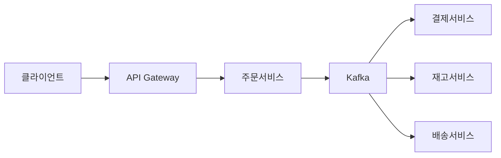
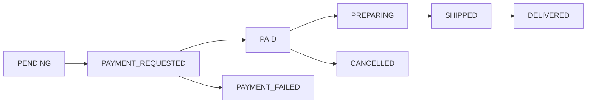

> **한 줄 요약**: 주문 시스템의 핵심은 상태 머신으로 주문 흐름을 제어하고, Saga 패턴으로 분산 트랜잭션을 보상하며, CQRS로 읽기·쓰기 부하를 분리하는 것이다.

## 실제 문제: 대규모 할인 행사 당일의 주문 시스템 장애

2023년 11월 국내 A 커머스 플랫폼의 자정 직후, 초당 주문이 평소의 30배로 치솟으면서 주문 서비스가 단속적으로 장애를 일으켰습니다. 일부 사용자는 결제가 됐는데 주문이 안 보이고, 일부는 품절 상품 주문에 성공했습니다. **주문 생성, 재고 차감, 결제 요청이 단일 동기 트랜잭션으로 묶여 피크 트래픽에서 DB 락 경합이 폭발했기 때문**입니다.

이 시스템들이 공통으로 풀어야 하는 문제:

- **주문 유실 방지**: 결제는 됐는데 주문이 안 생기는 사태
- **재고 초과 판매**: 재고 1개에 주문 3건이 들어오는 동시성 문제
- **주문 상태 불일치**: 사용자가 보는 상태와 실제 처리 상태가 다른 경우

---

## 설계 의사결정 로드맵

### 결정 1: 주문 상태 관리 — 상태 컬럼 vs 상태 머신 vs 이벤트 소싱

**문제**: 주문은 생성부터 배송 완료까지 10개 이상의 상태를 거칩니다. 잘못된 전이(취소된 주문의 배송 처리)를 어떻게 막는가?

| 후보 | 장점 | 단점 | 언제 적합 |
|------|------|------|----------|
| 상태 컬럼 UPDATE | 구현 단순, 현재 상태 O(1) | 잘못된 전이 방어 없음, 이력 추적 불가 | 상태 2~3개 단순 시스템 |
| 상태 머신 (FSM) | 허용된 전이만 실행, 전이 이벤트 발행 | 설계 비용, 상태 증가 시 복잡도 | 커머스·예약처럼 복잡한 흐름 |
| 이벤트 소싱 | 전체 이력 추적, 시점 복원 가능 | 구현 복잡도 매우 높음, 조회 시 스냅샷 필요 | 금융·감사 요구 극히 엄격한 경우 |

**우리의 선택: 상태 머신 (FSM)**
- 취소된 주문에 배송 처리가 들어오는 버그를 코드 레벨에서 원천 차단합니다. 상태 전이 시 이벤트를 발행하므로 다운스트림 서비스(알림·포인트·배송)가 자동 처리됩니다.
- 안 하면: 서비스가 성장하면서 `order.setStatus("COMPLETED")`를 여기저기 호출하고, 결국 어디서 상태를 바꾸는지 아무도 모르는 코드가 됩니다.

### 결정 2: 분산 트랜잭션 — 동기식 vs Saga vs Outbox

**문제**: 주문 → 결제 → 재고 → 배송이 서로 다른 마이크로서비스에 있을 때, 결제는 성공했는데 재고 차감이 실패하면?

| 후보 | 장점 | 단점 | 언제 적합 |
|------|------|------|----------|
| 단일 동기 트랜잭션 | 구현 단순, ACID 보장 | 서비스 간 강결합, 외부 API 포함 불가 | 모놀리스, 서비스 1~2개 |
| Saga (코레오그래피) | 서비스 독립, 락 없음, 높은 TPS | 보상 트랜잭션 직접 구현, 중간 상태 노출 | 마이크로서비스 3개 이상 |
| Transactional Outbox | DB 트랜잭션과 이벤트 발행 원자성 보장 | 폴러 추가 운영, 최종 일관성 | 이벤트 유실 절대 안 되는 경우 |

**우리의 선택: Saga + Transactional Outbox 조합**
- 결제 서비스는 외부 PG사 HTTP API를 호출하므로 DB 트랜잭션에 묶을 수 없습니다. Saga는 각 서비스가 로컬 트랜잭션만 처리하고 실패 시 보상 트랜잭션으로 롤백합니다. Outbox 패턴은 "DB 저장 성공 후 Kafka 발행 실패" 문제를 해결합니다.
- 안 하면: 블프 피크에 결제 서버 응답 대기로 주문 서버 스레드 풀 전체가 블로킹되고, 신규 주문이 타임아웃됩니다.

### 결정 3: 주문번호 생성 — AUTO_INCREMENT vs UUID vs Snowflake

**문제**: 초당 1만 건의 주문을 여러 서버에서 동시에 생성할 때, 전역 유일한 주문번호를 어떻게 생성하는가?

| 후보 | 장점 | 단점 | 언제 적합 |
|------|------|------|----------|
| AUTO_INCREMENT | 단순, 정렬 가능 | 단일 DB 병목, 경쟁사에 건수 노출 | 단일 DB, 소규모 |
| UUID v4 | 분산 생성 가능, 충돌 없음 | 비정렬로 인덱스 단편화, 고객이 외우기 불가 | 내부 식별자로만 사용 |
| Snowflake ID | 64비트, 시간순 정렬, 분산 생성 | 서버 간 시계 동기화 필요 | 대규모 분산 시스템 |

**우리의 선택: Snowflake ID (내부) + 가독성 주문번호 (외부) 이중 구조**
- Snowflake ID를 PK로 사용하면 시간순 INSERT로 B-Tree 단편화가 없고 DB 없이 분산 생성됩니다. 고객 노출용은 `20260511-A1B2C3` 형태로 별도 생성합니다.
- 안 하면: UUID를 PK로 쓰면 피크 시 INSERT가 랜덤 위치에 들어가 초당 1만 건 피크에서 주문 테이블 INSERT가 2~3배 느려집니다.

### 결정 4: 주문 데이터 저장 — 단일 RDB vs CQRS vs 이벤트 스토어

**문제**: 주문 생성(쓰기)은 트랜잭션 안전성, 목록 조회(읽기)는 필터·정렬·페이지네이션이 필요합니다.

| 후보 | 장점 | 단점 | 언제 적합 |
|------|------|------|----------|
| 단일 RDB | 구현 단순, 강한 일관성 | 읽기·쓰기 부하 경합 | 초기 단계, 소규모 |
| CQRS (읽기/쓰기 분리) | 읽기·쓰기 독립 확장 | 구현 복잡도, 최종 일관성 | 읽기 > 쓰기 비율 높은 경우 |
| 이벤트 스토어 | 완전한 이력, Replay 가능 | 운영 복잡도 매우 높음 | 감사·복원이 핵심인 금융 |

**우리의 선택: CQRS — MySQL(쓰기) + Elasticsearch(읽기)**
- 주문 생성·상태 업데이트는 MySQL 트랜잭션으로 처리하고, 목록 조회·검색·통계는 Elasticsearch에서 처리합니다. 읽기:쓰기 비율이 100:1이므로 읽기를 독립 확장하면 비용 대비 효율이 큽니다.
- 안 하면: 날짜별·상태별 필터 쿼리의 Full Scan이 주문 생성 트랜잭션과 DB 자원을 두고 경합해 블프 피크에 쓰기 TPS가 절반으로 떨어집니다.

---

## 1. 요구사항 분석 및 규모 추정

### 기능 요구사항

1. **주문 생성**: 장바구니 확정, 쿠폰 적용, 배송지 선택 후 주문 접수
2. **주문 조회**: 주문 상세, 목록 (날짜·상태 필터, 페이지네이션)
3. **주문 취소**: 결제 전·후 취소, 부분 취소, 환불 연동
4. **주문 상태 추적**: 접수 → 결제 → 상품 준비 → 배송 중 → 완료
5. **재고 연동**: 주문 시 재고 선점(reserve), 취소 시 반환
6. **알림**: 주문 상태 변경 시 푸시·문자 발송

### 비기능 요구사항

- **가용성**: 99.99% — 주문 불가는 매출 직결 손실
- **지연시간**: 주문 생성 P99 1초 이내, 목록 조회 200ms 이내
- **일관성**: 재고 초과 판매 절대 불가
- **확장성**: 블프 피크 평소의 30배 트래픽을 자동 확장으로 처리

### 규모 추정

```
일일 주문: 300만 건/일
평균 QPS = 300만 / 86,400 ≈ 35 QPS
피크 QPS = 35 × 30 ≈ 1,050 QPS

데이터 용량:
  - 주문 1건: 헤더(1KB) + 상품 평균 3개(0.5KB) = 2.5KB
  - 연간: 7.5GB × 365 = 2.7TB
  - 5년 보관: 40TB (이벤트 로그 포함)

읽기 부하:
  - 주문 조회 QPS: 쓰기의 100배 → 피크 105,000 QPS
  - → Elasticsearch 클러스터 + 읽기 캐시 필수
```

---

## 2. 고수준 아키텍처

> **비유:** 주문 시스템은 음식점 주방과 같습니다. 손님(사용자)이 홀 직원(API Gateway)에게 주문을 넣으면, 계산대(Payment Service)가 결제하고, 창고(Inventory Service)에서 재료를 꺼내며, 배달부(Delivery Service)에게 넘깁니다. 각 파트는 주방표(이벤트)로 소통합니다.



### 핵심 컴포넌트 역할

**API Gateway**: 인증, 레이트 리미팅, SSL 종료. 주문 생성은 Order Service로, 조회는 Query Service(ES 앞단)로 라우팅합니다.

**주문 서비스**: 상태 머신으로 허용된 전이만 실행하고, 각 전이 시 Outbox 테이블에 이벤트를 기록합니다.

**Kafka + Outbox Relay**: Order Service가 DB 트랜잭션 안에 Outbox 테이블에 이벤트를 기록하면, Relay 프로세스가 Kafka로 발행합니다. DB 저장과 이벤트 발행의 원자성을 보장합니다.

**결제 / 재고 / 배송 서비스**: Kafka 이벤트를 구독해 독립 동작. 실패 시 보상 이벤트를 발행해 Saga 롤백합니다.

**Query Service + Elasticsearch**: 주문 상태 변경 이벤트를 구독해 ES 인덱스를 동기화합니다. 목록 조회·검색·필터는 ES에서 처리해 MySQL 부담을 없앱니다.

---

## 3. 핵심 컴포넌트 상세 설계

### 3-1. 주문 상태 머신



| 현재 상태 | 허용 전이 | 트리거 이벤트 |
|-----------|-----------|--------------|
| PENDING | PAYMENT_REQUESTED | 결제 요청 |
| PAYMENT_REQUESTED | PAID, PAYMENT_FAILED | PG사 응답 수신 |
| PAID | PREPARING, CANCELLED | 판매자 확인 / 사용자 취소 |
| PREPARING | SHIPPED | 출고 처리 |
| SHIPPED | DELIVERED | 배송 완료 |

### 3-2. 주문 DB 스키마

```sql
CREATE TABLE orders (
    id            BIGINT PRIMARY KEY,          -- Snowflake ID
    order_no      VARCHAR(20) UNIQUE NOT NULL, -- 고객 노출용 "20260511-A1B2C3"
    user_id       BIGINT NOT NULL,
    status        VARCHAR(30) NOT NULL,
    total_amount  DECIMAL(15,2) NOT NULL,
    coupon_id     BIGINT,
    delivery_addr TEXT NOT NULL,
    created_at    DATETIME(6) NOT NULL,
    updated_at    DATETIME(6) NOT NULL,
    version       INT NOT NULL DEFAULT 0,      -- 낙관적 락
    INDEX idx_user_status (user_id, status),
    INDEX idx_created_at (created_at)
);

CREATE TABLE order_items (
    id          BIGINT PRIMARY KEY,
    order_id    BIGINT NOT NULL,
    product_id  BIGINT NOT NULL,
    quantity    INT NOT NULL,
    unit_price  DECIMAL(15,2) NOT NULL,
    total_price DECIMAL(15,2) NOT NULL,
    FOREIGN KEY (order_id) REFERENCES orders(id)
);

-- Outbox 테이블: 이벤트 유실 방지
CREATE TABLE order_outbox (
    id           BIGINT PRIMARY KEY AUTO_INCREMENT,
    aggregate_id BIGINT NOT NULL,
    event_type   VARCHAR(100) NOT NULL,
    payload      JSON NOT NULL,
    published    BOOLEAN DEFAULT FALSE,
    created_at   DATETIME(6) NOT NULL,
    INDEX idx_unpublished (published, created_at)
);

-- 주문 상태 이력: 감사 로그
CREATE TABLE order_status_history (
    id         BIGINT PRIMARY KEY AUTO_INCREMENT,
    order_id   BIGINT NOT NULL,
    from_status VARCHAR(30),
    to_status   VARCHAR(30) NOT NULL,
    reason      VARCHAR(200),
    created_at  DATETIME(6) NOT NULL,
    INDEX idx_order_id (order_id)
);
```

### 3-3. Snowflake ID 생성

41비트 타임스탬프 + 10비트 워커 ID + 12비트 시퀀스. 밀리초당 4,096개, 초당 410만 개 생성 가능합니다.

```java
@Component
public class SnowflakeIdGenerator {

    private static final long EPOCH = 1700000000000L;
    private static final long WORKER_ID_BITS = 10L;
    private static final long SEQUENCE_BITS = 12L;
    private static final long MAX_WORKER_ID = ~(-1L << WORKER_ID_BITS);
    private static final long SEQUENCE_MASK = ~(-1L << SEQUENCE_BITS);

    private final long workerId;
    private long lastTimestamp = -1L;
    private long sequence = 0L;

    public SnowflakeIdGenerator(@Value("${snowflake.worker-id}") long workerId) {
        if (workerId > MAX_WORKER_ID || workerId < 0)
            throw new IllegalArgumentException("Worker ID must be between 0 and " + MAX_WORKER_ID);
        this.workerId = workerId;
    }

    public synchronized long nextId() {
        long timestamp = currentMs();

        if (timestamp < lastTimestamp)
            throw new ClockMovedBackwardsException(lastTimestamp - timestamp + "ms 역행");

        if (timestamp == lastTimestamp) {
            sequence = (sequence + 1) & SEQUENCE_MASK;
            if (sequence == 0) timestamp = waitNextMillis(lastTimestamp);
        } else {
            sequence = 0L;
        }

        lastTimestamp = timestamp;
        return ((timestamp - EPOCH) << (WORKER_ID_BITS + SEQUENCE_BITS))
             | (workerId << SEQUENCE_BITS)
             | sequence;
    }

    private long waitNextMillis(long last) {
        long ts = currentMs();
        while (ts <= last) ts = currentMs();
        return ts;
    }

    private long currentMs() { return System.currentTimeMillis(); }
}
```

### 3-4. 주문 생성 — Transactional Outbox 적용

```java
@Service
@RequiredArgsConstructor
public class OrderService {

    private final OrderRepository orderRepo;
    private final OrderOutboxRepository outboxRepo;
    private final SnowflakeIdGenerator idGen;

    @Transactional
    public OrderResult createOrder(CreateOrderRequest req) {
        validateAndReserveInventory(req.getItems());

        long orderId = idGen.nextId();
        String orderNo = generateOrderNo();  // "20260511-A1B2C3"

        Order order = Order.builder()
            .id(orderId).orderNo(orderNo).userId(req.getUserId())
            .status(OrderStatus.PENDING).totalAmount(calculateTotal(req))
            .deliveryAddr(req.getDeliveryAddr()).version(0).build();

        List<OrderItem> items = req.getItems().stream()
            .map(i -> OrderItem.builder()
                .id(idGen.nextId()).orderId(orderId)
                .productId(i.getProductId()).quantity(i.getQuantity())
                .unitPrice(i.getUnitPrice())
                .totalPrice(i.getUnitPrice().multiply(BigDecimal.valueOf(i.getQuantity())))
                .build())
            .toList();

        orderRepo.save(order);
        itemRepo.saveAll(items);

        // Outbox에 이벤트 기록 (DB 트랜잭션 내 — 원자성 보장)
        outboxRepo.save(OrderOutbox.builder()
            .aggregateId(orderId).eventType("OrderCreated")
            .payload(toJson(new OrderCreatedEvent(orderId, orderNo, req)))
            .published(false).build());

        return new OrderResult(orderId, orderNo);
    }

    @Transactional
    public void updateStatus(long orderId, OrderStatus newStatus, String reason) {
        Order order = orderRepo.findByIdWithLock(orderId)
            .orElseThrow(() -> new OrderNotFoundException(orderId));

        OrderStatus prevStatus = order.getStatus();
        stateMachine.transition(order, newStatus);  // 불허 시 예외
        orderRepo.save(order);
        orderRepo.saveHistory(orderId, prevStatus, newStatus, reason);

        outboxRepo.save(OrderOutbox.builder()
            .aggregateId(orderId).eventType("OrderStatusChanged")
            .payload(toJson(new OrderStatusChangedEvent(orderId, prevStatus, newStatus)))
            .published(false).build());
    }
}
```

### 3-5. Saga — 주문 → 결제 → 재고 → 배송 흐름

```
정상 흐름:
  OrderCreated → [결제서비스] PaymentCompleted
               → [재고서비스] InventoryReserved
               → [배송서비스] DeliveryScheduled

실패 보상 흐름 (결제 실패):
  PaymentFailed
    → [재고서비스] InventoryReleased
    → [주문서비스] OrderCancelled (PAYMENT_FAILED)
    → [알림서비스] PaymentFailedNotification
```

```java
@KafkaListener(topics = "order.created")
@Transactional
public void handleOrderCreated(OrderCreatedEvent event) {
    try {
        PaymentResult result = pgGateway.requestPayment(
            event.getOrderId(), event.getTotalAmount(), event.getPaymentMethod());

        if (result.isSuccess()) {
            publishEvent("payment.completed",
                new PaymentCompletedEvent(event.getOrderId(), result.getTxId()));
        } else {
            publishEvent("payment.failed",
                new PaymentFailedEvent(event.getOrderId(), result.getFailReason()));
        }
    } catch (PgTimeoutException e) {
        // PG 타임아웃: 멱등키로 결과 조회 후 처리
        schedulePaymentResultInquiry(event.getOrderId());
    }
}

// 재고 서비스: 결제 실패 시 선점 해제 (보상 트랜잭션)
@KafkaListener(topics = "payment.failed")
@Transactional
public void handlePaymentFailed(PaymentFailedEvent event) {
    inventoryRepo.releaseReservation(event.getOrderId());
}
```

### 3-6. 재고 선점 — 동시성 제어

```java
@Retryable(value = OptimisticLockException.class, maxAttempts = 3)
@Transactional
public void reserveInventory(long productId, int quantity) {
    Inventory inv = inventoryRepo.findById(productId)
        .orElseThrow(() -> new ProductNotFoundException(productId));

    if (inv.getAvailable() < quantity)
        throw new OutOfStockException(productId);

    inv.reserve(quantity);  // available -= quantity, version++ 자동
    inventoryRepo.save(inv);
}
```

피크 대응을 위해 Redis를 완충재로 사용합니다. `available > 0` 체크는 Redis `DECRBY`로 먼저 처리하고, MySQL은 최종 확정만 담당합니다.

```java
public boolean tryReserveWithRedis(long productId, int quantity) {
    String key = "inventory:" + productId;
    Long remaining = redisTemplate.opsForValue().decrement(key, quantity);

    if (remaining != null && remaining >= 0) return true;
    redisTemplate.opsForValue().increment(key, quantity);  // 초과 차감 복구
    return false;
}
```

> **정합성 복구**: Redis 예약에 TTL(15분)을 설정해 미확정 예약을 자동 만료시키고, 매 시간 배치로 Redis와 MySQL `available` 컬럼을 대조해 차이 발생 시 MySQL 기준으로 리셋합니다.

---

## 4. 장애 시나리오와 대응

| 시나리오 | 영향 | 대응 |
|---------|------|------|
| MySQL 쓰기 노드 장애 | 주문 생성 불가 | 레플리카 자동 Failover (60초), 그 동안 주문 요청 큐잉 |
| Kafka 클러스터 장애 | 이벤트 전파 중단 | Outbox 테이블에 이벤트 보관, 복구 후 Relay 재발행 |
| 결제 서비스 장애 | 결제 진행 불가 | 주문은 PAYMENT_REQUESTED로 보존, 복구 후 재처리 |
| PG사 타임아웃 | 결제 성공 여부 불확실 | 멱등키로 PG사에 결과 재조회 (최대 3회), 불명 시 취소 |
| Elasticsearch 장애 | 주문 목록 조회 불가 | MySQL 읽기 레플리카로 Fallback |
| 블프 트래픽 30배 | 전체 부하 | 오토스케일링 사전 예열 (트래픽 예측 시 미리 스케일 아웃) |
| Outbox Relay 다운 | 이벤트 발행 완전 중단 | Relay 2대 이상 + ShedLock 리더 선출, at-least-once 후 컨슈머 멱등 처리 |

---

## 5. 확장 포인트

### 5-1. 수평 확장 전략

주문 서비스는 무상태(Stateless)로 수평 확장이 쉽습니다. HPA를 CPU 70% 기준으로 설정하되, 블프 같은 계획된 이벤트는 미리 증설합니다.

```
D-1 오후 11시: 서버 10대 → 30대 예비 증설
D-day 자정:   HPA 30대 → 최대 100대
D-day 오전 2시: 트래픽 감소 → 자동 스케일 인
```

### 5-2. DB 샤딩

단일 MySQL 한계(~5,000 TPS)를 넘어서면 `user_id % N` 샤딩을 적용합니다. 주문 목록 조회가 항상 특정 사용자 주문만 조회하므로 크로스-샤드 쿼리 없이 깔끔하게 분산됩니다. `user_id % 16` 샤딩 시 80,000 TPS까지 확장 가능합니다.

### 5-3. 주문 아카이빙

5년 이상 된 주문 데이터는 MySQL에서 S3 콜드 스토리지로 아카이빙합니다. 서비스 DB에는 최근 2년 데이터만 유지해 쿼리 성능을 보존합니다.

```
MySQL → Spark 배치 (일 1회) → Parquet → S3
S3 조회: Athena 쿼리 (CS 팀 전용, 비용 per-query)
```

---

## 면접 포인트

<details>
<summary><strong>Q. 주문 생성 시 재고 차감을 어느 시점에 해야 하는가? 주문 시점 vs 결제 완료 시점</strong></summary>

**결제 완료 후 차감**은 실제 판매만 집계하지만 결제 진행 중 재고가 소진되어 다른 사용자가 구매 불가한 문제가 있습니다. **주문 시점 선점 + 결제 완료 시 확정**이 커머스 표준입니다. 선점 후 결제 미완 시 선점 해제 타임아웃(10분)이 필요합니다.

</details>

<details>
<summary><strong>Q. 주문번호 노출로 경쟁사가 건수를 역산할 수 있다. 어떻게 막는가?</strong></summary>

내부 PK는 Snowflake ID(순차)를 사용하고, 고객 노출 주문번호는 날짜 + 랜덤 6자리 영숫자(`20260511-A1B2C3`)로 별도 생성합니다. 경쟁사가 건수를 역산할 수 없고, CS 소통도 쉽습니다.

</details>

<details>
<summary><strong>Q. Saga의 보상 트랜잭션이 실패하면 어떻게 되는가?</strong></summary>

보상 트랜잭션도 실패할 수 있습니다. 재시도 + 알림으로 운영팀이 수동 처리합니다. 보상 트랜잭션은 반드시 멱등성을 보장해야 하며(여러 번 실행해도 같은 결과), 보상도 실패하는 극단 케이스는 DLQ(Dead Letter Queue)에 보관 후 운영팀이 처리합니다.

</details>

<details>
<summary><strong>Q. CQRS에서 주문 직후 조회 시 내 주문이 안 보이면?</strong></summary>

읽기 모델의 최종 일관성 지연은 보통 수백 ms 이내입니다. 주문 직후 "내 주문 확인" 화면은 쓰기 DB(MySQL)에서 직접 조회하고, 주문 목록·검색은 Elasticsearch에서 조회하는 방식으로 분리합니다. UI에서 "주문이 처리 중입니다" 표시로 UX를 보완합니다.

</details>

<details>
<summary><strong>Q. 블프 피크에 초당 1만 건을 처리하려면 서버가 몇 대 필요한가?</strong></summary>

주문 서버 1대 TPS를 50으로 가정하면 200대 필요합니다. 실제 병목은 서버가 아니라 DB입니다. MySQL 쓰기 노드 한계(~5,000 TPS)를 넘어서면 DB 샤딩이 필수입니다. 16샤드 구성 시 80,000 TPS까지 확장 가능합니다. 피크 트래픽의 80%가 재고 조회·목록이므로 CQRS로 읽기를 분리하면 쓰기 DB 실질 부하는 훨씬 낮습니다.

</details>
