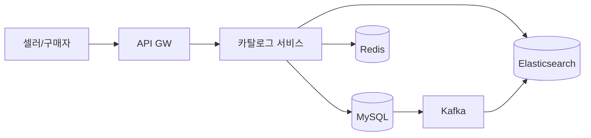

> **한 줄 요약**: 쓰기는 RDB로 정확하게, 읽기는 Elasticsearch와 Redis로 빠르게 분리하고, 멀티테넌트 구조로 수백만 셀러의 상품을 격리하면서 단일 검색 인덱스로 통합 제공한다.

## 실제 문제: 블랙프라이데이에 검색이 멈추면?

2023년 국내 B 이커머스의 블프 당일, 기획전 트래픽이 몰리면서 검색 P99가 800ms → 12초로 치솟았습니다. 단일 MySQL에 3억 건이 있었고, 카테고리+가격+브랜드+평점 4중 필터가 인덱스를 포기하고 풀 스캔을 유발했습니다. 임시로 읽기 레플리카를 추가했지만 복제 지연으로 30초된 가격이 노출됐고, CS 문의 14만 건·환불 비용 수억 원이 발생했습니다.

쿠팡은 3억 SKU를 100ms 이내로 검색합니다. 이 시스템들이 공통으로 해결하는 문제:

- **대규모 복합 필터링**: 카테고리·가격·브랜드·평점·배송 조건이 동시에 걸릴 때 빠른 응답
- **실시간 재고 연동**: 품절 상품 즉시 제거 또는 후순위 배치
- **셀러 격리**: 수십만 셀러가 독립 관리하되 구매자는 통합 검색
- **속성 다양성**: 의류(사이즈·색상), 전자기기(CPU·RAM), 식품(유통기한)은 구조가 완전히 다름

---

## 설계 의사결정 로드맵

### 결정 1: 상품 저장소 — RDB vs NoSQL vs 하이브리드

**문제**: 노트북은 CPU·RAM·SSD, 티셔츠는 사이즈·소재·색상. 이질적인 구조를 어떻게 저장하는가?

| 후보 | 장점 | 단점 | 언제 적합 |
|------|------|------|----------|
| 순수 RDB (EAV 패턴) | 스키마 일관성, 트랜잭션 보장 | 속성 조회에 조인 폭발 | 속성 수십 개 이하 소규모 |
| 순수 NoSQL (MongoDB) | 유연한 스키마, 단일 도큐먼트 조회 빠름 | 복잡한 집계 약함, 분산 트랜잭션 제약 | 스키마 변동이 매우 잦은 경우 |
| RDB + JSON 컬럼 하이브리드 | 핵심 속성은 컬럼, 가변 속성은 JSON | JSON 인덱싱 제한, DB 엔진 의존성 | 대부분의 이커머스 (권장) |
| RDB 쓰기 + ES 읽기 분리 | 쓰기 정확성 + 읽기 검색 성능 | 이중 저장, 동기화 지연 관리 필요 | 검색 트래픽이 쓰기의 100배 이상 |

**우리의 선택: RDB(MySQL) + JSON 컬럼 + Elasticsearch 분리**
- 핵심 메타데이터(상품명·가격·재고·셀러ID)는 MySQL 컬럼으로 트랜잭션과 무결성을 보장합니다. 가변 속성은 `attributes JSON` 컬럼에 저장해 스키마 마이그레이션 없이 새 카테고리를 추가합니다. 검색·필터는 Elasticsearch로 처리합니다.
- **안 하면**: 4중 필터를 3억 건에 걸면 쿼리 실행 계획이 풀 스캔으로 전환되고, 단 한 요청이 모든 쿼리를 블로킹합니다.

### 결정 2: 검색 엔진 — MySQL FULLTEXT vs Elasticsearch vs OpenSearch

**문제**: "삼성 갤럭시 s25 케이스 투명" 검색에 형태소 분석, 오타 교정, 유사어 매칭, 연관도 정렬이 동시에 필요합니다.

| 후보 | 장점 | 단점 | 언제 적합 |
|------|------|------|----------|
| MySQL FULLTEXT | 별도 인프라 없음 | 한국어 형태소 분석 불가, 복합 필터 느림 | 상품 수 10만 이하 MVP |
| Elasticsearch | 한국어 분석기(nori), 집계·벡터 검색 지원 | 운영 복잡도, 동기화 파이프라인 필요 | 대규모 이커머스 표준 |
| OpenSearch | ES 오픈소스 포크, AWS 관리형 | ES 최신 기능 시차 존재 | AWS 인프라 의존 팀 |

**우리의 선택: Elasticsearch + nori 형태소 분석기**
- `multi_match` + `function_score`로 상품명 점수에 판매량·리뷰 수를 가중합니다. `aggs` 쿼리로 브랜드별·가격대별 상품 수를 한 번의 요청으로 집계해 필터 UI 숫자 뱃지를 채웁니다.
- **안 하면**: MySQL LIKE '%갤럭시%'는 인덱스를 타지 못합니다. 3억 건 LIKE 쿼리는 분 단위이며, 오타 교정은 SQL로 구현 불가합니다.

### 결정 3: 캐싱 전략 — 캐시 없음 vs 로컬 캐시 vs Redis 분산 캐시

**문제**: 인기 상품 상세는 초당 수만 번 조회됩니다. 매번 DB + ES를 조회하면 비용과 응답 시간이 폭발합니다.

| 후보 | 장점 | 단점 | 언제 적합 |
|------|------|------|----------|
| 캐시 없음 | 항상 최신 데이터 | DB/ES 부하 폭발 | 극초기 MVP |
| 로컬 캐시 (Caffeine) | 네트워크 홉 없음, 극저지연 | 서버 여러 대면 불일치, 메모리 제한 | 단일 서버 |
| Redis 분산 캐시 | 모든 서버 공유, 용량 확장 쉬움 | 네트워크 홉 추가 | 다중 서버 표준 |
| CDN 캐시 | 엣지에서 응답, DB 부하 거의 없음 | 실시간 재고·가격 반영 어려움 | 가격 변동 없는 콘텐츠성 상품 |

**우리의 선택: L1 로컬 캐시(Caffeine) + L2 Redis 2계층**
- 상품 상세는 로컬 캐시(TTL 30초)로 반복 요청을 흡수하고, 미스 시 Redis(TTL 5분), 그 다음 DB 순으로 조회합니다. 가격·재고 변경 이벤트 수신 시 Redis 키를 즉시 무효화하고, 로컬 캐시는 TTL 만료를 기다립니다. 최대 30초 지연은 결제 단계 재고 검증으로 보정합니다.
- **안 하면**: 초당 조회 5만 건을 캐시 없이 ES에 직접 보내면 ES 클러스터 비용이 10배 이상 증가합니다.

### 결정 4: 멀티테넌트 카탈로그 — 테이블 공유 vs DB 분리 vs 스키마 분리

**문제**: 수십만 셀러가 각자 상품을 독립 관리하되, 구매자는 모든 셀러 상품을 통합 검색해야 합니다.

| 후보 | 장점 | 단점 | 언제 적합 |
|------|------|------|----------|
| DB 완전 분리 | 완벽한 격리, 테넌트별 스케일 조절 | 통합 검색 불가, 운영 비용 N배 | 엔터프라이즈 B2B SaaS |
| 스키마 분리 | 격리 수준 중간 | 동적 스키마 생성 관리 부담 | 수십 개 테넌트 |
| 테이블 공유 + seller_id 컬럼 | 단일 인프라, 통합 검색 용이 | 한 테넌트 대량 쿼리가 다른 테넌트에 영향 | 수십만 테넌트 이커머스 |

**우리의 선택: 테이블 공유 + seller_id 컬럼 + Row-Level 권한**
- 테이블을 공유하되 `seller_id` 복합 인덱스를 걸고, JWT 토큰의 `sellerId` 클레임을 WHERE 조건에 강제 주입합니다. ES 인덱스는 통합 저장하되 셀러 관리 API는 `seller_id` 필터를 강제합니다.
- **안 하면**: `seller_id` 필터 누락 시 다른 셀러의 상품 목록이 노출됩니다. 단순 버그가 아닌 데이터 유출 사고입니다.

---

## 1. 요구사항 분석 및 규모 추정

### 기능 요구사항

1️⃣ **상품 등록/수정/삭제**: 셀러가 상품명, 가격, 재고, 이미지, 카테고리별 속성을 관리
2️⃣ **상품 검색**: 키워드 검색, 형태소 분석, 오타 교정, 연관도 정렬
3️⃣ **복합 필터링**: 카테고리, 가격대, 브랜드, 평점, 배송 조건, 속성 필터
4️⃣ **상품 상세 조회**: 이미지, 상세설명, 옵션, 리뷰 요약
5️⃣ **재고·가격 실시간 반영**: 재고 소진 즉시 품절 표시, 가격 변경 즉시 반영
6️⃣ **카테고리 관리**: 계층형 카테고리 구조
7️⃣ **상품 랭킹**: 판매량, 리뷰 수, 최신순, 낮은 가격순 정렬

### 비기능 요구사항

- **검색 응답**: P99 200ms 이내 (키워드 검색 + 복합 필터 포함)
- **상세 응답**: P99 50ms 이내 (캐시 히트 기준)
- **가용성**: 99.99%
- **인덱싱 지연**: 상품 등록/수정 후 검색 반영 10초 이내
- **확장성**: 상품 수 10억 건, 동시 검색 QPS 50만까지 수평 확장

### 규모 추정

```
상품 수: 3억 SKU
검색 QPS (평균): 3억/일 ÷ 86,400 ≈ 3,500 QPS
검색 QPS (피크): 350,000 QPS (블프)

저장 용량:
  - 상품 레코드 (MySQL): 3억 × 2KB = 600GB
  - ES 인덱스: 3억 × 5KB = 1.5TB
  - 상품 이미지 (Object Storage): 3억 × 10장 × 500KB = 1.5PB
  - Redis 캐시 (상위 100만 상품): 100만 × 10KB = 10GB

캐시 히트율: 상위 1% 상품이 전체 조회의 80% → Redis 10GB로 히트율 80% 달성
```

---

## 2. 고수준 아키텍처

> **비유:** 상품 카탈로그는 대형 도서관과 같습니다. 책(상품)은 서가(MySQL)에 정확히 정리되고, 색인 카드함(Elasticsearch)으로 빠르게 검색하며, 자주 찾는 책은 데스크 옆 진열대(Redis)에 꺼내둡니다. 새 책이 들어오면 사서(Kafka Consumer)가 색인을 업데이트합니다.



### 핵심 컴포넌트 역할

**카탈로그 서비스**: 모든 상품 CRUD와 검색 요청의 진입점. 셀러 요청은 MySQL에 쓰고 Kafka 이벤트를 발행하며, 구매자 검색은 Redis L1 → Redis L2 → ES 순으로 처리합니다.

**MySQL**: 가격·재고·셀러ID·상태의 단일 진실 공급원. 쓰기는 마스터, 폴백 조회는 읽기 레플리카를 사용합니다.

**Kafka**: MySQL → Debezium CDC → Kafka → ES Consumer 파이프라인으로 상품 등록 후 10초 이내 검색 반영을 보장합니다.

**Elasticsearch**: 모든 검색과 복합 필터 요청 처리. MySQL은 단일 레코드 조회, ES는 수억 건 역인덱스 검색에 최적화되어 역할이 완전히 분리됩니다.

**Redis**: 인기 상품 상세, 카테고리 트리, 브랜드 목록 캐시. 재고·가격 변경 이벤트 수신 시 해당 키를 즉시 무효화합니다.

---

## 3. 핵심 컴포넌트 상세 설계

### 3.1 상품 데이터 모델 (MySQL)

핵심 속성은 정규화 컬럼으로, 카테고리마다 다른 속성은 JSON 컬럼으로 분리합니다.

```sql
CREATE TABLE products (
    id            BIGINT UNSIGNED  NOT NULL AUTO_INCREMENT,
    seller_id     BIGINT UNSIGNED  NOT NULL,
    category_id   INT UNSIGNED     NOT NULL,
    name          VARCHAR(500)     NOT NULL,
    brand         VARCHAR(200),
    price         DECIMAL(12, 2)   NOT NULL,
    sale_price    DECIMAL(12, 2),
    stock         INT UNSIGNED     NOT NULL DEFAULT 0,
    status        ENUM('ACTIVE','SOLDOUT','HIDDEN','DELETED') NOT NULL DEFAULT 'ACTIVE',
    attributes    JSON,                             -- 카테고리별 가변 속성
    search_vector TEXT,                             -- ES 동기화용
    created_at    DATETIME(3)      NOT NULL DEFAULT CURRENT_TIMESTAMP(3),
    updated_at    DATETIME(3)      NOT NULL DEFAULT CURRENT_TIMESTAMP(3) ON UPDATE CURRENT_TIMESTAMP(3),
    PRIMARY KEY (id),
    INDEX idx_seller   (seller_id, status, updated_at),
    INDEX idx_category (category_id, status, price),
    INDEX idx_updated  (updated_at)
) ENGINE=InnoDB DEFAULT CHARSET=utf8mb4;

CREATE TABLE categories (
    id        INT UNSIGNED NOT NULL AUTO_INCREMENT,
    parent_id INT UNSIGNED,
    name      VARCHAR(200) NOT NULL,
    depth     TINYINT      NOT NULL DEFAULT 0,
    path      VARCHAR(500) NOT NULL,               -- '001/003/012' 경로 문자열
    PRIMARY KEY (id),
    INDEX idx_parent (parent_id),
    INDEX idx_path   (path)
) ENGINE=InnoDB DEFAULT CHARSET=utf8mb4;
```

`attributes` JSON 컬럼 예시 — 같은 테이블에 완전히 다른 구조가 공존합니다.

```json
// 노트북
{ "cpu": "Intel Core Ultra 7 155H", "ram_gb": 32, "storage_gb": 1024 }

// 티셔츠
{ "sizes": ["S", "M", "L", "XL"], "colors": ["화이트", "블랙"], "material": "면 100%" }
```

### 3.2 Elasticsearch 인덱스 설계

모든 필드를 `text`로 잡으면 역인덱스 크기가 폭발하고, `keyword`만 쓰면 형태소 분석이 안 됩니다. 상품명은 두 가지를 병행합니다.

```json
{
  "mappings": {
    "properties": {
      "name": {
        "type": "text",
        "analyzer": "nori",
        "fields": {
          "keyword": { "type": "keyword" },
          "ngram":   { "type": "text", "analyzer": "nori_ngram" }
        }
      },
      "brand":      { "type": "keyword" },
      "price":      { "type": "scaled_float", "scaling_factor": 100 },
      "stock":      { "type": "integer" },
      "status":     { "type": "keyword" },
      "rating":     { "type": "half_float" },
      "sales_30d":  { "type": "integer" },
      "attributes": { "type": "object", "dynamic": true },
      "category_path": { "type": "keyword" }
    }
  },
  "settings": {
    "number_of_shards": 10,
    "number_of_replicas": 1,
    "analysis": {
      "analyzer": {
        "nori_ngram": {
          "type": "custom",
          "tokenizer": "nori_tokenizer",
          "filter": ["nori_readingform", "edge_ngram_filter"]
        }
      },
      "filter": {
        "edge_ngram_filter": { "type": "edge_ngram", "min_gram": 1, "max_gram": 10 }
      }
    }
  }
}
```

> ⚠️ `dynamic: true`는 카테고리 속성이 자동으로 필드로 생기지만 **필드 폭발** 문제가 있습니다. ES 기본 `total_fields.limit`이 1,000인데 카테고리가 수천 개이면 초과합니다. `flattened` 타입이나 `nested` 구조를 대안으로 고려하세요.

### 3.3 검색 API 구현 (Java/Spring Boot)

필터는 캐시되는 filter context, 점수 계산은 query context로 분리합니다.

```java
@Service
@RequiredArgsConstructor
public class ProductSearchService {

    private final ElasticsearchClient esClient;

    public SearchResponse search(ProductSearchRequest req) {
        // 상품명 형태소 분석 + 오타 허용
        Query nameQuery = MultiMatchQuery.of(m -> m
            .fields("name", "name.ngram^0.5", "brand^2")
            .query(req.getKeyword())
            .fuzziness("AUTO")
        )._toQuery();

        // 판매량·평점 부스팅
        Query scoredQuery = FunctionScoreQuery.of(f -> f
            .query(nameQuery)
            .functions(
                FunctionScore.of(s -> s.fieldValueFactor(fvf -> fvf
                    .field("sales_30d").factor(0.0001).modifier(FieldValueFactorModifier.Log1p))),
                FunctionScore.of(s -> s.fieldValueFactor(fvf -> fvf
                    .field("rating").factor(0.2)))
            )
            .boostMode(FunctionBoostMode.Sum)
        )._toQuery();

        // 필터 (filter context — 캐시 최적화)
        List<Query> filters = new ArrayList<>();
        filters.add(TermQuery.of(t -> t.field("status").value("ACTIVE"))._toQuery());

        if (req.getCategoryId() != null) {
            filters.add(PrefixQuery.of(p -> p
                .field("category_path").value(req.getCategoryPath()))._toQuery());
        }
        if (req.getMinPrice() != null || req.getMaxPrice() != null) {
            filters.add(RangeQuery.of(r -> r
                .field("price")
                .gte(req.getMinPrice() != null ? JsonData.of(req.getMinPrice()) : null)
                .lte(req.getMaxPrice() != null ? JsonData.of(req.getMaxPrice()) : null))._toQuery());
        }

        // 브랜드·가격대 집계 (필터 사이드바 뱃지)
        return esClient.search(s -> s
            .index("products")
            .query(BoolQuery.of(b -> b.must(scoredQuery).filter(filters))._toQuery())
            .aggregations("brands", TermsAggregation.of(t -> t.field("brand").size(50))._toAggregation())
            .aggregations("price_range", HistogramAggregation.of(h -> h.field("price").interval(10000.0))._toAggregation())
            .from(req.getPage() * req.getSize())
            .size(req.getSize()),
            ProductDocument.class
        );
    }
}
```

### 3.4 상품 등록 → ES 인덱싱 파이프라인

```java
@Service
@RequiredArgsConstructor
public class ProductWriteService {

    private final ProductRepository productRepo;
    private final KafkaTemplate<String, ProductEvent> kafka;
    private final ProductCacheService cache;

    @Transactional
    public Product createProduct(CreateProductCommand cmd) {
        Product product = productRepo.save(Product.of(cmd));
        // Transactional Outbox 패턴 — Debezium이 감지해 Kafka로 발행
        outboxRepo.save(OutboxEvent.of("product.created", product.getId()));
        return product;
    }

    @KafkaListener(topics = "product.events", groupId = "es-indexer")
    public void handleProductEvent(ProductEvent event) {
        ProductDocument doc = buildDocument(event);
        switch (event.getType()) {
            case CREATED, UPDATED -> esClient.index(i -> i
                .index("products").id(String.valueOf(event.getProductId())).document(doc));
            case DELETED -> esClient.delete(d -> d
                .index("products").id(String.valueOf(event.getProductId())));
        }
        cache.evict(event.getProductId());
    }
}
```

### 3.5 2계층 캐싱 구현

L1(로컬) → L2(Redis) → Source(DB) 순서의 Look-aside 캐시입니다.

```java
@Service
@RequiredArgsConstructor
public class ProductCacheService {

    private final Cache<Long, ProductDetail> localCache = Caffeine.newBuilder()
        .maximumSize(10_000)
        .expireAfterWrite(30, TimeUnit.SECONDS)
        .build();

    private final RedisTemplate<String, ProductDetail> redis;
    private final ProductRepository productRepo;
    private static final Duration REDIS_TTL = Duration.ofMinutes(5);
    private static final String KEY_PREFIX = "product:detail:";

    public ProductDetail getDetail(Long productId) {
        ProductDetail cached = localCache.getIfPresent(productId);
        if (cached != null) return cached;

        String redisKey = KEY_PREFIX + productId;
        cached = redis.opsForValue().get(redisKey);
        if (cached != null) {
            localCache.put(productId, cached);
            return cached;
        }

        ProductDetail detail = productRepo.findDetailById(productId)
            .orElseThrow(() -> new ProductNotFoundException(productId));
        redis.opsForValue().set(redisKey, detail, REDIS_TTL);
        localCache.put(productId, detail);
        return detail;
    }

    public void evict(Long productId) {
        redis.delete(KEY_PREFIX + productId);
        // 로컬 캐시는 TTL 자연 만료
    }
}
```

### 3.6 카테고리 계층 조회 최적화

카테고리 트리는 변경이 거의 없어 전체를 Redis에 직렬화하고 애플리케이션에서 순회합니다.

```java
@Service
@RequiredArgsConstructor
public class CategoryService {

    private final CategoryRepository categoryRepo;
    private final RedisTemplate<String, List<Category>> redis;
    private static final String TREE_KEY = "category:tree";
    private static final Duration TREE_TTL = Duration.ofHours(1);

    public List<Category> getCategoryTree() {
        List<Category> tree = redis.opsForValue().get(TREE_KEY);
        if (tree != null) return tree;

        List<Category> all = categoryRepo.findAll();
        tree = buildTree(all, null);
        redis.opsForValue().set(TREE_KEY, tree, TREE_TTL);
        return tree;
    }

    private List<Category> buildTree(List<Category> all, Integer parentId) {
        return all.stream()
            .filter(c -> Objects.equals(c.getParentId(), parentId))
            .peek(c -> c.setChildren(buildTree(all, c.getId())))
            .collect(Collectors.toList());
    }
}
```

---

## 4. 장애 시나리오와 대응

| 시나리오 | 영향 | 대응 |
|---------|------|------|
| ES 클러스터 장애 | 검색·필터 불가 | 서킷 브레이커 오픈 → MySQL 폴백 쿼리, 인기 카테고리는 Redis 정적 캐시 노출 |
| Redis 장애 | 캐시 미스 폭발 | Redis Sentinel/Cluster 자동 페일오버, 로컬 캐시 TTL 30초→5분으로 연장 |
| Kafka Consumer 지연 | ES 인덱싱 지연 | Consumer Lag 임계값(10,000건) 초과 시 알람 + Consumer 수평 확장 |
| MySQL 마스터 장애 | 상품 등록 불가 | Group Replication 자동 페일오버, 등록 요청은 큐에 버퍼링 후 재처리 |
| 셀러 대량 등록 | DB 커넥션 소진 | Rate Limiting(셀러별 100건/분), ES Bulk API 배치 인덱싱 |
| 잘못된 가격 (0원) | 0원 상품 구매 쇄도 | 저장 레이어 유효성 검증 + 이상 가격 자동 HIDDEN 처리 |

### ES 인덱스 재구성(Re-index) 절차

| 단계 | 작업 | 주의사항 |
|------|------|---------|
| 1 | 새 인덱스(v2) 생성 | 새 매핑 적용 |
| 2 | _reindex API로 v1 → v2 복사 | `slices=auto`로 병렬화 |
| 3 | 이중 쓰기 구간 | v1·v2 모두에 CDC 이벤트 적용 |
| 4 | alias 전환 | `products-read` alias를 v2로 원자적 전환 |
| 5 | v1 삭제 | 24h 관찰 후 삭제 |

re-index 도중 원본에 쓰기가 계속 발생하므로, alias 전환 전 시점의 누락 방지를 위해 이중 쓰기 구간이 필수입니다.

### ES → MySQL 폴백 구현

```java
@Component
@RequiredArgsConstructor
public class SearchFacade {

    private final ProductSearchService esSearch;
    private final ProductRepository mysqlFallback;
    private final CircuitBreakerRegistry cbRegistry;

    public SearchResult search(ProductSearchRequest req) {
        CircuitBreaker cb = cbRegistry.circuitBreaker("elasticsearch");
        return cb.executeSupplier(
            () -> esSearch.search(req),
            throwable -> mysqlFallback.searchBasic(
                req.getKeyword(), req.getCategoryId(),
                req.getMinPrice(), req.getMaxPrice(),
                PageRequest.of(req.getPage(), req.getSize()))
        );
    }
}
```

---

## 5. 확장 포인트

**벡터 검색 도입**: "가성비 좋은 노트북"처럼 의미 기반 검색은 역인덱스로 불가합니다. 상품명을 임베딩 벡터로 변환해 ES `dense_vector`에 저장하고, 키워드 점수와 벡터 유사도를 RRF(Reciprocal Rank Fusion)로 결합합니다.

**멀티 리전 캐시**: CDN Edge에 상품 상세 JSON을 캐싱하고 가격·재고는 엣지에서 실시간 조회합니다. 원본 서버 부하를 90% 줄입니다.

**CQRS 완전 분리**: QPS가 10배 이상 증가하면 쓰기 서비스와 읽기 서비스를 별도 프로세스로 분리합니다. 읽기 서비스는 수평 확장, 쓰기 서비스는 트랜잭션 무결성에 집중합니다.

**ES 인덱스 샤드 전략**: 3억 건 초과 시 카테고리별 인덱스 분리를 검토합니다. 재구성 시 해당 카테고리만 순단됩니다.

---

## 면접 포인트

<details>
<summary><strong>Q. MySQL과 Elasticsearch를 동시에 쓰면 데이터 불일치는 어떻게 처리하나요?</strong></summary>

결제 단계에서 MySQL 재고를 최종 검증합니다. ES는 검색과 필터에만 사용하고 재고 차감은 항상 MySQL 트랜잭션으로 처리합니다. ES 재고 표시가 10초 지연될 수 있지만 UX에 허용 가능한 수준이며, 결제 오류로 이어지지 않습니다.

</details>

<details>
<summary><strong>Q. 상품 수가 10억 건이 되면 ES가 버틸 수 있나요?</strong></summary>

ES 공식 가이드 기준 샤드당 10~50GB가 권장입니다. 100TB 규모라면 최소 2,000~10,000개 샤드가 필요합니다. 카테고리별 인덱스 분리와 ILM(Index Lifecycle Management)으로 삭제된 상품을 콜드 스토리지로 이전해 활성 인덱스 크기를 관리합니다.

</details>

<details>
<summary><strong>Q. 셀러가 가격을 바꿨을 때 캐시 무효화는 어떻게 하나요?</strong></summary>

가격 변경 이벤트가 Kafka에 발행되면 Cache Invalidation Consumer가 Redis에서 해당 상품 키를 즉시 `DEL`합니다. 로컬 캐시는 최대 TTL(30초) 후 자연 만료됩니다. 그 30초 안에 이전 가격으로 구매를 시도하면 결제 전 가격 확인 단계에서 "가격이 변경되었습니다"를 안내합니다.

</details>

<details>
<summary><strong>Q. 카테고리 속성이 카테고리마다 다른데 ES에서 어떻게 필터링하나요?</strong></summary>

`attributes` 필드를 `dynamic: true`로 설정해 카테고리별 속성이 자동으로 ES 필드로 생성됩니다. `attributes.ram_gb`, `attributes.material` 같은 경로로 필터 쿼리를 작성합니다. 속성명 충돌 방지를 위해 카테고리 코드를 접두어로 붙이는 네임스페이스 전략을 사용합니다.

</details>

<details>
<summary><strong>Q. 검색 랭킹 조작(어뷰징)은 어떻게 막나요?</strong></summary>

판매량·리뷰 수 기반 점수는 일별 배치로 갱신해 단기 어뷰징 효과를 희석합니다. 리뷰 어뷰징은 별도 FDS(Fraud Detection System)에서 처리합니다. 광고 상품은 오가닉 랭킹과 명확히 분리된 슬롯으로 노출하며, 입찰가 기반 노출로 처리합니다.

</details>
