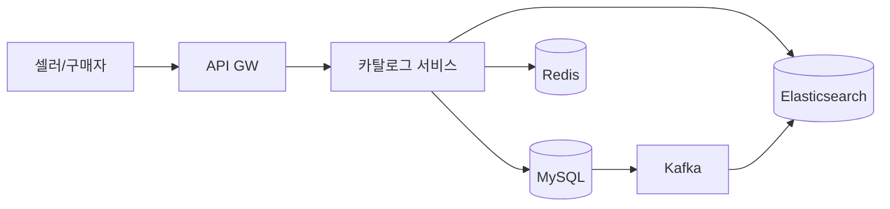
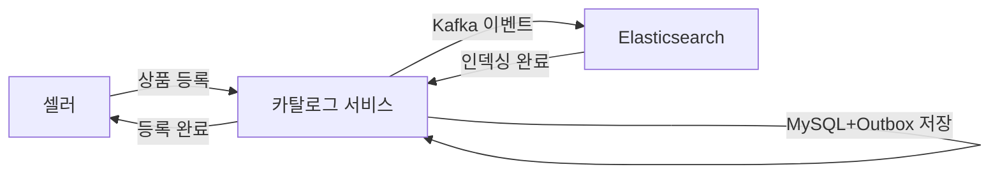
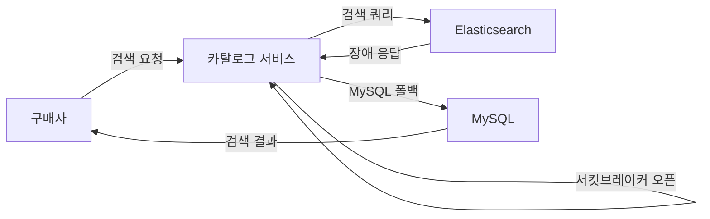
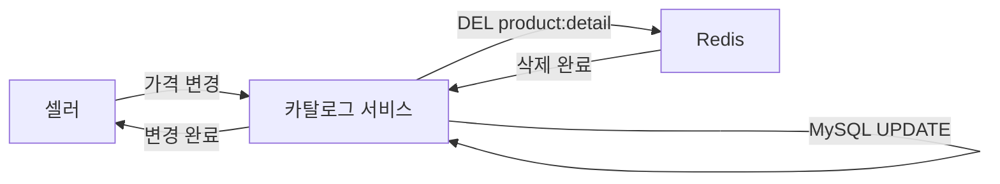

> **한 줄 요약**: 쓰기는 RDB로 정확하게, 읽기는 Elasticsearch와 Redis로 빠르게 분리하고, 멀티테넌트 구조로 수백만 셀러의 상품을 격리하면서 단일 검색 인덱스로 통합 제공한다.

## 실제 문제: 블랙프라이데이에 검색이 멈추면?

2023년 국내 B 이커머스의 블프 당일, 기획전 트래픽이 몰리면서 검색 P99가 800ms → 12초로 치솟았습니다. 단일 MySQL에 3억 건이 있었고, 카테고리+가격+브랜드+평점 4중 필터가 인덱스를 포기하고 풀 스캔을 유발했습니다. 임시로 읽기 레플리카를 추가했지만 복제 지연으로 30초된 가격이 노출됐고, CS 문의 14만 건·환불 비용 수억 원이 발생했습니다.

쿠팡은 3억 SKU를 100ms 이내로 검색합니다. 이 시스템들이 공통으로 해결하는 문제:

- **대규모 복합 필터링**: 카테고리·가격·브랜드·평점·배송 조건이 동시에 걸릴 때 빠른 응답
- **실시간 재고 연동**: 품절 상품 즉시 제거 또는 후순위 배치
- **셀러 격리**: 수십만 셀러가 독립 관리하되 구매자는 통합 검색
- **속성 다양성**: 의류(사이즈·색상), 전자기기(CPU·RAM), 식품(유통기한)은 구조가 완전히 다름

---

## 설계 의사결정 로드맵

### 결정 1: 상품 저장소 — RDB vs NoSQL vs 하이브리드

**문제**: 노트북은 CPU·RAM·SSD, 티셔츠는 사이즈·소재·색상. 이질적인 구조를 어떻게 저장하는가?

| 후보 | 장점 | 단점 | 언제 적합 |
|------|------|------|----------|
| 순수 RDB (EAV 패턴) | 스키마 일관성, 트랜잭션 보장 | 속성 조회에 조인 폭발 | 속성 수십 개 이하 소규모 |
| 순수 NoSQL (MongoDB) | 유연한 스키마, 단일 도큐먼트 조회 빠름 | 복잡한 집계 약함, 분산 트랜잭션 제약 | 스키마 변동이 매우 잦은 경우 |
| RDB + JSON 컬럼 하이브리드 | 핵심 속성은 컬럼, 가변 속성은 JSON | JSON 인덱싱 제한, DB 엔진 의존성 | 대부분의 이커머스 (권장) |
| RDB 쓰기 + ES 읽기 분리 | 쓰기 정확성 + 읽기 검색 성능 | 이중 저장, 동기화 지연 관리 필요 | 검색 트래픽이 쓰기의 100배 이상 |

**우리의 선택: RDB(MySQL) + JSON 컬럼 + Elasticsearch 분리**

- 핵심 메타데이터(상품명·가격·재고·셀러ID)는 MySQL 컬럼으로 트랜잭션과 무결성을 보장합니다.
- 가변 속성은 `attributes JSON` 컬럼에 저장해 스키마 마이그레이션 없이 새 카테고리를 추가합니다.
- 검색·필터는 Elasticsearch로 처리합니다.
- **안 하면**: 4중 필터를 3억 건에 걸면 쿼리 실행 계획이 풀 스캔으로 전환되고, 단 한 요청이 모든 쿼리를 블로킹합니다.

### 결정 2: 검색 엔진 — MySQL FULLTEXT vs Elasticsearch vs OpenSearch

**문제**: "삼성 갤럭시 s25 케이스 투명" 검색에 형태소 분석, 오타 교정, 유사어 매칭, 연관도 정렬이 동시에 필요합니다.

| 후보 | 장점 | 단점 | 언제 적합 |
|------|------|------|----------|
| MySQL FULLTEXT | 별도 인프라 없음 | 한국어 형태소 분석 불가, 복합 필터 느림 | 상품 수 10만 이하 MVP |
| Elasticsearch | 한국어 분석기(nori), 집계·벡터 검색 지원 | 운영 복잡도, 동기화 파이프라인 필요 | 대규모 이커머스 표준 |
| OpenSearch | ES 오픈소스 포크, AWS 관리형 | ES 최신 기능 시차 존재 | AWS 인프라 의존 팀 |

**우리의 선택: Elasticsearch + nori 형태소 분석기**

- `multi_match` + `function_score`로 상품명 점수에 판매량·리뷰 수를 가중합니다.
- `aggs` 쿼리로 브랜드별·가격대별 상품 수를 한 번의 요청으로 집계해 필터 UI 숫자 뱃지를 채웁니다.
- **안 하면**: MySQL LIKE '%갤럭시%'는 인덱스를 타지 못합니다. 3억 건 LIKE 쿼리는 분 단위이며, 오타 교정은 SQL로 구현 불가합니다.

### 결정 3: 캐싱 전략 — 캐시 없음 vs 로컬 캐시 vs Redis 분산 캐시

**문제**: 인기 상품 상세는 초당 수만 번 조회됩니다. 매번 DB + ES를 조회하면 비용과 응답 시간이 폭발합니다.

| 후보 | 장점 | 단점 | 언제 적합 |
|------|------|------|----------|
| 캐시 없음 | 항상 최신 데이터 | DB/ES 부하 폭발 | 극초기 MVP |
| 로컬 캐시 (Caffeine) | 네트워크 홉 없음, 극저지연 | 서버 여러 대면 불일치, 메모리 제한 | 단일 서버 |
| Redis 분산 캐시 | 모든 서버 공유, 용량 확장 쉬움 | 네트워크 홉 추가 | 다중 서버 표준 |
| CDN 캐시 | 엣지에서 응답, DB 부하 거의 없음 | 실시간 재고·가격 반영 어려움 | 가격 변동 없는 콘텐츠성 상품 |

**우리의 선택: L1 로컬 캐시(Caffeine) + L2 Redis 2계층**

- 상품 상세는 로컬 캐시(TTL 30초)로 반복 요청을 흡수하고, 미스 시 Redis(TTL 5분), 그 다음 DB 순으로 조회합니다.
- 가격·재고 변경 이벤트 수신 시 Redis 키를 즉시 무효화하고, 로컬 캐시는 TTL 만료를 기다립니다.
- 최대 30초 지연은 결제 단계 재고 검증으로 보정합니다.
- **안 하면**: 초당 조회 5만 건을 캐시 없이 ES에 직접 보내면 ES 클러스터 비용이 10배 이상 증가합니다.

### 결정 4: 멀티테넌트 카탈로그 — 테이블 공유 vs DB 분리 vs 스키마 분리

**문제**: 수십만 셀러가 각자 상품을 독립 관리하되, 구매자는 모든 셀러 상품을 통합 검색해야 합니다.

| 후보 | 장점 | 단점 | 언제 적합 |
|------|------|------|----------|
| DB 완전 분리 | 완벽한 격리, 테넌트별 스케일 조절 | 통합 검색 불가, 운영 비용 N배 | 엔터프라이즈 B2B SaaS |
| 스키마 분리 | 격리 수준 중간 | 동적 스키마 생성 관리 부담 | 수십 개 테넌트 |
| 테이블 공유 + seller_id 컬럼 | 단일 인프라, 통합 검색 용이 | 한 테넌트 대량 쿼리가 다른 테넌트에 영향 | 수십만 테넌트 이커머스 |

**우리의 선택: 테이블 공유 + seller_id 컬럼 + Row-Level 권한**

- 테이블을 공유하되 `seller_id` 복합 인덱스를 걸고, JWT 토큰의 `sellerId` 클레임을 WHERE 조건에 강제 주입합니다.
- ES 인덱스는 통합 저장하되 셀러 관리 API는 `seller_id` 필터를 강제합니다.
- **안 하면**: `seller_id` 필터 누락 시 다른 셀러의 상품 목록이 노출됩니다. 단순 버그가 아닌 데이터 유출 사고입니다.

---

## 1. 요구사항 분석 및 규모 추정

### 기능 요구사항

1️⃣ **상품 등록/수정/삭제**: 셀러가 상품명, 가격, 재고, 이미지, 카테고리별 속성을 관리
2️⃣ **상품 검색**: 키워드 검색, 형태소 분석, 오타 교정, 연관도 정렬
3️⃣ **복합 필터링**: 카테고리, 가격대, 브랜드, 평점, 배송 조건, 속성 필터
4️⃣ **상품 상세 조회**: 이미지, 상세설명, 옵션, 리뷰 요약
5️⃣ **재고·가격 실시간 반영**: 재고 소진 즉시 품절 표시, 가격 변경 즉시 반영
6️⃣ **카테고리 관리**: 계층형 카테고리 구조
7️⃣ **상품 랭킹**: 판매량, 리뷰 수, 최신순, 낮은 가격순 정렬

### 비기능 요구사항

- **검색 응답**: P99 200ms 이내 (키워드 검색 + 복합 필터 포함)
- **상세 응답**: P99 50ms 이내 (캐시 히트 기준)
- **가용성**: 99.99%
- **인덱싱 지연**: 상품 등록/수정 후 검색 반영 10초 이내
- **확장성**: 상품 수 10억 건, 동시 검색 QPS 50만까지 수평 확장

### 규모 추정

```
상품 수: 3억 SKU
검색 QPS (평균): 3억/일 ÷ 86,400 ≈ 3,500 QPS
검색 QPS (피크): 350,000 QPS (블프)

저장 용량:
  - 상품 레코드 (MySQL): 3억 × 2KB = 600GB
  - ES 인덱스: 3억 × 5KB = 1.5TB
  - 상품 이미지 (Object Storage): 3억 × 10장 × 500KB = 1.5PB
  - Redis 캐시 (상위 100만 상품): 100만 × 10KB = 10GB

캐시 히트율: 상위 1% 상품이 전체 조회의 80% → Redis 10GB로 히트율 80% 달성
```

---

## 2. 고수준 아키텍처

> **비유:** 상품 카탈로그는 대형 도서관과 같습니다. 책(상품)은 서가(MySQL)에 정확히 정리되고, 색인 카드함(Elasticsearch)으로 빠르게 검색하며, 자주 찾는 책은 데스크 옆 진열대(Redis)에 꺼내둡니다. 새 책이 들어오면 사서(Kafka Consumer)가 색인을 업데이트합니다.



**상품 등록 → ES 인덱싱 흐름**



**ES 장애 시 MySQL 폴백 흐름**



### 핵심 컴포넌트 역할

| 컴포넌트 | 핵심 역할 | 내부 동작 흐름 |
|----------|----------|--------------|
| **카탈로그 서비스** | CRUD 진입점 + 셀러 격리 | JWT sellerId 추출 → L1 Caffeine → L2 Redis → ES 순서 조회 |
| **MySQL** | 단일 진실 공급원 | 마스터 쓰기 전용 → 읽기 레플리카 ES 폴백 사용 |
| **Kafka + Debezium** | MySQL → ES 실시간 동기화 | 바이너리 로그 감지 → `product.events` 토픽 → Bulk API 인덱싱 |
| **Elasticsearch** | 검색·집계 엔진 | nori 형태소 분석 → `function_score` 랭킹 → `aggs` 한 번에 집계 |
| **Redis** | 다계층 캐시 | TTL 5분 상품 상세 캐싱 → 변경 이벤트 수신 시 즉시 `DEL` |

---

## 3. 핵심 컴포넌트 상세 설계

### 3.1 상품 데이터 모델 (MySQL)

핵심 속성은 정규화 컬럼으로, 카테고리마다 다른 속성은 JSON 컬럼으로 분리합니다.

```sql
CREATE TABLE products (
    id            BIGINT UNSIGNED  NOT NULL AUTO_INCREMENT,
    seller_id     BIGINT UNSIGNED  NOT NULL,
    category_id   INT UNSIGNED     NOT NULL,
    name          VARCHAR(500)     NOT NULL,
    brand         VARCHAR(200),
    price         DECIMAL(12, 2)   NOT NULL,
    sale_price    DECIMAL(12, 2),
    stock         INT UNSIGNED     NOT NULL DEFAULT 0,
    status        ENUM('ACTIVE','SOLDOUT','HIDDEN','DELETED') NOT NULL DEFAULT 'ACTIVE',
    attributes    JSON,                             -- 카테고리별 가변 속성
    search_vector TEXT,                             -- ES 동기화용
    created_at    DATETIME(3)      NOT NULL DEFAULT CURRENT_TIMESTAMP(3),
    updated_at    DATETIME(3)      NOT NULL DEFAULT CURRENT_TIMESTAMP(3) ON UPDATE CURRENT_TIMESTAMP(3),
    PRIMARY KEY (id),
    INDEX idx_seller   (seller_id, status, updated_at),
    INDEX idx_category (category_id, status, price),
    INDEX idx_updated  (updated_at)
) ENGINE=InnoDB DEFAULT CHARSET=utf8mb4;

CREATE TABLE categories (
    id        INT UNSIGNED NOT NULL AUTO_INCREMENT,
    parent_id INT UNSIGNED,
    name      VARCHAR(200) NOT NULL,
    depth     TINYINT      NOT NULL DEFAULT 0,
    path      VARCHAR(500) NOT NULL,               -- '001/003/012' 경로 문자열
    PRIMARY KEY (id),
    INDEX idx_parent (parent_id),
    INDEX idx_path   (path)
) ENGINE=InnoDB DEFAULT CHARSET=utf8mb4;
```

`attributes` JSON 컬럼 예시 — 같은 테이블에 완전히 다른 구조가 공존합니다.

```json
// 노트북
{ "cpu": "Intel Core Ultra 7 155H", "ram_gb": 32, "storage_gb": 1024 }

// 티셔츠
{ "sizes": ["S", "M", "L", "XL"], "colors": ["화이트", "블랙"], "material": "면 100%" }
```

### 3.2 Elasticsearch 인덱스 설계

모든 필드를 `text`로 잡으면 역인덱스 크기가 폭발하고, `keyword`만 쓰면 형태소 분석이 안 됩니다. 상품명은 두 가지를 병행합니다.

```json
{
  "mappings": {
    "properties": {
      "name": {
        "type": "text",
        "analyzer": "nori",
        "fields": {
          "keyword": { "type": "keyword" },
          "ngram":   { "type": "text", "analyzer": "nori_ngram" }
        }
      },
      "brand":      { "type": "keyword" },
      "price":      { "type": "scaled_float", "scaling_factor": 100 },
      "stock":      { "type": "integer" },
      "status":     { "type": "keyword" },
      "rating":     { "type": "half_float" },
      "sales_30d":  { "type": "integer" },
      "attributes": { "type": "object", "dynamic": true },
      "category_path": { "type": "keyword" }
    }
  },
  "settings": {
    "number_of_shards": 10,
    "number_of_replicas": 1,
    "analysis": {
      "analyzer": {
        "nori_ngram": {
          "type": "custom",
          "tokenizer": "nori_tokenizer",
          "filter": ["nori_readingform", "edge_ngram_filter"]
        }
      },
      "filter": {
        "edge_ngram_filter": { "type": "edge_ngram", "min_gram": 1, "max_gram": 10 }
      }
    }
  }
}
```

> ⚠️ `dynamic: true`는 카테고리 속성이 자동으로 필드로 생기지만 **필드 폭발** 문제가 있습니다. ES 기본 `total_fields.limit`이 1,000인데 카테고리가 수천 개이면 초과합니다. `flattened` 타입이나 `nested` 구조를 대안으로 고려하세요.

### 3.3 검색 API 구현 (Java/Spring Boot)

> **왜 filter context와 query context를 분리하는가?** filter는 점수 계산이 없어 ES가 캐시하므로 복합 필터 쿼리 비용이 크게 줄어듭니다. 점수가 필요한 키워드 매칭만 query context로 분리해 캐시 효율을 극대화합니다.

```java
@Service
@RequiredArgsConstructor
public class ProductSearchService {

    private final ElasticsearchClient esClient;

    public SearchResponse search(ProductSearchRequest req) {
        // 상품명 형태소 분석 + 오타 허용
        Query nameQuery = MultiMatchQuery.of(m -> m
            .fields("name", "name.ngram^0.5", "brand^2")
            .query(req.getKeyword())
            .fuzziness("AUTO")
        )._toQuery();

        // 판매량·평점 부스팅
        Query scoredQuery = FunctionScoreQuery.of(f -> f
            .query(nameQuery)
            .functions(
                FunctionScore.of(s -> s.fieldValueFactor(fvf -> fvf
                    .field("sales_30d").factor(0.0001).modifier(FieldValueFactorModifier.Log1p))),
                FunctionScore.of(s -> s.fieldValueFactor(fvf -> fvf
                    .field("rating").factor(0.2)))
            )
            .boostMode(FunctionBoostMode.Sum)
        )._toQuery();

        // 필터 (filter context — 캐시 최적화)
        List<Query> filters = new ArrayList<>();
        filters.add(TermQuery.of(t -> t.field("status").value("ACTIVE"))._toQuery());

        if (req.getCategoryId() != null) {
            filters.add(PrefixQuery.of(p -> p
                .field("category_path").value(req.getCategoryPath()))._toQuery());
        }
        if (req.getMinPrice() != null || req.getMaxPrice() != null) {
            filters.add(RangeQuery.of(r -> r
                .field("price")
                .gte(req.getMinPrice() != null ? JsonData.of(req.getMinPrice()) : null)
                .lte(req.getMaxPrice() != null ? JsonData.of(req.getMaxPrice()) : null))._toQuery());
        }

        // 브랜드·가격대 집계 (필터 사이드바 뱃지)
        return esClient.search(s -> s
            .index("products")
            .query(BoolQuery.of(b -> b.must(scoredQuery).filter(filters))._toQuery())
            .aggregations("brands", TermsAggregation.of(t -> t.field("brand").size(50))._toAggregation())
            .aggregations("price_range", HistogramAggregation.of(h -> h.field("price").interval(10000.0))._toAggregation())
            .from(req.getPage() * req.getSize())
            .size(req.getSize()),
            ProductDocument.class
        );
    }
}
```

### 3.4 상품 등록 → ES 인덱싱 파이프라인

> **왜 Transactional Outbox가 필요한가?** DB 저장 성공 후 Kafka 발행이 실패하면 이벤트가 영구 유실됩니다. Outbox 테이블에 이벤트를 DB 트랜잭션에 포함해 기록하면 Debezium이 반드시 한 번 이상 발행을 보장합니다.

```java
@Service
@RequiredArgsConstructor
public class ProductWriteService {

    private final ProductRepository productRepo;
    private final KafkaTemplate<String, ProductEvent> kafka;
    private final ProductCacheService cache;

    @Transactional
    public Product createProduct(CreateProductCommand cmd) {
        Product product = productRepo.save(Product.of(cmd));
        // Transactional Outbox 패턴 — Debezium이 감지해 Kafka로 발행
        outboxRepo.save(OutboxEvent.of("product.created", product.getId()));
        return product;
    }

    @KafkaListener(topics = "product.events", groupId = "es-indexer")
    public void handleProductEvent(ProductEvent event) {
        ProductDocument doc = buildDocument(event);
        switch (event.getType()) {
            case CREATED, UPDATED -> esClient.index(i -> i
                .index("products").id(String.valueOf(event.getProductId())).document(doc));
            case DELETED -> esClient.delete(d -> d
                .index("products").id(String.valueOf(event.getProductId())));
        }
        cache.evict(event.getProductId());
    }
}
```

### 3.5 2계층 캐싱 구현

> **왜 2계층인가?** L1 로컬 캐시(Caffeine)는 네트워크 왕복이 없어 1ms 이하로 응답합니다. L2 Redis는 서버 간 공유 캐시 역할을 합니다. 인기 상품 상세 초당 5만 요청을 두 계층이 흡수하면 ES 비용이 1/100로 줄어듭니다.

L1(로컬) → L2(Redis) → Source(DB) 순서의 Look-aside 캐시입니다.

```java
@Service
@RequiredArgsConstructor
public class ProductCacheService {

    private final Cache<Long, ProductDetail> localCache = Caffeine.newBuilder()
        .maximumSize(10_000)
        .expireAfterWrite(30, TimeUnit.SECONDS)
        .build();

    private final RedisTemplate<String, ProductDetail> redis;
    private final ProductRepository productRepo;
    private static final Duration REDIS_TTL = Duration.ofMinutes(5);
    private static final String KEY_PREFIX = "product:detail:";

    public ProductDetail getDetail(Long productId) {
        ProductDetail cached = localCache.getIfPresent(productId);
        if (cached != null) return cached;

        String redisKey = KEY_PREFIX + productId;
        cached = redis.opsForValue().get(redisKey);
        if (cached != null) {
            localCache.put(productId, cached);
            return cached;
        }

        ProductDetail detail = productRepo.findDetailById(productId)
            .orElseThrow(() -> new ProductNotFoundException(productId));
        redis.opsForValue().set(redisKey, detail, REDIS_TTL);
        localCache.put(productId, detail);
        return detail;
    }

    public void evict(Long productId) {
        redis.delete(KEY_PREFIX + productId);
        // 로컬 캐시는 TTL 자연 만료
    }
}
```

### 3.6 카테고리 계층 조회 최적화

> **왜 Redis에 전체 트리를 올리는가?** 카테고리 트리는 하루에도 바뀌지 않는 데이터입니다. 매 요청마다 DB에서 재귀 조회하면 JOIN이 폭발합니다. 전체 직렬화 후 1시간 TTL로 캐싱하면 DB 쿼리가 사라집니다.

카테고리 트리는 변경이 거의 없어 전체를 Redis에 직렬화하고 애플리케이션에서 순회합니다.

```java
@Service
@RequiredArgsConstructor
public class CategoryService {

    private final CategoryRepository categoryRepo;
    private final RedisTemplate<String, List<Category>> redis;
    private static final String TREE_KEY = "category:tree";
    private static final Duration TREE_TTL = Duration.ofHours(1);

    public List<Category> getCategoryTree() {
        List<Category> tree = redis.opsForValue().get(TREE_KEY);
        if (tree != null) return tree;

        List<Category> all = categoryRepo.findAll();
        tree = buildTree(all, null);
        redis.opsForValue().set(TREE_KEY, tree, TREE_TTL);
        return tree;
    }

    private List<Category> buildTree(List<Category> all, Integer parentId) {
        return all.stream()
            .filter(c -> Objects.equals(c.getParentId(), parentId))
            .peek(c -> c.setChildren(buildTree(all, c.getId())))
            .collect(Collectors.toList());
    }
}
```

---

## 4. 장애 시나리오와 대응

| 시나리오 | 영향 | 대응 |
|---------|------|------|
| ES 클러스터 장애 | 검색·필터 불가 | 서킷 브레이커 오픈 → MySQL 폴백 쿼리, 인기 카테고리는 Redis 정적 캐시 노출 |
| Redis 장애 | 캐시 미스 폭발 | Redis Sentinel/Cluster 자동 페일오버, 로컬 캐시 TTL 30초→5분으로 연장 |
| Kafka Consumer 지연 | ES 인덱싱 지연 | Consumer Lag 임계값(10,000건) 초과 시 알람 + Consumer 수평 확장 |
| MySQL 마스터 장애 | 상품 등록 불가 | Group Replication 자동 페일오버, 등록 요청은 큐에 버퍼링 후 재처리 |
| 셀러 대량 등록 | DB 커넥션 소진 | Rate Limiting(셀러별 100건/분), ES Bulk API 배치 인덱싱 |
| 잘못된 가격 (0원) | 0원 상품 구매 쇄도 | 저장 레이어 유효성 검증 + 이상 가격 자동 HIDDEN 처리 |

### ES 인덱스 재구성(Re-index) 절차

| 단계 | 작업 | 주의사항 |
|------|------|---------|
| 1 | 새 인덱스(v2) 생성 | 새 매핑 적용 |
| 2 | _reindex API로 v1 → v2 복사 | `slices=auto`로 병렬화 |
| 3 | 이중 쓰기 구간 | v1·v2 모두에 CDC 이벤트 적용 |
| 4 | alias 전환 | `products-read` alias를 v2로 원자적 전환 |
| 5 | v1 삭제 | 24h 관찰 후 삭제 |

> **주의:** re-index 도중 원본에 쓰기가 계속 발생하므로, alias 전환 전 시점의 누락 방지를 위해 이중 쓰기 구간이 필수입니다.

**캐시 무효화 흐름 (가격 변경 시)**



### ES → MySQL 폴백 구현

> **왜 서킷 브레이커가 필요한가?** ES 응답이 느려지면 요청이 쌓이다 타임아웃이 폭발합니다. 오류율 50% 초과 시 서킷 브레이커가 즉시 열려 MySQL 폴백으로 전환하면 ES 회복 시간 동안 제한적 검색이 유지됩니다.

```java
@Component
@RequiredArgsConstructor
public class SearchFacade {

    private final ProductSearchService esSearch;
    private final ProductRepository mysqlFallback;
    private final CircuitBreakerRegistry cbRegistry;

    public SearchResult search(ProductSearchRequest req) {
        CircuitBreaker cb = cbRegistry.circuitBreaker("elasticsearch");
        return cb.executeSupplier(
            () -> esSearch.search(req),
            throwable -> mysqlFallback.searchBasic(
                req.getKeyword(), req.getCategoryId(),
                req.getMinPrice(), req.getMaxPrice(),
                PageRequest.of(req.getPage(), req.getSize()))
        );
    }
}
```

---

## 5. 확장 포인트

| 확장 방향 | 적용 시점 | 효과 |
|-----------|----------|------|
| **벡터 검색 도입** | "가성비 좋은 노트북" 같은 의미 기반 검색 필요 시 | 상품명 임베딩 → ES `dense_vector` → RRF로 키워드+벡터 결합 |
| **멀티 리전 캐시** | 글로벌 트래픽 확장 시 | CDN Edge에 상품 상세 JSON 캐싱, 가격·재고만 오리진 조회 → 원본 부하 90% 감소 |
| **CQRS 완전 분리** | QPS 10배 이상 증가 시 | 쓰기(트랜잭션 무결성)와 읽기(수평 확장) 서비스를 별도 프로세스로 분리 |
| **ES 샤드 전략** | 상품 수 3억 건 초과 시 | 카테고리별 인덱스 분리 → 재구성 시 해당 카테고리만 순단 |

---

## 면접 포인트

### 면접 포인트 1️⃣ "MySQL과 Elasticsearch를 동시에 쓰면 데이터 불일치는 어떻게 처리하나요?"

결제 단계에서 MySQL 재고를 최종 검증합니다. ES는 검색과 필터에만 사용하고 재고 차감은 항상 MySQL 트랜잭션으로 처리합니다. ES 재고 표시가 10초 지연될 수 있지만 UX에 허용 가능한 수준이며, 결제 오류로 이어지지 않습니다.

### 면접 포인트 2️⃣ "상품 수가 10억 건이 되면 ES가 버틸 수 있나요?"

ES 공식 가이드 기준 샤드당 10~50GB가 권장입니다. 100TB 규모라면 최소 2,000~10,000개 샤드가 필요합니다. 카테고리별 인덱스 분리와 ILM(Index Lifecycle Management)으로 삭제된 상품을 콜드 스토리지로 이전해 활성 인덱스 크기를 관리합니다.

### 면접 포인트 3️⃣ "셀러가 가격을 바꿨을 때 캐시 무효화는 어떻게 하나요?"

가격 변경 이벤트가 Kafka에 발행되면 Cache Invalidation Consumer가 Redis에서 해당 상품 키를 즉시 `DEL`합니다. 로컬 캐시는 최대 TTL(30초) 후 자연 만료됩니다. 그 30초 안에 이전 가격으로 구매를 시도하면 결제 전 가격 확인 단계에서 "가격이 변경되었습니다"를 안내합니다.

### 면접 포인트 4️⃣ "카테고리 속성이 카테고리마다 다른데 ES에서 어떻게 필터링하나요?"

`attributes` 필드를 `dynamic: true`로 설정해 카테고리별 속성이 자동으로 ES 필드로 생성됩니다. `attributes.ram_gb`, `attributes.material` 같은 경로로 필터 쿼리를 작성합니다. 속성명 충돌 방지를 위해 카테고리 코드를 접두어로 붙이는 네임스페이스 전략을 사용합니다.

### 면접 포인트 5️⃣ "검색 랭킹 조작(어뷰징)은 어떻게 막나요?"

판매량·리뷰 수 기반 점수는 일별 배치로 갱신해 단기 어뷰징 효과를 희석합니다. 리뷰 어뷰징은 별도 FDS(Fraud Detection System)에서 처리합니다. 광고 상품은 오가닉 랭킹과 명확히 분리된 슬롯으로 노출하며, 입찰가 기반 노출로 처리합니다.

---

## 극한 시나리오

### 극한 시나리오 1: 블랙프라이데이 — 검색 QPS 100배 폭증

블프 자정 기획전 오픈 직후, 평소 3,500 QPS이던 검색이 350,000 QPS로 치솟습니다. 카테고리·가격·브랜드·배송 4중 필터가 동시에 걸리는 복합 쿼리가 ES 클러스터를 압도합니다.

**문제점:**
- ES 샤드 당 쿼리 큐가 가득 차 P99가 200ms → 12초로 치솟음
- Redis 캐시 미스 폭발: 기획전 신규 상품들은 캐시에 없어 ES 직접 조회
- 인기 상품 Top 100 동시 요청이 캐시 만료와 맞물려 Cache Stampede 발생

**대응 전략:**
1️⃣ **사전 캐시 워밍**: 이벤트 시작 30분 전 기획전 상품 전체를 Redis에 강제 적재합니다. TTL을 이벤트 종료 시각으로 설정해 자동 만료시킵니다.

2️⃣ **ES 샤드 사전 증설**: 평소 10샤드에서 이벤트 기간 동안 20샤드로 미리 확장합니다. Auto Scaling은 적용이 늦으므로 계획된 이벤트에는 수동 사전 증설이 필수입니다.

3️⃣ **Cache Stampede 방어**: 동일 키에 대한 Redis 미스가 동시에 발생하면 하나의 요청만 ES를 조회하고 나머지는 대기하도록 Redis `SET ... NX` 잠금을 사용합니다. 잠금을 획득한 요청이 캐시를 채우면 나머지가 캐시에서 응답합니다.

4️⃣ **검색 결과 정적 스냅샷**: 기획전 상위 랭킹 결과를 5분 단위로 배치 계산해 S3에 JSON으로 저장하고 CDN으로 서빙합니다. ES가 장애여도 최대 5분 된 검색 결과를 제공합니다.

### 극한 시나리오 2: 셀러 100만 개 상품 일괄 등록

대형 오픈마켓 셀러가 API로 상품 100만 개를 12시간 안에 등록합니다. MySQL INSERT와 ES 인덱싱이 동시에 폭주하면 일반 구매자의 검색 응답 시간도 영향을 받습니다.

**문제점:**
- MySQL 마스터 노드 커넥션 풀 소진으로 일반 상품 등록도 지연
- ES Consumer Lag이 수십만 건까지 쌓여 신규 상품 검색 반영이 수 시간 지연
- Kafka 토픽 파티션 하나에 부하가 집중되어 다른 셀러 이벤트 처리도 지연

**대응 전략:**
1️⃣ **셀러별 Rate Limiting**: API Gateway에서 셀러 단위로 100건/분 제한을 적용합니다. 초과 요청은 429 응답 후 Retry-After 헤더로 재시도 시점을 안내합니다.

2️⃣ **ES Bulk API 배치 인덱싱**: 개별 인덱싱 대신 1,000건씩 묶어 ES Bulk API로 인덱싱합니다. 처리량은 같지만 ES 내부 오버헤드가 10분의 1로 줄어듭니다.

3️⃣ **셀러 ID 기반 Kafka 파티셔닝**: `seller_id`를 Kafka 파티션 키로 사용해 특정 셀러의 이벤트가 하나의 파티션에만 집중되지 않도록 합니다. 대신 셀러 내 순서 보장이 필요하면 `seller_id % N` 파티셔닝을 사용합니다.

### 극한 시나리오 3: ES 클러스터 전체 장애

노드 OS 업그레이드 중 롤링 재시작이 예상치 못한 이유로 중단되고 ES 클러스터가 완전히 응답을 멈춥니다. 3억 건 상품 검색이 전면 불가해집니다.

**문제점:**
- 검색·필터가 모두 ES에 의존하므로 검색 기능 완전 마비
- ES 재시작 후 3억 건 인덱스 복구에 수 시간 소요
- 그 사이 상품 등록은 계속되므로 복구 후 누락 인덱싱 발생

**대응 전략:**
1️⃣ **서킷 브레이커 즉시 오픈**: ES 오류율 50% 초과 시 서킷 브레이커가 자동으로 열리고 MySQL 읽기 레플리카로 폴백합니다. 검색 기능이 제한적으로 유지됩니다.

2️⃣ **Kafka Lag 기반 누락 복구**: ES 복구 후 Kafka Consumer의 `auto.offset.reset=earliest` 설정으로 장애 기간 동안 누락된 이벤트를 재처리합니다. Consumer 멱등성이 보장되므로 중복 인덱싱은 안전합니다.

3️⃣ **정기 Full Re-index 스케줄**: 매주 일요일 새벽 MySQL 전체 데이터를 새 ES 인덱스로 재구성해 alias를 원자적으로 전환합니다. 장애 후 복구 시간을 예측 가능하게 만듭니다.

---

## 실무 실수 Top 5

**실수 1: ES와 MySQL의 가격을 같은 것으로 믿는다**
ES에 캐싱된 가격이 최신이라 믿고 결제 단계에서 ES 가격으로 금액을 확정하면 안 됩니다. 셀러가 가격을 올린 직후 ES 반영 지연 10초 사이에 이전 가격으로 결제가 통과될 수 있습니다. 결제 직전 가격은 반드시 MySQL에서 재조회해 확정하세요.

**실수 2: `dynamic: true`로 ES 필드를 무제한 허용한다**
카테고리별 속성을 ES에 `dynamic: true`로 저장하면 카테고리 수가 늘어날수록 ES 매핑 필드 수가 폭발합니다. ES 기본 `index.mapping.total_fields.limit`은 1,000입니다. 이를 초과하면 신규 상품 인덱싱이 실패합니다. `flattened` 타입이나 카테고리 코드 네임스페이스로 충돌을 방지하세요.

**실수 3: 캐시 무효화를 동기적으로 처리한다**
가격 변경 API에서 Redis `DEL`을 동기적으로 실행하고, 실패하면 전체 요청을 실패로 처리하는 코드를 자주 봅니다. Redis 일시적 장애로 가격 변경 자체가 실패하는 위험한 설계입니다. 캐시 무효화는 비동기(Kafka 이벤트 기반)로 처리하고, 무효화 실패는 별도 재시도 큐에서 처리하세요.

**실수 4: 재고 0인 상품을 ES에서 즉시 삭제한다**
품절 시 ES에서 문서를 즉시 삭제하면 재고 복구 시 재인덱싱 비용이 발생하고, 삭제-재추가 간격 동안 검색 공백이 생깁니다. 대신 `status: SOLDOUT`으로만 업데이트하고 검색 쿼리의 filter context에서 `status=ACTIVE`만 포함하세요. 문서는 보존되므로 재고 복구 시 status만 바꾸면 됩니다.

**실수 5: seller_id 필터 없이 셀러 관리 API를 구현한다**
셀러 대시보드 API에서 `WHERE product_id = ?`만 사용하고 `AND seller_id = ?` 조건을 빠뜨리면 다른 셀러의 상품을 수정할 수 있습니다. 단순 버그가 아닌 데이터 유출 사고입니다. 서비스 레이어에서 JWT의 `sellerId` 클레임을 항상 WHERE 조건에 강제 주입하는 미들웨어를 만들고, 테스트에서 반드시 크로스-테넌트 접근 시도를 검증하세요.

---

## Day 1 → Scale 진화

상품 카탈로그를 처음부터 ES + Kafka + 2계층 캐시로 구성하면 셀러 100명도 없는 시점에 팀이 운영 복잡도에 압도된다. 실제 병목이 나타날 때 단계적으로 전환하는 것이 핵심이다.

### Phase 1 — MAU 1만, 상품 수 10만 (스타트업 초기)

**아키텍처**: MySQL 단일 인스턴스 + FULLTEXT 인덱스
- 검색: MySQL `MATCH ... AGAINST` FULLTEXT 인덱스로 처리 (한국어 형태소 분석 없음)
- 캐시: 없음 — 상품 수가 적어 DB 쿼리가 충분히 빠름
- 이미지: S3 + CloudFront 직접 연결
- 카테고리: DB에서 매 요청 조회 (변경이 거의 없으므로 허용 가능)

**월 비용**: ~$150/월
- EC2 t3.medium × 2: ~$70
- RDS MySQL db.t3.medium: ~$60
- S3 + CloudFront: ~$20

### Phase 2 — MAU 10만, 상품 수 100만 (서비스 성장)

**아키텍처**: MySQL + Redis 캐시 도입
- Redis로 인기 상품 상세(TTL 5분)·카테고리 트리(TTL 1시간) 캐시
- MySQL 읽기 레플리카 추가로 검색 부하 분산
- FULLTEXT 인덱스로 한계 도달 시 MySQL `ngram` 파서 적용
- 이미지 리사이징: Lambda@Edge로 썸네일 자동 생성

**월 비용**: ~$700/월
- EC2 c5.large × 4: ~$400
- RDS MySQL Multi-AZ: ~$200
- ElastiCache Redis r6g.small: ~$80
- S3 + CloudFront: ~$20

### Phase 3 — MAU 100만, 상품 수 3억 (고성장)

**아키텍처**: Elasticsearch 도입 + Kafka CDC 파이프라인
- MySQL → Debezium → Kafka → ES Consumer 파이프라인 구축
- ES nori 형태소 분석기로 한국어 검색 품질 대폭 향상
- L1(Caffeine) + L2(Redis) 2계층 캐시로 피크 트래픽 흡수
- CQRS 완전 분리: 쓰기 서비스와 읽기 서비스 독립 배포

**월 비용**: ~$5,500/월
- EC2 c5.2xlarge × 6: ~$1,500
- RDS Aurora MySQL (Multi-AZ + 읽기 레플리카 2): ~$2,000
- ElastiCache Redis Cluster: ~$500
- ES 클러스터 (data 노드 6대): ~$1,200
- Kafka MSK: ~$300

### Phase 4 — MAU 1억, 상품 수 10억 (글로벌 확장)

**아키텍처**: 멀티리전 + 벡터 검색 + 실시간 개인화
- ES 카테고리별 인덱스 분리: 패션·전자기기·식품 인덱스를 분리해 재구성 범위 최소화
- 벡터 검색 도입: 상품명 임베딩을 `dense_vector`에 저장, 의미 기반 검색 추가
- 개인화 랭킹: 사용자 구매 이력 기반 Feature Store + 실시간 CTR 예측 모델
- 멀티리전 CDN: 상품 상세 JSON을 엣지에 캐싱, 재고·가격만 오리진 조회

**월 비용**: ~$45,000/월
- 멀티리전 컴퓨팅: ~$15,000
- 글로벌 DB 클러스터: ~$10,000
- ES 대형 클러스터: ~$12,000
- ML 서빙 인프라: ~$5,000
- CDN + 데이터 전송: ~$3,000

---

## 핵심 메트릭

| 메트릭 | 정상 기준 | 이상 신호 | 원인 가설 |
|--------|---------|---------|---------|
| **검색 P99 응답 시간** | 200ms 이내 | 500ms 초과 | ES 샤드 과부하, 복합 필터 쿼리 폭발, 캐시 미스 폭발 |
| **ES Consumer Lag** | 1,000건 이하 | 10,000건 초과 | 셀러 대량 등록, Consumer 인스턴스 다운, Kafka 파티션 쏠림 |
| **Redis 캐시 히트율** | 80% 이상 | 60% 미만 | 신규 상품 대량 유입, TTL 너무 짧게 설정, 캐시 무효화 과다 |
| **인덱싱 지연 시간** | 10초 이내 | 60초 초과 | Kafka → ES 파이프라인 지연, ES 클러스터 리소스 부족 |
| **MySQL → ES 불일치율** | 0.1% 이하 | 1% 초과 | CDC 파이프라인 장애, Consumer 예외 처리 누락, 스키마 불일치 |
| **0원 상품 노출 건수** | 0건 | 1건 이상 | 셀러 등록 유효성 검증 누락, 마이그레이션 스크립트 버그 |

**핵심 알람 설정 예시**

```
검색 P99 > 500ms → PagerDuty P1 (ES 상태 확인, 서킷 브레이커 동작 여부 확인)
Consumer Lag > 10,000건 → Slack 알림 (Consumer 수평 확장 트리거)
캐시 히트율 < 60% → Slack 알림 (캐시 워밍 스크립트 실행 검토)
0원 상품 감지 → PagerDuty P0 + 자동 HIDDEN 처리 트리거
MySQL-ES 불일치 > 1% → PagerDuty P1 (Full Re-index 검토)
```

---

## 실제 장애 사례

### 사례 1: 쿠팡 2021 블프 — 복합 필터가 MySQL Full Scan 유발

**상황**: 블랙프라이데이 당일 오전 10시, 기획전 페이지에서 카테고리·가격·브랜드·평점 4중 필터 검색이 급증했다. MySQL 쿼리 실행 계획이 예상치 못하게 인덱스를 포기하고 Full Scan으로 전환됐다. 3억 건 테이블 Full Scan이 동시에 수백 개 실행되면서 MySQL Master 노드 CPU가 100%에 달했고 모든 검색 응답이 멈췄다. 검색 불가 상태가 40분간 지속됐다.

**근본 원인**: 4개 컬럼에 각각 단일 인덱스가 있었지만 MySQL 옵티마이저가 4중 필터 조합에서 인덱스 Merge 대신 Full Scan이 더 낫다고 판단했다. 복합 인덱스가 없었고, 통계 정보가 오래돼 옵티마이저가 잘못 추정했다.

**해결책**:
- `(category_id, status, price)` 복합 인덱스 추가로 가장 빈번한 필터 조합 최적화
- ANALYZE TABLE 주기적 실행으로 옵티마이저 통계 정보 최신화
- 검색 쿼리를 Elasticsearch로 전면 이관, MySQL은 재고 확정에만 사용
- 쿼리 실행 계획 모니터링(Slow Query Log P95 기준 알람) 도입

**교훈**: 복합 필터가 필요한 검색은 MySQL이 아닌 Elasticsearch에서 처리해야 한다. MySQL에서 4중 필터는 카드패를 뒤집어서 원하는 패 찾기와 같다.

### 사례 2: 무신사 2022 — ES 재인덱싱 중 검색 결과 공백

**상황**: ES 매핑 변경(상품명 분석기를 standard → nori로 교체)을 위해 re-index를 진행했다. 기존 인덱스에서 신규 인덱스로 복사하는 동안 alias를 미리 전환했다. 신규 인덱스는 아직 절반만 복사된 상태였고, 1.5억 건의 상품이 검색에서 사라졌다. 해당 상품을 판매하는 셀러들의 당일 매출이 급감했다.

**근본 원인**: alias를 Full Re-index 완료 전에 전환했고, 이중 쓰기 구간(v1·v2 동시 쓰기) 없이 진행했다. alias 전환 후 유입된 신규 등록 이벤트가 v1에만 반영돼 v2에는 누락됐다.

**해결책**:
- Re-index 절차 표준화: v1 유지 → v2 생성 → Full Copy → 이중 쓰기 활성화 → alias 전환 → v1 삭제 순서 엄수
- alias 전환 전 인덱스 문서 수가 기대값의 99% 이상임을 자동 검증
- Re-index 진행률 Grafana 대시보드 실시간 모니터링 의무화
- Staging 환경에서 동일 절차 사전 검증 필수화

**교훈**: 인덱스 재구성은 alias 뒤에서 조용히 진행하고, 100% 준비 완료 후 alias를 원자적으로 전환해야 한다. "반쯤 된 인덱스"를 프로덕션에 노출하는 것은 반쯤 만든 제품을 판매하는 것이다.

### 사례 3: 11번가 2023 — Redis 장애 후 Cache Stampede

**상황**: 새벽 3시 Redis 마스터 노드 장애로 Sentinel이 페일오버를 수행했다. 약 45초간 Redis가 응답하지 않는 동안 모든 캐시 키가 미스됐다. 페일오버 완료 후 캐시가 비어있는 상태에서 트래픽이 유입되자, 수천 개의 동시 요청이 DB와 ES를 직접 조회하기 시작했다. MySQL 커넥션 풀이 소진됐고, ES 클러스터 응답 시간이 폭주했다. 정상 트래픽 시간대였음에도 서비스가 3분간 마비됐다.

**근본 원인**: 캐시가 비면 모든 요청이 동시에 원본 저장소를 조회하는 Cache Stampede 현상이 발생했다. Thundering Herd 방지 로직이 없었다.

**해결책**:
- 캐시 미스 시 하나의 요청만 DB/ES를 조회하고 나머지는 대기하는 `Mutex`(Redis SETNX 기반) 적용
- Redis Cluster(3 마스터 + 3 레플리카)로 전환해 단일 마스터 페일오버 영향 범위 축소
- 로컬 캐시(Caffeine, TTL 30초)를 L1으로 추가해 Redis 장애 시 30초간 자체 흡수
- Redis 페일오버 시 DB 커넥션 풀 최대값을 일시적으로 2배로 자동 확장하는 설정 추가

**교훈**: 캐시는 사라질 수 있다. 캐시가 갑자기 비었을 때 원본 저장소가 버틸 수 있는가를 설계 단계에서 검증해야 한다. 로컬 캐시 L1 계층은 Redis 장애의 완충재 역할을 한다.
