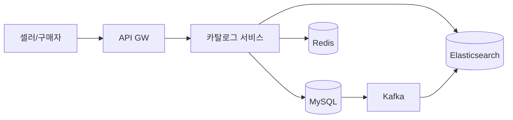

> **한 줄 요약**: 상품 카탈로그의 핵심은 쓰기는 RDB로 정확하게, 읽기는 Elasticsearch와 Redis로 빠르게 분리하고, 멀티테넌트 구조로 수백만 셀러의 상품을 격리하면서도 단일 검색 인덱스로 통합 제공하는 것이다.

## 실제 문제: 블랙프라이데이에 검색이 멈추면?

2023년 국내 B 이커머스 플랫폼의 블랙프라이데이 당일 오전 10시, 기획전 트래픽이 몰리면서 상품 검색 API의 P99 응답이 800ms에서 12초로 치솟았습니다. 원인을 추적하니 단일 MySQL 테이블에 3억 2천만 건의 상품 데이터가 있었고, 필터 조합(카테고리 + 가격대 + 브랜드 + 평점)이 인덱스를 전혀 타지 못하는 풀 테이블 스캔을 유발한 것이었습니다.

임시방편으로 DB 읽기 레플리카를 추가했지만 복제 지연으로 가격 정보가 30초씩 오래된 데이터를 보여줬고, 일부 사용자는 이미 품절된 상품을 구매하려다 결제 단계에서 오류를 만났습니다. 그날 하루에만 CS 문의 14만 건, 환불 처리 비용 수억 원이 발생했습니다.

쿠팡은 3억 개 이상의 상품 SKU를 보유하면서도 검색 응답을 100ms 이내로 유지합니다. 네이버쇼핑은 하루 검색 쿼리 3억 건을 처리합니다. 11번가는 수십만 셀러의 상품을 실시간으로 인덱싱합니다. 이 시스템들이 공통적으로 해결하는 문제는 다음과 같습니다.

- **대규모 복합 필터링**: 카테고리·가격·브랜드·평점·배송 조건이 동시에 걸릴 때 빠른 응답
- **실시간 재고 연동**: 품절 상품이 검색 결과에서 즉시 제거 또는 후순위 배치
- **셀러 격리**: 수십만 셀러가 각자의 상품을 독립적으로 관리하되 구매자는 통합 검색
- **속성 다양성**: 의류(사이즈·색상), 전자기기(CPU·RAM), 식품(유통기한·알레르기)은 완전히 다른 속성 구조

---

## 설계 의사결정 로드맵

상품 카탈로그 설계에서 순서대로 답해야 할 핵심 결정 4가지입니다. 면접에서 "왜 그 DB를 골랐나요?"라는 질문에 트레이드오프 없이 답하면 감점입니다.

### 결정 1: 상품 저장소 — RDB vs NoSQL vs 하이브리드

**문제**: 상품 속성은 카테고리마다 완전히 다릅니다. 노트북은 CPU·RAM·SSD 속성이 있고, 티셔츠는 사이즈·소재·색상이 있습니다. 이 이질적인 구조를 어떻게 저장하는가?

| 후보 | 장점 | 단점 | 언제 적합 |
|------|------|------|----------|
| 순수 RDB (EAV 패턴) | 스키마 일관성, 트랜잭션 보장 | 속성 조회에 조인 폭발, 카테고리별 필터 쿼리 복잡 | 속성 종류 수십 개 이하 소규모 |
| 순수 NoSQL (MongoDB) | 문서별 유연한 스키마, 단일 도큐먼트 조회 빠름 | 복잡한 집계 쿼리 약함, 멀티 도큐먼트 트랜잭션은 4.0(2018) 이후 지원되지만, RDB 대비 성능 오버헤드가 크고 분산 환경에서 샤드 간 트랜잭션은 여전히 제약이 있음 | 스키마 변동이 매우 잦은 경우 |
| RDB + JSON 컬럼 하이브리드 | 핵심 속성은 컬럼, 가변 속성은 JSON — 양쪽 장점 | JSON 컬럼 인덱싱 제한, DB 엔진 의존성 | 대부분의 이커머스 (권장) |
| RDB 쓰기 + ES 읽기 분리 | 쓰기 정확성 + 읽기 검색 성능 최적화 | 이중 저장, 동기화 지연 관리 필요 | 검색 트래픽이 쓰기의 100배 이상 |

**우리의 선택: RDB(MySQL) + JSON 컬럼 + Elasticsearch 분리**
- 이유: 상품의 핵심 메타데이터(상품명, 가격, 재고, 셀러ID)는 MySQL 정규화 컬럼으로 저장해 트랜잭션과 무결성을 보장합니다. 카테고리별 가변 속성은 `attributes JSON` 컬럼에 저장해 스키마 마이그레이션 없이 새 카테고리를 추가합니다. 검색·필터 요청은 Elasticsearch로 전달하여 역인덱스와 집계 쿼리를 활용합니다.
- **안 하면**: MySQL만으로 "가격 3만~5만 원 + 브랜드 삼성 + 평점 4.0 이상 + 무료배송" 같은 4중 필터를 3억 건에 걸면 쿼리 실행 계획이 인덱스를 포기하고 풀 스캔으로 전환됩니다. 단 한 번의 요청이 다른 모든 쿼리를 블로킹합니다.

### 결정 2: 검색 엔진 — MySQL FULLTEXT vs Elasticsearch vs OpenSearch

**문제**: 사용자가 "삼성 갤럭시 s25 케이스 투명"을 검색하면 형태소 분석, 오타 교정, 유사어 매칭, 연관도 정렬을 동시에 해야 합니다. RDBMS로 이것을 처리할 수 있는가?

| 후보 | 장점 | 단점 | 언제 적합 |
|------|------|------|----------|
| MySQL FULLTEXT | 별도 인프라 없음, 운영 단순 | 한국어 형태소 분석 불가, 복합 필터 느림, 집계 쿼리 없음 | 상품 수 10만 이하 MVP |
| Elasticsearch | 한국어 분석기(nori), 집계·집합 쿼리, 벡터 검색 지원 | 운영 복잡도 높음, 동기화 파이프라인 필요 | 대규모 이커머스 표준 |
| OpenSearch | ES 오픈소스 포크, AWS 관리형 | ES 최신 기능 시차 존재 | AWS 인프라 의존 팀 |

**우리의 선택: Elasticsearch + nori 형태소 분석기**
- 이유: "갤럭시" 검색 시 "갤럭시S25", "갤럭시 탭" 모두 히트시키려면 역인덱스와 형태소 분석이 필수입니다. ES의 `multi_match` + `function_score`로 상품명 매칭 점수에 판매량·리뷰 수를 가중해 연관도를 높입니다. `aggs` 쿼리로 브랜드별·가격대별 상품 수를 한 번의 요청으로 집계해 필터 UI의 숫자 뱃지를 채웁니다.
- **안 하면**: MySQL LIKE '%갤럭시%'는 인덱스를 타지 못합니다. 3억 건에서 LIKE 쿼리는 실행 시간이 분 단위입니다. 오타 교정("갤럭씨" → "갤럭시")은 SQL로는 구현이 사실상 불가능합니다.

### 결정 3: 캐싱 전략 — 캐시 없음 vs 로컬 캐시 vs Redis 분산 캐시

**문제**: 인기 상품 상세 페이지는 초당 수만 번 조회됩니다. 매번 DB + ES를 조회하면 비용과 응답 시간이 모두 폭발합니다. 어떤 캐싱 전략이 적합한가?

| 후보 | 장점 | 단점 | 언제 적합 |
|------|------|------|----------|
| 캐시 없음 | 구현 없음, 항상 최신 데이터 | DB/ES 부하 폭발, 응답 느림 | 극초기 MVP |
| 로컬 캐시 (Caffeine) | 네트워크 홉 없음, 극저지연 | 서버 여러 대면 캐시 불일치, 메모리 제한 | 단일 서버 |
| Redis 분산 캐시 | 모든 서버 공유, 용량 확장 쉬움 | 네트워크 홉 추가, Redis 장애 시 영향 | 다중 서버 표준 |
| CDN 캐시 (정적 상품 페이지) | 엣지에서 응답, DB 부하 거의 없음 | 실시간 재고·가격 반영 어려움 | 가격 변동 없는 콘텐츠성 상품 |

**우리의 선택: L1 로컬 캐시(Caffeine) + L2 Redis 2계층**
- 이유: 상품 상세는 로컬 캐시(TTL 30초)로 서버 내 반복 요청을 흡수합니다. 로컬 캐시 미스 시 Redis(TTL 5분)를 조회하고, Redis도 미스면 DB를 조회 후 양쪽에 채웁니다. 가격·재고 변경 이벤트를 수신하면 Redis 해당 키를 즉시 무효화하고 로컬 캐시는 TTL 만료를 기다립니다. 재고 변경의 최대 30초 지연은 결제 단계 재고 검증으로 보정합니다.
- **안 하면**: 쿠팡 수준의 인기 상품(초당 조회 5만 건)을 캐시 없이 ES에 직접 조회하면 ES 클러스터 비용이 10배 이상 증가하고 P99 응답도 200ms 이상 높아집니다.

### 결정 4: 멀티테넌트 카탈로그 — 테이블 공유 vs DB 분리 vs 스키마 분리

**문제**: 수십만 셀러가 각자의 상품을 독립 관리해야 하지만, 구매자는 모든 셀러 상품을 통합 검색해야 합니다. 데이터를 어떻게 격리하면서 통합 검색을 지원하는가?

| 후보 | 장점 | 단점 | 언제 적합 |
|------|------|------|----------|
| DB 완전 분리 (테넌트별 DB) | 완벽한 격리, 테넌트별 스케일 조절 | 통합 검색 불가, 운영 비용 N배 | 엔터프라이즈 B2B SaaS |
| 스키마 분리 | 격리 수준 중간, 운영 복잡도 중간 | 동적 스키마 생성 관리 부담 | 수십 개 테넌트 |
| 테이블 공유 + seller_id 컬럼 | 단일 인프라, 통합 검색 용이 | 한 테넌트 대량 쿼리가 다른 테넌트에 영향 | 수십만 테넌트 이커머스 |

**우리의 선택: 테이블 공유 + seller_id 컬럼 + Row-Level 권한**
- 이유: 수십만 셀러를 DB로 분리하면 DB 인스턴스 수십만 개가 필요합니다. 테이블을 공유하되 `seller_id` 컬럼에 복합 인덱스를 걸고, 애플리케이션 레이어에서 JWT 토큰의 `sellerId` 클레임을 WHERE 조건에 강제 주입합니다. ES 인덱스는 모든 셀러 상품을 통합 저장하되 구매자 검색은 셀러 필터 없이, 셀러 관리 API는 `seller_id` 필터를 강제합니다.
- **안 하면**: 셀러 관리 API에서 `seller_id` 필터를 누락하면 다른 셀러의 상품 목록이 노출됩니다. 이는 단순 버그가 아닌 데이터 유출 사고입니다.

---

## 1. 요구사항 분석 및 규모 추정

### 기능 요구사항

1️⃣ **상품 등록/수정/삭제**: 셀러가 상품명, 가격, 재고, 이미지, 카테고리별 속성을 관리
2️⃣ **상품 검색**: 키워드 검색, 형태소 분석, 오타 교정, 연관도 정렬
3️⃣ **복합 필터링**: 카테고리, 가격대, 브랜드, 평점, 배송 조건, 카테고리별 속성 필터
4️⃣ **상품 상세 조회**: 이미지, 상세설명, 옵션(색상·사이즈), 리뷰 요약
5️⃣ **재고·가격 실시간 반영**: 재고 소진 즉시 품절 표시, 가격 변경 즉시 반영
6️⃣ **카테고리 관리**: 계층형 카테고리 구조 (대분류 → 중분류 → 소분류)
7️⃣ **상품 랭킹**: 판매량, 리뷰 수, 최신순, 낮은 가격순 정렬

### 비기능 요구사항

- **검색 응답**: P99 200ms 이내 (키워드 검색 + 복합 필터 포함)
- **상세 응답**: P99 50ms 이내 (캐시 히트 기준)
- **가용성**: 99.99% (연간 52분 이하 다운타임)
- **재고 정확성**: 결제 단계에서 최종 검증, 카탈로그 표시는 30초 이내 반영
- **인덱싱 지연**: 상품 등록/수정 후 검색 반영 10초 이내
- **확장성**: 상품 수 10억 건, 동시 검색 QPS 50만 까지 수평 확장

### 규모 추정

```
상품 수: 3억 SKU (쿠팡 수준)
일일 신규 등록: 500만 건/일 (셀러 상품 등록 피크 포함)
검색 QPS (평균): 3억 건/일 ÷ 86,400 ≈ 3,500 QPS
검색 QPS (피크): 3,500 × 100 = 350,000 QPS (블프, 특가 이벤트)
상품 상세 조회 QPS (피크): 50,000 QPS

저장 용량:
  - 상품 레코드 (MySQL): 3억 × 2KB = 600GB
  - ES 인덱스: 3억 × 5KB (역인덱스 포함) = 1.5TB
  - 상품 이미지 (Object Storage): 3억 × 10장 × 500KB = 1.5PB
  - Redis 캐시 (상위 100만 상품): 100만 × 10KB = 10GB

인덱싱 처리량:
  - 피크 등록: 500만/86,400 ≈ 58 건/초
  - Kafka 이벤트 처리 버퍼 필요: 피크 × 10 = 580 건/초
  - ES bulk indexing: 500건 배치 × 1.2초 주기로 충분

캐시 히트율 목표:
  - 상위 1% 상품이 전체 조회의 80% 차지 (파레토 법칙)
  - Redis 10GB로 상위 100만 상품 캐시 → 히트율 80% 달성
```

---

## 2. 고수준 아키텍처

> **비유:** 상품 카탈로그 시스템은 대형 도서관과 같습니다. 책(상품)은 서가(MySQL)에 정확하게 정리되어 있고, 빠른 검색을 위한 색인 카드함(Elasticsearch)이 따로 있습니다. 자주 찾는 책은 데스크 바로 옆 진열대(Redis)에 꺼내놓아 즉시 건네줍니다. 새 책이 들어오면 사서(Kafka Consumer)가 색인 카드함을 업데이트합니다.



### 핵심 컴포넌트 역할

**카탈로그 서비스 (Catalog Service)**
모든 상품 CRUD와 검색 요청의 진입점입니다. 셀러 요청은 MySQL에 쓰고 Kafka 이벤트를 발행합니다. 구매자 검색 요청은 Redis L1 → Redis L2 → ES 순서로 처리합니다. 상품 상세 조회는 Redis → MySQL 순서로 처리합니다.

**MySQL (마스터 데이터)**
상품의 단일 진실 공급원(Single Source of Truth)입니다. 가격, 재고, 셀러ID, 상태(판매중/품절/삭제)를 관리합니다. 쓰기는 마스터, 상세 조회 폴백은 읽기 레플리카를 사용합니다.

**Kafka (변경 이벤트 버스)**
MySQL의 상품 변경을 Elasticsearch에 비동기로 전파합니다. MySQL → Debezium CDC → Kafka → ES Consumer 파이프라인으로 상품 등록 후 10초 이내 검색 반영을 보장합니다.

**Elasticsearch (검색·필터)**
모든 검색과 복합 필터 요청을 처리합니다. MySQL은 단일 레코드 조회에 최적화되어 있고 ES는 수억 건의 역인덱스 검색에 최적화되어 있어 역할이 완전히 분리됩니다.

**Redis (분산 캐시)**
인기 상품 상세, 카테고리 트리, 브랜드 목록 등 읽기 빈도가 높고 변경이 적은 데이터를 캐시합니다. 재고·가격 변경 이벤트 수신 시 해당 키를 즉시 무효화합니다.

---

## 3. 핵심 컴포넌트 상세 설계

### 3.1 상품 데이터 모델 (MySQL)

상품 스키마 설계의 핵심은 **변하지 않는 핵심 속성은 정규화 컬럼**으로, **카테고리마다 다른 속성은 JSON 컬럼**으로 분리하는 것입니다.

```sql
-- 상품 마스터 테이블
CREATE TABLE products (
    id            BIGINT UNSIGNED  NOT NULL AUTO_INCREMENT,
    seller_id     BIGINT UNSIGNED  NOT NULL,
    category_id   INT UNSIGNED     NOT NULL,
    name          VARCHAR(500)     NOT NULL,
    brand         VARCHAR(200),
    price         DECIMAL(12, 2)   NOT NULL,
    sale_price    DECIMAL(12, 2),                   -- 할인가 (NULL이면 price 사용)
    stock         INT UNSIGNED     NOT NULL DEFAULT 0,
    status        ENUM('ACTIVE','SOLDOUT','HIDDEN','DELETED') NOT NULL DEFAULT 'ACTIVE',
    attributes    JSON,                             -- 카테고리별 가변 속성
    search_vector TEXT,                             -- 검색용 비정규화 필드 (ES 동기화용)
    created_at    DATETIME(3)      NOT NULL DEFAULT CURRENT_TIMESTAMP(3),
    updated_at    DATETIME(3)      NOT NULL DEFAULT CURRENT_TIMESTAMP(3) ON UPDATE CURRENT_TIMESTAMP(3),
    PRIMARY KEY (id),
    INDEX idx_seller   (seller_id, status, updated_at),
    INDEX idx_category (category_id, status, price),
    INDEX idx_updated  (updated_at)                -- CDC 폴링용
) ENGINE=InnoDB DEFAULT CHARSET=utf8mb4;

-- 카테고리 계층 테이블 (인접 리스트 + 클로저 테이블 병행)
CREATE TABLE categories (
    id        INT UNSIGNED NOT NULL AUTO_INCREMENT,
    parent_id INT UNSIGNED,
    name      VARCHAR(200) NOT NULL,
    depth     TINYINT      NOT NULL DEFAULT 0,     -- 0=대분류, 1=중분류, 2=소분류
    path      VARCHAR(500) NOT NULL,               -- '001/003/012' 경로 문자열
    PRIMARY KEY (id),
    INDEX idx_parent (parent_id),
    INDEX idx_path   (path)
) ENGINE=InnoDB DEFAULT CHARSET=utf8mb4;
```

`attributes` JSON 컬럼 예시 — 같은 테이블에 완전히 다른 구조가 공존합니다.

```json
// 노트북 상품의 attributes
{
  "cpu": "Intel Core Ultra 7 155H",
  "ram_gb": 32,
  "storage_gb": 1024,
  "display_inch": 14.0,
  "weight_kg": 1.4,
  "os": "Windows 11"
}

// 티셔츠 상품의 attributes
{
  "sizes": ["S", "M", "L", "XL"],
  "colors": ["화이트", "블랙", "네이비"],
  "material": "면 100%",
  "washing": "손세탁 권장"
}
```

### 3.2 Elasticsearch 인덱스 설계

ES 인덱스 매핑은 검색 정확도와 성능 사이의 균형이 핵심입니다. 모든 필드를 `text`로 잡으면 역인덱스 크기가 폭발하고, 너무 엄격하게 `keyword`만 쓰면 형태소 분석이 안 됩니다.

```json
{
  "mappings": {
    "properties": {
      "id":         { "type": "long" },
      "seller_id":  { "type": "long" },
      "category_id":{ "type": "integer" },
      "category_path": { "type": "keyword" },
      "name": {
        "type": "text",
        "analyzer": "nori",
        "fields": {
          "keyword": { "type": "keyword" },
          "ngram":   { "type": "text", "analyzer": "nori_ngram" }
        }
      },
      "brand":      { "type": "keyword" },
      "price":      { "type": "scaled_float", "scaling_factor": 100 },
      "sale_price": { "type": "scaled_float", "scaling_factor": 100 },
      "stock":      { "type": "integer" },
      "status":     { "type": "keyword" },
      "rating":     { "type": "half_float" },
      "review_count": { "type": "integer" },
      "sales_30d":  { "type": "integer" },
      "attributes": { "type": "object", "dynamic": true },
      "updated_at": { "type": "date" }
    }
  },
  "settings": {
    "number_of_shards": 10,
    "number_of_replicas": 1,
    "analysis": {
      "analyzer": {
        "nori": {
          "type": "custom",
          "tokenizer": "nori_tokenizer",
          "filter": ["nori_part_of_speech", "lowercase"]
        },
        "nori_ngram": {
          "type": "custom",
          "tokenizer": "nori_tokenizer",
          "filter": ["nori_readingform", "edge_ngram_filter"]
        }
      },
      "filter": {
        "edge_ngram_filter": {
          "type": "edge_ngram",
          "min_gram": 1,
          "max_gram": 10
        }
      }
    }
  }
}
```

> ⚠️ **주의**: `dynamic: true`로 설정하면 카테고리마다 다른 속성이 자동으로 필드에 생기지만, **필드 수 폭발(Field Explosion)** 문제가 발생합니다. ES 기본 `index.mapping.total_fields.limit`이 1,000인데, 카테고리가 수천 개이면 이 한도를 쉽게 초과합니다. 대안으로 `flattened` 타입이나 `nested` 구조를 고려해야 합니다.

### 3.3 검색 API 구현 (Java/Spring Boot)

복합 필터 검색의 핵심은 **필터는 캐시되는 filter context**, **점수 계산은 query context**로 분리하는 것입니다.

```java
@Service
@RequiredArgsConstructor
public class ProductSearchService {

    private final ElasticsearchClient esClient;
    private final ProductCacheService cacheService;

    public SearchResponse search(ProductSearchRequest req) {
        // 1. 점수 계산: 상품명 형태소 분석 매칭
        Query nameQuery = MultiMatchQuery.of(m -> m
            .fields("name", "name.ngram^0.5", "brand^2")
            .query(req.getKeyword())
            .type(TextQueryType.BestFields)
            .fuzziness("AUTO")           // 오타 허용 (AUTO = 1~2글자 오차)
        )._toQuery();

        // 2. 판매량·평점으로 연관도 부스팅
        Query scoredQuery = FunctionScoreQuery.of(f -> f
            .query(nameQuery)
            .functions(
                FunctionScore.of(s -> s
                    .fieldValueFactor(fvf -> fvf
                        .field("sales_30d").factor(0.0001).modifier(FieldValueFactorModifier.Log1p)
                    )
                ),
                FunctionScore.of(s -> s
                    .fieldValueFactor(fvf -> fvf
                        .field("rating").factor(0.2)
                    )
                )
            )
            .boostMode(FunctionBoostMode.Sum)
        )._toQuery();

        // 3. 필터: 캐시 최적화를 위해 filter context 사용
        List<Query> filters = new ArrayList<>();
        filters.add(TermQuery.of(t -> t.field("status").value("ACTIVE"))._toQuery());

        if (req.getCategoryId() != null) {
            // 하위 카테고리 포함: path prefix 매칭
            filters.add(PrefixQuery.of(p -> p
                .field("category_path").value(req.getCategoryPath())
            )._toQuery());
        }
        if (req.getMinPrice() != null || req.getMaxPrice() != null) {
            filters.add(RangeQuery.of(r -> r
                .field("price")
                .gte(req.getMinPrice() != null ? JsonData.of(req.getMinPrice()) : null)
                .lte(req.getMaxPrice() != null ? JsonData.of(req.getMaxPrice()) : null)
            )._toQuery());
        }
        if (req.getBrands() != null && !req.getBrands().isEmpty()) {
            filters.add(TermsQuery.of(t -> t
                .field("brand")
                .terms(TermsQueryField.of(tf -> tf
                    .value(req.getBrands().stream().map(FieldValue::of).toList())
                ))
            )._toQuery());
        }

        // 4. 브랜드·가격대 집계 (필터 사이드바 숫자 뱃지)
        Aggregation brandAgg = TermsAggregation.of(t -> t
            .field("brand").size(50)
        )._toAggregation();

        Aggregation priceAgg = HistogramAggregation.of(h -> h
            .field("price").interval(10000.0)
        )._toAggregation();

        return esClient.search(s -> s
            .index("products")
            .query(BoolQuery.of(b -> b
                .must(scoredQuery)
                .filter(filters)
            )._toQuery())
            .aggregations("brands", brandAgg)
            .aggregations("price_range", priceAgg)
            .from(req.getPage() * req.getSize())
            .size(req.getSize())
            .source(SourceConfig.of(sc -> sc
                .filter(f -> f.includes("id", "name", "price", "sale_price",
                                        "brand", "rating", "stock", "status"))
            )),
            ProductDocument.class
        );
    }
}
```

### 3.4 상품 등록 → ES 인덱싱 파이프라인

상품 등록 후 검색 반영이 10초 이내여야 합니다. CDC(Change Data Capture) 방식으로 MySQL 변경을 ES에 전파합니다.

```java
@Service
@RequiredArgsConstructor
public class ProductWriteService {

    private final ProductRepository productRepo;
    private final KafkaTemplate<String, ProductEvent> kafka;
    private final ProductCacheService cache;

    @Transactional
    public Product createProduct(CreateProductCommand cmd) {
        // 1. MySQL 저장
        Product product = productRepo.save(Product.of(cmd));

        // 2. Outbox 이벤트 발행 (동일 트랜잭션 — Transactional Outbox 패턴)
        // Debezium이 outbox 테이블 변경을 감지해 Kafka로 발행
        outboxRepo.save(OutboxEvent.of("product.created", product.getId()));

        return product;
    }

    // Kafka Consumer: ES 인덱싱
    @KafkaListener(topics = "product.events", groupId = "es-indexer")
    public void handleProductEvent(ProductEvent event) {
        ProductDocument doc = buildDocument(event);

        switch (event.getType()) {
            case CREATED, UPDATED -> esClient.index(i -> i
                .index("products")
                .id(String.valueOf(event.getProductId()))
                .document(doc)
            );
            case DELETED -> esClient.delete(d -> d
                .index("products")
                .id(String.valueOf(event.getProductId()))
            );
        }

        // Redis 캐시 무효화
        cache.evict(event.getProductId());
    }
}
```

### 3.5 2계층 캐싱 구현

L1(로컬) → L2(Redis) → Source(DB/ES) 순서의 Look-aside 캐시 패턴입니다.

```java
@Service
@RequiredArgsConstructor
public class ProductCacheService {

    // L1: 서버 로컬 캐시 (TTL 30초, 최대 10,000 항목)
    private final Cache<Long, ProductDetail> localCache = Caffeine.newBuilder()
        .maximumSize(10_000)
        .expireAfterWrite(30, TimeUnit.SECONDS)
        .build();

    private final RedisTemplate<String, ProductDetail> redis;
    private final ProductRepository productRepo;

    private static final Duration REDIS_TTL = Duration.ofMinutes(5);
    private static final String KEY_PREFIX = "product:detail:";

    public ProductDetail getDetail(Long productId) {
        // L1 조회
        ProductDetail cached = localCache.getIfPresent(productId);
        if (cached != null) return cached;

        // L2 Redis 조회
        String redisKey = KEY_PREFIX + productId;
        cached = redis.opsForValue().get(redisKey);
        if (cached != null) {
            localCache.put(productId, cached);  // L1 채우기
            return cached;
        }

        // Source: MySQL 조회
        ProductDetail detail = productRepo.findDetailById(productId)
            .orElseThrow(() -> new ProductNotFoundException(productId));

        // 양쪽 캐시 채우기
        redis.opsForValue().set(redisKey, detail, REDIS_TTL);
        localCache.put(productId, detail);

        return detail;
    }

    public void evict(Long productId) {
        // Redis 즉시 무효화 (로컬 캐시는 TTL 자연 만료)
        redis.delete(KEY_PREFIX + productId);
    }
}
```

### 3.6 카테고리 계층 조회 최적화

카테고리 트리는 변경이 거의 없고 조회가 매우 빈번합니다. 전체 트리를 Redis에 직렬화해두고 애플리케이션에서 트리 순회를 처리합니다.

```java
@Service
@RequiredArgsConstructor
public class CategoryService {

    private final CategoryRepository categoryRepo;
    private final RedisTemplate<String, List<Category>> redis;

    private static final String TREE_KEY = "category:tree";
    private static final Duration TREE_TTL = Duration.ofHours(1);

    public List<Category> getCategoryTree() {
        // Redis에서 전체 트리 반환 (히트율 99.9%)
        List<Category> tree = redis.opsForValue().get(TREE_KEY);
        if (tree != null) return tree;

        // 미스 시 DB 조회 + 트리 빌드
        List<Category> all = categoryRepo.findAll();
        tree = buildTree(all, null);
        redis.opsForValue().set(TREE_KEY, tree, TREE_TTL);
        return tree;
    }

    // 특정 카테고리의 모든 하위 ID 수집 (ES 필터용)
    public String getCategoryPath(Integer categoryId) {
        Category cat = categoryRepo.findById(categoryId).orElseThrow();
        return cat.getPath();  // '001/003' → ES prefix 쿼리로 하위 포함 검색
    }

    private List<Category> buildTree(List<Category> all, Integer parentId) {
        return all.stream()
            .filter(c -> Objects.equals(c.getParentId(), parentId))
            .peek(c -> c.setChildren(buildTree(all, c.getId())))
            .collect(Collectors.toList());
    }
}
```

---

## 4. 장애 시나리오와 대응

이커머스 카탈로그에서 실제로 발생하는 장애 유형과 대응 전략입니다.

| 시나리오 | 영향 | 대응 |
|---------|------|------|
| ES 클러스터 장애 | 검색·필터 불가, 상품 목록 페이지 오류 | 서킷 브레이커 오픈 → MySQL 폴백 쿼리 (기능 저하 모드), 인기 카테고리는 Redis 정적 캐시로 노출 |
| Redis 장애 | 캐시 미스 폭발, DB/ES 직접 부하 급증 | Redis Sentinel/Cluster로 자동 페일오버, 로컬 캐시 TTL 연장(30초→5분)으로 일시적 흡수 |
| Kafka Consumer 지연 | ES 인덱싱 지연 → 최근 등록 상품 검색 불가 | Consumer Lag 모니터링, 임계값(10,000건) 초과 시 알람 + Consumer 수평 확장, 재고·가격 변경은 ES Direct Update API로 우선 처리 |
| MySQL 마스터 장애 | 상품 등록/수정 불가 | MySQL Group Replication으로 자동 페일오버 (30초 이내), 상품 등록은 큐에 버퍼링 후 복구 시 재처리 |
| 셀러 대량 등록 (수십만 건 동시) | DB 커넥션 소진, Kafka 토픽 폭발 | Rate Limiting(셀러별 100건/분), Kafka 파티션 10개 × Consumer 10개로 병렬 처리, ES Bulk API 배치 인덱싱 |
| 잘못된 가격 등록 (0원, 음수) | 0원 상품 구매 쇄도 | 저장 레이어 유효성 검증 + 비즈니스 룰 검증(카테고리 최소 가격), 이상 가격 자동 HIDDEN 처리 + 셀러 알림 |
| ES 인덱스 매핑 충돌 | 신규 카테고리 속성 인덱싱 실패 | `dynamic: true` + 매핑 자동 확장, 주기적 인덱스 재구성(Blue-Green Index Alias 전환) |

### ES 인덱스 재구성(Re-index) 시나리오

매핑 변경이 필요할 때 Blue-Green Index Alias 전환을 사용합니다.

| 단계 | 작업 | 주의사항 |
|------|------|---------|
| 1 | 새 인덱스 생성 (v2) | 새 매핑 적용 |
| 2 | _reindex API로 v1 → v2 복사 | 3억 건 기준 수 시간 소요, `slices=auto`로 병렬화 |
| 3 | 이중 쓰기 구간 | v1, v2 모두에 CDC 이벤트 적용 — 누락 방지 |
| 4 | alias 전환 | `products-read` alias를 v2로 원자적 전환 |
| 5 | v1 삭제 | alias 전환 후 충분한 관찰 기간(24h) 후 삭제 |

**극한 케이스**: re-index 도중 원본 인덱스에 쓰기가 계속 발생합니다. `_reindex` 완료 시점과 alias 전환 시점 사이에 들어온 문서가 누락될 수 있으므로, CDC 파이프라인을 v1과 v2 모두에 연결한 이중 쓰기 구간이 필수입니다.

### ES → MySQL 폴백 구현

```java
@Component
@RequiredArgsConstructor
public class SearchFacade {

    private final ProductSearchService esSearch;
    private final ProductRepository mysqlFallback;
    private final CircuitBreakerRegistry cbRegistry;

    public SearchResult search(ProductSearchRequest req) {
        CircuitBreaker cb = cbRegistry.circuitBreaker("elasticsearch");

        return cb.executeSupplier(
            () -> esSearch.search(req),
            // ES 장애 시 MySQL 폴백 (정렬·필터 기능 저하)
            throwable -> mysqlFallback.searchBasic(
                req.getKeyword(), req.getCategoryId(),
                req.getMinPrice(), req.getMaxPrice(),
                PageRequest.of(req.getPage(), req.getSize())
            )
        );
    }
}
```

---

## 5. 확장 포인트

현재 설계에서 트래픽·데이터가 10배 이상 증가할 때 적용할 확장 방향입니다.

**벡터 검색 도입 (시맨틱 검색)**
"가성비 좋은 노트북"처럼 의미 기반 검색은 역인덱스로 처리할 수 없습니다. 상품명과 설명을 임베딩 벡터로 변환해 ES의 `dense_vector` 필드에 저장하고 kNN 검색을 적용합니다. 키워드 점수와 벡터 유사도를 RRF(Reciprocal Rank Fusion)로 결합합니다.

**상품 추천 분리**
"이 상품을 본 사람이 함께 본 상품"은 카탈로그 서비스가 아닌 별도 추천 서비스의 영역입니다. 조회 이벤트를 Kafka로 발행하고 ML 파이프라인이 협업 필터링 모델을 학습해 Redis에 추천 리스트를 저장합니다.

**멀티 리전 캐시**
글로벌 서비스로 확장 시 CDN Edge에 상품 상세 JSON을 캐싱합니다. 가격·재고는 엣지에서 실시간 조회하고 나머지 정적 정보는 엣지 TTL 1시간으로 캐싱해 원본 서버 부하를 90% 줄입니다.

**ES 인덱스 샤드 전략 재검토**
3억 건이 넘으면 단일 인덱스의 샤드 수를 늘리는 것보다 카테고리별 인덱스 분리를 검토합니다. 전자기기 인덱스, 패션 인덱스를 분리하면 각 카테고리의 속성 매핑이 충돌하지 않고 인덱스 재구성 시 해당 카테고리만 순단됩니다.

**CQRS 완전 분리**
현재는 카탈로그 서비스 내부에서 읽기/쓰기를 분기하지만, QPS가 10배 이상 증가하면 쓰기 서비스와 읽기 서비스를 별도 프로세스·별도 배포로 분리합니다. 읽기 서비스는 수평 확장에만 집중하고 쓰기 서비스는 트랜잭션 무결성에만 집중합니다.

---

## 면접 포인트

면접관이 가장 자주 파고드는 질문과 핵심 답변입니다.

**Q. MySQL과 Elasticsearch를 동시에 쓰면 데이터 불일치는 어떻게 처리하나요?**
A. 결제 단계에서 MySQL 재고를 최종 검증합니다. ES는 검색과 필터에만 사용하고 재고 차감은 항상 MySQL 트랜잭션으로 처리합니다. ES의 재고 표시가 10초 지연될 수 있지만, 이는 사용자 UX에 허용 가능한 수준이며 결제 오류로 이어지지 않습니다.

**Q. 상품 수가 10억 건이 되면 ES가 버틸 수 있나요?**
A. ES 공식 가이드 기준 샤드당 10~50GB가 권장이며, 인덱스 총 크기에 따라 샤드 수를 산정합니다. 100TB 규모라면 최소 2,000~10,000개 샤드가 필요합니다. 카테고리별 인덱스 분리와 ILM(Index Lifecycle Management)으로 삭제된 상품은 콜드 스토리지로 이전해 활성 인덱스 크기를 관리합니다.

**Q. 셀러가 가격을 바꿨을 때 캐시 무효화는 어떻게 하나요?**
A. 가격 변경 이벤트가 Kafka에 발행되면 Cache Invalidation Consumer가 Redis에서 해당 상품 키를 즉시 `DEL`합니다. 로컬 캐시는 최대 TTL(30초) 후 자연 만료됩니다. 그 30초 안에 이전 가격을 보고 구매를 시도하면 결제 전 가격 확인 단계에서 "가격이 변경되었습니다"를 안내합니다.

**Q. 카테고리 속성이 카테고리마다 다른데 ES에서 어떻게 필터링하나요?**
A. `attributes` 필드를 `dynamic: true`로 설정해 카테고리별 속성이 자동으로 ES 필드로 생성됩니다. `attributes.ram_gb`, `attributes.material` 같은 경로로 필터 쿼리를 작성합니다. 속성명 충돌 방지를 위해 카테고리 코드를 접두어로 붙이는 네임스페이스 전략을 사용합니다.

**Q. 검색 랭킹 조작(어뷰징)은 어떻게 막나요?**
A. 판매량·리뷰 수 기반 점수는 일별 배치로 갱신해 단기 어뷰징 효과를 희석합니다. 리뷰 어뷰징은 별도 FDS(Fraud Detection System)에서 처리합니다. 광고 상품은 오가닉 랭킹과 명확히 분리된 슬롯으로 노출하며 검색 점수 조작이 아닌 입찰가 기반 노출로 처리합니다.
