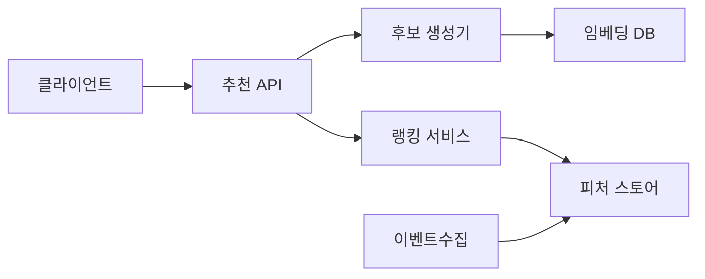
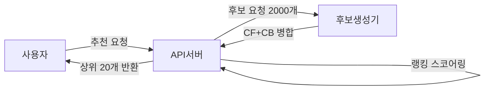
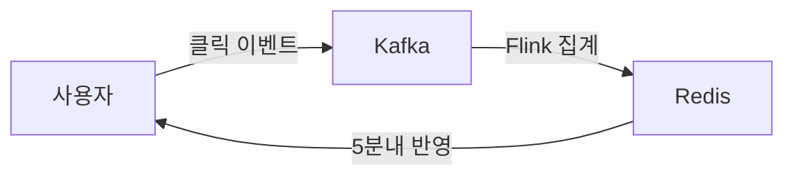

> **한 줄 요약**: 추천 시스템의 핵심은 협업 필터링으로 숨겨진 취향을 발굴하고, 2단계 파이프라인(후보 생성 → 정밀 랭킹)으로 수억 개 상품을 100ms 안에 걸러내며, 콜드 스타트와 인기 편향을 동시에 해결하는 것이다.

## 실제 문제: 추천 정확도와 매출의 직접적 관계

아마존 매출의 35%가 추천에서 발생하고, 넷플릭스 시청의 80%가 추천 기반입니다. 쿠팡의 맞춤 추천은 첫 화면 CTR을 비추천 대비 3배 높이고, 네이버쇼핑 개인화 피드는 구매 전환율을 2.5배 개선했습니다.

추천 시스템이 해결해야 할 핵심 문제:
- **콜드 스타트**: 신규 사용자·신규 상품은 데이터가 없어 추천 불가
- **인기 편향**: 항상 베스트셀러만 추천하면 롱테일 상품 판매 기회 소실
- **실시간성**: 방금 본 상품이 즉시 다음 추천에 반영되어야 함
- **규모**: 사용자 수천만 명 × 상품 수억 개에서 100ms 안에 결과 반환

---

## 설계 의사결정 로드맵

### 결정 1: 추천 알고리즘 — 협업 필터링 vs 콘텐츠 기반 vs 하이브리드

| 후보 | 장점 | 단점 | 언제 적합 |
|------|------|------|----------|
| 협업 필터링 (CF) | 숨겨진 취향 발굴 | 콜드 스타트 취약 | 충분한 행동 데이터가 있을 때 |
| 콘텐츠 기반 (CB) | 신규 상품 즉시 추천 가능 | Filter Bubble, 메타데이터 의존 | 신규 상품·사용자가 많을 때 |
| 하이브리드 (CF + CB) | 콜드 스타트 보완, 정확도+다양성 | 구현 복잡도, 가중치 튜닝 필요 | 대규모 이커머스 표준 |

**우리의 선택: 하이브리드 (행동 기반 CF + 상품 속성 CB)**
- 신규 사용자에게는 CB로 시작하고, 행동 로그가 쌓이면 CF 비중을 올린다. CF만 쓰면 가입 첫 1주일간 개인화가 전혀 안 되고, CB만 쓰면 운동화를 산 사람에게 항상 운동화만 추천하는 필터 버블이 생긴다.

### 결정 2: 서빙 아키텍처 — 배치 사전계산 vs 실시간 추론 vs 2단계 파이프라인

| 후보 | 장점 | 단점 | 언제 적합 |
|------|------|------|----------|
| 배치 사전계산 | 서빙 레이턴시 최소 | 실시간 반영 불가 | DAU 소규모, 실시간성 불필요 |
| 실시간 추론 | 최신 컨텍스트 반영 | GPU 비용 급증 | 소규모, 상품 수 적을 때 |
| 2단계 파이프라인 | 규모+실시간 동시 달성 | 구현 복잡도 | 대규모 이커머스 표준 |

**우리의 선택: 2단계 파이프라인 (배치 후보 생성 + 실시간 정밀 랭킹)**
- 1단계에서 수억 개 상품을 수천 개로 줄이는 것은 배치로 사전계산하고, 2단계에서 수천 개를 실시간 정밀 스코어링한다. 1억 개 상품에 딥러닝을 실시간으로 돌리면 요청 1건에 100초가 걸린다.

배치로 임베딩을 갱신하면 신규 상품이 CF 후보에서 제외됩니다. 신규 상품은 CB 임베딩을 실시간으로 생성해 ANN 인덱스에 인크리멘탈 추가하고, CF 임베딩은 다음 배치에서 갱신합니다.

### 결정 3: 피처 스토어 — 인메모리 vs Redis vs 전용 피처 스토어

| 후보 | 장점 | 단점 | 언제 적합 |
|------|------|------|----------|
| 인메모리 (JVM 캐시) | 레이턴시 최소 (<1ms) | 서버 재시작 시 소실 | 단일 서버, 소규모 |
| Redis | 분산 공유, 빠름 (<5ms) | 대용량 비용, TTL 만료 시 콜드 | 중간 규모 표준 |
| 전용 피처 스토어 (Feast) | 학습-서빙 일관성 | 운영 복잡도 급증 | 대규모, ML 팀 분리 |

**우리의 선택: Redis (온라인 피처) + Offline 배치 파이프라인**
- Redis Hash에 사용자별 최근 조회 카테고리, 상품별 실시간 인기도를 저장한다. 랭킹 모델이 MySQL에서 직접 읽으면 QPS 1만에서 DB 쿼리 1억 건이 발생한다.

### 결정 4: A/B 테스트 — 단순 랜덤 vs MAB vs 인터리빙

| 후보 | 장점 | 단점 | 언제 적합 |
|------|------|------|----------|
| 단순 랜덤 A/B | 통계 해석 쉬움 | 나쁜 변형에 트래픽 낭비 | 변형 수 적고 실험 기간 충분할 때 |
| MAB | 좋은 변형에 트래픽 자동 집중 | 통계적 유의성 보장 어려움 | 변형 많고 빠른 수렴 필요 |
| 인터리빙 | 소규모 트래픽으로 빠른 판정 | 해석 복잡 | 랭킹 품질 비교 특화 |

**우리의 선택: 단순 A/B (기본) + MAB (다변형 동시 실험)**
- 주요 변경은 A/B로 2주 실험한다. 파라미터 튜닝처럼 변형이 5개 이상이면 Thompson Sampling MAB로 빠르게 수렴한다.

---

## 1. 요구사항 분석 및 규모 추정

### 기능 요구사항

1. **개인화 추천**: 사용자별 메인 피드, 상품 상세 페이지 하단 "관련 상품"
2. **실시간 반영**: 방금 조회·구매한 상품이 즉시 다음 추천에 반영
3. **콜드 스타트 처리**: 신규 가입 사용자와 신규 등록 상품 즉시 추천 가능
4. **다양성 보장**: 동일 카테고리 상품이 추천 목록을 독점하지 않도록 제어
5. **A/B 실험 인프라**: 알고리즘별 CTR·CVR·매출 지표 실시간 측정

### 비기능 요구사항

- **레이턴시**: 추천 API P99 < 100ms
- **처리량**: 피크 QPS 50,000
- **가용성**: 99.99% (추천 불가 시 베스트셀러 폴백)
- **신선도**: 사용자 행동 이벤트 반영 시간 < 5분

### 규모 추정

```
MAU: 3,000만 명 / DAU: 500만 명 / 상품 수: 5억 개
피크 QPS: 50,000
사용자 행동 이벤트: 초당 200,000건
추천 후보 풀: 사용자당 2,000개 → 랭킹 후 20개
피처 스토어: 3,000만 사용자 × 피처 50개 × 8byte = 약 12GB (Redis)
```

---

## 2. 고수준 아키텍처

2단계 파이프라인을 도서관 사서에 비유하면: 손님 취향에 맞는 후보 수백 권을 빠르게 추립니다(1단계: 후보 생성). 그다음 최근 대출 기록, 별점 패턴을 보고 최종 10권을 고릅니다(2단계: 정밀 랭킹).



**각 컴포넌트 역할:**

| 컴포넌트 | 역할 | 기술 |
|----------|------|------|
| 후보 생성기 | 5억 개 상품 → 2,000개 압축 | ANN 벡터 검색 |
| 랭킹 서비스 | 2,000개 → 20개 정밀 스코어링 | 실시간 ML 모델 |
| 임베딩 DB | 상품·사용자 벡터 저장 | Faiss / Pinecone |
| 피처 스토어 | 실시간 피처 제공 | Redis |
| 이벤트수집 | 피처 스토어 실시간 반영 | Kafka 스트림 |

**추천 요청 흐름:**



---

## 3. 핵심 컴포넌트 상세 설계

### 각 컴포넌트 동작원리 상세

| 컴포넌트 | 핵심 역할 | 내부 동작 흐름 |
|----------|----------|--------------|
| **후보 생성기** | 5억 개 → 2,000개 압축 | Faiss HNSW ANN 쿼리 → Item-to-Item + 인기도 병렬 합집합 → 구매 이력 제거 |
| **랭킹 서비스** | 2,000개 → 20개 정밀 스코어링 | Redis Pipeline 피처 일괄 조회(1회 왕복) → TorchServe 배치 추론 → 내림차순 정렬 |
| **임베딩 DB** | 상품·사용자 벡터 저장 + ANN 검색 | 128차원 HNSW 그래프 탐색 → 전체 스캔 없이 후보 압축, 신규 상품은 인크리멘탈 추가 |
| **피처 스토어** | 실시간 피처 격리 제공 | Redis Hash에 사용자별 피처 저장 → Flink 1시간 슬라이딩 윈도우 집계 → TTL 24시간 |
| **이벤트 수집** | 클릭·구매 이벤트 → 피처 반영 | Kafka 발행 → Flink 집계 → Redis(온라인) + HDFS(오프라인 학습) 동시 기록, 5분 내 반영 |

### 3-1. 후보 생성 (Candidate Generation)

목표는 수억 개 상품에서 관련성 높은 수천 개를 빠르게 추리는 것입니다. 정확도보다 재현율(Recall)이 중요합니다.

**임베딩 + ANN**: 사용자와 상품을 동일한 벡터 공간에 임베딩하고, HNSW 알고리즘으로 코사인 유사도가 높은 상품을 밀리초 안에 검색합니다.

> **HNSW(Hierarchical Navigable Small World)가 빠른 이유**: 5억 개 벡터에서 유사한 것을 찾으려면 전수 비교는 불가능합니다. HNSW는 **계층적 그래프**입니다. 최상위 레이어는 노드가 적어 큰 점프로 대략적 위치를 잡고, 하위 레이어로 내려갈수록 노드가 많아져 정밀하게 탐색합니다. 마치 지도를 볼 때 세계지도 → 나라 → 도시 → 동네 순서로 확대하는 것과 같습니다. 5억 개에서도 수 밀리초 안에 상위 K개를 반환합니다.

> **왜 암묵적 피드백에 가중치를 다르게 주는가?** 조회는 관심의 신호지만 구매는 실제 의도의 확인입니다. 구매(5)에 조회(1)보다 5배 가중치를 주면 ALS 모델이 취향을 더 정확하게 학습합니다.

```python
# 암묵적 피드백 (조회=1, 구매=5, 장바구니=2 가중치)
model = als.AlternatingLeastSquares(factors=128, regularization=0.1, iterations=20)
model.fit(user_item_matrix)

candidate_ids, scores = model.recommend(user_id, user_item_matrix[user_id], N=2000)
```

**다중 소스 후보 생성:**

| 소스 | 방법 | 후보 수 |
|------|------|--------|
| CF 임베딩 | ANN 벡터 검색 | 1,000개 |
| 최근 조회 기반 | Item-to-Item 유사도 | 500개 |
| 인기 상품 | 카테고리별 실시간 랭킹 | 200개 |
| 신상품 탐색 | 랜덤 샘플링 | 300개 |

> **왜 세 소스를 병렬 호출하는가?** CF, Item-to-Item, 인기도를 순차 호출하면 레이턴시가 3배가 됩니다. `CompletableFuture`로 병렬 호출하고 타임아웃(50/30/20ms)을 소스별로 다르게 설정해 느린 소스가 전체를 블로킹하지 않도록 합니다.

```java
@Service
public class CandidateGeneratorService {

    public List<Long> generateCandidates(long userId, UserContext ctx) {
        CompletableFuture<List<Long>> cfFuture = CompletableFuture
            .supplyAsync(() -> embeddingClient.searchSimilarItems(userId, 1000), executor)
            .exceptionally(ex -> Collections.emptyList());

        CompletableFuture<List<Long>> itemSimFuture = CompletableFuture
            .supplyAsync(() -> itemSimClient.getSimilarToRecent(ctx.getRecentItemIds(), 500), executor)
            .exceptionally(ex -> Collections.emptyList());

        CompletableFuture<List<Long>> trendingFuture = CompletableFuture
            .supplyAsync(() -> trendingClient.getTopByCategory(ctx.getPreferredCategories(), 300), executor)
            .exceptionally(ex -> Collections.emptyList());

        Set<Long> candidates = new LinkedHashSet<>();
        try { candidates.addAll(cfFuture.get(50, TimeUnit.MILLISECONDS)); } catch (Exception e) {}
        try { candidates.addAll(itemSimFuture.get(30, TimeUnit.MILLISECONDS)); } catch (Exception e) {}
        try { candidates.addAll(trendingFuture.get(20, TimeUnit.MILLISECONDS)); } catch (Exception e) {}

        candidates.removeAll(ctx.getPurchasedItemIds());
        return new ArrayList<>(candidates);
    }
}
```

### 3-2. 정밀 랭킹 (Ranking)

> **왜 Redis Pipeline으로 피처를 한 번에 가져오는가?** 후보 2,000개에 대해 Redis를 2,000번 호출하면 네트워크 왕복이 2,000회입니다. Pipeline으로 묶으면 단일 왕복에 전체 피처를 가져와 레이턴시가 1/100로 줄어듭니다.

후보 2,000개에 구매 확률을 예측하는 딥러닝 모델을 적용합니다.

```python
@app.post("/rank")
async def rank_candidates(request: RankRequest):
    pipe = r.pipeline()
    for item_id in request.candidate_ids:
        pipe.hgetall(f"item_feature:{item_id}")
    item_features = pipe.execute()

    user_feature = r.hgetall(f"user_feature:{request.user_id}")
    features = build_feature_tensor(user_feature, item_features)

    with torch.no_grad():
        scores = model(features).squeeze().tolist()

    ranked = sorted(zip(request.candidate_ids, scores), key=lambda x: x[1], reverse=True)
    return {"items": [item_id for item_id, _ in ranked[:20]]}
```

**랭킹 모델 구조 (Wide & Deep):**
- Wide 파트: 교차 피처의 메모리 (카테고리 일치 여부 등 sparse feature)
- Deep 파트: 임베딩 + MLP (dense feature의 일반화)
- 출력: 구매 확률 (0~1)

### 3-3. 재랭킹 (Re-ranking)

> **왜 다양성 필터가 필요한가?** 랭킹 스코어 상위 20개를 그대로 반환하면 동일 브랜드 상품 15개가 목록을 독점합니다. 단기 매출은 오를 수 있지만 사용자 피로도가 쌓여 장기 이탈률이 높아집니다. 카테고리·브랜드 상한으로 다양성을 보장합니다.

정밀 랭킹 결과를 그대로 보여주면 동일 브랜드 상품이 상위 20개를 독점합니다.

```java
@Service
public class ReRankingService {

    private static final int MAX_SAME_CATEGORY = 3;
    private static final int MAX_SAME_BRAND = 2;

    public List<RecommendItem> reRank(List<ScoredItem> rankedItems) {
        List<RecommendItem> result = new ArrayList<>();
        Map<String, Integer> categoryCount = new HashMap<>();
        Map<String, Integer> brandCount = new HashMap<>();

        for (ScoredItem item : rankedItems) {
            if (result.size() >= 20) break;
            if (categoryCount.getOrDefault(item.getCategory(), 0) >= MAX_SAME_CATEGORY) continue;
            if (brandCount.getOrDefault(item.getBrand(), 0) >= MAX_SAME_BRAND) continue;
            if (!item.isInStock()) continue;

            result.add(item.toRecommendItem());
            categoryCount.merge(item.getCategory(), 1, Integer::sum);
            brandCount.merge(item.getBrand(), 1, Integer::sum);
        }
        return result;
    }
}
```

### 3-4. 콜드 스타트 해결

**신규 사용자 3단계:**

```
1단계 (행동 0건): 인구통계 기반 관심 카테고리 + 지역 기반 인기 상품
2단계 (행동 1~10건): 세션 기반 CF, Item-to-Item 유사도
3단계 (행동 10건 이상): 사용자 임베딩 생성 → 표준 CF 파이프라인으로 전환
```

**신규 상품**: 구매 이력이 없으므로 상품 속성(카테고리, 브랜드, 가격대, 텍스트)으로 콘텐츠 임베딩을 생성해 ANN 인덱스에 인크리멘탈 추가합니다.

### 3-5. 실시간 피처 파이프라인

Flink에서 사용자별 최근 1시간 조회 카테고리를 슬라이딩 윈도우로 집계해 Redis에 기록합니다. 클릭 후 5분 안에 추천에 반영됩니다.



---

## 4. 극한 시나리오

### 극한 시나리오 1: 블랙프라이데이 QPS 10배 폭증

새벽 0시 특가 행사 시작과 동시에 추천 요청이 평소의 10배로 치솟습니다. ML 랭킹 서버의 GPU 사용률이 100%에 도달하고 P99 레이턴시가 3,000ms로 치솟습니다. 타임아웃 응답이 쏟아지면서 메인 피드 로딩이 멈추고 구매 전환율이 급락합니다.

**문제점:**
- Wide&Deep 모델 추론이 GPU 병목 — 요청이 큐에 쌓이며 대기 레이턴시 급증
- 후보 생성기도 Faiss 인덱스 동시 쿼리 급증으로 메모리 대역폭 포화
- 오토스케일링이 GPU 인스턴스 기동에 5~10분 소요 — 행사 초반 대응 불가

**대응 전략:**
1️⃣ 행사 30분 전 GPU 인스턴스를 사전 스케일아웃(예약 워밍업) — 기동 지연 제거
2️⃣ 랭킹 모델 자동 다운그레이드: GPU 큐 임계 초과 시 Wide&Deep → LightGBM 경량 모델로 즉시 전환 (레이턴시 70% 감소)
3️⃣ 후보 수 동적 축소: 2,000개 → 500개로 자동 조정 (Faiss 부하 60% 감소)
4️⃣ 배치 캐시 서빙: 4시간 전 배치 추천 결과를 Redis에서 즉시 반환 (실시간성 희생, 가용성 확보)
5️⃣ 최후 폴백: 카테고리별 베스트셀러 20개 정적 반환 — 추천 불가보다 베스트셀러가 낫다

### 극한 시나리오 2: 임베딩 학습 파이프라인 오염

배치 학습 파이프라인의 전처리 버그로 특정 카테고리 상품의 임베딩이 완전히 잘못 계산됐습니다. 패션 상품을 많이 본 사용자에게 생활용품이 최상위 추천되기 시작합니다. 사용자 신고가 쌓이고 CTR이 20% 급락합니다.

**문제점:**
- 학습 데이터 전처리에서 카테고리 ID 매핑 오류 발생 — 임베딩 공간이 왜곡
- 신규 임베딩이 Faiss 인덱스에 배포된 직후부터 전체 사용자 추천 품질 저하
- 실시간 지표(CTR)로 감지까지 최소 1~2시간 소요 — 그 사이 피해 누적

**대응 전략:**
1️⃣ 임베딩 품질 자동 검증: 신규 인덱스 배포 전 샘플 사용자 100명에게 추천 실행 후 카테고리 일치율 임계값(>60%) 통과 시만 배포
2️⃣ 임베딩 버전 관리: Faiss 인덱스를 버전 태그로 관리하고 이전 버전을 48시간 보존 → 오염 감지 시 1분 내 롤백
3️⃣ Shadow 비교: 신규·구버전 인덱스를 동시에 쿼리해 결과 유사도가 기준 이하면 배포 자동 차단
4️⃣ CTR 실시간 알림: 추천 CTR이 5분 이동평균 대비 15% 이상 하락 시 즉시 PagerDuty 알림
5️⃣ 데이터 혈통 추적: 학습에 사용된 데이터셋 커밋 해시를 임베딩 메타데이터에 기록 — 문제 데이터 역추적 가능

### 극한 시나리오 3: 피처 스토어 Redis 클러스터 장애

Flink 파이프라인 장애로 Redis 피처 업데이트가 6시간 중단됐습니다. 피처 TTL 만료 후 랭킹 모델이 빈 피처로 추론하기 시작합니다. 개인화가 사라지고 모든 사용자에게 동일한 인기 상품이 추천됩니다.

**문제점:**
- 피처 TTL(24시간) 만료 시 랭킹 모델 입력이 NULL → 기본값 0으로 대체 → 랭킹 왜곡
- 6시간 중단이면 DAU 25%의 피처가 만료 — 1/4 사용자의 개인화 품질 저하
- Flink 복구 후에도 밀린 이벤트 처리에 수십 분 소요 — 복구 지연

**대응 전략:**
1️⃣ 피처 만료 감지: 랭킹 서버가 피처 조회 시 NULL 비율을 메트릭으로 수집 — 5% 초과 시 알림
2️⃣ 스태일 피처 허용: TTL 만료 직전 피처를 "stale" 태그로 연장 — 개인화가 약해지더라도 완전 손실보다 낫다
3️⃣ 배치 피처 폴백: 전날 오프라인 배치 피처를 별도 Redis 슬롯에 보관 → 온라인 피처 실패 시 자동 폴백
4️⃣ Flink 체크포인트: 장애 복구 시 오프셋 0부터 재처리가 아닌 마지막 체크포인트부터 재개 — 적체 이벤트 처리 시간 90% 단축
5️⃣ 피처 파이프라인 헬스체크: Flink 잡 지연이 2분 초과 시 자동 재시작 + 슬랙 알림

---

## 4-1. 장애 시나리오와 대응 (기술 상세)

### 시나리오 1: 블랙프라이데이 QPS 10배 폭증

ML 랭킹 서버가 GPU 100%에 도달하고 레이턴시가 3초로 치솟습니다.

| 단계 | 전환 | 효과 |
|------|------|------|
| 1차 | Wide&Deep → LightGBM 자동 전환 | 레이턴시 70% 감소 |
| 2차 | 후보 수 2,000개 → 500개 축소 | Faiss 부하 60% 감소 |
| 3차 | 4시간 전 배치 캐시 서빙 | 실시간성 희생, 가용성 확보 |
| 4차 | 카테고리별 베스트셀러 20개 반환 | 추천 불가보다 베스트셀러가 낫다 |

> **왜 서킷 브레이커 + 폴백 체인이 필요한가?** GPU 서버가 과부하 상태에서 요청을 계속 받으면 전체 큐가 가득 차 타임아웃이 폭발합니다. 서킷 브레이커가 즉시 열려 배치 캐시 → 베스트셀러 순서로 폴백하면 사용자는 느린 응답 대신 즉각적인 결과를 받습니다.

```java
@CircuitBreaker(name = "rankingService", fallbackMethod = "getFallbackRecommendations")
public List<Long> getRankedItems(long userId, List<Long> candidates) {
    return rankingClient.rank(userId, candidates);
}

public List<Long> getFallbackRecommendations(long userId, List<Long> candidates, Throwable t) {
    List<Long> cached = redisCache.get("batch_rec:" + userId);
    return cached != null ? cached : bestSellerCache.getTop20();
}
```

### 시나리오 2: 임베딩 DB 장애

Faiss 클러스터가 OOM으로 다운되면 후보 생성 불가로 전체 서비스가 블록됩니다.

- Active-Standby 이중화. 장애 감지 10초, 페일오버 30초.
- 페일오버 기간 동안 Redis에 저장된 precomputed Item-to-Item 유사도만으로 후보 생성.
- 임베딩 인덱스는 S3에 매시간 스냅샷 → 30분 내 재적재 가능.

### 시나리오 3: 피처 스토어 데이터 오염

Flink 파이프라인 버그로 사용자 피처가 다른 사용자 ID에 기록되면 엉뚱한 상품이 추천됩니다.

- 피처 값에 사용자 ID 해시 checksum 저장 후 랭킹 서버가 조회 시 검증.
- 오염 감지 시 해당 키 TTL을 즉시 0으로 설정, 콜드 스타트 폴백 경로 활성화.

---

## 5. 실무 실수 Top 5

**실수 1: 오프라인 지표(NDCG)만 보고 배포**
실험 세트에서 NDCG 5% 향상이 온라인 CTR 개선을 보장하지 않습니다. 평가 데이터가 인기 상품 편향을 반영하면 오프라인 지표는 오르지만 롱테일 발굴 능력은 떨어집니다. 반드시 A/B 실험으로 온라인 지표를 검증한 뒤 배포해야 합니다.

**실수 2: 추천 로그 없이 모델 학습**
추천 시스템에서 수집한 클릭 데이터는 이미 현재 모델이 보여준 상품만 클릭된 것입니다. 이 데이터로만 학습하면 모델이 자기 자신을 강화하는 Feedback Loop에 빠집니다. 랜덤 노출(Exploration) 비중 5~10%를 의도적으로 넣어 편향되지 않은 탐색 데이터를 수집해야 합니다.

**실수 3: 사용자 임베딩을 장기 캐싱**
사용자 임베딩을 한 번 계산하고 수일간 재사용하면 "어제 운동화를 샀는데 오늘도 운동화만 추천"이 됩니다. 구매 이벤트가 발생하면 세션 피처를 즉시 갱신하고, 구매 완료 상품은 발급 즉시 후보에서 제거해야 합니다.

**실수 4: 다양성 필터를 후처리로 적용하지 않음**
랭킹 스코어 상위 20개를 그대로 반환하면 동일 브랜드 상품 15개가 상위를 독점할 수 있습니다. 재랭킹 단계에서 동일 카테고리 최대 3개, 동일 브랜드 최대 2개 제한을 반드시 적용해야 합니다. 이 필터가 없으면 매출은 단기적으로 오를 수 있지만 사용자 피로도가 쌓여 장기 이탈률이 높아집니다.

**실수 5: A/B 실험 트래픽 분리 없이 동시 실험**
두 알고리즘을 같은 사용자에게 번갈아 보여주거나, 실험 그룹이 겹치면 간섭 효과로 결과가 오염됩니다. 사용자 ID 해시 기반으로 실험 그룹을 고정 분리하고, 실험 기간 중 그룹을 바꾸지 않아야 통계적 유의성이 보장됩니다. Novelty Effect(신기함 효과)로 초반 CTR이 튀는 현상을 막으려면 최소 2주 이상 실험을 유지해야 합니다.

---

## 6. Phase 1→4 진화

### Phase 1 — MAU 1만, 일 추천 요청 10만 건 (스타트업 초기)

**월 비용: 약 30만 원**

인기 상품 기반 베스트셀러 추천입니다. 개인화 없음. 카테고리별 상위 20개를 Redis에 캐싱하고 전 사용자에게 동일하게 반환합니다.

```
구성: API 서버 1대 + Redis 1대 + PostgreSQL 1대
추천 방식: 카테고리별 인기 상품 (배치 1시간마다 갱신)
개인화: 없음 (로그인 사용자도 동일 추천)
A/B: 없음
```

이 단계에서 ML 파이프라인에 투자하는 것은 과투자입니다. 데이터가 쌓이기 전 복잡한 모델은 의미가 없습니다.

### Phase 2 — MAU 10만, 일 추천 요청 100만 건 (서비스 성장)

**월 비용: 약 200만 원**

Item-to-Item 협업 필터링으로 "이 상품을 본 사람들이 함께 본 상품"을 추천합니다. 행동 로그가 일 10만 건 이상 쌓이면 ALS 모델 학습이 의미 있어집니다.

```
구성: 추천 서버 2대 + Redis Cluster + Spark 배치 파이프라인
추천 방식: ALS 기반 CF (매일 새벽 학습)
개인화: 구매/조회 이력 기반 (로그인 사용자)
콜드 스타트: 신규 사용자 → 인기 상품 폴백
A/B: 간단한 50:50 실험 도입
```

### Phase 3 — MAU 100만, 일 추천 요청 1,000만 건 (고성장)

**월 비용: 약 1,200만 원**

2단계 파이프라인(후보 생성 + 정밀 랭킹) 도입. Faiss로 ANN 검색, LightGBM으로 랭킹. 실시간 피처 파이프라인(Flink + Redis)으로 클릭 후 5분 내 반영.

```
구성: 후보 생성 서버 4대 + 랭킹 서버 4대 (GPU) + Faiss 클러스터 + Redis Cluster + Flink
추천 방식: CF 임베딩 + CB 임베딩 하이브리드
개인화: 실시간 세션 피처 반영
콜드 스타트: CB 임베딩 실시간 생성
A/B: MAB 도입, 실험 자동화
```

### Phase 4 — MAU 1,000만, 일 추천 요청 1억 건 (대규모 플랫폼)

**월 비용: 약 8,000만 원**

딥러닝 랭킹 모델(Wide & Deep, DIN), 다목적 최적화(CTR + 마진 + 다양성), 세션 기반 Transformer 추천, 카테고리별 샤딩 인덱스 도입.

```
구성: 후보 생성 클러스터 (16대) + GPU 랭킹 팜 (32대) + Faiss 분산 샤딩 + Feast 피처 스토어 + Flink + Kafka
추천 방식: Two-Tower + DIN + SASRec 앙상블
개인화: 실시간 컨텍스트 (세션 + 위치 + 날씨 + 재고)
다목적 최적화: 구매 확률 × 마진 × 다양성 가중 합산
```

---

## 7. 핵심 메트릭

| 메트릭 | 설명 | 목표값 | 측정 방법 |
|--------|------|--------|-----------|
| **CTR (클릭률)** | 추천 노출 대비 클릭 수 | > 3.5% | 추천 노출 로그 / 클릭 로그 |
| **CVR (구매 전환율)** | 추천 클릭 후 구매 비율 | > 8% | 클릭 후 24시간 내 구매 집계 |
| **추천 레이턴시 P99** | 99번째 백분위 응답 시간 | < 100ms | Prometheus + Grafana |
| **피처 신선도** | 클릭 이벤트 → Redis 반영 시간 | < 5분 | Flink 이벤트 타임스탬프 비교 |
| **NDCG@20** | 오프라인 랭킹 품질 지표 | > 0.45 | 홀드아웃 평가 세트 |
| **다양성 지수** | 상위 20개 중 고유 카테고리 수 | > 6개 | 추천 결과 카테고리 카운트 |
| **콜드 스타트 비율** | 피처 없는 사용자 비율 | < 15% | 피처 NULL 비율 모니터링 |
| **임베딩 DB 가용성** | Faiss 클러스터 업타임 | 99.9% | 헬스체크 프로브 |

---

## 8. 실제 장애 사례

### 사례 1: 넷플릭스 추천 알고리즘 — Feedback Loop로 다양성 붕괴 (2019)

신규 콘텐츠를 초반에 많이 추천하는 알고리즘이 배포됐습니다. 초반 클릭이 많은 콘텐츠가 더 많이 추천되고, 더 많이 클릭되는 순환이 발생했습니다. 2주 후 전체 추천의 60%가 동일한 10개 콘텐츠로 채워졌습니다. 결과적으로 롱테일 콘텐츠 시청이 40% 급감했고, 구독 갱신율이 2% 하락했습니다.

대응: 추천 다양성 점수를 랭킹 공식에 직접 추가하고, 콘텐츠별 노출 상한을 설정했습니다. Exploration 비중 10%를 의무화해 신규 콘텐츠에 강제 노출을 부여했습니다.

### 사례 2: 쿠팡 블랙프라이데이 — 추천 서버 GPU OOM (2022)

블프 행사 당일 오전 10시, 추천 요청이 평소 대비 8배로 급증하면서 Wide&Deep 랭킹 서버 GPU 메모리가 OOM으로 다운됐습니다. 30초 만에 모든 랭킹 서버 인스턴스가 순차적으로 크래시됐습니다. 추천 API P99가 15,000ms로 치솟고 메인 피드 로딩이 멈췄습니다.

근본 원인: 배치 사이즈 제한 없이 2,000개 후보를 통째로 GPU로 넘기는 구조였습니다. 트래픽 급증 시 배치가 메모리를 초과했습니다.

대응: 후보를 128개씩 나눠 처리하는 미니배치 추론으로 전환하고, GPU 메모리 사용률 80% 초과 시 LightGBM으로 자동 다운그레이드하는 서킷 브레이커를 추가했습니다.

### 사례 3: 무신사 신상품 — 콜드 스타트 오정렬 (2023)

신규 입점 브랜드 상품 500개가 등록됐습니다. CB 임베딩 생성 파이프라인이 상품 텍스트를 잘못 파싱해 카테고리 임베딩이 엉뚱하게 생성됐습니다. "여성 원피스"가 "남성 아우터" 유사도 최상위에 올라갔습니다. 해당 브랜드 신상품 CTR이 0.3%로 평균의 1/10 수준이었고, 브랜드 측에서 공식 민원을 제기했습니다.

대응: 신규 상품 임베딩 생성 후 카테고리 자동 검증 단계를 추가했습니다. 임베딩 기반 예측 카테고리와 메타데이터 카테고리의 일치율이 70% 미만이면 CB 임베딩 생성 실패로 처리하고 관리자 알림을 발송합니다.

---

## 9. 확장 포인트

| 확장 방향 | 문제 | 해결책 |
|-----------|------|--------|
| **ANN 인덱스 메모리** | 5억 × 128차원 × 4byte = 256GB | IVF+PQ 압축으로 1/32 축소(→8GB) 또는 카테고리별 인덱스 샤딩 |
| **멀티 목적 최적화** | CVR만 최적화하면 마진·다양성 희생 | 사용자 만족도·판매자 공정성·마진을 가중 합산, 가중치는 A/B 튜닝 |
| **세션 기반 추천** | "지금 이 세션에서 무엇을 사려는가" 반영 불가 | Transformer 기반 SASRec — 현재 세션 클릭 시퀀스로 다음 클릭 예측 |

---

## 면접 포인트

<details>
<summary>펼쳐보기</summary>


### 면접 포인트 1️⃣ "콜드 스타트를 어떻게 해결하나요?"

신규 사용자: 인구통계 + 세션 CF. 신규 상품: 콘텐츠 임베딩을 실시간 생성해 ANN 인덱스에 추가합니다. 행동 데이터가 쌓이면 CF 비중을 점진적으로 올립니다.

### 면접 포인트 2️⃣ "5억 상품을 100ms 안에 어떻게 처리하나요?"

2단계 파이프라인을 씁니다. 1단계에서 ANN으로 2,000개로 압축하고, 2단계에서 실시간 ML 모델로 정밀 스코어링합니다. 1억 개 상품에 딥러닝을 실시간으로 돌리면 요청 1건에 100초가 걸립니다.

### 면접 포인트 3️⃣ "인기 편향은 어떻게 방지하나요?"

후보 생성 단계에서 신상품 랜덤 샘플링 소스를 추가하고, 재랭킹 단계에서 동일 카테고리 최대 3개, 동일 브랜드 최대 2개로 다양성 필터를 적용합니다.

### 면접 포인트 4️⃣ "피처 스토어가 왜 필요한가요?"

랭킹 모델이 피처를 MySQL에서 직접 읽으면 QPS 1만에서 DB 쿼리 1억 건이 발생합니다. Redis로 피처를 격리해야 DB를 지킬 수 있습니다.

### 면접 포인트 5️⃣ "추천 품질을 어떻게 측정하나요?"

오프라인: 정밀도/재현율/NDCG. 온라인: CTR/CVR/매출 A/B 실험. 새 알고리즘은 반드시 통계적 유의성 검증 후 전체 배포합니다.

### 면접 포인트 6️⃣ "모델 학습 주기는 어떻게 되나요?"

임베딩은 매일 배치 학습합니다. 랭킹 모델은 매주 배치 학습하고, 그 사이에는 실시간 피처로 점수를 보정합니다.

**피해야 할 함정:**
- "딥러닝 모델 하나로 5억 개 상품 실시간 스코어링" → 규모 감각 없다는 신호
- 콜드 스타트 언급 안 함 → 실용적 설계 경험 없다는 신호
- A/B 테스트 없이 "알고리즘 바꾸면 됩니다" → 데이터 기반 의사결정 문화를 모른다는 신호

</details>
