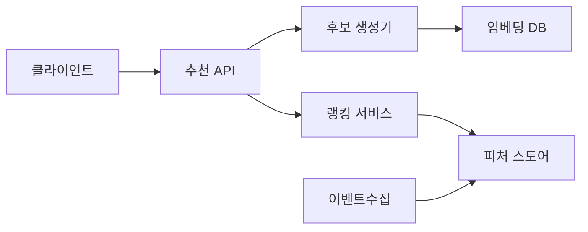

> **한 줄 요약**: 추천 시스템의 핵심은 협업 필터링으로 숨겨진 취향을 발굴하고, 2단계 파이프라인(후보 생성 → 정밀 랭킹)으로 수억 개 상품을 100ms 안에 걸러내며, 콜드 스타트와 인기 편향을 동시에 해결하는 것이다.

## 실제 문제: 추천 정확도와 매출의 직접적 관계

아마존 매출의 35%가 추천에서 발생하고, 넷플릭스 시청의 80%가 추천 기반입니다. 쿠팡의 맞춤 추천은 첫 화면 CTR을 비추천 대비 3배 높이고, 네이버쇼핑 개인화 피드는 구매 전환율을 2.5배 개선했습니다.

추천 시스템이 해결해야 할 핵심 문제:
- **콜드 스타트**: 신규 사용자·신규 상품은 데이터가 없어 추천 불가
- **인기 편향**: 항상 베스트셀러만 추천하면 롱테일 상품 판매 기회 소실
- **실시간성**: 방금 본 상품이 즉시 다음 추천에 반영되어야 함
- **규모**: 사용자 수천만 명 × 상품 수억 개에서 100ms 안에 결과 반환

---

## 설계 의사결정 로드맵

### 결정 1: 추천 알고리즘 — 협업 필터링 vs 콘텐츠 기반 vs 하이브리드

| 후보 | 장점 | 단점 | 언제 적합 |
|------|------|------|----------|
| 협업 필터링 (CF) | 숨겨진 취향 발굴 | 콜드 스타트 취약 | 충분한 행동 데이터가 있을 때 |
| 콘텐츠 기반 (CB) | 신규 상품 즉시 추천 가능 | Filter Bubble, 메타데이터 의존 | 신규 상품·사용자가 많을 때 |
| 하이브리드 (CF + CB) | 콜드 스타트 보완, 정확도+다양성 | 구현 복잡도, 가중치 튜닝 필요 | 대규모 이커머스 표준 |

**우리의 선택: 하이브리드 (행동 기반 CF + 상품 속성 CB)**
- 신규 사용자에게는 CB로 시작하고, 행동 로그가 쌓이면 CF 비중을 올린다. CF만 쓰면 가입 첫 1주일간 개인화가 전혀 안 되고, CB만 쓰면 운동화를 산 사람에게 항상 운동화만 추천하는 필터 버블이 생긴다.

### 결정 2: 서빙 아키텍처 — 배치 사전계산 vs 실시간 추론 vs 2단계 파이프라인

| 후보 | 장점 | 단점 | 언제 적합 |
|------|------|------|----------|
| 배치 사전계산 | 서빙 레이턴시 최소 | 실시간 반영 불가 | DAU 소규모, 실시간성 불필요 |
| 실시간 추론 | 최신 컨텍스트 반영 | GPU 비용 급증 | 소규모, 상품 수 적을 때 |
| 2단계 파이프라인 | 규모+실시간 동시 달성 | 구현 복잡도 | 대규모 이커머스 표준 |

**우리의 선택: 2단계 파이프라인 (배치 후보 생성 + 실시간 정밀 랭킹)**
- 1단계에서 수억 개 상품을 수천 개로 줄이는 것은 배치로 사전계산하고, 2단계에서 수천 개를 실시간 정밀 스코어링한다. 1억 개 상품에 딥러닝을 실시간으로 돌리면 요청 1건에 100초가 걸린다.

배치로 임베딩을 갱신하면 신규 상품이 CF 후보에서 제외됩니다. 신규 상품은 CB 임베딩을 실시간으로 생성해 ANN 인덱스에 인크리멘탈 추가하고, CF 임베딩은 다음 배치에서 갱신합니다.

### 결정 3: 피처 스토어 — 인메모리 vs Redis vs 전용 피처 스토어

| 후보 | 장점 | 단점 | 언제 적합 |
|------|------|------|----------|
| 인메모리 (JVM 캐시) | 레이턴시 최소 (<1ms) | 서버 재시작 시 소실 | 단일 서버, 소규모 |
| Redis | 분산 공유, 빠름 (<5ms) | 대용량 비용, TTL 만료 시 콜드 | 중간 규모 표준 |
| 전용 피처 스토어 (Feast) | 학습-서빙 일관성 | 운영 복잡도 급증 | 대규모, ML 팀 분리 |

**우리의 선택: Redis (온라인 피처) + Offline 배치 파이프라인**
- Redis Hash에 사용자별 최근 조회 카테고리, 상품별 실시간 인기도를 저장한다. 랭킹 모델이 MySQL에서 직접 읽으면 QPS 1만에서 DB 쿼리 1억 건이 발생한다.

### 결정 4: A/B 테스트 — 단순 랜덤 vs MAB vs 인터리빙

| 후보 | 장점 | 단점 | 언제 적합 |
|------|------|------|----------|
| 단순 랜덤 A/B | 통계 해석 쉬움 | 나쁜 변형에 트래픽 낭비 | 변형 수 적고 실험 기간 충분할 때 |
| MAB | 좋은 변형에 트래픽 자동 집중 | 통계적 유의성 보장 어려움 | 변형 많고 빠른 수렴 필요 |
| 인터리빙 | 소규모 트래픽으로 빠른 판정 | 해석 복잡 | 랭킹 품질 비교 특화 |

**우리의 선택: 단순 A/B (기본) + MAB (다변형 동시 실험)**
- 주요 변경은 A/B로 2주 실험한다. 파라미터 튜닝처럼 변형이 5개 이상이면 Thompson Sampling MAB로 빠르게 수렴한다.

---

## 1. 요구사항 분석 및 규모 추정

### 기능 요구사항

1. **개인화 추천**: 사용자별 메인 피드, 상품 상세 페이지 하단 "관련 상품"
2. **실시간 반영**: 방금 조회·구매한 상품이 즉시 다음 추천에 반영
3. **콜드 스타트 처리**: 신규 가입 사용자와 신규 등록 상품 즉시 추천 가능
4. **다양성 보장**: 동일 카테고리 상품이 추천 목록을 독점하지 않도록 제어
5. **A/B 실험 인프라**: 알고리즘별 CTR·CVR·매출 지표 실시간 측정

### 비기능 요구사항

- **레이턴시**: 추천 API P99 < 100ms
- **처리량**: 피크 QPS 50,000
- **가용성**: 99.99% (추천 불가 시 베스트셀러 폴백)
- **신선도**: 사용자 행동 이벤트 반영 시간 < 5분

### 규모 추정

```
MAU: 3,000만 명 / DAU: 500만 명 / 상품 수: 5억 개
피크 QPS: 50,000
사용자 행동 이벤트: 초당 200,000건
추천 후보 풀: 사용자당 2,000개 → 랭킹 후 20개
피처 스토어: 3,000만 사용자 × 피처 50개 × 8byte = 약 12GB (Redis)
```

---

## 2. 고수준 아키텍처

2단계 파이프라인을 도서관 사서에 비유하면: 손님 취향에 맞는 후보 수백 권을 빠르게 추립니다(1단계: 후보 생성). 그다음 최근 대출 기록, 별점 패턴을 보고 최종 10권을 고릅니다(2단계: 정밀 랭킹).



**각 컴포넌트 역할:**

- **후보 생성기**: 5억 개 상품 → 2,000개로 압축 (ANN 벡터 검색)
- **랭킹 서비스**: 2,000개 → 20개로 정밀 스코어링 (실시간 ML 모델)
- **임베딩 DB**: 상품·사용자 벡터 저장 (Faiss / Pinecone)
- **피처 스토어**: 실시간 피처 제공 (Redis)
- **이벤트수집**: Kafka 이벤트 스트림으로 피처 스토어 실시간 반영

---

## 3. 핵심 컴포넌트 상세 설계

### 3-1. 후보 생성 (Candidate Generation)

목표는 수억 개 상품에서 관련성 높은 수천 개를 빠르게 추리는 것입니다. 정확도보다 재현율(Recall)이 중요합니다.

**임베딩 + ANN**: 사용자와 상품을 동일한 벡터 공간에 임베딩하고, HNSW 알고리즘으로 코사인 유사도가 높은 상품을 밀리초 안에 검색합니다.

```python
# 암묵적 피드백 (조회=1, 구매=5, 장바구니=2 가중치)
model = als.AlternatingLeastSquares(factors=128, regularization=0.1, iterations=20)
model.fit(user_item_matrix)

candidate_ids, scores = model.recommend(user_id, user_item_matrix[user_id], N=2000)
```

**다중 소스 후보 생성:**

| 소스 | 방법 | 후보 수 |
|------|------|--------|
| CF 임베딩 | ANN 벡터 검색 | 1,000개 |
| 최근 조회 기반 | Item-to-Item 유사도 | 500개 |
| 인기 상품 | 카테고리별 실시간 랭킹 | 200개 |
| 신상품 탐색 | 랜덤 샘플링 | 300개 |

```java
@Service
public class CandidateGeneratorService {

    public List<Long> generateCandidates(long userId, UserContext ctx) {
        CompletableFuture<List<Long>> cfFuture = CompletableFuture
            .supplyAsync(() -> embeddingClient.searchSimilarItems(userId, 1000), executor)
            .exceptionally(ex -> Collections.emptyList());

        CompletableFuture<List<Long>> itemSimFuture = CompletableFuture
            .supplyAsync(() -> itemSimClient.getSimilarToRecent(ctx.getRecentItemIds(), 500), executor)
            .exceptionally(ex -> Collections.emptyList());

        CompletableFuture<List<Long>> trendingFuture = CompletableFuture
            .supplyAsync(() -> trendingClient.getTopByCategory(ctx.getPreferredCategories(), 300), executor)
            .exceptionally(ex -> Collections.emptyList());

        Set<Long> candidates = new LinkedHashSet<>();
        try { candidates.addAll(cfFuture.get(50, TimeUnit.MILLISECONDS)); } catch (Exception e) {}
        try { candidates.addAll(itemSimFuture.get(30, TimeUnit.MILLISECONDS)); } catch (Exception e) {}
        try { candidates.addAll(trendingFuture.get(20, TimeUnit.MILLISECONDS)); } catch (Exception e) {}

        candidates.removeAll(ctx.getPurchasedItemIds());
        return new ArrayList<>(candidates);
    }
}
```

### 3-2. 정밀 랭킹 (Ranking)

후보 2,000개에 구매 확률을 예측하는 딥러닝 모델을 적용합니다.

```python
@app.post("/rank")
async def rank_candidates(request: RankRequest):
    pipe = r.pipeline()
    for item_id in request.candidate_ids:
        pipe.hgetall(f"item_feature:{item_id}")
    item_features = pipe.execute()

    user_feature = r.hgetall(f"user_feature:{request.user_id}")
    features = build_feature_tensor(user_feature, item_features)

    with torch.no_grad():
        scores = model(features).squeeze().tolist()

    ranked = sorted(zip(request.candidate_ids, scores), key=lambda x: x[1], reverse=True)
    return {"items": [item_id for item_id, _ in ranked[:20]]}
```

**랭킹 모델 구조 (Wide & Deep):**
- Wide 파트: 교차 피처의 메모리 (카테고리 일치 여부 등 sparse feature)
- Deep 파트: 임베딩 + MLP (dense feature의 일반화)
- 출력: 구매 확률 (0~1)

### 3-3. 재랭킹 (Re-ranking)

정밀 랭킹 결과를 그대로 보여주면 동일 브랜드 상품이 상위 20개를 독점합니다.

```java
@Service
public class ReRankingService {

    private static final int MAX_SAME_CATEGORY = 3;
    private static final int MAX_SAME_BRAND = 2;

    public List<RecommendItem> reRank(List<ScoredItem> rankedItems) {
        List<RecommendItem> result = new ArrayList<>();
        Map<String, Integer> categoryCount = new HashMap<>();
        Map<String, Integer> brandCount = new HashMap<>();

        for (ScoredItem item : rankedItems) {
            if (result.size() >= 20) break;
            if (categoryCount.getOrDefault(item.getCategory(), 0) >= MAX_SAME_CATEGORY) continue;
            if (brandCount.getOrDefault(item.getBrand(), 0) >= MAX_SAME_BRAND) continue;
            if (!item.isInStock()) continue;

            result.add(item.toRecommendItem());
            categoryCount.merge(item.getCategory(), 1, Integer::sum);
            brandCount.merge(item.getBrand(), 1, Integer::sum);
        }
        return result;
    }
}
```

### 3-4. 콜드 스타트 해결

**신규 사용자 3단계:**

```
1단계 (행동 0건): 인구통계 기반 관심 카테고리 + 지역 기반 인기 상품
2단계 (행동 1~10건): 세션 기반 CF, Item-to-Item 유사도
3단계 (행동 10건 이상): 사용자 임베딩 생성 → 표준 CF 파이프라인으로 전환
```

**신규 상품**: 구매 이력이 없으므로 상품 속성(카테고리, 브랜드, 가격대, 텍스트)으로 콘텐츠 임베딩을 생성해 ANN 인덱스에 인크리멘탈 추가합니다.

### 3-5. 실시간 피처 파이프라인

```
클릭 이벤트 → Kafka (user.behavior) → Flink 스트림 처리 → Redis 피처 업데이트
```

Flink에서 사용자별 최근 1시간 조회 카테고리를 슬라이딩 윈도우로 집계해 Redis에 기록합니다. 클릭 후 5분 안에 추천에 반영됩니다.

---

## 4. 장애 시나리오와 대응

### 시나리오 1: 블랙프라이데이 QPS 10배 폭증

ML 랭킹 서버가 GPU 100%에 도달하고 레이턴시가 3초로 치솟습니다.

```
1차: 랭킹 모델 경량화 — Wide&Deep → LightGBM으로 자동 전환
2차: 후보 수 축소 — 2,000개 → 500개 (레이턴시 60% 감소)
3차: 배치 캐시 서빙 — 4시간 전 배치 결과 즉시 반환
4차: 폴백 — 카테고리별 베스트셀러 20개 반환
```

```java
@CircuitBreaker(name = "rankingService", fallbackMethod = "getFallbackRecommendations")
public List<Long> getRankedItems(long userId, List<Long> candidates) {
    return rankingClient.rank(userId, candidates);
}

public List<Long> getFallbackRecommendations(long userId, List<Long> candidates, Throwable t) {
    List<Long> cached = redisCache.get("batch_rec:" + userId);
    return cached != null ? cached : bestSellerCache.getTop20();
}
```

### 시나리오 2: 임베딩 DB 장애

Faiss 클러스터가 OOM으로 다운되면 후보 생성 불가로 전체 서비스가 블록됩니다.

- Active-Standby 이중화. 장애 감지 10초, 페일오버 30초.
- 페일오버 기간 동안 Redis에 저장된 precomputed Item-to-Item 유사도만으로 후보 생성.
- 임베딩 인덱스는 S3에 매시간 스냅샷 → 30분 내 재적재 가능.

### 시나리오 3: 피처 스토어 데이터 오염

Flink 파이프라인 버그로 사용자 피처가 다른 사용자 ID에 기록되면 엉뚱한 상품이 추천됩니다.

- 피처 값에 사용자 ID 해시 checksum 저장 후 랭킹 서버가 조회 시 검증.
- 오염 감지 시 해당 키 TTL을 즉시 0으로 설정, 콜드 스타트 폴백 경로 활성화.

---

## 5. 확장 포인트

**ANN 인덱스 메모리 한계**: 5억 상품 × 128차원 × 4byte = 256GB. IVF+PQ 압축으로 벡터당 메모리를 1/32로 줄이거나(256GB → 8GB), 카테고리별 인덱스 샤딩으로 해결합니다.

**멀티 목적 최적화**: 서비스가 성숙하면 단기 매출(CVR) 외에 사용자 만족도, 판매자 공정성, 마진 최적화를 동시에 최적화합니다. 가중치는 A/B 실험으로 튜닝합니다.

**세션 기반 추천**: Transformer 기반 SASRec 모델이 "지금 이 세션에서 무엇을 사려는가"를 파악합니다. 현재 세션의 클릭 시퀀스로 다음 클릭을 예측합니다.

---

## 면접 포인트

<details>
<summary><strong>Q. 콜드 스타트를 어떻게 해결하나요?</strong></summary>

신규 사용자: 인구통계 + 세션 CF. 신규 상품: 콘텐츠 임베딩을 실시간 생성해 ANN 인덱스에 추가합니다. 행동 데이터가 쌓이면 CF 비중을 점진적으로 올립니다.

</details>

<details>
<summary><strong>Q. 5억 상품을 100ms 안에 어떻게 처리하나요?</strong></summary>

2단계 파이프라인을 씁니다. 1단계에서 ANN으로 2,000개로 압축하고, 2단계에서 실시간 ML 모델로 정밀 스코어링합니다. 1억 개 상품에 딥러닝을 실시간으로 돌리면 요청 1건에 100초가 걸립니다.

</details>

<details>
<summary><strong>Q. 인기 편향은 어떻게 방지하나요?</strong></summary>

후보 생성 단계에서 신상품 랜덤 샘플링 소스를 추가하고, 재랭킹 단계에서 동일 카테고리 최대 3개, 동일 브랜드 최대 2개로 다양성 필터를 적용합니다.

</details>

<details>
<summary><strong>Q. 피처 스토어가 왜 필요한가요?</strong></summary>

랭킹 모델이 피처를 MySQL에서 직접 읽으면 QPS 1만에서 DB 쿼리 1억 건이 발생합니다. Redis로 피처를 격리해야 DB를 지킬 수 있습니다.

</details>

<details>
<summary><strong>Q. 추천 품질을 어떻게 측정하나요?</strong></summary>

오프라인: 정밀도/재현율/NDCG. 온라인: CTR/CVR/매출 A/B 실험. 새 알고리즘은 반드시 통계적 유의성 검증 후 전체 배포합니다.

</details>

<details>
<summary><strong>Q. 모델 학습 주기는 어떻게 되나요?</strong></summary>

임베딩은 매일 배치 학습합니다. 랭킹 모델은 매주 배치 학습하고, 그 사이에는 실시간 피처로 점수를 보정합니다.

</details>

**피해야 할 함정:**
- "딥러닝 모델 하나로 5억 개 상품 실시간 스코어링" → 규모 감각 없다는 신호
- 콜드 스타트 언급 안 함 → 실용적 설계 경험 없다는 신호
- A/B 테스트 없이 "알고리즘 바꾸면 됩니다" → 데이터 기반 의사결정 문화를 모른다는 신호
