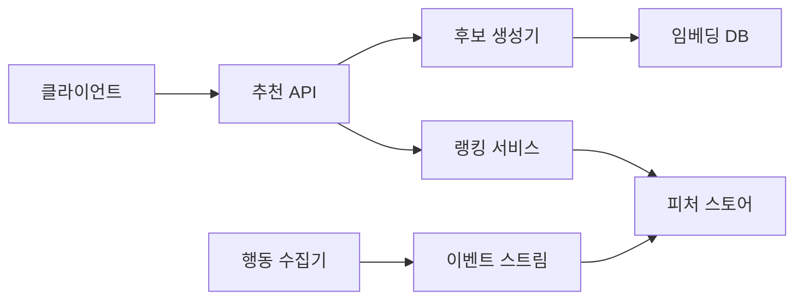

> **한 줄 요약**: 추천 시스템의 핵심은 협업 필터링으로 숨겨진 취향을 발굴하고, 2단계 파이프라인(후보 생성 → 정밀 랭킹)으로 수억 개 상품을 100ms 안에 걸러내며, 콜드 스타트와 인기 편향을 동시에 해결하는 것이다.

## 실제 문제: 추천 정확도와 매출의 직접적 관계

아마존 전체 매출의 **35%는 추천 시스템이 만들어냅니다.** "이 상품을 구매한 고객이 함께 구매한 상품"이라는 단 한 줄의 UI가 연간 수십조 원의 매출을 책임집니다. 넷플릭스는 사용자가 시청하는 콘텐츠의 80%가 추천을 통해 발견된다고 밝혔습니다.

국내로 눈을 돌리면, **쿠팡**의 "로켓배송 맞춤 추천"은 첫 화면 클릭률(CTR)을 비추천 대비 3배 높이고, **네이버쇼핑** 개인화 피드는 구매 전환율을 2.5배 개선했습니다. **당근마켓**은 지역 기반 추천으로 "내 주변 관심 카테고리" 상품을 보여줌으로써 채팅 연결률을 40% 끌어올렸습니다.

추천 시스템이 해결해야 할 핵심 문제:
- **콜드 스타트**: 신규 사용자·신규 상품은 데이터가 없어 추천이 불가능
- **인기 편향(Popularity Bias)**: 항상 베스트셀러만 추천하면 롱테일 상품 판매 기회 소실
- **실시간성**: 방금 본 상품, 방금 구매한 상품이 즉시 다음 추천에 반영되어야 함
- **규모**: 사용자 수천만 명 × 상품 수억 개 조합에서 100ms 안에 결과 반환
- **다양성**: 취향에 맞지만 너무 유사한 상품만 추천하면 사용자가 지루함을 느낌

---

## 설계 의사결정 로드맵

추천 시스템 설계에서 순서대로 답해야 할 핵심 결정 4가지입니다. 각 결정에서 "왜 이 선택인가"를 명확히 하지 않으면 면접에서 "그냥 베스트셀러 보여주면 되지 않나요?"라는 후속 질문에 답할 수 없습니다.

### 결정 1: 추천 알고리즘 — 협업 필터링 vs 콘텐츠 기반 vs 하이브리드

**문제**: 사용자 A에게 어떤 기준으로 상품을 추천할 것인가?

| 후보 | 장점 | 단점 | 언제 적합 |
|------|------|------|----------|
| 협업 필터링 (CF) | 상품 메타데이터 불필요, 숨겨진 취향 발굴 | 콜드 스타트 취약, 희소 행렬 문제 | 충분한 행동 데이터가 있을 때 |
| 콘텐츠 기반 (CB) | 신규 상품 즉시 추천 가능, 설명 가능 | 탐색 제한(Filter Bubble), 메타데이터 의존 | 신규 상품·사용자가 많을 때 |
| 하이브리드 (CF + CB) | 콜드 스타트 보완, 정확도+다양성 동시 | 구현 복잡도, 가중치 튜닝 필요 | 대규모 이커머스 표준 |

**우리의 선택: 하이브리드 (행동 기반 CF + 상품 속성 CB)**
- 이유: 신규 사용자에게는 상품 카테고리·태그 기반 CB로 시작하고, 행동 로그(조회·구매·장바구니)가 쌓이면 CF 비중을 올린다. 두 점수를 가중 합산하여 콜드 스타트와 인기 편향을 동시에 완화한다.
- 안 하면: CF만 쓰면 신규 가입 후 첫 1주일 동안 베스트셀러 외에 개인화가 전혀 안 된다. CB만 쓰면 운동화를 산 사람에게 항상 운동화만 추천하는 필터 버블이 생긴다.

### 결정 2: 서빙 아키텍처 — 배치 사전계산 vs 실시간 추론 vs 2단계 파이프라인

**문제**: 추천 결과를 언제, 어떻게 계산하는가?

| 후보 | 장점 | 단점 | 언제 적합 |
|------|------|------|----------|
| 배치 사전계산 | 서빙 레이턴시 최소, 구현 단순 | 실시간 반영 불가, 스토리지 대용량 필요 | DAU 소규모, 실시간성 불필요 |
| 실시간 추론 | 최신 컨텍스트 반영 | GPU 비용 급증, 수억 상품 실시간 스코어링 불가 | 소규모, 상품 수 적을 때 |
| 2단계 파이프라인 | 규모+실시간 동시 달성, 비용 최적화 | 구현 복잡도, 두 단계 일관성 관리 | 대규모 이커머스 표준 |

**우리의 선택: 2단계 파이프라인 (배치 후보 생성 + 실시간 정밀 랭킹)**
- 이유: 1단계에서 수억 개 상품을 수천 개로 줄이는 것은 배치로 사전계산한다. 2단계에서 수천 개를 실시간으로 정밀 스코어링한다. YouTube, 쿠팡, 넷플릭스가 모두 이 구조를 씁니다.
- 안 하면: 1억 개 상품에 딥러닝 모델을 실시간으로 돌리면 요청 1건에 100초가 걸린다. 사전계산만 하면 1시간 전에 본 상품이 아직 추천 목록에 남아 있다.

### 결정 3: 피처 스토어 — 인메모리 vs Redis vs 전용 피처 스토어

**문제**: 추천 모델이 필요한 피처(사용자 최근 조회, 상품 인기도, 구매 이력)를 어디서 빠르게 읽어오는가?

| 후보 | 장점 | 단점 | 언제 적합 |
|------|------|------|----------|
| 인메모리 (JVM 캐시) | 레이턴시 최소 (<1ms) | 서버 재시작 시 소실, 분산 공유 불가 | 단일 서버, 소규모 |
| Redis | 분산 공유, 빠름 (<5ms), 운영 친숙 | 대용량 피처 비용, TTL 만료 시 콜드 | 중간 규모 표준 |
| 전용 피처 스토어 (Feast/Tecton) | 온라인/오프라인 피처 통합, 학습-서빙 일관성 | 운영 복잡도 급증, 도입 비용 | 대규모, ML 팀 분리된 조직 |

**우리의 선택: Redis (온라인 피처) + Offline 배치 파이프라인**
- 이유: Redis Hash에 사용자별 최근 조회 카테고리, 상품별 실시간 인기도를 저장한다. TTL을 24시간으로 설정해 스토리지를 관리한다. 전용 피처 스토어는 팀 규모가 커지면 도입한다.
- 안 하면: 랭킹 모델이 피처를 MySQL에서 직접 읽으면 QPS 1만에서 DB에 쿼리 1억 건이 발생한다. 추천 서비스가 DB를 죽인다.

### 결정 4: A/B 테스트 — 단순 랜덤 vs MAB vs 인터리빙

**문제**: 새 추천 알고리즘이 기존보다 좋은지 어떻게 검증하는가?

| 후보 | 장점 | 단점 | 언제 적합 |
|------|------|------|----------|
| 단순 랜덤 A/B | 구현 단순, 통계 해석 쉬움 | 나쁜 변형에 트래픽 낭비, 수렴 느림 | 변형 수 적고 실험 기간 충분할 때 |
| MAB (Multi-Armed Bandit) | 좋은 변형에 트래픽 자동 집중, 후회 최소화 | 통계적 유의성 보장 어려움, 계절성 취약 | 변형 많고 빠른 수렴 필요 |
| 인터리빙 | 소규모 트래픽으로 빠른 승패 판정, 위치 편향 제거 | 개별 알고리즘 A/B 대비 해석 복잡 | 랭킹 품질 비교 특화 |

**우리의 선택: 단순 A/B (기본) + MAB (다변형 동시 실험)**
- 이유: 주요 알고리즘 변경은 통계적 엄밀성을 위해 A/B로 2주 실험한다. 파라미터 튜닝(가중치, 임계값)처럼 변형이 5개 이상인 경우에는 Thompson Sampling MAB로 좋은 변형에 빠르게 수렴한다.
- 안 하면: 새 알고리즘이 실제로는 나쁜데 통계 검증 없이 전체 배포하면 CTR 5% 하락 → 일 매출 수십억 원 손실이 발생한다.

---

## 1. 요구사항 분석 및 규모 추정

### 기능 요구사항

1. **개인화 추천**: 사용자별 메인 피드, 상품 상세 페이지 하단 "관련 상품"
2. **실시간 반영**: 방금 조회·구매한 상품이 즉시 다음 추천에서 제외 또는 유사 상품 노출
3. **콜드 스타트 처리**: 신규 가입 사용자와 신규 등록 상품 모두 즉시 추천 가능
4. **다양성 보장**: 동일 카테고리 상품이 추천 목록을 독점하지 않도록 제어
5. **A/B 실험 인프라**: 알고리즘별 CTR·CVR·매출 지표 실시간 측정

### 비기능 요구사항

- **레이턴시**: 추천 API P99 < 100ms
- **처리량**: 피크 QPS 50,000 (블랙프라이데이 기준)
- **가용성**: 99.99% (추천 불가 시 폴백으로 베스트셀러 제공)
- **신선도**: 사용자 행동 이벤트가 추천에 반영되는 시간 < 5분

### 규모 추정

```
MAU: 3,000만 명 (쿠팡급)
DAU: 500만 명
상품 수: 5억 개
하루 추천 요청: 500만 × 페이지뷰 20회 = 1억 건
피크 QPS: 1억 / 86,400 × 5(피크 배율) ≈ 5,800 → 안전 마진 포함 50,000 QPS
사용자 행동 이벤트: 초당 200,000건 (클릭·구매·조회 합산)
추천 후보 풀: 사용자당 2,000개 (1단계 출력) → 랭킹 후 20개 (2단계 출력)
피처 스토어 크기: 3,000만 사용자 × 피처 50개 × 8byte = 약 12GB (Redis)
```

---

## 2. 고수준 아키텍처

추천 시스템을 **도서관 사서**에 비유하면 이해가 쉽습니다. 손님이 "요리책 추천해줘"라고 하면 사서는 먼저 요리 코너 전체(수억 권) 중 이 손님 취향에 맞는 후보 수백 권을 빠르게 추립니다(1단계: 후보 생성). 그다음 손님의 최근 대출 기록, 별점 패턴을 보고 최종 10권을 고릅니다(2단계: 정밀 랭킹). 이것이 2단계 파이프라인의 본질입니다.



**각 컴포넌트 역할:**

- **추천 API**: 요청 라우팅, 사용자 컨텍스트 조립, 폴백 제어
- **후보 생성기**: 5억 개 상품 → 2,000개로 압축 (ANN 벡터 검색)
- **랭킹 서비스**: 2,000개 → 20개로 정밀 스코어링 (실시간 ML 모델)
- **임베딩 DB**: 상품·사용자 벡터 저장 (Faiss / Pinecone)
- **피처 스토어**: 실시간 피처 제공 (Redis)
- **행동 수집기**: 클릭·구매·조회 이벤트 수집
- **이벤트 스트림**: Kafka, 피처 스토어로 실시간 반영

---

## 3. 핵심 컴포넌트 상세 설계

### 3-1. 후보 생성 (Candidate Generation)

후보 생성의 목표는 **수억 개 상품에서 관련성 높은 수천 개를 빠르게 추립니다.** 정확도보다 재현율(Recall)이 중요합니다. 좋은 상품을 놓치면 랭킹 단계에서 살릴 방법이 없습니다.

**핵심 기법: 임베딩 + 근사 최근접 이웃 탐색 (ANN)**

사용자와 상품을 동일한 벡터 공간에 임베딩합니다. 사용자 벡터와 코사인 유사도가 높은 상품 벡터를 ANN 인덱스(HNSW 알고리즘)로 밀리초 안에 검색합니다.

**코사인 유사도 공식:**

```
cos(u, i) = (u · i) / (||u|| × ||i||)
```

여기서 `u`는 사용자 임베딩 벡터, `i`는 상품 임베딩 벡터입니다. 값이 1에 가까울수록 취향이 일치합니다.

**Matrix Factorization으로 임베딩 학습:**

```python
# 행동 행렬 R (사용자 × 상품) 분해
# R ≈ U × V^T
# U: 사용자 임베딩 (3천만 × 128차원)
# V: 상품 임베딩 (5억 × 128차원)

import numpy as np
from implicit import als

# 암묵적 피드백 (조회=1, 구매=5, 장바구니=2 가중치)
model = als.AlternatingLeastSquares(
    factors=128,
    regularization=0.1,
    iterations=20
)
model.fit(user_item_matrix)  # scipy sparse matrix

# 사용자 u의 상위 2000개 후보 검색
user_vector = model.user_factors[user_id]
candidate_ids, scores = model.recommend(
    user_id, user_item_matrix[user_id], N=2000
)
```

**다중 소스 후보 생성:**

단일 알고리즘에 의존하지 않고 여러 소스에서 후보를 모아 다양성을 높입니다.

| 소스 | 방법 | 후보 수 |
|------|------|--------|
| CF 임베딩 | ANN 벡터 검색 | 1,000개 |
| 최근 조회 기반 | Item-to-Item 유사도 | 500개 |
| 인기 상품 | 카테고리별 실시간 랭킹 | 200개 |
| 신상품 탐색 | 랜덤 샘플링 | 300개 |

```java
// Spring Boot - 후보 생성기 통합
@Service
public class CandidateGeneratorService {

    private final EmbeddingSearchClient embeddingClient;
    private final ItemSimilarityClient itemSimClient;
    private final TrendingItemClient trendingClient;

    public List<Long> generateCandidates(long userId, UserContext ctx) {
        // 병렬 후보 생성
        CompletableFuture<List<Long>> cfFuture =
            CompletableFuture.supplyAsync(() ->
                embeddingClient.searchSimilarItems(userId, 1000));

        CompletableFuture<List<Long>> itemSimFuture =
            CompletableFuture.supplyAsync(() ->
                itemSimClient.getSimilarToRecent(ctx.getRecentItemIds(), 500));

        CompletableFuture<List<Long>> trendingFuture =
            CompletableFuture.supplyAsync(() ->
                trendingClient.getTopByCategory(ctx.getPreferredCategories(), 300));

        // 합집합으로 중복 제거
        Set<Long> candidates = new LinkedHashSet<>();
        candidates.addAll(cfFuture.get(50, TimeUnit.MILLISECONDS));
        candidates.addAll(itemSimFuture.get(30, TimeUnit.MILLISECONDS));
        candidates.addAll(trendingFuture.get(20, TimeUnit.MILLISECONDS));

        // 이미 구매한 상품 제거
        candidates.removeAll(ctx.getPurchasedItemIds());
        return new ArrayList<>(candidates);
    }
}
```

### 3-2. 정밀 랭킹 (Ranking)

랭킹 단계에서는 후보 2,000개에 **구매 확률을 예측하는 딥러닝 모델**을 적용합니다. 정확도가 핵심입니다.

**피처 엔지니어링:**

랭킹 모델은 세 종류의 피처를 조합합니다.

```
사용자 피처:
  - 최근 7일 조회 카테고리 분포 (Redis)
  - 평균 구매 가격대 (Redis)
  - 접속 디바이스, 시간대 (실시간)

상품 피처:
  - 카테고리, 브랜드, 가격 (DB 캐시)
  - 최근 1시간 CTR, CVR (Redis 실시간)
  - 재고 상태, 배송 속도 (DB)

교차 피처 (Cross Feature):
  - 사용자 선호 가격대 × 상품 가격 차이
  - 사용자 최근 조회 카테고리 × 상품 카테고리 일치 여부
```

**Python ML 서빙 (FastAPI):**

```python
from fastapi import FastAPI
import torch
import redis
import json

app = FastAPI()
model = torch.jit.load("ranking_model.pt")  # TorchScript 모델
r = redis.Redis(host="redis-cluster", decode_responses=True)

@app.post("/rank")
async def rank_candidates(request: RankRequest):
    user_id = request.user_id
    candidate_ids = request.candidate_ids

    # Redis에서 피처 배치 조회 (파이프라인으로 RTT 1회)
    pipe = r.pipeline()
    for item_id in candidate_ids:
        pipe.hgetall(f"item_feature:{item_id}")
    item_features = pipe.execute()

    user_feature = r.hgetall(f"user_feature:{user_id}")

    # 피처 텐서 조립
    features = build_feature_tensor(user_feature, item_features)

    # 구매 확률 예측
    with torch.no_grad():
        scores = model(features).squeeze().tolist()

    # (item_id, score) 정렬 후 상위 20개 반환
    ranked = sorted(
        zip(candidate_ids, scores),
        key=lambda x: x[1],
        reverse=True
    )
    return {"items": [item_id for item_id, _ in ranked[:20]]}
```

**랭킹 모델 구조 (Wide & Deep):**

```
Wide 파트: 교차 피처의 메모리 (카테고리 일치 여부 등 sparse feature)
Deep 파트: 임베딩 + MLP (dense feature의 일반화)
출력: 구매 확률 (0~1, binary cross-entropy 학습)
```

### 3-3. 재랭킹 (Re-ranking)

정밀 랭킹 결과를 그대로 보여주면 **동일 브랜드 상품이 상위 20개를 독점**하는 문제가 발생합니다. 재랭킹 단계에서 다양성과 비즈니스 규칙을 적용합니다.

```java
@Service
public class ReRankingService {

    // 최대 동일 카테고리 3개, 최대 동일 브랜드 2개
    private static final int MAX_SAME_CATEGORY = 3;
    private static final int MAX_SAME_BRAND = 2;

    public List<RecommendItem> reRank(List<ScoredItem> rankedItems) {
        List<RecommendItem> result = new ArrayList<>();
        Map<String, Integer> categoryCount = new HashMap<>();
        Map<String, Integer> brandCount = new HashMap<>();

        for (ScoredItem item : rankedItems) {
            if (result.size() >= 20) break;

            String cat = item.getCategory();
            String brand = item.getBrand();

            // 다양성 필터
            if (categoryCount.getOrDefault(cat, 0) >= MAX_SAME_CATEGORY) continue;
            if (brandCount.getOrDefault(brand, 0) >= MAX_SAME_BRAND) continue;

            // 재고 없는 상품 제외
            if (!item.isInStock()) continue;

            result.add(item.toRecommendItem());
            categoryCount.merge(cat, 1, Integer::sum);
            brandCount.merge(brand, 1, Integer::sum);
        }

        return result;
    }
}
```

### 3-4. 콜드 스타트 해결

콜드 스타트는 **첫 날 영업을 시작한 신규 매장에 손님을 어떻게 보낼 것인가**와 같은 문제입니다. 데이터가 없으니 개인화는 불가능하고, 그렇다고 베스트셀러만 보여주면 이탈합니다.

**신규 사용자 콜드 스타트 3단계:**

```
1단계 (가입 직후, 행동 0건):
  - 인구통계 기반: 가입 시 선택한 관심 카테고리 → 카테고리 인기 상품
  - 지역 기반: IP 위치 → 지역 인기 상품 (당근마켓 방식)

2단계 (행동 1~10건):
  - 세션 기반 CF: 현재 세션에서 본 상품과 유사한 상품
  - Item-to-Item: "이 상품을 본 사람이 함께 본 상품"

3단계 (행동 10건 이상):
  - 사용자 임베딩 생성 가능 → 표준 CF 파이프라인으로 전환
```

**신규 상품 콜드 스타트:**

```python
def get_new_item_embedding(item_metadata: dict) -> np.ndarray:
    """
    신규 상품은 구매 이력이 없으므로
    상품 속성(카테고리, 브랜드, 가격대, 텍스트)으로
    콘텐츠 임베딩을 생성한다.
    """
    text = f"{item_metadata['name']} {item_metadata['description']}"
    text_embedding = sentence_encoder.encode(text)  # 384차원

    category_vec = category_embedding[item_metadata['category']]
    price_bucket = np.array([get_price_bucket(item_metadata['price'])])

    # 이종 피처 결합
    return np.concatenate([text_embedding, category_vec, price_bucket])
```

### 3-5. 실시간 피처 파이프라인

사용자가 상품을 클릭한 순간부터 **5분 안에 그 행동이 추천에 반영**되어야 합니다. 이것이 실시간 파이프라인의 요구사항입니다.

```
클릭 이벤트 발생
    → Kafka 토픽 (user.behavior)
    → Flink 스트림 처리 (슬라이딩 윈도우 집계)
    → Redis 피처 업데이트
    → 다음 추천 요청에서 신선한 피처 사용
```

**Flink 스트림 처리 예시:**

```python
# 사용자별 최근 1시간 조회 카테고리 집계
env = StreamExecutionEnvironment.get_execution_environment()

click_stream = env.from_kafka("user.behavior")

user_category_counts = (
    click_stream
    .filter(lambda e: e.event_type == "click")
    .key_by(lambda e: e.user_id)
    .window(SlidingEventTimeWindows.of(
        Time.hours(1), Time.minutes(5)))
    .aggregate(CategoryCountAggregator())
)

# Redis에 결과 기록
user_category_counts.add_sink(RedisSink(
    key_pattern="user_feature:{user_id}",
    field="recent_categories",
    ttl=3600
))
```

---

## 4. 장애 시나리오와 대응

### 시나리오 1: 블랙프라이데이 QPS 10배 폭증

**극한 상황**: 평소 QPS 5,000에서 갑자기 50,000으로 10배 증가. ML 랭킹 서버가 GPU 사용률 100%에 도달하고 레이턴시가 3초로 치솟습니다.

**대응 계층:**

```
1차: 랭킹 모델 경량화 — 복잡한 Wide&Deep → 가벼운 LightGBM으로 자동 전환
2차: 후보 수 축소 — 2,000개 → 500개 (레이턴시 60% 감소)
3차: 배치 캐시 서빙 — 실시간 랭킹 포기, 4시간 전 배치 결과 즉시 반환
4차: 폴백 — 모든 개인화 불가 시 카테고리별 베스트셀러 20개 반환
```

```java
// 서킷 브레이커로 자동 폴백
@CircuitBreaker(name = "rankingService", fallbackMethod = "getFallbackRecommendations")
public List<Long> getRankedItems(long userId, List<Long> candidates) {
    return rankingClient.rank(userId, candidates);
}

public List<Long> getFallbackRecommendations(long userId, List<Long> candidates, Throwable t) {
    // 캐시된 배치 결과 반환
    List<Long> cached = redisCache.get("batch_rec:" + userId);
    if (cached != null) return cached;
    // 없으면 베스트셀러
    return bestSellerCache.getTop20();
}
```

### 시나리오 2: 임베딩 DB 장애

**극한 상황**: Faiss 클러스터가 OOM으로 다운. 후보 생성 불가 → 전체 추천 서비스 블록.

**대응:**
- 임베딩 DB를 Active-Standby로 이중화. 장애 감지 10초, 페일오버 30초.
- 페일오버 기간 동안 Item-to-Item 유사도 (Redis에 저장된 precomputed) 만으로 후보 생성.
- 임베딩 인덱스는 S3에 매시간 스냅샷 → 장애 복구 시 30분 내 재적재 가능.

### 시나리오 3: 피처 스토어 데이터 오염

**극한 상황**: Flink 파이프라인 버그로 사용자 피처가 다른 사용자 ID에 잘못 기록됨. A의 행동 데이터가 B에게 저장되어 B에게 완전히 엉뚱한 상품이 추천됩니다.

**대응:**
- 피처 값에 사용자 ID 해시를 포함한 checksum 저장. 랭킹 서버가 조회 시 검증.
- Flink 잡 배포 시 섀도우 모드 10분 선행 실행 후 결과 샘플 검증.
- 오염 감지 시 해당 키 TTL을 즉시 0으로 설정, 콜드 스타트 폴백 경로 자동 활성화.

---

## 5. 확장 포인트

### 멀티 목적 최적화 (Multi-Objective Ranking)

초기에는 구매 전환율(CVR) 하나만 최적화합니다. 서비스가 성숙하면 여러 목적을 동시에 최적화해야 합니다.

```
목적 1: 단기 매출 (CVR 최대화)
목적 2: 사용자 만족도 (리뷰 평점, 반품률 최소화)
목적 3: 판매자 공정성 (롱테일 상품 노출 보장)
목적 4: 마진 최적화 (고마진 상품 우선 노출)

최종 점수 = w1*CVR + w2*Satisfaction - w3*ReturnRate + w4*Margin
가중치 w1~w4는 비즈니스 목표에 따라 A/B 실험으로 튜닝
```

### 세션 기반 추천 (Sequential Recommendation)

"지금 이 세션에서 무엇을 사려는가"를 파악하는 것이 장기 취향 모델보다 정확할 때가 많습니다. Transformer 기반 SASRec 모델이 이 영역의 표준입니다.

```python
# 현재 세션의 클릭 시퀀스 → 다음 클릭 예측
# [상품A, 상품B, 상품C] → 상품D 예측
# BERT4Rec / SASRec 구조: self-attention으로 시퀀스 패턴 포착
session_items = [item_A, item_B, item_C]
next_item_probs = sasrec_model.predict(session_items)
```

### 크로스 도메인 추천

쿠팡처럼 로켓와우(OTT)와 쿠팡이츠(음식 배달)를 동시에 운영하는 경우, 음식 구매 패턴에서 쇼핑 취향을 유추하거나 반대로 적용할 수 있습니다. 도메인 간 임베딩 공간을 정렬하는 크로스 도메인 전이 학습이 활발히 연구됩니다.

### 설명 가능한 추천 (Explainable AI)

"이 상품을 추천한 이유"를 사용자에게 보여주면 신뢰도와 클릭률이 모두 올라갑니다.

```
"지난 달 구매하신 운동화와 같은 브랜드의 신상품입니다"
"같은 연령대 고객이 가장 많이 구매한 상품입니다"
"최근 조회하신 캠핑 장비와 함께 사용하기 좋은 상품입니다"
```

---

## 면접 포인트

면접관이 "추천 시스템 설계해 보세요"라고 하면 아래 흐름으로 답합니다.

**1분 안에 범위 정의:**
> "DAU 500만, 상품 5억 개, 레이턴시 100ms 기준으로 설계하겠습니다. 메인 피드 추천에 집중하고 광고 추천은 제외하겠습니다."

**설계 핵심 3가지를 먼저 선언:**
> "2단계 파이프라인으로 규모를 해결하고, 하이브리드 알고리즘으로 콜드 스타트를 완화하며, Redis 피처 스토어로 실시간성을 보장하겠습니다."

**면접관이 자주 파고드는 질문과 답변:**

| 질문 | 핵심 답변 |
|------|----------|
| 콜드 스타트 어떻게 해결? | 신규 사용자: 인구통계 + 세션 CF. 신규 상품: 콘텐츠 임베딩 |
| 5억 상품을 어떻게 100ms에? | 2단계: ANN으로 2,000개 압축 후 정밀 랭킹 |
| 인기 편향 방지 방법은? | 후보 생성에 신상품 랜덤 샘플링 추가, 재랭킹에서 다양성 필터 |
| 피처 스토어 왜 필요한가? | DB 직접 조회 시 QPS 1만에서 DB 쿼리 1억 건 발생, Redis로 격리 |
| 추천 품질 어떻게 측정? | 오프라인: 정밀도/재현율/NDCG. 온라인: CTR/CVR/매출 A/B 실험 |
| 모델 학습 주기는? | 임베딩: 매일 배치. 랭킹 모델: 매주 배치 + 실시간 피처로 점수 보정 |

**피해야 할 함정:**
- "딥러닝 모델 하나로 5억 개 상품 실시간 스코어링"을 제안하면 규모 감각이 없다는 신호
- 콜드 스타트를 언급하지 않으면 실용적 설계 경험이 없다는 신호
- A/B 테스트 없이 "알고리즘 바꾸면 됩니다"라고 하면 데이터 기반 의사결정 문화를 모른다는 신호
