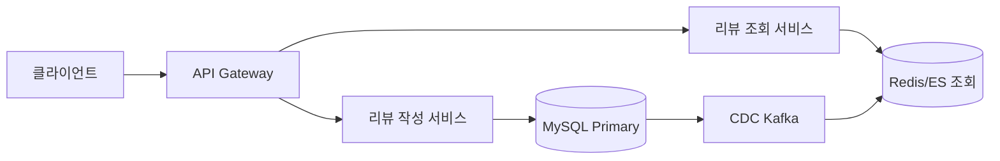
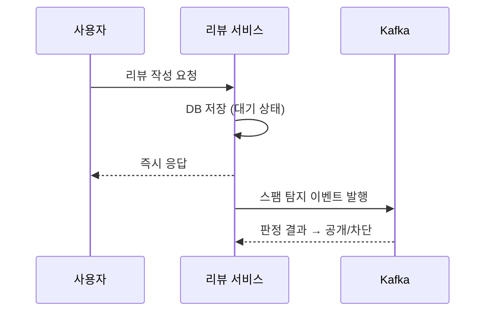
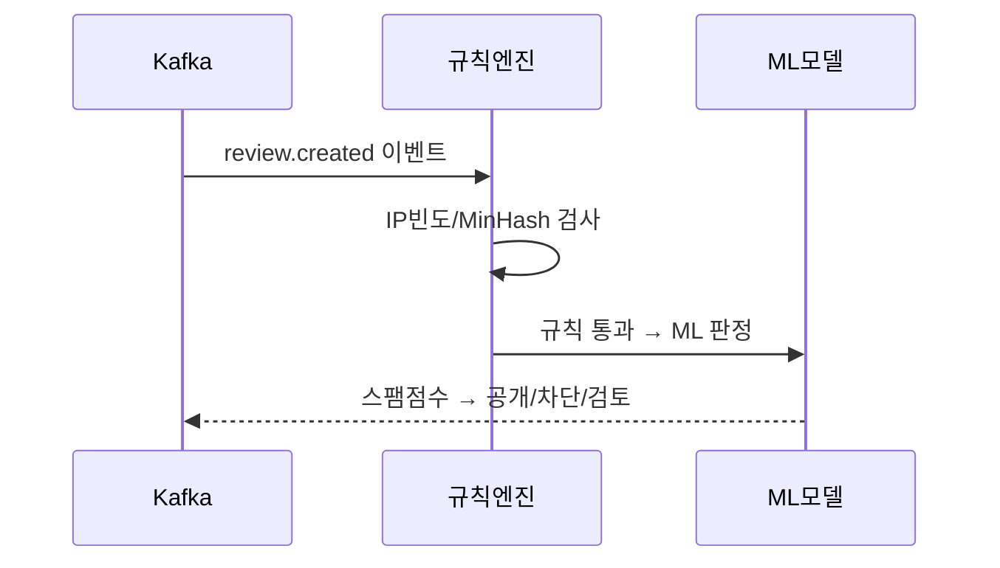
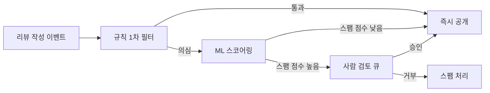
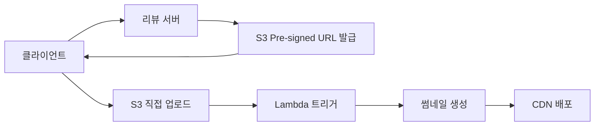

> **한 줄 요약**: 리뷰 시스템의 핵심은 베이지안 평균으로 소수 리뷰의 왜곡을 막고, Wilson Score로 유용한 리뷰를 정렬하며, 하이브리드 스팸 탐지 파이프라인으로 가짜 리뷰를 걸러내는 것이다.

## 실제 문제: 가짜 리뷰가 만드는 신뢰 붕괴

2023년 쿠팡에서 "리뷰 공장" 업체들이 실제 구매 계정을 대량으로 만들어 별점 5점짜리 리뷰를 조직적으로 작성하다 적발됐습니다. 해당 셀러의 상품은 별점 4.9점에 수천 개 리뷰가 달려 있었지만, 실제 구매자들은 "리뷰만 보고 샀다가 최악이었다"는 불만을 쏟아냈습니다.

리뷰 조작이 만드는 실제 피해:
- **소비자 피해**: 가짜 별점을 믿고 구매한 뒤 환불·반품 비용 발생
- **플랫폼 신뢰 훼손**: "어차피 조작된 리뷰"라는 인식이 퍼지면 리뷰 자체가 무의미해짐
- **정직한 셀러 역차별**: 조작하지 않는 셀러가 노출 순위에서 밀려남

**핵심 문제: 신호(진짜 리뷰)와 노이즈(가짜 리뷰)를 어떻게 분리하는가.**

---

## 설계 의사결정 로드맵

### 결정 1: 평점 집계 — 단순 평균 vs 베이지안 평균 vs 시간 가중

| 후보 | 장점 | 단점 | 언제 적합 |
|------|------|------|----------|
| 단순 평균 | 구현 단순, 직관적 | 소수 리뷰 상품의 극단값 왜곡, 조작에 취약 | MVP 초기 |
| 베이지안 평균 | 리뷰 수가 적을수록 전체 평균으로 수렴, 조작 저항성 높음 | 공식 이해 필요 | 리뷰 수 편차가 큰 e-커머스 |
| 시간 가중 평균 | 최신 품질 반영 | 신상품 초기 리뷰에 과도한 가중치 | 품질 변동이 잦은 배달/서비스업 |

**우리의 선택: 베이지안 평균 (기본) + 시간 감쇠 (선택적 적용)**
- 단순 평균에서는 리뷰 2개짜리 5.0점이 리뷰 10,000개짜리 4.7점보다 위에 노출된다. 베이지안 평균은 리뷰가 적을수록 전체 평균으로 끌어당겨 이 왜곡을 방지한다. 음식 품질이 자주 바뀌는 도메인(배민 등)은 6개월 이상 된 리뷰에 시간 감쇠를 추가 적용한다.

### 결정 2: 리뷰 저장소 — RDB vs MongoDB vs Elasticsearch

| 후보 | 장점 | 단점 | 언제 적합 |
|------|------|------|----------|
| RDB (MySQL/PostgreSQL) | 트랜잭션, 정확한 집계 | 텍스트 전체 검색 느림 | 구매 검증, 평점 집계 |
| MongoDB | 스키마 유연, 미디어 메타데이터 포함 | 복잡한 JOIN 없음 | 리뷰 본문 + 이미지 메타 함께 저장 |
| Elasticsearch | 전문 검색, 실시간 집계 | 원본 저장소 아님, 동기화 필요 | 리뷰 텍스트 검색, 연관 리뷰 추천 |

**우리의 선택: RDB (원본) + Elasticsearch (검색/집계) 이중 구조**
- 구매 검증, 스팸 판정, 평점 집계는 RDB의 ACID 트랜잭션이 필요하다. 전문 검색은 RDB LIKE 쿼리로 수백만 건 테이블에서 버틸 수 없다. Elasticsearch를 검색 전용 레이어로 두고 RDB 변경사항을 CDC(Debezium)로 동기화한다.

### 결정 3: 가짜 리뷰 탐지 — 규칙 기반 vs ML 기반 vs 하이브리드

| 후보 | 장점 | 단점 | 언제 적합 |
|------|------|------|----------|
| 규칙 기반 | 구현 빠름, 설명 가능 | 우회 쉬움, 새로운 패턴 대응 느림 | 초기 MVP |
| ML 기반 (텍스트 분류) | 복잡한 패턴 감지 | 학습 데이터 필요, false positive 위험 | 레이블 데이터 충분할 때 |
| 하이브리드 | 규칙으로 즉시 차단, ML로 복잡 패턴 탐지 | 두 시스템 유지 운영 비용 | 가짜 리뷰가 사업에 직접 타격을 주는 경우 |

**우리의 선택: 하이브리드 (규칙 1차 + ML 2차 + 사람 검토 3차)**
- "같은 IP에서 1시간에 리뷰 50개"는 규칙으로 즉시 차단 가능하다. 하지만 "여러 IP에서 분산된 조직적 패턴"은 ML 없이 탐지가 어렵다. 2023년 리뷰 조작 사건들의 공통점은 모두 "규칙 기반 필터 우회"였다.

### 결정 4: 리뷰 정렬 — 최신순 vs 유용순 vs Wilson Score

| 후보 | 장점 | 단점 | 언제 적합 |
|------|------|------|----------|
| 최신순 | 직관적, 최근 품질 반영 | 도움 0개짜리 신규 리뷰가 상단 점령 | 신선도가 중요한 음식 배달 |
| 유용순 (도움이 됨 수) | 커뮤니티 검증 반영 | 오래된 리뷰가 고착 | 성숙한 상품, 리뷰 수 많을 때 |
| Wilson Score | 통계적으로 신뢰할 수 있는 유용성 순위 | 공식 복잡 | 도움 투표 시스템이 있을 때 |

**우리의 선택: Wilson Score (기본 정렬) + 최신순 탭 별도 제공**
- "도움이 됨 5/5"인 리뷰와 "도움이 됨 95/100"인 리뷰는 단순 비율로는 같은 100%지만 신뢰도가 전혀 다르다. Wilson Score는 95% 신뢰 구간 하한값을 쓰므로 투표 수가 적은 리뷰는 자동으로 하단으로 밀린다.

---

## 1. 요구사항 분석 및 규모 추정

### 기능 요구사항

- 구매 확인된 사용자만 리뷰 작성 가능 (구매 후 최대 90일)
- 텍스트 + 사진/동영상 리뷰 지원
- 리뷰에 "도움이 됨" 투표 기능
- 셀러 답글 및 리뷰 신고 기능
- 상품 페이지에서 별점 분포, 평균, 리뷰 목록 조회

### 비기능 요구사항

- 리뷰 조회 (상품 페이지): 50ms 이내 (캐시 히트 기준)
- 가짜 리뷰 탐지: 작성 후 5분 이내 1차 판정, 24시간 이내 최종 판정
- 미디어 업로드: 이미지 최대 10MB, 동영상 최대 200MB

### 규모 추정

| 지표 | 수치 |
|------|------|
| 일 리뷰 작성 수 | 50만 건 |
| 리뷰 조회 QPS | 50,000 (피크 100,000) |
| 리뷰 작성 QPS | 6 (피크 20) |
| 누적 리뷰 수 | 10억 건 (5년치) |

리뷰 조회 대 작성 비율은 약 8,000:1입니다. **극도로 읽기 편향된 시스템**이므로 읽기 최적화가 핵심입니다.

미디어는 반드시 오브젝트 스토리지(S3 계열)가 필요합니다. 동영상만 해도 50MB × 5천만 건 = 2.5 PB 규모입니다.

---

## 2. 고수준 아키텍처

리뷰 시스템은 법원(스팸 탐지)과 도서관(조회 레이어)의 결합입니다. 법원은 1심(규칙 기반), 2심(ML), 3심(사람 검토)을 거칩니다. 도서관은 캐시(사서), Elasticsearch(색인), CDN(사진 자료실)으로 빠른 조회를 제공합니다.

블랙프라이데이처럼 인기 상품에 1분에 300건의 리뷰가 몰리고 동시에 10만 명이 상품 페이지를 조회하는 상황에서, 쓰기와 읽기가 같은 DB를 바라보면 쓰기 스파이크가 읽기 응답 시간을 수십 배 늘립니다. **쓰기 경로와 읽기 경로의 완전한 분리**가 필요합니다.



**핵심 설계 원칙:**

| 원칙 | 내용 |
|------|------|
| CQRS | 작성은 MySQL Primary, 조회는 Redis/ES 전용 |
| 비동기 스팸 탐지 | "대기" 상태 저장 후 즉시 응답, Kafka Consumer가 비동기 처리 |
| 미디어 분리 | Pre-signed URL로 클라이언트가 S3 직접 업로드 |

**리뷰 작성 흐름:**



---

## 3. 핵심 컴포넌트 상세 설계

### 컴포넌트 동작 원리

**리뷰 작성 서비스 (Review Write Service)**
리뷰 작성 요청이 들어오면 먼저 구매 이력 DB에서 해당 사용자가 실제로 해당 상품을 구매했는지 확인합니다(구매 후 최대 90일 이내). 검증 통과 시 리뷰를 `PENDING` 상태로 MySQL에 저장하고 즉시 응답합니다. 저장과 동시에 Transactional Outbox 테이블에 이벤트를 기록하고, Outbox Poller가 이를 읽어 Kafka `review.created` 토픽으로 발행합니다. DB 저장과 Kafka 발행이 같은 트랜잭션 내에 있어 이벤트 유실을 방지합니다.

**스팸 탐지 파이프라인 (Spam Detection Pipeline)**
Kafka `review.created` 이벤트를 구독하여 3단계로 처리합니다. 1단계(규칙 엔진): 동일 IP 시간당 요청 수, 텍스트 MinHash 중복도, 신규 계정 여부를 50ms 이내에 판정합니다. 2단계(ML 모델): 규칙을 통과한 리뷰는 텍스트 임베딩 + 계정 행동 그래프 피처로 스팸 점수(0~1)를 산출합니다. 0.8 이상이면 사람 검토 큐로 이관, 0.5~0.8이면 플래그만 설정하고 공개합니다. 3단계(사람 검토): 내부 검토자가 최종 판정하며 결과는 ML 모델 재학습 데이터로 활용합니다.

**평점 집계 서비스 (Rating Aggregation Service)**
리뷰 상태 변경 이벤트(공개/차단/삭제)를 구독합니다. 공개 시 `rating_stats` 테이블의 `review_count`, `rating_sum`, 별점 분포를 원자적으로 업데이트하고 베이지안 평균을 재계산합니다. 차단/삭제 시 역방향 업데이트를 수행합니다. 이 테이블은 리뷰 목록 조회마다 SUM/COUNT를 집계하는 비용을 제거합니다. 업데이트 후 Redis 캐시 `product:rating:{id}`를 즉시 무효화합니다.

**리뷰 조회 서비스 (Review Read Service)**
L1(Caffeine 로컬 캐시, TTL 5분) → L2(Redis, TTL 30분) → Elasticsearch(검색/집계) → MySQL Replica 순서로 조회합니다. 평점 요약과 상위 리뷰 목록은 Redis에 캐싱되어 대부분의 요청이 DB에 도달하지 않습니다. 리뷰 텍스트 검색은 Elasticsearch에서 처리하고, CDC(Debezium)가 MySQL 변경사항을 Elasticsearch에 실시간 동기화합니다.

**미디어 처리 서비스 (Media Service)**
클라이언트가 리뷰 이미지/동영상 업로드를 요청하면 S3 Pre-signed URL을 발급하고 즉시 반환합니다. 클라이언트는 해당 URL로 S3에 직접 업로드하므로 리뷰 서버는 대용량 바이너리 전송 부담이 없습니다. 업로드 완료 시 S3 Event가 Lambda를 트리거하여 이미지 썸네일(200×200, WebP)과 동영상 트랜스코딩(360p/720p)을 비동기로 생성합니다. 변환 완료 후 CDN에 배포하고 리뷰 DB에 CDN URL을 기록합니다.

**스팸 탐지 파이프라인 흐름:**



---

### 3-1. 평점 집계: 베이지안 평균

**베이지안 평균 공식:**

```
Bayesian Average = (C × m + Σ ratings) / (C + n)

C = 가중치 (전체 리뷰 수의 평균, 예: 50)
m = 전체 상품 평균 평점 (예: 4.0)
n = 해당 상품의 리뷰 수
```

예시:
- 상품 A (리뷰 2개, 합 10점): (50×4.0 + 10) / (50+2) = **4.04**
- 상품 B (리뷰 10,000개, 합 47,000점): (50×4.0 + 47,000) / (50+10,000) = **4.70**

리뷰가 적은 상품 A가 자동으로 전체 평균(4.0)으로 끌려 내려갑니다.

```java
public double calculateBayesianAverage(long productId) {
    RatingStats stats = statsRepo.findByProductId(productId);
    double globalMean = statsRepo.getGlobalMean();
    double numerator = BAYESIAN_C * globalMean + stats.getRatingSum();
    double denominator = BAYESIAN_C + stats.getReviewCount();
    return denominator == 0 ? globalMean : numerator / denominator;
}
```

평점 통계는 별도 `rating_stats` 테이블에 비정규화해서 관리합니다. 리뷰 조회 때마다 SUM/COUNT를 집계하면 리뷰 1만 개 상품에서 매번 1만 행을 스캔해야 합니다.

```sql
CREATE TABLE rating_stats (
    product_id   BIGINT PRIMARY KEY,
    review_count INT NOT NULL DEFAULT 0,
    rating_sum   INT NOT NULL DEFAULT 0,
    bayesian_avg DECIMAL(3,2),
    dist_1star   INT NOT NULL DEFAULT 0,
    dist_2star   INT NOT NULL DEFAULT 0,
    dist_3star   INT NOT NULL DEFAULT 0,
    dist_4star   INT NOT NULL DEFAULT 0,
    dist_5star   INT NOT NULL DEFAULT 0,
    updated_at   DATETIME NOT NULL
);
```

### 3-2. 스팸 탐지 파이프라인



**1차: 규칙 기반 필터 (동기, 50ms 이내)**

```java
public SpamRuleResult evaluate(ReviewCreateRequest req, UserContext user) {
    // 구매 검증 - 가장 기본적이고 강력한 필터
    if (!purchaseVerifier.isVerified(user.getId(), req.getProductId())) {
        return SpamRuleResult.blocked("NOT_PURCHASED");
    }

    List<String> violations = new ArrayList<>();

    long ipCount = redisCounter.get("review:ip:" + req.getClientIp());
    if (ipCount > IP_HOURLY_LIMIT) violations.add("IP_RATE_EXCEEDED");

    // MinHash로 유사 텍스트 탐지 (단순 해시와 달리 단어 순서 변경에도 유사값 반환)
    if (redis.exists("review:hash:" + minHash.hash(req.getContent()))) violations.add("DUPLICATE_TEXT");

    if (user.getDaysSinceJoin() < NEW_ACCOUNT_DAYS) violations.add("NEW_ACCOUNT");

    return violations.size() >= 2 ? SpamRuleResult.flagged(violations) : SpamRuleResult.passed();
}
```

**2차: ML 스코어링 (비동기, Kafka Consumer)**

텍스트 임베딩 기반 유사도 클러스터링, 작성 패턴, 계정 행동 그래프 분석을 결합한 앙상블 모델을 사용합니다.

```java
@KafkaListener(topics = "review.created")
public void processSpamDetection(ReviewCreatedEvent event) {
    double spamScore = mlModel.predict(
        textFeatureExtractor.extract(event.getContent()),
        userFeatureExtractor.extract(event.getUserId()),
        productFeatureExtractor.extract(event.getProductId())
    );

    if (spamScore > 0.8) reviewService.moveToHumanReview(event.getReviewId(), spamScore);
    else if (spamScore > 0.5) reviewService.addSpamFlag(event.getReviewId(), spamScore);
}
```

### 3-3. Wilson Score 리뷰 정렬

```
Wilson Score Lower Bound =
  (p̂ + z²/2n - z√(p̂(1-p̂)/n + z²/4n²)) / (1 + z²/n)

p̂ = 긍정 투표 비율, n = 총 투표 수, z = 1.96 (95% 신뢰 구간)
```

투표 수가 적을수록 z²/n 항이 커져 하한값이 낮아집니다. 불확실할수록 자동으로 하단 배치됩니다.

```java
public double calculate(int helpful, int total) {
    if (total == 0) return 0.0;
    double pHat = (double) helpful / total;
    double n = total;
    double numerator = pHat + Z_SQUARED / (2 * n)
        - Z * Math.sqrt(pHat * (1 - pHat) / n + Z_SQUARED / (4 * n * n));
    return numerator / (1 + Z_SQUARED / n);
}
```

Wilson Score는 리뷰 작성/투표 이벤트 때마다 재계산해 `reviews.wilson_score` 컬럼에 저장합니다. 정렬 시 실시간 계산 없이 컬럼 인덱스만 탑니다.

### 3-4. 미디어 처리 (S3 + CDN)

클라이언트가 Pre-signed URL을 받아 S3에 직접 업로드합니다. 서비스 서버는 대용량 바이너리 전송에서 완전히 제외됩니다.



업로드 완료 후 S3 Event → Lambda가 트리거되어 썸네일을 생성합니다. 원본 이미지(2MB) 대신 썸네일(200×200, ~20KB)을 CDN에 배포해 10배 빠르게 제공합니다.

### 3-5. 읽기 최적화: 다층 캐싱

읽기:쓰기 = 8,000:1이므로 DB를 직접 읽으면 DB가 버티지 못합니다.

```java
// L1: Caffeine (JVM 로컬, 5분 TTL)
// L2: Redis (분산, 30분 TTL)
// 조회 순서: L1 → L2 → DB, 새 리뷰 작성 시 캐시 즉시 무효화
public RatingSummary getRatingSummary(long productId) {
    String cached = redis.get("product:rating:" + productId);
    if (cached != null) return deserialize(cached, RatingSummary.class);

    RatingSummary summary = ratingStatsRepo.findByProductId(productId);
    redis.setex("product:rating:" + productId, 300, serialize(summary));
    return summary;
}
```

**비정규화로 JOIN 제거**: 리뷰 테이블에 `author_name`, `author_profile_image` 컬럼을 두고, 닉네임 변경 시 비동기로 업데이트합니다. 리뷰 목록은 단일 테이블 조회로 처리합니다.

---

## 4. 장애 시나리오와 대응

### 시나리오 1: Redis 캐시 클러스터 전체 장애

리뷰 조회 QPS 50,000이 MySQL Replica에 모두 몰립니다.

- Circuit Breaker가 DB 응답 느려짐을 감지해 읽기 요청 일부를 즉시 차단
- 로컬 Caffeine 캐시(L1)로 최대한 버팀. TTL을 임시로 연장 (5분 → 30분)
- 상품 페이지에서 리뷰 섹션을 레이지 로딩으로 전환해 메인 상품 정보 조회는 유지
- 예방: Redis 클러스터 Multi-AZ 구성, 캐시 미스 시 `singleflight` 패턴 적용

### 시나리오 2: 스팸 리뷰 대량 공격 (Flash Spam)

경쟁 업체가 봇으로 분당 10,000개의 1점 리뷰를 특정 상품에 작성해 별점이 4.8 → 1.2로 급락합니다.

- 특정 상품에 분당 리뷰 N건 이상이면 해당 상품 리뷰 작성을 임시 제한
- 이미 공개된 스팸 리뷰는 즉시 "검토 중" 상태로 전환해 노출에서 제거
- 별점은 "최근 24시간 작성 리뷰 제외" 임시 모드로 전환
- 예방: 상품별 시간당 리뷰 수 Redis Counter로 실시간 모니터링, Slack/PagerDuty 즉시 알림

### 시나리오 3: 미디어 스토리지 S3 특정 리전 장애

- CDN에서 이미지 캐시 TTL 연장 → 이미 배포된 이미지는 CDN에서 계속 서빙
- Pre-signed URL 발급을 보조 리전 S3로 폴백
- 예방: S3 Cross-Region Replication, 원본 URL 대신 CDN URL을 DB에 저장

---

## 5. 극한 시나리오

### 극한 시나리오 1: 조직적 가짜 리뷰 공세 — 경쟁사가 1점 폭탄을 쏟아붓는 날

경쟁 셀러가 해외 리뷰 팜(review farm)을 고용해 서로 다른 IP와 실명 인증 계정 1,000개로 특정 상품에 1점 리뷰를 24시간 동안 작성합니다. 계정마다 이전 구매 이력이 있고 문장 패턴도 다양해 규칙 기반 필터를 우회합니다. 4.8점이었던 상품이 3.1점으로 떨어지며 노출 순위에서 밀려납니다.

**문제점:**
- 규칙 필터(IP, 중복 텍스트)는 분산 조작을 탐지하지 못함
- 별점은 실시간으로 즉시 반영되어 공격 효과가 빠름
- 스팸 판정 전 이미 공개된 리뷰 롤백 로직 부재

**대응 전략:**
1️⃣ 계정 그래프 분석 — 같은 시간대에 동일 상품에 리뷰를 쓴 계정들의 가입 경로, 기기 핑거프린트, 결제 수단 유사도를 클러스터링하여 집단 행동 탐지
2️⃣ 별점 변화 속도 임계치 — 1시간 내 평점 0.3점 이상 하락 시 해당 시간대 리뷰를 "검토 보류" 상태로 자동 전환 (별점에서 제외)
3️⃣ 베이지안 평균의 시간 가중 — 단기간 급격히 쏟아진 리뷰에 낮은 가중치를 자동 적용
4️⃣ 셀러에게 즉시 알림 — "비정상 리뷰 패턴 감지, 검토 중" 메시지와 함께 현황 대시보드 제공
5️⃣ 사후 일괄 차단 — ML 모델이 집단 패턴을 학습하면 동일 캠페인 리뷰를 소급 차단하고 별점 복원

---

### 극한 시나리오 2: 블랙프라이데이 인기 상품 리뷰 쓰기 폭증 — DB Primary 과부하

블랙프라이데이 세일로 특정 상품이 1시간 만에 5만 개 팔립니다. 구매 후 리뷰 독려 알림이 일제히 발송되면서 30분 만에 3,000건의 리뷰 작성이 몰립니다. 모든 리뷰가 `rating_stats` 테이블을 동시에 업데이트하려고 하면서 행 레벨 락 경합이 폭발합니다. MySQL Primary의 스로틀링으로 리뷰 작성 응답 시간이 10초를 넘어서고 타임아웃이 발생합니다.

**문제점:**
- 리뷰 작성마다 `rating_stats` 테이블 즉시 동기 업데이트로 핫스팟 발생
- 단일 상품의 `rating_stats` 행이 초당 수백 번 경합
- 캐시 무효화가 폭풍처럼 발생해 DB로의 Cache Miss 트래픽 급증

**대응 전략:**
1️⃣ 평점 집계 비동기 전환 — 리뷰 작성 즉시 `rating_stats` 업데이트 대신 Kafka 이벤트 발행, Consumer가 배치로 집계
2️⃣ 집계 지연 허용 — "평점은 최대 1분 내 반영" SLA로 완화, 사용자에게 "집계 중" 표시
3️⃣ 핫스팟 상품 감지 — 분당 리뷰 100건 이상이면 자동으로 집계 주기를 1분 배치로 전환
4️⃣ 캐시 Stampede 방지 — `singleflight` 패턴으로 동시 Cache Miss 시 DB 요청 1건으로 병합
5️⃣ Read Replica 트래픽 분산 — 리뷰 목록 조회를 Replica 3대로 분산, Primary는 쓰기 전용

---

### 극한 시나리오 3: 스팸 ML 모델 오작동 — 정상 리뷰 30%가 스팸 판정

ML 모델 배포 후 특정 키워드가 포함된 리뷰를 스팸으로 오분류하는 버그가 발견됩니다. "배송이 빠르다"라는 표현이 포함된 리뷰 전체가 스팸으로 판정되어 공개 대기 상태로 쌓입니다. 플랫폼 전체 리뷰 공개율이 70%로 떨어지고, 진짜 구매자들의 리뷰가 노출되지 않는다는 민원이 쏟아집니다.

**문제점:**
- 모델 배포 전 회귀 테스트 부재 (특정 키워드 False Positive 급증 미감지)
- 차단된 리뷰를 일괄 복원하는 도구 부재
- 모델 성능 지표(False Positive Rate) 실시간 모니터링 없음

**대응 전략:**
1️⃣ 모델 배포 전 Shadow Mode 검증 — 신규 모델을 실제 트래픽에 병행 실행하고 기존 모델과 판정 불일치율 5% 초과 시 배포 차단
2️⃣ False Positive Rate 실시간 모니터링 — 스팸 판정률이 평소 대비 50% 이상 증가하면 자동 알림
3️⃣ 긴급 롤백 버튼 — 이전 모델 버전으로 즉시 롤백하는 원클릭 도구 운영
4️⃣ 오판정 리뷰 일괄 복원 — 롤백 이후 해당 모델 버전이 차단한 리뷰 전체를 배치로 재검토 큐에 투입
5️⃣ 사용자 이의 신청 채널 — "내 리뷰가 잘못 차단됐어요" 버튼으로 인간 검토 우선 배정

---

## 6. 실무 실수 Top 5

### 실수 1: 단순 평균으로 별점 집계

"별점 평균이 뭐가 어려워?"라는 생각으로 `SELECT AVG(rating)`을 상품 페이지마다 실행합니다. 리뷰 2개인 신규 상품이 5.0점으로 베스트셀러 4.7점 상품보다 위에 노출되고, 리뷰 100만 건인 상품에서 쿼리마다 풀 스캔이 발생해 DB가 버팁니다.

**올바른 방법:** 베이지안 평균으로 소수 리뷰 왜곡을 방지하고, 별도 `rating_stats` 비정규화 테이블에 집계값을 미리 계산해 저장합니다.

---

### 실수 2: 리뷰 작성 시 스팸 탐지를 동기 처리

리뷰 작성 API 내부에서 ML 모델 추론(500ms~2초)을 동기로 호출합니다. ML 서버에 지연이 생기면 리뷰 작성 응답이 수초로 늘어나고 타임아웃이 발생합니다. 사용자는 리뷰가 등록됐는지 모르고 여러 번 제출합니다.

**올바른 방법:** 리뷰를 `PENDING` 상태로 즉시 저장하고 응답합니다. Kafka Consumer가 비동기로 스팸 탐지를 수행하고 최종 상태(공개/차단)를 업데이트합니다.

---

### 실수 3: 구매 검증 없이 누구나 리뷰 작성 허용

"리뷰가 많을수록 좋다"는 생각으로 구매 여부를 확인하지 않습니다. 론칭 직후 경쟁사 직원들이 구매 없이 1점 리뷰를 도배하거나, 셀러 본인이 5점 리뷰를 양산합니다. 플랫폼 신뢰도가 무너집니다.

**올바른 방법:** 구매 검증 리뷰와 일반 리뷰를 구분하거나, 구매 검증 리뷰에만 별점 반영 가중치를 부여합니다. 최소한 구매 검증 리뷰를 "구매확인" 배지로 구분 표시합니다.

---

### 실수 4: 리뷰 이미지를 서버에서 직접 수신·저장

서버가 클라이언트로부터 이미지 파일을 multipart/form-data로 받아 S3에 업로드합니다. 리뷰 서버 인스턴스의 네트워크 대역폭이 이미지 전송으로 포화되고, 대용량 파일 업로드 중 커넥션이 오래 유지되어 서버 리소스가 고갈됩니다.

**올바른 방법:** Pre-signed URL을 발급해 클라이언트가 S3에 직접 업로드합니다. 서버는 URL 발급 요청(작은 JSON)만 처리하고 바이너리 전송은 완전히 제외됩니다.

---

### 실수 5: 리뷰 삭제 시 평점 재계산 없음

스팸으로 판정된 리뷰를 DB에서 hard delete합니다. `rating_stats`는 업데이트되지 않아 삭제된 1점짜리 리뷰들이 평점에 계속 반영됩니다. 스팸 100개를 삭제했는데 평점이 그대로인 상황이 발생합니다.

**올바른 방법:** 리뷰 상태 변경(차단/삭제)을 이벤트로 발행하고, `rating_stats`를 역방향 업데이트합니다. Hard delete 대신 `status = 'BLOCKED'`로 soft delete하여 감사 이력을 보존합니다.

---

## 7. Phase 1→4 진화

리뷰 시스템은 플랫폼 규모에 따라 단계적으로 발전합니다.

| Phase | 목표 | 아키텍처 | 일 리뷰 수 | 월 인프라 비용 |
|-------|------|----------|-----------|--------------|
| Phase 1 | MVP: 기본 리뷰 + 단순 평균 | 단일 서버 + MySQL + S3 | ~1만 건 | 20~50만원 |
| Phase 2 | 규칙 기반 스팸 탐지 + 베이지안 평균 | CQRS + Redis 캐시 + CDN | ~10만 건 | 100~200만원 |
| Phase 3 | ML 스팸 탐지 + Elasticsearch 검색 | Kafka + ML 서빙 + ES 클러스터 | ~50만 건 | 500만~1,000만원 |
| Phase 4 | AI 요약 + 시맨틱 검색 + 실시간 분석 | 벡터 DB + LLM API + Spark | ~200만 건 | 2,000만원 이상 |

**Phase 1 → Phase 2 전환 트리거:**
- 가짜 리뷰 민원이 월 100건 초과
- 리뷰 조회 응답 시간이 500ms 초과 (DB 직접 집계 한계)

**Phase 2 → Phase 3 전환 트리거:**
- 규칙 기반 필터 우회 조작이 빈번하게 발생
- 리뷰 텍스트 검색 기능 요구 (LIKE 쿼리로는 감당 불가)
- 일 리뷰 10만 건 초과로 Redis만으로 캐시 부담 증가

**Phase 3 → Phase 4 전환 트리거:**
- 상품당 리뷰 수천 건 이상으로 사용자가 리뷰를 읽지 않는 현상
- "화면 선명해요"와 "디스플레이 깨끗함"을 같은 의미로 검색해야 하는 니즈

---

## 8. 핵심 메트릭

리뷰 시스템의 건강과 품질을 측정하는 핵심 지표입니다.

| 메트릭 | 설명 | 목표값 | 경보 임계치 |
|--------|------|--------|------------|
| 리뷰 조회 응답 시간 (P99) | 상품 페이지 리뷰 섹션 로딩 | 50ms 이내 (캐시 히트) | 200ms 초과 |
| 스팸 탐지 False Positive Rate | 정상 리뷰가 스팸으로 오판정된 비율 | 1% 미만 | 5% 초과 |
| 스팸 탐지 False Negative Rate | 스팸이 공개된 비율 | 2% 미만 | 10% 초과 |
| 리뷰 공개까지 걸리는 시간 | 작성 후 스팸 탐지 완료 + 공개까지 | 5분 이내 95% | 30분 초과 |
| 캐시 히트율 | Redis 평점 캐시 히트 비율 | 95% 이상 | 80% 미만 |
| Elasticsearch 동기화 지연 | MySQL 변경 → ES 반영까지 | 5초 이내 | 30초 초과 |
| 베이지안 평균 집계 지연 | 리뷰 작성 후 평점 반영까지 | 1분 이내 | 5분 초과 |
| 미디어 업로드 성공률 | Pre-signed URL을 통한 S3 업로드 성공 | 99% 이상 | 95% 미만 |
| 사람 검토 큐 대기 건수 | 미처리 사람 검토 대기 리뷰 수 | 1,000건 미만 | 5,000건 초과 |

---

## 9. 실제 장애 사례

### 사례 1: 베이지안 평균 C값 오계산으로 전체 평점 왜곡 (2022년)

**상황:** 플랫폼 초기 상품 수가 적을 때 전체 상품 평균 리뷰 수(C)가 3이었습니다. 상품 수가 폭발적으로 늘어나면서 중앙값이 50으로 바뀌었지만 C 값을 하드코딩으로 고정해 두어 갱신하지 않았습니다. 리뷰 3개짜리 신상품이 지나치게 높은 신뢰도를 받아 검색 상단에 노출됐고, 실제 구매 후 "광고와 다르다"는 민원이 급증했습니다.

**원인:** 베이지안 평균의 C 값을 플랫폼 성장에 맞춰 동적으로 갱신하는 배치 부재. 고정값 사용.

**해결:** ① 매주 자정 배치로 전체 상품 리뷰 수 중앙값을 재계산해 C 값을 자동 갱신 ② C 값 변경 시 영향받는 상품의 캐시를 일괄 무효화 ③ 평점 변화율 이상치 모니터링 추가

---

### 사례 2: CDC Debezium 동기화 지연으로 검색 결과 불일치 (2023년)

**상황:** Debezium이 MySQL binlog를 읽어 Elasticsearch에 동기화하는 파이프라인에서, MySQL Replica lag이 커지면서 Debezium이 오래된 binlog 위치에서 중복 이벤트를 발행했습니다. Elasticsearch에 같은 리뷰가 중복 인덱싱되어 검색 결과에 동일 리뷰가 두 번 나타났습니다.

**원인:** Debezium offset 관리 오류. Replica lag 증가 시 Primary에서 직접 읽어야 하는 로직 부재.

**해결:** ① Debezium을 MySQL Primary에 직접 연결 (Replica binlog는 lag 발생 가능) ② ES 인덱싱 시 `_id`를 리뷰 DB PK로 고정해 중복 인덱싱 시 덮어쓰기(upsert) 처리 ③ Debezium Consumer Lag 모니터링 대시보드 구성

---

### 사례 3: Wilson Score 배치 업데이트 실패로 정렬 고착 (2024년)

**상황:** 야간 배치로 Wilson Score를 일괄 재계산하는 Job이 OOM으로 실패했습니다. 실패 알림이 묻혀 2주간 Wilson Score가 갱신되지 않았습니다. 2주 전 인기 리뷰가 상단에 고정되고 최근 유용한 리뷰들이 하단에 묻혔습니다. 사용자들이 "최신 리뷰는 왜 아래에 있나요?"라는 피드백을 남겼고 모니터링 점검 중 이슈가 발견됐습니다.

**원인:** 배치 Job 실패 알림 미설정. Wilson Score 최종 갱신 시각 모니터링 없음. 전체 리뷰를 한 번에 메모리에 올리는 배치 설계.

**해결:** ① 배치 Job 실패 시 즉시 Slack + PagerDuty 알림 ② Wilson Score 최종 갱신 시각을 핵심 메트릭으로 등록 (24시간 이상 미갱신 시 알림) ③ 배치를 페이지 단위(1만 건씩) Cursor 방식으로 변경해 OOM 방지

---

## 10. 확장 포인트

**리뷰 요약 AI**: LLM으로 "긍정 요점 3가지, 부정 요점 3가지"를 자동 요약합니다. 리뷰 변동이 있을 때마다 비동기로 재생성하고 상품 페이지에 고정 노출합니다.

**시맨틱 검색**: "화면이 선명해요" "디스플레이 깨끗함" "색감 좋음"은 같은 의미이지만 키워드 검색으로는 묶이지 않습니다. 리뷰 텍스트를 임베딩 벡터로 변환해 벡터 DB에 저장하면 의미 기반 유사 리뷰 검색이 가능합니다.

**셀러용 분석 대시보드**: 리뷰 키워드 트렌드, 별점 추이, 유사 상품 대비 감성 분석을 야간 배치(Spark)로 분석해 별도 Analytics DB에 저장합니다.

---

## 면접 포인트

### 면접 포인트 1️⃣ "리뷰 작성 직후 상품 페이지를 새로고침하면 내 리뷰가 바로 보여야 하나요?"

CDC → Kafka → Redis 갱신까지 수백 ms~수 초가 걸리는 최종 일관성(Eventual Consistency) 모델입니다. "Read Your Own Write" 패턴으로 해결합니다. 리뷰 작성 직후 클라이언트가 새로고침하면 세션 토큰에 "방금 작성한 리뷰 ID"를 태그해서 해당 리뷰는 캐시를 우회하고 DB에서 직접 조회합니다. 다른 사용자에게는 캐시 갱신 후 보입니다.

### 면접 포인트 2️⃣ "베이지안 평균의 C 값(가중치)을 어떻게 결정하나요?"

C는 "리뷰 몇 개부터 신뢰할 수 있는가"를 나타내는 도메인 파라미터입니다. 전체 상품의 중앙값 리뷰 수를 씁니다. 전체 상품의 50%가 리뷰 50개 미만이라면 C=50이 적합합니다. A/B 테스트로 C 값에 따른 클릭률, 구매 전환율 변화를 측정해 튜닝합니다.

### 면접 포인트 3️⃣ "구매 검증 없이 리뷰를 쓸 수 있게 하면 안 되나요?"

플랫폼 전략에 따라 다릅니다. 네이버쇼핑은 구매 검증 리뷰와 일반 리뷰를 분리 노출하고 구매 검증 리뷰에 가중치를 더 줍니다. 완전히 막으면 플랫폼 초기에 콜드 스타트 문제가 생기고, 완전히 열면 조작에 취약해집니다.

### 면접 포인트 4️⃣ "별점 집계 중 리뷰가 스팸으로 판정되어 삭제되면 평점은 어떻게 되나요?"

`rating_stats` 테이블을 역방향으로 업데이트합니다. 스팸 리뷰의 별점을 `rating_sum`에서 빼고 `review_count`를 1 감소시킨 뒤 베이지안 평균을 재계산하고 캐시를 무효화합니다. 이 과정은 트랜잭션으로 묶어 partial update를 방지합니다.

### 면접 포인트 5️⃣ "리뷰 1건이 삭제될 때 Wilson Score는 어떻게 갱신하나요?"

Wilson Score는 특정 리뷰 자체의 도움 투표 점수입니다. 삭제된 리뷰의 Wilson Score는 삭제와 함께 사라지므로 별도 갱신이 필요 없습니다. 남은 리뷰들의 Wilson Score는 영향받지 않습니다. 단, 삭제된 리뷰에 달린 셀러 답글, 신고 내역 등은 soft delete 처리해 감사 로그로 보관합니다.
