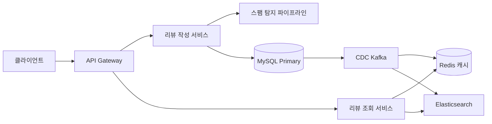
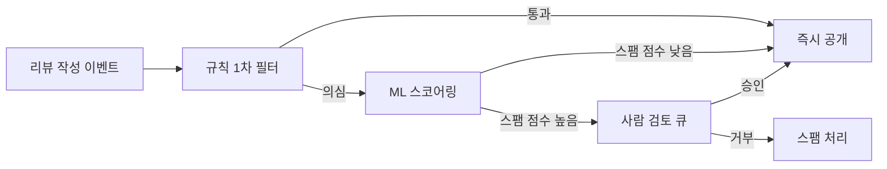
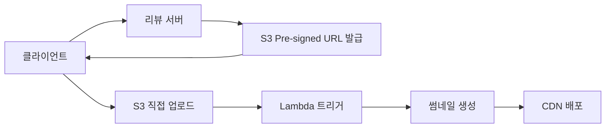

> **한 줄 요약**: 리뷰 시스템의 핵심은 베이지안 평균으로 소수 리뷰의 왜곡을 막고, Wilson Score로 유용한 리뷰를 정렬하며, 하이브리드 스팸 탐지 파이프라인으로 가짜 리뷰를 걸러내는 것이다.

## 실제 문제: 가짜 리뷰가 만드는 신뢰 붕괴

2023년 쿠팡에서는 "리뷰 공장" 업체들이 실제 구매 계정을 대량으로 만들어 별점 5점짜리 리뷰를 조직적으로 작성하다 적발됐습니다. 해당 셀러의 상품은 별점 4.9점으로 수천 개의 리뷰가 달려 있었지만, 실제 구매자들은 "리뷰만 보고 샀다가 최악이었다"는 불만을 쏟아냈습니다.

네이버쇼핑에서는 "리뷰 교환" 카페가 운영되어 서로 다른 상품을 사고 5점 리뷰를 교환하는 행위가 만연했고, 배달의민족에서도 업체 대표가 직접 가족 명의 계정으로 리뷰를 작성하는 사례가 뉴스에 보도됐습니다.

리뷰 조작이 만드는 실제 피해는 세 가지입니다.

- **소비자 피해**: 가짜 별점을 믿고 구매한 뒤 환불·반품 비용 발생
- **플랫폼 신뢰 훼손**: "어차피 조작된 리뷰"라는 인식이 퍼지면 리뷰 자체가 무의미해짐
- **정직한 셀러 역차별**: 조작하지 않는 셀러가 노출 순위에서 밀려남

리뷰 시스템이 풀어야 할 핵심 문제는 결국 하나입니다. **신호(진짜 리뷰)와 노이즈(가짜 리뷰)를 어떻게 분리하는가.**

---

## 설계 의사결정 로드맵

리뷰 시스템 설계에서 순서대로 답해야 할 핵심 결정 4가지입니다. 각 결정에서 "왜 이 선택인가"를 명확히 하지 않으면 면접에서 "그냥 평균 내면 되지 않나요?"라는 후속 질문에 막힙니다.

### 결정 1: 평점 집계 — 단순 평균 vs 베이지안 평균 vs 시간 가중

**문제**: 리뷰 2개짜리 상품이 둘 다 5점이면 별점 5.0이 된다. 리뷰 10,000개짜리 상품의 4.7점보다 위에 노출해도 되는가?

| 후보 | 장점 | 단점 | 언제 적합 |
|------|------|------|----------|
| 단순 평균 | 구현 단순, 직관적 | 소수 리뷰 상품의 극단값 왜곡, 조작에 취약 | MVP 초기, 리뷰 수가 균일할 때 |
| 베이지안 평균 | 리뷰 수가 적을수록 전체 평균으로 수렴, 조작 저항성 높음 | 공식 이해 필요, 사용자에게 설명하기 어려움 | 리뷰 수 편차가 큰 e-커머스 |
| 시간 가중 평균 | 최신 품질 반영, 오래된 리뷰 희석 | 신상품 초기 리뷰에 과도한 가중치 | 품질 변동이 잦은 배달/서비스업 |

**우리의 선택: 베이지안 평균 (기본) + 시간 감쇠 (선택적 적용)**
- 이유: 쿠팡처럼 셀러 간 리뷰 수 편차가 수십~수만 배 나는 환경에서 단순 평균은 신규 셀러의 리뷰 2개짜리 5.0점이 기존 셀러 4.8점보다 위에 오르는 구조적 불공정을 만든다. 베이지안 평균은 리뷰가 적을수록 "전체 평균"으로 끌어당겨 이 왜곡을 방지한다. 배민처럼 음식 품질이 자주 바뀌는 도메인은 6개월 이상 된 리뷰에 시간 감쇠를 추가 적용한다.
- 안 하면: 리뷰 조작자는 계정 5개만 만들어 5점을 주면 해당 상품을 상단에 올릴 수 있다. 단순 평균 구조에서는 조작 비용이 너무 낮다.

### 결정 2: 리뷰 저장소 — RDB vs MongoDB vs Elasticsearch

**문제**: 리뷰는 텍스트 검색, 정렬, 필터링, 통계 집계가 동시에 필요하다. 하나의 DB로 다 처리할 수 있는가?

| 후보 | 장점 | 단점 | 언제 적합 |
|------|------|------|----------|
| RDB (MySQL/PostgreSQL) | 트랜잭션, JOIN, 정확한 집계 | 텍스트 전체 검색 느림, 스키마 변경 비용 | 구매 검증, 평점 집계, 신뢰성 중심 |
| MongoDB | 스키마 유연, 미디어 메타데이터 포함 문서 저장 | 복잡한 JOIN 없음, 트랜잭션 제한적 | 리뷰 본문 + 이미지 메타 함께 저장 |
| Elasticsearch | 전문 검색, 실시간 집계, 자동 완성 | 원본 저장소 아님, 동기화 필요, 운영 복잡 | 리뷰 텍스트 검색, 연관 리뷰 추천 |

**우리의 선택: RDB (원본) + Elasticsearch (검색/집계) 이중 구조**
- 이유: 구매 검증, 스팸 판정, 평점 집계는 RDB의 ACID 트랜잭션이 필요하다. "이 상품 리뷰 중 '배송 빠름' 포함된 리뷰 찾기" 같은 전문 검색은 RDB LIKE 쿼리로는 수백만 건 테이블에서 버틸 수 없다. Elasticsearch를 검색 전용 레이어로 두고 RDB 변경사항을 CDC(Change Data Capture)로 동기화한다.
- 안 하면: 리뷰 텍스트 검색에 MySQL LIKE '%키워드%' 쿼리를 쓰면 Full Table Scan이 발생해 리뷰 500만 건 기준 응답 시간이 수십 초가 된다.

### 결정 3: 가짜 리뷰 탐지 — 규칙 기반 vs ML 기반 vs 하이브리드

**문제**: 가짜 리뷰 패턴은 계속 진화한다. 고정된 규칙만으로 막을 수 있는가?

| 후보 | 장점 | 단점 | 언제 적합 |
|------|------|------|----------|
| 규칙 기반 | 구현 빠름, 설명 가능, 즉시 적용 | 우회 쉬움, 규칙 목록 관리 비용, 새로운 패턴 대응 느림 | 초기 MVP, 명백한 패턴 차단 |
| ML 기반 (텍스트 분류) | 복잡한 패턴 감지, 진화하는 조작 대응 | 학습 데이터 필요, 블랙박스, false positive 위험 | 대규모, 레이블 데이터 충분할 때 |
| 하이브리드 | 규칙으로 명백한 것 즉시 차단, ML로 복잡 패턴 탐지 | 두 시스템 유지 운영 비용 | 가짜 리뷰가 사업에 직접 타격을 주는 경우 |

**우리의 선택: 하이브리드 (규칙 1차 + ML 2차 + 사람 검토 3차)**
- 이유: "같은 IP에서 1시간에 리뷰 50개"는 규칙으로 즉시 차단 가능하다. 하지만 "자연어처럼 쓰인 복붙 리뷰", "여러 IP에서 분산된 조직적 패턴"은 ML 없이 탐지가 어렵다. 규칙이 명백한 것을 빠르게 걸러내고, ML이 불분명한 것을 점수화하며, 사람이 경계선 케이스를 판정한다.
- 안 하면: 규칙만 쓰면 조작 업체는 규칙 하나가 공개될 때마다 우회법을 찾는다. 2023년 리뷰 조작 사건들의 공통점은 모두 "규칙 기반 필터 우회"였다.

### 결정 4: 리뷰 정렬 — 최신순 vs 유용순 vs Wilson Score

**문제**: 리뷰 1,000개가 달린 상품에서 기본으로 어떤 리뷰를 상단에 보여줘야 하는가?

| 후보 | 장점 | 단점 | 언제 적합 |
|------|------|------|----------|
| 최신순 | 직관적, 최근 품질 반영 | "도움이 됨" 0개짜리 신규 리뷰가 상단 점령 | 신선도가 중요한 음식 배달 |
| 유용순 (도움이 됨 수) | 커뮤니티 검증 반영 | 오래된 리뷰가 고착, 신규 리뷰 노출 기회 없음 | 성숙한 상품, 리뷰 수 많을 때 |
| Wilson Score | 통계적으로 신뢰할 수 있는 유용성 순위, 투표 수 적은 리뷰 하단 배치 | 공식 복잡, 계산 비용 | 도움 투표 시스템이 있을 때 |

**우리의 선택: Wilson Score (기본 정렬) + 최신순 탭 별도 제공**
- 이유: "도움이 됨 5/5"인 리뷰와 "도움이 됨 95/100"인 리뷰는 단순 비율로는 같은 100%지만 신뢰도가 전혀 다르다. Wilson Score는 95% 신뢰 구간의 하한값을 쓰므로 투표 수가 적은 리뷰는 자동으로 하단으로 밀린다. 사용자는 최신순 탭으로 전환해 최근 리뷰도 볼 수 있다.
- 안 하면: 단순 유용 비율 정렬에서는 리뷰 1개 받고 "도움이 됨" 1개를 받은 리뷰(100%)가 리뷰 1,000개 받고 950개가 유용하다고 한 리뷰(95%)보다 위에 온다.

---

## 1. 요구사항 분석 및 규모 추정

### 기능 요구사항

- 구매 확인된 사용자만 리뷰 작성 가능 (구매 후 최대 90일)
- 텍스트 + 사진/동영상 리뷰 지원
- 별점 1~5점 (0.5점 단위 또는 정수)
- 리뷰에 "도움이 됨" 투표 기능
- 셀러 답글 기능
- 리뷰 신고 기능
- 상품 페이지에서 별점 분포, 평균, 리뷰 목록 조회

### 비기능 요구사항

- 리뷰 작성: 99.9% 가용성, 2초 이내 응답
- 리뷰 조회 (상품 페이지): 50ms 이내 (캐시 히트 기준)
- 가짜 리뷰 탐지: 작성 후 5분 이내 1차 판정, 24시간 이내 최종 판정
- 미디어 업로드: 이미지 최대 10MB, 동영상 최대 200MB

### 규모 추정 (쿠팡 수준 e-커머스 가정)

| 지표 | 수치 |
|------|------|
| 일 활성 사용자 | 1,000만 명 |
| 일 리뷰 작성 수 | 50만 건 |
| 리뷰 조회 QPS | 50,000 (피크 100,000) |
| 리뷰 작성 QPS | 6 (피크 20) |
| 누적 리뷰 수 | 10억 건 (5년치) |
| 이미지 포함 리뷰 비율 | 40% |
| 동영상 포함 리뷰 비율 | 5% |

리뷰 조회 대 작성 비율은 약 8,000:1입니다. **극도로 읽기 편향된 시스템**입니다. 쓰기 최적화보다 읽기 최적화가 훨씬 중요합니다.

저장 공간 추정:
- 텍스트 리뷰 1건: 평균 500 bytes × 10억 건 = 500 GB
- 이미지 썸네일 (200KB × 4억 건) = 80 TB
- 원본 이미지 (2MB × 4억 건) = 800 TB
- 동영상 (50MB × 5천만 건) = 2.5 PB

미디어는 반드시 오브젝트 스토리지(S3 계열)가 필요하며, RDB에 저장하는 것은 불가능합니다.

---

## 2. 고수준 아키텍처

### 비유: 리뷰 시스템은 "법원과 도서관의 결합"

법원(스팸 탐지)은 제출된 리뷰가 진짜인지 심사합니다. 1심(규칙 기반 자동 판정), 2심(ML 모델), 3심(사람 검토)을 거칩니다. 도서관(조회 레이어)은 심사를 통과한 리뷰를 정리해서 빠르게 찾아볼 수 있게 합니다. 사서(캐시)가 자주 찾는 책을 앞에 꺼내두고, 색인(Elasticsearch)이 내용으로 검색을 도와주며, 사진 자료실(CDN)이 이미지를 빠르게 제공합니다.

극한 시나리오를 생각해보면: 대형 쇼핑 행사 날(11월 11일) 오전 10시, 쿠팡 블랙프라이데이에서 인기 상품 하나에 1분에 300건의 리뷰가 몰립니다. 동시에 같은 상품 페이지를 10만 명이 조회합니다. 이 상황에서 리뷰 작성과 조회가 같은 DB를 바라보고 있다면, 쓰기 스파이크가 읽기 응답 시간을 수십 배 늘립니다. **쓰기 경로와 읽기 경로의 완전한 분리**가 필요합니다.



### 핵심 설계 원칙

**1. CQRS (Command Query Responsibility Segregation)**
리뷰 작성(Command)과 리뷰 조회(Query)를 완전히 다른 서비스와 저장소로 분리합니다. 작성 서비스는 MySQL Primary에 쓰고 즉시 응답합니다. 조회 서비스는 Redis 캐시와 Elasticsearch에서만 읽습니다. MySQL의 변경사항은 CDC(Debezium)가 Kafka로 내보내고, 소비자들이 캐시와 검색 인덱스를 비동기로 갱신합니다.

**2. 비동기 스팸 탐지**
리뷰 작성 요청에 스팸 탐지를 동기로 포함하면 응답 시간이 수 초가 됩니다. ML 모델 추론은 특히 느립니다. 리뷰를 "대기" 상태로 저장하고 즉시 응답한 뒤, 스팸 탐지는 Kafka Consumer가 비동기로 처리합니다. 1차 규칙 판정 통과 시 즉시 "공개" 상태로 전환하고, ML 2차 판정은 백그라운드에서 추가 검토합니다.

**3. 미디어 분리**
이미지/동영상은 리뷰 서비스 DB에 저장하지 않습니다. 클라이언트가 Pre-signed URL을 받아 S3에 직접 업로드하고, 업로드 완료 후 리뷰 본문에 미디어 ID만 참조합니다. 서비스 서버는 대용량 바이너리 전송에서 완전히 제외됩니다.

---

## 3. 핵심 컴포넌트 상세 설계

### 3-1. 평점 집계: 베이지안 평균

단순 평균이 왜 문제인지 먼저 수식으로 확인합니다.

상품 A: 리뷰 2개, 평점 합 10점 → 단순 평균 = 5.0
상품 B: 리뷰 10,000개, 평점 합 47,000점 → 단순 평균 = 4.7

단순 평균에서는 상품 A가 B보다 위에 노출됩니다. 그러나 상품 A의 "5.0"은 거의 아무 정보도 없습니다. 리뷰 2개는 친구나 지인이 써준 것일 수도 있습니다.

**베이지안 평균 공식:**

```
Bayesian Average = (C × m + Σ ratings) / (C + n)

C = 가중치 (전체 리뷰 수의 평균, 예: 50)
m = 전체 상품 평균 평점 (예: 4.0)
n = 해당 상품의 리뷰 수
Σ ratings = 해당 상품의 평점 합
```

예시 계산:
- 상품 A (리뷰 2개, 합 10점): (50 × 4.0 + 10) / (50 + 2) = 210 / 52 = **4.04**
- 상품 B (리뷰 10,000개, 합 47,000점): (50 × 4.0 + 47,000) / (50 + 10,000) = 47,200 / 10,050 = **4.70**

리뷰가 적은 상품 A가 자동으로 전체 평균(4.0)으로 끌려 내려갑니다.

```java
@Service
public class RatingAggregationService {

    private static final double BAYESIAN_C = 50.0; // 가중치 (튜닝 파라미터)

    @Autowired
    private RatingStatsRepository statsRepo;

    public double calculateBayesianAverage(long productId) {
        RatingStats stats = statsRepo.findByProductId(productId);
        double globalMean = statsRepo.getGlobalMean(); // 전체 상품 평균 평점

        double numerator = BAYESIAN_C * globalMean + stats.getRatingSum();
        double denominator = BAYESIAN_C + stats.getReviewCount();

        return denominator == 0 ? globalMean : numerator / denominator;
    }

    @Transactional
    public void updateRatingStats(long productId, int newRating, Integer oldRating) {
        // INSERT ON DUPLICATE KEY UPDATE 패턴으로 동시성 안전하게 집계
        statsRepo.upsertStats(productId, newRating, oldRating);
        // 베이지안 평균 재계산 후 캐시 무효화
        double newAvg = calculateBayesianAverage(productId);
        ratingCache.put("product:rating:" + productId, newAvg);
    }
}
```

평점 통계는 별도 `rating_stats` 테이블에 **비정규화**해서 관리합니다. 리뷰 조회 때마다 SUM/COUNT를 집계하면 리뷰 1만 개 상품에서 매번 1만 행을 스캔해야 합니다.

```sql
CREATE TABLE rating_stats (
    product_id   BIGINT PRIMARY KEY,
    review_count INT NOT NULL DEFAULT 0,
    rating_sum   INT NOT NULL DEFAULT 0,
    bayesian_avg DECIMAL(3,2),
    dist_1star   INT NOT NULL DEFAULT 0,
    dist_2star   INT NOT NULL DEFAULT 0,
    dist_3star   INT NOT NULL DEFAULT 0,
    dist_4star   INT NOT NULL DEFAULT 0,
    dist_5star   INT NOT NULL DEFAULT 0,
    updated_at   DATETIME NOT NULL
);
```

별점 분포(1점 몇 개, 2점 몇 개...)도 같은 테이블에 칼럼으로 관리합니다. 상품 페이지에서 별점 분포 막대그래프는 이 단일 행 조회로 처리합니다.

### 3-2. 스팸 탐지 파이프라인

가짜 리뷰 조작 방식은 크게 세 가지입니다: 동일인 다계정, 조직적 집중 공격, 텍스트 복붙/패턴. 각각 다른 탐지 전략이 필요합니다.



**1차: 규칙 기반 필터 (동기, 50ms 이내)**

```java
@Component
public class RuleBasedSpamFilter {

    // 동일 IP에서 1시간 내 리뷰 N건 이상
    private static final int IP_HOURLY_LIMIT = 10;
    // 신규 계정 리뷰 제한 (가입 후 7일 미만)
    private static final int NEW_ACCOUNT_DAYS = 7;
    // 동일 텍스트 해시 중복
    // 구매 후 1시간 이내 리뷰 (배달 상품 제외)

    public SpamRuleResult evaluate(ReviewCreateRequest req, UserContext user) {
        List<String> violations = new ArrayList<>();

        // 구매 검증 - 가장 기본적이고 강력한 필터
        if (!purchaseVerifier.isVerified(user.getId(), req.getProductId())) {
            return SpamRuleResult.blocked("NOT_PURCHASED");
        }

        // IP 속도 제한
        long ipCount = redisCounter.get("review:ip:" + req.getClientIp());
        if (ipCount > IP_HOURLY_LIMIT) {
            violations.add("IP_RATE_EXCEEDED");
        }

        // 텍스트 중복 해시 (MinHash로 유사 텍스트 탐지)
        String textHash = minHash.hash(req.getContent());
        if (redis.exists("review:hash:" + textHash)) {
            violations.add("DUPLICATE_TEXT");
        }

        // 신규 계정
        if (user.getDaysSinceJoin() < NEW_ACCOUNT_DAYS) {
            violations.add("NEW_ACCOUNT");
        }

        if (violations.size() >= 2) {
            return SpamRuleResult.flagged(violations);
        }
        return SpamRuleResult.passed();
    }
}
```

**2차: ML 스코어링 (비동기, Kafka Consumer)**

텍스트 임베딩 기반 유사도 클러스터링, 작성 패턴(시간대, 간격, 길이), 계정 행동 그래프 분석(같은 셀러 여러 상품에 리뷰 패턴)을 결합한 앙상블 모델을 사용합니다.

```java
@KafkaListener(topics = "review.created")
public void processSpamDetection(ReviewCreatedEvent event) {
    // 텍스트 피처 추출
    double[] textFeatures = textFeatureExtractor.extract(event.getContent());
    // 사용자 행동 피처
    double[] userFeatures = userFeatureExtractor.extract(event.getUserId());
    // 상품 컨텍스트 피처
    double[] productFeatures = productFeatureExtractor.extract(event.getProductId());

    double spamScore = mlModel.predict(textFeatures, userFeatures, productFeatures);

    if (spamScore > 0.8) {
        reviewService.moveToHumanReview(event.getReviewId(), spamScore);
    } else if (spamScore > 0.5) {
        reviewService.addSpamFlag(event.getReviewId(), spamScore);
    }
    // 0.5 미만은 이미 공개된 상태 유지
}
```

### 3-3. Wilson Score 리뷰 정렬

"도움이 됨" 투표를 받은 리뷰를 정렬할 때 Wilson Score 하한값을 사용합니다.

```
Wilson Score Lower Bound =
  (p̂ + z²/2n - z√(p̂(1-p̂)/n + z²/4n²)) / (1 + z²/n)

p̂ = 긍정 투표 비율 (helpful / total_votes)
n  = 총 투표 수
z  = 신뢰 수준 z값 (95% → 1.96)
```

투표 수가 적을수록 z²/n 항이 커져 하한값이 낮아집니다. 즉, 불확실할수록 점수가 낮아져 자동으로 하단 배치됩니다.

```java
public class WilsonScoreCalculator {

    private static final double Z = 1.96; // 95% 신뢰 구간
    private static final double Z_SQUARED = Z * Z;

    public double calculate(int helpful, int total) {
        if (total == 0) return 0.0;

        double pHat = (double) helpful / total;
        double n = total;

        double numerator = pHat + Z_SQUARED / (2 * n)
            - Z * Math.sqrt(pHat * (1 - pHat) / n + Z_SQUARED / (4 * n * n));
        double denominator = 1 + Z_SQUARED / n;

        return numerator / denominator;
    }
}
```

Wilson Score는 리뷰 작성/투표 이벤트 때마다 재계산해서 `reviews.wilson_score` 컬럼에 저장합니다. 정렬 시 실시간 계산 없이 컬럼 인덱스만 타도록 합니다.

### 3-4. 미디어 처리 (S3 + CDN)

이미지/동영상이 포함된 리뷰는 서버를 경유하지 않고 클라이언트가 S3에 직접 업로드합니다.



```java
@PostMapping("/reviews/media/presign")
public PresignedUrlResponse getPresignedUrl(
        @RequestParam String contentType,
        @RequestParam long fileSizeBytes,
        @AuthenticationPrincipal UserPrincipal user) {

    // 파일 크기 및 타입 검증
    mediaValidator.validate(contentType, fileSizeBytes);

    String mediaId = UUID.randomUUID().toString();
    String s3Key = "reviews/pending/" + user.getId() + "/" + mediaId;

    URL presignedUrl = s3Client.generatePresignedUrl(
        GeneratePresignedUrlRequest.builder()
            .bucket(REVIEW_MEDIA_BUCKET)
            .key(s3Key)
            .method(HttpMethod.PUT)
            .expiration(Duration.ofMinutes(15))
            .contentType(contentType)
            .build()
    );

    // Redis에 미디어 ID 등록 (업로드 완료 여부 추적)
    redis.setex("media:pending:" + mediaId, 3600, user.getId().toString());

    return new PresignedUrlResponse(mediaId, presignedUrl.toString());
}
```

업로드 완료 후 S3 Event → Lambda가 트리거되어 썸네일을 생성합니다. 원본 이미지(2MB)를 상품 페이지에 직접 서빙하면 페이지 로딩이 느려집니다. 썸네일(200×200, ~20KB)을 CDN에 배포해 10배 빠르게 제공합니다.

### 3-5. 읽기 최적화: 다층 캐싱

리뷰 조회는 QPS 50,000이고 작성은 QPS 6입니다. 읽기와 쓰기 비율이 8,000:1이니, DB를 직접 읽으면 DB가 버티지 못합니다.

**캐싱 전략:**

```java
@Service
public class ReviewReadService {

    // L1: 로컬 카페인 캐시 (서버 메모리, ~10ms)
    @Cacheable(cacheNames = "productRating", key = "#productId")
    public RatingSummary getRatingSummary(long productId) {
        // L2: Redis (클러스터, ~1ms)
        String cached = redis.get("product:rating:" + productId);
        if (cached != null) {
            return deserialize(cached, RatingSummary.class);
        }
        // L3: DB (MySQL replica)
        RatingSummary summary = ratingStatsRepo.findByProductId(productId);
        redis.setex("product:rating:" + productId, 300, serialize(summary));
        return summary;
    }

    // 리뷰 목록은 페이지 단위로 캐싱
    public Page<ReviewDto> getReviews(long productId, int page, ReviewSortType sort) {
        String cacheKey = String.format("product:reviews:%d:%d:%s", productId, page, sort);
        String cached = redis.get(cacheKey);
        if (cached != null) {
            return deserialize(cached, ReviewPage.class);
        }
        // sort에 따라 wilson_score, created_at, helpful_count DESC
        Page<ReviewDto> reviews = reviewRepo.findByProductId(productId, page, sort);
        redis.setex(cacheKey, 60, serialize(reviews)); // 1분 TTL
        return reviews;
    }
}
```

평점 요약(별점 평균, 분포)은 TTL 5분, 리뷰 목록 1페이지는 TTL 1분으로 설정합니다. 새 리뷰가 작성되면 해당 상품의 캐시 키를 즉시 무효화합니다(Cache-Aside + Write-Around 패턴).

**비정규화로 JOIN 제거:**

리뷰 목록 조회 시 리뷰 테이블 + 사용자 테이블 + 미디어 테이블을 JOIN하면 느립니다. 리뷰 테이블에 `author_name`, `author_profile_image` 같은 비정규화 컬럼을 두고, 사용자가 닉네임을 변경하면 비동기로 업데이트합니다. 리뷰 목록은 단일 테이블 조회로 처리합니다.

---

## 4. 장애 시나리오와 대응

### 시나리오 1: Redis 캐시 클러스터 전체 장애

리뷰 조회 QPS 50,000이 갑자기 MySQL Replica에 모두 몰립니다.

**증상**: 응답 시간 50ms → 5초+, DB CPU 100%, 타임아웃 폭증

**대응**:
1. Circuit Breaker가 DB 응답 느려짐을 감지해 읽기 요청 일부를 즉시 차단
2. 로컬 카페인 캐시(L1)로 최대한 버팀. TTL을 임시로 연장(평소 5분 → 30분)
3. Redis 클러스터 복구 중에는 "현재 리뷰 서비스 응답이 느립니다" 배너 노출
4. 상품 페이지에서 리뷰 섹션을 레이지 로딩으로 전환해 메인 상품 정보 조회는 유지

**예방**:
- Redis 클러스터를 Multi-AZ로 구성, 최소 슬레이브 2개
- 캐시 미스 시 DB 요청에 `singleflight` 패턴 적용 (동일 캐시 키 동시 요청 중 하나만 DB 조회)

### 시나리오 2: 스팸 리뷰 대량 공격 (Flash Spam)

경쟁 업체가 봇을 이용해 분당 10,000개의 1점 리뷰를 특정 상품에 작성합니다.

**증상**: 별점이 4.8 → 1.2로 급락, 상품 페이지 리뷰 목록이 스팸으로 가득 참

**대응**:
1. 이상 속도 감지: 특정 상품에 분당 리뷰 N건 이상이면 자동으로 해당 상품 리뷰 작성을 임시 제한
2. 이미 공개된 스팸 리뷰는 즉시 "검토 중" 상태로 전환해 노출에서 제거
3. 별점은 "최근 24시간 작성 리뷰 제외" 임시 모드로 전환
4. 스팸 계정 패턴 분석 → 규칙 업데이트 → 일괄 처리

**예방**:
- 상품별 시간당 리뷰 수 Redis Counter로 실시간 모니터링
- 알림: Slack/PagerDuty에 "상품 #12345 리뷰 이상 급증" 즉시 알림

### 시나리오 3: 미디어 스토리지 S3 특정 리전 장애

이미지 포함 리뷰의 사진이 모두 404가 납니다.

**증상**: 리뷰 이미지 깨짐, 사진 리뷰 업로드 실패

**대응**:
1. CDN(CloudFront/CloudFlare)에서 이미지 캐시 TTL 연장 → 이미 배포된 이미지는 CDN에서 서빙 계속
2. Pre-signed URL 발급을 보조 리전 S3로 폴백
3. 업로드 실패 시 리뷰 본문은 텍스트만으로 먼저 저장하고, 미디어는 나중에 추가 가능하도록 UX 처리

**예방**:
- S3 Cross-Region Replication으로 미디어를 2개 리전에 복제
- 원본 이미지 URL이 아닌 CDN URL을 DB에 저장

---

## 5. 확장 포인트

### 리뷰 검색 고도화

현재 Elasticsearch는 키워드 검색만 지원합니다. 다음 단계는 **시맨틱 검색**입니다. "화면이 선명해요" "디스플레이 깨끗함" "색감 좋음"은 같은 의미이지만 키워드 검색으로는 묶이지 않습니다. 리뷰 텍스트를 임베딩 벡터로 변환해 벡터 DB(Pinecone, Weaviate)에 저장하면 의미 기반 유사 리뷰 검색이 가능합니다.

### 리뷰 요약 AI

리뷰 1,000개를 사용자가 다 읽을 수는 없습니다. LLM을 이용해 "이 상품의 긍정 리뷰 요점 3가지, 부정 리뷰 요점 3가지"를 자동 요약하는 기능은 전환율에 직접 영향을 줍니다. 요약은 리뷰 변동이 있을 때마다 비동기로 재생성하고, 상품 페이지에 고정 노출합니다.

### 다국어 리뷰

글로벌 커머스로 확장 시 외국어 리뷰를 자동 번역해서 보여주는 기능이 필요합니다. 번역 결과는 캐싱하고, 리뷰 원문과 번역문을 별도 컬럼에 저장합니다. 스팸 탐지는 언어별로 다른 모델을 사용해야 합니다.

### 리뷰 분석 대시보드 (셀러용)

셀러에게 리뷰 키워드 트렌드, 별점 추이, 유사 상품 대비 리뷰 감성 분석을 제공합니다. 이 데이터는 실시간 처리가 불필요하므로, 야간 배치(Spark)로 분석하고 결과를 별도 Analytics DB에 저장해 조회합니다.

---

## 면접 포인트

**Q. 리뷰 작성 직후 상품 페이지를 새로고침하면 내 리뷰가 바로 보여야 하나요?**

엄밀히는 최종 일관성(Eventual Consistency) 모델입니다. CDC → Kafka → Redis 갱신까지 수백 ms~수 초가 걸립니다. 이를 해결하는 방법은 "Read Your Own Write" 패턴입니다. 리뷰 작성 직후 클라이언트가 새로고침하면, 세션 토큰에 "방금 작성한 리뷰 ID"를 태그해서 해당 리뷰는 캐시를 우회하고 DB에서 직접 조회합니다. 다른 사용자에게는 캐시 갱신 후 보입니다.

**Q. 베이지안 평균의 C 값(가중치)을 어떻게 결정하나요?**

C는 "리뷰 몇 개부터 신뢰할 수 있는가"를 나타내는 도메인 파라미터입니다. 일반적으로 전체 상품의 중앙값 리뷰 수를 씁니다. 전체 상품의 50%가 리뷰 50개 미만이라면 C=50이 적합합니다. A/B 테스트로 C 값에 따른 클릭률, 구매 전환율 변화를 측정해 튜닝합니다.

**Q. 구매 검증 없이 리뷰를 쓸 수 있게 하면 안 되나요?**

플랫폼 전략에 따라 다릅니다. 네이버쇼핑은 구매 검증 리뷰와 일반 리뷰를 분리 노출합니다. 구매 검증 리뷰에 가중치를 더 주고, 검증되지 않은 리뷰는 "일반 의견" 섹션으로 분리합니다. 완전히 막으면 플랫폼 초기에 리뷰가 없어 콜드 스타트 문제가 생기고, 완전히 열면 조작에 취약해집니다.

**Q. 별점 집계 중 리뷰가 스팸으로 판정되어 삭제되면 평점은 어떻게 되나요?**

`rating_stats` 테이블을 역방향으로 업데이트합니다. 스팸으로 판정된 리뷰의 별점을 `rating_sum`에서 빼고 `review_count`를 1 감소시킨 뒤, 베이지안 평균을 재계산하고 캐시를 무효화합니다. 이 과정은 트랜잭션으로 묶어 partial update가 발생하지 않도록 합니다.

**Q. 리뷰 1건이 삭제될 때 Wilson Score는 어떻게 갱신하나요?**

Wilson Score는 특정 리뷰 자체의 도움 투표 점수입니다. 삭제된 리뷰의 Wilson Score는 삭제와 함께 사라지므로 별도 갱신이 필요 없습니다. 남은 리뷰들의 Wilson Score는 영향받지 않습니다. 단, 삭제된 리뷰에 달린 셀러 답글, 신고 내역 등은 soft delete 처리해 감사 로그로 보관합니다.
